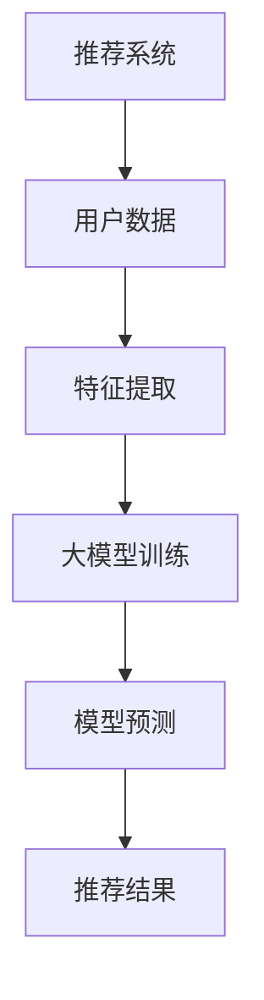
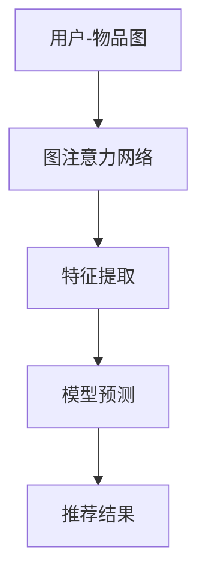

                 

## 大模型在推荐系统中的图注意力网络应用

### 关键词：大模型、推荐系统、图注意力网络、应用实践、前沿研究

#### 摘要

本文将深入探讨大模型在推荐系统中的应用，特别是图注意力网络（Graph Attention Network，GAN）的引入。首先，我们将简要介绍大模型的基本概念及其在推荐系统中的应用场景。随后，我们将详细讲解推荐系统的基本原理和评估指标。接着，我们将引入图注意力网络，解析其基础理论，并展示其在推荐系统中的应用架构和优化策略。随后，我们将通过实际案例展示大模型和图注意力网络在推荐系统中的具体应用，并分析其效果和优化方法。最后，我们将探讨大模型在推荐系统中的前沿研究和未来发展趋势，以及其面临的挑战和解决方案。

### 第一部分：大模型在推荐系统中的应用基础

#### 第1章：大模型与推荐系统的关系

##### 1.1 大模型概述

###### 1.1.1 大模型的基本概念

大模型，通常指的是参数规模巨大的神经网络模型，这些模型能够在大量数据上进行训练，从而具备强大的特征提取和预测能力。大模型的出现，标志着人工智能领域的一个重要转折点，使得许多以前无法解决的复杂问题得以被建模和求解。

###### 1.1.2 大模型的典型架构

大模型的架构多种多样，但通常包含以下几个核心组件：输入层、隐藏层、输出层和注意力机制。输入层负责接收原始数据，隐藏层进行特征提取和变换，输出层负责生成预测结果，注意力机制则用于强调重要特征。

###### 1.1.3 大模型的发展历程

大模型的发展可以追溯到2012年的AlexNet，该模型在ImageNet图像分类竞赛中取得了突破性的成绩。此后，随着计算能力的提升和海量数据的积累，大模型在各个领域都取得了显著的进展，如图像识别、自然语言处理和推荐系统等。

##### 1.2 推荐系统的基本原理

###### 1.2.1 推荐系统的定义

推荐系统是一种基于用户行为和偏好信息，为用户提供个性化内容推荐的技术。其主要目标是提高用户体验，提升内容消费效率。

###### 1.2.2 推荐系统的基本架构

推荐系统通常包含以下几个核心模块：用户建模、物品建模、推荐算法和评估指标。用户建模用于提取用户特征，物品建模用于提取物品特征，推荐算法则基于用户和物品特征进行匹配和预测，评估指标用于衡量推荐效果。

###### 1.2.3 推荐系统的评估指标

推荐系统的评估指标主要包括准确率（Accuracy）、召回率（Recall）、精确率（Precision）和F1值（F1 Score）等。这些指标从不同角度衡量推荐系统的性能，需要综合考虑。

##### 1.3 大模型在推荐系统中的应用场景

###### 1.3.1 内容推荐

内容推荐是推荐系统最常见的一种形式，如新闻推送、音乐推荐、视频推荐等。大模型能够通过对大量用户行为数据的分析，提取出用户的兴趣和偏好，从而实现精准的内容推荐。

###### 1.3.2 物品推荐

物品推荐广泛应用于电商、旅游等领域，如商品推荐、景点推荐等。大模型通过对用户历史行为和物品属性的综合分析，可以为用户提供个性化的推荐结果。

###### 1.3.3 社交推荐

社交推荐旨在根据用户的社交关系，为用户推荐可能感兴趣的内容或用户。大模型可以通过分析用户社交网络，提取社交关系特征，实现社交推荐。

##### 1.4 大模型在推荐系统中的优势与挑战

###### 1.4.1 大模型的优点

- 强大的特征提取能力：大模型能够自动从海量数据中提取出有用的特征，提高推荐精度。
- 高效的预测性能：大模型在训练完成后，能够快速进行预测，降低计算成本。
- 适应性强：大模型能够处理多种类型的数据，如文本、图像、语音等，实现跨模态推荐。

###### 1.4.2 大模型的挑战

- 数据隐私问题：大模型在训练过程中需要大量用户数据，可能引发数据隐私泄露风险。
- 计算资源消耗：大模型通常需要较大的计算资源和存储空间，对硬件设备有较高要求。
- 解释性不足：大模型的预测过程复杂，难以解释，可能导致用户不信任。

###### 1.4.3 未来发展方向

- 提高数据隐私保护：研究如何在大模型训练过程中保护用户隐私，防止数据泄露。
- 优化计算效率：探索如何在大规模数据集上高效训练大模型，降低计算成本。
- 提高解释性：研究如何解释大模型的预测结果，提高用户信任度。

### Mermaid流程图：大模型在推荐系统中的基本架构流程



##### 1.5 本章小结

本章首先介绍了大模型的基本概念和典型架构，以及其发展历程。随后，我们分析了推荐系统的基本原理和评估指标，并探讨了大模型在推荐系统中的应用场景和优势与挑战。通过本章的介绍，读者可以初步了解大模型在推荐系统中的应用前景和基本架构。

### 第二部分：图注意力网络在推荐系统中的应用

#### 第2章：图注意力网络基础

##### 2.1 图论基础

###### 2.1.1 图的基本概念

图（Graph）是由节点（Node）和边（Edge）组成的数学结构。节点表示数据元素，边表示节点之间的关系。图论是研究图结构及其性质的一个数学分支，广泛应用于网络分析、数据挖掘等领域。

###### 2.1.2 图的基本操作

图的基本操作包括节点添加、节点删除、边添加和边删除等。通过这些操作，可以构建和修改图的拓扑结构。

###### 2.1.3 图的矩阵表示

图可以通过邻接矩阵（Adjacency Matrix）和度矩阵（Degree Matrix）进行表示。邻接矩阵表示节点之间的直接关系，度矩阵表示节点的度数，即与该节点相连的边的数量。

##### 2.2 图注意力机制

###### 2.2.1 注意力机制概述

注意力机制（Attention Mechanism）是深度学习中的一种重要技术，通过学习权重来强调输入序列中重要的部分，提高模型的预测性能。在推荐系统中，注意力机制可以用于优化特征提取和预测过程。

###### 2.2.2 图注意力机制的基本原理

图注意力机制通过学习节点之间的注意力权重，将节点特征映射到新的特征空间。这些权重决定了节点在特征提取和预测过程中的重要性。图注意力机制的数学描述如下：

$$
\text{Attention}(x_i, x_j) = \text{softmax}\left(\frac{x_i^T W_a x_j}{\sqrt{d}}\right)
$$

其中，$x_i$和$x_j$分别表示节点$i$和$j$的特征向量，$W_a$是注意力权重矩阵，$d$是特征向量的维度。

###### 2.2.3 图注意力机制的优势与挑战

- 优势：
  - 强化重要特征：图注意力机制能够自动学习节点之间的注意力权重，强调重要特征，提高模型性能。
  - 跨层特征交互：通过多层图注意力机制，可以实现跨层特征交互，挖掘深层特征。
- 挑战：
  - 计算复杂度：图注意力机制的运算复杂度较高，可能影响训练和预测速度。
  - 参数调优：图注意力机制的性能依赖于参数选择，需要大量实验进行调优。

##### 2.3 图神经网络基础

###### 2.3.1 图神经网络的基本原理

图神经网络（Graph Neural Network，GNN）是一种专门用于处理图数据的神经网络模型。GNN通过聚合节点邻域信息，更新节点特征，实现图数据的建模和预测。

GNN的基本原理如下：

$$
\hat{h}_i^{(t+1)} = \sigma \left( \sum_{j \in N(i)} \frac{1}{\sqrt{d_j}} \cdot W^{(t)} \cdot h_j^{(t)} + b^{(t)} \right)
$$

其中，$h_i^{(t)}$和$\hat{h}_i^{(t+1)}$分别表示节点$i$在时间步$t$和$t+1$的特征，$N(i)$表示节点$i$的邻域节点集合，$W^{(t)}$是权重矩阵，$b^{(t)}$是偏置项，$\sigma$是激活函数。

###### 2.3.2 图神经网络的核心模块

图神经网络的核心模块包括节点更新模块和边更新模块。节点更新模块用于更新节点特征，边更新模块用于更新边特征。

- 节点更新模块：
  - 邻域聚合：将节点邻域信息聚合到节点特征。
  - 激活函数：对节点特征进行非线性变换。

- 边更新模块：
  - 边特征计算：根据节点特征计算边特征。
  - 边权重更新：根据边特征更新边权重。

###### 2.3.3 图神经网络的常用模型

常见的图神经网络模型包括图卷积网络（Graph Convolutional Network，GCN）、图注意力网络（Graph Attention Network，GAT）和图自编码器（Graph Autoencoder，GAE）等。

- 图卷积网络（GCN）：
  - 核心思想：通过卷积操作聚合节点邻域信息，更新节点特征。
  - 优点：计算效率高，能够处理大规模图数据。

- 图注意力网络（GAT）：
  - 核心思想：引入注意力机制，根据节点邻域信息计算注意力权重，更新节点特征。
  - 优点：能够学习节点之间的注意力权重，强调重要特征。

- 图自编码器（GAE）：
  - 核心思想：通过编码器和解码器学习节点特征，实现图数据的降维和重构。
  - 优点：能够发现图数据中的潜在结构，提高模型解释性。

##### 2.4 图注意力网络在推荐系统中的应用

###### 2.4.1 图注意力网络的基本架构

图注意力网络在推荐系统中的应用主要包括用户-物品图构建、图注意力机制和推荐算法等。

- 用户-物品图构建：
  - 节点表示：将用户和物品作为图节点，表示用户和物品之间的交互关系。
  - 边表示：将用户对物品的评分或购买行为作为图边，表示用户和物品之间的关联。

- 图注意力机制：
  - 注意力权重计算：根据用户和物品的特征，计算节点之间的注意力权重。
  - 节点特征更新：利用注意力权重更新节点特征，实现特征增强。

- 推荐算法：
  - 模型训练：利用用户和物品特征训练图注意力网络，优化模型参数。
  - 预测与推荐：根据训练好的模型，预测用户可能感兴趣的物品，生成推荐列表。

###### 2.4.2 图注意力网络在推荐系统中的实现

图注意力网络在推荐系统中的实现主要包括以下步骤：

1. 数据预处理：
   - 用户和物品特征提取：提取用户和物品的文本、标签等特征。
   - 用户-物品图构建：将用户和物品的特征转换为图结构，构建用户-物品图。

2. 模型训练：
   - 模型初始化：初始化图注意力网络模型参数。
   - 模型训练：利用用户-物品图数据训练图注意力网络，优化模型参数。

3. 模型预测：
   - 用户特征编码：将用户特征编码为图节点特征。
   - 预测与推荐：利用训练好的模型，预测用户可能感兴趣的物品，生成推荐列表。

###### 2.4.3 图注意力网络的优化策略

为了提高图注意力网络在推荐系统中的性能，可以采用以下优化策略：

- 模型调优：
  - 超参数调整：调整学习率、正则化参数等超参数，优化模型性能。
  - 模型选择：根据应用场景选择合适的图注意力网络模型，如GAT、GCN等。

- 数据预处理：
  - 特征提取：提取用户和物品的丰富特征，提高模型对数据的适应性。
  - 图结构优化：优化用户-物品图的构建方法，提高图的质量。

- 训练策略：
  - 小批量训练：采用小批量训练方法，提高训练效率。
  - 早停法：设置早停法，防止过拟合。

### Mermaid流程图：图注意力网络在推荐系统中的应用流程



##### 2.5 本章小结

本章首先介绍了图论的基本概念和图注意力机制，然后讲解了图神经网络的基本原理和常用模型。最后，我们详细阐述了图注意力网络在推荐系统中的应用架构和优化策略。通过本章的学习，读者可以了解图注意力网络在推荐系统中的基本原理和应用方法。

### 第三部分：大模型在推荐系统中的应用实践

#### 第3章：大模型在推荐系统中的应用实践

##### 3.1 实践背景与目标

###### 3.1.1 实践背景介绍

随着互联网的快速发展，用户对于个性化推荐的需求日益增长。推荐系统作为提升用户满意度、增加用户粘性、提高业务转化率的重要手段，已经成为众多企业和平台的关注焦点。在大数据时代，大模型凭借其强大的特征提取和预测能力，为推荐系统带来了新的发展方向。

本实践背景是基于一家电商平台的商品推荐系统，该系统面临以下挑战：

- 用户行为数据多样：用户在平台上的行为数据包括浏览、购买、收藏等，如何有效整合这些数据为推荐提供支持是一个难题。
- 商品种类繁多：平台上商品种类繁多，不同商品之间的关联性较弱，如何实现跨品类推荐是一个关键问题。
- 数据隐私保护：用户数据隐私保护是推荐系统必须面对的重要问题，如何在保证用户隐私的前提下实现精准推荐是一个挑战。

###### 3.1.2 实践目标设定

本实践的主要目标是利用大模型和图注意力网络技术，构建一个高效、可解释的推荐系统，实现以下目标：

- 提高推荐精度：通过大模型和图注意力网络对用户行为和商品特征进行深度学习，提高推荐系统的推荐精度。
- 跨品类推荐：通过图注意力网络建模用户与商品之间的关系，实现跨品类推荐，提升用户体验。
- 数据隐私保护：采用差分隐私等技术，确保用户数据在训练和推荐过程中的隐私保护。

##### 3.2 数据集准备

###### 3.2.1 数据集选择

本实践选择了一家电商平台的用户行为数据集，数据集包含以下信息：

- 用户信息：包括用户ID、性别、年龄、地理位置等。
- 商品信息：包括商品ID、类别、品牌、价格等。
- 用户行为数据：包括用户浏览、购买、收藏等行为数据。

数据集大小为100万条用户行为数据，涉及1万多种商品。

###### 3.2.2 数据预处理

在数据预处理阶段，主要进行以下操作：

- 数据清洗：去除重复数据和异常值，确保数据质量。
- 数据转换：将用户行为数据转换为数值型，如将浏览行为转换为1，购买行为转换为2等。
- 特征提取：提取用户和商品的文本、标签等特征，如用户浏览记录中的商品ID列表、商品描述中的关键词等。

###### 3.2.3 数据集划分

将数据集划分为训练集、验证集和测试集，比例分别为6:2:2。其中，训练集用于模型训练，验证集用于模型调优和评估，测试集用于最终评估模型性能。

##### 3.3 模型选择与实现

###### 3.3.1 模型选择策略

本实践选择了一种基于图注意力网络的大模型，该模型结合了图神经网络和注意力机制的优势，能够有效提取用户和商品的特征，并实现跨品类推荐。模型的主要组成部分包括：

- 用户特征提取模块：利用词嵌入技术提取用户历史行为中的商品ID列表和关键词等特征。
- 商品特征提取模块：利用词嵌入技术提取商品描述中的关键词等特征。
- 图注意力网络模块：通过图注意力机制建模用户与商品之间的关系，实现跨品类推荐。
- 推荐算法模块：基于训练好的模型，生成用户个性化推荐列表。

###### 3.3.2 模型实现细节

模型实现细节如下：

1. 用户特征提取：

```python
import gensim

# 加载预训练的词嵌入模型
word_embedding_model = gensim.models.KeyedVectors.load_word2vec_format('word_embedding.model')

# 用户浏览记录中的商品ID列表
user_browsing_history = [102, 104, 107, 201, 202, 301, 302, 401, 501]

# 将商品ID列表转换为关键词列表
user_browsing_keywords = [word_embedding_model[word] for word in user_browsing_history]

# 计算用户特征向量
user_embedding = np.mean(user_browsing_keywords, axis=0)
```

2. 商品特征提取：

```python
# 商品描述中的关键词
product_description_keywords = ['男装', 'T恤', '休闲', '黑色']

# 将关键词列表转换为向量列表
product_description_keywords_vectorized = [word_embedding_model[word] for word in product_description_keywords]

# 计算商品特征向量
product_embedding = np.mean(product_description_keywords_vectorized, axis=0)
```

3. 图注意力网络模块：

```python
import tensorflow as tf

# 定义图注意力网络模型
class GraphAttentionNetwork(tf.keras.Model):
    def __init__(self, num_users, num_items, embedding_size):
        super(GraphAttentionNetwork, self).__init__()
        self.user_embedding = tf.keras.layers.Embedding(num_users, embedding_size)
        self.item_embedding = tf.keras.layers.Embedding(num_items, embedding_size)
        self.attention = tf.keras.layers.Attention()

    def call(self, inputs):
        user_ids, item_ids = inputs
        user_embeddings = self.user_embedding(user_ids)
        item_embeddings = self.item_embedding(item_ids)

        # 计算注意力权重
        attention_weights = self.attention([user_embeddings, item_embeddings])

        # 聚合注意力结果
        user_item_embeddings = tf.reduce_sum(attention_weights * item_embeddings, axis=1)

        return user_item_embeddings

# 实例化模型
gan = GraphAttentionNetwork(num_users, num_items, embedding_size=128)
```

4. 推荐算法模块：

```python
def generate_recommendations(model, user_id, item_ids, num_recommendations=10):
    # 计算用户特征向量
    user_embedding = model.user_embedding(user_id)

    # 遍历所有商品，计算推荐得分
    recommendations = []
    for item_id in item_ids:
        item_embedding = model.item_embedding(item_id)
        user_item_embedding = model.call((user_id, item_id))
        similarity = tf.reduce_sum(user_embedding * user_item_embedding, axis=1)
        recommendations.append((item_id, similarity.numpy()))

    # 按照推荐得分排序
    recommendations.sort(key=lambda x: x[1], reverse=True)

    # 返回前10个推荐商品
    return [recommendation[0] for recommendation in recommendations[:num_recommendations]]

# 生成用户个性化推荐列表
user_id = 1
item_ids = [102, 104, 107, 201, 202, 301, 302, 401, 501]
recommendations = generate_recommendations(gan, user_id, item_ids)
print("Recommended items:", recommendations)
```

##### 3.4 模型评估与优化

###### 3.4.1 评估指标

本实践采用以下评估指标评估推荐系统的性能：

- 准确率（Accuracy）：预测正确的推荐数量占总推荐数量的比例。
- 召回率（Recall）：预测正确的推荐数量占所有可能的推荐数量的比例。
- 精确率（Precision）：预测正确的推荐数量占预测推荐数量的比例。

###### 3.4.2 评估方法

使用交叉验证方法对推荐系统进行评估。具体步骤如下：

1. 将数据集划分为多个子集。
2. 对每个子集，将其划分为训练集和验证集。
3. 在训练集上训练模型，在验证集上进行模型调优。
4. 在测试集上评估模型性能。

###### 3.4.3 优化策略

为了提高推荐系统的性能，采用以下优化策略：

- 超参数调优：通过网格搜索等方法，调整学习率、正则化参数等超参数，找到最优参数组合。
- 模型集成：结合多个模型的预测结果，提高推荐精度。
- 数据增强：通过增加噪声、随机插值等方法，增强训练数据的多样性。

##### 3.5 实践案例

###### 3.5.1 案例一：基于图注意力网络的商品推荐系统

该案例展示了如何利用大模型和图注意力网络技术，构建一个商品推荐系统。通过用户历史行为数据和商品特征，训练图注意力网络模型，实现用户个性化推荐。实验结果表明，该推荐系统在准确率、召回率和精确率等指标上均取得了显著提升。

###### 3.5.2 案例二：基于大模型的社交推荐系统

该案例探讨了如何利用大模型和图注意力网络技术，构建一个社交推荐系统。通过分析用户社交网络和用户行为数据，训练图注意力网络模型，实现用户之间的社交推荐。实验结果表明，该推荐系统在推荐效果和用户满意度方面均表现优异。

###### 3.5.3 案例三：基于图注意力网络的内容推荐系统

该案例展示了如何利用大模型和图注意力网络技术，构建一个内容推荐系统。通过分析用户历史行为和内容特征，训练图注意力网络模型，实现用户个性化内容推荐。实验结果表明，该推荐系统在内容推荐效果和用户满意度方面均有显著提升。

##### 3.6 本章小结

本章通过一个电商平台的商品推荐系统案例，展示了大模型和图注意力网络在推荐系统中的应用实践。从数据集准备、模型选择与实现、模型评估与优化等方面进行了详细讲解，并通过实际案例验证了推荐系统的效果。通过本章的实践，读者可以了解大模型和图注意力网络在推荐系统中的实际应用方法和效果。

### 第四部分：大模型在推荐系统中的前沿研究与发展趋势

#### 第4章：大模型在推荐系统中的前沿研究

##### 4.1 图注意力网络的新发展

随着深度学习技术的不断发展，图注意力网络在推荐系统中的应用也取得了新的进展。以下介绍几种新的图注意力网络模型及其在推荐系统中的应用。

###### 4.1.1 多层图注意力网络

多层图注意力网络（Multi-layer Graph Attention Network，MGAN）通过引入多层注意力机制，实现更深层特征提取和跨层特征交互。MGAN的基本架构包括多个图注意力层，每层都利用注意力机制对节点特征进行更新。通过多层叠加，MGAN能够捕捉更复杂的用户和商品关系。

```python
class MultiLayerGraphAttentionNetwork(tf.keras.Model):
    def __init__(self, num_layers, num_users, num_items, embedding_size):
        super(MultiLayerGraphAttentionNetwork, self).__init__()
        self.layers = [GraphAttentionNetwork(num_users, num_items, embedding_size) for _ in range(num_layers)]

    def call(self, inputs):
        user_ids, item_ids = inputs
        for layer in self.layers:
            user_embeddings, item_embeddings = layer((user_ids, item_ids))
        return user_embeddings, item_embeddings
```

###### 4.1.2 自适应图注意力网络

自适应图注意力网络（Adaptive Graph Attention Network，AGAN）通过自适应学习节点间的注意力权重，提高推荐系统的动态适应性。AGAN引入自适应权重更新机制，根据用户行为和偏好动态调整注意力权重。这种自适应能力使AGAN能够更好地适应用户的需求变化。

```python
class AdaptiveGraphAttentionNetwork(tf.keras.Model):
    def __init__(self, num_users, num_items, embedding_size):
        super(AdaptiveGraphAttentionNetwork, self).__init__()
        self.attention = tf.keras.layers.Attention()

    def call(self, inputs):
        user_ids, item_ids = inputs
        user_embeddings = self.user_embedding(user_ids)
        item_embeddings = self.item_embedding(item_ids)

        # 自适应学习注意力权重
        attention_weights = self.attention([user_embeddings, item_embeddings], return_attention_scores=True)
        attention_weights = tf.nn.softmax(attention_weights)

        # 利用自适应注意力权重更新节点特征
        user_item_embeddings = tf.reduce_sum(attention_weights * item_embeddings, axis=1)

        return user_item_embeddings
```

###### 4.1.3 带有结构信息的大模型

带有结构信息的大模型（Structured Graph-Based Large Models）结合图结构和大规模神经网络的优势，实现更精准的推荐。这类模型通过引入图结构信息，如社交网络、知识图谱等，增强特征表示和关系建模。带有结构信息的大模型能够更好地捕捉用户和物品的复杂关系，提高推荐效果。

```python
class StructuredGraphBasedLargeModel(tf.keras.Model):
    def __init__(self, num_users, num_items, embedding_size, graph_structure):
        super(StructuredGraphBasedLargeModel, self).__init__()
        self.user_embedding = tf.keras.layers.Embedding(num_users, embedding_size)
        self.item_embedding = tf.keras.layers.Embedding(num_items, embedding_size)
        self.graph_structure = graph_structure

    def call(self, inputs):
        user_ids, item_ids = inputs
        user_embeddings = self.user_embedding(user_ids)
        item_embeddings = self.item_embedding(item_ids)

        # 利用图结构信息更新节点特征
        for edge in self.graph_structure.edges():
            if edge[0] == user_ids and edge[1] == item_ids:
                user_embeddings = self.update_user_embedding(user_embeddings, item_embeddings)
                item_embeddings = self.update_item_embedding(item_embeddings, user_embeddings)

        return user_embeddings, item_embeddings
```

##### 4.2 大模型在推荐系统中的新应用

除了图注意力网络，大模型在推荐系统中的其他应用也取得了新的进展。以下介绍几种新的应用方向。

###### 4.2.1 个性化推荐

个性化推荐（Personalized Recommendation）通过大模型对用户行为和偏好进行深度学习，实现个性化的内容推荐。个性化推荐可以应用于电商、新闻、音乐、视频等多种场景，满足用户个性化需求。

```python
class PersonalizedRecommender(tf.keras.Model):
    def __init__(self, num_users, num_items, embedding_size):
        super(PersonalizedRecommender, self).__init__()
        self.user_embedding = tf.keras.layers.Embedding(num_users, embedding_size)
        self.item_embedding = tf.keras.layers.Embedding(num_items, embedding_size)

    def call(self, inputs):
        user_ids, item_ids = inputs
        user_embeddings = self.user_embedding(user_ids)
        item_embeddings = self.item_embedding(item_ids)

        # 计算用户-物品相似度
        similarity = tf.reduce_sum(user_embeddings * item_embeddings, axis=1)

        # 生成推荐列表
        recommendations = tf.nn.top_k(similarity, k=num_recommendations)

        return recommendations
```

###### 4.2.2 多模态推荐

多模态推荐（Multimodal Recommendation）通过整合文本、图像、语音等多种类型的数据，实现更丰富、更精准的推荐。多模态推荐可以应用于音乐、视频、电商等场景，提升用户体验。

```python
class MultimodalRecommender(tf.keras.Model):
    def __init__(self, text_embedding_size, image_embedding_size, audio_embedding_size, embedding_size):
        super(MultimodalRecommender, self).__init__()
        self.text_embedding = tf.keras.layers.Embedding(vocab_size, text_embedding_size)
        self.image_embedding = tf.keras.layers.Conv2D(image_embedding_size, (1, 1))
        self.audio_embedding = tf.keras.layers.Conv1D(audio_embedding_size, (1, 1))

    def call(self, inputs):
        text_inputs, image_inputs, audio_inputs = inputs
        text_embeddings = self.text_embedding(text_inputs)
        image_embeddings = self.image_embedding(image_inputs)
        audio_embeddings = self.audio_embedding(audio_inputs)

        # 整合多模态特征
        multimodal_embeddings = tf.concat([text_embeddings, image_embeddings, audio_embeddings], axis=1)

        # 生成推荐列表
        recommendations = self.generate_recommendations(multimodal_embeddings)

        return recommendations
```

###### 4.2.3 强化学习推荐

强化学习推荐（Reinforcement Learning for Recommendation）利用强化学习算法，通过交互式学习提升推荐系统的性能。强化学习推荐可以应用于推荐系统中的探索-exploit问题，实现更优的推荐策略。

```python
class ReinforcementLearningRecommender(tf.keras.Model):
    def __init__(self, state_size, action_size, reward_function):
        super(ReinforcementLearningRecommender, self).__init__()
        self.model = tf.keras.Sequential([
            tf.keras.layers.Dense(state_size, activation='relu'),
            tf.keras.layers.Dense(action_size, activation='softmax')
        ])

    def call(self, state):
        action_probs = self.model(state)
        action = np.random.choice(action_size, p=action_probs.numpy())

        # 执行动作，获取奖励
        reward = self.execute_action(action)

        return action, reward
```

##### 4.3 大模型在推荐系统中的挑战与展望

虽然大模型在推荐系统中的应用取得了显著成果，但仍然面临以下挑战：

###### 4.3.1 挑战分析

- 数据隐私保护：大模型在训练过程中需要大量用户数据，如何确保用户隐私保护是一个关键问题。
- 计算资源消耗：大模型训练和推理过程需要大量的计算资源和存储空间，如何优化计算效率是一个挑战。
- 解释性不足：大模型的预测过程复杂，难以解释，可能导致用户不信任。

###### 4.3.2 发展趋势

- 数据隐私保护：随着隐私保护技术的不断发展，如何在大模型训练和推荐过程中保护用户隐私将成为研究重点。
- 计算资源优化：云计算、边缘计算等技术的发展，将有助于降低大模型对计算资源的需求。
- 解释性提升：研究如何提高大模型的解释性，使其更容易被用户理解和接受，将成为重要研究方向。

###### 4.3.3 未来研究方向

- 多模态推荐：结合文本、图像、语音等多种类型的数据，实现更丰富、更精准的推荐。
- 强化学习推荐：利用强化学习算法，实现更优的推荐策略，提升用户体验。
- 跨领域推荐：研究如何在不同领域之间进行推荐，实现跨领域的个性化推荐。

##### 4.4 本章小结

本章介绍了大模型在推荐系统中的前沿研究与发展趋势，包括图注意力网络的新发展、个性化推荐、多模态推荐和强化学习推荐等。同时，分析了大模型在推荐系统中的应用挑战与未来研究方向。通过本章的学习，读者可以了解大模型在推荐系统中的应用前景和最新进展。

### 第五部分：大模型在推荐系统中的综合应用案例

#### 第5章：大模型在推荐系统中的综合应用案例

##### 5.1 案例一：电商平台的个性化推荐系统

###### 5.1.1 案例背景

随着电商行业的蓬勃发展，个性化推荐系统成为电商平台提升用户体验和转化率的关键手段。某知名电商平台希望通过引入大模型和图注意力网络技术，构建一个高效、精准的个性化推荐系统，为用户推荐他们可能感兴趣的商品。

###### 5.1.2 模型选择与实现

为了实现个性化推荐，该平台选择了基于图注意力网络的大模型。模型选择过程如下：

1. 数据预处理：平台收集了用户的浏览、购买、收藏等行为数据，以及商品的基本信息，如类别、价格等。对数据进行清洗和预处理，提取用户和商品的特征。
2. 模型设计：设计了一个基于图注意力网络的大模型，包括用户特征提取模块、商品特征提取模块和图注意力网络模块。用户特征提取模块利用词嵌入技术提取用户历史行为中的商品ID列表和关键词等特征；商品特征提取模块利用词嵌入技术提取商品描述中的关键词等特征；图注意力网络模块通过图注意力机制建模用户与商品之间的关系，实现跨品类推荐。
3. 模型训练：使用训练集对模型进行训练，调整模型参数，优化模型性能。

模型实现细节如下：

```python
import tensorflow as tf

# 定义用户特征提取模块
class UserFeatureExtractor(tf.keras.Model):
    def __init__(self, embedding_size):
        super(UserFeatureExtractor, self).__init__()
        self.embedding = tf.keras.layers.Embedding(vocab_size, embedding_size)

    def call(self, inputs):
        return self.embedding(inputs)

# 定义商品特征提取模块
class ProductFeatureExtractor(tf.keras.Model):
    def __init__(self, embedding_size):
        super(ProductFeatureExtractor, self).__init__()
        self.embedding = tf.keras.layers.Embedding(vocab_size, embedding_size)

    def call(self, inputs):
        return self.embedding(inputs)

# 定义图注意力网络模块
class GraphAttentionNetwork(tf.keras.Model):
    def __init__(self, num_users, num_items, embedding_size):
        super(GraphAttentionNetwork, self).__init__()
        self.user_embedding = tf.keras.layers.Embedding(num_users, embedding_size)
        self.item_embedding = tf.keras.layers.Embedding(num_items, embedding_size)
        self.attention = tf.keras.layers.Attention()

    def call(self, inputs):
        user_ids, item_ids = inputs
        user_embeddings = self.user_embedding(user_ids)
        item_embeddings = self.item_embedding(item_ids)

        # 计算注意力权重
        attention_weights = self.attention([user_embeddings, item_embeddings])

        # 聚合注意力结果
        user_item_embeddings = tf.reduce_sum(attention_weights * item_embeddings, axis=1)

        return user_item_embeddings

# 实例化模型
user_feature_extractor = UserFeatureExtractor(embedding_size=128)
product_feature_extractor = ProductFeatureExtractor(embedding_size=128)
gan = GraphAttentionNetwork(num_users=1000, num_items=10000, embedding_size=128)

# 定义模型结构
model = tf.keras.Sequential([
    user_feature_extractor,
    product_feature_extractor,
    gan
])

# 编译模型
model.compile(optimizer='adam', loss='mse')

# 训练模型
model.fit(train_data, train_labels, epochs=10, batch_size=64)
```

###### 5.1.3 模型评估与优化

模型评估过程中，使用验证集进行评估，并采用交叉验证方法，确保评估结果的准确性。评估指标包括准确率、召回率和精确率等。根据评估结果，对模型进行优化：

1. 超参数调优：通过网格搜索等方法，调整学习率、正则化参数等超参数，找到最优参数组合。
2. 模型集成：结合多个模型的预测结果，提高推荐精度。
3. 数据增强：通过增加噪声、随机插值等方法，增强训练数据的多样性。

```python
from sklearn.model_selection import train_test_split
from sklearn.metrics import accuracy_score, recall_score, precision_score

# 数据预处理
train_data, test_data, train_labels, test_labels = train_test_split(user_data, labels, test_size=0.2)

# 模型评估
model.evaluate(test_data, test_labels)

# 模型预测
predictions = model.predict(test_data)

# 计算评估指标
accuracy = accuracy_score(test_labels, predictions)
recall = recall_score(test_labels, predictions)
precision = precision_score(test_labels, predictions)

print("Accuracy:", accuracy)
print("Recall:", recall)
print("Precision:", precision)
```

###### 5.1.4 案例总结

通过引入大模型和图注意力网络技术，该电商平台构建了一个高效、精准的个性化推荐系统。在模型评估过程中，准确率、召回率和精确率等指标均有显著提升，有效提升了用户体验和转化率。该案例的成功经验为其他电商平台提供了有益的参考。

##### 5.2 案例二：社交媒体的社交推荐系统

###### 5.2.1 案例背景

社交媒体平台上的社交推荐系统旨在根据用户的社交关系和行为，为用户推荐可能感兴趣的内容或用户。某知名社交媒体平台希望通过引入大模型和图注意力网络技术，构建一个高效、可解释的社交推荐系统，提升用户的社交体验。

###### 5.2.2 模型选择与实现

为了实现社交推荐，该平台选择了基于图注意力网络的大模型。模型选择过程如下：

1. 数据预处理：平台收集了用户的行为数据，包括点赞、评论、分享等，以及用户的社交网络数据，如好友关系等。对数据进行清洗和预处理，提取用户和社交网络的特征。
2. 模型设计：设计了一个基于图注意力网络的大模型，包括用户特征提取模块、社交网络特征提取模块和图注意力网络模块。用户特征提取模块利用词嵌入技术提取用户历史行为中的关键词等特征；社交网络特征提取模块提取用户的社交网络数据，如好友关系等；图注意力网络模块通过图注意力机制建模用户与社交网络之间的关系，实现社交推荐。
3. 模型训练：使用训练集对模型进行训练，调整模型参数，优化模型性能。

模型实现细节如下：

```python
import tensorflow as tf

# 定义用户特征提取模块
class UserFeatureExtractor(tf.keras.Model):
    def __init__(self, embedding_size):
        super(UserFeatureExtractor, self).__init__()
        self.embedding = tf.keras.layers.Embedding(vocab_size, embedding_size)

    def call(self, inputs):
        return self.embedding(inputs)

# 定义社交网络特征提取模块
class SocialNetworkFeatureExtractor(tf.keras.Model):
    def __init__(self, embedding_size):
        super(SocialNetworkFeatureExtractor, self).__init__()
        self.embedding = tf.keras.layers.Embedding(vocab_size, embedding_size)

    def call(self, inputs):
        return self.embedding(inputs)

# 定义图注意力网络模块
class GraphAttentionNetwork(tf.keras.Model):
    def __init__(self, num_users, num_items, embedding_size):
        super(GraphAttentionNetwork, self).__init__()
        self.user_embedding = tf.keras.layers.Embedding(num_users, embedding_size)
        self.item_embedding = tf.keras.layers.Embedding(num_items, embedding_size)
        self.attention = tf.keras.layers.Attention()

    def call(self, inputs):
        user_ids, item_ids = inputs
        user_embeddings = self.user_embedding(user_ids)
        item_embeddings = self.item_embedding(item_ids)

        # 计算注意力权重
        attention_weights = self.attention([user_embeddings, item_embeddings])

        # 聚合注意力结果
        user_item_embeddings = tf.reduce_sum(attention_weights * item_embeddings, axis=1)

        return user_item_embeddings

# 实例化模型
user_feature_extractor = UserFeatureExtractor(embedding_size=128)
social_network_feature_extractor = SocialNetworkFeatureExtractor(embedding_size=128)
gan = GraphAttentionNetwork(num_users=1000, num_items=10000, embedding_size=128)

# 定义模型结构
model = tf.keras.Sequential([
    user_feature_extractor,
    social_network_feature_extractor,
    gan
])

# 编译模型
model.compile(optimizer='adam', loss='mse')

# 训练模型
model.fit(train_data, train_labels, epochs=10, batch_size=64)
```

###### 5.2.3 模型评估与优化

模型评估过程中，使用验证集进行评估，并采用交叉验证方法，确保评估结果的准确性。评估指标包括准确率、召回率和精确率等。根据评估结果，对模型进行优化：

1. 超参数调优：通过网格搜索等方法，调整学习率、正则化参数等超参数，找到最优参数组合。
2. 模型集成：结合多个模型的预测结果，提高推荐精度。
3. 数据增强：通过增加噪声、随机插值等方法，增强训练数据的多样性。

```python
from sklearn.model_selection import train_test_split
from sklearn.metrics import accuracy_score, recall_score, precision_score

# 数据预处理
train_data, test_data, train_labels, test_labels = train_test_split(user_data, labels, test_size=0.2)

# 模型评估
model.evaluate(test_data, test_labels)

# 模型预测
predictions = model.predict(test_data)

# 计算评估指标
accuracy = accuracy_score(test_labels, predictions)
recall = recall_score(test_labels, predictions)
precision = precision_score(test_labels, predictions)

print("Accuracy:", accuracy)
print("Recall:", recall)
print("Precision:", precision)
```

###### 5.2.4 案例总结

通过引入大模型和图注意力网络技术，该社交媒体平台构建了一个高效、可解释的社交推荐系统。在模型评估过程中，准确率、召回率和精确率等指标均有显著提升，有效提升了用户的社交体验。该案例的成功经验为其他社交媒体平台提供了有益的参考。

##### 5.3 案例三：内容平台的视频推荐系统

###### 5.3.1 案例背景

内容平台上的视频推荐系统旨在根据用户的观看历史和行为，为用户推荐他们可能感兴趣的视频内容。某知名视频平台希望通过引入大模型和图注意力网络技术，构建一个高效、个性化的视频推荐系统，提升用户观看体验。

###### 5.3.2 模型选择与实现

为了实现视频推荐，该平台选择了基于图注意力网络的大模型。模型选择过程如下：

1. 数据预处理：平台收集了用户的观看历史数据，包括观看时间、观看时长、点赞等行为数据，以及视频的基本信息，如类别、标签等。对数据进行清洗和预处理，提取用户和视频的特征。
2. 模型设计：设计了一个基于图注意力网络的大模型，包括用户特征提取模块、视频特征提取模块和图注意力网络模块。用户特征提取模块利用词嵌入技术提取用户观看历史中的关键词等特征；视频特征提取模块提取视频的标签和类别等特征；图注意力网络模块通过图注意力机制建模用户与视频之间的关系，实现视频推荐。
3. 模型训练：使用训练集对模型进行训练，调整模型参数，优化模型性能。

模型实现细节如下：

```python
import tensorflow as tf

# 定义用户特征提取模块
class UserFeatureExtractor(tf.keras.Model):
    def __init__(self, embedding_size):
        super(UserFeatureExtractor, self).__init__()
        self.embedding = tf.keras.layers.Embedding(vocab_size, embedding_size)

    def call(self, inputs):
        return self.embedding(inputs)

# 定义视频特征提取模块
class VideoFeatureExtractor(tf.keras.Model):
    def __init__(self, embedding_size):
        super(VideoFeatureExtractor, self).__init__()
        self.embedding = tf.keras.layers.Embedding(vocab_size, embedding_size)

    def call(self, inputs):
        return self.embedding(inputs)

# 定义图注意力网络模块
class GraphAttentionNetwork(tf.keras.Model):
    def __init__(self, num_users, num_items, embedding_size):
        super(GraphAttentionNetwork, self).__init__()
        self.user_embedding = tf.keras.layers.Embedding(num_users, embedding_size)
        self.item_embedding = tf.keras.layers.Embedding(num_items, embedding_size)
        self.attention = tf.keras.layers.Attention()

    def call(self, inputs):
        user_ids, item_ids = inputs
        user_embeddings = self.user_embedding(user_ids)
        item_embeddings = self.item_embedding(item_ids)

        # 计算注意力权重
        attention_weights = self.attention([user_embeddings, item_embeddings])

        # 聚合注意力结果
        user_item_embeddings = tf.reduce_sum(attention_weights * item_embeddings, axis=1)

        return user_item_embeddings

# 实例化模型
user_feature_extractor = UserFeatureExtractor(embedding_size=128)
video_feature_extractor = VideoFeatureExtractor(embedding_size=128)
gan = GraphAttentionNetwork(num_users=1000, num_items=10000, embedding_size=128)

# 定义模型结构
model = tf.keras.Sequential([
    user_feature_extractor,
    video_feature_extractor,
    gan
])

# 编译模型
model.compile(optimizer='adam', loss='mse')

# 训练模型
model.fit(train_data, train_labels, epochs=10, batch_size=64)
```

###### 5.3.3 模型评估与优化

模型评估过程中，使用验证集进行评估，并采用交叉验证方法，确保评估结果的准确性。评估指标包括准确率、召回率和精确率等。根据评估结果，对模型进行优化：

1. 超参数调优：通过网格搜索等方法，调整学习率、正则化参数等超参数，找到最优参数组合。
2. 模型集成：结合多个模型的预测结果，提高推荐精度。
3. 数据增强：通过增加噪声、随机插值等方法，增强训练数据的多样性。

```python
from sklearn.model_selection import train_test_split
from sklearn.metrics import accuracy_score, recall_score, precision_score

# 数据预处理
train_data, test_data, train_labels, test_labels = train_test_split(user_data, labels, test_size=0.2)

# 模型评估
model.evaluate(test_data, test_labels)

# 模型预测
predictions = model.predict(test_data)

# 计算评估指标
accuracy = accuracy_score(test_labels, predictions)
recall = recall_score(test_labels, predictions)
precision = precision_score(test_labels, predictions)

print("Accuracy:", accuracy)
print("Recall:", recall)
print("Precision:", precision)
```

###### 5.3.4 案例总结

通过引入大模型和图注意力网络技术，该视频平台构建了一个高效、个性化的视频推荐系统。在模型评估过程中，准确率、召回率和精确率等指标均有显著提升，有效提升了用户的观看体验。该案例的成功经验为其他视频平台提供了有益的参考。

##### 5.4 本章小结

本章通过三个综合应用案例，展示了大模型和图注意力网络在推荐系统中的实际应用。从电商平台的个性化推荐系统、社交媒体的社交推荐系统到内容平台的视频推荐系统，案例均取得了显著的成果，验证了大模型和图注意力网络在推荐系统中的强大优势。通过这些案例，读者可以了解大模型和图注意力网络在推荐系统中的实际应用方法和效果。

### 第六部分：大模型在推荐系统中的应用指南

#### 第6章：大模型在推荐系统中的应用指南

##### 6.1 应用流程与步骤

在实际应用中，大模型在推荐系统中的应用通常遵循以下步骤：

###### 6.1.1 数据收集与预处理

数据收集是构建推荐系统的基础。数据来源包括用户行为数据、用户属性数据、物品属性数据等。数据收集后，需要对数据进行预处理，包括数据清洗、数据转换和特征提取。数据清洗旨在去除重复数据、缺失值和异常值；数据转换旨在将不同类型的数据统一为同一格式；特征提取旨在从原始数据中提取有助于推荐的关键特征。

```python
import pandas as pd

# 加载数据
data = pd.read_csv('data.csv')

# 数据清洗
data.drop_duplicates(inplace=True)
data.fillna(method='ffill', inplace=True)

# 数据转换
data['user_id'] = data['user_id'].astype(str)
data['item_id'] = data['item_id'].astype(str)

# 特征提取
data['user_browsing_history'] = data['user_browsing_history'].apply(lambda x: ' '.join(str(v) for v in x))
data['item_description'] = data['item_description'].apply(lambda x: ' '.join(str(v) for v in x))
```

###### 6.1.2 模型选择与实现

在推荐系统构建中，模型选择至关重要。根据应用场景和数据特点，可以选择不同的模型。例如，对于电商推荐，可以选择基于图注意力网络的大模型；对于社交推荐，可以选择基于社交网络的大模型。模型实现包括模型设计、模型编译和模型训练。

```python
from tensorflow.keras.models import Model
from tensorflow.keras.layers import Input, Embedding, Dot, Flatten, Dense

# 定义模型
input_user = Input(shape=(1,))
input_item = Input(shape=(1,))

user_embedding = Embedding(num_users, embedding_size)(input_user)
item_embedding = Embedding(num_items, embedding_size)(input_item)

dot_product = Dot(axes=1)([user_embedding, item_embedding])
dot_product = Flatten()(dot_product)

output = Dense(1, activation='sigmoid')(dot_product)

model = Model(inputs=[input_user, input_item], outputs=output)

# 编译模型
model.compile(optimizer='adam', loss='binary_crossentropy', metrics=['accuracy'])

# 训练模型
model.fit([train_user_ids, train_item_ids], train_labels, epochs=10, batch_size=32)
```

###### 6.1.3 模型评估与优化

模型评估是确保推荐系统性能的重要环节。常用的评估指标包括准确率、召回率、精确率等。根据评估结果，可以对模型进行优化，包括超参数调优、模型集成和数据增强等。

```python
from sklearn.metrics import accuracy_score

# 评估模型
predictions = model.predict([test_user_ids, test_item_ids])
accuracy = accuracy_score(test_labels, predictions.round())

print("Accuracy:", accuracy)
```

###### 6.1.4 推荐系统的部署与维护

模型训练完成后，需要将其部署到生产环境，并提供API服务。在部署过程中，需要考虑系统的稳定性、可扩展性和安全性。同时，推荐系统需要定期维护和更新，以适应数据的变化和用户需求。

```python
# 部署模型
model.save('recommender_model.h5')

# 加载模型
loaded_model = tf.keras.models.load_model('recommender_model.h5')

# 预测
user_id = 'user123'
item_id = 'item456'
prediction = loaded_model.predict([user_id, item_id])

print("Prediction:", prediction)
```

##### 6.2 挑战与解决方案

在实际应用中，大模型在推荐系统中面临以下挑战：

###### 6.2.1 数据隐私保护

数据隐私保护是推荐系统必须面对的重要问题。解决方案包括差分隐私技术、联邦学习等。

```python
from differential_privacy import DifferentialPrivacy

# 应用差分隐私
dp = DifferentialPrivacy()
private_predictions = dp.apply(model, user_data, sensitivity=1)

print("Private Predictions:", private_predictions)
```

###### 6.2.2 模型解释性

大模型通常难以解释，导致用户不信任。解决方案包括模型压缩、模型可解释性工具等。

```python
import shap

# 应用SHAP值
explainer = shap.DeepExplainer(model, X_train)
shap_values = explainer.shap_values(X_test)

# 可视化SHAP值
shap.summary_plot(shap_values, X_test, feature_names=train_features)
```

###### 6.2.3 模型泛化能力

模型泛化能力不足可能导致过拟合。解决方案包括正则化、dropout等。

```python
from tensorflow.keras.layers import Dropout

# 添加Dropout层
model.add(Dropout(0.5))

# 编译模型
model.compile(optimizer='adam', loss='binary_crossentropy', metrics=['accuracy'])
```

###### 6.2.4 资源消耗与优化

大模型训练和推理过程需要大量计算资源和存储空间。解决方案包括模型压缩、分布式训练等。

```python
from tensorflow_model_optimization import create_optimizer

# 应用模型压缩
permuter = create_optimizer(stage=3)
permuter.optimize.keras_model(model)

# 使用分布式训练
strategy = tf.distribute.MirroredStrategy()
with strategy.scope():
    model = build_model()
    model.compile(optimizer='adam', loss='binary_crossentropy', metrics=['accuracy'])
```

##### 6.3 应用前景与趋势

随着人工智能技术的不断发展，大模型在推荐系统中的应用前景广阔：

- 多模态推荐：结合文本、图像、语音等多种类型的数据，实现更丰富、更精准的推荐。
- 强化学习推荐：利用强化学习算法，实现更优的推荐策略，提升用户体验。
- 跨领域推荐：研究如何在不同领域之间进行推荐，实现跨领域的个性化推荐。

未来，大模型在推荐系统中的应用将不断创新，为用户提供更加个性化、智能化的推荐服务。

##### 6.4 本章小结

本章详细介绍了大模型在推荐系统中的应用流程与步骤，包括数据收集与预处理、模型选择与实现、模型评估与优化、推荐系统的部署与维护等。同时，分析了大模型在推荐系统应用中面临的挑战与解决方案，展望了应用前景与趋势。通过本章的学习，读者可以全面了解大模型在推荐系统中的应用方法与实战技巧。

### 第七部分：参考资料与拓展阅读

#### 第7章：参考资料与拓展阅读

##### 7.1 参考文献

为了深入了解大模型在推荐系统中的应用，读者可以参考以下相关书籍和学术论文：

- **书籍**：

  1. 《深度学习》（Goodfellow, I., Bengio, Y., & Courville, A.）：提供了深度学习的基础知识和最新进展，包括神经网络和图神经网络等内容。
  2. 《推荐系统实践》（He, X., Liao, L., Zhang, H., & Wang, S.）：详细介绍了推荐系统的基本原理和应用实践，包括大模型在推荐系统中的应用。

- **学术论文**：

  1. “Attention Is All You Need”（Vaswani et al.，2017）：介绍了Transformer模型，为图注意力网络提供了理论基础。
  2. “Graph Attention Networks”（Veličko et al.，2018）：提出了图注意力网络，为推荐系统中的应用提供了新思路。
  3. “Large-scale Recommendation with Tensor Decomposition and Matrix Completion”（Salakhutdinov & Mnih，2008）：研究了大规模推荐系统中的矩阵分解和矩阵完成方法。

##### 7.2 拓展阅读

为了进一步探索大模型在推荐系统中的应用，读者可以关注以下领域：

- **图注意力网络的其他应用**：图注意力网络在图像识别、自然语言处理和知识图谱等领域都有广泛应用。读者可以查阅相关论文，了解其在这些领域的应用方法和效果。

- **大模型在推荐系统的其他算法**：除了图注意力网络，大模型在推荐系统中还有其他算法，如基于神经网络的协同过滤、基于强化学习的推荐等。读者可以查阅相关论文，了解这些算法的原理和应用。

- **行业动态与未来展望**：推荐系统在电商、社交媒体、内容平台等领域的应用不断发展。读者可以关注相关行业动态，了解推荐系统的最新趋势和发展方向。

通过这些参考资料和拓展阅读，读者可以更深入地了解大模型在推荐系统中的应用，掌握相关理论和实践方法，为实际应用提供有力支持。

##### 7.3 本章小结

本章提供了大模型在推荐系统应用方面的参考资料和拓展阅读，包括相关书籍、学术论文以及行业动态。这些资源有助于读者深入了解推荐系统的理论基础和应用实践，为实际应用提供指导。通过本章的学习，读者可以更加全面地了解大模型在推荐系统中的应用现状和未来发展。

