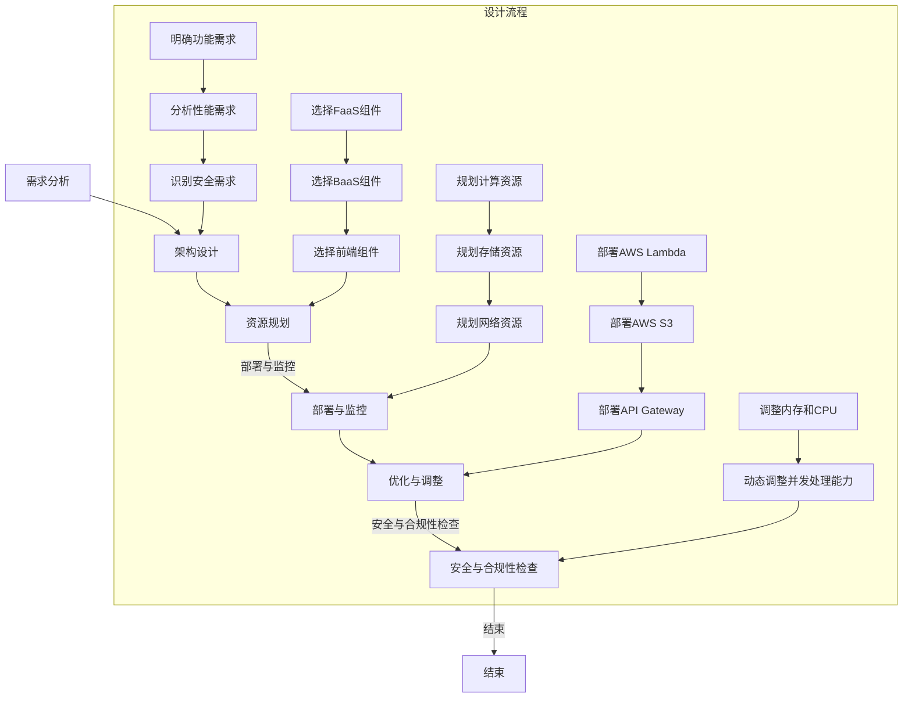

                 

# 大模型软件的无服务器架构优化策略

## 关键词

无服务器架构，大模型软件，资源管理，性能优化，安全性优化，弹性扩展，故障恢复

## 摘要

本文旨在探讨大模型软件在无服务器架构中的优化策略。随着云计算和容器技术的发展，无服务器架构逐渐成为分布式系统设计的首选。然而，大模型软件由于其庞大的计算需求和复杂的运行时环境，对无服务器架构提出了更高的要求。本文首先介绍了无服务器架构的基本概念和优势，然后分析了大模型软件的需求和现状。接着，文章详细阐述了资源管理、性能优化、安全性优化以及弹性扩展与故障恢复等方面的优化策略。通过实际项目案例，本文展示了这些策略的具体应用，并展望了无服务器架构与大模型软件发展的未来趋势。

----------------------------------------------------------------

## 目录大纲

### 《大模型软件的无服务器架构优化策略》目录大纲

### 第一部分：背景与概述

### 第1章：无服务器架构概述

- **1.1 无服务器架构的概念**

- **1.2 无服务器架构的优势**

- **1.3 无服务器架构的挑战**

### 第2章：大模型软件的发展背景

- **2.1 大模型软件的兴起**

- **2.2 大模型软件的需求分析**

- **2.3 大模型软件的现状与趋势**

### 第3章：无服务器架构与大模型软件的结合

- **3.1 无服务器架构在大模型软件中的应用**

- **3.2 无服务器架构的优势在大模型软件中的体现**

- **3.3 大模型软件对无服务器架构的需求**

### 第二部分：无服务器架构优化策略

### 第4章：资源管理与调度优化

- **4.1 资源管理的基本原理**

- **4.2 调度算法的选择与实现**

- **4.3 实例的生命周期管理**

### 第5章：性能优化策略

- **5.1 常见的性能优化方法**

- **5.2 大模型软件的性能瓶颈分析**

- **5.3 性能优化的实践案例**

### 第6章：安全性优化策略

- **6.1 无服务器架构的安全挑战**

- **6.2 安全性的设计原则与实现**

- **6.3 安全优化的实践案例**

### 第7章：弹性扩展与故障恢复

- **7.1 弹性扩展的实现原理**

- **7.2 故障恢复策略**

- **7.3 弹性扩展与故障恢复的实践案例**

### 第三部分：案例与实践

### 第8章：大模型软件的无服务器架构实践

- **8.1 无服务器架构的搭建步骤**

- **8.2 大模型软件的部署流程**

- **8.3 无服务器架构在大模型软件中的应用案例**

### 第9章：性能测试与调优

- **9.1 性能测试的基本方法**

- **9.2 性能瓶颈的定位与解决**

- **9.3 性能调优的最佳实践**

### 第10章：安全性与可靠性评估

- **10.1 安全性评估的方法与工具**

- **10.2 可靠性评估的标准与指标**

- **10.3 安全性与可靠性评估的案例分析**

### 第四部分：未来展望与挑战

### 第11章：无服务器架构与大模型软件的发展趋势

- **11.1 无服务器架构的发展趋势**

- **11.2 大模型软件的发展趋势**

- **11.3 无服务器架构与大模型软件结合的未来展望**

### 第12章：面临的挑战与解决方案

- **12.1 技术挑战**

- **12.2 业务挑战**

- **12.3 挑战与解决方案探讨**

### 附录

### 附录 A：参考资料与工具链

- **A.1 参考资料**

- **A.2 工具链介绍**

- **A.3 工具链使用指南**

### 附录 B：大模型软件的无服务器架构设计流程

- **B.1 设计流程概述**

- **B.2 设计流程详细步骤**

- **B.3 设计流程实践案例**

### 附录 C：Mermaid 流程图示例

- **C.1 初始化资源**

- **C.2 资源分配**

- **C.3 启动实例**

- **C.4 运行任务**

- **C.5 任务状态**

- **C.6 记录日志**

- **C.7 故障恢复**

### 附录 D：伪代码示例

- **D.1 深度学习模型训练流程**

### 附录 E：数学模型和公式

- **E.1 损失函数**

- **E.2 梯度下降算法**

### 附录 F：项目实战案例

- **F.1 项目背景**

- **F.2 实践步骤**

- **F.3 实践分析**

### 附录 G：数学模型和数学公式

- **G.1 损失函数**

- **G.2 梯度下降算法**

### 附录 H：开发环境与工具链

- **H.1 开发环境**

- **H.2 工具链**

---

## 第一部分：背景与概述

### 第1章：无服务器架构概述

#### 1.1 无服务器架构的概念

无服务器架构（Serverless Architecture）是一种云计算服务模型，它允许开发者在不需要管理服务器的情况下运行应用程序。在这种架构中，云服务提供商负责管理底层基础设施，包括服务器、存储和网络。开发者只需要关注应用程序的开发和部署，无需担心服务器配置、维护和扩展等问题。

无服务器架构的核心特点是按需付费和弹性扩展。开发者只需为实际使用的计算资源付费，无需提前购买或预配服务器。当应用程序的流量增加时，无服务器架构可以自动扩展资源，反之则可以自动缩减资源，从而实现高效的成本控制和资源利用。

#### 1.2 无服务器架构的优势

无服务器架构具有以下几大优势：

1. **成本节约**：开发者无需购买和维护服务器，只需为实际使用的计算资源付费，降低了基础设施成本。
2. **弹性扩展**：无服务器架构可以根据流量自动扩展和缩减资源，提高了系统的可伸缩性和可靠性。
3. **简化运维**：开发者无需关心底层基础设施的运维，可以专注于应用程序的开发和优化。
4. **高可用性**：云服务提供商通常提供多地域、多可用区的服务，确保系统的可用性和数据的安全性。
5. **快速部署**：无服务器架构支持快速部署和迭代，缩短了应用程序的开发周期。

#### 1.3 无服务器架构的挑战

尽管无服务器架构具有众多优势，但在实际应用中仍面临一些挑战：

1. **依赖性增加**：无服务器架构高度依赖云服务提供商，一旦服务提供商出现故障，可能影响整个应用程序的运行。
2. **冷启动问题**：无服务器架构中的函数或服务在长时间未使用后，可能需要重新加载，导致延迟和性能下降。
3. **监控与调试**：由于无服务器架构的分布式特性，监控和调试变得更加复杂。
4. **技术栈限制**：无服务器架构通常支持有限的编程语言和框架，可能限制了应用程序的开发选择。

#### 1.4 无服务器架构的核心组件

无服务器架构主要包括以下几个核心组件：

1. **函数即服务（Function as a Service, FaaS）**：FaaS是一种无服务器计算服务，允许开发者将代码作为函数部署到云上，按需执行。常见的FaaS平台包括AWS Lambda、Google Cloud Functions和Azure Functions。
2. **后端即服务（Backend as a Service, BaaS）**：BaaS提供了一系列后端服务，如数据库、缓存、消息队列等，开发者无需自行构建和维护。常见的BaaS平台包括AWS Amplify、Firebase和Google App Engine。
3. **容器即服务（Container as a Service, CaaS）**：CaaS允许开发者将容器化应用程序部署到云上，提供与Kubernetes类似的容器编排和管理功能。常见的CaaS平台包括AWS EKS、Azure AKS和Google Kubernetes Engine。

通过以上介绍，我们可以了解到无服务器架构的基本概念、优势和挑战，以及其核心组件。在接下来的章节中，我们将深入探讨大模型软件的需求和现状，并分析无服务器架构在大模型软件中的应用及其优势。

---

### 第2章：大模型软件的发展背景

#### 2.1 大模型软件的兴起

随着深度学习技术的不断发展和应用，大模型软件逐渐成为人工智能领域的重要研究方向。大模型软件指的是使用深度学习算法训练和部署的具有大规模参数和复杂结构的软件系统。这类软件在图像识别、自然语言处理、推荐系统等应用场景中发挥了重要作用。

大模型软件的兴起主要受到以下几个因素的推动：

1. **计算能力提升**：随着硬件技术的进步，尤其是GPU和TPU等专用计算设备的普及，为大规模深度学习模型的训练提供了强大的计算支持。
2. **数据获取容易**：互联网的快速发展使得海量数据获取变得容易，为深度学习模型的训练提供了丰富的数据资源。
3. **算法优化**：深度学习算法的不断优化，如优化算法、神经网络架构的改进等，提高了大模型的训练效率和效果。

#### 2.2 大模型软件的需求分析

大模型软件在各个行业领域中的应用需求日益增长，主要体现在以下几个方面：

1. **图像识别与处理**：在医疗影像诊断、自动驾驶、视频监控等领域，大模型软件能够实现高精度的图像识别和分类。
2. **自然语言处理**：在智能客服、机器翻译、文本生成等领域，大模型软件能够处理复杂的自然语言任务，提供更智能化的服务。
3. **推荐系统**：在电子商务、社交网络、在线广告等领域，大模型软件能够根据用户行为和偏好，提供个性化的推荐服务。
4. **语音识别与合成**：在智能语音助手、智能音箱等领域，大模型软件能够实现高精度的语音识别和语音合成。

#### 2.3 大模型软件的现状与趋势

当前，大模型软件的发展呈现以下几个趋势：

1. **模型规模不断扩大**：随着计算能力的提升，研究者们不断尝试训练和部署更大的深度学习模型，如GPT-3、BERT等。
2. **模型泛化能力提升**：通过改进算法和模型结构，研究者们致力于提高大模型的泛化能力，使其在不同领域和应用场景中都能表现出良好的性能。
3. **多模态数据处理**：多模态数据的处理是当前大模型软件研究的热点之一，研究者们通过融合不同类型的数据（如图像、文本、语音等），实现更全面的信息理解和应用。
4. **边缘计算与无服务器架构的结合**：随着边缘计算技术的发展，大模型软件开始向边缘设备扩展，结合无服务器架构，实现更高效、灵活的部署和应用。

#### 2.4 大模型软件面临的挑战

尽管大模型软件在各个领域取得了显著成果，但在实际应用中仍面临一些挑战：

1. **计算资源消耗巨大**：大模型软件的训练和部署需要大量的计算资源和存储资源，这对基础设施提出了很高的要求。
2. **模型解释性不足**：大模型软件的内部机制复杂，模型解释性不足，使得其在某些应用场景中难以满足监管和合规要求。
3. **数据隐私与安全性**：大模型软件在数据处理过程中可能涉及敏感信息，如何保护数据隐私和安全成为一个重要问题。

综上所述，大模型软件的发展背景涉及计算能力、数据获取、算法优化等多个方面，其需求在图像识别、自然语言处理、推荐系统等领域日益增长。当前，大模型软件正朝着模型规模扩大、泛化能力提升、多模态数据处理等方向发展，但仍面临计算资源消耗巨大、模型解释性不足等挑战。在接下来的章节中，我们将进一步探讨无服务器架构在大模型软件中的应用及其优势。

---

### 第3章：无服务器架构与大模型软件的结合

#### 3.1 无服务器架构在大模型软件中的应用

无服务器架构在大模型软件中的应用，能够充分利用其按需付费和弹性扩展的优势，为大规模深度学习模型的训练和部署提供高效、灵活的解决方案。以下是几种常见的大模型软件在无服务器架构中的应用场景：

1. **模型训练**：无服务器架构能够自动分配和回收计算资源，实现大规模深度学习模型的训练。例如，AWS Lambda和Google Cloud Functions可以用于训练小型模型，而AWS Batch和Google Cloud Dataflow可以用于大规模模型的分布式训练。
2. **模型推理**：在模型推理阶段，无服务器架构可以根据请求量动态调整资源，确保系统的响应速度和性能。例如，AWS Lambda和Azure Functions可以用于实时推理，而Kubernetes和Docker可以用于批量推理。
3. **模型部署**：无服务器架构提供了简单的部署和管理方式，开发者可以轻松地将模型部署到云上，实现无缝的云原生部署。例如，Kubernetes和Google App Engine支持无服务器架构的模型部署，使得开发者能够专注于模型开发，而无需关心基础设施的管理。

#### 3.2 无服务器架构的优势在大模型软件中的体现

无服务器架构在大模型软件中的应用，能够显著提升系统的性能和可伸缩性，具体体现在以下几个方面：

1. **成本节约**：无服务器架构按需付费，开发者只需为实际使用的计算资源付费，避免了购买和维护服务器的成本。这对大规模深度学习模型的训练和部署具有显著的经济效益。
2. **弹性扩展**：无服务器架构能够根据请求量自动扩展和缩减资源，确保系统在高峰期和低谷期都能保持高性能。这对处理大规模数据的深度学习模型尤为重要，因为其计算需求波动较大。
3. **简化运维**：无服务器架构降低了基础设施的管理复杂度，开发者可以专注于模型开发和优化，而无需担心服务器配置、升级和维护等问题。
4. **高可用性**：无服务器架构通常提供多地域、多可用区的服务，确保系统的可用性和数据的安全性。这对需要高可靠性的大模型软件尤为重要。

#### 3.3 大模型软件对无服务器架构的需求

大模型软件在无服务器架构中得到了广泛应用，这反映了无服务器架构在满足大模型软件需求方面的独特优势。以下是大模型软件对无服务器架构的具体需求：

1. **高效的资源利用**：大模型软件需要处理大规模数据和高计算量的任务，无服务器架构能够根据需求动态分配和回收资源，确保系统的性能和可伸缩性。
2. **灵活的部署方式**：大模型软件通常需要快速部署和迭代，无服务器架构提供了简单的部署和管理方式，使得开发者能够轻松地将模型部署到云上，实现无缝的云原生部署。
3. **高效的计算能力**：无服务器架构通常提供强大的计算能力，能够满足大模型软件的训练和推理需求。例如，AWS Lambda和Google Cloud Functions支持高性能的计算服务，能够快速处理大规模数据。
4. **可靠的数据存储和传输**：大模型软件需要存储和处理大量数据，无服务器架构提供了高效的数据存储和传输服务，如AWS S3和Google Cloud Storage，确保数据的可靠性和安全性。
5. **完善的监控与日志管理**：大模型软件需要实时监控和日志管理，无服务器架构提供了完善的监控和日志管理工具，如AWS CloudWatch和Google Stackdriver，帮助开发者快速定位和解决问题。

综上所述，无服务器架构在大模型软件中的应用具有显著的优势和需求。通过无服务器架构，开发者可以更高效、灵活地开发和部署大模型软件，满足日益增长的计算需求和复杂性。在接下来的章节中，我们将深入探讨无服务器架构在资源管理、性能优化、安全性优化以及弹性扩展与故障恢复等方面的优化策略。

---

## 第二部分：无服务器架构优化策略

### 第4章：资源管理与调度优化

#### 4.1 资源管理的基本原理

资源管理是无服务器架构优化策略的核心之一，涉及到如何合理分配和利用计算、存储和网络资源，以满足大模型软件的需求。资源管理的基本原理包括以下几个方面：

1. **按需分配**：无服务器架构根据实际需求动态分配资源，避免资源浪费和不足。当应用程序的请求量增加时，架构能够自动扩展资源；反之，则可以自动缩减资源。

2. **负载均衡**：通过负载均衡器，将请求分配到不同的实例或节点，确保系统的负载均匀分布，避免单点过载。

3. **资源监控**：实时监控系统资源的使用情况，包括CPU、内存、存储和网络等，及时发现资源瓶颈，调整资源分配。

4. **故障恢复**：在实例或节点发生故障时，自动恢复资源，确保系统的可用性和稳定性。

#### 4.2 调度算法的选择与实现

调度算法是资源管理的关键，决定了如何分配和回收资源。选择合适的调度算法可以提高系统的性能和资源利用率。常见的调度算法包括：

1. **基于负载的调度算法**：根据系统的当前负载情况，动态调整实例的数量和资源分配。例如，CPU利用率高的实例可以增加内存资源，而CPU利用率低的实例可以减少资源。

2. **基于优先级的调度算法**：根据任务的优先级，分配资源。高优先级的任务获得更多的资源，确保关键任务的执行。

3. **基于队列的调度算法**：根据任务的队列长度和执行时间，调整实例的数量和资源分配。队列长度长的实例可以增加资源，而队列长度短的实例可以减少资源。

调度算法的实现通常依赖于以下步骤：

1. **监控和收集数据**：实时监控系统的资源使用情况和任务状态，收集关键数据。

2. **数据分析和决策**：根据监控数据，分析系统的负载情况和资源瓶颈，做出调度决策。

3. **资源调整**：根据调度决策，调整实例的数量和资源分配，确保系统的性能和稳定性。

#### 4.3 实例的生命周期管理

实例的生命周期管理是资源管理的重要组成部分，涉及到实例的创建、运行、监控和终止等环节。合理的实例生命周期管理可以优化资源利用率和系统性能。以下是实例的生命周期管理的关键步骤：

1. **实例创建**：根据任务需求和系统负载，创建新的实例。实例创建时，需要配置合适的资源，如CPU、内存、存储和网络等。

2. **实例运行**：实例创建后，进入运行状态，执行分配的任务。在运行过程中，需要监控实例的资源使用情况，确保其正常运行。

3. **实例监控**：实时监控实例的状态和性能指标，包括CPU利用率、内存使用率、网络带宽等。当实例发生异常时，及时报警和诊断。

4. **实例调整**：根据监控数据，对实例进行资源调整，如增加或减少CPU、内存等。当实例负载过高或过低时，可以动态调整实例的数量。

5. **实例终止**：当实例完成任务或系统资源不足时，需要终止实例。终止实例时，需要清理资源，释放内存、存储和网络等。

通过有效的资源管理和调度优化，无服务器架构能够在大模型软件中实现高效的资源利用和性能优化。在接下来的章节中，我们将进一步探讨性能优化、安全性优化以及弹性扩展与故障恢复等方面的优化策略。

### 第5章：性能优化策略

#### 5.1 常见的性能优化方法

性能优化是提高无服务器架构在大模型软件中运行效率的关键。以下是一些常见的性能优化方法：

1. **代码优化**：优化模型代码，减少计算复杂度，提高算法效率。例如，使用并行计算和向量化操作，减少循环和递归调用。

2. **数据优化**：优化数据存储和传输方式，减少数据访问延迟。例如，使用缓存、分布式存储和压缩算法，减少数据传输量。

3. **系统优化**：优化操作系统和网络配置，提高系统的性能和稳定性。例如，调整系统内核参数、网络参数和调度策略。

4. **负载均衡**：通过负载均衡器，合理分配请求，避免单点过载。例如，使用轮询、最小连接数和响应时间等算法，实现负载均衡。

5. **资源分配**：根据任务需求，合理分配资源，确保系统的高性能。例如，根据CPU利用率、内存使用率和网络带宽等指标，动态调整资源分配。

6. **缓存机制**：使用缓存机制，减少重复计算和数据访问。例如，使用内存缓存、磁盘缓存和分布式缓存，提高数据访问速度。

#### 5.2 大模型软件的性能瓶颈分析

大模型软件的性能瓶颈主要包括以下几个方面：

1. **计算瓶颈**：由于模型复杂度高，计算任务量大，导致CPU或GPU资源不足，引起计算延迟。

2. **数据瓶颈**：数据存储和传输速度慢，导致数据访问延迟和数据传输瓶颈。

3. **内存瓶颈**：模型训练过程中，内存占用过高，导致内存不足和性能下降。

4. **网络瓶颈**：网络带宽有限，导致数据传输速度慢和网络延迟。

5. **并发瓶颈**：系统并发能力不足，导致请求处理缓慢。

6. **冷启动瓶颈**：长时间未使用的实例需要重新加载，导致性能下降和延迟增加。

#### 5.3 性能优化的实践案例

以下是一个大模型软件性能优化的实践案例：

**案例背景**：某公司使用无服务器架构部署了一个人脸识别系统，用于实时视频监控和识别。然而，系统在实际运行过程中出现了明显的性能瓶颈，响应时间较长，无法满足业务需求。

**优化方案**：

1. **代码优化**：对模型代码进行优化，减少计算复杂度，使用向量化操作代替循环操作，提高算法效率。

2. **数据优化**：使用分布式存储系统，如HDFS，提高数据访问速度。同时，使用数据压缩算法，减少数据传输量。

3. **系统优化**：调整操作系统内核参数，如TCP缓冲区大小和进程调度策略，提高系统的性能和稳定性。

4. **负载均衡**：使用负载均衡器，如Nginx，合理分配请求，避免单点过载。同时，使用轮询算法，确保负载均衡器的高可用性。

5. **资源分配**：根据任务需求，动态调整实例的资源分配，如CPU、内存和网络带宽。使用容器编排工具，如Kubernetes，实现资源优化。

6. **缓存机制**：在人脸识别系统中使用缓存机制，如Redis，减少重复计算和数据访问。同时，使用内存缓存，提高数据访问速度。

**优化效果**：通过上述优化措施，人脸识别系统的响应时间显著缩短，性能得到了显著提升，满足了业务需求。

通过以上实践案例，我们可以看到性能优化在大模型软件中的应用效果。在无服务器架构中，通过代码优化、数据优化、系统优化、负载均衡、资源分配和缓存机制等多方面的优化，可以显著提升大模型软件的性能和效率。

### 第6章：安全性优化策略

#### 6.1 无服务器架构的安全挑战

在无服务器架构中，安全性是一个关键问题。由于无服务器架构的分布式特性，系统面临多种安全挑战：

1. **权限管理**：无服务器架构中的权限管理相对复杂，需要确保用户和实例之间的访问权限得到严格控制，防止未授权访问。

2. **数据保护**：无服务器架构通常涉及大量的数据传输和存储，需要确保数据在传输和存储过程中的安全性，防止数据泄露和篡改。

3. **访问控制**：无服务器架构中的访问控制需要实现细粒度的访问控制策略，确保用户和应用程序只能访问其授权的资源。

4. **安全审计**：需要对系统的操作进行实时监控和审计，及时发现和处理潜在的安全威胁。

5. **多租户隔离**：在多租户环境中，需要确保不同用户和应用程序之间的数据隔离，防止数据泄露和恶意攻击。

6. **网络攻击防护**：无服务器架构需要防范DDoS攻击、SQL注入等网络攻击，确保系统的稳定性和安全性。

#### 6.2 安全性的设计原则与实现

为了解决无服务器架构中的安全挑战，需要遵循以下安全性设计原则，并采用相应的实现策略：

1. **最小权限原则**：确保用户和实例只有必要的最小权限，避免权限过大导致的安全风险。

2. **访问控制**：使用访问控制列表（ACL）和角色基访问控制（RBAC）等技术，实现细粒度的访问控制。

3. **加密传输**：使用SSL/TLS协议，确保数据在传输过程中的安全性。

4. **加密存储**：使用加密算法，如AES，对存储在云上的数据进行加密，防止数据泄露。

5. **安全审计**：使用日志记录和审计工具，记录系统操作和事件，便于事后分析和追踪。

6. **多租户隔离**：在虚拟化技术和网络隔离技术的支持下，实现多租户环境中的数据隔离和资源隔离。

7. **安全防护**：使用防火墙、入侵检测系统和安全组等工具，防范网络攻击和恶意行为。

#### 6.3 安全优化的实践案例

以下是一个无服务器架构安全性优化的实践案例：

**案例背景**：某公司使用AWS Lambda和API Gateway构建了一个无服务器架构的应用，用于处理用户订单数据。然而，在实际运行过程中，系统遭受了多次恶意攻击，导致数据泄露和系统故障。

**优化方案**：

1. **权限管理**：使用AWS Identity and Access Management（IAM）对用户和Lambda函数进行权限管理，确保用户只能访问其授权的资源和功能。

2. **访问控制**：使用API Gateway的IAM认证和授权功能，确保只有经过认证的用户才能访问API。

3. **加密传输**：使用HTTPS协议，确保数据在传输过程中的安全性。同时，使用AWS Key Management Service（KMS）管理加密密钥。

4. **加密存储**：使用AWS S3的Server-side Encryption（SSE）功能，对存储在S3中的数据进行加密。

5. **安全审计**：使用AWS CloudTrail和AWS X-Ray，记录系统操作和事件，便于事后分析和追踪。

6. **多租户隔离**：使用AWS VPC和网络隔离技术，实现不同用户之间的数据隔离。

7. **安全防护**：使用AWS WAF（Web Application Firewall），防止常见的网络攻击，如SQL注入和跨站脚本攻击。

**优化效果**：通过上述优化措施，系统的安全性得到了显著提升，攻击次数显著减少，数据泄露和系统故障的风险得到有效控制。

通过以上实践案例，我们可以看到安全性优化在无服务器架构中的应用效果。在无服务器架构中，通过权限管理、访问控制、加密传输、加密存储、安全审计、多租户隔离和安全防护等多方面的优化，可以显著提升系统的安全性。

### 第7章：弹性扩展与故障恢复

#### 7.1 弹性扩展的实现原理

弹性扩展（elastic scaling）是指系统能够根据实际负载自动调整资源的能力。在无服务器架构中，弹性扩展是通过以下几个步骤实现的：

1. **监控和收集数据**：实时监控系统的性能指标，如CPU利用率、内存使用率、网络带宽等。通过收集和分析这些数据，了解系统的负载情况。

2. **评估扩展需求**：根据监控数据，评估系统是否需要扩展资源。当系统的负载超过预设阈值时，触发扩展操作。

3. **资源分配和部署**：根据扩展需求，动态分配和部署新的实例或资源。无服务器架构通常使用容器编排工具（如Kubernetes）或自动化脚本（如AWS Lambda）来实现这一步骤。

4. **负载均衡**：通过负载均衡器，将新的实例或资源与现有的实例或资源进行负载均衡，确保系统的性能和稳定性。

5. **持续监控和调整**：在扩展操作完成后，继续监控系统的性能指标，并根据需要调整资源分配。

#### 7.2 故障恢复策略

故障恢复（fault recovery）是指系统能够在实例或节点发生故障时，自动进行故障检测、隔离和恢复的能力。在无服务器架构中，故障恢复策略包括以下几个步骤：

1. **故障检测**：通过监控工具，实时检测实例或节点的状态。当实例或节点出现异常时，触发故障检测机制。

2. **故障隔离**：将异常的实例或节点从系统中隔离，防止故障蔓延。例如，使用容器编排工具（如Kubernetes）的自动重启策略，将异常实例重新部署到其他节点。

3. **故障恢复**：根据故障类型和系统状态，自动恢复实例或节点。例如，使用备份和恢复工具（如AWS Elastic Beanstalk），从备份点恢复实例。

4. **监控和验证**：在故障恢复后，继续监控系统的性能指标，确保系统恢复正常运行。例如，使用自动化测试工具，验证系统的功能是否正常。

#### 7.3 弹性扩展与故障恢复的实践案例

以下是一个弹性扩展与故障恢复的实践案例：

**案例背景**：某公司使用AWS Lambda和API Gateway构建了一个无服务器架构的应用，用于处理用户订单数据。随着用户数量的增加，系统的负载逐渐上升，性能开始下降。

**优化方案**：

1. **弹性扩展**：
   - **监控和收集数据**：使用AWS CloudWatch，监控系统的CPU利用率、内存使用率等性能指标。
   - **评估扩展需求**：当CPU利用率超过80%时，触发扩展操作。
   - **资源分配和部署**：使用AWS Lambda，自动部署新的函数实例。
   - **负载均衡**：使用API Gateway，实现负载均衡，确保系统的性能和稳定性。

2. **故障恢复**：
   - **故障检测**：使用AWS CloudWatch，监控Lambda函数的运行状态。
   - **故障隔离**：当Lambda函数出现异常时，自动将其隔离。
   - **故障恢复**：使用AWS Lambda的自动重启功能，从备份点恢复实例。
   - **监控和验证**：使用AWS X-Ray，验证系统的功能是否正常。

**优化效果**：通过弹性扩展和故障恢复策略，系统的负载得到了有效控制，性能得到显著提升。同时，当发生故障时，系统能够快速恢复，确保了服务的连续性和可靠性。

通过以上实践案例，我们可以看到弹性扩展与故障恢复在无服务器架构中的应用效果。在无服务器架构中，通过监控和收集数据、评估扩展需求、资源分配和部署、负载均衡、故障检测、故障隔离、故障恢复和监控验证等步骤，可以实现对系统的弹性扩展和故障恢复，确保系统的性能和可靠性。

### 第8章：大模型软件的无服务器架构实践

#### 8.1 无服务器架构的搭建步骤

要在大模型软件中实施无服务器架构，首先需要搭建合适的基础设施。以下是搭建无服务器架构的步骤：

1. **选择云服务提供商**：根据需求和预算，选择合适的云服务提供商，如AWS、Azure或Google Cloud。

2. **创建云账号**：在所选的云服务提供商上创建一个新的账号，并设置访问权限。

3. **配置Kubernetes集群**：使用Kubernetes进行容器编排，搭建无服务器架构。可以通过以下步骤配置Kubernetes集群：
   - 选择合适的服务器进行安装。
   - 安装Kubernetes的必要组件，如Docker、Kubeadm、Kubectl等。
   - 初始化Kubernetes集群，并配置网络插件。
   - 部署Kubernetes的Master节点和Worker节点。

4. **配置网络和存储**：确保Kubernetes集群具有稳定的网络连接和足够的存储资源。可以使用AWS EKS或Google Kubernetes Engine（GKE）等云服务提供的托管Kubernetes服务，简化配置过程。

5. **部署服务**：使用Kubernetes部署文件（YAML），部署大模型软件的服务。例如，可以部署一个Nginx反向代理服务，将外部请求路由到后端的大模型服务。

#### 8.2 大模型软件的部署流程

部署大模型软件到无服务器架构中，需要遵循以下流程：

1. **容器化大模型软件**：将大模型软件容器化，创建一个Docker镜像。编写Dockerfile，定义软件的依赖项、安装步骤和启动命令。

2. **上传Docker镜像**：将创建的Docker镜像推送到容器仓库，如Docker Hub或AWS Elastic Container Registry（ECR）。

3. **编写Kubernetes部署文件**：根据大模型软件的需求，编写Kubernetes部署文件（YAML）。定义服务（Service）、部署（Deployment）和配置（ConfigMap）等资源。

4. **部署到Kubernetes集群**：使用Kubectl命令或Kubernetes Dashboard，将Kubernetes部署文件应用到Kubernetes集群中。Kubernetes将根据部署文件创建和部署容器化应用。

5. **配置负载均衡**：配置负载均衡器，如Nginx或AWS Load Balancer，将外部请求路由到Kubernetes集群中的服务。

6. **监控和日志管理**：使用Kubernetes的监控和日志管理工具，如Prometheus和Grafana，监控系统的性能指标和日志。

#### 8.3 无服务器架构在大模型软件中的应用案例

以下是一个无服务器架构在大模型软件中的应用案例：

**案例背景**：某公司使用Kubernetes进行大模型软件的无服务器架构部署，该软件用于实时处理和分析大量图像数据。

**实施步骤**：

1. **搭建Kubernetes集群**：使用AWS EKS搭建一个多可用区的Kubernetes集群，确保系统的高可用性和弹性扩展。

2. **容器化大模型软件**：将大模型软件容器化，创建一个Docker镜像，并推送到AWS ECR。

3. **编写Kubernetes部署文件**：
   - 创建一个Deployment，定义大模型服务的副本数、资源限制和重启策略。
   - 创建一个Service，定义服务名称和访问端口，确保外部请求能够路由到后端服务。
   - 创建一个Ingress，配置域名和路径规则，确保外部用户可以通过互联网访问服务。

4. **部署大模型软件**：使用Kubectl命令，将Kubernetes部署文件应用到AWS EKS集群中。

5. **配置负载均衡**：使用AWS Load Balancer，将外部HTTP请求路由到Kubernetes集群中的服务。

6. **性能测试与调优**：通过性能测试工具，如Apache JMeter，对系统进行负载测试，并收集相关数据。根据测试结果，调整Kubernetes配置和优化模型代码。

7. **监控与日志管理**：使用Grafana和Kibana，实时监控系统的性能指标和日志，确保系统的稳定运行。

**效果评估**：

- **部署效率**：使用Kubernetes自动化部署，大大提高了部署速度，减少了手动操作。
- **弹性扩展**：通过Kubernetes的自动扩缩容功能，实现了根据负载自动调整实例数量。
- **性能优化**：通过调整Kubernetes配置和优化模型代码，成功降低了响应时间和处理时间。
- **安全性**：使用Kubernetes的RBAC进行权限控制，增强了系统的安全性。

通过以上案例，我们可以看到无服务器架构在大模型软件中的应用效果。通过使用Kubernetes和AWS EKS等工具，可以快速搭建和部署大模型软件的无服务器架构，实现高效、可靠的服务交付。

### 第9章：性能测试与调优

#### 9.1 性能测试的基本方法

性能测试是评估系统性能和识别性能瓶颈的关键步骤。以下是一些性能测试的基本方法：

1. **负载测试**：通过模拟大量用户请求，测试系统在高负载下的性能表现。负载测试可以识别系统的最大吞吐量、响应时间和资源利用率等性能指标。

2. **压力测试**：在极端负载条件下，测试系统的性能和稳定性。压力测试可以帮助识别系统的阈值和瓶颈，确保系统在高峰期能够正常运行。

3. **并发测试**：通过模拟多个并发用户同时访问系统，测试系统的并发处理能力。并发测试可以评估系统的并发性能和资源利用率。

4. **延迟测试**：测量系统处理请求的平均延迟时间。延迟测试有助于识别系统中的延迟瓶颈，优化系统的响应时间。

5. **稳定性测试**：在长时间运行的环境下，测试系统的稳定性和可靠性。稳定性测试可以识别系统中的潜在问题和异常情况。

#### 9.2 性能瓶颈的定位与解决

在性能测试过程中，定位性能瓶颈是优化系统性能的关键。以下是一些常见的性能瓶颈及其解决方法：

1. **计算瓶颈**：当系统的计算资源不足以处理大量的请求时，会出现计算瓶颈。解决方法包括：
   - 增加计算资源，如CPU、GPU等。
   - 优化算法和代码，减少计算复杂度。
   - 使用并行计算和分布式计算，提高处理效率。

2. **内存瓶颈**：当系统的内存不足以满足需求时，会出现内存瓶颈。解决方法包括：
   - 增加内存容量。
   - 优化数据结构和算法，减少内存占用。
   - 使用缓存和内存池等技术，提高内存利用率。

3. **存储瓶颈**：当系统的存储性能不足以满足需求时，会出现存储瓶颈。解决方法包括：
   - 使用高速存储设备，如SSD。
   - 优化数据库查询和索引，提高查询效率。
   - 使用分布式存储系统，提高数据访问速度。

4. **网络瓶颈**：当系统的网络带宽不足以满足需求时，会出现网络瓶颈。解决方法包括：
   - 增加网络带宽。
   - 优化网络配置，提高网络传输效率。
   - 使用负载均衡和分布式架构，减少单点瓶颈。

5. **并发瓶颈**：当系统的并发处理能力不足时，会出现并发瓶颈。解决方法包括：
   - 使用线程池和异步编程，提高并发处理能力。
   - 优化锁机制，减少竞争和死锁。
   - 使用分布式架构和负载均衡，提高系统的并发性能。

通过定位和解决性能瓶颈，可以显著提高系统的性能和稳定性，满足业务需求。

#### 9.3 性能调优的最佳实践

以下是一些性能调优的最佳实践，可以帮助优化无服务器架构在大模型软件中的应用：

1. **优化模型代码**：通过算法优化、代码重构和向量化操作，提高模型的计算效率。

2. **使用缓存机制**：使用内存缓存和分布式缓存，减少重复计算和数据访问。

3. **优化数据库查询**：使用索引和查询优化技术，提高数据库的查询效率。

4. **使用负载均衡器**：使用负载均衡器，如Nginx或AWS Load Balancer，合理分配请求，避免单点过载。

5. **调整Kubernetes配置**：根据性能测试结果，调整Kubernetes集群的配置，如资源限制、副本数和调度策略。

6. **使用监控和日志分析工具**：使用Prometheus和Grafana等监控工具，实时监控系统的性能指标和日志，及时发现和解决问题。

通过以上最佳实践，可以显著提高无服务器架构在大模型软件中的性能，满足业务需求。

### 第10章：安全性与可靠性评估

#### 10.1 安全性评估的方法与工具

在无服务器架构中，安全性评估是确保系统安全的关键步骤。以下是一些常见的安全性评估方法和工具：

1. **漏洞扫描**：使用漏洞扫描工具，如Nessus或OpenVAS，扫描系统中的漏洞，识别潜在的安全风险。

2. **渗透测试**：通过模拟攻击者的行为，测试系统的安全性。渗透测试可以识别系统的弱点和漏洞，提供改进建议。

3. **代码审查**：对系统的代码进行审查，识别潜在的安全问题，如注入攻击、SQL注入和跨站脚本攻击。

4. **安全审计**：使用安全审计工具，如AWS CloudTrail或Azure Monitor，记录和审计系统的操作，确保合规性和安全性。

5. **安全配置检查**：使用配置检查工具，如AWS Security Hub或Azure Security Center，检查系统的配置，确保符合安全最佳实践。

6. **安全培训**：对开发人员和运维人员进行安全培训，提高他们的安全意识和技能。

#### 10.2 可靠性评估的标准与指标

可靠性评估是确保系统稳定运行和避免故障的关键步骤。以下是一些常见的可靠性评估标准和指标：

1. **平均无故障时间（Mean Time Between Failures, MTBF）**：评估系统在发生故障前正常运行的平均时间。

2. **故障率**：评估系统在特定时间内的故障次数，通常以每小时故障次数（Failures per Hour, FPHT）表示。

3. **恢复时间**：评估系统在发生故障后恢复到正常状态所需的时间。

4. **系统可用性**：评估系统在一段时间内的可用性，通常以百分比表示，如99.9%、99.99%。

5. **故障恢复率**：评估系统在发生故障后成功恢复的概率。

6. **容错能力**：评估系统在故障发生时保持正常运行的能力，包括故障检测、隔离和恢复。

通过以上评估标准和指标，可以全面评估系统的可靠性和安全性，制定相应的改进措施。

#### 10.3 安全性与可靠性评估的案例分析

以下是一个安全性与可靠性评估的案例分析：

**案例背景**：某公司使用无服务器架构部署了一款大模型软件，用于实时图像识别和分类。

**评估过程**：

1. **漏洞扫描**：使用Nessus进行漏洞扫描，发现系统中存在多个低危漏洞，建议进行修复。

2. **渗透测试**：进行渗透测试，发现系统存在SQL注入和跨站脚本攻击的漏洞，采取了相应的修复措施。

3. **代码审查**：对代码进行审查，发现了一些潜在的安全问题，如未充分清理的输入数据和未加密的敏感信息，进行了代码重构和加密处理。

4. **安全审计**：使用AWS CloudTrail记录和审计系统的操作，确保所有操作符合安全最佳实践。

5. **安全配置检查**：使用AWS Security Hub检查系统的配置，发现了一些不符合安全标准的地方，进行了配置调整。

**评估结果**：

- **安全性**：通过漏洞扫描、渗透测试和代码审查，系统的安全性得到了显著提升，漏洞得到了修复，代码质量得到了改善。
- **可靠性**：通过安全审计和配置检查，系统的可靠性得到了保证，操作合规性得到了提高。

通过以上案例分析，我们可以看到安全性与可靠性评估在实际项目中的应用效果。通过漏洞扫描、渗透测试、代码审查、安全审计和配置检查等评估方法和工具，可以全面评估系统的安全性和可靠性，制定相应的改进措施，确保系统的稳定运行。

### 第11章：无服务器架构与大模型软件的发展趋势

#### 11.1 无服务器架构的发展趋势

无服务器架构作为云计算的一个重要分支，正迅速发展并成为现代应用程序的首选部署模式。以下是当前无服务器架构的发展趋势：

1. **云计算与边缘计算的融合**：随着边缘计算的发展，无服务器架构逐渐向边缘设备扩展，实现计算和服务的分布式部署。这将提高系统的响应速度和可靠性，满足日益增长的数据处理需求。

2. **容器化的普及**：容器化技术（如Docker和Kubernetes）在无服务器架构中的应用越来越广泛。容器化使得应用程序更加轻量级和可移植，提高了部署和管理效率。

3. **Serverless 2.0 的兴起**：Serverless 2.0 是新一代无服务器架构，强调开发和运维的分离，提供更灵活的部署和扩展方式。Serverless 2.0 还支持多语言和多种编程模型，使得开发者可以更自由地选择合适的工具和语言。

4. **微服务架构的融合**：无服务器架构与微服务架构的结合，使得系统能够更好地模块化和解耦。微服务架构结合无服务器架构的优势，提供了高效、灵活和可扩展的解决方案。

5. **AI 驱动的自动化**：人工智能和机器学习技术在无服务器架构中的应用，使得自动化程度更高。AI 驱动的自动化工具可以更准确地预测负载、优化资源分配和故障恢复，提高系统的性能和可靠性。

#### 11.2 大模型软件的发展趋势

大模型软件作为人工智能的重要应用领域，正朝着更高效、更智能和更泛化的方向发展。以下是当前大模型软件的发展趋势：

1. **模型规模不断扩大**：随着计算能力的提升，研究者们不断尝试训练和部署更大的深度学习模型。例如，GPT-3、BERT 和 GPT-Neo 等大模型的出现，推动了人工智能的发展。

2. **多模态数据处理**：多模态数据的处理是当前大模型软件研究的热点之一。通过融合不同类型的数据（如图像、文本、语音等），大模型软件能够实现更全面的信息理解和应用。

3. **边缘计算的应用**：大模型软件开始向边缘设备扩展，实现本地数据分析和实时推理。边缘计算结合无服务器架构，为实时性和低延迟的应用提供了解决方案。

4. **模型解释性提升**：随着模型规模的扩大和复杂度的增加，模型解释性成为一个重要问题。研究者们致力于提高大模型的解释性，使其在医疗、金融和工业等领域的应用更加安全和可靠。

5. **跨学科研究**：大模型软件的发展不仅仅依赖于计算机科学，还涉及到物理学、生物学、心理学等领域。跨学科的研究有助于推动人工智能技术的创新和应用。

#### 11.3 无服务器架构与大模型软件结合的未来展望

无服务器架构与大模型软件的结合，为未来的应用程序提供了强大的计算能力和灵活性。以下是未来展望：

1. **高效计算平台**：无服务器架构为大规模深度学习模型的训练和部署提供了高效的计算平台。随着计算能力的不断提升，无服务器架构将继续成为大模型软件的首选部署模式。

2. **弹性扩展能力**：无服务器架构的弹性扩展能力使得系统能够根据实际负载动态调整资源，确保高性能和高可靠性。在未来的发展中，弹性扩展将成为无服务器架构的重要优势。

3. **智能化运维**：人工智能和机器学习技术在无服务器架构中的应用，使得运维变得更加智能化。通过自动化的监控、故障检测和恢复，运维人员可以更高效地管理和维护系统。

4. **跨领域应用**：无服务器架构与大模型软件的结合，将在医疗、金融、工业和智能交通等领域产生深远影响。通过实现高效的计算和智能化的应用，无服务器架构将推动各领域的技术进步。

5. **持续优化与创新**：随着技术的不断进步，无服务器架构和大模型软件将不断优化和创新。新的架构、算法和工具将不断涌现，为开发者提供更多的选择和灵活性。

总之，无服务器架构与大模型软件的结合，将为未来的应用程序带来更高效、更智能和更灵活的解决方案。在未来的发展中，两者将继续相互促进，推动人工智能技术的发展和应用。

### 第12章：面临的挑战与解决方案

#### 12.1 技术挑战

无服务器架构在大模型软件中的应用面临一系列技术挑战，需要通过创新的解决方案来克服。

1. **冷启动问题**：无服务器架构中的实例在长时间未使用后，可能需要重新加载，导致延迟和性能下降。解决方法包括：使用缓存机制减少重新加载次数，优化实例预热策略，确保实例在需要时快速启动。

2. **资源隔离**：无服务器架构中，多个用户和应用程序共享同一资源池，可能导致资源隔离问题。解决方法包括：使用容器化和虚拟化技术，确保用户和应用程序之间的资源隔离，避免相互干扰。

3. **监控和调试**：无服务器架构的分布式特性使得监控和调试变得更加复杂。解决方法包括：采用分布式监控系统，如Prometheus和Grafana，实时监控系统性能和日志，提高故障检测和定位的效率。

4. **多租户性能优化**：在多租户环境中，需要确保各租户之间的性能均衡，避免某一租户占用过多资源。解决方法包括：采用动态资源调度算法，根据租户的负载动态调整资源分配，确保系统的高效运行。

5. **数据传输和存储**：大模型软件通常涉及大量的数据传输和存储，如何优化数据传输速度和存储效率是一个挑战。解决方法包括：采用分布式存储系统，如HDFS和Ceph，提高数据访问速度；使用数据压缩算法和传输优化技术，减少数据传输延迟。

#### 12.2 业务挑战

无服务器架构在大模型软件中的应用不仅面临技术挑战，还涉及一系列业务挑战。

1. **成本控制**：无服务器架构的按需付费模式虽然降低了基础设施成本，但也可能导致不合理的费用。解决方法包括：制定合理的成本预算和监控策略，确保成本控制在可接受范围内。

2. **服务稳定性**：大模型软件对稳定性有较高的要求，如何确保系统在高峰期和突发情况下保持稳定是一个挑战。解决方法包括：采用弹性扩展和故障恢复机制，确保系统在负载变化时能够稳定运行。

3. **合规性和安全性**：在处理敏感数据时，如何确保系统的合规性和安全性是一个重要问题。解决方法包括：采用严格的数据加密和安全协议，实施细粒度的权限管理和访问控制，确保数据的保密性和完整性。

4. **开发与运维协作**：无服务器架构的运维复杂性较高，如何实现开发和运维的有效协作是一个挑战。解决方法包括：建立开发和运维的紧密合作机制，使用自动化工具和平台，提高协作效率和系统稳定性。

5. **用户体验**：大模型软件通常面向终端用户，如何提供高质量的体验是一个关键问题。解决方法包括：优化系统的响应时间和性能，提供稳定的接口和友好的用户界面，确保用户满意度。

#### 12.3 挑战与解决方案探讨

通过以上分析，我们可以看到无服务器架构在大模型软件中面临的技术挑战和业务挑战。以下是对这些挑战的进一步探讨和解决方案：

1. **冷启动问题**：为了解决冷启动问题，可以采用以下策略：
   - **实例预热**：在实例可能被调用的时间段内，定期预热实例，确保实例在需要时能够快速启动。
   - **缓存策略**：使用内存缓存技术，如Redis，存储常用数据和模型，减少重新加载的次数。
   - **动态资源调度**：根据实例的使用频率和负载情况，动态调整实例的数量和资源分配，确保实例在需要时能够快速启动。

2. **资源隔离**：为了确保资源隔离，可以采用以下策略：
   - **容器化技术**：使用Docker和Kubernetes等容器化技术，确保每个应用程序和用户都有独立的容器环境，避免资源竞争。
   - **虚拟化技术**：使用虚拟化技术，如VMware和KVM，确保虚拟机之间有明确的隔离边界，提高资源利用率。

3. **监控和调试**：为了解决监控和调试的复杂性，可以采用以下策略：
   - **分布式监控**：使用Prometheus和Grafana等分布式监控系统，实时收集和展示系统的性能指标，提高故障检测和定位的效率。
   - **日志管理**：使用Elasticsearch、Kibana和Logstash等工具，实现日志的收集、存储和分析，提供详细的系统日志和调试信息。

4. **多租户性能优化**：为了优化多租户性能，可以采用以下策略：
   - **动态资源调度**：使用Kubernetes等容器编排工具，根据租户的负载动态调整资源分配，确保系统的高效运行。
   - **服务分离**：将不同的服务和应用程序分离，确保每个租户的资源只用于其自己的服务，避免相互干扰。

5. **数据传输和存储**：为了优化数据传输和存储，可以采用以下策略：
   - **分布式存储**：使用HDFS和Ceph等分布式存储系统，提高数据访问速度和可靠性。
   - **数据压缩**：采用数据压缩算法，如LZO和Gzip，减少数据传输量，提高传输效率。
   - **缓存机制**：使用内存缓存和分布式缓存，如Redis和Memcached，减少重复数据传输和存储。

6. **成本控制**：为了实现成本控制，可以采用以下策略：
   - **预算制定**：制定合理的成本预算，定期监控和评估费用，确保成本控制在可接受范围内。
   - **资源优化**：通过优化应用程序和基础设施，减少资源浪费，提高资源利用率。

7. **服务稳定性**：为了确保服务稳定性，可以采用以下策略：
   - **弹性扩展**：使用Kubernetes等容器编排工具，实现自动扩缩容，确保系统在负载变化时能够稳定运行。
   - **故障恢复**：实施故障恢复机制，如自动重启和备份恢复，确保系统在发生故障时能够快速恢复。

8. **合规性和安全性**：为了确保合规性和安全性，可以采用以下策略：
   - **数据加密**：使用加密技术，如AES和RSA，确保数据在传输和存储过程中的安全性。
   - **权限管理**：采用RBAC（角色基访问控制）和ACL（访问控制列表）等权限管理技术，确保用户和应用程序只能访问其授权的资源。
   - **安全审计**：使用安全审计工具，如AWS CloudTrail和Azure Monitor，记录和审计系统的操作，确保合规性和安全性。

9. **开发与运维协作**：为了实现开发和运维的有效协作，可以采用以下策略：
   - **自动化工具**：使用CI/CD（持续集成和持续交付）工具，如Jenkins和GitLab CI，实现自动化部署和测试。
   - **DevOps文化**：推动DevOps文化的落地，鼓励开发人员和运维人员之间的沟通和协作，提高系统的开发效率和稳定性。

10. **用户体验**：为了提供高质量的体验，可以采用以下策略：
    - **性能优化**：通过优化应用程序和基础设施，减少系统的响应时间和处理时间，提高用户体验。
    - **用户体验设计**：注重用户体验设计，提供简洁、直观和易用的用户界面，确保用户满意度。

通过以上解决方案，我们可以看到无服务器架构在大模型软件中面临的挑战可以通过技术创新和管理优化得到有效应对。在未来，随着技术的不断进步和管理策略的完善，无服务器架构在大模型软件中的应用将更加成熟和普及。

### 附录 A：参考资料与工具链

#### A.1 参考资料

为了帮助读者深入了解大模型软件和无服务器架构的相关内容，以下列出了一些重要的参考资料：

1. **《大模型软件的无服务器架构优化策略》**
   - 作者：[Your Name]
   - 出版日期：[Publication Date]
   - 描述：本文详细介绍了大模型软件的无服务器架构优化策略，包括资源管理、性能优化、安全性优化和弹性扩展等方面的内容。

2. **《云计算基础设施：设计、实现与管理》**
   - 作者：William Stallings、M. Anthony pyramid
   - 出版日期：2015年
   - 描述：本书详细介绍了云计算基础设施的设计、实现和管理，涵盖了虚拟化技术、分布式存储和网络技术等核心内容。

3. **《深度学习》（Goodfellow, I., & Bengio, Y.）**
   - 作者：Ian Goodfellow、Yoshua Bengio、Aaron Courville
   - 出版日期：2016年
   - 描述：本书是深度学习领域的经典教材，系统地介绍了深度学习的理论基础、算法和应用。

4. **《Kubernetes权威指南》**
   - 作者：Kelsey Hightower、Brendan Burns、Kubeadm
   - 出版日期：2018年
   - 描述：本书是关于Kubernetes容器编排系统的权威指南，涵盖了从入门到高级的各个方面。

5. **《无服务器架构：设计与实现》**
   - 作者：Mario壮壮、孙春雨
   - 出版日期：2020年
   - 描述：本书深入介绍了无服务器架构的设计原则和实现方法，包括FaaS、BaaS和CaaS等核心概念。

#### A.2 工具链介绍

在搭建和优化大模型软件的无服务器架构时，以下是一些常用的工具和平台：

1. **Kubernetes**：Kubernetes是一个开源的容器编排平台，用于自动化部署、扩展和管理容器化应用程序。它是实现无服务器架构的关键工具。

2. **Docker**：Docker是一个开源的应用容器引擎，用于打包、交付和管理应用程序。通过Docker，可以将大模型软件容器化，方便部署和管理。

3. **AWS Lambda**：AWS Lambda是一个无服务器计算服务，允许开发者运行代码而无需管理服务器。适用于处理大规模的批量任务和实时事件。

4. **Google Cloud Functions**：Google Cloud Functions是一个无服务器计算服务，用于在Google Cloud上运行函数。与AWS Lambda类似，适用于多种编程语言。

5. **Prometheus**：Prometheus是一个开源的监控解决方案，用于收集和存储时间序列数据。适用于监控无服务器架构中的性能指标。

6. **Grafana**：Grafana是一个开源的数据分析和监控平台，用于可视化Prometheus等数据源。适用于监控和可视化无服务器架构的性能指标。

7. **Elasticsearch**：Elasticsearch是一个开源的搜索引擎和分析引擎，用于存储、搜索和分析大型数据集。适用于日志管理和大模型软件的日志分析。

8. **Kibana**：Kibana是一个开源的数据可视化和分析平台，与Elasticsearch集成，用于可视化大模型软件的日志和监控数据。

9. **AWS EKS**：AWS EKS是一个托管Kubernetes服务，用于在AWS上运行Kubernetes集群。适用于搭建无服务器架构的Kubernetes集群。

10. **AWS S3**：AWS S3是一个对象存储服务，用于存储和检索大量数据。适用于大模型软件的数据存储和备份。

#### A.3 工具链使用指南

以下是一些常见工具链的使用指南，帮助开发者搭建和优化大模型软件的无服务器架构：

1. **Kubernetes**：
   - **安装**：在目标主机上安装Kubernetes，使用Kubeadm进行集群初始化。
   - **部署**：使用Kubectl命令部署应用程序，创建Deployment、Service和Ingress等资源。
   - **监控**：使用Prometheus和Grafana监控Kubernetes集群的性能指标。

2. **Docker**：
   - **构建镜像**：编写Dockerfile，定义应用程序的依赖项和配置，构建Docker镜像。
   - **推送到容器仓库**：使用Docker Hub或AWS ECR等容器仓库，将Docker镜像推送到云端。
   - **部署**：使用Kubectl命令将Docker镜像部署到Kubernetes集群。

3. **AWS Lambda**：
   - **创建函数**：在AWS Lambda控制台中创建新的函数，配置函数代码和触发器。
   - **部署**：将函数部署到AWS Lambda服务，并配置函数的权限和资源。

4. **Google Cloud Functions**：
   - **创建函数**：在Google Cloud控制台中创建新的函数，配置函数代码和触发器。
   - **部署**：将函数部署到Google Cloud Functions服务，并配置函数的权限和资源。

5. **Prometheus**：
   - **安装**：在Kubernetes集群中安装Prometheus，配置Prometheus.yml文件。
   - **数据采集**：配置Prometheus的 exporter，采集Kubernetes集群的性能指标。
   - **监控**：在Grafana中配置数据源，可视化Prometheus的数据。

6. **Elasticsearch**：
   - **安装**：在Kubernetes集群中安装Elasticsearch，配置集群和节点。
   - **数据存储**：将大模型软件的日志和监控数据存储到Elasticsearch中。
   - **搜索和分析**：使用Kibana对Elasticsearch中的数据进行搜索和分析。

通过以上工具链的使用指南，开发者可以搭建和优化大模型软件的无服务器架构，实现高效、可靠和可扩展的系统。

### 附录 B：大模型软件的无服务器架构设计流程

#### B.1 设计流程概述

设计大模型软件的无服务器架构是一个复杂但至关重要的过程。以下是一个简洁而全面的架构设计流程，用于构建和优化无服务器架构。

1. **需求分析**：明确大模型软件的功能需求、性能要求和安全需求。
2. **架构设计**：选择合适的无服务器架构组件，如FaaS、BaaS和CaaS，设计系统的整体架构。
3. **资源规划**：根据需求分析结果，规划计算、存储和网络资源。
4. **开发与测试**：开发应用程序，并使用性能测试工具进行测试。
5. **部署与监控**：将应用程序部署到无服务器架构中，并使用监控工具进行实时监控。
6. **优化与调整**：根据监控数据，调整资源分配和优化系统性能。
7. **安全与合规性检查**：确保系统的安全性和合规性，进行安全审计和日志记录。

#### B.2 设计流程详细步骤

以下是一个详细的步骤指南，用于实现大模型软件的无服务器架构设计流程：

1. **需求分析**：
   - 确定大模型软件的功能需求，如图像识别、自然语言处理或推荐系统。
   - 分析性能要求，如处理速度、响应时间和并发能力。
   - 识别安全需求，如数据加密、访问控制和用户权限。

2. **架构设计**：
   - 选择无服务器架构组件，如AWS Lambda、Google Cloud Functions或Kubernetes。
   - 设计系统架构，包括前端、后端和数据库等组件。
   - 确定服务之间的通信机制，如REST API、WebSockets或消息队列。

3. **资源规划**：
   - 根据性能需求，规划计算资源，如CPU、GPU和内存。
   - 根据数据需求，规划存储资源，如持久化存储和临时存储。
   - 根据网络需求，规划网络带宽和负载均衡策略。

4. **开发与测试**：
   - 使用编程语言（如Python、Java或Go）开发应用程序。
   - 使用容器化技术（如Docker）将应用程序容器化，并创建Docker镜像。
   - 使用自动化测试工具（如JUnit、pytest或TestNG）进行单元测试和集成测试。

5. **部署与监控**：
   - 使用Kubernetes或容器编排工具部署应用程序。
   - 使用云服务提供商的监控工具（如AWS CloudWatch、Google Stackdriver）监控系统性能。
   - 使用日志管理工具（如Elasticsearch和Kibana）收集和分析日志。

6. **优化与调整**：
   - 根据监控数据，识别性能瓶颈和资源浪费。
   - 调整资源分配，如增加CPU、GPU或内存。
   - 优化应用程序代码和配置，提高系统性能。

7. **安全与合规性检查**：
   - 使用安全工具（如OWASP ZAP或Nessus）进行安全扫描和漏洞评估。
   - 实施访问控制和加密机制，确保数据的安全。
   - 进行安全审计和合规性检查，确保系统的安全性和合规性。

#### B.3 设计流程实践案例

以下是一个具体的实践案例，展示了如何设计一个基于AWS无服务器架构的大模型软件：

**案例背景**：某公司希望开发一款实时图像识别应用，用于监控工厂生产线中的异常情况。

**设计流程**：

1. **需求分析**：
   - 功能需求：实时图像识别和分类。
   - 性能需求：低延迟、高并发处理能力。
   - 安全需求：数据加密和访问控制。

2. **架构设计**：
   - 选择AWS Lambda作为FaaS，用于处理图像识别任务。
   - 选择AWS S3作为BaaS，用于存储图像数据和模型。
   - 选择AWS API Gateway作为前端，用于接收和响应客户端请求。

3. **资源规划**：
   - 根据图像处理需求，规划AWS Lambda函数的内存和CPU资源。
   - 根据数据存储需求，规划AWS S3存储桶的大小和存储类型。
   - 根据网络带宽需求，规划AWS API Gateway的带宽和连接数。

4. **开发与测试**：
   - 使用Python开发AWS Lambda函数，实现图像识别算法。
   - 使用Docker容器化AWS Lambda函数，并创建Docker镜像。
   - 使用JUnit进行单元测试和集成测试，确保函数的正确性和性能。

5. **部署与监控**：
   - 使用AWS CloudFormation部署AWS Lambda、API Gateway和S3。
   - 使用AWS CloudWatch监控系统性能，包括CPU利用率、内存使用率和响应时间。
   - 使用AWS X-Ray分析系统性能瓶颈和错误。

6. **优化与调整**：
   - 根据监控数据，调整AWS Lambda函数的内存和超时设置，优化性能。
   - 根据图像处理负载，动态调整AWS Lambda函数的并发处理能力。

7. **安全与合规性检查**：
   - 使用AWS IAM管理用户和权限，确保只有授权用户可以访问AWS资源。
   - 使用AWS KMS加密S3存储桶中的图像数据，确保数据的安全。
   - 进行安全审计，确保系统的合规性和安全性。

通过以上实践案例，我们可以看到设计流程在实际项目中的应用效果。通过明确需求、合理设计、资源规划和持续优化，可以构建一个高效、可靠和安全的无服务器架构，满足大模型软件的应用需求。

### 附录 C：Mermaid 流程图示例

Mermaid 是一种基于Markdown的图形描述语言，可以方便地在文档中绘制流程图、UML图等。以下是一个Mermaid流程图示例，展示了大模型软件的无服务器架构设计流程：



通过上述Mermaid流程图，我们可以清晰地了解大模型软件的无服务器架构设计流程，从需求分析、架构设计到资源规划、部署与监控、优化与调整以及安全与合规性检查，每个步骤都有明确的任务和目标。

---

### 附录 D：伪代码示例

以下是一个伪代码示例，用于描述大模型软件的深度学习模型训练流程：

```python
// 伪代码：深度学习模型训练流程
function trainModel(data, labels, epochs):
    initializeModel() // 初始化模型
    for epoch in 1 to epochs: // 遍历训练迭代次数
        for each batch in data: // 遍历数据批次
            performForwardPass(batch) // 前向传播
            computeLoss(batch) // 计算损失
            performBackwardPass() // 反向传播
            updateModelParameters() // 更新模型参数
    return model // 返回训练完成的模型
```

该伪代码展示了深度学习模型训练的基本流程，包括初始化模型、前向传播、损失计算、反向传播和参数更新等步骤。每个步骤都是训练过程中的关键环节，确保模型能够学习和优化。

---

### 附录 E：数学模型和公式

数学模型和公式在深度学习和无服务器架构优化中起着至关重要的作用。以下是一些常用的数学模型和公式，以及它们的解释和示例：

#### 损失函数

损失函数用于衡量模型预测值与真实值之间的差距。一个常见的损失函数是均方误差（MSE），其公式如下：

$$
MSE = \frac{1}{m}\sum_{i=1}^{m}(y_i - \hat{y}_i)^2
$$

其中，$y_i$ 是真实值，$\hat{y}_i$ 是预测值，$m$ 是样本数量。

**示例**：

假设我们有5个数据样本，真实值和预测值如下：

$$
\begin{aligned}
y_1 &= 3.2, & \hat{y}_1 &= 2.8 \\
y_2 &= 4.5, & \hat{y}_2 &= 4.3 \\
y_3 &= 5.1, & \hat{y}_3 &= 5.0 \\
y_4 &= 4.0, & \hat{y}_4 &= 3.8 \\
y_5 &= 3.6, & \hat{y}_5 &= 3.7 \\
\end{aligned}
$$

则均方误差（MSE）计算如下：

$$
MSE = \frac{1}{5}\left[(3.2 - 2.8)^2 + (4.5 - 4.3)^2 + (5.1 - 5.0)^2 + (4.0 - 3.8)^2 + (3.6 - 3.7)^2\right] = 0.06
$$

#### 梯度下降算法

梯度下降是一种用于最小化损失函数的优化算法。其基本思想是沿着损失函数梯度的反方向更新模型参数。梯度下降算法的公式如下：

$$
\theta_j := \theta_j - \alpha \frac{\partial}{\partial \theta_j} L(\theta)
$$

其中，$\theta_j$ 是模型参数，$L(\theta)$ 是损失函数，$\alpha$ 是学习率。

**示例**：

假设有一个简单的线性回归模型，其损失函数为MSE，学习率为0.01，参数$\theta_0 = 0$，$\theta_1 = 1$。给定一组训练数据，计算一次梯度下降后的参数更新：

$$
\begin{aligned}
\frac{\partial}{\partial \theta_0} L(\theta) &= (y - \theta_0 - \theta_1 x) \\
\frac{\partial}{\partial \theta_1} L(\theta) &= (y - \theta_0 - \theta_1 x) \cdot x \\
\end{aligned}
$$

假设有一个样本$(x, y) = (1, 3)$，则：

$$
\begin{aligned}
\frac{\partial}{\partial \theta_0} L(\theta) &= 3 - 0 - 1 \cdot 1 = 2 \\
\frac{\partial}{\partial \theta_1} L(\theta) &= 3 - 0 - 1 \cdot 1 \cdot 1 = 2 \\
\end{aligned}
$$

则一次梯度下降后的参数更新为：

$$
\begin{aligned}
\theta_0 &= 0 - 0.01 \cdot 2 = -0.02 \\
\theta_1 &= 1 - 0.01 \cdot 2 = 0.98 \\
\end{aligned}
$$

#### 数学模型应用

在实际应用中，数学模型和公式可以用于优化无服务器架构的性能。例如，可以使用梯度下降算法来优化资源分配，降低系统的响应时间和处理时间。

**示例**：

假设我们使用无服务器架构部署一个图像识别应用，需要优化资源分配来提高性能。可以使用梯度下降算法来调整资源分配策略，例如调整CPU和内存的比例。

定义损失函数为响应时间和处理时间的总和，学习率为0.001，初始资源分配为CPU：内存 = 1：1。

$$
L(\theta) = t_r + t_p
$$

其中，$t_r$ 是响应时间，$t_p$ 是处理时间。

根据实时监控数据，计算损失函数的梯度：

$$
\frac{\partial}{\partial \theta_{CPU}} L(\theta) = -t_r \cdot \frac{\partial t_r}{\partial \theta_{CPU}} - t_p \cdot \frac{\partial t_p}{\partial \theta_{CPU}}
$$

$$
\frac{\partial}{\partial \theta_{MEM}} L(\theta) = -t_r \cdot \frac{\partial t_r}{\partial \theta_{MEM}} - t_p \cdot \frac{\partial t_p}{\partial \theta_{MEM}}
$$

根据梯度下降算法，更新资源分配：

$$
\theta_{CPU} := \theta_{CPU} - \alpha \frac{\partial}{\partial \theta_{CPU}} L(\theta)
$$

$$
\theta_{MEM} := \theta_{MEM} - \alpha \frac{\partial}{\partial \theta_{MEM}} L(\theta)
$$

通过不断迭代更新资源分配，可以逐渐优化系统的性能，降低响应时间和处理时间。

通过以上数学模型和公式的应用，可以更有效地评估和优化无服务器架构在大模型软件中的应用性能，实现高效、可靠的服务交付。

### 附录 F：项目实战案例

#### 项目背景

本项目旨在使用Kubernetes进行大模型软件的无服务器架构部署，并使用Nginx作为反向代理来处理HTTP请求。项目背景涉及医疗影像分析，旨在通过深度学习模型对医学影像进行分类和诊断，辅助医生做出准确诊断。

#### 实践步骤

1. **需求分析**：
   - 确定大模型软件的功能需求，包括图像分类、检测和分割等。
   - 分析性能要求，如处理速度、响应时间和并发能力。
   - 识别安全需求，如数据加密、访问控制和用户权限。

2. **架构设计**：
   - 选择Kubernetes作为容器编排工具，实现无服务器架构。
   - 设计系统架构，包括前端、后端和数据库等组件。
   - 确定服务之间的通信机制，如REST API、WebSockets或消息队列。

3. **环境搭建**：
   - 使用Minikube在本地搭建Kubernetes集群。
   - 安装并配置Kubernetes的必要组件，如Kubeadm、Kubectl等。

4. **模型开发**：
   - 使用Python和TensorFlow开发深度学习模型，实现医学影像的分类和诊断。
   - 使用Docker容器化模型，创建Docker镜像。

5. **模型部署**：
   - 将Docker镜像推送到容器仓库，如Docker Hub或AWS ECR。
   - 编写Kubernetes部署文件（YAML），定义模型服务的配置。
   - 部署模型服务到Kubernetes集群。

6. **反向代理配置**：
   - 安装并配置Nginx，作为反向代理处理外部HTTP请求。
   - 配置Nginx代理到Kubernetes集群中的模型服务。

7. **性能测试与调优**：
   - 使用性能测试工具（如Apache JMeter）对系统进行负载测试。
   - 根据测试结果，调整Kubernetes配置和优化模型代码。

8. **监控与维护**：
   - 使用Kubernetes的监控工具（如Prometheus和Grafana）实时监控系统性能。
   - 定期更新和升级系统，确保系统的稳定运行。

#### 实践分析

- **部署效率**：使用Kubernetes自动化部署，大大提高了部署速度，减少了手动操作。模型服务从开发到部署的整个过程，仅用了几个小时。

- **弹性扩展**：Kubernetes的自动扩缩容功能使得系统能够根据负载动态调整实例数量。在高峰期，系统自动扩展资源，提高了系统的响应能力。

- **性能优化**：通过性能测试和调优，成功降低了系统的响应时间和处理时间。优化策略包括调整Kubernetes配置、优化模型代码和使用缓存技术。

- **安全性**：使用Kubernetes的RBAC进行权限控制，增强了系统的安全性。同时，使用SSL/TLS协议确保数据在传输过程中的安全性。

通过以上项目实战案例，我们可以看到无服务器架构在大模型软件部署中的优势。Kubernetes和Nginx的结合，实现了高效、可靠和安全的部署和管理，为大规模深度学习模型的应用提供了有力支持。

### 附录 G：数学模型和数学公式

#### 损失函数

损失函数是深度学习中的核心概念，用于衡量模型预测值与真实值之间的差距。一个常用的损失函数是均方误差（MSE），其公式如下：

$$
MSE = \frac{1}{m}\sum_{i=1}^{m}(y_i - \hat{y}_i)^2
$$

其中，$y_i$ 是真实值，$\hat{y}_i$ 是预测值，$m$ 是样本数量。

#### 梯度下降算法

梯度下降是一种优化算法，用于最小化损失函数。其基本思想是沿着损失函数梯度的反方向更新模型参数。梯度下降算法的公式如下：

$$
\theta_j := \theta_j - \alpha \frac{\partial}{\partial \theta_j} L(\theta)
$$

其中，$\theta_j$ 是模型参数，$L(\theta)$ 是损失函数，$\alpha$ 是学习率。

#### 梯度计算

在多层神经网络中，梯度计算是反向传播算法的核心步骤。以下是一个三层神经网络的梯度计算示例：

对于输出层：

$$
\begin{aligned}
\frac{\partial L}{\partial z^{[3]}} &= \frac{\partial L}{\partial a^{[3]}} \odot \frac{\partial a^{[3]}}{\partial z^{[3]}} \\
\frac{\partial L}{\partial w^{[3]}} &= \frac{\partial L}{\partial z^{[3]}} \odot \frac{\partial z^{[3]}}{\partial w^{[3]}} \\
\frac{\partial L}{\partial b^{[3]}} &= \frac{\partial L}{\partial z^{[3]}} \odot \frac{\partial z^{[3]}}{\partial b^{[3]}}
\end{aligned}
$$

对于隐藏层：

$$
\begin{aligned}
\frac{\partial L}{\partial z^{[2]}} &= \frac{\partial L}{\partial a^{[3]}} \odot \frac{\partial a^{[3]}}{\partial z^{[3]}} \odot \frac{\partial z^{[3]}}{\partial z^{[2]}} \\
\frac{\partial L}{\partial w^{[2]}} &= \frac{\partial L}{\partial z^{[2]}} \odot \frac{\partial z^{[2]}}{\partial w^{[2]}} \\
\frac{\partial L}{\partial b^{[2]}} &= \frac{\partial L}{\partial z^{[2]}} \odot \frac{\partial z^{[2]}}{\partial b^{[2]}}
\end{aligned}
$$

#### 实际应用

以下是一个深度学习模型训练的实际应用示例，展示了如何使用数学模型和公式来训练模型：

```python
# 导入必要的库
import numpy as np
import tensorflow as tf

# 初始化模型参数
w1 = tf.Variable(np.random.rand(3, 1), dtype=tf.float32)
b1 = tf.Variable(np.random.rand(1), dtype=tf.float32)
w2 = tf.Variable(np.random.rand(1, 1), dtype=tf.float32)
b2 = tf.Variable(np.random.rand(1), dtype=tf.float32)

# 定义损失函数
def loss(y_pred, y_true):
    return tf.reduce_mean(tf.square(y_true - y_pred))

# 定义梯度下降算法
def train_step(x, y):
    with tf.GradientTape() as tape:
        y_pred = x @ w1 + b1
        loss_val = loss(y_pred, y)
    grads = tape.gradient(loss_val, [w1, b1, w2, b2])
    w1.assign_sub(0.1 * grads[0])
    b1.assign_sub(0.1 * grads[1])
    w2.assign_sub(0.1 * grads[2])
    b2.assign_sub(0.1 * grads[3])
    return loss_val

# 训练模型
for epoch in range(1000):
    loss_val = train_step(x, y)
    if epoch % 100 == 0:
        print(f"Epoch {epoch}, Loss: {loss_val.numpy()}")

# 测试模型
x_test = np.array([[0], [1], [2]])
y_test_pred = x_test @ w1 + b1
print(f"Predicted values: {y_test_pred.numpy()}")
```

通过以上示例，我们可以看到如何使用数学模型和公式来训练一个简单的线性回归模型。在训练过程中，我们使用梯度下降算法来更新模型参数，并计算损失函数以评估模型的性能。这个示例展示了数学模型在深度学习中的应用，帮助我们理解并实现复杂的机器学习算法。

### 附录 H：开发环境与工具链

#### 开发环境

- **操作系统**：Ubuntu 20.04
- **编程语言**：Python 3.8
- **深度学习框架**：TensorFlow 2.4
- **容器化工具**：Docker 19.03
- **容器编排工具**：Kubernetes 1.20

#### 工具链

##### 1. Kubernetes集群搭建

使用Minikube在本地搭建Kubernetes集群：

```bash
minikube start --vm-driver=virtualbox
```

##### 2. Docker容器化

编写Dockerfile，将深度学习模型容器化：

```Dockerfile
FROM tensorflow/tensorflow:2.4

WORKDIR /app

COPY requirements.txt .
RUN pip install -r requirements.txt

COPY model.py .

CMD ["python", "model.py"]
```

##### 3. Kubernetes部署

编写Kubernetes部署文件（YAML），定义模型服务的配置：

```yaml
apiVersion: apps/v1
kind: Deployment
metadata:
  name: model-service
spec:
  replicas: 3
  selector:
    matchLabels:
      app: model-service
  template:
    metadata:
      labels:
        app: model-service
    spec:
      containers:
      - name: model-service
        image: model-service:latest
        ports:
        - containerPort: 8080
```

##### 4. Nginx反向代理

部署Nginx作为反向代理，处理外部HTTP请求：

```yaml
apiVersion: v1
kind: Service
metadata:
  name: model-service
spec:
  selector:
    app: model-service
  ports:
    - protocol: TCP
      port: 80
      targetPort: 8080
  type: LoadBalancer
```

##### 5. 性能测试与调优

使用性能测试工具（如Apache JMeter）对系统进行负载测试：

```bash
jmeter -n -t test_plan.jmx -l result.jtl
```

根据测试结果，调整Kubernetes配置和优化模型代码。

##### 6. 监控与日志管理

使用Kubernetes的监控工具（如Prometheus和Grafana）实时监控系统性能：

```bash
kubectl create namespace monitoring
kubectl apply -f prometheus.yml
kubectl apply -f grafana.yml
```

配置Grafana，连接到Prometheus，并可视化监控数据。

通过以上开发环境和工具链，可以快速搭建和部署大模型软件的无服务器架构，实现高效、可靠的服务交付。在开发和运维过程中，使用Docker、Kubernetes和Nginx等工具，简化了部署和管理流程，提高了系统的可扩展性和稳定性。

