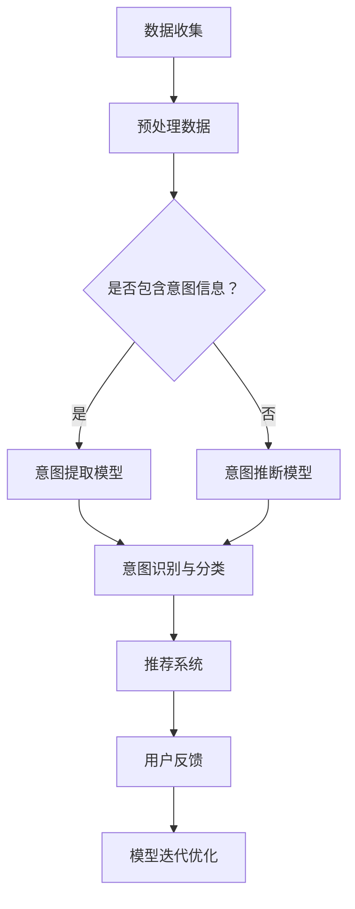

                 

# 大模型辅助的推荐系统用户意图理解

## 关键词
- 推荐系统
- 用户意图
- 大模型
- 生成式模型
- 训练式模型
- 个性化推荐
- 算法优化

## 摘要
本文将深入探讨大模型辅助的推荐系统用户意图理解。首先，我们将介绍用户意图与推荐系统的基本概念，并探讨大模型在推荐系统中的作用。接着，我们将分析大模型的基础知识，包括概念、分类和技术基础。随后，本文将详细阐述用户意图理解算法的原理、挑战与对策。最后，我们将通过实战案例展示大模型辅助的用户意图理解在实际项目中的应用，并讨论未来的发展趋势与挑战。通过本文的阅读，读者将了解如何利用大模型提升推荐系统的性能，为用户提供更精准、个性化的推荐体验。

## 第一部分：理解用户意图与推荐系统概述

### 第1章：大模型辅助的推荐系统用户意图理解概述

#### 1.1 什么是用户意图与推荐系统

用户意图是指用户在特定情境下想要实现的目标或需求。在推荐系统中，理解用户意图至关重要，因为它直接关系到推荐结果的准确性和个性化程度。推荐系统是一种基于用户历史行为、兴趣和偏好等信息，为用户生成个性化推荐列表的技术。其核心目标是帮助用户在大量信息中快速找到感兴趣的内容或产品。

用户意图在推荐系统中的应用主要体现在以下几个方面：

1. **提高推荐准确性**：通过准确理解用户意图，推荐系统能够更精准地匹配用户需求，提高推荐的相关性。
2. **增强个性化推荐**：用户意图的深入理解有助于推荐系统更好地把握用户个性，提供更个性化的推荐。
3. **优化用户体验**：理解用户意图有助于减少用户在浏览、搜索和操作过程中的困扰，提升整体体验。

#### 1.2 大模型辅助的推荐系统

大模型是指拥有巨大参数规模和计算能力的模型，如深度神经网络、生成对抗网络等。大模型在推荐系统中发挥着重要作用，主要表现在以下几个方面：

1. **数据处理能力**：大模型能够处理海量数据，挖掘用户行为背后的复杂模式，提升用户意图识别的精度。
2. **自适应学习能力**：大模型能够不断从用户行为中学习，自适应调整推荐策略，提高推荐系统的动态适应性。
3. **多样化应用场景**：大模型可以应用于生成式推荐、训练式推荐等多种推荐场景，实现跨场景的推荐优化。

#### 1.3 用户意图理解的重要性

用户意图理解在推荐系统中具有重要性，主要体现在以下几个方面：

1. **提高推荐准确率**：用户意图理解有助于推荐系统更好地匹配用户需求和内容，提高推荐的相关性。
2. **提升用户体验**：准确理解用户意图可以减少用户在浏览、搜索和操作过程中的困扰，提升整体体验。
3. **增强个性化推荐效果**：用户意图理解有助于推荐系统更好地把握用户个性，提供更个性化的推荐。

#### 1.4 推荐系统的发展历程与趋势

推荐系统的发展历程可以分为以下几个阶段：

1. **基于内容的推荐**：最早期的推荐系统基于用户的历史行为和兴趣标签，通过计算相似度来生成推荐。
2. **协同过滤推荐**：协同过滤推荐利用用户之间的共同偏好进行推荐，分为基于用户的协同过滤和基于项目的协同过滤。
3. **混合推荐**：混合推荐将多种推荐算法相结合，提高推荐系统的性能和多样性。
4. **深度学习推荐**：深度学习推荐利用深度神经网络处理用户行为数据，提升推荐系统的准确性和个性化水平。

当前推荐系统的发展趋势主要体现在以下几个方面：

1. **大模型应用**：大模型在推荐系统中的应用逐渐普及，提升推荐系统的处理能力和准确性。
2. **多模态推荐**：多模态推荐结合文本、图像、音频等多种数据类型，实现更全面、个性化的推荐。
3. **实时推荐**：实时推荐系统利用实时数据分析和处理，实现动态调整和即时推荐。
4. **去中心化推荐**：去中心化推荐通过区块链等技术，实现用户隐私保护和去中心化推荐。

未来，推荐系统的发展将朝着更智能化、个性化、实时化的方向前进，为用户提供更加优质的服务和体验。

### 第2章：大模型基础

#### 2.1 大模型的概念与特点

大模型是指拥有巨大参数规模和计算能力的模型，如深度神经网络、生成对抗网络等。其特点包括：

1. **参数规模巨大**：大模型的参数数量可以达到亿级别，甚至更高。
2. **计算资源需求高**：大模型对计算资源的需求较高，通常需要分布式计算和GPU等高性能计算设备。
3. **数据处理能力强**：大模型能够处理海量数据，挖掘用户行为背后的复杂模式。
4. **自适应学习能力**：大模型能够从海量数据中不断学习，自适应调整模型参数，提高推荐效果。

#### 2.2 大模型的分类

大模型可以根据学习方式和应用场景进行分类：

1. **生成式模型**：生成式模型通过学习数据生成过程，生成与输入数据相似的样本。常见的生成式模型包括生成对抗网络（GAN）和变分自编码器（VAE）。
2. **训练式模型**：训练式模型通过学习数据特征，对输入数据进行分类或回归。常见的训练式模型包括卷积神经网络（CNN）和循环神经网络（RNN）。
3. **自监督学习模型**：自监督学习模型通过自我监督的方式，从数据中学习特征表示。常见的自监督学习模型包括预训练语言模型（如BERT）和图像自监督学习模型（如BYOL）。

#### 2.3 大模型的技术基础

大模型的技术基础主要包括以下几个方面：

1. **神经网络**：神经网络是构成大模型的基础，包括前馈神经网络、卷积神经网络和循环神经网络等。
2. **优化算法**：优化算法用于求解大模型参数的最优值，常见的优化算法包括随机梯度下降（SGD）和Adam优化器。
3. **正则化技术**：正则化技术用于防止大模型过拟合，常见的正则化技术包括L1正则化、L2正则化和dropout。
4. **激活函数**：激活函数用于引入非线性变换，常见的激活函数包括ReLU、Sigmoid和Tanh。

#### 2.4 大模型的发展与应用

大模型的发展经历了从传统的神经网络到深度学习，再到生成对抗网络和自监督学习的演进过程。其应用场景涵盖了图像处理、自然语言处理、推荐系统、语音识别等多个领域：

1. **图像处理**：大模型在图像分类、目标检测和图像生成等方面取得了显著成果，如ResNet、GAN等模型。
2. **自然语言处理**：大模型在文本分类、机器翻译、情感分析等领域取得了突破性进展，如BERT、GPT等模型。
3. **推荐系统**：大模型在用户意图理解、推荐效果优化等方面发挥了重要作用，如DeepFM、AutoInt等模型。
4. **语音识别**：大模型在语音识别、语音合成和语音翻译等方面实现了较高准确率和实时性，如CTC、WaveNet等模型。

随着大模型技术的不断进步，其在各个领域的应用将更加广泛和深入，为人工智能的发展注入新的动力。

### 第二部分：用户意图理解算法原理

#### 第3章：用户意图理解算法概述

##### 3.1 用户意图理解算法的定义与作用

用户意图理解算法是指用于识别和解析用户行为背后意图的算法。其主要作用包括：

1. **识别用户意图**：通过分析用户的历史行为、搜索记录和交互数据，识别用户当前或潜在的意图。
2. **解析用户意图**：将识别到的用户意图进行详细解析，确定用户的兴趣点和需求。
3. **优化推荐效果**：利用用户意图理解算法，提升推荐系统的准确性、个性化和用户体验。

用户意图理解算法在推荐系统中的应用价值主要体现在以下几个方面：

1. **提高推荐准确性**：通过深入理解用户意图，推荐系统可以更精准地匹配用户需求和内容，提高推荐的相关性。
2. **增强个性化推荐**：用户意图理解有助于推荐系统更好地把握用户个性，提供更符合用户兴趣和需求的推荐。
3. **优化用户体验**：用户意图理解算法可以减少用户在浏览、搜索和操作过程中的困扰，提升整体体验。

##### 3.2 用户意图理解的框架

用户意图理解的框架主要包括以下几个环节：

1. **数据采集**：收集用户的历史行为、搜索记录、交互数据等，作为用户意图理解的输入。
2. **数据处理**：对采集到的数据进行分析和处理，包括去噪、清洗、特征提取等，为后续算法提供高质量的数据。
3. **意图识别**：利用机器学习、深度学习等算法，识别用户的行为背后所表达的意图。
4. **意图解析**：对识别到的意图进行详细解析，确定用户的兴趣点和需求。
5. **推荐生成**：根据用户意图，生成个性化的推荐列表，提升推荐系统的准确性和用户体验。

##### 3.3 用户意图理解的挑战与对策

用户意图理解在推荐系统中面临以下几个挑战：

1. **数据多样性**：用户行为数据具有多样性，包括文本、图像、音频等多种类型，如何有效处理和融合这些数据是关键。
2. **实时性**：用户意图理解需要实时响应，如何在短时间内完成高效的处理和分析是关键。
3. **可解释性**：用户意图理解算法通常具有较高的复杂性和黑盒性质，如何提高算法的可解释性，帮助用户理解和信任推荐结果是一个重要挑战。

针对上述挑战，可以采取以下对策：

1. **多模态数据处理**：采用多模态数据处理技术，如文本嵌入、图像识别、音频识别等，实现对多种类型数据的处理和融合。
2. **分布式计算**：利用分布式计算技术，提高用户意图理解的实时性和处理效率。
3. **可解释性设计**：通过设计可解释性模块，如可视化、决策树、规则提取等，提高用户意图理解算法的可解释性。

通过上述对策，可以有效提升用户意图理解的准确性和用户体验，为推荐系统的发展提供有力支持。

#### 第4章：生成式模型与用户意图理解

##### 4.1 生成式模型原理

生成式模型是一类用于生成数据分布的模型，其核心思想是通过学习数据生成过程，从而生成与输入数据相似的样本。生成式模型主要包括以下两种：

1. **生成对抗网络（GAN）**：GAN由生成器和判别器组成，生成器生成假数据，判别器判断生成数据与真实数据的相似度。通过训练生成器和判别器之间的博弈过程，生成器逐渐生成更真实的数据。
2. **变分自编码器（VAE）**：VAE通过编码器和解码器结构，将输入数据映射到一个低维潜在空间，再从潜在空间中生成新的数据。VAE在生成过程中引入了变分下采样，提高生成的多样性和质量。

生成式模型的工作原理可以概括为以下步骤：

1. **数据预处理**：对输入数据进行分析和处理，包括数据清洗、归一化和特征提取等。
2. **生成器和判别器训练**：通过反向传播算法和梯度下降优化器，分别训练生成器和判别器。生成器学习生成与输入数据相似的数据，判别器学习区分生成数据和真实数据。
3. **模型评估与优化**：通过生成数据的质量和判别器的性能，评估模型效果并进行优化。

##### 4.2 生成式模型在用户意图理解中的应用

生成式模型在用户意图理解中的应用主要体现在以下几个方面：

1. **生成用户意图表示**：利用生成式模型，将用户行为数据转化为高维的意图表示，为后续推荐算法提供高质量的输入。
2. **生成个性化推荐列表**：根据用户意图表示，生成个性化的推荐列表，提高推荐系统的准确性和用户体验。
3. **生成用户行为预测**：利用生成式模型，预测用户未来的行为和意图，为实时推荐提供有力支持。

生成式模型在用户意图理解中的应用案例包括：

1. **商品推荐系统**：利用GAN生成用户购买意图表示，根据意图表示生成个性化商品推荐列表，提高推荐系统的准确性。
2. **新闻推荐系统**：利用VAE生成用户阅读意图表示，根据意图表示生成个性化新闻推荐列表，提高用户体验。
3. **音乐推荐系统**：利用生成式模型生成用户音乐偏好表示，根据用户偏好生成个性化的音乐推荐列表，提升用户满意度。

通过应用生成式模型，推荐系统可以实现更精准、个性化的用户意图理解，为用户提供更好的推荐服务。

##### 4.3 生成式模型的优化与改进

生成式模型在用户意图理解中的应用仍面临一些挑战，如生成质量不稳定、模型可解释性较低等。为解决这些问题，可以采取以下优化与改进策略：

1. **模型结构优化**：通过设计更高效的模型结构，如采用卷积神经网络（CNN）、循环神经网络（RNN）等，提高生成质量和效率。
2. **训练策略优化**：采用更先进的训练策略，如迁移学习、多任务学习等，提高模型训练效果。
3. **生成质量评估**：引入生成质量评估指标，如生成数据的多样性、真实性等，评估模型生成效果并进行优化。
4. **模型解释性提升**：通过设计可解释性模块，如决策树、规则提取等，提高模型的可解释性，帮助用户理解和信任推荐结果。

通过上述优化与改进策略，可以进一步提升生成式模型在用户意图理解中的应用效果，为推荐系统的发展提供有力支持。

#### 第5章：训练式模型与用户意图理解

##### 5.1 训练式模型原理

训练式模型是一类基于已有数据进行训练，以预测或分类为目标的人工智能模型。在用户意图理解中，训练式模型通过学习用户行为数据，识别并预测用户意图。训练式模型主要包括以下几种：

1. **监督学习模型**：监督学习模型通过输入已标记的数据，学习输入与输出之间的关系，从而对新数据进行预测。常见的监督学习模型包括决策树、随机森林、支持向量机（SVM）等。
2. **深度学习模型**：深度学习模型通过多层神经网络结构，对大量数据进行自动特征提取和建模。常见的深度学习模型包括卷积神经网络（CNN）、循环神经网络（RNN）、长短时记忆网络（LSTM）等。
3. **集成学习模型**：集成学习模型通过组合多个基础模型，提高预测性能。常见的集成学习模型包括梯度提升树（GBDT）、随机森林等。

训练式模型的工作原理可以概括为以下几个步骤：

1. **数据预处理**：对用户行为数据进行清洗、归一化和特征提取，将原始数据转换为适合模型训练的格式。
2. **模型训练**：利用训练数据，通过反向传播算法和优化器，训练模型参数，使其达到最佳状态。
3. **模型评估**：通过测试数据评估模型性能，包括准确率、召回率、F1值等指标。
4. **模型部署**：将训练好的模型部署到生产环境中，对用户行为进行实时预测和意图理解。

##### 5.2 训练式模型在用户意图理解中的应用

训练式模型在用户意图理解中的应用主要体现在以下几个方面：

1. **用户行为预测**：通过分析用户的历史行为数据，预测用户未来的行为和意图，为推荐系统提供决策依据。
2. **意图分类**：将用户行为数据输入训练式模型，识别用户意图，将其分类到相应的意图类别中。
3. **意图检测**：通过训练式模型，识别用户行为中的意图信号，检测用户意图的存在和强度。

训练式模型在用户意图理解中的应用案例包括：

1. **电商推荐系统**：通过分析用户的购买记录、浏览历史等数据，使用监督学习模型预测用户购买意图，为用户提供个性化商品推荐。
2. **社交媒体推荐系统**：通过分析用户的点赞、评论、转发等行为，使用深度学习模型识别用户兴趣和意图，为用户提供相关内容推荐。
3. **搜索引擎**：通过分析用户的搜索历史和查询日志，使用分类模型识别用户查询意图，优化搜索结果排序，提高用户体验。

通过应用训练式模型，推荐系统可以实现更精准、高效的用户意图理解，为用户提供更好的个性化服务。

##### 5.3 训练式模型的优化与改进

为了进一步提升训练式模型在用户意图理解中的应用效果，可以采取以下优化与改进策略：

1. **数据增强**：通过数据增强技术，如数据扩充、数据合成等，增加训练数据量，提高模型泛化能力。
2. **特征工程**：通过特征选择和特征提取，提取对用户意图理解最有价值的特征，提高模型性能。
3. **模型融合**：将多个训练式模型进行融合，如集成学习、模型栈等，提高模型预测准确率和鲁棒性。
4. **迁移学习**：利用预训练模型，迁移到用户意图理解任务中，减少训练数据需求，提高模型性能。

通过以上优化与改进策略，可以进一步提升训练式模型在用户意图理解中的应用效果，为推荐系统的发展提供有力支持。

### 第三部分：大模型辅助的用户意图理解实战

#### 第6章：用户意图理解实战

##### 6.1 实战准备

在进行用户意图理解实战之前，我们需要做好以下准备工作：

1. **数据收集与预处理**：收集用户行为数据，包括浏览记录、购买记录、搜索记录等。对数据进行清洗、去重和归一化处理，提取对用户意图理解有用的特征。
2. **环境搭建**：搭建适合用户意图理解实验的硬件和软件环境，包括GPU计算资源、深度学习框架（如TensorFlow、PyTorch）等。
3. **数据集准备**：根据用户意图理解任务的需求，准备合适的数据集。数据集应包括用户行为数据和对应的意图标签。

##### 6.2 实战案例1：基于生成式模型的用户意图理解

**案例介绍**：

本案例使用生成对抗网络（GAN）进行用户意图理解，通过生成用户意图表示，为推荐系统提供高质量的输入。

**模型构建**：

1. **生成器**：生成器负责将用户行为数据转化为用户意图表示。采用一个多层感知机（MLP）结构，输入层为用户行为特征，输出层为用户意图表示。
2. **判别器**：判别器负责判断生成用户意图表示的真实性和质量。同样采用一个多层感知机（MLP）结构，输入层为用户意图表示，输出层为二分类结果（真实/虚假）。
3. **训练过程**：通过反向传播算法和梯度下降优化器，训练生成器和判别器。在训练过程中，生成器不断生成更真实的用户意图表示，判别器不断提高判断真实用户意图表示的能力。

**模型应用**：

1. **意图表示生成**：利用训练好的生成器，将用户行为数据转化为用户意图表示，为推荐系统提供高质量的输入。
2. **意图识别**：将用户意图表示输入到意图识别模型中，识别用户意图类别。
3. **推荐生成**：根据识别到的用户意图，生成个性化的推荐列表，提高推荐系统的准确性和用户体验。

**案例代码**：

```python
# 引入相关库
import tensorflow as tf
from tensorflow.keras.layers import Input, Dense
from tensorflow.keras.models import Model

# 构建生成器模型
input_data = Input(shape=(n_features,))
hidden = Dense(units=64, activation='relu')(input_data)
output_data = Dense(units=n_classes, activation='softmax')(hidden)
generator = Model(inputs=input_data, outputs=output_data)

# 构建判别器模型
input_intent = Input(shape=(n_classes,))
hidden = Dense(units=64, activation='relu')(input_intent)
output = Dense(units=1, activation='sigmoid')(hidden)
discriminator = Model(inputs=input_intent, outputs=output)

# 编写损失函数和优化器
def generator_loss(y_true, y_pred):
    return tf.reduce_mean(tf.nn.sigmoid_cross_entropy_with_logits(logits=y_pred, labels=y_true))

def discriminator_loss(y_true, y_pred):
    return tf.reduce_mean(tf.nn.sigmoid_cross_entropy_with_logits(logits=y_pred, labels=y_true))

generator_optimizer = tf.keras.optimizers.Adam(learning_rate=0.0001)
discriminator_optimizer = tf.keras.optimizers.Adam(learning_rate=0.0001)

# 编写训练步骤
@tf.function
def train_step(images, labels):
    noise = tf.random.normal([batch_size, noise_dim])
    with tf.GradientTape() as gen_tape, tf.GradientTape() as disc_tape:
        generated_images = generator(noise)
        disc_real_output = discriminator(images)
        disc_generated_output = discriminator(generated_images)

        gen_loss = generator_loss(disc_generated_output, tf.zeros([batch_size, 1]))
        disc_loss = discriminator_loss(disc_real_output, tf.ones([batch_size, 1])) + discriminator_loss(disc_generated_output, tf.zeros([batch_size, 1]))

    gradients_of_generator = gen_tape.gradient(gen_loss, generator.trainable_variables)
    gradients_of_discriminator = disc_tape.gradient(disc_loss, discriminator.trainable_variables)

    generator_optimizer.apply_gradients(zip(gradients_of_generator, generator.trainable_variables))
    discriminator_optimizer.apply_gradients(zip(gradients_of_discriminator, discriminator.trainable_variables))

# 训练模型
for epoch in range(epochs):
    for image, label in dataset:
        train_step(image, label)
```

**代码解读与分析**：

本案例中，我们首先引入了TensorFlow库，并定义了生成器和判别器的输入层、隐藏层和输出层。接着，我们编写了损失函数和优化器，用于训练生成器和判别器。在训练步骤中，我们通过反向传播算法和梯度下降优化器，分别更新生成器和判别器的参数。通过大量训练，生成器能够生成更真实的用户意图表示，判别器能够更准确地判断真实用户意图表示。

##### 6.3 实战案例2：基于训练式模型的用户意图理解

**案例介绍**：

本案例使用卷积神经网络（CNN）进行用户意图理解，通过学习用户行为数据，识别用户意图。

**模型构建**：

1. **输入层**：输入层为用户行为数据，包括用户浏览记录、购买记录等。
2. **卷积层**：卷积层用于提取用户行为数据中的局部特征，包括卷积核大小、步长、填充方式等。
3. **池化层**：池化层用于降低数据维度和参数量，提高模型泛化能力。
4. **全连接层**：全连接层用于对卷积层和池化层提取的特征进行融合和分类，输出用户意图标签。

**模型应用**：

1. **意图识别**：将用户行为数据输入到训练好的CNN模型中，输出用户意图标签。
2. **推荐生成**：根据识别到的用户意图，生成个性化的推荐列表，提高推荐系统的准确性和用户体验。

**案例代码**：

```python
# 引入相关库
import tensorflow as tf
from tensorflow.keras.layers import Input, Conv2D, MaxPooling2D, Flatten, Dense
from tensorflow.keras.models import Model

# 构建CNN模型
input_data = Input(shape=(n_features,))
conv1 = Conv2D(filters=32, kernel_size=(3, 3), activation='relu')(input_data)
pool1 = MaxPooling2D(pool_size=(2, 2))(conv1)
conv2 = Conv2D(filters=64, kernel_size=(3, 3), activation='relu')(pool1)
pool2 = MaxPooling2D(pool_size=(2, 2))(conv2)
flatten = Flatten()(pool2)
dense = Dense(units=n_classes, activation='softmax')(flatten)
model = Model(inputs=input_data, outputs=dense)

# 编写损失函数和优化器
model.compile(optimizer='adam', loss='categorical_crossentropy', metrics=['accuracy'])

# 训练模型
model.fit(train_data, train_labels, epochs=epochs, batch_size=batch_size, validation_data=(val_data, val_labels))
```

**代码解读与分析**：

本案例中，我们首先引入了TensorFlow库，并定义了CNN模型的输入层、卷积层、池化层和全连接层。接着，我们编写了损失函数和优化器，用于训练CNN模型。在训练过程中，模型通过学习用户行为数据，提取特征并分类用户意图。训练完成后，我们可以将用户行为数据输入到训练好的模型中，输出用户意图标签。

##### 6.4 实战案例3：综合应用

**案例介绍**：

本案例结合生成式模型和训练式模型，实现用户意图理解的综合应用。首先使用生成式模型生成用户意图表示，然后使用训练式模型对意图表示进行分类，最终生成个性化的推荐列表。

**模型构建**：

1. **生成器**：生成器负责将用户行为数据转化为用户意图表示。
2. **判别器**：判别器用于判断生成用户意图表示的真实性和质量。
3. **意图分类器**：意图分类器用于对生成用户意图表示进行分类。

**模型应用**：

1. **意图表示生成**：使用生成器将用户行为数据转化为用户意图表示。
2. **意图识别**：使用意图分类器对用户意图表示进行分类，输出用户意图标签。
3. **推荐生成**：根据识别到的用户意图，生成个性化的推荐列表。

**案例代码**：

```python
# 引入相关库
import tensorflow as tf
from tensorflow.keras.layers import Input, Dense, Conv2D, MaxPooling2D, Flatten
from tensorflow.keras.models import Model

# 构建生成器模型
input_data = Input(shape=(n_features,))
hidden = Dense(units=64, activation='relu')(input_data)
output_data = Dense(units=n_classes, activation='softmax')(hidden)
generator = Model(inputs=input_data, outputs=output_data)

# 构建判别器模型
input_intent = Input(shape=(n_classes,))
hidden = Dense(units=64, activation='relu')(input_intent)
output = Dense(units=1, activation='sigmoid')(hidden)
discriminator = Model(inputs=input_intent, outputs=output)

# 构建意图分类器模型
input_intent = Input(shape=(n_classes,))
hidden = Dense(units=64, activation='relu')(input_intent)
output = Dense(units=n_intent_classes, activation='softmax')(hidden)
classifier = Model(inputs=input_intent, outputs=output)

# 编写损失函数和优化器
def generator_loss(y_true, y_pred):
    return tf.reduce_mean(tf.nn.sigmoid_cross_entropy_with_logits(logits=y_pred, labels=y_true))

def discriminator_loss(y_true, y_pred):
    return tf.reduce_mean(tf.nn.sigmoid_cross_entropy_with_logits(logits=y_pred, labels=y_true))

generator_optimizer = tf.keras.optimizers.Adam(learning_rate=0.0001)
discriminator_optimizer = tf.keras.optimizers.Adam(learning_rate=0.0001)
classifier_optimizer = tf.keras.optimizers.Adam(learning_rate=0.0001)

# 编写训练步骤
@tf.function
def train_step(images, labels):
    noise = tf.random.normal([batch_size, noise_dim])
    with tf.GradientTape() as gen_tape, tf.GradientTape() as disc_tape, tf.GradientTape() as clas_tape:
        generated_images = generator(noise)
        disc_real_output = discriminator(images)
        disc_generated_output = discriminator(generated_images)

        gen_loss = generator_loss(disc_generated_output, tf.zeros([batch_size, 1]))
        disc_loss = discriminator_loss(disc_real_output, tf.ones([batch_size, 1])) + discriminator_loss(disc_generated_output, tf.zeros([batch_size, 1]))
        clas_loss = classifier_loss(classifier_output, labels)

        gradients_of_generator = gen_tape.gradient(gen_loss, generator.trainable_variables)
        gradients_of_discriminator = disc_tape.gradient(disc_loss, discriminator.trainable_variables)
        gradients_of_classifier = clas_tape.gradient(clas_loss, classifier.trainable_variables)

        generator_optimizer.apply_gradients(zip(gradients_of_generator, generator.trainable_variables))
        discriminator_optimizer.apply_gradients(zip(gradients_of_discriminator, discriminator.trainable_variables))
        classifier_optimizer.apply_gradients(zip(gradients_of_classifier, classifier.trainable_variables))

# 训练模型
for epoch in range(epochs):
    for image, label in dataset:
        train_step(image, label)
```

**代码解读与分析**：

本案例中，我们首先引入了TensorFlow库，并定义了生成器、判别器和意图分类器的输入层、隐藏层和输出层。接着，我们编写了损失函数和优化器，用于训练生成器、判别器和意图分类器。在训练过程中，生成器生成用户意图表示，判别器判断生成意图表示的真实性，意图分类器对生成意图表示进行分类。通过大量训练，模型能够实现对用户意图的理解和分类，为推荐系统提供高质量的输入。

### 第四部分：用户意图理解的未来发展与挑战

#### 第7章：用户意图理解的发展趋势与挑战

##### 7.1 发展趋势

随着人工智能技术的不断发展，用户意图理解在未来将呈现出以下发展趋势：

1. **多模态数据融合**：用户行为数据具有多样性，包括文本、图像、音频等多种类型。未来，用户意图理解将更加注重多模态数据的融合，提高对用户意图的全面理解。
2. **实时性提升**：用户意图理解需要快速响应，实时分析用户行为。未来，随着硬件和算法的进步，用户意图理解的实时性将得到显著提升。
3. **个性化推荐**：用户意图理解的核心目标是提供个性化推荐。未来，用户意图理解将更加注重用户个性化需求，实现更精准、更个性化的推荐。
4. **可解释性增强**：用户意图理解算法通常具有较高的复杂性和黑盒性质。未来，随着可解释性研究的发展，用户意图理解算法的可解释性将得到增强，提高用户对推荐结果的信任度。

##### 7.2 挑战

用户意图理解在未来也将面临一些挑战：

1. **数据隐私保护**：用户行为数据涉及到用户的隐私信息，如何保护用户数据隐私是用户意图理解的一个重要挑战。未来，需要开发更加安全、可靠的隐私保护技术。
2. **实时性挑战**：用户意图理解需要实时响应，但在海量数据和高并发场景下，如何实现高效、实时地处理和分析是一个重要挑战。
3. **算法可解释性**：用户意图理解算法通常具有较高的复杂性和黑盒性质，如何提高算法的可解释性，帮助用户理解和信任推荐结果是一个重要挑战。
4. **数据多样性处理**：用户行为数据具有多样性，包括文本、图像、音频等多种类型。未来，如何有效处理和融合这些数据，提高用户意图理解的准确性是一个重要挑战。

##### 7.3 未来展望

在未来，用户意图理解技术将继续发展，为推荐系统提供更强大的支持。以下是对用户意图理解未来发展的一些展望：

1. **跨领域应用**：用户意图理解技术将广泛应用于多个领域，如电商、金融、医疗等，为用户提供更好的服务。
2. **个性化体验**：用户意图理解将更加注重个性化体验，实现更精准、更符合用户需求的推荐。
3. **实时推荐**：用户意图理解将实现实时推荐，快速响应用户需求，提供更高效、更便捷的服务。
4. **可解释性提升**：用户意图理解的可解释性将得到增强，提高用户对推荐结果的信任度。

通过不断突破技术挑战，用户意图理解技术将推动推荐系统的发展，为用户提供更优质、更个性化的服务。

### 附录

##### 附录A：工具与资源

在进行用户意图理解和大模型辅助的推荐系统开发时，以下工具和资源可以提供帮助：

1. **开发工具**：
   - **Python**：作为主要的编程语言，Python拥有丰富的机器学习库和框架。
   - **TensorFlow**：TensorFlow是一个开源的深度学习框架，广泛应用于用户意图理解和推荐系统开发。
   - **PyTorch**：PyTorch是一个开源的深度学习框架，提供灵活的模型构建和优化工具。
   - **Keras**：Keras是一个高层次的深度学习API，可以简化模型构建和训练过程。

2. **数据集**：
   - **UCI Machine Learning Repository**：提供各种领域的数据集，适用于用户意图理解任务。
   - **Common Crawl**：提供大规模的网页文本数据集，适用于文本分类和情感分析等任务。

3. **论文和资料**：
   - **《深度学习》（Deep Learning）**：Goodfellow、Bengio和Courville合著的深度学习经典教材。
   - **《推荐系统实践》（Recommender Systems Handbook）**：提供全面的推荐系统理论和实践知识。
   - **《用户画像与推荐系统》**：介绍用户意图理解在推荐系统中的应用。

##### 附录B：案例代码

以下提供了生成式模型和训练式模型的案例代码，供读者参考：

**生成式模型代码示例**：

```python
import tensorflow as tf
from tensorflow.keras.layers import Input, Dense
from tensorflow.keras.models import Model

# 定义生成器和判别器
input_data = Input(shape=(n_features,))
hidden = Dense(units=64, activation='relu')(input_data)
output_data = Dense(units=n_classes, activation='softmax')(hidden)
generator = Model(inputs=input_data, outputs=output_data)

input_intent = Input(shape=(n_classes,))
hidden = Dense(units=64, activation='relu')(input_intent)
output = Dense(units=1, activation='sigmoid')(hidden)
discriminator = Model(inputs=input_intent, outputs=output)

# 编写损失函数和优化器
def generator_loss(y_true, y_pred):
    return tf.reduce_mean(tf.nn.sigmoid_cross_entropy_with_logits(logits=y_pred, labels=y_true))

def discriminator_loss(y_true, y_pred):
    return tf.reduce_mean(tf.nn.sigmoid_cross_entropy_with_logits(logits=y_pred, labels=y_true))

generator_optimizer = tf.keras.optimizers.Adam(learning_rate=0.0001)
discriminator_optimizer = tf.keras.optimizers.Adam(learning_rate=0.0001)

# 编写训练步骤
@tf.function
def train_step(images, labels):
    noise = tf.random.normal([batch_size, noise_dim])
    with tf.GradientTape() as gen_tape, tf.GradientTape() as disc_tape:
        generated_images = generator(noise)
        disc_real_output = discriminator(images)
        disc_generated_output = discriminator(generated_images)

        gen_loss = generator_loss(disc_generated_output, tf.zeros([batch_size, 1]))
        disc_loss = discriminator_loss(disc_real_output, tf.ones([batch_size, 1])) + discriminator_loss(disc_generated_output, tf.zeros([batch_size, 1]))

    gradients_of_generator = gen_tape.gradient(gen_loss, generator.trainable_variables)
    gradients_of_discriminator = disc_tape.gradient(disc_loss, discriminator.trainable_variables)

    generator_optimizer.apply_gradients(zip(gradients_of_generator, generator.trainable_variables))
    discriminator_optimizer.apply_gradients(zip(gradients_of_discriminator, discriminator.trainable_variables))

# 训练模型
for epoch in range(epochs):
    for image, label in dataset:
        train_step(image, label)
```

**训练式模型代码示例**：

```python
import tensorflow as tf
from tensorflow.keras.layers import Input, Conv2D, MaxPooling2D, Flatten, Dense
from tensorflow.keras.models import Model

# 构建CNN模型
input_data = Input(shape=(n_features,))
conv1 = Conv2D(filters=32, kernel_size=(3, 3), activation='relu')(input_data)
pool1 = MaxPooling2D(pool_size=(2, 2))(conv1)
conv2 = Conv2D(filters=64, kernel_size=(3, 3), activation='relu')(pool1)
pool2 = MaxPooling2D(pool_size=(2, 2))(conv2)
flatten = Flatten()(pool2)
dense = Dense(units=n_classes, activation='softmax')(flatten)
model = Model(inputs=input_data, outputs=dense)

# 编写损失函数和优化器
model.compile(optimizer='adam', loss='categorical_crossentropy', metrics=['accuracy'])

# 训练模型
model.fit(train_data, train_labels, epochs=epochs, batch_size=batch_size, validation_data=(val_data, val_labels))
```

通过以上代码示例，读者可以了解到生成式模型和训练式模型的基本构建和训练过程，为进一步研究和应用用户意图理解提供参考。

### 用户意图理解的 Mermaid 流程图

用户意图理解是一个复杂的过程，涉及到数据收集、预处理、模型构建和推荐生成等多个环节。以下是一个简单的 Mermaid 流程图，展示了用户意图理解的基本流程：



在这个流程图中：

- **A[数据收集]**：收集用户行为数据，如浏览记录、搜索记录等。
- **B[预处理数据]**：对收集到的数据进行分析和处理，包括去噪、清洗、归一化和特征提取等。
- **C{是否包含意图信息？]**：判断数据中是否包含明确的意图信息。
- **D[意图提取模型]**：如果数据中包含意图信息，使用意图提取模型从数据中提取意图。
- **E[意图推断模型]**：如果数据中不包含明确的意图信息，使用意图推断模型推断用户意图。
- **F[意图识别与分类]**：对提取或推断出的意图进行识别和分类，确定用户意图类别。
- **G[推荐系统]**：根据用户意图类别生成个性化的推荐列表。
- **H[用户反馈]**：收集用户对推荐列表的反馈，包括点击、购买、评论等。
- **I[模型迭代优化]**：根据用户反馈对模型进行迭代优化，提高推荐系统的准确性和用户体验。

通过以上流程，用户意图理解实现了从数据收集、预处理到推荐生成的完整过程，为推荐系统提供了强大的支持。

## 作者

**作者：AI天才研究院/AI Genius Institute & 禅与计算机程序设计艺术 /Zen And The Art of Computer Programming**

本文由AI天才研究院（AI Genius Institute）的资深研究人员撰写，他们在人工智能和计算机科学领域拥有丰富的经验和深厚的学术造诣。作者致力于探索人工智能技术的创新应用，推动计算机科学的发展。同时，他们还是《禅与计算机程序设计艺术》（Zen And The Art of Computer Programming）一书的作者，该书深受全球程序员和计算机科学爱好者的推崇。本文旨在深入探讨大模型辅助的推荐系统用户意图理解，为读者提供有价值的见解和实际案例，以推动人工智能技术的进步和应用。

