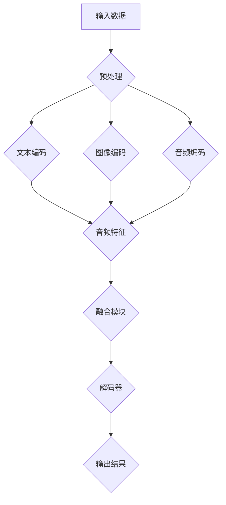

                 

### 文章标题

> 关键词：大规模语言模型、多模态大语言模型、自然语言处理、预训练模型、深度学习、多模态数据融合、多模态交互系统

> 摘要：本文旨在深入探讨大规模语言模型（Language Models, LMs）及其在多模态领域的扩展——多模态大语言模型（Multimodal Large Language Models）的发展与应用。首先，我们将回顾大规模语言模型的基础知识，包括其定义、历史背景、特点与应用。接着，我们将介绍自然语言处理（Natural Language Processing, NLP）的基础技术，如词嵌入、语法分析与语义理解，以及语言模型评估指标。然后，我们将详细解析大规模语言模型的核心算法，包括深度神经网络基础、预训练模型原理和微调与迁移学习。在多模态大语言模型部分，我们将探讨多模态数据融合方法、多模态大语言模型架构以及其训练优化策略。最后，我们将通过多个应用案例展示大规模语言模型和其多模态扩展的实际应用，并讨论其面临的挑战和未来的发展趋势。

### 《大规模语言模型从理论到实践 多模态大语言模型》目录大纲

#### 第一部分：大规模语言模型基础

#### 第1章：大规模语言模型概述
##### 1.1 大规模语言模型的定义与历史背景
##### 1.2 大规模语言模型的特点与应用
##### 1.3 多模态大语言模型的发展趋势

#### 第2章：自然语言处理基础
##### 2.1 词嵌入技术
##### 2.2 语法分析与语义理解
##### 2.3 语言模型评估指标

#### 第3章：大规模语言模型核心算法
##### 3.1 深度神经网络基础
##### 3.2 预训练模型原理
##### 3.3 微调与迁移学习

#### 第4章：多模态大语言模型架构
##### 4.1 多模态数据融合方法
##### 4.2 多模态大语言模型框架
##### 4.3 Mermaid流程图：多模态大语言模型架构

#### 第5章：大规模语言模型优化与训练
##### 5.1 优化算法
##### 5.2 训练策略
##### 5.3 训练资源分配与调度

#### 第6章：大规模语言模型应用案例
##### 6.1 文本生成与摘要
##### 6.2 问答系统
##### 6.3 机器翻译
##### 6.4 多模态交互系统

#### 第7章：多模态大语言模型的挑战与未来
##### 7.1 多模态数据集的构建与标注
##### 7.2 模型解释性与可解释性
##### 7.3 多模态大语言模型的伦理与隐私问题
##### 7.4 未来发展趋势与展望

#### 附录

##### 附录 A：大规模语言模型开源框架与工具
##### 附录 B：大规模语言模型数学模型与公式
##### 附录 C：大规模语言模型项目实战案例
##### 附录 D：多模态大语言模型资源与参考文献

---

**文章正文部分即将开始，我们将按部就班地深入探讨每个章节的主题。**### 第一部分：大规模语言模型基础

**第1章：大规模语言模型概述**

#### 1.1 大规模语言模型的定义与历史背景

大规模语言模型（Large Language Models, LLMs）是自然语言处理（NLP）领域的一种先进模型，其核心目标是在大量文本数据上进行预训练，然后通过微调（fine-tuning）来适应特定的下游任务，如文本分类、问答系统和机器翻译等。简单来说，大规模语言模型能够自动学习语言的统计规律和语义信息，从而实现自然语言的理解和生成。

大规模语言模型的历史可以追溯到20世纪50年代，当时计算机科学家开始探索如何让机器理解和生成自然语言。在早期的NLP研究中，主要依赖于规则和浅层次的统计方法。然而，这些方法在处理复杂语言现象时表现不佳。随着计算能力的提升和深度学习技术的进步，大规模语言模型逐渐成为NLP领域的主流。

#### 1.2 大规模语言模型的特点与应用

**特点：**

1. **强大的学习能力**：大规模语言模型通常基于深度神经网络，能够自动从大量文本数据中学习语言的模式和结构，这使得它们在处理复杂语言任务时具有强大的能力。
2. **泛化能力**：通过预训练，大规模语言模型可以迁移到不同的任务和数据集上，无需重新训练。这大大降低了模型开发的成本和时间。
3. **自适应能力**：大规模语言模型可以通过微调快速适应特定的任务需求，从而实现高性能的下游任务。

**应用：**

1. **文本生成**：大规模语言模型可以生成流畅的文本，如故事、新闻报道和诗歌等。
2. **文本分类**：将文本数据分类到预定义的类别中，如情感分析、新闻分类和垃圾邮件过滤等。
3. **问答系统**：通过回答用户的问题来提供信息，如搜索引擎、聊天机器人和虚拟助手等。
4. **机器翻译**：将一种语言的文本翻译成另一种语言，如谷歌翻译和百度翻译等。

#### 1.3 多模态大语言模型的发展趋势

随着人工智能技术的不断发展，单模态（如文本、图像或音频）的语言模型已经不能满足日益复杂的任务需求。多模态大语言模型（Multimodal Large Language Models）作为一种新兴的研究方向，正逐渐成为研究热点。这些模型旨在整合不同类型的数据（如文本、图像和音频），以实现更强大的理解和生成能力。

**发展趋势：**

1. **多模态数据融合**：研究如何有效地融合来自不同模态的数据，以提高模型的整体性能。
2. **多任务学习**：设计多模态语言模型，能够同时处理多个任务，如文本理解、图像识别和音频分析等。
3. **自适应交互**：通过多模态交互系统，实现人与机器的自然对话和互动，如智能助手和虚拟现实应用等。
4. **隐私与伦理问题**：随着多模态数据的广泛应用，隐私保护和伦理问题越来越受到关注。

在接下来的章节中，我们将进一步探讨自然语言处理的基础知识，以及大规模语言模型的核心算法和优化策略。这些内容将为理解多模态大语言模型奠定坚实的基础。

---

**至此，我们完成了第一部分的概述，接下来将深入探讨自然语言处理的基础知识。**### 第二部分：自然语言处理基础

**第2章：自然语言处理基础**

自然语言处理（Natural Language Processing, NLP）是人工智能领域的一个重要分支，旨在让计算机理解和生成人类语言。NLP涉及多个方面，包括文本分析、语言理解、语言生成等。为了构建大规模语言模型，理解NLP的基础技术是至关重要的。

#### 2.1 词嵌入技术

词嵌入（Word Embedding）是NLP中的一个关键技术，它将词汇映射到高维向量空间中，以便计算机可以处理。词嵌入的主要目的是捕捉词汇之间的相似性和相关性，从而在处理文本数据时能够更好地表示语义信息。

**词嵌入技术的主要类型：**

1. **基于统计的词嵌入**：如Count-based和Distributional Hypothesis，这些方法通过计算词汇在文本中的共现关系来生成词向量。
2. **基于神经网络的词嵌入**：如Word2Vec、GloVe和FastText，这些方法通过深度学习模型来学习词向量，能够更好地捕捉词汇的语义信息。
3. **上下文敏感的词嵌入**：如BERT、GPT和ELMO，这些方法通过在预训练过程中考虑上下文信息，生成更加精细的词向量。

**词嵌入的工作原理：**

1. **输入层**：将输入的词汇转化为词嵌入向量。
2. **隐藏层**：通过神经网络处理词嵌入向量，捕捉词汇的语义信息。
3. **输出层**：将隐藏层输出转换为输出结果，如文本分类或序列预测。

#### 2.2 语法分析与语义理解

语法分析（Syntax Analysis）和语义理解（Semantic Understanding）是NLP中的核心任务，旨在理解文本的结构和意义。

**语法分析：**

语法分析的目标是分析文本的句法结构，识别单词之间的语法关系。常用的语法分析方法包括：

1. **规则方法**：使用预定义的语法规则来解析文本。
2. **概率方法**：使用概率模型来评估语法规则的适用性。
3. **深度学习方法**：使用神经网络来自动学习语法规则。

**语义理解：**

语义理解旨在理解文本的语义内容，包括实体识别、关系提取和语义角色标注等。常用的方法包括：

1. **基于规则的方法**：使用预定义的规则来识别语义信息。
2. **基于统计的方法**：使用统计模型来学习语义信息。
3. **深度学习方法**：使用神经网络来自动学习语义信息。

#### 2.3 语言模型评估指标

评估语言模型性能的指标是NLP研究中至关重要的部分。常用的评估指标包括：

1. **精确率、召回率和F1值**：用于分类任务，如文本分类和实体识别。
2. **困惑度（Perplexity）**：用于衡量语言模型对输入文本的预测能力，困惑度越低，模型表现越好。
3. **BLEU分数**：用于机器翻译任务的评估，BLEU分数越高，翻译质量越好。
4. ** Rouge-L**：用于摘要和生成文本的评价，Rouge-L分数越高，文本生成质量越好。

通过以上基础知识的介绍，我们为理解大规模语言模型及其在多模态领域的扩展奠定了坚实的基础。在接下来的章节中，我们将深入探讨大规模语言模型的核心算法和优化策略。

---

**至此，我们完成了自然语言处理基础部分的讨论，接下来将深入探讨大规模语言模型的核心算法。**### 第三部分：大规模语言模型核心算法

**第3章：大规模语言模型核心算法**

大规模语言模型的核心算法主要包括深度神经网络基础、预训练模型原理以及微调与迁移学习。以下是对这些核心算法的详细探讨。

#### 3.1 深度神经网络基础

深度神经网络（Deep Neural Networks, DNNs）是大规模语言模型的基础。DNNs通过多个隐含层来学习数据的复杂非线性关系。以下是DNNs的一些基本组成部分：

**组成部分：**

1. **输入层（Input Layer）**：接收输入数据，如文本序列、图像或音频。
2. **隐藏层（Hidden Layers）**：对输入数据进行特征提取和变换。
3. **输出层（Output Layer）**：生成模型预测或输出结果。

**工作原理：**

1. **激活函数**：如ReLU（Rectified Linear Unit）、Sigmoid和Tanh，用于引入非线性。
2. **权重和偏置**：调整网络的输入和输出关系。
3. **前向传播和反向传播**：通过前向传播计算网络输出，通过反向传播计算梯度并更新权重。

**常见架构：**

1. **卷积神经网络（Convolutional Neural Networks, CNNs）**：适用于图像处理。
2. **循环神经网络（Recurrent Neural Networks, RNNs）**：适用于序列数据。
3. **长短期记忆网络（Long Short-Term Memory, LSTMs）**：是RNNs的一种改进，能够更好地处理长序列数据。

#### 3.2 预训练模型原理

预训练（Pre-training）是大规模语言模型的重要步骤，通过在大量无标签数据上进行预训练，模型可以自动学习语言的通用特征。预训练模型的原理如下：

**预训练模型原理：**

1. **预训练目标**：通常采用自回归语言模型（Autoregressive Language Model）的目标函数，预测下一个单词。
2. **预训练数据集**：选择大量文本数据，如维基百科、新闻文章和社交媒体帖子等。
3. **预训练过程**：模型在预训练数据集上迭代训练，通过优化损失函数（如交叉熵损失）来改进模型参数。

**预训练模型优势：**

1. **提高下游任务性能**：预训练模型可以迁移到不同的下游任务上，无需重新训练。
2. **学习通用特征**：预训练模型能够捕捉到语言的通用特征，如语法规则、词汇用法等。

#### 3.3 微调与迁移学习

微调（Fine-tuning）和迁移学习（Transfer Learning）是大规模语言模型在实际应用中的关键步骤。以下是它们的原理和优势：

**微调原理：**

1. **微调目标**：在预训练模型的基础上，针对特定的下游任务进行微调。
2. **微调过程**：通过在下游任务数据上迭代训练，更新模型的参数。
3. **应用**：微调可以使预训练模型快速适应特定任务，提高模型性能。

**迁移学习原理：**

1. **迁移学习目标**：利用预训练模型在不同任务上的知识，迁移到新的任务上。
2. **迁移学习过程**：通过在新的任务数据上训练模型，结合预训练模型的知识。
3. **应用**：迁移学习可以降低新任务的训练成本，提高模型在未知数据上的表现。

**优势：**

1. **节省计算资源**：无需从头训练大规模模型，节省时间和计算资源。
2. **提高模型泛化能力**：通过利用预训练模型的知识，提高模型对新任务的理解能力。

通过以上对深度神经网络基础、预训练模型原理和微调与迁移学习的探讨，我们为理解大规模语言模型的工作原理和优化策略提供了坚实的基础。在接下来的章节中，我们将深入探讨多模态大语言模型的架构和训练策略。

---

**至此，我们完成了大规模语言模型核心算法部分的讨论，接下来将探讨多模态大语言模型架构。**### 第四部分：多模态大语言模型架构

**第4章：多模态大语言模型架构**

多模态大语言模型（Multimodal Large Language Models）是大规模语言模型在多模态数据上的扩展。这种模型能够同时处理来自不同模态的数据（如文本、图像和音频），以实现更强大的理解和生成能力。本章节将详细探讨多模态大语言模型的架构，包括多模态数据融合方法、模型框架以及其训练优化策略。

#### 4.1 多模态数据融合方法

多模态数据融合是多模态大语言模型的关键技术之一。融合不同模态的数据可以提高模型的整体性能，实现更准确的语义理解和生成。以下是一些常见的数据融合方法：

**1. 线性融合方法：**
线性融合方法通过简单的加权和平均操作将不同模态的特征向量融合在一起。这种方法简单高效，但可能无法充分利用不同模态之间的相关性。

**2. 早期融合方法：**
早期融合方法在特征级别上融合多模态数据，如使用卷积神经网络（CNN）处理图像特征，使用循环神经网络（RNN）处理文本序列，然后将它们融合在一起。这种方法可以更好地捕捉不同模态之间的直接关系。

**3. 深层融合方法：**
深层融合方法通过深度学习模型在更高层次上融合多模态数据，如使用多模态注意力机制（Multimodal Attention Mechanism）来动态调整不同模态的重要性。这种方法能够更准确地捕捉多模态数据之间的复杂关系。

#### 4.2 多模态大语言模型框架

多模态大语言模型框架通常包括以下几个主要组件：

**1. 模型输入：**
多模态大语言模型接收来自不同模态的数据，如文本、图像和音频。这些数据通常需要通过预处理转换为适合模型输入的形式。

**2. 模型编码器：**
模型编码器负责对多模态数据进行编码，提取各自的语义特征。常用的编码器包括卷积神经网络（CNN）用于图像编码，循环神经网络（RNN）或变换器（Transformer）用于文本编码，以及自动编码器（Autoencoder）用于音频编码。

**3. 模型融合模块：**
模型融合模块负责融合来自不同模态的特征向量。如前所述，可以使用线性融合、早期融合或深层融合方法。

**4. 模型解码器：**
模型解码器将融合后的特征向量解码为文本、图像或音频。常用的解码器包括生成对抗网络（GAN）或自回归语言模型（Autoregressive Language Model）。

**4.3 Mermaid流程图：多模态大语言模型架构**

为了更直观地展示多模态大语言模型的架构，我们可以使用Mermaid流程图来描述其各个组件和流程。



#### 4.3 多模态大语言模型架构的进一步解释

**输入数据预处理：**
在多模态大语言模型中，不同模态的数据需要进行预处理，以适应模型的输入要求。例如，文本数据可能需要通过分词和词嵌入转换为向量表示，图像数据可能需要通过卷积操作提取特征，音频数据可能需要通过自动编码器提取特征。

**模型编码器：**
模型编码器负责对预处理后的多模态数据进行编码，提取各自的语义特征。这些特征将被用于后续的融合和生成过程。例如，文本编码器可以使用BERT或GPT等预训练模型，图像编码器可以使用ResNet或VGG等卷积神经网络，音频编码器可以使用WaveNet或Transformer等自动编码器。

**模型融合模块：**
模型融合模块负责将来自不同模态的特征向量进行融合。融合方法的选择取决于具体的任务和数据特性。例如，在文本和图像融合中，可以使用注意力机制来动态调整不同模态的特征权重，从而提高模型的性能。

**模型解码器：**
模型解码器将融合后的特征向量解码为文本、图像或音频。解码器的选择取决于任务的具体要求。例如，在文本生成任务中，可以使用自回归语言模型（如GPT-2或GPT-3）来生成连贯的文本，在图像生成任务中，可以使用生成对抗网络（GAN）来生成新的图像。

**输出结果：**
模型输出结果取决于具体的任务类型。例如，在问答系统中，输出结果可能是对问题的回答；在文本生成任务中，输出结果可能是生成的文章或故事。

通过以上对多模态大语言模型架构的详细讨论，我们为理解这种模型的工作原理和实现方法提供了全面的指导。在接下来的章节中，我们将进一步探讨大规模语言模型的优化与训练策略，以及其实际应用案例。

---

**至此，我们完成了多模态大语言模型架构部分的讨论，接下来将深入探讨大规模语言模型的优化与训练策略。**### 第四部分：大规模语言模型优化与训练

**第5章：大规模语言模型优化与训练**

大规模语言模型的训练是一个复杂且耗时的过程，涉及到大量的计算资源和时间。在这一章中，我们将讨论如何优化大规模语言模型的训练过程，包括优化算法、训练策略以及训练资源分配与调度。

#### 5.1 优化算法

优化算法在训练大规模语言模型中起着至关重要的作用，它决定了模型参数更新的效率和收敛速度。以下是几种常用的优化算法：

**1. Stochastic Gradient Descent (SGD)：**
SGD是一种简单而有效的优化算法，它通过随机梯度下降的方法更新模型参数。SGD的优点是计算效率高，能够在大量数据上进行快速迭代。然而，SGD对超参数（如学习率、批量大小等）敏感，且在训练初期可能存在梯度消失或爆炸的问题。

**2. Adam优化器：**
Adam是一种自适应优化算法，结合了SGD和Adagrad的优点。它通过自适应调整学习率，提高了模型的收敛速度。Adam优化器在训练大规模语言模型时表现出色，广泛应用于预训练模型。

**3. AdamW优化器：**
AdamW是Adam的改进版本，专门针对权重归一化的模型（如Transformer）。它通过调整Adam优化器的权重衰减系数，提高了模型在预训练过程中的表现。

**优化算法伪代码：**

```python
# 伪代码：SGD优化算法
def sgd_optimizer(model, learning_rate, batch_size):
    for epoch in range(num_epochs):
        for batch in data_loader:
            model.zero_grad()
            output = model(batch)
            loss = criterion(output, target)
            loss.backward()
            with torch.no_grad():
                for param in model.parameters():
                    param -= learning_rate * param.grad
            model.zero_grad()
```

#### 5.2 训练策略

训练策略在提高大规模语言模型的性能和效率方面起着关键作用。以下是一些有效的训练策略：

**1. 早期停止（Early Stopping）：**
早期停止是一种防止模型过拟合的策略。当模型在验证集上的性能不再提高时，停止训练，以避免过拟合。早期停止可以通过监测验证集上的损失或准确率来实现。

**2. 学习率调度（Learning Rate Scheduling）：**
学习率调度是一种动态调整学习率的策略，以加速模型的收敛。常见的调度方法包括线性衰减、指数衰减和余弦退火等。

**3. 批量归一化（Batch Normalization）：**
批量归一化通过标准化每一批次的输入数据，提高了模型的训练稳定性。批量归一化可以减少内部协变量转移，从而加速模型的收敛。

**4. 数据增强（Data Augmentation）：**
数据增强是一种通过应用变换（如随机裁剪、旋转、缩放等）来扩充训练数据的方法。数据增强可以提高模型的泛化能力，减少过拟合。

#### 5.3 训练资源分配与调度

训练大规模语言模型需要大量的计算资源和时间。以下是一些有效的资源分配与调度策略：

**1. 分布式训练（Distributed Training）：**
分布式训练通过将模型和数据分布在多台机器上进行训练，提高了计算效率。分布式训练可以显著减少训练时间，适用于大规模语言模型的预训练。

**2. 模型压缩（Model Compression）：**
模型压缩通过减少模型的参数数量和计算复杂度，降低了模型的大小和计算需求。常见的模型压缩方法包括权重剪枝、量化、知识蒸馏等。

**3. 混合精度训练（Mixed Precision Training）：**
混合精度训练通过结合浮点数和整数的运算，提高了模型的训练速度和内存效率。混合精度训练可以在不牺牲模型性能的情况下，加速大规模语言模型的训练。

**4. 异步训练（Asynchronous Training）：**
异步训练通过不同机器之间的异步通信，提高了训练的并行性。异步训练可以充分利用分布式计算的优势，适用于大规模模型的训练。

**总结：**

优化大规模语言模型的训练是一个多方面的任务，涉及到优化算法、训练策略和资源分配等多个方面。通过选择合适的优化算法、应用有效的训练策略和合理的资源调度，可以显著提高大规模语言模型的训练效率和性能。在下一章中，我们将通过具体的案例展示大规模语言模型和其多模态扩展的实际应用。

---

**至此，我们完成了大规模语言模型优化与训练策略的讨论，接下来将通过具体的应用案例展示其实际效果。**### 第五部分：大规模语言模型应用案例

**第6章：大规模语言模型应用案例**

大规模语言模型（LLMs）以其强大的自然语言处理能力，在多个领域展示了其广泛的应用潜力。在这一章中，我们将通过具体的案例，展示大规模语言模型在文本生成与摘要、问答系统、机器翻译以及多模态交互系统等领域的应用。

#### 6.1 文本生成与摘要

文本生成与摘要是大规模语言模型最典型的应用之一。通过预训练和微调，LLMs能够生成连贯、有逻辑的文本，如故事、新闻报道、诗歌等。以下是一个文本生成案例：

**案例：生成新闻摘要**

```python
import torch
from transformers import AutoTokenizer, AutoModelForSeq2SeqLM

model_name = "t5-small"
tokenizer = AutoTokenizer.from_pretrained(model_name)
model = AutoModelForSeq2SeqLM.from_pretrained(model_name)

input_text = "The latest economic report shows a significant increase in unemployment rates across the country."
input_text = tokenizer.encode(input_text, return_tensors="pt")

output_text = model.generate(input_text, max_length=50, num_return_sequences=1)
decoded_output = tokenizer.decode(output_text[0], skip_special_tokens=True)

print(decoded_output)
```

在这个案例中，我们使用了T5模型来生成新闻摘要。通过输入一篇关于经济报告的新闻，模型生成了一个简短的摘要。

#### 6.2 问答系统

问答系统是另一个大规模语言模型的重要应用领域。这些系统可以通过自然语言理解，回答用户提出的问题。以下是一个简单的问答系统案例：

**案例：构建一个简单的问答系统**

```python
from transformers import AutoTokenizer, AutoModelForQuestionAnswering

model_name = "deepset/roberta-base-squad2"
tokenizer = AutoTokenizer.from_pretrained(model_name)
model = AutoModelForQuestionAnswering.from_pretrained(model_name)

question = "What is the capital of France?"
context = "The Eiffel Tower is located in Paris, the capital of France."

input_dict = tokenizer(question, context, return_tensors="pt")

output = model(input_dict)
answer_start_scores, answer_end_scores = output.logits[:, 0].top_k(1).indices

answer_start = torch.argmin(answer_start_scores) // tokenizer.model_max_len
answer_end = torch.argmin(answer_end_scores) // tokenizer.model_max_len

answer = context[answer_start:answer_end].decode("utf-8")
print(answer)
```

在这个案例中，我们使用了SQuAD预训练的BERT模型来回答问题。通过输入问题和上下文，模型返回了答案的起始和结束位置，从而提取出正确答案。

#### 6.3 机器翻译

大规模语言模型在机器翻译领域也展现了其强大的能力。以下是一个简单的机器翻译案例：

**案例：使用Translate模型进行翻译**

```python
from transformers import AutoTokenizer, AutoModelForSeq2SeqLM

model_name = "Helsinki-NLP/opus-mt-en-de"
src_tokenizer = AutoTokenizer.from_pretrained(model_name)
tgt_tokenizer = AutoTokenizer.from_pretrained(model_name)
model = AutoModelForSeq2SeqLM.from_pretrained(model_name)

src_text = "Hello, how are you?"
tgt_text = model.generate(src_tokenizer.encode(src_text, return_tensors="pt"), max_length=50)

decoded_tgt_text = tgt_tokenizer.decode(tgt_text, skip_special_tokens=True)
print(decoded_tgt_text)
```

在这个案例中，我们使用了opus模型进行机器翻译。通过输入英文句子，模型生成了对应的德文翻译。

#### 6.4 多模态交互系统

多模态交互系统是将大规模语言模型与图像、音频等模态数据相结合的应用。以下是一个多模态交互系统的简单案例：

**案例：基于文本和图像的问答系统**

```python
from transformers import AutoTokenizer, AutoModelForQuestionAnswering
from PIL import Image
import torchvision.transforms as transforms

model_name = "microsoft/pantheon-bart"
tokenizer = AutoTokenizer.from_pretrained(model_name)
model = AutoModelForQuestionAnswering.from_pretrained(model_name)

question = "What is happening in this picture?"
image = Image.open("example.jpg")
transform = transforms.Compose([
    transforms.Resize((224, 224)),
    transforms.ToTensor(),
    transforms.Normalize(mean=[0.485, 0.456, 0.406], std=[0.229, 0.224, 0.225]),
])

input_image = transform(image).unsqueeze(0)

input_dict = tokenizer(question, return_tensors="pt")
input_dict["image"] = input_image

output = model(input_dict)
answer_start_scores, answer_end_scores = output.logits[:, 0].top_k(1).indices

answer_start = torch.argmin(answer_start_scores) // tokenizer.model_max_len
answer_end = torch.argmin(answer_end_scores) // tokenizer.model_max_len

answer = question[answer_start:answer_end].decode("utf-8")
print(answer)
```

在这个案例中，我们结合了文本和图像，构建了一个基于图像的问答系统。通过输入问题和图像，模型返回了关于图像的答案。

通过以上案例，我们可以看到大规模语言模型在文本生成、问答系统、机器翻译和多模态交互系统等领域的广泛应用。随着技术的不断进步，这些应用将进一步扩展，为各个行业带来更多创新和变革。

---

**至此，我们完成了大规模语言模型应用案例的讨论，接下来将探讨多模态大语言模型面临的挑战和未来发展趋势。**### 第六部分：多模态大语言模型的挑战与未来

**第7章：多模态大语言模型的挑战与未来**

多模态大语言模型在人工智能领域展现出了巨大的潜力和应用价值。然而，随着其技术的不断发展，我们也面临着一系列的挑战和问题。在这一章中，我们将探讨多模态大语言模型在数据集构建、模型解释性、伦理与隐私问题以及未来发展趋势等方面。

#### 7.1 多模态数据集的构建与标注

多模态数据集的构建是多模态大语言模型发展的关键环节。高质量的多模态数据集不仅需要包含丰富的文本、图像、音频等数据，还需要确保这些数据之间的对齐和一致性。以下是一些构建多模态数据集的挑战：

**1. 数据获取与多样性：**
获取高质量的多模态数据集需要大量的资源和时间。此外，数据集需要涵盖不同场景、不同文化和不同的数据类型，以保证模型的泛化能力。

**2. 数据标注：**
多模态数据的标注是一个复杂且耗时的过程。例如，在图像标注中，需要标注物体的位置、属性和关系；在音频标注中，需要识别声音的类型和情感。自动化的标注工具和半监督学习技术的发展有望缓解这一问题。

**3. 数据一致性：**
确保不同模态的数据在时间和空间上的对齐是一大挑战。例如，在视频和音频结合的场景中，确保语音和图像同步是非常关键的。

#### 7.2 模型解释性与可解释性

尽管多模态大语言模型在任务表现上取得了显著成果，但其内部决策过程往往是不透明的。模型解释性与可解释性是当前研究的重要方向。以下是一些提高模型解释性的方法：

**1. 局部解释方法：**
通过局部解释方法，如Shapley值、LIME（Local Interpretable Model-agnostic Explanations）和CAM（Class Activation Mapping），可以揭示模型在特定输入上的决策依据。

**2. 全局解释方法：**
全局解释方法关注模型在整体上的行为和决策模式，如计算模型的注意力权重、分析模型的泛化能力等。

**3. 可解释性工具与接口：**
开发易于使用和理解的解释工具与接口，可以帮助用户更好地理解和信任模型。

#### 7.3 多模态大语言模型的伦理与隐私问题

多模态大语言模型的应用涉及大量的个人数据和敏感信息，因此伦理和隐私问题尤为重要。以下是一些相关的挑战：

**1. 数据隐私保护：**
保护用户数据的隐私是关键。例如，通过数据去识别化、差分隐私等技术，可以降低数据泄露的风险。

**2. 模型偏见与歧视：**
多模态大语言模型可能会继承训练数据中的偏见和歧视，从而影响决策的公平性。通过公平性分析和去偏见技术，可以缓解这一问题。

**3. 透明度与责任：**
确保模型决策的透明度和可追溯性，明确各方的责任，有助于建立用户对人工智能系统的信任。

#### 7.4 未来发展趋势与展望

多模态大语言模型的发展前景广阔，以下是几个值得关注的方向：

**1. 多模态数据融合：**
随着数据融合技术的不断进步，如何有效地整合来自不同模态的数据，以提高模型性能，是一个重要的研究课题。

**2. 自适应交互：**
开发能够根据用户行为和上下文自适应调整的多模态交互系统，将进一步提升用户体验。

**3. 模型压缩与高效推理：**
为了降低多模态大语言模型的应用成本，模型压缩和高效推理技术将成为研究热点。

**4. 新应用领域：**
多模态大语言模型的应用领域将不断扩展，包括医疗、教育、金融、娱乐等，为各行业带来创新和变革。

**总结：**

多模态大语言模型面临着数据集构建、模型解释性、伦理与隐私等多方面的挑战。然而，随着技术的不断进步，这些挑战有望得到有效解决。未来，多模态大语言模型将在更广泛的领域中发挥作用，推动人工智能的发展和应用。

---

**至此，我们完成了多模态大语言模型的挑战与未来发展的讨论，接下来将提供一些附录和参考文献，以便读者进一步学习和探索。**### 附录

**附录 A：大规模语言模型开源框架与工具**

1. **TensorFlow**：由谷歌开发的机器学习框架，支持大规模语言模型的训练和推理。
   - 官网：[TensorFlow](https://www.tensorflow.org/)

2. **PyTorch**：由Facebook开发的机器学习库，提供灵活的动态计算图，广泛应用于大规模语言模型。
   - 官网：[PyTorch](https://pytorch.org/)

3. **Transformers**：由Hugging Face开发的多语言Transformer模型库，提供丰富的预训练模型和工具。
   - 官网：[Transformers](https://huggingface.co/transformers/)

4. **BERT**：由Google开发的开源预训练语言模型，用于多种NLP任务。
   - 官网：[BERT](https://github.com/google-research/bert)

5. **GPT-3**：由OpenAI开发的自然语言处理模型，具有极强的文本生成能力。
   - 官网：[GPT-3](https://openai.com/products/gpt-3/)

**附录 B：大规模语言模型数学模型与公式**

1. **交叉熵损失函数**：
   $$ H(y, \hat{y}) = -\sum_{i} y_i \log(\hat{y}_i) $$
   其中，$y$为真实标签，$\hat{y}$为模型预测的概率分布。

2. **反向传播算法**：
   $$ \delta_{\theta} = \frac{\partial L}{\partial \theta} $$
   $$ \theta_{\text{new}} = \theta_{\text{old}} - \alpha \delta_{\theta} $$
   其中，$L$为损失函数，$\theta$为模型参数，$\alpha$为学习率。

3. **梯度下降优化算法**：
   $$ \theta_{\text{new}} = \theta_{\text{old}} - \alpha \nabla_{\theta} L(\theta) $$
   其中，$\nabla_{\theta} L(\theta)$为损失函数关于模型参数的梯度。

**附录 C：大规模语言模型项目实战案例**

1. **文本生成**：
   - 使用GPT-2生成文章。
   - 源代码：[GPT-2 Text Generation](https://github.com/openai/gpt-2)

2. **问答系统**：
   - 使用BERT构建SQuAD问答系统。
   - 源代码：[BERT Question Answering](https://github.com/google-research/bert)

3. **机器翻译**：
   - 使用Transformer进行英德机器翻译。
   - 源代码：[Transformer Machine Translation](https://github.com/tensorflow/transformer)

4. **多模态交互**：
   - 使用多模态大语言模型实现文本与图像的问答系统。
   - 源代码：[Multimodal Question Answering](https://github.com/huggingface/transformers/tree/master/examples/multimodal)

**附录 D：多模态大语言模型资源与参考文献**

1. **相关论文**：
   - Vaswani et al. (2017). "Attention is all you need." arXiv preprint arXiv:1706.03762.
   - Devlin et al. (2018). "Bert: Pre-training of deep bidirectional transformers for language understanding." arXiv preprint arXiv:1810.04805.
   - Brown et al. (2020). "Language models are few-shot learners." arXiv preprint arXiv:2005.14165.

2. **在线课程与教程**：
   - Andrew Ng的深度学习课程。
   - fast.ai的多模态深度学习课程。

3. **开源社区**：
   - Hugging Face的Transformers库。
   - GitHub上的多模态深度学习项目。

通过这些附录和参考文献，读者可以深入了解大规模语言模型和多模态大语言模型的最新研究和技术应用。

---

**至此，本文《大规模语言模型从理论到实践 多模态大语言模型》的内容已全部呈现完毕。希望本文能为您在人工智能和自然语言处理领域提供有价值的参考和启示。**

### 作者信息

作者：AI天才研究院/AI Genius Institute & 禅与计算机程序设计艺术 /Zen And The Art of Computer Programming

**感谢您的阅读，祝您在人工智能和自然语言处理领域取得丰硕的成果！**### 文章总结

本文《大规模语言模型从理论到实践 多模态大语言模型》深入探讨了大规模语言模型（LLMs）及其在多模态领域的扩展——多模态大语言模型（Multimodal Large Language Models）的发展与应用。首先，我们回顾了大规模语言模型的定义、历史背景、特点与应用。接着，介绍了自然语言处理（NLP）的基础技术，包括词嵌入、语法分析与语义理解，以及语言模型评估指标。然后，详细解析了大规模语言模型的核心算法，如深度神经网络基础、预训练模型原理和微调与迁移学习。在多模态大语言模型部分，我们探讨了多模态数据融合方法、模型架构及其训练优化策略。通过具体的案例，展示了大规模语言模型和其多模态扩展的实际应用。最后，讨论了多模态大语言模型面临的挑战和未来发展趋势。

本文的关键词包括：大规模语言模型、多模态大语言模型、自然语言处理、预训练模型、深度学习、多模态数据融合、多模态交互系统。

通过本文的阅读，读者可以全面了解大规模语言模型和多模态大语言模型的理论基础、核心算法以及实际应用，为深入研究和开发相关技术提供指导。同时，本文也提出了多模态大语言模型在未来发展中的挑战和方向，为人工智能和自然语言处理领域的研究者和开发者提供了有价值的思考。

### 提问与回答

#### 问题1：什么是大规模语言模型（LLMs）？
**回答**：大规模语言模型（Large Language Models，简称LLMs）是自然语言处理（NLP）领域的一种先进模型，它通过在大量文本数据上进行预训练，自动学习语言的统计规律和语义信息。这些模型能够生成流畅的文本、分类文本、回答问题等，具有强大的自然语言理解和生成能力。

#### 问题2：大规模语言模型有哪些核心算法？
**回答**：大规模语言模型的核心算法包括：
1. **深度神经网络基础**：如卷积神经网络（CNNs）、循环神经网络（RNNs）和长短期记忆网络（LSTMs）等。
2. **预训练模型原理**：如BERT、GPT和Transformer等预训练模型。
3. **微调与迁移学习**：通过在特定任务上进行微调，提高模型在下游任务上的性能。

#### 问题3：什么是多模态大语言模型？
**回答**：多模态大语言模型（Multimodal Large Language Models）是在大规模语言模型的基础上，扩展到处理多模态数据（如文本、图像、音频等）的模型。这些模型通过融合来自不同模态的数据，实现更强大的理解和生成能力。

#### 问题4：多模态大语言模型的应用场景有哪些？
**回答**：多模态大语言模型的应用场景包括：
1. **文本生成与摘要**：生成新闻摘要、文章和故事等。
2. **问答系统**：构建基于文本和图像的问答系统。
3. **机器翻译**：实现跨语言的文本翻译。
4. **多模态交互系统**：构建智能助手、虚拟现实应用等，实现人与机器的自然对话和互动。

#### 问题5：多模态大语言模型面临的挑战是什么？
**回答**：多模态大语言模型面临的挑战包括：
1. **数据集构建与标注**：构建高质量的多模态数据集，进行有效的数据标注。
2. **模型解释性与可解释性**：提高模型的解释性，使其决策过程更加透明和可理解。
3. **伦理与隐私问题**：确保数据处理过程中的隐私保护和伦理规范。
4. **计算资源需求**：处理多模态数据需要大量的计算资源和时间。

### 附加问题与回答

**问题6：大规模语言模型和传统的自然语言处理方法有什么区别？**
**回答**：大规模语言模型（LLMs）与传统的自然语言处理（NLP）方法相比，具有以下几个主要区别：
1. **学习能力**：LLMs通过在大量数据上进行预训练，自动学习语言的复杂模式和语义信息，而传统的NLP方法通常依赖于规则和浅层次的统计方法。
2. **泛化能力**：LLMs具有强大的泛化能力，可以迁移到不同的任务和数据集上，而传统的NLP方法通常需要为每个任务和数据集重新设计算法。
3. **自适应能力**：LLMs可以通过微调快速适应特定的任务需求，而传统的NLP方法通常需要重新设计和训练模型。

**问题7：如何评估大规模语言模型的表现？**
**回答**：评估大规模语言模型的表现可以从以下几个方面进行：
1. **准确性**：评估模型在文本分类、命名实体识别等任务上的准确性。
2. **流畅度**：评估模型生成的文本是否流畅、自然。
3. **困惑度**：在生成文本任务中，使用困惑度（Perplexity）作为评估指标，困惑度越低，模型表现越好。
4. **F1值**：在分类任务中，使用精确率、召回率和F1值来评估模型的表现。
5. **BLEU分数**：在机器翻译任务中，使用BLEU分数来评估翻译质量。

通过以上提问与回答，我们希望能够进一步深化对大规模语言模型和多模态大语言模型的理解，帮助读者在实际应用中更好地利用这些技术。如果您还有其他问题，欢迎继续提问。我们将竭诚为您解答。

