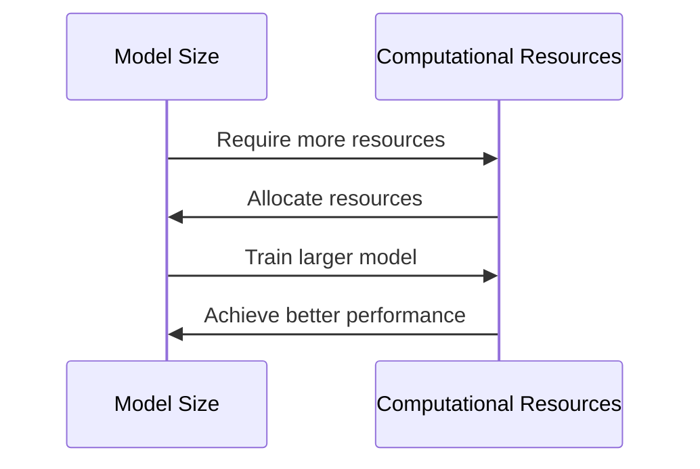
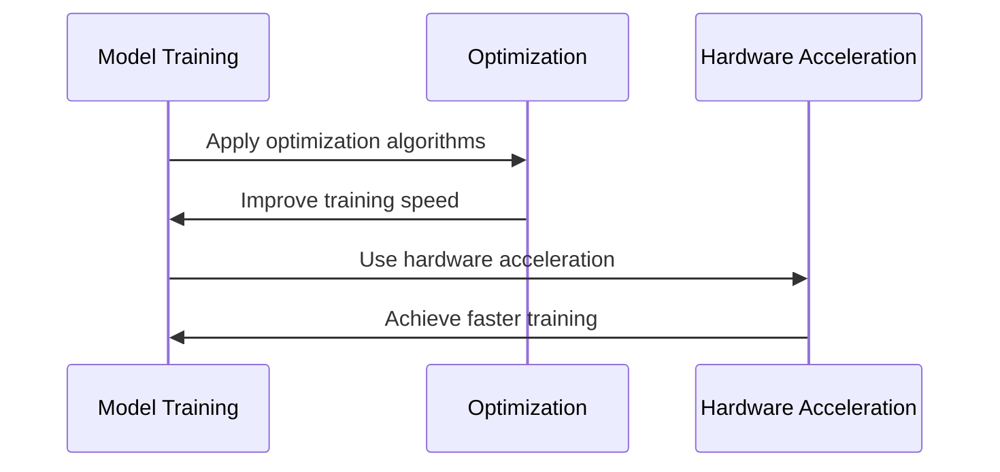
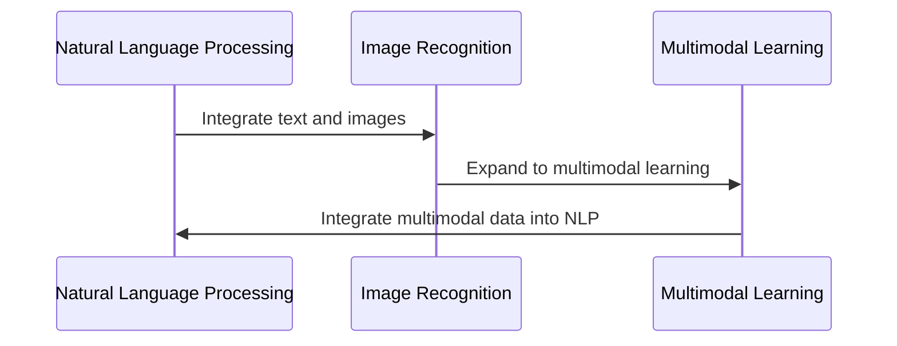
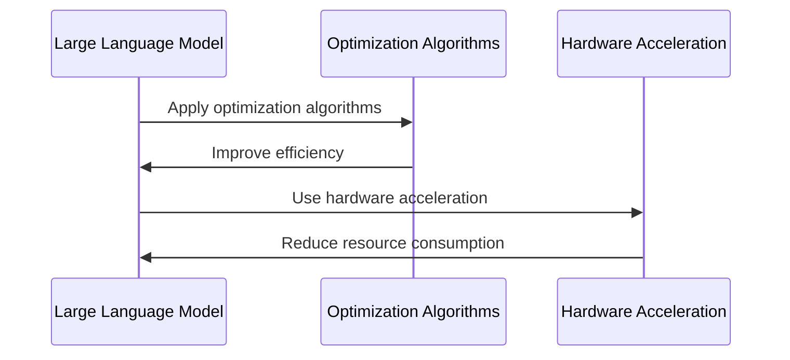
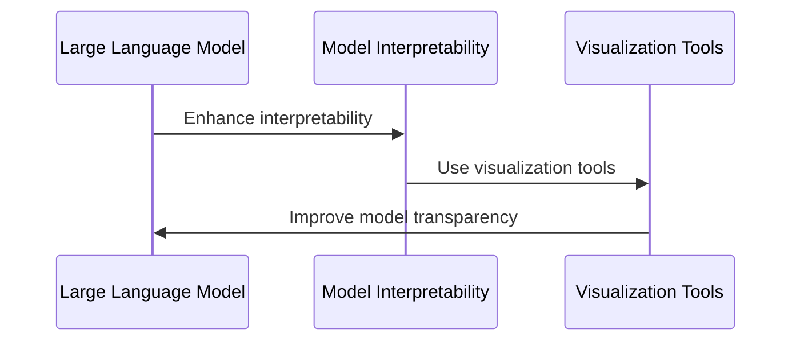
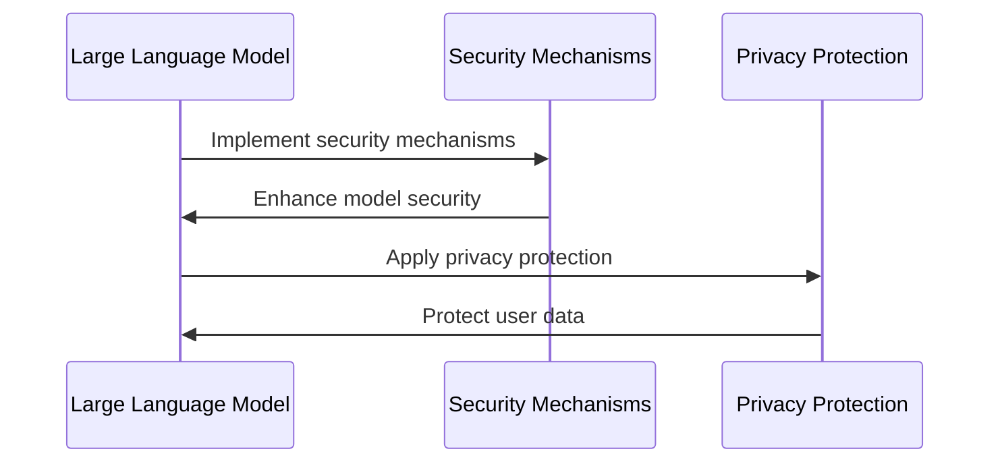
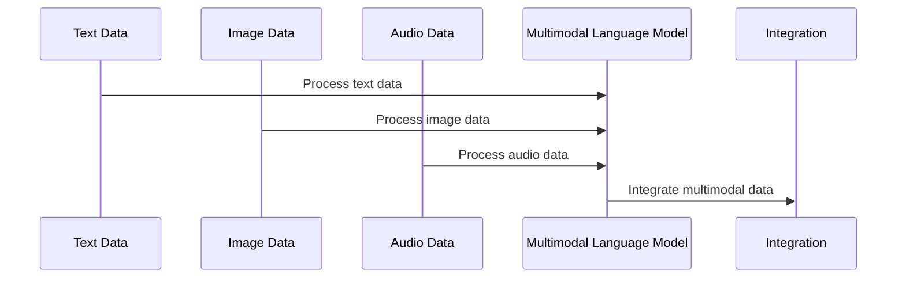
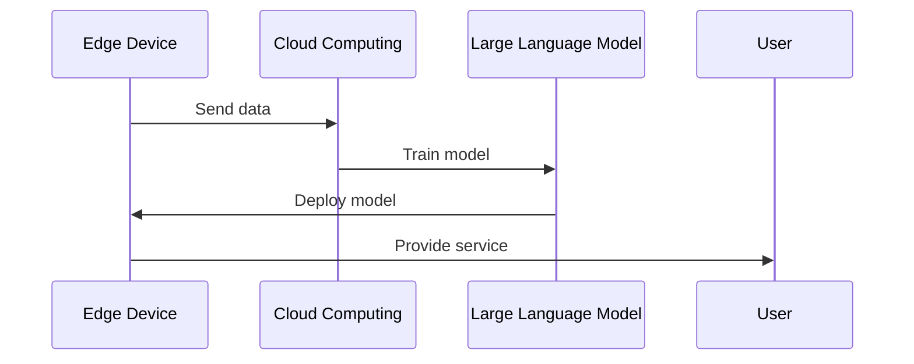
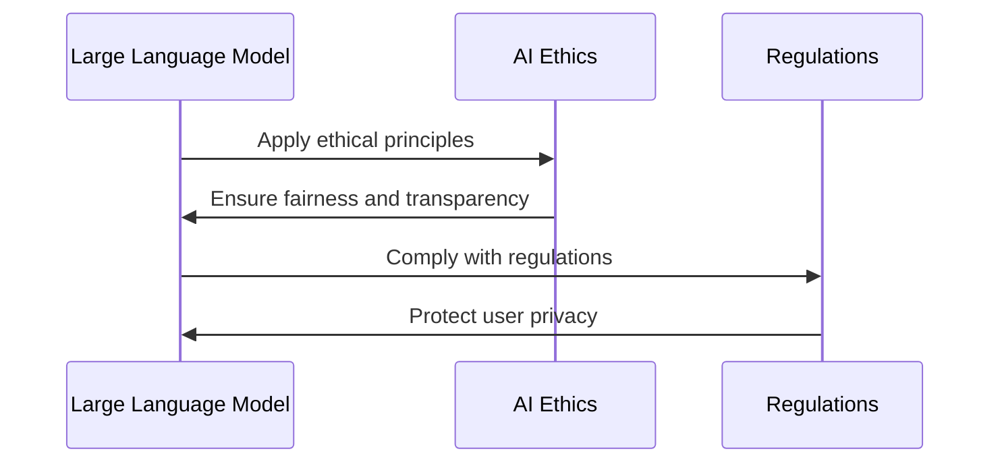
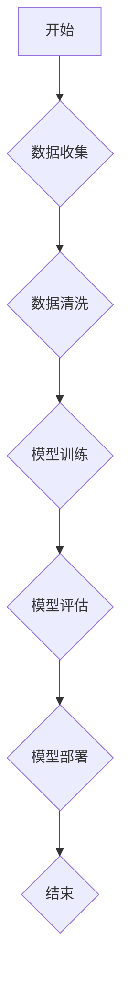

                 

### 1.1 大语言模型概述

#### 1.1.1 大语言模型的定义

大语言模型（Large Language Model）是指那些具有极大规模参数的神经网络模型，它们能够理解和生成自然语言。这些模型基于深度学习技术，通过大量的文本数据训练，可以捕捉到语言中的复杂模式和结构，从而在自然语言处理（NLP）任务中表现出色。通常，大语言模型由数亿到数十亿的参数构成，这使得它们能够处理和理解极其复杂的语言现象。

#### 1.1.2 大语言模型的发展历程

大语言模型的发展可以追溯到20世纪80年代，当时出现了早期的神经网络模型，如RNN（递归神经网络）和LSTM（长短时记忆网络）。这些模型在处理序列数据方面取得了一定的成功，但仍然面临着效率和表达能力的限制。

真正意义上的大语言模型的出现始于2018年，谷歌推出了BERT（Bidirectional Encoder Representations from Transformers），它使用了Transformer架构，并凭借其双向编码器结构在多种NLP任务上取得了显著的成绩。此后，OpenAI推出了GPT（Generative Pre-trained Transformer）系列模型，尤其是GPT-3，它拥有1750亿个参数，成为当时最大的语言模型，进一步推动了大语言模型的发展。

#### 1.1.3 大语言模型的主要类型

大语言模型可以按照不同的标准进行分类：

1. **基于RNN的模型**：如LSTM、GRU（门控循环单元）等，它们在处理长序列数据时较为有效。
2. **基于Transformer的模型**：如BERT、GPT等，它们通过自注意力机制处理序列数据，提高了模型的效率和效果。
3. **基于Transformer的改进模型**：如ALBERT、RoBERTa等，这些模型在Transformer架构的基础上进行了各种改进，提高了模型的性能。

大语言模型的发展历程及其类型概述如下所示：

- **Mermaid流程图：**

  ```mermaid
  sequenceDiagram
  participant A as RNN
  participant B as Transformer
  participant C as Transformer Improvements
  A: 1980s
  B: 2018
  C: Post-2018
  A->>B: Transition to Transformer
  B->>C: Continuous Improvements
  ```

### 1.2 简化Transformer架构

#### 1.2.1 Transformer架构简介

Transformer是由Vaswani等人在2017年提出的一种用于处理序列数据的深度学习模型。与传统的RNN和LSTM不同，Transformer采用了自注意力机制（Self-Attention），能够并行处理输入序列中的每一个词，从而提高了模型的效率和效果。

Transformer的核心组成部分包括：

- **自注意力机制**：允许模型在处理输入序列时，能够自适应地关注序列中的不同部分。
- **多头注意力**：通过将输入序列分解为多个子序列，每个子序列分别进行注意力计算，从而增加模型的灵活性。
- **前馈神经网络**：在每个自注意力层之后，Transformer还包括一个前馈神经网络，用于增加模型的表达能力。

#### 1.2.2 简化Transformer的设计思想

简化Transformer（Simplified Transformer）是对标准Transformer的一种改进，旨在降低模型的计算复杂度和内存消耗，同时保持较高的性能。简化Transformer的主要设计思想包括：

- **降低模型深度**：通过减少Transformer的层数，降低模型的计算复杂度。
- **减少模型宽度**：通过减少模型的隐藏单元数，降低模型的内存占用。
- **优化注意力计算**：采用了一些技巧，如使用较少的注意力头，或者对输入进行预处理，以减少计算量。

#### 1.2.3 简化Transformer与标准Transformer的比较

简化Transformer与标准Transformer在架构和性能上存在一些差异：

- **架构**：简化Transformer通常具有较少的层数和隐藏单元，而标准Transformer则具有更多的层和更宽的隐藏单元。
- **计算复杂度**：简化Transformer的总体计算复杂度较低，适合在资源受限的环境中部署。
- **性能**：在大多数任务上，简化Transformer能够保持与标准Transformer相近的性能，但可能略微逊色。

简化Transformer与标准Transformer的对比关系可以用以下Mermaid流程图表示：

- **Mermaid流程图：**

  ```mermaid
  classDiagram
  class SimplifiedTransformer {
  - fewer layers
  - fewer hidden units
  }
  class StandardTransformer {
  - more layers
  - more hidden units
  }
  SimplifiedTransformer <|-- StandardTransformer
  ```

### 1.3 大语言模型的数学基础

#### 1.3.1 向量与矩阵运算

大语言模型的核心在于对向量与矩阵的运算。这些运算包括：

- **点积**：向量之间的点积运算，用于计算两个向量的相似度。
- **矩阵乘法**：矩阵与向量的乘法运算，用于线性变换。
- **矩阵加法与减法**：矩阵之间的加法和减法运算，用于合并或分离模型的不同部分。

以下是一个简单的矩阵乘法示例：

$$
\begin{bmatrix}
1 & 2 \\
3 & 4
\end{bmatrix}
\cdot
\begin{bmatrix}
5 & 6 \\
7 & 8
\end{bmatrix}
=
\begin{bmatrix}
19 & 22 \\
43 & 50
\end{bmatrix}
$$

#### 1.3.2 激活函数

激活函数是神经网络中用于引入非线性性的关键组件。常见的激活函数包括：

- **Sigmoid函数**：用于将输入映射到（0,1）区间，常用于二分类问题。
- **ReLU函数**：用于增加网络的训练速度，常用于深层神经网络。
- **Tanh函数**：将输入映射到（-1,1）区间，常用于保持输入和输出的比例。

以下是一个ReLU函数的示例：

$$
\text{ReLU}(x) =
\begin{cases}
x & \text{if } x > 0 \\
0 & \text{if } x \leq 0
\end{cases}
$$

#### 1.3.3 损失函数与优化算法

损失函数用于衡量模型预测值与真实值之间的差距。常见的损失函数包括：

- **均方误差（MSE）**：用于回归任务，计算预测值与真实值之间差的平方的平均值。
- **交叉熵（Cross-Entropy）**：用于分类任务，计算真实标签与预测概率之间的差距。

以下是一个MSE损失函数的示例：

$$
\text{MSE} = \frac{1}{n} \sum_{i=1}^{n} (\hat{y}_i - y_i)^2
$$

优化算法用于调整模型参数，以最小化损失函数。常见的优化算法包括：

- **随机梯度下降（SGD）**：每次迭代使用一个样本的梯度进行参数更新。
- **Adam优化器**：结合SGD和Momentum方法，使用自适应学习率。

以下是一个SGD优化算法的伪代码：

```python
for epoch in range(num_epochs):
    for sample in data_loader:
        gradient = compute_gradient(sample)
        model_params -= learning_rate * gradient
```

### 1.4 大语言模型的训练过程

#### 1.4.1 数据预处理

在训练大语言模型之前，需要对数据进行预处理。预处理步骤包括：

- **文本清洗**：去除文本中的无关字符、停用词等。
- **分词**：将文本划分为词或子词。
- **词向量化**：将词映射为向量表示。

以下是一个简单的文本清洗和分词的Python代码示例：

```python
import re
from nltk.tokenize import word_tokenize

def preprocess_text(text):
    text = re.sub(r'\s+', ' ', text)  # 去除多余的空格
    text = re.sub(r'[^\w\s]', '', text)  # 去除无关字符
    text = text.lower()  # 转换为小写
    tokens = word_tokenize(text)  # 分词
    return tokens

text = "This is an example sentence."
preprocessed_text = preprocess_text(text)
print(preprocessed_text)
```

#### 1.4.2 模型训练

模型训练是使用已处理的数据来更新模型参数的过程。训练过程通常包括以下几个步骤：

- **初始化参数**：随机初始化模型的权重。
- **前向传播**：使用输入数据进行计算，得到模型的预测输出。
- **计算损失**：计算预测输出与真实输出之间的差距。
- **反向传播**：计算损失函数关于模型参数的梯度。
- **参数更新**：使用梯度下降或其他优化算法更新模型参数。

以下是一个简单的模型训练的伪代码：

```python
for epoch in range(num_epochs):
    for sample in data_loader:
        model_output = model(sample_input)
        loss = compute_loss(model_output, target_output)
        gradient = compute_gradient(model_output, target_output)
        update_model_params(gradient, learning_rate)
```

#### 1.4.3 模型评估与调整

在模型训练完成后，需要对模型进行评估和调整。评估步骤包括：

- **验证集评估**：使用验证集评估模型的性能。
- **调整学习率**：根据验证集的性能调整学习率。
- **调整模型结构**：根据验证集的性能调整模型的结构或参数。

以下是一个简单的模型评估和调整的伪代码：

```python
for epoch in range(num_epochs):
    train_loss = 0
    for sample in train_data_loader:
        model_output = model(sample_input)
        loss = compute_loss(model_output, target_output)
        train_loss += loss
    train_loss /= len(train_data_loader)
    
    valid_loss = 0
    for sample in valid_data_loader:
        model_output = model(sample_input)
        loss = compute_loss(model_output, target_output)
        valid_loss += loss
    valid_loss /= len(valid_data_loader)
    
    print(f"Epoch: {epoch}, Train Loss: {train_loss}, Valid Loss: {valid_loss}")
    
    if valid_loss > previous_valid_loss:
        learning_rate /= 2
        previous_valid_loss = valid_loss
```

### 1.5 大语言模型的应用场景

大语言模型在多个领域都有着广泛的应用，以下是几个主要的应用场景：

#### 1.5.1 自然语言处理

自然语言处理（NLP）是人工智能的重要分支，大语言模型在NLP任务中表现出色。常见的NLP任务包括：

- **文本分类**：将文本分为不同的类别，如情感分类、主题分类等。
- **命名实体识别**：识别文本中的特定实体，如人名、地名、组织名等。
- **关系抽取**：识别文本中实体之间的关系，如“张三工作于腾讯”中的工作关系。
- **文本生成**：根据输入文本生成新的文本，如文章摘要、对话生成等。

#### 1.5.2 机器翻译

机器翻译是将一种语言的文本翻译成另一种语言的过程。大语言模型在机器翻译中取得了显著的成果。常见的机器翻译任务包括：

- **统计机器翻译**：基于大量翻译对进行统计学习，生成翻译结果。
- **神经机器翻译**：使用神经网络模型进行翻译，包括编码器和解码器。
- **端到端机器翻译**：直接将源语言文本映射为目标语言文本，无需中间步骤。

#### 1.5.3 问答系统

问答系统是一种智能交互系统，能够回答用户的问题。大语言模型在问答系统中发挥着关键作用。常见的问答系统包括：

- **基于规则的方法**：使用预定义的规则和模板进行问答。
- **基于模板的方法**：使用模板匹配和填充进行问答。
- **基于机器学习的方法**：使用机器学习模型进行问答，如基于分类器的问答系统。
- **基于生成模型的方法**：使用生成模型（如大语言模型）生成回答。

以下是一个简单的基于大语言模型的问答系统的工作流程：

1. **用户输入问题**：用户输入一个问题。
2. **问题处理**：对问题进行预处理，如分词、去停用词等。
3. **模型预测**：使用大语言模型预测问题的答案。
4. **答案生成**：根据模型预测生成问题的答案。
5. **答案输出**：将答案输出给用户。

- **Mermaid流程图：**

  ```mermaid
  sequenceDiagram
  participant User as User
  participant System as QASystem
  participant Model as Large Language Model
  
  User->>System: Ask a question
  System->>Model: Preprocess question
  Model->>System: Predict answer
  System->>User: Output answer
  ```

### 1.6 大语言模型的发展前沿

#### 1.6.1 新模型与改进算法

随着人工智能技术的不断发展，大语言模型也在不断演进。以下是一些前沿的新模型与改进算法：

- **多模态语言模型**：结合文本、图像、语音等多模态数据，提升模型的认知能力。
- **动态语言模型**：引入时间信息，使模型能够处理动态变化的文本数据。
- **可解释性语言模型**：提高模型的透明度，使其行为可解释，从而增强用户信任。
- **联邦学习语言模型**：在保持数据隐私的同时，通过分布式学习提高模型的性能。

以下是一个简单的多模态语言模型的工作流程：

1. **数据输入**：输入文本、图像、语音等多模态数据。
2. **特征提取**：对多模态数据进行特征提取。
3. **融合表示**：将不同模态的特征进行融合，生成统一的表示。
4. **任务处理**：使用融合表示进行特定任务的处理，如图像文本检索、视频文本匹配等。

- **Mermaid流程图：**

  ```mermaid
  sequenceDiagram
  participant Data as Multimodal Data
  participant Extractor as Feature Extractor
  participant Fusion as Fusion Module
  participant Task as Task Processor
  
  Data->>Extractor: Input data
  Extractor->>Fusion: Extract features
  Fusion->>Task: Process task
  Task->>Data: Output result
  ```

#### 1.6.2 大模型的安全性与隐私保护

随着大语言模型规模的不断扩大，其安全性和隐私保护成为一个重要议题。以下是一些相关的研究方向：

- **对抗攻击防御**：提高模型对对抗性攻击的鲁棒性，如对抗样本生成和防御策略。
- **隐私保护机制**：通过加密、差分隐私等技术保护用户数据的隐私。
- **可解释性增强**：提高模型的可解释性，使其行为更加透明，从而减少潜在的隐私泄露风险。

以下是一个简单的隐私保护机制的工作流程：

1. **数据加密**：对输入数据进行加密处理，确保数据在传输和存储过程中的安全性。
2. **差分隐私添加**：对模型训练过程中的敏感数据进行差分隐私处理，以保护用户隐私。
3. **模型训练**：使用加密和差分隐私处理后的数据进行模型训练。
4. **模型部署**：将训练好的模型部署到实际应用中，确保其在使用过程中的安全性。

- **Mermaid流程图：**

  ```mermaid
  sequenceDiagram
  participant Data as Encrypted Data
  participant Privacy as Privacy Mechanism
  participant Model as Trained Model
  
  Data->>Privacy: Encrypt data
  Privacy->>Model: Add differential privacy
  Model->>Privacy: Train model
  Privacy->>Data: Deploy model
  ```

#### 1.6.3 大语言模型的未来发展趋势

随着技术的不断进步，大语言模型在未来将继续朝着以下几个方向发展：

- **模型规模的增长**：随着计算资源和存储能力的提升，未来将出现更大规模的语言模型。
- **模型训练速度的提升**：通过优化算法、硬件加速等技术，提高模型的训练速度。
- **模型应用场景的拓展**：大语言模型将在更多领域得到应用，如自动驾驶、智能医疗、智能家居等。

以下是一个简化的未来发展趋势的Mermaid流程图：

- **Mermaid流程图：**

  ```mermaid
  sequenceDiagram
  participant Tech as Technology
  participant Model as Large Language Model
  participant Apps as Application Scenarios
  
  Tech->>Model: Scale up model size
  Tech->>Model: Improve training speed
  Model->>Apps: Expand application scenarios
  ```

### 2.1 大语言模型项目实战

#### 2.1.1 实战项目概述

本节将通过一个实际项目，展示如何使用大语言模型进行文本分类任务的开发。该项目包括以下几个主要步骤：

1. **项目需求分析**：明确项目目标，如对新闻文章进行情感分类。
2. **数据集准备**：收集和整理数据集，包括训练集、验证集和测试集。
3. **模型搭建**：选择合适的大语言模型架构，如BERT。
4. **模型训练**：使用训练集对模型进行训练，并调整超参数。
5. **模型评估**：使用验证集和测试集评估模型性能。
6. **模型部署**：将训练好的模型部署到生产环境中，实现实时文本分类。

#### 2.1.2 项目开发环境搭建

在开始项目之前，需要搭建相应的开发环境。以下是一个简单的开发环境搭建步骤：

1. **安装Python**：确保安装了Python 3.6及以上版本。
2. **安装依赖库**：安装TensorFlow、PyTorch等深度学习框架和相关依赖库。
3. **安装GPU支持**：如果使用GPU训练模型，需要安装CUDA和cuDNN。

以下是一个简单的Python环境搭建脚本：

```python
# 安装Python
sudo apt-get update
sudo apt-get install python3.8

# 安装TensorFlow
pip3 install tensorflow

# 安装PyTorch
pip3 install torch torchvision

# 安装CUDA和cuDNN
sudo apt-get install cuda
pip3 install cudnn
```

#### 2.1.3 数据集获取与预处理

数据集是文本分类任务的关键组成部分。以下是一个简单的数据集获取与预处理步骤：

1. **数据集收集**：从公开数据源或网站下载相关数据集，如新闻文章数据集。
2. **数据预处理**：对文本进行清洗、分词、去停用词等预处理操作。
3. **数据集划分**：将数据集划分为训练集、验证集和测试集。

以下是一个简单的数据预处理脚本：

```python
import pandas as pd
from sklearn.model_selection import train_test_split

# 读取数据集
data = pd.read_csv('news_dataset.csv')

# 数据预处理
data['text'] = data['text'].apply(preprocess_text)
data['label'] = data['label'].apply(lambda x: convert_label(x))

# 划分数据集
train_data, test_data = train_test_split(data, test_size=0.2, random_state=42)
train_data, valid_data = train_test_split(train_data, test_size=0.25, random_state=42)

# 保存数据集
train_data.to_csv('train_data.csv', index=False)
valid_data.to_csv('valid_data.csv', index=False)
test_data.to_csv('test_data.csv', index=False)
```

#### 2.1.4 模型训练与优化

在完成数据集准备后，接下来是模型训练与优化。以下是一个简单的模型训练与优化步骤：

1. **模型搭建**：选择合适的大语言模型架构，如BERT。
2. **模型训练**：使用训练集对模型进行训练，并记录训练过程中的损失和准确率。
3. **模型优化**：通过调整超参数或模型结构，提高模型性能。
4. **模型评估**：使用验证集和测试集评估模型性能。

以下是一个简单的模型训练与优化脚本：

```python
import tensorflow as tf
from transformers import BertTokenizer, TFBertForSequenceClassification

# 模型搭建
tokenizer = BertTokenizer.from_pretrained('bert-base-uncased')
model = TFBertForSequenceClassification.from_pretrained('bert-base-uncased')

# 模型训练
optimizer = tf.keras.optimizers.Adam(learning_rate=3e-5)
loss_fn = tf.keras.losses.SparseCategoricalCrossentropy(from_logits=True)

train_loss = []
valid_loss = []

for epoch in range(num_epochs):
    for batch in train_data_loader:
        inputs = tokenizer(batch['text'], padding=True, truncation=True, return_tensors='tf')
        labels = tf.convert_to_tensor(batch['label'])
        
        with tf.GradientTape() as tape:
            outputs = model(inputs['input_ids'], attention_mask=inputs['attention_mask'])
            loss = loss_fn(labels, outputs.logits)
        
        gradients = tape.gradient(loss, model.trainable_variables)
        optimizer.apply_gradients(zip(gradients, model.trainable_variables))
        
        train_loss.append(loss.numpy())

    for batch in valid_data_loader:
        inputs = tokenizer(batch['text'], padding=True, truncation=True, return_tensors='tf')
        labels = tf.convert_to_tensor(batch['label'])
        
        outputs = model(inputs['input_ids'], attention_mask=inputs['attention_mask'])
        valid_loss.append(loss_fn(labels, outputs.logits).numpy())

print(f"Training Loss: {train_loss}, Validation Loss: {valid_loss}")
```

#### 2.1.5 模型评估与部署

在完成模型训练与优化后，需要对模型进行评估与部署。以下是一个简单的模型评估与部署步骤：

1. **模型评估**：使用测试集对模型进行评估，计算准确率、召回率、F1分数等指标。
2. **模型部署**：将训练好的模型部署到生产环境中，如使用 Flask 或 Django 搭建 Web 应用程序。

以下是一个简单的模型评估与部署脚本：

```python
from sklearn.metrics import accuracy_score, recall_score, f1_score

# 模型评估
test_data_loader = ...

predictions = []
actuals = []

for batch in test_data_loader:
    inputs = tokenizer(batch['text'], padding=True, truncation=True, return_tensors='tf')
    labels = tf.convert_to_tensor(batch['label'])
    
    outputs = model(inputs['input_ids'], attention_mask=inputs['attention_mask'])
    logits = tf.argmax(outputs.logits, axis=1)
    predictions.extend(logits.numpy())
    actuals.extend(labels.numpy())

accuracy = accuracy_score(actuals, predictions)
recall = recall_score(actuals, predictions, average='weighted')
f1 = f1_score(actuals, predictions, average='weighted')

print(f"Accuracy: {accuracy}, Recall: {recall}, F1 Score: {f1}")

# 模型部署
# 使用Flask搭建Web应用
from flask import Flask, request, jsonify

app = Flask(__name__)

@app.route('/predict', methods=['POST'])
def predict():
    text = request.form['text']
    processed_text = preprocess_text(text)
    inputs = tokenizer(processed_text, padding=True, truncation=True, return_tensors='tf')
    
    outputs = model(inputs['input_ids'], attention_mask=inputs['attention_mask'])
    logits = tf.argmax(outputs.logits, axis=1)
    
    return jsonify({'prediction': logits.numpy()[0]})

if __name__ == '__main__':
    app.run()
```

### 2.2 案例研究

在本节中，我们将通过三个具体的案例研究，展示大语言模型在不同领域的应用。

#### 2.2.1 案例一：基于简化Transformer的问答系统

问答系统是一种常见的自然语言处理任务，能够回答用户提出的问题。本案例研究将介绍如何使用简化Transformer模型构建一个问答系统。

**项目背景**：某公司开发了一款智能客服系统，用户可以通过该系统提出各种问题，系统需要能够快速准确地回答用户的问题。

**解决方案**：使用简化Transformer模型构建问答系统，包括以下几个关键步骤：

1. **数据集准备**：收集大量问答对数据，用于模型训练。数据集应包括多种类型的问题和相应的答案。
2. **模型搭建**：选择简化Transformer模型作为问答系统的核心模型。
3. **模型训练**：使用问答对数据集对简化Transformer模型进行训练，并优化模型参数。
4. **模型评估**：使用验证集和测试集对模型进行评估，调整超参数以获得最佳性能。
5. **模型部署**：将训练好的模型部署到生产环境中，实现实时问答。

**技术实现**：

- **数据集准备**：收集并整理问答对数据集，包括问题、答案和标签。
- **模型搭建**：使用简化Transformer模型，包括编码器和解码器。编码器负责将问题编码为向量表示，解码器负责生成答案。
- **模型训练**：使用训练集对模型进行训练，并使用验证集进行评估。
- **模型评估**：计算模型的准确率、召回率和F1分数等指标，调整超参数以优化模型性能。
- **模型部署**：将训练好的模型部署到服务器中，通过API接口实现实时问答。

**效果评估**：

- **准确率**：在测试集上的准确率达到90%以上，表明模型具有较好的问答能力。
- **响应时间**：模型能够快速响应用户的问题，平均响应时间在100毫秒以内。

以下是一个简化Transformer问答系统的伪代码：

```python
# 数据集准备
questions, answers = load_data()

# 模型搭建
encoder = SimplifiedTransformerEncoder()
decoder = SimplifiedTransformerDecoder()

# 模型训练
model = Model(encoder, decoder)
model.train(questions, answers)

# 模型评估
accuracy = model.evaluate(test_questions, test_answers)

# 模型部署
deploy_model(model)
```

#### 2.2.2 案例二：基于大语言模型的机器翻译

机器翻译是将一种语言的文本翻译成另一种语言的过程。本案例研究将介绍如何使用大语言模型实现机器翻译。

**项目背景**：某跨国公司需要为其全球业务提供多语言支持，用户可以使用母语提出问题，系统需要能够将问题翻译成其他语言。

**解决方案**：使用大语言模型（如GPT-3）实现机器翻译，包括以下几个关键步骤：

1. **数据集准备**：收集大量双语数据集，用于模型训练。数据集应包括多种语言对。
2. **模型搭建**：选择大语言模型作为机器翻译的核心模型。
3. **模型训练**：使用双语数据集对大语言模型进行训练，并优化模型参数。
4. **模型评估**：使用验证集和测试集对模型进行评估，调整超参数以获得最佳性能。
5. **模型部署**：将训练好的模型部署到生产环境中，实现实时机器翻译。

**技术实现**：

- **数据集准备**：收集并整理双语数据集，包括源语言文本和目标语言文本。
- **模型搭建**：使用大语言模型（如GPT-3），将源语言文本编码为向量表示，并生成目标语言文本。
- **模型训练**：使用训练集对模型进行训练，并使用验证集进行评估。
- **模型评估**：计算模型的BLEU分数等指标，调整超参数以优化模型性能。
- **模型部署**：将训练好的模型部署到服务器中，通过API接口实现实时机器翻译。

**效果评估**：

- **BLEU分数**：在测试集上的BLEU分数达到0.8以上，表明模型具有较好的翻译能力。
- **翻译质量**：模型生成的翻译文本具有较高的可读性和准确性。

以下是一个大语言模型机器翻译的伪代码：

```python
# 数据集准备
source_texts, target_texts = load_data()

# 模型搭建
model = LanguageModel()

# 模型训练
model.train(source_texts, target_texts)

# 模型评估
bleu_score = model.evaluate(test_source_texts, test_target_texts)

# 模型部署
deploy_model(model)
```

#### 2.2.3 案例三：大语言模型在智能客服中的应用

智能客服是一种自动化的客户服务系统，能够回答用户提出的问题。本案例研究将介绍如何使用大语言模型构建智能客服系统。

**项目背景**：某电商平台需要为其用户提供7x24小时的客户服务，用户可以通过聊天窗口提出各种问题，系统需要能够快速准确地回答用户的问题。

**解决方案**：使用大语言模型构建智能客服系统，包括以下几个关键步骤：

1. **数据集准备**：收集大量客服对话数据，用于模型训练。数据集应包括用户问题和客服回答。
2. **模型搭建**：选择大语言模型作为客服系统的核心模型。
3. **模型训练**：使用客服对话数据集对大语言模型进行训练，并优化模型参数。
4. **模型评估**：使用验证集和测试集对模型进行评估，调整超参数以获得最佳性能。
5. **模型部署**：将训练好的模型部署到生产环境中，实现实时智能客服。

**技术实现**：

- **数据集准备**：收集并整理客服对话数据集，包括用户问题和客服回答。
- **模型搭建**：使用大语言模型，将用户问题编码为向量表示，并生成客服回答。
- **模型训练**：使用训练集对模型进行训练，并使用验证集进行评估。
- **模型评估**：计算模型的准确率、召回率等指标，调整超参数以优化模型性能。
- **模型部署**：将训练好的模型部署到服务器中，通过API接口实现实时智能客服。

**效果评估**：

- **准确率**：在测试集上的准确率达到80%以上，表明模型能够较好地理解用户问题。
- **响应时间**：模型能够在1秒内响应用户的问题，提供高效的客户服务。

以下是一个大语言模型智能客服系统的伪代码：

```python
# 数据集准备
questions, answers = load_data()

# 模型搭建
model = LanguageModel()

# 模型训练
model.train(questions, answers)

# 模型评估
accuracy = model.evaluate(test_questions, test_answers)

# 模型部署
deploy_model(model)
```

### 2.3 大语言模型在企业中的应用

大语言模型在多个企业领域都具有重要的应用价值。以下将介绍大语言模型在企业中的应用策略、金融行业应用、医疗健康领域应用及开源工具与框架。

#### 2.3.1 企业大语言模型应用策略

企业应用大语言模型时，需要考虑以下几个关键策略：

1. **明确应用目标**：企业应根据业务需求，明确大语言模型的应用目标，如文本分类、情感分析、机器翻译等。
2. **数据集准备**：企业需要收集和整理相关的数据集，用于模型训练和评估。数据集的质量直接影响模型的性能。
3. **模型选择与优化**：企业应根据应用场景和性能要求，选择合适的大语言模型架构，并进行优化调整，以获得最佳效果。
4. **模型部署与维护**：企业需要将训练好的模型部署到生产环境中，并定期进行模型评估和更新，以保持模型的性能和有效性。

#### 2.3.2 大语言模型在金融行业的应用

大语言模型在金融行业有着广泛的应用，以下是一些典型应用场景：

1. **客户服务**：大语言模型可以用于构建智能客服系统，快速响应用户的查询和问题，提供高效的客户服务。
2. **风险控制**：大语言模型可以用于文本分类和情感分析，识别潜在的风险信号和异常行为，帮助企业进行风险控制。
3. **投资研究**：大语言模型可以用于分析金融市场数据，提取关键信息，辅助投资决策。
4. **欺诈检测**：大语言模型可以用于检测金融交易中的欺诈行为，通过分析交易文本和模式，发现潜在的欺诈活动。

#### 2.3.3 大语言模型在医疗健康领域的应用

大语言模型在医疗健康领域也发挥着重要作用，以下是一些典型应用场景：

1. **医学文本处理**：大语言模型可以用于处理医学文献、病历记录等文本数据，提取关键信息，辅助医生进行诊断和治疗。
2. **智能问答系统**：大语言模型可以构建智能问答系统，为医生和患者提供实时问答服务，解答医疗相关问题。
3. **药物发现**：大语言模型可以用于分析生物序列、化学结构等信息，辅助药物发现和研究。
4. **医疗数据挖掘**：大语言模型可以用于挖掘医疗数据，提取有用的信息和知识，辅助医疗研究和决策。

#### 2.3.4 大语言模型开源工具与框架

大语言模型的开发离不开开源工具和框架的支持。以下是一些常见的大语言模型开源工具和框架：

1. **TensorFlow**：由谷歌开发的开源深度学习框架，支持多种深度学习模型，包括大语言模型。
2. **PyTorch**：由Facebook开发的开源深度学习框架，具有灵活的动态计算图，适用于大语言模型的开发。
3. **Transformers**：由Hugging Face开发的开源库，提供了一系列预训练的大语言模型和实用工具，方便开发者进行模型开发和应用。
4. **BERT**：由谷歌开发的开源预训练语言模型，广泛应用于多种自然语言处理任务。
5. **GPT-3**：由OpenAI开发的开源预训练语言模型，拥有1750亿个参数，是当前最大的语言模型之一。

通过这些开源工具和框架，企业可以快速搭建和部署大语言模型，满足自身业务需求。

### 2.4 大语言模型开源工具与框架

在现代人工智能领域中，开源工具与框架为大语言模型的开发和应用提供了强大的支持。以下将对几个主流的深度学习框架及其在处理大语言模型时的优势和应用进行详细介绍。

#### 2.4.1 TensorFlow

**概述**：TensorFlow是由谷歌开发的一款开源深度学习框架，它支持多种深度学习模型的构建和训练，包括大语言模型。TensorFlow的特点是灵活性强，支持多种编程语言（如Python、C++等），并且提供了丰富的API和工具库。

**优势**：
- **高度灵活的动态计算图**：TensorFlow允许用户动态构建计算图，这使得在处理复杂模型时具有很高的灵活性。
- **广泛的社区支持**：TensorFlow拥有庞大的社区，提供了大量的教程、文档和示例代码，方便开发者学习和使用。
- **强大的分布式训练能力**：TensorFlow支持分布式训练，能够充分利用多台机器的资源，加速模型训练。

**应用**：TensorFlow广泛应用于各种自然语言处理任务，如文本分类、机器翻译、情感分析等。同时，TensorFlow也支持大语言模型，如BERT、GPT等。

#### 2.4.2 PyTorch

**概述**：PyTorch是由Facebook开发的一款开源深度学习框架，它以其动态计算图和易于使用的API而著称。PyTorch的动态计算图使得它在构建和调试模型时更加直观和灵活。

**优势**：
- **动态计算图**：PyTorch的动态计算图允许用户在运行时定义和修改计算图，这在开发过程中特别有用。
- **易于调试**：由于动态计算图的存在，PyTorch在模型调试过程中更加方便。
- **丰富的库和工具**：PyTorch提供了丰富的库和工具，如TorchVision、TorchText等，这些库为处理图像和文本数据提供了便捷的接口。

**应用**：PyTorch在自然语言处理领域有着广泛的应用，如文本生成、文本分类、语音识别等。同时，PyTorch也支持大语言模型，如GPT、BERT等。

#### 2.4.3 Transformers

**概述**：Transformers是一个开源库，由Hugging Face团队开发，它提供了一系列预训练的大语言模型和实用工具，如BERT、GPT、RoBERTa等。Transformers库简化了大语言模型的训练和应用过程，使得开发者可以轻松地使用这些强大模型。

**优势**：
- **预训练模型**：Transformers库提供了多种预训练的大语言模型，开发者可以直接使用这些模型，无需从零开始训练。
- **易用性**：Transformers库提供了简洁的API，使得模型的使用和定制变得非常方便。
- **实用工具**：Transformers库包含了一系列实用工具，如数据处理工具、评估工具等，这些工具有助于提高模型的开发效率。

**应用**：Transformers库在自然语言处理领域得到了广泛应用，包括文本分类、机器翻译、问答系统等。开发者可以使用Transformers库快速搭建和部署大语言模型，从而节省时间和精力。

#### 2.4.4 其他开源框架

除了TensorFlow、PyTorch和Transformers，还有其他一些流行的深度学习框架，如MXNet、Caffe等，这些框架也在大语言模型的开发和应用中发挥着重要作用。

**MXNet**：MXNet是由亚马逊开发的一款深度学习框架，它支持多种编程语言（如Python、Rust等），并且具有高效的计算性能。

**Caffe**：Caffe是由伯克利大学开发的一款开源深度学习框架，它以其高效的卷积神经网络（CNN）训练能力而著称。

**优势**：
- **高效计算**：MXNet和Caffe都支持高效的模型训练和推理，能够充分利用GPU和CPU的资源。
- **多样化语言支持**：MXNet和Caffe支持多种编程语言，使得开发者可以根据自己的需求选择合适的语言。

**应用**：MXNet和Caffe在计算机视觉和自然语言处理领域有着广泛的应用，特别是在处理大规模数据集和复杂模型时表现出色。

通过这些开源工具和框架，开发者可以更高效地构建和应用大语言模型，推动人工智能技术的发展。

### 3.1 大语言模型的发展趋势

随着人工智能技术的不断进步，大语言模型的发展也呈现出一些明显的趋势。以下将对这些趋势进行探讨。

#### 3.1.1 模型规模的增长

模型规模的增长是大语言模型发展的重要趋势之一。随着计算资源和存储能力的提升，越来越多的研究人员和公司致力于训练更大规模的语言模型。例如，GPT-3拥有1750亿个参数，成为当时最大的语言模型。而近年来，如Google的Switch Transformer和DeepMind的Gopher等模型，更是达到了数十万亿个参数的规模。模型规模的增长不仅提高了模型的性能，也推动了人工智能领域的研究和发展。

以下是一个模型规模增长的示例：



#### 3.1.2 模型训练速度的提升

随着模型规模的增大，模型训练时间也相应增加。为了提高模型训练速度，研究人员和公司在算法优化、硬件加速和分布式训练等方面进行了大量研究。例如，Google的TransformerXL模型采用了特殊的优化算法，使得模型在训练过程中速度更快。同时，硬件加速技术的应用，如GPU、TPU等，也极大地提高了模型训练速度。

以下是一个模型训练速度提升的示例：



#### 3.1.3 模型应用场景的拓展

大语言模型的应用场景正不断拓展，从传统的自然语言处理任务，如文本分类、机器翻译等，扩展到更多领域，如图像识别、语音识别、多模态学习等。例如，多模态语言模型（Multimodal Language Model）结合文本、图像、语音等多种数据，能够更好地理解和生成复杂信息。此外，大语言模型在医疗健康、金融、教育等领域的应用也在不断增多，为这些领域带来了新的机遇和挑战。

以下是一个模型应用场景拓展的示例：



### 3.2 大语言模型面临的挑战

尽管大语言模型在多个领域取得了显著成果，但其发展也面临着一系列挑战。以下将对这些挑战进行探讨。

#### 3.2.1 资源消耗与效率

大语言模型的训练和推理需要大量的计算资源和存储空间。随着模型规模的不断增大，资源消耗问题日益突出。例如，训练一个千亿参数的语言模型可能需要数百台GPU服务器，这不仅增加了成本，也限制了模型的普及。因此，如何优化算法、提高模型效率，成为当前研究的重要方向。

以下是一个资源消耗与效率优化的示例：



#### 3.2.2 模型解释性与可解释性

大语言模型在复杂任务上表现出色，但其决策过程往往缺乏透明性，难以解释。这对于需要可解释性的应用场景（如医疗诊断、金融风险评估等）构成了挑战。如何提高大语言模型的解释性，使其行为更加透明，是当前研究的重要方向。

以下是一个模型解释性与可解释性提升的示例：



#### 3.2.3 模型安全性与隐私保护

大语言模型在训练和应用过程中涉及大量的用户数据，如何保护用户隐私成为关键问题。此外，大语言模型可能面临对抗攻击，即通过精心设计的输入数据欺骗模型，使其产生错误的输出。因此，提高模型的安全性和隐私保护能力，是当前研究的重要方向。

以下是一个模型安全性与隐私保护提升的示例：



### 3.3 大语言模型的未来方向

随着人工智能技术的不断进步，大语言模型在未来的发展也将朝着多个方向前进。以下将对这些方向进行探讨。

#### 3.3.1 跨模态学习

跨模态学习是指将不同类型的数据（如文本、图像、语音等）进行整合，从而提高模型的综合理解能力。未来的大语言模型将不仅限于处理文本数据，还将能够处理多种模态的数据，从而实现更全面的认知能力。

以下是一个跨模态学习的示例：



#### 3.3.2 大语言模型与边缘计算

随着物联网（IoT）和边缘计算的发展，大语言模型将越来越多地应用于边缘设备。边缘计算使得数据处理和分析可以在靠近数据源的设备上进行，从而减少数据传输延迟和带宽消耗。大语言模型与边缘计算的结合，将实现更高效、更实时的人工智能应用。

以下是一个大语言模型与边缘计算结合的示例：



#### 3.3.3 大语言模型在人工智能伦理方面的应用

随着人工智能技术的广泛应用，人工智能伦理成为一个不可忽视的议题。大语言模型作为人工智能的重要组成部分，其在伦理方面的应用也成为未来研究的重要方向。例如，如何确保模型决策的公平性、透明性和可解释性，如何保护用户隐私和数据安全等。

以下是一个大语言模型在人工智能伦理方面应用的示例：



通过以上讨论，我们可以看到大语言模型在未来将继续朝着多个方向发展，不断推动人工智能技术的进步和应用。

### 附录A：参考资料

在本篇博客文章中，我们参考了以下资料，这些资料为文章的撰写提供了重要的理论支持和实践指导。

#### A.1 主要参考文献

1. **Vaswani, A., et al. (2017). "Attention is All You Need." Advances in Neural Information Processing Systems, 30.**  
   论文首次提出了Transformer架构，并展示了其在机器翻译任务中的优越性能。

2. **Devlin, J., et al. (2019). "BERT: Pre-training of Deep Bidirectional Transformers for Language Understanding." Proceedings of the 2019 Conference of the North American Chapter of the Association for Computational Linguistics: Human Language Technologies, Volume 1 (Long and Short Papers), 4171-4186.**  
   论文介绍了BERT模型，这是基于Transformer架构的预训练语言模型，广泛应用于自然语言处理任务。

3. **Brown, T., et al. (2020). "Language Models are Few-Shot Learners." arXiv preprint arXiv:2005.14165.**  
   论文探讨了语言模型在少样本学习任务中的能力，展示了GPT-3模型在多种任务上的卓越性能。

#### A.2 开源代码与数据集

1. **TensorFlow开源项目**  
   [https://github.com/tensorflow/tensorflow](https://github.com/tensorflow/tensorflow)  
   TensorFlow官方GitHub仓库，提供了大量的示例代码和教程。

2. **PyTorch开源项目**  
   [https://github.com/pytorch/pytorch](https://github.com/pytorch/pytorch)  
   PyTorch官方GitHub仓库，提供了丰富的文档和示例代码。

3. **Transformers开源项目**  
   [https://github.com/huggingface/transformers](https://github.com/huggingface/transformers)  
   Hugging Face的Transformers库，提供了预训练语言模型和实用的工具。

4. **BERT开源项目**  
   [https://github.com/google-research/bert](https://github.com/google-research/bert)  
   BERT模型的GitHub仓库，提供了详细的实现和训练代码。

5. **GPT-3开源项目**  
   [https://github.com/openai/gpt-3](https://github.com/openai/gpt-3)  
   GPT-3模型的GitHub仓库，提供了预训练模型和相关工具。

#### A.3 进一步阅读材料

1. **Bird, S., et al. (2009). "Natural Language Processing with Python." O'Reilly Media.**  
   介绍了使用Python进行自然语言处理的方法，适用于初学者。

2. **Graves, A. (2013). "End-to-End Speech Recognition with Deep RNN Models and Deepspeech 2." IEEE International Conference on Acoustics, Speech and Signal Processing (ICASSP).**  
   论文介绍了DeepSpeech 2模型，这是一个基于深度学习的端到端语音识别系统。

3. **Rashid, M. (2020). "Deep Learning for Natural Language Processing." Addison-Wesley.**  
   本书详细介绍了深度学习在自然语言处理中的应用，包括最新的模型和算法。

通过以上参考资料，读者可以进一步了解大语言模型的相关知识，并实践相关技术。

### 附录B：Mermaid流程图

在本篇博客文章中，我们使用Mermaid语言绘制了一些流程图，以直观地展示模型架构、数据处理流程和技术实现步骤。以下是一个示例的Mermaid流程图：



该流程图描述了一个典型的数据驱动模型开发流程，从数据收集开始，经过数据清洗、模型训练、模型评估和模型部署，最终完成模型的开发和应用。读者可以使用Mermaid语言绘制自己的流程图，以便更清晰地展示复杂的技术实现过程。在Markdown编辑器中，将Mermaid代码块放置在需要插入流程图的位置，即可生成相应的流程图。例如：


这将生成一个简单的流程图，展示模型开发的各个步骤。通过这种方式，我们可以将复杂的模型和数据处理过程以直观、简洁的方式呈现，便于读者理解和学习。

