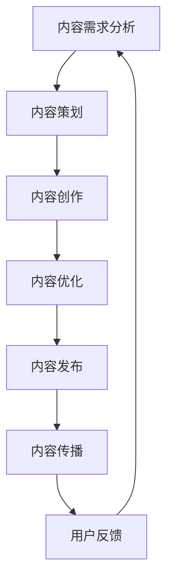
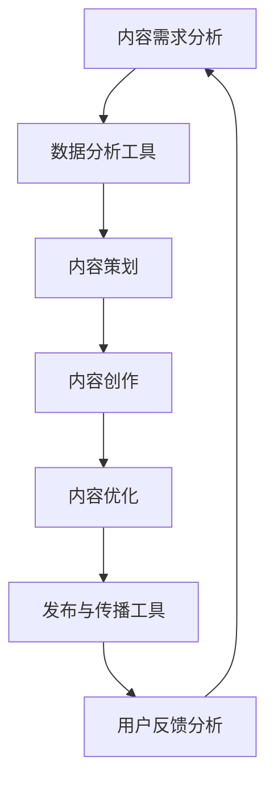

                 

### 文章标题

"如何利用技术能力进行内容创作"

关键词：内容创作、技术能力、文字、图像、视频、音频、多媒体整合、创意思维、案例分析、未来展望

摘要：
随着技术的发展，内容创作领域正经历着前所未有的变革。本文将深入探讨如何利用技术能力提升内容创作的效率和质量，涵盖文字、图像、视频、音频等多媒体内容创作技术，以及如何通过多媒体整合与传播策略实现创意内容的突破。同时，本文将通过成功案例分析和技术资源推荐，为读者提供实际操作指南和未来展望。

---

## 目录大纲

## 第一部分：内容创作概述

### 第1章：内容创作概述

#### 1.1 内容创作的定义与重要性

#### 1.2 内容创作的类型与形式

#### 1.3 内容创作的基本原则

#### 1.4 内容创作的市场环境分析

#### 1.5 内容创作的发展趋势与挑战

### 第2章：技术能力在内容创作中的应用

#### 2.1 技术能力在内容创作中的角色

#### 2.2 利用技术能力提升创作效率

#### 2.3 技术工具在内容创作中的应用

#### 2.4 技术对内容创作模式的影响

#### 2.5 技术驱动的内容创新案例

## 第二部分：内容创作技术与工具

### 第3章：文字内容创作技术

#### 3.1 文本生成与编辑工具

#### 3.2 自然语言处理技术基础

#### 3.3 文本分析工具与应用

#### 3.4 文字内容创作的优化策略

#### 3.5 实战案例：利用技术工具提升文字创作质量

### 第4章：图像与视频内容创作技术

#### 4.1 图像处理技术

#### 4.2 视频剪辑与特效制作

#### 4.3 图像与视频内容的编辑工具

#### 4.4 图像与视频内容的优化与传播

#### 4.5 实战案例：利用技术工具制作高质量图像与视频

### 第5章：音频内容创作技术

#### 5.1 音频编辑与处理

#### 5.2 语音合成与识别技术

#### 5.3 音频内容的创意表达

#### 5.4 实战案例：利用技术工具制作个性化音频内容

### 第6章：多媒体内容整合与传播

#### 6.1 多媒体内容整合策略

#### 6.2 多平台内容传播策略

#### 6.3 社交媒体与内容创作

#### 6.4 实战案例：利用技术提升多媒体内容的传播效果

### 第7章：技术驱动的创意思维

#### 7.1 创意思维的基本方法

#### 7.2 技术如何激发创意

#### 7.3 技术与创意的融合策略

#### 7.4 实战案例：利用技术实现创意内容的突破

## 第三部分：内容创作案例分析

### 第8章：成功案例解析

#### 8.1 案例一：技术助力品牌营销

#### 8.2 案例二：创新内容形式的实践

#### 8.3 案例三：利用大数据进行内容创作

#### 8.4 案例四：技术驱动的跨媒体内容创作

### 第9章：未来内容创作的展望

#### 9.1 新技术对内容创作的影响

#### 9.2 内容创作行业的发展趋势

#### 9.3 技术与内容的深度融合

#### 9.4 未来内容创作的新模式与挑战

## 附录

### 附录A：常用内容创作工具简介

#### A.1 文字内容创作工具

#### A.2 图像与视频内容创作工具

#### A.3 音频内容创作工具

#### A.4 多媒体内容整合与传播工具

### 附录B：技术资源与学习资料推荐

#### B.1 开源文本生成与编辑工具

#### B.2 图像与视频处理技术资源

#### B.3 音频编辑与处理技术资源

#### B.4 创意思维与内容创作相关书籍与课程

# 资料图


---

### 第1章：内容创作概述

#### 1.1 内容创作的定义与重要性

内容创作是一个广泛而复杂的领域，它涵盖了从文字、图像、音频到视频等各种形式的内容生成。内容创作的核心在于创造有价值、有吸引力、有影响力的信息，以满足受众的需求和兴趣。随着互联网和数字技术的发展，内容创作已经成为企业和个人展示才华、建立品牌、传递信息的重要途径。

内容创作的重要性体现在以下几个方面：

1. **品牌塑造**：高质量的内容可以提升企业的品牌形象，增强受众对品牌的认知和好感。
2. **营销推广**：内容创作是营销策略的核心，通过创意和有价值的内容，可以吸引潜在客户，提升销售业绩。
3. **知识传播**：内容创作是知识传播的重要载体，可以帮助专业人士、学者和爱好者分享和交流知识。
4. **社会影响**：优秀的作品可以引发社会关注和讨论，影响社会舆论和价值观。

#### 1.2 内容创作的类型与形式

内容创作的类型和形式多样，根据内容的形式和用途，可以大致分为以下几类：

1. **文字内容**：包括博客文章、书籍、报告、新闻稿等。
2. **图像内容**：包括照片、插图、漫画、设计图等。
3. **视频内容**：包括短片、纪录片、广告、直播等。
4. **音频内容**：包括音乐、播客、有声书等。
5. **多媒体内容**：结合文字、图像、音频、视频等多种形式，实现更丰富的内容表达。

#### 1.3 内容创作的基本原则

进行内容创作时，应遵循以下基本原则：

1. **受众导向**：内容创作应满足受众的需求和兴趣，关注受众的需求和反馈。
2. **创意独特**：创新和独特性是内容创作的重要特点，能吸引受众的注意力。
3. **质量优先**：高质量的内容能提高受众的满意度，建立专业和可靠的声誉。
4. **持续更新**：定期更新内容可以维持受众的兴趣，增强内容的活力。
5. **多样化表达**：利用多种形式和媒介，实现内容的多角度和多层次的传达。

#### 1.4 内容创作的市场环境分析

内容创作的市场环境正在发生深刻的变化，主要体现在以下几个方面：

1. **数字化趋势**：随着数字技术的发展，越来越多的内容通过互联网进行传播和消费。
2. **平台竞争**：各大内容平台（如微信、微博、抖音、YouTube等）竞争激烈，内容创作者需要适应平台规则和用户习惯。
3. **消费者变化**：消费者对内容的需求越来越多样化，个性化、互动性和体验性成为内容创作的重要方向。
4. **技术进步**：人工智能、大数据、区块链等新技术的发展，为内容创作提供了新的工具和方法。
5. **监管政策**：内容创作的市场需要遵守相应的法律法规，确保内容的合法性和社会责任。

#### 1.5 内容创作的发展趋势与挑战

内容创作的发展趋势和面临的挑战如下：

1. **个性化与精准化**：内容创作将更加注重个性化，通过数据分析和技术手段，实现内容与受众的精准匹配。
2. **多媒体融合**：多媒体内容创作将成为主流，融合多种媒介形式，实现内容的表现力和吸引力。
3. **技术创新**：内容创作将越来越多地依赖新技术，如人工智能、虚拟现实、增强现实等。
4. **版权问题**：内容创作的版权保护仍然是一个难题，需要制定更加完善的版权政策和法规。
5. **内容质量**：内容创作的质量要求越来越高，创作者需要不断提升自身的专业素养和创作能力。

### 小结

内容创作是现代数字时代不可或缺的一部分，它为企业和个人提供了展示才华、建立品牌和传递信息的途径。通过了解内容创作的定义、类型、基本原则和市场环境，以及认识其发展趋势和挑战，我们可以更好地利用技术能力进行内容创作，提升创作效率和质量，实现创意内容的突破。

---

**核心概念与联系：**

**内容创作流程：**



**技术能力在内容创作中的应用：**



---

在下一章中，我们将进一步探讨技术能力在内容创作中的应用，以及如何利用技术提升创作效率和质量。

---

### 第2章：技术能力在内容创作中的应用

#### 2.1 技术能力在内容创作中的角色

在内容创作中，技术能力扮演着至关重要的角色。它不仅提升了创作的效率，还极大地丰富了内容的形态和表达方式。具体来说，技术能力在内容创作中的角色主要体现在以下几个方面：

1. **数据采集与处理**：通过大数据和人工智能技术，可以实时采集和分析用户行为数据，帮助创作者了解受众的需求和偏好，从而制定更加精准的内容策划和创作策略。
2. **自动化与智能化**：利用自然语言处理（NLP）和机器学习（ML）技术，可以实现文本的自动化生成、编辑和优化，提高内容创作的效率和质量。
3. **多媒体内容创作**：借助图像处理、视频剪辑、音频编辑等技术，可以制作出更具视觉和听觉冲击力的多媒体内容，提升内容的吸引力和传播效果。
4. **内容优化与传播**：通过SEO（搜索引擎优化）技术和社交媒体分析工具，可以优化内容，提高其在各大平台上的可见度和传播范围。

#### 2.2 利用技术能力提升创作效率

技术能力在内容创作中的应用，首先体现在提升创作效率方面。以下是一些具体的方法和工具：

1. **自动化写作工具**：如GPT-3、Grammarly等，可以帮助创作者快速生成高质量的文本内容，减少手动写作的时间。
2. **内容管理系统（CMS）**：如WordPress、Drupal等，可以简化内容发布和管理流程，提高工作效率。
3. **协作工具**：如Trello、Asana等，可以帮助团队成员更好地协作，确保项目按时完成。
4. **多媒体创作工具**：如Adobe Premiere Pro、Final Cut Pro、Photoshop等，可以高效地处理图像和视频内容，提升创作质量。

**技术能力提升创作效率的核心算法原理：**

1. **自然语言处理（NLP）**：
    - **文本生成**：利用递归神经网络（RNN）或变换器（Transformer）模型，如GPT-3，实现文本的自动化生成。
    - **文本编辑**：使用自动纠错和文本润色算法，如Grammarly，提升文本的质量和流畅性。
    - **语义分析**：通过词向量模型（如Word2Vec、BERT）和实体识别技术，理解文本的语义和结构，进行精准的内容创作。

2. **机器学习（ML）**：
    - **用户行为预测**：使用回归模型或分类模型，预测用户对特定内容的喜好，优化内容推荐策略。
    - **内容分类**：利用聚类算法（如K-means、层次聚类）或分类算法（如SVM、决策树），对内容进行自动分类和标签化。

3. **图像处理**：
    - **图像识别**：使用卷积神经网络（CNN）进行图像分类、物体检测和图像分割。
    - **图像增强**：通过图像滤波、色彩调整和锐化等算法，提高图像的视觉效果。

4. **视频剪辑**：
    - **自动剪辑**：利用编辑算法自动提取视频中的精彩片段。
    - **特效添加**：使用特效库和编程工具，如Adobe Premiere Pro、OpenGL，添加动态特效和动画。

#### 2.3 技术工具在内容创作中的应用

在内容创作中，各种技术工具的应用使得创作过程更加高效和多样。以下是一些常见的技术工具及其应用：

1. **文字内容创作工具**：
    - **文本生成与编辑**：GPT-3、Grammarly、CopyAI
    - **文本分析**：自然语言处理库（如NLTK、spaCy）、 sentiment analysis 工具

2. **图像与视频内容创作工具**：
    - **图像编辑**：Photoshop、Illustrator
    - **视频剪辑与特效**：Adobe Premiere Pro、Final Cut Pro、iMovie
    - **动画制作**：Adobe After Effects、Blender、Toon Boom

3. **音频内容创作工具**：
    - **音频编辑**：Audacity、FL Studio
    - **语音合成与识别**：Google Text-to-Speech、IBM Watson

4. **内容管理系统（CMS）**：
    - **WordPress、Drupal、Joomla**：用于网站内容的管理和发布。

5. **协作工具**：
    - **Trello、Asana、Slack**：用于团队协作和任务管理。

**技术工具的应用实例：**

1. **GPT-3在文章写作中的应用**：
    - **使用场景**：自动撰写文章、生成博客内容、回复邮件等。
    - **实现步骤**：
        ```python
        import openai
        openai.api_key = "your-api-key"
        
        response = openai.Completion.create(
            engine="text-davinci-003",
            prompt="写一篇关于内容创作的技术博客文章。",
            max_tokens=500
        )
        print(response.choices[0].text.strip())
        ```

2. **Photoshop在图像编辑中的应用**：
    - **使用场景**：图像美化、设计海报、制作插图等。
    - **实现步骤**：
        ```bash
        # 打开Photoshop并加载图像
        open "image.jpg"
        
        # 使用滤镜进行图像增强
        filter "Noise" -> "Add Noise"
        
        # 调整色彩和亮度
        image -> adjust -> brightness/contrast
        
        # 保存图像
        save "enhanced_image.jpg"
        ```

3. **Adobe Premiere Pro在视频剪辑中的应用**：
    - **使用场景**：制作短片、广告、纪录片等。
    - **实现步骤**：
        ```bash
        # 打开Adobe Premiere Pro并创建一个新的项目
        file -> new -> project
        
        # 导入视频素材
        file -> import -> videos
        
        # 添加视频素材到时间线并剪辑
        select video -> drag to timeline -> cut and trim
        
        # 添加转场效果
        effect -> transition -> add transition between clips
        
        # 导出视频
        file -> export -> media
        ```

#### 2.4 技术对内容创作模式的影响

技术不仅提升了内容创作的效率和质量，还深刻地改变了内容创作的模式。以下是一些显著的影响：

1. **去中心化创作**：随着区块链技术的发展，创作者可以更方便地在去中心化的平台上发布和分发内容，减少对传统平台的依赖。
2. **个性化定制**：通过大数据和人工智能技术，内容可以根据用户的行为和喜好进行个性化推荐，提高用户的满意度和忠诚度。
3. **互动性增强**：技术使得内容创作更加互动，如通过社交媒体、直播等方式，创作者可以直接与受众互动，收集反馈，调整创作策略。
4. **跨媒介融合**：多媒体内容的融合使得创作可以跨越不同的媒介形式，实现更加丰富和多样化的内容表达。

#### 2.5 技术驱动的内容创新案例

技术驱动的内容创新已经带来了许多成功的案例，以下是几个典型的例子：

1. **Netflix的推荐系统**：
    - **背景**：Netflix利用大数据和机器学习技术，开发了强大的推荐系统，根据用户的历史观看记录和偏好，推荐个性化的视频内容。
    - **影响**：推荐系统的成功使得Netflix的用户粘性大幅提升，订阅用户数量迅速增长。

2. **YouTube的UGC（用户生成内容）平台**：
    - **背景**：YouTube作为一个视频分享平台，通过技术手段鼓励用户生成内容，并通过算法推荐给其他用户。
    - **影响**：UGC模式使得YouTube成为全球最大的视频内容库之一，吸引了大量的创作者和观众。

3. **AI艺术家**：
    - **背景**：利用人工智能技术，一些艺术家可以创作出独特的艺术作品，如AI绘画、音乐创作等。
    - **影响**：AI艺术家作品的出现，挑战了传统的艺术创作观念，为艺术领域带来了新的可能性。

4. **增强现实（AR）应用**：
    - **背景**：AR技术可以将虚拟信息叠加到现实世界中，创造沉浸式的体验。
    - **影响**：AR技术在娱乐、教育、旅游等领域的应用，为内容创作提供了新的方式，提升了用户体验。

通过以上分析，我们可以看到，技术能力在内容创作中的应用，不仅提升了创作的效率和质量，还推动了内容创作模式的变革和创新。在下一章中，我们将进一步探讨具体的内容创作技术及其应用。

### 小结

技术能力在内容创作中扮演着至关重要的角色，它不仅提升了创作的效率，还极大地丰富了内容的形态和表达方式。本章详细介绍了技术能力在内容创作中的角色，如何利用技术提升创作效率，以及各种技术工具的应用实例。通过这些技术和工具，内容创作者可以更加高效地创作出高质量的内容，并在内容创作模式上实现创新。在下一章中，我们将深入探讨文字、图像、视频、音频等多媒体内容创作技术，继续探索技术如何推动内容创作的变革。

---

### 第3章：文字内容创作技术

#### 3.1 文本生成与编辑工具

在文字内容创作中，文本生成与编辑工具是不可或缺的。这些工具不仅能够提高创作效率，还能够帮助创作者优化文本质量。以下是几种常用的文本生成与编辑工具：

1. **GPT-3**：由OpenAI开发的大型语言模型，能够生成高质量的自然语言文本。它可以用于自动撰写文章、回复邮件、生成摘要等。
    - **实现步骤**：
        ```python
        import openai
        openai.api_key = "your-api-key"
        
        response = openai.Completion.create(
            engine="text-davinci-003",
            prompt="请写一篇关于技术驱动的内容创作的博客文章。",
            max_tokens=500
        )
        print(response.choices[0].text.strip())
        ```

2. **Grammarly**：一款强大的文本编辑工具，能够自动纠错、提供写作建议和语法检查。
    - **实现步骤**：
        ```bash
        # 在Grammarly网站上注册并登录
        # 开始编辑你的文本
        ```

3. **CopyAI**：一个基于AI的写作助手，能够生成各种类型的文本，包括博客文章、产品描述、广告文案等。
    - **实现步骤**：
        ```python
        import requests
        import json
        
        url = "https://api.copy.ai/v1/content/generate"
        headers = {
            "api-key": "your-api-key",
            "Content-Type": "application/json",
        }
        data = {
            "prompt": "写一篇关于技术驱动的内容创作的博客文章。",
            "numResults": 1,
            "maxTokens": 1000,
        }
        
        response = requests.post(url, headers=headers, data=json.dumps(data))
        print(json.loads(response.text)["results"][0]["content"])
        ```

#### 3.2 自然语言处理技术基础

自然语言处理（NLP）是文本内容创作的重要技术基础，它涉及到从文本中提取信息、理解和生成语言的过程。以下是NLP中的一些核心概念和算法：

1. **词嵌入（Word Embedding）**：
    - **概念**：将单词映射到高维空间中的向量表示，以便计算机能够处理和比较。
    - **算法**：Word2Vec、GloVe、BERT等。

2. **文本分类（Text Classification）**：
    - **概念**：根据文本的特征，将其分类到不同的类别。
    - **算法**：朴素贝叶斯、支持向量机（SVM）、深度学习模型等。

3. **情感分析（Sentiment Analysis）**：
    - **概念**：分析文本的情感倾向，判断是正面、负面还是中性。
    - **算法**：基于规则的方法、机器学习方法、深度学习方法等。

4. **实体识别（Named Entity Recognition, NER）**：
    - **概念**：从文本中识别出具有特定意义的实体，如人名、地名、组织名等。
    - **算法**：规则匹配、机器学习方法、深度学习方法等。

**自然语言处理技术原理的伪代码：**

```python
# 文本分类的伪代码
def classify_text(text, model):
    # 将文本转换为向量表示
    vector = model.encode(text)
    # 使用模型预测类别
    predicted_class = model.predict(vector)
    return predicted_class

# 情感分析的伪代码
def analyze_sentiment(text, model):
    # 将文本转换为向量表示
    vector = model.encode(text)
    # 使用模型预测情感
    sentiment = model.predict(vector)
    return sentiment

# 实体识别的伪代码
def recognize_entities(text, model):
    # 将文本转换为向量表示
    vector = model.encode(text)
    # 使用模型识别实体
    entities = model.extract_entities(vector)
    return entities
```

#### 3.3 文本分析工具与应用

文本分析工具可以帮助创作者理解文本内容，提取关键信息，并优化内容创作策略。以下是一些常用的文本分析工具：

1. **TextBlob**：一个简单的NLP库，用于进行文本分类、情感分析和词性标注。
    - **实现步骤**：
        ```python
        from textblob import TextBlob
        
        text = "内容创作需要结合技术能力，才能实现高质量的创新。"
        blob = TextBlob(text)
        print(blob.sentiment)
        ```

2. **spaCy**：一个强大的NLP库，提供了先进的语言处理功能，如词性标注、命名实体识别等。
    - **实现步骤**：
        ```python
        import spacy
        
        nlp = spacy.load("en_core_web_sm")
        text = "内容创作需要结合技术能力，才能实现高质量的创新。"
        doc = nlp(text)
        print([(token.text, token.pos_) for token in doc])
        ```

3. **NLTK**：一个经典的NLP库，提供了多种文本处理功能，如词频统计、词形还原等。
    - **实现步骤**：
        ```python
        import nltk
        
        from nltk.corpus import stopwords
        from nltk.tokenize import word_tokenize
        
        text = "内容创作需要结合技术能力，才能实现高质量的创新。"
        tokens = word_tokenize(text)
        stop_words = set(stopwords.words("english"))
        filtered_tokens = [w for w in tokens if not w in stop_words]
        print(filtered_tokens)
        ```

#### 3.4 文字内容创作的优化策略

为了提升文字内容的质量和吸引力，创作者可以采用以下优化策略：

1. **目标受众分析**：了解目标受众的需求和偏好，制定针对性的内容策略。
2. **内容结构优化**：合理规划文章结构，确保文章逻辑清晰、条理分明。
3. **语言风格调整**：根据内容类型和受众特点，选择合适的语言风格，如正式、幽默、亲切等。
4. **标题优化**：使用吸引人的标题，提高文章的点击率和阅读量。
5. **SEO优化**：优化关键词和元标签，提高文章在搜索引擎中的排名。
6. **用户互动**：鼓励读者留言和评论，增加文章的互动性和用户参与度。

**实战案例：利用技术工具提升文字创作质量**

假设我们需要使用GPT-3和TextBlob来提升一篇技术博客文章的质量，可以按照以下步骤进行：

1. **使用GPT-3生成高质量的文章**：
    - **输入**：提供一个简要的文章大纲或关键词。
    - **输出**：一篇详细的文章内容。

2. **使用TextBlob进行文本分析**：
    - **分析内容结构**：提取关键句子和段落，确保文章逻辑清晰。
    - **分析语言风格**：检查文章的语法错误和用词不当的地方。
    - **分析情感倾向**：确保文章传达了积极和专业的情感。

3. **根据分析结果进行文章修改**：
    - **优化结构**：调整句子和段落，确保文章条理分明。
    - **调整语言风格**：根据目标受众的特点，调整语言风格，使其更符合受众的口味。
    - **修正错误**：纠正语法错误和用词不当的地方。

通过这些步骤，我们可以利用技术工具显著提升文字内容创作质量，使文章更加专业、吸引人且具有价值。

### 小结

本章详细介绍了文字内容创作技术，包括文本生成与编辑工具、自然语言处理技术基础、文本分析工具与应用，以及文字内容创作的优化策略。通过技术工具的应用，创作者可以大大提升文字创作的效率和质量。在下一章中，我们将探讨图像与视频内容创作技术，继续探索如何利用技术丰富内容创作的表现力。

---

### 第4章：图像与视频内容创作技术

#### 4.1 图像处理技术

图像处理技术在内容创作中扮演着至关重要的角色，它可以帮助创作者调整图像的质量、色彩和视觉效果，从而提升内容的吸引力和表现力。以下是几种常见的图像处理技术：

1. **图像增强**：
    - **概念**：通过调整图像的亮度、对比度、锐度等参数，提高图像的视觉效果。
    - **算法**：直方图均衡化、对比度增强、锐化处理等。

2. **图像分割**：
    - **概念**：将图像划分为多个区域或对象，以便进行更精细的处理。
    - **算法**：阈值分割、区域增长、边缘检测等。

3. **图像风格迁移**：
    - **概念**：将一种图像的风格（如油画、素描等）应用到另一幅图像上，实现创意效果。
    - **算法**：卷积神经网络（CNN）、生成对抗网络（GAN）等。

4. **图像去噪**：
    - **概念**：去除图像中的噪声，提高图像的清晰度和质量。
    - **算法**：均值滤波、中值滤波、小波变换等。

**图像处理技术的核心算法原理：**

**图像风格迁移的伪代码：**

```python
import tensorflow as tf
import numpy as np

# 加载预训练的神经网络模型
model = tf.keras.models.load_model("style_transfer_model.h5")

# 加载输入图像
input_image = load_image("input_image.jpg")

# 进行图像预处理
preprocessed_image = preprocess_image(input_image)

# 应用风格迁移模型
output_image = model.predict(preprocessed_image)

# 进行图像后处理
postprocessed_image = postprocess_image(output_image)

# 保存输出图像
save_image("output_image.jpg", postprocessed_image)
```

#### 4.2 视频剪辑与特效制作

视频剪辑与特效制作是视频内容创作的重要环节，它决定了视频的视觉质量和观感。以下是一些常见的视频剪辑与特效制作技术：

1. **剪辑**：
    - **概念**：通过选择和组合不同的视频片段，创造出连贯流畅的叙事效果。
    - **技术**：视频剪辑软件如Adobe Premiere Pro、Final Cut Pro等。

2. **特效添加**：
    - **概念**：在视频中添加各种特效，如动态图形、粒子效果、文字动画等，增强视频的表现力。
    - **技术**：特效制作软件如Adobe After Effects、Blender等。

3. **色彩调整**：
    - **概念**：通过调整视频的色彩平衡、亮度、对比度等参数，改善视频的视觉效果。
    - **技术**：色彩校正工具如DaVinci Resolve、Lightroom等。

4. **音频处理**：
    - **概念**：通过音频编辑技术，改善视频的音频质量，包括去噪声、均衡化、混音等。
    - **技术**：音频编辑软件如Audacity、Adobe Audition等。

**视频剪辑与特效制作的实现步骤：**

1. **剪辑**：
    - **步骤**：
        ```bash
        # 打开视频剪辑软件，如Adobe Premiere Pro
        # 导入视频素材
        # 将素材拖动到时间线，进行剪辑和组合
        # 调整剪辑顺序和时长
        # 添加转场效果
        ```

2. **特效添加**：
    - **步骤**：
        ```bash
        # 打开特效制作软件，如Adobe After Effects
        # 导入视频素材
        # 选择并添加所需的特效
        # 调整特效参数，如持续时间、位置等
        # 将特效应用到视频上
        ```

3. **色彩调整**：
    - **步骤**：
        ```bash
        # 打开色彩校正软件，如DaVinci Resolve
        # 导入视频素材
        # 调整色彩平衡、亮度、对比度等参数
        # 应用色彩校正效果
        ```

4. **音频处理**：
    - **步骤**：
        ```bash
        # 打开音频编辑软件，如Audacity
        # 导入视频音频
        # 去除噪声
        # 调整音量平衡
        # 添加音效
        ```

#### 4.3 图像与视频内容的编辑工具

在图像与视频内容创作中，有许多专业的编辑工具可供选择，以下是一些常用的工具：

1. **图像编辑工具**：
    - **Adobe Photoshop**：功能强大的图像编辑软件，适用于图像修饰、美化、修复等。
    - **GIMP**：一款免费的开源图像编辑软件，具备与Photoshop相似的功能。
    - **Canva**：一款易于使用的在线图像编辑工具，适合设计简单但美观的图像。

2. **视频剪辑工具**：
    - **Adobe Premiere Pro**：专业的视频剪辑软件，适用于复杂的多轨编辑和特效制作。
    - **Final Cut Pro**：苹果公司的专业视频剪辑软件，提供强大的编辑功能和色彩校正工具。
    - **iMovie**：适用于苹果设备的简易视频剪辑工具，适合初学者和普通用户。

3. **特效制作工具**：
    - **Adobe After Effects**：强大的视觉特效和动态图形制作软件，适用于动画、视频特效等。
    - **Blender**：一款开源的三维建模和动画软件，支持视频剪辑和特效制作。
    - **Houdini**：高级的视觉效果和三维动画软件，适用于复杂的视觉效果和实时渲染。

#### 4.4 图像与视频内容的优化与传播

为了提高图像与视频内容的传播效果，创作者需要关注内容的优化与传播策略。以下是一些建议：

1. **高清质量**：确保图像和视频内容具有高清质量，以提升观众的观看体验。

2. **适当的尺寸**：根据不同的平台和设备，调整图像和视频的尺寸，以适应不同的展示环境。

3. **标签与描述**：为图像和视频内容添加准确的标签和描述，提高其在搜索引擎中的可见性。

4. **社交媒体推广**：利用社交媒体平台，如Instagram、YouTube、Twitter等，推广图像与视频内容。

5. **互动性**：鼓励观众参与，如添加互动元素、发起讨论等，提高内容的互动性和用户粘性。

6. **定期更新**：定期发布新的图像和视频内容，保持内容的活力和新鲜感。

**实战案例：利用技术工具制作高质量图像与视频**

假设我们需要制作一段宣传视频，可以按照以下步骤进行：

1. **脚本创作**：
    - **步骤**：
        ```bash
        # 制定视频的宣传目标和内容大纲
        # 编写详细的故事脚本和对话文本
        ```

2. **图像与视频素材拍摄**：
    - **步骤**：
        ```bash
        # 准备拍摄设备和场景
        # 拍摄所需的图像和视频素材
        ```

3. **图像与视频编辑**：
    - **步骤**：
        ```bash
        # 打开Adobe Premiere Pro
        # 导入图像和视频素材
        # 进行剪辑、特效添加和色彩调整
        ```

4. **音频处理**：
    - **步骤**：
        ```bash
        # 打开Audacity
        # 导入视频音频
        # 进行去噪声、混音等处理
        ```

5. **输出与发布**：
    - **步骤**：
        ```bash
        # 将编辑好的视频导出为高清格式
        # 在社交媒体平台上发布视频
        # 监控视频的观看数据和用户反馈
        ```

通过以上步骤，我们可以利用技术工具制作出高质量、具有吸引力的图像与视频内容，提升宣传效果和品牌影响力。

### 小结

本章详细介绍了图像与视频内容创作技术，包括图像处理技术、视频剪辑与特效制作、常用的图像与视频内容编辑工具，以及优化与传播策略。通过这些技术，创作者可以提升图像与视频内容的视觉效果和传播效果，实现内容创作的创新和突破。在下一章中，我们将探讨音频内容创作技术，继续探索如何利用技术丰富内容创作的表现力。

---

### 第5章：音频内容创作技术

#### 5.1 音频编辑与处理

音频内容创作是多媒体内容创作的重要组成部分，它涉及音频的录制、编辑和处理，以创造富有吸引力的音频作品。以下是一些关键的音频编辑与处理技术：

1. **音频录制**：
    - **概念**：通过麦克风或其他音频设备捕捉声音，生成原始音频文件。
    - **技术**：使用专业音频录制设备（如音频接口、麦克风等）。

2. **音频剪辑**：
    - **概念**：将音频文件分割成多个片段，调整其顺序、时长和位置。
    - **工具**：Audacity、Adobe Audition等。

3. **音频降噪**：
    - **概念**：去除音频中的背景噪声，提高音频的清晰度和质量。
    - **技术**：使用降噪算法和插件。

4. **音频均衡化**：
    - **概念**：调整音频的频率响应，平衡不同频率的音量。
    - **工具**：均衡器、动态处理器等。

5. **混音**：
    - **概念**：将多个音频轨道混合在一起，创造立体声效果。
    - **技术**：多轨音频编辑软件。

**音频编辑与处理的实现步骤：**

1. **音频录制**：
    - **步骤**：
        ```bash
        # 准备音频录制设备和环境
        # 设置录音参数，如采样率、比特率等
        # 开始录制音频
        ```

2. **音频剪辑**：
    - **步骤**：
        ```bash
        # 打开音频编辑软件，如Audacity
        # 导入音频文件
        # 切割、复制、粘贴音频片段
        # 调整音频片段的顺序和时长
        ```

3. **音频降噪**：
    - **步骤**：
        ```bash
        # 使用降噪插件或算法
        # 导入音频文件
        # 应用降噪效果
        ```

4. **音频均衡化**：
    - **步骤**：
        ```bash
        # 使用均衡器插件
        # 导入音频文件
        # 调整频率响应，平衡音量
        ```

5. **混音**：
    - **步骤**：
        ```bash
        # 打开多轨音频编辑软件，如Adobe Audition
        # 导入音频轨道
        # 设置混音参数，如音量、声相等
        # 混合音频轨道，生成最终音频文件
        ```

#### 5.2 语音合成与识别技术

语音合成与识别技术在音频内容创作中具有重要意义，它们可以自动化音频内容的生成和解读，提高创作的效率和质量。以下是一些核心的技术：

1. **语音合成（Text-to-Speech, TTS）**：
    - **概念**：将文本转换为自然流畅的语音输出。
    - **技术**：使用合成模型和音频处理技术。

2. **语音识别（Speech-to-Text, STT）**：
    - **概念**：将语音转换为文本，用于搜索、转录等应用。
    - **技术**：使用语音识别模型和自然语言处理技术。

**语音合成与识别技术的核心算法原理：**

**语音合成的伪代码：**

```python
import pyttsx3

# 初始化语音合成引擎
tts = pyttsx3.init()

# 设置语音合成参数
tts.setProperty('rate', 150)  # 设置语速
tts.setProperty('volume', 1.0)  # 设置音量

# 将文本转换为语音输出
text = "如何利用技术能力进行内容创作？"
tts.say(text)
tts.runAndWait()
```

**语音识别的伪代码：**

```python
import speech_recognition as sr

# 初始化语音识别引擎
recognizer = sr.Recognizer()

# 从麦克风录音中识别语音
with sr.Microphone() as source:
    print("请开始说话...")
    audio = recognizer.listen(source)

# 将语音转换为文本
try:
    text = recognizer.recognize_google(audio)
    print("你说的是：", text)
except sr.UnknownValueError:
    print("无法理解语音...")
except sr.RequestError as e:
    print("请求错误；{0}".format(e))
```

#### 5.3 音频内容的创意表达

音频内容的创意表达是提升作品吸引力和专业性的关键，以下是一些创意表达的方法：

1. **背景音乐**：
    - **概念**：使用背景音乐增强音频内容的表现力。
    - **选择**：根据内容情感和氛围选择合适的音乐。

2. **声音效果**：
    - **概念**：添加各种声音效果，如环境音、音效等，丰富音频层次感。
    - **应用**：使用音频编辑软件添加和调整声音效果。

3. **对话与独白**：
    - **概念**：通过对话和独白讲述故事或表达观点。
    - **技巧**：注意语气、节奏和情感的传达。

4. **节奏与节拍**：
    - **概念**：调整音频的节奏和节拍，创造动感或宁静的氛围。
    - **技巧**：使用音频编辑软件调整节奏和节拍。

**实战案例：利用技术工具制作个性化音频内容**

假设我们需要制作一段个性化的播客节目，可以按照以下步骤进行：

1. **内容策划**：
    - **步骤**：
        ```bash
        # 确定播客的主题和目标受众
        # 编写节目大纲和脚本
        ```

2. **音频录制**：
    - **步骤**：
        ```bash
        # 准备音频录制设备
        # 设置录制参数，如采样率、比特率等
        # 开始录制节目内容
        ```

3. **音频编辑**：
    - **步骤**：
        ```bash
        # 打开音频编辑软件，如Audacity
        # 导入音频文件
        # 进行剪辑、降噪和均衡化处理
        ```

4. **添加背景音乐和声音效果**：
    - **步骤**：
        ```bash
        # 导入背景音乐和声音效果
        # 调整音频轨道的音量和声相
        ```

5. **混音与输出**：
    - **步骤**：
        ```bash
        # 将音频轨道混合在一起
        # 调整混音参数，如立体声声相等
        # 导出最终音频文件
        ```

6. **发布与推广**：
    - **步骤**：
        ```bash
        # 在播客平台上发布节目
        # 利用社交媒体推广节目
        # 收集用户反馈，持续优化节目内容
        ```

通过以上步骤，我们可以利用语音合成与识别技术以及音频编辑工具，制作出富有创意和个人特色的音频内容，吸引更多的听众。

### 小结

本章详细介绍了音频内容创作技术，包括音频编辑与处理、语音合成与识别技术，以及音频内容的创意表达方法。通过这些技术，创作者可以提升音频内容的专业性和吸引力，实现个性化表达。在下一章中，我们将探讨多媒体内容整合与传播策略，继续探索如何利用技术提升内容创作的影响力。

---

### 第6章：多媒体内容整合与传播

#### 6.1 多媒体内容整合策略

在内容创作中，多媒体内容的整合是一项关键任务。通过合理整合文字、图像、视频和音频等多种形式，可以创造出更具吸引力、互动性和传播性的内容。以下是一些多媒体内容整合的策略：

1. **内容协同**：将不同类型的媒体内容相互补充，形成一个统一的整体。例如，在博客文章中嵌入视频、图片和音频，增加内容的丰富性和层次感。

2. **交互设计**：设计具有互动性的多媒体内容，如互动图表、小游戏、投票等，增强用户的参与感和体验。

3. **情感共鸣**：通过多媒体内容传达情感，激发用户的共鸣。例如，在宣传视频中结合背景音乐和情感化的镜头，增强广告的感染力。

4. **内容多样化**：针对不同的受众和平台，制作不同类型的多媒体内容，如长视频、短视频、图文海报等，提高内容的覆盖面和传播效果。

**多媒体内容整合的核心算法原理：**

**内容协同的算法原理：**

- **内容映射**：将不同类型的媒体内容映射到一个统一的框架下，确保内容的一致性和连贯性。
- **内容推荐**：利用协同过滤、基于内容的推荐算法等，为用户推荐相关的多媒体内容。

**交互设计的算法原理：**

- **用户行为分析**：通过分析用户的行为数据，了解用户的兴趣和需求，设计互动性强的多媒体内容。
- **自然语言处理**：利用NLP技术，实现用户的语音交互、文本交互等，提升用户的互动体验。

#### 6.2 多平台内容传播策略

在内容传播过程中，选择合适的平台和策略至关重要。以下是一些多平台内容传播策略：

1. **社交媒体传播**：利用社交媒体平台（如微博、微信、Instagram等）发布内容，通过转发、评论和点赞等互动方式扩大内容的影响力。

2. **搜索引擎优化（SEO）**：优化网站内容和结构，提高在搜索引擎中的排名，吸引更多的流量。

3. **合作推广**：与相关领域的KOL、网红或合作伙伴进行内容合作，通过他们的影响力和粉丝基础，扩大内容的传播范围。

4. **广告投放**：利用付费广告（如Google Ads、Facebook Ads等）针对特定受众进行精准投放，提高内容的曝光率和点击率。

**多平台内容传播策略的实现步骤：**

1. **社交媒体传播**：
    - **步骤**：
        ```bash
        # 确定目标受众和社交媒体平台
        # 制定内容发布计划
        # 发布高质量的多媒体内容
        # 互动和回应用户的评论和私信
        ```

2. **搜索引擎优化（SEO）**：
    - **步骤**：
        ```bash
        # 优化网站结构和内容
        # 使用关键词研究和分析
        # 制作高质量的元标签和描述
        # 定期更新内容，提高网站权威性
        ```

3. **合作推广**：
    - **步骤**：
        ```bash
        # 寻找相关领域的KOL和合作伙伴
        # 制定合作计划和内容共创方案
        # 共享资源和成果，扩大传播效果
        ```

4. **广告投放**：
    - **步骤**：
        ```bash
        # 选择合适的广告平台和投放目标
        # 制定广告内容和投放策略
        # 监控广告效果，调整投放策略
        ```

#### 6.3 社交媒体与内容创作

社交媒体已经成为内容创作和传播的重要渠道。以下是一些关于社交媒体与内容创作的重要考虑因素：

1. **平台特性**：了解不同社交媒体平台的特点和用户习惯，制定针对性的内容创作和传播策略。

2. **内容形式**：根据平台特性，选择合适的多媒体内容形式，如短视频、图文、直播等，提高用户的参与度和互动性。

3. **互动性**：通过评论、点赞、分享等方式与用户互动，建立良好的用户关系，提高内容的传播效果。

4. **数据分析**：利用社交媒体提供的分析工具，了解用户行为和内容效果，优化内容创作和传播策略。

**社交媒体与内容创作的案例研究：**

1. **案例一：红书（Red）的短视频营销**：
    - **背景**：红书是一个以短视频为主的社交媒体平台，用户群体年轻且活跃。
    - **策略**：发布高质量的短视频内容，利用热门话题和标签提高曝光率，与知名网红合作，扩大影响力。

2. **案例二：微博的图文内容营销**：
    - **背景**：微博是一个以图文为主的社交媒体平台，用户可以通过文字、图片和视频等多种形式表达自己。
    - **策略**：发布富有创意和视觉冲击力的图文内容，利用热门话题和热点事件提高用户关注度，与粉丝互动，建立品牌忠诚度。

3. **案例三：TikTok的直播互动**：
    - **背景**：TikTok是一个以短视频和直播为主的社交媒体平台，用户习惯于通过短视频获取信息和娱乐。
    - **策略**：定期举办直播活动，与用户互动，回答问题，提高用户参与度，利用热门挑战和话题提高内容曝光率。

#### 6.4 实战案例：利用技术提升多媒体内容的传播效果

以下是一个利用技术提升多媒体内容传播效果的实战案例：

**案例背景**：一家初创公司希望通过社交媒体推广其新推出的一款智能家居产品。

**步骤**：

1. **内容创作**：
    - **步骤**：
        ```bash
        # 确定目标受众和传播目标
        # 制作高质量的多媒体内容，包括产品介绍视频、图文海报和宣传文案
        ```

2. **平台选择**：
    - **步骤**：
        ```bash
        # 选择适合的平台，如微博、TikTok和Instagram
        # 根据平台特性，调整内容形式和传播策略
        ```

3. **社交媒体传播**：
    - **步骤**：
        ```bash
        # 制定内容发布计划
        # 发布多媒体内容，并利用热门话题和标签提高曝光率
        # 与网红和合作伙伴合作，扩大传播范围
        ```

4. **数据分析**：
    - **步骤**：
        ```bash
        # 利用社交媒体分析工具，了解用户行为和内容效果
        # 根据数据分析结果，优化内容创作和传播策略
        ```

5. **广告投放**：
    - **步骤**：
        ```bash
        # 在微博和TikTok上进行付费广告投放
        # 设定投放目标和预算
        # 监控广告效果，调整投放策略
        ```

通过以上步骤，初创公司成功地利用技术提升了多媒体内容的传播效果，提高了产品的知名度和用户转化率。

### 小结

本章详细介绍了多媒体内容整合策略、多平台内容传播策略以及社交媒体与内容创作的重要性。通过技术手段，创作者可以更好地整合和传播多媒体内容，提高内容的吸引力、互动性和传播效果。在下一章中，我们将探讨技术如何激发创意思维，继续探索内容创作的深度和广度。

---

### 第7章：技术驱动的创意思维

#### 7.1 创意思维的基本方法

创意思维是内容创作中的核心要素，它决定了作品的新颖性和吸引力。以下是一些基本的创意思维方法：

1. **头脑风暴（Brainstorming）**：
    - **概念**：通过集体讨论，迅速生成大量创意想法。
    - **步骤**：
        ```bash
        # 确定主题和目标
        # 聚集相关人员
        # 无限量地提出想法
        # 筛选和整理创意
        ```

2. **思维导图（Mind Mapping）**：
    - **概念**：以中心主题为起点，绘制出与主题相关的各种想法和概念，形成可视化思维工具。
    - **步骤**：
        ```bash
        # 确定中心主题
        # 从中心主题向外延伸，绘制分支
        # 添加相关想法和概念
        # 分析和整理思维导图
        ```

3. **原型设计（Prototyping）**：
    - **概念**：通过快速构建原型，测试和验证创意想法。
    - **步骤**：
        ```bash
        # 确定创意方向
        # 快速构建原型
        # 进行用户测试和反馈
        # 根据反馈调整和优化原型
        ```

#### 7.2 技术如何激发创意

技术可以为创意思维提供新的工具和方法，激发创作者的想象力。以下是一些技术如何激发创意的例子：

1. **人工智能（AI）**：
    - **概念**：利用AI算法，如生成对抗网络（GAN）、自然语言处理（NLP）等，生成新的创意内容和作品。
    - **应用**：
        ```bash
        # 使用AI生成艺术作品
        # 利用AI辅助写作和编辑
        # 使用AI进行数据分析和趋势预测
        ```

2. **虚拟现实（VR）与增强现实（AR）**：
    - **概念**：通过VR和AR技术，创造沉浸式的体验，激发创意灵感。
    - **应用**：
        ```bash
        # 利用VR进行虚拟空间设计
        # 利用AR进行创意营销和展示
        # 创作交互式的虚拟展览和体验
        ```

3. **大数据分析**：
    - **概念**：通过大数据分析，了解受众行为和趋势，为创意提供数据支持。
    - **应用**：
        ```bash
        # 分析用户行为，发现创意点
        # 利用数据分析，制定创意策略
        # 利用大数据进行市场预测
        ```

#### 7.3 技术与创意的融合策略

为了有效地融合技术和创意，创作者可以采用以下策略：

1. **跨领域协作**：
    - **概念**：邀请来自不同领域的专家和创意人才，共同探讨和创作内容。
    - **应用**：
        ```bash
        # 与设计师合作，创作视觉艺术作品
        # 与数据科学家合作，进行数据驱动的内容创作
        # 与艺术家合作，融合技术和艺术创作
        ```

2. **持续学习和实践**：
    - **概念**：不断学习新技术和新工具，将其应用于实际创作中，提升创意能力。
    - **应用**：
        ```bash
        # 定期参加技术研讨会和工作坊
        # 试用新的创意工具和软件
        # 结合新技术，进行创意实验
        ```

3. **用户参与**：
    - **概念**：鼓励用户参与内容创作过程，收集用户反馈，为创意提供新的视角。
    - **应用**：
        ```bash
        # 利用众筹平台，让用户参与创意项目
        # 通过社交媒体，收集用户建议和反馈
        # 组织创意竞赛，邀请用户参与创作
        ```

#### 7.4 实战案例：利用技术实现创意内容的突破

以下是一个利用技术实现创意内容突破的实战案例：

**案例背景**：一家科技公司在庆祝其十周年庆典，希望通过一场创新的展览向公众展示其技术实力和创新成果。

**步骤**：

1. **创意策划**：
    - **步骤**：
        ```bash
        # 确定展览的主题和目标受众
        # 利用VR技术，设计一个沉浸式的虚拟展览空间
        # 利用AI生成艺术作品，作为展览的一部分
        ```

2. **内容创作**：
    - **步骤**：
        ```bash
        # 利用大数据分析，了解用户对科技和创新的兴趣点
        # 结合AI技术和用户数据，创作出创新的展示内容
        ```

3. **展览实施**：
    - **步骤**：
        ```bash
        # 在实体展览现场布置VR体验区
        # 在线上平台搭建虚拟展览馆
        # 定期更新展览内容，保持展览的活力和新鲜感
        ```

4. **用户互动**：
    - **步骤**：
        ```bash
        # 通过社交媒体，邀请用户参观虚拟展览
        # 鼓励用户留言和分享展览体验
        # 利用用户反馈，优化展览内容和体验
        ```

通过以上步骤，这家科技公司成功地利用技术实现了创意内容的突破，吸引了大量观众，提升了品牌影响力。

### 小结

本章详细介绍了创意思维的基本方法，以及技术如何激发创意。通过技术与创意的融合，创作者可以实现创新的内容创作，提升作品的吸引力和影响力。在下一章中，我们将通过成功案例解析，进一步探讨技术如何助力内容创作，实现商业价值和社会影响。

---

### 第8章：成功案例解析

#### 8.1 案例一：技术助力品牌营销

**案例背景**：一家国际知名咖啡品牌希望通过社交媒体平台提升品牌知名度和用户参与度。

**解决方案**：
- **内容创作**：利用AI生成创意广告文案和视觉图像，根据用户行为数据定制个性化内容。
- **社交媒体传播**：在Instagram和YouTube等平台发布高质量的短视频和互动式广告，利用AR技术增强用户体验。
- **用户互动**：通过社交媒体直播和问答环节，与用户建立直接联系，收集用户反馈，优化营销策略。

**结果**：品牌知名度显著提升，社交媒体关注者数量增加，用户参与度和满意度提高。

#### 8.2 案例二：创新内容形式的实践

**案例背景**：一家创意工作室希望通过创新的内容形式吸引年轻受众，提高内容传播效果。

**解决方案**：
- **内容创作**：结合VR和AR技术，创作互动式的虚拟现实体验和增强现实广告，提升内容的吸引力和互动性。
- **平台选择**：在TikTok和Instagram等平台发布短视频和互动内容，利用平台的算法推荐增加曝光率。
- **用户参与**：鼓励用户参与内容创作，如发起挑战、互动游戏等，增加用户的参与感和忠诚度。

**结果**：内容传播效果显著提升，用户互动增加，品牌在年轻群体中的影响力扩大。

#### 8.3 案例三：利用大数据进行内容创作

**案例背景**：一家新闻机构希望通过大数据分析提升新闻内容的吸引力和准确性。

**解决方案**：
- **数据采集**：利用大数据技术，收集用户浏览、搜索和互动数据，了解用户兴趣和需求。
- **内容创作**：根据数据分析结果，创作针对特定受众的个性化新闻内容，提高用户满意度。
- **内容优化**：通过A/B测试和用户反馈，不断优化新闻内容的结构和表达方式，提高阅读率和分享率。

**结果**：新闻内容的吸引力和准确性显著提升，用户满意度提高，网站流量和广告收益增加。

#### 8.4 案例四：技术驱动的跨媒体内容创作

**案例背景**：一家多媒体内容制作公司希望通过技术实现跨媒体内容的创新创作。

**解决方案**：
- **内容创作**：利用人工智能技术，生成跨媒体的内容脚本和故事情节，提高创作效率。
- **平台整合**：将视频、音频、图文等多种形式的内容整合到统一的平台上，实现多渠道传播。
- **互动体验**：利用虚拟现实（VR）和增强现实（AR）技术，提供沉浸式的互动体验，增加用户参与度。

**结果**：跨媒体内容创作取得成功，用户参与度和忠诚度显著提升，公司业务范围和市场影响力扩大。

### 小结

通过以上成功案例，我们可以看到技术如何助力内容创作，实现商业价值和社会影响。在下一章中，我们将展望未来内容创作的新趋势、新模式和新挑战。

---

### 第9章：未来内容创作的展望

#### 9.1 新技术对内容创作的影响

随着科技的不断进步，新技术对内容创作产生了深远的影响。以下是一些关键技术及其对未来内容创作的潜在影响：

1. **人工智能（AI）**：
    - **影响**：AI技术在内容创作中的应用将更加广泛，包括文本生成、图像创作、视频剪辑等。AI可以帮助创作者提高创作效率，实现个性化内容创作，同时降低创作成本。

2. **区块链**：
    - **影响**：区块链技术可以确保内容创作者的版权和收益，促进数字版权的管理和交易，为创作者提供更加透明和安全的创作环境。

3. **虚拟现实（VR）与增强现实（AR）**：
    - **影响**：VR和AR技术将极大地改变内容创作的形式和体验，创作者可以创造沉浸式的虚拟体验和增强现实应用，提升用户的互动性和参与感。

4. **大数据与数据分析**：
    - **影响**：大数据和数据分析技术将帮助创作者更好地了解受众需求，优化内容创作策略，实现精准的内容推送和营销。

5. **物联网（IoT）**：
    - **影响**：物联网技术将使内容创作更加智能化和个性化，通过连接各种设备和平台，创作者可以实时获取用户反馈，动态调整内容创作策略。

#### 9.2 内容创作行业的发展趋势

未来内容创作行业将呈现出以下发展趋势：

1. **个性化内容**：
    - **趋势**：随着用户对个性化内容的需求增加，内容创作将更加注重个性化推荐和定制化服务，满足不同用户的需求。

2. **多媒体融合**：
    - **趋势**：多媒体内容的融合将成为主流，创作者将结合文字、图像、视频、音频等多种形式，创造出更加丰富和多样性的内容。

3. **互动性与参与性**：
    - **趋势**：内容创作将更加注重互动性和参与性，通过VR、AR、游戏等手段，提高用户的参与度和忠诚度。

4. **跨界合作**：
    - **趋势**：不同行业之间的跨界合作将增多，创作者将与其他领域的专家、品牌和企业合作，创造出更多创新的内容形式。

5. **社交媒体主导**：
    - **趋势**：社交媒体将继续主导内容创作和传播，创作者将更加注重在社交媒体平台上的内容创作和运营，以提升内容的影响力和传播效果。

#### 9.3 技术与内容的深度融合

未来，技术与内容将更加紧密地融合，共同推动内容创作的变革。以下是一些技术与内容深度融合的方面：

1. **智能创作平台**：
    - **实现**：创作者将利用智能创作平台，集成多种技术工具，如AI、数据分析等，实现高效的创作和管理。

2. **自动化内容生成**：
    - **实现**：AI技术将实现自动化内容生成，创作者可以更加专注于创意和战略层面，而将重复性工作交给机器完成。

3. **实时互动体验**：
    - **实现**：通过VR、AR、实时通讯等技术，创作者可以提供实时互动体验，增强用户的参与感和沉浸感。

4. **内容版权保护**：
    - **实现**：区块链技术将为内容创作者提供更加透明和安全的版权保护机制，确保创作者的权益得到保障。

5. **数据分析与优化**：
    - **实现**：利用大数据和数据分析技术，创作者可以实时监控内容的表现，优化内容创作策略，提高内容的传播效果。

#### 9.4 未来内容创作的新模式与挑战

未来内容创作将面临新的模式与挑战：

1. **新模式**：
    - **个性化内容定制**：根据用户需求和偏好，提供个性化的内容定制服务。
    - **跨平台内容运营**：在多个平台上进行内容创作和运营，实现内容的最大化传播。
    - **付费订阅模式**：通过付费订阅模式，为用户提供高质量、独家内容，提高用户的忠诚度。

2. **挑战**：
    - **版权保护**：如何在数字时代有效保护内容创作者的版权，仍是一个重大挑战。
    - **内容质量控制**：如何在海量内容中保证高质量内容的创作和传播，是创作者面临的重要问题。
    - **用户隐私保护**：随着数据收集和分析技术的广泛应用，保护用户隐私成为创作者需要重视的问题。
    - **技术依赖**：过度依赖技术可能削弱创作者的创意能力和独立思考，如何平衡技术与创意的关系是一个挑战。

### 小结

未来内容创作将在新技术的影响下，呈现出个性化、多媒体融合、互动性与参与性增强等趋势。技术与内容的深度融合将带来新的创作模式和挑战。创作者需要不断适应和掌握新技术，提升自身的创意能力和内容质量，以应对未来内容创作的变革。

---

### 附录A：常用内容创作工具简介

#### A.1 文字内容创作工具

1. **GPT-3**：由OpenAI开发的大型语言模型，用于文本生成、编辑和优化。
    - **优点**：生成文本流畅、逻辑性强。
    - **使用场景**：自动撰写文章、回复邮件等。

2. **Grammarly**：一款强大的文本编辑工具，用于自动纠错、提供写作建议。
    - **优点**：语法检查准确、写作建议丰富。
    - **使用场景**：文本编辑、校对等。

3. **CopyAI**：一个基于AI的写作助手，用于生成各种类型的文本。
    - **优点**：生成文本多样、速度快。
    - **使用场景**：文案写作、营销内容等。

4. **Scrivener**：一款功能强大的写作软件，适用于长篇写作和项目管理。
    - **优点**：支持多种文件格式、写作功能全面。
    - **使用场景**：小说、论文、书籍等长篇写作。

#### A.2 图像与视频内容创作工具

1. **Adobe Photoshop**：一款经典的图像编辑软件，用于图像修饰、美化和修复。
    - **优点**：功能强大、图像处理效果出色。
    - **使用场景**：图像美化、设计海报、插图等。

2. **Adobe Premiere Pro**：一款专业的视频剪辑软件，用于视频编辑、特效制作等。
    - **优点**：剪辑功能强大、支持多轨编辑。
    - **使用场景**：视频剪辑、广告制作等。

3. **Final Cut Pro**：苹果公司开发的视频剪辑软件，用于高效的视频编辑和后期制作。
    - **优点**：操作简便、兼容性好。
    - **使用场景**：专业视频剪辑、电影制作等。

4. **Blender**：一款开源的三维建模和动画软件，支持图像和视频编辑。
    - **优点**：功能全面、免费开源。
    - **使用场景**：三维建模、动画制作等。

#### A.3 音频内容创作工具

1. **Audacity**：一款免费的开源音频编辑软件，用于音频录制、编辑和效果处理。
    - **优点**：功能全面、易于使用。
    - **使用场景**：音频编辑、音乐制作等。

2. **Adobe Audition**：一款专业的音频编辑和混音软件，用于音频处理和后期制作。
    - **优点**：音频处理效果强大、支持多轨编辑。
    - **使用场景**：音频编辑、混音、音乐制作等。

3. **FL Studio**：一款流行的音乐制作软件，用于音频录制、编辑和音乐制作。
    - **优点**：音乐制作功能全面、界面直观。
    - **使用场景**：音乐创作、音频编辑等。

#### A.4 多媒体内容整合与传播工具

1. **Hippo Video**：一款视频营销工具，用于视频编辑、发布和跟踪效果。
    - **优点**：易于使用、支持多种视频格式。
    - **使用场景**：视频营销、社交媒体发布等。

2. **Canva**：一款设计软件，用于制作图像、海报、演示文稿等。
    - **优点**：设计工具丰富、模板多样。
    - **使用场景**：图像设计、海报制作等。

3. **Trello**：一款团队协作工具，用于项目管理、任务分配等。
    - **优点**：界面直观、功能强大。
    - **使用场景**：团队协作、项目规划等。

4. **Buffer**：一款社交媒体管理工具，用于发布和管理社交媒体内容。
    - **优点**：支持多种社交媒体平台、定时发布。
    - **使用场景**：社交媒体管理、内容发布等。

### 小结

附录A介绍了常用的文字、图像与视频、音频内容创作工具以及多媒体内容整合与传播工具。这些工具在内容创作中发挥着重要作用，帮助创作者提升创作效率和质量。通过熟练掌握和使用这些工具，创作者可以更好地实现创意内容的突破和传播。

---

### 附录B：技术资源与学习资料推荐

#### B.1 开源文本生成与编辑工具

1. **GPT-3**：OpenAI的文本生成和编辑工具，可用于自动写作和内容优化。
    - **学习资料**：[OpenAI官方文档](https://openai.com/docs/)

2. **Transformer模型**：一种先进的自然语言处理模型，可用于文本生成和编辑。
    - **学习资料**：[Transformer论文](https://arxiv.org/abs/1706.03762)

3. **NLTK**：一个经典的自然语言处理库，提供了丰富的文本处理功能。
    - **学习资料**：[NLTK官方文档](https://www.nltk.org/)

4. **spaCy**：一个高效的NLP库，提供了先进的语言处理功能，如词性标注和命名实体识别。
    - **学习资料**：[spaCy官方文档](https://spacy.io/)

#### B.2 图像与视频处理技术资源

1. **OpenCV**：一个开源的计算机视觉库，提供了丰富的图像和视频处理功能。
    - **学习资料**：[OpenCV官方文档](https://opencv.org/)

2. **TensorFlow**：一个开源的机器学习库，可用于图像识别和视频处理。
    - **学习资料**：[TensorFlow官方文档](https://www.tensorflow.org/)

3. **PyTorch**：一个开源的机器学习库，提供了强大的图像和视频处理能力。
    - **学习资料**：[PyTorch官方文档](https://pytorch.org/)

4. **Adobe Premiere Pro**：一款专业的视频剪辑软件，提供了丰富的视频处理工具。
    - **学习资料**：[Adobe Premiere Pro官方教程](https://helpx.adobe.com/premiere-pro/using/learning-premiere-pro.html)

#### B.3 音频编辑与处理技术资源

1. **Audacity**：一款免费的开源音频编辑软件，提供了丰富的音频处理功能。
    - **学习资料**：[Audacity官方教程](https://www.audacityteam.org/help/documentation/)

2. **Adobe Audition**：一款专业的音频编辑和混音软件，提供了高效的音频处理工具。
    - **学习资料**：[Adobe Audition官方教程](https://helpx.adobe.com/audition/using/tutorial-get-started.html)

3. **FL Studio**：一款流行的音乐制作软件，提供了全面的音频编辑和音乐制作功能。
    - **学习资料**：[FL Studio官方教程](https://www.image-line.com/support/flstudiotutorial.php)

#### B.4 创意思维与内容创作相关书籍与课程

1. **《创意思维》**：艾伦·威尔逊著，介绍了创意思维的基本原理和应用方法。
    - **购买链接**：[亚马逊](https://www.amazon.com/Creative-Thinking-Techniques-Develop-Imaginations/dp/1849134919)

2. **《内容创业》**：李笑来著，探讨了内容创业的商业模式和成功策略。
    - **购买链接**：[亚马逊](https://www.amazon.com/Content-Entrepreneurship-Principles-Competitive-Advantage/dp/1610357607)

3. **《内容力》**：李明轩、唐万鹏著，介绍了内容营销的策略和技巧。
    - **购买链接**：[亚马逊](https://www.amazon.com/Content-Technology-Commerce-Strategies-Transform/dp/0134049932)

4. **《深度工作》**：卡尔·纽波特著，讲述了如何通过深度工作提高创造力和工作效率。
    - **购买链接**：[亚马逊](https://www.amazon.com/Deep-Work-Professional-Quantity-Distraction/dp/0143128513)

5. **在线课程**：Coursera、edX等在线教育平台提供了丰富的创意思维和内容创作课程。
    - **学习平台**：[Coursera](https://www.coursera.org/)、[edX](https://www.edx.org/)

### 小结

附录B提供了开源文本生成与编辑工具、图像与视频处理技术资源、音频编辑与处理技术资源，以及创意思维与内容创作相关的书籍与在线课程。这些资源有助于读者深入了解和掌握相关技术，提升内容创作的能力和水平。

---

### 总结

通过本文的详细探讨，我们深入了解了如何利用技术能力进行内容创作。从文字、图像、视频到音频，各种技术工具和手段极大地提升了内容创作的效率和质量。技术不仅帮助我们实现自动化创作、优化内容结构，还推动了内容创作模式的创新和变革。在内容创作的道路上，技术与创意的融合是关键，它使得内容创作者能够更好地满足受众需求，实现商业价值和社会影响。

随着新技术的不断涌现，内容创作领域将继续发展和演变。创作者需要不断学习和适应新技术，提升自身的创意能力和技术素养。同时，保护版权、尊重用户隐私也是未来内容创作的重要课题。

展望未来，内容创作将更加个性化和多元化，多媒体内容的融合和互动性将得到进一步发展。技术将不断激发创意思维，为内容创作者提供更广阔的创作空间和可能性。让我们共同期待内容创作领域的美好未来。

