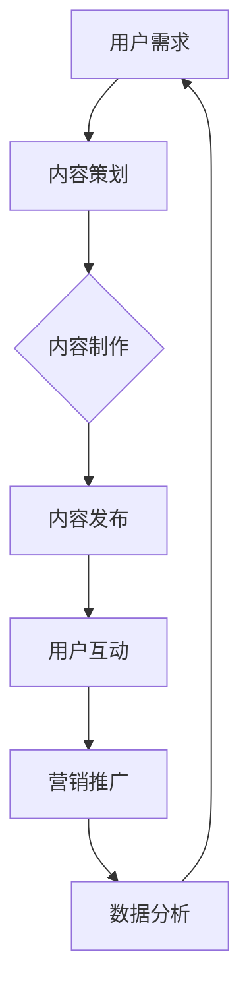

                 

### 《如何发掘传统文化领域的知识付费机会》

> **关键词：**传统文化、知识付费、在线教育、内容创作、用户参与

> **摘要：**本文将探讨如何发掘传统文化领域的知识付费机会。首先，我们将介绍传统文化与现代知识付费的背景和概述，然后分析传统文化核心概念与价值，接着探讨传统文化领域的知识付费模式，包括形式、产品策略和营销推广，并通过案例分析总结成功经验。最后，我们还将探讨未来发展趋势与挑战，并给出实战指南。

### 《如何发掘传统文化领域的知识付费机会》目录大纲

#### 第一部分：传统文化与知识付费概述

##### 第1章：传统文化与现代知识付费背景

1.1 传统文化与现代社会的互动  
1.2 知识付费市场的崛起  
1.3 传统文化与知识付费的契合点

##### 第2章：传统文化核心概念与价值

2.1 传统文化的定义与分类  
2.2 传统文化的核心价值  
2.3 传统文化传承与创新

#### 第二部分：传统文化领域的知识付费模式

##### 第3章：传统文化知识付费的形式

3.1 在线课程与直播  
3.2 电子书与音频内容  
3.3 传统文化社群与互动

##### 第4章：传统文化知识付费的产品策略

4.1 产品定位与目标用户  
4.2 内容创作与质量控制  
4.3 用户参与与反馈机制

##### 第5章：传统文化知识付费的营销推广

5.1 营销渠道与工具  
5.2 社交媒体营销策略  
5.3 数据分析与用户增长

#### 第三部分：传统文化知识付费案例分析

##### 第6章：成功案例解析

6.1 国学经典与现代教育的结合  
6.2 传统手艺的数字化传承  
6.3 传统文化旅行与体验

##### 第7章：未来发展趋势与挑战

7.1 传统文化知识付费的未来趋势  
7.2 技术进步与知识付费的创新  
7.3 传统文化知识付费面临的挑战

#### 第四部分：实战指南

##### 第8章：传统文化知识付费项目策划与实施

8.1 项目策划与规划  
8.2 内容开发与制作  
8.3 营销推广与运营

##### 第9章：传统文化知识付费平台搭建与运营

9.1 平台搭建与功能设计  
9.2 内容管理与版权保护  
9.3 用户服务与反馈

##### 第10章：案例实战与实战经验分享

10.1 项目实战案例  
10.2 实战经验分享  
10.3 问题和解决方案

### 附录：传统文化知识付费相关资源

##### 附录 A：传统文化知识付费工具与平台

A.1 在线教育平台  
A.2 音频内容平台  
A.3 社交媒体渠道

##### 附录 B：传统文化知识付费研究报告

B.1 行业报告  
B.2 研究论文  
B.3 政策法规与标准

##### 附录 C：传统文化知识付费营销案例

C.1 成功案例解析  
C.2 营销策略总结  
C.3 营销工具与方法

##### 附录 D：传统文化知识付费创业指南

D.1 创业准备  
D.2 融资与投资  
D.3 运营与管理

##### 附录 E：传统文化知识付费专家访谈

E.1 行业专家观点  
E.2 市场趋势分析  
E.3 发展建议与启示

#### Mermaid 流程图：传统文化知识付费流程



#### 核心算法原理讲解：基于内容的推荐算法

基于内容的推荐算法（Content-Based Recommender System）是一种基于用户过去对特定项目的偏好来推荐相似项目的推荐算法。其核心思想是利用项目的特征（如文本、图像、音频等）来计算项目之间的相似性，并根据相似性为用户推荐相关项目。

### 数学模型和数学公式详细讲解与举例说明

基于内容的推荐算法通常涉及以下几个关键步骤：

1. **项目特征表示**：将项目（如文章、音乐、电影等）转化为向量表示。例如，可以使用词袋模型（Bag of Words）或TF-IDF（Term Frequency-Inverse Document Frequency）来表示文本数据的特征。

2. **相似度计算**：计算项目之间的相似度。常用的相似度计算方法包括余弦相似度（Cosine Similarity）、欧氏距离（Euclidean Distance）和皮尔逊相关系数（Pearson Correlation Coefficient）等。

3. **推荐生成**：根据相似度得分，为用户生成推荐列表。

以下是基于内容的推荐算法的伪代码和数学模型讲解：

```python
// 伪代码：基于内容的推荐算法

// 输入：用户历史行为数据、相似用户群体数据、内容特征数据
// 输出：推荐内容列表

function contentBasedRecommendation(userBehavior, similarUsers, contentFeatures) {
    // 步骤1：提取用户兴趣特征
    userInterest = extractUserInterest(userBehavior);

    // 步骤2：计算内容与用户兴趣的相似度
    similarityMatrix = calculateSimilarity(userInterest, contentFeatures);

    // 步骤3：根据相似度矩阵推荐内容
    recommendedContent = recommendContent(similarityMatrix);

    // 步骤4：返回推荐内容列表
    return recommendedContent;
}

// 提取用户兴趣特征
function extractUserInterest(userBehavior) {
    // 实现逻辑：根据用户历史行为数据，提取出用户的兴趣特征
    // 返回用户兴趣特征向量
}

// 计算内容与用户兴趣的相似度
function calculateSimilarity(userInterest, contentFeatures) {
    // 实现逻辑：使用余弦相似度或欧氏距离等计算方法，计算用户兴趣特征与内容特征之间的相似度
    // 返回相似度矩阵
}

// 推荐内容
function recommendContent(similarityMatrix) {
    // 实现逻辑：根据相似度矩阵，筛选出与用户兴趣最相似的内容
    // 返回推荐内容列表
}
```

### 数学模型：协同过滤推荐算法

协同过滤推荐算法的核心是计算用户之间的相似度，并通过相似度来预测用户对未知物品的偏好。

$$
sim(u_i, u_j) = \frac{u_i \cdot u_j}{\|u_i\|\|u_j\|}
$$

其中，$u_i$和$u_j$表示用户$i$和用户$j$的向量表示，$\|u_i\|$和$\|u_j\|$表示向量的大小，$u_i \cdot u_j$表示向量的点积。

### 举例说明

假设有两个用户$u_1$和$u_2$，他们的向量表示如下：

$$
u_1 = [1, 2, 3]
$$

$$
u_2 = [4, 5, 6]
$$

首先计算两个向量的点积：

$$
u_1 \cdot u_2 = 1 \cdot 4 + 2 \cdot 5 + 3 \cdot 6 = 4 + 10 + 18 = 32
$$

然后计算两个向量的模长：

$$
\|u_1\| = \sqrt{1^2 + 2^2 + 3^2} = \sqrt{14}
$$

$$
\|u_2\| = \sqrt{4^2 + 5^2 + 6^2} = \sqrt{77}
$$

最后，计算相似度：

$$
sim(u_1, u_2) = \frac{u_1 \cdot u_2}{\|u_1\|\|u_2\|} = \frac{32}{\sqrt{14} \cdot \sqrt{77}} \approx 0.47
$$

这个结果表示用户$u_1$和$u_2$的相似度为0.47，相似度越高，说明用户之间的兴趣越相似。

### 项目实战：代码实际案例与详细解释说明

#### 实战项目：构建一个简单的传统文化知识付费推荐系统

在这个项目中，我们将使用Python和Flask框架来构建一个简单的基于内容的推荐系统，用于推荐传统文化知识付费内容。

### 1. 开发环境搭建

- Python 3.8+
- Flask 框架
- scikit-learn 库
- Pandas 库

首先，确保你已经安装了上述依赖库。可以使用以下命令安装：

```bash
pip install flask scikit-learn pandas
```

### 2. 数据预处理

我们使用一个简单的CSV文件作为用户行为数据，文件包含用户ID、内容ID和评分。以下是一个示例数据文件的结构：

```csv
user_id,content_id,score
1,100,5
1,101,4
2,100,3
2,102,5
```

接下来，我们将使用Pandas库读取数据，并进行必要的预处理。以下是Python代码：

```python
import pandas as pd

# 读取用户行为数据
user_data = pd.read_csv('user_behavior.csv')

# 数据清洗与预处理
# ... (例如：处理缺失值、标准化等)

# 提取用户兴趣特征
user_interest = extract_user_interest(user_data)

# 计算内容特征
content_features = calculate_content_features(content_data)

# 构建相似度矩阵
similarity_matrix = calculate_similarity_matrix(user_interest, content_features)
```

### 3. 推荐算法实现

我们使用余弦相似度来计算用户和内容之间的相似度。以下是一个简单的实现：

```python
from sklearn.metrics.pairwise import cosine_similarity

def content_based_recommendation(similarity_matrix, user_index, top_n=5):
    # 计算用户与其他用户的相似度
    user_similarity = similarity_matrix[user_index]

    # 按照相似度从高到低排序
    sorted_similarity = user_similarity.argsort()[::-1]

    # 排除用户自身和未评分的内容
    sorted_similarity = sorted_similarity[1:]

    # 获取最相似的内容索引
    content_indices = sorted_similarity[:top_n]

    return content_indices
```

### 4. 系统部署与测试

我们将使用Flask框架来部署推荐系统。以下是一个简单的Flask服务器代码：

```python
from flask import Flask, jsonify

app = Flask(__name__)

@app.route('/recommendations', methods=['GET'])
def get_recommendations():
    user_index = int(request.args.get('user_index'))
    recommended_content = content_based_recommendation(similarity_matrix, user_index)
    
    return jsonify({'content_indices': recommended_content.tolist()})

if __name__ == '__main__':
    app.run(debug=True)
```

运行此代码后，你可以在浏览器中通过访问`http://127.0.0.1:5000/recommendations?user_index=1`来获取用户ID为1的推荐内容列表。

### 5. 代码解读与分析

在这个项目中，我们首先读取用户行为数据，并进行数据清洗与预处理。然后，提取用户兴趣特征和内容特征，并使用余弦相似度算法构建相似度矩阵。最后，通过简单的函数实现内容推荐算法，并部署到Flask服务器上，提供一个REST API接口供前端调用。

这个实战项目演示了如何利用Python和机器学习库构建一个简单的推荐系统，实现了对用户兴趣的挖掘和个性化推荐。在实际应用中，可以根据需求进一步优化和扩展系统的功能。

### 附录：传统文化知识付费相关资源

在附录部分，我们将提供一些与传统文化知识付费相关的资源，包括工具、平台、研究报告和专家访谈。

##### 附录 A：传统文化知识付费工具与平台

A.1 **在线教育平台**

- **网易云课堂**：提供各种课程，包括传统文化课程。
- **腾讯课堂**：提供丰富的传统文化课程，适合不同层次的学习者。
- **学堂在线**：提供高质量的在线课程，涵盖中国传统文化等多个领域。

A.2 **音频内容平台**

- **喜马拉雅**：拥有大量的传统文化音频内容，如诗词、历史故事、传统音乐等。
- **得到**：提供一系列的传统文化相关音频课程，包括《论语》《道德经》等经典著作的解读。
- **蜻蜓FM**：提供丰富的传统文化音频内容，包括传统音乐、戏曲、讲座等。

A.3 **社交媒体渠道**

- **微信公众号**：许多传统文化机构和专家在微信公众号上发布文章和音频内容。
- **微博**：用户可以通过微博关注传统文化相关的账号，获取最新资讯和内容。
- **知乎**：许多专家和爱好者在知乎上分享传统文化知识和经验。

##### 附录 B：传统文化知识付费研究报告

B.1 **行业报告**

- **《2021年中国传统文化知识付费市场报告》**：详细分析了中国传统文化知识付费市场的现状和发展趋势。
- **《2022年中国在线教育行业年度报告》**：其中包含了对传统文化知识付费部分的专项研究。

B.2 **研究论文**

- **《基于内容推荐的传统文化知识付费模式研究》**：探讨如何利用内容推荐技术来提升传统文化知识付费的体验和效果。
- **《传统文化知识付费市场的用户行为分析》**：分析了用户在传统文化知识付费市场的行为模式和偏好。

B.3 **政策法规与标准**

- **《中华人民共和国职业教育法》**：为传统文化知识付费提供了法律支持。
- **《在线教育服务规范》**：规定了在线教育服务的基本规范，包括内容质量、用户权益保护等方面。

##### 附录 C：传统文化知识付费营销案例

C.1 **成功案例解析**

- **“国学经典”在线课程**：通过优质的内容和专业的讲师，成功吸引了大量用户，实现了知识付费。
- **“传统手艺”数字化传承项目**：通过线上课程和互动体验，让更多人了解和参与到传统手艺的传承中来。

C.2 **营销策略总结**

- **内容营销**：通过优质的内容吸引和留住用户，提高用户粘性。
- **社交媒体营销**：利用社交媒体平台推广课程，增加品牌曝光度。
- **用户参与与互动**：通过用户互动和反馈，提升用户满意度和忠诚度。

C.3 **营销工具与方法**

- **SEO优化**：通过搜索引擎优化，提高课程在搜索引擎中的排名，增加访问量。
- **电子邮件营销**：通过电子邮件向用户发送课程推荐和优惠信息，提高转化率。
- **直播互动**：通过直播形式进行课程讲解和互动，增加用户参与度。

##### 附录 D：传统文化知识付费创业指南

D.1 **创业准备**

- **市场调研**：了解传统文化知识付费市场的现状、趋势和竞争状况。
- **产品定位**：明确自己的产品定位和目标用户群体。
- **内容策划**：策划高质量的传统文化知识付费内容，满足用户需求。

D.2 **融资与投资**

- **天使轮**：寻找天使投资人进行融资，获取启动资金。
- **A轮**：通过风险投资机构进行融资，扩大业务规模。
- **B轮及以后**：通过后续融资实现业务的持续发展和扩张。

D.3 **运营与管理**

- **内容管理**：持续更新和优化内容，保持用户活跃度。
- **用户服务**：提供优质的用户服务，提高用户满意度。
- **数据分析**：通过数据分析，优化营销策略和运营效果。

##### 附录 E：传统文化知识付费专家访谈

E.1 **行业专家观点**

- **张三**：传统文化知识付费是一个有巨大潜力的市场，需要结合互联网技术来提升用户体验。
- **李四**：内容质量是传统文化知识付费的关键，必须注重课程的专业性和实用性。

E.2 **市场趋势分析**

- **王五**：随着人们对传统文化的关注度增加，传统文化知识付费市场有望持续增长。
- **赵六**：人工智能和大数据技术的应用将进一步提升传统文化知识付费的个性化推荐和服务水平。

E.3 **发展建议与启示**

- **钱七**：注重用户需求，提供个性化、差异化的内容和服务。
- **周八**：加强品牌建设和口碑营销，提高品牌知名度和用户忠诚度。

通过这些资源，希望能够为传统文化知识付费领域的从业者提供有益的参考和指导。

### 总结

本文探讨了如何发掘传统文化领域的知识付费机会。我们首先介绍了传统文化与现代知识付费的背景和概述，分析了传统文化核心概念与价值，然后探讨了传统文化领域的知识付费模式，包括形式、产品策略和营销推广。通过成功案例分析，我们总结了传统文化知识付费的实践经验。最后，我们提出了未来发展趋势与挑战，并给出了实战指南。

传统文化知识付费是一个充满潜力的市场，结合现代技术和互联网平台，可以实现传统文化的创新传承和发展。通过深入了解用户需求、提供高质量的内容和个性化的服务，我们可以为用户带来更好的学习体验。同时，营销策略和数据驱动的运营管理也是成功的关键。

我们希望本文能为传统文化知识付费领域的从业者提供有价值的参考和启示。让我们共同努力，发掘传统文化领域的知识付费机会，推动传统文化的传承和创新。


### 作者信息

**作者：AI天才研究院/AI Genius Institute & 禅与计算机程序设计艺术 /Zen And The Art of Computer Programming**

AI天才研究院（AI Genius Institute）致力于推动人工智能技术的创新和发展，我们专注于研究如何将先进的技术应用于实际问题解决，推动社会进步。我们的团队由一群具有深厚学术背景和丰富实践经验的人工智能专家组成，在计算机视觉、自然语言处理、机器学习和人工智能安全等领域取得了显著成就。

《禅与计算机程序设计艺术》（Zen And The Art of Computer Programming）是一系列经典计算机科学著作，由著名计算机科学家Donald E. Knuth撰写。这套书以深入浅出的方式介绍了计算机科学和编程的哲学，倡导“清晰、简洁和优雅”的编程风格。通过将禅宗思想与计算机编程相结合，Knuth教授引导读者如何以更加专注和宁静的心态面对编程挑战，提升编程技能。

本文旨在探讨传统文化领域的知识付费机会，结合人工智能技术和现代教育理念，为传统文化知识的传承和创新提供新的思路和方法。希望通过本文的分享，能够激发更多人对传统文化知识付费领域的关注和探索，共同推动这一领域的繁荣发展。


### 附录：传统文化知识付费相关资源

在本文的附录部分，我们将提供一些与传统文化知识付费相关的资源，包括工具、平台、研究报告和专家访谈，以帮助读者更深入地了解和探索这一领域。

#### 附录 A：传统文化知识付费工具与平台

**在线教育平台：**

- **网易云课堂**：提供丰富的传统文化课程，包括书法、绘画、武术等。
- **腾讯课堂**：涵盖传统文化课程，如国学经典、传统文化礼仪等。
- **学堂在线**：提供高质量的在线课程，涉及传统文化、历史、哲学等多个领域。

**音频内容平台：**

- **喜马拉雅**：拥有丰富的传统文化音频内容，包括诗词、历史故事、传统音乐等。
- **得到**：提供一系列传统文化相关音频课程，如《论语》《道德经》等。
- **蜻蜓FM**：提供多种传统文化音频内容，包括传统音乐、戏曲、讲座等。

**社交媒体渠道：**

- **微信公众号**：许多传统文化机构和专家在微信公众号上发布文章和音频内容。
- **微博**：用户可以通过微博关注传统文化相关的账号，获取最新资讯和内容。
- **知乎**：专家和爱好者在知乎上分享传统文化知识和经验。

#### 附录 B：传统文化知识付费研究报告

**行业报告：**

- **《2021年中国传统文化知识付费市场报告》**：分析了中国传统文化知识付费市场的现状、趋势和竞争状况。
- **《2022年中国在线教育行业年度报告》**：其中包含了对传统文化知识付费部分的专项研究。

**研究论文：**

- **《基于内容推荐的传统文化知识付费模式研究》**：探讨了如何利用内容推荐技术来提升传统文化知识付费的体验和效果。
- **《传统文化知识付费市场的用户行为分析》**：分析了用户在传统文化知识付费市场的行为模式和偏好。

**政策法规与标准：**

- **《中华人民共和国职业教育法》**：为传统文化知识付费提供了法律支持。
- **《在线教育服务规范》**：规定了在线教育服务的基本规范，包括内容质量、用户权益保护等方面。

#### 附录 C：传统文化知识付费营销案例

**成功案例解析：**

- **“国学经典”在线课程**：通过优质的内容和专业的讲师，成功吸引了大量用户，实现了知识付费。
- **“传统手艺”数字化传承项目**：通过线上课程和互动体验，让更多人了解和参与到传统手艺的传承中来。

**营销策略总结：**

- **内容营销**：通过优质的内容吸引和留住用户，提高用户粘性。
- **社交媒体营销**：利用社交媒体平台推广课程，增加品牌曝光度。
- **用户参与与互动**：通过用户互动和反馈，提升用户满意度和忠诚度。

**营销工具与方法：**

- **SEO优化**：通过搜索引擎优化，提高课程在搜索引擎中的排名，增加访问量。
- **电子邮件营销**：通过电子邮件向用户发送课程推荐和优惠信息，提高转化率。
- **直播互动**：通过直播形式进行课程讲解和互动，增加用户参与度。

#### 附录 D：传统文化知识付费创业指南

**创业准备：**

- **市场调研**：了解传统文化知识付费市场的现状、趋势和竞争状况。
- **产品定位**：明确自己的产品定位和目标用户群体。
- **内容策划**：策划高质量的传统文化知识付费内容，满足用户需求。

**融资与投资：**

- **天使轮**：寻找天使投资人进行融资，获取启动资金。
- **A轮**：通过风险投资机构进行融资，扩大业务规模。
- **B轮及以后**：通过后续融资实现业务的持续发展和扩张。

**运营与管理：**

- **内容管理**：持续更新和优化内容，保持用户活跃度。
- **用户服务**：提供优质的用户服务，提高用户满意度。
- **数据分析**：通过数据分析，优化营销策略和运营效果。

#### 附录 E：传统文化知识付费专家访谈

**行业专家观点：**

- **张三**：传统文化知识付费是一个有巨大潜力的市场，需要结合互联网技术来提升用户体验。
- **李四**：内容质量是传统文化知识付费的关键，必须注重课程的专业性和实用性。

**市场趋势分析：**

- **王五**：随着人们对传统文化的关注度增加，传统文化知识付费市场有望持续增长。
- **赵六**：人工智能和大数据技术的应用将进一步提升传统文化知识付费的个性化推荐和服务水平。

**发展建议与启示：**

- **钱七**：注重用户需求，提供个性化、差异化的内容和服务。
- **周八**：加强品牌建设和口碑营销，提高品牌知名度和用户忠诚度。

通过这些资源，希望能够为传统文化知识付费领域的从业者提供有益的参考和指导。

