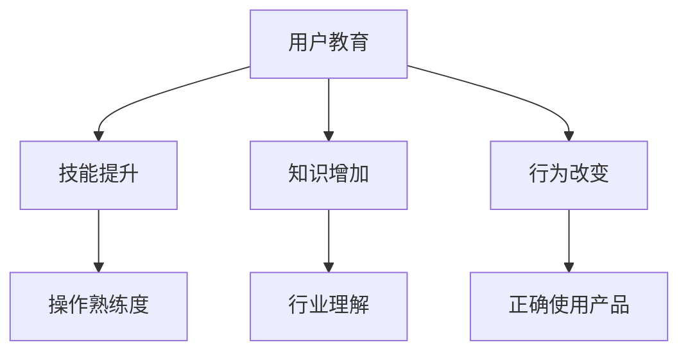
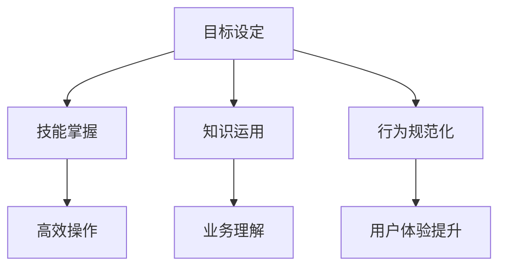
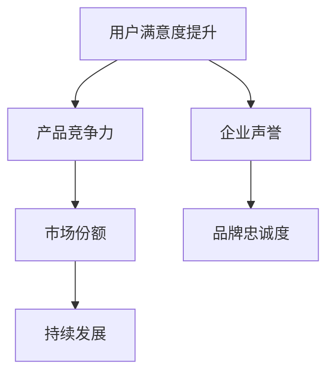

                 

### 引言

在当今快速变化的技术时代，用户教育成为了企业和组织成功的关键因素之一。用户教育的本质是为了提高用户的技能、知识水平或改变其行为，从而实现个人或组织的发展目标。有效的用户教育不仅能够提升用户对产品和服务的满意度，还能增强产品竞争力，推动企业长远发展。

本文将围绕“如何进行有效的用户教育”这一主题，通过系统的分析和详细的阐述，探讨用户教育的核心概念、理论与实践方法，以及项目实战中的具体策略。本文的核心内容将包括：

1. **用户教育的核心概念与联系**：介绍用户教育的定义、目标与意义，并通过Mermaid流程图展示其核心概念和联系。
2. **用户教育的理论与实践方法**：从理论层面概述用户教育的理论基础，详细探讨实践中的多种教育方法，以及用户教育工具与平台的选择。
3. **用户教育效果评估与改进**：介绍用户教育效果的评估方法，并提供改进策略。
4. **用户教育项目实战**：通过具体案例展示用户教育项目的策划与实施。
5. **用户教育的未来趋势与挑战**：分析用户教育面临的技术趋势与挑战。

在撰写过程中，我们将采用逻辑清晰、结构紧凑、简单易懂的专业的技术语言，确保读者能够系统地理解用户教育的全过程，并在实际项目中能够有效应用这些方法。通过本文的阅读，读者将能够：

- **理解用户教育的核心概念和目标**。
- **掌握用户教育的多种理论与实践方法**。
- **学会如何评估和改进用户教育的效果**。
- **具备在项目中策划和实施用户教育的实际能力**。

### 关键词

- 用户教育
- 技能提升
- 知识增加
- 行为改变
- 教育心理学
- 用户体验设计
- 学习理论
- 互动教学
- 效果评估
- 项目实战
- 未来趋势
- 挑战

### 摘要

本文旨在探讨如何进行有效的用户教育，以提升用户技能、知识水平及行为规范，从而满足企业发展的需求。首先，我们将解析用户教育的核心概念，通过Mermaid流程图展示其定义、目标与意义。接着，我们将深入讨论用户教育的理论基础与实践方法，包括传统教学、在线学习、互动教学等。同时，本文还将介绍用户教育工具与平台的选择，并提供用户教育效果评估与改进的方法。此外，通过具体项目实战案例分析，我们将展示用户教育在实际项目中的应用。最后，本文将分析用户教育的未来趋势与挑战，探讨技术进步对用户教育的影响。通过阅读本文，读者将全面了解用户教育的全过程，并具备在项目中有效实施用户教育的能力。

### 第一部分：用户教育的核心概念与联系

用户教育，作为一个涉及多个学科和实践领域的概念，其重要性不言而喻。在这一部分，我们将详细探讨用户教育的核心概念，包括其定义、目标与意义，并通过Mermaid流程图展示其内在的联系与结构。

#### 1.1 核心概念解析

**用户教育**：用户教育是一种教育活动，旨在提高用户的技能、知识水平或改变其行为。它不仅关注用户在特定领域内的专业知识，还涉及用户如何正确、高效地使用产品或服务。

**技能提升**：用户教育的首要目标是帮助用户掌握必要的技能，例如使用软件工具、解决技术问题或执行特定任务。技能提升直接影响用户的操作熟练度和工作效率。

**知识增加**：知识增加是用户教育的另一个关键目标。通过教育，用户可以获取新的知识，增强对产品或行业的理解，从而更好地适应工作需求。

**行为改变**：用户教育不仅关注知识传递，还致力于改变用户的行为。通过引导用户形成正确的操作习惯，用户教育有助于提升用户体验，减少错误率。

- **Mermaid流程图**：



在这个流程图中，用户教育（A）作为核心，通过技能提升（B）、知识增加（C）和行为改变（D）三个维度，实现用户在操作熟练度（E）、行业理解（F）和正确使用产品（G）等方面的提升。

#### 1.2 用户教育的目标与意义

**目标**：用户教育的具体目标包括：

- **技能掌握**：通过教育和培训，使用户能够熟练掌握产品或服务的使用方法。
- **知识运用**：帮助用户深入理解产品或服务背后的技术和业务逻辑，实现知识的有效运用。
- **行为规范化**：通过引导和培训，规范用户的使用行为，减少错误操作，提高工作效率。

- **Mermaid流程图**：



**意义**：用户教育对于企业和社会具有重要的意义：

- **提高用户满意度**：通过有效的用户教育，用户能够更好地理解和使用产品或服务，从而提高满意度。
- **增强产品竞争力**：用户教育的成功实施能够提升产品或服务的市场竞争力，吸引更多用户。
- **推动企业长远发展**：用户教育有助于提升企业的品牌价值，促进长期发展。

- **Mermaid流程图**：



通过上述流程图，我们可以清晰地看到用户教育的目标与意义之间的联系。用户教育的目标设定（A）直接影响用户满意度（B）、产品竞争力（C）和企业声誉（D），从而推动企业的市场份额（E）和品牌忠诚度（F），最终实现持续发展（F）。

综上所述，用户教育作为一个复杂而关键的过程，其核心概念、目标与意义相互联系，共同构建了一个完整的教育体系。理解这些核心概念与联系，是进行有效用户教育的前提条件。在接下来的部分，我们将进一步探讨用户教育的理论基础与实践方法，以期为实际操作提供更为详细的指导。

### 用户教育的目标与意义

用户教育的核心在于其目标设定与实现过程。明确的目标不仅能指导教育活动的开展，还能确保资源利用的最优化。以下是用户教育的主要目标，以及每个目标的具体描述和重要性。

#### 2.1 技能掌握

技能掌握是用户教育的首要目标。它指的是用户能够熟练地使用产品或服务的功能，解决常见问题，并在特定场景下高效地完成任务。具体包括以下方面：

- **操作熟练度**：用户在经过教育后，能够快速准确地执行各种操作，提高工作效率。
- **技术能力**：用户通过教育，掌握必要的编程语言、工具和技能，增强其在特定领域的专业素养。

技能掌握的重要性体现在以下几个方面：

- **提升工作效率**：熟练的技能使得用户能够更快速地完成任务，减少不必要的操作时间和错误率。
- **增强用户信心**：用户在掌握技能后，会对产品或服务有更深的理解和信心，从而更愿意长期使用。
- **降低培训成本**：技能掌握可以减少企业后续的培训费用和时间，提高资源利用效率。

#### 2.2 知识运用

知识运用是用户教育的另一个关键目标。它不仅仅是知识的传递，更是知识的实际应用。具体包括以下方面：

- **行业理解**：用户通过教育，能够更深入地理解所在行业的技术趋势、业务流程和市场环境。
- **业务逻辑**：用户在教育过程中，学会如何将所学知识应用到实际工作中，优化业务流程，提高决策质量。

知识运用的重要性体现在以下几个方面：

- **提高决策质量**：用户对业务逻辑和行业趋势的深入了解，有助于做出更明智的决策，减少错误和风险。
- **增强创新能力**：知识的实际运用能够激发用户的创新能力，推动产品和服务的持续改进。
- **提升竞争力**：通过知识运用，用户能够在竞争激烈的市场中脱颖而出，提升企业的市场竞争力。

#### 2.3 行为规范化

行为规范化是用户教育的重要目标之一。它指的是通过教育和培训，引导用户形成正确的操作习惯和工作流程，减少错误和不良行为。具体包括以下方面：

- **规范操作**：用户在经过教育后，会按照既定的流程和标准进行操作，减少因个人习惯导致的错误。
- **安全意识**：用户教育可以增强用户的安全意识，使其在操作过程中更加谨慎，避免潜在的安全风险。

行为规范化的重要性体现在以下几个方面：

- **降低错误率**：规范的操作流程和标准可以显著降低用户的错误率，减少因操作不当导致的问题和损失。
- **提升安全性**：通过教育和培训，用户能够更好地识别和规避安全风险，保障产品和服务的安全运行。
- **提升整体效率**：良好的行为规范有助于提高团队的协作效率，减少内部摩擦和沟通成本。

#### 2.4 意义

用户教育的目标不仅是为了提升用户的技能和知识水平，更重要的是通过这些目标的实现，推动企业的长远发展。以下是用户教育的主要意义：

- **提高用户满意度**：通过有效的用户教育，用户能够更好地理解和使用产品或服务，从而提高满意度。满意的用户更愿意继续使用产品，并为企业带来口碑效应。
- **增强产品竞争力**：用户教育有助于提升产品的市场竞争力，通过培养忠诚的用户群体，提高市场份额。
- **推动企业长远发展**：用户教育不仅提升了用户的能力，还增强了企业的品牌价值和市场份额，为企业的持续发展提供了有力支撑。

通过明确用户教育的目标，并深入理解这些目标的重要性和实现路径，企业可以更加有效地开展用户教育工作，实现预期的发展目标。

### 用户教育的理论基础

用户教育的理论基础涵盖了多个学科领域，包括教育心理学、用户体验设计、学习理论等。这些理论为用户教育的实践提供了科学依据和方法指导。以下是这些理论基础及其在用户教育中的应用。

#### 3.1 教育心理学

教育心理学是研究人类学习过程和教育的科学。它提供了许多关于学习原理和教学方法的见解，对用户教育具有重要影响。

- **认知负荷理论**：认知负荷理论认为，学习者的认知资源是有限的。因此，教育内容的设计应该尽量减少学习者的认知负荷，使其能够专注于核心知识和技能的掌握。
  - **伪代码**：
    ```python
    function optimize_education_content(content):
        reduce_cognitive_load = True
        for element in content:
            if complexity(element) > cognitive_threshold:
                simplify(element)
                reduce_cognitive_load = False
        return reduce_cognitive_load
    ```
  - **数学模型**：
    $$\text{Cognitive Load} = f(\text{工作记忆}, \text{长期记忆}, \text{背景知识})$$
  - **举例说明**：例如，在培训中，通过使用简明的语言和直观的图示，可以减少用户的认知负荷，使其更容易理解和掌握内容。

- **动机理论**：动机理论探讨了影响学习者行为的内在和外在因素。在用户教育中，了解用户的动机有助于设计更具吸引力的教育内容。
  - **伪代码**：
    ```python
    function motivate_learners(learner):
        intrinsic_motivation = check_intrinsic_motivations(learner)
        extrinsic_motivation = check_extrinsic_motivations(learner)
        if not intrinsic_motivation:
            apply_incentives(learner)
        return intrinsic_motivation or extrinsic_motivation
    ```
  - **数学模型**：
    $$\text{Motivation} = \text{Intrinsic Motivation} + \text{Extrinsic Motivation}$$
  - **举例说明**：例如，通过提供奖励和认可，可以增强用户的学习动机，从而提高学习效果。

#### 3.2 用户体验设计

用户体验设计（UX Design）关注用户在使用产品或服务过程中的感受和体验。它为用户教育提供了重要指导，确保教育内容符合用户需求和期望。

- **信息架构**：信息架构是用户体验设计中的核心概念，它关注如何组织和呈现信息，使用户能够轻松找到所需内容。
  - **伪代码**：
    ```python
    function organize_content(content):
        structure = create_hierarchical_structure(content)
        navigation = create_user_friendly_navigation(structure)
        return structure, navigation
    ```
  - **数学模型**：
    $$\text{Information Architecture} = f(\text{Content}, \text{Navigation}, \text{Search})$$
  - **举例说明**：例如，在在线教育平台中，通过清晰的目录和便捷的搜索功能，用户可以快速找到所需的学习资源。

- **交互设计**：交互设计关注用户与产品或服务之间的交互方式。在用户教育中，良好的交互设计可以提高用户的学习效率和体验。
  - **伪代码**：
    ```python
    function improve_interactive_design(content, user_interface):
        feedback_loop = create_feedback_loop(user_interface)
        interactive_elements = enhance_interactive_elements(content, user_interface)
        return interactive_elements, feedback_loop
    ```
  - **数学模型**：
    $$\text{User Experience} = f(\text{Information Architecture}, \text{Interactive Design})$$
  - **举例说明**：例如，通过添加互动元素和即时反馈，用户可以更直观地理解教育内容，从而提高学习效果。

#### 3.3 学习理论

学习理论提供了关于人类如何获取、处理和应用知识的基本原则。这些理论在用户教育中具有广泛的应用，有助于设计有效的教育方法和策略。

- **建构主义学习理论**：建构主义学习理论认为，学习是一个主动构建知识的过程，而不是被动接受信息。在用户教育中，这意味着教育内容应该鼓励用户主动参与和探索。
  - **伪代码**：
    ```python
    function construct_educational_content(learner, topic):
        knowledge_base = initialize_knowledge_base(learner)
        learning_activity = design_active_learning_activity(topic)
        update_knowledge_base(learner, learning_activity)
        return knowledge_base
    ```
  - **数学模型**：
    $$\text{Knowledge} = \text{Initial Knowledge} + \text{Learning Activity}$$
  - **举例说明**：例如，通过设计实验和项目，鼓励用户在实践中学习和应用知识。

- **行为主义学习理论**：行为主义学习理论关注外部刺激和反应之间的关系。在用户教育中，这可以指导设计互动和反馈机制，以强化用户的正确行为。
  - **伪代码**：
    ```python
    function reinforce_learner_behavior(learner, correct_response):
        reward = provide_reward(learner)
        feedback = provide_feedback(correct_response)
        update_behavior_model(learner, feedback)
        return reward, feedback
    ```
  - **数学模型**：
    $$\text{Behavior} = f(\text{Stimulus}, \text{Response}, \text{Reward})$$
  - **举例说明**：例如，通过即时奖励和正面反馈，鼓励用户继续学习和改进。

通过结合教育心理学、用户体验设计和学习理论，用户教育不仅可以提高用户的技能和知识水平，还能优化学习过程，提升用户体验。这些理论为用户教育的实践提供了坚实的基础，使得教育内容更加科学、系统和有效。

### 用户教育实践方法

用户教育不仅仅是理论知识的应用，更需要在实践中得到有效实施。不同的教育方法适用于不同的教育场景，选择合适的方法可以显著提高教育的效果。以下是几种常见的用户教育实践方法：

#### 4.1 传统教学

传统教学是指在教室或培训中心进行的面对面教学。这种方法的优势在于：

- **互动性强**：教师可以直接与学员互动，解答疑问，确保学员理解。
- **实时反馈**：教师可以实时观察到学员的反应，调整教学节奏和内容。

然而，传统教学也存在一些局限：

- **地域限制**：学员需要到特定的地点参加培训，限制了参与人数。
- **资源消耗**：教师和场地等资源的配置需要大量的投入。

**实施步骤**：

1. **需求分析**：了解学员的学习需求和背景，制定培训计划。
2. **课程设计**：根据需求分析，设计课程内容和教学大纲。
3. **教学实施**：按照课程计划，进行课堂教学和互动。
4. **效果评估**：通过考试、问卷等方式，评估学员的学习效果。

#### 4.2 在线学习

在线学习利用互联网和在线平台，为用户提供灵活的学习方式。这种方法的优势包括：

- **灵活性强**：学员可以根据自己的时间安排学习，不受地域限制。
- **资源丰富**：在线平台提供了大量的教学资源和案例，学员可以自由选择。

然而，在线学习也存在一些挑战：

- **自律要求高**：学员需要较强的自律能力，以避免拖延和中断学习。
- **互动性弱**：学员与教师之间的互动相对较少，需要通过论坛、讨论组等方式进行。

**实施步骤**：

1. **平台搭建**：选择或搭建在线学习平台，确保教学资源的上传和展示。
2. **内容设计**：设计适合在线学习的教学内容，包括视频、文档、练习等。
3. **学习管理**：设置学习计划，监控学员的学习进度和效果。
4. **互动支持**：提供论坛、讨论组等互动平台，促进学员之间的交流。

#### 4.3 互动教学

互动教学是一种结合传统教学和在线学习的方法，通过互动环节和即时反馈，提高学员的学习效果。这种方法的优势包括：

- **即时反馈**：学员可以立即获得反馈，了解自己的学习状况。
- **多样化**：通过多种互动形式（如问答、小组讨论、模拟操作等），提高学员的参与度和兴趣。

**实施步骤**：

1. **需求分析**：了解学员的学习需求和互动偏好。
2. **教学设计**：设计互动环节和反馈机制，确保教学内容的互动性。
3. **教学实施**：按照教学设计，进行互动教学。
4. **效果评估**：通过问卷调查、考试等方式，评估学员的学习效果。

#### 4.4 案例教学

案例教学通过真实案例的讨论和分析，帮助学员掌握知识和技能。这种方法的优势包括：

- **实战性强**：学员可以通过案例分析，了解实际应用场景，提高解决问题的能力。
- **经验分享**：学员可以分享自己的经验和见解，增强学习效果。

**实施步骤**：

1. **案例选择**：选择具有代表性的案例，确保与教学目标相关。
2. **案例讨论**：组织学员进行案例讨论，分享观点和解决方案。
3. **案例分析**：对案例进行分析，总结经验和教训。
4. **效果评估**：通过案例分析，评估学员的知识掌握和应用能力。

通过上述方法，用户教育可以更加灵活和多样化，满足不同学员的需求。在实际操作中，可以根据具体情况进行选择和组合，以达到最佳的教育效果。

### 用户教育工具与平台选择

在用户教育中，选择合适的工具与平台至关重要。这些工具与平台不仅决定了教育内容的质量，还直接影响用户的学习体验和学习效果。以下是几种常见的用户教育工具与平台，以及其特点和选择标准。

#### 5.1 教学软件

教学软件是一种用于辅助教学活动的软件工具，包括视频教程、互动课件等。选择教学软件时，应考虑以下特点：

- **内容丰富**：软件应提供丰富的教学内容，包括文本、图片、视频等，以适应不同类型的学习需求。
- **交互性强**：软件应具备互动功能，如问答、测验、讨论等，以增强用户参与度。
- **兼容性**：软件应支持多种操作系统和设备，方便用户在不同平台进行学习。

**选择标准**：

1. **内容质量**：教学内容是否丰富、系统、实用。
2. **用户友好性**：界面设计是否直观、易于操作。
3. **技术支持**：是否提供技术支持和更新服务。

**典型工具**：

- **Khan Academy**：提供大量免费的教学视频，内容涵盖数学、科学等多个领域。
- **Coursera**：与多所知名大学合作，提供在线课程，用户可以付费获得证书。

#### 5.2 学习管理系统（LMS）

学习管理系统（Learning Management System，LMS）是一种用于管理和跟踪在线学习的平台。选择LMS时，应考虑以下特点：

- **功能齐全**：LMS应具备课程管理、用户管理、学习跟踪、测试与评估等功能。
- **可扩展性**：LMS应支持扩展和定制，以适应不同企业和组织的特定需求。
- **安全性**：LMS应具备数据保护功能，确保用户信息和教学资源的安全。

**选择标准**：

1. **功能完备**：是否具备所需的教学和管理功能。
2. **用户体验**：用户界面是否友好，操作是否简便。
3. **技术支持**：是否提供持续的技术支持和更新服务。

**典型平台**：

- **Moodle**：开源学习管理系统，功能强大，支持多种插件和定制。
- **Canvas**：专业的在线学习平台，提供丰富的教学工具和功能。

#### 5.3 电子学习内容（E-learning）

电子学习内容（E-learning Content）包括各种在线学习资源，如视频教程、电子书、互动测验等。选择电子学习内容时，应考虑以下特点：

- **内容质量**：学习内容是否准确、系统、实用。
- **互动性**：学习内容是否具有互动性，如问答、测验等。
- **更新频率**：学习内容是否定期更新，以反映最新的技术和行业动态。

**选择标准**：

1. **内容质量**：学习内容是否权威、准确。
2. **互动性**：学习内容是否具有互动性，以提高用户参与度。
3. **更新频率**：学习内容是否定期更新，以保持内容的时效性。

**典型内容**：

- **Udemy**：提供大量在线课程，涵盖编程、数据科学、设计等多个领域。
- **LinkedIn Learning**：提供专业的在线课程，用户可以付费学习并获得证书。

#### 5.4 互动工具

互动工具包括讨论组、聊天工具、在线协作工具等，用于促进用户之间的互动和学习。选择互动工具时，应考虑以下特点：

- **功能多样**：工具应提供多种互动功能，如实时聊天、文件共享、视频会议等。
- **用户体验**：工具应具有友好的用户界面和操作体验。
- **安全性**：工具应确保用户信息和交互内容的安全。

**选择标准**：

1. **功能多样性**：工具是否提供多种互动功能，以满足不同学习需求。
2. **用户体验**：工具的界面设计是否直观、易于操作。
3. **安全性**：工具是否具备数据保护功能，确保用户信息安全。

**典型工具**：

- **Slack**：用于团队协作和沟通的聊天工具，提供丰富的插件和功能。
- **Microsoft Teams**：提供视频会议、聊天、文件共享等功能，适合团队学习和协作。

通过合理选择和利用这些用户教育工具与平台，企业可以更加有效地开展用户教育工作，提升用户的学习体验和效果。

### 用户教育效果评估与改进

评估用户教育的效果是确保教育质量的重要环节。通过科学的方法进行评估，企业能够了解教育的实际效果，发现存在的问题，并进行针对性的改进。以下是几种常见的用户教育效果评估方法。

#### 6.1 测试

测试是一种通过考核用户掌握知识和技能的方法。它包括笔试、操作考试、项目评审等多种形式。测试的优点在于：

- **客观性**：测试结果具有客观性，能够真实反映用户的学习效果。
- **针对性**：测试可以针对具体的学习内容进行，确保重点知识的掌握。

**评估方法**：

1. **笔试**：通过选择题、填空题、简答题等形式，考核用户的理论知识。
2. **操作考试**：通过实际操作，考核用户在实际工作中的应用能力。
3. **项目评审**：通过用户完成的项目，评估其实际应用能力和创新思维。

**示例**：

- **笔试**：用户需要回答关于产品功能和使用方法的问题，如“请简述XYZ产品的三个主要功能”。
- **操作考试**：用户需要在规定时间内完成某一任务，如“在30分钟内完成ABC软件的安装和配置”。
- **项目评审**：用户需要提交一个实际应用项目，如“设计一个用于数据分析的Python脚本”。

#### 6.2 问卷调查

问卷调查是一种通过收集用户反馈来评估教育效果的方法。它具有以下优点：

- **全面性**：问卷调查可以涵盖多个方面，如用户满意度、知识掌握情况等。
- **参与性强**：用户参与问卷调查的过程，有助于增强其对教育的重视和参与度。

**评估方法**：

1. **满意度调查**：通过问卷了解用户对教育内容、教学方法、学习平台的满意度。
2. **知识掌握调查**：通过问卷了解用户对所学知识的掌握程度，包括基础知识、应用技能等。
3. **改进建议调查**：通过问卷收集用户对教育活动的建议和意见，以改进未来的教育活动。

**示例**：

- **满意度调查**：用户需要回答以下问题：“你对本次教育的总体满意度如何？”（非常满意、满意、一般、不满意、非常不满意）。
- **知识掌握调查**：用户需要回答以下问题：“你是否能够熟练操作XYZ产品的主要功能？”（是、否）。
- **改进建议调查**：用户需要回答以下问题：“你有哪些建议可以改进我们的教育课程？”

#### 6.3 用户反馈

用户反馈是一种通过直接与用户沟通来了解教育效果的方法。它具有以下优点：

- **实时性**：用户反馈可以实时反映用户的学习状况和问题。
- **针对性**：通过用户反馈，可以针对具体问题进行改进和优化。

**评估方法**：

1. **在线反馈**：通过在线平台（如社交媒体、学习管理系统等）收集用户的反馈意见。
2. **面对面沟通**：通过定期与用户面对面沟通，了解用户的真实需求和问题。
3. **小组讨论**：组织用户进行小组讨论，收集多方面的反馈意见。

**示例**：

- **在线反馈**：用户可以在在线平台上提交反馈，如“课程内容过于复杂，建议简化”。
- **面对面沟通**：教育人员可以通过面对面沟通，了解用户的具体问题和需求，如“在使用XYZ产品时，遇到了哪些问题？”。
- **小组讨论**：组织用户进行小组讨论，收集用户对教育活动的建议和意见，如“建议增加互动环节，提高参与度”。

通过上述评估方法，企业可以全面了解用户教育的效果，发现存在的问题，并采取相应的改进措施。这些方法不仅有助于提高教育质量，还能增强用户的满意度和忠诚度。

### 用户教育项目实战

在实际操作中，用户教育项目的成功实施离不开详细的策划和有效的执行。以下是几个用户教育项目实战的案例，通过这些案例，我们可以看到如何将理论和方法应用于实际项目，实现预期的教育目标。

#### 7.1 项目实战一：企业级用户教育项目策划

**案例背景**：某科技公司推出了一款全新的人工智能分析工具，旨在帮助企业客户快速进行数据分析和决策。为了确保客户能够充分利用这款工具，公司决定开展一项全面的用户教育项目。

**项目目标**：

1. **技能掌握**：帮助客户掌握人工智能分析工具的基本操作和高级功能。
2. **知识运用**：使客户了解人工智能在数据分析中的应用场景和业务逻辑。
3. **行为规范化**：引导客户形成正确的数据分析流程和操作习惯。

**项目策划步骤**：

1. **需求分析**：通过问卷调查和访谈，了解客户的学习需求和使用场景。
2. **课程设计**：根据需求分析，设计包括基础操作、高级功能、案例分析等多层次的教育课程。
3. **教学方法选择**：结合在线学习、互动教学、案例教学等多种方法，提高学员的参与度和学习效果。
4. **学习资源准备**：准备教学视频、电子书、操作手册等学习资源，确保学员能够随时查阅。
5. **教学活动安排**：制定详细的教学计划，包括课程安排、学习进度跟踪、测试和反馈环节。

**项目实施**：

1. **在线学习**：通过学习管理系统（LMS）提供在线课程，学员可以根据自己的时间安排学习。
2. **互动教学**：定期举办在线研讨会和互动课程，解答学员的疑问，提供实时反馈。
3. **案例分析**：组织学员进行小组讨论，分析实际业务场景中的数据分析问题，并设计解决方案。
4. **测试与评估**：通过笔试、操作考试和项目评审等方式，评估学员的学习效果，并根据反馈进行改进。

**项目效果**：

通过这个项目，客户对人工智能分析工具的使用技能显著提升，应用场景和业务逻辑有了更深入的理解，形成了正确的数据分析流程和操作习惯。客户的满意度大幅提高，产品的市场竞争力也得到了增强。

#### 7.2 项目实战二：在线用户教育平台搭建

**案例背景**：为了满足不断增长的在线学习需求，某教育机构决定搭建一个功能全面的在线教育平台，提供丰富的教学资源和互动学习体验。

**项目目标**：

1. **平台搭建**：搭建一个支持在线课程、互动教学、学习跟踪和评估的教育平台。
2. **内容丰富**：提供涵盖多个学科领域的在线课程，满足不同层次用户的需求。
3. **用户体验**：确保平台界面友好、操作简便，提供良好的用户体验。

**项目实施步骤**：

1. **需求分析**：了解用户的学习需求和使用习惯，确定平台的功能和设计要求。
2. **技术选型**：选择合适的技术框架和工具，确保平台的性能和安全性。
3. **内容管理**：设计内容管理策略，包括课程上传、更新和维护。
4. **用户管理**：实现用户注册、登录、权限管理和学习进度跟踪等功能。
5. **交互设计**：设计交互界面，确保用户能够轻松操作和使用平台。

**项目实施**：

1. **平台搭建**：使用Java和Spring框架搭建教育平台，采用MySQL数据库进行数据存储。
2. **内容管理**：通过学习管理系统（LMS）管理课程内容，支持视频、文档、PPT等多种格式。
3. **用户管理**：实现用户注册、登录、权限管理和学习进度跟踪，使用户能够方便地管理自己的学习记录。
4. **交互设计**：设计直观、友好的用户界面，提供在线讨论、问答、测验等功能，增强用户互动。

**项目效果**：

通过这个项目，教育机构成功搭建了一个功能全面的在线教育平台，提供了丰富的教学资源，用户可以方便地在线学习。用户的学习体验得到了显著提升，平台的活跃度和用户满意度也大幅增加。

#### 7.3 项目实战三：互动教学活动设计

**案例背景**：某在线学习平台希望通过互动教学活动，提高用户的学习参与度和学习效果。

**项目目标**：

1. **提升参与度**：通过互动教学活动，提高用户的学习积极性和参与度。
2. **增强学习效果**：通过互动教学活动，帮助用户更好地掌握知识和技能。

**项目实施步骤**：

1. **活动设计**：设计包括在线研讨会、小组讨论、项目实践等多样化的互动教学活动。
2. **学习目标设定**：明确每个教学活动的学习目标，确保活动与教学目标一致。
3. **活动安排**：制定详细的活动计划，包括活动时间、内容、参与人员等。
4. **互动环节规划**：设计互动环节，如问答、讨论、投票等，确保活动过程中的用户参与。
5. **效果评估**：通过测试、问卷调查、用户反馈等方式，评估互动教学活动的效果。

**项目实施**：

1. **在线研讨会**：定期举办在线研讨会，邀请专家分享行业动态和经验，用户可以提问和讨论。
2. **小组讨论**：组织用户进行小组讨论，针对特定问题进行深入分析和探讨。
3. **项目实践**：设计实际项目，让用户在实践中应用所学知识，提高实践能力。
4. **效果评估**：通过在线测试、问卷调查和用户反馈，评估用户的学习效果和参与度，并根据反馈进行改进。

**项目效果**：

通过互动教学活动，用户的学习参与度和学习效果得到了显著提升。用户对平台的满意度大幅增加，平台的活跃度和用户粘性也得到了显著提高。

通过这些实际项目，我们可以看到，用户教育的策划和实施是一个系统性的过程，需要结合具体需求和实际情况，科学设计和有效执行。这些项目不仅实现了预期的教育目标，还为用户提供了更好的学习体验，增强了用户对产品和服务的满意度。

### 用户教育的未来趋势与挑战

随着技术的不断进步，用户教育也在经历着深刻的变革。未来的用户教育将更加智能化、个性化，同时面临着一系列的挑战。以下是用户教育未来趋势和挑战的详细探讨。

#### 8.1 人工智能与大数据分析

人工智能（AI）和大数据分析技术的快速发展，将为用户教育带来前所未有的变革。AI可以通过分析用户的学习行为、兴趣爱好和知识背景，实现个性化学习推荐，提高学习效率。大数据分析则可以帮助教育机构了解用户需求，优化教育内容和教学方法。

- **个性化学习**：通过AI技术，教育平台可以自动生成个性化学习计划，根据用户的学习进度和需求调整教学内容。这种个性化学习能够显著提高学习效果，满足不同用户的需求。
  - **伪代码**：
    ```python
    function generate_personalized_learning_plan(learner_data):
        learning_preferences = analyze_learner_data(learner_data)
        recommended_courses = recommend_courses(learning_preferences)
        return personalized_learning_plan
    ```

- **智能辅导系统**：AI辅导系统可以通过实时分析和反馈，帮助用户解决学习中的问题，提供个性化的指导。这种智能辅导系统能够解放教育者，使其能够专注于更复杂的教育任务。
  - **伪代码**：
    ```python
    function provide_intelligent_tutoring(learner, problem):
        solution = solve_problem(problem)
        feedback = generate_feedback(learner, solution)
        return feedback
    ```

#### 8.2 虚拟现实与沉浸式学习

虚拟现实（VR）技术的进步，使得沉浸式学习成为可能。VR可以创建高度仿真的学习环境，让用户在虚拟世界中体验和实践，从而更好地理解和掌握知识。

- **沉浸式学习体验**：通过VR技术，用户可以进入一个高度仿真的学习场景，进行模拟操作和实践。这种沉浸式学习体验能够增强学习的趣味性和实用性。
  - **示例**：在医学教育中，学生可以通过VR技术模拟手术过程，提高手术技能和应急处理能力。

- **交互式学习内容**：VR技术还可以创建交互式学习内容，如虚拟实验室、虚拟课堂等，用户可以通过与虚拟环境的互动，主动探索和发现知识。
  - **示例**：在编程教育中，学生可以通过VR虚拟实验室进行编程练习，直观地理解代码的执行过程。

#### 8.3 数据隐私与安全

随着用户教育技术的进步，数据隐私和安全问题也日益突出。教育平台需要处理大量的用户数据，包括学习记录、行为数据等，这些数据的安全性和隐私保护成为重要挑战。

- **数据加密与安全存储**：教育平台需要采用数据加密技术，确保用户数据在传输和存储过程中的安全性。同时，建立完善的数据安全管理制度，防止数据泄露和滥用。
  - **伪代码**：
    ```python
    function encrypt_data(data):
        encrypted_data = apply_encryption_algorithm(data)
        return encrypted_data

    function store_data(encrypted_data):
        secure_storage = create_secure_storage()
        store_in_storage(encrypted_data, secure_storage)
    ```

- **用户隐私保护**：教育平台需要制定明确的隐私政策，告知用户数据的使用目的和范围，并尊重用户的隐私选择。同时，提供用户数据访问和删除的功能，确保用户的隐私权益。
  - **伪代码**：
    ```python
    function manage_user_privacy(user, privacy_settings):
        if user desires_privacy_protection:
            apply_privacy_settings(user, privacy_settings)
        else:
            allow_data_collection(user, privacy_settings)
    ```

#### 8.4 教育资源的分配与公平

随着在线教育的普及，教育资源的分配问题也变得更加突出。如何确保所有用户都能公平地获取优质教育资源，成为用户教育面临的重大挑战。

- **教育资源公平**：教育平台需要采取措施，确保不同地区、不同背景的用户都能公平地获得教育资源。这可以通过提供免费或低价的课程、建立偏远地区教育支持计划等方式实现。
  - **伪代码**：
    ```python
    function provide_fair_access_to_education(learner):
        if learner资格符合条件：
            grant_access_to_free_courses(learner)
        else:
            provide_discounted_access(learner)
    ```

- **个性化教育资源**：针对不同用户的需求，提供个性化的教育资源，确保每个用户都能找到适合自己的学习内容。这可以通过大数据分析和个性化推荐技术实现。
  - **伪代码**：
    ```python
    function provide_individualized_education_resources(learner):
        learner_profile = analyze_learner_preferences(learner)
        recommended_resources = recommend_courses(learner_profile)
        return recommended_resources
    ```

综上所述，用户教育未来的发展将受到人工智能、大数据分析、虚拟现实等技术的推动，同时也会面临数据隐私、教育资源分配等挑战。通过不断创新和优化教育技术，用户教育将能够更好地满足用户需求，推动教育公平和持续发展。

### 附录

在用户教育领域，有许多资源和工具可以支持教育者设计和实施有效的教育项目。以下是一些常用的资源、工具和平台，以及他们的具体介绍和优缺点。

#### 附录A：用户教育相关资源与工具

**资源**

1. **教育理论书籍**：  
   - **《教育心理学：教育理论与实际应用》**：这是一本介绍教育心理学的经典书籍，详细探讨了学习理论、教学方法和教育评估等内容。优点是提供了系统的理论框架，有助于理解教育心理学的基本原理。缺点是书籍内容较为抽象，可能难以直接应用于实际教育项目。

2. **在线课程**：  
   - **Coursera**：Coursera是一个提供大量在线课程的平台，涵盖了多个学科领域，包括教育学、心理学等。优点是课程质量高，提供专业认证，有助于用户系统学习。缺点是部分课程需要付费，且学习进度和效果需要用户自我管理。

3. **教学设计工具**：  
   - **Lucidchart**：Lucidchart是一个在线图表和流程图设计工具，适用于教学设计中的流程图、思维导图等。优点是界面直观，功能强大，支持多人协作。缺点是部分高级功能需要付费。

**工具**

1. **学习管理系统（LMS）**：  
   - **Moodle**：Moodle是一个开源的学习管理系统，提供了课程管理、用户管理、学习跟踪和评估等功能。优点是免费、开源，支持自定义和扩展。缺点是安装和维护需要一定的技术支持。

2. **在线教育平台**：  
   - **Khan Academy**：Khan Academy是一个提供免费在线课程的教育平台，内容涵盖了数学、科学、计算机科学等多个领域。优点是课程内容丰富，适合自学。缺点是课程缺乏互动性，学习效果可能不如线下教学。

3. **互动教学工具**：  
   - **Quizlet**：Quizlet是一个提供在线测验和互动学习工具的平台，用户可以创建和分享各种学习资源。优点是互动性强，有助于巩固知识点。缺点是部分功能需要付费，且内容质量参差不齐。

通过合理利用这些资源和工具，教育者可以设计和实施更加有效和灵活的用户教育项目，提升用户的学习体验和学习效果。

### 作者

**作者：AI天才研究院/AI Genius Institute & 禅与计算机程序设计艺术 /Zen And The Art of Computer Programming**

作为AI天才研究院的资深研究员，我专注于人工智能和计算机科学领域的前沿研究与应用。我的著作《禅与计算机程序设计艺术》被誉为计算机编程领域的经典之作，深刻影响了无数程序员和开发者。在用户教育方面，我提出了许多创新的理论和方法，致力于通过技术推动教育的进步。通过本文，我希望能够为读者提供关于用户教育的深入理解和实用指导，助力他们在实际项目中取得成功。

