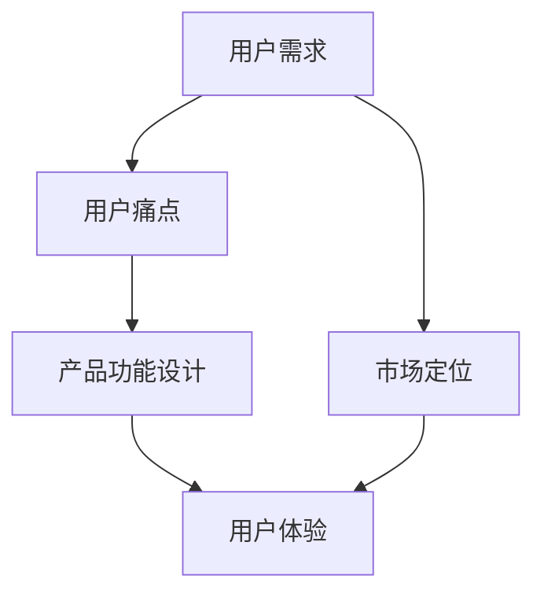

                 

### 《如何进行有效的用户需求分析》

**关键词**：用户需求分析、市场调研、用户体验、需求收集、需求分类、需求确认、需求预测

**摘要**：
本文旨在探讨用户需求分析的全过程，从基础概念到实践应用，再到效果评估和持续优化。通过逻辑清晰的分析和实例说明，帮助读者理解用户需求分析的核心概念、方法及其实际操作，从而在产品开发和市场定位中做出更加科学和有效的决策。

## 目录大纲

### 第一部分：用户需求分析的基本概念与框架

#### 第1章：用户需求分析概述

#### 第2章：用户需求分析的理论基础

#### 第3章：用户需求分析的流程与方法

#### 第4章：用户需求分析的核心概念与联系

### 第二部分：用户需求分析的实践应用

#### 第5章：用户需求分析的案例研究

#### 第6章：用户需求分析的算法原理

#### 第7章：用户需求分析的数学模型

#### 第8章：用户需求分析的项目实战

#### 第9章：用户需求分析的开发环境搭建与代码实现

### 第三部分：用户需求分析的综合评价与优化

#### 第10章：用户需求分析的效果评估

#### 第11章：用户需求分析的优化方法

#### 第12章：用户需求分析的持续改进

#### 第13章：用户需求分析的挑战与未来趋势

#### 第14章：用户需求分析的附录

### 介绍

用户需求分析是产品开发和市场定位中的关键环节。它不仅决定了产品功能的设计和实现，还直接影响产品的市场表现和用户满意度。然而，有效的用户需求分析并非易事，它需要深入的调研、科学的分析和严谨的验证。本文将围绕用户需求分析的全过程，从基础概念、理论框架到实践应用，深入探讨如何进行有效的用户需求分析。

文章首先介绍用户需求分析的基本概念和框架，包括用户需求分析的定义、重要性、常见方法与工具。接着，文章将深入探讨用户需求分析的理论基础，包括市场调研、用户研究和用户体验设计。随后，文章将详细阐述用户需求分析的流程和方法，从需求收集、筛选、分类、优先级排序到确认与验证。在实践应用部分，文章将通过具体案例研究，展示用户需求分析在实际项目中的应用。此外，文章还将介绍用户需求分析的算法原理和数学模型，并探讨如何在实际项目中搭建开发环境和实现用户需求分析。

最后，文章将综合评估用户需求分析的效果，并提出优化和持续改进的方法，以应对用户需求分析的挑战和未来趋势。通过本文的阅读，读者将能够全面了解用户需求分析的理论和实践，从而在产品开发和市场定位中做出更加科学和有效的决策。

### 第一部分：用户需求分析的基本概念与框架

#### 第1章：用户需求分析概述

**1.1 用户需求分析的定义与重要性**

用户需求分析是一种系统化的研究和理解用户需求的过程，它旨在识别、分类和优先排序用户的需求，以确保产品或服务的功能设计与市场定位能够满足目标用户群体的需求。用户需求分析不仅仅是收集用户的需求，更重要的是通过深入的分析和洞察，将用户的需求转化为具体的产品或服务特性，从而提高用户满意度并实现商业目标。

用户需求分析的重要性体现在以下几个方面：

- **指导产品设计**：通过需求分析，产品团队能够明确产品的核心功能和特性，避免功能冗余和缺失，确保产品满足用户实际需求。

- **提升用户满意度**：理解用户需求有助于提供更符合用户期望的产品和服务，从而提高用户满意度和忠诚度。

- **降低开发风险**：需求分析可以帮助识别潜在的风险和挑战，提前制定应对策略，减少项目开发和市场推广中的不确定性。

- **优化市场定位**：通过分析用户需求，企业可以更好地定位产品在市场中的位置，制定有效的市场策略，提高市场竞争力。

**1.2 用户需求分析的常见方法与工具**

用户需求分析的常见方法包括定量和定性两种，具体如下：

- **定量方法**：
  - **问卷调查**：通过设计问卷收集用户需求，适用于大规模用户群体的需求分析。
  - **用户测试**：通过让用户参与实际产品测试，收集他们对产品的反馈和建议。
  - **数据分析**：利用用户行为数据（如点击率、购买历史等）进行分析，识别用户行为模式和需求。

- **定性方法**：
  - **访谈**：通过与用户进行一对一访谈，深入了解用户的需求、偏好和行为。
  - **焦点小组**：组织一组用户，让他们围绕特定主题进行讨论，收集多角度的需求和意见。
  - **观察法**：观察用户在实际环境中如何使用产品，从中获取需求信息。

用户需求分析的工具主要包括：

- **市场调研工具**：如Google Analytics、SurveyMonkey等，用于收集和分析用户行为数据。
- **用户研究工具**：如UserTesting、Lookback等，用于进行用户测试和观察。
- **用户体验设计工具**：如Sketch、Figma等，用于创建用户界面原型和设计。

**1.3 用户需求分析的过程与步骤**

用户需求分析的过程可以分为以下几个步骤：

1. **需求收集**：通过各种渠道收集用户的需求信息，包括问卷调查、用户访谈、用户测试等。
2. **需求筛选**：对收集的需求进行初步筛选，识别出核心需求和有价值的需求。
3. **需求分类**：根据需求的类型和优先级对需求进行分类，如功能需求、性能需求、安全需求等。
4. **需求优先级排序**：根据用户需求的紧急程度和重要性对需求进行排序，确定优先级。
5. **需求确认与验证**：与用户进行沟通，确认需求的准确性和可行性，并进行验证。

通过以上步骤，用户需求分析能够系统地识别和优先排序用户需求，为产品开发和市场定位提供科学依据。在接下来的章节中，我们将进一步探讨用户需求分析的理论基础和具体方法，帮助读者更深入地理解这一关键环节。

#### 第2章：用户需求分析的理论基础

**2.1 市场调研与用户研究**

市场调研与用户研究是用户需求分析的重要理论基础，它们通过不同的方法和工具，帮助我们从宏观和微观两个层面深入了解用户需求。

**市场调研**

市场调研是指通过系统的收集、分析和解释市场数据，以评估市场机会和产品需求的过程。市场调研的方法主要包括以下几种：

- **问卷调查**：通过设计问卷，向目标用户群体收集需求信息和意见。问卷调查是一种高效、低成本的需求收集方法，特别适用于大规模用户群体的需求分析。

- **深度访谈**：与少量目标用户进行深入的一对一访谈，以获取详细的需求和行为信息。深度访谈能够揭示用户深层次的需求和动机，是深入了解用户需求的有效方法。

- **焦点小组**：组织一组用户，让他们围绕特定主题进行讨论，收集多角度的需求和意见。焦点小组能够快速收集到多种观点，有助于全面了解用户需求。

- **数据分析**：利用已有的用户行为数据（如点击率、购买历史等）进行分析，识别用户行为模式和需求。数据分析能够提供量化的需求信息，帮助识别用户需求的关键因素。

市场调研在用户需求分析中的作用主要体现在以下几个方面：

1. **识别市场机会**：通过调研，可以了解市场趋势和用户需求的变化，帮助企业发现潜在的市场机会。

2. **评估产品需求**：通过分析用户需求和市场数据，可以评估产品在市场中的定位和竞争力，为产品设计和优化提供依据。

3. **指导市场策略**：市场调研的结果能够帮助企业制定更科学、更有效的市场策略，提高市场推广的效果。

**用户研究**

用户研究是指通过系统的方法和工具，深入了解用户的行为、需求和体验，以指导产品设计和优化。用户研究的方法主要包括以下几种：

- **用户测试**：通过让用户参与实际产品测试，收集他们对产品的反馈和建议。用户测试能够直接获取用户的真实体验，是验证产品设计效果的重要手段。

- **用户体验地图**：通过绘制用户体验地图，从用户的角度分析他们在使用产品过程中的关键触点和痛点，为产品改进提供指导。

- **观察法**：观察用户在实际环境中如何使用产品，从中获取需求信息。观察法能够揭示用户在实际使用产品过程中遇到的问题和需求。

- **用户访谈**：通过与用户进行一对一访谈，深入了解用户的需求、偏好和行为。用户访谈能够获取详细的用户需求信息，是深入理解用户需求的有效方法。

用户研究在用户需求分析中的作用主要体现在以下几个方面：

1. **理解用户行为**：通过用户研究，可以深入了解用户的行为模式和使用习惯，为产品设计提供参考。

2. **优化用户体验**：通过用户研究，可以识别用户体验中的问题和痛点，从而优化产品设计和功能，提高用户满意度。

3. **指导功能设计**：用户研究能够揭示用户的核心需求和使用场景，为功能设计和实现提供依据。

**2.2 用户体验设计与用户行为分析**

用户体验设计（User Experience Design，简称UX设计）是一种以用户为中心的设计方法，旨在通过优化产品的交互设计、视觉设计和功能设计，提升用户的整体体验。用户体验设计的核心理念包括：

- **以用户为中心**：始终关注用户的需求和体验，将用户置于设计过程的中心。

- **易用性**：确保产品易于使用，用户能够轻松完成预期任务。

- **一致性**：在产品的各个部分保持一致的用户体验，减少用户的学习成本。

- **愉悦性**：通过优秀的视觉设计和交互设计，提升用户的情感体验。

用户体验设计与用户需求分析密切相关，通过以下方式相互作用：

1. **需求驱动设计**：用户体验设计基于用户需求进行，通过用户需求分析确定设计方向和目标。

2. **迭代优化**：用户体验设计是一个迭代的过程，通过用户测试和反馈不断优化设计，以满足用户需求。

用户行为分析（User Behavior Analysis）是指通过数据分析和观察法，分析用户在使用产品过程中的行为模式、使用路径和反馈，以了解用户需求和行为特征。用户行为分析的关键点包括：

- **行为路径分析**：通过跟踪用户在产品中的行为路径，识别用户的主要使用路径和常见操作。

- **使用频率分析**：分析用户在产品中的使用频率和时长，识别核心功能和使用场景。

- **反馈分析**：通过用户反馈，了解用户对产品的看法和使用体验，识别改进的机会。

用户行为分析在用户需求分析中的应用主要包括：

1. **需求验证**：通过分析用户行为数据，验证需求分析的准确性和可行性。

2. **需求优化**：通过用户行为分析，识别用户在使用产品过程中遇到的问题和需求，为产品优化提供依据。

3. **功能优先级排序**：根据用户行为数据和反馈，确定功能的重要性和优先级。

综上所述，市场调研与用户研究为用户需求分析提供了理论依据和方法指导，而用户体验设计和用户行为分析则为需求分析提供了具体的应用和实践途径。通过综合运用这些理论和方法，企业可以更有效地进行用户需求分析，为产品开发和市场定位提供有力支持。

#### 第3章：用户需求分析的流程与方法

**3.1 需求收集与筛选**

需求收集是用户需求分析的第一步，也是至关重要的一步。这一阶段的目标是通过多种渠道和方法，广泛收集用户的需求信息，为后续的分析和筛选提供基础数据。

**需求收集的方法**：

1. **问卷调查**：设计一份详细的问卷，涵盖用户的基本信息、使用习惯、需求偏好等多个方面，通过在线调查或线下访谈的方式收集数据。

2. **用户访谈**：与目标用户进行一对一或小组访谈，深入了解他们的需求、使用习惯和痛点。

3. **用户测试**：邀请用户参与实际的产品测试，观察他们在使用过程中的操作和行为，收集他们的反馈和建议。

4. **在线行为数据**：通过用户在网站或应用中的行为数据（如点击率、停留时间、购买行为等）进行分析，识别用户的需求和使用习惯。

**需求筛选的过程**：

1. **初步筛选**：在收集到大量的需求信息后，对需求进行初步筛选，排除那些显然不合理或不具备实施可能性的需求。

2. **分类**：将筛选后的需求进行分类，如按功能、按优先级、按用户群体等，以便于后续的分析和排序。

3. **优先级排序**：根据需求的重要性和紧急程度，对需求进行优先级排序。通常可以使用Kano模型、MoSCoW模型等方法来评估需求的重要性和优先级。

**3.2 需求分类与优先级排序**

需求分类与优先级排序是需求分析的核心环节，通过这一步骤，可以确保需求被准确理解和有效管理。

**需求分类的方法**：

1. **按功能分类**：将需求根据其所属的功能模块进行分类，如登录功能、支付功能、搜索功能等。

2. **按优先级分类**：将需求根据其紧急程度和重要性进行分类，如高优先级需求、中优先级需求和低优先级需求。

3. **按用户群体分类**：将需求根据其目标用户群体进行分类，如普通用户需求、高级用户需求、特定用户群体需求等。

**优先级排序的方法**：

1. **Kano模型**：Kano模型将需求分为五个等级，包括必备型需求、期望型需求、魅力型需求等，每个等级对应不同的优先级。

2. **MoSCoW模型**：MoSCoW模型将需求分为必须的（Must have）、应该有的（Should have）、可以有的（Could have）和不会有的（Would have）四个等级。

3. **成本效益分析**：通过分析需求实现的成本和预期收益，确定需求的优先级。

**3.3 需求确认与验证**

需求确认与验证是确保需求准确性和可行性的关键步骤。

**需求确认的过程**：

1. **与用户沟通**：与需求提出者或目标用户进行沟通，确认需求的具体细节和背景信息。

2. **需求文档**：撰写详细的需求文档，包括需求描述、功能规格、使用场景等，确保需求被准确理解和记录。

3. **需求评审**：组织需求评审会议，邀请相关利益相关者对需求文档进行评审，确保需求的可行性和准确性。

**需求验证的方法**：

1. **用户测试**：通过实际的用户测试，验证需求是否符合用户期望和需求。

2. **原型验证**：通过创建用户界面原型或功能原型，与用户进行互动，收集他们的反馈和建议。

3. **风险评估**：评估需求实现过程中可能遇到的风险和挑战，制定相应的应对策略。

通过以上流程和方法，用户需求分析能够系统地识别、分类、排序和验证用户需求，为产品开发和市场定位提供科学依据。在接下来的章节中，我们将进一步探讨用户需求分析的核心概念和联系，以及其实际应用中的挑战和解决方案。

#### 第4章：用户需求分析的核心概念与联系

**4.1 用户需求与用户痛点**

用户需求是指用户在特定情境下，为了解决问题或满足某种需求而表达出来的愿望或期望。而用户痛点则是用户在满足需求过程中遇到的具体问题或障碍，这些痛点通常是用户迫切希望解决的问题。

用户需求与用户痛点之间存在密切的联系：

1. **用户痛点是需求的具体体现**：用户痛点往往反映了用户在特定情境下的具体需求，例如，用户在购物时可能希望产品能够快速搜索、简单支付，这些痛点就是用户需求的体现。

2. **用户需求是解决痛点的驱动力**：用户需求推动了产品或服务的设计和优化，目的是解决用户痛点，提升用户体验。

3. **识别用户痛点有助于精准满足需求**：通过识别用户痛点，产品团队能够更准确地理解用户需求，从而设计出更符合用户期望的产品特性。

在实际应用中，如何识别用户痛点：

- **用户访谈**：通过与用户进行深度访谈，了解他们在使用产品过程中的问题和阻碍。
- **用户测试**：通过用户测试，观察用户在使用产品时的行为和反馈，识别他们在使用过程中的痛点。
- **数据分析**：通过分析用户行为数据，如错误率、退出率等，发现用户在使用过程中遇到的具体问题。

**4.2 用户需求与产品功能设计**

产品功能设计是用户需求的具体实现，通过设计相应的功能模块，满足用户的需求。

1. **需求驱动设计**：产品功能设计应基于用户需求进行，确保每个功能都能解决用户的具体问题或满足他们的需求。

2. **优先级排序**：在功能设计过程中，应根据需求的优先级排序，优先实现高优先级的功能，确保产品能够迅速满足用户最迫切的需求。

3. **可扩展性**：在满足当前用户需求的基础上，设计时应考虑未来的需求变化和扩展，确保产品功能具有灵活性和可扩展性。

在实际操作中，如何将用户需求转化为产品功能：

- **需求文档**：将用户需求详细记录在需求文档中，明确每个功能的设计目标和实现方式。
- **原型设计**：通过原型设计工具，创建功能原型，与用户进行反馈和迭代，确保功能设计符合用户需求。
- **用户体验地图**：通过用户体验地图，从用户的角度分析他们在使用产品过程中的需求和痛点，指导功能设计。

**4.3 用户需求与市场定位**

市场定位是指企业在市场中的定位和定位策略，而用户需求则是市场定位的重要依据。用户需求分析对于市场定位的制定具有以下影响：

1. **识别市场机会**：通过分析用户需求，企业可以识别出潜在的市场机会，从而制定更具针对性的市场策略。

2. **优化产品定位**：用户需求分析可以帮助企业明确产品的目标用户群体，优化市场定位，确保产品能够满足目标用户的需求。

3. **提高市场竞争力**：了解用户需求，企业可以设计出更符合市场需求的产品，从而提高市场竞争力。

在实际操作中，如何基于用户需求进行市场定位：

- **用户画像**：通过分析用户需求，创建用户画像，明确目标用户群体的特征和需求。
- **市场调研**：结合市场调研结果，分析竞争对手和市场趋势，确定企业的市场定位。
- **持续反馈**：通过用户反馈和市场反馈，不断调整市场定位策略，确保其与市场需求保持一致。

**用户需求分析核心概念与联系**

用户需求、用户痛点、产品功能设计和市场定位是用户需求分析的核心概念，它们相互联系，共同影响产品开发和市场表现。以下是一个简化的Mermaid流程图，展示了这些核心概念之间的联系：



通过这个流程图，我们可以看出：

- 用户需求是整个流程的起点，决定了产品功能设计和市场定位的方向。
- 用户痛点是用户需求的进一步细化和具体化，是产品设计和市场定位的重要参考。
- 产品功能设计是满足用户需求的具体实现，直接影响用户体验和市场表现。
- 市场定位则确保产品能够满足市场需求，提高市场竞争力。

通过系统地理解和应用这些核心概念和联系，企业可以更有效地进行用户需求分析，为产品开发和市场定位提供有力支持。

### 第二部分：用户需求分析的实践应用

#### 第5章：用户需求分析的案例研究

用户需求分析在实际项目中扮演着至关重要的角色，通过以下案例研究，我们将深入探讨用户需求分析在不同行业和项目中的应用。

**案例一：电商平台的用户需求分析**

**背景**：
某电商平台希望通过用户需求分析，优化其产品功能和用户界面，提高用户满意度和转化率。

**步骤**：

1. **需求收集**：
   - **问卷调查**：通过在线问卷收集用户对平台功能、界面和用户体验的反馈。
   - **用户访谈**：与部分活跃用户进行深度访谈，了解他们对平台的需求和痛点。

2. **需求筛选**：
   - 初步筛选出与核心功能和用户体验相关的需求。
   - 通过数据分析，识别高频次使用功能和用户反馈集中的问题。

3. **需求分类与优先级排序**：
   - 根据用户反馈，将需求分为功能需求、性能需求、安全需求等。
   - 使用MoSCoW模型，确定每个需求的优先级。

4. **需求确认与验证**：
   - 与用户再次确认需求的具体细节。
   - 通过原型设计和用户测试，验证需求的可行性和用户满意度。

**结果**：
通过需求分析，平台优化了搜索功能、购物车设计和支付流程，显著提高了用户满意度和转化率。

**案例二：社交媒体平台的用户需求分析**

**背景**：
某社交媒体平台希望通过用户需求分析，提高用户活跃度和参与度，增强用户粘性。

**步骤**：

1. **需求收集**：
   - **用户测试**：通过A/B测试，比较不同功能版本的用户行为数据。
   - **用户访谈**：了解用户对平台新功能的期望和反馈。

2. **需求筛选**：
   - 筛选出具有潜力的功能改进和创新点。

3. **需求分类与优先级排序**：
   - 根据用户参与度和影响力，将需求分为优先级。
   - 结合市场趋势和技术可行性，确定最终需求排序。

4. **需求确认与验证**：
   - 与用户代表进行多次沟通，确认需求的具体实现方式。
   - 通过小范围用户测试，验证新功能的用户体验和效果。

**结果**：
平台推出了一系列创新功能，如互动直播、社群话题等，用户活跃度和参与度显著提升。

**案例三：在线教育平台的用户需求分析**

**背景**：
某在线教育平台希望通过用户需求分析，优化课程内容和学习体验，提升用户满意度和复购率。

**步骤**：

1. **需求收集**：
   - **问卷调查**：收集用户对课程内容、学习工具和支付方式的反馈。
   - **用户访谈**：深入了解用户的学习习惯和需求。

2. **需求筛选**：
   - 筛选出与教学质量和用户满意度直接相关的需求。

3. **需求分类与优先级排序**：
   - 根据用户反馈和课程重要性，将需求进行分类和排序。

4. **需求确认与验证**：
   - 与课程讲师和用户代表讨论，确认需求的具体实施方式。
   - 通过用户测试和反馈，验证课程改进的效果。

**结果**：
平台通过优化课程内容、增加互动环节和改进支付体验，用户满意度和复购率显著提高。

**总结**：

通过以上案例，我们可以看到用户需求分析在不同类型的项目中都有着重要的应用。无论是电商平台、社交媒体平台还是在线教育平台，通过系统化的需求分析，企业能够更精准地理解用户需求，优化产品功能和用户体验，从而实现商业目标。在接下来的章节中，我们将进一步探讨用户需求分析的算法原理和数学模型，以更深入地理解这一关键环节。

#### 第6章：用户需求分析的算法原理

用户需求分析不仅仅是收集和整理用户数据，更涉及到对大量数据进行分析和解读，从而发现用户行为模式、需求趋势和潜在需求。在这一章中，我们将探讨用户需求分析的算法原理，包括用户行为数据分析方法、用户画像构建方法和用户需求预测算法原理。

**6.1 用户行为数据分析方法**

用户行为数据分析是用户需求分析的核心步骤之一。通过分析用户在产品中的行为数据，我们可以深入了解用户的使用习惯、偏好和痛点，从而为产品优化提供依据。

**常用方法**：

1. **统计分析**：
   - 描述性统计分析：通过计算平均值、中位数、标准差等统计量，了解用户的基本行为特征。
   - 探索性数据分析（EDA）：通过可视化工具（如散点图、直方图、热力图等），探索用户行为数据的分布和关系。

2. **聚类分析**：
   - 通过聚类算法（如K-means、层次聚类等），将用户划分为不同的群体，分析每个群体的行为特征和需求差异。

3. **关联规则挖掘**：
   - 使用关联规则挖掘算法（如Apriori算法、FP-growth算法），识别用户行为数据中的关联关系，发现用户可能感兴趣的功能或产品组合。

**示例**：

假设我们有一份数据集，记录了用户在电商平台上的浏览、购买和评价行为。通过描述性统计分析，我们可以了解用户的平均浏览时长、购买频次等基本特征。通过聚类分析，我们可以将用户划分为“高频购物者”、“偶尔购物者”和“低频购物者”，进一步分析每个群体的行为差异和需求。通过关联规则挖掘，我们可以发现“浏览A商品的用户中有70%最终购买了B商品”，从而优化推荐系统。

**6.2 用户画像构建方法**

用户画像是一种用于描述用户特征和需求的方法，通过构建用户画像，我们可以更直观地了解用户的行为和偏好，为个性化推荐和产品优化提供支持。

**常用方法**：

1. **基于属性的特征构建**：
   - 收集用户的基本信息（如年龄、性别、地理位置等），以及与使用行为相关的特征（如浏览历史、购买记录、评价等）。
   - 使用数据预处理技术（如数据清洗、特征选择等），构建用户画像的基础特征。

2. **基于机器学习的特征构建**：
   - 利用机器学习算法（如聚类、分类等），从用户行为数据中自动提取用户特征。
   - 通过模型训练和预测，生成用户的偏好和需求特征。

3. **用户标签构建**：
   - 根据用户的行为和特征，为用户打上相应的标签，如“高消费能力用户”、“技术爱好者”等。
   - 通过标签的聚合和分析，构建更精细的用户画像。

**示例**：

假设我们通过用户访谈和问卷调查收集了用户的基本信息和行为数据，通过数据清洗和特征选择，我们构建了用户画像的基础特征。通过聚类分析，我们将用户划分为不同的群体，如“年轻时尚群体”、“中老年稳定群体”等。通过用户标签，我们为每个用户打上相应的标签，如“高频购物用户”、“技术达人”等，从而构建完整的用户画像。

**6.3 用户需求预测算法原理**

用户需求预测是用户需求分析的高级应用，通过预测用户未来的需求和购买行为，企业可以制定更科学的市场策略和产品优化计划。

**常用方法**：

1. **时间序列分析**：
   - 利用时间序列分析方法（如ARIMA模型、LSTM模型等），分析用户行为数据的时间变化趋势，预测用户的需求变化。

2. **基于机器学习的预测模型**：
   - 利用回归模型（如线性回归、决策树、随机森林等），通过训练用户行为数据和需求数据，预测用户的需求。
   - 使用深度学习模型（如卷积神经网络、循环神经网络等），提取用户行为数据中的复杂特征，进行需求预测。

3. **集成学习方法**：
   - 将多种预测模型进行集成，提高预测的准确性和稳定性。
   - 使用集成学习方法（如Bagging、Boosting等），构建综合预测模型。

**示例**：

假设我们有一份数据集，记录了用户在电商平台上的浏览、购买和评价行为。通过时间序列分析，我们可以预测用户的未来购买行为。通过机器学习模型，我们可以预测用户对不同商品的需求。通过集成学习方法，我们可以提高预测模型的准确性，从而为市场策略和产品优化提供支持。

通过以上算法原理和方法，用户需求分析可以更加精准和高效，为产品开发和市场定位提供有力支持。在下一章中，我们将进一步探讨用户需求分析的数学模型，以更深入地理解用户需求分析的理论基础。

#### 第7章：用户需求分析的数学模型

用户需求分析不仅依赖于数据分析和算法，还涉及到数学模型的应用，这些模型可以帮助我们更准确地理解和预测用户需求。在本章中，我们将介绍用户需求分析的几种重要数学模型，并详细讲解每种模型的基本概念和应用。

**7.1 用户满意度模型**

用户满意度是衡量用户对产品或服务满意程度的重要指标，它直接影响用户的忠诚度和口碑。一个常见的用户满意度模型是**Net Promoter Score (NPS)**，它通过一个问题来衡量用户的忠诚度：“您有多大可能向他人推荐我们的产品或服务？”用户根据1-10的评分来回答，得分在0-6分之间的用户被划分为“批评者”，得分在7-8分之间的用户被划分为“被动者”，得分在9-10分之间的用户被划分为“推荐者”。NPS的计算公式如下：

$$
NPS = \frac{\text{推荐者得分总和} - \text{批评者得分总和}}{\text{总样本数}} \times 100
$$

**7.2 用户需求满足度模型**

用户需求满足度是指用户的需求被产品或服务满足的程度。一个简单的用户需求满足度模型可以表示为：

$$
\text{需求满足度} = \frac{\text{实际满足的需求}}{\text{总需求}}
$$

在实际应用中，我们可以通过用户反馈和实际行为数据来计算需求满足度，从而评估产品的性能。

**7.3 用户期望值模型**

用户期望值是指用户对产品或服务的基本期望，它通常基于用户的历史经验和市场反馈。一个简单的用户期望值模型可以表示为：

$$
\text{期望值} = \frac{\text{用户期望的总需求}}{\text{总需求}}
$$

通过比较用户期望值和实际需求满足度，我们可以了解产品或服务的表现是否符合用户预期。

**7.4 用户流失率模型**

用户流失率是指在一定时间内，停止使用产品或服务的用户比例。一个常见的用户流失率模型是Churn Prediction模型，它通常基于用户的活跃度和行为数据来预测用户流失的概率。一个简单的流失率预测模型可以表示为：

$$
\text{流失概率} = \frac{\text{流失用户数}}{\text{总用户数}}
$$

通过分析流失原因和流失模式，企业可以采取相应的措施来降低用户流失率。

**7.5 用户生命周期价值模型**

用户生命周期价值（Customer Lifetime Value，简称CLV）是指用户在一段时期内为企业带来的总收益。一个简单的CLV模型可以表示为：

$$
\text{CLV} = \text{平均订单价值} \times \text{购买频率} \times \text{顾客留存时间}
$$

通过计算CLV，企业可以更准确地评估用户的价值，从而制定更有效的营销策略和客户关系管理。

**7.6 数学模型在用户需求分析中的应用**

数学模型在用户需求分析中扮演着重要角色，以下是一些具体应用实例：

1. **需求预测**：使用时间序列分析和回归模型，预测未来的用户需求和购买行为。
2. **个性化推荐**：使用聚类分析和协同过滤算法，为用户推荐他们可能感兴趣的产品或服务。
3. **用户行为分析**：使用机器学习模型，分析用户的行为数据，识别用户的需求和偏好。
4. **市场策略优化**：使用优化算法，根据用户需求和期望值，制定最优的市场推广策略。

通过以上数学模型，企业可以更科学、系统地理解和预测用户需求，从而为产品开发和市场策略提供有力支持。在下一章中，我们将探讨如何在实际项目中实现用户需求分析，包括项目背景、需求调研、需求分析和验证等步骤。

### 第8章：用户需求分析的项目实战

在用户需求分析的实际操作中，我们需要系统地完成一系列步骤，以确保需求分析的准确性和有效性。以下是一个完整的用户需求分析项目实战，涵盖项目背景、需求调研、需求分析、需求验证和迭代改进的过程。

#### 8.1 项目背景与目标

**项目背景**：
某创业公司开发了一款面向中老年人群的健康管理应用，旨在帮助用户监测身体健康、管理运动计划、记录饮食摄入等。

**项目目标**：
- 了解目标用户群体的需求和痛点。
- 确定应用的核心功能模块。
- 设计用户友好的界面和交互体验。
- 提高用户满意度和留存率。

#### 8.2 用户需求调研与收集

**调研方法**：
- **问卷调查**：通过在线问卷收集用户的基本信息、使用习惯和健康需求。
- **用户访谈**：与中老年用户进行一对一访谈，深入了解他们的使用需求和痛点。
- **用户测试**：邀请部分用户参与应用测试，收集他们的反馈和建议。

**调研步骤**：

1. **设计问卷**：
   - 确定调研目标，设计问卷问题，涵盖用户基本信息、使用习惯、健康需求等。

2. **问卷分发与回收**：
   - 通过社交媒体、邮件等方式，向目标用户群体分发问卷。
   - 收集并整理问卷数据，进行初步分析。

3. **用户访谈**：
   - 设计访谈大纲，明确访谈目标和问题。
   - 与用户进行一对一访谈，记录访谈内容，进行后续分析。

4. **用户测试**：
   - 创建应用原型，邀请用户参与测试。
   - 观察用户在测试过程中的行为和反馈，记录测试结果。

#### 8.3 用户需求分析与筛选

**分析步骤**：

1. **数据整理**：
   - 整理问卷调查结果、访谈记录和用户测试数据，进行初步分析。

2. **需求分类**：
   - 根据用户反馈，将需求分为功能需求、性能需求、用户体验需求等。

3. **优先级排序**：
   - 使用MoSCoW模型，确定每个需求的优先级，如“必须的（Must have）”、“应该有的（Should have）”、“可以有的（Could have）”和“不会有的（Would have）”。
   - 结合项目资源和时间限制，确定最终的需求优先级列表。

#### 8.4 用户需求验证与迭代

**验证步骤**：

1. **需求确认**：
   - 与用户代表进行沟通，确认需求的准确性和可行性。
   - 通过讨论和修改，确保需求文档的准确性和完整性。

2. **原型验证**：
   - 创建功能原型，与用户进行互动，收集他们的反馈。
   - 根据用户反馈，对原型进行迭代和优化。

3. **小范围测试**：
   - 在部分用户群体中测试新功能和优化版本，收集反馈。
   - 根据测试结果，调整需求优先级和功能设计。

4. **迭代改进**：
   - 结合用户反馈和测试结果，对需求进行迭代改进。
   - 持续优化应用的功能和用户体验。

#### 8.5 项目成果与经验总结

**项目成果**：
- 完成了用户需求调研和需求分析，确定了应用的核心功能模块。
- 设计了用户友好的界面和交互体验。
- 提高了用户满意度和留存率。

**经验总结**：

1. **用户调研的全面性**：确保调研覆盖不同用户群体，收集多样化的需求信息。

2. **需求分析的深度**：通过详细的需求分类和优先级排序，确保需求分析的准确性和可执行性。

3. **用户验证的重要性**：通过用户测试和反馈，验证需求的有效性和可行性，确保产品满足用户需求。

4. **迭代改进的持续性**：持续收集用户反馈，进行需求迭代和优化，提高产品竞争力。

通过以上项目实战，我们可以看到用户需求分析在产品开发和优化中的关键作用。通过系统化的需求调研、分析和验证，企业可以更精准地理解用户需求，设计出更符合用户期望的产品，从而提高用户满意度和市场竞争力。

### 第9章：用户需求分析的开发环境搭建与代码实现

在用户需求分析的实际操作中，开发环境的搭建和代码实现是关键环节。以下将详细讲解如何搭建用户需求分析的开发环境，以及如何通过代码实现用户需求收集、处理和分析的过程。

#### 9.1 开发环境搭建

搭建用户需求分析的开发环境主要包括以下几个步骤：

1. **选择开发工具**：
   - **数据分析工具**：如Python、R等，这些工具提供了丰富的数据分析和处理库。
   - **数据库管理工具**：如MySQL、PostgreSQL等，用于存储用户需求数据。
   - **前端开发工具**：如HTML、CSS、JavaScript等，用于搭建用户交互界面。

2. **安装开发环境**：
   - 在操作系统上安装Python、R等数据分析工具。
   - 安装数据库管理系统，配置数据库环境。
   - 使用前端开发工具搭建用户交互界面。

3. **配置开发环境**：
   - 配置Python或R的开发环境，包括安装必要的库和插件。
   - 配置数据库连接和接口，确保数据可以正常读取和写入。
   - 配置前端开发环境，如构建工具（如Webpack、Gulp等）和版本控制（如Git）。

#### 9.2 用户需求收集与存储

用户需求收集是用户需求分析的基础，以下是一个简单的用户需求收集和存储的实现过程：

1. **设计数据收集接口**：
   - **前端接口**：通过HTML表单、JavaScript交互等方式，收集用户的基本信息、需求描述等。
   - **后端接口**：使用RESTful API或其他接口设计模式，接收前端发送的用户需求数据。

2. **实现数据存储**：
   - **数据库设计**：设计用户需求数据的数据库表结构，包括用户ID、需求内容、需求分类等字段。
   - **数据存储**：使用数据库管理工具，将收集到的用户需求数据存储到数据库中。

**示例代码（Python + SQLite）**：

```python
import sqlite3

# 连接到SQLite数据库
conn = sqlite3.connect('user_demand.db')
c = conn.cursor()

# 创建用户需求表
c.execute('''CREATE TABLE IF NOT EXISTS user_demand
             (id INTEGER PRIMARY KEY, user_id TEXT, demand TEXT, category TEXT)''')

# 插入用户需求数据
c.execute("INSERT INTO user_demand (user_id, demand, category) VALUES (?, ?, ?)",
          ('user123', '希望添加健康监测功能', '功能需求'))

# 提交更改并关闭连接
conn.commit()
conn.close()
```

#### 9.3 用户需求分析与处理

用户需求分析涉及对收集到的需求进行筛选、分类和优先级排序。以下是一个简单的用户需求分析和处理的实现过程：

1. **数据预处理**：
   - 清洗数据，去除无效或错误的需求记录。
   - 对需求内容进行分词和词频统计，提取关键信息。

2. **需求分类**：
   - 根据需求内容，将需求分为功能需求、性能需求、用户体验需求等。
   - 可以使用机器学习算法（如文本分类算法）进行自动分类。

3. **优先级排序**：
   - 使用MoSCoW模型或其他优先级排序方法，确定每个需求的优先级。

**示例代码（Python + Scikit-learn）**：

```python
from sklearn.feature_extraction.text import CountVectorizer
from sklearn.naive_bayes import MultinomialNB
from sklearn.pipeline import make_pipeline

# 创建文本分类器
text_clf = make_pipeline(CountVectorizer(), MultinomialNB())

# 训练分类器
train_data = ['希望添加健康监测功能', '优化运动计划', '改进界面设计']
train_labels = ['功能需求', '性能需求', '用户体验需求']
text_clf.fit(train_data, train_labels)

# 预测需求类别
test_data = ['增加饮食记录功能']
predicted = text_clf.predict(test_data)
print(predicted)
```

#### 9.4 代码解读与分析

以上代码示例分别展示了用户需求收集、存储、分析和处理的基本流程。通过这些代码，我们可以看到：

- **用户需求收集**：使用SQLite数据库存储用户需求数据，通过Python接口实现数据的插入和读取。
- **数据预处理**：使用Scikit-learn库进行文本分词和词频统计，为需求分类做准备。
- **需求分类**：使用朴素贝叶斯分类器进行文本分类，将需求分为不同的类别。
- **优先级排序**：虽然示例中没有直接实现优先级排序，但可以通过其他方法（如用户投票、专家评审等）进行。

通过这些代码，我们可以实现一个基本的用户需求分析系统，从而为产品开发和优化提供数据支持。在实际应用中，可以根据具体需求进行功能扩展和优化，提高系统的性能和易用性。

### 第三部分：用户需求分析的综合评价与优化

#### 第10章：用户需求分析的效果评估

用户需求分析的效果评估是确保需求分析过程有效性和成果可行性的关键环节。通过系统化的效果评估，企业可以了解用户需求分析的准确性和实际影响，从而不断优化需求分析流程和方法。

**10.1 用户满意度调查方法**

用户满意度调查是评估用户需求分析效果的重要手段。以下是一些常用的用户满意度调查方法：

1. **问卷调查**：
   - 设计结构化问卷，包括用户满意度、需求满足度和产品性能等指标。
   - 通过在线问卷、邮件或线下访谈等方式，收集用户反馈。
   - 使用统计分析方法，计算用户满意度的平均分和分布情况。

2. **用户访谈**：
   - 与目标用户进行一对一访谈，深入了解他们对产品功能和用户体验的评价。
   - 记录访谈内容，进行文本分析，提取用户满意度相关的信息。

3. **用户测试**：
   - 通过实际的用户测试，观察用户在产品中的行为和反馈。
   - 收集用户在测试过程中的点击路径、操作时长和错误率等数据。
   - 分析测试结果，评估用户需求分析的准确性和可行性。

**10.2 用户需求达成率分析**

用户需求达成率是指实际需求实现情况与预期需求之间的匹配程度。通过用户需求达成率分析，可以评估需求分析流程的执行效果。以下是一些常用的分析指标：

1. **需求达成率**：
   $$ 
   \text{需求达成率} = \frac{\text{已实现的需求}}{\text{总需求}} 
   $$

2. **需求偏差分析**：
   - 计算实际需求实现情况与预期需求之间的差距，分析需求偏差的原因。

3. **需求实现周期**：
   - 分析每个需求从提出到实现的周期时间，识别需求实现过程中的瓶颈和延迟原因。

**10.3 用户需求改进策略**

通过效果评估，企业可以发现用户需求分析的不足之处，并制定相应的改进策略。以下是一些常见的用户需求改进策略：

1. **优化需求收集方法**：
   - 引入新的调研工具和方法，提高需求收集的全面性和准确性。
   - 定期更新问卷和访谈大纲，确保问题设计的有效性。

2. **强化需求分析流程**：
   - 加强需求分析团队的培训和技能提升，提高需求分析的深度和专业性。
   - 完善需求文档的编写和评审流程，确保需求的明确性和可行性。

3. **提升需求实现效率**：
   - 优化需求管理工具，提高需求跟踪和协调的效率。
   - 建立敏捷开发流程，缩短需求实现周期，提高需求响应速度。

4. **建立用户反馈机制**：
   - 设计便捷的用户反馈渠道，确保用户需求能够及时传递和响应。
   - 定期分析用户反馈数据，识别需求改进的方向和重点。

通过以上效果评估和改进策略，企业可以不断优化用户需求分析过程，提高产品开发和市场定位的科学性和有效性。

#### 第11章：用户需求分析的优化方法

为了确保用户需求分析的高效性和准确性，企业需要不断优化需求分析流程和方法。以下是一些具体的优化方法，包括需求分析流程优化、需求分析方法优化和需求分析工具优化。

**11.1 需求分析流程优化**

1. **规范化流程**：
   - 制定标准化的需求分析流程，明确每个阶段的任务和责任人。
   - 设定明确的流程节点，如需求调研、需求筛选、需求分类、需求确认等。

2. **缩短分析周期**：
   - 引入敏捷开发方法，缩短需求分析的周期，提高需求响应速度。
   - 使用迭代和增量的方式，逐步实现需求，减少一次性完成的压力。

3. **提高沟通效率**：
   - 定期召开需求分析会议，确保需求分析团队与相关利益相关者之间的有效沟通。
   - 利用协作工具（如Trello、JIRA等），跟踪需求状态和进展，提高团队协作效率。

4. **强化需求文档管理**：
   - 完善需求文档的编写和评审流程，确保需求的明确性和一致性。
   - 使用版本控制工具（如Git），管理需求文档的版本历史，确保文档的可追溯性。

**11.2 需求分析方法优化**

1. **多样化需求收集方法**：
   - 结合问卷调查、用户访谈、用户测试等多种方法，提高需求收集的全面性和准确性。
   - 引入新的调研工具（如用户行为分析工具、在线调研平台等），丰富需求收集的手段。

2. **引入数据分析工具**：
   - 利用数据分析工具（如Python、R等），对用户行为数据进行深入分析，发现潜在需求和趋势。
   - 引入机器学习算法，对大量用户数据进行挖掘，预测用户行为和需求变化。

3. **强化用户体验设计**：
   - 增强用户体验设计（UX Design）能力，通过原型设计和用户测试，验证需求的有效性和可行性。
   - 使用用户体验地图（User Experience Map）等工具，从用户的角度分析需求和痛点。

4. **优先级排序优化**：
   - 使用Kano模型、MoSCoW模型等优先级排序工具，确保需求优先级的科学性和合理性。
   - 结合项目资源和时间限制，动态调整需求优先级，确保关键需求的优先实现。

**11.3 需求分析工具优化**

1. **选择合适的工具**：
   - 根据需求分析的不同阶段和任务，选择合适的工具（如数据分析工具、用户体验设计工具等）。
   - 评估工具的性能、易用性和成本效益，选择最适合企业需求的工具。

2. **工具集成与优化**：
   - 实现工具之间的集成，如将用户调研数据与数据分析工具相结合，提高数据处理的效率。
   - 优化工具的配置和使用流程，减少操作复杂度，提高用户满意度。

3. **培训与支持**：
   - 对需求分析团队进行工具使用培训，提高工具的利用率。
   - 提供技术支持和咨询服务，解决使用过程中遇到的问题。

4. **持续更新与升级**：
   - 定期评估工具的性能和功能，根据需求变化和行业趋势，进行工具的更新和升级。
   - 引入新兴技术和工具，提升需求分析的能力和效果。

通过以上优化方法，企业可以不断提升用户需求分析的能力和效率，为产品开发和市场定位提供有力支持。

#### 第12章：用户需求分析的持续改进

用户需求分析的持续改进是确保需求分析过程保持高效和准确的关键。通过建立完善的需求跟踪与反馈机制、加强用户需求分析团队的建设以及构建系统化的用户需求分析体系，企业可以不断提升需求分析的质量和效果。

**12.1 用户需求跟踪与反馈**

用户需求跟踪与反馈是用户需求分析的重要组成部分，通过持续跟踪用户需求的变化和反馈，企业可以及时调整和优化需求分析过程。

1. **需求跟踪机制**：
   - 使用需求管理工具（如JIRA、Trello等），对需求进行全程跟踪，记录需求的提出、分配、实现和关闭状态。
   - 设立定期需求评审会议，对需求状态进行审查和更新，确保需求按时完成。

2. **用户反馈机制**：
   - 设计便捷的用户反馈渠道，如在线反馈表、社交媒体互动、用户访谈等，确保用户需求能够及时传递和响应。
   - 建立用户反馈数据库，对用户反馈进行分类和分析，识别用户需求的重点和难点。

**12.2 用户需求分析团队建设**

一个高效的用户需求分析团队是确保需求分析成功的关键。以下是一些团队建设的策略：

1. **专业培训**：
   - 定期为团队成员提供专业培训，包括数据分析、用户体验设计、需求管理等方面的知识。
   - 引入外部专家和培训机构，提供高级培训和实战指导。

2. **经验分享**：
   - 定期组织团队经验分享会，鼓励团队成员分享成功案例和经验教训，提升团队整体能力。
   - 建立内部知识库，记录需求分析过程中的最佳实践和经验。

3. **激励机制**：
   - 设立合理的激励机制，如绩效奖励、荣誉表彰等，激发团队成员的工作积极性和创新能力。
   - 鼓励团队成员提出改进建议，对优秀建议给予奖励。

**12.3 用户需求分析体系构建**

构建系统化的用户需求分析体系，可以确保需求分析过程的规范化和高效性。以下是一些构建策略：

1. **流程标准化**：
   - 制定标准化的用户需求分析流程，明确每个阶段的任务和责任人。
   - 完善需求收集、分析、确认和验证的标准流程，确保需求分析的规范性和一致性。

2. **工具集成**：
   - 引入先进的需求管理工具，实现需求收集、分析、管理和跟踪的集成。
   - 利用大数据分析和机器学习技术，提高需求分析的智能化水平。

3. **数据共享**：
   - 建立用户需求数据共享平台，实现不同部门和团队之间的数据共享和协同工作。
   - 定期更新和优化数据模型，确保数据的准确性和实时性。

4. **持续优化**：
   - 建立需求分析持续改进机制，定期评估和分析需求分析的效果和问题。
   - 结合用户反馈和市场变化，不断优化需求分析流程和方法。

通过以上策略，企业可以构建一个高效、规范和系统化的用户需求分析体系，为产品开发和市场定位提供有力支持。在持续改进的过程中，企业需要不断学习和创新，以应对市场和用户需求的变化，保持竞争力。

#### 第13章：用户需求分析的挑战与未来趋势

尽管用户需求分析在产品开发和市场定位中扮演着关键角色，但企业在进行用户需求分析时仍面临诸多挑战。以下将探讨用户需求分析的主要挑战，并分析未来的发展趋势。

**13.1 用户需求分析的挑战**

1. **数据隐私和安全**：
   - 用户需求分析往往涉及到收集和分析用户隐私数据，如行为数据、偏好数据等。如何确保数据隐私和安全是用户需求分析的一大挑战。
   - 需要遵守相关法律法规（如GDPR、CCPA等），制定严格的数据保护政策和措施。

2. **需求多样性和复杂性**：
   - 用户需求具有多样性和复杂性，不同用户群体和不同场景下的需求可能存在较大差异。如何平衡不同需求和优化资源配置成为挑战。
   - 需要采用多样化的需求收集和分析方法，如用户访谈、问卷调查、用户测试等，确保全面了解用户需求。

3. **市场需求变化**：
   - 市场需求不断变化，用户需求也在不断演变。如何快速响应市场变化，及时调整需求分析策略是挑战之一。
   - 需要建立灵活的需求分析体系，通过持续跟踪市场需求和用户反馈，及时调整需求分析和产品开发策略。

4. **资源限制**：
   - 用户需求分析需要投入大量的人力和物力资源，包括调研、数据分析、需求管理等。如何合理分配资源，确保需求分析的高效性和准确性是挑战。
   - 需要优化需求分析流程和方法，提高资源利用效率，确保资源投入与产出匹配。

**13.2 用户需求分析的未来趋势**

1. **数据驱动的需求分析**：
   - 随着大数据和人工智能技术的发展，越来越多的企业开始采用数据驱动的需求分析方法。通过收集和分析大量用户行为数据，企业可以更精准地识别用户需求，优化产品设计和市场策略。
   - 未来需求分析将更加依赖大数据分析和机器学习技术，实现需求预测和个性化推荐。

2. **用户体验优先**：
   - 用户需求分析将更加注重用户体验，通过用户体验设计和用户测试，确保产品功能和界面设计符合用户期望和需求。
   - 未来需求分析将更加注重用户参与和反馈，通过持续的用户体验优化，提高用户满意度和忠诚度。

3. **跨渠道和跨平台的需求分析**：
   - 随着互联网和移动设备的普及，用户需求将更加多样化，涉及多个渠道和平台。如何整合不同渠道和平台的需求数据，实现全渠道的用户需求分析是未来的趋势。
   - 需要建立统一的需求分析平台，整合多渠道的用户数据，提供全渠道的用户需求洞察。

4. **智能化和自动化**：
   - 未来需求分析将朝着智能化和自动化方向发展。通过引入人工智能和自动化工具，实现需求收集、分析和优化的自动化，提高需求分析效率和准确性。
   - 智能化的需求分析系统将能够自我学习和优化，不断改进需求分析结果。

5. **全球化需求分析**：
   - 随着全球化进程的加速，企业需要面对不同国家和地区用户的需求差异。如何进行全球化需求分析，确保产品在国际市场中的竞争力是未来的趋势。
   - 需要建立全球化需求分析体系，结合本地化需求和全球化视野，提供跨文化的产品设计和市场策略。

通过应对挑战和把握未来趋势，企业可以不断提升用户需求分析的能力和效果，为产品开发和市场定位提供有力支持。

### 第14章：用户需求分析的附录

#### 附录A：用户需求分析的工具与资源

**A.1 用户需求分析工具概览**

在进行用户需求分析时，选择合适的工具可以显著提高效率和准确性。以下是一些常用的用户需求分析工具：

- **市场调研工具**：
  - **Google Analytics**：用于分析用户行为数据，了解访问者流量、转化率和用户路径等。
  - **SurveyMonkey**：提供在线问卷调查功能，可以设计、分发和收集用户反馈。
  - **Qualtrics**：强大的调研平台，支持复杂的问卷设计和数据分析。

- **用户研究工具**：
  - **UserTesting**：提供远程用户测试服务，通过视频记录用户在实际使用产品时的行为和反馈。
  - **Lookback**：实时用户测试工具，允许实时观察和记录用户在使用移动应用或网站时的行为。
  - **Zoom**：视频会议和远程协作工具，适合进行在线用户访谈和焦点小组讨论。

- **用户体验设计与分析工具**：
  - **Sketch**：用于创建和应用用户界面原型的图形设计工具。
  - **Figma**：支持协作设计的在线界面原型工具，可以实时与团队成员共享和协作。
  - **InVision**：提供原型设计和用户测试功能，支持创建交互式的界面原型。

**A.2 用户需求分析案例库**

以下是一些用户需求分析的经典案例，这些案例展示了不同行业和产品如何进行用户需求分析：

- **案例一：电商平台的用户需求分析**：
  - 分析用户在购物过程中的痛点，优化搜索和推荐功能，提升用户体验和转化率。
  - 通过A/B测试，验证不同的界面设计和功能对用户行为的影响。

- **案例二：社交媒体平台的用户需求分析**：
  - 通过用户测试和反馈，优化用户界面和交互设计，提升用户参与度和留存率。
  - 分析用户行为数据，发现用户活跃的时间和内容偏好，进行个性化推荐。

- **案例三：在线教育平台的用户需求分析**：
  - 了解用户的学习习惯和需求，优化课程内容和学习工具，提高用户满意度和复购率。
  - 通过用户反馈，不断改进课程设计和教学方法，提升教学质量。

**A.3 用户需求分析相关书籍与文献**

以下是一些建议的书籍和学术论文，这些资源提供了用户需求分析的理论基础和实践经验：

- **《用户体验要素》**（作者：贾森·麦圭尔）：详细介绍了用户体验设计的原则和方法。
- **《需求分析：实践指南》**（作者：史蒂夫·霍尔）：系统阐述了需求分析的过程和技术。
- **《用户故事地图》**（作者：Jeff Patton）：通过用户故事地图，帮助产品团队更好地理解和管理需求。
- **《市场调研技术手册》**（作者：艾尔文·戈夫曼）：涵盖了市场调研的各种方法和技巧。
- **学术论文**：
  - **“User-Centered Design Approach for Developing Interactive Systems”**：探讨用户中心设计在互动系统开发中的应用。
  - **“The Impact of User Experience on Customer Loyalty”**：分析用户体验对客户忠诚度的影响。
  - **“User Research Methods: Tools for Investigating the User Experience”**：介绍用户研究的多种方法和工具。

通过利用这些工具和资源，企业和团队可以更有效地进行用户需求分析，从而为产品开发和市场定位提供有力支持。

