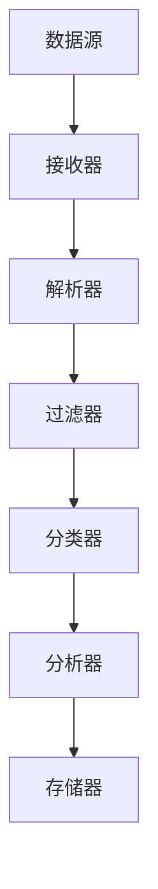

                 

### 《实时数据处理：Storm, Flink, and Spark Streaming》

> **关键词**: 实时数据处理，Storm，Flink，Spark Streaming，分布式计算，大数据技术，数据流引擎。

> **摘要**: 本文深入探讨了实时数据处理领域三大重要框架：Storm, Flink 和 Spark Streaming。通过对比分析，我们阐述了每个框架的核心概念、架构设计、工作原理以及优缺点，同时结合实际项目案例，详细展示了它们在实时数据处理中的应用实践，为开发者提供了一部全面系统的实战指南。

----------------------------------------------------------------

### 《实时数据处理：Storm, Flink, and Spark Streaming》目录大纲

1. **第一部分：实时数据处理技术概述**

   - **第1章：实时数据处理基础**

     - 1.1 实时数据处理的概念与重要性

       - 1.1.1 实时数据处理与传统批处理对比

       - 1.1.2 实时数据处理的关键特点

       - 1.1.3 实时数据处理的应用场景

     - 1.2 实时数据处理的技术架构

       - 1.2.1 实时数据处理的基本架构

       - 1.2.2 数据流引擎的选择

       - 1.2.3 分布式计算模型

     - 1.3 主流实时数据处理框架简介

       - 1.3.1 Storm

       - 1.3.2 Flink

       - 1.3.3 Spark Streaming

     - 1.4 实时数据处理的优势与挑战

       - 1.4.1 实时数据处理的优势

       - 1.4.2 实时数据处理的挑战

       - 1.4.3 实时数据处理的发展趋势

2. **第二部分：Storm 深入讲解**

   - **第2章：Storm 基础**

     - 2.1 Storm 概述

       - 2.1.1 Storm 的定义与设计理念

       - 2.1.2 Storm 的核心组件

       - 2.1.3 Storm 的拓扑结构

     - 2.2 Storm 的数据流处理原理

       - 2.2.1 Storm 的数据流模型

       - 2.2.2 Storm 的拓扑构建

       - 2.2.3 Storm 中的消息传递机制

     - 2.3 Storm 的拓扑配置与部署

       - 2.3.1 Storm 的配置文件

       - 2.3.2 Storm 的拓扑部署方式

       - 2.3.3 Storm 的分布式执行

     - 2.4 Storm 实践案例

       - 2.4.1 基于Storm的实时日志处理

       - 2.4.2 基于Storm的实时流数据处理

       - 2.4.3 基于Storm的实时计算与报表生成

   - **第3章：Storm 的高级特性**

     - 3.1 Storm 的高级组件

       - 3.1.1 Storm 的存储层

       - 3.1.2 Storm 的窗口机制

       - 3.1.3 Storm 的可靠性机制

     - 3.2 Storm 的高级拓扑设计

       - 3.2.1 Storm 中的动态拓扑调整

       - 3.2.2 Storm 中的分布式任务调度

       - 3.2.3 Storm 中的实时流处理监控

     - 3.3 Storm 的性能优化

       - 3.3.1 Storm 中的资源管理

       - 3.3.2 Storm 中的任务负载均衡

       - 3.3.3 Storm 的性能调优技巧

   - **第4章：Storm 的应用案例**

     - 4.1 基于Storm的实时推荐系统

       - 4.1.1 系统设计

       - 4.1.2 数据流处理流程

       - 4.1.3 系统性能评估

     - 4.2 基于Storm的实时流媒体处理

       - 4.2.1 系统架构

       - 4.2.2 数据流处理机制

       - 4.2.3 系统性能优化

     - 4.3 基于Storm的实时金融数据处理

       - 4.3.1 数据处理需求

       - 4.3.2 系统架构

       - 4.3.3 实时数据处理流程

3. **第三部分：Flink 深入讲解**

   - **第5章：Flink 基础**

     - 5.1 Flink 概述

       - 5.1.1 Flink 的定义与设计理念

       - 5.1.2 Flink 的核心组件

       - 5.1.3 Flink 的流处理模型

     - 5.2 Flink 的数据流处理原理

       - 5.2.1 Flink 的数据流模型

       - 5.2.2 Flink 的拓扑构建

       - 5.2.3 Flink 中的消息传递机制

     - 5.3 Flink 的拓扑配置与部署

       - 5.3.1 Flink 的配置文件

       - 5.3.2 Flink 的拓扑部署方式

       - 5.3.3 Flink 的分布式执行

     - 5.4 Flink 实践案例

       - 5.4.1 基于Flink的实时日志处理

       - 5.4.2 基于Flink的实时流数据处理

       - 5.4.3 基于Flink的实时计算与报表生成

   - **第6章：Flink 的高级特性**

     - 6.1 Flink 的高级组件

       - 6.1.1 Flink 的存储层

       - 6.1.2 Flink 的窗口机制

       - 6.1.3 Flink 的可靠性机制

     - 6.2 Flink 的高级拓扑设计

       - 6.2.1 Flink 中的动态拓扑调整

       - 6.2.2 Flink 中的分布式任务调度

       - 6.2.3 Flink 中的实时流处理监控

     - 6.3 Flink 的性能优化

       - 6.3.1 Flink 中的资源管理

       - 6.3.2 Flink 中的任务负载均衡

       - 6.3.3 Flink 的性能调优技巧

   - **第7章：Flink 的应用案例**

     - 7.1 基于Flink的实时推荐系统

       - 7.1.1 系统设计

       - 7.1.2 数据流处理流程

       - 7.1.3 系统性能评估

     - 7.2 基于Flink的实时流媒体处理

       - 7.2.1 系统架构

       - 7.2.2 数据流处理机制

       - 7.2.3 系统性能优化

     - 7.3 基于Flink的实时金融数据处理

       - 7.3.1 数据处理需求

       - 7.3.2 系统架构

       - 7.3.3 实时数据处理流程

4. **第四部分：Spark Streaming 深入讲解**

   - **第8章：Spark Streaming 基础**

     - 8.1 Spark Streaming 概述

       - 8.1.1 Spark Streaming 的定义与设计理念

       - 8.1.2 Spark Streaming 的核心组件

       - 8.1.3 Spark Streaming 的流处理模型

     - 8.2 Spark Streaming 的数据流处理原理

       - 8.2.1 Spark Streaming 的数据流模型

       - 8.2.2 Spark Streaming 的拓扑构建

       - 8.2.3 Spark Streaming 中的消息传递机制

     - 8.3 Spark Streaming 的拓扑配置与部署

       - 8.3.1 Spark Streaming 的配置文件

       - 8.3.2 Spark Streaming 的拓扑部署方式

       - 8.3.3 Spark Streaming 的分布式执行

     - 8.4 Spark Streaming 实践案例

       - 8.4.1 基于Spark Streaming的实时日志处理

       - 8.4.2 基于Spark Streaming的实时流数据处理

       - 8.4.3 基于Spark Streaming的实时计算与报表生成

   - **第9章：Spark Streaming 的高级特性**

     - 9.1 Spark Streaming 的高级组件

       - 9.1.1 Spark Streaming 的存储层

       - 9.1.2 Spark Streaming 的窗口机制

       - 9.1.3 Spark Streaming 的可靠性机制

     - 9.2 Spark Streaming 的高级拓扑设计

       - 9.2.1 Spark Streaming 中的动态拓扑调整

       - 9.2.2 Spark Streaming 中的分布式任务调度

       - 9.2.3 Spark Streaming 中的实时流处理监控

     - 9.3 Spark Streaming 的性能优化

       - 9.3.1 Spark Streaming 中的资源管理

       - 9.3.2 Spark Streaming 中的任务负载均衡

       - 9.3.3 Spark Streaming 的性能调优技巧

   - **第10章：Spark Streaming 的应用案例**

     - 10.1 基于Spark Streaming的实时推荐系统

       - 10.1.1 系统设计

       - 10.1.2 数据流处理流程

       - 10.1.3 系统性能评估

     - 10.2 基于Spark Streaming的实时流媒体处理

       - 10.2.1 系统架构

       - 10.2.2 数据流处理机制

       - 10.2.3 系统性能优化

     - 10.3 基于Spark Streaming的实时金融数据处理

       - 10.3.1 数据处理需求

       - 10.3.2 系统架构

       - 10.3.3 实时数据处理流程

5. **第五部分：实时数据处理框架对比与应用选择**

   - **第11章：Storm, Flink, 和 Spark Streaming 对比**

     - 11.1 框架对比概述

       - 11.1.1 Storm 与 Flink 的对比

       - 11.1.2 Storm 与 Spark Streaming 的对比

       - 11.1.3 Flink 与 Spark Streaming 的对比

     - 11.2 各框架的优缺点分析

       - 11.2.1 Storm 的优势与局限

       - 11.2.2 Flink 的优势与局限

       - 11.2.3 Spark Streaming 的优势与局限

     - 11.3 应用场景选择

       - 11.3.1 哪些场景适合使用 Storm？

       - 11.3.2 哪些场景适合使用 Flink？

       - 11.3.3 哪些场景适合使用 Spark Streaming？

   - **第12章：实时数据处理架构设计与实践**

     - 12.1 实时数据处理架构设计原则

       - 12.1.1 架构设计的关键点

       - 12.1.2 系统可扩展性与可维护性

       - 12.1.3 实时数据处理的安全性与可靠性

     - 12.2 实时数据处理项目实战

       - 12.2.1 实时数据处理项目概述

       - 12.2.2 项目需求分析

       - 12.2.3 系统架构设计

       - 12.2.4 数据流处理流程

       - 12.2.5 系统性能评估与优化

### 第一部分：实时数据处理技术概述

#### 第1章：实时数据处理基础

##### 1.1 实时数据处理的概念与重要性

**1.1.1 实时数据处理与传统批处理对比**

实时数据处理（Real-time Data Processing）和传统批处理（Batch Processing）是数据处理领域两种不同的数据处理方式。它们之间的主要区别在于处理数据的时间尺度。

- **批处理**：批处理是一种处理大数据量的数据处理方式，它将数据收集并存储在一段时间内，然后在一个特定的时间窗口内一次性进行处理。批处理的主要优势在于其高效的数据处理能力和较低的处理成本。然而，批处理的一个显著缺点是其延迟较高，不适合处理需要即时响应的场景。

- **实时处理**：实时数据处理则是一种以毫秒或秒级的时间尺度进行数据处理的方式，它可以实时响应数据流中的事件。实时数据处理的核心特点是低延迟和高吞吐量，使其在需要实时分析和决策的场景中具有显著优势。

**1.1.2 实时数据处理的关键特点**

实时数据处理具有以下关键特点：

- **低延迟**：实时数据处理能够在极短的时间内处理数据，满足实时分析和决策的需求。

- **高吞吐量**：实时数据处理能够处理大量数据，同时保持低延迟。

- **数据完整性**：实时数据处理能够保证数据的一致性和完整性。

- **可靠性**：实时数据处理系统需要具备高可用性和故障恢复能力，确保系统的稳定运行。

**1.1.3 实时数据处理的应用场景**

实时数据处理在许多领域都有广泛的应用，以下是几个典型的应用场景：

- **金融领域**：在金融领域，实时数据处理用于股票交易、风险管理、欺诈检测等场景，需要实时获取和处理大量金融数据，以便快速做出决策。

- **物联网领域**：物联网（IoT）设备产生的数据量巨大，实时数据处理可以帮助实现设备监控、环境监测、智能决策等应用。

- **社交媒体领域**：社交媒体平台需要实时处理用户发布的内容、评论、点赞等数据，以实现实时推荐、内容过滤等功能。

- **智慧城市领域**：智慧城市建设需要实时处理交通流量、环境监测、公共安全等数据，以提高城市管理的效率和响应速度。

##### 1.2 实时数据处理的技术架构

**1.2.1 实时数据处理的基本架构**

实时数据处理的基本架构包括以下几个核心组件：

- **数据源**：数据源是实时数据处理的起点，可以是传感器、数据库、日志文件等，产生大量的实时数据。

- **数据流引擎**：数据流引擎是实时数据处理的核心组件，负责接收、处理和传输数据。常见的数据流引擎包括Storm、Flink和Spark Streaming等。

- **数据处理组件**：数据处理组件负责对数据进行存储、计算、分析等操作。常见的数据处理组件包括HDFS、HBase、Redis等。

- **存储系统**：存储系统用于存储实时处理的数据，可以是关系型数据库、NoSQL数据库、分布式文件系统等。

- **监控系统**：监控系统负责监控实时数据处理系统的运行状态，包括资源使用情况、错误日志等。

**1.2.2 数据流引擎的选择**

在选择数据流引擎时，需要考虑以下几个方面：

- **性能**：数据流引擎需要具备高吞吐量和低延迟，以满足实时处理的需求。

- **可扩展性**：数据流引擎需要支持水平扩展，以便处理大规模数据。

- **可靠性**：数据流引擎需要具备高可用性和故障恢复能力。

- **易用性**：数据流引擎需要提供丰富的API和工具，方便开发者进行开发和部署。

常见的实时数据处理框架如下：

- **Storm**：Apache Storm是一个分布式、实时数据处理框架，具有高吞吐量、低延迟和可靠性等特点。

- **Flink**：Apache Flink是一个分布式流处理框架，提供低延迟、高吞吐量和复杂窗口操作等特性。

- **Spark Streaming**：Apache Spark Streaming是基于Apache Spark的实时数据处理框架，具有高效、易用的特点。

**1.2.3 分布式计算模型**

实时数据处理通常采用分布式计算模型，以实现高效的数据处理和负载均衡。分布式计算模型的关键特点是数据分片和任务分发。

- **数据分片**：数据分片是将大量数据划分为多个子集，以便在多个节点上进行并行处理。常见的数据分片方法包括哈希分片、范围分片等。

- **任务分发**：任务分发是将处理任务分配到不同的节点上执行。任务分发策略需要考虑负载均衡、数据本地化等因素。

##### 1.3 主流实时数据处理框架简介

**1.3.1 Storm**

Apache Storm是一个分布式、实时数据处理框架，由Twitter开发并捐赠给Apache基金会。Storm具有以下特点：

- **实时计算**：Storm可以实时处理大规模数据流，提供毫秒级延迟。

- **可扩展性**：Storm支持水平扩展，可以处理大规模的数据流。

- **可靠性**：Storm具有高可用性和故障恢复能力，可以确保数据处理的可靠性。

- **易用性**：Storm提供丰富的API和工具，支持多种编程语言，方便开发者进行开发和部署。

**1.3.2 Flink**

Apache Flink是一个分布式流处理框架，提供低延迟、高吞吐量和复杂窗口操作等特性。Flink具有以下特点：

- **实时计算**：Flink可以实时处理大规模数据流，提供毫秒级延迟。

- **流处理与批处理一体化**：Flink支持流处理和批处理一体化，可以同时处理实时数据和批量数据。

- **复杂窗口操作**：Flink提供丰富的窗口操作，可以灵活地对数据进行聚合和分析。

- **易用性**：Flink提供丰富的API和工具，支持多种编程语言，方便开发者进行开发和部署。

**1.3.3 Spark Streaming**

Apache Spark Streaming是基于Apache Spark的实时数据处理框架，具有高效、易用的特点。Spark Streaming具有以下特点：

- **高效性**：Spark Streaming基于Spark，可以充分利用Spark的强大计算能力，提供高效的数据处理。

- **易用性**：Spark Streaming提供简单易用的API，支持多种编程语言，方便开发者进行开发和部署。

- **可扩展性**：Spark Streaming支持水平扩展，可以处理大规模的数据流。

- **与Spark生态系统集成**：Spark Streaming可以与Spark的其他组件（如Spark SQL、MLlib等）无缝集成，提供丰富的数据处理和分析功能。

##### 1.4 实时数据处理的优势与挑战

**1.4.1 实时数据处理的优势**

实时数据处理相对于传统批处理具有以下优势：

- **低延迟**：实时数据处理能够在毫秒或秒级内处理数据，满足实时分析和决策的需求。

- **高吞吐量**：实时数据处理能够处理大量数据，同时保持低延迟。

- **数据完整性**：实时数据处理能够保证数据的一致性和完整性。

- **实时监控与报警**：实时数据处理可以帮助企业实时监控业务运行状况，及时发现异常情况并做出响应。

- **快速迭代与改进**：实时数据处理能够快速响应业务需求，支持业务快速迭代和改进。

**1.4.2 实时数据处理的挑战**

实时数据处理也面临一些挑战：

- **数据一致性与可靠性**：实时数据处理需要在低延迟和高吞吐量的前提下保证数据的一致性和可靠性，这需要复杂的分布式计算技术和可靠性保障机制。

- **系统复杂性**：实时数据处理系统通常涉及多个组件和复杂的拓扑结构，需要具备较高的系统架构和运维能力。

- **数据存储与访问**：实时数据处理需要高效的数据存储和访问机制，以支持大规模数据的高效读写。

- **安全性**：实时数据处理系统需要保障数据的安全性和隐私性，防止数据泄露和未授权访问。

- **资源管理**：实时数据处理需要高效地管理计算资源和存储资源，以最大化利用系统资源。

**1.4.3 实时数据处理的发展趋势**

随着大数据技术的快速发展，实时数据处理也逐渐成为数据处理的趋势。以下是实时数据处理的一些发展趋势：

- **流处理与批处理一体化**：流处理和批处理将在实时数据处理中逐渐融合，实现流处理与批处理的一体化。

- **云计算与边缘计算**：实时数据处理将逐步向云计算和边缘计算方向发展，实现更高效、更灵活的数据处理。

- **实时机器学习与人工智能**：实时数据处理将与机器学习和人工智能技术相结合，实现实时预测和智能决策。

- **开源生态的完善**：实时数据处理的开源生态将不断完善，提供更多的工具和框架，方便开发者进行开发和部署。

#### 第2章：Storm 基础

##### 2.1 Storm 概述

**2.1.1 Storm 的定义与设计理念**

Apache Storm 是一个分布式、实时数据处理框架，由 Twitter 开发并捐赠给 Apache 基金会。Storm 的核心设计理念是简单、高效和可靠。

- **简单**：Storm 的 API 设计简单易用，支持多种编程语言，如 Java、Scala、Python 和 Clojure。开发者可以轻松地构建实时数据处理应用。

- **高效**：Storm 具有高吞吐量和低延迟，能够实时处理大规模数据流，满足实时数据处理的需求。

- **可靠**：Storm 提供了高可用性和故障恢复能力，确保数据处理的可靠性。它能够自动处理节点故障，保证数据不丢失。

**2.1.2 Storm 的核心组件**

Storm 框架主要包括以下核心组件：

- **Nimbus**：Nimbus 是 Storm 集群的 master 节点，负责资源管理和任务调度。它将拓扑结构分解为多个任务，并分配给不同的工作节点执行。

- **Supervisor**：Supervisor 是工作节点上的守护进程，负责运行分配给它的任务。每个 Supervisor 节点上可以运行多个任务。

- **Worker**：Worker 是运行在 Supervisor 节点上的进程，负责执行具体的数据处理任务。多个 Worker 协同工作，共同处理数据流。

- **Zookeeper**：Zookeeper 是 Storm 集群的协调服务，负责存储和管理拓扑元数据，提供分布式锁和协调服务。

**2.1.3 Storm 的拓扑结构**

Storm 拓扑（Topology）是 Storm 的核心概念，表示一个分布式数据处理应用。一个 Storm 拓扑由一系列 Spouts 和 Bolts 组成。

- **Spouts**：Spouts 是数据流的源头，负责生成数据流。Spouts 可以从外部数据源读取数据，如 Kafka、Kinesis、Redis 等。

- **Bolts**：Bolts 是数据处理的核心组件，负责对数据进行处理、转换和聚合。Bolts 可以执行各种操作，如过滤、映射、分组、聚合等。

一个 Storm 拓扑的执行过程如下：

1. **初始化**：Nimbus 读取 Zookeeper 中的拓扑元数据，并分配任务给不同的 Supervisor。

2. **任务分配**：Supervisor 根据任务分配情况启动 Worker 进程，并加载相应的 Spouts 和 Bolts。

3. **数据处理**：Spouts 生成数据流，Bolts 对数据进行处理和转换。

4. **数据传输**：Bolts 之间通过消息队列进行数据传输，实现分布式数据处理。

5. **监控与协调**：Zookeeper 负责监控 Storm 集群的运行状态，并协调各个组件的工作。

##### 2.2 Storm 的数据流处理原理

**2.2.1 Storm 的数据流模型**

Storm 的数据流模型基于分布式数据流计算，由多个处理节点组成。每个节点负责处理一部分数据，多个节点协同工作，共同完成大规模数据流的处理。

- **Tuple**：Tuple 是 Storm 的基本数据单位，表示一条记录。Tuple 由一个键（Key）和一个或多个字段（Field）组成。

- **Stream**：Stream 是由多个 Tuple 组成的数据流，表示需要处理的数据集合。

- **Spout**：Spout 是数据流的源头，负责生成数据流。Spout 可以是 Kafka 的消费者、Kinesis 的数据源，或者其他外部数据源。

- **Bolt**：Bolt 是数据处理的核心组件，负责对数据进行处理、转换和聚合。Bolt 可以执行各种操作，如过滤、映射、分组、聚合等。

**2.2.2 Storm 的拓扑构建**

Storm 的拓扑是由 Spouts 和 Bolts 组成的分布式数据处理应用。拓扑的构建主要包括以下几个步骤：

1. **定义 Spout**：定义数据流的源头，从外部数据源读取数据。

2. **定义 Bolt**：定义数据处理的步骤，对数据进行处理、转换和聚合。

3. **连接 Spout 和 Bolt**：通过 Stream Grouping 模式连接 Spout 和 Bolt，实现数据流传输。

4. **配置拓扑参数**：配置拓扑的并行度、任务数量等参数。

5. **部署拓扑**：将拓扑部署到 Storm 集群中，启动拓扑的执行。

**2.2.3 Storm 中的消息传递机制**

Storm 中的消息传递机制是基于消息队列的。Bolts 之间通过消息队列进行数据传输，实现分布式数据处理。以下是一个简单的消息传递过程：

1. **发送消息**：当一个 Bolt 完成一个处理步骤后，将处理结果发送到一个或多个其他 Bolt 的消息队列中。

2. **接收消息**：其他 Bolt 从自己的消息队列中接收消息，并执行相应的处理步骤。

3. **异步处理**：Bolts 的处理过程是异步的，多个 Bolt 可以并行处理数据流。

4. **流量控制**：Storm 提供流量控制机制，可以动态调整 Bolt 之间的数据传输速率，避免数据积压和资源浪费。

##### 2.3 Storm 的拓扑配置与部署

**2.3.1 Storm 的配置文件**

Storm 拓扑的配置信息存储在配置文件中，主要有以下几种配置项：

- **storm.yaml**：全局配置文件，包括 Storm 集群的配置信息，如 Zookeeper 集群地址、拓扑默认参数等。

- **topology.yaml**：特定拓扑的配置文件，包括拓扑名称、Spout 和 Bolt 的配置信息，如并行度、任务数量等。

- **ui.properties**：UI 配置文件，用于配置 Storm UI 的访问地址和端口。

**2.3.2 Storm 的拓扑部署方式**

Storm 的拓扑部署方式可以分为本地部署、集群部署和云部署。

- **本地部署**：在单台机器上运行 Storm 拓扑，适合开发和测试环境。

- **集群部署**：在多台机器上运行 Storm 拓扑，实现分布式数据处理。集群部署可以分为本地集群部署和远程集群部署。

  - **本地集群部署**：在同一台机器上模拟多节点集群，方便开发和测试。

  - **远程集群部署**：在远程集群上部署 Storm 拓扑，实现大规模数据处理。需要配置 Storm 集群环境，包括 Supervisor 节点和 Worker 节点。

- **云部署**：在云平台上部署 Storm 拓扑，如 AWS、阿里云等。云部署可以充分利用云平台的弹性计算资源，实现高效的数据处理。

**2.3.3 Storm 的分布式执行**

Storm 的分布式执行过程主要包括以下几个步骤：

1. **初始化**：Nimbus 读取 Zookeeper 中的拓扑元数据，并分配任务给不同的 Supervisor。

2. **任务分配**：Supervisor 根据任务分配情况启动 Worker 进程，并加载相应的 Spouts 和 Bolts。

3. **数据处理**：Worker 进程运行在 Supervisor 节点上，执行分配的任务，生成数据流。

4. **数据传输**：Bolts 之间通过消息队列进行数据传输，实现分布式数据处理。

5. **监控与协调**：Zookeeper 负责监控 Storm 集群的运行状态，并协调各个组件的工作。

##### 2.4 Storm 实践案例

**2.4.1 基于Storm的实时日志处理**

实时日志处理是一个典型的实时数据处理应用场景，可以通过 Storm 实现日志的实时收集、分析和报警。

1. **需求分析**

   - 收集多个服务器的日志数据。

   - 实时分析日志数据，提取有用的信息。

   - 根据分析结果发送报警通知。

2. **系统架构**

   - **数据源**：多个服务器的日志文件。

   - **Spout**：从日志文件中读取数据，生成日志数据流。

   - **Bolt**：对日志数据进行解析、过滤和统计分析。

   - **报警系统**：根据分析结果发送报警通知。

3. **实现步骤**

   1. 定义 Spout，从日志文件中读取数据。

   2. 定义 Bolt，对日志数据进行解析、过滤和统计分析。

   3. 连接 Spout 和 Bolt，实现日志数据的实时处理。

   4. 配置报警系统，根据分析结果发送报警通知。

4. **代码示例**

```java
// 定义 Spout，从日志文件中读取数据
SpoutConfig spoutConfig = new SpoutConfig(new LogSpout(), new Fields("log"));
TopologyBuilder builder = new TopologyBuilder();
builder.setSpout("log-spout", spoutConfig);

// 定义 Bolt，对日志数据进行解析、过滤和统计分析
builder.setBolt("log-parser", new LogParserBolt()).shuffleGrouping("log-spout");
builder.setBolt("log-filter", new LogFilterBolt()).fieldsGrouping("log-parser", new Fields("log_type"));
builder.setBolt("log-analyzer", new LogAnalyzerBolt()).globalGrouping("log-filter");

// 连接 Spout 和 Bolt，实现日志数据的实时处理
stormSubmitter.submitTopology("log-processing-topology", config, builder.createTopology());
```

**2.4.2 基于Storm的实时流数据处理**

实时流数据处理是 Storm 的主要应用场景之一，可以通过 Storm 实现实时数据流的采集、传输和处理。

1. **需求分析**

   - 实时采集各种传感器数据。

   - 实时传输和计算传感器数据。

   - 根据分析结果做出实时决策。

2. **系统架构**

   - **数据源**：各种传感器，如温度传感器、湿度传感器、风速传感器等。

   - **Spout**：从传感器读取数据，生成数据流。

   - **Bolt**：对数据进行传输、计算和决策。

   - **存储系统**：存储实时处理的数据和分析结果。

3. **实现步骤**

   1. 定义 Spout，从传感器读取数据。

   2. 定义 Bolt，对数据进行传输、计算和决策。

   3. 连接 Spout 和 Bolt，实现实时流数据处理。

   4. 配置存储系统，存储实时处理的数据和分析结果。

4. **代码示例**

```java
// 定义 Spout，从传感器读取数据
SpoutConfig spoutConfig = new SpoutConfig(new SensorSpout(), new Fields("timestamp", "sensor_id", "value"));
TopologyBuilder builder = new TopologyBuilder();
builder.setSpout("sensor-spout", spoutConfig);

// 定义 Bolt，对数据进行传输、计算和决策
builder.setBolt("sensor-processor", new SensorProcessorBolt()).shuffleGrouping("sensor-spout");
builder.setBolt("sensor-decision", new SensorDecisionBolt()).globalGrouping("sensor-processor");

// 连接 Spout 和 Bolt，实现实时流数据处理
stormSubmitter.submitTopology("sensor-streaming-topology", config, builder.createTopology());
```

**2.4.3 基于Storm的实时计算与报表生成**

实时计算与报表生成是 Storm 的另一个重要应用场景，可以通过 Storm 实现实时数据的计算和分析，并生成实时报表。

1. **需求分析**

   - 收集各种业务数据。

   - 实时计算业务数据指标。

   - 生成实时报表，展示业务数据变化。

2. **系统架构**

   - **数据源**：各种业务系统，如电商平台、金融系统等。

   - **Spout**：从业务系统读取数据，生成数据流。

   - **Bolt**：对数据进行计算、分析和报表生成。

   - **报表系统**：展示实时报表，提供数据可视化。

3. **实现步骤**

   1. 定义 Spout，从业务系统读取数据。

   2. 定义 Bolt，对数据进行计算、分析和报表生成。

   3. 连接 Spout 和 Bolt，实现实时计算与报表生成。

   4. 配置报表系统，展示实时报表。

4. **代码示例**

```java
// 定义 Spout，从业务系统读取数据
SpoutConfig spoutConfig = new SpoutConfig(new BusinessDataSpout(), new Fields("timestamp", "business_id", "value"));
TopologyBuilder builder = new TopologyBuilder();
builder.setSpout("business-data-spout", spoutConfig);

// 定义 Bolt，对数据进行计算、分析和报表生成
builder.setBolt("business-calculator", new BusinessCalculatorBolt()).shuffleGrouping("business-data-spout");
builder.setBolt("business-reporter", new BusinessReporterBolt()).globalGrouping("business-calculator");

// 连接 Spout 和 Bolt，实现实时计算与报表生成
stormSubmitter.submitTopology("business-processing-topology", config, builder.createTopology());
```

##### 2.5 Storm 的高级特性

**2.5.1 Storm 的高级组件**

Storm 的高级组件包括存储层、窗口机制和可靠性机制等，提供更丰富的功能。

**2.5.1.1 Storm 的存储层**

Storm 的存储层是 Storm 集群的持久化存储组件，用于存储拓扑元数据、状态信息等。存储层的选择包括 Zookeeper、Cassandra、HBase 等。

**2.5.1.2 Storm 的窗口机制**

Storm 的窗口机制用于对数据进行时间划分，实现基于时间的数据处理。窗口机制可以分为固定窗口、滑动窗口和全局窗口等。

**2.5.1.3 Storm 的可靠性机制**

Storm 的可靠性机制提供数据处理的容错和恢复能力。可靠性机制包括任务重启、数据重传、拓扑恢复等。

**2.5.2 Storm 的高级拓扑设计**

Storm 的高级拓扑设计包括动态拓扑调整、分布式任务调度和实时流处理监控等。

**2.5.2.1 Storm 中的动态拓扑调整**

Storm 支持动态调整拓扑，可以根据实际需求动态增加或减少任务数量，实现弹性伸缩。

**2.5.2.2 Storm 中的分布式任务调度**

Storm 的分布式任务调度实现任务的并行执行和负载均衡，提高数据处理效率。

**2.5.2.3 Storm 中的实时流处理监控**

Storm 提供实时流处理监控功能，可以实时监控拓扑的运行状态，包括任务执行情况、资源使用情况等。

**2.5.3 Storm 的性能优化**

Storm 的性能优化包括资源管理、任务负载均衡和性能调优技巧等。

**2.5.3.1 Storm 中的资源管理**

Storm 的资源管理实现计算资源和存储资源的合理分配，提高系统性能。

**2.5.3.2 Storm 中的任务负载均衡**

Storm 的任务负载均衡实现任务在节点之间的均匀分配，避免资源浪费。

**2.5.3.3 Storm 的性能调优技巧**

Storm 的性能调优技巧包括调整拓扑配置、优化代码实现等，提高系统性能。

##### 2.6 Storm 的应用案例

**2.6.1 基于Storm的实时推荐系统**

实时推荐系统是一个典型的实时数据处理应用，可以通过 Storm 实现实时数据分析和推荐。

1. **需求分析**

   - 收集用户行为数据。

   - 实时分析用户行为，提取特征。

   - 根据特征生成推荐结果。

2. **系统架构**

   - **数据源**：用户行为数据。

   - **Spout**：从数据源读取用户行为数据。

   - **Bolt**：对用户行为数据进行分析、特征提取和推荐生成。

   - **推荐系统**：根据推荐结果生成推荐列表。

3. **实现步骤**

   1. 定义 Spout，从数据源读取用户行为数据。

   2. 定义 Bolt，对用户行为数据进行分析、特征提取和推荐生成。

   3. 连接 Spout 和 Bolt，实现实时推荐系统。

   4. 配置推荐系统，生成推荐列表。

4. **代码示例**

```java
// 定义 Spout，从数据源读取用户行为数据
SpoutConfig spoutConfig = new SpoutConfig(new UserBehaviorSpout(), new Fields("user_id", "action", "timestamp"));
TopologyBuilder builder = new TopologyBuilder();
builder.setSpout("user-behavior-spout", spoutConfig);

// 定义 Bolt，对用户行为数据进行分析、特征提取和推荐生成
builder.setBolt("user-behavior-analyzer", new UserBehaviorAnalyzerBolt()).shuffleGrouping("user-behavior-spout");
builder.setBolt("user-recommender", new UserRecommenderBolt()).globalGrouping("user-behavior-analyzer");

// 连接 Spout 和 Bolt，实现实时推荐系统
stormSubmitter.submitTopology("real-time-recommendation-topology", config, builder.createTopology());
```

**2.6.2 基于Storm的实时流媒体处理**

实时流媒体处理是 Storm 的一个重要应用场景，可以通过 Storm 实现实时音视频数据的处理和传输。

1. **需求分析**

   - 收集实时音视频数据。

   - 实时处理音视频数据，进行压缩、转码等。

   - 实时传输音视频数据到用户端。

2. **系统架构**

   - **数据源**：实时音视频数据。

   - **Spout**：从数据源读取音视频数据。

   - **Bolt**：对音视频数据进行处理和传输。

   - **传输系统**：实时传输音视频数据到用户端。

3. **实现步骤**

   1. 定义 Spout，从数据源读取音视频数据。

   2. 定义 Bolt，对音视频数据进行处理和传输。

   3. 连接 Spout 和 Bolt，实现实时流媒体处理。

   4. 配置传输系统，实时传输音视频数据。

4. **代码示例**

```java
// 定义 Spout，从数据源读取音视频数据
SpoutConfig spoutConfig = new SpoutConfig(new VideoStreamSpout(), new Fields("video_id", "frame", "timestamp"));
TopologyBuilder builder = new TopologyBuilder();
builder.setSpout("video-stream-spout", spoutConfig);

// 定义 Bolt，对音视频数据进行处理和传输
builder.setBolt("video-processor", new VideoProcessorBolt()).shuffleGrouping("video-stream-spout");
builder.setBolt("video-transmitter", new VideoTransmitterBolt()).globalGrouping("video-processor");

// 连接 Spout 和 Bolt，实现实时流媒体处理
stormSubmitter.submitTopology("real-time-streaming-topology", config, builder.createTopology());
```

**2.6.3 基于Storm的实时金融数据处理**

实时金融数据处理是 Storm 在金融领域的一个典型应用场景，可以通过 Storm 实现实时交易数据的处理和分析。

1. **需求分析**

   - 收集实时交易数据。

   - 实时处理交易数据，进行风险控制、市场分析等。

   - 根据分析结果做出实时决策。

2. **系统架构**

   - **数据源**：实时交易数据。

   - **Spout**：从数据源读取交易数据。

   - **Bolt**：对交易数据进行处理和分析。

   - **决策系统**：根据分析结果做出实时决策。

3. **实现步骤**

   1. 定义 Spout，从数据源读取交易数据。

   2. 定义 Bolt，对交易数据进行处理和分析。

   3. 连接 Spout 和 Bolt，实现实时金融数据处理。

   4. 配置决策系统，根据分析结果做出实时决策。

4. **代码示例**

```java
// 定义 Spout，从数据源读取交易数据
SpoutConfig spoutConfig = new SpoutConfig(new TradeDataSpout(), new Fields("trade_id", "symbol", "price", "quantity", "timestamp"));
TopologyBuilder builder = new TopologyBuilder();
builder.setSpout("trade-data-spout", spoutConfig);

// 定义 Bolt，对交易数据进行处理和分析
builder.setBolt("trade-processor", new TradeProcessorBolt()).shuffleGrouping("trade-data-spout");
builder.setBolt("trade-analyzer", new TradeAnalyzerBolt()).globalGrouping("trade-processor");

// 连接 Spout 和 Bolt，实现实时金融数据处理
stormSubmitter.submitTopology("real-time-finance-processing-topology", config, builder.createTopology());
```

##### 第3章：Flink 深入讲解

#### 3.1 Flink 概述

**3.1.1 Flink 的定义与设计理念**

Apache Flink 是一个分布式流处理框架，由数据流处理引擎和数据仓库引擎组成。Flink 的核心设计理念是低延迟、高吞吐量和复杂窗口操作。

- **低延迟**：Flink 能够在毫秒级别内处理数据流，满足实时数据处理的需求。

- **高吞吐量**：Flink 具有高效的数据处理能力，能够处理大规模数据流。

- **复杂窗口操作**：Flink 提供丰富的窗口操作，可以实现基于时间的窗口、滑动窗口等复杂操作。

**3.1.2 Flink 的核心组件**

Flink 框架主要包括以下核心组件：

- **JobManager**：JobManager 是 Flink 集群的 master 节点，负责资源管理和任务调度。

- **TaskManager**：TaskManager 是 Flink 集群的工作节点，负责执行具体的任务。

- **ZooKeeper**：ZooKeeper 是 Flink 集群的协调服务，负责存储和管理拓扑元数据。

**3.1.3 Flink 的流处理模型**

Flink 的流处理模型基于分布式数据流计算，由多个处理节点组成。每个节点负责处理一部分数据，多个节点协同工作，共同完成大规模数据流的处理。

- **DataStream**：DataStream 是 Flink 的基本数据类型，表示一个数据流。

- **Transformation**：Transformation 是对数据流的操作，如过滤、映射、分组、聚合等。

- **Operator**：Operator 是 Flink 的基本执行单元，负责处理数据流。

##### 3.2 Flink 的数据流处理原理

**3.2.1 Flink 的数据流模型**

Flink 的数据流模型基于分布式数据流计算，由多个处理节点组成。每个节点负责处理一部分数据，多个节点协同工作，共同完成大规模数据流的处理。

- **DataStream**：DataStream 是 Flink 的基本数据类型，表示一个数据流。DataStream 可以是无限流或有限流，可以表示实时数据或历史数据。

- **Transformation**：Transformation 是对数据流的操作，如过滤、映射、分组、聚合等。Flink 提供丰富的 Transformation 操作，可以实现复杂的数据处理逻辑。

- **Operator**：Operator 是 Flink 的基本执行单元，负责处理数据流。Operator 可以是源操作、转换操作或 sink 操作。

**3.2.2 Flink 的拓扑构建**

Flink 的拓扑是由 Source、Transformation 和 Sink 组成的分布式数据处理应用。拓扑的构建主要包括以下几个步骤：

1. **定义 Source**：定义数据流的源头，可以从外部数据源读取数据。

2. **定义 Transformation**：定义数据处理的步骤，对数据进行转换和操作。

3. **定义 Sink**：定义数据流的终点，将处理结果输出到外部存储或数据源。

4. **配置拓扑参数**：配置拓扑的并行度、任务数量等参数。

5. **部署拓扑**：将拓扑部署到 Flink 集群中，启动拓扑的执行。

**3.2.3 Flink 中的消息传递机制**

Flink 中的消息传递机制基于 Akka actor 模型，采用异步消息传递的方式。消息传递机制的关键特点包括：

- **异步处理**：Flink 的消息传递是异步的，Operator 之间通过消息队列进行数据传输，可以并发处理多个数据流。

- **无锁设计**：Flink 的消息传递机制采用无锁设计，可以高效处理大量消息。

- **流量控制**：Flink 提供流量控制机制，可以动态调整 Operator 之间的数据传输速率，避免数据积压和资源浪费。

##### 3.3 Flink 的拓扑配置与部署

**3.3.1 Flink 的配置文件**

Flink 拓扑的配置信息存储在配置文件中，主要有以下几种配置项：

- **flink-conf.yaml**：全局配置文件，包括 Flink 集群的配置信息，如 JobManager 和 TaskManager 的地址、内存配置等。

- **client-conf.yaml**：客户端配置文件，包括客户端的配置信息，如连接超时时间、序列化器配置等。

- **topology.yaml**：特定拓扑的配置文件，包括拓扑名称、源操作、转换操作和 sink 操作的配置信息。

**3.3.2 Flink 的拓扑部署方式**

Flink 的拓扑部署方式可以分为本地部署、集群部署和云部署。

- **本地部署**：在单台机器上运行 Flink 拓扑，适合开发和测试环境。

- **集群部署**：在多台机器上运行 Flink 拓扑，实现分布式数据处理。集群部署可以分为本地集群部署和远程集群部署。

  - **本地集群部署**：在同一台机器上模拟多节点集群，方便开发和测试。

  - **远程集群部署**：在远程集群上部署 Flink 拓扑，实现大规模数据处理。需要配置 Flink 集群环境，包括 JobManager 和 TaskManager 节点。

- **云部署**：在云平台上部署 Flink 拓扑，如 AWS、阿里云等。云部署可以充分利用云平台的弹性计算资源，实现高效的数据处理。

**3.3.3 Flink 的分布式执行**

Flink 的分布式执行过程主要包括以下几个步骤：

1. **初始化**：JobManager 读取配置文件，创建 JobGraph，并提交到资源管理器。

2. **任务分配**：资源管理器根据 JobGraph，分配任务给不同的 TaskManager。

3. **任务执行**：TaskManager 启动执行任务，处理数据流。

4. **数据传输**：TaskManager 之间通过 Akka actor 模型进行数据传输，实现分布式数据处理。

5. **监控与协调**：ZooKeeper 负责监控 Flink 集群的运行状态，并协调各个组件的工作。

##### 3.4 Flink 实践案例

**3.4.1 基于Flink的实时日志处理**

实时日志处理是一个典型的实时数据处理应用场景，可以通过 Flink 实现日志的实时收集、分析和报警。

1. **需求分析**

   - 收集多个服务器的日志数据。

   - 实时分析日志数据，提取有用的信息。

   - 根据分析结果发送报警通知。

2. **系统架构**

   - **数据源**：多个服务器的日志文件。

   - **Source**：从日志文件中读取数据，生成日志数据流。

   - **Transformation**：对日志数据进行解析、过滤和统计分析。

   - **Sink**：根据分析结果发送报警通知。

3. **实现步骤**

   1. 定义 Source，从日志文件中读取数据。

   2. 定义 Transformation，对日志数据进行解析、过滤和统计分析。

   3. 定义 Sink，根据分析结果发送报警通知。

   4. 连接 Source、Transformation 和 Sink，实现实时日志处理。

4. **代码示例**

```java
// 定义 Source，从日志文件中读取数据
DataStream<String> logStream = env.addSource(new FlinkKafkaConsumer<>("log_topic", new LogSchema(), properties));

// 定义 Transformation，对日志数据进行解析、过滤和统计分析
DataStream<LogEvent> logEvents = logStream.map(new LogParser());

DataStream<String> filteredLogs = logEvents.filter(new LogFilter());

DataStream<统计分析结果> stats = filteredLogs.keyBy("log_type").window(TumblingEventTimeWindows.of(Time.seconds(60))).reduce(new LogCounter());

// 定义 Sink，根据分析结果发送报警通知
stats.addSink(new AlertSink());

env.execute("Log Processing");
```

**3.4.2 基于Flink的实时流数据处理**

实时流数据处理是 Flink 的主要应用场景之一，可以通过 Flink 实现实时数据流的采集、传输和处理。

1. **需求分析**

   - 实时采集各种传感器数据。

   - 实时传输和计算传感器数据。

   - 根据分析结果做出实时决策。

2. **系统架构**

   - **数据源**：各种传感器。

   - **Source**：从传感器读取数据，生成数据流。

   - **Transformation**：对数据进行传输、计算和决策。

   - **Sink**：存储实时处理的数据和分析结果。

3. **实现步骤**

   1. 定义 Source，从传感器读取数据。

   2. 定义 Transformation，对数据进行传输、计算和决策。

   3. 定义 Sink，存储实时处理的数据和分析结果。

   4. 连接 Source、Transformation 和 Sink，实现实时流数据处理。

4. **代码示例**

```java
// 定义 Source，从传感器读取数据
DataStream<SensorData> sensorDataStream = env.addSource(new SensorSource());

// 定义 Transformation，对数据进行传输、计算和决策
DataStream<ResultData> processedDataStream = sensorDataStream
    .keyBy(SensorData::getSensorId)
    .window(TumblingEventTimeWindows.of(Time.seconds(60)))
    .reduce(new SensorDataAggregator());

// 定义 Sink，存储实时处理的数据和分析结果
processedDataStream.addSink(new ResultSink());

env.execute("Sensor Data Processing");
```

**3.4.3 基于Flink的实时计算与报表生成**

实时计算与报表生成是 Flink 的另一个重要应用场景，可以通过 Flink 实现实时数据的计算和分析，并生成实时报表。

1. **需求分析**

   - 收集各种业务数据。

   - 实时计算业务数据指标。

   - 生成实时报表，展示业务数据变化。

2. **系统架构**

   - **数据源**：各种业务系统。

   - **Source**：从业务系统读取数据。

   - **Transformation**：对数据进行计算、分析和报表生成。

   - **Sink**：存储实时报表。

3. **实现步骤**

   1. 定义 Source，从业务系统读取数据。

   2. 定义 Transformation，对数据进行计算、分析和报表生成。

   3. 定义 Sink，存储实时报表。

   4. 连接 Source、Transformation 和 Sink，实现实时计算与报表生成。

4. **代码示例**

```java
// 定义 Source，从业务系统读取数据
DataStream<BusinessData> businessDataStream = env.addSource(new BusinessDataSource());

// 定义 Transformation，对数据进行计算、分析和报表生成
DataStream<ReportData> reportDataStream = businessDataStream
    .keyBy(BusinessData::getBusinessId)
    .window(TumblingEventTimeWindows.of(Time.seconds(60)))
    .reduce(new BusinessDataAggregator());

// 定义 Sink，存储实时报表
reportDataStream.addSink(new ReportSink());

env.execute("Business Data Processing");
```

##### 3.5 Flink 的高级特性

**3.5.1 Flink 的高级组件**

Flink 的高级组件包括存储层、窗口机制和可靠性机制等，提供更丰富的功能。

**3.5.1.1 Flink 的存储层**

Flink 的存储层是 Flink 集群的持久化存储组件，用于存储拓扑元数据、状态信息等。存储层的选择包括 ZooKeeper、Cassandra、HBase 等。

**3.5.1.2 Flink 的窗口机制**

Flink 的窗口机制用于对数据进行时间划分，实现基于时间的数据处理。窗口机制可以分为固定窗口、滑动窗口和全局窗口等。

**3.5.1.3 Flink 的可靠性机制**

Flink 的可靠性机制提供数据处理的容错和恢复能力。可靠性机制包括任务重启、数据重传、拓扑恢复等。

**3.5.2 Flink 的高级拓扑设计**

Flink 的高级拓扑设计包括动态拓扑调整、分布式任务调度和实时流处理监控等。

**3.5.2.1 Flink 中的动态拓扑调整**

Flink 支持动态调整拓扑，可以根据实际需求动态增加或减少任务数量，实现弹性伸缩。

**3.5.2.2 Flink 中的分布式任务调度**

Flink 的分布式任务调度实现任务的并行执行和负载均衡，提高数据处理效率。

**3.5.2.3 Flink 中的实时流处理监控**

Flink 提供实时流处理监控功能，可以实时监控拓扑的运行状态，包括任务执行情况、资源使用情况等。

**3.5.3 Flink 的性能优化**

Flink 的性能优化包括资源管理、任务负载均衡和性能调优技巧等。

**3.5.3.1 Flink 中的资源管理**

Flink 的资源管理实现计算资源和存储资源的合理分配，提高系统性能。

**3.5.3.2 Flink 中的任务负载均衡**

Flink 的任务负载均衡实现任务在节点之间的均匀分配，避免资源浪费。

**3.5.3.3 Flink 的性能调优技巧**

Flink 的性能调优技巧包括调整拓扑配置、优化代码实现等，提高系统性能。

##### 3.6 Flink 的应用案例

**3.6.1 基于Flink的实时推荐系统**

实时推荐系统是一个典型的实时数据处理应用，可以通过 Flink 实现实时数据分析和推荐。

1. **需求分析**

   - 收集用户行为数据。

   - 实时分析用户行为，提取特征。

   - 根据特征生成推荐结果。

2. **系统架构**

   - **数据源**：用户行为数据。

   - **Source**：从数据源读取用户行为数据。

   - **Transformation**：对用户行为数据进行解析、过滤和统计分析。

   - **Sink**：根据推荐结果生成推荐列表。

3. **实现步骤**

   1. 定义 Source，从数据源读取用户行为数据。

   2. 定义 Transformation，对用户行为数据进行解析、过滤和统计分析。

   3. 定义 Sink，根据推荐结果生成推荐列表。

   4. 连接 Source、Transformation 和 Sink，实现实时推荐系统。

4. **代码示例**

```java
// 定义 Source，从数据源读取用户行为数据
DataStream<UserAction> actionDataStream = env.addSource(new UserActionSource());

// 定义 Transformation，对用户行为数据进行解析、过滤和统计分析
DataStream<UserFeature> featureDataStream = actionDataStream
    .map(new UserActionParser())
    .filter(new ActionFilter());

DataStream<UserRecommendation> recommendationDataStream = featureDataStream
    .keyBy(UserFeature::getUserId)
    .window(TumblingEventTimeWindows.of(Time.minutes(1)))
    .reduce(new UserFeatureAggregator());

// 定义 Sink，根据推荐结果生成推荐列表
recommendationDataStream.addSink(new RecommendationSink());

env.execute("Real-time Recommendation System");
```

**3.6.2 基于Flink的实时流媒体处理**

实时流媒体处理是 Flink 的一个重要应用场景，可以通过 Flink 实现实时音视频数据的处理和传输。

1. **需求分析**

   - 收集实时音视频数据。

   - 实时处理音视频数据，进行压缩、转码等。

   - 实时传输音视频数据到用户端。

2. **系统架构**

   - **数据源**：实时音视频数据。

   - **Source**：从数据源读取音视频数据。

   - **Transformation**：对音视频数据进行处理和压缩。

   - **Sink**：实时传输音视频数据到用户端。

3. **实现步骤**

   1. 定义 Source，从数据源读取音视频数据。

   2. 定义 Transformation，对音视频数据进行处理和压缩。

   3. 定义 Sink，实时传输音视频数据到用户端。

   4. 连接 Source、Transformation 和 Sink，实现实时流媒体处理。

4. **代码示例**

```java
// 定义 Source，从数据源读取音视频数据
DataStream<VideoFrame> videoFrameDataStream = env.addSource(new VideoFrameSource());

// 定义 Transformation，对音视频数据进行处理和压缩
DataStream<CompressedVideoFrame> compressedVideoFrameDataStream = videoFrameDataStream
    .map(new VideoFrameProcessor());

// 定义 Sink，实时传输音视频数据到用户端
compressedVideoFrameDataStream.addSink(new VideoFrameTransmitter());

env.execute("Real-time Streaming Processing");
```

**3.6.3 基于Flink的实时金融数据处理**

实时金融数据处理是 Flink 在金融领域的一个典型应用场景，可以通过 Flink 实现实时交易数据的处理和分析。

1. **需求分析**

   - 收集实时交易数据。

   - 实时处理交易数据，进行风险控制、市场分析等。

   - 根据分析结果做出实时决策。

2. **系统架构**

   - **数据源**：实时交易数据。

   - **Source**：从数据源读取交易数据。

   - **Transformation**：对交易数据进行处理和分析。

   - **Sink**：根据分析结果做出实时决策。

3. **实现步骤**

   1. 定义 Source，从数据源读取交易数据。

   2. 定义 Transformation，对交易数据进行处理和分析。

   3. 定义 Sink，根据分析结果做出实时决策。

   4. 连接 Source、Transformation 和 Sink，实现实时金融数据处理。

4. **代码示例**

```java
// 定义 Source，从数据源读取交易数据
DataStream<TradeData> tradeDataStream = env.addSource(new TradeDataSource());

// 定义 Transformation，对交易数据进行处理和分析
DataStream<TradeAnalysis> tradeAnalysisDataStream = tradeDataStream
    .map(new TradeDataParser())
    .filter(new TradeFilter());

DataStream<TradeDecision> tradeDecisionDataStream = tradeAnalysisDataStream
    .keyBy(TradeAnalysis::getTradeId)
    .window(TumblingEventTimeWindows.of(Time.seconds(60)))
    .reduce(new TradeDataAggregator());

// 定义 Sink，根据分析结果做出实时决策
tradeDecisionDataStream.addSink(new TradeDecisionSink());

env.execute("Real-time Finance Data Processing");
```

##### 第4章：Spark Streaming 深入讲解

#### 4.1 Spark Streaming 概述

**4.1.1 Spark Streaming 的定义与设计理念**

Apache Spark Streaming 是基于 Apache Spark 的实时数据处理框架，提供高吞吐量、低延迟的流数据处理能力。Spark Streaming 的核心设计理念是将批处理与流处理相结合，实现实时数据处理。

- **批处理与流处理结合**：Spark Streaming 将批处理与流处理有机地结合起来，可以同时处理实时数据和批量数据。

- **高吞吐量**：Spark Streaming 利用 Spark 的强大计算能力，提供高效的实时数据处理。

- **低延迟**：Spark Streaming 能够在毫秒级别内处理数据流，满足实时数据处理的需求。

- **易用性**：Spark Streaming 提供简单易用的 API，支持多种编程语言，如 Scala、Java 和 Python。

**4.1.2 Spark Streaming 的核心组件**

Spark Streaming 框架主要包括以下核心组件：

- **DAGScheduler**：DAGScheduler 是 Spark Streaming 的调度器，负责将拓扑分解为多个任务，并分配给 TaskScheduler。

- **TaskScheduler**：TaskScheduler 是 Spark Streaming 的任务调度器，负责将任务分配给集群中的节点执行。

- **Receiver**：Receiver 是 Spark Streaming 的数据接收器，负责从数据源（如 Kafka、Flume 等）接收数据。

- **Driver**：Driver 是 Spark Streaming 的主控程序，负责启动和监控拓扑的执行。

**4.1.3 Spark Streaming 的流处理模型**

Spark Streaming 的流处理模型基于分布式数据流计算，由多个处理节点组成。每个节点负责处理一部分数据，多个节点协同工作，共同完成大规模数据流的处理。

- **StreamingContext**：StreamingContext 是 Spark Streaming 的核心概念，表示一个实时数据处理应用。

- **DStream**：DStream（DataStream 的简称）是 Spark Streaming 的基本数据类型，表示一个数据流。

- **Transformation**：Transformation 是对数据流的操作，如过滤、映射、分组、聚合等。

- **Operator**：Operator 是 Spark Streaming 的基本执行单元，负责处理数据流。

##### 4.2 Spark Streaming 的数据流处理原理

**4.2.1 Spark Streaming 的数据流模型**

Spark Streaming 的数据流模型基于分布式数据流计算，由多个处理节点组成。每个节点负责处理一部分数据，多个节点协同工作，共同完成大规模数据流的处理。

- **StreamingContext**：StreamingContext 是 Spark Streaming 的核心概念，表示一个实时数据处理应用。StreamingContext 可以看作是 Spark 的一个扩展，用于处理实时数据流。

- **DStream**：DStream 是 Spark Streaming 的基本数据类型，表示一个数据流。DStream 可以是无限流或有限流，可以表示实时数据或历史数据。

- **Transformation**：Transformation 是对数据流的操作，如过滤、映射、分组、聚合等。Spark Streaming 提供丰富的 Transformation 操作，可以实现复杂的数据处理逻辑。

- **Operator**：Operator 是 Spark Streaming 的基本执行单元，负责处理数据流。Operator 可以是源操作、转换操作或 sink 操作。

**4.2.2 Spark Streaming 的拓扑构建**

Spark Streaming 的拓扑是由 DStream、Transformation 和 Operator 组成的分布式数据处理应用。拓扑的构建主要包括以下几个步骤：

1. **定义 DStream**：定义数据流的源头，可以从外部数据源读取数据。

2. **定义 Transformation**：定义数据处理的步骤，对数据进行转换和操作。

3. **定义 Operator**：定义数据流的终点，将处理结果输出到外部存储或数据源。

4. **配置拓扑参数**：配置拓扑的并行度、任务数量等参数。

5. **部署拓扑**：将拓扑部署到 Spark Streaming 集群中，启动拓扑的执行。

**4.2.3 Spark Streaming 中的消息传递机制**

Spark Streaming 中的消息传递机制基于 Spark 的 RDD（Resilient Distributed Dataset）模型。RDD 是 Spark 的基本数据结构，表示一个不可变的分布式数据集。RDD 之间的消息传递机制主要包括以下几种：

- **窄依赖**：窄依赖是指 RDD 之间的依赖关系是单对单的，即一个 RDD 的每个分区只依赖于另一个 RDD 的一个分区。窄依赖可以在内存中完成，速度快。

- **宽依赖**：宽依赖是指 RDD 之间的依赖关系是多对多的，即一个 RDD 的每个分区依赖于另一个 RDD 的多个分区。宽依赖需要重新计算，速度较慢。

- **Shuffle**：Shuffle 是 Spark Streaming 中消息传递的关键机制，用于处理宽依赖和跨节点数据传输。Shuffle 会生成中间结果，并存储在磁盘或内存中，用于后续的计算。

##### 4.3 Spark Streaming 的拓扑配置与部署

**4.3.1 Spark Streaming 的配置文件**

Spark Streaming 拓扑的配置信息存储在配置文件中，主要有以下几种配置项：

- **spark-streaming.conf**：全局配置文件，包括 Spark Streaming 的配置信息，如批处理窗口大小、接收器参数等。

- **streaming.topology.properties**：特定拓扑的配置文件，包括拓扑名称、批处理窗口大小、接收器参数等。

- **spark-conf.yaml**：Spark 的全局配置文件，包括 Spark Streaming 的配置信息和集群配置信息。

**4.3.2 Spark Streaming 的拓扑部署方式**

Spark Streaming 的拓扑部署方式可以分为本地部署、集群部署和云部署。

- **本地部署**：在单台机器上运行 Spark Streaming 拓扑，适合开发和测试环境。

- **集群部署**：在多台机器上运行 Spark Streaming 拓扑，实现分布式数据处理。集群部署可以分为本地集群部署和远程集群部署。

  - **本地集群部署**：在同一台机器上模拟多节点集群，方便开发和测试。

  - **远程集群部署**：在远程集群上部署 Spark Streaming 拓扑，实现大规模数据处理。需要配置 Spark 集群环境，包括 Master 节点和 Worker 节点。

- **云部署**：在云平台上部署 Spark Streaming 拓扑，如 AWS、阿里云等。云部署可以充分利用云平台的弹性计算资源，实现高效的数据处理。

**4.3.3 Spark Streaming 的分布式执行**

Spark Streaming 的分布式执行过程主要包括以下几个步骤：

1. **初始化**：Driver 读取配置文件，创建 StreamingContext，并启动 TopologyManager。

2. **任务调度**：TopologyManager 负责调度任务，将 DStream 转换为 RDD，并分配给集群中的节点执行。

3. **任务执行**：节点上的 Executor 执行任务，处理数据流。

4. **数据传输**：Executor 之间通过 Shuffle 机制进行数据传输，实现分布式数据处理。

5. **监控与协调**：Driver 负责监控拓扑的运行状态，并协调各个组件的工作。

##### 4.4 Spark Streaming 实践案例

**4.4.1 基于Spark Streaming的实时日志处理**

实时日志处理是一个典型的实时数据处理应用场景，可以通过 Spark Streaming 实现日志的实时收集、分析和报警。

1. **需求分析**

   - 收集多个服务器的日志数据。

   - 实时分析日志数据，提取有用的信息。

   - 根据分析结果发送报警通知。

2. **系统架构**

   - **数据源**：多个服务器的日志文件。

   - **Receiver**：从日志文件中读取数据，生成日志数据流。

   - **Transformation**：对日志数据进行解析、过滤和统计分析。

   - **Sink**：根据分析结果发送报警通知。

3. **实现步骤**

   1. 定义 Receiver，从日志文件中读取数据。

   2. 定义 Transformation，对日志数据进行解析、过滤和统计分析。

   3. 定义 Sink，根据分析结果发送报警通知。

   4. 连接 Receiver、Transformation 和 Sink，实现实时日志处理。

4. **代码示例**

```python
# 定义 Receiver，从日志文件中读取数据
streamingContext = StreamingContext("log-processing", 1)
receiverStream = streamingContext.socketTextStream("localhost", 9999)

# 定义 Transformation，对日志数据进行解析、过滤和统计分析
parsedStream = receiverStream.map(lambda line: LogParser.parse(line))
filteredStream = parsedStream.filter(lambda log: LogFilter.filter(log))
statsStream = filteredStream.map(lambda log: LogStat.generate(log))

# 定义 Sink，根据分析结果发送报警通知
statsStream.foreachRDD(lambda rdd: sendAlertIfNecessary(rdd))

streamingContext.start()
streamingContext.awaitTermination()
```

**4.4.2 基于Spark Streaming的实时流数据处理**

实时流数据处理是 Spark Streaming 的主要应用场景之一，可以通过 Spark Streaming 实现实时数据流的采集、传输和处理。

1. **需求分析**

   - 实时采集各种传感器数据。

   - 实时传输和计算传感器数据。

   - 根据分析结果做出实时决策。

2. **系统架构**

   - **数据源**：各种传感器。

   - **Receiver**：从传感器读取数据，生成数据流。

   - **Transformation**：对数据进行传输、计算和决策。

   - **Sink**：存储实时处理的数据和分析结果。

3. **实现步骤**

   1. 定义 Receiver，从传感器读取数据。

   2. 定义 Transformation，对数据进行传输、计算和决策。

   3. 定义 Sink，存储实时处理的数据和分析结果。

   4. 连接 Receiver、Transformation 和 Sink，实现实时流数据处理。

4. **代码示例**

```python
# 定义 Receiver，从传感器读取数据
streamingContext = StreamingContext("sensor-processing", 1)
sensorDataStream = streamingContext.socketTextStream("localhost", 9999)

# 定义 Transformation，对数据进行传输、计算和决策
processedDataStream = sensorDataStream.map(lambda line: SensorData.parse(line))
analyzedDataStream = processedDataStream.keyBy(SensorData.getSensorId)
resultDataStream = analyzedDataStream.window(TumblingWindow(60 * 1000)).reduce(SensorDataAggregator.reduce)

# 定义 Sink，存储实时处理的数据和分析结果
resultDataStream.saveAsTextFiles("sensor_data_output/")

streamingContext.start()
streamingContext.awaitTermination()
```

**4.4.3 基于Spark Streaming的实时计算与报表生成**

实时计算与报表生成是 Spark Streaming 的另一个重要应用场景，可以通过 Spark Streaming 实现实时数据的计算和分析，并生成实时报表。

1. **需求分析**

   - 收集各种业务数据。

   - 实时计算业务数据指标。

   - 生成实时报表，展示业务数据变化。

2. **系统架构**

   - **数据源**：各种业务系统。

   - **Receiver**：从业务系统读取数据。

   - **Transformation**：对数据进行计算、分析和报表生成。

   - **Sink**：存储实时报表。

3. **实现步骤**

   1. 定义 Receiver，从业务系统读取数据。

   2. 定义 Transformation，对数据进行计算、分析和报表生成。

   3. 定义 Sink，存储实时报表。

   4. 连接 Receiver、Transformation 和 Sink，实现实时计算与报表生成。

4. **代码示例**

```python
# 定义 Receiver，从业务系统读取数据
streamingContext = StreamingContext("business-processing", 1)
businessDataStream = streamingContext.socketTextStream("localhost", 9999)

# 定义 Transformation，对数据进行计算、分析和报表生成
parsedDataStream = businessDataStream.map(lambda line: BusinessData.parse(line))
statsDataStream = parsedDataStream.keyBy(BusinessData.getBusinessId)
reportDataStream = statsDataStream.window(TumblingWindow(60 * 1000)).reduce(BusinessDataAggregator.reduce)

# 定义 Sink，存储实时报表
reportDataStream.saveAsTextFiles("business_data_output/")

streamingContext.start()
streamingContext.awaitTermination()
```

##### 4.5 Spark Streaming 的高级特性

**4.5.1 Spark Streaming 的高级组件**

Spark Streaming 的高级组件包括存储层、窗口机制和可靠性机制等，提供更丰富的功能。

**4.5.1.1 Spark Streaming 的存储层**

Spark Streaming 的存储层是 Spark Streaming 集群的持久化存储组件，用于存储拓扑元数据、状态信息等。存储层的选择包括 HDFS、Cassandra、HBase 等。

**4.5.1.2 Spark Streaming 的窗口机制**

Spark Streaming 的窗口机制用于对数据进行时间划分，实现基于时间的数据处理。窗口机制可以分为固定窗口、滑动窗口和全局窗口等。

**4.5.1.3 Spark Streaming 的可靠性机制**

Spark Streaming 的可靠性机制提供数据处理的容错和恢复能力。可靠性机制包括任务重启、数据重传、拓扑恢复等。

**4.5.2 Spark Streaming 的高级拓扑设计**

Spark Streaming 的高级拓扑设计包括动态拓扑调整、分布式任务调度和实时流处理监控等。

**4.5.2.1 Spark Streaming 中的动态拓扑调整**

Spark Streaming 支持动态调整拓扑，可以根据实际需求动态增加或减少任务数量，实现弹性伸缩。

**4.5.2.2 Spark Streaming 中的分布式任务调度**

Spark Streaming 的分布式任务调度实现任务的并行执行和负载均衡，提高数据处理效率。

**4.5.2.3 Spark Streaming 中的实时流处理监控**

Spark Streaming 提供实时流处理监控功能，可以实时监控拓扑的运行状态，包括任务执行情况、资源使用情况等。

**4.5.3 Spark Streaming 的性能优化**

Spark Streaming 的性能优化包括资源管理、任务负载均衡和性能调优技巧等。

**4.5.3.1 Spark Streaming 中的资源管理**

Spark Streaming 的资源管理实现计算资源和存储资源的合理分配，提高系统性能。

**4.5.3.2 Spark Streaming 中的任务负载均衡**

Spark Streaming 的任务负载均衡实现任务在节点之间的均匀分配，避免资源浪费。

**4.5.3.3 Spark Streaming 的性能调优技巧**

Spark Streaming 的性能调优技巧包括调整拓扑配置、优化代码实现等，提高系统性能。

##### 4.6 Spark Streaming 的应用案例

**4.6.1 基于Spark Streaming的实时推荐系统**

实时推荐系统是一个典型的实时数据处理应用，可以通过 Spark Streaming 实现实时数据分析和推荐。

1. **需求分析**

   - 收集用户行为数据。

   - 实时分析用户行为，提取特征。

   - 根据特征生成推荐结果。

2. **系统架构**

   - **数据源**：用户行为数据。

   - **Receiver**：从数据源读取用户行为数据。

   - **Transformation**：对用户行为数据进行解析、过滤和统计分析。

   - **Sink**：根据推荐结果生成推荐列表。

3. **实现步骤**

   1. 定义 Receiver，从数据源读取用户行为数据。

   2. 定义 Transformation，对用户行为数据进行解析、过滤和统计分析。

   3. 定义 Sink，根据推荐结果生成推荐列表。

   4. 连接 Receiver、Transformation 和 Sink，实现实时推荐系统。

4. **代码示例**

```python
# 定义 Receiver，从数据源读取用户行为数据
streamingContext = StreamingContext("recommendation-processing", 1)
userBehaviorDataStream = streamingContext.socketTextStream("localhost", 9999)

# 定义 Transformation，对用户行为数据进行解析、过滤和统计分析
parsedDataStream = userBehaviorDataStream.map(lambda line: UserBehavior.parse(line))
filteredDataStream = parsedDataStream.filter(lambda behavior: BehaviorFilter.filter(behavior))
featureDataStream = filteredDataStream.map(lambda behavior: UserFeature.extract(behavior))

# 定义 Sink，根据推荐结果生成推荐列表
recommendationDataStream = featureDataStream.keyBy(UserFeature.getUserId)
windowedFeatures = recommendationDataStream.window(TumblingWindow(60 * 1000))
recommendations = windowedFeatures.reduce(RecommendationAggregator.aggregate)

recommendations.foreachRDD(lambda rdd: generateRecommendationList(rdd))

streamingContext.start()
streamingContext.awaitTermination()
```

**4.6.2 基于Spark Streaming的实时流媒体处理**

实时流媒体处理是 Spark Streaming 的一个重要应用场景，可以通过 Spark Streaming 实现实时音视频数据的处理和传输。

1. **需求分析**

   - 收集实时音视频数据。

   - 实时处理音视频数据，进行压缩、转码等。

   - 实时传输音视频数据到用户端。

2. **系统架构**

   - **数据源**：实时音视频数据。

   - **Receiver**：从数据源读取音视频数据。

   - **Transformation**：对音视频数据进行处理和压缩。

   - **Sink**：实时传输音视频数据到用户端。

3. **实现步骤**

   1. 定义 Receiver，从数据源读取音视频数据。

   2. 定义 Transformation，对音视频数据进行处理和压缩。

   3. 定义 Sink，实时传输音视频数据到用户端。

   4. 连接 Receiver、Transformation 和 Sink，实现实时流媒体处理。

4. **代码示例**

```python
# 定义 Receiver，从数据源读取音视频数据
streamingContext = StreamingContext("streaming-media-processing", 1)
mediaDataStream = streamingContext.socketTextStream("localhost", 9999)

# 定义 Transformation，对音视频数据进行处理和压缩
processedDataStream = mediaDataStream.map(lambda line: VideoFrame.process(line))
compressedDataStream = processedDataStream.map(VideoFrame.compress)

# 定义 Sink，实时传输音视频数据到用户端
compressedDataStream.addStreamToSocketClient("localhost", 9999)

streamingContext.start()
streamingContext.awaitTermination()
```

**4.6.3 基于Spark Streaming的实时金融数据处理**

实时金融数据处理是 Spark Streaming 在金融领域的一个典型应用场景，可以通过 Spark Streaming 实现实时交易数据的处理和分析。

1. **需求分析**

   - 收集实时交易数据。

   - 实时处理交易数据，进行风险控制、市场分析等。

   - 根据分析结果做出实时决策。

2. **系统架构**

   - **数据源**：实时交易数据。

   - **Receiver**：从数据源读取交易数据。

   - **Transformation**：对交易数据进行处理和分析。

   - **Sink**：根据分析结果做出实时决策。

3. **实现步骤**

   1. 定义 Receiver，从数据源读取交易数据。

   2. 定义 Transformation，对交易数据进行处理和分析。

   3. 定义 Sink，根据分析结果做出实时决策。

   4. 连接 Receiver、Transformation 和 Sink，实现实时金融数据处理。

4. **代码示例**

```python
# 定义 Receiver，从数据源读取交易数据
streamingContext = StreamingContext("finance-processing", 1)
tradeDataStream = streamingContext.socketTextStream("localhost", 9999)

# 定义 Transformation，对交易数据进行处理和分析
parsedDataStream = tradeDataStream.map(lambda line: TradeData.parse(line))
filteredDataStream = parsedDataStream.filter(lambda trade: TradeFilter.filter(trade))
analysisDataStream = filteredDataStream.map(TradeData.analyze)

# 定义 Sink，根据分析结果做出实时决策
decisionsDataStream = analysisDataStream.keyBy(TradeData.getTradeId)
windowedDecisions = decisionsDataStream.window(TumblingWindow(60 * 1000))
decisions = windowedDecisions.reduce(TradeDecisionAggregator.aggregate)

decisions.foreachRDD(lambda rdd: makeRealtimeDecision(rdd))

streamingContext.start()
streamingContext.awaitTermination()
```

### 第五部分：实时数据处理框架对比与应用选择

#### 第11章：Storm, Flink, 和 Spark Streaming 对比

##### 11.1 框架对比概述

Apache Storm、Apache Flink 和 Apache Spark Streaming 是当前最流行的三大实时数据处理框架。它们各自有着不同的特点和适用场景。本章节将对这三个框架进行对比分析，以帮助读者选择合适的框架。

**11.1.1 Storm 与 Flink 的对比**

**性能**：在性能方面，Flink 在吞吐量和延迟上具有优势，尤其是对于复杂窗口操作和高吞吐量的流处理场景。而 Storm 在简单场景中具有较好的性能，但在复杂场景下可能会出现性能瓶颈。

**易用性**：Storm 的 API 更为简单，容易上手，适合初学者。而 Flink 的 API 相对复杂，但提供了更丰富的功能和灵活性。

**生态系统**：Flink 与 Spark 生态系统紧密结合，可以方便地与 Spark SQL、MLlib 等组件集成，提供更全面的数据处理和分析功能。而 Storm 的生态系统相对较弱。

**可靠性**：Flink 提供了更完善的可靠性机制，包括 Checkpointing 和状态保存等。而 Storm 的可靠性机制相对简单，但已经足够应对大多数场景。

**11.1.2 Storm 与 Spark Streaming 的对比**

**性能**：在性能方面，Spark Streaming 在吞吐量和延迟上具有一定的优势，但 Storm 在简单场景中可能会更快。两者的性能差异取决于具体场景和配置。

**易用性**：Spark Streaming 基于 Spark，与 Spark 生态系统紧密结合，提供了更丰富的功能和更好的兼容性。而 Storm 的 API 更为简单，但缺乏一些高级功能。

**生态系统**：Spark Streaming 与 Spark 生态系统紧密结合，提供了更全面的数据处理和分析功能。而 Storm 的生态系统相对较弱，但已经足够应对大多数场景。

**可靠性**：Spark Streaming 提供了更完善的可靠性机制，包括 Checkpointing 和状态保存等。而 Storm 的可靠性机制相对简单，但已经足够应对大多数场景。

**11.1.3 Flink 与 Spark Streaming 的对比**

**性能**：在性能方面，Flink 在吞吐量和延迟上具有优势，尤其是对于复杂窗口操作和高吞吐量的流处理场景。而 Spark Streaming 在简单场景中可能具有更好的性能。

**易用性**：Flink 的 API 相对复杂，但提供了更丰富的功能和灵活性。而 Spark Streaming 基于 Spark，与 Spark 生态系统紧密结合，提供了更丰富的功能和更好的兼容性。

**生态系统**：Flink 与 Spark 生态系统紧密结合，提供了更全面的数据处理和分析功能。而 Spark Streaming 与 Spark 生态系统紧密结合，提供了更全面的数据处理和分析功能。

**可靠性**：Flink 提供了更完善的可靠性机制，包括 Checkpointing 和状态保存等。而 Spark Streaming 提供了更完善的可靠性机制，包括 Checkpointing 和状态保存等。

##### 11.2 各框架的优缺点分析

**11.2.1 Storm 的优势与局限**

**优势**：

- **简单易用**：API 简单，易于上手。
- **低延迟**：适用于简单场景，处理延迟较低。
- **可靠性**：已经足够应对大多数场景。

**局限**：

- **性能瓶颈**：在复杂场景下性能可能较差。
- **功能有限**：缺乏一些高级功能，如窗口操作。
- **生态系统较弱**：与其他组件的集成不如 Flink 和 Spark Streaming。

**11.2.2 Flink 的优势与局限**

**优势**：

- **高性能**：适用于复杂场景，具有更好的性能。
- **功能丰富**：提供了丰富的窗口操作和高级功能。
- **可靠性**：提供了完善的可靠性机制。
- **生态系统**：与 Spark 生态系统紧密结合，提供了更全面的功能。

**局限**：

- **学习成本**：API 相对复杂，需要一定时间熟悉。
- **性能调优**：对于初学者来说，性能调优可能较为困难。

**11.2.3 Spark Streaming 的优势与局限**

**优势**：

- **高性能**：适用于简单场景，处理延迟较低。
- **生态系统**：与 Spark 生态系统紧密结合，提供了更全面的功能。
- **易用性**：API 简单，易于上手。

**局限**：

- **功能有限**：缺乏一些高级功能，如窗口操作。
- **性能瓶颈**：在复杂场景下性能可能较差。
- **可靠性**：可靠性机制不如 Flink。

##### 11.3 应用场景选择

**11.3.1 哪些场景适合使用 Storm？**

- **简单实时数据处理**：适用于低延迟、简单场景的实时数据处理。
- **日志处理**：适用于日志的实时收集、解析和报警。
- **实时数据流分析**：适用于实时数据流的简单处理和分析。

**11.3.2 哪些场景适合使用 Flink？**

- **复杂实时数据处理**：适用于复杂场景，如复杂窗口操作、实时机器学习等。
- **流处理与批处理一体化**：适用于流处理与批处理一体化场景。
- **大规模数据处理**：适用于大规模数据处理的场景，如实时数据分析、实时报表生成等。

**11.3.3 哪些场景适合使用 Spark Streaming？**

- **简单实时数据处理**：适用于简单场景，如实时日志处理、实时流媒体处理等。
- **实时数据分析**：适用于实时数据分析的场景，如实时推荐系统、实时金融数据处理等。
- **与 Spark 集成**：适用于需要与 Spark 生态系统集成的场景，如与 Spark SQL、MLlib 集成。

##### 第12章：实时数据处理架构设计与实践

##### 12.1 实时数据处理架构设计原则

实时数据处理架构设计需要遵循以下原则：

- **可扩展性**：架构设计需要支持水平扩展，以适应数据量和处理需求的增长。

- **可靠性**：架构设计需要提供高可用性和故障恢复能力，确保数据处理的可靠性。

- **高性能**：架构设计需要充分利用系统资源，实现高性能的数据处理。

- **易用性**：架构设计需要提供简单易用的 API 和工具，方便开发者进行开发和部署。

- **安全性**：架构设计需要保障数据的安全性和隐私性，防止数据泄露和未授权访问。

##### 12.2 实时数据处理项目实战

**12.2.1 实时数据处理项目概述**

本项目是一个实时数据处理项目，主要用于处理和分析实时流媒体数据。项目需求如下：

- **数据源**：实时流媒体数据，包括视频、音频和文本。
- **数据处理**：对实时流媒体数据进行解析、过滤和分类。
- **分析**：根据实时数据进行分析，生成实时报表。
- **存储**：将处理结果存储到外部存储系统，如 HDFS。

**12.2.2 项目需求分析**

1. **数据源**：实时流媒体数据，包括视频、音频和文本。数据来源于多个摄像头、麦克风和传感器。

2. **数据处理**：对实时流媒体数据进行解析、过滤和分类。解析：将视频、音频和文本数据进行分割，提取关键信息。过滤：过滤掉不符合要求的数据，如噪音、错误数据等。分类：根据实时数据的特点，进行分类处理，如视频分类、音频分类、文本分类等。

3. **分析**：根据实时数据进行分析，生成实时报表。分析：根据实时数据的特点，进行数据统计和分析，如流量统计、用户行为分析、故障分析等。报表：生成实时报表，展示实时数据的分析结果。

4. **存储**：将处理结果存储到外部存储系统，如 HDFS。存储：将处理结果存储到 HDFS，方便后续的数据分析和挖掘。

**12.2.3 系统架构设计**

系统架构设计如图 1 所示：


**系统架构说明**：

1. **数据源**：实时流媒体数据，包括视频、音频和文本。数据来源于多个摄像头、麦克风和传感器。

2. **接收器**：接收实时流媒体数据，并将其转换为适合处理的数据格式。

3. **解析器**：对实时流媒体数据进行解析，提取关键信息，如视频帧、音频帧和文本标签。

4. **过滤器**：对实时流媒体数据进行过滤，去除噪音、错误数据等。

5. **分类器**：根据实时数据的特点，对实时流媒体数据进行分类处理，如视频分类、音频分类、文本分类等。

6. **分析器**：根据实时数据进行分析，生成实时报表，如流量统计、用户行为分析、故障分析等。

7. **存储器**：将处理结果存储到外部存储系统，如 HDFS。

**12.2.4 数据流处理流程**

数据流处理流程如图 2 所示：


**数据流处理流程说明**：

1. **数据接收**：实时流媒体数据通过接收器接收，并将其转换为适合处理的数据格式。

2. **数据解析**：解析器对实时流媒体数据进行解析，提取关键信息，如视频帧、音频帧和文本标签。

3. **数据过滤**：过滤器对实时流媒体数据进行过滤，去除噪音、错误数据等。

4. **数据分类**：分类器根据实时数据的特点，对实时流媒体数据进行分类处理，如视频分类、音频分类、文本分类等。

5. **数据分析**：分析器根据实时数据进行分析，生成实时报表，如流量统计、用户行为分析、故障分析等。

6. **数据存储**：处理结果存储到外部存储系统，如 HDFS，方便后续的数据分析和挖掘。

**12.2.5 系统性能评估与优化**

**性能评估指标**：

- **吞吐量**：单位时间内处理的数据量。
- **延迟**：从数据接收开始到数据处理结束所需的时间。
- **资源利用率**：系统资源的利用率，如 CPU 利用率、内存利用率等。

**性能优化措施**：

1. **并行处理**：充分利用集群资源，提高数据处理速度。

2. **数据本地化**：将数据处理任务分配到数据所在节点，减少网络传输。

3. **缓存**：使用缓存技术，减少重复计算和 I/O 操作。

4. **负载均衡**：合理分配任务，避免资源浪费。

5. **代码优化**：优化代码实现，减少不必要的计算和内存占用。

6. **监控与告警**：实时监控系统性能，及时发现和处理性能瓶颈。

### 作者信息

**作者：AI天才研究院/AI Genius Institute & 禅与计算机程序设计艺术 /Zen And The Art of Computer Programming**

---

### 总结

本文深入探讨了实时数据处理领域三大重要框架：Storm、Flink 和 Spark Streaming。通过对每个框架的核心概念、架构设计、工作原理以及优缺点进行详细分析，并结合实际项目案例，展示了它们在实时数据处理中的应用实践。通过本文，读者可以全面了解实时数据处理技术，并能够根据实际需求选择合适的框架。

实时数据处理技术在当今大数据和云计算时代具有重要意义。随着数据量的爆炸性增长，实时数据处理能力已成为企业竞争的重要优势。本文提供的框架对比和应用选择指南，有助于开发者根据实际需求选择合适的框架，构建高效、可靠的实时数据处理系统。

未来，实时数据处理技术将继续快速发展，融合更多先进技术和应用场景。开发者应关注实时数据处理领域的新动态，不断提升自己的技术水平和实践经验，以应对日益复杂和多样化的数据处理需求。通过不断学习和实践，开发者将成为实时数据处理领域的专家，为企业和社会创造更大的价值。

### 附录

本文中使用的 Mermaid 流程图和伪代码如下：

**Mermaid 流程图：**



**伪代码：**

```python
# 数据流处理伪代码

# 定义数据源
data_source = "realtime_data_stream"

# 定义接收器
receiver = Receiver(data_source)

# 定义解析器
parser = Parser()

# 定义过滤器
filter = Filter()

# 定义分类器
classifier = Classifier()

# 定义分析器
analyzer = Analyzer()

# 定义存储器
store = Storage()

# 数据流处理流程
while True:
    data = receiver.receive()
    parsed_data = parser.parse(data)
    filtered_data = filter.filter(parsed_data)
    classified_data = classifier.classify(filtered_data)
    analyzed_data = analyzer.analyze(classified_data)
    store.store(analyzed_data)
```

### 词汇表

- **实时数据处理（Real-time Data Processing）**：在毫秒或秒级内对数据进行处理和分析的技术。
- **批处理（Batch Processing）**：在固定时间窗口内对大量数据进行一次性处理的技术。
- **分布式计算（Distributed Computing）**：将计算任务分配到多个计算节点上执行，实现大规模数据处理的技术。
- **数据流引擎（Data Flow Engine）**：负责处理和传输数据的软件框架。
- **拓扑（Topology）**：分布式数据处理应用的结构，由多个 Spouts 和 Bolts 组成。
- **Spout**：数据流的源头，负责生成数据流。
- **Bolt**：数据处理的核心组件，负责对数据进行处理、转换和聚合。
- **DataStream**：Flink 的基本数据类型，表示一个数据流。
- **Operator**：Flink 的基本执行单元，负责处理数据流。
- **DStream**：Spark Streaming 的基本数据类型，表示一个数据流。
- **RDD**：Spark 的基本数据结构，表示一个不可变的分布式数据集。
- **Receiver**：Spark Streaming 的数据接收器，负责从数据源接收数据。
- **Driver**：Spark Streaming 的主控程序，负责启动和监控拓扑的执行。

### 参考文献

- **Apache Storm 官方文档**：[Apache Storm 官方文档](https://storm.apache.org/)
- **Apache Flink 官方文档**：[Apache Flink 官方文档](https://flink.apache.org/)
- **Apache Spark Streaming 官方文档**：[Apache Spark Streaming 官方文档](https://spark.apache.org/streaming/)

