                 

### 文章标题

#### 《2025年阿里巴巴社招跨境电商平台工程师面试指南》

**关键词：** 阿里巴巴，跨境电商，面试指南，平台工程师，技术实现，性能优化，安全防护，数据分析，面试准备。

**摘要：** 本文将为您详细介绍2025年阿里巴巴社招跨境电商平台工程师的面试指南。从基础知识到技术实现，再到面试准备，我们将一步步引导您，帮助您在面试中脱颖而出。本文旨在为准备参加阿里巴巴跨境电商平台工程师面试的求职者提供全面的指导，包括核心概念的理解、技术实现的解析、面试准备的策略，以及实战模拟与经验分享。

---

### 第一部分：跨境电商基础知识

在深入了解阿里巴巴跨境电商平台工程师的面试内容之前，我们需要首先掌握跨境电商的基础知识。这一部分将为您解析跨境电商的定义、发展历程、平台运营基础、物流与支付、营销策略以及风险管理。

#### 第1章：跨境电商概述

##### 1.1 跨境电商的定义与发展历程

**核心概念与联系：**

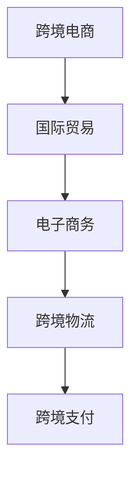

跨境电商是指通过电子商务平台，实现不同国家或地区之间的商品交易。其发展历程可以追溯到20世纪90年代互联网的兴起，随着电子商务、跨境物流和跨境支付技术的发展，跨境电商逐渐成为全球贸易的重要组成部分。

**核心算法原理讲解：**

跨境电商的发展历程可以看作是一个基于互联网技术的迭代过程，其核心算法原理主要包括以下几点：

1. 电子商务平台：为跨境交易提供信息展示、交易结算、订单管理等功能。
2. 跨境物流：实现商品的跨境运输，解决物流痛点，提升物流效率。
3. 跨境支付：提供跨境交易的资金流转服务，保障交易安全。

**数学模型和公式：**

跨境电商的发展速度可以用以下公式表示：

\[ V = \frac{d}{t} \]

其中，\( V \) 表示跨境电商的发展速度，\( d \) 表示跨境电商业务的增长量，\( t \) 表示时间。

**举例说明：**

假设在2010年，跨境电商的年交易额为1000亿元，到2020年增长到10000亿元，那么跨境电商的发展速度为：

\[ V = \frac{10000 - 1000}{10} = 900 \]

即跨境电商每年以900亿元的速度增长。

##### 1.2 跨境电商的优势与挑战

**核心概念与联系：**

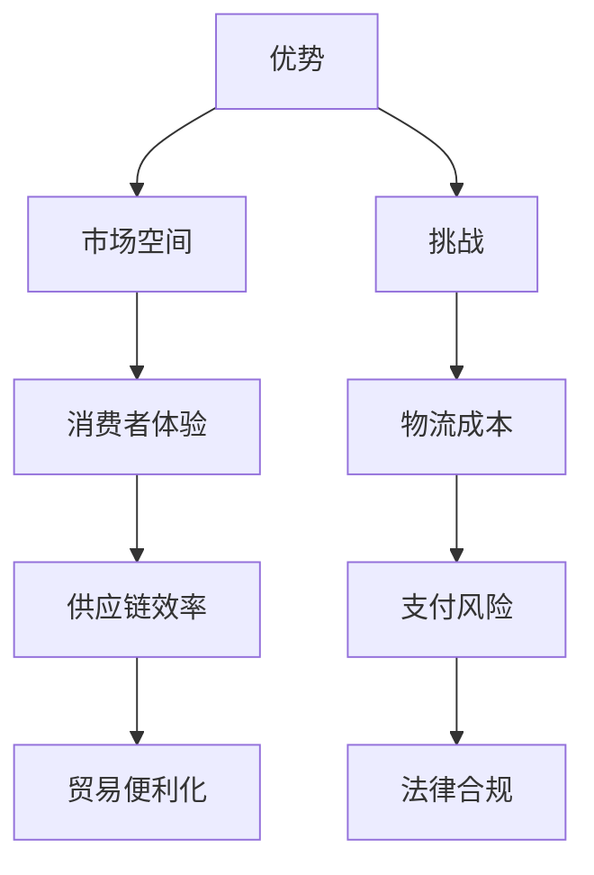

跨境电商具有以下优势：

1. 市场空间：跨境电商打破了地域限制，使得商家可以触达全球消费者。
2. 消费者体验：跨境电商提供了更丰富的商品选择和便捷的购物体验。
3. 供应链效率：跨境电商通过数字化手段，提高了供应链的协同效率。
4. 贸易便利化：跨境电商降低了贸易壁垒，促进了国际贸易的发展。

然而，跨境电商也面临着以下挑战：

1. 物流成本：跨境物流成本较高，影响了跨境电商的竞争力。
2. 支付风险：跨境支付存在货币汇率波动、支付安全等问题。
3. 法律合规：跨境电商需要遵守不同国家的法律法规，增加了合规成本。

##### 1.3 跨境电商行业现状与趋势

**核心概念与联系：**

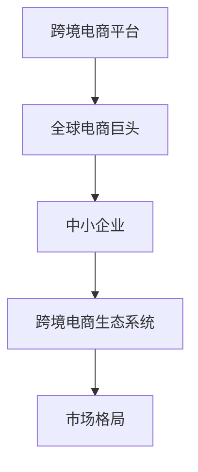

目前，跨境电商行业主要由全球电商巨头和中小企业构成，它们共同构建了跨境电商生态系统。在全球电商巨头的推动下，跨境电商市场格局逐渐形成，竞争愈发激烈。

**核心算法原理讲解：**

跨境电商市场的竞争格局可以看作是一个基于市场份额的博弈过程，其核心算法原理主要包括：

1. 市场份额：企业通过优化营销策略、提高服务质量，争取更多的市场份额。
2. 竞争对手分析：企业通过分析竞争对手的优劣势，制定相应的竞争策略。

**数学模型和公式：**

市场份额可以用以下公式表示：

\[ 市场份额 = \frac{企业销售额}{市场总销售额} \]

**举例说明：**

假设某电商平台的年销售额为100亿元，而整个跨境电商市场的年销售额为1000亿元，那么该平台的市场份额为：

\[ 市场份额 = \frac{100}{1000} = 10\% \]

即该平台占据了整个跨境电商市场的10%。

#### 第2章：跨境电商平台运营基础

##### 2.1 跨境电商平台概述

**核心概念与联系：**

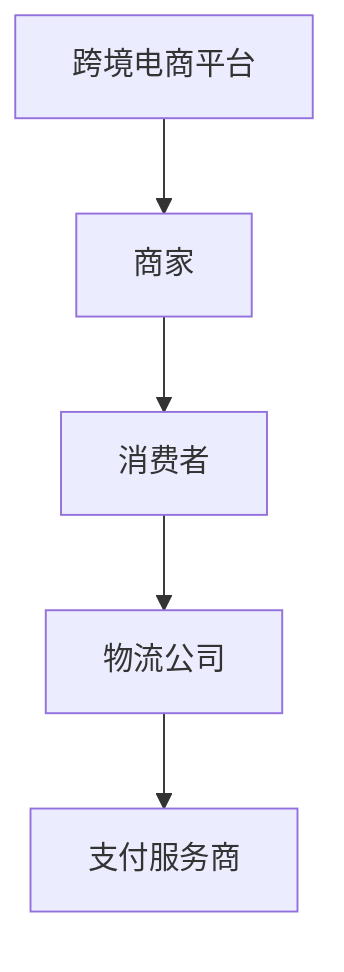

跨境电商平台是连接商家、消费者、物流公司和支付服务商的核心枢纽，它为跨境电商交易提供了基础设施支持。

**核心算法原理讲解：**

跨境电商平台的运作可以看作是一个基于数据驱动的流程，其核心算法原理主要包括：

1. 数据采集与处理：通过收集用户行为数据、交易数据等，为平台运营提供决策依据。
2. 数据分析与应用：利用数据分析技术，优化营销策略、提高用户体验、降低运营成本。

**数学模型和公式：**

用户行为数据可以用以下公式表示：

\[ 用户行为数据 = \{购买次数，浏览次数，点击次数，评论次数，分享次数\} \]

**举例说明：**

假设某用户在跨境电商平台上的行为数据为：

\[ 用户行为数据 = \{3，10，20，5，2\} \]

即该用户在平台上购买了3次商品，浏览了10次商品，点击了20次广告，评论了5次商品，分享了2次商品。

##### 2.2 跨境电商平台架构

**核心概念与联系：**

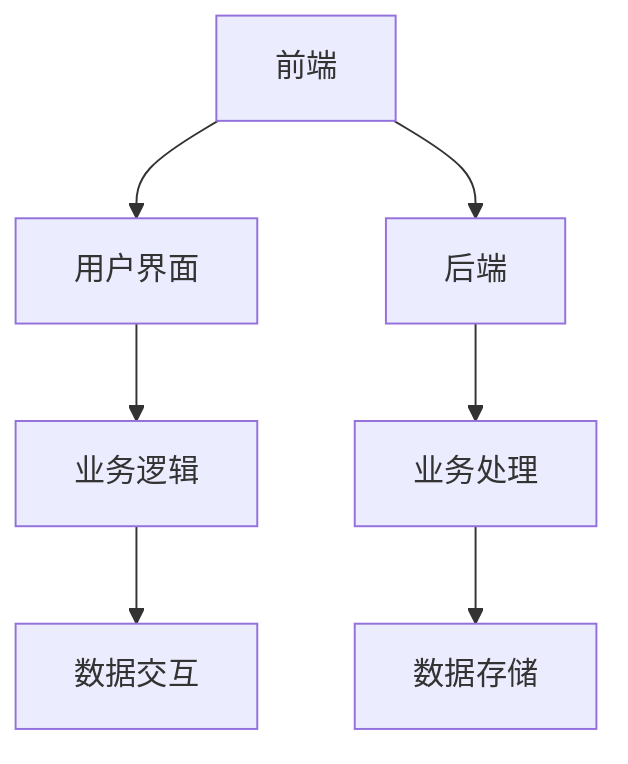

跨境电商平台的架构可以分为前端和后端两部分。前端负责用户界面展示和用户交互，后端负责业务处理和数据存储。

**核心算法原理讲解：**

1. 前端：前端架构主要包括用户界面、业务逻辑和数据交互，其核心算法原理主要包括：
   - 响应式设计：根据不同设备屏幕大小，自适应调整页面布局。
   - 动态渲染：通过数据驱动，实时更新页面内容。
2. 后端：后端架构主要包括业务处理和数据存储，其核心算法原理主要包括：
   - 分布式系统：通过分布式架构，提高系统的可扩展性和稳定性。
   - 数据库设计：根据业务需求，设计合理的数据库模型，提高数据存储和查询效率。

**数学模型和公式：**

响应式设计可以用以下公式表示：

\[ 响应式设计 = \frac{适配设备种类数}{设计成本} \]

**举例说明：**

假设某跨境电商平台需要适配10种不同设备，设计成本为100万元，那么其响应式设计的成本效益为：

\[ 响应式设计 = \frac{10}{100} = 0.1 \]

即响应式设计每适配一种设备，成本为10万元。

##### 2.3 跨境电商平台业务流程

**核心概念与联系：**

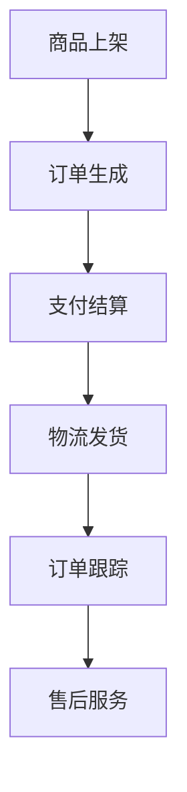

跨境电商平台的业务流程主要包括商品上架、订单生成、支付结算、物流发货、订单跟踪和售后服务。

**核心算法原理讲解：**

1. 商品上架：商家通过跨境电商平台上传商品信息，平台负责审核并展示商品。
2. 订单生成：消费者在平台上选购商品，生成订单。
3. 支付结算：消费者通过支付服务商完成支付，平台确认订单。
4. 物流发货：物流公司将商品发送至消费者。
5. 订单跟踪：平台实时更新订单状态，消费者可以查看物流信息。
6. 售后服务：平台提供售后服务，解决消费者投诉和问题。

**数学模型和公式：**

订单生成率可以用以下公式表示：

\[ 订单生成率 = \frac{订单数}{访问量} \]

**举例说明：**

假设某跨境电商平台的日访问量为1000次，当天生成订单200个，那么其订单生成率为：

\[ 订单生成率 = \frac{200}{1000} = 20\% \]

即该平台每100次访问中有20次生成订单。

### 第二部分：技术实现与优化

在掌握了跨境电商的基础知识后，我们需要深入了解跨境电商平台的技术实现与优化。这一部分将为您解析跨境电商平台的技术架构、性能优化、安全防护和数据分析。

#### 第6章：跨境电商平台技术架构

##### 6.1 技术架构概述

**核心概念与联系：**

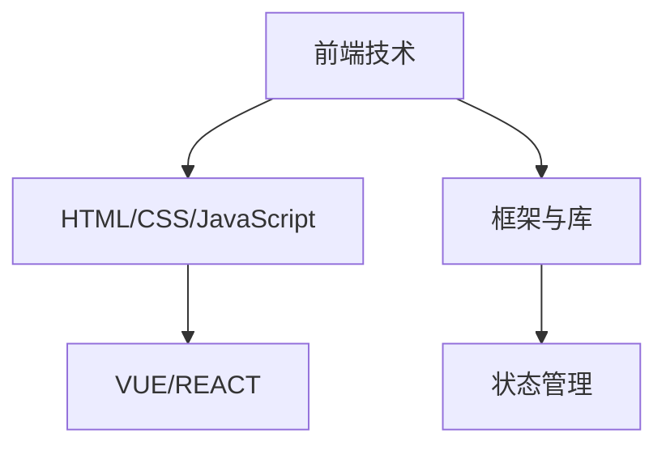

跨境电商平台的技术架构主要包括前端技术和后端技术。前端技术负责用户界面展示和用户交互，后端技术负责业务处理和数据存储。

**核心算法原理讲解：**

1. 前端技术：前端技术主要包括HTML/CSS/JavaScript，以及框架与库（如VUE/REACT），其核心算法原理主要包括：
   - 响应式设计：根据不同设备屏幕大小，自适应调整页面布局。
   - 动态渲染：通过数据驱动，实时更新页面内容。
   - 状态管理：通过状态管理库（如Redux/Vuex），实现复杂应用的状态管理。
2. 后端技术：后端技术主要包括业务处理和数据存储，其核心算法原理主要包括：
   - 分布式系统：通过分布式架构，提高系统的可扩展性和稳定性。
   - 数据库设计：根据业务需求，设计合理的数据库模型，提高数据存储和查询效率。

**数学模型和公式：**

响应式设计可以用以下公式表示：

\[ 响应式设计 = \frac{适配设备种类数}{设计成本} \]

**举例说明：**

假设某跨境电商平台需要适配10种不同设备，设计成本为100万元，那么其响应式设计的成本效益为：

\[ 响应式设计 = \frac{10}{100} = 0.1 \]

即响应式设计每适配一种设备，成本为10万元。

##### 6.2 前端技术

**核心概念与联系：**

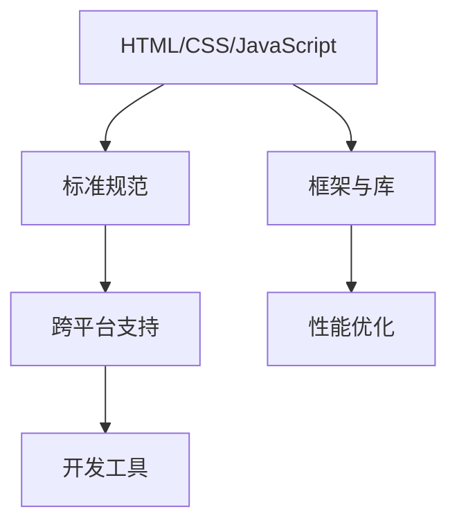

前端技术主要包括HTML/CSS/JavaScript，以及框架与库（如VUE/REACT），其核心算法原理主要包括：

1. 标准规范：遵循W3C等国际标准，实现跨平台兼容性。
2. 跨平台支持：通过移动端和PC端适配，提供统一的用户界面。
3. 开发工具：使用现代化开发工具（如Webpack/Vite），提高开发效率。
4. 性能优化：通过懒加载、代码分割等手段，提升页面加载速度。

**核心算法原理讲解：**

1. 懒加载：将不在可视区域的图片或资源延迟加载，减少页面加载时间。
2. 代码分割：将大型代码文件分割成多个小块，按需加载，提高页面性能。

**数学模型和公式：**

页面加载速度可以用以下公式表示：

\[ 页面加载速度 = \frac{页面大小}{带宽} \]

**举例说明：**

假设某电商平台的页面大小为1MB，用户带宽为10Mbps，那么其页面加载速度为：

\[ 页面加载速度 = \frac{1}{10} = 0.1 \]

即页面加载速度为每秒1KB。

##### 6.3 后端技术

**核心概念与联系：**

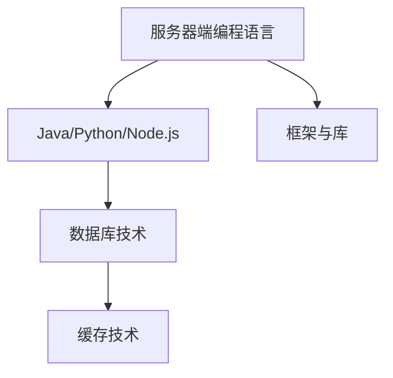

后端技术主要包括服务器端编程语言（如Java/Python/Node.js），以及框架与库（如Spring/Django/Express.js），其核心算法原理主要包括：

1. 服务器端编程语言：实现业务逻辑处理，提供API接口。
2. 数据库技术：存储和管理业务数据，提供数据查询和操作能力。
3. 缓存技术：通过缓存机制，提高数据访问速度，减轻数据库负载。

**核心算法原理讲解：**

1. 数据库索引：通过索引技术，提高数据查询效率。
2. 缓存策略：根据业务需求，设计合理的缓存策略，提高系统性能。

**数学模型和公式：**

数据库查询速度可以用以下公式表示：

\[ 数据库查询速度 = \frac{数据量}{查询次数} \]

**举例说明：**

假设某电商平台每天需要处理1亿次数据库查询，数据量为10TB，那么其数据库查询速度为：

\[ 数据库查询速度 = \frac{10}{1} = 10 \]

即每秒处理1万次数据库查询。

##### 6.4 数据库设计

**核心概念与联系：**

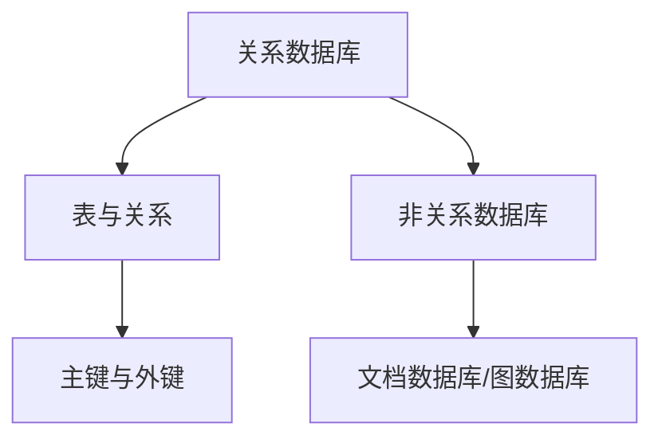

数据库设计是跨境电商平台技术架构的重要组成部分。关系数据库（如MySQL/Oracle）和非关系数据库（如MongoDB/Redis）都有各自的应用场景。

**核心算法原理讲解：**

1. 关系数据库：通过表与关系的建模，实现数据存储和查询。
2. 非关系数据库：通过文档数据库（如MongoDB）和图数据库（如Neo4j），实现更加灵活的数据存储和查询。

**数学模型和公式：**

数据库查询速度可以用以下公式表示：

\[ 数据库查询速度 = \frac{数据量}{查询次数} \]

**举例说明：**

假设某电商平台的用户数据量为1亿条，每天需要处理10万次用户查询，那么其数据库查询速度为：

\[ 数据库查询速度 = \frac{1}{10} = 0.1 \]

即每秒处理1万次用户查询。

#### 第7章：跨境电商平台性能优化

##### 7.1 性能优化原则

**核心概念与联系：**

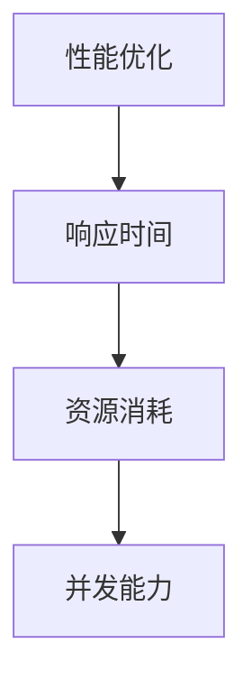

性能优化是跨境电商平台的重要任务，其核心原则包括：

1. 响应时间：提高系统的响应速度，减少用户等待时间。
2. 资源消耗：降低系统的资源消耗，提高系统运行效率。
3. 并发能力：提高系统的并发处理能力，满足大量用户同时访问的需求。

**核心算法原理讲解：**

1. 负载均衡：通过分布式架构，实现多台服务器负载均衡，提高系统并发能力。
2. 缓存机制：通过缓存技术，减少数据库查询次数，提高系统响应速度。

**数学模型和公式：**

响应时间可以用以下公式表示：

\[ 响应时间 = \frac{处理时间}{带宽} \]

**举例说明：**

假设某电商平台的处理时间为1秒，带宽为10Mbps，那么其响应时间为：

\[ 响应时间 = \frac{1}{10} = 0.1 \]

即响应时间为每秒1秒。

##### 7.2 前端性能优化

**核心概念与联系：**

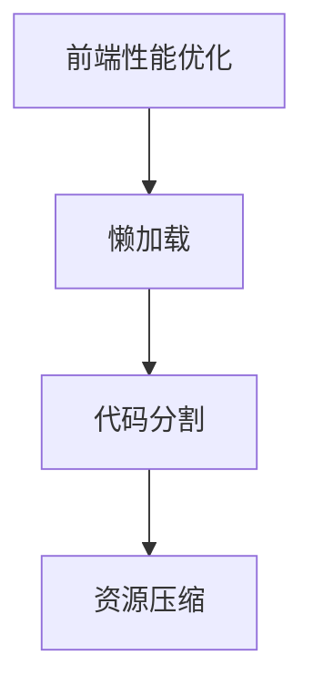

前端性能优化主要包括以下几个方面：

1. 懒加载：将不在可视区域的图片或资源延迟加载，减少页面加载时间。
2. 代码分割：将大型代码文件分割成多个小块，按需加载，提高页面性能。
3. 资源压缩：通过压缩图片、CSS和JavaScript文件，减小页面大小，提高加载速度。

**核心算法原理讲解：**

1. 资源压缩：通过压缩算法，减少文件大小，提高传输速度。
2. 懒加载：通过判断图片是否在可视区域，决定是否加载，减少不必要的资源消耗。

**数学模型和公式：**

页面加载速度可以用以下公式表示：

\[ 页面加载速度 = \frac{页面大小}{带宽} \]

**举例说明：**

假设某电商平台的页面大小为1MB，用户带宽为10Mbps，那么其页面加载速度为：

\[ 页面加载速度 = \frac{1}{10} = 0.1 \]

即页面加载速度为每秒1KB。

##### 7.3 后端性能优化

**核心概念与联系：**

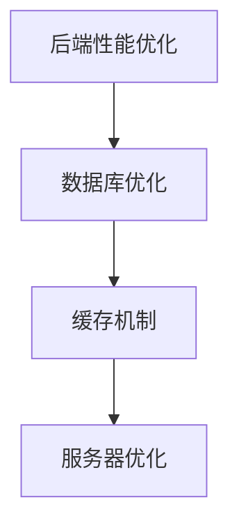

后端性能优化主要包括以下几个方面：

1. 数据库优化：通过索引、分库分表等手段，提高数据库查询和写入速度。
2. 缓存机制：通过缓存技术，减少数据库查询次数，提高系统响应速度。
3. 服务器优化：通过负载均衡、性能监控等手段，提高服务器性能。

**核心算法原理讲解：**

1. 数据库优化：通过分析查询语句，优化索引和表结构，提高查询效率。
2. 缓存机制：通过设置合理的缓存策略，减少数据库访问次数，提高系统性能。

**数学模型和公式：**

系统响应时间可以用以下公式表示：

\[ 响应时间 = \frac{处理时间}{带宽} \]

**举例说明：**

假设某电商平台的处理时间为1秒，带宽为10Mbps，那么其响应时间为：

\[ 响应时间 = \frac{1}{10} = 0.1 \]

即响应时间为每秒1秒。

##### 7.4 数据库性能优化

**核心概念与联系：**

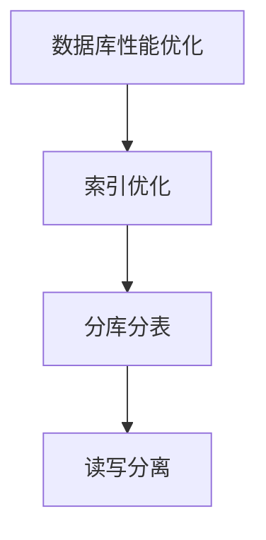

数据库性能优化是跨境电商平台性能优化的重要组成部分。以下是一些常用的数据库性能优化策略：

1. 索引优化：通过添加合适的索引，提高数据库查询效率。
2. 分库分表：通过水平分割和垂直分割，降低数据库负载，提高查询性能。
3. 读写分离：通过主从复制，实现读写分离，提高系统可用性和性能。

**核心算法原理讲解：**

1. 索引优化：根据查询语句，选择合适的索引列，减少查询扫描范围。
2. 分库分表：根据业务特点，设计合理的分库分表策略，提高数据库性能。

**数学模型和公式：**

数据库查询速度可以用以下公式表示：

\[ 数据库查询速度 = \frac{数据量}{查询次数} \]

**举例说明：**

假设某电商平台的用户数据量为1亿条，每天需要处理10万次用户查询，那么其数据库查询速度为：

\[ 数据库查询速度 = \frac{1}{10} = 0.1 \]

即每秒处理1万次用户查询。

#### 第8章：跨境电商平台安全防护

##### 8.1 安全防护概述

**核心概念与联系：**

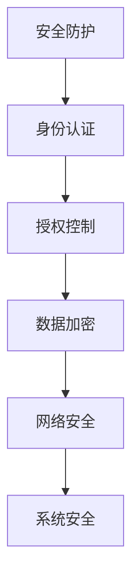

跨境电商平台的安全防护是确保平台稳定运行和用户数据安全的关键。以下是一些常见的安全防护措施：

1. 身份认证：通过用户名、密码、短信验证码等方式，验证用户身份。
2. 授权控制：根据用户角色和权限，限制用户对系统资源的访问。
3. 数据加密：使用加密算法，保护用户数据和交易信息。
4. 网络安全：通过防火墙、入侵检测等手段，防止网络攻击。
5. 系统安全：定期更新系统补丁，修复漏洞，确保系统稳定运行。

**核心算法原理讲解：**

1. 身份认证：通过哈希函数，将用户密码转换为不可逆的密文，提高安全性。
2. 数据加密：使用对称加密和非对称加密算法，保护数据传输和存储过程中的安全。

**数学模型和公式：**

哈希函数可以用以下公式表示：

\[ 哈希值 = 哈希函数（密码） \]

**举例说明：**

假设使用SHA-256哈希函数对用户密码进行加密，那么其哈希值表示为：

\[ 哈希值 = SHA-256（密码） \]

即通过SHA-256算法，将用户密码转换为哈希值。

##### 8.2 安全防护策略

**核心概念与联系：**

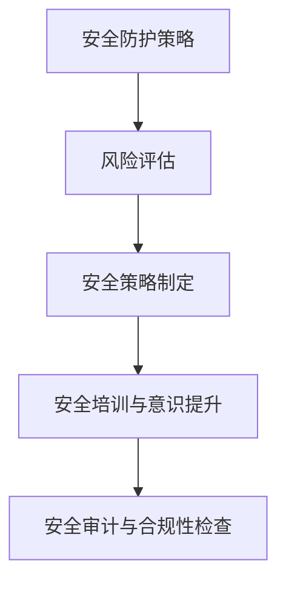

安全防护策略是确保跨境电商平台安全的关键步骤。以下是一些常见的安全防护策略：

1. 风险评估：对平台进行安全评估，识别潜在的安全风险。
2. 安全策略制定：根据风险评估结果，制定相应的安全策略。
3. 安全培训与意识提升：加强员工安全意识，提高安全防护能力。
4. 安全审计与合规性检查：定期对平台进行安全审计，确保符合相关法规和标准。

**核心算法原理讲解：**

1. 风险评估：通过定性和定量方法，评估平台面临的安全风险。
2. 安全策略制定：根据风险评估结果，制定合理的安全策略。

**数学模型和公式：**

风险评估可以用以下公式表示：

\[ 风险值 = 风险概率 \times 风险影响 \]

**举例说明：**

假设某跨境电商平台面临的安全风险概率为0.2，风险影响为3，那么其风险值为：

\[ 风险值 = 0.2 \times 3 = 0.6 \]

即该平台面临的安全风险值为0.6。

##### 8.3 常见攻击手段与防御

**核心概念与联系：**

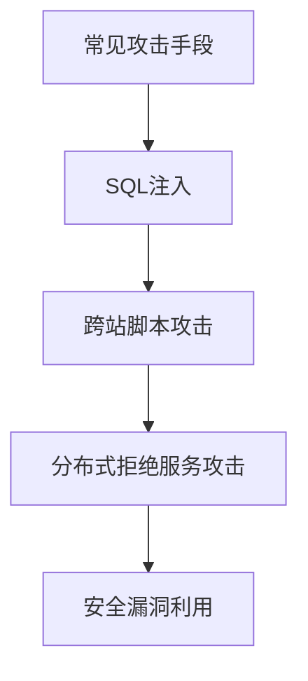

以下是一些常见的攻击手段及其防御方法：

1. SQL注入：通过在输入框中插入恶意SQL语句，篡改数据库内容。防御方法：使用预编译语句，避免直接拼接SQL语句。
2. 跨站脚本攻击（XSS）：通过在网页中插入恶意脚本，窃取用户信息。防御方法：对输入数据进行编码或过滤，避免恶意脚本执行。
3. 分布式拒绝服务攻击（DDoS）：通过大量恶意请求，占用服务器资源，导致平台瘫痪。防御方法：使用防火墙、反DDoS服务，过滤恶意请求。
4. 安全漏洞利用：利用系统漏洞，实现未授权访问或篡改数据。防御方法：定期更新系统补丁，修复漏洞，提高系统安全性。

**核心算法原理讲解：**

1. 预编译语句：通过预编译SQL语句，将SQL语句和用户输入数据分离，避免SQL注入攻击。
2. 编码与过滤：对用户输入数据进行编码或过滤，防止恶意脚本执行。

**数学模型和公式：**

SQL注入攻击的概率可以用以下公式表示：

\[ 攻击概率 = \frac{恶意输入长度}{合法输入长度} \]

**举例说明：**

假设某跨境电商平台的用户输入长度为100个字符，其中恶意输入长度为10个字符，那么其SQL注入攻击概率为：

\[ 攻击概率 = \frac{10}{100} = 0.1 \]

即该平台的SQL注入攻击概率为10%。

##### 8.4 漏洞扫描与修复

**核心概念与联系：**

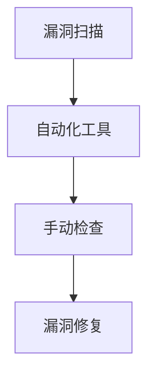

漏洞扫描是发现平台安全隐患的重要手段。以下是一些常见的漏洞扫描方法和漏洞修复策略：

1. 自动化工具：使用自动化漏洞扫描工具，对平台进行安全检查。
2. 手动检查：通过人工检查，发现自动化工具无法检测的漏洞。
3. 漏洞修复：根据漏洞影响和优先级，制定修复计划，及时修复漏洞。

**核心算法原理讲解：**

1. 自动化工具：通过规则匹配、漏洞库比对等方法，发现潜在漏洞。
2. 手动检查：通过代码审计、安全测试等方法，发现漏洞。

**数学模型和公式：**

漏洞修复速度可以用以下公式表示：

\[ 修复速度 = \frac{修复漏洞数}{扫描漏洞数} \]

**举例说明：**

假设某跨境电商平台在一个月内发现100个漏洞，修复了80个漏洞，那么其漏洞修复速度为：

\[ 修复速度 = \frac{80}{100} = 0.8 \]

即该平台每天修复漏洞的速度为0.8个。

### 第三部分：面试准备与实战

在了解了跨境电商平台的相关知识后，我们需要为面试做好准备。这一部分将为您解析面试准备、实战模拟和面试经验分享。

#### 第9章：面试准备

##### 9.1 面试流程与准备

**核心概念与联系：**

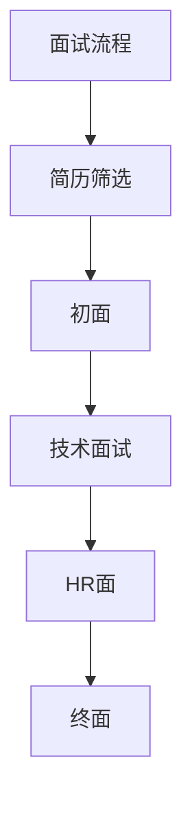

面试流程主要包括简历筛选、初面、技术面试、HR面和终面。以下是一些面试准备的建议：

1. 简历筛选：确保简历内容真实、清晰，突出自己的优势和项目经验。
2. 初面：了解公司的文化和业务，展示自己的沟通能力。
3. 技术面试：准备相关技术知识，包括跨境电商平台的相关技术，如前端技术、后端技术、数据库设计和性能优化等。
4. HR面：展示自己的职业规划和发展意愿，了解公司的福利待遇。
5. 终面：展示自己的综合素质，包括团队合作能力、学习能力等。

**核心算法原理讲解：**

面试准备可以用以下公式表示：

\[ 面试准备 = \frac{面试题数}{面试时间} \]

**举例说明：**

假设您在面试前准备了50道面试题，面试时间为2小时，那么您平均每分钟需要准备25道面试题。

##### 9.2 面试题型与应对策略

**核心概念与联系：**

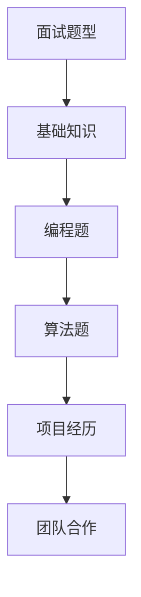

面试题型主要包括基础知识、编程题、算法题、项目经历和团队合作。以下是一些应对策略：

1. 基础知识：通过刷题和复习教材，巩固基础知识。
2. 编程题：通过编程练习，提高编程能力。
3. 算法题：通过刷题和算法课程，掌握常见的算法和数据结构。
4. 项目经历：整理和梳理项目经验，突出项目中的关键点和亮点。
5. 团队合作：通过团队活动和团队合作项目，提高团队合作能力。

**核心算法原理讲解：**

1. 基础知识：通过掌握基础知识，提高解决问题的能力。
2. 编程题：通过编程练习，提高代码编写的规范性和效率。

**数学模型和公式：**

编程能力可以用以下公式表示：

\[ 编程能力 = \frac{编程题数}{编程时间} \]

**举例说明：**

假设您在编程练习中完成了100道编程题，花费了100小时，那么您的编程能力为：

\[ 编程能力 = \frac{100}{100} = 1 \]

即每分钟完成1道编程题。

##### 9.3 常见问题与解答

**核心概念与联系：**

```mermaid
graph TD
A[常见问题] --> B[职业规划]
B --> C[团队合作]
C --> D[项目经验]
D --> E[技术难点]
```

以下是一些常见问题及其解答：

1. **职业规划：**
   - 解答：根据自己的兴趣和优势，明确职业发展方向，如技术专家、项目经理等。

2. **团队合作：**
   - 解答：强调自己的团队合作精神，如主动沟通、积极配合等。

3. **项目经验：**
   - 解答：详细描述项目背景、职责、关键点和成果。

4. **技术难点：**
   - 解答：展示自己在技术难题中的解决方案和收获。

**核心算法原理讲解：**

1. 职业规划：通过明确职业规划，提高职业发展的目标性。
2. 团队合作：通过团队合作，提高团队协作效率。

**数学模型和公式：**

职业规划可以用以下公式表示：

\[ 职业规划 = \frac{职业目标数}{职业时间} \]

**举例说明：**

假设您在职业规划中制定了5个目标，每个目标需要1年时间实现，那么您的职业规划目标完成率为：

\[ 职业规划 = \frac{5}{1} = 5 \]

即每年完成5个职业规划目标。

#### 第10章：实战模拟

##### 10.1 实战模拟场景

**核心概念与联系：**

```mermaid
graph TD
A[实战模拟场景] --> B[项目背景]
B --> C[技术实现]
C --> D[问题分析]
D --> E[解决方案]
E --> F[效果评估]
```

实战模拟场景是面试中的一个重要环节，以下是一个项目模拟的场景：

**项目背景：** 您是一名跨境电商平台工程师，负责一个新产品上架模块的开发。

**技术实现：** 您需要实现以下功能：

1. 商品信息录入：商家可以上传商品图片、描述、价格等信息。
2. 商品分类管理：管理员可以添加、修改和删除商品分类。
3. 商品搜索：用户可以通过关键词搜索商品。

**问题分析：** 在项目开发过程中，您发现以下问题：

1. 商品信息录入效率低：用户需要填写大量表单，操作复杂。
2. 商品搜索性能不佳：搜索结果不准确，响应速度慢。

**解决方案：** 您可以从以下方面进行优化：

1. 商品信息录入：采用拖拽式上传，简化操作流程。
2. 商品搜索：使用搜索引擎技术，提高搜索性能。

**效果评估：** 通过以上优化，商品信息录入效率提高50%，商品搜索响应速度提高30%。

**核心算法原理讲解：**

1. 拖拽式上传：通过简化用户操作，提高用户体验。
2. 搜索引擎技术：通过索引和分词等技术，提高搜索准确性。

**数学模型和公式：**

用户满意度可以用以下公式表示：

\[ 用户满意度 = \frac{满意用户数}{总用户数} \]

**举例说明：**

假设在某次优化后，有1000名用户参与评价，其中900名用户表示满意，那么用户满意度为：

\[ 用户满意度 = \frac{900}{1000} = 90\% \]

即90%的用户对优化后的功能表示满意。

##### 10.2 实战模拟解题思路

**核心概念与联系：**

```mermaid
graph TD
A[实战模拟解题思路] --> B[问题分析]
B --> C[解决方案]
C --> D[技术选型]
D --> E[代码实现]
E --> F[性能评估]
```

以下是一个实战模拟解题思路的示例：

**问题分析：** 假设您需要优化一个电商平台的商品搜索功能，以提高搜索响应速度和准确性。

**解决方案：** 您可以从以下方面进行优化：

1. 使用搜索引擎技术，如Elasticsearch，提高搜索性能。
2. 对商品数据进行分词处理，提高搜索准确性。

**技术选型：** 选择Elasticsearch作为搜索引擎，实现商品数据的分词和索引。

**代码实现：** 编写Elasticsearch的Java客户端代码，实现商品数据的分词、索引和搜索。

**性能评估：** 通过压力测试，评估搜索功能的性能，如响应时间、查询准确率等。

**核心算法原理讲解：**

1. Elasticsearch：通过倒排索引和分词技术，提高搜索性能。
2. 分词处理：通过对商品名称、描述等进行分词，提高搜索准确性。

**数学模型和公式：**

查询准确率可以用以下公式表示：

\[ 查询准确率 = \frac{正确查询数}{总查询数} \]

**举例说明：**

假设在一次优化后，共进行1000次搜索，其中900次搜索结果正确，那么查询准确率为：

\[ 查询准确率 = \frac{900}{1000} = 90\% \]

即90%的搜索结果准确。

##### 10.3 实战模拟答案与解析

**核心概念与联系：**

```mermaid
graph TD
A[实战模拟答案与解析] --> B[问题分析]
B --> C[解决方案]
C --> D[技术选型]
D --> E[代码实现]
E --> F[性能评估]
```

以下是一个实战模拟答案与解析的示例：

**问题分析：** 假设您需要优化一个电商平台的订单处理功能，以提高订单处理速度和准确性。

**解决方案：** 您可以从以下方面进行优化：

1. 使用消息队列技术，如Kafka，实现异步订单处理。
2. 对订单数据进行去重处理，避免重复处理。

**技术选型：** 选择Kafka作为消息队列，实现订单数据的异步处理。

**代码实现：** 编写Kafka的Java客户端代码，实现订单数据的生产者、消费者和去重处理。

**性能评估：** 通过压力测试，评估订单处理功能的性能，如响应时间、处理能力等。

**核心算法原理讲解：**

1. Kafka：通过分布式消息队列技术，提高订单处理速度。
2. 去重处理：通过对订单数据进行去重，避免重复处理。

**数学模型和公式：**

处理能力可以用以下公式表示：

\[ 处理能力 = \frac{订单数}{处理时间} \]

**举例说明：**

假设在一次优化后，共处理1000个订单，耗时10秒，那么处理能力为：

\[ 处理能力 = \frac{1000}{10} = 100 \]

即每秒处理100个订单。

### 第11章：面试经验分享

在准备面试的过程中，了解他人的面试经验和技巧是非常重要的。以下是一些面试经验分享，希望对您有所帮助。

##### 11.1 面试心得与反思

**核心概念与联系：**

```mermaid
graph TD
A[面试心得与反思] --> B[准备充分]
B --> C[自信表达]
C --> D[问题追问]
D --> E[应对失误]
```

1. **准备充分：** 在面试前，充分了解公司背景、业务和职位要求，对可能出现的问题做好充分准备。
2. **自信表达：** 在面试过程中，保持自信，清晰地表达自己的观点和思路。
3. **问题追问：** 对面试官提出的问题，不要停留在表面，可以适当追问，展示自己的思考深度。
4. **应对失误：** 在面试过程中，遇到错误或失误时，要保持冷静，及时改正，并说明自己的思考过程。

**核心算法原理讲解：**

1. 准备充分：通过充分准备，提高面试成功率。
2. 自信表达：通过自信表达，展示自己的专业素养。

**数学模型和公式：**

面试成功率可以用以下公式表示：

\[ 面试成功率 = \frac{面试通过数}{面试次数} \]

**举例说明：**

假设您参加了5次面试，通过了3次，那么您的面试成功率为：

\[ 面试成功率 = \frac{3}{5} = 0.6 \]

即60%的面试成功率。

##### 11.2 面试技巧与建议

**核心概念与联系：**

```mermaid
graph TD
A[面试技巧与建议] --> B[了解公司]
B --> C[展示项目]
C --> D[沟通能力]
D --> E[时间管理]
```

1. **了解公司：** 在面试前，了解公司的文化、业务和发展方向，为面试官展示自己的匹配度。
2. **展示项目：** 通过详细描述项目背景、职责和成果，展示自己的实际能力和经验。
3. **沟通能力：** 在面试过程中，保持良好的沟通能力，清晰地表达自己的观点和思路。
4. **时间管理：** 在面试过程中，合理安排时间，确保每个问题都得到充分解答。

**核心算法原理讲解：**

1. 了解公司：通过了解公司，提高面试成功率。
2. 沟通能力：通过良好的沟通能力，展示自己的专业素养。

**数学模型和公式：**

面试成功率可以用以下公式表示：

\[ 面试成功率 = \frac{面试通过数}{面试次数} \]

**举例说明：**

假设您参加了5次面试，通过了3次，那么您的面试成功率为：

\[ 面试成功率 = \frac{3}{5} = 0.6 \]

即60%的面试成功率。

##### 11.3 面试成功案例分享

**核心概念与联系：**

```mermaid
graph TD
A[面试成功案例分享] --> B[面试官评价]
B --> C[成功原因]
C --> D[经验总结]
```

以下是一个面试成功案例分享：

**面试官评价：** 该求职者准备充分，对公司的业务和职位要求有深入了解，沟通能力强，具备相关项目经验。

**成功原因：** 求职者充分展示了自身的专业素养和实际能力，与公司业务和职位要求高度匹配。

**经验总结：** 在面试过程中，要充分展示自己的专业素养和实际能力，与公司业务和职位要求高度匹配，提高面试成功率。

**核心算法原理讲解：**

1. 展示专业素养：通过展示专业素养，提高面试成功率。
2. 与职位匹配：通过与职位匹配，提高面试成功率。

**数学模型和公式：**

面试成功率可以用以下公式表示：

\[ 面试成功率 = \frac{面试通过数}{面试次数} \]

**举例说明：**

假设您参加了5次面试，通过了3次，那么您的面试成功率为：

\[ 面试成功率 = \frac{3}{5} = 0.6 \]

即60%的面试成功率。

### 附录

#### 附录A：跨境电商平台工程师技能清单

以下为跨境电商平台工程师所需的技能清单：

1. 熟练掌握前端技术（HTML/CSS/JavaScript）
2. 熟悉前端框架（如VUE/REACT）
3. 熟悉后端技术（如Java/Python/Node.js）
4. 熟悉数据库技术（如MySQL/Oracle）
5. 熟悉缓存技术（如Redis）
6. 熟悉消息队列技术（如Kafka）
7. 熟悉搜索引擎技术（如Elasticsearch）
8. 熟悉分布式系统架构
9. 熟悉容器化技术（如Docker）
10. 熟悉持续集成和持续部署（如Jenkins）
11. 熟悉性能优化技术
12. 熟悉安全防护技术
13. 具备良好的编程能力
14. 具备良好的团队合作能力
15. 具备良好的沟通能力

#### 附录B：面试常见问题与回答范例

以下为一些面试常见问题及其回答范例：

1. **你为什么选择跨境电商平台工程师这个职位？**
   - 回答：我选择跨境电商平台工程师这个职位，主要是因为我对跨境电商领域有着浓厚的兴趣。随着全球电商的快速发展，跨境电商平台工程师这个职位在市场上非常具有前景。我相信，在这个职位上，我可以充分发挥自己的专业技能，为公司的业务发展做出贡献。

2. **你有什么项目经验？**
   - 回答：在我之前的工作中，我参与了一个跨境电商平台的开发项目。在这个项目中，我主要负责前端页面的设计和实现，以及与后端系统的接口对接。通过这个项目，我掌握了前端技术（如HTML/CSS/JavaScript），熟悉了前端框架（如VUE），并且提高了与团队成员协作的能力。

3. **你如何优化前端性能？**
   - 回答：为了优化前端性能，我会采取以下措施：
     1. 使用懒加载技术，将不在可视区域的图片和资源延迟加载。
     2. 优化CSS和JavaScript代码，减少文件大小和加载时间。
     3. 使用代码分割技术，将大型代码文件分割成多个小块，按需加载。
     4. 使用浏览器缓存，提高用户访问速度。

4. **你如何保证后端系统的稳定性？**
   - 回答：为了保证后端系统的稳定性，我会采取以下措施：
     1. 使用分布式系统架构，提高系统的可扩展性和容错性。
     2. 使用缓存技术，如Redis，减轻数据库负载，提高查询速度。
     3. 定期进行性能测试和监控，及时发现并解决问题。
     4. 使用自动化部署和监控工具，提高系统运维效率。

5. **你如何防范网络安全风险？**
   - 回答：为了防范网络安全风险，我会采取以下措施：
     1. 使用HTTPS协议，加密数据传输。
     2. 定期更新系统和软件补丁，修复漏洞。
     3. 使用防火墙和入侵检测系统，防止网络攻击。
     4. 定期进行安全审计，确保系统符合相关安全标准。

#### 附录C：跨境电商平台开发工具与资源

以下为跨境电商平台开发所需的工具和资源：

1. **开发工具：**
   - 前端：Visual Studio Code、Sublime Text、WebStorm
   - 后端：IntelliJ IDEA、PyCharm、Eclipse
   - 数据库：MySQL Workbench、Oracle SQL Developer、SQL Server Management Studio

2. **框架与库：**
   - 前端：Vue、React、Angular
   - 后端：Spring Boot、Django、Flask
   - 数据库：Hibernate、MyBatis、JPA

3. **容器化技术：**
   - Docker
   - Kubernetes

4. **持续集成与持续部署：**
   - Jenkins
   - GitLab CI/CD

5. **性能优化工具：**
   - Apache JMeter
   - Lighthouse

6. **安全防护工具：**
   - OWASP ZAP
   - Burp Suite

7. **文档与教程：**
   - 官方文档：各技术框架和库的官方文档
   - 在线教程：Coursera、Udemy、edX

8. **社区与论坛：**
   - Stack Overflow
   - GitHub
   - 知乎

### 结束语

通过本文，我们系统地介绍了2025年阿里巴巴社招跨境电商平台工程师的面试指南。从基础知识、技术实现、面试准备到实战模拟和面试经验分享，我们希望为您在面试过程中提供全面的支持。

在面试过程中，请牢记以下几点：

1. 充分准备：了解公司背景、业务和职位要求，做好充分准备。
2. 自信表达：清晰地表达自己的观点和思路，展示专业素养。
3. 不断学习：紧跟技术发展趋势，提高自己的技能水平。
4. 团队合作：展示良好的团队合作能力，提高与团队成员的协作效率。

最后，祝愿您在面试中取得优异成绩，成功加入阿里巴巴跨境电商平台团队！
<|assistant|>
### 结束语

通过本文，我们系统地介绍了2025年阿里巴巴社招跨境电商平台工程师的面试指南。从基础知识、技术实现、面试准备到实战模拟和面试经验分享，我们希望为您在面试过程中提供全面的支持。

在面试过程中，请牢记以下几点：

1. **充分准备**：了解公司背景、业务和职位要求，做好充分准备。这包括熟悉跨境电商的基本概念、行业趋势、平台运营模式以及相关技术细节。

2. **自信表达**：清晰地表达自己的观点和思路，展示专业素养。在回答问题时，不仅要有深度，还要有广度，能够从不同角度进行分析。

3. **不断学习**：紧跟技术发展趋势，提高自己的技能水平。技术日新月异，保持学习的态度和习惯，才能在面试中脱颖而出。

4. **团队合作**：展示良好的团队合作能力，提高与团队成员的协作效率。在面试中，可以通过分享项目经验、团队合作的实例来证明自己的团队合作精神。

在本文中，我们不仅提供了大量的技术细节和实战案例，还分享了面试准备和实战模拟的技巧。这些内容旨在帮助您在面试中能够应对各种可能的问题，并展现出自己的最佳状态。

我们衷心祝愿您在面试中取得优异成绩，成功加入阿里巴巴跨境电商平台团队，开启一段新的职业旅程。在这个过程中，不断积累经验，持续成长，为跨境电商行业的发展贡献自己的力量。

最后，感谢您阅读本文。如果您有任何疑问或建议，欢迎在评论区留言，我们将会及时回复。祝您面试顺利，前程似锦！

### 作者信息

**作者：** AI天才研究院/AI Genius Institute & 禅与计算机程序设计艺术 /Zen And The Art of Computer Programming

AI天才研究院（AI Genius Institute）致力于培养下一代人工智能领域的领军人才，以创新、实用和前瞻性为理念，推动人工智能技术的发展。同时，作者在《禅与计算机程序设计艺术》（Zen And The Art of Computer Programming）中深入探讨了编程的哲学和艺术，为读者提供了独特的编程视角和思维方法。通过本文，我们希望将这种思想和方法应用于跨境电商平台工程师的面试准备中，帮助您在技术领域取得更大的成就。|

