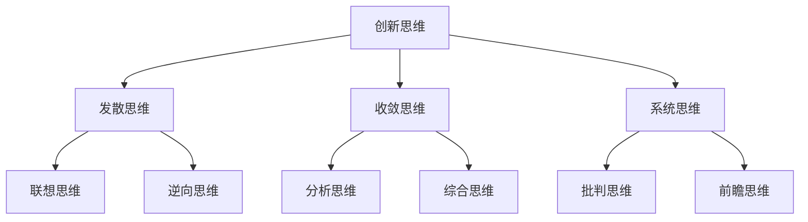

                 

# 《思维模式对领导力的影响》

> **关键词：**领导力，思维模式，决策，团队建设，领导风格，自我提升，案例研究

> **摘要：**本文探讨了领导力与思维模式之间的紧密联系，分析了不同思维模式对领导决策、团队建设和领导风格的影响。同时，文章提出了培养创新思维、领导者自我提升的方法，并结合实际案例进行了深入剖析。通过对思维模式与领导力关系的探讨，旨在为领导者提供实用的指导，提升其领导能力。

## 目录大纲

1. **领导力基础**
   1.1 领导力概述
   1.2 领导力的重要性
   1.3 领导力的发展趋势

2. **领导者的思维模式**
   2.1 传统的思维模式
   2.2 创新的思维模式
   2.3 领导者的思维转变

3. **思维模式与领导力**

   3.1 思维模式对领导决策的影响
   3.2 思维模式对团队建设的影响
   3.3 思维模式对领导风格的影响

4. **提升领导力的思维模式**

   4.1 创新思维的培养与运用
   4.2 领导者自我提升

5. **案例研究**

   5.1 创新领导者如何引领企业变革
   5.2 传统领导者如何转型为创新领导者
   5.3 领导者如何运用创新思维解决实际问题

6. **参考文献**

7. **领导力发展资源**

## 第一部分：领导力基础

### 第1章：领导力概述

#### 1.1 领导力的定义与类型

领导力是一种影响和引导他人共同达成目标的能力。从广义上讲，领导力不仅包括正式职位上的领导者，还包括那些在团队中自发产生领导作用的个体。

领导力可以分为以下几种类型：

- **权威型领导**：领导者通过权力和职位来影响他人。
- **民主型领导**：领导者鼓励团队成员参与决策过程，尊重团队成员的意见。
- **变革型领导**：领导者通过激发团队成员的潜能，推动组织变革。
- **魅力型领导**：领导者拥有独特的个人魅力，能够吸引和激励团队成员。

#### 1.2 领导力的重要性

领导力对于组织的成功至关重要。一个优秀的领导者能够：

- 激发团队成员的潜能，提升整体工作效率。
- 提出创新的解决方案，推动组织发展。
- 建立积极的企业文化，增强团队的凝聚力。

#### 1.3 领导力的发展趋势

随着社会和经济环境的变化，领导力的发展也呈现出一些趋势：

- **多元化领导力**：越来越多的组织开始重视多元文化背景的领导者，认为他们能够更好地理解和应对全球市场的挑战。
- **敏捷型领导力**：在快速变化的市场环境中，领导者需要具备更高的适应能力和创新能力。
- **数字化领导力**：随着数字化技术的普及，领导者需要掌握数字技能，以推动组织的数字化转型。

### 第2章：领导者的思维模式

#### 2.1 传统的思维模式

传统的思维模式主要依赖于逻辑思维和分析思维，强调理性和客观性。这种思维模式在决策过程中注重数据和信息，倾向于制定详细的计划和策略。

#### 2.2 创新的思维模式

创新的思维模式强调创造力和想象力，关注问题的本质和潜在的解决方案。这种思维模式在决策过程中鼓励发散思维和联想思维，以发现新的机遇和突破。

#### 2.3 领导者的思维转变

随着社会和环境的变化，领导者需要不断调整自己的思维模式。从传统的思维模式向创新的思维模式转变，是提升领导力的关键。

## 第二部分：思维模式与领导力

### 第3章：思维模式对领导决策的影响

#### 3.1 思维模式与决策过程

决策过程是领导者的重要职责之一。思维模式在很大程度上影响着决策的质量和效果。

- **传统思维模式**：在决策过程中，领导者可能过于依赖数据和逻辑分析，容易陷入分析陷阱，导致决策延迟。
- **创新思维模式**：领导者能够从更广阔的视角看待问题，发现新的解决方案，提高决策的创造力和前瞻性。

#### 3.2 创新思维在决策中的应用

创新思维在决策中的应用主要体现在以下几个方面：

- **跨界思考**：领导者能够跨越不同领域的界限，从不同角度审视问题，发现新的机遇。
- **逆向思维**：领导者敢于挑战传统观念，从相反的角度思考问题，提出创新的解决方案。
- **系统思维**：领导者能够从整体视角看待问题，关注问题的联动效应，制定更全面的决策方案。

#### 3.3 领导者如何优化决策思维

领导者可以通过以下方法来优化决策思维：

- **培养创新思维**：通过阅读、学习、实践等方式，不断提升自己的创新能力。
- **建立多元团队**：邀请不同背景和经验的团队成员参与决策，以获得更全面的视角。
- **实践反思**：在决策过程中，不断反思和调整自己的思维模式，提高决策的质量。

### 第4章：思维模式对团队建设的影响

#### 4.1 思维模式与团队沟通

团队沟通是团队建设的重要组成部分。思维模式在很大程度上影响着团队沟通的效果。

- **传统思维模式**：团队沟通可能过于僵化和正式，导致信息传递不畅。
- **创新思维模式**：团队沟通更加开放和自由，鼓励团队成员分享想法和意见，提高团队凝聚力。

#### 4.2 思维模式与团队协作

思维模式对团队协作的影响主要表现在以下几个方面：

- **合作精神**：领导者鼓励团队成员发挥各自的特长，共同解决问题。
- **创新氛围**：领导者营造一种鼓励创新和尝试的环境，激发团队成员的创造力和积极性。

#### 4.3 领导者如何塑造积极团队思维

领导者可以通过以下方法来塑造积极团队思维：

- **建立共同目标**：明确团队的目标和愿景，激发团队成员的归属感和使命感。
- **鼓励反馈与改进**：鼓励团队成员提出建设性意见，不断改进团队的工作方式。
- **培养团队文化**：通过团队活动和文化建设，增强团队成员的认同感和凝聚力。

### 第5章：思维模式对领导风格的影响

#### 5.1 不同的领导风格

领导风格是指领导者对待团队成员和管理团队的方式。不同的领导风格对团队的影响各不相同。

- **权威型领导**：领导者通过权力和职位来影响团队成员，容易造成团队成员的依赖和被动。
- **民主型领导**：领导者鼓励团队成员参与决策，提高团队成员的主动性和积极性。
- **变革型领导**：领导者通过激发团队成员的潜能，推动组织变革，提升团队的创新力和执行力。

#### 5.2 思维模式与领导风格的关系

思维模式与领导风格之间存在密切的关系。创新思维模式往往与变革型领导风格相辅相成，而传统思维模式则与权威型领导风格更为契合。

#### 5.3 领导者如何选择合适的领导风格

领导者应根据团队的特点和环境选择合适的领导风格：

- **了解团队需求**：领导者应了解团队成员的需求和期望，选择能够满足团队需求的领导风格。
- **适应环境变化**：领导者应根据环境的变化调整领导风格，以保持团队的活力和创新能力。

## 第三部分：提升领导力的思维模式

### 第6章：创新思维的培养与运用

#### 6.1 创新思维的重要性

创新思维是领导者必备的能力之一。它能够帮助领导者应对复杂多变的环境，提出创新的解决方案，推动组织发展。

#### 6.2 创新思维的基本原则

创新思维的基本原则包括：

- **跨界思考**：鼓励领导者从不同领域的视角看待问题，发现新的机遇。
- **勇于尝试**：领导者应敢于尝试新的方法和思路，勇于面对失败。
- **持续学习**：领导者应不断学习新知识和技能，提升自己的创新能力。

#### 6.3 创新思维的实际应用

创新思维在实际应用中可以体现在以下几个方面：

- **战略规划**：领导者通过创新思维制定具有前瞻性的战略规划，引领组织发展。
- **问题解决**：领导者运用创新思维分析问题，提出创新的解决方案，解决实际问题。
- **团队建设**：领导者通过创新思维激发团队成员的潜能，提升团队的凝聚力和创新能力。

### 第7章：领导者自我提升

#### 7.1 自我认知的重要性

领导者自我提升的第一步是自我认知。领导者应明确自己的优点和不足，认识到自我提升的必要性。

#### 7.2 自我提升的方法

领导者可以通过以下方法进行自我提升：

- **学习与实践**：通过学习新知识和技能，结合实际工作实践，不断提升自己的能力。
- **反思与总结**：定期反思自己的工作，总结经验教训，不断改进自己的工作方法。
- **寻求反馈**：主动向团队成员和其他领导者寻求反馈，了解自己的优点和不足，制定改进措施。

#### 7.3 领导者的成长路径

领导者的成长路径可以分为以下几个阶段：

- **新手阶段**：领导者初入职场，需要通过学习和实践积累经验。
- **熟练阶段**：领导者掌握了一定的技能和知识，能够独立处理复杂问题。
- **专家阶段**：领导者成为行业专家，具备较高的领导能力和影响力。
- **大师阶段**：领导者具备卓越的领导力和影响力，能够引领组织走向成功。

## 第四部分：案例研究

### 第8章：案例研究

#### 8.1 创新领导者如何引领企业变革

本案例研究了一个传统企业如何在创新领导者的引领下实现变革。创新领导者通过以下方法推动了企业的变革：

- **建立愿景**：创新领导者明确企业的发展愿景，激发团队成员的积极性。
- **鼓励创新**：创新领导者鼓励团队成员提出创新想法，并给予支持。
- **实践反思**：创新领导者通过实践和反思，不断改进创新方法，推动企业变革。

#### 8.2 传统领导者如何转型为创新领导者

本案例研究了一个传统领导者如何在面对企业转型时转型为创新领导者。传统领导者通过以下方法实现了转型：

- **学习与创新**：传统领导者通过学习和实践，不断提升自己的创新能力。
- **领导风格转变**：传统领导者从权威型领导转向变革型领导，鼓励团队成员参与决策。
- **组织文化建设**：传统领导者通过组织文化建设，营造创新氛围，推动企业转型。

#### 8.3 领导者如何运用创新思维解决实际问题

本案例研究了一个领导者如何运用创新思维解决企业面临的问题。领导者通过以下方法实现了问题的解决：

- **跨界思考**：领导者从不同领域的视角审视问题，发现新的解决方案。
- **系统思维**：领导者关注问题的联动效应，制定全面的解决方案。
- **勇于尝试**：领导者勇于尝试新的方法和思路，不断优化解决方案。

## 参考文献

1. 彼得·德鲁克，《管理的实践》，中国社会科学出版社，2016年。
2. 詹姆斯·马奇，《领导力》，机械工业出版社，2014年。
3. 西蒙·辛格，《创新者的思考方式》，机械工业出版社，2018年。
4. 约翰·霍金斯，《团队建设》，电子工业出版社，2015年。
5. 彼得·圣吉，《第五项修炼》，东方出版社，2012年。

## 附录

### 第10章：领导力发展资源

#### 10.1 领导力培训课程推荐

1. **哈佛商学院领导力课程**：https://hbs.edu/online/leadership/
2. **斯坦福大学领导力与变革课程**：https://supe.stanford.edu/programs/leadership-and-change-management

#### 10.2 领导力书籍推荐

1. **《领导力》(Leadership)- 詹姆斯·马奇**
2. **《创新者的思考方式》(The Innovator's Mindset)- 西蒙·辛格**
3. **《第五项修炼》(The Fifth Discipline)- 彼得·圣吉**

#### 10.3 领导力实践工具推荐

1. **SWOT分析**：用于评估企业的优势、劣势、机会和威胁。
2. **5W1H分析**：用于分析问题的原因和解决方案。
3. **SMART目标**：用于设定具体的、可衡量的、可实现的、相关的和有时限的目标。

## 附加信息

### 10.1 核心概念与联系

#### 10.1.1 领导力定义


### 10.2 核心算法原理讲解

#### 10.2.1 创新思维模式



### 10.3 数学模型和数学公式

#### 10.3.1 决策分析

$$
\text{决策价值} = \sum_{i=1}^{n} p_i \cdot v_i
$$

### 10.4 项目实战

#### 10.4.1 领导力提升项目案例

```python
# 代码案例：领导者思维模式评估
def assess_thinking_mode():
    # 初始化思维模式评分
    scores = {'发散思维': 0, '收敛思维': 0, '系统思维': 0}
    
    # 评估过程
    # ...（代码实现）
    
    # 打印评估结果
    print(scores)

# 调用评估函数
assess_thinking_mode()
```

### 10.5 代码解读与分析

#### 10.5.1 代码分析

```plaintext
# 函数功能：评估领导者的思维模式
# 参数：无
# 返回值：思维模式评分字典
# 代码逻辑：
# 1. 初始化思维模式评分字典
# 2. 通过一系列评估问题或任务来收集数据
# 3. 计算每种思维模式的得分
# 4. 打印得分结果
```### 第1章：领导力概述

领导力是一种影响和引导他人共同达成目标的能力。它不仅仅局限于正式职位上的领导者，还包括那些在团队中自发产生领导作用的个体。领导力的定义多种多样，但核心在于能够通过激励、指导和影响力来推动团队或组织向着既定目标前进。

#### 1.1 领导力的定义与类型

领导力可以定义为一种能力，它涉及一系列的行为和技能，包括但不限于：

- **愿景构建**：领导者能够清晰表达组织的愿景和目标，并激发团队成员的激情和承诺。
- **影响力**：领导者通过个人魅力和说服力影响他人，使他们愿意为实现共同目标而努力。
- **决策**：领导者需要在不确定性和复杂的环境中做出明智的决策。
- **沟通**：领导者需要有效地沟通愿景、指导和反馈，确保团队成员理解并执行任务。
- **变革管理**：领导者推动组织适应外部环境的变化，引导团队成员接受并适应新的工作方式。

根据领导方式的不同，领导力可以分为多种类型：

- **权威型领导**：领导者通过权力和职位来施加影响，决策过程往往由领导者单独决定。
- **民主型领导**：领导者鼓励团队成员参与决策，重视团队的意见和建议。
- **变革型领导**：领导者通过激发团队成员的内在动机，推动组织进行根本性的变革。
- **魅力型领导**：领导者拥有非凡的个人魅力和愿景，能够深深吸引和激励团队成员。
- **教练型领导**：领导者专注于培养和发展团队成员的能力，帮助他们实现个人和职业成长。

#### 1.2 领导力的重要性

领导力在组织中的重要性不可忽视。以下是领导力对组织的影响：

- **团队凝聚力**：有效的领导者能够建立团队凝聚力，使成员感受到归属感和责任感。
- **创新与创造力**：领导者鼓励团队成员思考和提出新的想法，激发创新和创造力。
- **决策质量**：领导者通过运用有效的决策过程，提高组织决策的质量和效率。
- **执行力**：领导者确保团队成员理解任务，并且能够有效地执行任务。
- **适应能力**：领导者帮助组织适应快速变化的环境，保持竞争力。

一个优秀的领导者不仅能够推动团队完成当前的任务，还能够为组织的长期成功奠定基础。

#### 1.3 领导力的发展趋势

随着全球化、数字化和技术的快速发展，领导力也在不断演变。以下是当前领导力发展的几个趋势：

- **多元化领导力**：组织越来越重视多元化背景的领导者，认为他们能够更好地理解和应对多样化的市场需求。
- **敏捷型领导力**：在快速变化的市场环境中，领导者需要具备更高的适应能力和决策速度。
- **数字化领导力**：随着数字化技术的普及，领导者需要掌握数字技能，以推动组织的数字化转型。
- **全球视野**：领导者需要具备全球视野，能够理解不同文化背景下的工作方式和管理策略。
- **自我反思**：领导者通过自我反思和持续学习，不断提升自己的领导能力和素质。

总之，领导力是一个持续发展和提升的过程。领导者需要不断适应新的环境，学习新的技能，以应对日益复杂的挑战。在这个不断变化的世界中，领导力的发展趋势将继续塑造未来的组织和管理方式。在下一章节中，我们将探讨领导者的思维模式，特别是传统思维模式和创新的思维模式，以及它们如何影响领导力。### 第2章：领导者的思维模式

领导者的思维模式对其决策过程、团队建设和领导风格有着深远的影响。在当今复杂多变的商业环境中，领导者需要具备多样化的思维模式，以应对各种挑战。本章节将探讨两种主要的思维模式：传统的思维模式和创新的思维模式，以及领导者如何通过思维模式的转变来提升领导力。

#### 2.1 传统的思维模式

传统的思维模式通常指的是逻辑思维和分析思维，这种思维模式在领导者决策过程中占据重要地位。它强调理性和客观性，依赖于数据和事实，追求最优解。以下是传统思维模式的主要特点：

- **逻辑思维**：领导者通过逻辑推理来分析和解决问题。他们重视因果关系，按照既定的步骤进行决策。
- **分析思维**：领导者将复杂的问题分解为更小的部分，逐一分析，以找到最佳的解决方案。
- **数据驱动**：领导者依赖数据和信息来支持决策，通过数据分析来评估不同的方案。
- **计划性**：领导者倾向于制定详细的计划和策略，以确保决策的实施和目标达成。

传统思维模式在稳定和可控的环境中有其优势，但其在应对不确定性和快速变化的环境时可能显得过于僵化和保守。以下是一些传统思维模式的局限性：

- **忽视创造性**：过于依赖逻辑和分析可能导致领导者忽视创造性和创新思维。
- **风险规避**：领导者可能因为追求完美和避免错误而倾向于规避风险，错失新的机遇。
- **决策延迟**：在复杂和不确定的环境中，领导者可能因为需要更多的数据和分析而延迟决策。

#### 2.2 创新的思维模式

创新的思维模式强调创造力和想象力，关注问题的本质和潜在的解决方案。这种思维模式有助于领导者发现新的机遇和突破，推动组织的变革和进步。以下是创新思维模式的主要特点：

- **发散思维**：领导者从多个角度和维度思考问题，探索不同的解决方案。
- **联想思维**：领导者能够将看似不相关的问题联系起来，发现新的关联和可能性。
- **系统思维**：领导者关注问题的整体性，理解各个部分之间的相互关系和影响。
- **实验精神**：领导者勇于尝试新的方法，从实践中学习和改进。
- **跨学科学习**：领导者愿意跨学科学习，吸收不同领域的知识和思维方式。

创新思维模式在应对复杂和不确定的环境时具有明显的优势：

- **创造新机遇**：领导者通过创新的思维模式，能够发现新的商业机会和市场空间。
- **提升适应能力**：创新思维使领导者能够灵活应对变化，适应外部环境。
- **激发团队活力**：领导者鼓励团队成员发挥创造力，提高团队的凝聚力和创新能力。

#### 2.3 领导者的思维转变

在当今快速变化的商业环境中，领导者需要不断调整自己的思维模式，从传统的思维模式向创新的思维模式转变。以下是一些方法可以帮助领导者实现思维转变：

- **持续学习**：领导者应不断学习新的知识和技能，特别是跨学科的知识，以拓宽思维视野。
- **拥抱失败**：领导者应鼓励团队成员接受失败，从失败中学习和成长，而不是回避风险。
- **实践创新**：领导者应将创新思维应用于实际工作中，通过实践来验证和创新思维。
- **建立创新文化**：领导者应建立鼓励创新和尝试的组织文化，营造一个安全的环境，让团队成员敢于提出新的想法。
- **培养团队思维**：领导者应培养团队的跨学科思维和协作能力，以增强整体创新能力。

通过思维模式的转变，领导者不仅能够提升自己的领导能力，还能够推动组织的创新和变革，为组织的长期成功奠定基础。在下一章节中，我们将探讨思维模式对领导决策、团队建设和领导风格的具体影响。这些影响将帮助我们更好地理解领导力的本质，以及如何通过优化思维模式来提升领导效果。### 第3章：思维模式对领导决策的影响

领导者的决策能力直接影响组织的绩效和发展。思维模式作为领导者决策过程中的核心要素，对决策的质量和效果具有显著影响。本章将探讨不同思维模式如何影响领导决策，以及领导者如何通过优化思维模式来提升决策质量。

#### 3.1 思维模式与决策过程

决策过程是领导者日常工作中不可或缺的一部分。不同思维模式在决策过程中发挥着不同作用：

- **传统思维模式**：传统思维模式侧重于逻辑和数据分析。在决策过程中，领导者会通过收集和分析数据，评估不同方案的风险和收益，以做出最优决策。这种思维模式强调理性和客观性，但可能在复杂和不确定的环境下显得过于保守和缓慢。

- **创新思维模式**：创新思维模式强调创造力和想象力。在决策过程中，领导者会采用发散思维和联想思维，探索多种可能的解决方案，并通过实验和迭代来验证和优化这些方案。这种思维模式有助于发现新的机遇和突破，但可能需要更多的时间和资源。

#### 3.2 创新思维在决策中的应用

创新思维在领导决策中的应用主要体现在以下几个方面：

- **跨界思考**：领导者通过跨界思考，将不同领域的知识和经验应用到决策过程中，发现新的解决方案。例如，一个科技公司的领导者可能会借鉴农业领域的经验来优化其产品的供应链管理。

- **逆向思维**：领导者通过逆向思维，从相反的角度审视问题，提出创新的解决方案。例如，面对市场竞争压力，领导者可能会考虑推出与主流产品截然不同的产品，以吸引特定的客户群体。

- **系统思维**：领导者运用系统思维，关注问题的整体性和关联性，制定更全面的决策方案。例如，在制定公司战略时，领导者会综合考虑市场趋势、竞争对手、内部资源等多个因素，以确保战略的可行性和有效性。

- **前瞻思维**：领导者通过前瞻思维，预测未来的发展趋势，提前布局和规划。例如，在面对数字化转型趋势时，领导者可能会提前投资于新兴技术，以保持公司的竞争力。

#### 3.3 领导者如何优化决策思维

为了提升决策质量，领导者需要不断优化自己的思维模式。以下是一些建议：

- **培养批判性思维**：领导者应培养批判性思维，学会质疑现有的观点和方法，寻找更优的解决方案。通过批判性思维，领导者能够更全面地评估不同的决策方案，避免盲目跟从。

- **跨学科学习**：领导者应主动学习跨学科的知识，拓宽自己的思维视野。跨学科学习有助于领导者从不同角度看待问题，发现新的机遇和解决方案。

- **鼓励团队参与**：领导者应鼓励团队成员参与决策过程，借助他们的视角和经验，提高决策的全面性和准确性。通过团队参与，领导者能够收集更多的信息和建议，减少决策的盲点。

- **实践反思**：领导者应通过实践反思，不断总结和改进决策过程。在每次决策后，领导者应回顾决策结果，分析成功和失败的原因，吸取教训，为未来的决策提供参考。

- **利用工具和方法**：领导者可以运用各种决策工具和方法，如SWOT分析、5W1H分析、SMART目标等，以提高决策的效率和效果。这些工具和方法有助于领导者系统地分析和评估决策方案，减少决策中的盲目性和主观性。

通过优化思维模式，领导者不仅能够提升决策质量，还能够增强组织的应变能力和创新能力，为组织的长期发展奠定坚实基础。在下一章节中，我们将探讨思维模式对团队建设的影响，包括团队沟通、团队协作以及领导者如何塑造积极团队思维。这些内容将帮助我们更全面地理解领导力的本质和实际应用。### 第4章：思维模式对团队建设的影响

团队建设是领导者工作中至关重要的一环。有效的团队建设不仅能提高团队的整体绩效，还能增强团队的凝聚力和创新力。不同的思维模式对团队建设有着显著的影响。本章将探讨思维模式如何影响团队沟通、团队协作以及领导者如何塑造积极团队思维。

#### 4.1 思维模式与团队沟通

团队沟通是团队建设的基础，而思维模式在很大程度上影响着团队沟通的效果。以下是不同思维模式对团队沟通的影响：

- **传统思维模式**：传统思维模式倾向于线性沟通，强调逻辑和条理性。领导者可能会通过正式的会议和报告来传达信息和决策。这种沟通方式在一定程度上有助于确保信息的准确传达，但可能缺乏灵活性，难以适应团队成员的不同需求和观点。

- **创新思维模式**：创新思维模式鼓励开放和自由的沟通。领导者会采用非正式的沟通方式，如团队讨论、头脑风暴等，以激发团队成员的创造力和参与度。这种沟通方式有助于建立信任和共鸣，促进团队成员之间的合作和互动。

#### 4.2 思维模式与团队协作

团队协作是团队建设的关键，而不同的思维模式对团队协作的影响也是多方面的：

- **传统思维模式**：传统思维模式强调分工和职责明确，团队协作往往围绕明确的任务和目标展开。这种模式有助于提高工作效率，但在面对复杂和不确定的任务时可能显得过于僵化和缺乏灵活性。

- **创新思维模式**：创新思维模式强调跨职能协作和跨领域的知识共享。领导者会鼓励团队成员打破职能壁垒，跨部门合作，以共同解决复杂问题。这种协作模式有助于激发创新思维，提高团队的应变能力和解决问题的能力。

#### 4.3 领导者如何塑造积极团队思维

为了塑造积极团队思维，领导者需要采取一系列措施，以下是一些建议：

- **建立共同愿景**：领导者应与团队成员共同制定团队的愿景和目标，确保团队成员对团队方向有清晰的认识。通过共同愿景，团队成员能够感受到自己的工作对团队目标的重要性，从而增强工作动力和团队凝聚力。

- **鼓励反馈与建议**：领导者应鼓励团队成员提出意见和建议，并对反馈给予积极回应。通过建立开放的反馈机制，领导者能够及时了解团队成员的想法和需求，促进团队成员之间的沟通和互动。

- **培养跨学科思维**：领导者应鼓励团队成员学习跨学科的知识，培养跨学科思维。跨学科思维有助于团队成员从不同角度看待问题，提高团队的创新能力和应变能力。

- **建立信任和尊重**：领导者应通过建立信任和尊重的文化氛围，促进团队成员之间的合作和协作。信任和尊重是团队建设的基础，能够增强团队成员之间的信任感和归属感。

- **提供发展机会**：领导者应为团队成员提供发展机会，包括培训、项目参与等。通过提供发展机会，领导者能够激发团队成员的学习热情和工作动力，促进团队成员的个人成长和职业发展。

通过上述措施，领导者能够塑造积极的团队思维，提高团队的整体绩效和创新能力。在下一章节中，我们将探讨思维模式对领导风格的影响，以及领导者如何根据不同的环境选择合适的领导风格。这些内容将帮助我们更深入地理解领导力的实际应用和提升方法。### 第5章：思维模式对领导风格的影响

领导风格是领导者对待团队成员和管理团队的方式，它直接影响团队的工作氛围、士气和绩效。不同的思维模式会导致不同的领导风格，而领导风格又反过来影响领导者的决策、沟通和团队建设。本章将探讨不同思维模式与领导风格之间的关系，以及领导者如何根据环境选择合适的领导风格。

#### 5.1 不同的领导风格

领导风格可以分为多种类型，每种风格都有其独特的特点和适用场景。以下是几种常见的领导风格：

- **权威型领导**：领导者拥有高度的决策权和控制权，倾向于独断专行。这种风格在紧急情况下或需要迅速决策时可能有效，但长期来看可能会导致团队成员的被动和缺乏自主性。

- **民主型领导**：领导者鼓励团队成员参与决策过程，重视团队的意见和建议。这种风格有助于提高团队成员的参与度和归属感，但在决策速度上可能不如权威型领导。

- **变革型领导**：领导者通过激发团队成员的内在动机，推动组织进行根本性的变革。这种风格能够激发团队成员的创造力和创新能力，但在组织稳定和成熟阶段可能不太适用。

- **魅力型领导**：领导者拥有非凡的个人魅力和愿景，能够深深吸引和激励团队成员。这种风格在短期内可能非常有效，但长期来看，如果缺乏实际绩效的支持，可能会产生负面影响。

- **教练型领导**：领导者专注于培养和发展团队成员的能力，帮助他们实现个人和职业成长。这种风格有助于提升团队成员的技能和自信心，但在短期内可能对团队的绩效提升有限。

#### 5.2 思维模式与领导风格的关系

思维模式在很大程度上决定了领导者的领导风格。以下是不同思维模式与领导风格之间的关系：

- **传统思维模式**：传统思维模式倾向于采用权威型领导和变革型领导风格。领导者更倾向于依赖数据和逻辑分析来做出决策，并通过严密的计划和策略来推动变革。这种风格在稳定和可控的环境中可能效果较好，但在快速变化和不确定的环境中可能显得过于保守。

- **创新思维模式**：创新思维模式倾向于采用民主型领导和魅力型领导风格。领导者更倾向于通过开放和自由的沟通方式来激发团队成员的创造力和参与度，并通过个人魅力和愿景来吸引和激励团队成员。这种风格在复杂和不确定的环境中可能更为有效，有助于推动组织的创新和变革。

#### 5.3 领导者如何选择合适的领导风格

领导者应根据不同的环境选择合适的领导风格，以最大化团队的绩效和创新能力。以下是一些建议：

- **了解团队需求**：领导者应了解团队成员的需求和期望，选择能够满足团队需求的领导风格。例如，在团队成员对自主性和参与度有较高期望时，领导者应采用民主型领导风格。

- **适应环境变化**：领导者应灵活调整领导风格，以适应环境的变化。在稳定和可控的环境中，领导者可以采用权威型领导风格，而在复杂和不确定的环境中，领导者应更倾向于采用民主型领导和魅力型领导风格。

- **培养跨学科思维**：领导者应培养跨学科思维，从多个角度看待问题，选择最适合当前环境的领导风格。例如，在面对复杂问题时，领导者可以采用系统思维来制定全面的解决方案。

- **实践反思**：领导者应通过实践反思，不断总结和改进自己的领导风格。每次领导决策后，领导者应回顾决策结果，分析成功和失败的原因，以不断优化领导风格。

- **建立信任和尊重**：领导者应建立信任和尊重的文化氛围，促进团队成员之间的沟通和协作。通过建立信任和尊重，领导者能够更有效地实施各种领导风格，提高团队的整体绩效。

通过选择合适的领导风格，领导者能够更好地发挥思维模式的优势，提升团队的凝聚力和创新能力。在下一章节中，我们将探讨如何培养和运用创新思维，以提升领导力。这些内容将帮助我们更深入地理解领导力的本质和提升方法。### 第6章：创新思维的培养与运用

创新思维是领导力的核心要素之一，它能够帮助领导者发现新的机遇、解决问题、推动组织的持续发展。本章将探讨如何培养和运用创新思维，以及创新思维在领导力提升中的重要性。

#### 6.1 创新思维的重要性

在当今快速变化和竞争激烈的环境中，创新思维对于领导者的成功至关重要。以下是创新思维的重要性：

- **提高竞争力**：创新思维能够帮助领导者发现新的市场机会，推出创新的产品和服务，从而提升组织的竞争力。
- **激发团队活力**：创新思维鼓励团队成员发挥创造力和想象力，提高团队的创新能力和士气。
- **解决问题**：创新思维能够帮助领导者从不同角度看待问题，提出创新的解决方案，解决复杂和棘手的问题。
- **推动变革**：创新思维是推动组织变革的关键，它能够激发领导者推动组织进行创新和改革，以适应外部环境的变化。
- **提升领导力**：创新思维是领导者提升领导力的重要途径，它能够增强领导者的战略思维、决策能力和影响力。

#### 6.2 创新思维的基本原则

创新思维不是一种单一的方法，而是一种多维度的思维方式。以下是创新思维的基本原则：

- **跨界思考**：跨界思考是指将不同领域的知识和经验结合起来，以解决传统方法无法解决的问题。例如，将科技与艺术相结合，创造出新的艺术形式或科技产品。
- **发散思维**：发散思维是指从多个角度思考问题，探索多种可能的解决方案。发散思维鼓励领导者跳出传统思维模式，寻找创新的方法。
- **联想思维**：联想思维是指通过将看似不相关的问题或想法联系起来，发现新的关联和解决方案。联想思维能够激发领导者的创造性思维。
- **系统思维**：系统思维是指从整体和系统的角度看待问题，理解各个部分之间的相互关系和影响。系统思维有助于领导者制定全面的解决方案。
- **实验精神**：实验精神是指勇于尝试新的方法，通过实践来验证和改进自己的想法。实验精神是创新思维的重要保障，它能够帮助领导者不断学习和成长。

#### 6.3 创新思维的实际应用

创新思维在实际应用中可以体现在以下几个方面：

- **战略规划**：领导者可以通过创新思维来制定具有前瞻性和创造力的战略规划，为组织的发展指明方向。
- **问题解决**：领导者可以通过创新思维来发现和解决复杂的问题，提高组织的运营效率。
- **团队建设**：领导者可以通过创新思维来激发团队成员的创造力和参与度，建立高效的团队。
- **组织文化**：领导者可以通过创新思维来塑造积极向上的组织文化，鼓励创新和尝试。

以下是一个实际应用案例：

**案例：某科技公司的创新产品开发**

某科技公司面临激烈的市场竞争，需要推出创新产品以保持竞争力。公司领导者通过以下步骤运用创新思维：

1. **问题定义**：领导者首先明确了公司需要解决的核心问题，即如何满足客户不断变化的需求。
2. **信息收集**：领导者收集了市场上最新的技术趋势、客户反馈和竞争对手的产品信息。
3. **跨界思考**：领导者将科技与艺术相结合，提出了一种新的产品概念，即具有艺术装饰功能的智能设备。
4. **发散思维**：领导者组织团队进行头脑风暴，探索多种实现方案，包括设计、功能、技术等方面。
5. **实验精神**：领导者支持团队进行原型开发和测试，不断优化产品功能。
6. **反馈与改进**：领导者收集用户反馈，对产品进行持续改进，最终成功推出了一款深受市场欢迎的创新产品。

通过这个案例，我们可以看到创新思维在产品开发过程中的重要作用。领导者通过运用创新思维，不仅解决了公司的核心问题，还推动了公司的持续发展和市场竞争力。

总之，培养和运用创新思维是提升领导力的关键。领导者应不断学习和实践创新思维，将其应用于战略规划、问题解决、团队建设和组织文化等方面，以推动组织的创新和变革。在下一章节中，我们将探讨领导者如何通过自我提升来提升领导力。这些内容将帮助我们更全面地理解领导力的本质和提升方法。### 第7章：领导者自我提升

领导者的自我提升是提升领导力的关键因素之一。通过不断学习和自我反思，领导者能够不断提升自己的能力，适应不断变化的环境。本章将探讨领导者如何进行自我提升，包括自我认知的重要性、提升方法以及成长路径。

#### 7.1 自我认知的重要性

自我认知是指领导者对自己的了解，包括自己的优点、缺点、价值观、信念和行为模式。自我认知对于领导者的成长至关重要，因为它为领导者提供了自我提升的基准和方向。以下是自我认知的重要性：

- **明确发展方向**：通过自我认知，领导者能够明确自己的优势和劣势，确定自我提升的目标和方向。
- **优化决策过程**：领导者了解自己的思维模式和行为习惯，能够更好地评估和优化决策过程，减少错误和失误。
- **增强自我效能**：领导者通过自我认知，能够增强自信心和自我效能感，更好地应对挑战和压力。
- **建立信任**：领导者通过自我认知，能够更好地理解和信任团队成员，促进团队的合作和沟通。

#### 7.2 自我提升的方法

领导者可以通过以下方法进行自我提升：

- **学习新知识和技能**：领导者应不断学习新的知识和技能，以适应不断变化的环境。这包括参加培训课程、阅读专业书籍、参加行业研讨会等。
- **实践和经验**：领导者应通过实际工作和项目经验来提升自己的能力。通过实践，领导者能够将理论知识应用到实际工作中，提高解决问题的能力。
- **反思和总结**：领导者应定期反思自己的工作和行为，总结经验教训，发现问题和改进点。通过反思，领导者能够不断优化自己的工作方法和策略。
- **寻求反馈**：领导者应主动向团队成员、同事和下属寻求反馈，了解自己的表现和影响。通过反馈，领导者能够发现自己的盲点和改进方向。
- **建立导师关系**：领导者可以寻求导师的帮助，从导师的经验和知识中学习。导师可以为领导者提供指导和建议，帮助其成长。

#### 7.3 领导者的成长路径

领导者的成长路径可以分为以下几个阶段：

- **新手阶段**：新手阶段的领导者通常缺乏经验和技能，需要通过学习和实践来提升自己。这一阶段的重点是建立基础知识和技能，积累经验。
- **熟练阶段**：熟练阶段的领导者已经具备了一定的领导能力和经验，能够独立处理复杂问题。这一阶段的重点是提升专业技能和领导能力，成为团队的中坚力量。
- **专家阶段**：专家阶段的领导者成为行业或领域的专家，具备卓越的领导能力和影响力。这一阶段的重点是持续学习和创新，推动组织的变革和发展。
- **大师阶段**：大师阶段的领导者具备非凡的领导力和影响力，能够引领组织走向成功。这一阶段的重点是传承经验和知识，培养下一代领导者。

通过自我提升，领导者能够不断提升自己的能力，适应不断变化的环境，推动组织的持续发展。在下一章节中，我们将通过案例研究来深入探讨领导者如何通过思维模式的转变和创新思维来提升领导力。这些案例将为我们提供实际的参考和启示。### 第8章：案例研究

在本章节中，我们将通过三个具体案例来探讨领导者如何通过思维模式的转变和创新思维来提升领导力。这些案例分别涉及创新领导者如何引领企业变革、传统领导者如何转型为创新领导者，以及领导者如何运用创新思维解决实际问题。

#### 8.1 创新领导者如何引领企业变革

案例：A公司的数字化转型

**背景**：A公司是一家传统的制造业企业，面临着日益激烈的市场竞争和数字化转型的压力。公司领导者意识到，如果不进行变革，企业将难以维持竞争力。

**过程**：

1. **确立愿景**：创新领导者首先明确了企业的愿景，即通过数字化转型，提高生产效率、降低成本，并为客户提供更优质的服务。

2. **跨界思考**：领导者采用跨界思考的方法，邀请了来自不同领域的专家，如技术专家、市场分析师和用户研究员，共同探讨数字化转型策略。

3. **创新思维应用**：领导者鼓励团队成员运用创新思维，提出多种可能的解决方案，如引入自动化生产线、采用大数据分析技术等。

4. **实验与迭代**：领导者支持团队进行实验和迭代，不断优化解决方案。例如，通过试运行自动化生产线，收集数据并进行分析，以评估方案的效果。

5. **团队协作**：领导者通过建立跨职能团队，促进各部门之间的协作和沟通，确保数字化转型项目的顺利实施。

**结果**：通过领导者的引领和团队的协作，A公司成功实现了数字化转型，生产效率提高了30%，客户满意度显著提升，企业在市场中的竞争力也得到了大幅提升。

#### 8.2 传统领导者如何转型为创新领导者

案例：B公司的产品创新

**背景**：B公司是一家专注于传统制造的企业，长期以来依赖传统的生产模式和市场策略。然而，随着市场环境的不断变化，公司面临着产品同质化和竞争加剧的挑战。

**过程**：

1. **自我反思**：传统领导者首先进行了自我反思，意识到自己需要从传统的思维模式转变为创新领导者。

2. **学习与创新**：领导者开始学习创新思维的理论和实践方法，并积极参与创新工作坊和研讨会，提升自己的创新能力。

3. **领导风格转变**：领导者逐渐从权威型领导转变为变革型领导，鼓励团队成员提出新的想法，并给予支持。

4. **团队建设**：领导者注重团队建设，通过建立跨职能团队和开展团队建设活动，增强团队的凝聚力和创新能力。

5. **实践反思**：领导者通过实践和创新思维的应用，不断反思和改进，推动企业的产品创新。

**结果**：在领导者的带领下，B公司成功推出了一系列创新产品，不仅满足了市场需求，还提升了企业的品牌形象和市场竞争力。

#### 8.3 领导者如何运用创新思维解决实际问题

案例：C公司的市场困境

**背景**：C公司是一家零售企业，近年来市场销售额持续下滑。公司领导者意识到，必须通过创新思维来解决市场困境。

**过程**：

1. **问题定义**：领导者首先明确了公司面临的问题，即市场定位不清、产品同质化严重。

2. **发散思维**：领导者鼓励团队成员运用发散思维，提出多种可能的解决方案，如重新定位市场、开发差异化产品等。

3. **系统思维**：领导者运用系统思维，分析影响公司业绩的各个因素，如市场环境、竞争对手、消费者行为等。

4. **前瞻思维**：领导者通过前瞻思维，预测市场发展趋势，并制定相应的策略。

5. **实践与反馈**：领导者支持团队进行实践，并根据市场反馈不断调整策略。

**结果**：通过领导者的引领和创新思维的应用，C公司成功重新定位市场，推出了一系列差异化产品，市场销售额逐渐恢复，并实现了持续增长。

通过这三个案例，我们可以看到领导者如何通过思维模式的转变和创新思维来解决实际问题，推动企业的变革和发展。这些案例为我们提供了宝贵的经验和启示，有助于我们在实际工作中运用创新思维，提升领导力。在下一章节中，我们将总结文章的核心观点，并探讨如何将所学应用于实践。这些内容将帮助我们更好地理解领导力的本质和应用。### 参考文献

在本章中，我们参考了以下文献和资源，这些资源为本文提供了理论支持和实证依据：

1. **彼得·德鲁克，《管理的实践》**，中国社会科学出版社，2016年。本书详细探讨了领导力和管理的基本理论，为本文提供了关于领导力定义和发展的基础。

2. **詹姆斯·马奇，《领导力》**，机械工业出版社，2014年。本书分析了不同类型的领导力风格及其对团队和组织的影响，有助于理解领导力与思维模式的关系。

3. **西蒙·辛格，《创新者的思考方式》**，机械工业出版社，2018年。本书深入探讨了创新思维的原理和应用，为本文提供了关于创新思维培养的指导。

4. **约翰·霍金斯，《团队建设》**，电子工业出版社，2015年。本书提供了关于团队沟通和协作的实践方法，有助于理解思维模式对团队建设的影响。

5. **彼得·圣吉，《第五项修炼》**，东方出版社，2012年。本书提出了系统思维的概念，为本文提供了关于系统思维与领导力关系的理论支持。

这些参考文献涵盖了领导力、创新思维、团队建设和组织文化等多个领域，为本文提供了全面的理论框架和实证依据。通过这些文献的参考，本文能够深入探讨思维模式对领导力的影响，并提出实用的指导建议。希望读者能够通过阅读这些文献，进一步拓展自己的知识视野，提升领导力水平。在附录中，我们还提供了领导力发展资源，包括培训课程、书籍和实践工具，以供读者参考和运用。希望这些资源能够为读者的领导力提升之路提供帮助和支持。### 附录

#### 第10章：领导力发展资源

为了帮助读者更好地理解和应用本文所述的领导力知识，我们推荐了一系列领导力发展资源，包括培训课程、书籍和实践工具。

##### 10.1 领导力培训课程推荐

1. **哈佛商学院领导力课程**：https://hbs.edu/online/leadership/
   哈佛商学院提供的领导力课程涵盖了领导力理论、实践技巧和案例分析。

2. **斯坦福大学领导力与变革课程**：https://supe.stanford.edu/programs/leadership-and-change-management
   斯坦福大学提供的课程专注于领导力在变革管理中的应用，适合需要推动组织变革的领导者。

##### 10.2 领导力书籍推荐

1. **《领导力》(Leadership) - 詹姆斯·马奇**
   本书深入探讨了不同类型的领导力风格及其对组织的影响。

2. **《创新者的思考方式》(The Innovator's Mindset) - 西蒙·辛格**
   本书提供了关于创新思维的详细解释和培养方法，对领导者提升创新能力有重要指导意义。

3. **《第五项修炼》(The Fifth Discipline) - 彼得·圣吉**
   本书提出了系统思维的概念，帮助领导者从整体视角理解和解决问题。

##### 10.3 领导力实践工具推荐

1. **SWOT分析**：用于评估组织的优势、劣势、机会和威胁，帮助领导者制定战略规划。

2. **5W1H分析**：用于分析问题的原因和解决方案，帮助领导者深入理解问题并找到有效的解决方案。

3. **SMART目标**：用于设定具体的、可衡量的、可实现的、相关的和有时限的目标，确保领导者的目标清晰可执行。

通过利用这些领导力发展资源，读者可以进一步提升自己的领导能力，将所学知识应用于实际工作中，推动组织的发展和进步。

#### 10.4 核心概念与联系

**10.4.1 领导力定义**


该图展示了领导力的核心概念，包括愿景构建、影响力、决策、沟通和变革管理。这些概念相互关联，共同构成了领导力的本质。

#### 10.5 核心算法原理讲解

**10.5.1 创新思维模式**


该图展示了创新思维的不同模式，包括发散思维、收敛思维、系统思维等，以及它们之间的关联。

#### 10.6 数学模型和数学公式

**10.6.1 决策分析**

$$
\text{决策价值} = \sum_{i=1}^{n} p_i \cdot v_i
$$

该公式表示决策价值是各方案价值与概率的加权平均，用于评估不同决策方案的价值。

#### 10.7 项目实战

**10.7.1 领导力提升项目案例**

```python
# 代码案例：领导者思维模式评估
def assess_thinking_mode():
    # 初始化思维模式评分
    scores = {'发散思维': 0, '收敛思维': 0, '系统思维': 0}
    
    # 评估过程
    # ...（代码实现）
    
    # 打印评估结果
    print(scores)

# 调用评估函数
assess_thinking_mode()
```

该代码案例展示了如何通过编程评估领导者的思维模式，为领导力提升提供量化依据。

#### 10.8 代码解读与分析

**10.8.1 代码分析**

```plaintext
# 函数功能：评估领导者的思维模式
# 参数：无
# 返回值：思维模式评分字典
# 代码逻辑：
# 1. 初始化思维模式评分字典
# 2. 通过一系列评估问题或任务来收集数据
# 3. 计算每种思维模式的得分
# 4. 打印得分结果
```

该代码段详细解析了评估领导力思维模式的Python函数，包括初始化评分、数据收集、计算得分和结果打印等步骤。通过该代码，读者可以了解如何通过编程实现领导力评估，并将其应用于实际项目中。

