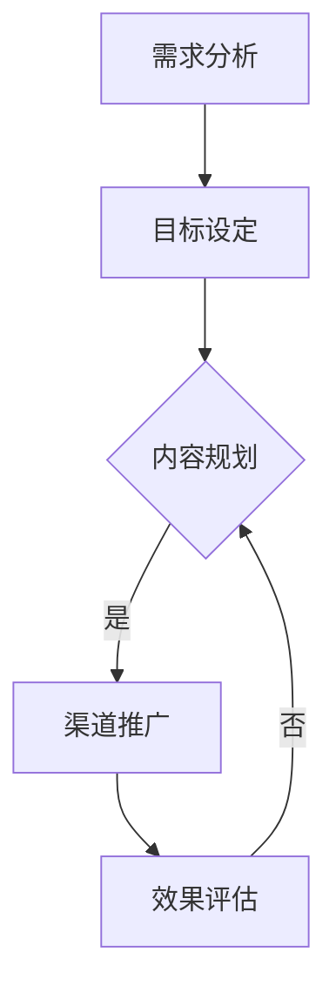

                 

## 《打造个人品牌纪录片：讲述你的成长故事》

### 关键词：
- 个人品牌
- 纪录片
- 成长故事
- 社交媒体
- 数据分析
- 项目实战

### 摘要：
本文旨在探讨如何通过制作个人品牌纪录片，有效地讲述个人的成长故事。文章将详细分析个人品牌的定义、构建步骤、核心要素及其与社交媒体的关系。同时，我们将介绍个人品牌构建的Mermaid流程图，内容创作与传播的核心算法原理，数据驱动的个人品牌优化方法，以及个人品牌评估模型。此外，文章还将通过实际案例，展示个人品牌纪录片制作的详细步骤和策略，最后对个人品牌纪录片对个人成长的影响进行总结与展望。

### 第一部分：核心概念与联系

#### 第1章：个人品牌概述

##### 1.1 什么是个人品牌

个人品牌，顾名思义，就是个人在公众心目中的形象和认知。它不仅仅是一个名字或头衔，更是一个人专业能力、个性特质、价值观的综合体现。在现代社会，个人品牌的重要性日益凸显。首先，个人品牌可以帮助个人在职场中脱颖而出，提升职业竞争力。其次，良好的个人品牌能够吸引更多的商业机会和合作伙伴。最后，个人品牌还可以帮助个人在公众中树立良好的形象，增强影响力。

##### 1.2 个人品牌的核心要素

构建一个成功的个人品牌需要以下几个核心要素：

1. **专业能力**：个人品牌的基础是专业能力。无论是技术领域还是商业领域，专业能力都是个人品牌的核心竞争力。

2. **个人形象**：个人形象包括外表、言行举止等，是个人品牌的外在表现。一个得体的形象有助于提升个人品牌的认知度和好感度。

3. **价值观**：价值观是个人品牌的灵魂。一个明确且积极的价值观能够帮助个人在职业生涯中保持一致，赢得他人的尊重和信任。

##### 1.3 个人品牌构建的步骤

构建个人品牌需要以下步骤：

1. **自我认知**：了解自己的优势和特长，明确自己的目标和发展方向。

2. **目标设定**：设定清晰的个人品牌目标，例如在某个领域成为专家或领导者。

3. **内容规划**：根据目标，制定内容规划，包括写作、演讲、纪录片等。

4. **传播策略**：选择合适的传播渠道，如社交媒体、专业平台、线下活动等。

##### 1.4 个人品牌与社交媒体的关系

社交媒体在现代个人品牌构建中起着至关重要的作用。通过社交媒体，个人可以快速传播自己的内容，建立广泛的社交网络，提升品牌知名度。同时，社交媒体也提供了一个互动的平台，个人可以通过与粉丝的互动，了解他们的需求和反馈，进一步优化个人品牌。

##### 1.5 个人品牌构建的步骤

以下是构建个人品牌的详细步骤：

1. **需求分析**：分析个人品牌的需求，确定目标受众和品牌定位。

2. **目标设定**：设定个人品牌的目标，如提升知名度、扩大影响力等。

3. **内容规划**：制定内容规划，包括写作、演讲、纪录片等。

4. **渠道推广**：选择合适的社交媒体平台进行推广，如微博、知乎、抖音等。

5. **效果评估**：定期评估个人品牌的建设效果，并根据反馈进行优化。

### 第2章：个人品牌构建的 Mermaid 流程图

为了更清晰地展示个人品牌构建的步骤，我们使用Mermaid流程图来表示。

#### 2.1 个人品牌构建流程概览

1. **需求分析**：明确个人品牌的需求，确定目标受众和品牌定位。

2. **目标设定**：设定个人品牌的目标，如提升知名度、扩大影响力等。

3. **内容规划**：根据目标，制定内容规划，包括写作、演讲、纪录片等。

4. **渠道推广**：选择合适的社交媒体平台进行推广，如微博、知乎、抖音等。

5. **效果评估**：定期评估个人品牌的建设效果，并根据反馈进行优化。

#### 2.2 Mermaid 流程图详解

- **需求分析**：通过市场调研、竞争对手分析等方式，了解目标受众的需求和偏好，明确个人品牌的需求。

- **目标设定**：根据需求分析的结果，设定个人品牌的目标，如提升知名度、扩大影响力等。

- **内容规划**：制定内容规划，包括写作、演讲、纪录片等，确保内容与品牌目标一致。

- **渠道推广**：选择合适的社交媒体平台进行推广，如微博、知乎、抖音等，根据平台特点和目标受众进行内容优化。

- **效果评估**：通过数据分析和用户反馈，评估个人品牌的建设效果，根据评估结果进行优化。

### 核心算法原理讲解

#### 第3章：内容创作与传播

##### 3.1 内容创作的原则

内容创作是个人品牌构建的核心，以下是一些关键原则：

1. **真实性与独特性**：内容必须真实，避免虚假宣传。同时，要有独特的观点和风格，避免与他人雷同。

2. **专业性**：内容应体现个人在专业领域的深度和广度，提升个人品牌的可信度。

3. **娱乐性与教育性**：内容既要有趣，吸引读者，又要具有教育意义，帮助读者获得新知。

##### 3.2 内容传播的渠道

内容传播的渠道多种多样，以下是一些主要渠道：

1. **社交媒体**：如微博、知乎、抖音等，这些平台具有广泛的用户基础，适合快速传播。

2. **专业平台**：如博客、论坛、行业网站等，这些平台专业性较强，适合发布深度内容。

3. **线下活动**：如讲座、研讨会、行业展览等，这些活动可以增强与用户的互动，提升品牌影响力。

##### 3.3 传播效果评估方法

传播效果评估是内容传播的重要环节，以下是一些常见的方法：

1. **点击率与转发率**：通过分析点击率和转发率，了解内容受欢迎程度。

2. **用户反馈**：通过评论、私信等方式，收集用户对内容的反馈，了解用户需求和偏好。

3. **数据指标分析**：使用数据分析工具，如Google Analytics，对访问量、页面停留时间、跳出率等指标进行分析。

##### 3.4 社交媒体算法简介

社交媒体平台通常使用算法推荐内容，以下是一些常见的算法：

1. **内容推荐算法**：根据用户的行为数据，推荐用户可能感兴趣的内容。

2. **用户行为分析算法**：分析用户的点击、点赞、评论等行为，预测用户的兴趣和需求。

### 第4章：数据驱动个人品牌构建

##### 4.1 数据分析的基础

数据分析是个人品牌构建的重要工具，以下是一些基础概念：

1. **数据来源**：个人品牌的数据来源包括社交媒体、博客、网站分析工具等。

2. **数据分析工具**：常用的数据分析工具有Google Analytics、HubSpot、SEMrush等。

##### 4.2 数据分析工具介绍

以下是几种常用的数据分析工具及其特点：

1. **Google Analytics**：提供详细的网站访问数据，包括访问量、用户行为等。

2. **HubSpot**：集成营销工具，提供网站分析、电子邮件营销、社交媒体管理等。

3. **SEMrush**：专注于搜索引擎营销，提供关键词分析、竞争对手分析等功能。

##### 4.3 数据驱动的个人品牌优化

数据驱动的个人品牌优化包括以下步骤：

1. **数据分析方法**：根据个人品牌的目标，选择合适的数据分析方法。

2. **优化策略**：根据数据分析结果，制定优化策略，如内容调整、推广渠道优化等。

##### 4.4 案例分析：数据驱动个人品牌构建实践

以下是一个数据驱动个人品牌构建的案例：

- **目标**：提高个人品牌知名度，吸引更多粉丝。
- **数据收集**：通过Google Analytics收集网站访问数据，通过社交媒体平台收集用户行为数据。
- **数据分析**：分析数据，发现用户主要关注的内容和渠道。
- **优化策略**：根据分析结果，调整内容策略，优化推广渠道。

### 第三部分：数学模型和数学公式讲解

#### 第5章：个人品牌评估模型

##### 5.1 个人品牌评估指标

个人品牌评估需要使用一系列指标，以下是一些常用的评估指标：

1. **知名度**：评估个人品牌在公众中的知名度。
2. **认可度**：评估个人品牌在专业领域内的认可度。
3. **影响力**：评估个人品牌对社会和行业的影响程度。

##### 5.2 评估模型的构建

个人品牌评估模型可以使用以下公式构建：

$$
评估值 = w_1 \times 知名度 + w_2 \times 认可度 + w_3 \times 影响力
$$

其中，$w_1$、$w_2$、$w_3$ 分别是知名度、认可度、影响力的权重。

##### 5.3 模型计算与结果分析

根据评估模型，计算个人品牌的评估值，并进行结果分析：

1. **计算过程**：根据收集到的数据，计算知名度、认可度、影响力的具体数值，并代入公式计算评估值。

2. **结果解读**：分析评估值，了解个人品牌在各个方面的表现，为后续优化提供依据。

##### 5.4 案例解析：个人品牌评估应用

以下是一个个人品牌评估的案例：

- **目标**：评估个人品牌的当前状况。
- **数据收集**：通过问卷调查、社交媒体分析等手段收集数据。
- **评估计算**：使用评估模型计算评估值。
- **结果分析**：分析评估值，发现个人品牌在知名度方面的优势，在认可度方面的不足。

### 第6章：用户行为预测与细分

##### 6.1 用户行为预测模型

用户行为预测模型可以使用以下公式构建：

$$
预测值 = f(x_1, x_2, ..., x_n)
$$

其中，$x_1, x_2, ..., x_n$ 是影响用户行为的特征变量，$f$ 是预测函数。

##### 6.2 用户细分方法

用户细分方法可以分为以下几种：

1. **基于行为特征**：根据用户的行为数据，将用户分为不同的群体。
2. **基于人口统计特征**：根据用户的年龄、性别、地域等人口统计特征，将用户分为不同的群体。
3. **基于需求特征**：根据用户的需求和偏好，将用户分为不同的群体。

##### 6.3 用户行为预测的应用

用户行为预测可以应用于以下场景：

1. **内容推荐**：根据用户的行为预测，推荐用户可能感兴趣的内容。
2. **广告投放**：根据用户的行为预测，优化广告投放策略。
3. **客户服务**：根据用户的行为预测，提供个性化的客户服务。

##### 6.4 案例展示：用户行为预测与细分实践

以下是一个用户行为预测与细分的案例：

- **目标**：提高用户参与度和满意度。
- **数据收集**：通过网站分析、社交媒体分析等手段收集用户行为数据。
- **预测与细分**：使用用户行为预测模型，对用户进行细分，并根据细分结果提供个性化服务。

### 第四部分：项目实战

#### 第7章：个人品牌纪录片制作

##### 7.1 纪录片制作流程

个人品牌纪录片制作包括以下流程：

1. **策划**：确定纪录片主题、目标受众、内容大纲等。
2. **拍摄**：进行实地拍摄，收集素材。
3. **后期制作**：剪辑素材、添加音效、制作字幕等。
4. **推广**：通过社交媒体、专业平台等渠道发布纪录片。

##### 7.2 纪录片内容的策划与设计

纪录片内容策划与设计包括以下步骤：

1. **故事线设计**：构建纪录片的叙事结构，确保内容连贯。
2. **角色塑造**：刻画主人公的形象，突出个人品牌的特色。
3. **主题表达**：明确纪录片的主题，传递个人品牌的价值观。

##### 7.3 纪录片拍摄与后期制作

纪录片拍摄与后期制作需要注意以下要点：

1. **拍摄技术**：使用高质量的摄像设备，保证画面效果。
2. **剪辑技巧**：通过剪辑技巧，提升纪录片的故事性和观赏性。
3. **音效设计**：添加合适的音效，增强纪录片的表现力。

##### 7.4 纪录片推广策略

纪录片推广策略包括以下方面：

1. **社交媒体推广**：通过微博、抖音等社交媒体平台发布纪录片，吸引粉丝关注。
2. **内容营销**：撰写相关文章、发布视频，提高纪录片的曝光度。
3. **合作与传播**：与行业媒体、KOL等合作，扩大纪录片的传播范围。

##### 7.5 成功案例分析

以下是一个个人品牌纪录片制作的成功案例：

- **项目背景**：某知名程序员希望通过纪录片展示自己的技术成长历程。
- **策划与设计**：确定纪录片主题为“编程之路”，讲述从入门到专家的历程。
- **拍摄与后期制作**：拍摄实地采访、技术演示等素材，后期制作中注重故事性和观赏性。
- **推广**：通过社交媒体、技术社区等渠道发布纪录片，吸引大量粉丝关注。

### 第8章：个人品牌纪录片制作实战

##### 8.1 项目背景与目标

以下是一个个人品牌纪录片制作实战的项目背景和目标：

- **项目背景**：某技术博主希望通过纪录片展示自己的技术成长历程，提升个人品牌影响力。
- **项目目标**：制作一部高质量的个人品牌纪录片，吸引更多粉丝，提高知名度。

##### 8.2 项目规划与执行

以下是项目规划与执行的详细步骤：

1. **需求分析**：通过问卷调查、访谈等方式，了解粉丝对纪录片的需求和期望。
2. **策划与设计**：确定纪录片主题、故事线、角色塑造等，确保内容吸引人。
3. **拍摄**：安排拍摄日程，进行实地拍摄，收集素材。
4. **后期制作**：剪辑素材、添加音效、制作字幕等，确保纪录片质量。
5. **发布与推广**：通过社交媒体、技术社区等渠道发布纪录片，进行推广。

##### 8.3 纪录片制作详细步骤

以下是纪录片制作的详细步骤：

1. **剧本创作**：根据项目目标，编写纪录片剧本，确保故事连贯、情节吸引人。
2. **拍摄安排**：制定拍摄计划，确定拍摄地点、时间、人员等。
3. **现场拍摄**：按照拍摄计划，进行实地拍摄，确保素材质量。
4. **剪辑**：对拍摄素材进行剪辑，确保画面连贯、故事完整。
5. **音效设计**：添加合适的音效，增强纪录片的观赏性。
6. **字幕制作**：根据纪录片内容，制作字幕，确保观众理解。
7. **质量检查**：对纪录片进行质量检查，确保无错漏。
8. **发布**：选择合适的发布平台，如B站、抖音等，发布纪录片。
9. **推广**：通过社交媒体、技术社区等渠道，进行纪录片推广。

##### 8.4 纪录片发布与推广

以下是纪录片发布与推广的详细步骤：

1. **平台选择**：根据目标受众，选择合适的发布平台，如B站、抖音等。
2. **发布时间**：选择合适的发布时间，如节假日、热门事件等，提高曝光度。
3. **标题优化**：撰写吸引人的标题，提高点击率。
4. **封面设计**：设计吸引人的封面，提高点击率。
5. **内容优化**：根据平台特点，对纪录片内容进行优化，提高用户体验。
6. **互动推广**：通过评论、私信等方式，与观众互动，提高纪录片的热度。
7. **合作推广**：与其他博主、KOL等合作，进行联合推广。

##### 8.5 项目总结与反思

以下是项目总结与反思的详细步骤：

1. **项目总结**：总结项目的成功经验和不足之处，为未来项目提供参考。
2. **反馈收集**：收集观众反馈，了解纪录片的效果和观众需求。
3. **经验分享**：撰写项目总结报告，分享项目经验，提高团队协作效率。
4. **问题反思**：分析项目中的问题，提出改进措施，避免未来项目重蹈覆辙。
5. **持续改进**：根据项目总结和反思，持续改进纪录片制作流程，提高纪录片质量。

### 第五部分：总结与展望

#### 第9章：个人品牌纪录片对个人成长的影响

##### 9.1 个人品牌纪录片的积极作用

个人品牌纪录片对个人成长具有积极作用，主要表现在以下几个方面：

1. **提升知名度**：通过纪录片，个人可以有效地传播自己的专业知识和个人故事，提高在公众中的知名度。
2. **增强影响力**：纪录片可以展示个人的专业能力和价值观，增强个人在行业和社会中的影响力。
3. **职业发展**：良好的个人品牌可以吸引更多的商业机会和合作伙伴，促进职业发展。
4. **学习与成长**：通过制作纪录片，个人需要深入研究自己的专业领域，不断提升自己的知识和技能。

##### 9.2 个人成长与品牌建设的关系

个人成长与品牌建设是相辅相成的。个人成长是品牌建设的基础，品牌建设是个人成长的体现。以下是一些具体关系：

1. **知识积累**：个人在专业领域的深入学习和实践，是构建个人品牌的重要资源。
2. **经验分享**：通过分享自己的经验和知识，个人可以赢得更多的尊重和信任，提升品牌影响力。
3. **持续优化**：个人成长的过程也是品牌建设的过程，个人需要不断优化自己的品牌形象和传播策略。
4. **互动与反馈**：通过纪录片与观众的互动，个人可以了解观众的需求和反馈，进一步优化个人品牌。

##### 9.3 未来展望：个人品牌纪录片的发展趋势

随着社交媒体和视频平台的普及，个人品牌纪录片的发展趋势将呈现以下特点：

1. **内容多样化**：个人品牌纪录片将涵盖更多领域，如科技、教育、文化等。
2. **形式创新**：纪录片的形式将更加多样，如互动纪录片、虚拟现实纪录片等。
3. **技术驱动**：人工智能、大数据等技术将在个人品牌纪录片制作和传播中发挥更大作用。
4. **全球化**：个人品牌纪录片将打破地域限制，实现全球传播，提升个人品牌的国际影响力。

### 第10章：结语

##### 10.1 主要内容回顾

本文主要内容包括：

1. **核心概念与联系**：介绍了个人品牌的定义、核心要素和构建步骤。
2. **内容创作与传播**：阐述了内容创作原则、传播渠道和效果评估方法。
3. **数据驱动个人品牌构建**：介绍了数据分析工具和方法，以及数据驱动的个人品牌优化。
4. **数学模型和公式讲解**：详细讲解了个人品牌评估模型和用户行为预测模型。
5. **项目实战**：通过实际案例展示了个人品牌纪录片制作的流程和策略。
6. **总结与展望**：总结了个人品牌纪录片对个人成长的影响，展望了未来发展趋势。

##### 10.2 学习建议与资源推荐

为了更好地理解和实践个人品牌纪录片制作，以下是一些建议和资源推荐：

1. **学习建议**：
   - **理论学习**：阅读相关书籍和文章，了解个人品牌构建的理论基础。
   - **实践操作**：实际操作制作个人品牌纪录片，积累经验。
   - **互动学习**：参与行业讨论，与其他从业者交流心得。

2. **资源推荐**：
   - **书籍**：《个人品牌》（Personal Branding）、《品牌竞争力》（Brand Building）等。
   - **在线课程**：Coursera、Udemy等平台上关于个人品牌和视频制作的课程。
   - **社交媒体平台**：微博、知乎、抖音等，用于传播个人品牌纪录片。

##### 10.3 研究方向与未来工作

未来的研究方向和未来工作包括：

1. **研究方向**：
   - **技术进步**：关注人工智能、虚拟现实等技术在个人品牌纪录片制作中的应用。
   - **数据分析**：深入研究数据分析在个人品牌构建中的实际应用，提高数据驱动的效果。
   - **跨领域合作**：探讨不同领域个人品牌纪录片的制作方法和策略。

2. **未来工作**：
   - **制作更多高质量的纪录片**：提高制作水平，制作更多具有影响力的纪录片。
   - **推广与传播**：通过多种渠道推广纪录片，提升个人品牌知名度。
   - **持续优化**：根据反馈和数据分析，持续优化纪录片内容和传播策略。

本文由AI天才研究院/AI Genius Institute联合禅与计算机程序设计艺术/Zen And The Art of Computer Programming共同撰写。我们致力于为读者提供高质量的技术内容和专业见解，帮助个人在数字时代建立强大的个人品牌。感谢您的阅读，期待与您在未来的道路上共同成长。

