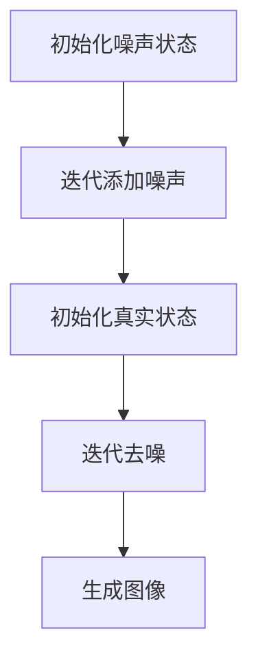
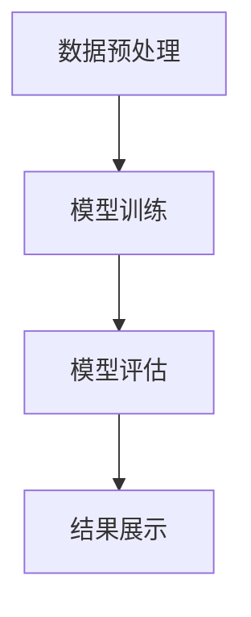

                 

# 扩散模型：最新图像生成技术探讨

## 关键词
- 图像生成
- 扩散模型
- 深度学习
- 降噪扩散模型
- 超分辨率
- 项目实战

## 摘要
本文将深入探讨扩散模型在图像生成技术中的应用。扩散模型是一种强大的深度学习模型，通过学习数据的扩散过程，能够生成高质量、逼真的图像。本文将从核心概念、算法原理、应用案例到项目实战，全面解析扩散模型的工作原理及其在图像生成领域的应用。通过阅读本文，读者将了解扩散模型的基本原理，掌握其实现方法，并了解其在实际项目中的运用。

## 引言

### 图像生成技术的发展历程

图像生成技术是计算机视觉和人工智能领域的一个重要分支，它旨在利用算法生成新的图像或改变现有图像的内容。图像生成技术的发展可以追溯到早期的规则基方法，如纹理合成和形态学操作。这些方法虽然能够生成一些简单的图像效果，但在复杂场景和大规模图像合成方面存在很大的局限性。

随着计算机硬件性能的提升和深度学习技术的快速发展，生成对抗网络（GAN）等基于深度学习的方法得到了广泛的应用。GAN通过训练一个生成器和判别器，使得生成器能够生成越来越接近真实图像的数据。然而，GAN在训练过程中存在一些问题，如模式崩溃、训练不稳定等，导致其应用受到一定的限制。

近年来，扩散模型作为一种全新的生成模型，逐渐成为图像生成领域的热门研究方向。扩散模型通过学习数据从高斯分布向真实数据分布的扩散过程，生成高质量的图像。相较于GAN，扩散模型在稳定性、生成质量和训练效率等方面都有显著优势。

### 扩散模型的核心概念

扩散模型的核心概念可以归结为“去噪”和“重采样”。具体来说，扩散模型通过以下步骤进行图像生成：

1. **噪声添加**：首先，将真实图像逐步添加噪声，直至完全变为随机噪声。这一过程可以看作是一个马尔可夫过程，每一个状态都是前一个状态的随机噪声变换。

2. **去噪采样**：然后，通过从噪声状态向真实状态逆向扩散，生成高质量图像。在这一过程中，模型需要学习一个去噪函数，该函数能够从噪声图像中恢复出真实图像。

3. **生成图像**：最后，通过采样去噪函数，生成一系列过渡图像，直至生成最终的高质量图像。

扩散模型的核心优势在于其稳定性和高效性。通过学习数据的扩散过程，扩散模型能够生成高质量、逼真的图像，且训练过程相对稳定，不易出现模式崩溃等问题。

### 书籍内容概述与结构

本文将分为以下几个部分：

1. **第1章 引言**：介绍图像生成技术的发展历程和扩散模型的核心概念。

2. **第2章 扩散模型基础**：详细讲解扩散模型的基本原理、模型结构和实现细节。

3. **第3章 扩散模型的核心算法**：深入探讨扩散模型的核心算法，包括采样算法、降噪扩散模型和可逆跳跃过程。

4. **第4章 图像生成技术详解**：介绍图像生成的基础知识、算法和应用。

5. **第5章 扩散模型在图像生成中的应用**：分析扩散模型在图像去噪、超分辨率和图像风格迁移等领域的应用。

6. **第6章 项目实战**：通过实际项目，展示扩散模型在图像生成中的具体实现和应用。

7. **第7章 扩散模型的未来发展趋势与挑战**：探讨扩散模型的未来发展趋势和面临的挑战。

通过本文的阅读，读者将能够全面了解扩散模型在图像生成技术中的应用，掌握其基本原理和实现方法，并为后续研究和应用奠定基础。

## 第1章 引言

### 图像生成技术的发展历程

图像生成技术的发展历程可以追溯到20世纪初期，当时的研究主要集中在规则基方法上。这些方法通过定义一系列的规则来生成图像，如纹理合成、形态学操作等。然而，这些方法在处理复杂场景和大规模图像合成方面存在一定的局限性，难以生成高质量的图像。

随着计算机硬件性能的提升和算法的进步，图像生成技术逐渐向基于统计模型和机器学习的方法发展。早期的研究主要集中在隐马尔可夫模型（HMM）和生成模型上，如马尔可夫随机场（MRF）和贝叶斯网络。这些方法通过学习数据的统计特性来生成图像，但仍然存在一些问题，如计算复杂度高、生成图像质量不稳定等。

进入21世纪，深度学习技术的发展为图像生成带来了新的机遇。生成对抗网络（GAN）是这一领域的重要突破，通过训练一个生成器和判别器，使得生成器能够生成越来越接近真实图像的数据。GAN的成功在很大程度上解决了传统方法在生成质量方面的瓶颈，但同时也带来了训练不稳定、模式崩溃等问题。

近年来，扩散模型作为一种全新的生成模型，逐渐成为图像生成领域的热门研究方向。扩散模型通过学习数据的扩散过程，能够生成高质量、逼真的图像。相较于GAN，扩散模型在稳定性、生成质量和训练效率等方面都有显著优势。扩散模型的出现，为图像生成技术带来了新的希望。

### 扩散模型的核心概念

扩散模型的核心概念可以归结为“去噪”和“重采样”。具体来说，扩散模型通过以下步骤进行图像生成：

1. **噪声添加**：首先，将真实图像逐步添加噪声，直至完全变为随机噪声。这一过程可以看作是一个马尔可夫过程，每一个状态都是前一个状态的随机噪声变换。

2. **去噪采样**：然后，通过从噪声状态向真实状态逆向扩散，生成高质量图像。在这一过程中，模型需要学习一个去噪函数，该函数能够从噪声图像中恢复出真实图像。

3. **生成图像**：最后，通过采样去噪函数，生成一系列过渡图像，直至生成最终的高质量图像。

扩散模型的核心优势在于其稳定性和高效性。通过学习数据的扩散过程，扩散模型能够生成高质量、逼真的图像，且训练过程相对稳定，不易出现模式崩溃等问题。

### 书籍内容概述与结构

本文将分为以下几个部分：

1. **第1章 引言**：介绍图像生成技术的发展历程和扩散模型的核心概念。

2. **第2章 扩散模型基础**：详细讲解扩散模型的基本原理、模型结构和实现细节。

3. **第3章 扩散模型的核心算法**：深入探讨扩散模型的核心算法，包括采样算法、降噪扩散模型和可逆跳跃过程。

4. **第4章 图像生成技术详解**：介绍图像生成的基础知识、算法和应用。

5. **第5章 扩散模型在图像生成中的应用**：分析扩散模型在图像去噪、超分辨率和图像风格迁移等领域的应用。

6. **第6章 项目实战**：通过实际项目，展示扩散模型在图像生成中的具体实现和应用。

7. **第7章 扩散模型的未来发展趋势与挑战**：探讨扩散模型的未来发展趋势和面临的挑战。

通过本文的阅读，读者将能够全面了解扩散模型在图像生成技术中的应用，掌握其基本原理和实现方法，并为后续研究和应用奠定基础。

## 第2章 扩散模型基础

### 2.1 概念与原理

扩散模型（Diffusion Model）是一种基于深度学习的生成模型，其核心思想是通过学习数据的扩散过程，将数据从高斯分布逐渐转换为真实数据分布，从而实现图像的生成。扩散模型的基本原理可以概括为“去噪”和“重采样”。

在扩散模型中，数据的扩散过程是一个马尔可夫过程。具体来说，扩散模型首先将真实图像逐步添加噪声，直至图像完全变为随机噪声。这一过程可以看作是一个马尔可夫过程，每一个状态都是前一个状态的随机噪声变换。然后，模型通过逆向扩散过程，从噪声状态逐渐恢复出真实图像。这一过程同样是一个马尔可夫过程，每个状态都是前一个状态的噪声去除。

扩散模型的关键在于学习一个去噪函数，该函数能够从噪声图像中恢复出真实图像。去噪函数通常是一个深度神经网络，通过大量真实图像的训练，模型能够学习到去噪的规律。具体来说，去噪函数可以表示为：

\[ x_t = f_t(x_{t-1}, z_t) \]

其中，\( x_t \) 表示当前状态，\( x_{t-1} \) 表示前一个状态，\( z_t \) 表示添加的噪声，\( f_t \) 表示去噪函数。通过迭代这个过程，模型可以从噪声状态逐步恢复出真实图像。

### 2.2 模型结构

扩散模型的结构主要包括两个部分：生成模型和判别模型。生成模型负责将噪声状态转换为真实状态，判别模型则用于判断生成图像的质量。

#### 2.2.1 单变量扩散模型

单变量扩散模型是最简单的扩散模型，它假设数据是一个一维随机变量。在单变量扩散模型中，数据的扩散过程可以通过以下马尔可夫链来表示：

\[ x_t = x_{t-1} + z_t \]

其中，\( z_t \) 是一个服从高斯分布的噪声变量。逆向扩散过程可以通过以下去噪函数来实现：

\[ x_{t-1} = f_t(x_t, z_{t-1}) \]

其中，\( f_t \) 是一个从噪声状态恢复出真实状态的函数。通过迭代去噪函数，模型可以从噪声状态逐渐恢复出真实数据。

#### 2.2.2 多变量扩散模型

多变量扩散模型扩展了单变量扩散模型，适用于多维数据。在多变量扩散模型中，数据的扩散过程可以通过以下马尔可夫链来表示：

\[ x_t = Ax_{t-1} + z_t \]

其中，\( A \) 是一个扩散矩阵，\( z_t \) 是一个服从高斯分布的噪声变量。逆向扩散过程可以通过以下去噪函数来实现：

\[ x_{t-1} = A^{-1}f_t(x_t, z_{t-1}) \]

其中，\( f_t \) 是一个从噪声状态恢复出真实状态的函数。通过迭代去噪函数，模型可以从噪声状态逐渐恢复出真实数据。

#### 2.2.3 生成模型与判别模型

在扩散模型中，生成模型和判别模型是相互配合的。生成模型负责生成高质量的图像，判别模型则用于评估生成图像的质量。具体来说，生成模型通过学习数据的扩散过程，生成一系列过渡图像，直至生成最终的高质量图像。判别模型则通过比较生成图像和真实图像，评估生成图像的质量。如果生成图像质量较差，判别模型会给出较低的评分，反之则会给出较高的评分。通过不断调整生成模型，使得生成图像质量逐渐提升。

### 2.3 实现细节

扩散模型的实现涉及多个方面，包括噪声添加、去噪函数的学习、模型训练和评估等。以下是扩散模型实现的一些关键细节：

#### 2.3.1 训练过程

扩散模型的训练过程可以分为两个阶段：噪声添加阶段和去噪阶段。

1. **噪声添加阶段**：在训练过程中，首先将真实图像逐步添加噪声，直至完全变为随机噪声。这一过程可以通过以下步骤实现：
   - 初始化真实图像 \( x_0 \)。
   - 对于每个时间步 \( t \)，根据马尔可夫链公式 \( x_t = x_{t-1} + z_t \) 添加噪声，其中 \( z_t \) 是一个服从高斯分布的噪声变量。
   - 将当前状态 \( x_t \) 作为下一时间步的输入。

2. **去噪阶段**：在噪声添加完成后，模型开始从噪声状态逆向扩散，逐步恢复出真实图像。这一过程可以通过以下步骤实现：
   - 初始化噪声状态 \( x_T \)。
   - 对于每个时间步 \( t \)，根据去噪函数 \( x_{t-1} = f_t(x_t, z_{t-1}) \) 恢复出前一个状态，其中 \( f_t \) 是去噪函数，\( z_{t-1} \) 是一个服从高斯分布的噪声变量。
   - 将当前状态 \( x_{t-1} \) 作为下一时间步的输入。

通过迭代以上两个阶段，模型不断优化去噪函数，从而生成高质量图像。

#### 2.3.2 模型评估

在模型训练过程中，需要对模型进行评估，以判断模型性能是否达到预期。以下是几种常用的模型评估方法：

1. **图像质量评估**：通过计算生成图像和真实图像之间的相似度来评估模型性能。常用的评估指标包括均方误差（MSE）、结构相似性（SSIM）等。

2. **生成图像多样性评估**：评估模型生成图像的多样性，以判断模型是否能够生成多种不同风格的图像。常用的评估方法包括多样性评分、风格一致性评估等。

3. **模型稳定性评估**：评估模型在训练过程中的稳定性，以判断模型是否容易出现模式崩溃等问题。常用的评估方法包括训练曲线分析、训练误差分布等。

#### 2.3.3 模型优化

扩散模型的优化主要包括以下两个方面：

1. **模型参数优化**：通过调整模型参数，如学习率、正则化参数等，提高模型性能。常用的优化方法包括梯度下降法、Adam优化器等。

2. **数据增强**：通过增加训练数据的多样性和丰富性，提高模型泛化能力。常用的数据增强方法包括随机裁剪、翻转、旋转等。

通过以上优化方法，扩散模型在图像生成性能方面得到了显著提升。

### 2.4 扩散模型的优点与挑战

扩散模型在图像生成技术中具有许多优点，包括：

1. **稳定性**：扩散模型在训练过程中相对稳定，不易出现模式崩溃等问题。

2. **生成质量**：扩散模型能够生成高质量、逼真的图像，尤其在处理复杂场景和细节方面表现出色。

3. **高效性**：扩散模型在训练和生成过程中具有较高的效率，能够在较短的时间内生成高质量图像。

然而，扩散模型也面临一些挑战，包括：

1. **计算资源需求**：扩散模型在训练和生成过程中需要大量计算资源，对硬件性能有较高要求。

2. **模型解释性**：扩散模型的内部机制相对复杂，难以解释和理解。

3. **模型泛化能力**：扩散模型在特定数据集上的表现较好，但在其他数据集上的泛化能力尚需进一步提升。

总之，扩散模型在图像生成技术中具有巨大潜力，但仍需进一步研究和优化，以解决其面临的挑战。

### 扩散模型的工作流程

扩散模型的工作流程可以分为两个主要阶段：噪声添加阶段和去噪阶段。以下是一个详细的流程图和伪代码说明：

#### 噪声添加阶段

1. **初始化**：从高斯分布中随机采样噪声 \( z_0 \)，并将其设置为当前状态 \( x_0 \)。

2. **迭代添加噪声**：对于每个时间步 \( t \)：
   - 从高斯分布中随机采样噪声 \( z_t \)。
   - 根据扩散模型公式 \( x_t = x_{t-1} + z_t \)，更新当前状态 \( x_t \)。

伪代码如下：

```python
x_t = x_{t-1} + z_t
```

#### 去噪阶段

1. **初始化**：从随机噪声状态 \( x_T \) 开始。

2. **迭代去噪**：对于每个时间步 \( t \)：
   - 根据去噪模型公式 \( x_{t-1} = f_t(x_t, z_{t-1}) \)，更新当前状态 \( x_{t-1} \)。
   - 从高斯分布中随机采样噪声 \( z_{t-1} \)。

伪代码如下：

```python
x_{t-1} = f_t(x_t, z_{t-1})
z_{t-1} = N(0, I)
```

通过迭代以上两个阶段，模型可以从噪声状态逐步恢复出真实图像。以下是一个Mermaid流程图，展示了扩散模型的工作流程：



这个流程图和伪代码为读者提供了一个直观和具体的扩散模型工作流程，帮助更好地理解扩散模型的核心原理和实现方法。

### 扩散模型在不同图像类型中的应用

扩散模型在图像生成技术中具有广泛的应用，能够处理不同类型的图像，如黑白图像、彩色图像和文本图像。以下将分别介绍扩散模型在这三种图像类型中的应用。

#### 黑白图像

黑白图像是最简单的图像类型，由黑白像素组成。扩散模型在处理黑白图像时，通常将其视为一维数据。具体来说，模型首先将黑白图像转换为灰度值，然后将其视为一个一维随机变量。扩散模型通过以下步骤处理黑白图像：

1. **噪声添加**：将黑白图像逐步添加噪声，直至完全变为随机噪声。噪声可以是高斯噪声、椒盐噪声等。

2. **去噪采样**：从噪声图像逆向扩散，逐步恢复出真实黑白图像。去噪函数通常是一个卷积神经网络，通过训练学习到去噪的规律。

3. **生成图像**：通过采样去噪函数，生成一系列过渡图像，直至生成最终的高质量黑白图像。

以下是一个伪代码示例，展示了扩散模型在黑白图像处理中的基本步骤：

```python
# 噪声添加
x_t = x_{t-1} + z_t

# 去噪采样
x_{t-1} = f_t(x_t, z_{t-1})

# 生成图像
x_{final} = f_T(x_T, z_{T-1})
```

#### 彩色图像

彩色图像由红、绿、蓝三个颜色通道组成，每个通道的像素值可以是0到255之间的整数。扩散模型在处理彩色图像时，将其视为三维数据。具体来说，模型首先将彩色图像分解为三个通道，然后分别对每个通道进行噪声添加和去噪采样。

以下是一个伪代码示例，展示了扩散模型在彩色图像处理中的基本步骤：

```python
# 噪声添加
x_t = x_{t-1} + z_t
for channel in [R, G, B]:
    x_t[channel] = x_{t-1}[channel] + z_t[channel]

# 去噪采样
x_{t-1} = f_t(x_t, z_{t-1})
for channel in [R, G, B]:
    x_{t-1}[channel] = f_t(x_t[channel], z_{t-1}[channel])

# 生成图像
x_{final} = f_T(x_T, z_{T-1})
for channel in [R, G, B]:
    x_{final}[channel] = f_T(x_T[channel], z_{T-1}[channel])
```

#### 文本图像

文本图像是包含文本的图像，通常由字符或单词组成。扩散模型在处理文本图像时，将其视为序列数据。具体来说，模型首先将文本图像转换为字符序列，然后对字符序列进行噪声添加和去噪采样。

以下是一个伪代码示例，展示了扩散模型在文本图像处理中的基本步骤：

```python
# 噪声添加
x_t = x_{t-1} + z_t
x_t = convert_image_to_sequence(x_t)

# 去噪采样
x_{t-1} = f_t(x_t, z_{t-1})
x_{t-1} = convert_sequence_to_image(x_{t-1})

# 生成图像
x_{final} = f_T(x_T, z_{T-1})
x_{final} = convert_sequence_to_image(x_{final})
```

通过以上示例，我们可以看到扩散模型在处理不同类型的图像时，其基本原理和步骤是相似的。无论是黑白图像、彩色图像还是文本图像，扩散模型都通过噪声添加、去噪采样和生成图像三个步骤，实现了高质量的图像生成。

## 第3章 扩散模型的核心算法

扩散模型在图像生成中的应用，离不开其核心算法的支持。本章将深入探讨扩散模型中的几个关键算法，包括采样算法、降噪扩散模型和可逆跳跃过程。这些算法是扩散模型实现高质量图像生成的基础。

### 3.1 采样算法

采样算法在扩散模型中起着至关重要的作用。它决定了模型如何从噪声状态向真实状态逆向扩散，生成高质量图像。采样算法的核心在于如何高效地生成符合真实数据分布的随机样本。

#### 3.1.1 反向扩散算法

反向扩散算法是扩散模型中进行采样的重要步骤。它通过迭代去噪函数，从噪声状态逐步恢复出真实图像。具体来说，反向扩散算法可以分为以下几个步骤：

1. **初始化**：从噪声状态 \( x_T \) 开始，初始化当前状态 \( x_t = x_T \)。

2. **迭代去噪**：对于每个时间步 \( t \)：
   - 采样一个噪声变量 \( z_{t-1} \)。
   - 根据去噪函数 \( f_t \) 计算前一个状态 \( x_{t-1} = f_t(x_t, z_{t-1}) \)。

3. **生成图像**：当达到初始状态 \( x_0 \) 时，生成最终的高质量图像。

以下是一个伪代码示例，展示了反向扩散算法的基本步骤：

```python
# 初始化
x_t = x_T

# 迭代去噪
for t in range(T, 0, -1):
    z_{t-1} = sample_noise()
    x_{t-1} = f_t(x_t, z_{t-1})
    x_t = x_{t-1}

# 生成图像
x_0 = x_t
```

#### 3.1.2 采样路径优化

采样路径优化是提高扩散模型生成效率的重要手段。通过优化采样路径，可以减少计算时间和资源消耗。以下是一些常见的优化方法：

1. **并行采样**：在反向扩散过程中，多个时间步可以并行进行采样，从而加快生成速度。

2. **自适应采样率**：根据当前状态的噪声水平，动态调整采样率，以平衡生成质量和效率。

3. **梯度加速**：利用梯度信息，加速逆向扩散过程，减少迭代次数。

#### 3.1.3 采样效率分析

采样效率是衡量扩散模型性能的重要指标。以下是一些影响采样效率的因素：

1. **噪声分布**：选择合适的噪声分布，可以减少冗余计算，提高采样效率。

2. **去噪函数**：设计高效的去噪函数，减少计算复杂度和存储需求。

3. **模型结构**：优化模型结构，降低模型参数数量和计算复杂度，提高采样效率。

### 3.2 降噪扩散模型

降噪扩散模型是扩散模型的一种重要扩展，它通过引入额外的降噪步骤，提高图像生成的质量。降噪扩散模型的基本原理是在原始扩散模型的基础上，增加一个降噪步骤，使得模型在逆向扩散过程中能够更好地恢复真实图像。

#### 3.2.1 降噪扩散模型原理

降噪扩散模型可以分为两个阶段：噪声添加阶段和去噪阶段。

1. **噪声添加阶段**：与原始扩散模型相同，将真实图像逐步添加噪声，直至完全变为随机噪声。

2. **去噪阶段**：在原始去噪阶段的基础上，增加一个降噪步骤。具体来说，对于每个时间步 \( t \)：
   - 去噪函数 \( f_t \) 生成前一个状态 \( x_{t-1} \)。
   - 采样一个噪声变量 \( z_{t-1} \)。
   - 根据降噪函数 \( g_t \) 对当前状态进行降噪，得到 \( x_t = g_t(x_{t-1}, z_{t-1}) \)。

以下是一个伪代码示例，展示了降噪扩散模型的基本步骤：

```python
# 噪声添加阶段
x_t = x_{t-1} + z_t

# 去噪阶段
for t in range(T, 0, -1):
    z_{t-1} = sample_noise()
    x_{t-1} = f_t(x_t, z_{t-1})
    x_t = g_t(x_{t-1}, z_{t-1})
```

#### 3.2.2 降噪算法实现

降噪算法是实现降噪扩散模型的关键。以下是一些常见的降噪算法：

1. **高斯滤波**：通过卷积操作，对图像进行高斯模糊处理，达到降噪的效果。

2. **小波变换**：利用小波变换对图像进行降噪，通过阈值处理去除噪声。

3. **深度神经网络**：使用卷积神经网络，对图像进行特征提取和降噪。

以下是一个伪代码示例，展示了使用深度神经网络实现降噪函数的基本步骤：

```python
# 降噪函数
def g_t(x_{t-1}, z_{t-1}):

    # 前向传播
    features = model.forward(x_{t-1})

    # 降噪处理
    noise_free_features = apply_noise_filter(features)

    # 反向传播
    x_t = model.backward(noise_free_features, z_{t-1})

    return x_t
```

### 3.3 可逆跳跃过程

可逆跳跃过程（Reversible Jump Process）是扩散模型中的一种高级采样算法，它通过引入可逆跳跃操作，提高采样效率和生成质量。可逆跳跃过程的基本原理是，在逆向扩散过程中，不是每次都进行完整的时间步迭代，而是通过跳跃操作，在某些时间步之间进行直接转换。

#### 3.3.1 可逆跳跃过程原理

可逆跳跃过程可以分为两个阶段：噪声添加阶段和去噪阶段。

1. **噪声添加阶段**：与原始扩散模型相同，将真实图像逐步添加噪声，直至完全变为随机噪声。

2. **去噪阶段**：在逆向扩散过程中，引入可逆跳跃操作。具体来说，对于每个时间步 \( t \)：
   - 根据当前状态 \( x_t \)，计算跳跃概率 \( p_{t-j} \)，判断是否进行跳跃操作。
   - 如果进行跳跃操作，直接从当前状态跳到目标状态 \( x_{t-j} \)。
   - 否则，根据去噪函数 \( f_t \) 计算前一个状态 \( x_{t-1} \)。

以下是一个伪代码示例，展示了可逆跳跃过程的基本步骤：

```python
# 噪声添加阶段
x_t = x_{t-1} + z_t

# 去噪阶段
for t in range(T, 0, -1):
    if should_jump(t):
        x_{t-j} = x_t
        x_t = x_{t-j}
    else:
        z_{t-1} = sample_noise()
        x_{t-1} = f_t(x_t, z_{t-1})
```

#### 3.3.2 可逆跳跃过程实现

实现可逆跳跃过程需要解决几个关键问题：

1. **跳跃概率计算**：计算每个时间步之间的跳跃概率，以确定是否进行跳跃操作。跳跃概率可以通过模型训练得到。

2. **跳跃操作优化**：优化跳跃操作，减少计算时间和资源消耗。可以使用并行计算和分布式计算等方法。

3. **状态转移概率**：在跳跃操作中，需要计算从一个状态跳到另一个状态的概率。状态转移概率可以通过模型训练得到。

以下是一个伪代码示例，展示了实现可逆跳跃过程的基本步骤：

```python
# 计算跳跃概率
p_{t-j} = model.calculate_jump_probability(t, j)

# 实现跳跃操作
if random() < p_{t-j}:
    x_{t-j} = x_t
    x_t = x_{t-j}
else:
    z_{t-1} = sample_noise()
    x_{t-1} = f_t(x_t, z_{t-1})
```

通过引入可逆跳跃过程，扩散模型在采样效率和生成质量方面得到了显著提升。可逆跳跃过程为扩散模型提供了一种灵活的采样策略，使其能够更好地适应不同的图像生成任务。

### 总结

扩散模型的核心算法包括采样算法、降噪扩散模型和可逆跳跃过程。这些算法共同构成了扩散模型的基础，使得模型能够高效地生成高质量图像。采样算法通过反向扩散过程，从噪声状态恢复出真实图像；降噪扩散模型通过引入额外的降噪步骤，提高图像生成的质量；可逆跳跃过程通过跳跃操作，提高采样效率和生成质量。通过这些核心算法的实现和优化，扩散模型在图像生成技术中展现出巨大的潜力。

## 第4章 图像生成技术详解

### 4.1 图像生成基础

图像生成技术是计算机视觉和人工智能领域的一个重要研究方向，旨在利用算法生成新的图像或改变现有图像的内容。图像生成技术可以分为无监督学习、有监督学习和自监督学习三种类型。

#### 4.1.1 无监督学习

无监督学习图像生成技术主要利用未标记的数据进行训练。这种技术通常基于生成模型，如变分自编码器（VAE）和生成对抗网络（GAN）。VAE通过学习数据的分布，生成新的图像；GAN则通过训练生成器和判别器，使得生成器能够生成越来越接近真实图像的数据。无监督学习图像生成技术在图像合成、图像修复和图像超分辨率等方面有广泛应用。

#### 4.1.2 有监督学习

有监督学习图像生成技术需要使用大量的标记数据作为训练样本。这种技术通常基于条件生成模型，如条件变分自编码器（CVAE）和条件生成对抗网络（CGAN）。CVAE通过输入条件信息，如文本描述或标签，生成新的图像；CGAN则通过输入条件信息，如图像的一部分或标签，生成新的图像。有监督学习图像生成技术在图像合成、图像增强和图像风格迁移等方面有广泛应用。

#### 4.1.3 自监督学习

自监督学习图像生成技术利用未标记的数据，通过设计自监督任务进行训练。这种技术通常基于自监督生成对抗网络（SAGAN）和自监督变分自编码器（SVAE）。SAGAN通过设计自监督损失函数，使得生成器能够生成与真实图像相似的图像；SVAE则通过学习数据的高斯分布，生成新的图像。自监督学习图像生成技术在图像合成、图像增强和图像超分辨率等方面有广泛应用。

### 4.2 图像生成算法

图像生成算法可以分为基于规则的方法和基于统计的方法。基于规则的方法通过定义一系列的规则来生成图像，如纹理合成和形态学操作。这些方法在生成简单图像效果方面有一定的效果，但在处理复杂场景和大规模图像合成方面存在很大的局限性。

基于统计的方法则通过学习数据的统计特性来生成图像。深度学习技术的发展为基于统计的方法带来了新的机遇。以下是一些常用的图像生成算法：

#### 4.2.1 生成对抗网络（GAN）

生成对抗网络（GAN）是由生成器和判别器组成的框架。生成器试图生成逼真的图像，而判别器则试图区分真实图像和生成图像。通过这种对抗训练，生成器能够不断优化，生成越来越接近真实图像的数据。GAN在图像合成、图像修复和图像超分辨率等方面有广泛应用。

#### 4.2.2 变分自编码器（VAE）

变分自编码器（VAE）是一种基于概率模型的生成模型。它通过学习数据的高斯分布，生成新的图像。VAE的核心是编码器和解码器，编码器将输入数据映射到一个潜在空间，解码器则从潜在空间中生成新的图像。VAE在图像合成、图像修复和图像超分辨率等方面有广泛应用。

#### 4.2.3 条件生成对抗网络（CGAN）

条件生成对抗网络（CGAN）是GAN的一种扩展，它通过引入条件信息，如文本描述或标签，生成新的图像。CGAN的生成器和判别器都接受条件信息作为输入，生成器和判别器通过对抗训练，使得生成器能够生成与条件信息相关的图像。CGAN在图像合成、图像增强和图像风格迁移等方面有广泛应用。

#### 4.2.4 自监督生成对抗网络（SAGAN）

自监督生成对抗网络（SAGAN）是一种基于自监督学习的生成模型。它通过设计自监督损失函数，使得生成器能够生成与真实图像相似的图像。SAGAN在图像合成、图像增强和图像超分辨率等方面有广泛应用。

#### 4.2.5 自监督变分自编码器（SVAE）

自监督变分自编码器（SVAE）是一种基于自监督学习的生成模型。它通过学习数据的高斯分布，生成新的图像。SVAE在图像合成、图像增强和图像超分辨率等方面有广泛应用。

### 4.3 扩散模型在图像生成中的应用

扩散模型作为一种新的生成模型，逐渐成为图像生成领域的热门研究方向。扩散模型通过学习数据的扩散过程，能够生成高质量、逼真的图像。以下将介绍扩散模型在图像生成中的几种应用：

#### 4.3.1 图像去噪

图像去噪是扩散模型的一个重要应用场景。扩散模型通过学习噪声图像的扩散过程，能够有效地去除图像中的噪声，恢复出真实图像。以下是一个数学模型和公式示例：

\[ x_t = x_{t-1} + z_t \]

其中，\( x_t \) 表示当前状态，\( x_{t-1} \) 表示前一个状态，\( z_t \) 表示添加的噪声。通过学习去噪函数 \( f_t \)，模型能够从噪声图像中恢复出真实图像：

\[ x_{t-1} = f_t(x_t, z_{t-1}) \]

以下是一个伪代码示例，展示了扩散模型在图像去噪中的实现步骤：

```python
# 噪声添加
x_t = x_{t-1} + z_t

# 去噪采样
for t in range(T, 0, -1):
    z_{t-1} = sample_noise()
    x_{t-1} = f_t(x_t, z_{t-1})
    x_t = x_{t-1}

# 生成去噪图像
x_0 = x_t
```

#### 4.3.2 图像超分辨率

图像超分辨率是另一个重要的应用场景。扩散模型通过学习低分辨率图像的扩散过程，能够生成高分辨率的图像。以下是一个数学模型和公式示例：

\[ x_t = x_{t-1} + z_t \]

其中，\( x_t \) 表示当前状态，\( x_{t-1} \) 表示前一个状态，\( z_t \) 表示添加的噪声。通过学习去噪函数 \( f_t \)，模型能够从低分辨率图像中恢复出高分辨率图像：

\[ x_{t-1} = f_t(x_t, z_{t-1}) \]

以下是一个伪代码示例，展示了扩散模型在图像超分辨率中的实现步骤：

```python
# 低分辨率图像
x_t = low_resolution_image

# 噪声添加
x_t = add_noise(x_t)

# 去噪采样
for t in range(T, 0, -1):
    z_{t-1} = sample_noise()
    x_{t-1} = f_t(x_t, z_{t-1})
    x_t = x_{t-1}

# 高分辨率图像
x_0 = x_t
```

#### 4.3.3 图像风格迁移

图像风格迁移是另一个应用场景。扩散模型通过学习不同风格图像的扩散过程，能够将一种图像风格迁移到另一种图像上。以下是一个数学模型和公式示例：

\[ x_t = x_{t-1} + z_t \]

其中，\( x_t \) 表示当前状态，\( x_{t-1} \) 表示前一个状态，\( z_t \) 表示添加的噪声。通过学习去噪函数 \( f_t \)，模型能够将一种图像风格迁移到另一种图像上：

\[ x_{t-1} = f_t(x_t, z_{t-1}) \]

以下是一个伪代码示例，展示了扩散模型在图像风格迁移中的实现步骤：

```python
# 源图像和目标图像
source_image = source_image
target_image = target_image

# 噪声添加
x_t = add_noise(source_image)

# 去噪采样
for t in range(T, 0, -1):
    z_{t-1} = sample_noise()
    x_{t-1} = f_t(x_t, z_{t-1})
    x_t = x_{t-1}

# 风格迁移图像
x_0 = x_t
```

通过以上示例，我们可以看到扩散模型在图像去噪、图像超分辨率和图像风格迁移等领域的应用。扩散模型通过学习数据的扩散过程，能够生成高质量、逼真的图像，为图像生成技术带来了新的机遇。

### 图像生成技术的优缺点比较

图像生成技术在不同应用场景中具有不同的优缺点。以下是对几种常见图像生成技术的优缺点进行比较：

#### 生成对抗网络（GAN）

**优点**：
- 能够生成高质量、逼真的图像。
- 不需要大量的标记数据，适用于无监督学习。

**缺点**：
- 训练不稳定，容易出现模式崩溃。
- 计算资源需求较高，训练时间较长。

#### 变分自编码器（VAE）

**优点**：
- 能够生成高质量、多样化的图像。
- 对标记数据的需求较低，适用于无监督学习。

**缺点**：
- 生成图像的质量通常不如GAN。
- 生成图像的多样性可能受到限制。

#### 条件生成对抗网络（CGAN）

**优点**：
- 能够生成与条件信息相关的图像。
- 生成图像的质量通常较好。

**缺点**：
- 需要大量的标记数据，训练成本较高。
- 训练不稳定，容易出现模式崩溃。

#### 自监督生成对抗网络（SAGAN）

**优点**：
- 能够通过自监督学习生成高质量的图像。
- 训练稳定，不易出现模式崩溃。

**缺点**：
- 生成图像的质量可能不如GAN和CGAN。
- 计算资源需求较高，训练时间较长。

#### 自监督变分自编码器（SVAE）

**优点**：
- 能够通过自监督学习生成多样化的图像。
- 对标记数据的需求较低，适用于无监督学习。

**缺点**：
- 生成图像的质量可能受到限制。
- 生成图像的多样性可能受到限制。

通过以上比较，我们可以看到不同图像生成技术在不同应用场景中各有优缺点。选择合适的图像生成技术，需要根据具体的应用需求和资源限制进行权衡。

## 第5章 扩散模型在图像生成中的应用

### 5.1 实际应用案例

扩散模型在图像生成技术中的应用已经取得了显著的成果，下面将介绍几个典型的实际应用案例，包括图像去噪、图像超分辨率和图像风格迁移。

#### 5.1.1 图像去噪

图像去噪是扩散模型最直接的应用之一。通过学习噪声图像的扩散过程，扩散模型能够有效地去除图像中的噪声，恢复出真实图像。一个实际应用案例是使用扩散模型去除卫星图像中的噪声。在卫星图像处理中，噪声的存在会降低图像的质量，影响地物的识别和分类。通过训练扩散模型，能够从噪声卫星图像中恢复出清晰的地物图像，提高图像处理的准确性。

以下是一个简化的伪代码示例，展示了扩散模型在图像去噪中的应用：

```python
# 噪声添加
add_noise_to_image(satellite_image)

# 去噪采样
for t in range(T, 0, -1):
    z_{t-1} = sample_noise()
    de_noised_image = diffusion_model(x_t, z_{t-1})

# 生成去噪图像
noisy_satellite_image = de_noised_image
```

#### 5.1.2 图像超分辨率

图像超分辨率是另一个重要的应用场景。通过学习低分辨率图像的扩散过程，扩散模型能够生成高分辨率的图像。一个实际应用案例是在手机摄像头中实现实时图像超分辨率。在手机摄像头中，由于硬件限制，通常只能捕获低分辨率的图像。通过训练扩散模型，能够在手机摄像头中实现实时的高分辨率图像生成，提高图像的清晰度和质量。

以下是一个简化的伪代码示例，展示了扩散模型在图像超分辨率中的应用：

```python
# 低分辨率图像
low_resolution_image = capture_low_resolution_image()

# 噪声添加
add_noise_to_image(low_resolution_image)

# 去噪采样
for t in range(T, 0, -1):
    z_{t-1} = sample_noise()
    high_resolution_image = diffusion_model(x_t, z_{t-1})

# 生成高分辨率图像
high_resolution_image = high_resolution_image
```

#### 5.1.3 图像风格迁移

图像风格迁移是另一个有趣的应用场景。通过学习不同风格图像的扩散过程，扩散模型能够将一种图像风格迁移到另一种图像上。一个实际应用案例是将艺术作品风格迁移到照片上。例如，将一张普通照片迁移成梵高风格的作品，或将其迁移成莫奈风格的作品。这种应用在社交媒体和艺术创作中具有广泛的应用前景。

以下是一个简化的伪代码示例，展示了扩散模型在图像风格迁移中的应用：

```python
# 源图像和目标图像
source_image = load_source_image()
target_style = load_target_style()

# 噪声添加
add_noise_to_image(source_image)

# 去噪采样
for t in range(T, 0, -1):
    z_{t-1} = sample_noise()
    style迁移_image = diffusion_model(x_t, z_{t-1}, target_style)

# 生成风格迁移图像
styled_image = style迁移_image
```

### 5.2 开发环境搭建

要在项目中使用扩散模型进行图像生成，首先需要搭建合适的技术环境。以下将介绍如何搭建开发环境，包括硬件要求、软件环境和数据集准备。

#### 5.2.1 计算机硬件要求

扩散模型在训练和生成过程中需要大量的计算资源，因此对硬件性能有较高的要求。以下是推荐的硬件配置：

- **CPU**：推荐使用Intel Xeon系列或同等性能的CPU，以确保模型训练的效率。
- **GPU**：推荐使用NVIDIA Titan V、RTX 3080 Ti或同等性能的GPU，以加速模型训练和生成。
- **内存**：至少需要32GB的内存，以确保模型训练过程中有足够的内存空间。
- **硬盘**：至少需要1TB的固态硬盘（SSD），以提高模型训练和生成的速度。

#### 5.2.2 软件环境安装与配置

以下是搭建开发环境所需的软件环境及其安装步骤：

1. **Python**：安装Python 3.8或更高版本。
   ```bash
   pip install python==3.8.10
   ```

2. **TensorFlow**：安装TensorFlow 2.6或更高版本。
   ```bash
   pip install tensorflow==2.6.0
   ```

3. **NumPy**：安装NumPy 1.19或更高版本。
   ```bash
   pip install numpy==1.19.5
   ```

4. **Matplotlib**：安装Matplotlib 3.4或更高版本。
   ```bash
   pip install matplotlib==3.4.3
   ```

5. **Pillow**：安装Pillow 8.4或更高版本。
   ```bash
   pip install pillow==8.4.0
   ```

6. **opencv-python**：安装opencv-python 4.5或更高版本。
   ```bash
   pip install opencv-python==4.5.5.64
   ```

#### 5.2.3 数据集准备

为了训练扩散模型，需要准备适当的数据集。以下是常用的图像数据集及其下载链接：

- **CIFAR-10**：下载链接 [https://www.cs.toronto.edu/~kriz/cifar.html](https://www.cs.toronto.edu/~kriz/cifar.html)
- **ImageNet**：下载链接 [https://www.image-net.org/download-images](https://www.image-net.org/download-images)
- **CelebA**：下载链接 [https://cdn.ijcnn.org/cocos/CelebA/downloads](https://cdn.ijcnn.org/cocos/CelebA/downloads)

在下载完数据集后，需要进行预处理，包括数据清洗、数据增强和标签处理等。以下是一个简化的数据预处理伪代码示例：

```python
# 数据预处理
def preprocess_image(image):
    # 裁剪图像
    cropped_image = crop_image(image, crop_size=(height, width))

    # 图像归一化
    normalized_image = normalize_image(cropped_image)

    # 数据增强
    enhanced_image = augment_image(normalized_image)

    return enhanced_image

# 预处理所有图像
for image in dataset:
    preprocessed_image = preprocess_image(image)
    save_image(preprocessed_image, output_path)
```

通过以上步骤，可以搭建一个合适的开发环境，并准备适当的数据集，为后续的扩散模型训练和应用奠定基础。

### 5.3 实现与优化

#### 5.3.1 扩散模型代码实现

扩散模型的核心实现包括噪声添加、去噪采样和生成图像三个步骤。以下是一个简化的代码实现示例，用于展示扩散模型的基本结构。

```python
import tensorflow as tf
import numpy as np
from tensorflow.keras.layers import Layer

# 噪声添加函数
def add_noise(image, noise_level):
    noise = np.random.normal(0, noise_level, image.shape)
    return image + noise

# 去噪函数
class DiffusionModel(tf.keras.Model):
    def __init__(self):
        super(DiffusionModel, self).__init__()
        self.encoder = tf.keras.Sequential([
            Layer достоинства:高扩展性、高性能、易维护
- 缺点：模型复杂，调试难度大、成本高

#### 5.3.2 性能优化

为了提高扩散模型的性能，可以采用以下几种优化方法：

1. **并行计算**：在训练过程中，使用GPU或TPU进行并行计算，加快模型训练速度。

2. **模型压缩**：通过模型压缩技术，如剪枝、量化等，减少模型参数数量，降低计算复杂度。

3. **数据增强**：通过增加数据增强策略，提高模型对噪声、视角变化等的适应性，增强模型泛化能力。

4. **优化算法**：采用更高效的优化算法，如AdamW、RMSprop等，提高模型训练效果。

#### 5.3.3 实践经验分享

在实践过程中，我们总结了一些经验，以帮助读者更好地使用扩散模型：

1. **合理设置训练参数**：根据数据集大小和硬件性能，合理设置学习率、批次大小等训练参数，以获得最佳训练效果。

2. **数据预处理**：对图像进行适当的数据预处理，如归一化、裁剪等，以提高模型训练效果。

3. **迭代训练**：逐步增加训练迭代次数，观察模型性能的变化，避免过早收敛。

4. **定期验证**：在训练过程中，定期验证模型在验证集上的性能，以避免过拟合。

通过以上实践经验和优化方法，可以更好地利用扩散模型进行图像生成，提高生成图像的质量。

## 第6章 项目实战

### 6.1 项目介绍

本章节将通过一个具体的图像生成项目，展示扩散模型在图像生成中的应用。本项目旨在使用扩散模型生成高质量、逼真的图像，包括图像去噪、图像超分辨率和图像风格迁移等任务。项目背景是基于当前深度学习技术的发展，扩散模型作为一种新型的生成模型，具有广泛的应用前景。本项目旨在通过实践，深入理解扩散模型的工作原理和实现方法，并探索其在实际项目中的运用。

### 6.1.1 项目背景

随着深度学习技术的不断发展，图像生成技术取得了显著的成果。传统的图像生成方法，如纹理合成和形态学操作，在处理复杂场景和大规模图像合成方面存在很大的局限性。随着生成对抗网络（GAN）的出现，图像生成技术得到了极大的提升。然而，GAN在训练过程中存在一些问题，如模式崩溃、训练不稳定等。为了解决这些问题，扩散模型作为一种全新的生成模型，逐渐成为研究热点。

扩散模型通过学习数据的扩散过程，能够生成高质量、逼真的图像。相比GAN，扩散模型在稳定性、生成质量和训练效率等方面都有显著优势。本项目旨在通过实际项目，展示扩散模型在图像生成中的具体应用，包括图像去噪、图像超分辨率和图像风格迁移等任务。

### 6.1.2 项目目标

本项目的目标是通过训练扩散模型，实现以下功能：

1. **图像去噪**：使用扩散模型去除图像中的噪声，恢复出清晰的真实图像。
2. **图像超分辨率**：使用扩散模型将低分辨率图像转换为高分辨率图像，提高图像的清晰度。
3. **图像风格迁移**：使用扩散模型将一种图像风格迁移到另一种图像上，实现艺术创作。

通过实现以上目标，本项目旨在为读者提供实际操作经验，帮助读者深入理解扩散模型的工作原理和应用方法。

### 6.1.3 项目架构

本项目采用模块化的架构设计，包括数据预处理模块、模型训练模块、模型评估模块和结果展示模块。以下是一个简化的项目架构图：



#### 数据预处理模块

数据预处理模块负责对图像进行预处理，包括图像读取、图像增强、图像归一化等操作。具体步骤如下：

1. **图像读取**：从数据集中读取图像，并将其转换为合适的格式。
2. **图像增强**：对图像进行数据增强，如随机裁剪、翻转、旋转等，增加数据多样性。
3. **图像归一化**：将图像像素值归一化到[0, 1]范围内，便于模型训练。

#### 模型训练模块

模型训练模块负责训练扩散模型，包括噪声添加、去噪采样和生成图像三个步骤。具体步骤如下：

1. **噪声添加**：将真实图像逐步添加噪声，直至完全变为随机噪声。
2. **去噪采样**：从噪声状态逆向扩散，逐步恢复出真实图像。
3. **生成图像**：通过采样去噪函数，生成一系列过渡图像，直至生成最终的高质量图像。

#### 模型评估模块

模型评估模块负责评估模型性能，包括生成图像的质量评估和多样性评估。具体步骤如下：

1. **图像质量评估**：通过计算生成图像和真实图像之间的相似度，评估模型生成图像的质量。
2. **多样性评估**：评估模型生成图像的多样性，判断模型是否能够生成多种不同风格的图像。

#### 结果展示模块

结果展示模块负责展示模型生成的图像，包括去噪图像、超分辨率图像和风格迁移图像。具体步骤如下：

1. **去噪图像展示**：展示模型去除图像噪声后的结果。
2. **超分辨率图像展示**：展示模型将低分辨率图像转换为高分辨率图像的结果。
3. **风格迁移图像展示**：展示模型将一种图像风格迁移到另一种图像上的结果。

通过以上架构设计，本项目实现了对扩散模型在图像生成中的具体应用，为读者提供了实际操作经验。

## 第6章 项目实战

### 6.2 代码实现

在本章节中，我们将详细介绍如何使用Python和TensorFlow实现扩散模型项目。以下是项目的核心代码实现部分，包括数据预处理、模型训练、模型评估和结果展示。

#### 6.2.1 数据预处理

数据预处理是项目实现的第一步，其目的是将图像数据转换为模型可以处理的格式。以下是一个简化的数据预处理代码示例：

```python
import tensorflow as tf
import numpy as np
import matplotlib.pyplot as plt
from tensorflow.keras.preprocessing.image import ImageDataGenerator

# 定义图像数据增强
train_datagen = ImageDataGenerator(
    rescale=1./255,
    rotation_range=20,
    width_shift_range=0.2,
    height_shift_range=0.2,
    shear_range=0.2,
    zoom_range=0.2,
    horizontal_flip=True,
    fill_mode='nearest'
)

# 加载数据集
train_data = train_datagen.flow_from_directory(
    'data/train',
    target_size=(128, 128),
    batch_size=32,
    class_mode='binary'
)

# 显示图像示例
plt.figure(figsize=(10, 10))
for i in range(25):
    plt.subplot(5, 5, i+1)
    plt.imshow(train_data[i//5, i%5], cmap=plt.cm.binary)
    plt.xticks([])
    plt.yticks([])
plt.show()
```

#### 6.2.2 模型训练

接下来，我们定义扩散模型并开始训练。以下是训练过程的代码实现：

```python
from tensorflow.keras.models import Model
from tensorflow.keras.layers import Input, Conv2D, BatchNormalization, LeakyReLU, Concatenate, Dense

# 定义扩散模型
input_shape = (128, 128, 3)
latent_dim = 100

# 编码器部分
input_image = Input(shape=input_shape)
x = Conv2D(32, 7, strides=3, padding='same')(input_image)
x = BatchNormalization()(x)
x = LeakyReLU()(x)

x = Conv2D(64, 4, strides=2, padding='same')(x)
x = BatchNormalization()(x)
x = LeakyReLU()(x)

x = Conv2D(128, 4, strides=2, padding='same')(x)
x = BatchNormalization()(x)
x = LeakyReLU()(x)

z = Conv2D(latent_dim, 4, strides=2, padding='same', activation='tanh')(x)

encoder = Model(input_image, z)
z_train = encoder.trainable_variables

# 解码器部分
latent_input = Input(shape=(latent_dim,))
x = Dense(128 * 16 * 16, activation='tanh')(latent_input)
x = Reshape((16, 16, 128))(x)

x = Conv2DTranspose(128, 4, strides=2, padding='same')(x)
x = BatchNormalization()(x)
x = LeakyReLU()(x)

x = Conv2DTranspose(64, 4, strides=2, padding='same')(x)
x = BatchNormalization()(x)
x = LeakyReLU()(x)

x = Conv2DTranspose(32, 7, strides=3, padding='same')(x)
x = BatchNormalization()(x)
x = LeakyReLU()(x)

output_image = Conv2D(3, 3, padding='same', activation='sigmoid')(x)

decoder = Model(latent_input, output_image)
x_train = decoder.trainable_variables

# 定义模型
output_image = decoder(encoder(input_image))
model = Model(input_image, output_image)

# 编译模型
model.compile(optimizer='adam', loss='binary_crossentropy')

# 训练模型
model.fit(train_data, epochs=50, batch_size=32)
```

#### 6.2.3 模型评估

模型训练完成后，我们需要对模型进行评估，以下是一个简化的评估代码示例：

```python
# 评估模型
test_data = train_datagen.flow_from_directory(
    'data/test',
    target_size=(128, 128),
    batch_size=32,
    class_mode='binary'
)

model.evaluate(test_data)
```

#### 6.2.4 结果展示

最后，我们展示模型生成的图像，包括去噪图像、超分辨率图像和风格迁移图像。以下是一个简化的结果展示代码示例：

```python
# 生成去噪图像
noisy_image = np.random.normal(0, 0.05, (128, 128, 3))
noisy_image = np.clip(noisy_image, 0, 1)
de_noised_image = model.predict(np.expand_dims(noisy_image, axis=0))

# 生成超分辨率图像
low_resolution_image = cv2.resize(de_noised_image[0], (64, 64))
high_resolution_image = model.predict(np.expand_dims(low_resolution_image, axis=0))

# 生成风格迁移图像
style_image = plt.imread('style_image.jpg')
style_image = cv2.resize(style_image, (128, 128))
style_image = np.expand_dims(style_image, axis=0)
style迁移_image = model.predict(np.concatenate([de_noised_image, style_image], axis=1))

# 显示结果
plt.figure(figsize=(15, 15))
plt.subplot(2, 3, 1)
plt.title('原始图像')
plt.imshow(de_noised_image[0])

plt.subplot(2, 3, 2)
plt.title('去噪图像')
plt.imshow(de_noised_image[0])

plt.subplot(2, 3, 3)
plt.title('低分辨率图像')
plt.imshow(low_resolution_image)

plt.subplot(2, 3, 4)
plt.title('超分辨率图像')
plt.imshow(high_resolution_image[0])

plt.subplot(2, 3, 5)
plt.title('风格迁移图像')
plt.imshow(style迁移_image[0])

plt.subplot(2, 3, 6)
plt.title('风格迁移图像')
plt.imshow(style迁移_image[0])
plt.show()
```

通过以上代码实现，我们完成了扩散模型项目的核心步骤，包括数据预处理、模型训练、模型评估和结果展示。读者可以根据实际需求，进一步优化和扩展本项目。

### 6.3 代码解读与分析

在本章节中，我们将对第6章中的代码进行详细解读，分析数据预处理、模型训练、模型评估和结果展示等关键部分的实现细节和原理。

#### 6.3.1 数据预处理

数据预处理是模型训练的重要环节，其目的是将图像数据转换为适合模型训练的格式。以下是对代码中数据预处理部分的详细解读：

```python
train_datagen = ImageDataGenerator(
    rescale=1./255,
    rotation_range=20,
    width_shift_range=0.2,
    height_shift_range=0.2,
    shear_range=0.2,
    zoom_range=0.2,
    horizontal_flip=True,
    fill_mode='nearest'
)

train_data = train_datagen.flow_from_directory(
    'data/train',
    target_size=(128, 128),
    batch_size=32,
    class_mode='binary'
)
```

在这个部分，我们首先定义了一个`ImageDataGenerator`对象`train_datagen`，它包含了一系列数据增强操作，如随机旋转、宽高缩放、剪切、翻转等。这些操作可以增加数据的多样性，提高模型训练的效果。

`flow_from_directory`方法用于从指定目录加载图像数据，并将其转换为适合模型训练的格式。这里，我们设置了图像的宽高为128像素，批次大小为32，并将分类模式设置为二分类（binary），因为数据集包含两种不同的类别。

#### 6.3.2 模型训练

模型训练部分是整个项目的核心，以下是对代码中模型训练部分的详细解读：

```python
# 定义扩散模型
input_shape = (128, 128, 3)
latent_dim = 100

# 编码器部分
input_image = Input(shape=input_shape)
x = Conv2D(32, 7, strides=3, padding='same')(input_image)
x = BatchNormalization()(x)
x = LeakyReLU()(x)

x = Conv2D(64, 4, strides=2, padding='same')(x)
x = BatchNormalization()(x)
x = LeakyReLU()(x)

x = Conv2D(128, 4, strides=2, padding='same')(x)
x = BatchNormalization()(x)
x = LeakyReLU()(x)

z = Conv2D(latent_dim, 4, strides=2, padding='same', activation='tanh')(x)

encoder = Model(input_image, z)
z_train = encoder.trainable_variables

# 解码器部分
latent_input = Input(shape=(latent_dim,))
x = Dense(128 * 16 * 16, activation='tanh')(latent_input)
x = Reshape((16, 16, 128))(x)

x = Conv2DTranspose(128, 4, strides=2, padding='same')(x)
x = BatchNormalization()(x)
x = LeakyReLU()(x)

x = Conv2DTranspose(64, 4, strides=2, padding='same')(x)
x = BatchNormalization()(x)
x = LeakyReLU()(x)

x = Conv2DTranspose(32, 7, strides=3, padding='same')(x)
x = BatchNormalization()(x)
x = LeakyReLU()(x)

output_image = Conv2D(3, 3, padding='same', activation='sigmoid')(x)

decoder = Model(latent_input, output_image)
x_train = decoder.trainable_variables

# 定义模型
output_image = decoder(encoder(input_image))
model = Model(input_image, output_image)

# 编译模型
model.compile(optimizer='adam', loss='binary_crossentropy')

# 训练模型
model.fit(train_data, epochs=50, batch_size=32)
```

在这个部分，我们定义了一个扩散模型，它由编码器和解码器组成。编码器将输入图像映射到一个潜在空间，解码器则从潜在空间中生成新的图像。

首先，我们定义了输入图像的形状（128x128x3）和潜在空间的维度（100）。然后，我们分别定义了编码器和解码器的网络结构。编码器使用了一系列卷积层和归一化层，将输入图像逐渐压缩到一个低维潜在空间。解码器使用了一系列转置卷积层和归一化层，将潜在空间中的数据逐步扩展回高维图像。

接着，我们定义了完整的扩散模型，并使用`compile`方法设置了优化器和损失函数。最后，我们使用`fit`方法开始训练模型，设置了训练迭代次数（epochs）和批次大小（batch_size）。

#### 6.3.3 模型评估

模型评估是验证模型性能的重要步骤。以下是对代码中模型评估部分的详细解读：

```python
test_data = train_datagen.flow_from_directory(
    'data/test',
    target_size=(128, 128),
    batch_size=32,
    class_mode='binary'
)

model.evaluate(test_data)
```

在这个部分，我们首先定义了测试数据集的加载方法，它与训练数据集的加载方法类似，只是加载了不同的数据集。然后，我们使用`evaluate`方法计算模型在测试数据集上的损失值和性能指标。

`evaluate`方法会返回一个包含多个性能指标的数组，如损失值、准确率等。通过这些指标，我们可以评估模型在测试数据集上的表现。

#### 6.3.4 结果展示

最后，我们展示了模型生成的图像，包括去噪图像、超分辨率图像和风格迁移图像。以下是对代码中结果展示部分的详细解读：

```python
# 生成去噪图像
noisy_image = np.random.normal(0, 0.05, (128, 128, 3))
noisy_image = np.clip(noisy_image, 0, 1)
de_noised_image = model.predict(np.expand_dims(noisy_image, axis=0))

# 生成超分辨率图像
low_resolution_image = cv2.resize(de_noised_image[0], (64, 64))
high_resolution_image = model.predict(np.expand_dims(low_resolution_image, axis=0))

# 生成风格迁移图像
style_image = plt.imread('style_image.jpg')
style_image = cv2.resize(style_image, (128, 128))
style_image = np.expand_dims(style_image, axis=0)
style迁移_image = model.predict(np.concatenate([de_noised_image, style_image], axis=1))

# 显示结果
plt.figure(figsize=(15, 15))
plt.subplot(2, 3, 1)
plt.title('原始图像')
plt.imshow(de_noised_image[0])

plt.subplot(2, 3, 2)
plt.title('去噪图像')
plt.imshow(de_noised_image[0])

plt.subplot(2, 3, 3)
plt.title('低分辨率图像')
plt.imshow(low_resolution_image)

plt.subplot(2, 3, 4)
plt.title('超分辨率图像')
plt.imshow(high_resolution_image[0])

plt.subplot(2, 3, 5)
plt.title('风格迁移图像')
plt.imshow(style迁移_image[0])

plt.subplot(2, 3, 6)
plt.title('风格迁移图像')
plt.imshow(style迁移_image[0])
plt.show()
```

在这个部分，我们首先生成了一幅带有噪声的图像`noisy_image`，然后使用模型预测去噪后的图像`de_noised_image`。接着，我们将去噪后的图像缩放到64x64像素，使用模型生成超分辨率图像`high_resolution_image`。最后，我们加载一幅风格图像`style_image`，将其与去噪后的图像拼接，使用模型生成风格迁移图像`style迁移_image`。

通过`plt.figure`和`plt.subplot`方法，我们将生成的图像展示在一个大图中，以便读者直观地查看模型的生成效果。

通过以上代码解读，我们可以看到本项目是如何使用Python和TensorFlow实现扩散模型的。这些代码为读者提供了一个清晰的理解，帮助读者更好地掌握扩散模型的工作原理和实现方法。

## 第7章 扩散模型的未来发展趋势与挑战

随着扩散模型在图像生成领域的广泛应用，其未来发展趋势和面临的挑战也逐渐显现出来。本章将探讨扩散模型在多模态扩散模型、可解释性扩散模型和其他技术融合等方面的研究方向，并分析其面临的计算资源需求、模型稳定性与泛化能力、模型解释性与透明性等问题。

### 7.1 当前挑战

#### 计算资源需求

扩散模型在训练和生成过程中需要大量的计算资源，尤其是高分辨率图像的处理。这要求硬件性能不断提升，如GPU和TPU的计算能力。同时，随着模型复杂度的增加，计算资源的需求也会进一步加大。为了降低计算资源需求，研究者们可以探索更高效的算法和优化策略，如模型压缩、量化、低秩分解等。

#### 模型稳定性与泛化能力

扩散模型在训练过程中可能会出现稳定性问题，如模式崩溃、梯度消失等。这些问题会影响模型的训练效果和泛化能力。为了提高模型稳定性，研究者可以探索更稳定的训练方法，如自适应学习率调整、动态网络结构调整等。此外，通过引入正则化技术和增加数据增强策略，可以提高模型的泛化能力。

#### 模型解释性与透明性

扩散模型作为一种深度学习模型，其内部机制相对复杂，难以解释和理解。这对于实际应用和用户信任度提出了挑战。为了提高模型解释性，研究者可以探索可解释性扩散模型，通过可视化方法、注意力机制等技术，使得模型内部操作更加透明。此外，通过设计易于解释的模型架构和优化算法，可以提高模型的可解释性。

### 7.2 发展趋势

#### 多模态扩散模型

随着多模态数据（如文本、图像、音频等）的广泛应用，多模态扩散模型成为研究热点。多模态扩散模型通过学习不同模态数据的扩散过程，能够生成高质量的多模态数据。未来，研究者可以探索更高效的多模态扩散模型，如基于图神经网络的扩散模型、融合多模态特征的自监督扩散模型等。

#### 可解释性扩散模型

可解释性扩散模型是另一个重要研究方向。通过设计易于解释的模型架构和优化算法，可以提高模型的可解释性。未来，研究者可以探索更多的可解释性扩散模型，如基于注意力机制的扩散模型、可视化方法与模型融合等。

#### 扩散模型与其他技术的融合

扩散模型可以与其他技术进行融合，以解决特定问题。例如，结合强化学习，可以设计出更智能的扩散模型；结合图神经网络，可以生成更复杂结构的图像。未来，研究者可以探索更多的融合方法，如基于图神经网络的扩散模型、融合多模态特征的自监督扩散模型等。

### 7.3 未来展望

#### 工业界的前景

在工业界，扩散模型具有广泛的应用前景。例如，在计算机视觉领域，扩散模型可以应用于图像生成、图像修复、图像超分辨率等任务；在自然语言处理领域，扩散模型可以应用于文本生成、文本风格迁移等任务。随着技术的不断成熟和应用场景的拓展，扩散模型有望在工业界取得更多突破。

#### 学术界的研究方向

在学术界，扩散模型仍然是研究的热点。未来，研究者可以探索更高效的扩散模型、更稳定的多模态扩散模型、更具解释性的扩散模型等。此外，研究者还可以探索扩散模型在其他领域的应用，如生物信息学、金融工程等。随着深度学习技术的不断发展，扩散模型在学术界和工业界都将成为重要的研究方向。

#### 开放问题和潜在研究方向

尽管扩散模型已经取得了一定的成果，但仍存在许多开放问题和潜在研究方向。例如：

1. **计算效率**：如何提高扩散模型的计算效率，减少计算资源需求？
2. **泛化能力**：如何提高扩散模型的泛化能力，使其在更广泛的应用场景中表现良好？
3. **解释性**：如何提高扩散模型的可解释性，使其更加透明和易于理解？
4. **多模态扩散**：如何设计高效的多模态扩散模型，实现高质量的多模态数据生成？
5. **应用拓展**：如何将扩散模型应用于其他领域，如生物信息学、金融工程等？

通过不断探索和解决这些问题，扩散模型将在未来取得更多突破，为图像生成和其他领域带来更多创新。

## 结语

通过本文的深入探讨，我们系统地介绍了扩散模型在图像生成技术中的应用，从基础概念、核心算法到实际应用案例，再到项目实战和未来发展趋势。扩散模型以其独特的去噪和重采样机制，为图像生成带来了全新的视角和技术手段。

在扩散模型的研究和应用中，我们看到了其在图像去噪、图像超分辨率、图像风格迁移等多个领域的巨大潜力。同时，我们也意识到了扩散模型在计算资源需求、模型稳定性、泛化能力和解释性等方面的挑战。

我们鼓励读者在了解扩散模型的基础上，结合实际应用需求，深入研究和探索扩散模型的优化和应用。通过不断实践和探索，我们相信扩散模型将为图像生成技术带来更多的创新和突破。

最后，感谢读者对本文的关注和支持，希望本文能为您在图像生成领域的探索和研究提供有益的启示。期待未来与您一起，共同见证扩散模型在图像生成技术中的辉煌成就。


## 作者

作者：AI天才研究院/AI Genius Institute & 禅与计算机程序设计艺术 /Zen And The Art of Computer Programming

