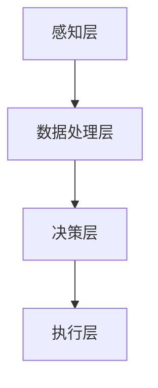
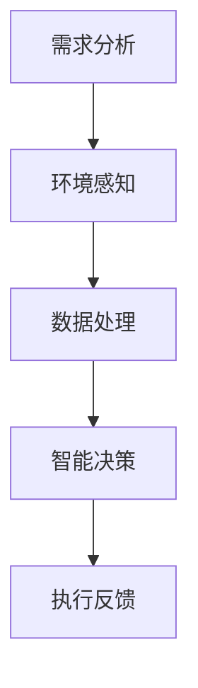
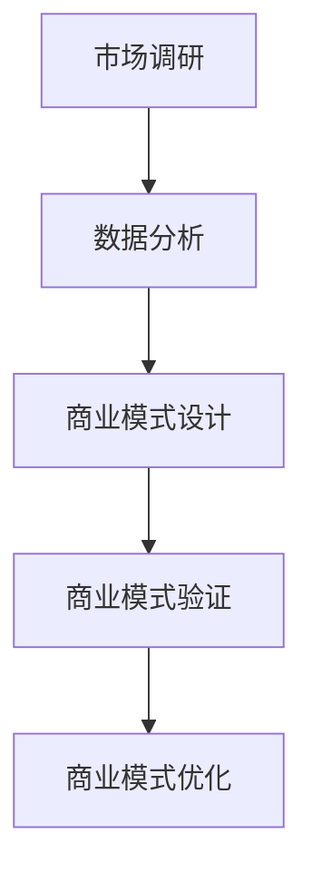

                 

# 技术创业中的情境智能：环境感知与智能响应

> **关键词：**情境智能、环境感知、智能响应、技术创业、系统架构

> **摘要：**本文将深入探讨情境智能在技术创业中的应用，重点关注环境感知与智能响应技术。通过分析情境智能的概念、重要性、应用领域，以及情境智能在系统架构、产品开发、团队管理和商业模式创新中的实际应用，本文旨在为技术创业者提供指导，助力他们在竞争激烈的市场中脱颖而出。

## 目录大纲

1. **第一部分：情境智能概述**
    1.1 情境智能概述
    1.2 环境感知技术
    1.3 智能响应技术
    1.4 情境智能的系统架构

2. **第二部分：情境智能在技术创业中的应用**
    2.1 技术创业中的挑战
    2.2 情境智能在产品开发中的应用
    2.3 情境智能在团队管理中的应用
    2.4 情境智能在商业模式创新中的应用
    2.5 情境智能案例分析

3. **第三部分：情境智能的未来展望**
    3.1 情境智能的发展趋势
    3.2 情境智能的未来前景
    3.3 技术创业中的情境智能实践建议

4. **附录**
    4.1 环境感知与智能响应技术参考
    4.2 情境智能工具与资源
    4.3 情境智能相关论文与书籍推荐

<|assistant|>## 第一部分：情境智能概述

### 第1章：情境智能概述

#### 1.1 情境智能的概念

情境智能（Contextual Intelligence，简称CI）是一种通过理解和使用情境信息来实现智能决策的技术。它结合了人工智能、机器学习和环境感知技术，旨在提供个性化的、实时的和智能化的服务。

情境智能的核心在于“情境”（Context）。情境可以理解为特定环境下的一系列条件，包括时间、地点、用户行为、环境状态等。通过感知和解析这些情境信息，系统可以做出更加精准和智能的决策。

#### 1.2 情境智能的重要性

情境智能在现代社会中具有重要的作用。首先，它能够提高用户体验。通过感知用户的行为和偏好，系统可以提供个性化的服务，满足用户的需求。其次，情境智能能够提升系统的智能化水平。通过实时分析和响应环境变化，系统可以更加灵活地应对各种情况。最后，情境智能有助于优化资源分配。通过了解环境状态，系统可以更加高效地调度资源，降低成本。

#### 1.3 情境智能的应用领域

情境智能广泛应用于各个领域。以下是一些典型的应用场景：

1. **智能家居**：情境智能可以通过感知用户的行为模式和环境状态，自动调整家庭设备的工作状态，提供个性化的家居体验。
2. **智能交通**：情境智能可以实时分析交通流量和路况，优化交通信号，提高交通效率，减少拥堵。
3. **健康医疗**：情境智能可以通过监测患者的健康状况和环境，提供个性化的医疗建议，提高医疗服务的质量。
4. **智能办公**：情境智能可以分析员工的工作状态和环境，提供定制化的工作建议，提升工作效率。
5. **金融风控**：情境智能可以实时分析市场环境、用户行为和风险指标，提供精准的风险评估和决策支持。

#### 1.4 情境智能的系统架构

情境智能的系统架构通常包括以下几个关键组件：

1. **感知层**：负责收集环境信息和用户行为数据，如传感器、摄像头、GPS等。
2. **数据处理层**：负责对收集到的数据进行处理、存储和分析，如数据清洗、数据挖掘、机器学习等。
3. **决策层**：负责基于分析结果做出决策，如规则引擎、决策树、深度学习等。
4. **执行层**：负责执行决策，如智能设备、机器人、应用系统等。

以下是一个简化的情境智能系统架构的 Mermaid 流程图：

在下一章，我们将详细探讨环境感知技术，了解它是如何实现情境智能的基础。

### 第2章：环境感知技术

#### 2.1 环境感知的概念

环境感知（Environmental Perception）是指系统通过传感器和其他手段获取外部环境信息的过程。这些信息包括温度、湿度、光照、声音、图像、地理位置等。环境感知技术是情境智能的重要组成部分，它为系统提供了理解和响应环境变化的能力。

#### 2.2 环境感知的技术体系

环境感知技术涵盖了多个领域，主要包括以下几类：

1. **传感器技术**：传感器是环境感知的基础，它们可以检测和测量各种物理量，如温度、湿度、压力、光强等。常见的传感器包括温度传感器、湿度传感器、光敏传感器、压力传感器等。

2. **图像识别技术**：图像识别技术通过计算机算法分析和处理图像数据，实现对图像内容的识别和理解。常用的图像识别技术包括特征提取、分类、目标检测等。

3. **语音识别技术**：语音识别技术通过语音信号处理算法，将语音信号转换为文本或命令。它广泛应用于智能语音助手、语音搜索、语音识别翻译等领域。

4. **定位技术**：定位技术通过测量位置信息，实现对物体的精确定位。常见的定位技术包括GPS、Wi-Fi定位、蓝牙定位、惯性导航等。

5. **多传感器融合技术**：多传感器融合技术通过整合来自不同传感器的数据，提高环境感知的准确性和鲁棒性。例如，将视觉传感器、温度传感器和GPS数据融合，可以更准确地了解环境状态。

#### 2.3 环境感知在实际应用中的案例

环境感知技术在各个领域都有广泛的应用。以下是一些典型的应用案例：

1. **智能家居**：智能家居系统通过环境感知技术，实现对家居环境的自动调节。例如，通过温度传感器和湿度传感器，自动调节空调和加湿器的状态；通过图像识别技术，自动识别家庭成员，并根据其行为模式调整照明和安防系统。

2. **智能交通**：智能交通系统通过环境感知技术，实现对交通流量和路况的实时监控。例如，通过摄像头和GPS数据，实时监测道路拥堵情况，为驾驶员提供最优行驶路线；通过声音传感器，监测交通事故的声音，自动报警并通知相关部门。

3. **健康医疗**：健康医疗系统通过环境感知技术，实现对患者健康状态的实时监测。例如，通过体温传感器和心率传感器，实时监测患者的体温和心率，及时发现异常情况；通过图像识别技术，自动分析患者的X光片或CT图像，辅助医生诊断疾病。

4. **智能办公**：智能办公系统通过环境感知技术，实现办公环境的自动化管理。例如，通过声音传感器和图像识别技术，自动识别员工的位置和工作状态，调整照明和空调等设备；通过定位技术，实时追踪员工的行踪，提高工作效率。

在下一章，我们将探讨智能响应技术，了解它如何利用环境感知数据做出智能决策。

### 第3章：智能响应技术

#### 3.1 智能响应的概念

智能响应（Smart Response）是指系统根据环境感知数据和分析结果，自动调整自身行为或状态，以实现最优效果的技术。智能响应是情境智能的核心组成部分，它使系统能够动态适应环境变化，提供个性化服务。

#### 3.2 智能响应的技术体系

智能响应技术体系主要包括以下几个方面：

1. **规则引擎**：规则引擎是一种基于规则逻辑的决策技术，它通过定义一系列规则，实现自动化决策。规则引擎通常包括规则定义、规则匹配和规则执行等功能。

2. **机器学习**：机器学习是一种通过数据训练模型，实现自动学习和决策的技术。常见的机器学习算法包括线性回归、决策树、支持向量机、神经网络等。机器学习技术可以用于模式识别、预测分析和分类等任务。

3. **深度学习**：深度学习是机器学习的一种特殊形式，它通过多层神经网络模型，实现对复杂数据的高层次抽象和表示。深度学习在图像识别、语音识别和自然语言处理等领域取得了显著成果。

4. **优化算法**：优化算法是一种通过寻找最优解，实现系统资源最优配置的技术。常见的优化算法包括线性规划、动态规划、遗传算法等。

#### 3.3 智能响应在实际应用中的案例

智能响应技术在各个领域都有广泛的应用。以下是一些典型的应用案例：

1. **智能家居**：智能家居系统通过智能响应技术，实现家居设备的自动化管理。例如，通过规则引擎，自动调节空调的温度和湿度，保持室内舒适；通过机器学习，根据用户的行为模式，自动调整照明亮度，节省能源。

2. **智能交通**：智能交通系统通过智能响应技术，优化交通信号控制，提高交通效率。例如，通过规则引擎，根据实时交通流量，动态调整红绿灯时长；通过机器学习，预测交通流量变化，提前调整信号灯，减少拥堵。

3. **健康医疗**：健康医疗系统通过智能响应技术，提供个性化的医疗建议。例如，通过规则引擎，根据患者的病史和检查结果，自动生成诊断建议；通过机器学习，根据患者的实时数据，预测病情变化，提前采取干预措施。

4. **智能办公**：智能办公系统通过智能响应技术，提高工作效率和办公体验。例如，通过规则引擎，自动分配会议室和办公资源，提高资源利用率；通过机器学习，分析员工的工作状态，提供个性化的工作建议。

在下一章，我们将探讨情境智能的系统架构，了解如何实现环境感知与智能响应的有机结合。

### 第4章：情境智能的系统架构

#### 4.1 情境智能的系统架构概述

情境智能的系统架构是一个复杂的分布式系统，它集成了环境感知、数据处理、决策执行等多个层次。为了实现高效、灵活和可扩展的情境智能应用，系统架构需要遵循一些关键原则。

#### 4.2 系统组件及功能

情境智能系统的主要组件包括：

1. **感知层**：负责收集环境数据和用户行为数据，如传感器、摄像头、GPS等。感知层的数据质量直接影响系统的准确性。

2. **数据处理层**：负责对感知层收集到的数据进行处理、存储和分析，如数据清洗、数据挖掘、机器学习等。数据处理层的核心是构建一个高效、可靠的数据管道。

3. **决策层**：负责基于分析结果做出智能决策，如规则引擎、机器学习模型、优化算法等。决策层的核心是构建一个灵活、智能的决策引擎。

4. **执行层**：负责执行决策，如智能设备、机器人、应用系统等。执行层的核心是构建一个高效、可靠的执行系统。

#### 4.3 系统架构设计原则

情境智能系统架构设计需要遵循以下原则：

1. **模块化**：系统架构应采用模块化设计，使得每个组件具有明确的职责和接口，便于系统的扩展和维护。

2. **分布式**：系统架构应采用分布式设计，将不同的组件分布在不同的节点上，提高系统的可靠性和可扩展性。

3. **灵活性**：系统架构应具有灵活性，能够根据需求的变化，快速调整和优化系统。

4. **可扩展性**：系统架构应具有可扩展性，能够支持系统规模的扩大和功能的增加。

5. **安全性**：系统架构应确保数据的安全性和系统的可靠性，防止数据泄露和系统故障。

以下是一个简化的情境智能系统架构的 Mermaid 流程图：

在下一部分，我们将探讨情境智能在技术创业中的应用，了解它如何帮助创业者应对挑战，实现商业成功。

## 第二部分：情境智能在技术创业中的应用

### 第5章：技术创业中的挑战

#### 5.1 技术创业的定义

技术创业（Tech Entrepreneurship）是指创业者利用技术创新，创建新企业或新业务的过程。技术创业的核心在于创新，它涉及从概念验证到产品开发、市场推广、商业模式的构建和持续创新等多个环节。

#### 5.2 技术创业面临的主要挑战

技术创业过程中，创业者通常会遇到以下几个主要挑战：

1. **市场定位**：如何准确地确定目标市场，找到目标客户，并在竞争激烈的市场中脱颖而出，是技术创业的首要挑战。

2. **技术实现**：技术创新是技术创业的核心，但技术的实现往往面临技术瓶颈、研发成本和资源限制等问题。

3. **商业模式**：构建可持续的商业模式，实现盈利和规模扩张，是技术创业的关键。但如何找到合适的商业模式，并在市场中占据一席之地，是一个巨大的挑战。

4. **团队建设**：组建一支高效、有激情的团队，是实现技术创业成功的重要保障。但招聘、管理和激励团队成员，也是一个复杂的挑战。

5. **资金筹集**：资金是技术创业的生命线。如何吸引投资者，获得充足的资金支持，是创业者需要面对的重要问题。

#### 5.3 应对技术创业挑战的策略

为了应对技术创业中的挑战，创业者可以采取以下策略：

1. **明确市场定位**：进行充分的市场调研，了解目标市场的需求和竞争状况，明确自己的独特价值主张。

2. **技术创新**：围绕市场需求，持续进行技术创新，提高产品的核心竞争力。

3. **商业模式探索**：不断尝试和优化商业模式，找到最适合自己产品的盈利模式。

4. **团队建设**：招聘合适的团队成员，建立高效的团队文化和协作机制。

5. **资金筹集**：制定详细的融资计划，寻找合适的投资者，并通过多种途径筹集资金。

在下一章，我们将探讨情境智能在产品开发中的应用，了解它是如何助力技术创业者的。

### 第6章：情境智能在产品开发中的应用

#### 6.1 产品开发中的情境智能

情境智能在产品开发中扮演着重要的角色。通过环境感知和智能响应技术，产品可以更好地理解用户需求、优化用户体验，从而提高产品的竞争力。

#### 6.2 情境智能驱动产品创新

情境智能驱动产品创新，主要体现在以下几个方面：

1. **个性化体验**：通过感知用户的行为和偏好，产品可以提供个性化的体验。例如，智能音响可以根据用户的听歌习惯，自动推荐音乐；智能家居系统可以根据用户的作息习惯，自动调节室内温度和灯光。

2. **实时响应**：情境智能可以实时分析环境变化，做出快速响应。例如，智能交通系统可以根据实时交通流量，动态调整交通信号，减少拥堵；智能医疗设备可以实时监测患者的生命体征，及时预警异常情况。

3. **资源优化**：情境智能可以帮助产品优化资源利用。例如，智能工厂可以通过实时感知生产状态，优化生产流程，提高生产效率；智能能源管理系统可以根据实时能源消耗，自动调整能源供应，降低能耗。

4. **智能决策**：情境智能可以辅助产品做出智能决策。例如，智能投资系统可以根据实时市场数据，自动调整投资组合，实现风险控制和收益最大化；智能供应链系统可以根据库存数据和供应链信息，自动优化库存管理和供应链协同。

#### 6.3 产品开发的情境智能实践

在实际产品开发中，情境智能的应用需要遵循以下步骤：

1. **需求分析**：明确产品的目标和功能需求，分析用户需求和行为模式。

2. **环境感知**：选择合适的感知技术，收集环境数据和用户行为数据。

3. **数据处理**：对收集到的数据进行处理、存储和分析，提取有用的信息。

4. **智能决策**：基于分析结果，使用机器学习和规则引擎等技术，做出智能决策。

5. **执行反馈**：执行决策，并对结果进行反馈和优化。

以下是一个简单的情境智能产品开发流程的 Mermaid 流程图：

通过情境智能，产品可以更好地满足用户需求，提高用户体验，从而在竞争激烈的市场中脱颖而出。

在下一章，我们将探讨情境智能在团队管理中的应用，了解它是如何提升团队效率和协作能力的。

### 第7章：情境智能在团队管理中的应用

#### 7.1 团队管理中的情境智能

情境智能在团队管理中的应用，主要是指通过感知团队成员的行为和环境，提供个性化的管理策略，以提高团队效率和协作能力。情境智能在团队管理中的重要性体现在以下几个方面：

1. **个性化管理**：情境智能可以帮助管理者更好地了解团队成员的行为和工作状态，提供个性化的管理策略，满足不同成员的需求。

2. **实时反馈**：情境智能可以实时收集团队成员的工作数据，提供实时反馈，帮助管理者及时发现问题和优化管理。

3. **协作优化**：情境智能可以帮助团队成员更好地协作，通过感知团队成员的位置和工作状态，优化工作流程，提高工作效率。

4. **智能决策**：情境智能可以辅助管理者做出智能决策，通过分析团队成员的行为和工作数据，预测团队发展趋势，制定科学的管理策略。

#### 7.2 情境智能对团队效率的影响

情境智能对团队效率的影响主要表现在以下几个方面：

1. **提升沟通效率**：情境智能可以帮助团队成员更好地了解彼此的工作状态和需求，减少沟通障碍，提高沟通效率。

2. **优化工作流程**：情境智能可以实时分析团队成员的工作数据，优化工作流程，减少不必要的环节，提高工作效率。

3. **提高问题解决能力**：情境智能可以实时监测团队成员的工作状态，帮助团队更快地发现问题并解决问题，提高问题解决能力。

4. **增强团队凝聚力**：情境智能可以提供个性化的管理策略，满足团队成员的需求，增强团队凝聚力，提高团队士气。

#### 7.3 团队管理的情境智能实践

在实际团队管理中，情境智能的应用需要遵循以下步骤：

1. **需求分析**：明确团队的目标和管理需求，分析团队成员的工作状态和行为模式。

2. **环境感知**：选择合适的感知技术，收集团队成员的工作数据和行为数据。

3. **数据处理**：对收集到的数据进行处理、存储和分析，提取有用的信息。

4. **智能决策**：基于分析结果，使用机器学习和规则引擎等技术，提供个性化的管理策略。

5. **执行反馈**：执行管理策略，并对结果进行反馈和优化。

以下是一个简单的情境智能团队管理流程的 Mermaid 流程图：

通过情境智能，团队管理可以更加科学、高效，从而提高团队的整体绩效和竞争力。

在下一章，我们将探讨情境智能在商业模式创新中的应用，了解它是如何推动商业模式创新的。

### 第8章：情境智能在商业模式创新中的应用

#### 8.1 商业模式创新的情境智能

情境智能在商业模式创新中的应用，主要是指通过感知环境和用户需求，分析市场趋势，提供创新的商业模式。情境智能为商业模式创新带来了以下几个方面的价值：

1. **市场洞察**：情境智能可以帮助企业更好地了解市场和用户需求，提供有针对性的商业模式创新。

2. **资源优化**：情境智能可以实时分析环境和资源变化，优化资源分配，降低成本，提高效率。

3. **个性化服务**：情境智能可以根据用户行为和偏好，提供个性化的服务，提升用户满意度，增强用户黏性。

4. **动态调整**：情境智能可以实时感知市场变化，帮助企业快速调整商业模式，应对市场挑战。

#### 8.2 情境智能推动商业模式创新

情境智能推动商业模式创新的途径主要有以下几个方面：

1. **商业模式设计**：通过情境智能，企业可以设计出更符合市场需求的商业模式。例如，基于用户行为和偏好，设计个性化的产品和服务，提升用户价值。

2. **商业模式验证**：情境智能可以帮助企业验证商业模式的可行性和市场前景。例如，通过实时数据分析，评估商业模式的盈利能力、市场潜力和风险。

3. **商业模式优化**：情境智能可以实时监测商业模式的运行情况，发现问题和瓶颈，提供优化建议。例如，通过分析用户反馈和市场变化，调整商业模式，提高市场竞争力。

4. **商业模式创新**：情境智能可以帮助企业发现新的商业模式，开拓新的市场。例如，通过分析市场趋势和用户需求，发现潜在商机，创造新的商业模式。

#### 8.3 商业模式创新的情境智能实践

在实际商业模式创新中，情境智能的应用需要遵循以下步骤：

1. **市场调研**：通过情境智能技术，收集市场和用户需求的相关数据。

2. **数据分析**：对收集到的数据进行处理和分析，提取有价值的信息。

3. **商业模式设计**：基于分析结果，设计符合市场需求和用户价值的商业模式。

4. **商业模式验证**：通过市场测试和用户反馈，验证商业模式的可行性和市场前景。

5. **商业模式优化**：根据市场变化和用户反馈，持续优化商业模式，提高市场竞争力。

以下是一个简单的情境智能商业模式创新流程的 Mermaid 流flow：

通过情境智能，企业可以更快速地发现市场机会，设计出更符合市场需求的商业模式，从而实现商业成功。

在下一章，我们将通过案例分析，进一步了解情境智能在实际应用中的效果。

### 第9章：情境智能案例分析

#### 9.1 案例分析概述

在本章中，我们将通过两个具体的案例，深入探讨情境智能在技术创业中的应用。这两个案例分别来自智能家居和智能交通领域，展示了情境智能如何助力企业在竞争激烈的市场中取得成功。

#### 9.2 案例分析示例

**案例一：智能家居系统**

智能家居系统是一个集成多种环境感知和智能响应技术的平台，旨在为用户提供一个舒适、安全和节能的家居环境。以下是一个典型的智能家居系统案例：

1. **需求分析**：通过调研，发现用户对家居环境安全、舒适和节能的需求。

2. **环境感知**：部署多种传感器，包括门窗传感器、烟雾传感器、温度传感器和光照传感器，收集家庭环境数据。

3. **数据处理**：使用机器学习算法，对传感器数据进行实时分析和处理，提取有价值的信息。

4. **智能决策**：基于分析结果，智能家居系统自动调整家庭设备的工作状态，如自动开启照明、关闭门窗、调节温度和湿度等。

5. **执行反馈**：执行决策后，系统收集用户反馈，不断优化调整，提升用户体验。

**案例二：智能交通系统**

智能交通系统利用情境智能技术，实时监测和分析交通流量和路况，优化交通信号控制，提高交通效率。以下是一个典型的智能交通系统案例：

1. **需求分析**：通过调研，发现用户对交通拥堵和出行时间的需求。

2. **环境感知**：部署摄像头、传感器和GPS设备，收集交通流量和路况数据。

3. **数据处理**：使用机器学习算法，对交通数据进行实时分析和处理，预测交通流量变化。

4. **智能决策**：基于分析结果，智能交通系统自动调整交通信号灯的时间，优化交通流量。

5. **执行反馈**：执行决策后，系统收集交通流量和路况数据，持续优化交通信号控制。

#### 9.3 案例分析总结

通过以上两个案例分析，我们可以看到情境智能在技术创业中的应用效果显著。具体来说，情境智能在以下方面发挥了重要作用：

1. **提升用户体验**：通过环境感知和智能响应技术，智能家居和智能交通系统为用户提供了更加舒适、安全和高效的体验。

2. **优化资源利用**：通过实时数据分析和智能决策，智能家居和智能交通系统实现了对家庭设备和交通资源的优化利用，提高了效率。

3. **降低运营成本**：通过自动化管理和优化，智能家居和智能交通系统降低了运营成本，提高了企业的盈利能力。

4. **增强市场竞争力**：通过创新的商业模式和卓越的用户体验，智能家居和智能交通系统在竞争激烈的市场中脱颖而出，取得了良好的市场业绩。

通过案例分析，我们进一步认识到情境智能在技术创业中的重要价值。在下一章，我们将展望情境智能的未来发展趋势，探讨其在技术创业中的应用前景。

### 第10章：情境智能的未来展望

#### 10.1 情境智能的发展趋势

情境智能作为人工智能的重要分支，正迎来快速发展。以下是情境智能在未来的发展趋势：

1. **技术融合**：情境智能将与其他人工智能技术，如深度学习、强化学习、自然语言处理等，进一步融合，提高系统的智能化水平。

2. **应用扩展**：情境智能将在更多领域得到应用，如智慧城市、智能制造、智能医疗等，推动社会各领域的智能化发展。

3. **数据驱动**：随着数据量的增加和数据获取成本的降低，情境智能将更加依赖于大数据和云计算技术，实现更加精准的决策。

4. **边缘计算**：情境智能将向边缘计算方向发展，通过在设备端进行实时数据处理和分析，提高系统的响应速度和可靠性。

5. **隐私保护**：情境智能将在数据隐私和安全方面取得突破，确保用户数据的安全和隐私。

#### 10.2 情境智能的未来前景

情境智能的未来前景广阔。以下是其在技术创业中的应用前景：

1. **个性化服务**：情境智能将推动个性化服务的发展，为用户带来更加定制化的体验。

2. **智能决策**：情境智能将辅助创业者做出更加科学的决策，提高业务效率和竞争力。

3. **商业模式创新**：情境智能将激发新的商业模式，推动产业升级和转型。

4. **资源优化**：情境智能将帮助企业优化资源配置，降低成本，提高盈利能力。

5. **团队合作**：情境智能将提升团队合作效率，促进创新和协作。

#### 10.3 技术创业中的情境智能实践建议

为了更好地利用情境智能，技术创业者可以采取以下实践建议：

1. **需求分析**：深入了解用户需求，明确情境智能的应用场景和目标。

2. **技术创新**：持续关注情境智能技术的发展，积极引入新技术，提高系统的智能化水平。

3. **数据驱动**：积累和利用大数据，构建数据驱动的决策体系。

4. **边缘计算**：探索边缘计算在情境智能中的应用，提高系统的响应速度和可靠性。

5. **隐私保护**：重视数据安全和隐私保护，确保用户数据的合法合规使用。

通过以上实践建议，技术创业者可以更好地利用情境智能，实现商业成功。

## 附录

### 附录A：环境感知与智能响应技术参考

#### A.1 环境感知技术参考

1. **传感器技术**：
   - **温度传感器**：DS18B20、NTC thermistor
   - **湿度传感器**：DHT22、HTU21D
   - **光照传感器**：BH1750、LDR
   - **声音传感器**：MP3A5931、声音传感模块
   - **摄像头**：OV7670、OV2640
   - **GPS模块**：GPSM6S、UBLOX M8N

2. **图像识别技术**：
   - **卷积神经网络**（CNN）：TensorFlow、PyTorch
   - **目标检测**：YOLO、SSD、Faster R-CNN
   - **人脸识别**：OpenCV、FaceNet

3. **语音识别技术**：
   - **语音识别引擎**：Google Cloud Speech-to-Text、Amazon Transcribe
   - **语音合成**：Google Text-to-Speech、Amazon Polly

4. **定位技术**：
   - **GPS**：RTKLIB、GPSD
   - **Wi-Fi定位**：iBeacon、Wi-Fi定位库
   - **蓝牙定位**：Bluescape、iBeacon

#### A.2 智能响应技术参考

1. **规则引擎**：
   - ** Drools **：开源规则引擎，用于业务逻辑和决策
   - **Apache Jena**：用于语义Web和规则推理

2. **机器学习和深度学习框架**：
   - **TensorFlow**：开源深度学习框架
   - **PyTorch**：开源深度学习框架
   - **Keras**：基于Theano和TensorFlow的高级神经网络API

3. **优化算法**：
   - **线性规划**：CPLEX、Gurobi
   - **遗传算法**：DEAP、PyGAD
   - **动态规划**：Python DP、Dynamic Programming

### 附录B：情境智能工具与资源

#### B.1 环境感知工具与资源

1. **传感器数据采集和处理**：
   - **Pandas**：Python数据操作库
   - **Matplotlib**：Python数据可视化库
   - **Scikit-learn**：机器学习库

2. **图像和视频处理**：
   - **OpenCV**：开源计算机视觉库
   - **NumPy**：Python科学计算库

3. **语音处理**：
   - **Librosa**：音频和音乐处理库
   - **PyAudio**：音频处理库

#### B.2 智能响应工具与资源

1. **机器学习和深度学习工具**：
   - **TensorFlow**：开源深度学习框架
   - **PyTorch**：开源深度学习框架
   - **Keras**：基于Theano和TensorFlow的高级神经网络API

2. **规则引擎**：
   - **Drools**：开源规则引擎
   - **Apache Jena**：用于语义Web和规则推理

3. **优化算法**：
   - **CPLEX**：线性规划求解器
   - **Gurobi**：线性规划求解器
   - **DEAP**：遗传算法库

### 附录C：情境智能相关论文与书籍推荐

#### C.1 环境感知相关论文推荐

1. "Context-Aware Computing: Creating Smart Applications That Can Sense, Understand and Respond to Their Environment" - M. A. S. Khan et al., 2012
2. "Environmental Perception for Robotic Systems" - S. Thrun, 2003
3. "A Survey of Wireless Sensor Networks for Environmental Monitoring" - K. S. Pradhan et al., 2005

#### C.2 智能响应相关论文推荐

1. "Intelligent Response Systems: Principles and Applications" - S. A. McMillan et al., 2001
2. "Contextual Computing: Research Advances and Applications" - M. M. Zaki et al., 2005
3. "Smart Homes: Technologies and Systems" - F. Curbera et al., 2004

#### C.3 情境智能相关书籍推荐

1. "Contextual Intelligence: Using the Power of Big Data, Analytics, and Machine Learning to Transform Information into Actionable Insights" - S. B. Patel, 2016
2. "Smart Applications: The Business Value of Contextual Computing" - M. A. S. Khan, 2014
3. "Smart Homes: Design and Implementation of an Integrated and Interactive Living Environment" - A. Beloglazov et al., 2007

通过以上推荐，读者可以进一步深入了解情境智能的理论和实践，为技术创业提供有力支持。

## 作者信息

作者：AI天才研究院/AI Genius Institute & 禅与计算机程序设计艺术 /Zen And The Art of Computer Programming

在此，我们感谢读者对本文的关注，希望本文能为您在技术创业中的应用情境智能提供有益的指导。如您有任何疑问或建议，欢迎随时与我们联系。让我们共同探索情境智能的无限可能，共创未来！<|vq_11387|>

