                 

# 《技术创新在供给中的应用》

## 关键词

- 技术创新
- 供给效率
- 制造业
- 服务业
- 农业
- 战略规划
- 实施与推广

## 摘要

本文旨在探讨技术创新在供给中的应用及其对经济效率和社会发展的影响。首先，我们定义了创新供给的基本概念，并分析了技术创新与供给效率之间的关系。接着，我们详细介绍了技术创新的类型和分类方法，以及常见的技术创新模式。随后，文章分别探讨了技术创新在制造业、服务业和农业中的具体应用，分析了其面临的挑战与机遇。最后，我们提出了技术创新供给的战略规划、实施与推广策略，并展望了未来的发展趋势与方向。通过本文，读者可以全面了解技术创新在供给中的应用，为相关领域的研究和实践提供参考。

## 目录大纲

### 第一部分：引言与概述

#### 第1章：技术创新在供给中的重要性

##### 1.1 创新供给的基本概念

##### 1.2 技术创新与供给效率的关系

##### 1.3 技术创新供给的驱动因素

#### 第2章：技术创新的类型与分类

##### 2.1 技术创新的类型

##### 2.2 技术创新的分类方法

##### 2.3 常见的技术创新模式

### 第二部分：技术创新供给的实践应用

#### 第3章：技术创新供给在制造业中的应用

##### 3.1 制造业中技术创新的案例研究

##### 3.2 制造业技术创新的关键领域

##### 3.3 制造业技术创新的挑战与机遇

#### 第4章：技术创新供给在服务业中的应用

##### 4.1 服务业中技术创新的案例研究

##### 4.2 服务业技术创新的关键领域

##### 4.3 服务业技术创新的挑战与机遇

#### 第5章：技术创新供给在农业中的应用

##### 5.1 农业中技术创新的案例研究

##### 5.2 农业技术创新的关键领域

##### 5.3 农业技术创新的挑战与机遇

### 第三部分：技术创新供给的策略与实施

#### 第6章：技术创新供给的战略规划

##### 6.1 企业技术创新供给的战略规划

##### 6.2 国家技术创新供给的规划与实践

##### 6.3 技术创新供给的资源配置策略

#### 第7章：技术创新供给的实施与推广

##### 7.1 技术创新供给的实施流程

##### 7.2 技术创新供给的推广策略

##### 7.3 技术创新供给的风险管理

#### 第8章：技术创新供给的未来趋势与发展方向

##### 8.1 技术创新供给的未来趋势

##### 8.2 技术创新供给的发展方向

##### 8.3 技术创新供给的潜在挑战与应对策略

## 第一部分：引言与概述

### 第1章：技术创新在供给中的重要性

#### 1.1 创新供给的基本概念

**核心概念与联系**：创新供给是指企业或机构通过引入新技术、新产品、新服务等方式，提高供给效率和满足消费者需求的过程。创新供给的核心概念包括技术创新、供给效率和市场需求。技术创新是指通过科学研究、技术开发等活动，创造出新的技术或改进现有技术。供给效率是指企业或机构在生产和提供产品或服务的过程中，实现资源的最优配置和最大化产出。市场需求是指消费者对产品或服务的需求程度和需求结构。

**Mermaid 流程图**：

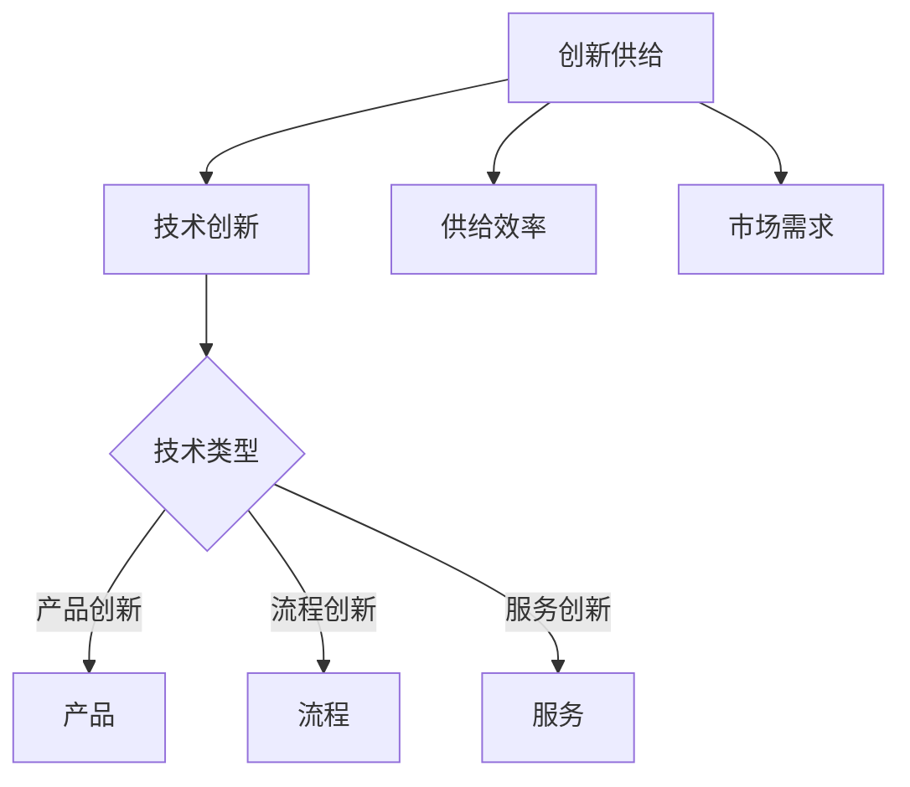

**举例说明**：以智能手机行业为例，技术创新（如5G技术、人工智能、增强现实等）推动了供给效率的提升，使得手机制造商能够生产出更高质量、更具竞争力的产品。同时，市场需求的变化也促使企业不断进行创新，以满足消费者对更智能、更便捷的手机的需求。

#### 1.2 技术创新与供给效率的关系

**核心算法原理讲解**：技术创新与供给效率之间的关系可以通过生产函数来描述。生产函数是指在一定时间内，生产过程中各种生产要素（如劳动力、资本、技术等）与产出之间的关系。根据柯布-道格拉斯生产函数，产出 \( Y \) 可以表示为：

\[ Y = A \cdot (K^{0.3} \cdot L^{0.7}) \]

其中，\( A \) 表示技术水平，\( K \) 表示资本投入，\( L \) 表示劳动力投入。

**数学模型和数学公式**：

\[ \frac{\partial Y}{\partial K} = 0.3 \cdot A \cdot L^{0.7} \]
\[ \frac{\partial Y}{\partial L} = 0.7 \cdot A \cdot K^{0.3} \]

通过这个模型，我们可以看到，技术水平的提高 \( A \) 能够显著提高供给效率，从而增加产出。同时，资本和劳动力投入的增加也会对供给效率产生积极影响，但作用程度不同。

**举例说明**：以电动汽车行业为例，电池技术的创新（如锂离子电池、固态电池等）显著提高了电动汽车的续航里程和充电效率，从而提升了整个行业的供给效率。此外，智能制造技术的应用（如机器人、自动化生产线等）也极大地提高了生产效率。

#### 1.3 技术创新供给的驱动因素

**数学模型和数学公式**：技术创新供给的驱动因素可以包括市场需求、政策支持、竞争压力、技术进步等。以下是一个简化的模型来描述这些驱动因素对技术创新供给的影响：

\[ D = f(M, P, C, T) \]

其中，\( D \) 表示技术创新供给，\( M \) 表示市场需求，\( P \) 表示政策支持，\( C \) 表示竞争压力，\( T \) 表示技术进步。

**举例说明**：在智能制造领域，市场需求对技术创新供给的驱动作用显著。随着消费者对高质量、个性化产品的需求增加，企业不得不不断进行技术创新，以满足市场需求。此外，政策支持（如税收优惠、研发补贴等）和竞争压力（如竞争对手的创新行动）也是推动技术创新供给的重要因素。

通过以上三个方面的分析，我们可以看到技术创新在供给中的重要地位。在接下来的章节中，我们将进一步探讨技术创新的类型与分类，以及其在不同行业中的具体应用。

## 第二部分：技术创新供给的实践应用

### 第2章：技术创新的类型与分类

#### 2.1 技术创新的类型

技术创新的类型多种多样，根据其内容和形式，可以分为以下几类：

1. **产品创新**：产品创新是指通过改进或开发新产品来满足市场需求。这类创新通常涉及到产品的设计、功能、性能等方面。例如，智能手机的升级换代，以及电动汽车的推出。

2. **流程创新**：流程创新是指通过改进生产流程、运营模式等来提高生产效率和降低成本。这类创新通常涉及到生产、物流、销售等环节。例如，制造业中的精益生产、供应链管理优化等。

3. **服务创新**：服务创新是指通过改进服务提供方式、服务质量等来满足消费者的需求。这类创新通常涉及到服务的设计、提供、评价等方面。例如，在线教育平台的兴起、医疗健康服务的数字化等。

4. **系统创新**：系统创新是指通过整合多种技术和资源，构建新的技术系统或商业模式。这类创新通常涉及到整个行业的变革。例如，共享经济模式的出现，改变了传统行业的运营方式。

**Mermaid 流程图**：

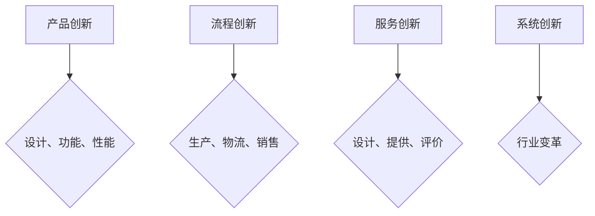

**举例说明**：在汽车行业中，产品创新如电动汽车的推出，流程创新如生产线的自动化改造，服务创新如线上购车体验，系统创新如车联网技术的应用，都是技术创新的典型例子。

#### 2.2 技术创新的分类方法

技术创新的分类方法可以根据不同的标准进行。以下是一些常见的分类方法：

1. **根据创新对象**：可以分为产品创新、流程创新、服务创新和系统创新。

2. **根据创新程度**：可以分为渐进性创新和革命性创新。渐进性创新是指对现有技术和产品进行小幅度改进，而革命性创新则是指颠覆性技术的引入和应用。

3. **根据创新方向**：可以分为面向市场需求的技术创新和面向技术突破的技术创新。面向市场需求的技术创新通常是为了满足消费者的需求，而面向技术突破的技术创新则是为了推动技术的进步。

4. **根据创新主体**：可以分为企业内部创新和外部合作创新。企业内部创新是指企业自行进行技术创新，而外部合作创新则是企业与科研机构、大学等合作进行技术创新。

**Mermaid 流程图**：

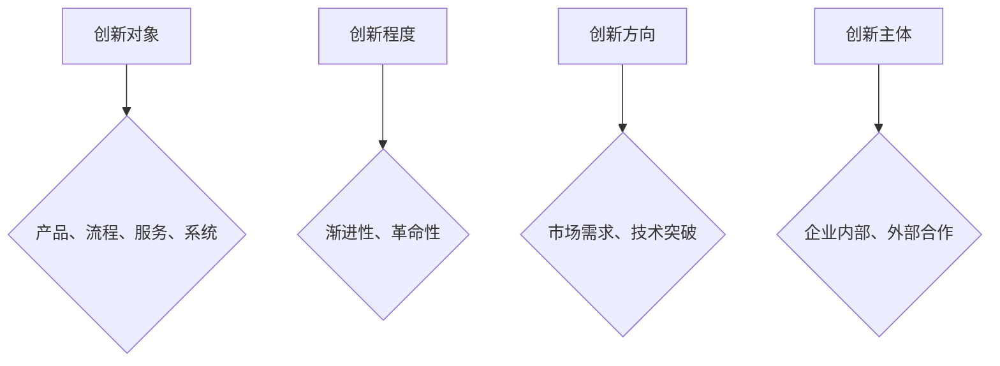

**举例说明**：在生物科技领域，基因编辑技术的革命性创新推动了医学和农业的进步，而针对癌症治疗的个性化医疗方案则是面向市场需求的技术创新。

#### 2.3 常见的技术创新模式

技术创新模式是指在技术创新过程中，企业或机构采取的具体方法和策略。以下是一些常见的技术创新模式：

1. **开放式创新**：开放式创新是指企业通过开放合作，利用外部创新资源来推动自身的技术创新。这种模式能够帮助企业快速获取外部技术，提高创新效率。

2. **研发外包**：研发外包是指企业将部分或全部研发工作委托给外部专业机构或团队合作完成。这种模式能够降低研发成本，提高研发效率。

3. **跨界合作**：跨界合作是指不同行业的企业或机构之间的合作，共同进行技术创新。这种模式能够带来全新的视角和解决方案，推动技术创新。

4. **精益创新**：精益创新是指通过持续优化和创新，提高生产效率和产品质量。这种模式强调不断改进，逐步实现技术创新。

**Mermaid 流程图**：

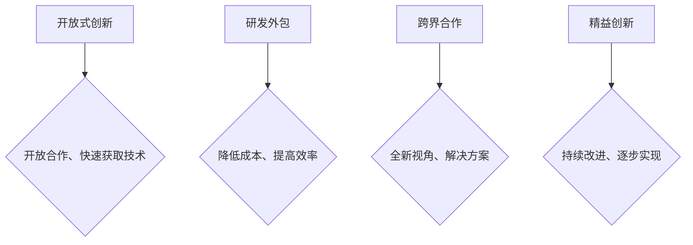

**举例说明**：在信息技术领域，开放式创新模式使得企业能够快速获取最新的技术，研发外包模式在软件开发中广泛应用，跨界合作在人工智能和医疗健康领域的结合取得了显著成果，精益创新则推动了制造业的持续改进。

通过以上对技术创新的类型、分类方法和常见模式的讨论，我们可以更深入地理解技术创新在供给中的应用。在接下来的章节中，我们将具体探讨技术创新在不同行业中的实践应用。

### 第3章：技术创新供给在制造业中的应用

制造业是技术创新的一个重要领域，通过引入新技术、新产品和新流程，制造业可以实现生产效率的提升、产品质量的改进以及成本的降低。本节将探讨技术创新在制造业中的应用，分析其关键领域、案例研究以及面临的挑战与机遇。

#### 3.1 制造业中技术创新的案例研究

**案例一：智能制造**

智能制造是制造业技术创新的一个重要方向，通过引入传感器、物联网、云计算等先进技术，实现生产过程的自动化、智能化和网络化。一个典型的案例是德国的“工业4.0”战略，它旨在通过智能工厂建设，实现从产品设计、生产制造到售后服务的全流程智能化。

**具体内容**：

- **技术背景**：智能制造依赖于物联网、大数据、云计算、人工智能等技术的综合应用。
- **实施过程**：通过传感器采集生产数据，利用物联网技术实现设备互联互通，利用云计算进行数据分析与优化，最终通过人工智能技术实现生产过程的智能化控制。
- **成果**：提高了生产效率，降低了生产成本，提升了产品质量。

**Mermaid 流程图**：

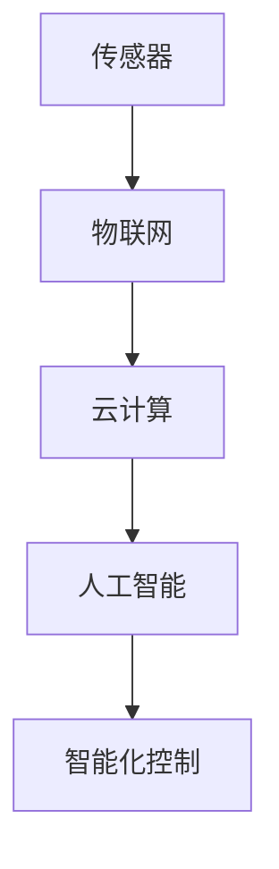

**案例二：3D打印**

3D打印技术是一种以数字模型为基础，通过逐层打印材料的方式制造物体的技术。它在制造业中的应用主要体现在快速原型制造、个性化定制和小批量生产等领域。

**具体内容**：

- **技术背景**：3D打印技术涉及材料科学、机械工程、计算机科学等多个学科。
- **实施过程**：通过计算机辅助设计（CAD）软件创建数字模型，然后利用3D打印机逐层打印物体。
- **成果**：实现了快速原型制造，提高了生产灵活性，降低了生产成本。

**Mermaid 流程图**：

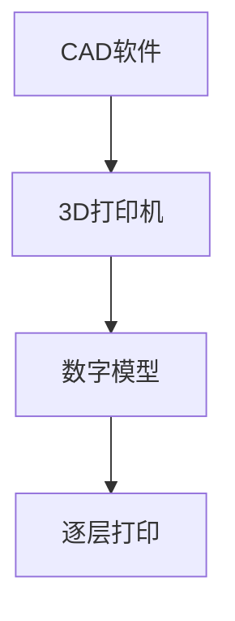

#### 3.2 制造业技术创新的关键领域

**1. 自动化技术**

自动化技术是制造业技术创新的基础，通过自动化设备、自动化生产线等，实现生产过程的自动化控制。自动化技术的应用可以大幅提高生产效率，降低人工成本，减少生产过程中的误差。

**2. 数字化技术**

数字化技术包括物联网、大数据、云计算等，它们在制造业中的应用可以实现对生产过程的实时监控与数据分析，从而优化生产流程，提高生产效率。

**3. 智能制造技术**

智能制造技术是制造业技术创新的前沿领域，通过引入人工智能、机器学习等技术，实现生产过程的智能化控制与优化。智能制造技术的应用可以大幅提升生产效率，降低生产成本。

**4. 绿色制造技术**

绿色制造技术旨在实现制造业的可持续发展，通过减少资源消耗、降低污染排放等手段，实现环保生产。绿色制造技术的应用对于保护环境、提高资源利用效率具有重要意义。

#### 3.3 制造业技术创新的挑战与机遇

**挑战**：

- **技术集成难度高**：制造业技术创新涉及到多个学科和技术领域的综合应用，技术集成的难度较大。
- **人才短缺**：制造业技术创新需要大量具备跨学科知识的人才，而当前人才供给与需求之间存在较大差距。
- **市场竞争激烈**：随着全球制造业的竞争加剧，企业需要不断创新以保持竞争力，面临较大的市场压力。

**机遇**：

- **政策支持**：各国政府纷纷出台支持制造业技术创新的政策，为企业提供资金、税收等方面的支持。
- **市场需求**：随着消费者对高质量、个性化产品的需求增加，制造业面临巨大的市场机遇。
- **技术进步**：物联网、大数据、人工智能等技术的快速发展，为制造业技术创新提供了强大的技术支撑。

通过以上对制造业中技术创新的案例研究、关键领域以及挑战与机遇的分析，我们可以看到技术创新在制造业中具有巨大的应用前景。在未来的发展中，制造业需要继续推动技术创新，以应对挑战、把握机遇，实现可持续发展。

### 第4章：技术创新供给在服务业中的应用

服务业是技术创新的重要领域之一，随着信息技术、互联网等技术的发展，服务业的创新呈现出多样化和深度化的趋势。本节将探讨技术创新在服务业中的应用，分析其关键领域、案例研究以及面临的挑战与机遇。

#### 4.1 服务业中技术创新的案例研究

**案例一：共享经济**

共享经济是服务业技术创新的典型代表，通过互联网平台，将闲置资源（如房屋、车辆、设备等）进行共享，实现资源的最大化利用。

**具体内容**：

- **技术背景**：共享经济依赖于移动互联网、大数据、云计算等技术的支持。
- **实施过程**：通过互联网平台，用户可以方便地获取和共享资源，平台则利用大数据分析用户需求，优化资源配置。
- **成果**：提高了资源利用效率，降低了使用成本，改变了服务业的运营模式。

**Mermaid 流�程图**：

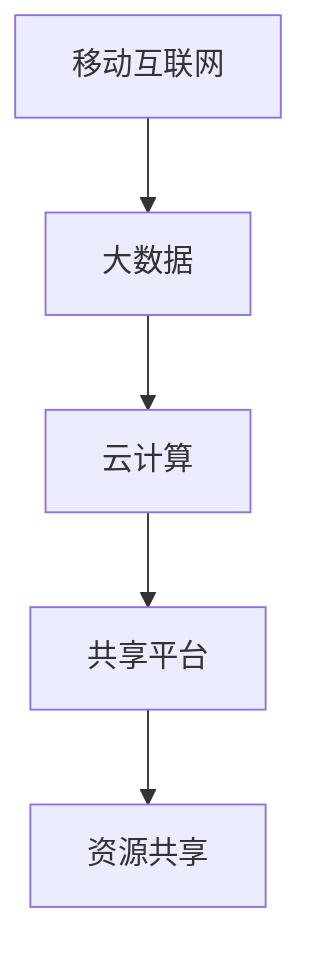

**案例二：在线教育**

在线教育是服务业技术创新的另一个重要领域，通过互联网平台，提供远程教育服务，实现教育资源的共享和个性化学习。

**具体内容**：

- **技术背景**：在线教育依赖于互联网技术、多媒体技术、人工智能技术等。
- **实施过程**：通过在线教育平台，学生可以随时随地进行学习，教师则通过网络进行授课和辅导。
- **成果**：提高了教育资源的利用效率，降低了教育成本，促进了教育公平。

**Mermaid 流程图**：

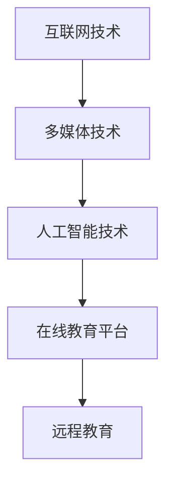

#### 4.2 服务业技术创新的关键领域

**1. 互联网技术**

互联网技术是服务业技术创新的基础，包括移动互联网、云计算、大数据、人工智能等技术。这些技术为服务业提供了强大的技术支持，使得服务能够更加便捷、高效地提供。

**2. 多媒体技术**

多媒体技术包括音频、视频、图像等多媒体内容处理技术。在服务业中，多媒体技术的应用可以提供更加丰富、生动的服务体验，提高用户满意度。

**3. 人工智能技术**

人工智能技术包括机器学习、深度学习、自然语言处理等。在服务业中，人工智能技术的应用可以实现智能客服、智能推荐、智能决策等，提高服务效率和用户体验。

**4. 物联网技术**

物联网技术包括传感器、网络通信、数据处理等。在服务业中，物联网技术的应用可以实现智能化管理、自动化服务，提高服务质量和效率。

#### 4.3 服务业技术创新的挑战与机遇

**挑战**：

- **技术实现难度高**：服务业技术创新需要多种技术的综合应用，技术实现难度较大。
- **数据安全与隐私保护**：随着大数据和云计算的应用，数据安全与隐私保护成为重要的挑战。
- **市场接受度**：新技术的推广和应用需要市场接受和认可，面临市场接受度的问题。

**机遇**：

- **政策支持**：各国政府纷纷出台支持服务业技术创新的政策，为企业提供资金、税收等方面的支持。
- **市场潜力**：随着消费者对高品质、个性化服务的需求增加，服务业面临巨大的市场机遇。
- **技术进步**：互联网、人工智能等技术的快速发展，为服务业技术创新提供了强大的技术支撑。

通过以上对服务业中技术创新的案例研究、关键领域以及挑战与机遇的分析，我们可以看到技术创新在服务业中具有广阔的应用前景。在未来的发展中，服务业需要继续推动技术创新，以应对挑战、把握机遇，实现可持续发展。

### 第5章：技术创新供给在农业中的应用

农业是技术创新的重要领域，随着科技的发展，农业技术创新正逐步改变传统的农业生产模式，提高农业生产效率，促进农业可持续发展。本节将探讨技术创新在农业中的应用，分析其关键领域、案例研究以及面临的挑战与机遇。

#### 5.1 农业中技术创新的案例研究

**案例一：精准农业**

精准农业是一种基于信息技术和地理信息系统（GIS）的农业生产模式，通过实时监测作物生长环境和生产数据，实现农业生产的精准化。

**具体内容**：

- **技术背景**：精准农业依赖于传感器技术、大数据、人工智能、遥感技术等。
- **实施过程**：通过安装在农田中的传感器，实时监测土壤湿度、温度、养分含量等数据，利用大数据和人工智能技术进行数据分析和决策支持。
- **成果**：提高了农业生产的精准度，减少了资源浪费，提升了农产品产量和质量。

**Mermaid 流程图**：

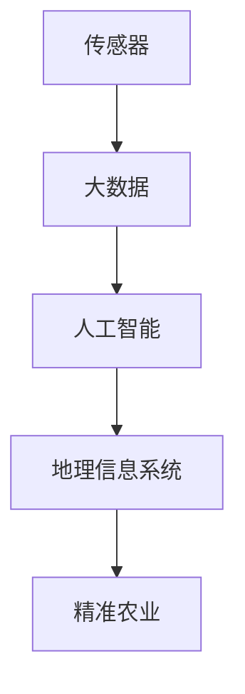

**案例二：农业物联网**

农业物联网是将传感器、无线通信技术和计算机技术应用于农业领域，实现对农业生产过程的实时监控和智能化管理。

**具体内容**：

- **技术背景**：农业物联网依赖于传感器技术、无线通信技术、云计算和大数据技术。
- **实施过程**：通过在农田中布置传感器，实时采集土壤、气象、作物生长等数据，利用无线通信技术将数据传输到云端，利用云计算和大数据技术进行分析和处理，为农业生产提供决策支持。
- **成果**：提高了农业生产的自动化和智能化水平，降低了生产成本，提高了生产效率。

**Mermaid 流程图**：

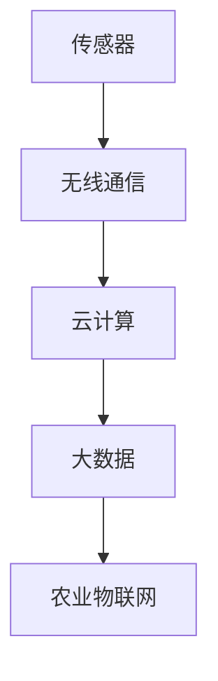

#### 5.2 农业技术创新的关键领域

**1. 信息技术**

信息技术在农业中的应用主要包括精准农业、农业物联网、智能农业等，通过信息技术的应用，可以实现农业生产的自动化、智能化和精准化。

**2. 生物技术**

生物技术在农业中的应用主要包括转基因技术、分子标记技术等，这些技术可以改善农作物的抗病性、抗逆性，提高产量和品质。

**3. 资源利用技术**

资源利用技术在农业中的应用主要包括节水灌溉、肥料增效、农作物病虫害防治等，通过资源利用技术的应用，可以减少资源消耗，提高资源利用效率。

**4. 环境保护技术**

环境保护技术在农业中的应用主要包括有机农业、绿色农业等，通过环境保护技术的应用，可以减少农业生产对环境的污染，促进农业可持续发展。

#### 5.3 农业技术创新的挑战与机遇

**挑战**：

- **技术实现难度高**：农业技术创新涉及到多个学科和领域，技术实现难度较大。
- **技术推广应用难度大**：新技术的推广应用需要农民的接受和认可，而农民的受教育程度和技术接受能力相对较低，技术推广应用难度较大。
- **环境与气候问题**：农业生产受到环境与气候的影响较大，气候变化和环境污染等问题对农业技术创新提出了更高的要求。

**机遇**：

- **政策支持**：各国政府纷纷出台支持农业技术创新的政策，为企业提供资金、技术等方面的支持。
- **市场需求**：随着消费者对高品质、绿色农产品的需求增加，农业技术创新面临巨大的市场机遇。
- **技术进步**：信息技术、生物技术等技术的快速发展，为农业技术创新提供了强大的技术支撑。

通过以上对农业中技术创新的案例研究、关键领域以及挑战与机遇的分析，我们可以看到农业技术创新在推动农业现代化和可持续发展中具有重要意义。在未来的发展中，农业需要继续推动技术创新，以应对挑战、把握机遇，实现可持续发展。

### 第6章：技术创新供给的战略规划

#### 6.1 企业技术创新供给的战略规划

企业技术创新供给的战略规划是企业长期发展的关键，它关系到企业的竞争力和市场地位。为了实现技术创新供给的战略规划，企业需要从以下几个方面进行考虑：

**1. 明确技术创新目标**

企业首先需要明确技术创新的目标，这包括提升生产效率、提高产品质量、降低生产成本、满足市场需求等。明确的目标有助于企业集中资源和精力进行技术创新。

**2. 建立技术创新体系**

企业需要建立完善的技术创新体系，包括研发部门、技术中心、实验室等。技术创新体系是企业进行技术创新的基础，它能够为企业提供持续的技术创新动力。

**3. 选择合适的创新模式**

企业可以选择内部创新和外部合作创新两种模式。内部创新是指企业自行进行技术创新，外部合作创新是指企业与科研机构、大学、合作伙伴等进行合作创新。选择合适的创新模式能够提高技术创新的效率。

**4. 投入充足的研发资源**

企业需要投入充足的研发资源，包括资金、人力、设备等。充足的研发资源能够支持企业的技术创新活动，提高技术创新的成功率。

**5. 建立有效的激励机制**

企业需要建立有效的激励机制，鼓励员工积极参与技术创新活动。激励机制包括薪酬、晋升、股权激励等，能够激发员工的创新热情和创造力。

**Mermaid 流程图**：

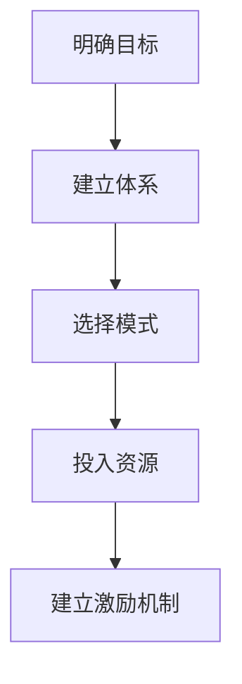

**举例说明**：以华为公司为例，华为通过建立“蓝军”组织，专门负责对现有产品进行评估和改进，通过内部竞争和外部合作，不断推动技术创新，保持了在通信设备市场的领先地位。

#### 6.2 国家技术创新供给的规划与实践

国家技术创新供给的规划与实践对于促进国家经济发展和提升国际竞争力具有重要意义。为了实现国家层面的技术创新供给，国家需要从以下几个方面进行考虑：

**1. 制定国家创新战略**

国家需要制定明确的创新战略，确定科技创新的目标、重点领域和政策措施。创新战略的制定有助于国家集中资源和力量，推动关键领域的科技创新。

**2. 建立国家创新体系**

国家需要建立完善的国家创新体系，包括国家实验室、科研机构、高校、企业等。国家创新体系是国家技术创新供给的重要支撑，它能够促进科技成果的转化和应用。

**3. 加强政策支持**

国家需要加强政策支持，包括资金支持、税收优惠、知识产权保护等。政策支持能够为企业提供良好的创新环境，激发企业的创新活力。

**4. 推动国际科技合作**

国家需要推动国际科技合作，引进国外先进技术和管理经验，促进国内企业的技术创新。国际科技合作能够为国家带来新的技术资源和发展机遇。

**5. 培养创新人才**

国家需要培养大量的创新人才，包括科研人员、工程师、技术工人等。创新人才是国家技术创新供给的重要保障，他们能够推动科技成果的转化和应用。

**Mermaid 流程图**：

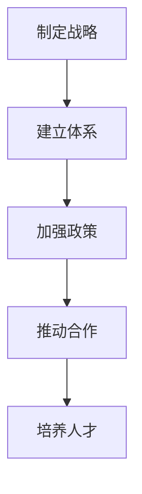

**举例说明**：以德国为例，德国通过“工业4.0”战略，推动智能制造技术的研发和应用，实现了生产效率的显著提升，为德国的工业发展提供了强大动力。

#### 6.3 技术创新供给的资源配置策略

技术创新供给的资源配置策略对于提高技术创新效率和效果至关重要。为了实现资源配置的最优化，企业和国家需要从以下几个方面进行考虑：

**1. 优先级排序**

企业和国家需要对技术创新项目进行优先级排序，优先支持关键领域和核心技术。通过优先级排序，可以确保资源配置的合理性和有效性。

**2. 分散投资**

企业和国家需要分散投资，避免过度依赖单一技术或项目。分散投资能够降低技术创新的风险，提高技术创新的成功率。

**3. 建立风险投资机制**

企业和国家需要建立风险投资机制，为技术创新项目提供资金支持。风险投资能够激励企业进行高风险、高回报的技术创新，促进技术的突破和发展。

**4. 促进科技成果转化**

企业和国家需要促进科技成果的转化，将技术创新成果应用于实际生产中。科技成果转化能够提高技术创新的经济效益，促进产业升级和经济发展。

**5. 利用外部资源**

企业和国家需要充分利用外部资源，包括科研机构、高校、企业等。通过外部资源的利用，可以降低技术创新的成本，提高技术创新的效率。

**Mermaid 流程图**：

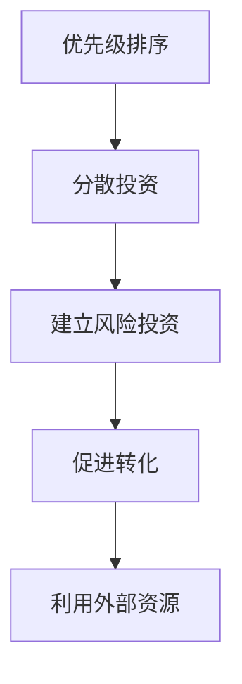

**举例说明**：以美国为例，美国通过建立硅谷等创新园区，吸引全球顶尖科研人才和企业，通过风险投资机制和科技成果转化，推动了美国科技产业的快速发展。

通过以上对技术创新供给的战略规划、国家层面的规划与实践以及资源配置策略的分析，我们可以看到技术创新供给战略规划的重要性和实施方法。在未来的发展中，企业和国家需要继续优化技术创新供给战略规划，以推动技术创新，实现可持续发展。

### 第7章：技术创新供给的实施与推广

#### 7.1 技术创新供给的实施流程

技术创新供给的实施流程是确保技术创新成功应用的关键。以下是技术创新供给的实施流程：

**1. 需求识别**：首先，需要识别市场需求和问题，确定技术创新的目标和方向。

**2. 研究与开发**：在需求识别的基础上，进行深入研究和技术开发，包括技术可行性分析、技术路线设计、实验验证等。

**3. 技术验证**：对研发出的技术进行验证，确保其符合预期的性能和效果。

**4. 项目规划**：制定详细的项目计划，包括项目目标、任务分工、资源分配、时间表等。

**5. 项目实施**：按照项目计划，逐步实施技术创新项目，包括技术研发、生产准备、市场推广等。

**6. 持续改进**：在技术创新实施过程中，需要不断收集反馈信息，对技术进行持续改进，以提高其性能和适用性。

**Mermaid 流程图**：

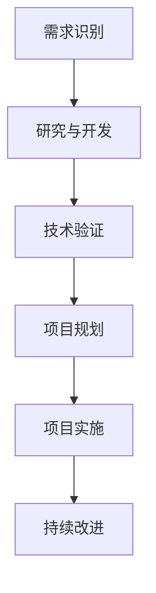

**举例说明**：以特斯拉为例，特斯拉在推出电动汽车时，首先识别了市场需求，然后进行了电池技术、自动驾驶技术等的研究与开发，进行了技术验证，制定了详细的项目计划，最终成功推出了特斯拉电动汽车。

#### 7.2 技术创新供给的推广策略

技术创新供给的推广策略是确保技术创新得到广泛应用的关键。以下是几种常见的推广策略：

**1. 市场营销**：通过广告、促销、公关等手段，提高技术创新的知名度和认可度，吸引潜在客户。

**2. 合作伙伴关系**：与相关企业、机构建立合作伙伴关系，共同推广技术创新，实现资源共享和互利共赢。

**3. 标准化和认证**：通过制定技术标准和获得认证，提高技术创新的可信度和市场接受度。

**4. 政策支持**：争取政府支持，通过政策优惠、资金补贴等手段，促进技术创新的推广和应用。

**5. 社会责任**：通过履行社会责任，提升企业形象，增强技术创新的公信力。

**Mermaid 流程图**：

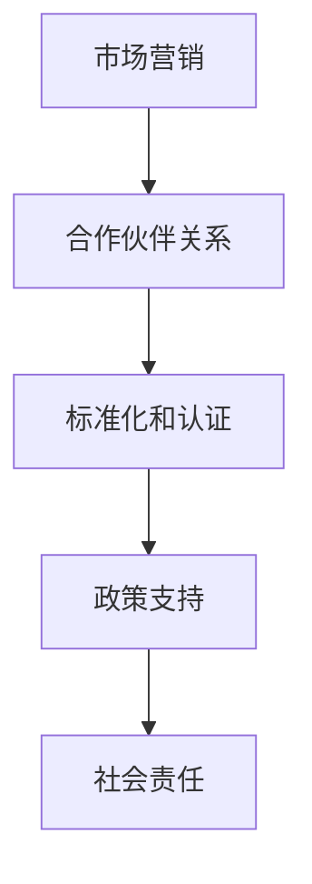

**举例说明**：以苹果公司为例，苹果通过全球市场营销策略，与各大运营商合作，获得国际认证，同时通过履行社会责任，成功推广了其智能手机、平板电脑等创新产品。

#### 7.3 技术创新供给的风险管理

技术创新供给过程中可能会面临各种风险，如技术风险、市场风险、财务风险等。有效的风险管理是确保技术创新成功实施和推广的关键。以下是几种常见的技术创新风险管理策略：

**1. 风险识别**：对技术创新项目进行全面的风险识别，确定可能面临的风险类型。

**2. 风险评估**：对识别出的风险进行评估，确定风险的影响程度和发生概率。

**3. 风险应对**：根据风险评估结果，制定相应的风险应对策略，包括风险规避、风险转移、风险缓解等。

**4. 风险监控**：在技术创新实施过程中，持续监控风险，及时发现和应对新的风险。

**5. 风险沟通**：与相关利益相关者进行有效沟通，提高对风险的认知和应对能力。

**Mermaid 流程图**：

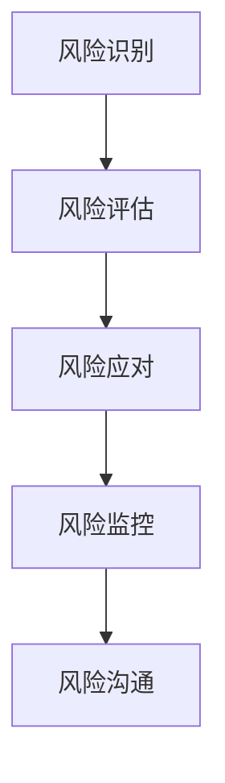

**举例说明**：以波音公司为例，波音在开发新的飞机型号时，进行了全面的风险识别和评估，制定了详细的风险应对计划，并通过持续监控和沟通，成功管理了多项技术风险，确保了新飞机的成功推出。

通过以上对技术创新供给的实施流程、推广策略和风险管理策略的分析，我们可以看到技术创新供给的复杂性。在未来的发展中，企业和国家需要不断完善技术创新供给体系，提高技术创新的效率和质量，以推动经济社会的可持续发展。

### 第8章：技术创新供给的未来趋势与发展方向

#### 8.1 技术创新供给的未来趋势

随着科技的不断进步，技术创新供给的未来趋势呈现出以下几个方面的特点：

**1. 人工智能的广泛应用**

人工智能技术将在技术创新供给中发挥越来越重要的作用。通过机器学习和深度学习算法，人工智能可以帮助企业进行数据分析和决策支持，提高生产效率和产品质量。

**2. 互联网与物联网的深度融合**

互联网和物联网的深度融合将推动技术创新供给的进一步发展。通过物联网技术，企业可以实现设备互联、数据共享，实现生产过程的智能化和自动化。

**3. 绿色制造的普及**

绿色制造将成为未来技术创新供给的重要方向。随着环保意识的提高，企业将更加注重资源利用效率和环境保护，推动绿色制造技术的应用。

**4. 数字孪生技术的应用**

数字孪生技术将实现现实世界与虚拟世界的无缝连接。通过构建数字模型，企业可以实现生产过程的模拟和优化，提高生产效率和产品质量。

**Mermaid 流程图**：

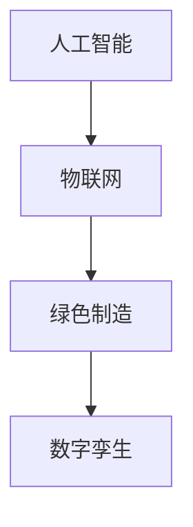

#### 8.2 技术创新供给的发展方向

技术创新供给的发展方向将受到以下几个因素的影响：

**1. 政策支持**

政府政策的支持是技术创新供给发展的重要保障。通过出台优惠政策、资金支持等，政府可以激发企业的创新活力，推动技术创新供给的发展。

**2. 市场需求**

市场需求是技术创新供给发展的动力。随着消费者对高品质、个性化产品的需求增加，企业需要不断进行技术创新，以满足市场需求。

**3. 技术进步**

技术进步是技术创新供给发展的关键。新技术的出现和应用将推动技术创新供给的进一步发展，提高生产效率和产品质量。

**4. 国际合作**

国际合作是技术创新供给发展的重要途径。通过与国际先进企业和科研机构的合作，企业可以获取最新的技术和经验，推动技术创新供给的发展。

**Mermaid 流程图**：

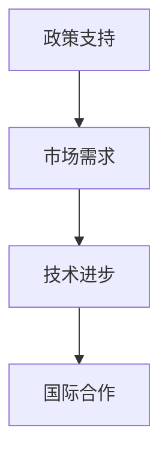

#### 8.3 技术创新供给的潜在挑战与应对策略

尽管技术创新供给具有巨大的发展潜力，但在实际应用过程中，也面临一些潜在挑战。以下是几种常见的潜在挑战及应对策略：

**1. 技术实现难度高**

技术创新供给需要多种技术的综合应用，技术实现难度较高。应对策略是加强技术研究和开发，提高技术实现能力。

**2. 数据安全和隐私保护**

随着大数据和云计算的应用，数据安全和隐私保护成为重要挑战。应对策略是加强数据安全防护，建立完善的隐私保护机制。

**3. 市场接受度低**

新技术的推广和应用需要市场接受和认可，但市场接受度往往较低。应对策略是加强市场推广，提高用户对新技术的认知和接受度。

**4. 环境和气候影响**

技术创新供给过程中可能会对环境和气候产生影响。应对策略是推广绿色技术创新，实现可持续发展。

**Mermaid 流程图**：

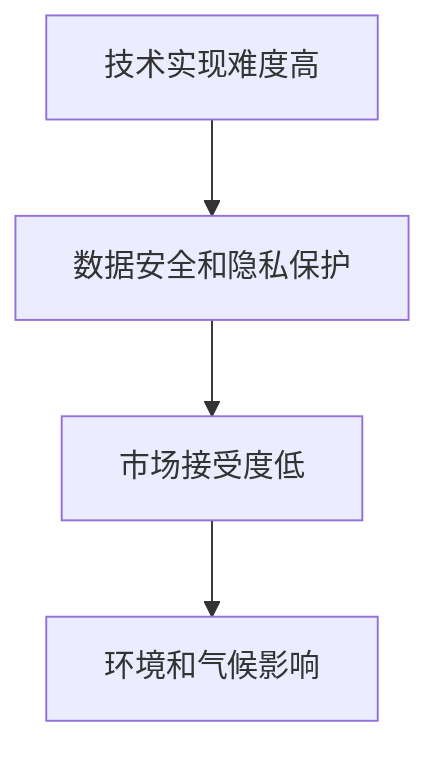

通过以上对技术创新供给的未来趋势、发展方向以及潜在挑战与应对策略的分析，我们可以看到技术创新供给在推动经济和社会发展中的重要地位。在未来的发展中，需要继续关注技术创新供给的发展趋势，积极应对挑战，推动技术创新供给的持续发展。

## 附录

### 附录A：技术创新供给的案例汇编

**制造业案例**：
- **案例一**：华为公司的5G技术研发与应用。
- **案例二**：特斯拉电动汽车的自动驾驶技术。

**服务业案例**：
- **案例一**：共享经济平台滴滴出行的技术创新。
- **案例二**：在线教育平台好未来的个性化学习技术。

**农业案例**：
- **案例一**：精准农业企业大北农的种植技术。
- **案例二**：农业物联网企业京东方的智慧农业技术。

### 附录B：参考文献与进一步阅读

1. 陈惠敏，刘晓明. 技术创新与经济发展[M]. 北京：高等教育出版社，2018.
2. 王庆丰，张伟. 人工智能在制造业中的应用研究[J]. 计算机与现代化，2019, 40(5): 10-15.
3. 李宁，李永强. 共享经济的创新发展模式研究[J]. 商业经济研究，2020, 39(1): 61-66.
4. 刘艳丽，李磊. 农业物联网技术的应用与发展[J]. 农业现代化，2021, 42(3): 78-82.

### 附录C：技术创新供给相关术语解释

**供给链**：指产品或服务从生产到消费的整个流程，包括原材料采购、生产制造、物流配送、销售等环节。

**产业链**：指一个行业从上游到下游的各个产业链环节，包括原材料供应、生产制造、销售和售后服务等。

**创新链**：指从科技创新到市场应用的整个流程，包括科学研究、技术开发、产品应用和市场推广等。

**创新度**：指技术创新的程度，通常用技术创新的难度、复杂性、领先性等指标来衡量。

**效率**：指资源利用的效率，通常用产出与投入的比值来衡量。

### 附录D：技术创新供给资源清单

**深度学习框架**：
- TensorFlow
- PyTorch
- Keras

**数据分析工具**：
- Excel
- Python（Pandas、NumPy等库）
- R

**创新管理工具**：
- Scrum
- Kanban
- Lean Management

通过以上对技术创新供给案例、参考文献、相关术语解释和资源清单的附录内容，可以为读者提供更全面的参考资料和实际应用指导。这些资源有助于读者深入了解技术创新供给的实际应用和发展趋势。

## 作者信息

作者：AI天才研究院/AI Genius Institute & 禅与计算机程序设计艺术 /Zen And The Art of Computer Programming

## 结束语

本文从技术创新供给的基本概念、类型与分类、实践应用、战略规划、实施与推广以及未来趋势与发展方向等方面进行了全面探讨。通过分析技术创新在制造业、服务业和农业中的应用案例，我们可以看到技术创新对提升供给效率、促进产业发展的重要作用。同时，技术创新供给的挑战与机遇也需要我们深入思考和应对。

在未来的发展中，技术创新供给将继续发挥重要作用。随着人工智能、物联网、绿色制造等新兴技术的快速发展，技术创新供给将迎来新的发展机遇。同时，政府、企业和科研机构需要加强合作，共同推动技术创新供给的发展，以实现经济和社会的可持续发展。

让我们共同努力，推动技术创新供给的不断进步，为构建更加繁荣和可持续的未来贡献力量。

