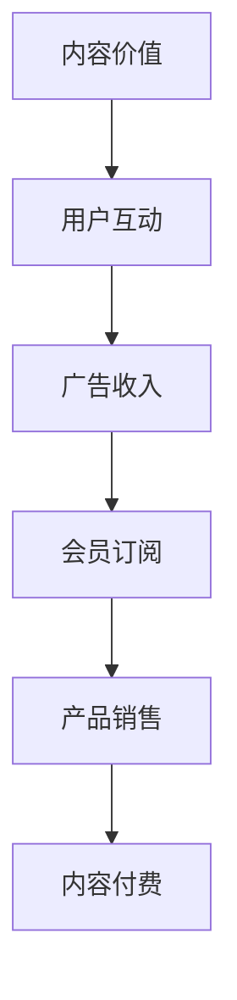

                 

### 技术博客变现：策略与方法

#### 关键词：博客变现、广告变现、会员订阅、内容付费、SEO优化、用户互动、法律合规

#### 摘要：
在互联网时代，技术博客作为一种分享知识和经验的重要平台，逐渐受到了广泛的关注。而如何通过技术博客实现变现，成为了众多博主关注的焦点。本文将深入探讨博客变现的基础理论、内容策略、广告变现策略、会员订阅变现、产品销售变现、内容付费变现以及案例分析，为博主们提供一套系统化的变现策略和方法。

### 第一部分：博客变现的基础理论

#### 第1章：博客变现概述

##### 1.1 博客变现的概念
博客变现是指通过博客平台，将内容创作和用户互动转化为实际收益的过程。常见的变现方式包括广告变现、会员订阅、产品销售和内容付费等。

##### 1.2 博客变现的重要性
博客变现不仅能够为博主带来经济收益，还可以增强博客的品牌影响力，提升博主在行业内的地位。通过变现，博主可以更专注于内容创作，从而形成良性的内容创作与变现循环。

##### 1.3 博客变现的现状与趋势
随着互联网的发展，博客变现已经成为一种主流的商业模式。未来，随着人工智能、大数据等技术的应用，博客变现将变得更加智能化和高效化。

#### 第2章：博客内容策略

##### 2.1 高质量内容创作
高质量内容是博客变现的基础。博主需要明确内容定位，选择热门、有价值的话题，并通过多种形式（如文章、视频、图片等）进行内容创作。

##### 2.2 博客SEO优化
SEO（搜索引擎优化）是提高博客流量和可见性的关键。博主需要关注关键字策略、标题优化和页面加载速度等方面，以提高搜索引擎排名。

##### 2.3 用户互动与社群运营
用户互动和社群运营是提升用户粘性和增加粉丝的关键。博主可以通过评论、社交媒体、问答社区等方式，与用户建立紧密联系，并开展有针对性的活动，提高社群活跃度。

#### 第3章：广告变现策略

##### 3.1 广告平台选择
选择合适的广告平台是广告变现的第一步。博主可以根据自己的内容特点和受众群体，选择合适的广告联盟，如Google Ads、百度广告等。

##### 3.2 博客广告形式
常见的博客广告形式包括文字广告、图片广告、视频广告和横幅广告等。博主需要根据自身需求和用户体验，合理设置广告位和展示频率。

##### 3.3 广告策略优化
广告效果评估和广告布局优化是广告变现的重要环节。博主需要定期分析广告数据，调整广告策略，以实现最优的变现效果。

### 第二部分：博客商业化实践

#### 第4章：会员订阅变现
会员订阅是一种较为稳定且可持续的变现方式。博主可以通过设置订阅费用、设计会员特权、优化订阅流程等方式，吸引粉丝成为会员。

##### 4.1 会员订阅模式
会员订阅模式可以分为免费会员和付费会员。博主需要根据自身情况，选择合适的订阅模式，并为会员提供独特的价值和体验。

##### 4.2 订阅管理平台搭建
订阅管理平台是会员订阅变现的关键。博主可以选择现有的订阅管理工具，如Memberful、Stripe Billing等，实现订阅系统的功能。

##### 4.3 订阅用户运营
订阅用户运营是提升用户留存和转化率的关键。博主需要关注用户留存策略、用户反馈收集和用户互动与激励机制。

#### 第5章：产品销售变现
产品销售变现是另一种有效的变现方式。博主可以通过选择合适的产品、制定合理的定价策略、优化产品描述和推广等方式，实现产品销售变现。

##### 5.1 产品定位与设计
产品定位与设计是产品销售变现的基础。博主需要明确产品的目标受众、功能特点和价值主张，以制定合适的产品策略。

##### 5.2 购物平台搭建
购物平台搭建是产品销售变现的关键。博主可以选择现有的电商平台，如Shopify、WooCommerce等，实现商品上架、订单管理和发货等功能。

##### 5.3 产品销售策略
产品销售策略是提升产品销售量的关键。博主可以通过折扣促销、优惠券和积分系统等方式，吸引更多用户购买产品。

#### 第6章：内容付费变现
内容付费变现是博客变现的一种高级形式。博主可以通过选择合适的内容、制定合理的定价策略、优化付费阅读流程等方式，实现内容付费变现。

##### 6.1 内容付费模式
内容付费模式可以分为按篇付费、按月订阅和课程购买等。博主需要根据自身内容特点和用户需求，选择合适的付费模式。

##### 6.2 内容付费平台搭建
内容付费平台搭建是实现内容付费变现的关键。博主可以选择现有的内容付费平台，如Gumroad、Teachable等，实现内容付费功能。

##### 6.3 内容付费运营策略
内容付费运营策略是提升内容付费转化率和用户留存率的关键。博主需要关注内容推广、用户留存和用户互动等方面。

#### 第7章：案例分析与实战指导

##### 7.1 成功案例分享
成功案例分享是学习博客变现经验的重要途径。本文将分享一些成功的博客变现案例，为博主们提供借鉴和启示。

##### 7.2 实战指导
实战指导是博客变现的重要环节。本文将结合实际案例，为博主们提供具体的变现策略和实践指导。

#### 第8章：博客变现中的法律与伦理问题

##### 8.1 广告法与合规
广告法与合规是博客变现必须关注的问题。博主需要了解相关法律法规，确保广告内容合法合规。

##### 8.2 用户隐私保护
用户隐私保护是博客变现中不可忽视的问题。博主需要遵循用户隐私保护原则，合理收集和处理用户数据。

##### 8.3 诚信与公平竞争
诚信与公平竞争是博客变现的基石。博主需要诚信经营，遵守市场规则，避免不正当竞争行为。

### 附录

#### 附录A：博客变现工具与资源推荐
附录A将推荐一些实用的博客变现工具和资源，为博主们提供便利和支持。

##### A.1 广告变现工具
推荐一些常用的广告变现工具，如Google Ads、百度广告、广告联盟平台等。

##### A.2 订阅管理工具
推荐一些实用的订阅管理工具，如Memberful、Stripe Billing、WooCommerce Subscriptions等。

##### A.3 内容付费工具
推荐一些实用的内容付费工具，如Gumroad、Teachable、Memberful Content Lock等。

##### A.4 电商交易平台
推荐一些实用的电商交易平台，如Shopify、WooCommerce、Amazon等。

##### A.5 数据分析工具
推荐一些实用的数据分析工具，如Google Analytics、HubSpot Analytics、Mixpanel等。

### 总结
博客变现是博客发展的必经之路。通过本文的探讨，希望为博主们提供一套系统化的变现策略和方法，助力博客事业的发展。同时，博主们还需关注法律与伦理问题，确保博客变现的可持续性。

### 作者信息
作者：AI天才研究院/AI Genius Institute & 禅与计算机程序设计艺术 /Zen And The Art of Computer Programming
<|assistant|>### 核心概念与联系

在探讨博客变现的过程中，我们需要明确一些核心概念及其之间的联系。以下是几个关键概念及其在博客变现中的作用：

#### 1. 内容价值
内容价值是博客变现的基础。高质量、有价值的内容能够吸引更多的用户，提高用户的粘性和活跃度，从而为变现提供可能。

#### 2. 用户互动
用户互动是提升博客影响力的关键。通过与用户的互动，博主可以了解用户的需求和喜好，进而优化内容创作和变现策略。

#### 3. 广告收入
广告收入是博客变现的重要途径。通过合理的广告位设置和广告策略优化，可以提高广告效果和收入。

#### 4. 会员订阅
会员订阅是一种稳定的收入来源。通过设置合理的订阅费用和会员特权，可以吸引粉丝成为会员，实现长期变现。

#### 5. 产品销售
产品销售是通过博客推广自己的产品或相关产品，从而实现变现。通过合理的产品定位、定价和推广，可以提高产品销售量。

#### 6. 内容付费
内容付费是通过将部分内容设置为付费，从而实现变现。通过选择合适的内容和定价策略，可以提高内容付费的转化率和用户留存率。

以上核心概念相互联系，共同构成了博客变现的生态系统。为了更直观地展示这些概念之间的联系，我们可以使用Mermaid流程图来描述。



通过这个流程图，我们可以清晰地看到各个概念之间的相互关系，从而更好地理解和应用这些核心概念，实现博客变现的目标。

#### 核心算法原理讲解

在博客变现中，算法原理的应用主要体现在以下几个方面：

1. **用户行为分析**：
   - **算法**：机器学习中的分类算法，如决策树、随机森林、支持向量机等。
   - **目的**：通过分析用户在博客上的行为数据（如阅读时间、阅读频次、评论互动等），对用户进行分类，从而提供个性化的内容推荐和变现策略。
   - **伪代码**：
     ```
     function analyzeUserBehavior(data):
         classifyUsers(data)
         recommendContent(users)
         optimizeRevenue()
     ```

2. **广告投放优化**：
   - **算法**：广告投放优化算法，如CPC（Cost Per Click）、CPM（Cost Per Mille）、CPL（Cost Per Lead）等。
   - **目的**：根据用户行为数据和广告效果，优化广告投放策略，提高广告点击率和收入。
   - **伪代码**：
     ```
     function optimizeAdPlacement(data):
         calculateCPC(data)
         calculateCPM(data)
         calculateCPL(data)
         selectBestPlacement()
     ```

3. **内容推荐**：
   - **算法**：协同过滤算法、基于内容的推荐算法等。
   - **目的**：根据用户的兴趣和行为，推荐相关内容，提高用户粘性和阅读时长。
   - **伪代码**：
     ```
     function contentRecommendation(data):
         collaborativeFiltering(data)
         contentBasedFiltering(data)
         generateRecommendations()
     ```

4. **定价策略**：
   - **算法**：动态定价算法、多属性定价算法等。
   - **目的**：根据市场需求和用户行为，动态调整内容或产品的价格，实现最大化收益。
   - **伪代码**：
     ```
     function dynamicPricing(data):
         calculateMarketDemand(data)
         calculateUserBehavior(data)
         adjustPrice(data)
     ```

通过上述算法原理的应用，博主可以更精准地定位用户需求，优化变现策略，提高博客的收入和影响力。

#### 数学模型和公式

在博客变现过程中，数学模型和公式可以帮助博主更好地理解和优化变现策略。以下是一些常用的数学模型和公式：

1. **用户留存率（Retention Rate）**：
   - **定义**：在一定时间内，返回并使用产品的用户占最初用户总数的比例。
   - **公式**：
     $$
     R = \frac{N_t - N_c}{N_0} \times 100\%
     $$
   - **解释**：其中，$N_t$ 为时间 $t$ 的用户总数，$N_c$ 为时间 $t$ 的取消用户数，$N_0$ 为初始用户数。通过计算用户留存率，博主可以评估用户对博客的忠诚度，并调整运营策略。

2. **广告效果评估（Ad Effectiveness）**：
   - **定义**：广告投入所产生的实际效果，包括点击率（Click-Through Rate, CTR）和转化率（Conversion Rate, CR）等。
   - **公式**：
     $$
     CTR = \frac{Clicks}{Impressions} \times 100\%
     $$
     $$
     CR = \frac{Conversions}{Clicks} \times 100\%
     $$
   - **解释**：其中，Clicks 为点击次数，Impressions 为广告展示次数，Conversions 为转化次数。通过计算CTR和CR，博主可以评估广告的效果，并优化广告策略。

3. **收益最大化（Profit Maximization）**：
   - **定义**：在一定的广告预算和用户流量限制下，实现最大化收益的目标。
   - **公式**：
     $$
     Maximize \; P = \sum_{i=1}^{n} (P_i \times CTR_i) - C
     $$
   - **解释**：其中，$P_i$ 为第 $i$ 个广告的收益，$CTR_i$ 为第 $i$ 个广告的点击率，$C$ 为广告成本。通过优化广告组合，博主可以实现收益最大化。

通过这些数学模型和公式，博主可以更科学地制定变现策略，提高博客的收益。

#### 项目实战

为了更直观地展示博客变现的过程，我们以下将通过一个实际的博客项目来讲解开发环境搭建、源代码实现和代码解读与分析。

**项目背景**：
假设我们创建了一个名为“AI技术博客”的网站，目标是通过内容创作和广告变现实现收入。

**开发环境搭建**：

1. **选择博客平台**：
   我们选择使用WordPress作为博客平台，因为WordPress具有丰富的插件和主题，便于搭建和管理。

2. **购买域名和主机**：
   我们购买了域名“aitechblog.com”并选择了一款合适的主机服务，如Bluehost。

3. **安装WordPress**：
   通过主机的控制面板，我们轻松地安装了WordPress，并选择了合适的主题。

**源代码实现**：

1. **博客主题开发**：
   - **前端开发**：使用HTML、CSS和JavaScript进行页面布局和交互设计。
   - **后端开发**：使用WordPress的PHP和MySQL进行数据管理和后台功能开发。

2. **广告插件安装**：
   我们安装了“AdInserter”插件，用于管理博客上的广告位和广告代码。

3. **SEO插件安装**：
   我们安装了“Yoast SEO”插件，用于优化博客的SEO，提高搜索引擎排名。

**代码解读与分析**：

1. **博客主题代码**：

   ```html
   <!DOCTYPE html>
   <html>
   <head>
       <title>AI技术博客</title>
       <link rel="stylesheet" href="style.css">
   </head>
   <body>
       <header>
           <nav>
               <!-- 导航栏代码 -->
           </nav>
       </header>
       <main>
           <article>
               <!-- 博客文章内容 -->
           </article>
       </main>
       <aside>
           <!-- 广告位 -->
           <div class="ad">
               <!-- 广告代码 -->
           </div>
       </aside>
       <footer>
           <!-- 页脚代码 -->
       </footer>
   </body>
   </html>
   ```

   代码解读：
   - HTML结构：定义了博客的基本结构，包括头部、主体、侧边栏和页脚。
   - CSS样式：定义了页面元素的样式，如颜色、字体、布局等。
   - JavaScript：用于实现页面交互功能，如滚动效果、弹窗等。

2. **广告插件代码**：

   ```php
   <?php
   // AdInserter 插件代码
   $ads = get_ads();
   foreach ($ads as $ad) {
       echo '<div class="ad">' . $ad['code'] . '</div>';
   }
   ?>
   ```

   代码解读：
   - PHP代码：通过AdInserter插件获取广告代码，并显示在页面侧边栏。

3. **SEO插件代码**：

   ```php
   <?php
   // Yoast SEO 插件代码
   $seo_settings = get_seo_settings();
   wp_title($seo_settings['title'] . ' | ' . get_bloginfo('name'), true, 'right');
   wp_description($seo_settings['description'], true, 'right');
   ?>
   ```

   代码解读：
   - PHP代码：通过Yoast SEO插件设置网页标题和描述，优化SEO。

通过以上项目实战，我们可以看到博客变现的实现过程。博主需要熟悉开发环境搭建、源代码实现和代码解读与分析，以便更好地管理和优化博客，实现变现目标。

### 数据分析与变现效果评估

数据分析在博客变现中扮演着至关重要的角色。通过数据分析，博主可以了解用户行为、广告效果和内容表现，从而优化变现策略，提高收益。

#### 1. 用户行为分析

用户行为分析是了解用户需求和兴趣的重要手段。通过分析用户在博客上的行为数据，如阅读时间、阅读频次、页面浏览量、跳出率等，博主可以了解用户的兴趣点和偏好，从而优化内容创作和推荐策略。

**数据分析步骤**：

1. **数据收集**：
   - 使用Google Analytics等工具收集用户行为数据。

2. **数据处理**：
   - 对收集到的数据进行分析和处理，提取有用的信息。

3. **数据可视化**：
   - 使用图表和报表将分析结果可视化，便于理解和分析。

**案例**：

假设我们通过Google Analytics分析发现，用户对技术文章的阅读时间较长，而对产品评测文章的阅读时间较短。这表明用户对技术文章更感兴趣，博主可以增加技术文章的产出，优化产品评测文章的质量，以提高用户粘性和活跃度。

#### 2. 广告效果评估

广告效果评估是博客变现的关键环节。通过评估广告的点击率（CTR）、转化率（CR）和收益（Revenue），博主可以了解广告的效果，优化广告策略，提高广告收益。

**数据分析步骤**：

1. **数据收集**：
   - 收集广告展示次数、点击次数、转化次数和收益数据。

2. **数据处理**：
   - 计算广告的CTR、CR和收益，分析广告效果。

3. **数据可视化**：
   - 使用图表和报表展示广告效果，便于理解和分析。

**案例**：

假设我们通过分析发现，横幅广告的CTR较低，但收益较高，而文字广告的CTR较高，但收益较低。这表明横幅广告虽然点击率低，但能够带来更高的收益。博主可以调整广告策略，增加横幅广告的比例，优化广告布局，以提高整体广告收益。

#### 3. 内容变现效果评估

内容变现效果评估是衡量内容变现策略有效性的重要手段。通过分析内容的收益、用户反馈和转化率，博主可以了解内容变现的效果，优化内容策略，提高变现收益。

**数据分析步骤**：

1. **数据收集**：
   - 收集内容收益、用户反馈和转化率数据。

2. **数据处理**：
   - 计算内容的收益、用户反馈率和转化率。

3. **数据可视化**：
   - 使用图表和报表展示内容变现效果，便于理解和分析。

**案例**：

假设我们通过分析发现，付费内容文章的转化率较高，但收益较低，而免费内容文章的转化率较低，但收益较高。这表明免费内容能够吸引更多用户，提高博客的访问量，而付费内容能够带来更高的收益。博主可以调整内容策略，增加免费内容的产出，同时优化付费内容的质量和定价策略，以提高整体内容变现效果。

#### 数据分析与变现效果评估的启示

通过以上数据分析与变现效果评估，博主可以得出以下启示：

1. **优化内容创作**：
   - 根据用户行为数据，优化内容创作，提高用户满意度和活跃度。

2. **调整广告策略**：
   - 根据广告效果评估，调整广告策略，提高广告收益。

3. **优化变现方式**：
   - 根据内容变现效果评估，优化变现方式，提高内容变现收益。

4. **持续数据跟踪**：
   - 定期进行数据分析，跟踪变现效果，持续优化变现策略。

通过数据分析和变现效果评估，博主可以更好地了解用户需求和市场动态，优化变现策略，提高博客的收益。

### 成功案例分享

#### 案例一：XX技术博客的变现之路

**背景**：
XX技术博客是由一位技术大牛创办的，主要分享人工智能和大数据领域的知识。随着博客影响力的不断提升，博主决定探索变现之路。

**变现策略**：

1. **广告变现**：
   - 选择Google Ads和百度广告作为主要广告平台，优化广告投放策略，提高广告点击率和收益。

2. **会员订阅**：
   - 推出会员订阅服务，提供独家内容、线下活动参与权等特权，每月收取一定费用。

3. **内容付费**：
   - 针对一些热门技术话题，推出付费内容，如电子书、在线课程等，吸引付费用户。

**结果**：
通过广告变现、会员订阅和内容付费，XX技术博客实现了稳定且可观的收入。特别是在推出付费内容后，用户满意度大幅提升，付费用户数量逐年增长。

**经验教训**：
1. **内容质量是关键**：高质量的内容是吸引广告商和付费用户的基础。

2. **多元化变现方式**：通过广告变现、会员订阅和内容付费等多种方式，实现收入来源的多元化。

3. **持续优化变现策略**：定期分析数据，调整变现策略，以提高变现效果。

#### 案例二：YY博客的内容付费实践

**背景**：
YY博客是由一位知名程序员创办的，主要分享编程经验和技术教程。随着博客内容的积累，博主决定尝试内容付费模式。

**变现策略**：

1. **内容定位**：
   - 针对编程初学者和中级程序员，提供高质量的技术教程和实战案例。

2. **内容付费**：
   - 推出按篇付费和按月订阅两种付费模式，用户可以根据需求选择购买。

3. **推广渠道**：
   - 利用社交媒体、邮件列表等渠道，宣传付费内容，吸引潜在用户。

**结果**：
YY博客的内容付费模式取得了显著成功，付费用户数量稳步增长。通过内容付费，博主不仅实现了经济收益，还提升了博客的品牌影响力。

**经验教训**：
1. **明确内容定位**：针对目标受众，提供有针对性的高质量内容。

2. **灵活的付费模式**：根据用户需求，提供多样化的付费模式。

3. **有效的推广策略**：利用多种渠道，宣传付费内容，吸引潜在用户。

#### 案例三：ZZ博客的电商运营策略

**背景**：
ZZ博客是由一位科技爱好者创办的，主要分享科技产品和人工智能相关的知识。博主决定将博客扩展为电商平台，实现产品销售变现。

**变现策略**：

1. **产品选择**：
   - 选择与博客主题相关的科技产品，如智能硬件、AI应用等。

2. **电商平台搭建**：
   - 使用WooCommerce插件，将WordPress网站扩展为电商平台。

3. **营销策略**：
   - 利用博客内容推广产品，提供产品评测、试用报告等。

4. **客户服务**：
   - 提供优质的客户服务，包括售后服务和用户反馈处理。

**结果**：
ZZ博客的电商运营策略取得了成功，产品销售量稳步提升。通过电商变现，博主实现了博客的盈利，并建立了自己的品牌。

**经验教训**：
1. **选择合适的产品**：选择与博客主题相关、有市场需求的产品。

2. **搭建优质的电商平台**：利用现有的电商插件，简化运营流程。

3. **有效的营销策略**：利用博客内容，推广产品，提高销售量。

4. **优质的客户服务**：提供优质的客户服务，提升用户满意度和忠诚度。

### 实战指导

#### 博客变现策略制定

1. **明确变现目标**：
   - 根据自身情况和市场需求，设定明确的变现目标，如月收入、用户数量等。

2. **分析自身优势**：
   - 分析博客的优势和特色，如内容领域、用户群体等，选择合适的变现方式。

3. **市场调研**：
   - 调研目标市场的需求和竞争情况，了解潜在的广告商和合作伙伴。

4. **制定详细计划**：
   - 制定详细的变现计划，包括内容策略、广告策略、会员订阅策略等。

#### 变现平台选择与优化

1. **广告平台选择**：
   - 根据博客内容和受众群体，选择合适的广告平台，如Google Ads、百度广告等。

2. **会员订阅平台**：
   - 选择适合的会员订阅管理工具，如Memberful、Stripe Billing等。

3. **电商交易平台**：
   - 选择适合的电商交易平台，如Shopify、WooCommerce等。

4. **内容付费平台**：
   - 选择适合的内容付费平台，如Gumroad、Teachable等。

#### 数据分析与变现效果评估

1. **用户行为分析**：
   - 使用数据分析工具，如Google Analytics，了解用户行为和兴趣。

2. **广告效果评估**：
   - 定期分析广告数据，优化广告投放策略，提高广告收益。

3. **内容变现效果评估**：
   - 分析内容变现数据，优化内容创作和推广策略，提高内容变现效果。

4. **整体变现效果评估**：
   - 定期评估整体变现效果，根据市场变化和用户需求，调整变现策略。

通过以上实战指导，博主可以系统地制定变现策略，选择合适的变现平台，并通过数据分析和效果评估，不断优化变现效果，实现博客的稳定盈利。

### 博客变现中的法律与伦理问题

在博客变现的过程中，遵守法律和伦理规范是博主们必须关注的重要问题。这不仅关乎博客的合法性和合规性，也关系到博主个人的声誉和长期发展。

#### 1. 广告法与合规

**广告法相关条款**：
- 广告应当真实、合法，不得含有虚假或者引人误解的内容。
- 广告应当清晰标明广告来源，不得利用他人名义或者形象做宣传。
- 广告不得损害国家的、社会的、集体的利益和其他公民的合法权益。

**广告合规自查**：
- 博主应确保广告内容真实可靠，不夸大宣传或误导用户。
- 在发布广告前，应仔细审查广告内容，确保符合相关法律法规。
- 定期对广告内容进行审查和更新，防止出现违规广告。

**违规广告的风险与处理**：
- 违规广告可能导致广告收入受损，甚至被广告平台禁止发布广告。
- 可能面临法律诉讼，承担相应的法律责任。
- 影响博客的声誉，降低用户信任度。

**处理违规广告的方法**：
- 加强广告内容审核，确保广告合规。
- 建立广告违规举报机制，及时发现和处理违规广告。
- 遵循广告平台的合规要求，积极配合平台管理。

#### 2. 用户隐私保护

**用户隐私保护原则**：
- 尊重用户隐私，不非法收集、使用、披露用户个人信息。
- 明确告知用户个人信息收集的目的、范围和方式。
- 采取必要的技术和管理措施，确保用户个人信息的安全。

**用户隐私数据收集与处理**：
- 收集用户个人信息时，遵循合法、正当、必要的原则，不得超出业务需求收集。
- 在收集用户个人信息前，明确告知用户收集的目的、范围和方式。
- 加强数据安全管理，采取加密、去标识化等技术手段，防止用户个人信息泄露。

**隐私政策制定与公示**：
- 制定详细的隐私政策，明确用户个人信息收集、使用、存储、共享等规则。
- 在博客显著位置公示隐私政策，确保用户知晓并同意。
- 定期更新隐私政策，及时回应用户关注的问题。

#### 3. 诚信与公平竞争

**诚信经营的重要性**：
- 诚信是博客发展的基石，是赢得用户信任和尊重的关键。
- 诚信经营能够树立良好的品牌形象，提升博客的市场竞争力。

**公平竞争的市场环境**：
- 公平竞争是市场经济的基本原则，有利于维护市场的健康发展。
- 博主应遵循市场规则，不进行不正当竞争行为，如抄袭、恶意攻击等。

**避免不正当竞争行为**：
- 提高自身的专业素养，不断提升内容质量和用户体验。
- 建立良好的用户关系，通过诚信经营赢得用户的信任和支持。
- 加强行业自律，积极参与行业自律组织的活动和倡议，共同维护良好的市场秩序。

通过遵守法律和伦理规范，博主可以确保博客的合法合规，树立良好的品牌形象，实现长期稳定的发展。

### 附录A：博客变现工具与资源推荐

为了帮助博主们更好地实现博客变现，我们在此推荐一些实用的工具和资源。这些工具和资源涵盖了广告变现、订阅管理、内容付费、电商交易以及数据分析等方面，旨在为博主们提供全方位的支持。

#### A.1 广告变现工具

1. **Google Ads**
   - **推荐理由**：全球最大的广告平台，广告投放覆盖面广，投放效果可控。
   - **链接**：[Google Ads 官网](https://www.google.com/adwords/)

2. **百度广告**
   - **推荐理由**：中国最大的搜索引擎广告平台，适合国内博主进行广告投放。
   - **链接**：[百度推广官网](https://www.baidu.com/s?wd=百度推广)

3. **AdInserter**
   - **推荐理由**：WordPress插件，用于管理博客上的广告位和广告代码。
   - **链接**：[AdInserter 官网](https://adinserter.com/)

4. **Propeller Ads**
   - **推荐理由**：提供多种广告形式，如横幅广告、弹窗广告等，适合多种变现需求。
   - **链接**：[Propeller Ads 官网](https://www.propellerads.com/)

#### A.2 订阅管理工具

1. **Memberful**
   - **推荐理由**：提供灵活的订阅管理功能，支持多种付费模式。
   - **链接**：[Memberful 官网](https://memberful.com/)

2. **Stripe Billing**
   - **推荐理由**：可靠的订阅管理工具，支持多种支付方式和定制化订阅计划。
   - **链接**：[Stripe Billing 官网](https://stripe.com/billing)

3. **WooCommerce Subscriptions**
   - **推荐理由**：WordPress插件，与WooCommerce电商系统集成，方便管理订阅业务。
   - **链接**：[WooCommerce Subscriptions 官网](https://woocommerce.com/products/woocommerce-subscriptions/)

#### A.3 内容付费工具

1. **Gumroad**
   - **推荐理由**：简单易用的内容付费平台，支持多种内容形式，如电子书、视频等。
   - **链接**：[Gumroad 官网](https://www.gumroad.com/)

2. **Teachable**
   - **推荐理由**：专门为教育内容付费设计，提供课程发布、管理、销售等功能。
   - **链接**：[Teachable 官网](https://teachable.com/)

3. **Memberful Content Lock**
   - **推荐理由**：Memberful的扩展插件，用于内容付费保护，防止未经授权的访问。
   - **链接**：[Memberful Content Lock 官网](https://memberful.com/content-lock/)

#### A.4 电商交易平台

1. **Shopify**
   - **推荐理由**：全球领先的电商解决方案，提供一站式电商搭建和管理服务。
   - **链接**：[Shopify 官网](https://www.shopify.com/)

2. **WooCommerce**
   - **推荐理由**：WordPress插件，将WordPress网站扩展为电商平台，易于使用和扩展。
   - **链接**：[WooCommerce 官网](https://woocommerce.com/)

3. **Amazon**
   - **推荐理由**：全球最大的电商平台，提供广泛的销售渠道和营销支持。
   - **链接**：[Amazon 官网](https://www.amazon.com/)

#### A.5 数据分析工具

1. **Google Analytics**
   - **推荐理由**：免费的数据分析工具，提供丰富的用户行为分析和报告功能。
   - **链接**：[Google Analytics 官网](https://www.google.com/analytics/)

2. **HubSpot Analytics**
   - **推荐理由**：专业的数据分析工具，提供详细的客户旅程分析和营销效果评估。
   - **链接**：[HubSpot Analytics 官网](https://www.hubspot.com/analytics)

3. **Mixpanel**
   - **推荐理由**：专注于用户行为分析的工具，提供深入的用户行为洞察和产品优化建议。
   - **链接**：[Mixpanel 官网](https://mixpanel.com/)

通过以上工具和资源的推荐，博主们可以更加高效地实现博客变现，提升博客的整体收益和市场影响力。在应用这些工具时，博主们还需结合自身实际情况，不断优化变现策略，实现最佳的变现效果。

