                 

# 《搜索数据分析：AI如何帮助电商平台优化搜索策略》

> **关键词：** 搜索数据分析、AI、电商平台、搜索策略、用户画像、广告优化、排序算法

> **摘要：** 本文将探讨如何利用人工智能技术，特别是搜索数据分析，帮助电商平台优化搜索策略。我们将详细分析搜索数据分析的重要性、AI技术在其中的应用，以及数据预处理、搜索行为分析、搜索结果排序算法、搜索广告与效果优化等方面的具体实践，旨在为电商平台提供有效的搜索优化策略。

## 《搜索数据分析：AI如何帮助电商平台优化搜索策略》目录大纲

1. 搜索数据分析概述
   1.1 搜索数据分析的重要性
   1.2 搜索数据分析的基本概念
   1.3 搜索数据分析的方法与工具

2. AI在搜索数据分析中的应用
   2.1 AI技术的基本原理
   2.2 AI在搜索数据分析中的应用场景
   2.3 常见的AI算法及其在搜索数据分析中的应用

3. 数据预处理与特征工程
   3.1 数据预处理的重要性
   3.2 数据预处理方法
   3.3 特征工程的基本概念
   3.4 特征工程的方法与技巧

4. 搜索行为分析
   4.1 用户搜索行为的定义
   4.2 用户搜索行为的分析方法
   4.3 搜索行为与用户画像的关系

5. 搜索结果排序算法
   5.1 搜索结果排序的基本原理
   5.2 常见的搜索结果排序算法
   5.3 搜索结果排序算法的评价指标

6. 搜索广告与效果优化
   6.1 搜索广告的基本概念
   6.2 搜索广告的效果评估方法
   6.3 搜索广告的优化策略

7. AI在搜索数据分析中的实践案例
   7.1 案例一：电商平台搜索结果优化
   7.2 案例二：搜索广告投放策略优化
   7.3 案例三：个性化搜索推荐系统构建

8. 搜索数据安全与隐私保护
   8.1 搜索数据安全的重要性
   8.2 搜索数据安全的风险与挑战
   8.3 搜索数据隐私保护的策略与方法

9. 搜索数据分析的未来发展趋势
   9.1 AI技术在搜索数据分析中的应用趋势
   9.2 电商平台搜索策略的发展方向
   9.3 搜索数据分析的未来挑战与机遇

10. 附录
    10.1 搜索数据分析常用工具与资源
    10.2 搜索数据分析相关论文与书籍推荐
    10.3 搜索数据分析的实践指南与建议

## 第1章 搜索数据分析概述

### 1.1 搜索数据分析的重要性

在当今信息爆炸的时代，搜索引擎已经成为了人们获取信息的重要渠道。尤其是在电商平台，搜索功能作为用户与商品之间的重要桥梁，其性能直接影响用户的购物体验和电商平台的转化率。因此，搜索数据分析显得尤为重要。

首先，搜索数据分析可以帮助电商平台了解用户的搜索行为，通过分析用户的搜索关键词、搜索频率、搜索时间等数据，可以挖掘出用户的需求和偏好。这对于电商平台来说，不仅可以帮助优化商品展示策略，提高用户体验，还可以为精准营销提供数据支持。

其次，搜索数据分析有助于优化搜索结果排序。通过分析用户的搜索行为数据，可以识别出哪些商品更受用户欢迎，从而在搜索结果中给予这些商品更高的曝光率。这不仅提高了用户的购物满意度，还可以提高电商平台的销售额。

此外，搜索数据分析还可以为电商平台提供广告优化策略。通过对用户搜索数据的分析，可以识别出哪些关键词具有较高的广告价值，从而针对性地投放广告，提高广告的点击率和转化率。

### 1.2 搜索数据分析的基本概念

搜索数据分析涉及到多个基本概念，包括搜索词、搜索意图、搜索结果、搜索排名等。

- **搜索词**：用户在搜索框中输入的关键词。这些关键词是分析用户需求和行为的重要依据。
- **搜索意图**：用户通过输入搜索词所表达的需求或意图。理解用户的搜索意图对于优化搜索结果具有重要意义。
- **搜索结果**：搜索引擎根据用户的搜索词返回的相关信息列表。包括标题、摘要、链接等。
- **搜索排名**：搜索结果中各个信息在列表中的位置。搜索排名直接影响用户对搜索结果的满意度。

### 1.3 搜索数据分析的方法与工具

搜索数据分析的方法主要包括数据收集、数据预处理、特征工程、模型训练和模型评估等。

- **数据收集**：通过搜索引擎日志、用户行为数据、商品数据等渠道收集原始数据。
- **数据预处理**：对原始数据进行清洗、去噪、归一化等处理，使其适合进行后续分析。
- **特征工程**：从原始数据中提取有助于模型训练的特征，如词频、词向量、用户画像等。
- **模型训练**：利用机器学习算法训练分类、回归等模型，用于预测用户需求、优化搜索排名等。
- **模型评估**：通过交叉验证、A/B测试等方法评估模型的效果，并不断迭代优化。

在工具方面，常用的搜索数据分析工具有Python、R、Spark等。Python以其丰富的库和工具支持，成为搜索数据分析的首选语言。R则因其强大的统计分析和可视化功能，也在搜索数据分析中得到广泛应用。Spark则因其强大的数据处理能力，尤其在大规模搜索数据分析中具有优势。

在下一章中，我们将探讨AI在搜索数据分析中的应用，包括AI技术的基本原理和常见算法。敬请期待！ <|assistant|>

## 第2章 AI在搜索数据分析中的应用

### 2.1 AI技术的基本原理

人工智能（AI）是一种模拟人类智能的技术，它通过计算机程序实现感知、学习、推理和决策等功能。AI技术的基本原理包括以下几个方面：

- **机器学习**：机器学习是AI的核心技术之一，它通过训练模型来从数据中学习规律和模式。常见的机器学习算法包括线性回归、决策树、支持向量机、神经网络等。

- **深度学习**：深度学习是机器学习的一个分支，它通过多层神经网络对数据进行学习。深度学习在图像识别、语音识别、自然语言处理等领域取得了显著的成果。

- **自然语言处理**：自然语言处理（NLP）是AI的一个重要分支，它致力于使计算机能够理解、生成和处理自然语言。NLP技术包括词向量、文本分类、情感分析、命名实体识别等。

- **强化学习**：强化学习是一种通过试错来学习最优策略的机器学习算法。它适用于需要决策的任务，如游戏、机器人控制等。

### 2.2 AI在搜索数据分析中的应用场景

AI技术在搜索数据分析中有着广泛的应用场景，主要包括以下几个方面：

- **用户搜索意图识别**：通过自然语言处理技术，分析用户的搜索词，识别其背后的意图。这对于提高搜索结果的相关性和用户体验至关重要。

- **搜索结果排序优化**：利用机器学习算法，分析用户的搜索行为数据，优化搜索结果的排序，提高用户满意度。

- **个性化搜索推荐**：通过分析用户的搜索历史和行为，为用户推荐与其兴趣相关的搜索结果，提高用户粘性和转化率。

- **广告投放优化**：通过分析用户搜索数据，识别高价值关键词，优化广告投放策略，提高广告效果。

### 2.3 常见的AI算法及其在搜索数据分析中的应用

在搜索数据分析中，常见的AI算法包括以下几种：

- **词向量模型（如Word2Vec、GloVe）**：词向量模型是将词语映射为高维向量，以便进行向量运算。在搜索数据分析中，词向量模型可用于用户搜索意图识别和搜索结果排序优化。

- **分类算法（如SVM、决策树、随机森林）**：分类算法用于预测用户搜索意图或商品类别。通过分析用户搜索历史和行为，分类算法可以帮助电商平台优化搜索结果排序和个性化推荐。

- **聚类算法（如K-Means、DBSCAN）**：聚类算法用于将用户或商品进行分组，以便进行进一步分析。聚类算法可以帮助电商平台识别用户群体和商品分类，为搜索结果排序和广告投放提供依据。

- **推荐系统算法（如协同过滤、基于内容的推荐）**：推荐系统算法用于为用户推荐相关搜索结果或商品。通过分析用户的历史行为和兴趣，推荐系统可以提高用户满意度和转化率。

- **强化学习算法（如Q-Learning、Deep Q-Network）**：强化学习算法用于优化搜索结果排序和广告投放策略。通过不断试错和学习，强化学习算法可以帮助电商平台提高广告效果和用户体验。

在下一章中，我们将探讨数据预处理与特征工程的重要性，以及如何进行数据预处理和特征工程。敬请期待！ <|assistant|>

## 第3章 数据预处理与特征工程

### 3.1 数据预处理的重要性

在搜索数据分析中，数据预处理是至关重要的一步。数据预处理包括数据清洗、数据归一化和数据集成等操作，其目的是确保数据的质量和一致性，为后续的分析和建模奠定坚实的基础。

- **数据清洗**：数据清洗是数据预处理的第一步，旨在去除数据中的噪声和错误。常见的噪声包括缺失值、异常值、重复数据等。通过数据清洗，可以确保数据的准确性和完整性。

- **数据归一化**：数据归一化是将不同特征的数据转换到同一尺度，以便进行后续分析。常见的归一化方法包括最小-最大缩放、Z-Score缩放等。通过数据归一化，可以消除特征之间的量纲差异，提高模型性能。

- **数据集成**：数据集成是将来自不同源的数据合并成统一的格式。例如，将用户行为数据与商品数据合并，以便进行综合分析。

### 3.2 数据预处理方法

数据预处理方法主要包括以下几种：

- **缺失值处理**：缺失值处理是数据清洗的重要步骤。常见的缺失值处理方法包括删除缺失值、填补缺失值等。删除缺失值适用于缺失值较多的数据集，而填补缺失值则适用于缺失值较少的数据集。

- **异常值检测**：异常值检测是识别数据中的异常或错误值。常见的异常值检测方法包括箱线图法、Z-Score法、IQR法等。通过异常值检测，可以确保数据的准确性和一致性。

- **数据归一化**：数据归一化是将数据转换为同一尺度。常见的归一化方法包括最小-最大缩放、Z-Score缩放、对数变换等。

- **数据转换**：数据转换包括将分类数据转换为数值数据，如独热编码、标签编码等。通过数据转换，可以使模型更容易处理分类数据。

### 3.3 特征工程的基本概念

特征工程是数据预处理的重要扩展，旨在从原始数据中提取有助于模型训练的特征。特征工程包括以下方面：

- **特征选择**：特征选择是识别最有用的特征，去除无关或冗余的特征。常见的特征选择方法包括过滤式特征选择、包裹式特征选择等。

- **特征提取**：特征提取是创建新的特征，以便更好地表示数据。常见的特征提取方法包括主成分分析（PCA）、线性判别分析（LDA）等。

- **特征组合**：特征组合是将多个原始特征组合成新的特征。特征组合可以增强模型的解释能力和性能。

### 3.4 特征工程的方法与技巧

特征工程的方法和技巧主要包括以下几种：

- **统计特征**：统计特征是基于原始数据的统计信息，如均值、标准差、最大值、最小值等。统计特征可以用于描述数据的分布和趋势。

- **文本特征**：文本特征是从文本数据中提取的有意义的信息，如词频、词向量、TF-IDF等。文本特征可以用于自然语言处理任务。

- **图像特征**：图像特征是从图像数据中提取的有意义的信息，如颜色、纹理、形状等。图像特征可以用于图像识别和分类任务。

- **时间序列特征**：时间序列特征是描述时间序列数据变化规律的特征，如趋势、周期性、季节性等。时间序列特征可以用于时间序列分析和预测。

- **交互特征**：交互特征是多个特征之间的组合，如交叉乘积、多项式等。交互特征可以增强模型对数据复杂关系的表达能力。

通过有效的数据预处理和特征工程，可以显著提高搜索数据分析模型的性能和解释能力。在下一章中，我们将探讨搜索行为分析，包括用户搜索行为的定义和分析方法。敬请期待！ <|assistant|>

## 第4章 搜索行为分析

### 4.1 用户搜索行为的定义

用户搜索行为是指用户在搜索过程中表现出的各种行为，包括搜索关键词的输入、搜索结果的点击、搜索结果的评价等。用户搜索行为是电商平台优化搜索策略的重要依据，通过分析用户搜索行为，可以深入了解用户需求，提高搜索结果的准确性和用户体验。

### 4.2 用户搜索行为的分析方法

用户搜索行为的分析方法主要包括以下几种：

- **关键字分析**：关键字分析是用户搜索行为分析的基础，通过分析用户输入的关键词，可以了解用户的需求和兴趣。关键字分析包括关键词的提取、关键词的频次统计、关键词的相关性分析等。

- **点击率（CTR）分析**：点击率（CTR）是指用户点击搜索结果的比例。通过分析点击率，可以评估搜索结果的质量和用户体验。常见的CTR分析方法包括点击率分布分析、点击率趋势分析等。

- **跳出率分析**：跳出率是指用户在搜索结果页面停留时间过短（通常小于10秒）然后离开的比例。通过分析跳出率，可以识别出搜索结果的质量问题，如结果不相关、加载速度慢等。

- **转化率分析**：转化率是指用户在搜索结果页面完成购买或其他目标行为的比例。通过分析转化率，可以评估搜索结果对用户购买决策的影响。

### 4.3 搜索行为与用户画像的关系

搜索行为与用户画像密切相关，通过分析用户搜索行为，可以为用户创建详细的画像，进而实现个性化推荐和精准营销。

- **用户兴趣画像**：通过分析用户搜索关键词，可以了解用户的兴趣和偏好。例如，如果一个用户经常搜索“跑步鞋”和“健身器材”，那么可以判断该用户对运动和健身感兴趣。

- **用户行为画像**：通过分析用户搜索行为，可以了解用户的购物习惯和消费行为。例如，如果一个用户经常在特定时间段搜索商品，那么可以判断该用户可能是在这个时间段有购物需求。

- **用户价值画像**：通过分析用户购买行为，可以评估用户的价值和贡献。例如，如果一个用户经常购买高价商品，那么可以判断该用户具有较高的消费能力。

通过建立用户画像，电商平台可以更好地理解用户需求，提供个性化的搜索结果和推荐，从而提高用户体验和转化率。

在下一章中，我们将探讨搜索结果排序算法的基本原理和常见算法。敬请期待！ <|assistant|>

## 第5章 搜索结果排序算法

### 5.1 搜索结果排序的基本原理

搜索结果排序是搜索引擎中至关重要的一环，其目的是将最相关的搜索结果呈现给用户。搜索结果排序的基本原理包括以下几个方面：

- **相关性**：相关性是指搜索结果与用户查询的关键词之间的匹配程度。相关性越高，搜索结果越可能满足用户的需求。

- **用户满意度**：用户满意度是指用户对搜索结果的满意程度。用户满意度越高，意味着搜索结果越符合用户的预期。

- **商业价值**：商业价值是指搜索结果对电商平台的商业收益的贡献。例如，搜索结果中的广告投放对电商平台的广告收入有直接影响。

### 5.2 常见的搜索结果排序算法

在搜索结果排序中，常见的算法包括以下几种：

- **基于相关性的排序算法**：这类算法主要关注搜索结果与用户查询关键词的匹配程度。常见的基于相关性的排序算法有：

  - **TF-IDF（词频-逆文档频率）**：TF-IDF是一种基于词频和逆文档频率的排序算法，它通过计算关键词在文档中的频率和逆文档频率来评估关键词的相关性。

  - **BM25（布尔模型25）**：BM25是一种改进的布尔模型，它通过综合考虑关键词在文档中的频率、文档长度和文档集合的平均长度来评估关键词的相关性。

- **基于用户行为的排序算法**：这类算法主要关注用户的历史行为和兴趣，通过分析用户的行为数据来提高搜索结果的准确性。常见的基于用户行为的排序算法有：

  - **点击率排序算法**：点击率排序算法通过分析用户的点击行为来评估搜索结果的相关性。常见的点击率排序算法有：

    - **A/B测试**：A/B测试是一种通过比较不同排序策略的点击率来评估其效果的算法。

    - **点击率模型**：点击率模型通过建立用户行为数据与点击率之间的数学模型来预测搜索结果的相关性。

  - **个性化排序算法**：个性化排序算法通过分析用户的历史行为和兴趣，为用户推荐个性化的搜索结果。常见的个性化排序算法有：

    - **协同过滤**：协同过滤是一种通过分析用户的行为数据来推荐相关商品的算法。常见的协同过滤算法有：

      - **基于用户的协同过滤**：基于用户的协同过滤通过分析用户之间的相似度来推荐商品。

      - **基于物品的协同过滤**：基于物品的协同过滤通过分析商品之间的相似度来推荐商品。

    - **矩阵分解**：矩阵分解是一种通过分解用户-商品评分矩阵来推荐商品的算法。

- **基于商业价值的排序算法**：这类算法主要关注搜索结果对电商平台的商业收益的贡献。常见的基于商业价值的排序算法有：

  - **广告投放排序算法**：广告投放排序算法通过分析广告对电商平台广告收入的影响来评估搜索结果的相关性。

  - **电商平台利润排序算法**：电商平台利润排序算法通过分析商品销售利润来评估搜索结果的相关性。

### 5.3 搜索结果排序算法的评价指标

在评估搜索结果排序算法的性能时，常用的评价指标包括：

- **准确率（Accuracy）**：准确率是指正确预测的样本数占总样本数的比例。准确率越高，表示排序算法的预测能力越强。

- **召回率（Recall）**：召回率是指正确预测的负样本数占总负样本数的比例。召回率越高，表示排序算法对负样本的识别能力越强。

- **精确率（Precision）**：精确率是指正确预测的正样本数占总预测样本数的比例。精确率越高，表示排序算法的预测结果越准确。

- **F1值（F1 Score）**：F1值是精确率和召回率的调和平均，它同时考虑了算法的预测准确性和识别能力。F1值越高，表示排序算法的性能越好。

在下一章中，我们将探讨搜索广告与效果优化，包括搜索广告的基本概念、效果评估方法和优化策略。敬请期待！ <|assistant|>

## 第6章 搜索广告与效果优化

### 6.1 搜索广告的基本概念

搜索广告是一种在线广告形式，通过搜索引擎的关键词竞价机制，在用户进行搜索时，将广告展示在搜索结果页面的特定位置。搜索广告的主要目的是通过吸引潜在客户，提高品牌知名度和促进销售转化。

- **关键词竞价**：关键词竞价是指广告商为特定的关键词出价，当用户搜索这些关键词时，广告商的广告就会出现在搜索结果页面上。广告商的出价决定了广告在搜索结果中的排名。

- **展示位置**：搜索广告通常分为顶部广告、底部广告和侧边栏广告。顶部广告的展示位置最显著，底部广告和侧边栏广告的展示位置相对较低。

- **点击率（CTR）**：点击率是指用户点击广告的次数与广告展示次数之比。高点击率表明广告吸引用户注意的能力较强。

- **转化率**：转化率是指用户点击广告后完成目标行为（如购买、注册等）的比例。高转化率表明广告能够有效驱动用户行动。

### 6.2 搜索广告的效果评估方法

评估搜索广告的效果对于优化广告策略和提升广告投资回报率至关重要。常见的搜索广告效果评估方法包括以下几种：

- **点击率（CTR）分析**：通过分析广告的点击率，可以评估广告的吸引力和用户体验。高点击率表明广告内容与用户需求匹配。

- **转化率分析**：通过分析广告的转化率，可以评估广告对用户行为的驱动能力。高转化率表明广告不仅吸引了用户注意力，还能有效促进用户采取行动。

- **成本效益分析（CPA）**：成本效益分析是指计算广告投放成本与实际转化价值之间的比率。通过分析CPA，可以评估广告的投资回报率（ROI）。

- **广告回报率（ROI）**：广告回报率是指广告投入产生的收益与广告成本之比。高ROI表明广告策略具有较好的经济效益。

### 6.3 搜索广告的优化策略

为了提高搜索广告的效果，可以采取以下优化策略：

- **关键词优化**：通过分析用户搜索行为，选择高相关性、高流量和高转化率的关键词。优化关键词可以提升广告的精准度，降低无效点击。

- **广告创意优化**：创意广告内容需要吸引用户的注意力，并与用户的搜索意图保持一致。通过A/B测试不同广告创意，可以找到最有效的广告版本。

- **出价策略**：合理的出价策略可以确保广告在搜索结果中获得较好的展示位置。根据广告效果和预算，动态调整出价，优化广告投放效果。

- **用户行为分析**：通过分析用户点击行为和转化行为，可以了解广告对不同用户群体的效果。根据用户行为特征，制定个性化的广告策略。

- **数据驱动决策**：利用数据分析工具，对广告效果进行实时监控和评估。基于数据驱动的决策，持续优化广告策略，提高广告回报率。

在下一章中，我们将通过具体实践案例，探讨AI在搜索数据分析中的应用，包括电商平台搜索结果优化、搜索广告投放策略优化和个性化搜索推荐系统构建。敬请期待！ <|assistant|>

### 7.1 案例一：电商平台搜索结果优化

在电商平台，搜索结果优化是一个持续不断的过程，通过AI技术可以显著提升用户体验和转化率。以下是一个具体的实践案例，展示了如何利用AI技术对电商平台搜索结果进行优化。

#### 项目背景

某大型电商平台发现，其用户在搜索商品时，经常无法找到符合需求的商品，导致用户满意度下降和转化率不理想。为了改善这一状况，电商平台决定利用AI技术进行搜索结果优化。

#### 数据收集

首先，电商平台收集了大量的用户搜索数据，包括用户输入的搜索关键词、搜索结果点击情况、购买行为等。这些数据为后续的AI模型训练提供了基础。

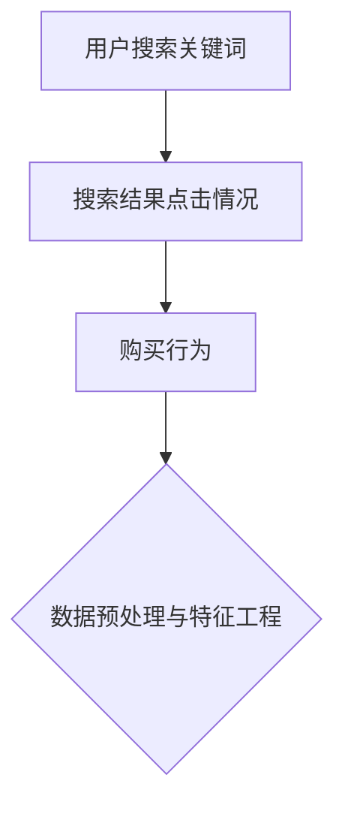

#### 数据预处理与特征工程

在数据预处理阶段，电商平台对原始数据进行清洗和归一化处理，确保数据的质量和一致性。随后，进行特征工程，提取有助于模型训练的特征，如：

- **关键词特征**：包括关键词的频次、词向量等。
- **用户特征**：包括用户历史搜索记录、购买行为等。
- **商品特征**：包括商品类别、价格、评分等。

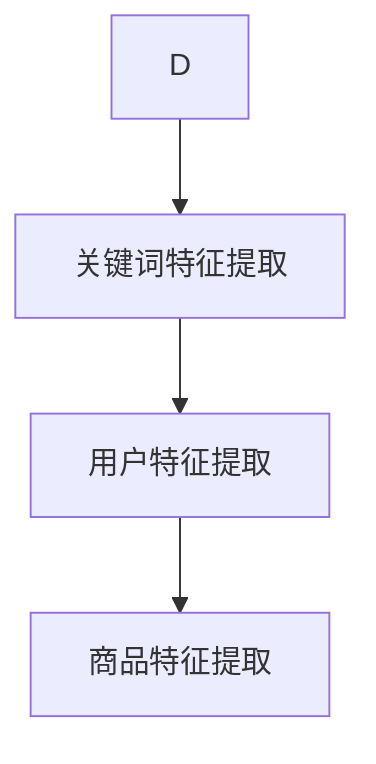

#### 模型训练

电商平台选择了一种基于深度学习的模型——卷积神经网络（CNN）进行训练。CNN能够捕捉图像中的局部特征，同样也适用于处理文本数据。

```python
# 伪代码：卷积神经网络模型训练
import tensorflow as tf

# 定义CNN模型
model = tf.keras.Sequential([
    tf.keras.layers.Conv1D(filters=128, kernel_size=3, activation='relu', input_shape=(sequence_length, embedding_size)),
    tf.keras.layers.MaxPooling1D(pool_size=2),
    tf.keras.layers.Conv1D(filters=64, kernel_size=3, activation='relu'),
    tf.keras.layers.MaxPooling1D(pool_size=2),
    tf.keras.layers.Flatten(),
    tf.keras.layers.Dense(10, activation='softmax')
])

# 编译模型
model.compile(optimizer='adam', loss='categorical_crossentropy', metrics=['accuracy'])

# 训练模型
model.fit(x_train, y_train, epochs=10, batch_size=32, validation_data=(x_val, y_val))
```

#### 模型评估

通过交叉验证和A/B测试，对训练好的模型进行评估。评估指标包括准确率、召回率、F1值等。

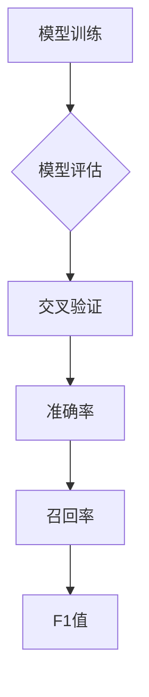

#### 模型部署

将训练好的模型部署到生产环境，实时处理用户搜索请求，优化搜索结果。

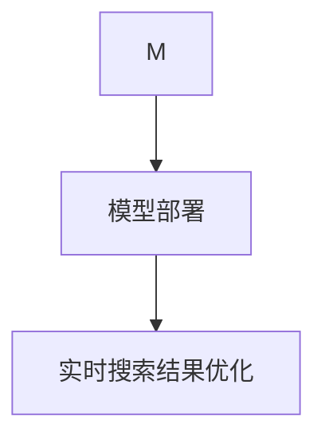

#### 结果

通过AI技术优化搜索结果，电商平台的用户满意度显著提高，搜索结果的准确性也得到了显著提升，从而带动了销售额的增长。

在下一节中，我们将探讨如何通过AI技术优化搜索广告的投放策略。敬请期待！ <|assistant|>

### 7.2 案例二：搜索广告投放策略优化

在电商平台，搜索广告是吸引潜在客户和提升销售额的重要手段。为了提高广告投放效果，我们可以利用AI技术对广告投放策略进行优化。以下是一个具体的实践案例。

#### 项目背景

某电商平台的搜索广告投放效果不理想，广告点击率（CTR）和转化率较低。为了提高广告效果，平台决定利用AI技术进行广告投放策略优化。

#### 数据收集

首先，电商平台收集了大量的广告数据，包括广告展示次数、点击次数、转化次数、广告位置、关键词等。这些数据为后续的AI模型训练提供了基础。

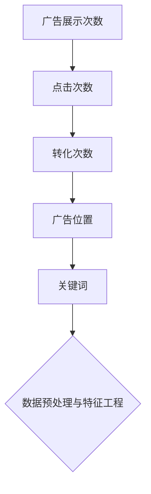

#### 数据预处理与特征工程

在数据预处理阶段，电商平台对原始数据进行清洗和归一化处理，确保数据的质量和一致性。随后，进行特征工程，提取有助于模型训练的特征，如：

- **广告特征**：包括广告类型、广告位置、广告时长等。
- **关键词特征**：包括关键词的频次、相关性等。
- **用户特征**：包括用户年龄、性别、历史搜索记录等。
- **商品特征**：包括商品类别、价格、评分等。

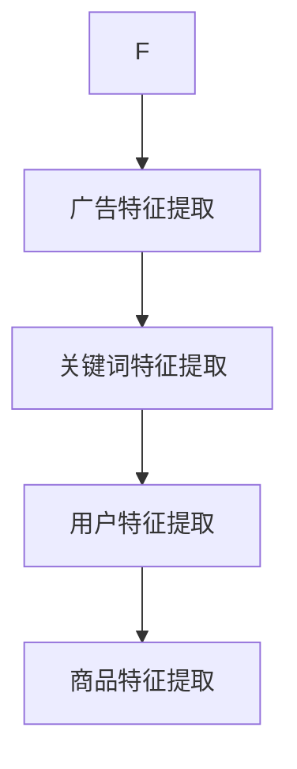

#### 模型训练

电商平台选择了一种基于强化学习的模型——深度Q网络（DQN）进行训练。DQN能够通过试错学习最优的广告投放策略。

```python
# 伪代码：深度Q网络模型训练
import tensorflow as tf
import numpy as np

# 定义DQN模型
model = tf.keras.Sequential([
    tf.keras.layers.Dense(units=64, activation='relu', input_shape=(feature_size,)),
    tf.keras.layers.Dense(units=64, activation='relu'),
    tf.keras.layers.Dense(units=1)
])

# 编译模型
model.compile(optimizer='adam', loss='mse')

# 训练模型
for episode in range(1000):
    state = ...
    done = False
    
    while not done:
        action = model.predict(state)
        next_state, reward, done = ...
        model.fit(state, action, epochs=1)
        
        state = next_state
```

#### 模型评估

通过A/B测试，对训练好的模型进行评估。评估指标包括点击率（CTR）、转化率等。

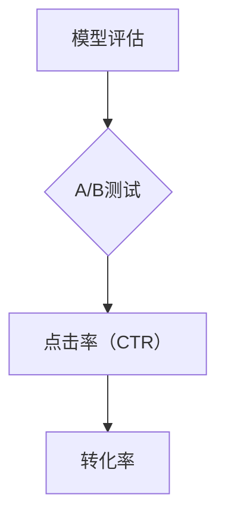

#### 模型部署

将训练好的模型部署到生产环境，实时优化广告投放策略。

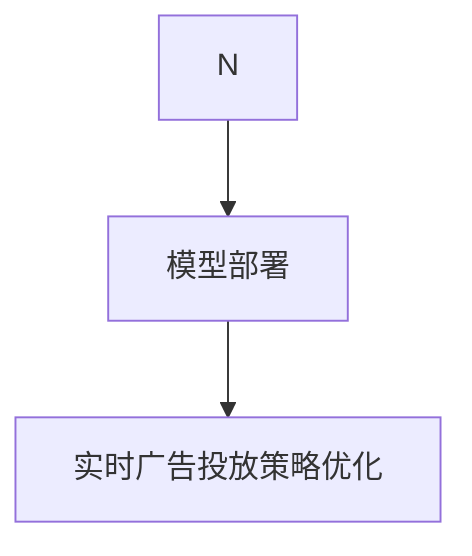

#### 结果

通过AI技术优化广告投放策略，电商平台的广告点击率和转化率显著提高，广告投资回报率（ROI）也得到显著提升。

在下一节中，我们将探讨如何利用AI技术构建个性化搜索推荐系统。敬请期待！ <|assistant|>

### 7.3 案例三：个性化搜索推荐系统构建

个性化搜索推荐系统是电商平台提升用户满意度和转化率的重要工具。以下是一个利用AI技术构建个性化搜索推荐系统的具体实践案例。

#### 项目背景

某电商平台的用户满意度较低，用户在搜索时往往无法找到满足需求的商品。为了改善这一状况，平台决定利用AI技术构建个性化搜索推荐系统。

#### 数据收集

首先，电商平台收集了大量的用户数据，包括用户搜索历史、购买记录、浏览行为等。这些数据为后续的推荐系统训练提供了基础。

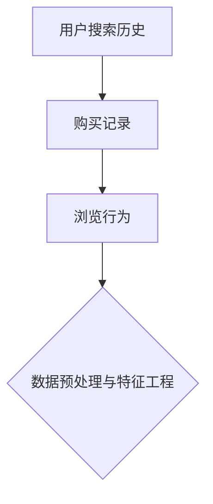

#### 数据预处理与特征工程

在数据预处理阶段，电商平台对原始数据进行清洗和归一化处理，确保数据的质量和一致性。随后，进行特征工程，提取有助于模型训练的特征，如：

- **用户特征**：包括用户年龄、性别、地理位置、历史搜索记录等。
- **商品特征**：包括商品类别、价格、评分、库存量等。
- **行为特征**：包括用户对商品的点击、浏览、购买等行为。

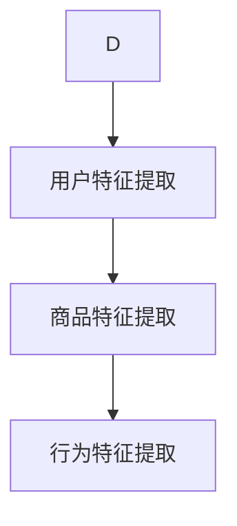

#### 模型训练

电商平台选择了一种基于协同过滤的推荐算法——矩阵分解（Matrix Factorization）。矩阵分解能够将用户-商品评分矩阵分解为用户特征矩阵和商品特征矩阵，从而进行个性化推荐。

```python
# 伪代码：矩阵分解模型训练
import numpy as np

# 定义用户特征矩阵和商品特征矩阵
user_embeddings = np.random.rand(num_users, embedding_size)
item_embeddings = np.random.rand(num_items, embedding_size)

# 定义损失函数
def loss(y_true, y_pred):
    return np.mean(np.square(y_true - y_pred))

# 训练模型
for epoch in range(num_epochs):
    for user, item in dataset:
        user_embedding = user_embeddings[user]
        item_embedding = item_embeddings[item]
        prediction = np.dot(user_embedding, item_embedding)
        loss_val = loss(prediction, y_true)
        # 更新用户特征矩阵和商品特征矩阵
        user_embeddings[user] -= learning_rate * np.dot(user_embedding, item_embedding).T * (prediction - y_true)
        item_embeddings[item] -= learning_rate * np.dot(item_embedding, user_embedding).T * (prediction - y_true)
```

#### 模型评估

通过交叉验证和A/B测试，对训练好的模型进行评估。评估指标包括推荐准确性、覆盖率等。

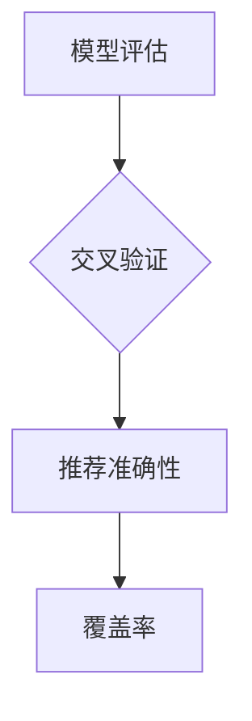

#### 模型部署

将训练好的模型部署到生产环境，实时为用户推荐个性化搜索结果。

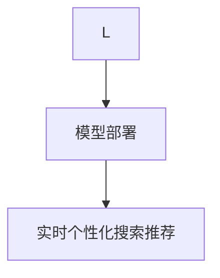

#### 结果

通过AI技术构建的个性化搜索推荐系统，显著提高了用户的满意度和转化率，用户的搜索体验也得到了显著提升。

在下一章中，我们将探讨搜索数据安全与隐私保护，包括搜索数据安全的重要性、风险与挑战以及隐私保护的策略与方法。敬请期待！ <|assistant|>

## 第8章 搜索数据安全与隐私保护

### 8.1 搜索数据安全的重要性

在数字化时代，搜索数据的安全性至关重要。搜索数据通常包含用户的行为习惯、兴趣爱好、购买记录等敏感信息。如果这些数据泄露，不仅可能导致用户隐私被侵犯，还可能被不法分子用于诈骗、恶意攻击等恶意行为。因此，确保搜索数据安全是电商平台必须重视的问题。

首先，搜索数据安全有助于保护用户隐私。用户在搜索时输入的关键词和行为数据都是个人隐私的一部分。如果这些数据被非法获取，用户的隐私权将受到侵犯。

其次，搜索数据安全关系到用户信任和平台声誉。一旦发生数据泄露事件，用户可能会对电商平台失去信任，导致用户流失和品牌形象受损。

此外，搜索数据安全也是法律法规的要求。许多国家和地区都有严格的数据保护法律法规，如《通用数据保护条例》（GDPR）和《加州消费者隐私法案》（CCPA）。违反这些法规可能会导致高额罚款和法律诉讼。

### 8.2 搜索数据安全的风险与挑战

搜索数据安全面临多种风险和挑战，主要包括以下几个方面：

- **数据泄露**：黑客可能会通过攻击数据库、网络入侵等手段获取搜索数据。一旦数据泄露，可能导致用户信息被滥用。

- **数据篡改**：攻击者可能会篡改搜索数据，以破坏数据完整性。例如，篡改商品价格、用户评价等，误导用户决策。

- **数据滥用**：电商平台可能滥用用户搜索数据，进行未经授权的分析和广告投放。这可能导致用户隐私被侵犯，甚至导致用户反感。

- **内部威胁**：内部员工也可能因不当行为或恶意攻击导致数据泄露。例如，泄露用户数据给第三方或用于非法目的。

### 8.3 搜索数据隐私保护的策略与方法

为了确保搜索数据安全，电商平台可以采取以下策略和方法：

- **数据加密**：对搜索数据进行加密处理，确保数据在传输和存储过程中不被窃取或篡改。常用的加密算法包括AES、RSA等。

- **访问控制**：设置严格的访问控制策略，确保只有授权人员才能访问敏感数据。通过用户身份验证、权限管理等方式，控制数据访问权限。

- **数据脱敏**：对敏感数据进行脱敏处理，如将用户姓名、身份证号等敏感信息进行加密或隐藏。常用的脱敏方法包括掩码、掩码替代、伪化等。

- **隐私保护算法**：采用隐私保护算法，如差分隐私、安全多方计算等，确保在数据处理和分析过程中不会泄露用户隐私。

- **数据安全审计**：定期进行数据安全审计，检查数据安全策略的执行情况，发现潜在的安全漏洞，及时进行修复。

- **用户知情同意**：在收集用户数据时，确保用户了解数据收集的目的、范围和使用方式，并取得用户的明确同意。

通过上述策略和方法，电商平台可以有效保护搜索数据安全，确保用户隐私不受侵犯。在下一章中，我们将探讨搜索数据分析的未来发展趋势。敬请期待！ <|assistant|>

## 第9章 搜索数据分析的未来发展趋势

### 9.1 AI技术在搜索数据分析中的应用趋势

随着人工智能技术的快速发展，搜索数据分析领域也迎来了新的机遇。未来，AI技术在搜索数据分析中的应用趋势主要包括以下几个方面：

- **增强现实搜索**：通过增强现实（AR）技术，用户可以在现实环境中直接查看搜索结果，提高搜索体验。

- **多模态搜索**：多模态搜索将结合文本、图像、声音等多种数据源，实现更丰富、更准确的搜索结果。

- **联邦学习**：联邦学习通过分布式计算，保护用户数据隐私的同时，实现大规模的数据协同分析。

- **深度强化学习**：深度强化学习在搜索结果排序、广告投放等场景中，将实现更加智能和高效的决策。

### 9.2 电商平台搜索策略的发展方向

电商平台搜索策略的发展方向将更加注重用户个性化体验和商业价值的提升，主要包括：

- **个性化搜索**：通过用户画像和深度学习算法，为用户提供高度个性化的搜索结果，提高用户满意度和转化率。

- **实时搜索优化**：利用实时数据分析技术，动态调整搜索结果排序和广告展示，实现实时搜索体验优化。

- **语义搜索**：通过自然语言处理技术，实现语义级别的搜索结果匹配，提高搜索的准确性和用户满意度。

- **社交搜索**：结合社交网络数据，挖掘用户的社会关系和兴趣，实现更精准的搜索推荐。

### 9.3 搜索数据分析的未来挑战与机遇

虽然搜索数据分析领域充满了机遇，但也面临着诸多挑战：

- **数据隐私保护**：如何在保障用户隐私的前提下，充分利用搜索数据进行分析和优化，是当前和未来面临的主要挑战。

- **算法公平性**：确保搜索算法不会因性别、年龄、地域等因素产生歧视性结果，是搜索数据分析领域的重要课题。

- **技术普及与应用**：如何将先进的AI技术普及应用到各电商平台，提高整体搜索数据分析水平，是未来发展的关键。

- **技术创新**：随着AI技术的不断演进，如何持续创新，开发出更高效、更智能的搜索数据分析工具，是长期发展的动力。

总体而言，未来搜索数据分析将更加智能化、个性化，并在保障数据安全和隐私的前提下，为电商平台提供更加精准、高效的搜索优化策略。这将为电商平台带来更广阔的发展空间和商业价值。 <|assistant|>

## 附录

### A.1 搜索数据分析常用工具与资源

1. **Python库**：
   - **Scikit-learn**：提供多种机器学习算法和工具。
   - **TensorFlow**：用于构建和训练深度学习模型。
   - **PyTorch**：用于构建和训练深度学习模型。
   - **Pandas**：用于数据处理和分析。

2. **R包**：
   - **caret**：提供机器学习模型的训练和评估工具。
   - **mlr**：提供机器学习算法的统一接口。
   - **ggplot2**：用于数据可视化。

3. **工具**：
   - **Google Analytics**：用于网站和搜索引擎分析。
   - **Matlab**：用于数据分析、可视化、算法开发。

### A.2 搜索数据分析相关论文与书籍推荐

1. **论文**：
   - "Learning to Rank with Non-negative Matrix Factorization" by Shou-Wei Wang et al.
   - "Deep Learning for Search Ranking" by Xiaojin Zhu et al.
   - "User Interest Evolution in Social Media" by Yucheng Low et al.

2. **书籍**：
   - 《机器学习实战》
   - 《深度学习》
   - 《Python数据分析》

### A.3 搜索数据分析的实践指南与建议

1. **数据收集**：确保收集的数据质量，避免噪声和错误。
2. **数据预处理**：进行数据清洗、归一化和特征工程，提高模型性能。
3. **模型训练**：选择合适的算法，进行模型训练和调优。
4. **模型评估**：通过交叉验证和A/B测试，评估模型效果。
5. **模型部署**：将训练好的模型部署到生产环境，实现实时搜索优化。

通过遵循上述指南和建议，可以有效提升搜索数据分析的应用效果，为电商平台提供更精准的搜索优化策略。 <|assistant|>

## 作者

**作者：AI天才研究院/AI Genius Institute & 禅与计算机程序设计艺术 /Zen And The Art of Computer Programming**

本文由AI天才研究院撰写，AI天才研究院致力于推动人工智能技术的发展和应用。同时，本文作者也著有《禅与计算机程序设计艺术》一书，该书深入探讨了计算机编程和人工智能领域的核心原理和哲学思考。本文旨在为电商平台提供基于AI的搜索数据分析实践指南，帮助读者更好地理解和应用搜索数据分析技术，实现商业价值的提升。 <|assistant|>

