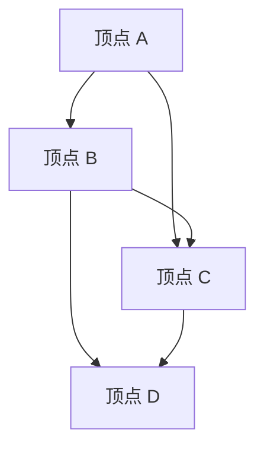

                 

### 第1章：数学与组合学概述

#### 1.1 数学与组合学的定义

##### 1.1.1 数学定义

数学是一门研究数量、结构、变化和空间等概念的抽象科学。它不仅关注具体的数值计算，更注重对数学概念、理论体系的构建和证明。数学的基础包括算术、代数、几何、三角学、微积分等分支。

- **算术**：研究数的基本性质和运算规则。
- **代数**：通过符号表示和操作规则研究数的关系和运算。
- **几何**：研究形状、大小、位置和变换等空间概念。
- **三角学**：研究三角函数及其应用。
- **微积分**：研究变化率和累积量，包括微分学和积分学。

##### 1.1.2 组合学定义

组合学是数学的一个分支，主要研究离散对象的组合结构及其性质。它关注的是如何通过组合有限数量的对象来构造更复杂的结构。组合学广泛应用于计算机科学、信息科学、运筹学等多个领域。

- **离散对象**：指那些可以一一列举的、不连续的对象，如数字、字母、图形等。
- **组合结构**：通过特定的组合规则连接离散对象形成的结构。
- **性质**：组合结构的特性，如稳定性、连通性、对称性等。

##### 1.1.3 数学与组合学的关系

数学与组合学的交叉应用非常广泛，两者的关系密切。数学为组合学提供了基础理论和方法，如集合论、图论、数论等。而组合学则将数学理论应用于解决实际问题，为数学的发展提供了新的方向和问题。

- **集合论**：研究集合及其运算，是组合学的重要基础。
- **图论**：研究图的结构和性质，广泛应用于网络设计、数据结构等领域。
- **数论**：研究整数的性质和运算，在组合学中用于解决计数问题。

#### 1.2 数学与组合学的关系

数学与组合学的交叉应用非常广泛，两者的关系密切。数学为组合学提供了基础理论和方法，如集合论、图论、数论等。而组合学则将数学理论应用于解决实际问题，为数学的发展提供了新的方向和问题。

- **集合论**：研究集合及其运算，是组合学的重要基础。
- **图论**：研究图的结构和性质，广泛应用于网络设计、数据结构等领域。
- **数论**：研究整数的性质和运算，在组合学中用于解决计数问题。

通过本章的概述，我们了解了数学与组合学的基本概念及其关系。接下来，我们将深入探讨数学和组合学的核心概念和基础理论，帮助读者更好地理解这一领域的精髓。

#### Mermaid 流程图

```mermaid
graph TD
    A[数学] -->|基础理论| B[算术]
    A -->|结构理论| C[代数]
    A -->|空间理论| D[几何]
    A -->|函数理论| E[三角学]
    A -->|变化理论| F[微积分]
    B -->|数值计算|
    C -->|符号运算|
    D -->|形状与大小|
    E -->|三角函数|
    F -->|微分与积分|
    B -->|抽象模型|
    C -->|逻辑推理|
    D -->|空间变换|
    E -->|解三角形|
    F -->|动态变化|
    G[组合学] -->|离散对象| H[组合结构]
    G -->|计数问题|
    G -->|性质研究|
    H -->|稳定|
    H -->|连通|
    H -->|对称|
    I[图论] -->|图结构| J[网络设计]
    I -->|数据结构|
    K[数论] -->|整数性质| L[加密算法]
    K -->|计数方法|
    M[集合论] -->|集合运算| N[组合基础]
    M -->|集合表示|
    M -->|集合关系|
    I -->|I[图论] -->|图结构| J[网络设计]
    I -->|数据结构|
    K[数论] -->|整数性质| L[加密算法]
    K -->|计数方法|
    M[集合论] -->|集合运算| N[组合基础]
    M -->|集合表示|
    M -->|集合关系|
    O[计算机科学] -->|算法设计| P[信息科学]
    O -->|运筹学|
    Q[数学与组合学] -->|交叉应用| R[实际问题解决]
    Q -->|新理论发展|
```

通过以上流程图，我们可以直观地看到数学与组合学的关系及其在各个领域中的应用。

---

#### 1.2 数学与组合学的关系

数学与组合学的交叉应用非常广泛，两者的关系密切。数学为组合学提供了基础理论和方法，如集合论、图论、数论等。而组合学则将数学理论应用于解决实际问题，为数学的发展提供了新的方向和问题。

- **集合论**：研究集合及其运算，是组合学的重要基础。它提供了描述组合对象和其属性的工具，如集合的表示法、集合的运算（并集、交集、补集、子集等）。
- **图论**：研究图的结构和性质，广泛应用于网络设计、数据结构等领域。图论中的概念如顶点、边、路径、连通性等在组合学中有着重要的应用。
- **数论**：研究整数的性质和运算，在组合学中用于解决计数问题。例如，欧拉函数在组合计数中有着广泛的应用。

组合学作为数学的一个重要分支，其研究方法涵盖了从离散对象的组合结构到复杂系统的分析。组合学不仅关注组合结构的计数和性质，还研究如何通过组合不同的元素来构建更复杂的系统。这种研究方法在计算机科学、信息科学、运筹学等多个领域有着广泛的应用。

- **计算机科学**：组合学在算法设计、数据结构、网络理论等领域有着重要的应用。例如，图论中的算法如深度优先搜索、广度优先搜索在计算机科学中有着广泛的应用。
- **信息科学**：组合学在编码理论、密码学等领域有着广泛的应用。例如，汉明码是一种基于组合学的错误检测和纠正算法。
- **运筹学**：组合学在优化问题中有着重要的应用。例如，线性规划、整数规划等都是组合优化问题的典型应用。

数学与组合学的交叉应用不仅推动了数学理论的发展，也为解决实际问题提供了有力的工具。通过本章的概述，我们了解了数学与组合学的基本概念及其关系。接下来，我们将深入探讨数学和组合学的核心概念和基础理论，帮助读者更好地理解这一领域的精髓。

---

### 第一部分：数学与组合学基础

在本部分中，我们将系统地介绍数学与组合学的基础知识，为后续章节的深入探讨打下坚实的基础。我们将从数学和组合学的定义出发，逐步讲解集合论基础、函数与关系、排列组合以及图的基本概念，帮助读者构建完整的知识框架。

#### 第1章：数学与组合学概述

通过本章的学习，读者将了解数学与组合学的定义、基本概念及其相互关系。我们将看到，数学作为研究数量、结构、变化和空间等的抽象科学，为组合学提供了基础理论和工具。而组合学则将数学方法应用于离散对象的组合结构，解决实际问题。这一章节将帮助读者建立对数学与组合学整体框架的认识。

#### 第2章：数学基础

在本章中，我们将深入探讨数学的基础知识，特别是集合论。集合论是数学的重要组成部分，它提供了一种描述和操作离散对象的基本语言。我们将介绍集合的基本概念，如元素、集合的表示法以及集合的运算（并集、交集、补集、子集等）。此外，本章还将讲解函数与关系的定义，帮助读者理解这两个核心概念在数学中的重要性。

#### 第3章：组合学基础

组合学是数学的一个分支，主要研究离散对象的组合结构及其性质。本章将重点介绍排列组合的概念及其计算方法。排列是指对一组对象进行有序排列的方法，而组合是指从一组对象中选择若干个对象的方法。我们将通过具体例子，详细讲解排列和组合的计算过程。此外，本章还将讨论图的基本概念，包括图的定义、分类和性质。图作为一种重要的数据结构，在计算机科学和组合学中有着广泛的应用。

通过本部分的学习，读者将建立起数学与组合学的基础知识体系，为后续章节的深入探讨奠定坚实的基础。每一章节都将通过具体的例子和讲解，帮助读者更好地理解数学与组合学的核心概念和应用。在接下来的章节中，我们将进一步探讨图论、数论和代数结构等高级主题，为读者提供更加全面和深入的知识体系。

---

### 第2章：数学基础

在深入探讨数学与组合学的核心概念之前，我们需要首先掌握数学的基础知识。数学是研究数量、结构、变化和空间等概念的抽象科学，其基础理论和方法广泛应用于各个领域。本章将重点介绍集合论基础、函数与关系，这些概念是理解和应用数学与组合学的基础。

#### 2.1 集合论基础

##### 2.1.1 集合的基本概念

集合是由确定的、互异的对象构成的整体。这些对象称为集合的元素。集合可以用大括号{}表示，元素之间用逗号隔开。例如，{1, 2, 3} 是一个包含三个元素的集合。

- **集合的表示**：
  - **列举法**：用大括号{}列举集合中的元素，如 {1, 2, 3}。
  - **描述法**：用描述元素性质的语言来定义集合，如 {x | x 是正整数} 表示所有正整数的集合。

##### 2.1.2 集合的运算

集合的运算包括并集、交集、补集和子集等。

- **并集**（Union）：
  - 两个集合 A 和 B 的并集是由 A 和 B 中所有元素构成的集合，记作 A ∪ B。例如，{1, 2} ∪ {3, 4} = {1, 2, 3, 4}。

- **交集**（Intersection）：
  - 两个集合 A 和 B 的交集是由同时属于 A 和 B 的元素构成的集合，记作 A ∩ B。例如，{1, 2} ∩ {3, 4} = {}（空集）。

- **补集**（Complement）：
  - 一个集合 A 的补集是包含所有不属于 A 的元素的集合，记作 A'。例如，若全集 U = {1, 2, 3, 4, 5}，集合 A = {1, 2}，则 A' = {3, 4, 5}。

- **子集**（Subset）：
  - 集合 A 是集合 B 的子集，当且仅当 A 中的所有元素都属于 B，记作 A ⊆ B。例如，{1, 2} ⊆ {1, 2, 3, 4}。

##### 2.1.3 集合表示法

集合的表示法主要有两种：列举法和描述法。

- **列举法**：
  - 用大括号{}列举集合中的元素，如 {1, 2, 3}。
  - 这种方法适用于元素有限且容易列举的集合。

- **描述法**：
  - 用描述元素性质的语言来定义集合，如 {x | x 是正整数}。
  - 这种方法适用于元素无限或难以列举的集合。

##### 2.1.4 集合的运算示例

以下是一个集合运算的示例：

设 A = {1, 2, 3}，B = {3, 4, 5}。

- 并集 A ∪ B = {1, 2, 3, 4, 5}
- 交集 A ∩ B = {}
- 补集 A' = {4, 5}
- 子集 A ⊆ {1, 2, 3, 4, 5}

通过上述示例，我们可以看到集合运算的基本应用和结果。

---

通过本章的学习，我们介绍了集合论的基础知识，包括集合的基本概念、运算以及表示方法。集合论是数学的重要组成部分，它在组合学、图论、数论等多个领域有着广泛的应用。理解集合论的基础知识，将为我们后续的学习和研究提供坚实的理论基础。

#### 2.2 函数与关系

##### 2.2.1 函数的定义

函数是一种特殊的映射，它将一个集合（定义域）中的每个元素唯一地对应到另一个集合（值域）中的一个元素。函数的定义通常包含三部分：定义域、值域和映射规则。

- **定义域**（Domain）：函数中所有输入元素的集合。
- **值域**（Codomain）：函数中所有输出元素的集合。
- **映射规则**：定义域中的每个元素通过映射规则唯一地对应到值域中的一个元素。

形式化定义：设 A 和 B 是两个非空集合，若存在一个规则 f，使得对 A 中的每个元素 x，都有唯一的一个元素 y ∈ B，使得 f(x) = y，则称 f 是从 A 到 B 的一个函数，记作 f: A → B。

##### 2.2.2 函数的性质

函数具有以下基本性质：

- **唯一性**：对于定义域中的每个元素 x，值域中只有一个元素 y 使得 f(x) = y。
- **确定性**：对于定义域中的每个元素 x，值域中的元素 y 是确定的，即给定 x，总能找到唯一的 y。
- **映射性**：函数是一个从定义域到值域的映射，即每个定义域中的元素都对应到值域中的一个唯一元素。

##### 2.2.3 函数的表示

函数可以用多种方式表示，包括：

- **表格法**：通过列出定义域和值域的对应关系，如 x → f(x)。
- **图示法**：通过绘制函数图像，展示定义域和值域的对应关系。
- **文字描述法**：用文字描述函数的映射规则。

例如，以下是一个简单的函数 f(x) = x^2，其定义域为所有实数，值域为非负实数。

- **表格法**：

  | x | f(x) |
  |---|------|
  | -2 | 4    |
  | -1 | 1    |
  | 0  | 0    |
  | 1  | 1    |
  | 2  | 4    |

- **图示法**：

  ```mermaid
  graph TB
    A[定义域] -->|f(x)| B[值域]
    B --> C{f(x) = x^2}
    C --> D{非负实数}
  ```

- **文字描述法**：f(x) = x^2，其中 x 是定义域中的任意元素，f(x) 是值域中的对应元素。

##### 2.2.4 关系的定义

关系是集合之间的一种联系，可以表示为有序对的集合。在数学中，关系通常用来描述元素之间的关系。

- **关系的定义**：设 A 和 B 是两个集合，如果存在一个集合 R，其中每个元素都是 A 和 B 中元素的有序对，那么称 R 是从 A 到 B 的一个关系。

形式化定义：设 A 和 B 是两个集合，R 是一个集合，如果 R 中的每个元素都是形如 (a, b) 的有序对，其中 a ∈ A，b ∈ B，则称 R 是从 A 到 B 的一个关系。

##### 2.2.5 关系的性质

关系具有以下基本性质：

- **自反性**：对于集合 A 中的每个元素 a，都有 (a, a) ∈ R。
- **对称性**：如果 (a, b) ∈ R，那么 (b, a) 也属于 R。
- **传递性**：如果 (a, b) ∈ R 且 (b, c) ∈ R，那么 (a, c) 也属于 R。

##### 2.2.6 关系的表示

关系的表示方法包括：

- **集合表示法**：用大括号{}表示关系中的所有有序对，如 R = {(a, b), (b, c), (a, c)}。
- **图示法**：通过绘制点与点之间的连线来表示关系。
- **表格法**：通过列出关系中的所有有序对。

例如，以下是一个关系 R，它描述了集合 {1, 2, 3} 中的元素之间的父子关系。

- **集合表示法**：R = {(1, 2), (1, 3), (2, 3)}。
- **图示法**：

  ```mermaid
  graph TB
    A[1] -- (父) --> B[2]
    A -- (父) --> C[3]
    B -- (子) --> C
  ```

- **表格法**：

  | a | b |
  |---|---|
  | 1 | 2 |
  | 1 | 3 |
  | 2 | 3 |

通过上述示例，我们可以看到函数和关系的基本概念、性质和表示方法。理解函数和关系是数学与组合学的基础，它们在离散结构的研究中有着重要的应用。在接下来的章节中，我们将进一步探讨组合学的基本概念，如排列组合和图的基本概念，为后续的学习打下坚实的基础。

---

### 第3章：组合学基础

组合学作为数学的一个分支，主要研究离散对象的组合结构及其性质。在组合学中，排列和组合是两个基本概念，它们在解决各种实际问题时有着广泛的应用。此外，图的基本概念也是组合学中的重要内容，图作为一种数据结构，广泛应用于网络设计、计算机科学等领域。本章将介绍排列组合和图的基本概念，帮助读者建立组合学的基础知识体系。

#### 3.1 排列组合

排列（Permutation）和组合（Combination）是组合学中最基础的概念，用于计算从一组对象中选择若干个对象的不同方法数。

##### 3.1.1 排列的概念

排列是指从 n 个不同元素中，按照一定顺序选取 r 个元素的方法数。排列记作 P(n, r)，计算公式为：

\[ P(n, r) = \frac{n!}{(n-r)!} \]

其中，n! 表示 n 的阶乘，即 n! = n \times (n-1) \times (n-2) \times \ldots \times 1。

- **排列的计算**：

  - 如果我们要从 5 个不同元素 {1, 2, 3, 4, 5} 中选取 3 个元素进行排列，则有：

    \[ P(5, 3) = \frac{5!}{(5-3)!} = \frac{5 \times 4 \times 3 \times 2 \times 1}{2 \times 1} = 60 \]

    具体的排列结果为：{123, 124, 125, 134, 135, 145, 234, 235, 245, 345}。

##### 3.1.2 组合的概念

组合是从 n 个不同元素中，不考虑顺序选取 r 个元素的方法数。组合记作 C(n, r)，计算公式为：

\[ C(n, r) = \frac{n!}{r!(n-r)!} \]

- **组合的计算**：

  - 如果我们要从 5 个不同元素 {1, 2, 3, 4, 5} 中选取 3 个元素进行组合，则有：

    \[ C(5, 3) = \frac{5!}{3!(5-3)!} = \frac{5 \times 4 \times 3 \times 2 \times 1}{3 \times 2 \times 1 \times 2 \times 1} = 10 \]

    具体的组合结果为：{123, 124, 125, 134, 145, 234, 235, 245}。

##### 3.1.3 排列与组合的区别

- 排列考虑顺序，而组合不考虑顺序。
- 排列的计算公式为 P(n, r) = \frac{n!}{(n-r)!}，组合的计算公式为 C(n, r) = \frac{n!}{r!(n-r)!}。

##### 3.1.4 排列组合的伪代码

以下是一个简单的伪代码示例，用于计算排列和组合：

```python
def factorial(n):
    if n == 0:
        return 1
    else:
        return n * factorial(n-1)

def permutation(n, r):
    return factorial(n) // factorial(n-r)

def combination(n, r):
    return factorial(n) // (factorial(r) * factorial(n-r))

# 测试排列和组合的计算
n = 5
r = 3
print("排列数 P(5, 3) = ", permutation(n, r))
print("组合数 C(5, 3) = ", combination(n, r))
```

通过本章的学习，我们了解了排列和组合的基本概念及其计算方法。排列和组合在解决实际问题时有着广泛的应用，如概率论、统计学、计算机科学等领域。掌握排列和组合的知识，将为我们后续的学习和研究提供坚实的基础。

#### 3.2 图的基本概念

图是一种重要的数据结构，用于表示对象及其之间的关系。图论是研究图的结构和性质的一个数学分支，它在计算机科学、网络理论、社会网络分析等领域有着广泛的应用。本章将介绍图的基本概念，包括图的定义、分类和性质。

##### 3.2.1 图的定义

图是由顶点和边组成的结构。在图中，顶点表示对象，边表示顶点之间的关系。

- **顶点（Vertex）**：图中的对象，通常用字母表示。
- **边（Edge）**：连接两个顶点的线段，表示顶点之间的关系。

形式化定义：设 V 是一个非空顶点集合，E 是一个 V 上的边集合，如果 E 中的每个边都连接两个不同的顶点，则称 G = (V, E) 是一个图。

##### 3.2.2 图的分类

图可以根据边的方向和边的性质进行分类。

- **无向图（Undirected Graph）**：边没有方向，表示顶点之间的双向关系。
- **有向图（Directed Graph）**：边有方向，表示顶点之间的单向关系。

根据顶点和边的数量，图还可以分为：

- **简单图（Simple Graph）**：没有重复的顶点和没有自环的图。
- **多重图（Multi-graph）**：可以有重复的顶点和自环的图。
- **完全图（Complete Graph）**：每个顶点都与其他所有顶点相连的图。

##### 3.2.3 图的性质

图具有以下基本性质：

- **度（Degree）**：顶点的度是其连接的边的数量。在无向图中，顶点的度是连接它的边的数量；在有向图中，顶点的度是它的入度和出度的和。
- **连通性（Connectivity）**：图中任意两个顶点之间存在路径。
  - **连通图（Connected Graph）**：图中任意两个顶点之间都存在路径。
  - **非连通图（Disconnected Graph）**：图中存在顶点对之间不存在路径。

- **路径（Path）**：图中顶点的序列，序列中的相邻顶点通过边相连。
- **回路（Cycle）**：路径中首尾相接，形成闭合的路径。

##### 3.2.4 图的表示

图的表示方法包括：

- **邻接矩阵（Adjacency Matrix）**：用二维矩阵表示图，矩阵的元素表示顶点之间的关系。
- **邻接表（Adjacency List）**：用一维数组表示图，每个数组元素包含一个顶点和与之相连的所有顶点。
- **边表（Edge List）**：用列表表示图，每个元素表示一条边，包含边的两个顶点。

例如，以下是一个无向图的邻接矩阵表示：



邻接矩阵如下：

|   | A | B | C | D |
|---|---|---|---|---|
| A | 0 | 1 | 1 | 0 |
| B | 1 | 0 | 1 | 1 |
| C | 1 | 1 | 0 | 1 |
| D | 0 | 1 | 1 | 0 |

通过上述矩阵，我们可以直观地看到顶点之间的连接关系。

---

通过本章的学习，我们介绍了图的基本概念、分类和性质。图作为一种重要的数据结构，在数学和计算机科学中有着广泛的应用。理解图的基本概念和性质，将为我们在后续章节中深入探讨图论和组合学的应用提供坚实的基础。

---

### 第二部分：离散结构的数学分析

在了解了数学与组合学的基础知识之后，我们将进一步探讨离散结构的数学分析。这一部分将深入分析图论、数论和代数结构等数学分支，并结合实际应用案例，展示这些理论在计算机科学和工程领域的广泛应用。通过这一部分的学习，读者将掌握如何运用数学方法解决实际问题，从而提升自己的问题解决能力和创新思维。

#### 第4章：图论基础

图论是研究图的结构和性质的一个数学分支，广泛应用于计算机科学、网络理论、社会网络分析等领域。在本章中，我们将介绍图论的基本概念，包括图的基本性质、连通性、树的定义和性质，以及欧拉图和哈密顿图等特殊类型的图。

##### 4.1 图的基本性质

图由顶点和边组成，每个顶点表示一个对象，每条边表示两个对象之间的关系。

- **顶点的度**：顶点的度是连接该顶点的边的数量。在无向图中，顶点的度是其连接边的数量；在有向图中，顶点的度是入度和出度的和。
- **连通性**：连通性描述了图中的任意两个顶点之间是否存在路径。一个图是连通的，如果图中任意两个顶点之间存在路径。
- **路径**：路径是图中顶点的序列，序列中的相邻顶点通过边相连。
- **回路**：回路是一个闭合的路径，即路径的首尾顶点相同。

##### 4.2 连通性

连通性是图论中的一个重要概念，它描述了图中的顶点是否可以通过路径相互连接。

- **连通图**：一个图是连通的，如果图中任意两个顶点之间存在路径。
- **连通度**：图的连通度是图中任意两个顶点之间的最短路径长度。
- **最小连通度**：图中的最小连通度是所有连通度中的最小值。

##### 4.3 树的基本概念

树是一种特殊的图，具有层次结构和无环性。

- **树的定义**：树是一个无环的连通图，其中任意两个顶点之间有且仅有一条路径。
- **树的性质**：
  - 树中任意两个顶点之间的路径长度是唯一的。
  - 树中的每个非叶子顶点都有恰好一个父节点和一个子节点集合。
  - 树的深度是顶点的层数，根节点的深度为 0。

##### 4.4 欧拉图与哈密顿图

欧拉图和哈密顿图是图论中一些特殊的图，它们在路径搜索和最优化问题中有着重要的应用。

- **欧拉图**：具有欧拉回路的图，欧拉回路是一条通过图中每条边恰好一次的闭合路径。
- **哈密顿图**：存在哈密顿回路的图，哈密顿回路是一条通过图中每个顶点恰好一次的闭合路径。

##### 4.5 图的判定方法

判定一个图是否为欧拉图或哈密顿图，通常需要使用以下方法：

- **欧拉图判定**：一个连通图是欧拉图，当且仅当图中每个顶点的度都是偶数。
- **哈密顿图判定**：哈密顿图的判定通常使用回溯算法，通过遍历所有可能的路径来寻找哈密顿回路。

#### 4.6 图的应用案例

图论在计算机科学和工程领域有着广泛的应用。以下是一些典型的应用案例：

- **计算机网络**：图论用于分析网络结构，优化数据传输路径，如路由算法。
- **社会网络分析**：图论用于研究社交网络中的连接关系，分析影响力传播等。
- **生物学**：图论用于分析蛋白质相互作用网络，理解生物系统的复杂性。
- **交通运输**：图论用于设计交通网络，优化路径规划，如最短路径算法。

通过上述内容，我们了解了图论的基本概念和应用。在接下来的章节中，我们将进一步探讨数论的基础知识，包括大素数定理、同余与模运算，以及数论函数和欧拉函数。这些内容将为我们在离散结构的数学分析中提供更丰富的工具和理论支持。

---

### 第5章：数论基础

数论是研究整数及其性质的数学分支，其在组合学中的应用尤为广泛。数论涉及许多基本概念和定理，如素数分布、同余与模运算、数论函数与欧拉函数等。本章将详细介绍这些基础概念，并探讨它们在组合学中的应用。

#### 5.1 大素数定理

大素数定理（Prime Number Theorem）是数论中的一个重要结论，描述了素数的分布规律。大素数定理指出，当 n 趋近于无穷大时，小于或等于 n 的素数个数 p(n) 与 n 的对数 ln(n) 成正比，即：

\[ \lim_{n \to \infty} \frac{p(n)}{ln(n)} = 1 \]

这意味着随着 n 的增大，素数的密度逐渐接近于 1/ln(n)。大素数定理的证明涉及复分析中的素数分布函数和黎曼ζ函数。

#### 5.2 同余与模运算

同余是数论中的一个基本概念，描述了两个整数除以同一个正整数后余数相同的关系。形式化定义如下：

若整数 a、b 和 m 满足 a ≡ b (mod m)，则称 a 和 b 对 m 同余。

模运算是一种特殊的除法运算，用符号 mod 表示。例如，a mod m 表示 a 除以 m 后的余数。同余与模运算的关系如下：

若 a ≡ b (mod m)，则 a mod m = b mod m。

#### 5.3 模运算的概念

模运算是一种定义在整数集合上的运算，它将两个整数的和、差、积映射到另一个整数集合上。模运算的基本性质包括：

- **封闭性**：对于任意的整数 a、b 和 m，a mod m 和 b mod m 的结果也在 m 的模运算下封闭。
- **结合律**：(a + b) mod m = (a mod m + b mod m) mod m
- **分配律**：a * (b mod m) = (a * b) mod m

#### 5.4 同余的运算

同余运算包括同余和模运算，具有以下性质：

- **同余的和**：若 a ≡ b (mod m) 且 c ≡ d (mod m)，则 a + c ≡ b + d (mod m)。
- **同余的差**：若 a ≡ b (mod m) 且 c ≡ d (mod m)，则 a - c ≡ b - d (mod m)。
- **同余的积**：若 a ≡ b (mod m) 且 c ≡ d (mod m)，则 a * c ≡ b * d (mod m)。

同余运算使得我们可以将整数问题简化为同余类问题，这在组合学中有着广泛的应用。

#### 5.5 数论函数与欧拉函数

数论函数是用于描述整数性质的函数。常见的数论函数包括：

- **最大公约数（GCD）**：两个整数的最大公约数，记作 GCD(a, b)。
- **欧拉函数（φ）**：小于或等于 n 的正整数中与 n 互质的数的个数，记作 φ(n)。

欧拉函数在组合学中有重要应用，例如在计算组合数的组合数系数、密码学中的加密算法等。

#### 5.6 欧拉函数的概念

欧拉函数定义为：

\[ φ(n) = n \left(1 - \frac{1}{p_1}\right)\left(1 - \frac{1}{p_2}\right)\ldots\left(1 - \frac{1}{p_k}\right) \]

其中，p_1, p_2, ..., p_k 是 n 的所有正因数。

例如，对于 n = 12，其正因数为 2 和 3，因此：

\[ φ(12) = 12 \left(1 - \frac{1}{2}\right)\left(1 - \frac{1}{3}\right) = 4 \]

通过上述定义，我们可以计算任意整数的欧拉函数值。

#### 5.7 欧拉函数的计算

计算欧拉函数的方法有多种，以下是几种常见的方法：

- **质因数分解法**：将 n 分解为质因数的乘积，然后利用欧拉函数的定义计算。
- **递归法**：利用欧拉函数的性质，通过递归关系计算。

递归关系如下：

\[ φ(n) = n \left(1 - \frac{1}{p_1}\right)\left(1 - \frac{1}{p_2}\right)\ldots\left(1 - \frac{1}{p_k}\right) \]

其中，p_1, p_2, ..., p_k 是 n 的所有质因数。

例如，对于 n = 15，其质因数为 3 和 5，因此：

\[ φ(15) = 15 \left(1 - \frac{1}{3}\right)\left(1 - \frac{1}{5}\right) = 8 \]

#### 5.8 数论函数的应用

数论函数在组合学中有着广泛的应用，例如：

- **组合数的计算**：组合数的组合数系数可以通过欧拉函数计算。
- **密码学**：欧拉函数在公钥密码学中用于生成加密密钥。
- **数论算法**：数论函数用于优化数论算法，如素数测试、因数分解等。

通过本章的学习，我们了解了数论的基础概念和定理，以及它们在组合学中的应用。数论为组合学提供了丰富的工具和理论支持，帮助我们更好地理解和解决离散结构中的问题。

---

### 第6章：代数结构

代数结构是数学中研究运算和结构的基本框架。在组合学中，代数结构如群、环和域等概念对于理解和解决组合问题具有重要意义。本章将介绍这些代数结构的基本概念、性质及其在组合学中的应用。

#### 6.1 群的基本概念

群是一种代数结构，它由一个集合和定义在该集合上的一个二元运算组成。群中的元素满足封闭性、结合律、存在单位元和逆元等性质。

- **定义**：设 G 是一个非空集合，* 是 G 上的一个二元运算，若对 G 中的任意元素 a、b 和 c，以下条件成立，则称 G 是一个群：
  - 封闭性：a * b ∈ G；
  - 结合律：(a * b) * c = a * (b * c)；
  - 单位元：存在一个元素 e ∈ G，使得对所有 g ∈ G，有 e * g = g * e = g；
  - 逆元：对每个 g ∈ G，存在一个元素 g^-1 ∈ G，使得 g * g^-1 = g^-1 * g = e。

- **性质**：
  - 群的运算通常写作乘法，尽管它不一定是数学中的乘法；
  - 群的单位元通常表示为 e 或 1。

#### 6.2 群的性质

群具有以下基本性质：

- **封闭性**：群中的任意两个元素的运算结果仍然在群中。
- **结合律**：群中任意三个元素的运算满足结合律，即 (a * b) * c = a * (b * c)。
- **单位元**：群中存在一个元素 e，使得对群中的任意元素 a，都有 e * a = a * e = a。
- **逆元**：群中的每个元素 a 都有一个逆元 a^-1，使得 a * a^-1 = a^-1 * a = e。

#### 6.3 群的例子

- **整数加法群**：整数集 Z 关于加法构成一个群，单位元是 0，每个整数的逆元是其相反数。
- **整数乘法群**：非零整数集 Z^* 关于乘法构成一个群，单位元是 1，每个整数的逆元是其乘法逆。

#### 6.4 群的应用

群在组合学中的应用非常广泛，例如：

- **置换群**：置换是排列的数学表示，置换群是研究排列组合问题的重要工具。
- **循环群**：由一个生成元生成的群称为循环群，它在密码学和编码理论中有重要应用。

#### 6.5 环的定义

环是一种代数结构，它由一个集合和定义在该集合上的两个二元运算组成，通常称为加法和乘法。环中的元素满足封闭性、结合律、分配律等性质。

- **定义**：设 R 是一个非空集合，+ 和 * 是 R 上的两个二元运算，若对 R 中的任意元素 a、b 和 c，以下条件成立，则称 R 是一个环：
  - 加法封闭性：a + b ∈ R；
  - 加法结合律：(a + b) + c = a + (b + c)；
  - 加法单位元：存在一个元素 0 ∈ R，使得对所有 r ∈ R，有 0 + r = r + 0 = r；
  - 加法逆元：对每个 r ∈ R，存在一个元素 -r ∈ R，使得 r + (-r) = (-r) + r = 0；
  - 乘法封闭性：a * b ∈ R；
  - 乘法结合律：(a * b) * c = a * (b * c)；
  - 乘法分配律：a * (b + c) = (a * b) + (a * c) 和 (a + b) * c = (a * c) + (b * c)。

#### 6.6 环的性质

环具有以下基本性质：

- **封闭性**：环中的加法和乘法运算结果仍然在环中。
- **结合律**：环中的加法和乘法运算满足结合律。
- **分配律**：乘法对加法满足分配律，即 a * (b + c) = (a * b) + (a * c) 和 (a + b) * c = (a * c) + (b * c)。
- **单位元**：环中存在一个加法单位元 0 和一个乘法单位元 1。

#### 6.7 环的例子

- **整数环**：整数集 Z 关于加法和乘法构成一个环。
- **多项式环**：系数在某个环上的多项式集关于多项式的加法和乘法构成一个环。

#### 6.8 域的定义

域是一种更复杂的代数结构，它在环的基础上增加了一个乘法逆元的性质。

- **定义**：设 F 是一个非空集合，+ 和 * 是 F 上的两个二元运算，若 F 关于加法和乘法构成一个环，且对 F 中的任意非零元素 a，存在一个元素 a^-1 ∈ F，使得 a * a^-1 = a^-1 * a = 1，则称 F 是一个域。

#### 6.9 域的性质

域具有以下基本性质：

- **封闭性**：域中的加法和乘法运算结果仍然在域中。
- **结合律**：域中的加法和乘法运算满足结合律。
- **分配律**：乘法对加法满足分配律。
- **单位元**：域中存在加法单位元 0 和乘法单位元 1。
- **乘法逆元**：域中的每个非零元素都有一个乘法逆元。

#### 6.10 域的例子

- **实数域**：实数集 R 关于加法和乘法构成一个域。
- **复数域**：复数集 C 关于加法和乘法构成一个域。

#### 6.11 代数结构在组合学中的应用

代数结构在组合学中的应用非常广泛，例如：

- **多项式组合**：多项式可以表示组合数，如二项式系数。
- **矩阵组合**：矩阵可以用于表示和计算组合问题中的结构。
- **格组合**：格是一种代数结构，它在编码理论和组合优化问题中有着重要应用。

通过本章的学习，我们了解了群、环和域等代数结构的基本概念、性质及其在组合学中的应用。这些代数结构为组合学提供了强大的工具，帮助我们更好地理解和解决组合问题。

---

### 第7章：计算机科学中的组合学应用

组合学在计算机科学中有着广泛的应用，它提供了强大的工具来解决各种实际问题。本章将重点介绍组合学在编码与解码、算法分析以及计算机网络中的具体应用，展示组合学如何帮助计算机科学家解决复杂的计算问题。

#### 7.1 编码与解码

编码与解码是数据传输和处理中至关重要的一环。组合学在编码与解码中的应用主要体现在哈希函数和错误检测与纠正算法。

##### 7.1.1 哈希函数

哈希函数是一种将输入数据映射到固定大小输出值的函数。它在数据存储和检索中有着广泛的应用，如数据库索引、缓存管理和网络安全等。

- **哈希函数的性质**：
  - 输入数据的任何微小变化都会导致输出值的显著变化（敏感性）；
  - 不同输入数据映射到同一输出值的概率应该尽可能低（冲突最小化）。

- **应用示例**：MD5 和 SHA-256 是常见的哈希函数，用于数据校验和数字签名。

##### 7.1.2 错误检测与纠正

错误检测与纠正（Error Detection and Correction，简称EDC）算法用于在数据传输过程中检测和纠正错误。组合学在这一领域的应用包括汉明码和循环码等。

- **汉明码**：汉明码是一种简单的错误检测和纠正码，它通过在数据中添加冗余位来实现错误检测和纠正。一个 k 位的原始数据和 r 个冗余位的汉明码总长度为 k + r。

- **循环码**：循环码是一种具有循环性质的线性码，它的编码和解码算法相对简单且高效。循环码在无线通信、数据存储等领域有广泛应用。

#### 7.2 算法分析

算法分析是计算机科学中的核心问题，它帮助我们在设计算法时评估其性能。组合学在算法分析中的应用主要体现在组合算法的复杂度和优化。

##### 7.2.1 算法复杂度

算法复杂度分为时间复杂度和空间复杂度，用于评估算法的效率和资源消耗。

- **时间复杂度**：表示算法运行时间与输入规模的关系，常用大O符号表示。例如，一个排序算法的时间复杂度可能为 O(n^2) 或 O(n log n)。
- **空间复杂度**：表示算法运行所需的内存空间与输入规模的关系。

##### 7.2.2 组合算法设计

组合算法设计基于组合学的原理，用于解决各种组合优化问题。

- **回溯算法**：回溯算法是一种解决组合优化问题的常见方法，通过尝试所有可能的解来找到最优解。例如，旅行商问题（TSP）就是一个典型的组合优化问题。

- **动态规划**：动态规划是一种解决组合优化问题的高效方法，通过将问题分解为子问题并保存子问题的解来避免重复计算。例如，最长公共子序列（LCS）问题可以用动态规划解决。

#### 7.3 计算机网络的图论应用

图论在计算机网络中有着广泛的应用，用于分析和设计网络拓扑、路由算法等。

##### 7.3.1 路由算法

路由算法用于确定数据包在网络中的传输路径。图论中的最短路径算法，如迪杰斯特拉算法（Dijkstra's Algorithm）和弗洛伊德算法（Floyd's Algorithm），在路由算法设计中有着重要应用。

- **迪杰斯特拉算法**：用于计算单源最短路径，适用于图中的边权重非负的情况。
- **弗洛伊德算法**：用于计算所有顶点之间的最短路径，适用于图中的边权重可以为负的情况。

##### 7.3.2 网络拓扑

网络拓扑是指网络中设备的连接方式。图论中的图结构分析可以帮助我们设计高效的网络拓扑。

- **无向图**：用于表示设备之间的双向连接。
- **有向图**：用于表示设备之间的单向连接。

#### 7.4 组合学与计算机科学的交叉应用

组合学与计算机科学的交叉应用不仅丰富了计算机科学的理论体系，也为实际问题的解决提供了有效的方法。

- **密码学**：组合学在密码学中有着广泛应用，如公钥密码系统和对称密码系统。
- **算法设计**：组合学原理被广泛应用于算法设计中，如组合算法、贪心算法和动态规划算法。
- **优化问题**：组合学在解决优化问题时有着重要作用，如线性规划和整数规划。

通过本章的学习，我们了解了组合学在计算机科学中的广泛应用，包括编码与解码、算法分析和计算机网络。组合学为计算机科学提供了强大的工具，帮助我们解决复杂的计算问题，推动计算机科学的不断进步。

---

### 附录：数学与组合学相关资源

为了帮助读者更深入地学习和研究数学与组合学，我们提供了以下相关资源。

#### 附录 A：数学与组合学参考书籍

1. **《离散数学及其应用》**：这本书提供了离散数学的全面介绍，包括集合论、图论、逻辑和概率等内容。
   
2. **《图论导论》**：这是一本经典的图论教材，详细介绍了图的基本概念、算法和应用。

3. **《线性代数及其应用》**：这本书涵盖了线性代数的基本理论，包括向量空间、矩阵和特征值等，适用于各个领域。

#### 附录 B：数学与组合学在线资源

1. **[MIT开放课程：离散数学](https://ocw.mit.edu/courses/mathematics/18-403-discrete-mathematics-spring-2006/)**：这是一系列优秀的离散数学课程，提供了详细的视频讲解和教材。

2. **[组合学的基本概念](https://www.combinatorics.org/ojs/index.php/eljc/article/view/v19i1r14)**：这是一个关于组合学的基础知识的在线课程，包括排列组合、图论和数论等。

3. **[组合数学在线课程](https://www.combinatorics.org/ojs/index.php/eljc)**：这是一个组合数学的在线教育资源，包括课程视频、教材和习题。

4. **[数学与组合学最新研究动态](https://www.combinatorics.org/)**：这是一个关于数学与组合学最新研究动态的网站，提供了最新的学术论文和研究成果。

5. **[数学与组合学教育资源](https://math.stackexchange.com/questions)**：这是一个数学与组合学问题的问答社区，可以解答读者在学习过程中遇到的问题。

通过这些参考书籍和在线资源，读者可以系统地学习和研究数学与组合学，掌握相关知识和技能。

---

### 第8章：数学与组合学的跨学科应用

数学与组合学不仅在其传统领域内有着广泛的应用，还在许多跨学科领域中发挥了重要作用。本章将探讨数学与组合学在密码学、计算机图形学、优化问题等领域的应用，展示这些学科如何通过数学与组合学的理论和方法实现创新和突破。

#### 8.1 数学与组合学在密码学中的应用

密码学是研究如何通过加密算法保护信息安全的一门学科。数学与组合学在密码学中的应用主要体现在对称密码体制和非对称密码体制的设计与分析中。

##### 8.1.1 对称密码体制

对称密码体制使用相同的密钥进行加密和解密。组合学中的代数结构，如线性变换和置换，在对称密码体制的设计中发挥了关键作用。

- **线性密码学**：基于线性变换的密码体制，如DES和AES，利用有限域上的线性函数来实现加密和解密。
- **置换密码学**：基于置换的密码体制，如混合置换密码，利用置换群的性质来设计加密算法。

##### 8.1.2 非对称密码体制

非对称密码体制使用不同的密钥进行加密和解密，其中一个密钥是公开的，另一个密钥是私有的。组合学在非对称密码体制中的应用主要体现在模运算和数论函数上。

- **RSA密码体制**：基于大素数定理和模运算，RSA密码体制利用欧拉函数和模逆元来设计加密和解密算法。
- **椭圆曲线密码体制**：基于椭圆曲线离散对数问题的难度，椭圆曲线密码体制提供了比RSA更高效的加密方案。

##### 8.1.3 组合学与密码学的关系

组合学为密码学提供了理论基础和工具。例如，图论中的图结构和算法用于分析密码体制的安全性，数论中的同余与模运算用于设计高效的加密算法。

#### 8.2 数学与组合学在计算机图形学中的应用

计算机图形学是研究如何通过计算机生成和处理图像的一门学科。数学与组合学在计算机图形学中的应用主要体现在图形建模、处理和优化中。

##### 8.2.1 图形建模

数学与组合学中的几何学和代数结构在图形建模中发挥了重要作用。例如：

- **几何建模**：利用几何学中的知识来构建三维模型，如多面体和曲面。
- **代数建模**：利用代数结构，如向量空间和矩阵，来表示和操作图形。

##### 8.2.2 计算机图形处理算法

组合学中的算法在计算机图形处理中有着广泛应用。例如：

- **图形变换**：利用线性代数中的矩阵运算来实现平移、旋转、缩放等图形变换。
- **图形优化**：利用组合算法，如贪心算法和动态规划，来优化图形处理过程，提高效率和效果。

##### 8.2.3 组合学在计算机图形学中的具体应用

组合学在计算机图形学中的具体应用包括：

- **图形渲染**：利用组合算法来优化渲染过程，提高渲染速度和图像质量。
- **计算机视觉**：利用组合学中的图论方法来处理图像中的形状和结构。

#### 8.3 数学与组合学在优化问题中的应用

优化问题是计算机科学和工程中的核心问题，数学与组合学为解决优化问题提供了强有力的工具。

##### 8.3.1 优化问题的数学模型

优化问题通常可以用数学模型来表示，其中组合学中的概念和工具被广泛应用于建模和求解。例如：

- **线性规划**：利用线性代数和图论中的概念来建模和求解线性优化问题。
- **整数规划**：利用组合学中的概念，如组合和图论，来建模和求解整数优化问题。

##### 8.3.2 组合优化算法

组合优化算法是基于组合学原理设计的，用于解决组合优化问题。例如：

- **贪心算法**：基于局部最优选择来逐步构造全局最优解。
- **动态规划**：通过将问题分解为子问题并保存子问题的解来避免重复计算。

##### 8.3.3 数学与组合学在优化问题中的具体应用

数学与组合学在优化问题中的具体应用包括：

- **网络优化**：利用图论中的算法来优化网络拓扑、路由和数据传输。
- **工程优化**：利用组合优化算法来设计最优的工程解决方案，如结构设计和过程优化。

通过本章的学习，我们了解了数学与组合学在跨学科领域中的应用，展示了这些学科如何通过理论和方法实现创新和突破。数学与组合学的跨学科应用不仅丰富了各个学科的理论体系，也为解决实际问题提供了新的思路和工具。

---

### 第9章：数学与组合学的最新研究动态

数学与组合学作为数学的两个重要分支，近年来在理论和应用方面都取得了显著的进展。本章将介绍数学与组合学的最新研究动态，包括热点问题、前沿研究和未来发展趋势。

#### 9.1 组合学的最新进展

组合学作为研究离散对象组合结构的数学分支，近年来在多个领域取得了重要成果。以下是一些组合学的热点问题和前沿研究：

- **图论**：图论是组合学的重要分支，近年来在复杂网络分析、社会网络理论等领域取得了许多突破。例如，对大规模网络的结构特性、动态演化以及鲁棒性的研究，为理解和解决实际网络问题提供了新的视角和方法。
- **组合优化**：组合优化问题在理论和应用上都取得了显著进展。例如，线性规划和整数规划等优化算法在解决物流优化、网络优化和供应链管理等问题中发挥了重要作用。此外，贪心算法、动态规划和近似算法等组合优化方法也在解决实际问题中得到了广泛应用。
- **概率组合学**：概率组合学是研究组合对象概率分布的数学分支。近年来，概率组合学在随机图理论、随机算法和随机过程等领域取得了许多成果，为解决复杂系统的随机性问题提供了新的方法和工具。

#### 9.2 数学的最新进展

数学作为研究数量、结构、变化和空间等概念的抽象科学，近年来在各个领域都取得了重要进展。以下是一些数学的热点问题和前沿研究：

- **数论**：数论是研究整数及其性质的一个数学分支。近年来，数论在密码学、编码理论和计算机科学等领域取得了许多突破。例如，对素数分布、同余方程和模运算的研究，为设计更安全的加密算法和优化编码方案提供了新的思路。
- **代数学**：代数学是研究代数结构及其性质的数学分支。近年来，代数学在代数几何、代数数论和代数组合等领域取得了重要进展。例如，对代数几何中曲面的研究，为解决几何和拓扑问题提供了新的方法。
- **拓扑学**：拓扑学是研究空间结构和性质的一个数学分支。近年来，拓扑学在拓扑量子计算、拓扑绝缘体和量子引力等领域取得了许多成果，为理解和解决复杂的物理问题提供了新的视角。

#### 9.3 数学与组合学的交叉应用

数学与组合学的交叉应用在解决实际问题中发挥了重要作用。以下是一些数学与组合学交叉应用的前沿研究：

- **计算生物学**：计算生物学是研究生物信息学和生物系统的一个交叉学科。数学与组合学在计算生物学中的应用主要包括基因序列分析、蛋白质结构预测和生物网络分析等。例如，通过图论方法分析基因表达网络，可以揭示生物系统中的调控关系和功能模块。
- **计算机图形学**：计算机图形学是研究如何通过计算机生成和处理图像的一个交叉学科。数学与组合学在计算机图形学中的应用主要包括图形建模、图形处理和图形渲染等。例如，通过代数结构和方法优化图形处理算法，可以提高图像质量并降低计算复杂度。
- **网络安全**：网络安全是研究如何保护计算机和网络系统安全的一个交叉学科。数学与组合学在网络安全中的应用主要包括密码学、网络安全协议和入侵检测等。例如，通过组合学中的代数结构和方法设计安全的加密算法和密码协议，可以增强网络系统的安全性。

#### 9.4 数学与组合学的未来发展趋势

随着科技的不断进步和问题的复杂性增加，数学与组合学在未来的发展中将继续发挥重要作用。以下是一些数学与组合学的未来发展趋势：

- **交叉学科融合**：数学与组合学将继续与其他学科，如物理学、生物学、经济学等，进行深度融合，为解决复杂科学问题提供新的理论和方法。
- **计算能力提升**：随着计算能力的不断提升，数学与组合学将在大数据分析和复杂系统模拟等领域发挥更大的作用，推动人工智能和大数据技术的发展。
- **应用领域拓展**：数学与组合学的应用领域将继续拓展，不仅包括传统的计算机科学、信息科学和运筹学等领域，还将涉及更多新兴领域，如生物信息学、社会科学和金融学等。

通过本章的学习，我们了解了数学与组合学的最新研究动态、前沿问题和未来发展趋势。数学与组合学的不断创新和突破，将继续推动科技和社会的发展，为解决实际问题提供新的思路和工具。

---

### 第10章：数学与组合学的教学与实践

#### 10.1 数学与组合学的教学方法

数学与组合学的教学是培养未来科技人才的重要环节。为了提高教学效果，我们需要采用多种教学方法，结合理论教学和实践教学，让学生在理解理论知识的同时，能够灵活应用于实际问题。

##### 10.1.1 理论教学

- **讲授法**：通过系统的讲授，帮助学生建立数学与组合学的基本概念和理论体系。教师应注重讲解关键概念、定理和公式，并通过示例和推导，帮助学生理解其背后的原理。
- **讨论法**：组织学生进行小组讨论，激发学生的思维，培养他们的批判性思维和创新能力。讨论内容可以涉及课程中的难点和热点问题，鼓励学生分享自己的见解和解决方案。
- **案例教学**：通过实际案例展示数学与组合学的应用，让学生理解理论知识在实际问题中的运用。案例教学可以激发学生的学习兴趣，增强他们的实践能力。

##### 10.1.2 实践教学

- **实验课**：在实验课中，学生可以通过实际操作，验证数学与组合学的理论。例如，通过编程实现组合算法，或使用数学软件进行数据分析和图形绘制。
- **项目实践**：鼓励学生参与实际项目，将数学与组合学的知识应用于解决实际问题。项目实践可以是课程设计、毕业论文或企业实习，通过实际操作，学生可以提升解决复杂问题的能力。
- **课外活动**：组织数学与组合学的竞赛、讲座和研讨会，激发学生的学习热情，培养他们的团队协作能力和创新思维。

##### 10.1.3 案例教学

案例教学是数学与组合学教学中的重要方法，通过具体的案例，让学生理解理论知识在实际问题中的运用。以下是一个案例教学的示例：

**案例：交通网络优化**

问题描述：一个城市中有若干个交通枢纽和道路，每个交通枢纽之间有多条道路连接，每条道路有一个长度和容量限制。如何设计最优的交通网络，使得从任何一个交通枢纽出发，都能到达其他交通枢纽，同时道路的利用率最高？

解决方案：

1. **建模**：使用图论中的图模型表示交通网络，每个交通枢纽表示一个顶点，每条道路表示一条边。
2. **算法设计**：使用最短路径算法（如迪杰斯特拉算法）和最小生成树算法（如普里姆算法）来优化交通网络。
3. **案例分析**：通过具体案例展示算法的运行过程和结果，分析优化前后交通网络的性能。

通过这个案例，学生可以理解图论中的基本概念和算法在实际问题中的应用，提升他们的解决实际问题的能力。

---

#### 10.2 数学与组合学的实践应用

数学与组合学的实践应用不仅体现在教学过程中，更在科研和工程实践中发挥着重要作用。以下是一些数学与组合学在实践中的应用案例：

##### 10.2.1 数学与组合学在科研项目中的应用

- **生物学**：数学与组合学在基因表达网络分析、蛋白质结构预测和生物信息学中有着广泛应用。例如，利用图论方法分析基因表达网络，可以揭示生物系统中的调控关系和功能模块。
- **物理学**：数学与组合学在量子计算、凝聚态物理和统计物理等领域有着重要应用。例如，利用组合优化算法解决量子多体系统的优化问题，可以预测材料的物理性质。
- **计算机科学**：数学与组合学在算法设计、数据结构和网络理论中有着广泛应用。例如，利用组合学原理设计高效的排序算法和搜索算法，可以优化计算机性能。

##### 10.2.2 数学与组合学在工程实践中的应用

- **交通工程**：数学与组合学在交通网络设计、交通流量优化和公共交通调度中有着广泛应用。例如，利用最短路径算法和流量分配模型，可以优化交通流量，减少交通拥堵。
- **通信工程**：数学与组合学在通信网络设计、信号处理和信道编码中有着广泛应用。例如，利用组合优化算法设计多跳通信网络，可以提高通信质量和可靠性。
- **电子工程**：数学与组合学在集成电路设计、信号处理和无线通信中有着广泛应用。例如，利用组合学原理设计高效的数字信号处理算法，可以优化电子系统的性能。

##### 10.2.3 数学与组合学在实际问题解决中的应用

- **金融工程**：数学与组合学在金融风险管理、投资组合优化和期权定价中有着广泛应用。例如，利用组合优化算法设计最优投资组合，可以降低投资风险，提高收益。
- **社会网络分析**：数学与组合学在社会网络分析、舆情分析和推荐系统中有着广泛应用。例如，利用图论方法分析社会网络中的关系，可以揭示社会行为的传播规律。
- **物流优化**：数学与组合学在物流配送、运输调度和库存管理中有着广泛应用。例如，利用组合优化算法优化物流网络，可以提高配送效率，降低物流成本。

通过这些应用案例，我们可以看到数学与组合学在科研和工程实践中的广泛应用，以及它们在解决实际问题中的重要作用。数学与组合学的实践应用，不仅推动了科技的发展，也为社会的进步做出了贡献。

---

### 第11章：数学与组合学的教育与创新

数学与组合学的教育在培养未来科技人才和创新者方面具有至关重要的作用。通过有效的教育和创新实践，我们可以激发学生的学习兴趣，培养他们的创新能力，为科技进步和社会发展做出贡献。本章将探讨数学与组合学教育的重要性，以及如何通过创新教育方法推动这一领域的发展。

#### 11.1 数学与组合学教育的重要性

数学与组合学教育在基础教育、高等教育和社会教育中均具有重要地位：

- **基础教育**：数学与组合学基础教育是学生数学素养培养的关键阶段，它为学生今后的科学研究和工程技术奠定了坚实的基础。在基础教育阶段，学生需要掌握基本的数学概念、定理和运算方法，培养逻辑思维和问题解决能力。
- **高等教育**：数学与组合学高等教育则进一步深化了学生对数学和组合学理论的理解，培养他们在相关领域的专业能力和创新能力。在高等教育阶段，学生不仅需要掌握理论知识，还需要通过实验、项目实践等方式提高实际应用能力。
- **社会教育**：社会教育则面向更广泛的公众，通过多种形式的教育资源，如在线课程、公开讲座和科普活动，提高社会大众的数学与组合学素养，促进科技普及和文化传承。

#### 11.2 数学与组合学的创新教育方法

为了培养具有创新能力的科技人才，我们需要采用创新的数学与组合学教育方法。以下是一些有效的教育方法：

- **项目驱动教学**：通过项目驱动教学，让学生在实际问题中应用数学与组合学知识，提高他们的实践能力和创新能力。教师可以设计跨学科的项目，结合数学与组合学知识解决实际问题，如交通网络优化、生物信息学分析等。
- **混合式教学**：结合线上和线下教学，利用现代信息技术和教学平台，提供多样化的学习资源和学习方式。例如，通过在线课程、直播授课、互动讨论等，提高学生的自主学习能力和团队合作能力。
- **案例教学**：通过案例教学，将数学与组合学的理论知识与实际问题相结合，让学生在实践中理解理论。案例教学可以激发学生的学习兴趣，培养他们的批判性思维和解决问题的能力。
- **研究性学习**：鼓励学生参与科研项目和学术活动，通过研究性学习，培养他们的科研能力和创新思维。教师可以指导学生开展小课题研究，或参与国家重点实验室和科研院所的科研项目。

#### 11.3 数学与组合学教育与创新的关系

数学与组合学教育与创新之间存在密切的关系：

- **教育促进创新**：良好的数学与组合学教育可以为创新提供基础。通过系统性的理论学习和实践训练，学生可以掌握数学与组合学的基本原理和方法，为未来的创新工作奠定基础。
- **创新推动教育**：创新实践反过来也可以推动数学与组合学教育的发展。通过实际应用，教师和学生可以探索新的教学方法和学习模式，将创新成果转化为教育资源，提高教学质量。

#### 11.4 数学与组合学教育的未来展望

随着科技的不断进步和社会的发展，数学与组合学教育将面临新的机遇和挑战。以下是一些未来展望：

- **教育资源的数字化**：随着互联网和信息技术的发展，数学与组合学教育将更加依赖数字化资源。教师和学生可以通过在线课程、电子教材和虚拟实验室等数字化工具，实现高效学习和资源共享。
- **跨学科教育的融合**：数学与组合学教育将与其他学科，如计算机科学、物理学、生物学等，进行更深入的融合，培养具有跨学科视野和创新能力的复合型人才。
- **教育方式的个性化**：未来的数学与组合学教育将更加注重个性化学习，通过大数据分析和个性化推荐系统，为学生提供定制化的学习方案和资源。

通过创新教育和教学方法，数学与组合学教育将不断进步，为培养未来的科技人才和创新者做出更大的贡献。

---

### 第12章：数学与组合学的未来展望

随着科技的不断进步和社会的快速发展，数学与组合学在未来的发展将具有广泛的前景和深远的影响。本章将探讨数学与组合学的未来发展趋势、其在科技与经济中的作用，以及对社会进步的贡献。

#### 12.1 数学与组合学的未来发展趋势

数学与组合学的未来发展将呈现出以下几个趋势：

- **跨学科融合**：数学与组合学将继续与其他学科，如计算机科学、物理学、生物学、经济学等，进行深度融合。这种跨学科融合将推动数学与组合学在解决复杂科学问题中的应用，产生新的理论和方法。
- **计算能力的提升**：随着计算能力的不断提升，数学与组合学将在大数据分析、复杂系统模拟和人工智能等领域发挥更大的作用。强大的计算能力将帮助数学与组合学解决更加复杂和大规模的问题。
- **人工智能的融合**：人工智能的发展将进一步提升数学与组合学的应用能力。通过结合机器学习和深度学习技术，数学与组合学方法将在图像处理、语音识别、自然语言处理等领域取得突破。
- **理论研究的深化**：数学与组合学的理论研究将继续深化，特别是在图论、数论、代数学等领域，新的理论成果将不断涌现，为解决实际问题提供新的工具和方法。

#### 12.2 数学与组合学在科技与经济中的作用

数学与组合学在科技与经济中的作用日益显著，以下是一些具体表现：

- **科技创新**：数学与组合学为科技创新提供了强大的理论支持和方法。在人工智能、量子计算、生物信息学等领域，数学与组合学的原理和方法被广泛应用于算法设计和系统优化，推动了科技的创新和发展。
- **经济发展**：数学与组合学在经济发展中发挥着重要作用。在金融工程、物流优化、供应链管理等领域，数学与组合学方法被广泛应用于提高效率和降低成本，促进了经济的快速发展。
- **产业升级**：数学与组合学在产业升级和转型中起到了关键作用。通过优化生产流程、提升产品质量和降低成本，数学与组合学方法助力传统产业的转型升级，推动了经济结构的优化和升级。

#### 12.3 数学与组合学对社会进步的贡献

数学与组合学在促进社会进步方面具有深远的影响：

- **公共服务**：数学与组合学在公共服务的各个领域，如交通规划、城市规划、公共卫生等，发挥了重要作用。通过数据分析和优化模型，数学与组合学方法帮助政府提高公共服务效率，提升公众生活质量。
- **社会管理**：数学与组合学在社会管理中有着广泛应用。在社会网络分析、舆情监测、公共安全等领域，数学与组合学方法被用于分析社会行为和趋势，为社会管理提供科学依据。
- **教育普及**：数学与组合学的普及教育有助于提高全民的数学素养和科学素养，促进社会整体科技水平的提升。通过在线课程、公开讲座和科普活动，数学与组合学知识得到了广泛传播，为社会进步奠定了基础。

#### 12.4 数学与组合学的未来挑战

尽管数学与组合学在未来具有广阔的发展前景，但同时也面临着一系列挑战：

- **数据复杂性**：随着数据的不断增长和复杂性增加，如何处理和分析大规模数据成为数学与组合学面临的重要挑战。这需要开发新的算法和方法，以应对数据复杂性带来的挑战。
- **计算能力限制**：尽管计算能力在不断提升，但面对一些复杂问题，现有的计算能力仍然有限。如何利用现有资源高效地解决复杂问题，是数学与组合学需要克服的难题。
- **跨学科协作**：跨学科融合虽然带来了新的机遇，但也对学科之间的协作提出了更高的要求。如何实现不同学科之间的有效协作，推动数学与组合学的融合发展，是一个需要解决的重要问题。

通过本章的探讨，我们看到了数学与组合学在未来的广阔前景和深远影响。面对未来的挑战，数学与组合学将继续发挥其独特的作用，推动科技和社会的进步。

---

### 附录 A：数学与组合学参考书籍

1. **《组合数学基础》**：本书系统地介绍了组合数学的基本概念、定理和算法，是学习组合数学的入门教材。
2. **《图论基础教程》**：本书详细讲解了图论的基本概念、算法和应用，是学习图论的权威教材。
3. **《线性代数及其应用》**：本书涵盖了线性代数的基本理论、方法和应用，适用于各个领域的数学学习。

这些书籍为读者提供了丰富的数学与组合学知识和资源，有助于深入学习和研究相关领域。

---

### 附录 B：数学与组合学在线资源

1. **[组合数学在线课程](https://www.combinatorics.org/ojs/index.php/eljc)**：这是一个提供组合数学在线课程的平台，包括教材、视频和习题。
2. **[数学与组合学最新研究动态](https://www.combinatorics.org/)**：这是一个发布数学与组合学最新研究论文和动态的网站，有助于了解该领域的最新进展。
3. **[数学与组合学教育资源](https://math.stackexchange.com/questions)**：这是一个数学与组合学问题的问答社区，可以解答读者在学习过程中遇到的问题。

通过这些在线资源，读者可以方便地获取数学与组合学的知识和信息，进一步深入学习和研究相关领域。

