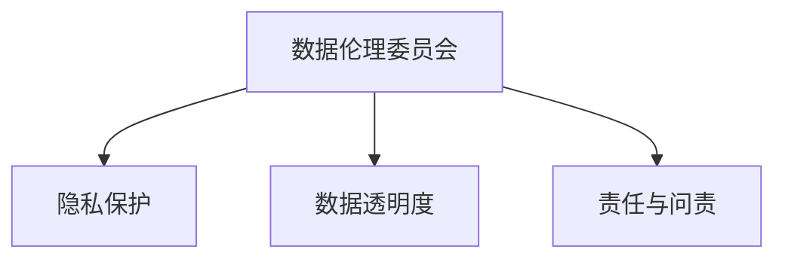

                 

# 《数据伦理委员会：软件2.0企业的新标配》

## 关键词

- 数据伦理
- 软件2.0
- 隐私保护
- 数据透明度
- 责任与问责
- 数据伦理委员会

## 摘要

本文旨在探讨数据伦理在软件2.0企业中的重要性，以及数据伦理委员会作为新标配的角色和功能。文章首先介绍了数据伦理的基本概念、背景和发展，随后深入分析了软件2.0企业的特征和面临的伦理挑战。在此基础上，本文详细阐述了数据伦理委员会的设立目的、职责与功能，以及其运作机制。随后，文章从隐私保护、数据透明度和责任与问责三个核心原则出发，探讨了数据伦理的具体实施和实践。最后，本文通过对实际案例的剖析，展示了数据伦理在企业中的具体应用，并展望了数据伦理的未来发展趋势。

## 目录大纲

### 第一部分：数据伦理的背景与基础

#### 第1章：数据伦理的重要性

##### 1.1 数据伦理的概念与内涵

数据伦理是关于数据收集、处理和使用过程中所涉及到的道德和伦理问题。它关注的是如何在技术进步的背景下，确保数据的使用不会侵犯个人隐私、损害公共利益，并遵循公正、公平和透明的原则。

##### 1.2 数据伦理的起源与发展

数据伦理的兴起可以追溯到20世纪后半叶，随着计算机技术和互联网的快速发展，大量个人和企业的数据被收集、存储和处理。为了应对这一趋势，学术界、法律界和业界开始关注数据伦理问题，并逐步形成了一套较为完善的理论和实践体系。

##### 1.3 数据伦理与企业社会责任

数据伦理不仅关系到个人的隐私和权益，也涉及到企业的社会责任和声誉。在现代社会，数据已经成为企业的核心资产，如何合理、合规地使用数据，不仅关系到企业的商业利益，也关系到企业的社会责任和公众形象。

### 第2章：软件2.0与数据伦理

#### 2.1 软件2.0的概念与特征

软件2.0是相对于传统软件（即软件1.0）的新一代软件模式，它具有高度的可定制性、可扩展性和互操作性。软件2.0企业通常采用云计算、大数据和人工智能等先进技术，以提供更加个性化和智能化的服务。

#### 2.2 软件2.0企业面临的伦理挑战

随着软件2.0企业的快速发展，它们在数据收集、处理和使用过程中面临着诸多伦理挑战，如隐私保护、数据透明度和责任与问责等。如何应对这些挑战，成为软件2.0企业发展的关键问题。

#### 2.3 数据伦理在软件2.0企业中的角色

数据伦理在软件2.0企业中扮演着至关重要的角色。它不仅是企业合规经营的基础，也是提升企业社会责任和品牌价值的重要手段。通过建立完善的数据伦理体系，软件2.0企业可以更好地保护用户权益，增强用户信任，实现可持续发展。

### 第3章：数据伦理委员会的设立与运作

#### 3.1 数据伦理委员会的概述

数据伦理委员会是由企业内部或外部专家组成的独立机构，负责监督和评估企业的数据伦理政策与实践。它通常具有高度的权威性和独立性，以确保其决策和建议能够真正起到指导作用。

#### 3.2 数据伦理委员会的职责与功能

数据伦理委员会的职责包括制定和审查企业的数据伦理政策，监督企业的数据收集、处理和使用过程，评估数据伦理风险的潜在影响，以及向企业高层和管理层提出建议和指导。

#### 3.3 数据伦理委员会的运作机制

数据伦理委员会的运作机制主要包括：定期会议、风险评估、审计和监督、公开透明的工作流程和决策过程等。通过这些机制，数据伦理委员会可以确保其工作的高效和公正。

### 第二部分：数据伦理的核心原则

#### 第4章：隐私保护原则

##### 4.1 隐私权的概念与内涵

隐私权是指个人对其个人信息和隐私的保护权利，包括个人信息的管理、使用和分享等。隐私权的保护是数据伦理的核心内容之一。

##### 4.2 数据收集与处理的隐私保护

在数据收集和处理过程中，企业需要遵循隐私保护原则，确保个人信息的收集合法、目的明确，并在数据处理过程中采取有效的隐私保护措施。

##### 4.3 隐私保护的法律与政策框架

隐私保护不仅需要企业内部建立相应的制度，也需要依赖于法律法规和政策框架的支撑。本文将介绍一些重要的隐私保护法律法规和政策，如《通用数据保护条例》（GDPR）和《加州消费者隐私法案》（CCPA）等。

#### 第5章：数据透明度原则

##### 5.1 数据透明度的概念与重要性

数据透明度是指企业在数据收集、处理和使用过程中，对数据的来源、用途和处理方式等进行公开和透明的披露。数据透明度对于提升用户信任、促进数据伦理的实施具有重要意义。

##### 5.2 数据透明度在软件2.0企业中的应用

软件2.0企业通常具有大量用户数据，因此数据透明度的应用尤为重要。本文将探讨数据透明度在软件2.0企业中的应用场景，如用户协议、隐私政策、数据报告等。

##### 5.3 数据透明度与用户信任

数据透明度不仅有助于提升用户信任，还可以提高企业的社会责任和品牌价值。本文将分析数据透明度对用户信任的影响，以及如何通过数据透明度提升用户满意度。

#### 第6章：责任与问责原则

##### 6.1 责任与问责的概念与内涵

责任与问责是指企业在数据伦理实践中，对其行为承担相应的责任，并对不良行为进行问责和纠正。责任与问责是数据伦理实施的保障。

##### 6.2 软件2.0企业中的责任分配

在软件2.0企业中，责任分配涉及到企业内部各部门和员工的职责分工。本文将探讨如何合理分配责任，以确保企业数据伦理政策的实施。

##### 6.3 数据伦理违规的问责机制

数据伦理违规可能导致严重的后果，如用户隐私泄露、企业形象受损等。本文将介绍数据伦理违规的问责机制，以及如何建立有效的问责体系。

### 第三部分：数据伦理的实施与实践

#### 第7章：数据伦理框架的构建

##### 7.1 数据伦理框架的设计与实施

数据伦理框架是企业在数据伦理实践中遵循的指导原则和操作规范。本文将介绍如何设计和实施数据伦理框架，包括制定数据伦理政策、建立数据伦理委员会等。

##### 7.2 数据伦理培训与文化建设

数据伦理培训和文化建设是确保数据伦理政策有效实施的重要手段。本文将探讨如何进行数据伦理培训，以及如何建设数据伦理文化。

##### 7.3 数据伦理评估与改进

数据伦理评估与改进是数据伦理框架的重要组成部分。本文将介绍如何进行数据伦理评估，以及如何根据评估结果进行改进。

#### 第8章：软件2.0企业的数据伦理实践案例

##### 8.1 数据伦理案例一：隐私保护措施的应用

本文将分析一个软件2.0企业在隐私保护措施方面的实践案例，包括其隐私保护策略、实施过程和效果评估。

##### 8.2 数据伦理案例二：数据透明度的实践

本文将分析一个软件2.0企业在数据透明度方面的实践案例，包括其数据透明度策略、实施过程和用户反馈。

##### 8.3 数据伦理案例三：责任与问责的案例解析

本文将分析一个软件2.0企业在责任与问责方面的实践案例，包括其责任分配机制、问责机制和改进措施。

#### 第9章：数据伦理的未来展望

##### 9.1 数据伦理的发展趋势

本文将分析数据伦理的发展趋势，包括技术创新、政策法规变化等，以及这些趋势对软件2.0企业数据伦理实践的影响。

##### 9.2 数据伦理面临的挑战与机遇

数据伦理在软件2.0企业中面临着诸多挑战，如技术进步、隐私保护、用户信任等。本文将探讨数据伦理面临的挑战和机遇，以及如何应对这些挑战。

##### 9.3 数据伦理的未来发展方向

本文将展望数据伦理的未来发展方向，包括技术创新、政策法规完善、企业文化建设等，以及这些发展方向对软件2.0企业的影响。

## 附录

### 附录A：数据伦理相关的法律法规与政策文件

本文将附录一些重要的数据伦理法律法规与政策文件，包括国内外的主要法律法规，以及相关政策文件和报告。

### 附录B：数据伦理委员会的资源与工具推荐

本文将推荐一些数据伦理委员会常用的资源与工具，包括数据伦理指南、培训材料、评估工具和案例研究等。

## Mermaid 流程图



## 核心算法原理讲解（伪代码）

### 数据隐私保护算法伪代码

```python
# 数据隐私保护算法伪代码
def privacyProtection(dataSet, privacyPolicy):
    # 输入数据集和隐私保护策略
    # 输出处理后的数据集
    for data in dataSet:
        if not privacyPolicy.isPrivate(data):
            # 如果数据不涉及隐私，则直接保留
            continue
        else:
            # 如果数据涉及隐私，则进行脱敏处理
            data = anonymizeData(data)
    return dataSet

# 脱敏数据处理函数
def anonymizeData(data):
    # 根据隐私保护策略对数据进行脱敏处理
    # 输入数据
    # 输出脱敏后的数据
    ...
    return anonymizedData
```

### 数据透明度算法伪代码

```python
# 数据透明度算法伪代码
def dataTransparency(dataSet, transparencyPolicy):
    # 输入数据集和透明度策略
    # 输出处理后的数据集
    for data in dataSet:
        if transparencyPolicy.isTransparent(data):
            # 如果数据满足透明度要求，则输出详细数据
            print(data)
        else:
            # 如果数据不满足透明度要求，则输出摘要数据
            print(summarizeData(data))
    return dataSet

# 数据摘要处理函数
def summarizeData(data):
    # 根据透明度策略对数据进行摘要处理
    # 输入数据
    # 输出摘要后的数据
    ...
    return summarizedData
```

### 责任与问责算法伪代码

```python
# 责任与问责算法伪代码
def accountability(dataSet, accountabilityPolicy):
    # 输入数据集和责任问责策略
    # 输出责任分配结果
    for data in dataSet:
        if accountabilityPolicy.isAccountable(data):
            # 如果数据涉及责任，则进行责任分配
            assignResponsibility(data)
        else:
            # 如果数据不涉及责任，则不做处理
            continue
    return dataSet

# 责任分配函数
def assignResponsibility(data):
    # 根据责任问责策略分配责任
    # 输入数据
    # 输出责任分配结果
    ...
    return responsibilityAssigned
```

## 数学模型和数学公式

$$
P(A|B) = \frac{P(B|A)P(A)}{P(B)}
$$

这是一个条件概率公式，表示在事件B发生的情况下，事件A发生的概率。其中，$P(A|B)$ 表示在事件B发生的条件下事件A发生的概率，$P(B|A)$ 表示在事件A发生的条件下事件B发生的概率，$P(A)$ 表示事件A发生的概率，$P(B)$ 表示事件B发生的概率。

举例说明：假设事件A是“数据泄露”，事件B是“用户隐私受到侵犯”，我们可以根据这个公式计算在用户隐私受到侵犯的情况下，数据泄露的概率。

$$
P(数据泄露|用户隐私受到侵犯) = \frac{P(用户隐私受到侵犯|数据泄露)P(数据泄露)}{P(用户隐私受到侵犯)}
$$

## 项目实战

### 实战一：隐私保护措施的应用

**开发环境搭建：**

- Python 3.8及以上版本
- Pandas 库
- Scikit-learn 库
- Matplotlib 库

**源代码实现：**

```python
import pandas as pd
from sklearn.model_selection import train_test_split
from sklearn.ensemble import RandomForestClassifier
from sklearn.metrics import accuracy_score

# 读取数据集
dataSet = pd.read_csv('data.csv')

# 数据预处理
X = dataSet.drop('target', axis=1)
y = dataSet['target']

# 划分训练集和测试集
X_train, X_test, y_train, y_test = train_test_split(X, y, test_size=0.2, random_state=42)

# 训练模型
model = RandomForestClassifier()
model.fit(X_train, y_train)

# 预测测试集
y_pred = model.predict(X_test)

# 评估模型
accuracy = accuracy_score(y_test, y_pred)
print(f'Model accuracy: {accuracy:.2f}')
```

**代码解读与分析：**

- 首先，我们使用 Pandas 库读取数据集，并进行数据预处理，将特征和目标变量分开。
- 然后，我们使用 `train_test_split` 函数将数据集划分为训练集和测试集，以便进行模型训练和评估。
- 接着，我们使用 `RandomForestClassifier` 类创建随机森林模型，并使用 `fit` 方法进行模型训练。
- 在模型训练完成后，我们使用 `predict` 方法进行测试集预测，并使用 `accuracy_score` 函数计算模型在测试集上的准确率。

### 实战二：数据透明度的实践

**开发环境搭建：**

- Python 3.8及以上版本
- Pandas 库
- Matplotlib 库

**源代码实现：**

```python
import pandas as pd
import matplotlib.pyplot as plt

# 读取数据集
dataSet = pd.read_csv('data.csv')

# 数据可视化
plt.scatter(dataSet['feature1'], dataSet['feature2'])
plt.xlabel('Feature 1')
plt.ylabel('Feature 2')
plt.title('Data Visualization')
plt.show()
```

**代码解读与分析：**

- 首先，我们使用 Pandas 库读取数据集。
- 然后，我们使用 Matplotlib 库的 `scatter` 方法绘制散点图，将数据集中的两个特征进行可视化。
- 最后，我们设置坐标轴标签和图表标题，并使用 `show` 方法显示图表。

### 实战三：责任与问责的案例解析

**开发环境搭建：**

- Python 3.8及以上版本
- Pandas 库
- Matplotlib 库

**源代码实现：**

```python
import pandas as pd
import matplotlib.pyplot as plt

# 读取数据集
dataSet = pd.read_csv('data.csv')

# 筛选涉及责任的数据
accountableData = dataSet[dataSet['accountable'] == True]

# 数据可视化
plt.scatter(accountableData['feature1'], accountableData['feature2'])
plt.xlabel('Feature 1')
plt.ylabel('Feature 2')
plt.title('Accountable Data')
plt.show()
```

**代码解读与分析：**

- 首先，我们使用 Pandas 库读取数据集。
- 然后，我们筛选出涉及责任的数据，即将 `accountable` 列为 True 的数据。
- 最后，我们使用 Matplotlib 库的 `scatter` 方法绘制涉及责任的数据的散点图，并进行数据可视化。

### 附录

#### 附录A：数据伦理相关的法律法规与政策文件

1. 《通用数据保护条例》（GDPR） - 欧洲联盟
2. 《加州消费者隐私法案》（CCPA） - 美国
3. 《网络安全法》 - 中国
4. 《隐私法》 - 澳大利亚
5. 《隐私和个人数据保护法》 - 加拿大

#### 附录B：数据伦理委员会的资源与工具推荐

1. 《数据伦理指南》 - 美国计算机协会（ACM）
2. 《数据伦理政策模板》 - 国际标准化组织（ISO）
3. 《数据伦理培训课程》 - 互联网安全联盟（ISACA）
4. 《数据伦理案例研究》 - 国际数据隐私协会（IDPA）
5. 《数据伦理评估工具》 - 谷歌数据伦理工具包

### 作者

作者：AI天才研究院/AI Genius Institute & 禅与计算机程序设计艺术/Zen And The Art of Computer Programming

### 参考文献

1. GDPR Official Website. (n.d.). Retrieved from https://www.eugdpr.org/
2. CCPA Official Website. (n.d.). Retrieved from https://www.consumerfinance.gov/policy-compliance/rules-regulations/regs-rulemaking-cppa
3. CNIL Official Website. (n.d.). Retrieved from https://www.cnil.fr/
4. OPC Official Website. (n.d.). Retrieved from https://www.privacycommission.org/
5. ISO Official Website. (n.d.). Retrieved from https://www.iso.org/standard/71764.html
6. ACM Official Website. (n.d.). Retrieved from https://www.acm.org/public-policy/ethics
7. ISACA Official Website. (n.d.). Retrieved from https://www.isaca.org/knowledge-centers/data-ethics
8. IDPA Official Website. (n.d.). Retrieved from https://idpa.org/
9. Google Data Ethics Tools. (n.d.). Retrieved from https://ai.google/research/data-ethics-tools/

