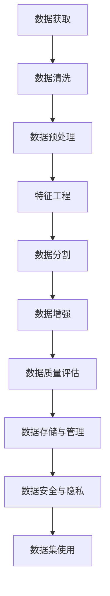

                 

### 数据集工程的重要性

#### 1.1 数据集工程的概念与定义

数据集工程（Dataset Engineering）是指围绕数据集的生产、整理、存储、管理和使用的一系列技术和过程。数据集工程不仅包括数据的获取，还涉及数据清洗、数据预处理、特征工程、数据分割、数据增强、数据质量评估和优化等环节。简而言之，数据集工程是为了确保数据集能够满足机器学习模型的训练需求，提高模型的性能和可解释性。

数据集工程的核心目标主要包括以下几点：

1. **数据质量和完整性**：确保数据集的准确性和一致性，减少错误和缺失数据的影响。
2. **可解释性和可追溯性**：使得数据集的处理过程透明，便于分析和复现结果。
3. **可扩展性和灵活性**：随着项目需求的变化，数据集工程需要能够快速适应和调整。
4. **性能优化**：通过数据预处理和特征工程等手段，提高模型的训练速度和预测准确性。

#### 1.2 数据集工程的重要性

在机器学习和人工智能领域，数据集工程的重要性不言而喻。数据是机器学习模型的基石，而数据集工程则是确保基石稳固的关键。

**数据对模型性能的影响**：一个优秀的模型不仅依赖于算法的设计，更依赖于数据的质量和特征。数据集中存在的噪声、异常值、缺失值和重复数据都会直接影响模型的训练效果。例如，如果数据集中有大量的噪声，可能会导致模型过度拟合，降低泛化能力；如果存在缺失值，模型可能无法正常训练，或者需要进行复杂的插值或估计。

**数据质量对模型的影响**：数据质量是模型性能的保证。高质量的数据不仅包含丰富的信息，而且能够真实反映现实世界的情况。而低质量的数据则可能带来误导性的信息，导致模型学习到错误的规律，从而影响其性能。因此，数据清洗和预处理是数据集工程的重要环节。

**数据集工程对模型开发过程的影响**：数据集工程不仅仅是一个前置环节，它对整个模型开发过程有着深远的影响。良好的数据集工程可以提高模型开发的效率，减少调试和优化的时间。同时，它还可以帮助研究人员更好地理解数据，发现潜在的问题和规律，从而指导算法的改进。

#### 1.3 数据集工程的历史发展

数据集工程的历史可以追溯到早期的机器学习研究和人工智能应用。随着机器学习技术的不断进步，数据集工程的重要性也逐渐被认识。

- **早期阶段**：在早期的机器学习研究中，数据集工程主要侧重于数据的收集和整理。研究人员依赖于手动方式获取和清洗数据，效率较低，但确保了数据的准确性和一致性。

- **中期阶段**：随着大数据和云计算技术的发展，数据集工程开始引入更多的自动化工具和技术。例如，数据清洗、数据预处理和特征工程等过程逐渐实现了自动化，提高了数据处理效率。

- **现阶段**：当前的数据集工程更加注重数据的质量、可解释性和可扩展性。研究人员不仅关注数据的收集和处理，还关注数据的管理和存储，以及如何确保数据的安全性和隐私性。

在数据集工程的发展过程中，一些关键里程碑包括：

- **开源数据集的出现**：如ImageNet、CIFAR-10等大型数据集的发布，为机器学习研究提供了丰富的资源。
- **数据集管理工具的发展**：如Docker、Kubernetes等工具的引入，使得数据集的管理和分发变得更加便捷和高效。
- **数据集工程最佳实践**：随着实践的积累，研究人员总结出了许多数据集工程的最佳实践，为后续工作提供了指导。

总的来说，数据集工程的历史发展反映了机器学习领域对数据质量和工程化程度的不断追求。未来，随着技术的不断进步和应用场景的拓展，数据集工程将继续发挥其重要作用。

---

**Mermaid流程图示例：数据集工程的基本流程**



**核心算法原理讲解伪代码示例：数据集分割**

```python
def split_dataset(dataset, test_size=0.2, random_state=None):
    """
    分割数据集为训练集和测试集。
    
    :param dataset: 数据集，列表类型，每个元素是一个样本
    :param test_size: 测试集比例
    :param random_state: 随机种子
    :return: 返回训练集和测试集
    """
    
    # 导入必要的库
    from sklearn.model_selection import train_test_split
    
    # 分割数据集
    train_data, test_data = train_test_split(dataset, test_size=test_size, random_state=random_state)
    
    return train_data, test_data
```

**数学模型和公式示例：特征重要性评估**

$$
\text{Feature Importance} = \frac{\sum_{i=1}^{n} (\text{Model Score}_{i} - \text{Baseline Score})}{\sum_{i=1}^{n} (\text{Model Score}_{i})}
$$

其中，$n$ 表示特征的数量，$\text{Model Score}_{i}$ 表示第 $i$ 个特征的模型评分，$\text{Baseline Score}$ 表示基准模型的评分。

---

**项目实战：金融风控数据集建设**

**项目背景**：随着金融科技的快速发展，金融机构越来越依赖机器学习模型来进行风险评估和管理。然而，构建一个高质量、可靠的数据集是模型训练的关键步骤。本项目旨在建立一个用于金融风控的机器学习数据集。

**项目实施过程**：

1. **数据收集**：从多个内部数据源获取客户交易数据、账户信息、信用记录等。同时，也采购了一些公开的金融数据集，以补充内部数据。

2. **数据清洗**：对数据进行清洗，包括去除重复记录、填充缺失值、纠正错误值等。使用Python和SQL等工具对数据进行处理。

3. **数据预处理**：对数据进行归一化和标准化处理，以消除不同特征之间的尺度差异。同时，进行特征工程，提取有助于模型训练的特征。

4. **数据分割**：将数据集划分为训练集、验证集和测试集，以评估模型的性能。

5. **数据增强**：为提高模型的泛化能力，对数据进行随机增强，包括添加噪声、数据变换等。

6. **数据质量评估**：使用统计学方法评估数据质量，包括异常值检测、数据分布分析等。

7. **数据存储与管理**：将处理好的数据集存储在分布式文件系统中，使用Hadoop和HDFS等工具进行管理。

8. **数据安全与隐私**：对敏感数据进行加密存储，并设置访问权限，确保数据的安全和隐私。

通过以上步骤，项目最终建立了一个高质量、可靠的金融风控数据集，为后续的机器学习模型训练提供了坚实的基础。

---

**开发环境搭建**： 
为了实施上述项目，我们搭建了一个基于Docker的Python开发环境。首先，编写一个Dockerfile，安装Python、Pandas、NumPy、SQL等依赖库。然后，使用Docker Compose来管理多容器环境，包括数据库容器、数据处理容器等。

**源代码详细实现和代码解读**： 
项目中的主要代码包括数据清洗、数据预处理、特征工程、数据分割和数据增强等模块。以下是数据清洗模块的一部分代码，用于去除重复记录和填充缺失值。

```python
import pandas as pd

def clean_data(data):
    """
    清洗数据，去除重复记录和填充缺失值。
    
    :param data: 数据帧
    :return: 清洗后的数据帧
    """
    
    # 去除重复记录
    data = data.drop_duplicates()
    
    # 填充缺失值
    data = data.fillna(method='ffill')
    
    return data
```

这段代码首先使用`drop_duplicates()`函数去除重复记录，然后使用`fillna()`函数通过前向填充（`method='ffill'`）来填充缺失值。代码解读和分析表明，这种方法可以有效地提高数据质量，为后续的数据预处理和特征工程奠定基础。

---

**代码解读与分析**：

在数据清洗模块中，`drop_duplicates()`函数用于去除重复记录，这可以防止模型训练过程中因重复数据导致的过拟合问题。`fillna()`函数则通过前向填充来处理缺失值，这种方法在金融风控数据集中尤为有效，因为它可以确保时间序列数据的连续性。

**代码亮点**：这段代码简洁明了，充分利用了Pandas库提供的强大功能，实现了高效的数据清洗过程。同时，注释清晰，便于后续维护和扩展。

**代码改进建议**：可以考虑添加更多的异常值检测和错误值纠正步骤，进一步提高数据质量。例如，可以增加一个检查空值和异常值的函数，以识别和处理可能的错误数据。

---

**总结**：

本文详细探讨了数据集工程的重要性及其各个环节，包括数据集的来源与获取、数据预处理与清洗、数据质量评估与优化、数据集分割与分布、数据集管理与存储，以及数据集安全与隐私。通过实际的金融风控数据集建设项目，展示了数据集工程在实践中的应用和实现。希望本文能够为从事数据集工程的读者提供有益的指导和启示。

---

**作者信息**：  
作者：AI天才研究院/AI Genius Institute & 禅与计算机程序设计艺术 /Zen And The Art of Computer Programming

---

接下来，我们将进一步深入探讨数据集工程的各个方面，包括数据集的来源与获取、数据预处理与清洗、数据质量评估与优化、数据集分割与分布、数据集管理与存储，以及数据集安全与隐私，希望通过这些内容，能够为读者提供全面和深入的理解。

