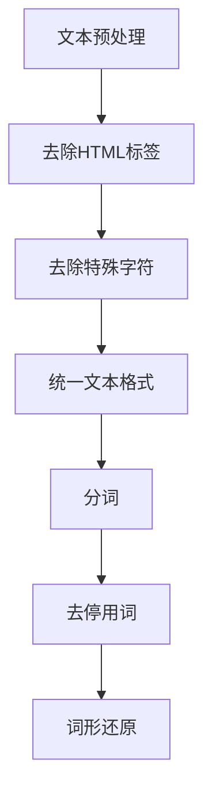
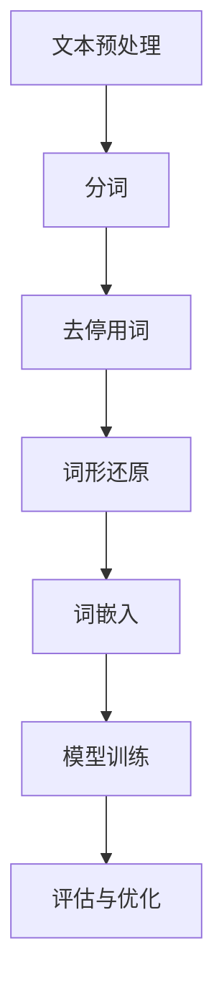
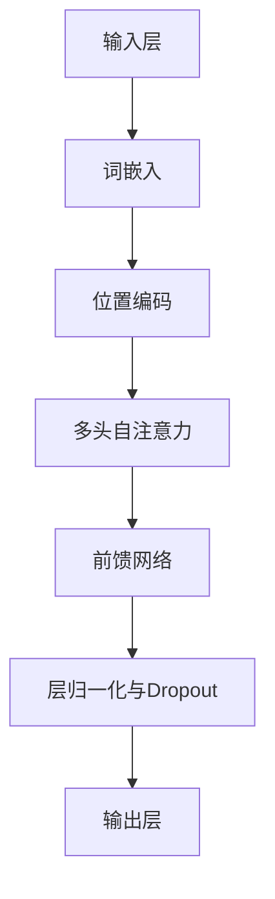
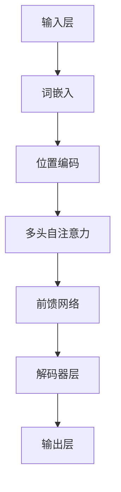

                 

### 文本向量模型（Text Embedding Models）

> **关键词：** 文本向量化、词嵌入、深度学习、自然语言处理、BERT、GPT

> **摘要：** 本文将深入探讨文本向量模型的基础、传统和现代方法，包括TF-IDF、Word2Vec、神经网络和Transformer等。我们将通过详细的算法讲解、流程图、伪代码、数学公式和实际案例，帮助读者全面理解文本向量模型的核心概念和应用。

文本向量模型（Text Embedding Models）是自然语言处理（NLP）领域的关键技术之一。文本向量模型将文本转换为计算机可以理解和处理的数值向量，使得计算机能够更好地理解和分析文本数据。本文将分为七个主要章节，系统性地介绍文本向量模型的基础知识、传统方法、深度学习方法以及现代模型，并通过实际案例分析展示其在文本分类、文本相似度和自然语言生成等任务中的应用。

### 《文本向量模型（Text Embedding Models）》书籍目录大纲

#### 第一部分: 文本向量模型基础

**第1章: 文本向量模型概述**

- 1.1 文本向量化的背景与意义
- 1.2 文本向量化的挑战
- 1.3 文本向量化的应用领域

**第2章: 基础概念与流程**

- 2.1 文本预处理
  - 2.1.1 分词
  - 2.1.2 去停用词
  - 2.1.3 词形还原
- 2.2 向量表示方法
  - 2.2.1 一位一位（One-Hot Encoding）
  - 2.2.2 稀疏向量
  - 2.2.3 词嵌入（Word Embedding）

**第3章: 传统文本向量模型**

- 3.1 TF-IDF模型
  - 3.1.1 TF-IDF公式与计算
  - 3.1.2 TF-IDF的优势与局限性
- 3.2 Word2Vec模型
  - 3.2.1 Skip-Gram模型
  - 3.2.2 Continuous Bag of Words (CBOW)模型
  - 3.2.3 Word2Vec模型训练过程

**第4章: 深度学习文本向量模型**

- 4.1 神经网络在文本向量中的应用
  - 4.1.1 基本结构与原理
  - 4.1.2 卷积神经网络（CNN）
  - 4.1.3 循环神经网络（RNN）
- 4.2 词嵌入与深度学习结合
  - 4.2.1 Embedding层
  - 4.2.2 LSTM与GRU模型
  - 4.2.3 Transformer模型

**第5章: 现代文本向量模型**

- 5.1 BERT模型
  - 5.1.1 BERT模型的原理与结构
  - 5.1.2 预训练与微调
- 5.2 GPT模型
  - 5.2.1 GPT模型的原理与结构
  - 5.2.2 语言模型预训练
- 5.3 其他现代文本向量模型
  - 5.3.1 RoBERTa
  - 5.3.2 XLNet
  - 5.3.3 ALBERT

**第6章: 文本向量模型应用案例分析**

- 6.1 文本分类应用
  - 6.1.1 文本分类任务介绍
  - 6.1.2 文本分类实战
- 6.2 文本相似度应用
  - 6.2.1 文本相似度计算方法
  - 6.2.2 文本相似度应用案例
- 6.3 自然语言生成应用
  - 6.3.1 自然语言生成任务介绍
  - 6.3.2 文本生成实战

**第7章: 文本向量模型未来发展趋势**

- 7.1 新模型与技术展望
- 7.2 面临的挑战与解决方案
- 7.3 应用前景与影响

#### 附录

- 附录A: 文本向量模型学习资源推荐
- 附录B: 常用文本向量模型库与工具简介
- 附录C: Mermaid流程图示例
  - C.1 文本向量模型训练流程图
  - C.2 BERT模型结构图
  - C.3 GPT模型结构图

通过以上目录结构，读者将逐步深入文本向量模型的世界，掌握从基础概念到高级应用的全套知识体系。接下来，我们将从文本向量化的背景与意义开始，逐步探讨文本向量模型的发展历程和应用实践。让我们开始这段技术之旅吧！

---

### 第1章: 文本向量模型概述

文本向量模型是自然语言处理（NLP）领域的关键技术，其核心目标是将文本数据转换为计算机可以处理的数值向量表示。这一过程称为文本向量化（text vectorization），其目的是为了解决计算机无法直接处理文本数据的问题。文本向量模型在许多NLP任务中扮演着至关重要的角色，包括文本分类、情感分析、信息检索、机器翻译、文本相似度计算和自然语言生成等。

#### 1.1 文本向量化的背景与意义

随着互联网和社交媒体的快速发展，文本数据呈现爆炸性增长。传统的基于规则和手动的文本处理方法已经难以应对如此庞大的数据规模。为了充分利用这些文本数据，我们需要将它们转化为机器可处理的向量形式，以便各种机器学习和深度学习算法能够有效地分析和挖掘其中的信息。

文本向量化的背景可以追溯到计算机科学的早期阶段，当时人们试图通过将文本映射到高维空间来解决文本分类问题。随着数据驱动方法的兴起，特别是深度学习技术的进步，文本向量化变得更加成熟和高效。现代文本向量模型能够捕捉文本中的语义信息，使得计算机能够更准确地理解文本内容。

#### 1.2 文本向量化的挑战

文本向量化面临多个挑战，包括但不限于：

- **高维数据：** 文本数据通常具有非常高的维度，因为词汇表可能包含数百万个单词。处理高维数据会导致计算成本高昂，且可能引起维度灾难（curse of dimensionality）。
- **语义理解：** 文本中蕴含的语义信息非常复杂，简单的向量表示方法可能难以捕捉到这些语义信息。例如，同一词汇在不同上下文中可能具有不同的含义。
- **稀疏性：** 文本数据通常是稀疏的，因为大部分文档中只包含词汇表中的一小部分单词。稀疏数据在计算和存储上存在挑战。
- **上下文依赖：** 文本中的词汇意义往往依赖于上下文。例如，“bank”一词在“银行”和“河岸”两个不同的上下文中有不同的含义。传统的词袋模型（Bag of Words）无法捕捉这种上下文依赖。

#### 1.3 文本向量化的应用领域

文本向量化在多个应用领域中发挥着重要作用：

- **文本分类：** 将文本分类为不同的类别，如垃圾邮件检测、情感分析、新闻分类等。
- **信息检索：** 基于文本内容进行搜索，如搜索引擎、推荐系统等。
- **机器翻译：** 将一种语言的文本翻译为另一种语言。
- **情感分析：** 分析文本中的情感倾向，如产品评论分析、社交媒体情绪分析等。
- **文本相似度计算：** 计算文本之间的相似度，用于文档相似性检测、内容审核等。
- **自然语言生成：** 生成符合语法和语义规则的文本，如自动摘要、对话系统等。

通过文本向量化，我们能够将抽象的文本数据转化为结构化的向量表示，这为机器学习和深度学习算法提供了强大的工具。在接下来的章节中，我们将详细探讨文本向量化的基础概念、流程和传统方法。

---

### 第2章: 基础概念与流程

在深入了解文本向量模型之前，我们需要了解文本向量化的基础概念和流程。文本向量化是将文本数据转换为向量表示的过程，这一过程包括文本预处理、分词、去停用词、词形还原等步骤。这些步骤不仅有助于简化文本数据，提高计算效率，还能够更好地捕捉文本的语义信息。

#### 2.1 文本预处理

文本预处理是文本向量化的第一步，其目的是清理和简化原始文本数据，为后续的向量表示做准备。文本预处理通常包括以下步骤：

- **去除HTML标签：** 文本数据中可能包含HTML标签，如`<p>`, `<a>`, `<b>`等。这些标签在文本分析中并无实际意义，需要去除。
- **去除特殊字符：** 删除文本中的特殊字符，如`@`, `#`, `$`, `%`等，这些字符通常与文本的语义无关。
- **统一文本格式：** 将所有文本转换为统一格式，如小写或大写。这一步骤有助于简化文本数据，避免因大小写差异而产生的歧义。

#### 2.1.1 分词

分词（tokenization）是将文本拆分为更小、更易于处理的单元的过程。分词是文本分析中最基础的一步，其质量直接影响后续处理的效果。常见的分词方法包括：

- **基于字符的分词：** 将文本拆分为单个字符。
- **基于词典的分词：** 利用预定义的词典将文本拆分为已知词汇。
- **基于统计的分词：** 使用统计方法（如N-gram模型、隐马尔可夫模型（HMM）等）将文本拆分为词单元。

Mermaid流程图示例：



#### 2.1.2 去停用词

停用词（stop words）是指那些在文本中频繁出现但通常不包含实际信息的词汇。例如，英语中的“the”, “is”, “and”等。去除停用词有助于减少数据中的噪声，提高文本分析的效率。常见的去停用词方法包括：

- **手动定义：** 根据领域知识和经验手动定义停用词列表。
- **自动检测：** 使用统计方法（如TF-IDF）自动识别低信息量的词汇。

Mermaid流程图示例：


#### 2.1.3 词形还原

词形还原（lemmatization）是将不同形式的同一词汇还原为其基本形式的过程。例如，将“running”还原为“run”。词形还原有助于减少词汇表的维度，提高文本分析的效果。常见的词形还原方法包括：

- **基于规则的词形还原：** 利用预定义的规则将词汇还原为基本形式。
- **基于统计的词形还原：** 使用统计模型（如隐马尔可夫模型（HMM）、条件随机场（CRF）等）进行词形还原。

Mermaid流程图示例：


通过文本预处理、分词、去停用词和词形还原等步骤，我们能够将原始文本数据转化为更简洁、更易于处理的向量表示。在下一章中，我们将深入探讨文本的向量表示方法，包括一位一位编码、稀疏向量和词嵌入。

---

### 第3章: 传统文本向量模型

传统文本向量模型是文本向量化技术发展的早期形式，主要包括TF-IDF模型和Word2Vec模型。这些模型虽然在现代深度学习模型面前显得有些简陋，但它们在文本分析任务中仍具有广泛应用。本章节将详细介绍TF-IDF模型和Word2Vec模型的工作原理、优点和局限性。

#### 3.1 TF-IDF模型

TF-IDF（Term Frequency-Inverse Document Frequency）是一种传统的文本向量表示方法，主要用于文本分类和信息检索任务。TF-IDF模型的核心思想是，一个词在文档中的重要程度不仅取决于它在文档中出现的频率（词频TF），还取决于它在整个文档集合中出现的频率（逆文档频率IDF）。

##### 3.1.1 TF-IDF公式与计算

TF-IDF模型的计算公式如下：

$$
TF-IDF = TF \times IDF
$$

其中，$TF$表示词频（Term Frequency），计算公式为：

$$
TF = \frac{f_t}{f_{\text{total}}}
$$

$f_t$表示词$t$在文档$d$中出现的次数，$f_{\text{total}}$表示文档$d$中所有词出现的总次数。

$IDF$表示逆文档频率（Inverse Document Frequency），计算公式为：

$$
IDF = \log \left( \frac{N}{df_t} \right)
$$

其中，$N$表示文档集合中的总文档数，$df_t$表示包含词$t$的文档数。

通过将TF和IDF相乘，我们得到一个词在文档中的TF-IDF值，从而为文档生成一个向量表示。

##### 3.1.2 TF-IDF的优势与局限性

**优势：**

1. **计算简单：** TF-IDF模型计算公式简单，易于实现。
2. **可扩展性：** TF-IDF模型适用于大规模文本数据集，且文档数量不会对计算复杂度产生显著影响。
3. **语义相关性：** TF-IDF模型能够捕捉词在文档和文档集合中的相对重要性，有助于提高文本分类和信息检索的准确性。

**局限性：**

1. **忽略词序：** TF-IDF模型不考虑词的顺序，无法捕捉到词汇间的语义关系。
2. **高维稀疏数据：** TF-IDF模型生成的向量通常具有很高的维度和稀疏性，可能导致维度灾难（curse of dimensionality）。
3. **词汇表依赖：** TF-IDF模型依赖于预定义的词汇表，难以适应新的词汇或领域特定术语。

#### 3.2 Word2Vec模型

Word2Vec模型是另一种传统的文本向量表示方法，由Google在2013年提出。Word2Vec模型通过学习词的上下文信息，将词汇映射到低维度的向量空间中，使得具有相似上下文的词汇在向量空间中接近。Word2Vec模型主要包括两种模型：Skip-Gram模型和Continuous Bag of Words（CBOW）模型。

##### 3.2.1 Skip-Gram模型

Skip-Gram模型是一种基于窗口滑动的词向量生成方法。给定一个单词作为中心词（center word），Skip-Gram模型会在中心词周围选取一定数量的单词作为候选词（context words）。模型的目标是预测中心词给定上下文单词的概率。

**模型结构：**

- 输入：一个单词作为中心词，其上下文单词作为输入。
- 输出：一个单词作为输出，表示给定上下文单词时预测中心词的概率。

**训练过程：**

1. 随机初始化词向量。
2. 遍历单词序列，对于每个中心词，随机选择上下文单词。
3. 计算中心词和上下文单词的词向量。
4. 计算预测概率，并通过梯度下降更新词向量。

**伪代码：**

```python
# 初始化词向量
word_vectors = np.random.uniform(size=(V, D))

# 遍历单词序列
for center_word in vocabulary:
    # 随机选择上下文单词
    context_words = sample_context_words(center_word)
    for context_word in context_words:
        # 计算词向量
        center_vector = word_vectors[vocabulary.index(center_word)]
        context_vector = word_vectors[vocabulary.index(context_word)]
        # 计算预测概率
        prediction概率 = softmax(context_vector.dot(center_vector))
        # 计算梯度并更新词向量
        loss = -log(prediction概率)
        gradients = context_vector.dot(center_vector.T) - center_vector
        word_vectors[vocabulary.index(center_word)] -= learning_rate * gradients
```

##### 3.2.2 Continuous Bag of Words (CBOW)模型

CBOW模型是一种基于窗口滑动的词向量生成方法。给定一个单词作为中心词，CBOW模型会在中心词周围选取一定数量的单词作为输入，并将这些输入单词的词向量平均后预测中心词。

**模型结构：**

- 输入：中心词周围的多个上下文单词。
- 输出：一个单词作为输出，表示给定上下文单词时预测中心词的概率。

**训练过程：**

1. 随机初始化词向量。
2. 遍历单词序列，对于每个中心词，随机选择上下文单词。
3. 计算上下文单词的词向量平均值。
4. 计算预测概率，并通过梯度下降更新词向量。

**伪代码：**

```python
# 初始化词向量
word_vectors = np.random.uniform(size=(V, D))

# 遍历单词序列
for center_word in vocabulary:
    # 随机选择上下文单词
    context_words = sample_context_words(center_word)
    # 计算上下文单词的词向量平均值
    context_vector = np.mean([word_vectors[vocabulary.index(word)] for word in context_words], axis=0)
    # 计算预测概率
    prediction概率 = softmax(context_vector.dot(word_vectors.T))
    # 计算梯度并更新词向量
    loss = -log(prediction概率)
    gradients = context_vector.dot(word_vectors.T) - word_vectors
    word_vectors[vocabulary.index(center_word)] -= learning_rate * gradients
```

##### 3.2.3 Word2Vec模型训练过程

Word2Vec模型的训练过程主要包括以下步骤：

1. **数据预处理：** 将文本数据转换为单词序列，并分词、去停用词和词形还原。
2. **构建词汇表：** 将单词序列中的所有单词构建为一个词汇表。
3. **初始化词向量：** 随机初始化词向量，通常使用均匀分布。
4. **选择中心词和上下文单词：** 对于每个单词序列，随机选择中心词和上下文单词。
5. **计算预测概率：** 使用Skip-Gram或CBOW模型计算给定上下文单词时预测中心词的概率。
6. **更新词向量：** 通过梯度下降更新词向量，以最小化预测损失。

通过Word2Vec模型，我们可以将文本中的词汇映射到低维度的向量空间中，使得具有相似上下文的词汇在向量空间中接近。Word2Vec模型在文本分类、文本相似度计算和自然语言生成等领域具有广泛应用。

---

在了解了传统文本向量模型的基础知识后，我们将转向深度学习在文本向量化中的应用。深度学习模型，如循环神经网络（RNN）、卷积神经网络（CNN）和Transformer，为文本向量模型带来了革命性的变化。这些深度学习模型能够更好地捕捉文本中的语义信息，提高文本分析的准确性。下一章将详细介绍深度学习文本向量模型的基本原理和应用。

---

### 第4章: 深度学习文本向量模型

深度学习在自然语言处理领域取得了显著进展，尤其是深度学习文本向量模型。这些模型通过学习大量文本数据中的复杂结构，能够更好地捕捉文本中的语义信息。本章将介绍深度学习文本向量模型的基本原理和应用，包括循环神经网络（RNN）、卷积神经网络（CNN）和Transformer。

#### 4.1 神经网络在文本向量中的应用

神经网络是一种通过模拟人脑神经元结构进行信息处理的计算模型。在文本向量模型中，神经网络可以通过学习大量文本数据来提取语义特征，并将其映射到高维空间中。

##### 4.1.1 基本结构与原理

神经网络由多个层次组成，包括输入层、隐藏层和输出层。每个层次由多个神经元（节点）组成，神经元之间通过加权连接进行信息传递。

- **输入层：** 接收文本数据，并将其编码为向量表示。
- **隐藏层：** 通过非线性激活函数（如ReLU、Sigmoid、Tanh等）对输入数据进行变换，提取特征。
- **输出层：** 根据训练目标生成预测结果。

神经网络通过反向传播算法（backpropagation）不断调整权重，以最小化预测误差。反向传播算法包括以下几个步骤：

1. 计算输出误差。
2. 通过链式法则计算梯度。
3. 更新权重。

##### 4.1.2 卷积神经网络（CNN）

卷积神经网络（Convolutional Neural Network，CNN）最初主要用于图像处理，但在文本向量模型中也表现出强大的能力。CNN通过卷积操作和池化操作提取文本数据中的局部特征。

- **卷积操作：** 卷积层通过滑动窗口（卷积核）对输入数据进行卷积，提取特征图。
- **池化操作：** 池化层通过下采样操作减少特征图的维度，提高模型计算效率。

CNN在文本向量模型中的应用主要包括：

- **词嵌入层：** 将词汇映射到高维空间。
- **卷积层：** 提取文本中的局部特征。
- **池化层：** 下采样特征图，减少模型参数。
- **全连接层：** 将卷积特征映射到输出层，生成预测结果。

##### 4.1.3 循环神经网络（RNN）

循环神经网络（Recurrent Neural Network，RNN）是一种具有循环结构的人工神经网络。RNN通过记忆机制（通常使用循环单元，如LSTM和GRU）处理序列数据，使其能够捕捉序列中的时间依赖关系。

- **循环单元：** RNN中的循环单元在处理序列数据时，能够将前一个时间步的输出作为当前时间步的输入，从而实现信息的记忆。
- **前向传播：** RNN在每个时间步对输入数据进行处理，生成当前时间步的输出。
- **反向传播：** 通过反向传播算法更新模型参数。

RNN在文本向量模型中的应用主要包括：

- **词嵌入层：** 将词汇映射到高维空间。
- **循环层：** 对文本序列进行编码，提取序列特征。
- **全连接层：** 将循环层输出的序列特征映射到输出层，生成预测结果。

##### 4.1.4 LSTM与GRU模型

长短期记忆网络（Long Short-Term Memory，LSTM）和门控循环单元（Gated Recurrent Unit，GRU）是RNN的两个变体，旨在解决传统RNN在处理长序列数据时出现的梯度消失和梯度爆炸问题。

- **LSTM：** LSTM通过引入三个门控单元（输入门、遗忘门和输出门）来实现对信息的记忆和控制。LSTM能够有效地学习长序列数据中的长期依赖关系。
- **GRU：** GRU是LSTM的简化版本，通过合并输入门和遗忘门，减少模型参数。

LSTM和GRU在文本向量模型中的应用与RNN类似，但它们在处理长序列数据时具有更好的性能。

##### 4.1.5 Transformer模型

Transformer模型是由Google在2017年提出的一种基于自注意力机制（self-attention）的深度学习模型，它在自然语言处理任务中取得了显著的效果。

- **自注意力机制：** Transformer模型通过自注意力机制，能够自动学习每个词之间的相对重要性，从而更好地捕捉文本中的语义信息。
- **多头注意力：** Transformer模型使用多个注意力头（head）来同时关注不同范围的文本特征，从而提高模型的泛化能力。
- **前馈神经网络：** Transformer模型在每个自注意力层之后添加一个前馈神经网络，进一步提取特征。

Transformer模型在文本向量模型中的应用主要包括：

- **词嵌入层：** 将词汇映射到高维空间。
- **自注意力层：** 通过自注意力机制捕捉文本序列中的依赖关系。
- **前馈神经网络：** 对自注意力层输出的特征进行进一步处理。
- **输出层：** 生成预测结果。

通过介绍神经网络、CNN、RNN、LSTM、GRU和Transformer等深度学习模型，我们能够更好地理解深度学习文本向量模型的基本原理和应用。这些模型在文本分类、文本相似度计算和自然语言生成等任务中表现出色。在下一章中，我们将探讨现代文本向量模型，包括BERT、GPT和其他先进的模型。

---

### 第5章: 现代文本向量模型

随着深度学习技术的不断发展，现代文本向量模型在捕捉文本语义信息方面取得了显著的突破。本章将介绍几种现代文本向量模型，包括BERT、GPT和其他相关模型，详细探讨其原理、结构和训练方法。

#### 5.1 BERT模型

BERT（Bidirectional Encoder Representations from Transformers）是由Google在2018年提出的一种基于Transformer的自注意力机制的预训练模型。BERT模型通过双向编码器（bidirectional encoder）学习文本的上下文信息，从而在自然语言处理任务中取得了优异的性能。

##### 5.1.1 BERT模型的原理与结构

BERT模型的主要组成部分包括词嵌入层、Transformer编码器、层归一化和Dropout。

- **词嵌入层：** BERT模型使用WordPiece算法对词汇进行分词，并将词汇映射到高维空间。
- **Transformer编码器：** BERT模型采用Transformer架构，通过多头自注意力机制学习文本的上下文信息。编码器由多个自注意力层和前馈网络组成。
- **层归一化：** 层归一化（Layer Normalization）用于稳定模型训练过程。
- **Dropout：** Dropout是一种正则化方法，通过随机丢弃部分神经元来防止模型过拟合。

BERT模型有两种预训练任务：

- **遮蔽语言模型（Masked Language Model，MLM）：** 在文本序列中随机遮蔽一些词，模型需要预测这些遮蔽词。
- **下一个句子预测（Next Sentence Prediction，NSP）：** 给定两个句子，模型需要预测这两个句子是否属于同一个段落。

##### 5.1.2 预训练与微调

BERT模型采用两阶段训练策略：

1. **预训练：** 在大规模文本语料库上进行预训练，使BERT模型学习通用语义特征。
2. **微调：** 将预训练的BERT模型应用于特定任务，通过在任务数据上进行微调，使其适应特定任务。

预训练过程中，BERT模型通过以下步骤进行训练：

1. **分词与词嵌入：** 使用WordPiece算法对文本进行分词，并将词汇映射到高维空间。
2. **输入序列编码：** 将词汇嵌入到输入序列中，并在序列开头和结尾添加特殊的标记 `[CLS]` 和 `[SEP]`。
3. **自注意力机制：** 通过多个自注意力层和前馈网络学习文本的上下文信息。
4. **损失函数：** 训练过程中使用遮蔽语言模型（MLM）和下一个句子预测（NSP）任务生成损失函数。

微调过程中，BERT模型通过以下步骤进行训练：

1. **数据预处理：** 对任务数据进行预处理，包括分词、词嵌入和输入序列编码。
2. **损失函数：** 使用任务特定的损失函数，如分类任务的交叉熵损失。
3. **反向传播：** 通过反向传播算法更新模型参数。

BERT模型在自然语言处理任务中取得了优异的性能，包括文本分类、命名实体识别、情感分析等。

#### 5.2 GPT模型

GPT（Generative Pre-trained Transformer）是由OpenAI在2018年提出的一种基于Transformer的自回归语言模型。GPT模型通过预测下一个词来学习文本的生成过程，从而在文本生成任务中表现出色。

##### 5.2.1 GPT模型的原理与结构

GPT模型的主要组成部分包括词嵌入层、Transformer编码器、层归一化和Dropout。

- **词嵌入层：** GPT模型使用WordPiece算法对词汇进行分词，并将词汇映射到高维空间。
- **Transformer编码器：** GPT模型采用Transformer架构，通过自注意力机制学习文本的上下文信息。编码器由多个自注意力层和前馈网络组成。
- **层归一化：** 层归一化用于稳定模型训练过程。
- **Dropout：** Dropout是一种正则化方法，通过随机丢弃部分神经元来防止模型过拟合。

GPT模型采用自回归训练策略，通过以下步骤进行训练：

1. **数据预处理：** 对文本数据进行预处理，包括分词、词嵌入和输入序列编码。
2. **输入序列编码：** 将词汇嵌入到输入序列中，并在序列开头添加特殊的标记 `<s>`。
3. **自注意力机制：** 通过多个自注意力层和前馈网络学习文本的上下文信息。
4. **损失函数：** 使用交叉熵损失函数计算预测词与真实词之间的差异。

GPT模型通过预测下一个词来生成文本，从而在文本生成任务中表现出色。GPT模型在生成高质量文本、自动摘要、问答系统和对话系统等方面具有广泛的应用。

##### 5.2.2 语言模型预训练

GPT模型采用大规模文本语料库进行预训练，使模型学习通用语义特征。预训练过程中，GPT模型通过以下步骤进行训练：

1. **分词与词嵌入：** 使用WordPiece算法对文本进行分词，并将词汇映射到高维空间。
2. **输入序列编码：** 将词汇嵌入到输入序列中，并在序列开头添加特殊的标记 `<s>`。
3. **自注意力机制：** 通过多个自注意力层和前馈网络学习文本的上下文信息。
4. **损失函数：** 使用交叉熵损失函数计算预测词与真实词之间的差异。

通过预训练，GPT模型能够学习到大量的语言规律和知识，从而在生成文本时具有更高的准确性和自然性。

#### 5.3 其他现代文本向量模型

除了BERT和GPT模型，还有其他一些现代文本向量模型在自然语言处理任务中取得了显著效果。以下简要介绍几种主要的模型：

- **RoBERTa：** RoBERTa是BERT模型的变种，通过改进预训练任务和数据集，在多个自然语言处理任务中取得了更好的性能。
- **XLNet：** XLNet是Google提出的一种基于自注意力机制的Transformer模型，通过引入新的预训练任务和改进的Transformer架构，在多个自然语言处理任务中取得了优异的性能。
- **ALBERT：** ALBERT是Google提出的一种基于Transformer的文本向量模型，通过改进自注意力机制和预训练任务，在多个自然语言处理任务中取得了优异的性能。

这些现代文本向量模型在文本分类、文本相似度计算、自然语言生成等任务中表现出色，为自然语言处理领域的发展带来了新的机遇。

---

通过介绍BERT、GPT和其他现代文本向量模型，我们能够更好地理解现代深度学习技术在文本向量化中的应用。这些模型通过预训练和微调策略，能够学习到丰富的语义信息，从而在自然语言处理任务中取得优异的性能。在下一章中，我们将探讨文本向量模型在实际应用中的案例分析，进一步展示这些模型在文本分类、文本相似度和自然语言生成等任务中的强大能力。

---

### 第6章: 文本向量模型应用案例分析

文本向量模型在自然语言处理领域具有广泛的应用。本章将通过具体的案例，展示文本向量模型在文本分类、文本相似度计算和自然语言生成等任务中的应用，帮助读者深入了解这些模型在实际场景中的表现和效果。

#### 6.1 文本分类应用

文本分类是文本向量模型最常用的应用之一，其目标是将文本数据分类到预定义的类别中。常见的文本分类任务包括垃圾邮件检测、情感分析、新闻分类和主题检测等。

**案例：情感分析**

情感分析是一种常见的文本分类任务，其目标是判断文本表达的情感倾向，如正面、负面或中性。通过使用文本向量模型，我们可以将文本转换为向量表示，然后使用分类算法进行情感分类。

**实现步骤：**

1. **数据预处理：** 对文本数据执行分词、去停用词和词形还原等预处理步骤。
2. **词嵌入：** 使用预训练的文本向量模型（如Word2Vec、GPT或BERT）将文本转换为向量表示。
3. **特征提取：** 将词嵌入向量输入到分类模型，如支持向量机（SVM）、朴素贝叶斯（Naive Bayes）或深度学习模型（如CNN、LSTM或BERT）。
4. **模型训练：** 使用训练数据进行模型训练，并使用验证集进行超参数调优。
5. **模型评估：** 使用测试集对训练好的模型进行评估，计算准确率、召回率、F1分数等指标。

**实战示例：**

假设我们使用BERT模型进行情感分析。首先，我们将文本数据预处理后，使用BERT模型将文本转换为向量表示：

```python
from transformers import BertTokenizer, BertModel

tokenizer = BertTokenizer.from_pretrained('bert-base-uncased')
model = BertModel.from_pretrained('bert-base-uncased')

text = "I had a great time at the concert yesterday."
input_ids = tokenizer.encode(text, add_special_tokens=True)
outputs = model(input_ids)

last_hidden_state = outputs.last_hidden_state
```

然后，我们将词嵌入向量输入到分类模型中，例如使用softmax层进行分类：

```python
import torch.nn as nn

classifier = nn.Linear(last_hidden_state.size(-1), 2)  # 2 classes: positive and negative
logits = classifier(last_hidden_state[:, 0, :])

probabilities = nn.functional.softmax(logits, dim=1)
```

通过计算输出层的概率分布，我们可以判断文本的情感倾向：

```python
positive_probability = probabilities[0][1].item()
negative_probability = probabilities[0][0].item()

if positive_probability > negative_probability:
    print("The text is positive.")
else:
    print("The text is negative.")
```

**结果分析：**

通过以上步骤，我们可以对文本进行情感分类。在实际应用中，可以通过调整模型的参数、数据预处理方法和分类算法，提高分类的准确性和效果。

#### 6.2 文本相似度应用

文本相似度计算是另一个重要的文本向量模型应用。其目标是比较两个或多个文本的相似程度，常见于文本匹配、信息检索和问答系统等领域。

**案例：文本匹配**

文本匹配是一种常见的文本相似度计算任务，其目标是判断两个文本是否匹配。通过使用文本向量模型，我们可以将文本转换为向量表示，然后计算向量之间的相似度。

**实现步骤：**

1. **数据预处理：** 对文本数据执行分词、去停用词和词形还原等预处理步骤。
2. **词嵌入：** 使用预训练的文本向量模型（如Word2Vec、GPT或BERT）将文本转换为向量表示。
3. **相似度计算：** 计算两个文本向量之间的相似度，如余弦相似度或欧氏距离。
4. **阈值设定：** 设定一个阈值，判断两个文本是否匹配。

**实战示例：**

假设我们使用BERT模型进行文本匹配。首先，我们将文本数据预处理后，使用BERT模型将文本转换为向量表示：

```python
from transformers import BertTokenizer, BertModel

tokenizer = BertTokenizer.from_pretrained('bert-base-uncased')
model = BertModel.from_pretrained('bert-base-uncased')

text1 = "I had a great time at the concert yesterday."
text2 = "The concert yesterday was amazing."

input_ids1 = tokenizer.encode(text1, add_special_tokens=True)
input_ids2 = tokenizer.encode(text2, add_special_tokens=True)

outputs1 = model(input_ids1)
outputs2 = model(input_ids2)

last_hidden_state1 = outputs1.last_hidden_state
last_hidden_state2 = outputs2.last_hidden_state
```

然后，我们计算两个文本向量之间的相似度：

```python
import torch

similarity = torch.nn.functional.cosine_similarity(last_hidden_state1[:, 0, :], last_hidden_state2[:, 0, :])

print("Text similarity:", similarity)
```

**结果分析：**

通过计算文本向量之间的相似度，我们可以判断两个文本的匹配程度。在实际应用中，可以通过调整模型参数和相似度计算方法，提高文本匹配的准确性。

#### 6.3 自然语言生成应用

自然语言生成是文本向量模型的另一个重要应用。其目标是根据输入文本生成连贯、语义丰富的文本。自然语言生成广泛应用于自动摘要、问答系统和对话系统等领域。

**案例：自动摘要**

自动摘要是一种将长文本转换为简短、精炼摘要的任务。通过使用文本向量模型，我们可以将文本转换为向量表示，然后使用生成模型生成摘要。

**实现步骤：**

1. **数据预处理：** 对文本数据执行分词、去停用词和词形还原等预处理步骤。
2. **词嵌入：** 使用预训练的文本向量模型（如Word2Vec、GPT或BERT）将文本转换为向量表示。
3. **生成模型：** 使用生成模型（如GPT、Seq2Seq模型或BERT）生成摘要。
4. **解码：** 将生成模型输出的向量表示解码为文本。

**实战示例：**

假设我们使用GPT模型进行自动摘要。首先，我们将文本数据预处理后，使用GPT模型将文本转换为向量表示：

```python
from transformers import GPT2Tokenizer, GPT2LMHeadModel

tokenizer = GPT2Tokenizer.from_pretrained('gpt2')
model = GPT2LMHeadModel.from_pretrained('gpt2')

text = "I had a great time at the concert yesterday. The performers were amazing and the crowd was energetic."

input_ids = tokenizer.encode(text, add_special_tokens=True)
input_ids = input_ids.tolist()

for _ in range(10):  # Generate 10 different summaries
    summary_ids = model.generate(input_ids, max_length=50, num_return_sequences=1)
    summary = tokenizer.decode(summary_ids, skip_special_tokens=True)
    print("Summary:", summary)
```

**结果分析：**

通过以上步骤，我们可以生成文本的摘要。在实际应用中，可以通过调整模型参数和生成策略，提高摘要的质量和效果。

---

通过以上案例分析，我们可以看到文本向量模型在文本分类、文本相似度计算和自然语言生成等任务中的应用。这些模型通过将文本转换为向量表示，使得计算机能够更好地理解和处理文本数据。随着深度学习技术的不断发展，文本向量模型在自然语言处理领域的应用前景将更加广阔。

---

### 第7章: 文本向量模型未来发展趋势

文本向量模型在自然语言处理领域已经取得了显著的成果，但仍然面临许多挑战。随着技术的不断进步，未来文本向量模型的发展趋势将主要集中在以下几个方面。

#### 7.1 新模型与技术展望

随着深度学习技术的不断成熟，新的文本向量模型和算法层出不穷。以下是一些值得关注的模型和技术：

- **自适应嵌入（Adaptive Embeddings）：** 这种技术通过学习动态调整词嵌入的维度，以更好地捕捉文本中的复杂结构。
- **知识增强嵌入（Knowledge-Augmented Embeddings）：** 结合外部知识库（如维基百科、百科全书等）来增强词嵌入的语义表示。
- **多模态嵌入（Multimodal Embeddings）：** 结合文本和其他模态（如图像、声音等）的数据，以提供更丰富的语义表示。
- **因果嵌入（Causal Embeddings）：** 利用因果模型来学习词之间的因果关系，以更好地捕捉文本中的逻辑关系。

#### 7.2 面临的挑战与解决方案

尽管文本向量模型取得了显著进展，但仍然面临一些挑战：

- **语义歧义（Semantic Ambiguity）：** 文本中的词汇和短语可能具有多重含义，这使得模型难以准确捕捉语义。
- **上下文依赖（Context Dependency）：** 词汇的意义往往依赖于上下文，而现有的模型在处理长距离上下文依赖方面仍然存在局限。
- **数据隐私（Data Privacy）：** 随着数据隐私法规的加强，如何在保护用户隐私的同时进行有效的文本向量表示成为一大挑战。

为了解决这些挑战，研究人员提出了以下解决方案：

- **上下文感知嵌入（Context-Aware Embeddings）：** 利用上下文信息来动态调整词嵌入，以更好地捕捉语义。
- **预训练与微调（Pretraining and Fine-tuning）：** 通过大规模预训练和任务特定的微调，提高模型在特定任务中的性能。
- **联邦学习（Federated Learning）：** 通过联邦学习技术，允许多个参与者在不共享原始数据的情况下共同训练模型。

#### 7.3 应用前景与影响

文本向量模型在多个领域的应用前景广阔，包括：

- **智能问答（Intelligent Question-Answering）：** 利用文本向量模型来提高问答系统的准确性。
- **语音识别（Speech Recognition）：** 结合文本向量模型和语音识别技术，实现更准确的语音到文本转换。
- **机器翻译（Machine Translation）：** 利用文本向量模型来提高机器翻译的语义准确性。
- **文本生成（Text Generation）：** 通过文本向量模型生成高质量的自然语言文本，应用于自动摘要、内容创作等领域。

文本向量模型的发展将对自然语言处理领域产生深远影响，包括提高文本分析任务的性能、促进跨领域的知识共享，以及推动人工智能技术的发展。未来，随着新模型和技术的不断涌现，文本向量模型将迎来更加广阔的应用场景。

---

通过本章的探讨，我们可以看到文本向量模型在自然语言处理领域的重要性及其未来发展的潜力。随着技术的不断进步，文本向量模型将在更多应用场景中发挥关键作用，为人工智能的发展贡献重要力量。

---

### 附录

#### 附录A: 文本向量模型学习资源推荐

1. **《自然语言处理与深度学习》（刘知远 著）**：这是一本经典的中文自然语言处理教材，详细介绍了文本向量模型的相关知识。
2. **《深度学习》（Ian Goodfellow、Yoshua Bengio、Aaron Courville 著）**：这是一本深度学习领域的经典教材，其中包含了关于神经网络和深度学习的全面讲解。
3. **《自然语言处理：中文本挖掘》（KPCA+LDA 著）**：这是一本专注于中文自然语言处理的教材，涵盖了文本向量化的相关技术。

#### 附录B: 常用文本向量模型库与工具简介

1. **Hugging Face Transformers**：一个开源的文本处理库，提供了大量的预训练模型和工具，如BERT、GPT等。
2. **NLTK**：一个流行的自然语言处理工具包，提供了丰富的文本预处理和词嵌入功能。
3. **Gensim**：一个用于主题模型和词嵌入的开源库，支持多种词嵌入算法，如Word2Vec和Doc2Vec。

#### 附录C: Mermaid流程图示例

##### C.1 文本向量模型训练流程图



##### C.2 BERT模型结构图



##### C.3 GPT模型结构图



通过以上附录，读者可以更深入地了解文本向量模型的相关知识、工具和实际应用。希望这些资源能够对您的学习有所帮助。作者：AI天才研究院/AI Genius Institute & 禅与计算机程序设计艺术 /Zen And The Art of Computer Programming。

---

通过本篇文章，我们从基础概念开始，逐步深入探讨了文本向量模型的发展历程、核心算法、深度学习应用以及未来趋势。文本向量模型作为自然语言处理的核心技术，已经在多个应用领域中展现出其强大的能力。随着技术的不断进步，文本向量模型将迎来更加广阔的应用前景，为人工智能的发展注入新的活力。希望本文能够帮助读者全面理解文本向量模型，并在实际应用中发挥其潜力。

作者：AI天才研究院/AI Genius Institute & 禅与计算机程序设计艺术 /Zen And The Art of Computer Programming。感谢您的阅读和支持！

