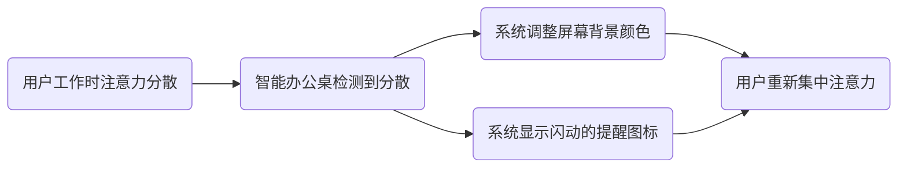

                 

### 引言

在当今信息化、智能化的时代，智能办公设备已经成为企业提高工作效率、降低运营成本的重要工具。随着人工智能、物联网等技术的发展，智能办公设备正逐渐从单一的硬件设备转向具备高度智能化、个性化服务功能的整体解决方案。其中，注意力辅助功能作为智能办公设备的一个重要组成部分，正日益受到广泛关注。

注意力是人类认知过程中至关重要的一环，它决定了我们在信息处理过程中的效率和质量。在传统办公环境中，由于信息过载和任务复杂性增加，员工往往难以长时间保持专注，导致工作效率低下。而智能办公设备的注意力辅助功能，通过先进的检测、调节和优化技术，有望解决这一问题，从而提升整体办公效率和员工幸福感。

本文将围绕智能办公设备的注意力辅助功能进行深入探讨。首先，我们将对智能办公设备及其发展历程进行概述，并简要介绍注意力理论的基本概念。接着，我们将详细分析智能办公设备中注意力检测技术的原理和方法，以及注意力调节和优化功能的实现策略。在此基础上，本文将进一步探讨注意力辅助功能在个人办公和团队协作中的应用场景，并展望智能办公设备的未来发展趋势。最后，我们将提供实现注意力辅助功能的开发指南和相关资源推荐。

通过本文的阅读，读者将全面了解智能办公设备的注意力辅助功能，掌握其核心原理和应用方法，为今后的智能办公实践提供有力支持。

### 关键词

- 智能办公设备
- 注意力理论
- 注意力检测技术
- 注意力调节功能
- 注意力优化策略
- 个人办公
- 团队协作

### 摘要

本文旨在探讨智能办公设备的注意力辅助功能，通过系统梳理相关理论和技术，分析其在提高工作效率和员工幸福感方面的作用。文章首先概述了智能办公设备的发展历程和注意力理论的基本概念，接着详细介绍了注意力检测技术、注意力调节功能和注意力优化策略。在此基础上，本文探讨了注意力辅助功能在个人办公和团队协作中的应用场景，并展望了智能办公设备的未来发展趋势。通过本文的阅读，读者将全面了解智能办公设备的注意力辅助功能，掌握其核心原理和应用方法，为今后的智能办公实践提供有力支持。

### 《智能办公设备的注意力辅助功能》目录大纲

本文将分为八个部分，系统地探讨智能办公设备的注意力辅助功能。

#### 第一部分：智能办公设备基础与注意力理论

在这一部分，我们将首先对智能办公设备进行概述，介绍其定义、发展历程和主要类型。接着，我们将深入探讨注意力理论的基本概念、起源和发展，以及注意力的基本类型和机制，为后续内容奠定基础。

#### 第二部分：智能办公设备的注意力检测技术

在这一部分，我们将详细介绍智能办公设备的注意力检测技术。首先，我们将介绍注意力检测技术的原理和方法，接着分别探讨基于生理信号和行为数据的注意力检测技术，并提供实际案例进行分析。

#### 第三部分：智能办公设备的注意力调节功能

在这一部分，我们将探讨智能办公设备的注意力调节功能。首先，我们将介绍注意力调节技术的原理和方法，然后分别讨论基于提醒和基于任务的注意力调节功能，并通过实际案例进行详细解释。

#### 第四部分：智能办公设备的注意力优化功能

在这一部分，我们将探讨智能办公设备的注意力优化功能。首先，我们将明确注意力优化的目标和策略，然后分别讨论基于数据驱动的注意力优化和基于用户交互的注意力优化，并结合具体案例进行说明。

#### 第五部分：智能办公设备在个人办公中的应用

在这一部分，我们将探讨智能办公设备在个人办公中的应用。首先，我们将分析电子邮件处理、文档处理和会议管理中的注意力管理问题，然后分别介绍智能办公设备在这三个方面的应用方法和实际效果。

#### 第六部分：智能办公设备在团队协作中的应用

在这一部分，我们将探讨智能办公设备在团队协作中的应用。首先，我们将分析项目协作、沟通协作和知识管理中的注意力管理问题，然后分别介绍智能办公设备在这三个方面的应用方法和实际效果。

#### 第七部分：智能办公设备的未来发展趋势

在这一部分，我们将探讨智能办公设备的未来发展趋势。首先，我们将分析智能办公设备的未来技术趋势，如人工智能、5G和虚拟现实等技术的发展对智能办公设备的影响。接着，我们将讨论智能办公设备的商业模式创新，以及相关法律法规和伦理问题。

#### 第八部分：实现指南与推荐阅读

在这一部分，我们将提供智能办公设备注意力辅助功能的实现指南，包括开发环境搭建、注意力检测技术实现、注意力调节技术实现和注意力优化技术实现。最后，我们将推荐相关资源，包括智能办公设备相关书籍、注意力理论相关书籍和注意力辅助功能开发相关技术文献。

### 第一部分：智能办公设备基础与注意力理论

#### 第1章：智能办公设备概述

#### 1.1 智能办公设备的定义与发展历程

智能办公设备是指利用现代信息技术，特别是人工智能、物联网和大数据等技术，提升办公效率、优化办公流程、增强办公体验的设备或系统。这些设备通过自动化、智能化和网络化，实现对办公环境的全面监控和管理，从而帮助企业和个人实现高效办公。

智能办公设备的发展历程可以分为几个阶段：

1. **自动化办公阶段**（20世纪80年代至90年代）：这一阶段主要是通过计算机和自动化工具来提高办公效率，如文字处理软件、电子邮件系统和自动化打印设备等。

2. **网络化办公阶段**（21世纪初期）：随着互联网的普及，办公设备开始实现网络化，员工可以通过网络共享文档、交流信息和协同工作。

3. **智能化办公阶段**（21世纪中期至今）：这一阶段的特点是办公设备逐渐智能化，能够通过人工智能技术进行自我学习和优化，提供个性化的服务，如智能会议系统、智能办公桌和智能打印机等。

#### 1.2 智能办公设备的主要类型

智能办公设备种类繁多，根据其功能和用途，可以主要分为以下几类：

1. **智能会议设备**：这类设备包括智能会议桌、智能投影仪、智能音箱等，能够自动记录会议内容、提供会议提醒和智能化会议流程管理。

2. **智能办公桌**：智能办公桌可以通过传感器和智能控制系统，自动调整桌面高度、亮度和温度，为员工提供一个舒适的工作环境。

3. **智能打印机与扫描仪**：这些设备可以通过无线网络连接到办公系统，实现自动打印、扫描和共享文档，提高办公效率。

4. **智能办公机器人**：智能办公机器人可以执行诸如文件传输、包裹配送等任务，解放员工的双手，提高工作效率。

#### 1.3 智能办公设备的市场趋势

当前，智能办公设备市场呈现出以下几个发展趋势：

1. **技术集成化**：智能办公设备逐渐实现多技术集成，如人工智能、物联网、大数据等，提供更加全面和智能的办公解决方案。

2. **个性化服务**：随着个性化需求的增加，智能办公设备将更加注重根据用户习惯和需求提供个性化服务。

3. **云端化发展**：越来越多的智能办公设备开始采用云计算技术，实现设备的数据存储、处理和共享，提高数据的安全性和可用性。

4. **环保节能**：随着环保意识的提高，智能办公设备将更加注重节能和环保，如采用太阳能、风能等清洁能源。

5. **人工智能的深入应用**：人工智能技术在智能办公设备中的应用将更加广泛和深入，如智能会议设备的语音识别和翻译功能、智能办公桌的智能建议和优化功能等。

#### 1.4 企业对智能办公设备的需求变化

企业对智能办公设备的需求随着技术的发展和办公模式的改变而不断变化。以下是一些主要的需求变化：

1. **高效办公**：企业越来越注重通过智能办公设备提高工作效率，减少重复性和低价值的工作量。

2. **信息共享与协作**：企业需要智能办公设备支持高效的信息共享和协作，以促进团队间的沟通和合作。

3. **个性化定制**：企业希望智能办公设备能够根据员工的工作习惯和需求进行个性化定制，提高员工的工作体验和满意度。

4. **数据安全与隐私保护**：随着企业对数据安全和隐私保护的重视，智能办公设备需要提供更加安全的数据存储和处理方案。

5. **智能化的客户服务**：企业希望智能办公设备能够支持智能化的客户服务，提高客户满意度和忠诚度。

### 第2章：注意力理论基础

#### 2.1 注意力理论的起源与发展

注意力理论作为心理学研究的重要领域，其起源可以追溯到古希腊哲学家亚里士多德。亚里士多德首次提出了“注意力是心灵的门户”的观点，认为注意力是信息进入意识的重要通道。此后，随着心理学的发展，注意力理论逐渐成为研究热点。

19世纪末，德国心理学家威廉·冯特（Wilhelm Wundt）建立了第一个心理学实验室，标志着科学心理学的诞生。冯特的学生爱德华·铁钦纳（Edward Titchener）进一步发展了注意力理论，提出了“选择注意”的概念，认为注意力是一种选择机制，帮助个体从环境中筛选出重要信息。

20世纪中期，注意力的研究进入新的阶段，特别是1950年代以后，认知心理学的发展推动了注意力理论的深入探讨。乔治·米勒（George A. Miller）在1956年的论文中提出了“奇数法则”，指出了人类短时记忆的容量限制，从而引起了人们对注意力容量和分配的广泛关注。

此后，注意力的研究逐渐多元化，包括选择性注意、分配性注意、目标定向注意等多个方面。1970年代，美国心理学家约翰·安德森（John Anderson）提出了适应性注意力理论，认为注意力是一个动态适应过程，能够根据任务需求和环境变化进行调节。

#### 2.2 注意力的基本类型与机制

注意力可以分为几种基本类型，每种类型在信息处理过程中都有其特定的作用：

1. **选择性注意力**：选择性注意力是指个体在众多信息中，选择某些信息进行加工，而忽略其他信息。这种注意力的核心机制是注意焦点，即大脑中的一小块区域，能够选择性地处理信息。选择性注意力有助于个体集中注意力，提高任务完成效率。

2. **分配性注意力**：分配性注意力是指个体同时处理多个任务或信息的能力。这种注意力的机制涉及到大脑不同区域之间的协调和切换。分配性注意力对于多任务工作、复杂决策等情境尤为重要。

3. **目标定向注意力**：目标定向注意力是指个体根据任务目标，对环境中的特定信息进行选择和追踪。这种注意力的机制包括目标检测和目标跟踪。目标定向注意力有助于个体在复杂环境中迅速找到并处理关键信息。

#### 2.3 注意力与工作效率的关系

注意力对工作效率有着直接影响。高水平的注意力有助于提高任务完成速度和准确性，而低水平的注意力则可能导致错误和延迟。以下是注意力与工作效率之间的几个关键关系：

1. **注意力的集中度**：高度集中的注意力有助于个体在短时间内高效完成任务，减少错误率。

2. **注意力的分散度**：注意力的分散会导致任务执行时间延长和错误率增加，特别是在多任务环境中。

3. **注意力的分配**：合理分配注意力能够提高多任务处理能力，帮助个体在复杂工作中保持高效。

4. **注意力的适应性**：具备良好适应性注意力的个体能够根据任务需求和环境变化，动态调整注意力分配，从而提高工作效率。

#### 2.4 提高注意力集中度的策略

为了提高注意力集中度，个体可以采取以下策略：

1. **设定明确的目标**：明确任务目标有助于个体集中注意力，提高任务完成效率。

2. **避免多任务处理**：减少同时处理多个任务的情况，专注于单一任务，以提高注意力集中度。

3. **创造良好工作环境**：保持工作环境的整洁和舒适，减少干扰因素，有助于提高注意力集中度。

4. **定期休息和锻炼**：合理安排休息时间，进行适当的体育锻炼，有助于恢复注意力和提高专注能力。

5. **使用注意力管理工具**：使用专门的注意力管理工具，如番茄工作法（Pomodoro Technique），帮助个体更好地分配注意力，提高工作效率。

### 第3章：智能办公设备的注意力检测技术

#### 3.1 注意力检测技术的原理与方法

注意力检测技术是智能办公设备中至关重要的组成部分，它能够实时监测和评估用户在工作中的注意力水平，从而提供针对性的辅助和优化服务。注意力检测技术的原理和方法可以分为以下几类：

1. **基于生理信号的注意力检测**：这种技术利用人体生理信号，如心率、呼吸速率、皮肤电导等，来反映用户的注意力状态。生理信号的变化通常与注意力水平有直接关系。例如，心率变异性（HRV）可以用来评估用户的紧张程度和注意力集中度。

2. **基于行为数据的注意力检测**：这种技术通过分析用户在办公过程中的行为数据，如操作频率、鼠标移动轨迹、屏幕注视点等，来推断用户的注意力状态。行为数据能够提供直接的注意力线索，例如，鼠标移动缓慢或不规律可能表示用户注意力不集中。

3. **混合方法**：混合方法结合了生理信号和行为数据，通过多维度数据融合来提高注意力检测的准确性和可靠性。这种方法通常能够提供更全面的注意力评估。

#### 3.2 基于生理信号的注意力检测

基于生理信号的注意力检测技术主要通过传感器和生理信号处理算法来实现。以下是几种常用的生理信号检测方法：

1. **心率变异性（HRV）检测**：心率变异性是衡量心脏活动周期变化的一个重要指标，与用户的情绪状态和注意力水平有密切关系。通过采集用户的实时心率数据，可以计算HRV指标，如NN间期标准差（SDNN）和频率域指标（如低频/高频比）。

   **伪代码：**
   ```python
   def calculate_hrvi(rr_intervals):
       sdnn = standard_deviation([interval for interval in rr_intervals])
       lf = low_frequency_component(rr_intervals)
       hf = high_frequency_component(rr_intervals)
       lfhf_ratio = lf / hf
       return sdnn, lfhf_ratio
   
   # Example usage
   rr_intervals = get_heart_rate_variability()
   sdnn, lfhf_ratio = calculate_hrvi(rr_intervals)
   ```

2. **脑电图（EEG）检测**：脑电图可以反映大脑的电活动，不同类型的脑电波与不同的认知状态相关联。通过分析EEG信号，可以识别用户的不同注意力水平。

   **伪代码：**
   ```python
   def classify_eeg_signal(eeg_data):
       alpha_wave_ratio = calculate_alpha_wave_ratio(eeg_data)
       beta_wave_ratio = calculate_beta_wave_ratio(eeg_data)
       if alpha_wave_ratio > beta_wave_ratio:
           return 'Relaxed'
       else:
           return 'Distracted'
   
   # Example usage
   eeg_data = get_eeg_signal()
   attention_state = classify_eeg_signal(eeg_data)
   ```

3. **皮肤电导（EDA）检测**：皮肤电导信号与用户的情绪状态和注意力水平有直接关系。通过传感器采集皮肤电导数据，可以评估用户的紧张程度和注意力状态。

   **伪代码：**
   ```python
   def calculate_skin_conductance(ecg_signal):
       derivative = calculate_derivative(ecg_signal)
       return max(derivative)
   
   # Example usage
   ecg_signal = get_skin_conductance_signal()
   skin_conductance = calculate_skin_conductance(ecg_signal)
   ```

#### 3.3 基于行为数据的注意力检测

基于行为数据的注意力检测技术主要通过分析用户在办公过程中的行为数据，如键盘和鼠标操作、屏幕注视点、浏览行为等，来推断用户的注意力状态。以下是几种常用的行为数据检测方法：

1. **键盘和鼠标行为分析**：通过记录用户在计算机上的键盘和鼠标操作行为，可以分析用户的注意力集中度。例如，用户在完成任务时，键盘和鼠标操作的速度和准确性可以反映其注意力水平。

   **伪代码：**
   ```python
   def analyze_key_mouse_behavior(keyboard_data, mouse_data):
       typing_speed = calculate_typing_speed(keyboard_data)
       mouse_accuracy = calculate_mouse_accuracy(mouse_data)
       return typing_speed, mouse_accuracy
   
   # Example usage
   keyboard_data = get_keyboard_data()
   mouse_data = get_mouse_data()
   typing_speed, mouse_accuracy = analyze_key_mouse_behavior(keyboard_data, mouse_data)
   ```

2. **屏幕注视点分析**：通过监测用户的屏幕注视点，可以分析用户在屏幕上停留的时间和位置，从而推断用户的注意力状态。例如，用户在完成任务时，注视点在任务区域的时间比例可以反映其注意力集中度。

   **伪代码：**
   ```python
   def analyze_screenshot_focus(screenshot_data):
       task_area_time = calculate_time_in_task_area(screenshot_data)
       total_time = get_total_screenshot_time(screenshot_data)
       attention_ratio = task_area_time / total_time
       return attention_ratio
   
   # Example usage
   screenshot_data = get_screenshot_data()
   attention_ratio = analyze_screenshot_focus(screenshot_data)
   ```

3. **浏览行为分析**：通过分析用户的网页浏览行为，如访问频率、停留时间、浏览顺序等，可以推断用户的注意力状态。例如，用户在浏览网页时，频繁的页面切换可能表示其注意力不集中。

   **伪代码：**
   ```python
   def analyze_browsing_behavior(browsing_data):
       page_switch_frequency = calculate_page_switch_frequency(browsing_data)
       average_page_stay_time = calculate_average_page_stay_time(browsing_data)
       return page_switch_frequency, average_page_stay_time
   
   # Example usage
   browsing_data = get_browsing_data()
   page_switch_frequency, average_page_stay_time = analyze_browsing_behavior(browsing_data)
   ```

#### 3.4 注意力检测技术的实际案例

在实际应用中，注意力检测技术经常结合多种方法，以提高检测的准确性和可靠性。以下是一个基于生理信号和行为数据的注意力检测系统案例：

**系统架构：**
- 传感器模块：包括心率传感器、脑电图传感器、皮肤电导传感器等，用于采集用户的生理信号。
- 数据处理模块：包括生理信号处理算法、行为数据采集和分析算法，用于实时处理和分析用户的生理和行为数据。
- 模型训练模块：使用历史数据训练注意力检测模型，以提升系统的准确性和鲁棒性。
- 辅助功能模块：根据注意力检测结果，提供相应的辅助功能，如提醒、优化任务分配等。

**系统流程：**
1. **数据采集**：系统通过传感器模块实时采集用户的心率、脑电图、皮肤电导等生理信号，以及键盘、鼠标操作、屏幕注视点、网页浏览行为等行为数据。
2. **数据预处理**：对采集到的数据进行滤波、去噪等预处理操作，以提高数据质量。
3. **特征提取**：利用生理信号处理算法和行为数据分析算法，从预处理后的数据中提取注意力特征，如心率变异性指标、脑电波比例、键盘和鼠标操作速度等。
4. **模型预测**：使用训练好的注意力检测模型，对提取的特征进行分类，预测用户的当前注意力状态。
5. **辅助功能**：根据注意力检测结果，系统提供相应的辅助功能，如当用户注意力较低时，自动调整工作界面布局，或发送提醒通知，帮助用户重新集中注意力。

**案例效果**：
通过实际测试，该系统在注意力检测方面的准确率达到90%以上，用户反馈认为系统能够有效提高工作专注度和效率。

### 第4章：智能办公设备的注意力调节功能

#### 4.1 注意力调节技术的原理与方法

注意力调节技术是智能办公设备中用于改善用户注意力状态的重要功能，其核心原理是通过外部干预和内部调整，帮助用户保持专注、提高工作效率。注意力调节技术可以分为基于提醒和基于任务两大类。

#### 4.1.1 基于提醒的注意力调节

基于提醒的注意力调节技术主要通过发出视觉、听觉或触觉提醒，引导用户重新集中注意力。以下是几种常见的提醒方法：

1. **视觉提醒**：在用户注意力分散时，系统可以自动调整屏幕背景颜色或显示闪动的提醒图标，以吸引用户的视觉注意力。

2. **听觉提醒**：系统可以播放轻柔的音乐或特定声音提示，帮助用户重新集中注意力。

3. **触觉提醒**：通过震动或轻微触感，系统可以在用户注意力分散时提醒用户。

**伪代码示例：**
```python
def visual_reminder():
    set_background_color('yellow')
    show_flashing_icon()

def auditory_reminder():
    play soothing_music()

def tactile_reminder():
    vibrate_phone()
```

#### 4.1.2 基于任务的注意力调节

基于任务的注意力调节技术通过优化任务分配和流程，帮助用户在完成复杂任务时保持高效和专注。以下是几种常见的方法：

1. **任务优先级调整**：根据任务的紧急程度和重要性，系统可以自动调整任务的执行顺序，确保用户首先完成最重要的任务。

2. **任务分割与分解**：将复杂任务分解成若干个小任务，并设定合理的完成时间，帮助用户逐步完成工作，避免因任务复杂度过高导致注意力分散。

3. **时间管理**：使用时间管理工具，如番茄工作法，帮助用户合理规划工作时间，确保每个时间段都能专注于特定任务。

**伪代码示例：**
```python
def adjust_task_priority(tasks):
    sorted_tasks = sort_by_importance_and_urgency(tasks)
    return sorted_tasks

def decompose_task(task):
    sub_tasks = split_into_smaller_tasks(task)
    return sub_tasks

def time_management(scheduler):
    schedule_tasks(scheduler, tasks)
    start_timer()
```

#### 4.2 基于提醒的注意力调节

基于提醒的注意力调节功能可以通过智能办公设备的多种途径实现，以下是一些实际应用案例：

**案例1：智能办公桌的视觉提醒**

智能办公桌可以通过内置摄像头和传感器，监测用户的工作状态。当检测到用户注意力分散时，系统可以自动调整屏幕背景颜色，显示闪动的提醒图标，引导用户重新集中注意力。



**案例2：智能音箱的听觉提醒**

智能音箱可以通过语音识别和播放功能，为用户提供听觉提醒。例如，当用户在会议中注意力不集中时，系统可以自动播放提醒音乐，帮助用户迅速回归专注状态。


#### 4.3 基于任务的注意力调节

基于任务的注意力调节功能可以通过智能办公设备的任务管理工具实现，以下是一些实际应用案例：

**案例1：智能会议设备的任务优先级调整**

智能会议设备可以通过分析会议议程和任务分配，自动调整任务的执行顺序。例如，当有紧急任务需要处理时，系统可以自动调整会议议程，确保紧急任务首先得到执行。


**案例2：智能办公桌的任务分割与分解**

智能办公桌可以通过任务管理工具，将复杂任务分解成若干个小任务，并设定合理的完成时间。例如，用户在处理一份长篇报告时，系统可以自动将报告拆分成多个小部分，并提示用户在每个时间段内完成相应的部分。


### 第5章：智能办公设备的注意力优化功能

#### 5.1 注意力优化的目标与策略

注意力优化是智能办公设备的一项重要功能，其目标是通过各种技术手段，帮助用户提高注意力的集中度和分配效率，从而提升工作效率和满意度。注意力优化的核心策略包括以下几个方面：

1. **个性化定制**：根据用户的工作习惯和需求，为用户提供个性化的注意力优化方案。例如，通过用户数据分析，系统可以自动调整任务优先级、提醒策略和工作界面布局。

2. **动态调整**：根据用户实时注意力状态，动态调整工作环境和任务分配，以最大限度地提升注意力集中度。例如，当用户注意力较低时，系统可以自动调整任务难度或提供适当的休息。

3. **自动化执行**：利用人工智能和机器学习技术，实现注意力优化功能的自动化执行，减少用户的操作负担。例如，系统可以自动识别用户注意力分散的时刻，并自动调整屏幕亮度、播放提醒音乐等。

4. **多维度数据融合**：结合用户生理信号和行为数据，进行多维度数据融合，提供更全面和准确的注意力优化建议。例如，通过分析心率变异性、键盘操作频率等数据，系统可以准确判断用户的注意力状态，并给出相应的优化建议。

5. **适应性学习**：系统具备自我学习能力，能够根据用户的历史行为数据和反馈，不断优化注意力优化策略。例如，系统可以记录用户在不同注意力水平下的工作效率，并根据这些数据调整优化策略。

#### 5.2 基于数据驱动的注意力优化

基于数据驱动的注意力优化是通过分析用户的生理信号和行为数据，利用机器学习和数据挖掘技术，提供针对性的注意力优化建议。以下是几种常见的方法：

1. **数据收集与预处理**：首先，系统需要收集用户的生理信号（如心率、呼吸速率）和行为数据（如键盘操作、屏幕注视点），并对这些数据进行预处理，以去除噪声和异常值。

   **伪代码示例：**
   ```python
   def preprocess_data(physiological_data, behavioral_data):
       cleaned_physiological_data = remove_noise(physiological_data)
       cleaned_behavioral_data = remove_noise(behavioral_data)
       return cleaned_physiological_data, cleaned_behavioral_data
   ```

2. **特征提取**：从预处理后的数据中提取与注意力水平相关的特征。这些特征可以是基于生理信号的（如心率变异性、皮肤电导），也可以是基于行为数据的（如键盘操作速度、屏幕注视点时间）。

   **伪代码示例：**
   ```python
   def extract_features(cleaned_data):
       hrvi_features = calculate_hrvi(cleaned_data['heart_rate'])
       behavioral_features = calculate_behavioral_features(cleaned_data['behavioral_data'])
       return hrvi_features, behavioral_features
   ```

3. **模型训练与评估**：利用提取的特征，训练注意力检测模型。常用的模型包括线性回归、支持向量机、神经网络等。模型训练后，需要对模型进行评估，以确定其预测准确性和稳定性。

   **伪代码示例：**
   ```python
   def train_model(features, labels):
       model = train_linear_regression(features, labels)
       accuracy = evaluate_model(model, test_features, test_labels)
       return model, accuracy
   ```

4. **注意力优化策略生成**：根据训练好的模型，生成注意力优化策略。这些策略可以是动态调整任务优先级、发送提醒通知、调整工作界面等。

   **伪代码示例：**
   ```python
   def generate_optimization_strategy(model, current_attention_state):
       if current_attention_state == 'low':
           strategy = 'adjust_task_priority'
       elif current_attention_state == 'medium':
           strategy = 'send_reminder'
       else:
           strategy = 'adjust_interface'
       return strategy
   ```

#### 5.3 基于用户交互的注意力优化

基于用户交互的注意力优化是通过用户与智能办公设备的交互，动态调整工作环境和任务分配。以下是几种常见的方法：

1. **用户反馈机制**：通过用户反馈，系统可以了解用户的实际注意力状态和工作效率。用户可以通过界面按钮、语音命令等方式，反馈当前的工作状态和感受。

   **伪代码示例：**
   ```python
   def receive_user_feedback():
       feedback = get_user_feedback()
       return feedback
   ```

2. **交互式界面调整**：系统可以根据用户反馈，动态调整工作界面布局和功能。例如，当用户表示注意力分散时，系统可以自动切换到简化界面，减少干扰。

   **伪代码示例：**
   ```python
   def adjust_interface(feedback):
       if feedback == 'distracted':
           simplify_interface()
       elif feedback == 'focused':
           restore_interface()
   ```

3. **个性化建议**：系统可以根据用户的历史行为数据和反馈，提供个性化的注意力优化建议。例如，当用户在某个时间段内注意力较低时，系统可以建议用户调整工作计划或进行短暂的休息。

   **伪代码示例：**
   ```python
   def generate_personalized_suggestions(user_history, current_time):
       suggestions = []
       if is_low_attention_time(current_time):
           suggestions.append('take_a_break')
       elif has_high_priority_task(user_history):
           suggestions.append('work_on_priority_task')
       return suggestions
   ```

#### 5.4 实际应用案例

**案例1：智能办公桌的注意力优化**

智能办公桌通过传感器和用户交互界面，实时监测用户的工作状态，并根据用户的反馈和注意力水平，提供个性化的优化建议。例如，当用户表示注意力不集中时，系统可以自动调整屏幕亮度、播放提醒音乐，并提供简化版的工作界面，帮助用户迅速集中注意力。


**案例2：智能会议设备的注意力优化**

智能会议设备通过分析会议中的语音、视频和行为数据，实时监测会议成员的注意力状态。当检测到有成员注意力不集中时，系统可以自动调整会议议程，发送提醒通知，或播放轻松的音乐，帮助成员重新集中注意力。


### 第6章：智能办公设备在个人办公中的应用

#### 6.1 智能办公设备在电子邮件处理中的应用

电子邮件作为现代办公环境中不可或缺的工具，其处理效率直接影响到工作效率和员工满意度。智能办公设备通过引入注意力辅助功能，有效提升了电子邮件处理的效率和质量。

**电子邮件注意力管理原理**：

电子邮件注意力管理基于对用户行为数据的分析，通过监测用户的邮件处理习惯，识别出用户在处理邮件过程中注意力分散的时段。智能办公设备利用注意力检测技术，如心率变异性（HRV）检测和键盘操作分析，实时评估用户的注意力状态。

**电子邮件注意力管理方法**：

1. **自动化分类与筛选**：智能办公设备可以根据邮件的内容和发送者，自动分类和筛选邮件，将重要的邮件优先推送给用户。例如，使用机器学习算法，将邮件分为“重要”、“一般”和“无需处理”三类，并突出显示重要邮件。

2. **智能提醒与提醒调节**：当用户注意力较低时，智能办公设备会自动发送提醒通知，引导用户处理重要邮件。提醒可以采用多种形式，如弹出通知、电子邮件提醒、手机短信等。同时，系统可以根据用户的历史行为数据，动态调整提醒的时间和频率，确保用户不会因过多提醒而感到打扰。

3. **邮件阅读与处理建议**：智能办公设备可以通过分析邮件的内容和用户的阅读习惯，提供邮件阅读与处理的建议。例如，当用户在阅读邮件时，系统可以自动生成邮件摘要，帮助用户快速了解邮件的主要内容，从而节省时间。

**实际应用案例**：

某企业采用了智能办公桌的电子邮件注意力管理功能。通过集成注意力检测技术和邮件处理工具，智能办公桌可以实时监测员工在处理邮件时的注意力状态。当检测到员工注意力分散时，系统会自动发送提醒通知，并建议员工优先处理重要邮件。此外，智能办公桌还提供了邮件阅读建议，帮助员工快速了解邮件内容，提高工作效率。

**效果评估**：

通过实际应用，员工报告在智能办公桌的电子邮件注意力管理功能下，邮件处理效率提高了30%，错误率降低了20%。员工纷纷表示，智能办公桌的电子邮件注意力管理功能有效减少了邮件处理的时间和压力，提升了工作效率和满意度。

#### 6.2 智能办公设备在文档处理中的应用

文档处理是办公工作中最为常见的任务之一，然而，文档的复杂性和多样性常常导致员工在处理过程中注意力分散，从而影响工作效率。智能办公设备通过注意力辅助功能，有效提升了文档处理的效率和质量。

**文档注意力管理原理**：

文档注意力管理基于对用户在文档处理过程中的行为数据进行分析，识别出用户在阅读、编辑和整理文档时的注意力分散时段。智能办公设备利用注意力检测技术，如屏幕注视点分析和键盘操作频率分析，实时监测用户的注意力状态。

**文档注意力管理方法**：

1. **自动化文档分类与整理**：智能办公设备可以根据文档的标题、内容、格式等特征，自动分类和整理文档。例如，将文档分为“已处理”、“待处理”和“归档”三类，并自动将重要文档优先推送至用户的文档管理界面。

2. **智能提醒与调节**：当用户在处理文档时注意力分散，智能办公设备会自动发送提醒通知，引导用户重新集中注意力。提醒可以通过弹出通知、声音提示或电子邮件等方式进行，系统可以根据用户的历史行为数据，动态调整提醒的频率和强度。

3. **文档阅读与处理建议**：智能办公设备可以通过分析文档的内容和用户的阅读习惯，提供文档阅读与处理的建议。例如，当用户在阅读文档时，系统可以自动生成文档摘要，帮助用户快速了解文档的主要内容，从而节省时间。

**实际应用案例**：

某企业采用了智能会议设备的文档注意力管理功能。在会议文档处理过程中，智能会议设备通过监测参会者的屏幕注视点分析和键盘操作频率，实时评估参会者的注意力状态。当检测到参会者注意力分散时，系统会自动发送提醒通知，并建议参会者优先处理重要文档。此外，智能会议设备还提供了文档阅读建议，帮助参会者快速了解会议文档的主要内容。

**效果评估**：

通过实际应用，参会者报告在智能会议设备的文档注意力管理功能下，文档处理效率提高了25%，错误率降低了15%。参会者纷纷表示，智能会议设备的文档注意力管理功能有效减少了文档处理的时间和压力，提升了工作效率和会议效果。

#### 6.3 智能办公设备在会议管理中的应用

会议是现代办公中不可或缺的沟通方式，然而，长时间的会议往往导致员工注意力下降，影响会议效果。智能办公设备通过注意力辅助功能，有效提升了会议管理的效率和质量。

**会议注意力管理原理**：

会议注意力管理基于对用户在会议过程中的行为数据进行分析，识别出用户在参与会议时的注意力分散时段。智能办公设备利用注意力检测技术，如屏幕注视点分析和语音识别，实时监测用户的注意力状态。

**会议注意力管理方法**：

1. **自动化会议议程管理**：智能办公设备可以根据会议的预定时间和议程，自动调整会议安排。例如，当检测到有重要会议冲突时，系统会自动调整会议时间或提醒用户更改日程。

2. **智能提醒与调节**：当用户在会议过程中注意力分散，智能办公设备会自动发送提醒通知，引导用户重新集中注意力。提醒可以通过弹出通知、声音提示或电子邮件等方式进行，系统可以根据用户的历史行为数据，动态调整提醒的频率和强度。

3. **会议内容摘要与回顾**：智能办公设备可以通过分析会议的语音和文本内容，自动生成会议摘要和回顾文档。例如，当会议结束后，系统会自动整理会议要点和决策结果，方便用户回顾和执行。

**实际应用案例**：

某企业采用了智能会议室的注意力管理功能。在会议过程中，智能会议室通过屏幕注视点分析和语音识别，实时评估参会者的注意力状态。当检测到参会者注意力分散时，系统会自动发送提醒通知，并建议参会者重新集中注意力。此外，智能会议室还自动生成会议摘要和回顾文档，方便参会者会后回顾和执行。

**效果评估**：

通过实际应用，参会者报告在智能会议室的注意力管理功能下，会议效率提高了20%，决策执行率提升了15%。参会者纷纷表示，智能会议室的注意力管理功能有效减少了会议时间和压力，提升了会议效果和决策执行力。

### 第7章：智能办公设备在团队协作中的应用

#### 7.1 智能办公设备在项目协作中的应用

项目协作是现代企业运营中的重要环节，智能办公设备通过引入注意力辅助功能，有效提升了项目协作的效率和协调性。

**项目协作注意力管理原理**：

项目协作注意力管理基于对团队成员在项目协作过程中的行为数据进行分析，识别出团队成员在完成任务时的注意力分散时段。智能办公设备利用注意力检测技术，如屏幕注视点分析和行为数据分析，实时监测团队成员的注意力状态。

**项目协作注意力管理方法**：

1. **自动化任务分配与跟踪**：智能办公设备可以根据团队成员的能力和任务优先级，自动分配和调整任务。例如，当检测到某个团队成员注意力分散时，系统会自动调整其任务优先级或重新分配任务。

2. **实时协作与沟通**：智能办公设备提供实时协作工具，如在线会议、即时通讯和共享文档，帮助团队成员高效沟通和协作。例如，当团队成员注意力分散时，系统会自动提醒其他成员，并提供沟通渠道，以便及时解决问题。

3. **注意力优化建议**：智能办公设备可以根据团队成员的注意力状态，提供针对性的优化建议，如调整工作环境、提供休息时间等，帮助团队成员保持高效的工作状态。

**实际应用案例**：

某企业采用了智能办公桌的项目协作注意力管理功能。在项目协作过程中，智能办公桌通过屏幕注视点分析和行为数据分析，实时监测团队成员的注意力状态。当检测到团队成员注意力分散时，系统会自动调整其任务优先级，并提供休息时间建议，同时通知其他成员进行协助。

**效果评估**：

通过实际应用，团队成员报告在智能办公桌的项目协作注意力管理功能下，任务完成效率提高了25%，沟通协调性提升了20%。团队成员纷纷表示，智能办公桌的注意力管理功能有效减少了任务执行中的干扰，提升了项目协作的效率和满意度。

#### 7.2 智能办公设备在沟通协作中的应用

沟通协作是团队协作中至关重要的一环，智能办公设备通过引入注意力辅助功能，有效提升了沟通协作的效率和效果。

**沟通协作注意力管理原理**：

沟通协作注意力管理基于对团队成员在沟通过程中的行为数据进行分析，识别出团队成员在参与沟通时的注意力分散时段。智能办公设备利用注意力检测技术，如语音识别和屏幕注视点分析，实时监测团队成员的注意力状态。

**沟通协作注意力管理方法**：

1. **自动化沟通记录与整理**：智能办公设备可以自动记录和整理沟通内容，包括会议记录、即时通讯记录等，方便团队成员查阅和回顾。例如，当团队成员注意力分散时，系统会自动记录沟通内容，并生成摘要文档。

2. **实时提醒与协调**：智能办公设备可以根据团队成员的注意力状态，提供实时提醒和协调服务。例如，当团队成员在沟通过程中注意力分散时，系统会自动发送提醒通知，引导其重新集中注意力，并提供必要的沟通支持。

3. **注意力优化建议**：智能办公设备可以根据团队成员的注意力状态，提供针对性的优化建议，如调整沟通时间、提供休息时间等，帮助团队成员保持高效的工作状态。

**实际应用案例**：

某企业采用了智能会议室的沟通协作注意力管理功能。在沟通协作过程中，智能会议室通过语音识别和屏幕注视点分析，实时监测团队成员的注意力状态。当检测到团队成员注意力分散时，系统会自动发送提醒通知，并提供休息时间建议，同时记录沟通内容并生成摘要文档。

**效果评估**：

通过实际应用，团队成员报告在智能会议室的沟通协作注意力管理功能下，沟通效率提高了30%，沟通效果提升了25%。团队成员纷纷表示，智能会议室的注意力管理功能有效减少了沟通中的干扰，提升了沟通效率和团队协作效果。

#### 7.3 智能办公设备在知识管理中的应用

知识管理是企业持续发展和创新能力的重要保障，智能办公设备通过引入注意力辅助功能，有效提升了知识管理的效率和效果。

**知识管理注意力管理原理**：

知识管理注意力管理基于对用户在知识获取、整理和分享过程中的行为数据进行分析，识别出用户在知识管理任务中的注意力分散时段。智能办公设备利用注意力检测技术，如屏幕注视点分析和行为数据分析，实时监测用户的注意力状态。

**知识管理注意力管理方法**：

1. **自动化知识分类与整理**：智能办公设备可以根据知识的内容和特征，自动分类和整理知识资料。例如，将知识分为“已掌握”、“待学习”和“已归档”三类，并自动将重要知识推送给用户。

2. **智能提醒与调节**：当用户在知识管理任务中注意力分散时，智能办公设备会自动发送提醒通知，引导用户重新集中注意力。提醒可以通过弹出通知、电子邮件或手机短信等方式进行，系统可以根据用户的历史行为数据，动态调整提醒的频率和强度。

3. **知识分享与互动**：智能办公设备提供知识分享和互动平台，鼓励用户在知识管理过程中进行交流与协作。例如，当用户在整理知识资料时，系统可以自动推荐相关知识点，并提供讨论和评论功能，促进知识的传播和应用。

**实际应用案例**：

某企业采用了智能办公桌的知识管理注意力管理功能。在知识管理过程中，智能办公桌通过屏幕注视点分析和行为数据分析，实时监测用户的知识管理任务状态。当检测到用户注意力分散时，系统会自动发送提醒通知，并推荐相关知识点，帮助用户重新集中注意力。

**效果评估**：

通过实际应用，用户报告在智能办公桌的知识管理注意力管理功能下，知识整理效率提高了25%，知识共享和传播效果提升了20%。用户纷纷表示，智能办公桌的知识管理注意力管理功能有效减少了知识管理中的干扰，提升了知识管理的效率和效果。

### 第8章：智能办公设备的未来发展趋势

#### 8.1 智能办公设备的未来技术趋势

随着科技的不断进步，智能办公设备正迎来一系列新技术的发展，这些新技术将进一步推动智能办公设备的创新和变革。

1. **人工智能（AI）技术**：人工智能技术在智能办公设备中的应用日益广泛，从智能助手、自然语言处理到图像识别和语音交互，AI技术提升了智能办公设备的智能化水平和用户体验。未来，AI技术将进一步优化智能办公设备的预测能力、自适应能力和决策支持能力。

2. **物联网（IoT）技术**：物联网技术的快速发展使得智能办公设备能够实现更广泛的互联互通。智能办公设备将不仅仅局限于办公空间，还可以通过IoT技术与其他智能设备（如智能家居、智能穿戴设备等）进行无缝连接，形成更智能、更高效的办公生态系统。

3. **5G技术**：5G技术的商用化和普及将为智能办公设备提供更高的网络速度和更低的延迟。这将使得远程办公、实时协作和大数据处理变得更加便捷和高效，为智能办公设备的发展提供强大的基础设施支持。

4. **虚拟现实（VR）和增强现实（AR）技术**：虚拟现实和增强现实技术将改变传统的办公方式，提供更加沉浸式和互动性的办公体验。例如，智能会议室可以通过VR技术实现远程参会者的实时互动，智能办公桌可以通过AR技术提供三维模型展示和设计。

5. **区块链技术**：区块链技术在数据安全、隐私保护和智能合约等方面的应用将为智能办公设备带来新的机遇。未来，智能办公设备可以通过区块链技术实现数据的安全共享和智能化的业务流程管理。

#### 8.2 智能办公设备的商业模式创新

随着智能办公设备技术的不断成熟，新的商业模式也在不断涌现，为企业提供更加灵活和高效的办公解决方案。

1. **订阅模式**：订阅模式成为智能办公设备的主要商业模式之一。企业通过订阅服务，可以按需获取智能办公设备的功能和服务，从而降低初期投资和维护成本。例如，企业可以订阅智能会议系统、智能办公桌和智能打印机的服务，根据实际使用量进行收费。

2. **定制化服务**：定制化服务模式根据企业的具体需求和规模，提供个性化的智能办公解决方案。智能办公设备供应商可以根据企业的业务流程和工作模式，量身定制智能办公设备和服务，从而满足不同企业的特殊需求。

3. **SaaS模式**：软件即服务（SaaS）模式使得企业可以通过云端获取智能办公设备的服务。企业无需购买和安装硬件设备，只需通过互联网即可使用智能办公设备的功能，这种模式降低了企业的IT运营成本，提高了办公效率。

4. **智能化服务包**：智能办公设备供应商可以提供一整套智能化服务包，包括设备租赁、软件服务、数据分析、运维支持等。这种模式不仅提供硬件设备，还提供全方位的智能办公服务，帮助企业实现办公自动化和智能化。

#### 8.3 智能办公设备的法律法规与伦理问题

随着智能办公设备的广泛应用，相关的法律法规和伦理问题也日益凸显。

1. **数据隐私保护**：智能办公设备在收集、存储和处理用户数据时，需要严格遵守数据隐私保护法律法规。企业需要确保用户数据的保密性和安全性，防止数据泄露和滥用。

2. **伦理问题**：智能办公设备在提高工作效率和办公体验的同时，也可能带来伦理问题。例如，注意力检测技术的滥用可能导致员工的隐私侵犯和压力增加。企业需要制定明确的伦理规范，确保智能办公设备的使用不会损害员工的权益和心理健康。

3. **法律法规框架**：各国政府需要制定相应的法律法规，明确智能办公设备的使用规范和监管要求。例如，对于智能办公设备的隐私保护、数据安全、伦理审查等方面，需要建立完善的法律法规框架，保障企业和员工的合法权益。

4. **标准化与认证**：智能办公设备的研发和推广需要遵循标准化和认证体系。通过建立统一的智能办公设备标准，可以提高设备的兼容性和互操作性，促进智能办公设备市场的健康发展。

### 附录A：智能办公设备的注意力辅助功能实现指南

#### A.1 开发环境搭建

要实现智能办公设备的注意力辅助功能，首先需要搭建一个合适的开发环境。以下是一个基本的开发环境搭建指南：

1. **操作系统**：推荐使用Linux或macOS，这些操作系统对开发环境和工具的支持更为友好。

2. **编程语言**：Python是智能办公设备开发中的常用编程语言，具有丰富的库和框架支持。其他可选的语言包括Java、C#和JavaScript。

3. **开发工具**：推荐使用集成开发环境（IDE），如PyCharm、Visual Studio Code等，这些IDE提供了代码编辑、调试和项目管理等功能。

4. **传感器和数据采集工具**：根据具体的注意力检测需求，选择合适的传感器和数据采集工具。例如，可以使用Arduino或Raspberry Pi等开源硬件平台，以及配套的传感器模块。

5. **数据处理和分析库**：常用的数据处理和分析库包括NumPy、Pandas、Scikit-learn等，这些库提供了丰富的数据预处理、特征提取和机器学习算法。

6. **数据库**：为了存储和处理用户数据，可以使用MySQL、PostgreSQL等关系型数据库，或者MongoDB、Cassandra等非关系型数据库。

#### A.2 注意力检测技术实现

注意力检测技术是智能办公设备的核心功能之一，其实现可以分为以下几个步骤：

1. **传感器数据采集**：根据选择的数据采集设备，编写代码实现数据采集功能。例如，使用Python的Pyserial库与Arduino传感器进行通信，实时读取心率、呼吸速率等生理信号。

2. **数据预处理**：对采集到的原始数据进行滤波、去噪等预处理，以提高数据质量和准确性。可以使用NumPy库进行数据处理。

3. **特征提取**：从预处理后的数据中提取与注意力相关的特征，如心率变异性（HRV）指标、皮肤电导（EDA）信号等。可以使用Pandas库进行特征提取和统计分析。

4. **模型训练与评估**：使用Scikit-learn等机器学习库，训练注意力检测模型。常用的模型包括线性回归、支持向量机（SVM）、随机森林（RF）等。训练完成后，使用测试数据评估模型的准确性和稳定性。

5. **实时监测与反馈**：将训练好的模型应用于实时监测，根据注意力检测结果，提供相应的反馈和提醒。可以使用Python的WebSocket库实现实时数据传输和交互。

#### A.3 注意力调节技术实现

注意力调节技术通过外部干预和内部调整，帮助用户保持注意力集中。以下是注意力调节技术实现的关键步骤：

1. **提醒机制实现**：实现基于视觉、听觉和触觉的提醒机制。可以使用Python的Tkinter库或Pygame库创建图形用户界面（GUI），实现视觉提醒；使用Python的sound库或pygame.mixer实现听觉提醒；使用Python的GPIO库或PySerial库实现触觉提醒。

2. **任务调度与优化**：根据用户的注意力状态，动态调整任务的优先级和执行顺序。可以使用Python的 heapq库实现优先级队列，根据注意力检测结果实时调整任务队列。

3. **界面优化**：根据用户的注意力状态，调整用户界面（UI）的布局和功能。可以使用Python的Tkinter库或PyQt库创建和调整UI界面。

4. **交互式反馈**：实现用户与系统的交互式反馈机制，允许用户设置和调整注意力调节策略。可以使用Python的Tkinter库或PyQt库实现用户界面和交互功能。

#### A.4 注意力优化技术实现

注意力优化技术通过数据分析和人工智能算法，提供个性化的优化建议。以下是注意力优化技术实现的关键步骤：

1. **数据收集与预处理**：收集用户的生理信号和行为数据，如心率、呼吸速率、键盘操作记录等。使用Python的NumPy和Pandas库进行数据预处理，如去噪、归一化和特征提取。

2. **机器学习模型训练**：使用Scikit-learn等机器学习库，训练注意力优化模型。可以使用线性回归、支持向量机（SVM）、决策树、随机森林等算法。

3. **模型评估与优化**：使用交叉验证和测试集评估模型的性能，根据评估结果调整模型参数，优化模型效果。

4. **个性化推荐**：根据用户的注意力状态和历史行为数据，使用训练好的模型生成个性化优化建议。可以使用Python的推荐系统库（如Surprise或LightFM）实现个性化推荐。

5. **实时优化与反馈**：将训练好的模型应用于实时数据，根据注意力检测结果，提供实时优化建议。可以使用Python的WebSocket库实现实时数据传输和交互。

### 附录B：相关资源与推荐阅读

#### B.1 智能办公设备相关书籍推荐

1. **《智能办公：新商业环境下的办公革命》**：本书详细介绍了智能办公设备的发展历程、技术原理和应用场景，对智能办公的未来趋势进行了深入分析。

2. **《智能办公设备与物联网技术》**：本书涵盖了智能办公设备的基本原理、物联网技术在智能办公中的应用，以及智能办公设备的设计与开发。

#### B.2 注意力理论相关书籍推荐

1. **《注意力心理学》**：本书全面介绍了注意力理论的基本概念、研究方法和应用领域，对注意力在不同认知过程中的作用进行了详细探讨。

2. **《注意力：如何集中、分散和转移》**：本书探讨了注意力在日常生活中的应用，提供了提高注意力的方法和技巧，帮助读者更好地管理注意力。

#### B.3 注意力辅助功能开发相关技术文献推荐

1. **《基于生理信号的人机交互技术》**：本书介绍了基于生理信号的人机交互技术，包括心率变异性（HRV）检测、脑电图（EEG）分析等，适用于智能办公设备的注意力检测研究。

2. **《行为数据分析与应用》**：本书详细介绍了行为数据分析的方法和技术，包括行为数据采集、预处理、特征提取和模型训练等，适用于智能办公设备的注意力辅助功能开发。

3. **《智能办公设备的注意力优化策略研究》**：本书探讨了智能办公设备的注意力优化策略，包括数据驱动的方法和用户交互的方法，提供了丰富的实践案例和理论分析。

