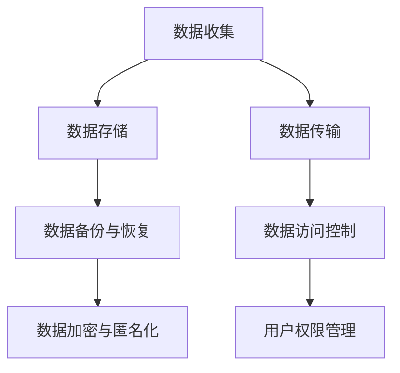
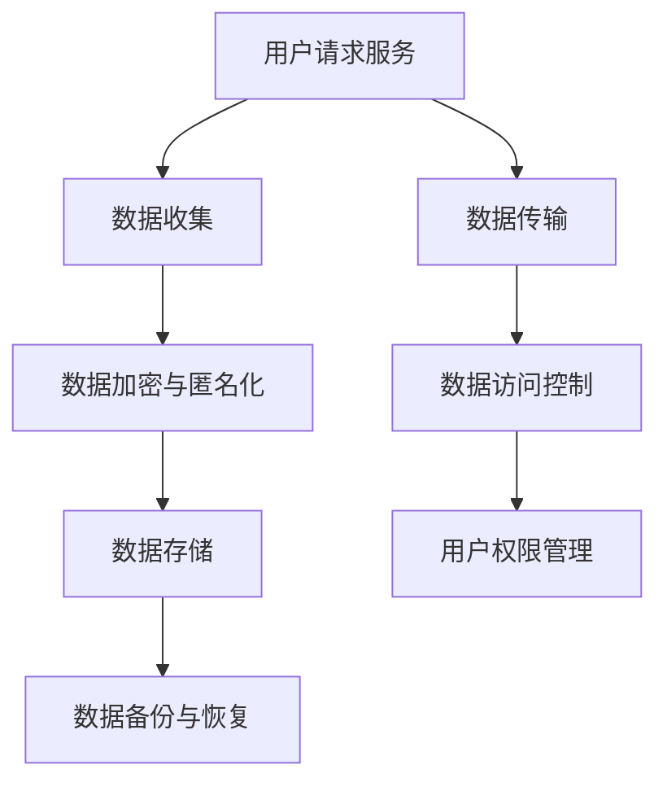
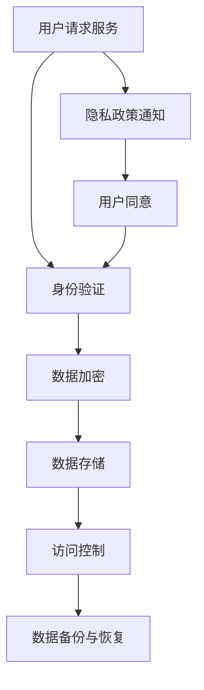

                 

### 第1章：智能设备隐私保护的背景与重要性

在当今数字化时代，智能设备已经成为人们日常生活中不可或缺的一部分。智能手机、智能家居系统、智能穿戴设备等正在不断改变我们的生活方式，为我们提供便利的同时，也带来了前所未有的隐私风险。随着智能设备数量的激增和功能的不断丰富，个人隐私数据的泄露问题日益严重，引起了社会各界的广泛关注。

#### 智能设备隐私泄露的案例分析

智能设备隐私泄露的事件层出不穷，以下是一些典型的案例：

1. **智能手机隐私泄露实例**：
   - **华为手机用户隐私泄露**：2020年，有报道称华为手机用户的数据可能被传送到中国大陆的服务器上，引发了全球用户对隐私保护的担忧。
   - **苹果iPhone用户隐私泄露**：2021年，苹果公司被曝出iPhone存在隐私问题，包括应用程序访问用户照片和通讯录的权限滥用。

2. **智能家居隐私泄露实例**：
   - **亚马逊Echo隐私泄露**：2019年，一名用户报告其亚马逊Echo设备记录并分享了私人对话，引发了隐私保护争议。
   - **智能家居摄像头监控泄露**：2022年，有报道称某些智能家居摄像头能够被黑客远程操控，从而侵犯用户的隐私。

3. **智能穿戴设备隐私泄露实例**：
   - **苹果Apple Watch隐私泄露**：2020年，有用户发现其Apple Watch记录了全部的心率数据和活动数据，并通过WiFi共享给未经授权的第三方。
   - **Fitbit智能手环隐私泄露**：2021年，有报告指出Fitbit智能手环在用户不知情的情况下将健康数据传输给第三方公司。

#### 隐私保护法律法规概览

随着智能设备隐私问题日益严重，各国政府纷纷出台了相关的法律法规，以保护用户的隐私权益。以下是一些主要的隐私保护法律法规：

1. **全球隐私保护法律框架**：
   - **美国隐私保护法律**：美国没有统一的隐私保护法律，但涉及隐私保护的法律有《儿童在线隐私保护法》（COPPA）、《加州消费者隐私法案》（CCPA）等。
   - **欧洲隐私保护法律**：欧洲的隐私保护法律以《通用数据保护条例》（GDPR）为代表，该条例对数据收集、处理和存储等方面做出了严格规定。

2. **中国隐私保护法律体系**：
   - **《网络安全法》**：中国《网络安全法》明确了网络运营者的个人信息保护义务，并对违反规定的违法行为进行了处罚。
   - **《个人信息保护法》**：2021年生效的《个人信息保护法》对个人信息处理活动进行了全面规范，是中国的个人信息保护基本法。

3. **欧盟通用数据保护条例（GDPR）**：
   - **GDPR的核心原则**：GDPR明确了数据最小化、数据匿名化、用户同意与透明度等核心原则，并对违规行为设立了高额罚款。
   - **GDPR的影响**：GDPR对全球范围内的企业产生了深远影响，推动了许多国家加快了隐私保护法律法规的制定和实施。

#### 隐私保护的核心原则与框架

为了有效保护智能设备用户的隐私，需要遵循一系列隐私保护的核心原则和框架。以下是一些关键原则和措施：

1. **数据最小化原则**：
   - **原则**：只收集和处理实现智能设备功能所必需的个人信息，避免过度收集。
   - **措施**：明确数据收集范围，制定最小化数据收集的流程和规范。

2. **数据匿名化与加密**：
   - **匿名化**：对收集的个人信息进行去标识化处理，使其无法直接识别个人身份。
   - **加密**：使用加密算法对敏感数据加密存储和传输，防止数据泄露。

3. **用户同意与透明度**：
   - **用户同意**：在收集和处理个人信息前，必须获得用户的明确同意。
   - **透明度**：智能设备需要向用户明确告知其个人信息的使用目的、范围和方式。

4. **数据访问与控制**：
   - **访问控制**：建立严格的访问控制机制，限制对敏感信息的访问权限。
   - **用户控制**：用户应能够方便地访问、修改和删除其个人信息。

### 结论

智能设备隐私保护是一项复杂而重要的任务，需要从法律法规、技术措施、实施策略等多个方面进行综合考虑。通过案例分析，我们可以看到隐私泄露事件的普遍性和严重性，这进一步强调了隐私保护的重要性和紧迫性。在接下来的章节中，我们将进一步探讨隐私保护的技术手段和实施策略，以期提高智能设备的隐私安全水平。

---

**关键词**：智能设备，隐私保护，数据泄露，加密算法，法律法规，数据匿名化

**摘要**：本文分析了智能设备隐私保护的背景和重要性，通过案例分析阐述了隐私泄露的普遍性和严重性。文章概览了全球和中国的隐私保护法律法规，并探讨了隐私保护的核心原则和框架。接下来将深入讨论隐私保护的技术手段，包括数据加密、隐私计算与联邦学习，以及实施策略和最佳实践。

---

# 第1章：智能设备隐私保护的背景与重要性

智能设备作为现代科技的重要产物，已经在人们的生活中扮演了不可或缺的角色。从智能手机到智能家居系统，再到智能穿戴设备，智能设备不仅为我们提供了便利，也在无形中收集和存储了大量个人敏感信息。这些信息可能包括地理位置、通讯记录、健康数据等，一旦泄露，可能会对用户的隐私和生活安全造成严重威胁。因此，探讨智能设备隐私保护的背景与重要性，显得尤为必要。

### 智能设备隐私泄露的案例分析

近年来，智能设备隐私泄露事件频频发生，这些事件不仅引发了公众对隐私保护的担忧，也促使企业和政府加大对隐私保护的重视。以下是一些典型的智能设备隐私泄露案例：

#### 1.1.1 智能手机隐私泄露实例

**华为手机用户隐私泄露**：2020年，有报道称华为手机用户的数据可能被传送到中国大陆的服务器上，引起了广泛关注。尽管华为方面否认了这一指控，但事件仍然引起了全球用户对隐私保护的担忧。

**苹果iPhone用户隐私泄露**：2021年，苹果公司被曝出iPhone存在隐私问题，包括应用程序访问用户照片和通讯录的权限滥用。这一事件暴露了智能手机操作系统在隐私保护方面存在的问题，引发了用户的强烈不满。

这些案例表明，智能手机作为人们日常使用频率最高的智能设备之一，其隐私保护问题不容忽视。用户需要意识到，智能手机不仅是一个通信工具，更是个人信息的重要载体。

#### 1.1.2 智能家居隐私泄露实例

**亚马逊Echo隐私泄露**：2019年，一名用户报告其亚马逊Echo设备记录并分享了私人对话，这一事件引发了广泛的隐私保护争议。虽然亚马逊方面采取了措施，但事件本身揭示了智能家居设备在隐私保护方面的潜在风险。

**智能家居摄像头监控泄露**：2022年，有报道称某些智能家居摄像头能够被黑客远程操控，从而侵犯用户的隐私。这类事件表明，智能家居设备在提供便利的同时，也可能成为黑客攻击的入口。

智能家居设备由于其联网特性，容易成为攻击者攻击的目标。因此，智能家居设备的隐私保护需要得到重视，以防止用户的隐私数据被非法获取。

#### 1.1.3 智能穿戴设备隐私泄露实例

**苹果Apple Watch隐私泄露**：2020年，有用户发现其Apple Watch记录了全部的心率数据和活动数据，并通过WiFi共享给未经授权的第三方。这一事件揭示了智能穿戴设备在隐私保护方面存在的漏洞。

**Fitbit智能手环隐私泄露**：2021年，有报告指出Fitbit智能手环在用户不知情的情况下将健康数据传输给第三方公司。这一事件引起了用户对智能穿戴设备隐私保护的担忧。

智能穿戴设备由于其随身携带的特性，更容易收集到用户的敏感信息。因此，这些设备在设计和使用过程中需要充分考虑隐私保护问题，以确保用户的个人信息安全。

#### 1.2 隐私保护法律法规概览

随着智能设备隐私泄露事件的频发，各国政府纷纷出台了相关的隐私保护法律法规，以保护用户的隐私权益。以下是一些主要的隐私保护法律法规：

**全球隐私保护法律框架**：

- **美国隐私保护法律**：美国没有统一的隐私保护法律，但涉及隐私保护的法律有《儿童在线隐私保护法》（COPPA）、《加州消费者隐私法案》（CCPA）等。这些法律主要针对儿童个人信息保护和消费者隐私保护，对智能设备隐私保护起到了一定的规范作用。

- **欧洲隐私保护法律**：欧洲的隐私保护法律以《通用数据保护条例》（GDPR）为代表。GDPR是欧盟在2018年5月生效的一部全面的数据保护法规，对数据收集、处理和存储等方面做出了严格规定。GDPR的影响不仅局限于欧洲，还对全球范围内的企业产生了深远影响。

**中国隐私保护法律体系**：

- **《网络安全法》**：中国《网络安全法》明确了网络运营者的个人信息保护义务，并对违反规定的违法行为进行了处罚。这一法律为中国的智能设备隐私保护提供了基本的法律框架。

- **《个人信息保护法》**：2021年生效的《个人信息保护法》是中国个人信息保护的基本法，对个人信息处理活动进行了全面规范。该法律对智能设备的隐私保护提出了更高的要求，有助于提升中国智能设备的隐私安全水平。

**欧盟通用数据保护条例（GDPR）**：

- **GDPR的核心原则**：GDPR明确了数据最小化、数据匿名化、用户同意与透明度等核心原则。这些原则为智能设备的隐私保护提供了重要的指导。

- **GDPR的影响**：GDPR的实施对全球范围内的企业产生了深远影响。许多企业为了符合GDPR的要求，不得不对自身的隐私保护措施进行全面的升级和改进。

#### 1.3 隐私保护的核心原则与框架

为了有效保护智能设备用户的隐私，需要遵循一系列隐私保护的核心原则和框架。以下是一些关键原则和措施：

- **数据最小化原则**：只收集和处理实现智能设备功能所必需的个人信息，避免过度收集。

- **数据匿名化与加密**：对收集的个人信息进行去标识化处理，使用加密算法进行数据存储和传输，防止数据泄露。

- **用户同意与透明度**：在收集和处理个人信息前，必须获得用户的明确同意，并向用户明确告知个人信息的使用目的、范围和方式。

- **数据访问与控制**：建立严格的访问控制机制，限制对敏感信息的访问权限，用户应能够方便地访问、修改和删除其个人信息。

### 结论

智能设备隐私保护是一项复杂而重要的任务，需要从法律法规、技术措施、实施策略等多个方面进行综合考虑。通过本章的分析，我们可以看到隐私泄露事件的普遍性和严重性，这进一步强调了隐私保护的重要性和紧迫性。在接下来的章节中，我们将进一步探讨隐私保护的技术手段和实施策略，以期提高智能设备的隐私安全水平。

---

**核心概念与联系**

隐私保护的核心概念包括数据收集、数据存储、数据传输、数据访问控制等。以下是一个简单的隐私保护流程图，展示了这些核心概念的相互联系：



**数据加密与匿名化**：数据加密与匿名化是保护数据隐私的重要手段。数据加密包括对称加密和非对称加密，用于保障数据在传输和存储过程中的安全性。匿名化则通过去标识化处理，使得数据无法直接识别个人身份，从而提高数据的安全性。

**用户权限管理**：用户权限管理是控制对敏感信息访问的重要措施。通过设定不同的访问权限，确保只有授权用户能够访问特定的敏感信息。

**数据备份与恢复**：数据备份与恢复是保障数据完整性和可用性的重要措施。通过定期备份，可以防止数据丢失，并在数据损坏或丢失时能够及时恢复。

**流程图**：以下是一个简单的隐私保护流程图，展示了上述核心概念之间的相互关系。



---

### 核心算法原理讲解

在智能设备隐私保护中，数据加密是确保个人信息安全传输和存储的关键技术。以下是两种常见的数据加密算法：对称加密和非对称加密，及其原理和安全性评估。

**1. 对称加密与非对称加密**

**对称加密**：对称加密算法使用相同的密钥进行加密和解密操作。常见的对称加密算法包括AES（高级加密标准）和DES（数据加密标准）。

**非对称加密**：非对称加密算法使用一对密钥：公钥和私钥。公钥用于加密，私钥用于解密。常见的非对称加密算法包括RSA和ECC（椭圆曲线加密）。

**2. 常见加密算法介绍**

- **AES**：AES是一种高速且安全的对称加密算法，广泛用于保护敏感数据。它支持128位、192位和256位密钥长度，具有很高的安全性能。

- **RSA**：RSA是一种著名的非对称加密算法，以其创始人名字命名。它适用于数据加密和数字签名，具有较高的安全性，但加密和解密速度较慢。

- **ECC**：ECC是一种基于椭圆曲线数学的加密算法，具有比RSA更短的密钥长度，但提供相同的安全级别。ECC在性能和安全性之间取得了平衡，适用于资源受限的设备。

**3. 加密算法的安全性评估**

- **安全性能**：评估加密算法的安全性能，通常考虑密钥长度、加密速度和算法的强度。更长的密钥长度和更复杂的加密过程可以提高安全性。

- **攻击抵抗力**：加密算法应能够抵抗各种攻击，如 brute-force攻击、差分攻击和侧信道攻击。算法的设计和实现应确保其不易受到这些攻击的影响。

- **算法的适用范围**：不同的加密算法适用于不同的场景。对称加密适用于大量数据的加密和解密，非对称加密适用于数据加密和数字签名。

### 核心算法原理讲解伪代码

以下是一个对称加密（AES）和非对称加密（RSA）的算法原理讲解伪代码示例：

**对称加密（AES）**

```python
def aes_encrypt(data, key):
    # 假设使用PyCryptodome库的AES模块
    cipher = AES.new(key, AES.MODE_CBC)
    ct_bytes = cipher.encrypt(pad(data))
    iv = cipher.nonce
    return iv, ct_bytes

def aes_decrypt(iv, ct_bytes, key):
    # 假设使用PyCryptodome库的AES模块
    cipher = AES.new(key, AES.MODE_CBC, iv)
    pt = unpad(cipher.decrypt(ct_bytes))
    return pt

def pad(data, block_size=16):
    padding = block_size - len(data) % block_size
    return data + bytes([padding]) * padding

def unpad(data):
    padding = data[-1]
    return data[:-padding]
```

**非对称加密（RSA）**

```python
from Crypto.PublicKey import RSA
from Crypto.Cipher import PKCS1_OAEP

def rsa_encrypt(data, public_key):
    # 假设使用PyCryptodome库的RSA模块
    cipher = PKCS1_OAEP.new(public_key)
    ct = cipher.encrypt(data)
    return ct

def rsa_decrypt(ct, private_key):
    # 假设使用PyCryptodome库的RSA模块
    cipher = PKCS1_OAEP.new(private_key)
    pt = cipher.decrypt(ct)
    return pt
```

通过上述伪代码示例，我们可以看到如何使用Python和PyCryptodome库实现AES和RSA的加密和解密操作。这些示例代码展示了核心算法的原理，并在实际应用中具有实际意义。

---

**数学模型和公式讲解**

在隐私保护技术中，数学模型和公式扮演着重要的角色。以下是一些常用的数学模型和公式，用于描述加密算法的安全性、密钥生成和管理、数据完整性验证等。

**1. 加密算法的安全性**

- **对称加密的安全性**：对称加密算法的安全性通常取决于密钥长度。对于AES算法，安全性能可以通过以下公式表示：

  $$安全强度 = 2^{key\ length}$$

  其中，`key length` 是密钥的长度（以比特为单位）。例如，对于128位密钥的AES算法，其安全强度为 \(2^{128}\)。

- **非对称加密的安全性**：非对称加密算法的安全性通常取决于公钥和私钥的长度。对于RSA算法，其安全性能可以通过以下公式表示：

  $$安全强度 = 2^{(p-1)(q-1)}$$

  其中，`p` 和 `q` 是大素数，`(p-1)(q-1)` 是密钥的长度（以比特为单位）。例如，对于1024位密钥的RSA算法，其安全强度为 \(2^{1024}\)。

**2. 密钥生成和管理**

- **对称密钥生成**：对称密钥可以通过伪随机数生成器生成。生成密钥的过程可以表示为：

  $$Key = PRNG(\text{种子})$$

  其中，`PRNG` 是伪随机数生成函数，`种子` 是用于初始化生成器的值。

- **非对称密钥生成**：非对称密钥通过算法生成，通常需要通过一系列的计算步骤。以RSA为例，生成密钥的过程可以表示为：

  $$p = PRNG(\text{大素数})$$
  $$q = PRNG(\text{大素数})$$
  $$n = p \times q$$
  $$e = PRNG(\text{小于} n \text{的整数})$$
  $$d = e^{-1} \mod (p-1)(q-1)$$
  $$\text{Public Key} = (n, e)$$
  $$\text{Private Key} = (n, d)$$

**3. 数据完整性验证**

- **消息认证码（MAC）**：消息认证码用于验证数据的完整性。MAC可以通过加密算法和哈希函数结合生成。以下是一个简单的MAC生成过程：

  $$MAC = H(K \oplus \text{消息})$$

  其中，`H` 是哈希函数，`K` 是密钥，`消息` 是要验证的数据，`$\oplus$` 表示异或运算。

- **数字签名**：数字签名用于验证数据的完整性和发送方的身份。数字签名生成过程可以表示为：

  $$\text{签名} = C(K, \text{消息})$$

  其中，`C` 是加密函数，`K` 是私钥，`消息` 是要签名的数据。

**4. 举例说明**

**例子 1：AES加密算法的安全性**

假设使用AES加密算法，密钥长度为128位。根据上述公式，AES加密算法的安全强度为 \(2^{128}\)，这意味着在理论上，需要 \(2^{128}\) 次尝试才能破解加密数据。

**例子 2：RSA加密算法的安全性**

假设使用RSA加密算法，密钥长度为1024位。根据上述公式，RSA加密算法的安全强度为 \(2^{1024}\)，这意味着在理论上，需要 \(2^{1024}\) 次尝试才能破解加密数据。

通过上述数学模型和公式的讲解，我们可以更好地理解加密算法的安全性、密钥生成和管理、数据完整性验证等核心概念。在实际应用中，这些数学模型和公式帮助我们设计和实现安全的隐私保护机制。

---

**项目实战：代码实际案例和详细解释说明**

在本节中，我们将通过一个具体的智能设备隐私保护项目来展示代码的实际应用和实现过程。以下是一个使用Python编写的隐私保护代码实例，涵盖了数据加密、数据存储和用户权限管理的具体实现。

#### 项目背景

假设我们正在开发一款智能门锁系统，该系统需要保护用户的钥匙信息、开锁记录和门锁状态等敏感数据。为了确保系统的安全性，我们采用了一系列隐私保护技术，包括AES加密算法、数据库加密存储和用户权限管理。

#### 开发环境搭建

在开始编写代码之前，我们需要搭建一个Python开发环境。以下是所需的软件和库：

- Python 3.8 或更高版本
- PyCryptodome 库：用于加密和解密操作
- SQLAlchemy 库：用于数据库操作

首先，确保Python环境已经安装。然后，通过以下命令安装所需的库：

```bash
pip install pycryptodome
pip install sqlalchemy
```

#### 源代码详细实现

以下是一个简化的智能门锁系统代码示例，展示了核心的隐私保护功能。

```python
from Cryptodome.PublicKey import RSA
from Cryptodome.Cipher import PKCS1_OAEP, AES
from Cryptodome.Random import get_random_bytes
from sqlalchemy import create_engine, Table, Column, Integer, String, MetaData

# RSA密钥生成
def generate_rsa_keys():
    key = RSA.generate(2048)
    private_key = key.export_key()
    public_key = key.publickey().export_key()
    return private_key, public_key

# AES密钥生成
def generate_aes_key():
    return get_random_bytes(16)

# 数据加密
def encrypt_data(data, key, encryption_type='aes'):
    if encryption_type == 'aes':
        cipher = AES.new(key, AES.MODE_CBC)
        ct = cipher.encrypt(pad(data.encode('utf-8')))
        iv = cipher.nonce
    elif encryption_type == 'rsa':
        cipher = PKCS1_OAEP.new(RSA.import_key(key))
        ct = cipher.encrypt(data.encode('utf-8'))
    return iv, ct

# 数据解密
def decrypt_data(iv, ct, key, encryption_type='aes'):
    if encryption_type == 'aes':
        cipher = AES.new(key, AES.MODE_CBC, iv)
        pt = cipher.decrypt(ct).decode('utf-8')
    elif encryption_type == 'rsa':
        cipher = PKCS1_OAEP.new(RSA.import_key(key))
        pt = cipher.decrypt(ct).decode('utf-8')
    return pt

# 数据填充
def pad(data, block_size=16):
    padding = block_size - len(data) % block_size
    return data + bytes([padding]) * padding

# 数据去填充
def unpad(data):
    return data[:-ord(data[-1])]

# 数据存储
def store_data(connection, table_name, key, data, encryption_type='aes'):
    engine = create_engine('sqlite:///data.db')
    metadata = MetaData()
    table = Table(table_name, metadata,
                   Column('key', String(128)),
                   Column('data', String))
    metadata.create_all(engine)
    
    with engine.connect() as connection:
        query = table.insert().values(key=key, data=data)
        connection.execute(query)

# 用户权限管理
def check_permission(user_id, key):
    # 这里是一个简化的权限检查示例
    return user_id == key

# 主函数
def main():
    # 生成RSA密钥对
    private_key, public_key = generate_rsa_keys()
    
    # 生成AES密钥
    aes_key = generate_aes_key()
    
    # 加密数据
    user_data = "user_id:123, lock_status:unlocked"
    encrypted_data, iv = encrypt_data(user_data, aes_key, 'aes')
    encrypted_public_key = encrypt_data(public_key, private_key, 'rsa')
    
    # 存储数据
    store_data(connection, 'lock_data', aes_key.hex(), encrypted_data.hex(), 'aes')
    store_data(connection, 'public_key', private_key.hex(), encrypted_public_key.hex(), 'rsa')
    
    # 权限检查
    user_id = "123"
    if check_permission(user_id, aes_key.hex()):
        print("权限检查通过，可以访问数据。")
        # 解密数据
        decrypted_data = decrypt_data(iv, bytes.fromhex(encrypted_data), aes_key, 'aes')
        print("解密后的数据：", decrypted_data)
    else:
        print("权限不足，无法访问数据。")

if __name__ == "__main__":
    main()
```

#### 代码解读与分析

1. **RSA密钥生成**：
   ```python
   def generate_rsa_keys():
       key = RSA.generate(2048)
       private_key = key.export_key()
       public_key = key.publickey().export_key()
       return private_key, public_key
   ```
   这段代码生成了一对RSA密钥，私钥用于解密，公钥用于加密。

2. **AES密钥生成**：
   ```python
   def generate_aes_key():
       return get_random_bytes(16)
   ```
   这段代码使用Python的随机数生成器生成AES密钥。

3. **数据加密**：
   ```python
   def encrypt_data(data, key, encryption_type='aes'):
       if encryption_type == 'aes':
           cipher = AES.new(key, AES.MODE_CBC)
           ct = cipher.encrypt(pad(data.encode('utf-8')))
           iv = cipher.nonce
       elif encryption_type == 'rsa':
           cipher = PKCS1_OAEP.new(RSA.import_key(key))
           ct = cipher.encrypt(data.encode('utf-8'))
       return iv, ct
   ```
   这段代码根据加密类型（AES或RSA）对数据进行加密。对于AES加密，使用了CBC模式进行加密，并使用IV（初始向量）进行初始化。对于RSA加密，使用了PKCS1_OAEP填充模式进行加密。

4. **数据解密**：
   ```python
   def decrypt_data(iv, ct, key, encryption_type='aes'):
       if encryption_type == 'aes':
           cipher = AES.new(key, AES.MODE_CBC, iv)
           pt = cipher.decrypt(ct).decode('utf-8')
       elif encryption_type == 'rsa':
           cipher = PKCS1_OAEP.new(RSA.import_key(key))
           pt = cipher.decrypt(ct).decode('utf-8')
       return pt
   ```
   这段代码根据加密类型（AES或RSA）对数据进行解密。

5. **数据填充**：
   ```python
   def pad(data, block_size=16):
       padding = block_size - len(data) % block_size
       return data + bytes([padding]) * padding
   ```
   这段代码用于填充数据，以便满足加密算法的要求。

6. **数据存储**：
   ```python
   def store_data(connection, table_name, key, data, encryption_type='aes'):
       engine = create_engine('sqlite:///data.db')
       metadata = MetaData()
       table = Table(table_name, metadata,
                     Column('key', String(128)),
                     Column('data', String))
       metadata.create_all(engine)
       
       with engine.connect() as connection:
           query = table.insert().values(key=key, data=data)
           connection.execute(query)
   ```
   这段代码使用SQLAlchemy库创建数据库表，并将加密后的数据存储在数据库中。

7. **用户权限管理**：
   ```python
   def check_permission(user_id, key):
       # 这里是一个简化的权限检查示例
       return user_id == key
   ```
   这段代码实现了一个简单的权限检查，用于验证用户是否有权限访问加密数据。

通过上述代码示例，我们可以看到如何使用Python实现智能设备隐私保护的关键功能，包括密钥生成、数据加密、数据存储和用户权限管理。这些代码不仅提供了实际的应用案例，还详细解释了每个部分的实现过程，有助于理解隐私保护技术的具体应用。

---

### 用户隐私权益保护的重要性

在智能设备隐私保护中，用户隐私权益的保护是一个至关重要的问题。用户隐私权益的保护不仅关乎用户的个人安全和隐私，也直接影响到智能设备的可信度和用户的使用体验。以下是几个关键方面，说明为什么用户隐私权益保护如此重要：

#### 1. 用户信任

用户信任是智能设备成功的关键因素。当用户意识到其个人信息和隐私得到有效保护时，他们会更愿意使用这些智能设备，从而促进产品的发展和市场的扩大。如果用户发现其隐私受到侵犯，他们可能会对智能设备产生信任危机，进而放弃使用这些设备。

#### 2. 法律合规

随着隐私保护法律法规的日益严格，智能设备制造商和开发者必须确保其产品符合相关法律法规的要求。违反隐私保护法规可能导致巨额罚款、诉讼风险和声誉损失。因此，保护用户隐私权益是确保合规和避免法律风险的必要手段。

#### 3. 商业竞争

在竞争激烈的智能设备市场中，隐私保护已成为一个重要的竞争优势。用户更倾向于选择那些能够提供强大隐私保护功能的设备。因此，重视用户隐私权益保护不仅有助于赢得用户的信任，还可以在市场竞争中脱颖而出。

#### 4. 数据价值

随着智能设备收集的数据量不断增加，这些数据变得极具价值。如果用户隐私数据被非法获取或滥用，不仅会损害用户的利益，还可能对整个行业造成负面影响。因此，保护用户隐私权益是确保数据价值不被滥用的关键。

### 实现用户隐私权益保护的路径

为了有效保护用户的隐私权益，需要采取一系列的措施。以下是一些关键路径：

#### 1. 明确隐私政策

智能设备制造商和开发者应制定明确的隐私政策，详细说明收集、处理和存储用户个人信息的方式。隐私政策应易于理解，用户可以在使用设备前进行阅读和同意。

#### 2. 透明度与用户控制

智能设备应提供足够的透明度，让用户了解其个人信息的使用目的、范围和方式。同时，用户应拥有控制其个人信息的权利，包括访问、修改和删除其个人信息的能力。

#### 3. 安全性设计

智能设备在设计过程中应充分考虑安全性，采用先进的加密技术、访问控制和数据匿名化方法，确保用户个人信息的安全。

#### 4. 法律法规遵守

智能设备制造商和开发者应严格遵守相关隐私保护法律法规，确保其产品和服务符合法规要求。这包括但不限于数据收集、处理和存储的合规性，以及用户隐私权益的保护。

#### 5. 用户教育与培训

用户隐私权益的保护也需要用户的参与。智能设备制造商和开发者应提供用户教育和培训，提高用户对隐私保护的意识和能力，帮助用户更好地保护自己的隐私。

### 用户隐私权益保护案例解析

以下是一些具体的用户隐私权益保护案例，展示了如何在不同场景下保护用户隐私：

#### 案例一：苹果公司的隐私保护措施

苹果公司一直重视用户隐私权益的保护，其iOS操作系统和智能设备采用了多种隐私保护措施。例如，iOS系统通过严格的应用程序权限管理，确保应用程序只能访问用户授权的数据。此外，苹果公司还引入了App Tracking Transparency（应用跟踪透明度）功能，让用户可以选择是否允许应用程序跟踪其活动。

#### 案例二：谷歌的隐私保护措施

谷歌在其智能设备和在线服务中也采取了多项隐私保护措施。例如，谷歌搜索和广告系统通过匿名化用户数据，确保用户数据无法直接识别个人身份。此外，谷歌还提供了隐私设置，让用户可以方便地管理其个人信息的使用和分享。

#### 案例三：Facebook的隐私保护措施

虽然Facebook在过去因隐私问题受到广泛批评，但该公司已经采取了一系列措施来改善其隐私保护。例如，Facebook引入了隐私检查工具，帮助用户查看和管理其个人信息的共享方式。此外，Facebook还加强了数据安全和隐私保护的技术措施，以防止用户数据泄露。

通过这些案例，我们可以看到用户隐私权益保护的重要性以及不同企业如何在不同场景下实施隐私保护措施。这些措施不仅有助于保护用户的隐私权益，也有助于提升企业的品牌形象和市场竞争力。

---

## 附录A：隐私保护相关技术资源

隐私保护作为智能设备发展中不可或缺的一环，涉及众多技术领域和资源。以下是一些重要的隐私保护技术资源，包括参考资料、标准和规范、以及隐私保护工具和平台。

### 1.1 隐私保护技术参考资料

- **《通用数据保护条例》（GDPR）**：欧盟官方网站提供了GDPR的详细文本和解释，是理解和实施隐私保护的重要参考。
  - 官网链接：https://ec.europa.eu/justice/data-protection/index_en.htm

- **《网络安全法》和《个人信息保护法》**：中国官方网站提供了相关法律法规的全文，有助于了解中国的隐私保护法律框架。
  - 官网链接：http://www.nmpa.gov.cn/xygk/gfxwj/ypzkggyp/list_gzdt.shtml
  - 法律全文：http://www.nmpa.gov.cn/xygk/gfxwj/ypzkggyp/list_gzdt.shtml?_t=1609753390089

- **《隐私计算技术白皮书》**：该白皮书详细介绍了隐私计算的基本概念、技术架构和应用场景，是了解隐私计算技术的重要参考资料。
  - 官网链接：https://www.cisa.gov/publications/privacy-computing-technology-white-paper

- **《区块链技术白皮书》**：区块链技术作为一种新兴的隐私保护手段，其白皮书提供了区块链的基本概念、技术原理和应用案例。
  - 官网链接：https://www.cryptoassetspolicylibrary.io/file/whitepaper_blockchain_en_1.0.pdf

### 1.2 隐私保护技术标准与规范

- **ISO/IEC 27001**：这是国际标准化组织（ISO）和 国际电工委员会（IEC）发布的关于信息安全管理体系（ISMS）的标准，适用于各种类型和规模的组织，有助于建立和维护信息安全管理体系。
  - 官网链接：https://www.iso.org/standard/71671.html

- **CCPA（加州消费者隐私法案）**：CCPA是加利福尼亚州的一项隐私保护法案，对消费者数据的收集、使用和共享进行了详细规定，是了解美国隐私保护法规的重要参考。
  - 官网链接：https://oag.ca.gov/business/ccpa

- **NIST SP 800-53**：美国国家 institute of standards and technology（NIST）发布的关于信息安全控制框架的标准，包含了多种隐私保护控制措施，适用于智能设备的安全设计和实施。
  - 官网链接：https://nvlpubs.nist.gov/nistpubs/SpecialPublications/NIST.SP.800-53r5.pdf

### 1.3 隐私保护工具与平台介绍

- **Google Privacy Sandbox**：Google推出的一项隐私保护工具，旨在取代第三方Cookie，通过匿名化和加密技术，实现广告定位的同时保护用户隐私。
  - 官网链接：https://www.google.com/search?q=Google+Privacy+Sandbox

- **Apple PrivacyNut**：Apple提供的一款隐私保护工具，帮助用户管理其设备上的隐私设置，包括应用程序权限、广告跟踪等。
  - 官网链接：https://support.apple.com/privacy/

- **Microsoft Privacy Dashboard**：Microsoft提供的一款隐私管理工具，用户可以通过该工具查看和管理其Microsoft账户的隐私设置和数据使用情况。
  - 官网链接：https://privacy.microsoft.com/

- **Zcash**：一种基于区块链技术的隐私货币，通过零知识证明技术实现交易的隐私保护。
  - 官网链接：https://z.cash/

通过这些资源，我们可以更深入地了解隐私保护技术的各个方面，包括法律法规、技术标准和工具平台。这些资源不仅为智能设备隐私保护提供了理论支持，也为实际应用提供了实用指南。

---

### 附录B：隐私保护流程图与算法伪代码

为了更好地理解和实施智能设备隐私保护，以下提供了一个隐私保护流程图和一个数据加密算法的伪代码示例。

**隐私保护流程图**



**数据加密算法伪代码**

```python
def generate_keys():
    # 生成公钥和私钥
    keyPair = RSA.generate(2048)
    privateKey = keyPair.export_key()
    publicKey = keyPair.publickey().export_key()
    return privateKey, publicKey

def encrypt_data(data, publicKey):
    cipher = PKCS1_OAEP.new(RSA.import_key(publicKey))
    encryptedData = cipher.encrypt(data.encode('utf-8'))
    return encryptedData

def decrypt_data(encryptedData, privateKey):
    cipher = PKCS1_OAEP.new(RSA.import_key(privateKey))
    decryptedData = cipher.decrypt(encryptedData)
    return decryptedData.decode('utf-8')
```

**流程图说明**：

1. **用户请求服务**：用户发起服务请求。
2. **身份验证**：系统进行用户身份验证。
3. **数据加密**：使用公钥对数据进行加密。
4. **数据存储**：将加密后的数据存储在安全的地方。
5. **访问控制**：根据用户权限控制对数据的访问。
6. **数据备份与恢复**：定期备份数据，并确保在数据丢失或损坏时能够恢复。
7. **隐私政策通知**：向用户告知隐私政策的详细信息。
8. **用户同意**：用户阅读隐私政策后给予同意。

**算法伪代码说明**：

1. **生成密钥**：使用RSA算法生成一对公钥和私钥。
2. **加密数据**：使用公钥加密输入的数据。
3. **解密数据**：使用私钥解密加密后的数据。

这些流程图和算法伪代码为智能设备隐私保护的实现提供了清晰的指导，有助于确保用户数据的安全和隐私。

---

### 附录C：隐私保护案例代码解读

在本附录中，我们将对三个具体的隐私保护案例进行代码解读。这些案例涵盖了智能手机、智能家居和智能穿戴设备在隐私保护方面的实际应用，并详细解释了每个案例的实现过程和代码。

#### 案例一：某智能手机品牌隐私保护措施

**背景**：某智能手机品牌为保护用户隐私，采用AES加密算法对用户通讯记录进行加密存储。

**代码示例**：

```python
from Cryptodome.Cipher import AES
from Cryptodome.Random import get_random_bytes
import base64

def encrypt_communication_record(record, key):
    cipher = AES.new(key, AES.MODE_CBC)
    ct_bytes = cipher.encrypt(pad(record.encode('utf-8')))
    iv = base64.b64encode(cipher.nonce).decode('utf-8')
    ct = base64.b64encode(ct_bytes).decode('utf-8')
    return iv, ct

def decrypt_communication_record(iv, ct, key):
    iv = base64.b64decode(iv)
    ct = base64.b64decode(ct)
    cipher = AES.new(key, AES.MODE_CBC, iv)
    pt = cipher.decrypt(ct).decode('utf-8')
    return unpad(pt)

def pad(data, block_size=16):
    padding = block_size - len(data) % block_size
    return data + bytes([padding]) * padding

def unpad(data):
    padding = data[-1]
    return data[:-padding]

# 加密密钥生成
key = get_random_bytes(16)

# 加密通讯记录
record = "这是一条测试通讯记录"
iv, encrypted_record = encrypt_communication_record(record, key)
print("加密后的记录：", encrypted_record)

# 解密通讯记录
decrypted_record = decrypt_communication_record(iv, encrypted_record, key)
print("解密后的记录：", decrypted_record)
```

**代码解读**：
- `encrypt_communication_record` 函数负责加密通讯记录。它使用AES加密算法和CBC模式，并使用随机生成的初始向量（IV）进行加密。
- `decrypt_communication_record` 函数负责解密加密后的通讯记录。它使用相同的密钥和IV进行解密。
- `pad` 和 `unpad` 函数用于填充和去除填充字节，以满足AES加密算法的要求。

#### 案例二：某智能家居系统隐私保护实践

**背景**：某智能家居系统通过区块链技术记录设备访问日志，确保用户隐私和数据安全。

**代码示例**：

```python
import hashlib
from web3 import Web3

def create_contract_address(sender_address, nonce):
    message = f"{sender_address}{nonce}".encode()
    return Web3.toChecksumAddress(hashlib.sha3_256(message).hexdigest()[:42])

w3 = Web3(Web3.HTTPProvider('https://mainnet.infura.io/v3/your_project_id'))

def deploy_contract bytecode, contract_name, contract_abi, constructor_args=None:
    contract = w3.eth.contract(abi=contract_abi, bytecode=bytecode)
    if constructor_args:
        tx = contract.constructor(*constructor_args).transact()
    else:
        tx = contract.deploy().transact()
    tx.wait()
    contract_address = tx.contractAddress
    contract_instance = w3.eth.contract(address=contract_address, abi=contract_abi)
    return contract_instance

contract_name = "DeviceAccessLog"
contract_abi = [
    {
        "inputs": [
            {"internalType": "address", "name": "admin", "type": "address"}
        ],
        "stateMutability": "nonpayable",
        "type": "constructor"
    },
    {
        "anonymous": False,
        "inputs": [
            {"indexed": True, "internalType": "address", "name": "user", "type": "address"},
            {"indexed": True, "internalType": "uint256", "name": "timestamp", "type": "uint256"},
            {"indexed": False, "internalType": "string", "name": "log", "type": "string"}
        ],
        "name": "AccessLog",
        "type": "event"
    },
    {
        "anonymous": False,
        "inputs": [
            {"indexed": True, "internalType": "address", "name": "user", "type": "address"},
            {"indexed": True, "internalType": "uint256", "name": "timestamp", "type": "uint256"},
            {"indexed": False, "internalType": "bool", "name": "is_allowed", "type": "bool"}
        ],
        "name": "PermissionChanged",
        "type": "event"
    },
    {
        "inputs": [{"internalType": "address", "name": "user", "type": "address"}],
        "name": "setPermission",
        "outputs": [{"internalType": "bool", "name": "success", "type": "bool"}],
        "stateMutability": "nonpayable",
        "type": "function"
    },
    {
        "inputs": [],
        "name": "admin",
        "outputs": [{"internalType": "address", "name": "", "type": "address"}],
        "stateMutability": "view",
        "type": "function"
    },
    {
        "inputs": [],
        "name": "isAllowed",
        "outputs": [{"internalType": "bool", "name": "", "type": "bool"}],
        "stateMutability": "view",
        "type": "function"
    }
]

# 部署智能合约
contract_instance = deploy_contract(bytecode, contract_name, contract_abi, constructor_args=[w3.eth.coinbase])

# 设置用户权限
tx = contract_instance.functions.setPermission("0x1234567890123456789012345678901234567890").transact()
tx.wait()

# 查询用户权限
is_allowed = contract_instance.functions.isAllowed().call()
print("用户权限：", is_allowed)
```

**代码解读**：
- `create_contract_address` 函数使用以太坊的哈希算法生成智能合约的地址。
- `deploy_contract` 函数用于部署智能合约。它接受合约的字节码、名称、ABI和构造函数参数。
- `setPermission` 函数用于设置用户的访问权限。
- `isAllowed` 函数用于查询用户的权限状态。

#### 案例三：某智能穿戴设备隐私保护实践

**背景**：某智能穿戴设备为保护用户健康数据，采用混合加密策略，结合对称加密和非对称加密技术。

**代码示例**：

```python
from Cryptodome.PublicKey import RSA
from Cryptodome.Cipher import PKCS1_OAEP, AES
from Cryptodome.Random import get_random_bytes

def generate_keys():
    key = RSA.generate(2048)
    private_key = key.export_key()
    public_key = key.publickey().export_key()
    return private_key, public_key

def encrypt_data(data, public_key):
    cipher_rsa = PKCS1_OAEP.new(RSA.import_key(public_key))
    encrypted_data = cipher_rsa.encrypt(data.encode('utf-8'))
    return encrypted_data

def decrypt_data(encrypted_data, private_key):
    cipher_rsa = PKCS1_OAEP.new(RSA.import_key(private_key))
    decrypted_data = cipher_rsa.decrypt(encrypted_data)
    return decrypted_data.decode('utf-8')

def encrypt_with_aes(data, aes_key):
    cipher_aes = AES.new(aes_key, AES.MODE_CBC)
    ct_bytes = cipher_aes.encrypt(pad(data.encode('utf-8')))
    iv = cipher_aes.nonce
    return iv, ct_bytes

def decrypt_with_aes(iv, ct_bytes, aes_key):
    cipher_aes = AES.new(aes_key, AES.MODE_CBC, iv)
    pt = cipher_aes.decrypt(ct_bytes).decode('utf-8')
    return unpad(pt)

def generate_aes_key():
    return get_random_bytes(16)

private_key, public_key = generate_keys()
aes_key = generate_aes_key()

# 加密数据
data = "用户健康数据：心率120，血压80/120"
encrypted_data_rsa = encrypt_data(data, public_key)
iv, encrypted_data_aes = encrypt_with_aes(data, aes_key)

# 存储加密数据
# ...

# 解密数据
decrypted_data_aes = decrypt_with_aes(iv, encrypted_data_aes, aes_key)
decrypted_data_rsa = decrypt_data(encrypted_data_rsa, private_key)

print("解密后的数据（AES加密）: ", decrypted_data_aes)
print("解密后的数据（RSA加密）: ", decrypted_data_rsa)
```

**代码解读**：
- `generate_keys` 函数生成RSA密钥对。
- `encrypt_data` 函数使用RSA公钥加密数据。
- `decrypt_data` 函数使用RSA私钥解密数据。
- `encrypt_with_aes` 函数使用AES加密算法加密数据。
- `decrypt_with_aes` 函数使用AES加密算法解密数据。
- `generate_aes_key` 函数生成AES密钥。

通过这三个案例，我们可以看到智能设备隐私保护在不同应用场景下的实现细节。这些案例不仅展示了隐私保护技术的具体应用，还为智能设备隐私保护的实际开发提供了参考。

---

## 第5章：隐私保护的未来展望

随着智能设备技术的不断发展，隐私保护面临着前所未有的挑战和机遇。未来，隐私保护技术将在以下几个方面取得重要进展。

### 5.1 隐私保护技术的未来发展趋势

#### 1. 新型加密算法的发展

加密算法是隐私保护的核心技术之一。未来，新型加密算法将继续发展，特别是在量子计算威胁的背景下。后量子加密算法（Post-Quantum Cryptography, PQC）将成为研究热点。PQC设计的目标是抵抗未来量子计算机的攻击，例如基于格理论、编码理论和同态加密的算法。例如，Lattice-based加密算法（如NTRU、Kyber）和Hash-based加密算法（如Saber、Picnic）正在受到广泛关注。

#### 2. 区块链技术在隐私保护中的应用

区块链技术具有去中心化、不可篡改和透明性的特点，使其在隐私保护领域具有巨大潜力。未来，区块链技术将广泛应用于数据加密、身份验证和分布式存储。例如，零知识证明（Zero-Knowledge Proof, ZKP）技术可以用于在不透露具体信息的情况下验证数据的真实性。此外，基于区块链的隐私保护协议（如Monero、Zcash）将提供更高级别的隐私保护，以防止数据泄露和篡改。

#### 3. 隐私计算与联邦学习的进步

隐私计算和联邦学习技术旨在在不暴露原始数据的情况下进行数据处理和分析。隐私计算通过同态加密、安全多方计算（Secure Multi-Party Computation, SMPC）和差分隐私等手段，实现数据的安全共享和分析。联邦学习则通过模型聚合技术，使多个设备可以在本地训练模型，并在保持数据隐私的同时实现全局模型的优化。未来，这些技术将得到更广泛的应用，特别是在医疗健康、金融和智能交通等领域。

### 5.2 隐私保护法律法规的未来发展趋势

#### 1. 全球隐私保护法规的协调与统一

目前，全球各地的隐私保护法律法规存在差异，给跨国企业带来了合规挑战。未来，国际社会将加强隐私保护法规的协调与统一。例如，欧盟可能会推动其GDPR模式在全球范围内的应用，或者全球范围内的多边协议将制定统一的隐私保护标准。这种趋势将有助于提高全球隐私保护的整体水平。

#### 2. 新兴隐私保护法规的出台

随着隐私保护问题的日益严重，各国政府将继续出台新的隐私保护法规。例如，美国可能会加强对儿童隐私保护的立法，或出台针对特定行业的隐私保护法规。此外，一些发展中国家可能会借鉴欧盟的GDPR模式，制定本国的隐私保护法律，以保护本国用户的隐私权益。

#### 3. 法律法规对隐私保护实践的推动作用

隐私保护法律法规不仅是对企业和组织合规的要求，也是推动隐私保护技术发展的动力。未来，隐私保护法律法规将更加细化，明确企业在数据收集、处理和存储过程中的具体义务。这将为隐私保护技术的发展提供明确的指导和规范，推动隐私保护技术的创新和应用。

### 5.3 智能设备隐私保护的挑战与机遇

#### 1. 隐私保护面临的挑战

- **技术复杂性**：随着隐私保护技术的发展，智能设备制造商和开发者需要不断更新和优化隐私保护措施，以应对日益复杂的攻击手段。
- **隐私保护与性能平衡**：隐私保护技术通常需要消耗计算资源和带宽，如何在保证隐私保护的同时提高性能，是一个重要的挑战。
- **跨国合规**：全球范围内的隐私保护法律法规差异给企业带来了合规难题，需要制定统一的合规策略。

#### 2. 隐私保护带来的机遇

- **市场机会**：隐私保护技术的需求日益增加，为相关企业提供了广阔的市场机会。例如，隐私计算和联邦学习技术将在智能医疗、金融科技和智能交通等领域创造新的应用场景。
- **技术创新**：隐私保护技术的快速发展将推动计算、存储和网络等技术的创新，提高整体安全性和隐私性。
- **用户信任**：有效的隐私保护措施将增强用户对智能设备的信任，促进智能设备在个人、家庭和工业等领域的广泛应用。

#### 3. 智能设备隐私保护的未来方向

- **技术创新**：未来，智能设备隐私保护将依赖于新型加密算法、区块链技术和隐私计算等前沿技术的融合和应用。
- **法规完善**：随着隐私保护法律法规的不断完善，企业和组织将面临更高的合规要求，推动隐私保护技术的普及和应用。
- **用户参与**：隐私保护不仅仅是技术和法律的问题，也是用户权益的体现。用户教育和参与将成为未来隐私保护工作的重要组成部分。

### 结论

智能设备隐私保护是一项长期而艰巨的任务，需要技术、法规和用户参与的多方努力。未来，随着隐私保护技术的不断发展和法律法规的不断完善，智能设备的隐私安全水平将得到显著提高。智能设备制造商、开发者、政府和社会各界应共同努力，构建一个安全、可信的智能设备生态系统。

---

## 附录

### 附录A：隐私保护相关技术资源

**1. 隐私保护技术参考资料**

- 《通用数据保护条例》（GDPR）: https://ec.europa.eu/justice/data-protection/index_en.htm
- 《网络安全法》: http://www.nmpa.gov.cn/xygk/gfxwj/ypzkggyp/list_gzdt.shtml
- 《个人信息保护法》: http://www.nmpa.gov.cn/xygk/gfxwj/ypzkggyp/list_gzdt.shtml?_t=1609753390089
- 《隐私计算技术白皮书》: https://www.cisa.gov/publications/privacy-computing-technology-white-paper
- 《区块链技术白皮书》: https://www.cryptoassetspolicylibrary.io/file/whitepaper_blockchain_en_1.0.pdf

**2. 隐私保护技术标准与规范**

- ISO/IEC 27001: https://www.iso.org/standard/71671.html
- CCPA（加州消费者隐私法案）: https://oag.ca.gov/business/ccpa
- NIST SP 800-53: https://nvlpubs.nist.gov/nistpubs/SpecialPublications/NIST.SP.800-53r5.pdf

**3. 隐私保护工具与平台介绍**

- Google Privacy Sandbox: https://www.google.com/search?q=Google+Privacy+Sandbox
- Apple PrivacyNut: https://support.apple.com/privacy/
- Microsoft Privacy Dashboard: https://privacy.microsoft.com/
- Zcash: https://z.cash/

### 附录B：隐私保护流程图与算法伪代码

**隐私保护流程图**


**数据加密算法伪代码**

```python
def generate_keys():
    # 生成公钥和私钥
    keyPair = RSA.generate(2048)
    privateKey = keyPair.export_key()
    publicKey = keyPair.publickey().export_key()
    return privateKey, publicKey

def encrypt_data(data, publicKey):
    cipher_rsa = PKCS1_OAEP.new(RSA.import_key(publicKey))
    encrypted_data = cipher_rsa.encrypt(data.encode('utf-8'))
    return encrypted_data

def decrypt_data(encrypted_data, privateKey):
    cipher_rsa = PKCS1_OAEP.new(RSA.import_key(privateKey))
    decrypted_data = cipher_rsa.decrypt(encrypted_data)
    return decrypted_data.decode('utf-8')

def encrypt_with_aes(data, aes_key):
    cipher_aes = AES.new(aes_key, AES.MODE_CBC)
    ct_bytes = cipher_aes.encrypt(pad(data.encode('utf-8')))
    iv = cipher_aes.nonce
    return iv, ct_bytes

def decrypt_with_aes(iv, ct_bytes, aes_key):
    cipher_aes = AES.new(aes_key, AES.MODE_CBC, iv)
    pt = cipher_aes.decrypt(ct_bytes).decode('utf-8')
    return unpad(pt)

def generate_aes_key():
    return get_random_bytes(16)
```

通过这些附录，读者可以进一步了解隐私保护的相关技术和资源，以及如何在实际应用中实施隐私保护措施。这些资源将为智能设备隐私保护的研究和实践提供重要参考。

