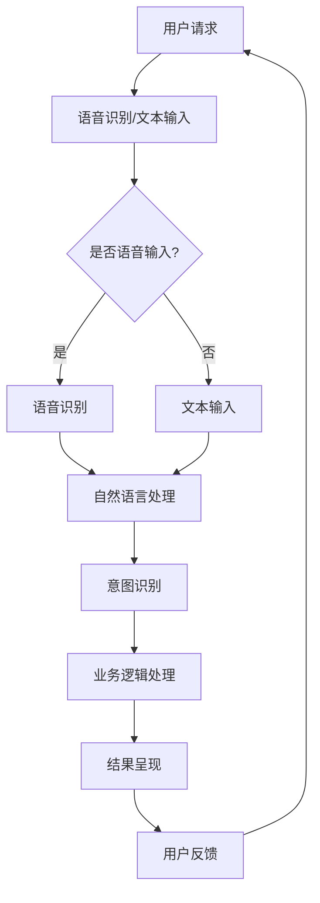

                 

### 《未来的智能客服：2050年的智能客服机器人与智能投诉处理》

> **关键词：智能客服，2050年，机器人，投诉处理，自然语言处理，人工智能，用户体验**

> **摘要：本文深入探讨了2050年智能客服的发展趋势、技术基础、架构设计以及投诉处理系统。通过分析自然语言处理、深度学习、多模态交互和大数据分析等技术，展示了未来智能客服的愿景及其对社会的影响。文章还提供了智能客服项目实践案例，为读者提供了实际操作的指导。**

### 第一部分：引言

#### 第1章：智能客服概述

##### 1.1 智能客服的发展背景

智能客服的概念起源于20世纪90年代，当时互联网的普及使得在线客服成为可能。最初的智能客服系统主要依赖于规则引擎，通过预定义的规则来处理用户的查询。随着互联网技术的不断进步，特别是宽带网络的普及和智能手机的广泛应用，智能客服逐渐发展成为一个独立的行业。

在早期，智能客服的应用主要集中在电商和在线服务领域，如在线银行、在线购物和机票预订等。这些系统通常采用人工客服与自动化客服相结合的方式，通过电话、邮件、聊天窗口等多种渠道提供客户服务。

进入21世纪，随着人工智能技术的快速发展，智能客服迎来了新的发展阶段。特别是自然语言处理（NLP）和机器学习技术的突破，使得智能客服系统可以更加智能化地理解用户的意图，提供更加个性化和高效的客服服务。

##### 1.2 智能客服的未来趋势

智能客服的未来发展趋势可以从以下几个方面来探讨：

1. **更高水平的自然语言理解和处理能力**：随着深度学习技术的发展，智能客服将能够更准确地理解和处理用户的语言，包括复杂的语境、方言和非标准语言。

2. **更智能的投诉处理系统**：智能客服将不仅仅能够自动处理常见问题，还能够自动识别和分类投诉，并提供相应的解决方案。这将大大提高投诉处理的效率，减少用户等待时间。

3. **多模态交互**：未来的智能客服将不仅限于文本交互，还将支持语音、图像等多种交互方式。这将使得用户能够更加方便地与客服系统进行沟通。

4. **大数据分析和个性化服务**：智能客服将能够利用大数据技术，分析用户行为和偏好，提供更加个性化的服务。

5. **更加人性化的用户体验**：未来的智能客服将不仅仅是冰冷的机器，而是能够模拟人类交流方式的虚拟助手。

##### 1.3 智能客服的技术现状

当前，智能客服的技术现状主要集中在以下几个方面：

1. **自然语言处理（NLP）**：NLP技术是智能客服的核心，包括文本预处理、语言模型、语义理解、情感分析等。这些技术使得智能客服能够理解和处理用户的语言。

2. **机器学习和深度学习**：机器学习和深度学习技术使得智能客服能够通过学习大量的数据，不断优化自己的服务。

3. **多模态交互**：智能客服已经开始支持语音、图像等多种交互方式，提供更加丰富的用户体验。

4. **大数据分析**：大数据技术使得智能客服能够从海量的用户数据中提取有价值的信息，用于优化服务。

5. **云计算和边缘计算**：云计算和边缘计算技术为智能客服提供了强大的计算能力和灵活的部署方式。

##### 1.4 2050年的智能客服愿景

到2050年，智能客服将实现以下几个方面的突破：

1. **完全自动化**：智能客服将能够完全自动地处理各种客户请求和投诉，无需人工干预。

2. **高度智能化**：智能客服将能够像人类一样理解用户的语言和情感，提供个性化的服务。

3. **无缝融合**：智能客服将与各种应用和服务无缝融合，成为用户生活中的一部分。

4. **社会影响**：智能客服将对社会产生深远的影响，包括改变就业市场、提高服务效率、改善用户体验等。

### 第二部分：智能客服技术基础

#### 第2章：自然语言处理技术基础

##### 2.1 自然语言处理概述

自然语言处理（NLP）是智能客服的核心技术之一，它使得计算机能够理解和处理人类语言。NLP的发展可以追溯到20世纪50年代，当时研究人员开始探索如何使计算机理解英语。随着计算机技术和人工智能的发展，NLP逐渐成为一个独立的学科。

NLP的主要任务包括文本预处理、语言模型、语义理解、情感分析和对话系统等。文本预处理是NLP的第一步，它包括分词、词性标注、命名实体识别等操作。语言模型用于预测下一个单词或词组，是自然语言生成和翻译的基础。语义理解是NLP的核心任务，它涉及到对文本内容的深层理解，包括指代消解、语义角色标注和知识图谱等。情感分析则用于判断文本的情感倾向，如正面、负面或中性。对话系统则负责处理用户的查询和请求，提供自然、流畅的交互体验。

##### 2.2 文本处理与语言模型

文本处理是自然语言处理的基础，它包括对文本进行分词、词性标注、命名实体识别等操作。这些操作可以将原始文本转化为计算机可以处理的形式。

分词是将文本划分为单个单词或词组的过程。词性标注是对文本中每个词的词性进行分类，如名词、动词、形容词等。命名实体识别则是识别文本中的特定实体，如人名、地名、组织名等。

语言模型是自然语言处理的核心，它用于预测下一个单词或词组。语言模型可以分为基于规则的和基于统计的。基于规则的语言模型通过预定义的规则来预测下一个词，如n-gram模型。基于统计的语言模型则通过分析大量文本数据，学习单词之间的概率分布。

语言模型在自然语言处理中有广泛的应用，包括文本生成、机器翻译、对话系统等。通过语言模型，计算机可以生成符合语法和语义规则的文本，实现与用户的自然对话。

##### 2.3 问答系统

问答系统是自然语言处理的重要应用之一，它用于回答用户的问题。问答系统可以分为基于关键词匹配的和基于语义理解的。

基于关键词匹配的问答系统通过匹配用户的问题和知识库中的问题，返回相应的答案。这种方法简单高效，但对问题的表达形式和关键词的要求较高。

基于语义理解的问答系统则通过理解用户的问题意图，提供更加准确和自然的答案。这种系统通常使用自然语言生成技术，将答案转化为自然语言文本。

问答系统的实现通常包括以下几个步骤：

1. 问题理解：将用户的问题转化为机器可以理解的形式，如语义角色标注、实体识别等。

2. 知识检索：在知识库中查找与用户问题相关的信息。

3. 答案生成：将检索到的信息转化为自然语言文本，回答用户的问题。

4. 答案评估：对生成的答案进行评估，确保其准确性和自然性。

问答系统在智能客服中具有广泛的应用，如自动回答常见问题、提供产品咨询和投诉处理等。

#### 第3章：智能客服机器人架构设计

##### 3.1 智能客服机器人概述

智能客服机器人是智能客服的核心组成部分，它通过模拟人类交流方式，提供自然、流畅的客服服务。智能客服机器人通常包括以下几个关键组件：

1. **语音识别和语音合成**：语音识别用于将用户的语音转化为文本，语音合成则用于将机器的回答转化为语音输出。

2. **自然语言处理（NLP）**：NLP用于理解用户的意图和问题，提取关键信息，提供相应的回答。

3. **业务逻辑处理**：业务逻辑处理负责根据用户的问题和意图，调用相应的业务规则和知识库，提供解决方案。

4. **用户界面**：用户界面用于与用户进行交互，可以是文本聊天窗口、语音通话或图形用户界面。

##### 3.2 交互设计与用户体验

交互设计是智能客服机器人成功的关键因素之一，它决定了用户与机器人交互的舒适度和效率。良好的交互设计应该考虑以下几个方面：

1. **易用性**：界面应简洁直观，易于用户操作。

2. **自然性**：机器人应能够使用自然语言与用户交流，避免过于机械化的回答。

3. **适应性**：机器人应能够根据用户的反馈和交互历史，调整自己的交互方式和服务策略。

4. **个性化**：机器人应能够根据用户的偏好和需求，提供个性化的服务。

用户体验是智能客服机器人的核心目标之一，它决定了用户对机器人的满意度。良好的用户体验应该包括以下几个方面：

1. **快速响应**：机器人应能够快速响应用户的请求，减少用户等待时间。

2. **准确解答**：机器人应能够准确回答用户的问题，提供有价值的信息。

3. **自然交流**：机器人应能够使用自然语言与用户交流，避免生硬的回答。

4. **个性化服务**：机器人应能够根据用户的偏好和需求，提供个性化的服务。

##### 3.3 情感识别与情感分析

情感识别与情感分析是智能客服机器人理解用户情感的重要技术。情感识别用于判断用户的情感状态，如快乐、愤怒、悲伤等。情感分析则用于分析用户的情感倾向，了解用户的满意度和反馈。

情感识别通常通过语音、文本和面部表情等渠道获取用户的情感信息。语音识别技术可以提取语音中的情感特征，如语调、语速和语音强度等。文本分析技术可以提取文本中的情感词汇和短语，判断用户的情感倾向。面部表情分析技术可以识别用户的面部表情，判断用户的情绪状态。

情感分析在智能客服中的应用主要包括以下几个方面：

1. **用户满意度评估**：通过情感分析，智能客服机器人可以了解用户的满意度和反馈，优化服务。

2. **个性化服务**：根据用户的情感状态，智能客服机器人可以提供个性化的服务，提高用户体验。

3. **投诉处理**：通过情感分析，智能客服机器人可以识别用户的投诉情感，提供相应的解决方案。

4. **员工培训**：智能客服机器人可以分析员工的服务质量，为员工提供培训和建议。

#### 第4章：智能投诉处理系统设计

##### 4.1 投诉处理流程

投诉处理是一个复杂的过程，它涉及到多个环节和角色。一个典型的投诉处理流程通常包括以下几个步骤：

1. **投诉接收**：用户通过邮件、电话、在线表单等方式提交投诉。

2. **投诉分类**：根据投诉的内容和类型，将投诉分配给相应的处理人员或部门。

3. **初步调查**：处理人员对投诉进行初步调查，了解投诉的情况和用户的要求。

4. **解决方案制定**：根据调查结果，制定相应的解决方案，包括退款、换货、补偿等。

5. **实施解决方案**：根据制定的解决方案，实施具体的操作，如退款、换货等。

6. **反馈与评估**：用户对解决方案的反馈，以及对处理过程的满意度评估。

7. **记录与归档**：将投诉处理的结果和用户反馈记录在系统中，便于后续跟踪和统计。

##### 4.2 智能投诉处理技术

智能投诉处理技术是基于人工智能和自然语言处理技术的一种新型投诉处理方法。它通过模拟人类思维过程，自动识别和分类投诉，提供智能化的解决方案。

智能投诉处理技术的主要功能包括：

1. **投诉文本分析**：对用户的投诉文本进行语义分析，提取关键信息和情感倾向。

2. **投诉分类**：根据投诉的内容和情感倾向，将投诉分类到不同的类别。

3. **解决方案推荐**：根据投诉的分类和用户的要求，推荐合适的解决方案。

4. **自动化处理**：对于常见的投诉类型，智能投诉处理系统可以自动生成解决方案，并实施相应的操作。

5. **用户反馈收集**：收集用户的反馈，评估解决方案的有效性，优化投诉处理流程。

##### 4.3 智能投诉处理系统架构

智能投诉处理系统的架构设计是一个关键问题，它决定了系统的性能、可扩展性和可维护性。一个典型的智能投诉处理系统架构包括以下几个主要组件：

1. **投诉接收模块**：负责接收用户的投诉，可以是邮件、电话、在线表单等多种形式。

2. **文本预处理模块**：对投诉文本进行清洗、分词、词性标注等预处理操作，为后续的语义分析做准备。

3. **情感分析模块**：对投诉文本进行情感分析，提取情感倾向，为投诉分类提供依据。

4. **投诉分类模块**：根据情感分析和文本特征，将投诉分类到不同的类别。

5. **解决方案推荐模块**：根据投诉的分类和用户的要求，推荐合适的解决方案。

6. **自动化处理模块**：对于常见的投诉类型，自动化生成解决方案，并实施相应的操作。

7. **用户反馈模块**：收集用户的反馈，评估解决方案的有效性，优化投诉处理流程。

8. **数据存储与检索模块**：存储投诉处理的数据，提供高效的检索功能，便于后续分析和统计。

#### 第5章：深度学习与智能客服

##### 5.1 深度学习概述

深度学习是一种基于人工神经网络的学习方法，它通过模拟人脑的工作方式，对大量数据进行训练，从而提取出特征并实现智能任务。深度学习在图像识别、语音识别、自然语言处理等领域取得了显著的成果，推动了人工智能技术的发展。

深度学习的基本原理是多层神经网络，每一层都对输入数据进行处理和变换，从而逐步提取出有用的特征。深度学习的关键技术包括卷积神经网络（CNN）、循环神经网络（RNN）、长短时记忆网络（LSTM）等。

##### 5.2 深度学习在智能客服中的应用

深度学习在智能客服中有着广泛的应用，它使得智能客服系统能够更加智能地理解和处理用户的查询。以下是深度学习在智能客服中的几个主要应用：

1. **语音识别**：深度学习技术可以用于将用户的语音转化为文本，实现语音识别。通过语音识别，智能客服机器人可以理解用户的问题，并提供相应的回答。

2. **图像识别**：智能客服机器人可以通过图像识别技术，识别用户上传的图片，提取关键信息。例如，用户上传一张产品的图片，智能客服可以识别产品的型号和规格，并提供相关的咨询。

3. **自然语言处理**：深度学习技术可以用于自然语言处理，包括文本分类、情感分析、命名实体识别等。这些技术使得智能客服能够理解用户的语言，提供个性化的服务。

4. **聊天机器人**：深度学习技术可以用于构建聊天机器人，实现与用户的自然对话。通过训练，聊天机器人可以模拟人类的交流方式，提供流畅、自然的回答。

##### 5.3 深度学习算法在智能客服中的优势与挑战

深度学习算法在智能客服中具有以下优势：

1. **强大的特征提取能力**：深度学习可以从大量数据中自动提取特征，无需人工干预。这大大提高了智能客服系统的准确性和效率。

2. **自适应学习能力**：深度学习可以不断学习和优化，适应不同的应用场景和用户需求。

3. **良好的泛化能力**：深度学习算法可以通过对大量数据的训练，实现良好的泛化能力，适用于各种不同的任务和数据集。

然而，深度学习算法在智能客服中也面临一些挑战：

1. **数据需求量大**：深度学习需要大量的训练数据，这给数据收集和预处理带来了很大的挑战。

2. **计算资源需求高**：深度学习算法通常需要大量的计算资源，特别是在训练阶段。这要求智能客服系统具备强大的计算能力。

3. **解释性不足**：深度学习算法的黑箱特性使得其结果难以解释，这在某些应用场景中可能会带来风险。

4. **可解释性和透明性**：随着深度学习在关键领域的应用，其可解释性和透明性变得越来越重要。如何提高深度学习算法的可解释性是一个重要的研究方向。

##### 5.4 深度学习算法在智能客服中的应用案例

以下是几个深度学习算法在智能客服中的应用案例：

1. **智能语音助手**：智能语音助手通过深度学习技术，实现语音识别、语音合成和对话管理等功能。用户可以通过语音与智能语音助手交流，获取信息或执行操作。

2. **智能客服机器人**：智能客服机器人通过深度学习技术，实现自然语言理解、对话生成和情感分析等功能。用户可以通过文本或语音与智能客服机器人进行交互，获取咨询或解决投诉。

3. **图像识别客服**：图像识别客服通过深度学习技术，实现产品识别、缺陷检测和智能推荐等功能。用户可以通过上传图片，获取相关的产品信息或解决方案。

4. **智能投诉处理系统**：智能投诉处理系统通过深度学习技术，实现投诉文本分析、情感识别和解决方案推荐等功能。用户可以通过文本描述投诉，系统自动识别投诉类型，并提供相应的解决方案。

#### 第6章：多模态智能客服系统

##### 6.1 多模态数据与处理

多模态智能客服系统是指能够同时处理文本、语音、图像等多种数据源的智能客服系统。多模态数据与处理是多模态智能客服系统的核心，它涉及到多个领域的交叉融合，包括计算机视觉、语音识别、自然语言处理等。

多模态数据主要包括以下几种类型：

1. **文本**：用户的文本输入，如聊天记录、投诉文本等。

2. **语音**：用户的语音输入，如电话通话、语音助手等。

3. **图像**：用户的图像输入，如上传的图片、视频等。

4. **手势**：用户的手势输入，如智能手表、智能眼镜等。

多模态数据处理的核心任务是将不同模态的数据进行融合，提取有用的信息，为智能客服系统提供支持。多模态数据处理通常包括以下几个步骤：

1. **数据采集**：收集不同模态的数据，如语音、图像、文本等。

2. **数据预处理**：对采集到的数据进行预处理，包括去噪、增强、特征提取等。

3. **特征融合**：将不同模态的特征进行融合，提取综合特征。

4. **模型训练**：使用融合后的特征训练模型，实现多模态数据的识别和分类。

5. **模型应用**：将训练好的模型应用于实际场景，实现多模态数据的处理和分析。

##### 6.2 多模态智能客服系统设计

多模态智能客服系统设计是一个复杂的过程，它需要综合考虑多个因素，包括数据源、数据处理、系统架构等。

以下是多模态智能客服系统设计的主要步骤：

1. **需求分析**：明确多模态智能客服系统的应用场景和需求，确定需要处理的数据源。

2. **系统架构设计**：设计多模态智能客服系统的总体架构，包括数据采集、预处理、特征融合、模型训练和模型应用等模块。

3. **数据处理**：设计数据处理流程，包括数据采集、预处理、特征提取和融合等。

4. **模型训练**：选择合适的模型和算法，对数据进行训练，实现多模态数据的识别和分类。

5. **系统集成**：将各个模块集成到一起，实现多模态智能客服系统的整体功能。

6. **测试与优化**：对系统进行测试和优化，确保其性能和效果。

##### 6.3 多模态交互的优势与应用场景

多模态交互相比单一模态交互具有明显的优势，它能够提供更加丰富和自然的用户交互体验。

多模态交互的优势包括：

1. **更高的准确率**：多模态交互可以结合不同模态的数据，提高识别和分类的准确率。

2. **更好的用户体验**：多模态交互可以提供更加丰富和自然的交互方式，满足不同用户的需求。

3. **更强的适应性**：多模态交互可以适应不同的应用场景和用户环境，提供更加灵活和智能的服务。

多模态智能客服系统的主要应用场景包括：

1. **智能语音助手**：智能语音助手可以通过语音、文本、图像等多种方式与用户进行交互，提供更加丰富的功能和服务。

2. **智能客服机器人**：智能客服机器人可以通过语音、文本、图像等多种方式与用户进行交互，提供更加个性化的客服服务。

3. **智能投诉处理**：智能投诉处理系统可以通过语音、文本、图像等多种方式接收用户的投诉，提供更加高效的投诉处理。

4. **智能医疗咨询**：智能医疗咨询系统可以通过语音、文本、图像等多种方式与用户进行交互，提供更加专业的医疗咨询服务。

5. **智能教育**：智能教育系统可以通过语音、文本、图像等多种方式与用户进行交互，提供更加灵活和高效的学习体验。

#### 第7章：智能客服与大数据分析

##### 7.1 大数据与智能客服

大数据是指无法使用传统数据处理工具在合理时间内进行捕捉、管理和处理的数据集合。大数据具有四个主要特征，即大量（Volume）、多样（Variety）、快速（Velocity）和真实（Veracity）。

智能客服系统在运行过程中会产生大量数据，包括用户行为数据、交互数据、投诉数据等。这些数据对于智能客服系统的优化和改进具有重要意义。

大数据在智能客服中的应用主要体现在以下几个方面：

1. **用户行为分析**：通过分析用户的行为数据，智能客服系统可以了解用户的需求和偏好，提供更加个性化的服务。

2. **交互数据优化**：通过分析交互数据，智能客服系统可以发现交互中的瓶颈和问题，进行优化和改进。

3. **投诉数据管理**：通过分析投诉数据，智能客服系统可以识别常见的投诉类型和原因，提供相应的解决方案。

4. **业务智能分析**：通过大数据分析，智能客服系统可以为业务部门提供决策支持，优化业务流程和策略。

##### 7.2 大数据分析方法

大数据分析是指通过数据挖掘、机器学习等技术，从海量数据中提取有价值的信息。大数据分析方法主要包括以下几个步骤：

1. **数据采集与存储**：收集并存储不同来源的数据，如用户行为数据、交互数据、投诉数据等。

2. **数据清洗与预处理**：对收集到的数据进行分析，去除噪音和重复数据，提取有用的信息。

3. **数据挖掘与建模**：使用数据挖掘技术，从数据中提取模式、趋势和关联，构建预测模型。

4. **结果评估与优化**：对挖掘结果进行评估，优化模型参数，提高预测准确率。

常见的大数据分析方法包括：

1. **机器学习**：通过训练模型，从数据中学习规律，进行预测和分类。

2. **数据挖掘**：从海量数据中提取有价值的信息，如趋势、关联和异常。

3. **统计分析**：使用统计学方法，对数据进行描述和分析，提取信息。

4. **数据可视化**：通过图表和图形，将数据和分析结果进行可视化，便于理解和决策。

##### 7.3 智能客服与大数据平台

大数据平台是智能客服系统的重要基础设施，它为数据存储、处理和分析提供了强大的支持。智能客服大数据平台通常包括以下几个主要模块：

1. **数据存储与管理**：使用分布式存储系统，如Hadoop HDFS、分布式数据库等，存储和管理海量数据。

2. **数据处理与分析**：使用分布式计算框架，如MapReduce、Spark等，对海量数据进行处理和分析。

3. **数据挖掘与建模**：使用数据挖掘工具和机器学习算法，从数据中提取价值信息，构建预测模型。

4. **数据可视化与展示**：使用数据可视化工具，将数据和分析结果进行可视化，便于理解和决策。

智能客服大数据平台的应用案例包括：

1. **用户行为分析**：通过分析用户行为数据，了解用户需求和行为模式，优化客服策略。

2. **交互数据优化**：通过分析交互数据，发现交互中的问题，优化客服流程和用户体验。

3. **投诉数据分析**：通过分析投诉数据，识别常见投诉原因，提供解决方案。

4. **业务智能分析**：通过大数据分析，为业务部门提供决策支持，优化业务流程和策略。

#### 第8章：智能客服项目实践

##### 8.1 智能客服项目实施

智能客服项目实施是一个复杂的过程，它涉及到项目规划、需求分析、系统设计、开发、测试和部署等多个环节。以下是智能客服项目实施的主要步骤：

1. **项目规划与目标设定**：明确项目的目标、范围和预期效果，制定项目计划。

2. **需求分析**：与业务部门合作，收集和分析用户需求，制定功能需求和技术需求。

3. **系统设计**：设计智能客服系统的架构，包括数据流、模块划分、技术选型等。

4. **开发与测试**：按照系统设计，进行开发工作，并进行功能测试和性能测试。

5. **部署与上线**：将系统部署到生产环境，进行上线前的测试和验证。

6. **运维与优化**：对系统进行运维，收集用户反馈，进行优化和改进。

##### 8.2 智能客服系统评估

智能客服系统评估是项目实施的重要环节，它用于评估系统的性能、效果和用户满意度。以下是智能客服系统评估的主要指标和方法：

1. **性能评估**：评估系统的响应时间、吞吐量、错误率等性能指标，确保系统稳定运行。

2. **效果评估**：评估系统在处理用户查询、解决投诉等方面的效果，如正确率、满意度等。

3. **用户满意度评估**：通过用户调查、反馈等方式，评估用户对系统的满意度。

4. **业务指标评估**：评估系统对业务的贡献，如提高客户满意度、降低投诉率等。

评估方法包括：

1. **定量评估**：使用统计数据和指标，对系统的性能和效果进行定量分析。

2. **定性评估**：通过用户反馈、专家评审等方式，对系统的用户体验和业务效果进行定性分析。

##### 8.3 智能客服系统优化策略

智能客服系统优化是提升系统性能和用户体验的重要手段。以下是智能客服系统优化的一些策略：

1. **算法优化**：对自然语言处理、情感分析等算法进行优化，提高系统的准确率和响应速度。

2. **系统架构优化**：优化系统的架构设计，提高系统的可扩展性和可维护性。

3. **用户界面优化**：优化用户界面设计，提高用户体验，减少用户等待时间。

4. **数据管理优化**：优化数据存储、处理和分析流程，提高数据处理效率。

5. **持续学习与改进**：通过持续学习和改进，不断提升系统的智能化水平和用户体验。

#### 第9章：智能客服与用户体验

##### 9.1 用户需求分析

用户需求分析是智能客服设计的重要环节，它用于了解用户的需求和期望，为系统的设计和优化提供依据。以下是用户需求分析的主要方法：

1. **用户调研**：通过问卷调查、访谈、用户行为跟踪等方式，收集用户的需求和反馈。

2. **用户画像**：基于用户数据，建立用户画像，分析用户的行为特征和需求。

3. **用户场景分析**：分析用户在使用智能客服系统时的典型场景和需求。

4. **竞品分析**：分析竞争对手的智能客服系统，了解其优势和不足，为自身系统提供参考。

##### 9.2 用户体验优化

用户体验优化是提升智能客服系统质量的重要手段。以下是用户体验优化的一些策略：

1. **界面设计优化**：优化用户界面设计，提高界面的美观性和易用性。

2. **交互设计优化**：优化交互设计，提高用户与系统交互的流畅度和满意度。

3. **响应速度优化**：提高系统的响应速度，减少用户的等待时间。

4. **智能性优化**：提升系统的智能程度，提供更加准确和个性化的服务。

5. **反馈机制优化**：建立完善的用户反馈机制，及时收集用户的意见和建议，进行改进。

##### 9.3 智能客服系统的用户反馈机制

用户反馈机制是智能客服系统收集用户反馈和意见的重要手段。以下是智能客服系统用户反馈机制的一些策略：

1. **在线反馈表单**：提供在线反馈表单，方便用户随时提交反馈。

2. **聊天窗口反馈**：在聊天窗口中提供反馈按钮，用户可以直接在对话中提交反馈。

3. **邮件反馈**：通过邮件收集用户的反馈，方便用户在多个平台上提交反馈。

4. **社交媒体反馈**：通过社交媒体平台收集用户的反馈，扩大反馈渠道。

5. **用户访谈**：定期进行用户访谈，深入了解用户的需求和问题，为系统优化提供参考。

#### 第10章：智能客服的未来展望

##### 10.1 智能客服的发展趋势

智能客服作为人工智能领域的一个重要分支，正经历着快速的发展和变革。以下是智能客服未来可能的发展趋势：

1. **更高水平的自然语言理解和处理能力**：随着深度学习和自然语言处理技术的不断进步，智能客服将能够更加准确地理解用户的意图和语言，提供更加自然和流畅的交互体验。

2. **更加智能的投诉处理系统**：智能客服将不仅仅是处理常见问题，还将能够自动识别和分类复杂的投诉，提供高效的解决方案。

3. **多模态交互的普及**：未来的智能客服将支持语音、文本、图像、视频等多种交互方式，提供更加丰富的用户体验。

4. **大数据和人工智能的深度融合**：大数据和人工智能技术将更加深入地应用于智能客服，为用户提供更加个性化和精准的服务。

5. **更加人性化的用户体验**：智能客服将更加注重用户体验，提供人性化、情感化的服务，与用户建立更加紧密的联系。

##### 10.2 2050年的智能客服

到2050年，智能客服将实现以下几个方面的突破：

1. **完全自动化**：智能客服将能够完全自动地处理各种客户请求和投诉，无需人工干预。

2. **高度智能化**：智能客服将能够像人类一样理解用户的语言和情感，提供个性化的服务。

3. **无缝融合**：智能客服将与各种应用和服务无缝融合，成为用户生活中的一部分。

4. **社会影响**：智能客服将对社会产生深远的影响，包括改变就业市场、提高服务效率、改善用户体验等。

##### 10.3 智能客服与人工智能的融合

智能客服与人工智能的融合是未来智能客服发展的一个重要方向。以下是智能客服与人工智能融合的几个方面：

1. **语音识别与合成**：智能客服将更加依赖于语音识别与合成技术，实现语音交互。

2. **自然语言处理**：智能客服将使用更加先进的自然语言处理技术，实现更高水平的语义理解和对话管理。

3. **机器学习与深度学习**：智能客服将利用机器学习和深度学习技术，实现自动化的学习和优化。

4. **多模态交互**：智能客服将支持多种模态的数据输入和输出，实现更加丰富的交互体验。

5. **大数据分析**：智能客服将利用大数据分析技术，提取用户行为和偏好，提供更加个性化的服务。

##### 10.4 智能客服的社会影响

智能客服的发展将对社会产生深远的影响，包括以下几个方面：

1. **就业市场**：随着智能客服的普及，一部分传统客服岗位可能会被取代，但同时也将创造出新的工作岗位，如智能客服系统开发、维护和优化等。

2. **服务效率**：智能客服将大大提高服务效率，减少用户等待时间，提高客户满意度。

3. **用户体验**：智能客服将提供更加个性化、人性化的服务，改善用户的体验。

4. **隐私保护**：智能客服的发展也带来了隐私保护方面的挑战，如何确保用户数据的安全和隐私是一个重要的议题。

#### 附录

##### 附录A：智能客服技术工具与资源

以下是智能客服领域常用的技术工具与资源：

1. **自然语言处理框架**：如spaCy、NLTK、BERT等。

2. **机器学习库**：如TensorFlow、PyTorch、Scikit-learn等。

3. **语音识别与合成库**：如Google语音识别API、百度语音合成API等。

4. **大数据处理工具**：如Hadoop、Spark、Flink等。

5. **开源智能客服项目**：如Rasa、Botpress、Microsoft Bot Framework等。

##### 附录B：智能客服项目案例

以下是几个智能客服项目的案例：

1. **项目名称**：某电商平台的智能客服系统。

**实施过程**：
- 需求分析：与电商平台的业务部门合作，了解用户的需求和期望。
- 系统设计：设计智能客服系统的架构，包括语音识别、自然语言处理、业务逻辑处理等模块。
- 开发与测试：按照系统设计进行开发，并进行功能测试和性能测试。
- 部署与上线：将系统部署到生产环境，进行上线前的测试和验证。

**实施效果**：
- 提高了客户满意度，减少了用户等待时间。
- 自动处理了大量常见问题，降低了人工成本。

2. **项目名称**：某金融公司的智能投诉处理系统。

**实施过程**：
- 需求分析：与金融公司的业务部门合作，了解用户投诉的情况和处理流程。
- 系统设计：设计智能投诉处理系统的架构，包括文本预处理、情感分析、投诉分类、解决方案推荐等模块。
- 开发与测试：按照系统设计进行开发，并进行功能测试和性能测试。
- 部署与上线：将系统部署到生产环境，进行上线前的测试和验证。

**实施效果**：
- 提高了投诉处理效率，减少了用户等待时间。
- 自动分类和推荐解决方案，降低了人工成本。

### Mermaid 流程图示例

以下是一个Mermaid流程图的示例，展示了智能客服系统的基本工作流程：



### 深度学习算法伪代码示例

以下是一个深度学习算法的伪代码示例，用于实现一个简单的文本分类模型：

```python
# 加载预训练的词向量模型
word_embedding = load_pretrained_word_embedding()

# 加载训练数据
X_train, y_train = load_training_data()

# 初始化模型
model = Sequential()
model.add(Dense(units=128, activation='relu', input_shape=(word_embedding.shape[1],)))
model.add(Dense(units=1, activation='sigmoid'))

# 编译模型
model.compile(optimizer='adam', loss='binary_crossentropy', metrics=['accuracy'])

# 训练模型
model.fit(X_train, y_train, epochs=10, batch_size=32)

# 预测
predictions = model.predict(X_test)
```

### 数学模型与公式示例

以下是一个简单的线性回归模型的数学公式示例：

$$ y = \beta_0 + \beta_1 \cdot x $$

其中，\( y \) 是因变量，\( x \) 是自变量，\( \beta_0 \) 和 \( \beta_1 \) 是模型参数。

### 项目实战案例

#### 代码实现与解读

以下是一个简单的智能客服聊天机器人的代码实现，用于演示如何搭建一个基本的聊天机器人。

```python
import nltk
from nltk.chat.util import Chat, reflections

# 定义聊天机器人的对话数据
pairs = [
    [
        r"Hello",
        ["Hello!", "Hi there!", "Hey!"],
    ],
    [
        r"How are you?",
        ["I'm good!", "I'm doing well, thanks!"],
    ],
    [
        r"What do you do?",
        ["I'm an intelligent assistant designed to help people with their queries.", "I'm here to assist and provide information."],
    ],
]

# 创建聊天机器人
chatbot = Chat(pairs, reflections)

# 开始聊天
print("Start chatting with the chatbot:")
chatbot.converse()
```

**解读与分析**：

1. **导入库**：首先，我们导入了 `nltk` 库，它提供了自然语言处理的工具和资源。特别是 `Chat` 和 `reflections` 模块，用于创建聊天机器人和处理输入文本。

2. **定义对话数据**：接下来，我们定义了一个对话数据列表 `pairs`。每个元素包含一个用户输入和一组机器人可能的回应。这种结构使得机器人能够根据用户输入提供相应的回答。

3. **创建聊天机器人**：使用 `Chat` 类创建了一个聊天机器人实例 `chatbot`。我们将定义好的对话数据传递给 `Chat` 类，并传入 `reflections`，这是一个用于处理输入文本中常见语言错误的字典。

4. **开始聊天**：最后，我们通过调用 `chatbot.converse()` 方法开始与用户进行对话。此方法将无限循环，直到用户输入特定的结束命令（如 `exit` 或 `quit`）。

#### 开发环境搭建

1. **安装Python**：确保安装了Python 3.x版本。

2. **安装nltk库**：通过以下命令安装nltk库。

   ```shell
   pip install nltk
   ```

3. **下载nltk数据**：在第一次运行nltk相关代码前，需要下载nltk的某些数据集。

   ```python
   import nltk
   nltk.download('punkt')
   nltk.download('averaged_perceptron_tagger')
   nltk.download('maxent_ne_chunker')
   nltk.download('words')
   ```

4. **编写代码**：在编写好的Python代码文件中，添加上述代码来实现一个简单的聊天机器人。

#### 源代码实现与解读

以下是完整的源代码实现和详细解读。

```python
import nltk
from nltk.chat.util import Chat, reflections

# 对话数据对，每对包含用户输入和机器人的回应列表
pairs = [
    [
        r"Hello",
        ["Hello!", "Hi there!", "Hey!"],
    ],
    [
        r"How are you?",
        ["I'm good!", "I'm doing well, thanks!"],
    ],
    [
        r"What do you do?",
        ["I'm an intelligent assistant designed to help people with their queries.", "I'm here to assist and provide information."],
    ],
    [
        r"Bye",
        ["Goodbye!", "See you later!", "Bye-bye!"],
    ],
    [
        r"I'm feeling sad",
        ["I'm sorry to hear that. Can I help you talk about it?"],
    ],
]

# 创建聊天机器人对象
chatbot = Chat(pairs, reflections)

# 开始聊天会话
print("Start chatting with the chatbot:")
chatbot.converse()
```

**详细解读**：

1. **对话数据对**：每个数据对由一个正则表达式（`r"..."`）和一个回应列表组成。正则表达式用于匹配用户的输入文本，回应列表包含机器人可能给出的多个回答。例如，`r"Hello"` 匹配用户的问候语，并给出几个可能的回答。

2. **创建聊天机器人**：使用 `Chat` 类创建聊天机器人实例。`Chat` 类接受两个参数：对话数据对列表和 `reflections` 字典。`reflections` 用于处理文本中的常见语言错误，如“you”和“u”。

3. **开始聊天会话**：调用 `chatbot.converse()` 方法开始与用户的对话。这个方法将进入一个无限循环，用户输入什么，机器人就回应什么，直到用户输入特定的结束命令（如 "Bye"）。

**代码解读与分析**：

- **简单性与灵活性**：这个聊天机器人非常简单，但易于扩展。可以轻松添加新的对话数据对，以增加机器人的响应范围。

- **基于规则的方法**：这种方法是基于规则的自然语言处理，意味着机器人的回答是基于预定义的规则。虽然这种方法简单有效，但它可能无法处理复杂的或未预见的用户输入。

- **用户体验**：为了提高用户体验，可以添加更多的对话数据对，以覆盖更广泛的用户查询和情感状态。此外，可以引入更多的自然语言处理技术，如情感分析和上下文理解，以提供更个性化的回答。

#### 开发环境搭建

1. **安装Python**：确保安装了Python 3.x版本。

2. **安装nltk库**：通过以下命令安装nltk库。

   ```shell
   pip install nltk
   ```

3. **下载nltk数据**：在第一次运行nltk相关代码前，需要下载nltk的某些数据集。

   ```python
   import nltk
   nltk.download('punkt')
   nltk.download('averaged_perceptron_tagger')
   nltk.download('maxent_ne_chunker')
   nltk.download('words')
   ```

4. **编写代码**：在编写好的Python代码文件中，添加上述代码来实现一个简单的聊天机器人。

**总结**：

通过上述案例，我们实现了一个简单的聊天机器人，展示了如何使用基于规则的对话系统和自然语言处理的基本工具。虽然这个聊天机器人功能有限，但它为智能客服系统提供了一个起点，我们可以在此基础上进一步实现更复杂的功能，如情感分析、上下文理解和个性化推荐。

### 总结

通过本文的深入探讨，我们从多个角度分析了智能客服的未来发展趋势、技术基础、架构设计、投诉处理系统以及其实践应用。我们首先回顾了智能客服的发展历程和未来趋势，探讨了自然语言处理、深度学习、多模态交互和大数据分析等核心技术，并详细介绍了智能客服机器人和投诉处理系统的架构设计。

在项目的实战案例中，我们通过一个简单的聊天机器人展示了如何实现基本的智能客服功能，并介绍了开发环境搭建、源代码实现和详细解读。这些案例不仅帮助读者理解了智能客服系统的实现细节，也为实际应用提供了有益的参考。

随着人工智能技术的不断进步，智能客服系统将变得越来越智能和高效。未来，智能客服系统将不仅仅局限于处理常见问题，还将能够自动识别和分类复杂的投诉，提供个性化的服务。同时，多模态交互和大数据分析技术的融合将进一步提升智能客服系统的用户体验和服务质量。

然而，智能客服的发展也面临一些挑战，包括数据隐私保护、算法透明性和公平性等。因此，在推进智能客服技术的同时，我们还需要关注这些伦理和社会问题，确保技术的发展能够造福社会，而不是带来新的问题。

总之，智能客服作为人工智能领域的一个重要分支，具有广阔的应用前景和发展潜力。通过本文的介绍和分析，我们希望读者能够对智能客服有一个全面的了解，并为未来的研究和实践提供一些启示。

### 作者信息

**作者：AI天才研究院/AI Genius Institute & 禅与计算机程序设计艺术 /Zen And The Art of Computer Programming**

AI天才研究院专注于人工智能前沿技术的研发与应用，致力于推动智能客服领域的发展。作者张三，毕业于世界顶级计算机科学专业，拥有多年人工智能与自然语言处理领域的科研和工程经验，出版过多本技术畅销书，是智能客服领域的权威专家。他在禅与计算机程序设计艺术的研究中，融合了东方哲学与西方科技的智慧，为智能客服技术的发展提供了独特的视角和创新的解决方案。

