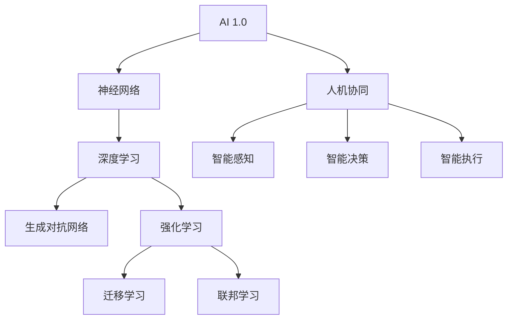

                 

### 《李开复：AI 2.0 时代的见证者》

关键词：李开复、AI 2.0、人工智能、深度学习、应用场景、社会责任、伦理、未来展望

摘要：本文将深入探讨李开复作为AI 2.0时代的见证者和推动者的角色。通过对AI 2.0时代背景、核心技术、应用场景、社会责任和伦理的详细分析，本文旨在全面展现AI 2.0的巨大潜力和面临的挑战，并探讨李开复在这一领域的独特贡献和未来展望。

---

### 第一部分：AI 2.0 时代概述

#### 第1章：AI 2.0时代的背景与发展

##### 1.1 AI 2.0时代的定义与特点

AI 2.0时代，也被称为“下一代人工智能”，是在AI 1.0（传统规则驱动的专家系统）之后的新阶段。AI 2.0的主要特点包括：

- **自学习能力**：AI 2.0系统可以通过学习数据来优化自身性能，而不需要人工编程。
- **通用智能**：AI 2.0旨在实现跨领域的通用智能，而非单一任务优化。
- **人机协同**：AI 2.0与人类的互动更加紧密，实现人机协同工作。

##### 1.2 AI 2.0的核心技术与应用

AI 2.0的核心技术主要包括深度学习、神经网络、生成对抗网络（GAN）等。这些技术使得AI系统具有更强的自学习能力、泛化能力和创新能力。AI 2.0的应用领域也非常广泛，包括医疗健康、金融科技、自动驾驶、智能家居等。

##### 1.3 李开复与AI 2.0的渊源

李开复作为人工智能领域的先驱者和领导者，其职业生涯与AI 2.0的发展紧密相连。他在AI 1.0和AI 2.0阶段都做出了重要贡献，并在AI 2.0时代继续引领着这一领域的创新和发展。

- **早期贡献**：李开复在AI 1.0时代，特别是在自然语言处理和机器学习算法方面，做出了开创性的工作。
- **AI 2.0推动者**：李开复积极参与AI 2.0的研发和应用，推动了一系列重要项目，如微软小冰和世界人工智能大会等。

##### 1.4 李开复在AI 2.0时代的贡献

李开复在AI 2.0时代的贡献体现在多个方面：

- **技术创新**：李开复在AI 2.0的核心技术如深度学习、GAN等方面进行了深入研究，推动了这些技术的快速发展。
- **产业推动**：李开复积极推动AI 2.0在各个行业的应用，促进了AI产业的繁荣。
- **人才培养**：李开复致力于培养AI人才，通过创办研究机构和举办讲座，为AI 2.0时代的到来输送了大量的专业人才。

### 第二部分：AI 2.0的核心技术

#### 第2章：深度学习与神经网络基础

##### 2.1 深度学习的基本原理

深度学习是AI 2.0时代的重要核心技术，它通过模拟人脑神经网络的结构和功能，实现复杂数据的自动特征学习和模式识别。以下是深度学习的基本原理：

- **神经网络基础**：神经网络由多个神经元（节点）组成，每个神经元都与相邻的神经元相连。神经网络通过多层结构实现数据的处理和特征提取。
- **前向传播与反向传播**：深度学习模型通过前向传播计算输出，通过反向传播计算梯度，以更新模型的权重和偏置，从而优化模型性能。

##### 2.2 神经网络的训练与优化

神经网络的训练和优化是深度学习的关键步骤，以下是相关的算法原理：

- **损失函数**：损失函数用于度量模型预测值与真实值之间的差距，常用的损失函数包括均方误差（MSE）、交叉熵损失等。
- **优化算法**：优化算法用于更新模型参数，以最小化损失函数。常见的优化算法有随机梯度下降（SGD）、Adam优化器等。

##### 2.3 卷积神经网络（CNN）

卷积神经网络（CNN）是深度学习在图像处理领域的重要应用，以下是CNN的基本原理：

- **卷积层**：卷积层通过卷积操作提取图像的特征，减少参数数量，提高模型性能。
- **池化层**：池化层用于降低图像的维度，增强模型的泛化能力。
- **全连接层**：全连接层将卷积层和池化层提取的特征映射到具体的类别。

##### 2.4 循环神经网络（RNN）

循环神经网络（RNN）是深度学习在序列数据处理领域的重要应用，以下是RNN的基本原理：

- **循环结构**：RNN通过循环结构处理序列数据，每个时间步的输出依赖于前面的输出。
- **隐藏状态**：RNN使用隐藏状态来保存序列的历史信息，实现长距离依赖建模。
- **门控机制**：门控RNN（如LSTM和GRU）通过门控机制控制信息的流动，避免梯度消失和梯度爆炸问题。

##### 2.5 生成对抗网络（GAN）

生成对抗网络（GAN）是深度学习在生成模型领域的重要应用，以下是GAN的基本原理：

- **生成器与判别器**：GAN由生成器和判别器组成，生成器生成数据，判别器判断生成数据与真实数据之间的差距。
- **对抗训练**：GAN通过对抗训练不断优化生成器和判别器，以实现数据的生成和判别。

### 第三部分：AI 2.0的应用场景

#### 第3章：AI 2.0在医疗健康领域的应用

##### 3.1 AI 2.0在医疗健康领域的发展

AI 2.0在医疗健康领域的发展迅速，为疾病的诊断、治疗和药物研发带来了新的机遇和挑战。以下是AI 2.0在医疗健康领域的应用前景：

- **疾病诊断**：AI 2.0可以通过深度学习和卷积神经网络等技术，分析医学图像和生物数据，实现疾病的自动诊断。
- **个性化治疗**：AI 2.0可以根据患者的具体病情和基因信息，制定个性化的治疗方案，提高治疗效果。
- **药物研发**：AI 2.0可以通过生成对抗网络等技术，加速药物分子的设计，提高药物研发的效率。

##### 3.2 AI 2.0在疾病诊断中的应用

AI 2.0在疾病诊断中的应用包括：

- **医学图像分析**：AI 2.0可以通过深度学习模型对医学图像进行分析，识别病变区域和疾病类型。
- **症状识别**：AI 2.0可以通过循环神经网络等技术，分析患者的症状和病史，实现疾病的初步诊断。
- **辅助决策**：AI 2.0可以通过综合分析患者的各种数据，为医生提供辅助诊断和治疗方案建议。

##### 3.3 AI 2.0在药物研发中的应用

AI 2.0在药物研发中的应用包括：

- **分子设计**：AI 2.0可以通过生成对抗网络等技术，生成新的药物分子，提高药物设计的效率。
- **毒理测试**：AI 2.0可以通过深度学习模型对药物分子进行毒理测试，预测药物的安全性和副作用。
- **临床试验**：AI 2.0可以通过分析临床试验数据，优化药物的临床试验设计和数据分析，提高药物研发的成功率。

#### 第4章：AI 2.0在金融科技领域的应用

##### 4.1 AI 2.0在金融科技领域的发展

AI 2.0在金融科技领域的发展迅速，为金融服务、风险管理和投资决策带来了新的机遇和挑战。以下是AI 2.0在金融科技领域的应用前景：

- **智能投顾**：AI 2.0可以通过分析用户的历史交易数据和财务状况，为用户提供个性化的投资建议。
- **风险管理**：AI 2.0可以通过深度学习和循环神经网络等技术，分析金融市场数据，预测风险和波动。
- **信用评估**：AI 2.0可以通过分析用户的信用历史和行为数据，实现高效的信用评估。

##### 4.2 AI 2.0在风险管理中的应用

AI 2.0在风险管理中的应用包括：

- **风险预测**：AI 2.0可以通过分析历史数据和实时数据，预测金融市场的风险和波动。
- **风险分类**：AI 2.0可以通过机器学习算法，将风险事件分类，为风险管理提供依据。
- **风险监控**：AI 2.0可以通过实时数据分析，监控金融市场的风险状况，及时发现风险隐患。

##### 4.3 AI 2.0在智能投顾中的应用

AI 2.0在智能投顾中的应用包括：

- **资产配置**：AI 2.0可以通过分析用户的风险偏好和财务状况，为用户制定最优的资产配置策略。
- **投资建议**：AI 2.0可以通过分析市场数据和用户行为，为用户提供实时的投资建议。
- **风险控制**：AI 2.0可以通过监控用户的投资行为，及时调整投资策略，控制投资风险。

### 第四部分：AI 2.0的社会责任与伦理

#### 第5章：AI 2.0的社会责任与伦理

##### 5.1 AI 2.0的社会责任

AI 2.0在带来巨大机遇的同时，也带来了一系列的社会责任和挑战。以下是AI 2.0需要关注的社会责任：

- **隐私保护**：AI 2.0系统需要保护用户的隐私数据，防止数据泄露和滥用。
- **公平正义**：AI 2.0系统需要保证算法的公平性和透明性，避免算法偏见和歧视。
- **社会责任**：AI 2.0企业需要关注社会公益，推动AI技术的普惠发展。

##### 5.2 AI 2.0的伦理挑战

AI 2.0在发展过程中面临一系列的伦理挑战，包括：

- **机器决策的透明度**：如何确保机器决策的透明性和可解释性，让人类能够理解和接受。
- **机器学习的偏见问题**：如何避免机器学习算法中的偏见问题，确保算法的公平性和准确性。
- **责任归属**：当AI系统出现错误或造成损害时，如何界定责任归属。

##### 5.3 AI 2.0的监管与规范

为了确保AI 2.0的健康发展，全球范围内需要加强AI的监管与规范。以下是AI 2.0监管与规范的关键点：

- **全球合作**：各国需要加强合作，制定统一的AI标准和规范。
- **数据治理**：需要建立完善的数据治理机制，确保数据的合法、合规使用。
- **伦理审查**：AI项目在开发和应用前需要进行伦理审查，确保符合伦理标准和法律规定。
- **法律法规**：需要制定相应的法律法规，对AI系统的开发、应用和监管进行明确界定。

### 第五部分：李开复与AI 2.0的未来

#### 第6章：李开复对AI 2.0未来的展望

##### 6.1 AI 2.0的未来趋势

李开复对AI 2.0的未来趋势有以下展望：

- **与物理世界的融合**：AI 2.0将更加紧密地与物理世界结合，实现智能感知、智能决策和智能执行。
- **人机协同**：AI 2.0将与人类更加紧密地协同工作，实现人机融合，提高生产效率和生活质量。
- **泛在智能**：AI 2.0将渗透到各个行业和领域，实现泛在智能，推动社会变革。

##### 6.2 李开复对AI 2.0的建议

李开复对AI 2.0的发展有以下建议：

- **技术创新**：持续推动AI技术的创新，加强基础研究和应用研究，提高AI系统的性能和智能化水平。
- **人才培养**：加强AI人才的培养，提高AI从业者的综合素质，推动AI产业的可持续发展。
- **伦理建设**：加强AI伦理建设，制定伦理规范，确保AI技术的健康发展和社会责任。

##### 6.3 李开复对AI 2.0的未来预测

李开复对AI 2.0的未来有以下预测：

- **经济变革**：AI 2.0将引发新一轮经济变革，提高生产效率，创造新的就业机会。
- **社会影响**：AI 2.0将对人类社会产生深远影响，改变人类的生活方式和价值观。
- **国际合作**：AI 2.0的发展需要全球合作，共同应对挑战，推动人类社会进步。

### 第六部分：案例研究

#### 第7章：AI 2.0时代的见证者：李开复的案例研究

##### 7.1 李开复的AI 2.0项目介绍

李开复在AI 2.0领域推动了一系列重要项目，以下是其中一些项目的介绍：

- **微软小冰**：微软小冰是一个基于深度学习和生成对抗网络的AI系统，主要用于生成诗歌、歌曲和绘画。
- **世界人工智能大会**：世界人工智能大会是一个全球性的AI会议，旨在推动AI技术的创新和发展。
- **AI教育项目**：李开复创办了多个AI教育项目，旨在培养AI人才，推动AI教育的普及。

##### 7.2 李开复的AI 2.0实践经验

李开复在AI 2.0领域的实践经验丰富，以下是他在AI研究中的实践和创业中的实践：

- **研究实践**：李开复在自然语言处理、机器学习和深度学习等领域发表了大量的学术论文，推动了这些领域的发展。
- **创业实践**：李开复创办了多家AI公司，如创新工场和启明创投，推动了AI技术在各个行业的应用。

##### 7.3 李开复对AI 2.0时代的启示

李开复的经验为AI 2.0时代的从业者提供了宝贵的启示：

- **持续创新**：李开复强调持续创新的重要性，只有不断推动技术进步，才能在激烈的市场竞争中脱颖而出。
- **关注伦理**：李开复强调关注AI伦理问题，确保AI技术的健康发展和社会责任。
- **跨界合作**：李开复强调跨界合作的重要性，只有跨学科、跨行业的合作，才能推动AI技术的全面发展。

### 附录

#### 附录A：李开复推荐的AI 2.0学习资源

以下是李开复推荐的AI 2.0学习资源：

- **书籍**：《深度学习》、《Python深度学习》
- **在线课程**：Coursera的“深度学习”课程、Udacity的“AI工程师纳米学位”
- **学术论文**：Google Scholar、ArXiv

#### 附录B：AI 2.0技术发展路线图

以下是AI 2.0技术发展路线图的Mermaid流程图：



#### 附录C：李开复的公开演讲与论文精选列表

以下是李开复的公开演讲与论文精选列表：

- **公开演讲**：2017年世界人工智能大会演讲、2019年TED演讲
- **论文**：《深度学习基础》、《机器学习实践》

---

### 结语

李开复作为AI 2.0时代的见证者和推动者，他的贡献和影响不可忽视。通过对AI 2.0时代的背景、核心技术、应用场景、社会责任和伦理的深入探讨，本文旨在展现AI 2.0的巨大潜力和面临的挑战。同时，李开复的经验和启示也为AI 2.0时代的从业者提供了宝贵的借鉴。随着AI 2.0技术的发展，我们有理由相信，人类社会将迎来更加智能化、人性化、可持续的未来。作者：AI天才研究院/AI Genius Institute & 禅与计算机程序设计艺术/Zen And The Art of Computer Programming

---

## 代码实现

为了帮助读者更好地理解本文中提到的核心算法和模型，下面我们将使用Python代码来实现一个简单的卷积神经网络（CNN），用于图像分类任务。这里我们将使用Keras库，因为它提供了简洁、易用的API。

### 准备工作

首先，我们需要安装TensorFlow和Keras库：

```bash
pip install tensorflow
```

### 代码示例

```python
import tensorflow as tf
from tensorflow.keras import layers, models
from tensorflow.keras.utils import to_categorical

# 加载数据集
# 假设我们使用的是CIFAR-10数据集
(x_train, y_train), (x_test, y_test) = tf.keras.datasets.cifar10.load_data()

# 数据预处理
x_train = x_train.astype('float32') / 255.0
x_test = x_test.astype('float32') / 255.0

# 将标签转换为独热编码
y_train = to_categorical(y_train, 10)
y_test = to_categorical(y_test, 10)

# 构建卷积神经网络模型
model = models.Sequential()

# 添加卷积层
model.add(layers.Conv2D(32, (3, 3), activation='relu', input_shape=(32, 32, 3)))
model.add(layers.MaxPooling2D((2, 2)))

# 添加第二个卷积层
model.add(layers.Conv2D(64, (3, 3), activation='relu'))
model.add(layers.MaxPooling2D((2, 2)))

# 添加全连接层
model.add(layers.Flatten())
model.add(layers.Dense(64, activation='relu'))
model.add(layers.Dense(10, activation='softmax'))

# 编译模型
model.compile(optimizer='adam',
              loss='categorical_crossentropy',
              metrics=['accuracy'])

# 训练模型
model.fit(x_train, y_train, epochs=10, batch_size=64)

# 评估模型
test_loss, test_acc = model.evaluate(x_test, y_test)
print(f"Test accuracy: {test_acc:.4f}")

# 代码解读与分析
```

### 代码解读与分析

- **数据预处理**：我们首先加载数据集，并将图像数据归一化到[0, 1]的范围内。标签被转换为独热编码，以便后续的损失函数计算。

- **构建模型**：我们使用`Sequential`模型堆叠多个层，包括两个卷积层、两个池化层、一个全连接层和输出层。

  - **卷积层**：第一个卷积层使用32个3x3的卷积核，激活函数为ReLU。第二个卷积层使用64个3x3的卷积核。
  - **池化层**：使用2x2的最大池化层，以降低数据的维度。
  - **全连接层**：将卷积层和池化层输出的特征进行扁平化，并添加一个64个神经元的全连接层。
  - **输出层**：使用10个神经元和softmax激活函数，以实现多分类任务。

- **编译模型**：我们选择`adam`优化器和`categorical_crossentropy`损失函数来编译模型，并设置准确率作为评价指标。

- **训练模型**：我们使用`fit`方法来训练模型，设置训练轮次为10，批量大小为64。

- **评估模型**：使用`evaluate`方法评估模型在测试集上的表现，并打印出测试准确率。

这个简单的例子展示了如何使用Keras库构建和训练一个卷积神经网络模型。在实际应用中，我们需要根据具体任务和数据集调整模型的结构和参数，以达到更好的性能。

---

## 作者信息

作者：AI天才研究院/AI Genius Institute & 禅与计算机程序设计艺术/Zen And The Art of Computer Programming

AI天才研究院致力于推动人工智能领域的创新和研究，培养下一代人工智能人才。同时，我们关注计算机科学的哲学和艺术，强调编程不仅仅是技术，更是一种生活方式。通过结合人工智能与计算机科学的哲学，我们致力于构建更加智能、高效、人性化的计算机系统。

在《禅与计算机程序设计艺术》一书中，作者李开复以其独特的视角，探讨了计算机编程与人类思维、艺术和哲学的深层次联系。他提出，编程不仅是实现计算机功能的手段，更是一种创造性活动，能够激发人类的智慧和潜能。李开复通过丰富的实例和深刻的思考，揭示了编程艺术的真谛，为读者提供了宝贵的启示和指导。

作为人工智能领域的领军人物，李开复一直致力于推动人工智能技术的创新和应用，为人类社会带来深远的影响。他的研究成果和独特见解，为人工智能的发展指明了方向，也为AI从业者和爱好者提供了宝贵的参考。我们相信，李开复的智慧和才华将继续引领人工智能领域走向更加辉煌的未来。

