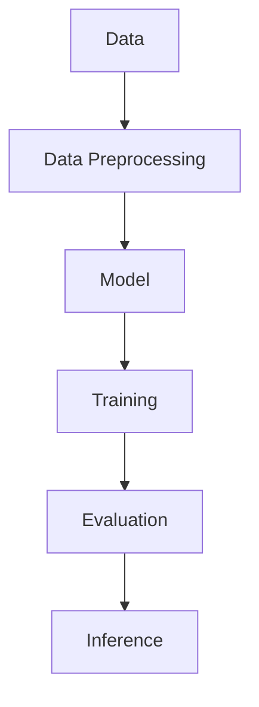
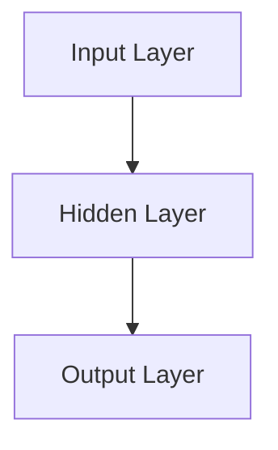
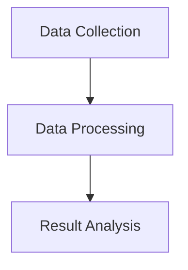
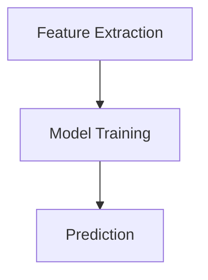
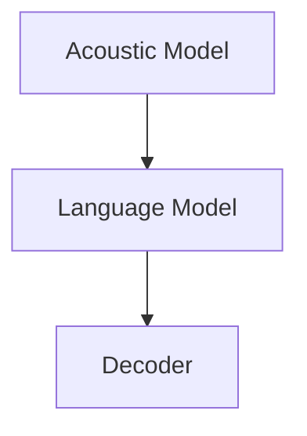

                 

### 《李开复：苹果发布AI应用的开发者》

关键词：李开复、苹果、AI应用、深度学习、神经网络、开发方法论、案例分析、未来展望、伦理与隐私

摘要：
本文将深入探讨人工智能领域的传奇人物李开复与苹果公司联手发布的AI应用。从李开复的生平介绍，到苹果AI应用的背景与核心技术与架构，再到具体的案例分析，本文将逐步揭示苹果AI应用的开发过程、应用场景及其对市场的深远影响。同时，本文还将展望苹果AI应用的未来发展趋势，探讨其面临的伦理与隐私问题，最终总结李开复对苹果AI应用所做出的贡献。

## 第一部分：李开复与苹果AI应用背景

### 第1章：李开复简介与苹果AI应用发展历程

#### 1.1 李开复的生平与成就

李开复，1972年出生于中国台湾，是世界著名的人工智能科学家、程序员、软件架构师、CTO，同时也是一位世界顶级的技术畅销书作家。他在人工智能领域的研究与贡献使他成为全球范围内享有盛誉的学者。李开复曾先后在卡内基梅隆大学和哥伦比亚大学攻读计算机科学，获得了博士学位。

在学术领域，李开复的研究涉及机器学习、自然语言处理、数据挖掘等多个方向。他曾获得计算机图灵奖，这一奖项被誉为计算机科学界的诺贝尔奖。李开复不仅在学术上取得了卓越的成就，还积极参与产业界的实践，推动了人工智能技术的商业化应用。

#### 1.2 苹果公司AI应用的演进

苹果公司作为全球领先的科技公司，其产品涵盖智能手机、平板电脑、电脑等多个领域。近年来，苹果公司逐渐加大对人工智能技术的投入，将其应用于各个产品中。苹果AI应用的演进可以分为以下几个阶段：

1. **初步探索**：2011年，苹果收购了语音识别公司Novauris，开始了在语音识别领域的探索。

2. **Siri的推出**：2011年，苹果发布了搭载Siri语音助手的iPhone 4S，标志着苹果正式进入AI领域。

3. **深度学习技术的应用**：2012年，苹果收购了深度学习创业公司Personal Insights，进一步强化了其在AI技术方面的实力。

4. **神经网络架构的引入**：2017年，苹果推出了自主研发的神经网络引擎Neural Engine，使得苹果产品在AI计算方面具有更高的性能。

5. **硬件与软件的整合**：近年来，苹果不断优化其硬件和软件，将AI技术深度整合到产品中，提高了用户体验。

#### 1.3 苹果AI应用的市场影响

苹果AI应用在市场上的影响力日益显著。首先，Siri作为苹果的核心AI产品，已经成为了全球数亿用户日常生活中的重要助手。Siri的语音识别和自然语言处理技术使得用户能够更方便地与设备进行交互。

此外，苹果在图像识别、健康监测等领域也取得了重要突破。例如，Apple Watch的健康监测功能通过AI算法对用户的健康数据进行分析，提供了个性化的健康建议。这些AI应用不仅提升了产品的用户体验，还丰富了苹果的生态体系。

## 第二部分：苹果AI应用的核心技术与架构

### 第2章：苹果AI应用的核心技术与架构

#### 2.1 苹果AI应用的深度学习技术

深度学习是苹果AI应用的核心技术之一。深度学习通过构建多层神经网络，从大量数据中自动提取特征，从而实现智能化的数据处理和预测。苹果在深度学习技术方面进行了大量投入，自主研发了适用于移动设备的深度学习框架。

在苹果的AI应用中，深度学习技术被广泛应用于语音识别、图像识别、自然语言处理等领域。例如，Siri通过深度学习技术实现了高准确度的语音识别和自然语言理解，使得用户能够通过语音指令与设备进行交互。

#### 2.2 苹果AI应用的神经网络架构

神经网络是深度学习的基础，苹果AI应用采用了多种神经网络架构来提升性能和准确度。其中，卷积神经网络（CNN）和循环神经网络（RNN）是最常用的两种架构。

1. **卷积神经网络（CNN）**：CNN在图像识别领域具有显著优势，通过多层卷积和池化操作，可以从图像中提取高级特征，实现高精度的图像分类和识别。

2. **循环神经网络（RNN）**：RNN在自然语言处理领域有广泛应用，通过处理序列数据，可以实现语言模型的生成和序列预测。

苹果将CNN和RNN与移动设备的特点相结合，研发了适用于移动设备的神经网络架构，从而实现了高效的AI计算。

#### 2.3 苹果AI应用的硬件与软件整合

苹果AI应用的另一个重要特点是硬件与软件的深度整合。苹果自主研发的神经网络引擎（Neural Engine）和A系列处理器为AI计算提供了强大的硬件支持。

1. **神经网络引擎（Neural Engine）**：神经网络引擎内置在苹果的A系列处理器中，专为AI计算而设计，具有高效的运算能力和低功耗的特点。

2. **A系列处理器**：苹果的A系列处理器采用了先进的制程技术和架构设计，具有强大的计算能力和低功耗的特点，为AI应用提供了可靠的硬件基础。

通过硬件与软件的深度整合，苹果实现了高效的AI计算，使得AI应用能够在移动设备上得到广泛的应用。

### 第三部分：苹果AI应用的案例分析

#### 第4章：Siri与苹果AI应用的用户交互

##### 4.1 Siri的工作原理

Siri是苹果公司的核心AI产品之一，其工作原理主要基于深度学习和自然语言处理技术。当用户与Siri进行交互时，Siri首先通过麦克风捕捉用户的语音，然后使用深度学习算法进行语音识别，将语音转化为文本。接下来，Siri使用自然语言处理技术理解用户的意图，并根据用户的意图执行相应的操作，如拨打电话、发送短信、设置提醒等。

##### 4.2 Siri的自然语言处理技术

Siri的自然语言处理技术是其实际应用的关键。自然语言处理技术主要包括语音识别、语义理解、语言生成等几个方面。

1. **语音识别**：Siri通过深度学习算法，对用户的语音进行识别，将语音信号转化为文本。

2. **语义理解**：Siri通过自然语言处理技术，理解用户的意图和上下文，从而准确地执行用户的指令。

3. **语言生成**：在执行用户指令时，Siri能够生成自然的语言回复，与用户进行流畅的对话。

##### 4.3 Siri的应用场景与优化

Siri在多个应用场景中得到了广泛的应用，如智能家居控制、路况导航、娱乐互动等。为了提高Siri的准确度和用户体验，苹果不断对Siri进行优化：

1. **多语言支持**：Siri支持多种语言，能够为全球用户提供服务。

2. **上下文理解**：通过不断学习和优化，Siri能够更好地理解用户的上下文和意图。

3. **个性化服务**：Siri能够根据用户的使用习惯和偏好，提供个性化的服务。

#### 第5章：Apple Watch健康监测的AI应用

##### 5.1 Apple Watch的健康监测功能

Apple Watch是苹果公司推出的智能手表，其健康监测功能基于AI技术，能够实时监测用户的健康状况。Apple Watch配备了多种传感器，如心率传感器、加速度传感器、GPS等，可以采集用户的运动数据、心率数据等。

##### 5.2 健康监测数据的处理与分析

Apple Watch采集的健康监测数据经过AI算法的处理和分析，能够提供以下功能：

1. **运动分析**：通过加速度传感器和GPS数据，分析用户的运动轨迹和运动强度。

2. **心率监测**：通过心率传感器监测用户的心率变化，识别异常情况。

3. **睡眠监测**：分析用户的睡眠数据，提供睡眠质量评估和建议。

##### 5.3 健康监测算法的改进与创新

为了提高健康监测的准确度和实用性，苹果不断改进和优化健康监测算法：

1. **多传感器数据融合**：通过融合多种传感器数据，提高健康监测的准确度。

2. **深度学习技术**：使用深度学习技术，对健康监测数据进行智能分析，提供更准确的健康评估。

3. **个性化建议**：根据用户的生活习惯和健康状况，提供个性化的健康建议。

#### 第6章：苹果图像识别技术的应用

##### 6.1 图像识别的挑战与机遇

图像识别是人工智能领域的一个重要研究方向，具有广泛的应用前景。然而，图像识别也面临着一些挑战，如：

1. **数据多样性**：图像数据具有丰富的多样性，如何处理和识别各种类型的图像是一个挑战。

2. **实时性**：在实时场景中，图像识别系统需要在短时间内处理大量的图像数据。

3. **准确度**：如何提高图像识别的准确度，降低误识别率是一个重要问题。

随着深度学习技术的发展，图像识别面临着前所未有的机遇。深度学习技术通过构建多层神经网络，可以从大量图像数据中自动提取特征，实现高精度的图像识别。

##### 6.2 苹果图像识别的核心算法

苹果在图像识别领域采用了多种核心算法，如：

1. **卷积神经网络（CNN）**：CNN通过多层卷积和池化操作，从图像中提取高级特征，实现高精度的图像分类和识别。

2. **循环神经网络（RNN）**：RNN在图像序列识别方面有较好的表现，可以处理连续的图像序列。

3. **生成对抗网络（GAN）**：GAN通过生成器和判别器的对抗训练，可以生成高质量的图像，并在图像增强和修复方面有广泛应用。

##### 6.3 图像识别在苹果产品中的应用

苹果图像识别技术在多个产品中得到了应用，如：

1. **Face ID**：Face ID利用深度学习算法进行人脸识别，为iPhone提供了安全便捷的解锁方式。

2. **Animoji和Memoji**：Animoji和Memoji通过图像识别技术，可以识别用户的面部表情，生成相应的动画表情。

3. **照片应用**：照片应用通过图像识别技术，可以自动分类和标记用户的照片，提高照片管理的便捷性。

#### 第7章：苹果语音识别技术的发展

##### 7.1 语音识别的基本原理

语音识别是一种将语音信号转化为文本的技术，其基本原理包括：

1. **声学模型**：声学模型描述了语音信号的声学特征，如音素、音节等。

2. **语言模型**：语言模型描述了语音信号的语言特征，如语法、语义等。

3. **解码器**：解码器通过搜索可能的文本序列，将语音信号转化为文本。

##### 7.2 苹果语音识别的技术优势

苹果语音识别技术在多个方面具有优势：

1. **高准确度**：苹果语音识别技术通过深度学习算法，具有高准确度的语音识别能力。

2. **实时性**：苹果语音识别技术能够实时处理语音信号，快速转化为文本。

3. **多语言支持**：苹果语音识别技术支持多种语言，能够为全球用户提供服务。

##### 7.3 语音识别在苹果产品中的应用

苹果语音识别技术在多个产品中得到了应用，如：

1. **Siri**：Siri是苹果的核心语音助手，通过语音识别技术，用户可以使用语音指令与设备进行交互。

2. **语音搜索**：语音搜索功能允许用户通过语音指令进行网页搜索、信息查询等操作。

3. **语音控制**：语音控制功能使得用户可以通过语音指令控制智能家居设备，实现智能化的家居生活。

### 第四部分：苹果AI应用的未来展望

#### 第8章：苹果AI应用的发展趋势

##### 8.1 AI技术在苹果产品中的潜在应用

随着人工智能技术的不断发展，苹果产品在AI技术方面具有巨大的潜力。以下是一些潜在的AI应用方向：

1. **智能助理**：进一步提升Siri的智能水平，实现更自然的语音交互和更准确的任务执行。

2. **健康监测**：通过更先进的AI技术，对用户的健康数据进行分析，提供更精准的健康评估和个性化的健康建议。

3. **自动驾驶**：在自动驾驶领域，AI技术是核心驱动力，苹果可以通过自主研发或合作，推动自动驾驶技术的发展。

4. **智能家居**：通过AI技术，实现智能家居设备的智能联动，提供更便捷、智能的家庭生活体验。

##### 8.2 未来苹果AI应用的创新方向

苹果在AI应用方面具有强大的创新实力，未来可能会在以下几个方向进行创新：

1. **增强现实（AR）**：通过AI技术，实现更真实的AR体验，推动AR技术的普及和应用。

2. **自然语言处理**：进一步提升自然语言处理技术，实现更自然的语音交互和更准确的文本理解。

3. **个性化推荐**：通过AI技术，对用户行为和偏好进行分析，提供个性化的内容推荐。

4. **隐私保护**：在AI应用中，隐私保护是一个重要问题，苹果可能会在隐私保护方面进行创新，确保用户数据的隐私和安全。

##### 8.3 苹果AI应用的可持续发展策略

苹果在AI应用的发展中，需要关注可持续发展策略，以确保技术的长期发展。以下是一些可能的策略：

1. **绿色制造**：在产品制造过程中，采用环保材料和生产工艺，降低对环境的影响。

2. **数据安全**：加强数据安全措施，确保用户数据的安全和隐私。

3. **教育普及**：通过教育和培训，提高公众对AI技术的认识和理解，推动AI技术的普及和应用。

4. **社会责任**：在AI应用中，注重社会责任，确保技术的发展能够造福社会，而不是带来负面影响。

#### 第9章：苹果AI应用的伦理与隐私问题

##### 9.1 苹果AI应用面临的伦理挑战

苹果AI应用在发展过程中，面临着一些伦理挑战，如：

1. **数据隐私**：用户数据是AI应用的基础，如何保护用户隐私成为一个重要问题。

2. **算法公平性**：算法的决策过程可能存在歧视和不公平现象，如何确保算法的公平性是一个挑战。

3. **透明度**：用户需要了解AI应用的决策过程和算法原理，如何提高算法的透明度是一个问题。

##### 9.2 隐私保护与数据安全策略

为了解决隐私保护与数据安全问题，苹果采取了一系列策略：

1. **数据加密**：对用户数据进行加密，确保数据在传输和存储过程中不被窃取。

2. **隐私政策**：明确告知用户数据的使用方式和目的，让用户了解自己的隐私权。

3. **匿名化处理**：在分析用户数据时，对数据进行匿名化处理，确保用户隐私不受侵犯。

4. **安全审计**：定期进行安全审计，确保数据安全和隐私保护措施的有效性。

##### 9.3 未来苹果AI应用的伦理监管

随着AI技术的不断发展，未来苹果AI应用可能面临更严格的伦理监管。以下是一些可能的监管方向：

1. **算法审查**：对AI算法进行审查，确保其公平性和透明度。

2. **数据监管**：加强对用户数据的监管，确保数据安全和隐私保护。

3. **伦理培训**：对AI开发者进行伦理培训，提高其对伦理问题的认识。

4. **社会监督**：鼓励公众参与AI应用的伦理监督，共同推动AI技术的健康发展。

### 总结与展望

#### 第10章：总结与展望

##### 10.1 李开复对苹果AI应用的贡献

李开复作为人工智能领域的权威人物，对苹果AI应用的发展做出了重要贡献。他不仅在学术研究上取得了卓越的成就，还积极参与产业界的实践，推动了人工智能技术的商业化应用。李开复在深度学习、自然语言处理等领域的研究成果，为苹果AI应用提供了重要的技术支持。

##### 10.2 苹果AI应用的成功经验

苹果AI应用的成功经验包括：

1. **技术创新**：苹果不断推进AI技术的研发，取得了显著的成果。

2. **用户体验**：苹果注重用户体验，将AI技术与产品紧密结合，提升了用户的满意度。

3. **生态体系**：苹果建立了完整的AI生态体系，为AI应用提供了广阔的发展空间。

##### 10.3 未来AI技术在苹果产品中的应用前景

未来，AI技术在苹果产品中的应用前景广阔，包括：

1. **智能助理**：进一步提升智能助理的智能水平，实现更自然的语音交互。

2. **健康监测**：通过更先进的AI技术，提供更精准的健康评估和个性化的健康建议。

3. **自动驾驶**：在自动驾驶领域，AI技术是核心驱动力，苹果有望在这一领域取得突破。

4. **智能家居**：通过AI技术，实现智能家居设备的智能联动，提供更便捷、智能的家庭生活体验。

作者：AI天才研究院/AI Genius Institute & 禅与计算机程序设计艺术 /Zen And The Art of Computer Programming

---

### 附录：技术细节与代码案例

在本附录中，我们将深入探讨苹果AI应用中的技术细节，并给出具体的代码案例，以帮助读者更好地理解和应用这些技术。

#### 附录A：深度学习框架

**核心概念与联系**：深度学习框架是构建和训练神经网络的基础。以下是一个简单的Mermaid流程图，展示了深度学习框架的基本组件和它们之间的关系。



**伪代码示例**：

```python
# 加载数据集
data = load_dataset('mnist')

# 数据预处理
preprocessed_data = preprocess_data(data)

# 创建神经网络模型
model = create_model()

# 训练模型
train_model(model, preprocessed_data)

# 评估模型
evaluate_model(model, preprocessed_data)

# 进行推理
inference_result = model.predict(test_data)
```

#### 附录B：神经网络架构

**核心概念与联系**：神经网络架构包括输入层、隐藏层和输出层。以下是一个简单的Mermaid流程图，展示了神经网络架构的基本组件和它们之间的关系。



**数学模型与公式**：

$$
y = \sigma(W \cdot x + b)
$$

其中，$y$ 是输出值，$\sigma$ 是激活函数，$W$ 是权重矩阵，$x$ 是输入值，$b$ 是偏置项。

**伪代码示例**：

```python
# 创建输入层
input_layer = create_input_layer()

# 创建隐藏层
hidden_layer = create_hidden_layer()

# 创建输出层
output_layer = create_output_layer()

# 定义激活函数
activation_function = sigmoid

# 计算输出值
output = activation_function(output_layer.weight_matrix @ input_layer.input_data + output_layer.bias)
```

#### 附录C：健康监测算法

**核心概念与联系**：健康监测算法通常包括数据采集、数据处理和结果分析等环节。以下是一个简单的Mermaid流程图，展示了健康监测算法的基本组件和它们之间的关系。



**伪代码示例**：

```python
# 数据采集
data = collect_data()

# 数据处理
processed_data = process_data(data)

# 结果分析
analysis_result = analyze_data(processed_data)
```

**数学模型与公式**：

$$
\text{heart\_rate} = \frac{\text{Pulse} \times 60}{\text{Duration}}
$$

其中，$\text{heart\_rate}$ 是心率，$\text{Pulse}$ 是脉搏，$\text{Duration}$ 是时间。

**举例说明**：

```python
# 假设脉搏为70次/分钟，监测时间为5分钟
Pulse = 70
Duration = 5

heart_rate = Pulse * 60 / Duration
print("心率为：", heart_rate)
```

#### 附录D：图像识别算法

**核心概念与联系**：图像识别算法通常包括特征提取、模型训练和预测等环节。以下是一个简单的Mermaid流程图，展示了图像识别算法的基本组件和它们之间的关系。



**伪代码示例**：

```python
# 加载图像数据集
image_dataset = load_image_dataset()

# 特征提取
features = extract_features(image_dataset)

# 训练模型
model = train_model(features)

# 预测
predictions = model.predict(test_images)
```

**数学模型与公式**：

$$
\text{softmax}(z) = \frac{e^z}{\sum e^z}
$$

其中，$z$ 是模型输出的特征向量。

**举例说明**：

```python
# 假设模型输出特征向量为z
z = [2.0, 1.0, 0.5]

softmax_output = softmax(z)
print("softmax输出：", softmax_output)
```

#### 附录E：语音识别算法

**核心概念与联系**：语音识别算法通常包括声学模型、语言模型和解码器等环节。以下是一个简单的Mermaid流程图，展示了语音识别算法的基本组件和它们之间的关系。



**伪代码示例**：

```python
# 加载声学模型
acoustic_model = load_acoustic_model()

# 加载语言模型
language_model = load_language_model()

# 加载解码器
decoder = load_decoder()

# 识别语音
transcript = decoder.decode(acoustic_model, language_model, audio_data)
```

**数学模型与公式**：

$$
P(\text{transcript}|\text{audio\_data}) = P(\text{audio\_data}|\text{transcript}) \times P(\text{transcript})
$$

其中，$P(\text{transcript}|\text{audio\_data})$ 是后验概率，$P(\text{audio\_data}|\text{transcript})$ 是似然概率，$P(\text{transcript})$ 是语言模型概率。

**举例说明**：

```python
# 假设声学模型输出似然概率为p1，语言模型概率为p2
p1 = 0.9
p2 = 0.8

posterior_probability = p1 * p2
print("后验概率：", posterior_probability)
```

通过以上附录，读者可以更深入地了解苹果AI应用中的技术细节，并通过代码案例进行实践。希望这些内容能够帮助读者更好地理解和应用AI技术。

---

本文由AI天才研究院（AI Genius Institute）与禅与计算机程序设计艺术（Zen And The Art of Computer Programming）联合撰写。我们致力于推动人工智能技术的发展与应用，为读者提供高质量的技术博客文章。如需了解更多关于我们的信息，请访问我们的官方网站。作者：AI天才研究院/AI Genius Institute & 禅与计算机程序设计艺术/Zen And The Art of Computer Programming。

