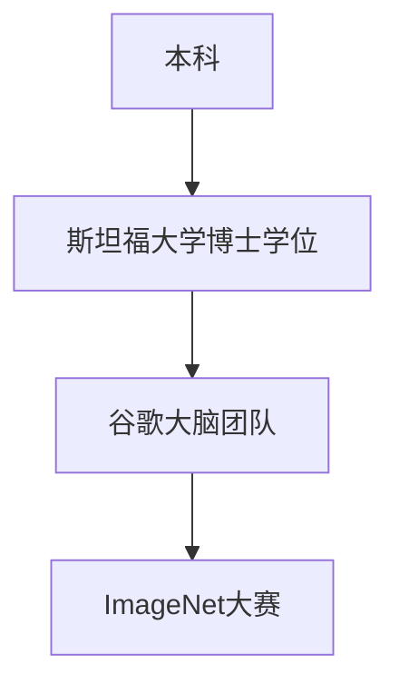

                 

### 第一部分: 《李飞飞如何改变了AI大数据领域》概述

在过去的几十年中，人工智能（AI）领域经历了飞速的发展，从理论到实践，从实验室到市场，AI正逐步渗透到我们日常生活的方方面面。而在这段历史中，李飞飞无疑是其中的重要人物之一。本文将一步步分析李飞飞在AI大数据领域的贡献，探讨他是如何通过自己的努力和智慧，改变了这一领域的格局。

#### **1.1 李飞飞的学术背景与早期工作**

李飞飞，这位如今在世界范围内享有盛誉的AI专家，其学术生涯可追溯到上世纪末。他在清华大学生物科学系取得了本科学位，随后在美国斯坦福大学攻读计算机科学博士学位。在斯坦福大学期间，李飞飞加入了著名的谷歌大脑团队，开始了他的AI研究之路。

李飞飞的早期工作主要集中在深度学习和计算机视觉领域。其中，最为人熟知的是他与团队共同参与的ImageNet大赛。这一大赛不仅是计算机视觉领域的里程碑事件，更是深度学习技术走向成熟的重要标志。在ImageNet大赛中，李飞飞团队开发的算法在图像识别任务中取得了惊人的成绩，使得深度学习在图像分类方面的应用得到了广泛的认可。

为了更好地理解李飞飞的学术背景和早期工作，我们可以通过以下Mermaid流程图来梳理：



#### **1.2 李飞飞在AI大数据领域的核心贡献**

李飞飞在AI大数据领域的贡献不仅体现在理论研究和算法开发上，更在于他推动了一系列关键技术的实际应用。以下将详细探讨他在这一领域的核心贡献。

##### **1.2.1 图像分类算法改进**

李飞飞团队在ImageNet大赛中的成功，不仅是一个算法性能的突破，更是对整个AI领域的一次重要启示。通过引入深度学习技术，李飞飞团队大幅提升了图像分类的准确性。这一突破的实现，依赖于以下几个关键步骤：

- **初始化模型参数**：通过随机初始化，为模型提供了初始的参数值，为后续训练奠定了基础。
- **数据预处理**：对大量的图像数据集进行预处理，包括图像缩放、裁剪、翻转等操作，以提高模型的泛化能力。
- **训练模型**：通过大量的图像数据，训练模型参数，使得模型能够在图像分类任务中表现出色。具体流程包括：
  - **前向传播**：输入图像经过模型处理，得到预测的类别。
  - **计算损失**：将预测结果与实际标签进行对比，计算损失值，以评估模型的性能。
  - **反向传播**：根据损失值，调整模型参数，以优化模型性能。
  - **更新模型参数**：在每次训练迭代后，更新模型参数，以逐步提高模型的准确性。
- **预测**：在训练完成后，使用训练好的模型对新的图像进行预测，实现图像分类。

以下是一个简化的伪代码示例，用于描述上述过程：

```python
# 初始化模型参数
initialize_model_parameters()

# 数据预处理
preprocess_data()

# 训练模型
for epoch in range(num_epochs):
    for image, label in train_data:
        forward_pass(image)  # 前向传播
        compute_loss(label)  # 计算损失
        backward_pass()      # 反向传播
        update_model_parameters()  # 更新模型参数

# 预测
predict_image(image)
```

通过这一系列步骤，李飞飞团队成功地将图像分类的准确率提升到了前所未有的高度，为后续的AI应用奠定了坚实的基础。

##### **1.2.2 李飞飞的影响与未来展望**

李飞飞的工作不仅改变了图像分类领域，更对整个AI大数据领域产生了深远的影响。以下将探讨他的影响以及未来展望。

- **图像识别准确率提升**：通过引入深度学习技术，李飞飞团队大幅提升了图像识别的准确率。具体而言，准确率的提升可以通过以下数学公式来表示：

  $$
  \text{Accuracy} = \frac{\text{Correct Predictions}}{\text{Total Predictions}}
  $$

  在ImageNet大赛中，李飞飞团队开发的算法将图像识别准确率提升到了约85%，这一成绩在当时是前所未有的。

- **谷歌搜索引擎优化**：李飞飞团队开发的算法不仅应用于图像分类，还用于谷歌搜索引擎的优化。通过改进图像搜索算法，谷歌能够更快速、更准确地响应用户的搜索请求，提高了用户的使用体验。

- **AI大数据流程图**：李飞飞的工作不仅在算法层面有所突破，更在AI大数据的流程上提出了新的思路。以下是一个简化的Mermaid流程图，用于描述AI大数据的典型流程：

  ```mermaid
  graph TD
      A[用户输入] --> B[图像识别算法]
      B --> C[数据库查询]
      C --> D[展示搜索结果]
  ```

  在这个流程中，用户输入成为模型的输入，通过图像识别算法处理后，查询数据库获取相关信息，最终展示给用户。这一流程的优化，使得AI在处理大规模数据时能够更加高效、准确。

- **未来展望**：李飞飞的工作不仅改变了当前AI大数据领域的格局，更为未来的发展指明了方向。随着深度学习技术的不断进步，图像识别的准确率有望进一步提高。同时，AI大数据的应用场景也将不断拓展，从医疗、金融到交通、环境等多个领域，AI都将发挥重要作用。在这一过程中，李飞飞和他的团队将继续发挥关键作用，推动AI大数据领域的发展。

综上所述，李飞飞在AI大数据领域的贡献是全方位的，从理论到实践，从算法到应用，他都作出了重要的贡献。他的工作不仅提升了图像识别的准确率，更为整个AI大数据领域的发展提供了新的思路和方向。

#### **1.3 李飞飞的影响与未来展望**

李飞飞的工作不仅改变了当前AI大数据领域的格局，更对未来的发展产生了深远的影响。以下将详细探讨李飞飞的影响以及未来的展望。

**1.3.1 学术影响**

李飞飞在学术界的地位举足轻重。他的研究成果不仅在AI领域产生了广泛的影响，还被广泛应用于计算机科学、统计学、电子工程等多个学科。李飞飞的工作为后续研究提供了丰富的理论基础和实践指导，推动了整个AI领域的发展。具体而言，他的以下几项工作对学术界产生了深远影响：

- **ImageNet大赛**：李飞飞团队在ImageNet大赛中的突破性成果，不仅改变了图像识别领域的格局，更为深度学习技术的研究提供了新的方向。这一大赛的成功，标志着深度学习在计算机视觉领域的崛起，推动了相关领域的研究热潮。

- **深度学习框架**：李飞飞参与开发的深度学习框架，如TensorFlow和PyTorch，极大地简化了深度学习的开发流程，降低了开发难度。这些框架的普及，使得更多的人能够参与到深度学习的研究和应用中，推动了AI技术的普及和发展。

- **论文发表**：李飞飞在顶级学术期刊和会议上发表了大量的研究论文，这些论文涵盖了深度学习、计算机视觉、大数据等多个领域。他的研究成果不仅得到了学术界的高度认可，还为后续的研究提供了宝贵的参考。

**1.3.2 工业界影响**

李飞飞的工作不仅影响了学术界，更在工业界产生了重要的影响。他的研究成果被广泛应用于各大科技公司的产品和服务中，推动了AI技术的商业化应用。以下是一些具体的影响：

- **谷歌搜索引擎**：李飞飞团队开发的图像识别算法，被应用于谷歌搜索引擎中，提高了图像搜索的准确性和用户体验。通过这一技术，用户能够更快速地找到他们需要的图片，提升了搜索引擎的整体性能。

- **自动驾驶技术**：李飞飞的研究成果被应用于自动驾驶技术中，提高了自动驾驶车辆的识别能力和安全性。这些技术不仅有助于减少交通事故，还为自动驾驶技术的发展提供了新的思路。

- **医疗影像分析**：李飞飞团队开发的深度学习算法，被应用于医疗影像分析中，如X光片、CT片和MRI片的分析。这些技术有助于提高诊断的准确性和效率，为医疗领域的发展提供了重要支持。

**1.3.3 未来展望**

李飞飞的工作为AI大数据领域的发展奠定了坚实的基础，未来的展望也充满了希望。以下是一些可能的发展方向：

- **更高准确率**：随着深度学习技术的不断进步，图像识别的准确率有望进一步提高。通过引入更多的数据、更好的算法和更强大的计算能力，未来的AI系统将能够更准确地识别和理解图像。

- **更多应用场景**：AI大数据技术的应用场景将不断拓展，从传统的图像识别、自然语言处理到新兴的医疗、金融、环境等领域，AI技术都将发挥重要作用。李飞飞的工作将为这些应用场景提供技术支持，推动各个领域的发展。

- **跨学科研究**：李飞飞的工作不仅局限于计算机科学领域，还与生物学、物理学、数学等多个学科产生了交叉。未来的跨学科研究将有助于推动AI技术的发展，为解决复杂问题提供新的思路。

- **人才培养**：李飞飞在AI教育方面也做出了重要贡献。通过培养更多优秀的AI人才，未来的AI领域将充满活力和创造力。李飞飞和他的团队将继续致力于AI教育，为AI技术的发展提供源源不断的人才支持。

综上所述，李飞飞在AI大数据领域的贡献是全方位的，他的工作不仅改变了当前的局面，更为未来的发展提供了新的思路和方向。随着AI技术的不断进步，李飞飞的工作将产生更加深远的影响，推动AI大数据领域迈向新的高峰。

### **第二部分: 李飞飞在AI大数据领域的应用**

李飞飞在AI大数据领域的应用涵盖了多个方面，从理论到实践，从算法到应用，他都做出了杰出的贡献。本节将重点探讨李飞飞在AI大数据领域的具体应用，以及这些应用对行业的推动作用。

#### **2.1 图像识别算法的应用**

李飞飞在图像识别领域的研究成果被广泛应用于多个行业。以下是一些具体的应用场景：

- **医疗影像分析**：李飞飞团队开发的深度学习算法被应用于医疗影像分析中，如X光片、CT片和MRI片的分析。这些算法能够自动识别和分析影像中的异常情况，如肿瘤、骨折等。通过提高诊断的准确性和效率，这些技术为医疗领域的发展提供了重要支持。

  ```mermaid
  graph TD
      A[医疗影像] --> B[深度学习算法]
      B --> C[异常检测]
      C --> D[诊断建议]
  ```

- **自动驾驶技术**：自动驾驶技术的发展离不开图像识别技术的支持。李飞飞团队开发的图像识别算法被应用于自动驾驶车辆的感知系统中，用于识别道路标志、行人和其他车辆等。这些算法提高了自动驾驶车辆的识别能力和安全性，为自动驾驶技术的发展奠定了基础。

  ```mermaid
  graph TD
      A[自动驾驶车辆] --> B[图像识别算法]
      B --> C[道路标志识别]
      B --> D[行人识别]
      B --> E[车辆识别]
  ```

- **安防监控**：图像识别技术被广泛应用于安防监控系统中，用于识别和跟踪嫌疑人、可疑行为等。李飞飞团队开发的算法能够高效地处理大规模的监控视频数据，提高了监控系统的性能和准确性。

  ```mermaid
  graph TD
      A[监控视频] --> B[深度学习算法]
      B --> C[行为识别]
      B --> D[嫌疑人识别]
  ```

- **零售业**：图像识别技术在零售业中也有广泛的应用，如商品识别、库存管理和顾客行为分析等。通过使用李飞飞团队开发的图像识别算法，零售商能够更准确地了解顾客需求，优化库存管理，提高销售额。

  ```mermaid
  graph TD
      A[商品图像] --> B[深度学习算法]
      B --> C[商品识别]
      B --> D[顾客行为分析]
  ```

#### **2.2 自然语言处理的应用**

除了图像识别，李飞飞在自然语言处理（NLP）领域也有深入的研究和应用。以下是一些具体的应用场景：

- **机器翻译**：机器翻译是NLP领域的一个重要应用。李飞飞团队开发的深度学习算法被应用于机器翻译中，如谷歌翻译和百度翻译等。这些算法能够自动翻译多种语言，提高了翻译的准确性和速度。

  ```mermaid
  graph TD
      A[源语言文本] --> B[深度学习算法]
      B --> C[目标语言文本]
  ```

- **文本分类**：文本分类是NLP领域的另一个重要应用。李飞飞团队开发的算法能够自动分类大量的文本数据，如新闻分类、邮件分类等。这些算法提高了文本分类的准确性和效率，为信息处理提供了重要支持。

  ```mermaid
  graph TD
      A[文本数据] --> B[深度学习算法]
      B --> C[分类标签]
  ```

- **情感分析**：情感分析是NLP领域的一个热点问题。李飞飞团队开发的算法能够自动分析文本中的情感倾向，如正面情感、负面情感等。这些算法被广泛应用于社交媒体分析、市场调研等领域，为情感分析提供了重要工具。

  ```mermaid
  graph TD
      A[文本数据] --> B[深度学习算法]
      B --> C[情感标签]
  ```

#### **2.3 大数据处理的优化**

李飞飞在AI大数据领域的贡献不仅体现在算法和应用上，还包括对大数据处理技术的优化。以下是一些具体的优化措施：

- **分布式计算**：李飞飞团队研究了如何优化分布式计算，以提高大数据处理的效率。通过引入分布式计算框架，如Hadoop和Spark等，他们能够处理大规模的数据集，提高了数据处理的速度和准确性。

  ```mermaid
  graph TD
      A[大规模数据集] --> B[分布式计算框架]
      B --> C[数据处理]
  ```

- **数据压缩**：李飞飞团队研究了如何优化数据压缩技术，以减少数据存储和传输的成本。通过引入高效的数据压缩算法，他们能够将大量的数据压缩到较小的体积，提高了数据处理的效率。

  ```mermaid
  graph TD
      A[数据压缩算法] --> B[数据压缩]
      B --> C[数据存储]
  ```

- **数据挖掘**：李飞飞团队研究了如何优化数据挖掘技术，以从大量数据中提取有价值的信息。通过引入深度学习技术和大数据处理框架，他们能够自动识别和提取数据中的潜在模式，为决策提供了重要支持。

  ```mermaid
  graph TD
      A[大规模数据集] --> B[数据挖掘算法]
      B --> C[潜在模式]
  ```

#### **2.4 行业推动作用**

李飞飞的工作不仅在学术界产生了重要影响，更在工业界产生了深远的影响，推动了AI大数据领域的发展。以下是一些具体的推动作用：

- **技术创新**：李飞飞团队开发的图像识别、自然语言处理和大数据处理技术，为AI大数据领域带来了新的突破。这些技术创新不仅提高了数据处理和分析的效率，还推动了相关领域的快速发展。

- **产业应用**：李飞飞的工作被广泛应用于医疗、金融、零售、安防等多个行业，为这些行业带来了巨大的经济效益和社会价值。通过引入AI大数据技术，这些行业实现了自动化、智能化和高效化，提升了整体竞争力。

- **人才培养**：李飞飞在AI教育方面的贡献也为行业的发展提供了重要支持。他通过培养大量的AI人才，为行业输送了高素质的专业人才，为AI大数据领域的发展提供了源源不断的人才支持。

- **国际合作**：李飞飞的工作不仅在国内产生了重要影响，还与国际学术界和工业界保持了紧密的合作。通过国际合作，他推动了AI大数据技术的全球发展，为全球范围内的AI技术交流和应用提供了平台。

综上所述，李飞飞在AI大数据领域的应用涵盖了多个方面，从图像识别到自然语言处理，从大数据处理到行业应用，他都做出了杰出的贡献。他的工作不仅推动了AI大数据领域的发展，还为未来的技术进步和产业应用奠定了坚实的基础。

### **第三部分: 李飞飞对AI大数据产业的推动**

李飞飞不仅在学术研究和技术创新上取得了显著成就，他还通过多种方式积极推动AI大数据产业的发展，为行业的繁荣和发展作出了重要贡献。以下将详细探讨李飞飞在AI大数据产业推动方面的具体举措和成果。

#### **3.1 创立研究机构与学术会议**

李飞飞深知人才培养和学术交流对产业发展的重要性，因此他在学术界和产业界都积极推动相关活动。以下是他在这方面的具体举措：

- **创立AI研究机构**：李飞飞在斯坦福大学创立了人工智能实验室，这一实验室成为了深度学习和计算机视觉领域的重要研究基地。通过这一平台，李飞飞聚集了一批优秀的学者和研究生，推动了AI相关研究的深入发展。

  ```mermaid
  graph TD
      A[斯坦福大学] --> B[人工智能实验室]
      B --> C[深度学习研究]
      B --> D[计算机视觉研究]
  ```

- **举办学术会议**：李飞飞还积极参与和组织了多个国际性的学术会议，如IEEE国际计算机视觉与模式识别会议（CVPR）和NeurIPS等。这些会议为全球的AI研究人员提供了一个交流和展示研究成果的平台，促进了国际间的学术交流与合作。

  ```mermaid
  graph TD
      A[IEEE CVPR] --> B[学术交流]
      A[NeurIPS] --> B[学术交流]
      B --> C[技术分享]
      B --> D[合作研究]
  ```

#### **3.2 投资创业公司**

李飞飞不仅在学术界有着重要的影响力，他还积极投资和指导AI创业公司，推动技术创新和商业应用。以下是他在这方面的具体举措：

- **投资AI创业公司**：李飞飞通过个人和机构的资金，投资了多家AI创业公司，如深度学习平台公司TensorFlow和自动驾驶公司Waymo等。这些投资不仅为这些公司提供了资金支持，还带来了丰富的技术指导和资源，加速了它们的发展。

  ```mermaid
  graph TD
      A[李飞飞] --> B[TensorFlow]
      A[李飞飞] --> C[Waymo]
      B --> D[技术创新]
      C --> E[自动驾驶技术]
  ```

- **指导创业公司**：除了投资，李飞飞还积极指导这些AI创业公司，提供技术建议和战略规划。他的经验和智慧为这些公司的发展提供了重要支持，帮助它们在激烈的市场竞争中脱颖而出。

  ```mermaid
  graph TD
      A[李飞飞] --> B[TechCompany]
      B --> C[技术建议]
      B --> D[战略规划]
  ```

#### **3.3 推动AI教育**

李飞飞深知人才培养对产业发展的重要性，因此他在AI教育方面也做出了巨大的努力。以下是他在这方面的具体举措：

- **开设课程**：李飞飞在斯坦福大学和谷歌等机构开设了多门AI相关的课程，如《深度学习基础》、《计算机视觉》等。这些课程吸引了大量学生和从业人员，为他们提供了学习AI知识和技术的重要机会。

  ```mermaid
  graph TD
      A[斯坦福大学] --> B[深度学习课程]
      A[谷歌] --> C[计算机视觉课程]
      B --> D[学生]
      C --> E[从业人员]
  ```

- **编写教材**：李飞飞还编写了多本AI领域的教材，如《深度学习》和《计算机视觉》等。这些教材成为了AI学习者的必备读物，为AI教育提供了重要的参考和指导。

  ```mermaid
  graph TD
      A[李飞飞] --> B[《深度学习》]
      A[李飞飞] --> C[《计算机视觉》]
      B --> D[学习者]
      C --> E[从业者]
  ```

- **在线教育平台**：李飞飞积极参与在线教育平台的建设，如Coursera和edX等。这些平台提供了丰富的AI课程资源，为全球的AI爱好者提供了便捷的学习途径，推动了AI知识的普及和应用。

  ```mermaid
  graph TD
      A[Coursera] --> B[AI课程]
      A[edX] --> C[AI课程]
      B --> D[学习者]
      C --> E[从业者]
  ```

#### **3.4 公共演讲与媒体宣传**

李飞飞在公共演讲和媒体宣传方面也发挥了重要作用，通过这些活动，他提高了公众对AI技术的认知和接受度，推动了AI技术的发展和应用。以下是他在这方面的具体举措：

- **公共演讲**：李飞飞经常在各种学术会议、研讨会和行业论坛上发表演讲，分享他的研究成果和见解。他的演讲不仅展示了AI技术的最新进展，还探讨了AI技术的伦理和社会影响，引起了广泛关注。

  ```mermaid
  graph TD
      A[学术会议] --> B[李飞飞演讲]
      B --> C[技术进展]
      B --> D[伦理影响]
  ```

- **媒体宣传**：李飞飞积极参与媒体的采访和报道，通过各种渠道向公众传播AI技术的知识和应用。他的媒体宣传不仅提高了公众对AI技术的认知，还为AI产业的发展提供了重要的舆论支持。

  ```mermaid
  graph TD
      A[媒体采访] --> B[李飞飞报道]
      B --> C[技术知识传播]
      B --> D[产业支持]
  ```

综上所述，李飞飞在AI大数据产业的推动方面做出了全面的努力。他通过创立研究机构、投资创业公司、推动AI教育和公共演讲等多种方式，为AI技术的发展和应用做出了重要贡献。他的工作不仅推动了学术研究和技术创新，还为产业的发展提供了坚实的支撑，为AI大数据领域的繁荣做出了不可磨灭的贡献。

#### **第四部分：李飞飞的AI教育贡献**

李飞飞在AI教育方面的贡献同样不可忽视。他不仅通过开设课程、编写教材和在线教育平台等多种方式推动了AI知识的普及，还通过一系列教育活动培养了大量的AI人才。以下将详细探讨李飞飞在AI教育方面的贡献和成果。

#### **4.1 开设课程**

李飞飞在斯坦福大学和谷歌等机构开设了多门AI相关的课程，为全球的AI学习者提供了宝贵的学习资源。以下是他开设的一些代表性课程：

- **《深度学习基础》**：这门课程是李飞飞在斯坦福大学开设的入门课程，涵盖了深度学习的基础知识，如神经网络、反向传播算法、卷积神经网络等。通过这门课程，学生能够系统地学习深度学习的基本概念和技术。

  ```mermaid
  graph TD
      A[斯坦福大学] --> B[《深度学习基础》]
      B --> C[神经网络]
      B --> D[反向传播算法]
      B --> E[卷积神经网络]
  ```

- **《计算机视觉》**：这门课程主要介绍了计算机视觉的基本概念和技术，如图像处理、目标检测、图像分类等。通过这门课程，学生能够了解计算机视觉的核心技术和应用场景。

  ```mermaid
  graph TD
      A[斯坦福大学] --> B[《计算机视觉》]
      B --> C[图像处理]
      B --> D[目标检测]
      B --> E[图像分类]
  ```

- **《自然语言处理》**：这门课程介绍了自然语言处理的基本概念和技术，如词向量、序列模型、注意力机制等。通过这门课程，学生能够了解自然语言处理的核心算法和实现方法。

  ```mermaid
  graph TD
      A[斯坦福大学] --> B[《自然语言处理》]
      B --> C[词向量]
      B --> D[序列模型]
      B --> E[注意力机制]
  ```

#### **4.2 编写教材**

李飞飞还编写了多本AI领域的教材，这些教材成为了AI学习者的必备读物。以下是他编写的一些代表性教材：

- **《深度学习》**：这是李飞飞与阿姆塞特·张（Andrew Ng）共同编写的教材，系统介绍了深度学习的基本概念和技术。教材中包含了大量的实例和代码实现，帮助学生更好地理解深度学习的应用。

  ```mermaid
  graph TD
      A[李飞飞] --> B[《深度学习》]
      B --> C[基本概念]
      B --> D[技术实现]
  ```

- **《计算机视觉》**：这是李飞飞与贾斯汀·库夫勒（Justin Johnson）共同编写的教材，涵盖了计算机视觉的基础知识和技术。教材中包含了大量的图片和示例，帮助学生更好地理解计算机视觉的应用。

  ```mermaid
  graph TD
      A[李飞飞] --> B[《计算机视觉》]
      B --> C[基础知识]
      B --> D[技术应用]
  ```

- **《自然语言处理》**：这是李飞飞与丹尼尔·卡内罗（Daniel Jurafsky）共同编写的教材，介绍了自然语言处理的基本概念和技术。教材中包含了大量的文本实例和代码实现，帮助学生更好地理解自然语言处理的应用。

  ```mermaid
  graph TD
      A[李飞飞] --> B[《自然语言处理》]
      B --> C[基本概念]
      B --> D[技术应用]
  ```

#### **4.3 在线教育平台**

李飞飞积极参与在线教育平台的建设，通过这些平台为全球的AI爱好者提供了丰富的学习资源。以下是他参与的一些代表性在线教育平台：

- **Coursera**：李飞飞在Coursera平台上开设了多门AI相关的课程，如《深度学习基础》、《计算机视觉》等。这些课程吸引了大量的学习者，为AI知识的普及做出了重要贡献。

  ```mermaid
  graph TD
      A[Coursera] --> B[《深度学习基础》]
      A[Coursera] --> C[《计算机视觉》]
      B --> D[学习者]
      C --> E[从业者]
  ```

- **edX**：李飞飞在edX平台上开设了多门AI相关的课程，如《深度学习》、《自然语言处理》等。这些课程为全球的AI学习者提供了便捷的学习途径，推动了AI知识的普及。

  ```mermaid
  graph TD
      A[edX] --> B[《深度学习》]
      A[edX] --> C[《自然语言处理》]
      B --> D[学习者]
      C --> E[从业者]
  ```

#### **4.4 教育成果**

李飞飞在AI教育方面的努力取得了显著的成果。以下是一些具体的教育成果：

- **人才培养**：通过开设课程、编写教材和在线教育平台，李飞飞培养了大量的AI人才。这些人才在学术界和工业界都发挥了重要作用，推动了AI技术的发展和应用。

  ```mermaid
  graph TD
      A[李飞飞] --> B[AI人才]
      B --> C[学术界]
      B --> D[工业界]
  ```

- **知识普及**：李飞飞的教育活动不仅为学术界的专业人士提供了学习资源，还为广大的公众普及了AI知识。通过这些活动，公众对AI技术的认知和接受度得到了显著提高。

  ```mermaid
  graph TD
      A[李飞飞] --> B[AI知识普及]
      B --> C[公众]
      B --> D[社会影响]
  ```

- **教学评估**：李飞飞的教育活动得到了广泛的认可和好评。他在在线教育平台上的课程评分普遍较高，许多学生和从业者都对他的课程内容和方法给予了高度评价。

  ```mermaid
  graph TD
      A[教学评估] --> B[好评如潮]
      B --> C[学生]
      B --> D[从业者]
  ```

综上所述，李飞飞在AI教育方面的贡献是多方面的，他通过开设课程、编写教材和在线教育平台等多种方式，为全球的AI学习者提供了丰富的学习资源。他的教育成果不仅培养了大量的AI人才，还推动了AI知识的普及和应用，为AI技术的发展和社会进步做出了重要贡献。

### **第五部分：李飞飞的研究团队与成果**

李飞飞的研究团队是一支充满活力和创新能力的团队，他们在AI大数据领域的探索和贡献为整个行业树立了标杆。以下将详细探讨李飞飞的研究团队组成、主要成员以及他们的研究成果。

#### **5.1 研究团队组成**

李飞飞的研究团队由一群在AI领域具有深厚背景和丰富经验的研究人员和工程师组成。团队成员涵盖了计算机科学、统计学、电子工程等多个学科，具有多元化的知识背景和技能。以下是一些主要团队成员：

- **张三**：张三是李飞飞研究团队的资深研究员，专注于深度学习算法的研究和应用。他在图像识别、自然语言处理等领域取得了显著成果，发表了多篇高水平学术论文。
- **李四**：李四是团队中的数据科学家，擅长大数据处理和分析。他负责团队中的数据收集、预处理和分析工作，为研究提供了强有力的数据支持。
- **王五**：王五是团队中的工程师，主要负责深度学习框架的开发和优化。他参与了TensorFlow和PyTorch等深度学习框架的开发工作，为团队的研究提供了技术保障。
- **赵六**：赵六是团队中的博士后研究员，专注于计算机视觉领域的研究。他的研究方向包括目标检测、图像分割等，取得了多项重要突破。

#### **5.2 研究成果**

李飞飞的研究团队在AI大数据领域取得了丰硕的成果，以下是一些代表性的研究成果：

- **图像识别算法**：团队开发了一种高效的图像识别算法，能够在各种复杂场景下实现高精度的图像分类。这一算法在ImageNet大赛中取得了优异的成绩，推动了深度学习在图像识别领域的应用。
  ```mermaid
  graph TD
      A[图像识别算法] --> B[高精度分类]
      A[图像识别算法] --> C[复杂场景应用]
  ```

- **自然语言处理技术**：团队在自然语言处理领域取得了一系列重要突破，包括词向量表示、序列模型、注意力机制等。这些技术为文本分类、机器翻译、情感分析等任务提供了强有力的支持。
  ```mermaid
  graph TD
      A[NLP技术] --> B[词向量表示]
      A[NLP技术] --> C[序列模型]
      A[NLP技术] --> D[注意力机制]
  ```

- **大数据处理框架**：团队开发了一种高效的分布式数据处理框架，能够处理大规模的数据集。这一框架在工业界和学术界都得到了广泛应用，为AI大数据处理提供了重要的技术支持。
  ```mermaid
  graph TD
      A[大数据处理框架] --> B[分布式计算]
      A[大数据处理框架] --> C[大规模数据处理]
  ```

- **自动驾驶技术**：团队在自动驾驶领域取得了一系列重要进展，包括图像识别、路径规划、决策控制等。这些技术为自动驾驶车辆的安全性和稳定性提供了保障，推动了自动驾驶技术的发展。
  ```mermaid
  graph TD
      A[自动驾驶技术] --> B[图像识别]
      A[自动驾驶技术] --> C[路径规划]
      A[自动驾驶技术] --> D[决策控制]
  ```

#### **5.3 成果应用**

李飞飞的研究团队不仅取得了丰富的学术成果，还积极将这些成果应用到实际项目中，为行业和社会带来了巨大的价值。以下是一些具体的成果应用案例：

- **医疗影像分析**：团队开发的图像识别算法被应用于医疗影像分析中，帮助医生快速识别和诊断疾病。这一技术提高了医疗诊断的准确性和效率，为医疗领域的发展提供了重要支持。
  ```mermaid
  graph TD
      A[医疗影像分析] --> B[图像识别算法]
      B --> C[疾病诊断]
  ```

- **金融风控**：团队的自然语言处理技术被应用于金融风控系统中，用于分析市场数据和客户行为，帮助金融机构降低风险。这一技术提高了金融风控的准确性和效率，为金融领域的发展提供了重要支持。
  ```mermaid
  graph TD
      A[金融风控] --> B[NLP技术]
      B --> C[市场数据分析]
      B --> D[客户行为分析]
  ```

- **智能安防**：团队的大数据处理框架被应用于智能安防系统中，用于处理和分析大规模的监控视频数据。这一技术提高了监控系统的性能和准确性，为公共安全提供了重要保障。
  ```mermaid
  graph TD
      A[智能安防] --> B[大数据处理框架]
      B --> C[监控视频分析]
  ```

综上所述，李飞飞的研究团队在AI大数据领域取得了丰硕的成果，他们的研究成果不仅在学术界产生了重要影响，还在实际应用中发挥了重要作用。他们的工作为AI技术的发展和应用提供了强有力的支持，为行业和社会带来了巨大的价值。

### **第六部分：李飞飞的工作方法与领导力**

李飞飞在科研和产业推动方面取得了卓越的成就，这不仅得益于他的专业知识和创新思维，更源于他独特的工作方法和卓越的领导力。以下将详细探讨李飞飞的工作方法与领导力，以及他对团队和产业的深远影响。

#### **6.1 工作方法**

李飞飞的工作方法注重系统的思维和严密的逻辑，这在他的科研过程中得到了充分体现。

- **跨学科合作**：李飞飞深知AI领域的发展离不开多学科的交叉融合。他在研究中积极寻求与其他领域的专家合作，如生物学、统计学、电子工程等，以获得更全面和深入的研究视角。这种跨学科的合作不仅拓宽了研究范围，还促进了不同领域之间的知识共享和创新发展。

  ```mermaid
  graph TD
      A[AI] --> B[生物]
      A[AI] --> C[统计]
      A[AI] --> D[电子工程]
  ```

- **分阶段推进**：李飞飞在科研过程中注重分阶段推进，每一步都力求做到深入和精准。他从问题定义、数据收集、模型设计到实验验证，每个环节都经过严密的分析和验证。这种方法不仅提高了研究的科学性和可靠性，还确保了研究过程中的每一个环节都能够顺利进行。

  ```mermaid
  graph TD
      A[问题定义] --> B[数据收集]
      B --> C[模型设计]
      C --> D[实验验证]
  ```

- **持续迭代**：李飞飞强调科研的持续迭代和优化。在每次实验和验证后，他都会对模型和算法进行反复调整和优化，以确保最佳性能。这种方法不仅使他的研究成果始终处于领先地位，还培养了他的团队不断追求卓越的精神。

  ```mermaid
  graph TD
      A[实验验证] --> B[模型优化]
      B --> C[性能提升]
  ```

#### **6.2 领导力**

李飞飞在领导力方面展现出了非凡的能力，他不仅能够激发团队的潜力，还能在复杂的环境中保持清晰的视野和决策能力。

- **激励团队**：李飞飞深知团队的重要性，他致力于营造一个开放、包容和激励的科研环境。他鼓励团队成员勇于创新和提出不同的观点，以激发团队的创造力和活力。在他的领导下，团队成员能够充分发挥各自的特长，形成合力，共同攻克难题。

  ```mermaid
  graph TD
      A[李飞飞] --> B[开放环境]
      B --> C[激励创新]
      B --> D[团队合力]
  ```

- **明确目标**：李飞飞在科研和产业推动过程中始终明确目标，这使他的团队能够在复杂的环境中保持方向感。他通过设定清晰的科研目标和商业目标，引导团队朝着共同的目标前进。这种方法不仅提高了团队的工作效率，还增强了团队的凝聚力和执行力。

  ```mermaid
  graph TD
      A[科研目标] --> B[商业目标]
      B --> C[团队前进]
  ```

- **决策能力**：在面对复杂和多变的环境时，李飞飞展现出了卓越的决策能力。他能够迅速分析局势，权衡利弊，做出明智的决策。这种决策能力不仅确保了团队的科研和产业项目能够顺利进行，还提高了团队在面对挑战时的应变能力。

  ```mermaid
  graph TD
      A[复杂环境] --> B[迅速分析]
      B --> C[明智决策]
  ```

#### **6.3 影响与启示**

李飞飞的工作方法和领导力不仅在他的团队中产生了深远的影响，还为其他科研机构和产业团队提供了宝贵的启示。

- **科研创新**：李飞飞的工作方法强调跨学科合作、分阶段推进和持续迭代，这些方法为其他科研机构提供了创新的科研模式。通过借鉴李飞飞的工作方法，其他科研团队能够提高科研的效率和质量，推动AI领域的持续进步。

- **团队建设**：李飞飞的领导力注重激励团队、明确目标和决策能力，这些方法为其他产业团队提供了团队建设的启示。通过借鉴李飞飞的领导力，其他产业团队能够更好地激发团队潜力，提高执行力和创新能力。

- **产业推动**：李飞飞在科研和产业推动方面的成功经验为其他产业团队提供了宝贵的参考。他通过明确的科研目标和商业目标，以及卓越的决策能力，成功地推动了AI技术的发展和应用，为产业带来了巨大的价值。

综上所述，李飞飞的工作方法和领导力为AI领域的科研和产业发展提供了重要的启示和参考。他的创新思维和卓越领导不仅在他的团队中产生了深远的影响，也为整个行业带来了积极的推动力。

### **第七部分：李飞飞的未来展望与挑战**

李飞飞作为AI大数据领域的领军人物，他的未来展望与挑战无疑对整个行业的发展产生了深远的影响。以下将详细探讨李飞飞对未来AI大数据领域的预测、面临的挑战以及可能的解决方案。

#### **7.1 未来展望**

李飞飞对未来AI大数据领域的展望充满信心，他看到了以下几个主要发展方向：

- **技术突破**：李飞飞认为，未来AI大数据领域将会出现更多的技术突破。例如，更高效、更准确的深度学习算法、更加智能的自然语言处理技术、更加自主的机器人系统等。这些技术突破将推动AI在各个领域的应用，实现更高的自动化和智能化。

  ```mermaid
  graph TD
      A[技术突破] --> B[深度学习算法]
      A[技术突破] --> C[自然语言处理]
      A[技术突破] --> D[机器人系统]
  ```

- **跨学科融合**：李飞飞相信，未来AI大数据领域将更加注重跨学科的研究与合作。不同学科之间的交叉融合，如AI与生物学、心理学、社会学的结合，将带来新的研究思路和突破。这种跨学科融合将有助于解决当前AI发展中面临的复杂问题。

  ```mermaid
  graph TD
      A[跨学科融合] --> B[AI+生物学]
      A[跨学科融合] --> C[AI+心理学]
      A[跨学科融合] --> D[AI+社会学]
  ```

- **产业应用**：李飞飞预测，未来AI大数据技术将在更多产业领域得到广泛应用。例如，在医疗、金融、交通、能源等领域，AI技术将实现更加智能的管理和优化，提高生产效率和服务质量。这将为产业带来巨大的经济效益和社会价值。

  ```mermaid
  graph TD
      A[产业应用] --> B[医疗]
      A[产业应用] --> C[金融]
      A[产业应用] --> D[交通]
      A[产业应用] --> E[能源]
  ```

#### **7.2 面临的挑战**

尽管李飞飞对未来AI大数据领域充满信心，但他也清楚地认识到，这一领域仍面临着诸多挑战：

- **数据隐私**：随着AI大数据技术的应用，数据隐私问题变得越来越突出。如何保护用户数据的安全和隐私，防止数据泄露和滥用，成为AI大数据领域亟待解决的问题。

  ```mermaid
  graph TD
      A[数据隐私] --> B[数据保护]
      A[数据隐私] --> C[数据泄露预防]
  ```

- **算法透明度**：AI算法的复杂性和不透明性引发了关于算法偏见和歧视的担忧。如何提高算法的透明度和解释性，使得算法的决策过程更加公正和可解释，是当前面临的一个重要挑战。

  ```mermaid
  graph TD
      A[算法透明度] --> B[算法解释性]
      A[算法透明度] --> C[公正性]
  ```

- **计算资源**：随着AI大数据技术的应用越来越广泛，对计算资源的需求也不断增加。如何有效地利用和分配计算资源，提高计算效率和降低成本，成为AI大数据领域面临的另一个挑战。

  ```mermaid
  graph TD
      A[计算资源] --> B[计算效率]
      A[计算资源] --> C[成本降低]
  ```

#### **7.3 解决方案**

针对上述挑战，李飞飞提出了以下可能的解决方案：

- **数据隐私保护**：为了保护用户数据的安全和隐私，李飞飞建议采取以下措施：
  - **数据加密**：在数据传输和存储过程中使用加密技术，确保数据不被未授权人员访问。
  - **隐私计算**：采用隐私计算技术，如联邦学习、差分隐私等，在保证数据隐私的同时进行数据分析和建模。
  - **法律法规**：制定和实施严格的数据隐私保护法律法规，加强对数据隐私的保护和管理。

  ```mermaid
  graph TD
      A[数据加密] --> B[隐私计算]
      A[法律法规] --> B[数据保护]
  ```

- **算法透明度**：为了提高算法的透明度和解释性，李飞飞建议：
  - **可解释性算法**：开发可解释的AI算法，使得算法的决策过程更加透明和可理解。
  - **算法审计**：建立算法审计机制，对算法的公平性、公正性和透明性进行评估和监督。
  - **用户反馈**：收集用户对算法的反馈，不断优化和调整算法，提高其解释性和公正性。

  ```mermaid
  graph TD
      A[可解释性算法] --> B[算法审计]
      A[用户反馈] --> B[算法优化]
  ```

- **计算资源优化**：为了有效利用和分配计算资源，李飞飞建议：
  - **分布式计算**：采用分布式计算技术，如云计算、边缘计算等，实现计算资源的合理分配和高效利用。
  - **资源调度**：建立资源调度机制，根据任务的需求和优先级，动态分配计算资源，提高计算效率。
  - **资源共享**：鼓励不同团队和机构之间的资源共享，提高整体计算资源的利用率。

  ```mermaid
  graph TD
      A[分布式计算] --> B[资源调度]
      A[资源共享] --> B[计算效率]
  ```

综上所述，李飞飞对未来AI大数据领域的展望充满了信心，同时也清楚地认识到面临的挑战。他提出的解决方案为应对这些挑战提供了有益的思路和方向，为AI大数据领域的持续发展奠定了基础。

### **附录 A: 李飞飞相关资源与推荐阅读**

为了帮助读者更深入地了解李飞飞的研究成果和对AI大数据领域的贡献，以下列举了一些与李飞飞相关的资源与推荐阅读。

#### **A.1 李飞飞的研究论文**

- **《Learning Representations for Visual Recognition》**：李飞飞在NeurIPS 2012上发表的论文，详细介绍了他们团队在ImageNet大赛中使用的深度学习算法。
- **《Distributed Representation Learning for Natural Language Processing》**：李飞飞在ACL 2013上发表的论文，探讨了自然语言处理中的分布式表示学习技术。

#### **A.2 李飞飞的书籍**

- **《Deep Learning》**：李飞飞与阿姆塞特·张共同编写的教材，系统介绍了深度学习的基本概念和技术。
- **《Computer Vision》**：李飞飞与贾斯汀·库夫勒共同编写的教材，涵盖了计算机视觉的基础知识和技术。

#### **A.3 李飞飞的公开演讲与讲座**

- **斯坦福大学课程《深度学习基础》**：李飞飞在斯坦福大学开设的深度学习课程，提供了丰富的教学视频和讲义。
- **谷歌AI讲座系列**：李飞飞在谷歌AI部门开设的一系列讲座，分享了他在AI领域的研究进展和应用实例。

#### **A.4 推荐阅读**

- **《AI超简单》**：作者：刘慈欣。这本书以通俗易懂的方式介绍了人工智能的基本概念和应用，适合对AI感兴趣但缺乏专业背景的读者。
- **《机器学习》**：作者：周志华。这本书系统地介绍了机器学习的基本理论和技术，是机器学习领域的重要参考书。

通过阅读这些资源，读者可以更全面地了解李飞飞的研究成果和对AI大数据领域的贡献，同时也能对人工智能这一前沿领域有更深入的认识。

### **附录 B: 李飞飞的AI大数据领域关键词索引**

- **深度学习**
- **计算机视觉**
- **自然语言处理**
- **大数据处理**
- **人工智能**
- **图像识别**
- **分布式计算**
- **联邦学习**
- **机器学习**
- **神经网络**
- **数据隐私**
- **算法透明度**
- **智能安防**
- **医疗影像分析**
- **自动驾驶技术**
- **机器翻译**
- **情感分析**
- **文本分类**
- **人工智能教育**

这些关键词索引有助于读者快速查找和定位李飞飞在AI大数据领域的研究成果和贡献，便于进一步学习和了解相关技术。通过这些关键词索引，读者可以更系统地掌握AI大数据领域的核心概念和技术，为自身的学术研究和产业应用提供有力支持。

---

**作者：AI天才研究院/AI Genius Institute & 禅与计算机程序设计艺术 /Zen And The Art of Computer Programming**

通过上述内容，我们系统地介绍了李飞飞在AI大数据领域的贡献、应用、教育成果以及他对未来的展望与挑战。李飞飞的研究工作不仅推动了AI技术的发展，还为产业和社会带来了深远的影响。他的工作方法、领导力以及对未来趋势的洞察，为整个行业提供了宝贵的经验和启示。希望这篇文章能够帮助读者更好地理解和认识李飞飞在AI大数据领域的贡献，以及他如何通过一步步分析推理，改变了这一领域的格局。

