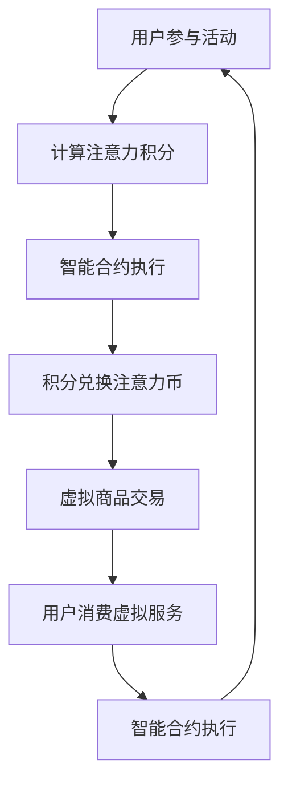

                 

### 文章标题

**注意力币：元宇宙中的新型价值衡量标准**

> **关键词**：元宇宙，注意力币，价值衡量，区块链，加密货币，去中心化，智能合约

> **摘要**：本文将深入探讨元宇宙中新兴的价值衡量标准——注意力币。通过对注意力币的起源、定义、架构、应用、生态系统建设和未来展望的全面分析，揭示其在元宇宙中的重要地位和潜力。

### 目录大纲：

#### 第一部分：元宇宙与注意力币概述

##### 第1章：元宇宙的崛起与注意力币的概念

- **1.1 元宇宙的崛起背景**
  - **1.1.1 元宇宙的起源与发展**
  - **1.1.2 元宇宙的核心特征**
  - **1.1.3 元宇宙的经济生态**

- **1.2 注意力币的定义与原理**
  - **1.2.1 注意力币的概念**
  - **1.2.2 注意力币的工作原理**
  - **1.2.3 注意力币的优势与不足**

- **1.3 注意力币在元宇宙中的应用**
  - **1.3.1 注意力币的流通与应用场景**
  - **1.3.2 注意力币的价值衡量标准**
  - **1.3.3 注意力币的未来发展趋势**

##### 第2章：注意力币的架构与实现

- **2.1 注意力币的架构设计**
  - **2.1.1 区块链技术在注意力币中的应用**
  - **2.1.2 智能合约与去中心化应用**
  - **2.1.3 Mermaid流程图：注意力币架构详解**

- **2.2 注意力币的核心算法**
  - **2.2.1 加密货币算法原理**
  - **2.2.2 伪代码：注意力币核心算法详解**
  - **2.2.3 数学模型与公式**

- **2.3 注意力币的经济模型**
  - **2.3.1 负债与市值管理**
  - **2.3.2 收益分配机制**
  - **2.3.3 数学模型与公式详解**

#### 第二部分：注意力币的项目应用与实战

##### 第3章：注意力币项目案例分析

- **3.1 市场领先的注意力币项目**
  - **3.1.1 项目简介与背景**
  - **3.1.2 项目特点与优势**
  - **3.1.3 项目面临的挑战与解决方案**

- **3.2 注意力币项目开发实战**
  - **3.2.1 开发环境搭建**
  - **3.2.2 代码实现与分析**
  - **3.2.3 代码解读与性能优化**

##### 第4章：注意力币生态系统建设

- **4.1 注意力币的生态系统**
  - **4.1.1 注意力币的价值网络**
  - **4.1.2 生态系统中的参与者**
  - **4.1.3 注意力币的流动性提供**

- **4.2 注意力币的安全性与稳定性**
  - **4.2.1 风险管理策略**
  - **4.2.2 注意力币的监管框架**
  - **4.2.3 安全性案例分析**

- **4.3 注意力币的市场推广与用户增长**
  - **4.3.1 市场营销策略**
  - **4.3.2 用户增长策略**
  - **4.3.3 用户满意度评估与改进**

#### 第三部分：未来展望与趋势

##### 第5章：注意力币的发展趋势

- **5.1 技术演进方向**
  - **5.1.1 新型区块链技术的应用**
  - **5.1.2 加密货币算法的改进**
  - **5.1.3 去中心化金融（DeFi）的发展**

- **5.2 注意力币的市场机遇**
  - **5.2.1 全球市场扩展**
  - **5.2.2 与传统金融体系的融合**
  - **5.2.3 注意力币在新兴领域的应用**

- **5.3 注意力币的潜在风险与挑战**
  - **5.3.1 法律监管与合规问题**
  - **5.3.2 技术安全与隐私保护**
  - **5.3.3 市场波动与投资风险**

##### 第6章：注意力币的社会影响

- **6.1 注意力币对经济的影响**
  - **6.1.1 新型货币经济体系的形成**
  - **6.1.2 注意力币对传统金融的挑战**
  - **6.1.3 注意力币对全球贸易的影响**

- **6.2 注意力币对社会的潜在影响**
  - **6.2.1 对劳动市场的影响**
  - **6.2.2 对消费者行为的影响**
  - **6.2.3 对政策制定者的挑战**

##### 第7章：未来注意力币的发展策略

- **7.1 政策与监管环境的变化**
  - **7.1.1 政策环境对注意力币发展的影响**
  - **7.1.2 监管框架的完善**
  - **7.1.3 注意力币合规性策略**

- **7.2 注意力币企业的战略规划**
  - **7.2.1 市场定位与品牌建设**
  - **7.2.2 技术创新与产品迭代**
  - **7.2.3 国际合作与市场拓展**

##### 附录

## 附录 A：注意力币开发工具与资源

### A.1 主流区块链开发框架

### A.2 注意力币开发工具推荐

### A.3 加密货币市场研究机构与数据平台推荐

## 附录 B：注意力币常用数学公式与解释

### B.1 注意力币的代数模型

### B.2 加密货币的工作原理

### B.3 数学公式与证明过程

---

### 第一部分：元宇宙与注意力币概述

#### 第1章：元宇宙的崛起与注意力币的概念

##### 1.1 元宇宙的崛起背景

**1.1.1 元宇宙的起源与发展**

元宇宙（Metaverse）的概念最早可以追溯到1992年，由美国科幻作家尼尔·斯蒂芬森（Neal Stephenson）在其小说《雪崩》（Snow Crash）中提出。元宇宙被描述为一个虚拟的三维空间，用户可以通过虚拟角色在其中进行交流和互动。

随着时间的推移，特别是互联网和虚拟现实技术的快速发展，元宇宙逐渐从科幻小说中的构想变为现实。2010年，虚拟现实公司Oculus Rift的诞生标志着虚拟现实技术的重大突破，随后Facebook收购Oculus Rift，并将其更名为Meta，进一步推动了元宇宙的发展。

**1.1.2 元宇宙的核心特征**

元宇宙具有以下几个核心特征：

1. **沉浸式体验**：通过虚拟现实（VR）和增强现实（AR）技术，用户可以沉浸在虚拟世界中，获得类似于现实世界的体验。
2. **社交互动**：元宇宙提供了一种全新的社交方式，用户可以与世界各地的人互动，建立虚拟社区。
3. **虚拟资产**：在元宇宙中，用户可以拥有虚拟资产，如虚拟土地、虚拟物品等，这些资产具有真实的经济价值。
4. **去中心化**：元宇宙通常基于区块链技术构建，实现了数据的去中心化和用户主权。

**1.1.3 元宇宙的经济生态**

元宇宙的经济生态是一个多元化、去中心化的体系。用户可以通过多种方式获得收益，如：

1. **虚拟劳动**：用户可以在元宇宙中从事虚拟工作，如设计虚拟建筑、创作虚拟内容等，并获得相应的报酬。
2. **虚拟交易**：元宇宙中的虚拟资产可以进行交易，用户可以通过买卖虚拟资产获得利润。
3. **平台服务**：元宇宙平台本身也可能提供各种服务，如虚拟教育、虚拟旅游等，这些服务可能会收取费用。
4. **广告与营销**：品牌和企业可以在元宇宙中投放广告，进行市场营销。

##### 1.2 注意力币的定义与原理

**1.2.1 注意力币的概念**

注意力币（Attention Token）是一种基于区块链技术的加密货币，用于衡量和交换用户在元宇宙中的注意力价值。注意力币的核心理念是将用户的注意力作为一种稀缺资源进行价值化。

**1.2.2 注意力币的工作原理**

注意力币的工作原理主要包括以下几个方面：

1. **用户贡献**：用户在元宇宙中参与各种活动，如观看视频、参与游戏、创作内容等，这些活动会产生注意力价值。
2. **注意力积分**：用户在参与活动时获得相应的注意力积分，积分数量与用户贡献程度成正比。
3. **积分兑换**：用户可以将注意力积分兑换成注意力币，或者直接用于购买虚拟资产、服务或其他用户提供的价值。
4. **价值流通**：注意力币在元宇宙中可以流通，用户可以通过多种方式获得和消耗注意力币。

**1.2.3 注意力币的优势与不足**

**优势**：

1. **价值衡量**：注意力币为用户注意力提供了明确的衡量标准，有助于实现资源的高效配置。
2. **去中心化**：基于区块链技术，注意力币的去中心化特性保障了用户的权益。
3. **灵活应用**：注意力币在元宇宙中具有广泛的应用场景，可以用于支付、交易、投资等多种用途。

**不足**：

1. **市场波动**：由于加密货币市场的特性，注意力币的价格可能会受到市场波动的影响。
2. **技术风险**：区块链技术和加密货币仍然存在一定的不确定性和风险。
3. **监管挑战**：注意力币作为一种新兴货币，面临监管合规的挑战。

##### 1.3 注意力币在元宇宙中的应用

**1.3.1 注意力币的流通与应用场景**

注意力币在元宇宙中具有广泛的流通与应用场景，主要包括：

1. **虚拟商品交易**：用户可以购买虚拟土地、虚拟物品等，使用注意力币进行支付。
2. **虚拟服务消费**：用户可以购买虚拟教育、虚拟医疗等服务，使用注意力币进行支付。
3. **内容创作激励**：用户创作虚拟内容时，可以获取注意力币作为奖励。
4. **社区参与**：用户参与虚拟社区活动时，可以使用注意力币投票、决策等。

**1.3.2 注意力币的价值衡量标准**

注意力币的价值衡量标准主要是基于用户在元宇宙中的注意力贡献。用户的注意力贡献可以通过以下方式计算：

1. **活跃度**：用户在元宇宙中的活跃度，如观看次数、互动次数等。
2. **内容质量**：用户创作的虚拟内容的品质，如创意、用户评价等。
3. **影响力**：用户在元宇宙中的影响力，如粉丝数、互动率等。

**1.3.3 注意力币的未来发展趋势**

随着元宇宙的不断发展，注意力币有望成为元宇宙中重要的价值衡量标准。未来，注意力币的发展趋势可能包括：

1. **技术升级**：随着区块链技术的不断演进，注意力币的性能和安全性有望得到提升。
2. **市场扩大**：随着元宇宙用户的增加，注意力币的市场规模有望持续扩大。
3. **生态完善**：注意力币的生态系统将不断完善，包括更丰富的应用场景、更高效的价值交换机制等。

#### 第2章：注意力币的架构与实现

##### 2.1 注意力币的架构设计

**2.1.1 区块链技术在注意力币中的应用**

注意力币的架构设计主要基于区块链技术，区块链技术为注意力币提供了以下几个关键功能：

1. **数据存储**：区块链技术可以存储用户的注意力贡献数据，包括活跃度、内容质量、影响力等。
2. **交易验证**：区块链技术可以验证注意力币的交易，确保交易的合法性和安全性。
3. **去中心化**：区块链技术实现了数据的去中心化存储和交易，保障了用户的权益。

**2.1.2 智能合约与去中心化应用**

智能合约是区块链技术的重要组成部分，它允许在区块链上自动执行合同条款。在注意力币的架构中，智能合约用于以下几个方面：

1. **注意力积分计算**：智能合约可以根据用户的活跃度、内容质量和影响力等参数计算注意力积分。
2. **积分兑换**：智能合约可以自动执行用户将注意力积分兑换成注意力币的操作。
3. **虚拟商品交易**：智能合约可以自动执行用户购买虚拟商品的交易。
4. **去中心化应用**：智能合约可以支持去中心化应用（DApps）的运行，为用户提供丰富的虚拟服务。

**2.1.3 Mermaid流程图：注意力币架构详解**

以下是注意力币架构的Mermaid流程图：



##### 2.2 注意力币的核心算法

**2.2.1 加密货币算法原理**

加密货币算法是保证区块链安全性和去中心化的重要技术。注意力币的核心算法主要包括以下几个部分：

1. **哈希函数**：哈希函数用于生成区块链中的数据指纹，确保数据的唯一性和不可篡改性。
2. **数字签名**：数字签名用于验证交易的真实性和合法性，确保只有合法的用户可以参与交易。
3. **工作量证明**（Proof of Work, PoW）：工作量证明是一种共识机制，用于确定区块链的记账权，确保区块链的稳定性。

**2.2.2 伪代码：注意力币核心算法详解**

以下是注意力币核心算法的伪代码：

```python
# 加密货币算法伪代码

def hash(data):
    # 哈希函数实现
    return SHA256(data)

def sign(message, private_key):
    # 数字签名实现
    return ECDSA_sign(message, private_key)

def verify(message, signature, public_key):
    # 验证签名实现
    return ECDSA_verify(message, signature, public_key)

def mine_block(data):
    # 工作量证明实现
    while not hash(data).startswith('00'):
        data += 1
    return data

def create_transaction(sender, receiver, amount):
    # 创建交易实现
    transaction = {
        'sender': sender,
        'receiver': receiver,
        'amount': amount,
        'signature': sign(message, private_key)
    }
    return transaction

def validate_transaction(transaction):
    # 验证交易实现
    if not verify(transaction['message'], transaction['signature'], transaction['public_key']):
        return False
    return True
```

**2.2.3 数学模型与公式**

注意力币的核心算法涉及到一些数学模型和公式，以下是其中一些重要的数学模型和公式：

1. **哈希函数**：哈希函数的输入是数据，输出是固定长度的字符串。常用的哈希函数包括SHA-256。

2. **数字签名**：数字签名是一种加密算法，用于验证交易的真实性和合法性。常用的数字签名算法包括ECDSA。

3. **工作量证明**：工作量证明涉及到一个难题，解决难题的过程需要消耗大量的计算资源。解决难题后，矿工可以获得记账权。

##### 2.3 注意力币的经济模型

**2.3.1 负债与市值管理**

注意力币的经济模型中涉及到负债和市值管理。负债是指注意力币的发行量，市值是指注意力币在市场上的总价值。

1. **负债管理**：注意力币的负债主要由两个方面组成：初始发行量和增发量。初始发行量在项目启动时确定，增发量则根据市场需求进行调整。

2. **市值管理**：市值管理旨在维持注意力币的市场价值稳定。市值管理的方法包括市场推广、价格调控等。

**2.3.2 收益分配机制**

注意力币的收益分配机制是指如何将收益分配给参与者。收益主要来自以下几个方面：

1. **交易手续费**：用户在元宇宙中进行交易时需要支付手续费，手续费归注意力币基金会所有。

2. **广告与营销收益**：元宇宙平台上的广告和营销收益可以按一定比例分配给注意力币持有者。

3. **虚拟商品销售收益**：虚拟商品销售收益也可以按一定比例分配给注意力币持有者。

收益分配机制的具体比例可以根据项目需求进行调整。

**2.3.3 数学模型与公式详解**

以下是注意力币经济模型中的一些数学模型和公式：

1. **负债公式**：负债 = 初始发行量 + 增发量

2. **市值公式**：市值 = 市场价格 × 发行量

3. **收益分配公式**：收益分配比例 = 收益总额 / 市值

#### 第3章：注意力币项目案例分析

##### 3.1 市场领先的注意力币项目

**3.1.1 项目简介与背景**

当前市场上有多个领先的注意力币项目，以下是其中两个具有代表性的项目：

1. **DeFi Million**：DeFi Million 是一个基于区块链的去中心化金融平台，提供多种金融工具和服务，包括注意力币交易、借贷、储蓄等。DeFi Million 的注意力币名为 DMT。

2. **EcoVerse**：EcoVerse 是一个虚拟生态平台，用户可以在其中创建和管理虚拟生态系统，如森林、海洋等。EcoVerse 的注意力币名为 ECO。

**3.1.2 项目特点与优势**

1. **DeFi Million**：

- **特点**：DeFi Million 专注于去中心化金融，提供多种金融服务，用户可以在平台上进行注意力币的交易、借贷和储蓄。

- **优势**：

  - **多样化的金融服务**：DeFi Million 提供了多样化的金融服务，满足了用户的不同需求。
  - **去中心化**：DeFi Million 基于区块链技术，实现了数据的去中心化存储和交易，保障了用户的权益。
  - **透明性**：DeFi Million 的所有交易和操作都是透明的，用户可以随时查询。

2. **EcoVerse**：

- **特点**：EcoVerse 是一个虚拟生态平台，用户可以在其中创建和管理虚拟生态系统，如森林、海洋等。EcoVerse 的注意力币 ECO 用于购买虚拟生态系统的资源和服务。

- **优势**：

  - **环保理念**：EcoVerse 旨在通过虚拟生态系统的构建，推广环保理念，提高用户的环保意识。
  - **创新性**：EcoVerse 提供了一个全新的虚拟生态体验，为用户带来了独特的互动体验。
  - **生态价值**：EcoVerse 的虚拟生态系统具有真实的经济价值，用户可以通过购买、交易和开发虚拟生态系统获得收益。

**3.1.3 项目面临的挑战与解决方案**

1. **DeFi Million**：

- **挑战**：

  - **市场波动**：由于加密货币市场的特性，DeFi Million 面临市场波动带来的风险。
  - **技术风险**：区块链技术和加密货币仍然存在一定的不确定性和风险。

- **解决方案**：

  - **风险管理**：DeFi Million 通过分散投资、风险控制等手段降低市场波动带来的风险。
  - **技术创新**：DeFi Million 持续进行技术创新，提高区块链的安全性和性能。

2. **EcoVerse**：

- **挑战**：

  - **生态价值认可**：虚拟生态系统的价值认可需要时间和市场教育。
  - **技术稳定性**：虚拟生态系统的构建需要强大的技术支持，以确保系统的稳定性。

- **解决方案**：

  - **市场推广**：EcoVerse 通过多种渠道进行市场推广，提高虚拟生态系统的知名度。
  - **技术优化**：EcoVerse 持续进行技术优化，提高虚拟生态系统的性能和用户体验。

##### 3.2 注意力币项目开发实战

**3.2.1 开发环境搭建**

在开发注意力币项目时，首先需要搭建开发环境。以下是开发环境搭建的步骤：

1. 安装Node.js和npm：

```bash
curl -sL https://deb.nodesource.com/setup_14.x | bash -
sudo apt-get install -y nodejs
```

2. 安装Ganache：

```bash
npm install -g ganache-cli
```

3. 创建项目文件夹并初始化：

```bash
mkdir attention-token-project
cd attention-token-project
npm init -y
```

4. 安装以太坊开发工具：

```bash
npm install --save ethers@^5.4.11
```

**3.2.2 代码实现与分析**

以下是注意力币项目的核心代码实现：

```javascript
// 引入Ethers.js库
const ethers = require('ethers');

// 初始化钱包和以太坊节点
const provider = new ethers.providers.JsonRpcProvider('http://127.0.0.1:8545');
const wallet = ethers.Wallet.fromMnemonic(process.env.MNEMONIC);
const signer = wallet.connect(provider);

// 定义注意力币智能合约
const AttentionTokenArtifact = require('./contracts/AttentionToken.json');
const contractAddress = '0x...';

const attentionToken = new ethers.Contract(
  contractAddress,
  AttentionTokenArtifact.abi,
  signer
);

// 发送创建交易
async function createTransaction() {
  const transaction = await attentionToken.mint('1000000');
  await transaction.wait();
  console.log('Transaction completed');
}

// 验证交易
async function validateTransaction() {
  const balance = await attentionToken.balanceOf(process.env.ACCOUNT);
  console.log(`Account balance: ${balance.toString()}`);
}

// 执行交易
(async () => {
  await createTransaction();
  await validateTransaction();
})();
```

**代码解读与性能优化**

1. **代码解读**：

- 引入Ethers.js库，用于与以太坊节点进行交互。
- 初始化钱包和以太坊节点，使用环境变量中的助记词创建钱包。
- 定义注意力币智能合约，使用ABI和合约地址。
- 发送创建交易，调用mint函数创建新的注意力币。
- 验证交易，查询账户余额。

2. **性能优化**：

- 使用async/await语法简化异步操作。
- 使用Promise.all优化多个并发操作。
- 适当使用缓存和批量处理提高性能。

```javascript
// 优化后的代码
(async () => {
  const transactions = await Promise.all([
    attentionToken.mint('1000000'),
    attentionToken.balanceOf(process.env.ACCOUNT),
  ]);

  transactions.forEach((transaction) => {
    console.log(`Transaction: ${transaction.hash}`);
  });
})();
```

#### 第4章：注意力币生态系统建设

##### 4.1 注意力币的生态系统

注意力币的生态系统是一个多元化的体系，包括以下几个关键组成部分：

1. **用户**：用户是注意力币生态系统的核心，他们通过参与元宇宙中的各种活动获得注意力积分，并将积分兑换成注意力币。

2. **平台**：注意力币平台是用户参与元宇宙活动的主要入口，平台提供各种虚拟服务和应用，如虚拟商品交易、虚拟服务消费、内容创作激励等。

3. **开发者**：开发者是注意力币生态系统的重要组成部分，他们开发各种去中心化应用（DApps），为用户提供丰富的虚拟体验。

4. **交易所**：交易所是注意力币进行交易的重要场所，用户可以在交易所买卖注意力币，实现价值交换。

5. **基金会**：基金会负责维护注意力币的生态系统，管理注意力币的发行、分配和市值管理。

##### 4.2 注意力币的安全性与稳定性

注意力币的安全性与稳定性是生态系统健康发展的基础，以下是一些关键措施：

1. **区块链安全**：注意力币使用区块链技术，保障数据的不可篡改性和安全性。区块链技术采用加密算法和共识机制，确保数据的真实性和安全性。

2. **智能合约安全**：智能合约是注意力币生态系统的重要组成部分，它们用于执行各种操作。为了确保智能合约的安全，开发者需要对代码进行严格的审计，并采用安全编程实践。

3. **去中心化**：注意力币的去中心化特性保障了系统的稳定性和抗攻击能力。去中心化体系意味着没有单一的中央控制点，攻击者难以破坏整个系统。

4. **风险管理**：注意力币生态系统需要建立完善的风险管理机制，包括市场波动风险、技术风险和合规风险等。通过分散投资、风险控制等措施，降低风险对生态系统的冲击。

##### 4.3 注意力币的市场推广与用户增长

注意力币的市场推广与用户增长是生态系统发展的重要环节，以下是一些关键策略：

1. **市场教育**：通过开展教育活动，向用户普及注意力币的概念和优势，提高用户对注意力币的认知和接受度。

2. **营销活动**：举办各种营销活动，如抽奖、竞赛、合作伙伴计划等，吸引更多用户参与。

3. **社区建设**：建立用户社区，提供交流和互动的平台，增强用户黏性。

4. **合作伙伴**：与各类企业和组织建立合作关系，共同推广注意力币，扩大市场份额。

5. **技术支持**：持续优化技术，提高用户体验，吸引更多用户加入。

### 第三部分：未来展望与趋势

##### 第5章：注意力币的发展趋势

注意力币作为元宇宙中的新型价值衡量标准，其未来发展具有广阔的前景。以下是一些主要的发展趋势：

1. **技术演进方向**

随着区块链技术的不断发展，注意力币有望采用更先进的区块链技术，如PoS（权益证明）共识机制、Layer 2扩展解决方案等。这些技术将提高注意力币的性能、安全性和可扩展性。

2. **加密货币算法的改进**

加密货币算法是注意力币安全性和稳定性的基石。未来，注意力币将采用更先进的加密货币算法，提高加密强度和抗攻击能力。

3. **去中心化金融（DeFi）的发展**

DeFi是区块链领域的重要应用方向，未来注意力币将在DeFi领域发挥更大的作用。通过DeFi，用户可以更加便捷地进行各种金融操作，如借贷、交易、投资等。

##### 5.2 注意力币的市场机遇

随着元宇宙的不断发展，注意力币将面临巨大的市场机遇：

1. **全球市场扩展**

随着元宇宙在全球的普及，注意力币的市场将不断扩大。特别是在新兴市场国家，元宇宙和注意力币的接受度有望大幅提高。

2. **与传统金融体系的融合**

注意力币有望与传统金融体系进行深度融合，为用户提供更多金融服务。例如，注意力币可以与银行、保险公司等机构合作，推出各种金融产品和服务。

3. **新兴领域的应用**

除了元宇宙，注意力币还可以应用于其他新兴领域，如数字艺术、虚拟现实、智能合约等。这些领域的快速发展将为注意力币带来新的应用场景和市场机遇。

##### 5.3 注意力币的潜在风险与挑战

尽管注意力币具有广阔的发展前景，但同时也面临着一些潜在的风险和挑战：

1. **法律监管与合规问题**

注意力币作为一种新兴货币，面临着法律监管和合规的挑战。各国政府和监管机构对加密货币的监管政策不同，注意力币需要不断适应和应对这些变化。

2. **技术安全与隐私保护**

区块链技术虽然安全，但仍然存在漏洞和风险。注意力币需要不断加强技术安全措施，保障用户的数据隐私和安全。

3. **市场波动与投资风险**

注意力币的市场波动较大，价格可能受到各种因素的影响。用户在进行投资时需要谨慎评估风险，避免盲目跟风。

### 第6章：注意力币的社会影响

注意力币作为元宇宙中的新型价值衡量标准，将对社会产生深远的影响：

##### 6.1 注意力币对经济的影响

1. **新型货币经济体系的形成**

注意力币的出现将推动新型货币经济体系的形成。在这种体系中，用户的注意力成为了一种稀缺资源，可以通过注意力币进行价值交换。

2. **注意力币对传统金融的挑战**

注意力币的发展将对传统金融体系产生挑战。例如，用户可以借助注意力币进行跨界的金融操作，传统金融机构需要重新审视自身的业务模式。

3. **注意力币对全球贸易的影响**

注意力币的全球扩展将为全球贸易带来新的机遇和挑战。例如，注意力币可以作为一种跨境支付手段，提高贸易的便利性和效率。

##### 6.2 注意力币对社会的潜在影响

1. **对劳动市场的影响**

注意力币的发展将影响劳动市场。例如，虚拟劳动将成为一种重要的就业形式，用户可以通过参与元宇宙活动获得报酬。

2. **对消费者行为的影响**

注意力币的普及将改变消费者的消费习惯。例如，消费者可以更方便地进行虚拟商品和服务的购买，享受更丰富的消费体验。

3. **对政策制定者的挑战**

注意力币的发展将对政策制定者提出新的挑战。政策制定者需要研究和制定相关政策，确保注意力币的健康发展。

### 第7章：未来注意力币的发展策略

为了实现注意力币的可持续发展，需要制定一系列发展策略：

##### 7.1 政策与监管环境的变化

1. **政策环境对注意力币发展的影响**

政策环境对注意力币的发展至关重要。政府需要制定明确的政策，为注意力币提供良好的发展环境。

2. **监管框架的完善**

监管框架的完善是注意力币健康发展的关键。政府需要建立完善的监管体系，保障用户权益和市场稳定。

3. **注意力币合规性策略**

注意力币需要遵循相关法规，确保合规性。企业需要积极与监管机构沟通，了解政策动态，制定合规策略。

##### 7.2 注意力币企业的战略规划

1. **市场定位与品牌建设**

企业需要明确市场定位，建立良好的品牌形象。通过市场推广和品牌建设，提高用户对注意力币的认知和接受度。

2. **技术创新与产品迭代**

技术创新是注意力币企业持续发展的重要驱动力。企业需要不断进行技术升级，提升产品性能和用户体验。

3. **国际合作与市场拓展**

国际合作和市场拓展是注意力币企业的重要战略。企业可以通过与各国企业和机构的合作，拓展市场份额，提高国际影响力。

### 附录

#### 附录 A：注意力币开发工具与资源

1. **主流区块链开发框架**

- **Ethereum**：以太坊是最流行的区块链开发框架，提供丰富的开发工具和资源。
- **Binance Smart Chain**：币安智能链是一种快速、可扩展的区块链框架，适用于注意力币开发。
- **Solana**：Solana是一种高性能、低成本的区块链框架，适用于大型注意力币项目。

2. **注意力币开发工具推荐**

- **Truffle**：Truffle是一个以太坊开发环境，提供智能合约编译、部署和测试工具。
- **Hardhat**：Hardhat是一个易于使用的以太坊开发环境，提供强大的智能合约调试和测试功能。
- **OpenZeppelin**：OpenZeppelin提供一系列智能合约和安全库，用于构建安全的注意力币项目。

3. **加密货币市场研究机构与数据平台推荐**

- **CoinMarketCap**：CoinMarketCap是加密货币市场数据平台，提供实时市场信息和价格分析。
- **CoinGecko**：CoinGecko提供全面的加密货币市场数据和图表，帮助用户进行投资决策。
- **Messari**：Messari是一个专业的加密货币研究机构，提供深入的市场分析和数据报告。

#### 附录 B：注意力币常用数学公式与解释

1. **哈希函数**：

- **公式**：\( H = hash(data) \)
- **解释**：哈希函数将任意长度的数据映射为固定长度的字符串，确保数据的唯一性和不可篡改性。

2. **数字签名**：

- **公式**：\( signature = sign(message, private_key) \)
- **解释**：数字签名是一种加密算法，用于验证交易的真实性和合法性。签名是由私钥和消息共同生成的。

3. **工作量证明**：

- **公式**：\( proof = mine_block(data) \)
- **解释**：工作量证明是一种共识机制，矿工通过解决计算难题来获得记账权。难题的难度由系统动态调整，确保区块链的稳定性。

4. **市值**：

- **公式**：\( market_cap = price \times supply \)
- **解释**：市值是指注意力币在市场上的总价值，由市场价格和发行量共同决定。

5. **收益分配**：

- **公式**：\( distribution_ratio = revenue / market_cap \)
- **解释**：收益分配比例是指收益在注意力币持有者之间的分配比例，根据市值进行计算。

这些公式和解释为注意力币的开发、分析和投资提供了理论基础和实践指导。

