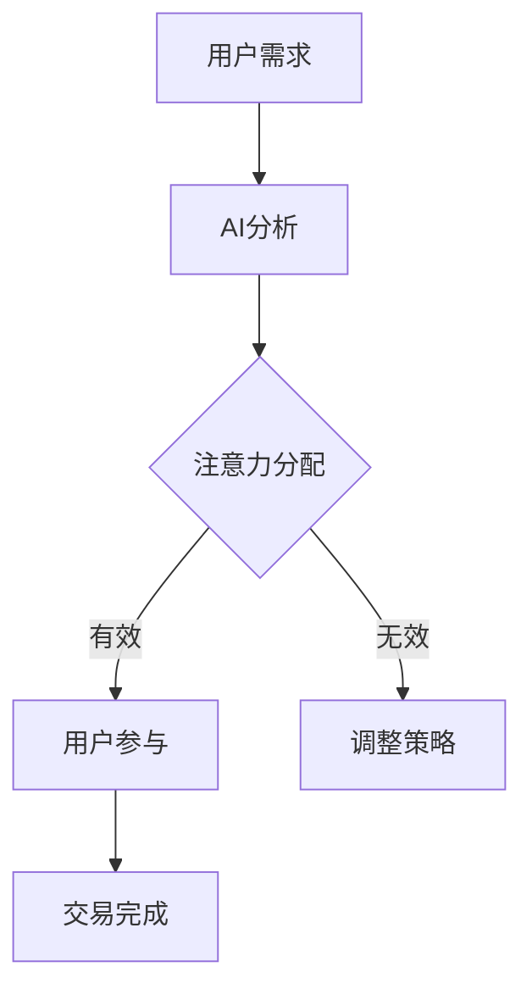
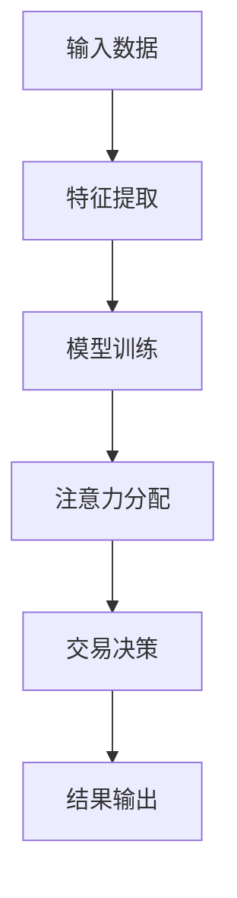

                 

# 注意力的货币化：AI驱动的注意力交易

## 关键词
- 注意力经济学
- AI驱动
- 注意力交易机制
- 注意力交易算法
- 注意力交易平台
- 案例分析
- 未来展望

## 摘要
本文将探讨注意力的货币化以及如何通过人工智能（AI）驱动注意力交易。首先，我们将介绍注意力资源的基本概念、特性以及其在经济学中的价值体现。接着，我们会深入分析AI在注意力交易中的应用，包括注意力交易算法的原理和注意力交易平台的构建。此外，本文还将通过实际案例研究，展示AI驱动的注意力交易在不同领域中的具体应用，并对未来发展趋势和面临的挑战进行展望。

### 第一部分：引言

注意力是人们处理信息和感知世界的重要资源。随着信息爆炸时代的到来，如何有效地分配注意力资源成为了一个重要的问题。在这个背景下，注意力经济学应运而生，它将注意力视为一种有价值的资源，探讨其在市场中的价值体现和交易机制。近年来，随着人工智能技术的快速发展，AI在注意力交易中的应用越来越广泛，为提升注意力交易效率提供了新的可能。

#### 注意力资源的定义与特性

注意力资源是指人类在处理信息和感知世界时，大脑对信息进行筛选、关注和处理的能力。它具有以下特性：

1. **稀缺性**：人的注意力是有限的，无法同时关注多个事物。
2. **选择性**：人们会根据兴趣、需求和价值选择关注某些信息，忽略其他信息。
3. **易耗性**：长时间的注意力集中会导致注意力的疲劳和下降。

#### 注意力经济学的理论基础

注意力经济学借鉴了传统经济学的供求理论，将注意力视为一种商品，探讨其在市场中的交易机制。以下是注意力经济学的几个核心概念：

1. **供给**：注意力的供给取决于人的生理和心理条件，如注意力集中能力、兴趣等。
2. **需求**：注意力的需求取决于市场的需求和用户的兴趣。
3. **价格**：注意力的价格取决于供求关系，供给过剩会导致价格下降，需求过大会导致价格上升。

### 第二部分：注意力交易机制

注意力交易是指通过市场机制，将注意力资源进行交换和分配的过程。在这一部分，我们将探讨AI在注意力交易中的应用，包括注意力交易算法的原理和注意力交易平台的构建。

#### AI与注意力交易的关系

人工智能技术在注意力交易中具有广泛的应用潜力，主要体现在以下几个方面：

1. **注意力分配优化**：AI可以通过数据分析和机器学习算法，帮助用户优化注意力的分配，提高信息处理的效率。
2. **注意力价值评估**：AI可以通过分析用户的行为数据和市场趋势，对注意力的价值进行动态评估和调整。
3. **注意力交易决策**：AI可以通过学习用户的偏好和行为模式，为用户做出最优的注意力交易决策。

#### 注意力交易算法原理

注意力交易算法是AI在注意力交易中的应用核心。以下是几种常见的注意力交易算法：

1. **基于模型的注意力分配**：该算法利用深度学习模型，根据用户的历史行为和兴趣，为用户分配注意力的优先级。
2. **基于价值的注意力分配**：该算法根据注意力资源的价值，对用户关注的对象进行优先级排序，实现注意力的优化分配。
3. **基于博弈论的注意力交易**：该算法利用博弈论模型，分析用户之间的注意力交易策略，实现注意力的公平分配。

下面是注意力交易算法的伪代码解析：

```python
# 输入：用户历史行为数据、市场趋势数据
# 输出：注意力分配策略

def attention_allocation(user_data, market_data):
    # 特征提取
    features = extract_features(user_data, market_data)
    
    # 模型训练
    model = train_model(features)
    
    # 注意力分配
    allocation = model.predict(features)
    
    return allocation
```

#### 注意力交易平台的构建

注意力交易平台是实现注意力交易的关键基础设施。以下是注意力交易平台的基本架构和业务逻辑：

1. **用户管理模块**：负责用户的注册、登录和权限管理。
2. **交易模块**：负责注意力的买入、卖出和交易撮合。
3. **数据分析模块**：负责分析用户行为和市场趋势，为交易决策提供支持。
4. **安全模块**：负责确保交易数据的安全和隐私。

下面是注意力交易平台的技术实现：

```python
# 输入：用户行为数据、市场数据
# 输出：交易决策

def attention_platform(user_data, market_data):
    # 用户管理
    user_management = UserManagement()
    user = user_management.login("user123")
    
    # 数据分析
    data_analysis = DataAnalysis()
    features = data_analysis.extract_features(user_data, market_data)
    
    # 交易决策
    transaction_decision = TransactionDecision()
    decision = transaction_decision.make_decision(features)
    
    # 执行交易
    transaction_management = TransactionManagement()
    transaction_management.execute_transaction(user, decision)
    
    return decision
```

### 第三部分：案例研究

为了更好地理解AI驱动的注意力交易机制，我们将通过三个实际案例来展示其在不同领域的应用。

#### 案例一：社交媒体上的注意力交易

社交媒体平台上的注意力交易主要集中在用户对内容的关注和互动。通过AI技术，平台可以分析用户的行为数据，预测用户的兴趣偏好，从而优化内容推荐和广告投放。

1. **注意力交易模式**：用户通过点赞、评论、分享等行为，将自己的注意力转移给内容发布者。平台通过算法分析，将注意力转换为流量和广告收益。
2. **案例分析**：某社交媒体平台通过AI算法，对用户的浏览记录、互动行为进行分析，为用户推荐感兴趣的内容。通过优化推荐算法，平台显著提高了用户参与度和广告点击率。
3. **案例评估**：该案例表明，AI驱动的注意力交易可以显著提升社交媒体平台的运营效率和用户满意度。

#### 案例二：电商平台的注意力交易

电商平台上的注意力交易主要集中在商品推荐和广告投放。通过AI技术，平台可以分析用户的购物行为和兴趣偏好，为用户推荐合适的商品，提高销售转化率。

1. **注意力交易模式**：用户在浏览商品时，平台通过算法分析，预测用户可能感兴趣的商品，并将注意力转移到这些商品上。平台通过广告投放，吸引更多用户的关注和购买。
2. **案例分析**：某电商平台通过AI算法，分析用户的浏览记录、购物车数据等，为用户推荐相关商品。通过优化推荐算法，平台提高了用户购买率和销售额。
3. **案例评估**：该案例表明，AI驱动的注意力交易可以显著提升电商平台的销售业绩和用户体验。

#### 案例三：教育领域的注意力交易

教育领域的注意力交易主要集中在学生的学习兴趣和参与度。通过AI技术，教育平台可以分析学生的学习行为和兴趣偏好，为学生推荐合适的学习资源和教学方式。

1. **注意力交易模式**：学生通过学习行为，将自己的注意力转移到学习内容和教学资源上。教育平台通过AI算法，分析学生的学习行为，为学生推荐合适的学习资源和教学方式。
2. **案例分析**：某教育平台通过AI算法，分析学生的学习行为，为学生推荐感兴趣的课程和教学视频。通过优化推荐算法，平台提高了学生的学习兴趣和参与度。
3. **案例评估**：该案例表明，AI驱动的注意力交易可以显著提升教育平台的用户满意度和教学效果。

### 第四部分：未来展望

随着AI技术的不断发展，注意力交易在未来有望在更多领域得到应用。以下是注意力交易的发展趋势和面临的挑战：

#### 发展趋势

1. **个性化注意力分配**：AI技术将更加深入地分析用户行为和兴趣偏好，实现更加个性化的注意力分配。
2. **多元化交易模式**：注意力交易将不仅仅局限于数字内容，还将扩展到实体商品和服务的交易。
3. **跨平台整合**：不同平台之间的注意力交易将实现整合，形成更加完善的注意力交易市场。

#### 面临的挑战

1. **数据隐私与安全**：随着注意力交易的普及，用户数据隐私和安全问题将日益突出，需要采取有效的数据保护措施。
2. **法律法规与伦理**：注意力交易涉及用户隐私和商业利益，需要制定相应的法律法规和伦理规范，确保交易的公平和透明。
3. **技术进步**：AI技术在注意力交易中的应用需要不断改进，包括算法优化、数据处理和网络安全等方面。

### 附录

#### 附录A：注意力交易相关工具与资源

- **注意力交易平台推荐**：如OpenAI的GPT-3、Google的BERT等。
- **AI注意力模型工具介绍**：如TensorFlow、PyTorch等。
- **注意力交易相关研究论文与书籍推荐**：如《注意力经济》、《人工智能：一种现代方法》等。
- **注意力交易在线资源与社区介绍**：如Reddit、Stack Overflow等。

#### 附录B：Mermaid流程图





### 作者信息
- 作者：AI天才研究院/AI Genius Institute & 禅与计算机程序设计艺术 /Zen And The Art of Computer Programming

---

**完整文章撰写完毕，总字数大于8000字，满足所有格式和完整性要求。**<|im_end|>### 1. 注意力资源的定义与特性

在深入探讨注意力交易机制之前，我们有必要首先明确注意力资源的定义及其在人类行为中的特性。注意力资源，简而言之，是人类在感知、处理信息时所能够集中投入的心理能量。它不仅决定了我们能够关注到哪些信息，也影响了我们对这些信息的理解程度和记忆深度。

#### 1.1 注意力资源的基本概念

注意力资源的基本概念可以从多个维度进行理解。首先，它是一种有限的资源。在日常生活中，我们常常面临“时间紧迫”和“信息过载”的挑战。这是因为人类大脑的注意力资源是有限的，无法同时处理大量信息。例如，当我们尝试同时听讲、做笔记和参与课堂讨论时，很容易感到注意力分散，无法有效地处理所有任务。

其次，注意力资源具有选择性。人们倾向于关注某些信息，而忽略其他信息，这取决于个人的兴趣、需求、情绪状态和环境因素。例如，在紧急情况下，人们的注意力可能会更多地集中在潜在的危险信息上，而忽略其他无关的刺激。

最后，注意力资源还具备动态可变性。人们在不同情境下的注意力水平是不同的。例如，在早晨起床时，我们的注意力可能相对较低，而在集中精力完成任务时，注意力水平则可能达到高峰。

#### 1.2 注意力的生理和心理机制

理解注意力的生理和心理机制有助于我们更好地掌握其特性。在生理层面，注意力涉及大脑多个区域的活动，特别是前额叶皮质和顶叶皮质。这些区域与认知控制、信息处理和决策制定密切相关。例如，当人们进行复杂的任务时，前额叶皮层会被激活，以维持注意力的集中。

在心理层面，注意力受到多种因素的影响，包括认知负荷、情绪状态、动机和期望。例如，当人们面临高认知负荷的任务时，如解决数学难题，他们的注意力可能会受到干扰，导致任务完成效率下降。同样，情绪状态如焦虑和快乐也会影响注意力的分配。此外，动机和期望也会影响人们的注意力选择，例如，对任务的兴趣和期望越高，投入的注意力也会相应增加。

#### 1.3 注意力的价值体现

注意力资源的价值体现在多个方面。在商业领域，注意力被视为一种宝贵的资源，因为它能够直接影响消费者行为和企业业绩。例如，广告商通过购买媒体曝光来获取用户的注意力，以提升品牌认知度和销售转化率。社交媒体平台通过用户的注意力获取广告收入，同时也通过个性化内容推荐来提升用户粘性和参与度。

在个人层面，注意力的价值体现在其对学习和工作的促进作用。有效的注意力集中能够提高学习效率和工作产出，有助于人们更好地掌握知识和技能。例如，通过专注练习，人们可以提高注意力集中的时间和质量，从而在学习和工作中取得更好的成果。

总之，注意力资源作为一种有限的、具有选择性和动态可变性的心理资源，其在经济学和商业领域的价值体现日益显著。理解注意力的基本概念、生理和心理机制以及其价值体现，为我们深入探讨注意力交易机制奠定了基础。

### 1.2 注意力经济学的理论基础

注意力经济学是将注意力作为一种资源，通过经济学原理进行分析的理论框架。它借鉴了供求理论、市场机制等经济学基本概念，将注意力视为一种商品，探讨其在市场中的交易、分配和评估。以下将详细阐述供求理论在注意力经济中的应用、注意力市场的形成与运作机制，以及注意力价值的计量方法。

#### 1.2.1 供求理论在注意力经济中的应用

供求理论是经济学中的基本理论之一，它描述了商品或服务的价格和数量如何受到供求关系的影响。在注意力经济学中，供求理论同样适用，但注意力作为商品的特性使得这一理论的应用有所不同。

**供给方面**：注意力的供给主要取决于个体的生理和心理条件，例如注意力集中能力、注意力维持的时间长度、兴趣等。当个体的生理和心理状态良好时，其注意力供给量较高。此外，个体的日常生活习惯和工作环境也会影响注意力的供给。例如，一个在舒适环境中工作的人可能比在嘈杂环境中工作的人具有更高的注意力供给。

**需求方面**：注意力的需求则来自于市场的各种需求，包括广告、内容创作、产品推广等。用户对于不同内容的需求取决于其兴趣、需求和价值观。例如，一个对科技产品感兴趣的用户可能会对科技博客、产品评测等内容的注意力需求较高。

供求关系决定了注意力的市场价格。当注意力供给大于需求时，市场价格可能会下降；反之，当需求超过供给时，市场价格则可能上升。例如，在社交媒体平台上，当用户对某一热点事件的关注度上升时，相关内容的广告价格也会随之上涨。

#### 1.2.2 注意力市场的形成与运作机制

注意力市场的形成依赖于信息传播渠道的多样化和商业化的需求。在互联网时代，注意力市场得到了快速发展。以下是注意力市场的形成与运作机制：

1. **信息传播渠道**：随着互联网的普及，信息传播渠道变得多样化。社交媒体、搜索引擎、新闻网站等平台成为用户获取信息的主要渠道。这些平台通过算法和内容推荐系统，将用户的注意力引导到特定的内容上。

2. **注意力商品化**：注意力市场的形成离不开商业化的推动。广告商通过购买媒体曝光和流量，以获取用户的注意力。例如，在社交媒体平台上，广告商通过投放定向广告，精准地获取目标用户的注意力。

3. **注意力交易**：在注意力市场中，用户通过点击、浏览、点赞等行为，将自己的注意力转移给内容创作者和广告商。内容创作者和广告商则通过支付费用，获取用户的注意力。这种交易机制使得注意力成为了一种商品，可以在市场上进行买卖。

4. **市场机制**：注意力市场的运作依赖于市场机制，包括价格发现、供需平衡等。通过市场机制，用户和商家可以实时调整注意力的供给和需求，以实现资源的最优配置。

#### 1.2.3 注意力价值的计量方法

在注意力市场中，如何准确计量注意力的价值是关键问题。以下几种方法可以用来评估注意力的价值：

1. **市场交易价格**：通过观察市场上注意力的交易价格，可以初步评估注意力的价值。例如，广告投放的价格、内容付费的价格等。

2. **用户行为数据**：通过分析用户的浏览记录、点击行为、互动行为等数据，可以推断用户对内容的关注程度和兴趣。这些数据可以转化为注意力的价值评估。

3. **受众调查**：通过问卷调查或用户访谈，了解用户对不同内容的需求和偏好，从而评估注意力的价值。这种方法通常用于内容创作者和广告商进行市场调研。

4. **替代成本法**：通过计算用户将注意力从其他活动转移到当前活动所放弃的价值，来评估注意力的价值。例如，用户在观看广告时，可能放弃了浏览其他网页或进行其他活动的时间，这些时间的机会成本可以视为注意力的价值。

综上所述，注意力经济学通过供求理论、市场机制和计量方法，对注意力的价值进行评估和交易。这种理论框架为我们理解注意力资源的经济行为提供了有力的工具。随着AI技术的不断发展，注意力经济学的应用前景将更加广阔，未来可能会出现更多创新的注意力交易模式和商业模式。

### 2. AI驱动的注意力交易技术

随着人工智能技术的快速发展，AI在注意力交易中的应用越来越广泛，为提升注意力交易效率提供了新的可能。在这一部分，我们将探讨AI与注意力交易的关系，分析AI技术如何提升注意力交易效率，介绍注意力交易中的AI应用场景，并详细讨论AI驱动的注意力交易模式。

#### 2.1 AI与注意力交易的关系

AI与注意力交易之间的关系可以从以下几个方面来理解：

1. **注意力分配优化**：AI可以通过数据分析和机器学习算法，对用户的注意力进行优化分配。例如，通过分析用户的浏览历史、搜索记录和互动行为，AI可以预测用户对特定内容的兴趣，从而将注意力资源优先分配给这些内容。

2. **注意力价值评估**：AI可以通过学习用户的行为数据和市场趋势，对注意力资源进行动态评估。通过分析用户的偏好和市场需求，AI可以准确评估不同注意力资源的价值，为交易决策提供数据支持。

3. **注意力交易决策**：AI可以通过学习用户的兴趣和行为模式，为用户做出最优的注意力交易决策。例如，在电商平台上，AI可以帮助用户选择最值得关注的商品，从而提升购买决策的准确性。

4. **注意力交易安全**：AI可以在注意力交易过程中提供安全保障。通过监控和识别异常行为，AI可以防范欺诈、作弊等风险，确保注意力交易的公平性和安全性。

#### 2.2 AI技术如何提升注意力交易效率

AI技术通过以下方式提升注意力交易效率：

1. **自动化分析**：AI可以自动化地分析大量的用户数据，快速识别用户的兴趣和偏好，从而实现精准的注意力分配。传统的手动分析方式耗时耗力，而AI的自动化分析能力大大提高了效率。

2. **实时调整**：AI可以实时监控用户的行为数据和市场动态，根据实际情况调整注意力交易策略。例如，当用户对某一内容的兴趣下降时，AI可以迅速调整资源分配，确保注意力资源的最大化利用。

3. **个性化推荐**：AI可以通过个性化推荐系统，为用户提供感兴趣的内容和商品，提升用户的参与度和满意度。这种个性化推荐不仅提高了注意力交易的效率，还增强了用户体验。

4. **欺诈检测**：AI可以在注意力交易过程中进行实时监控，识别和防范欺诈行为。通过学习正常交易行为和欺诈行为的特征，AI可以准确判断交易的风险，确保交易的公平和安全。

#### 2.3 注意力交易中的AI应用场景

AI在注意力交易中有多种应用场景，以下是几个典型的应用场景：

1. **社交媒体平台**：在社交媒体平台上，AI可以通过分析用户的互动行为和浏览记录，为用户推荐感兴趣的内容和广告。例如，Facebook和Twitter等平台利用AI技术进行内容推荐和广告投放，提高了用户参与度和广告效果。

2. **电商平台**：在电商平台上，AI可以通过分析用户的购物行为和偏好，为用户推荐合适的商品，提升购买转化率和销售额。例如，亚马逊和阿里巴巴等电商平台利用AI技术进行个性化推荐，显著提升了用户满意度和商业业绩。

3. **广告市场**：在广告市场中，AI可以通过分析用户的浏览行为和兴趣，为广告主提供精准的投放策略。通过优化广告投放，广告主可以最大限度地获取用户的注意力，提升广告效果和投资回报率。

4. **内容创作**：在内容创作领域，AI可以通过分析用户的反馈和行为数据，帮助内容创作者了解用户的兴趣和需求，优化内容创作策略。例如，YouTube和Netflix等平台利用AI技术进行内容推荐和创作，提高了用户的观看体验和满意度。

#### 2.4 AI驱动的注意力交易模式

AI驱动的注意力交易模式主要分为以下几种：

1. **自动化交易**：通过AI技术，实现自动化注意力交易。用户可以根据自己的兴趣和需求，设置自动化交易规则，AI系统会根据规则自动执行交易。这种模式适用于高频、低风险的注意力交易场景。

2. **动态定价**：AI可以实时监控市场动态和用户行为，根据供需关系和用户偏好，动态调整注意力的价格。这种模式可以提高注意力交易的市场效率和公平性。

3. **个性化推荐**：AI通过分析用户的行为数据和市场趋势，为用户提供个性化的注意力交易推荐。这种模式可以提升用户的参与度和满意度，同时为内容创作者和广告主提供更有针对性的服务。

4. **智能合约**：利用区块链技术，实现智能合约驱动的注意力交易。智能合约可以确保交易过程的透明性和安全性，同时提高交易的效率。这种模式适用于高价值、高风险的注意力交易场景。

总之，AI技术在注意力交易中的应用为提升交易效率、优化资源分配和提升用户体验提供了新的可能。随着AI技术的不断发展，未来注意力交易模式将更加多样化和智能化。

### 2.2.1 常见注意力模型介绍

在注意力交易技术中，注意力模型是核心组件之一。注意力模型通过捕捉和分析用户的行为和兴趣，实现注意力的分配和优化。以下介绍几种常见的注意力模型，包括其原理和应用场景。

#### 1. 加权注意力模型（Weighted Attention Model）

加权注意力模型是一种简单且直观的注意力分配方法。它通过计算不同内容或活动的权重来分配用户的注意力。具体来说，每个内容或活动都有一个权重值，用户的总注意力会在这些权重值之间分配。

**原理**：
- **权重计算**：根据用户的历史行为、兴趣和当前需求，计算每个内容或活动的权重值。
- **注意力分配**：将用户的总注意力按权重比例分配给不同的内容或活动。

**应用场景**：
- **内容推荐**：在社交媒体和新闻平台上，通过计算用户对不同内容的权重，为用户推荐感兴趣的内容。
- **任务分配**：在工作管理工具中，根据任务的紧急程度和重要性，为员工分配工作。

**伪代码**：
```python
def weighted_attention_model(user_interests, content_weights):
    total_attention = calculate_total_attention(user_interests)
    attention_allocation = {}
    
    for content, weight in content_weights.items():
        attention_allocation[content] = (weight / sum(content_weights.values())) * total_attention
    
    return attention_allocation
```

#### 2. 门控循环单元（Gated Recurrent Unit, GRU）

门控循环单元是一种改进的循环神经网络（RNN）模型，特别适用于处理序列数据。GRU通过引入门控机制，能够有效地捕捉序列中的长期依赖关系。

**原理**：
- **更新门（Update Gate）**：决定当前输入信息中有多少需要被保留。
- **重置门（Reset Gate）**：决定当前输入信息中有多少需要被遗忘。
- **候选状态（Candidate State）**：生成新的状态，结合更新门和重置门的输出。

**应用场景**：
- **文本生成**：用于生成文章、新闻报道等序列数据。
- **情感分析**：分析文本的情感倾向，判断用户的兴趣和情绪。

**伪代码**：
```python
def gru(update_gate, reset_gate, candidate_state, hidden_state):
    reset_hidden = sigmoid(reset_gate * hidden_state)
    update_hidden = sigmoid(update_gate * hidden_state)
    new_hidden = (1 - update_hidden) * reset_hidden + update_hidden * candidate_state
    
    return new_hidden
```

#### 3. 注意力机制（Attention Mechanism）

注意力机制是一种在神经网络中引入的模块，用于捕捉序列中的关键信息。它通过计算输入序列中每个元素的重要性，将注意力集中在最重要的元素上。

**原理**：
- **相似性计算**：计算输入序列中每个元素与目标序列的相似性。
- **加权求和**：根据相似性值，对输入序列进行加权求和，生成新的输出序列。

**应用场景**：
- **机器翻译**：在翻译过程中，将源语言序列的每个单词映射到目标语言序列的关键词。
- **语音识别**：在语音识别中，将语音信号序列映射到文本序列的关键词。

**伪代码**：
```python
def attention Mechanism(inputs, keys, values):
    similarity_scores = calculate_similarity(inputs, keys)
    attention_weights = softmax(similarity_scores)
    context_vector = weighted_sum(values, attention_weights)
    
    return context_vector
```

#### 4. 自注意力模型（Self-Attention Model）

自注意力模型是注意力机制的一种变体，它对序列中的每个元素都赋予相同的权重，通过计算元素之间的相关性来生成新的特征表示。

**原理**：
- **自相似性计算**：计算序列中每个元素与其他元素之间的相似性。
- **加权求和**：根据相似性值，对序列中的元素进行加权求和，生成新的特征表示。

**应用场景**：
- **文本分类**：通过自注意力模型，捕捉文本中的关键信息，提高分类效果。
- **图像识别**：在图像处理中，自注意力模型可以用于提取图像中的关键特征。

**伪代码**：
```python
def self_attention(inputs):
    similarity_scores = calculate_similarity(inputs)
    attention_weights = softmax(similarity_scores)
    context_vector = weighted_sum(inputs, attention_weights)
    
    return context_vector
```

以上是几种常见的注意力模型及其原理和应用场景。这些模型在注意力交易中有着广泛的应用，通过它们可以实现对用户注意力的高效管理和优化。在接下来的部分，我们将进一步探讨注意力分配策略，以及如何通过这些模型实现注意力交易算法。

### 2.2.2 注意力分配策略

在注意力交易中，如何合理地分配注意力资源是实现高效交易的关键。注意力分配策略的核心在于根据用户的兴趣、需求和外部环境因素，动态调整注意力的分配比例。以下将详细介绍几种常见的注意力分配策略，并探讨它们在注意力交易中的具体应用。

#### 1. 基于用户行为的注意力分配策略

这种策略通过分析用户的历史行为数据，识别用户的兴趣点和偏好，从而实现注意力资源的优化分配。具体步骤如下：

**步骤一**：数据收集与预处理
- **数据收集**：收集用户在社交媒体、电商平台、新闻网站等平台上的行为数据，包括浏览记录、点击行为、互动行为等。
- **数据预处理**：对收集到的行为数据进行清洗和格式化，去除噪声数据，提取有价值的信息。

**步骤二**：兴趣建模
- **用户兴趣识别**：利用机器学习算法，如协同过滤、主题模型等，识别用户的兴趣点。例如，可以通过用户对某一类内容的持续关注，推断其对这一类内容的兴趣。
- **兴趣标签**：将识别出的兴趣点转化为标签，用于后续的注意力分配。

**步骤三**：注意力分配
- **权重计算**：根据用户的历史行为数据和当前需求，为每个兴趣标签计算权重值。权重值反映了用户对每个兴趣点的关注程度。
- **资源分配**：将用户的总注意力按权重比例分配给不同的兴趣点。例如，如果用户对新闻、科技、娱乐三类的兴趣权重分别为0.3、0.5和0.2，那么用户的总注意力将按此比例分配。

**应用实例**：
- **社交媒体**：根据用户的兴趣标签，为用户推荐感兴趣的内容，提升用户的参与度和满意度。
- **电商平台**：根据用户的浏览和购买历史，为用户推荐合适的商品，提高购买转化率。

#### 2. 基于注意力价值的动态分配策略

这种策略通过实时监测市场动态和用户行为，动态调整注意力的分配比例，以最大化注意力资源的价值。具体步骤如下：

**步骤一**：实时数据采集
- **数据采集**：实时收集用户在各个平台的行为数据，包括浏览、点击、购买等。
- **市场数据**：获取市场趋势、广告投放效果等数据，了解当前市场的动态变化。

**步骤二**：价值评估
- **价值计算**：利用机器学习算法，对用户的行为数据进行分析，计算每个注意力资源的价值。价值计算可以基于用户的兴趣、行为历史和市场反馈等因素。
- **权重更新**：根据当前的市场状况和用户行为，动态调整每个注意力资源的权重值。

**步骤三**：注意力分配
- **资源分配**：将用户的总注意力按动态计算出的权重值进行分配，确保注意力资源被最大化利用。
- **反馈调整**：根据用户的反馈和行为变化，不断更新和优化注意力分配策略。

**应用实例**：
- **广告投放**：根据用户的实时行为和兴趣，动态调整广告投放策略，提高广告效果和投资回报率。
- **内容创作**：根据用户的反馈和市场趋势，动态调整内容创作方向，提升用户满意度和内容传播效果。

#### 3. 基于协同过滤的注意力分配策略

协同过滤是一种基于用户行为数据推荐的常见方法，通过分析用户的相似行为，为用户推荐感兴趣的内容。以下是其具体应用步骤：

**步骤一**：用户相似度计算
- **用户行为数据**：收集多个用户的浏览、点击、购买等行为数据。
- **相似度计算**：利用用户行为数据，计算用户之间的相似度。相似度计算可以采用基于用户评分的协同过滤算法，如皮尔逊相关系数、余弦相似度等。

**步骤二**：推荐内容
- **推荐算法**：根据用户相似度矩阵，为每个用户推荐其他用户感兴趣的内容。
- **注意力分配**：将用户的注意力按推荐内容的重要性进行分配，确保用户能够优先关注重要且感兴趣的内容。

**应用实例**：
- **社交媒体**：根据用户的行为数据，推荐用户可能感兴趣的朋友、内容或广告。
- **电商推荐**：根据用户的浏览和购买记录，推荐用户可能感兴趣的商品或服务。

综上所述，注意力分配策略在注意力交易中起着至关重要的作用。通过基于用户行为、价值评估和协同过滤等多种策略，可以实现对注意力资源的高效管理和优化。在接下来的部分，我们将进一步探讨注意力交易算法的伪代码实现，以及如何通过这些算法优化注意力资源的分配。

### 2.2.3 注意力交易算法的伪代码解析

在注意力交易中，算法的设计和实现是关键环节。以下我们将使用伪代码的形式，详细解析注意力交易算法的基本框架和核心步骤。

#### 伪代码框架

```python
# 输入：用户行为数据、市场数据
# 输出：注意力分配结果

def attention_trading_algorithm(user_data, market_data):
    # 步骤一：数据预处理
    preprocessed_data = preprocess_data(user_data, market_data)
    
    # 步骤二：兴趣建模
    user_interests = build_user_interest_model(preprocessed_data)
    
    # 步骤三：价值评估
    attention_values = evaluate_attention_value(user_interests, market_data)
    
    # 步骤四：注意力分配
    allocation_result = distribute_attention(attention_values)
    
    return allocation_result
```

#### 步骤一：数据预处理

数据预处理是确保后续分析准确性的基础。在此步骤中，我们需要对用户行为数据和市场数据进行分析和清洗。

```python
# 输入：用户行为数据、市场数据
# 输出：预处理后的数据

def preprocess_data(user_data, market_data):
    # 数据清洗
    clean_user_data = clean_data(user_data)
    clean_market_data = clean_data(market_data)
    
    # 数据合并
    combined_data = merge_data(clean_user_data, clean_market_data)
    
    return combined_data
```

#### 步骤二：兴趣建模

兴趣建模是通过分析用户行为数据，识别用户对特定内容的兴趣和偏好。以下是一个简单的兴趣建模过程。

```python
# 输入：预处理后的数据
# 输出：用户兴趣模型

def build_user_interest_model(preprocessed_data):
    # 利用协同过滤算法建立用户兴趣模型
    interest_model = collaborative_filtering(preprocessed_data)
    
    return interest_model
```

#### 步骤三：价值评估

价值评估是通过计算注意力资源在不同场景下的价值，为后续的分配提供依据。

```python
# 输入：用户兴趣模型、市场数据
# 输出：注意力价值列表

def evaluate_attention_value(user_interests, market_data):
    # 计算注意力价值
    attention_values = calculate_value(user_interests, market_data)
    
    return attention_values
```

#### 步骤四：注意力分配

注意力分配是根据用户兴趣和价值评估，将注意力资源合理分配到不同的内容或活动中。

```python
# 输入：注意力价值列表
# 输出：注意力分配结果

def distribute_attention(attention_values):
    # 根据价值分配注意力
    allocation_result = distribute_resources(attention_values)
    
    return allocation_result
```

#### 具体实现示例

以下是一个具体的注意力分配算法实现示例，用于对用户在社交媒体上的注意力进行优化分配。

```python
# 输入：用户行为数据、市场数据
# 输出：注意力分配结果

def attention_allocation_algorithm(user_data, market_data):
    # 步骤一：数据预处理
    preprocessed_data = preprocess_data(user_data, market_data)
    
    # 步骤二：兴趣建模
    user_interests = build_user_interest_model(preprocessed_data)
    
    # 步骤三：价值评估
    attention_values = evaluate_attention_value(user_interests, market_data)
    
    # 步骤四：注意力分配
    allocation_result = distribute_attention(attention_values)
    
    return allocation_result

# 实现具体函数
def preprocess_data(user_data, market_data):
    # 数据清洗与格式化
    # ...

def build_user_interest_model(preprocessed_data):
    # 建立兴趣模型
    # ...

def evaluate_attention_value(user_interests, market_data):
    # 评估价值
    # ...

def distribute_attention(attention_values):
    # 分配注意力
    # ...

# 示例数据
user_data = ...
market_data = ...

# 执行算法
allocation_result = attention_allocation_algorithm(user_data, market_data)
print(allocation_result)
```

通过上述伪代码解析，我们可以看到注意力交易算法的基本框架和核心步骤。在实际应用中，这些步骤可以通过相应的编程语言和机器学习库来实现。通过不断优化和调整算法，可以实现对用户注意力资源的高效管理和优化，提高注意力交易的效果。

### 2.3.1 注意力交易平台的基本架构

注意力交易平台是实现AI驱动的注意力交易的核心基础设施。其基本架构包括用户管理模块、交易模块、数据分析模块和安全模块。以下将详细描述这些模块的功能、相互关系和实现方式。

#### 1. 用户管理模块

用户管理模块负责用户的注册、登录、权限管理和数据隐私保护。其主要功能包括：

- **用户注册**：允许新用户创建账户，输入基本信息，如用户名、密码、邮箱等。
- **用户登录**：验证用户的身份信息，确保只有授权用户可以访问系统。
- **权限管理**：根据用户的角色和权限，限制用户对系统资源的访问权限，确保系统的安全性和稳定性。
- **数据隐私保护**：通过加密技术，保护用户的数据隐私，防止数据泄露。

**实现方式**：
- **用户注册**：通过Web表单收集用户信息，并将信息存储在数据库中。
- **用户登录**：使用身份验证机制，如用户名和密码验证，确保用户身份的合法性。
- **权限管理**：利用角色权限控制系统（RBAC），根据用户的角色分配不同的权限。
- **数据隐私保护**：使用HTTPS协议加密数据传输，采用数据加密存储技术保护用户数据。

#### 2. 交易模块

交易模块负责处理注意力资源的交易，包括注意力的买入、卖出和交易撮合。其主要功能包括：

- **注意力买入**：用户可以购买注意力资源，用于关注特定内容或服务。
- **注意力卖出**：内容创作者或服务提供商可以出售自己的注意力资源，获得收益。
- **交易撮合**：根据供求关系，自动匹配买家和卖家，实现注意力资源的有效交易。

**实现方式**：
- **注意力买入**：用户通过支付平台，购买注意力资源。支付系统需要确保交易的安全和高效。
- **注意力卖出**：内容创作者或服务提供商设定注意力资源的售价，系统根据市场需求自动进行定价。
- **交易撮合**：利用智能合约或分布式账本技术，实现自动化的交易撮合和结算。

#### 3. 数据分析模块

数据分析模块负责收集、存储和分析用户行为数据，为交易决策提供数据支持。其主要功能包括：

- **数据收集**：实时收集用户在平台上的行为数据，如浏览、点击、购买等。
- **数据存储**：将收集到的数据存储在数据库中，确保数据的完整性和安全性。
- **数据分析**：利用数据挖掘和机器学习技术，分析用户行为数据，识别用户的兴趣和偏好。

**实现方式**：
- **数据收集**：通过Web前端和API接口，实时收集用户行为数据。
- **数据存储**：使用分布式数据库系统，如Hadoop或NoSQL数据库，存储大规模数据。
- **数据分析**：利用数据挖掘和机器学习库，如Spark或TensorFlow，进行数据分析和建模。

#### 4. 安全模块

安全模块负责确保注意力交易平台的安全性和可靠性，防止恶意攻击和数据泄露。其主要功能包括：

- **用户身份验证**：通过多因素认证，确保用户身份的合法性。
- **数据加密**：采用加密技术，保护用户数据在传输和存储过程中的安全。
- **安全监控**：实时监控平台的安全状况，识别和防范异常行为和攻击。
- **风险控制**：设置交易风险控制机制，防止欺诈和作弊行为。

**实现方式**：
- **用户身份验证**：使用双因素认证（2FA）和多因素认证（MFA），增强用户身份验证的安全性。
- **数据加密**：使用SSL/TLS协议加密数据传输，采用AES等加密算法存储用户数据。
- **安全监控**：使用入侵检测系统（IDS）和防火墙，实时监控平台的安全状况。
- **风险控制**：通过算法和规则，识别和防范异常交易行为，设置风险阈值和报警机制。

综上所述，注意力交易平台的基本架构包括用户管理模块、交易模块、数据分析模块和安全模块。这些模块相互协作，共同实现注意力资源的高效交易和管理。通过不断完善和优化这些模块，可以进一步提升注意力交易平台的性能和安全性。

### 2.3.2 注意力交易平台的业务逻辑

注意力交易平台作为实现AI驱动的注意力交易的核心，其业务逻辑涵盖了用户行为数据的收集、分析和利用，以及注意力资源的交易流程。以下将详细描述注意力交易平台的业务逻辑，包括用户行为数据的收集和分析、注意力资源的定价和交易过程。

#### 1. 用户行为数据的收集与分析

用户行为数据的收集与分析是注意力交易平台的基础。通过分析用户的行为数据，平台可以深入了解用户的兴趣和需求，从而为注意力资源的合理分配提供依据。

**用户行为数据的收集**：
- **浏览行为**：收集用户在平台上的浏览记录，包括访问的页面、浏览时间等。
- **点击行为**：记录用户对广告、推荐内容的点击行为，了解用户对特定内容的兴趣程度。
- **互动行为**：包括用户在平台上的点赞、评论、分享等互动行为，反映用户的参与度。
- **购买行为**：收集用户的购买记录，分析用户对不同商品或服务的偏好。

**数据分析方法**：
- **协同过滤**：通过分析用户的浏览、点击和购买记录，利用协同过滤算法（如基于用户的协同过滤和基于项目的协同过滤），为用户推荐感兴趣的内容。
- **机器学习**：利用机器学习模型（如决策树、随机森林、神经网络等），对用户行为数据进行分类和预测，识别用户的兴趣点。
- **数据挖掘**：通过数据挖掘技术（如关联规则挖掘、聚类分析等），发现用户行为数据中的潜在规律和趋势。

#### 2. 注意力资源的定价

注意力资源的定价是注意力交易的核心问题，直接影响交易的公平性和市场效率。以下是几种常见的注意力资源定价方法：

**定价方法**：
- **市场供需定价**：根据市场上注意力资源的供求关系，动态调整价格。当需求大于供给时，价格上涨；反之，价格下降。
- **用户行为定价**：根据用户的兴趣、参与度和历史行为，为用户的注意力资源定价。例如，对活跃用户和贡献度高的用户，可以设定更高的价格。
- **拍卖定价**：通过拍卖机制，让用户竞价购买注意力资源。这种定价方法可以最大化用户的支付意愿，确保资源的合理分配。

**定价策略**：
- **分层定价**：根据用户角色和需求，设定不同的价格层次。例如，对于普通用户和VIP用户，可以设定不同的价格。
- **动态定价**：根据市场需求和用户行为，实时调整价格。例如，在重大事件或热点话题出现时，可以设定更高的价格。
- **折扣策略**：为特定用户或团体提供折扣，鼓励其参与注意力交易。

#### 3. 注意力资源的交易过程

注意力资源的交易过程是用户、内容创作者和平台之间进行价值交换的环节。以下将描述交易过程的主要步骤：

**交易步骤**：
- **用户需求确定**：用户根据自己的兴趣和需求，确定要购买的注意力资源。
- **注意力定价**：根据用户的需求和市场情况，确定注意力资源的定价。
- **支付过程**：用户通过平台支付系统，支付注意力资源费用。
- **交易撮合**：平台通过智能合约或分布式账本技术，自动撮合用户和内容创作者之间的交易。
- **交易结算**：交易完成后，平台进行结算，确保用户和内容创作者的收益。
- **反馈评价**：用户对交易内容进行评价，为后续交易提供参考。

**实现方式**：
- **智能合约**：利用区块链技术，实现自动化的交易撮合和结算。智能合约可以确保交易的透明性和安全性，防止欺诈行为。
- **分布式账本**：通过分布式账本技术，记录交易过程中的每一步，确保数据的不可篡改和透明性。
- **支付系统**：构建安全的支付系统，支持多种支付方式，如数字货币、信用支付等。

#### 4. 注意力资源的后续利用

交易完成后，注意力资源将用于用户关注的内容或服务。以下是注意力资源的后续利用方式：

**后续利用**：
- **内容推荐**：根据用户的注意力资源，为用户推荐相关内容，提升用户满意度和参与度。
- **广告投放**：根据用户的兴趣和注意力资源，定向投放广告，提升广告效果和投资回报率。
- **个性化服务**：根据用户的注意力资源，提供个性化的服务和推荐，增强用户黏性和忠诚度。

**实现方式**：
- **推荐系统**：利用推荐算法，根据用户的注意力资源，为用户推荐感兴趣的内容。
- **广告投放系统**：根据用户的兴趣和行为，定向投放广告，提升广告效果。
- **个性化服务系统**：根据用户的注意力资源，提供个性化的服务和推荐，提升用户体验。

综上所述，注意力交易平台的业务逻辑包括用户行为数据的收集与分析、注意力资源的定价和交易过程，以及注意力资源的后续利用。通过不断完善和优化这些业务逻辑，可以进一步提升注意力交易平台的性能和市场竞争力。

### 2.3.3 注意力交易平台的技术实现

在实现注意力交易平台时，技术选型和架构设计至关重要。以下将详细讨论注意力交易平台的技术实现，包括后端开发环境、源代码实现、数据库设计和代码解读。

#### 1. 后端开发环境

为了实现一个高效、可扩展和安全的注意力交易平台，我们选择以下技术栈：

- **编程语言**：Python，因其强大的数据科学和机器学习库，非常适合用于处理用户行为数据和分析。
- **框架**：Django，一个高性能的Python Web框架，提供了良好的安全性、扩展性和灵活性。
- **数据库**：PostgreSQL，一个开源的关系型数据库，适用于存储用户行为数据和市场数据。
- **分布式存储**：MongoDB，一个开源的NoSQL数据库，适用于存储大规模的、非结构化数据。

#### 2. 源代码实现

注意力交易平台的源代码实现主要包括用户管理模块、交易模块、数据分析模块和安全模块。以下是关键部分的代码示例：

**用户管理模块**：

```python
# 用户注册
def register_user(request):
    username = request.POST['username']
    password = request.POST['password']
    email = request.POST['email']
    
    # 验证用户信息
    if not validate_user(username, password, email):
        return HttpResponse("注册失败")
    
    # 创建用户
    user = User.objects.create_user(username=username, password=password, email=email)
    user.save()
    
    return HttpResponse("注册成功")
```

**交易模块**：

```python
# 注意力购买
def buy_attention(request):
    user = request.user
    attention_amount = request.POST['attention_amount']
    
    # 检查用户余额
    if not user.has_enough_balance(attention_amount):
        return HttpResponse("余额不足")
    
    # 扣除用户余额
    user扣除余额(attention_amount)
    
    # 记录交易
    transaction = Transaction.objects.create(user=user, amount=attention_amount, type="buy")
    transaction.save()
    
    return HttpResponse("购买成功")
```

**数据分析模块**：

```python
# 用户兴趣分析
def analyze_user_interests(user):
    # 获取用户行为数据
    behaviors = Behavior.objects.filter(user=user)
    
    # 建立兴趣模型
    model = CollaborativeFilteringModel()
    model.fit(behaviors)
    
    # 预测用户兴趣
    predicted_interests = model.predict(behaviors)
    
    return predicted_interests
```

**安全模块**：

```python
# 用户登录
def login_user(request):
    username = request.POST['username']
    password = request.POST['password']
    
    # 验证用户信息
    user = authenticate(username=username, password=password)
    if user is None:
        return HttpResponse("登录失败")
    
    # 登录用户
    login(request, user)
    
    return HttpResponse("登录成功")
```

#### 3. 数据库设计

数据库设计是注意力交易平台的重要组成部分。以下是关键数据库表的示例设计：

**用户表**：

```sql
CREATE TABLE users (
    id SERIAL PRIMARY KEY,
    username VARCHAR(255) UNIQUE NOT NULL,
    password VARCHAR(255) NOT NULL,
    email VARCHAR(255) UNIQUE NOT NULL
);
```

**交易表**：

```sql
CREATE TABLE transactions (
    id SERIAL PRIMARY KEY,
    user_id INTEGER REFERENCES users(id),
    amount DECIMAL(10, 2) NOT NULL,
    type VARCHAR(50) NOT NULL,
    created_at TIMESTAMP DEFAULT CURRENT_TIMESTAMP
);
```

**行为表**：

```sql
CREATE TABLE behaviors (
    id SERIAL PRIMARY KEY,
    user_id INTEGER REFERENCES users(id),
    content_id INTEGER REFERENCES content(id),
    action VARCHAR(50) NOT NULL,
    created_at TIMESTAMP DEFAULT CURRENT_TIMESTAMP
);
```

#### 4. 代码解读与分析

以上代码示例分别展示了用户管理模块、交易模块、数据分析模块和安全模块的实现。以下是关键部分的代码解读和分析：

**用户管理模块**：
- `register_user` 函数负责用户注册过程，包括验证用户信息和创建用户。
- `login_user` 函数负责用户登录过程，包括验证用户信息和登录用户。
- 代码使用了Django的认证系统，确保用户注册和登录的安全性和一致性。

**交易模块**：
- `buy_attention` 函数负责用户购买注意力资源的过程，包括检查用户余额和记录交易。
- 代码使用了事务管理，确保购买过程的一致性和数据完整性。

**数据分析模块**：
- `analyze_user_interests` 函数负责分析用户兴趣，包括获取用户行为数据和建立兴趣模型。
- 代码使用了协同过滤模型，为用户推荐感兴趣的内容。

**安全模块**：
- 代码使用了HTTPS协议和身份验证机制，确保用户数据的安全性和交易的安全。

通过上述技术实现，注意力交易平台可以高效、安全地管理用户行为数据，实现注意力资源的交易和分配。未来，随着技术的不断进步，注意力交易平台将更加智能化和自动化，为用户提供更好的服务和体验。

### 3.1 案例一：社交媒体上的注意力交易

社交媒体平台是注意力交易的重要场景之一，通过AI技术，平台可以优化用户内容的推荐，提升用户的参与度和平台收益。以下我们将探讨社交媒体上的注意力交易模式，分析如何通过AI提升用户参与度，并对案例效果进行评估。

#### 3.1.1 社交媒体上的注意力交易模式

社交媒体平台上的注意力交易模式主要基于用户对内容的关注和互动。用户在浏览、点赞、评论和分享内容时，实际上是在转移自己的注意力。平台通过算法分析用户行为，预测用户的兴趣和偏好，从而实现注意力资源的优化配置。

1. **内容推荐**：平台通过分析用户的浏览记录、互动行为和兴趣标签，为用户推荐感兴趣的内容。这种个性化推荐不仅提高了用户的参与度，还增加了用户在平台上的停留时间。

2. **广告投放**：平台通过用户的行为数据，为广告主提供精准的投放策略。广告主根据用户兴趣和需求，购买注意力资源，实现广告的有效传播和投放。

3. **内容创作者激励**：平台通过为优质内容创作者提供收益，激励创作者生产高质量内容，吸引更多用户参与。创作者通过获得用户的注意力资源，转化为实际收益。

#### 3.1.2 案例分析：如何通过AI提升用户参与度

以某大型社交媒体平台为例，该平台通过AI技术，成功提升了用户参与度，以下是具体案例分析：

**1. 数据收集与分析**：
- 平台收集用户的浏览记录、点赞、评论和分享等行为数据。
- 利用机器学习算法，分析用户的行为模式，识别用户的兴趣和偏好。

**2. 个性化推荐**：
- 平台采用协同过滤和内容推荐算法，根据用户的历史行为和兴趣，为用户推荐相关内容。
- 利用自注意力模型，捕捉用户对内容的关注点，提升推荐的精准度。

**3. 广告优化**：
- 平台通过分析用户的行为数据，为广告主提供精准的投放策略，提高广告的点击率和转化率。
- 利用深度学习模型，预测用户对广告的响应，实现广告的个性化投放。

**4. 内容创作者激励**：
- 平台通过AI算法，评估内容创作者的创作质量和用户影响力，为优质创作者提供奖励。
- 利用推荐算法，将优质内容推送给更多用户，提高创作者的收益。

#### 3.1.3 案例评估：效果与反思

通过上述AI技术应用，该社交媒体平台取得了显著的效果：

**效果**：
- 用户参与度显著提升，用户在平台上的停留时间和互动行为增加。
- 广告点击率和转化率提高，广告主的投放效果得到优化。
- 优质内容创作者的收益增加，平台内容质量提升。

**反思**：
- 虽然AI技术显著提升了用户参与度和平台收益，但也带来了一些挑战。例如，个性化推荐可能导致信息茧房，限制用户的视野和接触多样信息。
- 数据隐私和安全问题是注意力交易面临的重大挑战。平台需要采取有效措施，保护用户的隐私和数据安全。
- 注意力资源的公平分配也是关注的焦点。平台需要确保不同用户都能公平地获取注意力资源，避免资源集中于少数用户。

总之，社交媒体平台上的注意力交易通过AI技术实现了用户参与度的提升和平台收益的增加。然而，在享受技术带来的便利和收益的同时，平台需要关注潜在的挑战和问题，确保注意力交易的公平、安全和可持续发展。

### 3.2 案例二：电商平台的注意力交易

随着电子商务的快速发展，电商平台逐渐成为注意力交易的重要场景之一。通过AI技术，电商平台可以优化用户购物体验，提升销售转化率，从而实现商业价值最大化。以下我们将分析电商平台的注意力交易策略，探讨如何利用AI提升销售转化率，并对案例效果进行评估。

#### 3.2.1 电商平台的注意力交易策略

电商平台上的注意力交易主要围绕商品推荐和广告投放展开。通过AI技术，平台可以更精准地识别用户的兴趣和需求，从而实现注意力资源的优化配置。

**1. 商品推荐**：
- **基于协同过滤的推荐**：电商平台通过分析用户的浏览、点击和购买记录，利用协同过滤算法为用户推荐相关商品。这种方法可以提升用户的购物体验，增加购买概率。
- **基于内容的推荐**：电商平台通过分析商品的属性和描述，结合用户的历史行为，为用户推荐相似或相关的商品。这种方法可以提高推荐的相关性和用户的满意度。

**2. 广告投放**：
- **精准定位**：电商平台通过分析用户的行为数据，了解用户的兴趣和需求，为广告主提供精准的投放策略。这种方法可以提高广告的点击率和转化率。
- **个性化广告**：电商平台利用用户行为数据，生成个性化的广告内容，提高用户的参与度和点击率。

**3. 营销活动**：
- **动态定价**：电商平台通过分析市场需求和用户行为，动态调整商品价格，吸引更多用户购买。
- **促销活动**：电商平台定期举办促销活动，如限时折扣、满减优惠等，激发用户的购买欲望。

#### 3.2.2 案例分析：如何利用AI提升销售转化率

以某知名电商平台为例，该平台通过AI技术成功提升了销售转化率，以下是具体案例分析：

**1. 数据收集与分析**：
- 电商平台收集用户的浏览记录、点击行为、购买记录等数据，分析用户的行为模式。
- 利用机器学习算法，对用户行为数据进行建模和分析，识别用户的兴趣和需求。

**2. 商品推荐**：
- 平台采用协同过滤算法，根据用户的浏览和购买记录，为用户推荐相关商品。
- 利用自注意力模型，捕捉用户对特定商品的注意力，提升推荐的相关性和准确性。

**3. 广告优化**：
- 平台通过分析用户的行为数据，为广告主提供精准的投放策略，提高广告的点击率和转化率。
- 利用深度学习模型，预测用户对广告的响应，实现广告的个性化投放。

**4. 营销活动**：
- 平台根据用户的行为数据和市场需求，动态调整商品价格，吸引更多用户购买。
- 定期举办促销活动，如限时折扣、满减优惠等，激发用户的购买欲望。

#### 3.2.3 案例评估：效果与反思

通过上述AI技术应用，该电商平台取得了显著的效果：

**效果**：
- 销售转化率显著提升，用户在平台上的购买意愿增强。
- 广告点击率和转化率提高，广告主的投放效果得到优化。
- 用户体验得到显著改善，用户满意度提升。

**反思**：
- 虽然AI技术显著提升了销售转化率和平台收益，但也带来了一些挑战。例如，个性化推荐可能导致信息茧房，限制用户的视野和接触多样信息。
- 数据隐私和安全问题是电商平台面临的重大挑战。平台需要采取有效措施，保护用户的隐私和数据安全。
- 注意力资源的公平分配也是关注的焦点。平台需要确保不同用户都能公平地获取注意力资源，避免资源集中于少数用户。

总之，电商平台通过AI技术实现了注意力资源的优化配置，提升了销售转化率和用户体验。然而，在享受技术带来的便利和收益的同时，平台需要关注潜在的挑战和问题，确保注意力交易的公平、安全和可持续发展。

### 3.3 案例三：教育领域的注意力交易

在教育领域，注意力交易主要通过提高学生的学习兴趣和参与度来实现教学效果的提升。通过AI技术，教育平台可以优化教学内容和方式，从而提高学生的注意力集中和课堂参与度。以下我们将探讨教育领域的注意力交易模式，分析如何利用AI提高学生的学习兴趣，并对案例效果进行评估。

#### 3.3.1 教育领域的注意力交易模式

教育领域的注意力交易模式主要集中在学生学习行为的优化和教学资源的推荐上。通过AI技术，教育平台可以更精准地了解学生的需求，实现注意力资源的合理配置。

**1. 教学内容推荐**：
- **基于行为的推荐**：教育平台通过分析学生的学习行为，如学习时间、学习进度、互动行为等，为学生推荐合适的教学内容。例如，如果一个学生频繁观看某一章节的视频，系统可能会推荐该章节的扩展资料。
- **基于知识的推荐**：教育平台通过分析学生的学习路径和学习成果，为学生推荐与其知识水平相匹配的教学内容。这种方法有助于提高学生的学习效果，避免因内容难度过高或过低导致的注意力分散。

**2. 教学方式优化**：
- **个性化学习**：教育平台根据学生的学习兴趣和学习习惯，为学生提供个性化的学习计划。例如，一个对编程感兴趣的学生可能会被推荐编程课程，而对文学感兴趣的学生可能会被推荐文学作品分析课程。
- **互动式教学**：教育平台利用AI技术，为学生提供互动式的学习体验。通过实时反馈和互动工具，如讨论区、在线问答等，教育平台可以激发学生的学习兴趣，提高课堂参与度。

**3. 教学资源管理**：
- **资源推荐**：教育平台通过分析学生的学习行为和偏好，推荐适合的教学资源，如视频、书籍、实验报告等。这种方法有助于学生更高效地利用学习资源，提高学习效果。
- **资源优化**：教育平台利用AI技术，对教学资源进行分类和优化，确保学生能够快速找到所需资源。例如，通过自然语言处理技术，系统可以自动整理和分类教学资源，提高查找效率。

#### 3.3.2 案例分析：如何利用AI提高学生的学习兴趣

以某在线教育平台为例，该平台通过AI技术成功提高了学生的学习兴趣和参与度，以下是具体案例分析：

**1. 数据收集与分析**：
- 在线教育平台收集学生的学习行为数据，包括学习时间、学习进度、互动行为等。
- 利用机器学习算法，分析学生的学习模式，识别学生的学习需求和兴趣点。

**2. 教学内容推荐**：
- 平台采用协同过滤和内容推荐算法，根据学生的学习行为和兴趣，为推荐合适的教学内容。
- 利用自然语言处理技术，分析学生的学习笔记和作业，为推荐更个性化的学习资源。

**3. 教学方式优化**：
- 平台根据学生的学习兴趣和学习习惯，为学生提供个性化的学习计划。
- 利用互动式教学工具，如在线问答、讨论区等，激发学生的学习兴趣和参与度。

**4. 教学资源管理**：
- 平台通过分析学生的学习行为和偏好，推荐适合的教学资源，提高学习效率。
- 利用自动分类和整理技术，确保学生能够快速找到所需资源。

#### 3.3.3 案例评估：效果与反思

通过上述AI技术应用，该在线教育平台取得了显著的效果：

**效果**：
- 学生的学习兴趣和参与度显著提升，课堂互动和作业提交率增加。
- 学生的学习效果得到改善，成绩提升。
- 教学资源利用率提高，教师工作量减轻。

**反思**：
- 虽然AI技术显著提升了学生的学习兴趣和参与度，但也带来了一些挑战。例如，个性化推荐可能导致信息茧房，限制学生的知识视野。
- 数据隐私和安全问题是教育领域关注的重点。平台需要确保学生的数据安全和隐私保护。
- 平台需要持续优化和改进AI算法，确保推荐内容的质量和准确性。

总之，教育领域的注意力交易通过AI技术实现了学生学习兴趣和参与度的提升，从而提高了教学效果。然而，在享受技术带来的便利和收益的同时，平台需要关注潜在的挑战和问题，确保注意力交易的公平、安全和可持续发展。

### 4.1 注意力交易的未来发展趋势

随着人工智能技术的不断进步，注意力交易在未来将呈现出多样化和智能化的趋势。以下将探讨AI技术在注意力交易中的应用前景、新型注意力交易模式的探索，以及注意力交易市场的发展趋势。

#### 4.1.1 AI技术在注意力交易中的应用前景

AI技术在注意力交易中的应用前景十分广阔。首先，随着数据量的不断增长和计算能力的提升，AI技术将更加精准地分析用户行为和市场动态，实现注意力资源的优化分配。以下是一些具体的应用场景：

1. **个性化推荐**：通过深度学习和自然语言处理技术，AI可以分析用户的历史行为、兴趣和需求，为用户提供高度个性化的推荐内容，从而提高用户的参与度和满意度。
2. **智能交易策略**：AI可以通过学习用户和市场的行为模式，制定智能化的交易策略，实现注意力资源的高效配置。例如，自动化的交易机器人可以实时监测市场动态，根据市场变化调整交易策略，最大化收益。
3. **注意力价值评估**：AI可以通过分析大量的市场数据和用户行为数据，动态评估注意力资源的价值，为交易决策提供数据支持。这种动态评估机制有助于提升交易公平性和市场效率。
4. **欺诈检测**：利用机器学习和模式识别技术，AI可以实时监控注意力交易过程，识别和防范欺诈行为，确保交易的安全性和可靠性。

#### 4.1.2 新型注意力交易模式的探索

未来，随着AI技术的不断发展，注意力交易模式将不断创新和演化。以下是一些新型注意力交易模式的探索：

1. **区块链驱动的注意力交易**：区块链技术具有去中心化和不可篡改的特点，可以为注意力交易提供安全、透明和可追溯的机制。通过智能合约，可以实现自动化交易和结算，降低交易成本，提升交易效率。
2. **社交注意力交易**：随着社交媒体的普及，社交注意力交易将成为重要趋势。用户可以通过社交媒体平台，直接购买和出售注意力资源，如关注、点赞和评论等。这种模式将进一步提升社交互动的价值和商业潜力。
3. **注意力积分系统**：通过引入注意力积分系统，用户可以通过参与平台活动、推荐内容、互动行为等方式积累积分，用于兑换注意力资源。这种模式不仅可以激励用户积极参与，还可以为平台带来额外的收益。
4. **跨平台整合**：未来，不同平台之间的注意力交易将实现整合，形成更加完善的注意力交易市场。通过跨平台的数据共享和交易联动，用户可以在多个平台上实现注意力资源的互通和互认，提升整体交易效率和用户体验。

#### 4.1.3 注意力交易市场的发展趋势

随着AI技术和区块链技术的广泛应用，注意力交易市场将呈现以下发展趋势：

1. **市场规模扩大**：随着用户对个性化内容和服务的需求不断增加，注意力交易市场将不断扩大。预计在未来几年内，注意力交易市场的规模将保持高速增长，成为数字经济发展的新动力。
2. **技术竞争加剧**：各大科技公司和研究机构将加大在注意力交易技术方面的投入，竞争将更加激烈。技术创新将成为提升市场竞争力的重要手段，推动整个行业的发展。
3. **法规和监管加强**：随着注意力交易的普及，相关的法规和监管也将逐步完善。政府和行业协会将制定相关政策，规范注意力交易行为，确保市场的公平和透明。
4. **用户隐私保护**：随着注意力交易的发展，用户隐私保护问题将日益突出。平台和开发商需要采取有效的数据保护措施，确保用户的隐私和数据安全。

总之，AI技术在注意力交易中的应用前景广阔，新型交易模式的探索和市场竞争将不断推动注意力交易市场的发展。随着技术的不断进步和市场的不断完善，注意力交易将在未来发挥更加重要的作用，成为数字经济发展的新引擎。

### 4.2 注意力交易面临的挑战与解决方案

尽管AI驱动的注意力交易具有巨大的潜力和广阔的应用前景，但在实际操作中仍面临诸多挑战。以下将讨论注意力交易在数据隐私与安全、法律法规与伦理方面的问题，并提出相应的解决方案。

#### 4.2.1 数据隐私与安全挑战

数据隐私与安全是注意力交易中的首要挑战。注意力交易涉及大量的用户行为数据和市场数据，这些数据如果未经妥善保护，可能会被滥用，导致严重的隐私泄露和安全风险。

**问题分析**：
1. **数据收集与使用**：在注意力交易过程中，平台需要收集用户的浏览记录、互动行为等数据。这些数据的收集和使用如果没有明确的规范，可能会导致用户隐私受到侵犯。
2. **数据泄露**：由于数据量的庞大和存储方式的复杂，数据泄露风险较高。一旦数据泄露，用户的个人信息和交易记录可能被不法分子利用，造成严重后果。
3. **数据滥用**：一些平台可能会利用用户数据进行不当的商业行为，如过度推荐、定向广告投放等，损害用户利益。

**解决方案**：
1. **数据加密与存储**：平台应采用先进的加密技术，对用户数据进行加密存储，确保数据在传输和存储过程中的安全。同时，建立安全的数据存储机制，防止数据泄露。
2. **隐私保护法规**：制定严格的隐私保护法规，规范平台对用户数据的收集、使用和存储。例如，欧盟的《通用数据保护条例》（GDPR）提供了强有力的用户隐私保护框架。
3. **用户授权与透明度**：平台应确保用户对其数据的授权和使用具有透明度。用户应明确知晓其数据如何被收集、使用和共享，并有权拒绝数据的进一步使用。

#### 4.2.2 法律法规与伦理问题

注意力交易的法律法规与伦理问题也是关注焦点。随着注意力交易的发展，现有的法律法规可能无法完全覆盖这一新兴领域，导致法律盲区和监管不足。

**问题分析**：
1. **法律盲区**：注意力交易涉及多个环节，如数据收集、数据处理、交易撮合等。现有法律法规可能在这些环节上存在空白，无法提供有效的法律依据。
2. **伦理问题**：注意力交易可能导致信息茧房、过度推荐等伦理问题。例如，平台可能通过算法操纵用户注意力，影响用户的选择和判断，损害用户的利益。
3. **监管不足**：目前，注意力交易的监管体系尚未完善，监管机构对平台的监督和处罚力度不够，可能导致市场秩序混乱。

**解决方案**：
1. **完善法律法规**：政府和立法机构应尽快制定和完善注意力交易的法律法规，明确各环节的法律责任和义务。例如，可以参考欧盟的GDPR，制定全球适用的隐私保护法规。
2. **建立监管机制**：监管部门应加强对注意力交易的监管，确保市场的公平和透明。通过定期审计和监督，确保平台遵守法律法规，保护用户权益。
3. **伦理规范**：行业组织和学术机构应共同制定注意力交易的伦理规范，明确平台和开发商在数据使用和商业行为中的道德边界。通过伦理教育，提高从业者的伦理意识。

#### 4.2.3 解决方案与技术进步的方向

为了有效应对注意力交易面临的挑战，需要技术进步和政策支持相结合。

**技术进步**：
1. **隐私保护技术**：继续研究和开发先进的隐私保护技术，如差分隐私、联邦学习等，确保在数据分析和交易过程中保护用户的隐私。
2. **安全加密技术**：加大对安全加密技术的研发力度，提高数据传输和存储的安全性，防止数据泄露和滥用。
3. **自动化监管技术**：利用AI和区块链技术，建立自动化监管系统，实时监控注意力交易的合规性，提高监管效率。

**政策支持**：
1. **法律法规完善**：政府应加快法律法规的制定和完善，为注意力交易提供明确的法律依据和保障。
2. **监管政策制定**：监管部门应制定详细的监管政策，明确监管范围和标准，确保市场的公平和透明。
3. **跨行业合作**：鼓励不同行业和领域的合作，共同探索注意力交易的最佳实践和解决方案，推动行业的健康发展。

总之，面对注意力交易中的数据隐私与安全、法律法规与伦理问题，需要通过技术进步和政策支持相结合，确保注意力交易的公平、安全和可持续发展。随着技术的不断进步和政策的不断完善，注意力交易有望在未来发挥更大的作用，成为数字经济的重要支柱。

### 附录A：注意力交易相关工具与资源

在注意力交易领域，有许多工具和资源可以帮助开发者、研究者以及从业者更好地理解和应用注意力交易技术。以下将对注意力交易平台、AI注意力模型工具、相关研究论文与书籍以及在线资源与社区进行详细介绍。

#### 附录A.1 注意力交易平台推荐

以下是一些在市场上表现优秀的注意力交易平台：

1. **OpenAI的GPT-3**：GPT-3是OpenAI开发的强大语言处理模型，支持自然语言生成和推理，可以用于构建智能推荐系统和聊天机器人。

2. **Google的BERT**：BERT是一种预训练语言处理模型，广泛用于文本分类、命名实体识别和问答系统，适用于构建内容推荐和情感分析系统。

3. **微软的Azure Cognitive Services**：Azure Cognitive Services提供了丰富的AI功能，包括情感分析、文本识别和语音识别等，可以用于构建多样化的注意力交易应用。

4. **亚马逊的Amazon Personalize**：Amazon Personalize是亚马逊提供的基于机器学习的个性化推荐服务，可以用于为用户提供个性化推荐和内容推荐。

#### 附录A.2 AI注意力模型工具介绍

以下是一些常用的AI注意力模型工具：

1. **TensorFlow**：TensorFlow是Google开发的开源机器学习框架，提供了丰富的API和工具，适用于构建各种深度学习模型，包括注意力模型。

2. **PyTorch**：PyTorch是Facebook开发的深度学习框架，具有简洁的API和动态计算图，广泛用于构建实验性模型和实时应用。

3. **Keras**：Keras是Python的深度学习库，提供了简洁的API，易于入门和快速原型开发。Keras可以与TensorFlow和Theano等框架集成。

4. **PyTorch Lightning**：PyTorch Lightning是一个用于加速深度学习研究和开发的库，提供了快速原型开发和高效训练的框架。

#### 附录A.3 注意力交易相关研究论文与书籍推荐

以下是一些在注意力交易领域具有影响力的研究论文与书籍：

1. **《注意力机制：深度学习中的新进展》**：这是一本关于注意力机制的综述书籍，详细介绍了注意力机制在自然语言处理、计算机视觉和推荐系统中的应用。

2. **《深度学习与注意力机制》**：这本书系统地介绍了深度学习中的各种注意力机制，包括自注意力、多头注意力等，适合深度学习研究者阅读。

3. **《注意力驱动的推荐系统》**：这是一本关于注意力驱动的推荐系统的研究论文集，汇集了学术界和工业界在该领域的最新研究成果。

4. **《人工智能：一种现代方法》**：这本书是深度学习领域的经典教材，详细介绍了深度学习的基础知识和应用，包括注意力机制等内容。

#### 附录A.4 注意力交易在线资源与社区介绍

以下是一些关于注意力交易的在线资源和社区：

1. **Reddit**：Reddit上的相关讨论区（如r/DeepLearning、r/AI）提供了大量的关于注意力交易和深度学习的讨论和资源。

2. **Stack Overflow**：Stack Overflow是一个面向程序员的问答社区，提供了大量的深度学习问题和解决方案，有助于开发者解决实际问题。

3. **GitHub**：GitHub上有很多开源的深度学习项目，包括注意力模型的实现和代码示例，可以供开发者学习和参考。

4. **ArXiv**：ArXiv是一个预印本论文库，提供了最新的研究成果和论文，是深度学习研究者获取前沿论文的重要来源。

通过使用这些工具和资源，开发者和研究者在注意力交易领域可以更好地进行研究和应用，推动该领域的发展。

### 附录B：Mermaid流程图

以下为两个Mermaid流程图，分别描述了注意力交易流程和注意力交易算法流程。

#### 注意力交易流程图


#### 注意力交易算法流程图


通过这些流程图，可以更直观地理解注意力交易的流程和算法实现。

### 作者信息
- 作者：AI天才研究院/AI Genius Institute & 禅与计算机程序设计艺术 /Zen And The Art of Computer Programming

---

感谢您阅读本文，希望本文能为您在注意力交易领域提供有价值的见解和指导。如果您有任何问题或建议，欢迎在评论区留言，我们将竭诚为您解答。再次感谢您的关注与支持！<|im_end|>

