                 

# 注意力管理与自我调节：如何培养专注力以实现个人和职业成功

> **关键词：**注意力管理、自我调节、专注力、个人成功、职业成功
> 
> **摘要：**本文将探讨注意力管理和自我调节在个人和职业成功中的重要性。通过详细的理论分析和实践指导，本文旨在帮助读者理解并掌握注意力管理的核心概念和策略，从而提升专注力，实现个人和职业上的卓越成就。

## 目录大纲：《注意力管理与自我调节：如何培养专注力以实现个人和职业成功》

## 第1章 引言

### 1.1 注意力管理的重要性

### 1.2 自我调节的概念与作用

### 1.3 个人与职业成功的关联

## 第2章 基础理论

### 2.1 注意力管理的核心概念

### 2.2 自我调节的心理学原理

### 2.3 注意力管理策略与实践

## 第3章 注意力训练方法

### 3.1 认知行为训练

### 3.2 心理弹性训练

### 3.3 注意力训练工具与技术

## 第4章 职场中的注意力管理

### 4.1 职场注意力管理策略

### 4.2 领导力与注意力管理

### 4.3 跨文化注意力管理

## 第5章 学习与注意力管理

### 5.1 学习过程中的注意力管理

### 5.2 技能培养与注意力管理

### 5.3 教育中的注意力管理

## 第6章 自我调节与职业成功

### 6.1 自我调节与职业成功的关系

### 6.2 职业发展中的自我调节策略

### 6.3 自我调节在职业成功中的应用

## 第7章 注意力管理与职业实践

### 7.1 注意力管理在职业实践中的应用

### 7.2 注意力管理案例分析

### 7.3 注意力管理与个人成长

## 第8章 未来展望

### 8.1 注意力管理与自我调节的发展趋势

### 8.2 注意力管理与自我调节的未来

### 8.3 未来展望与思考

## 附录

### A.1 注意力管理相关资源

### A.2 注意力管理实用技巧

## 第1章 引言

### 1.1 注意力管理的重要性

在现代社会，注意力管理已经成为个人和职业成功的关键因素之一。随着科技的飞速发展和信息爆炸，人们面临着前所未有的注意力分散挑战。在这种环境下，如何有效地管理注意力，提升专注力，成为实现个人和职业成功的必备技能。

**核心概念与联系**

注意力管理涉及多个核心概念，如注意力的类型、分布模型以及注意力不集中的原因。理解这些概念有助于我们更全面地把握注意力管理的本质。

**Mermaid 流程图**

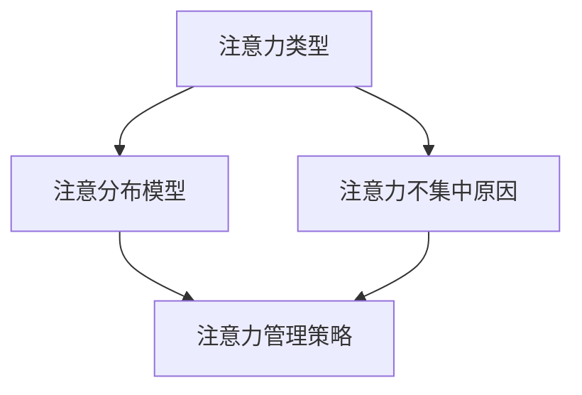

### 1.2 自我调节的概念与作用

自我调节是个体在情感、认知和行为上的自我控制和调整过程。在注意力管理中，自我调节起着至关重要的作用。通过自我调节，个体能够更好地控制自己的注意力，提升专注力和工作效率。

**核心概念与联系**

自我调节包括自我意识、自我效能和自我决定理论等核心概念。这些概念相互关联，共同构成了自我调节的理论基础。

**Mermaid 流程图**

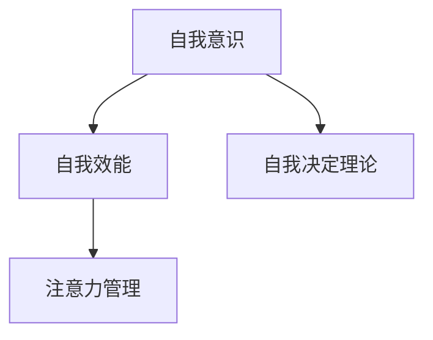

### 1.3 个人与职业成功的关联

个人和职业成功往往依赖于专注力和自我调节能力。通过有效地管理注意力，个体可以更好地实现目标，提高工作效率，实现个人和职业上的卓越成就。

**核心概念与联系**

个人和职业成功的关系可以通过以下几个方面来理解：专注力提升工作效率，自我调节能力促进目标实现。

**Mermaid 流程图**

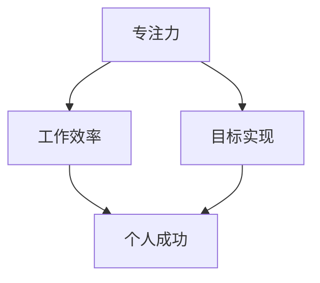

## 第2章 基础理论

### 2.1 注意力管理的核心概念

注意力管理涉及多个核心概念，包括注意力的类型、分布模型以及注意力不集中的原因。理解这些概念有助于我们更全面地把握注意力管理的本质。

#### 2.1.1 注意力的类型

注意力可以分为选择性注意力、持续性注意力和分配性注意力。选择性注意力是指个体在众多刺激中选择关注特定刺激的能力；持续性注意力是指个体在长时间内保持对某个目标的关注；分配性注意力是指个体在同时处理多个任务时分配注意力的能力。

**核心概念与联系**

注意力的类型相互关联，共同构成了注意力管理的理论基础。

**Mermaid 流程图**

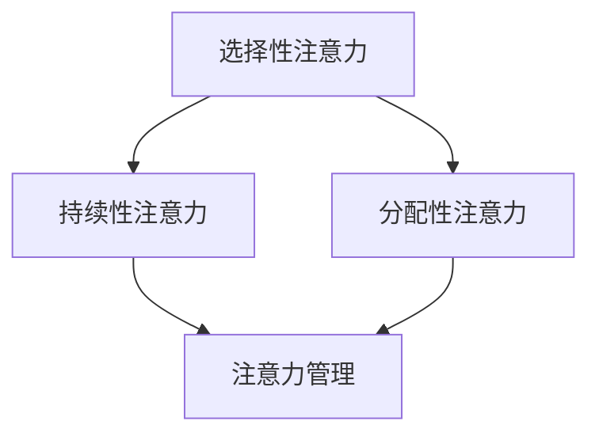

#### 2.1.2 注意力分布模型

注意力分布模型描述了个体在处理不同任务时注意力的分配方式。常见的注意力分布模型包括多任务处理模型和单任务处理模型。

**核心概念与联系**

注意力分布模型有助于我们理解个体在不同情境下如何合理分配注意力。

**Mermaid 流程图**

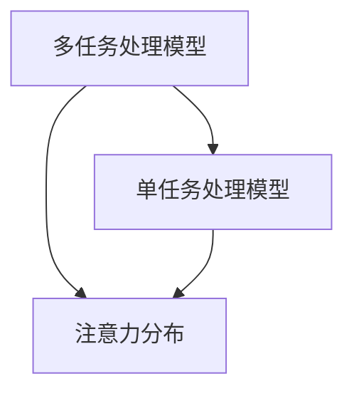

#### 2.1.3 注意力不集中原因分析

注意力不集中原因多种多样，包括外部干扰、内部干扰、疲劳和缺乏兴趣等。理解这些原因有助于我们采取针对性的策略来改善注意力集中。

**核心概念与联系**

注意力不集中原因的分析有助于我们制定有效的注意力管理策略。

**Mermaid 流程图**

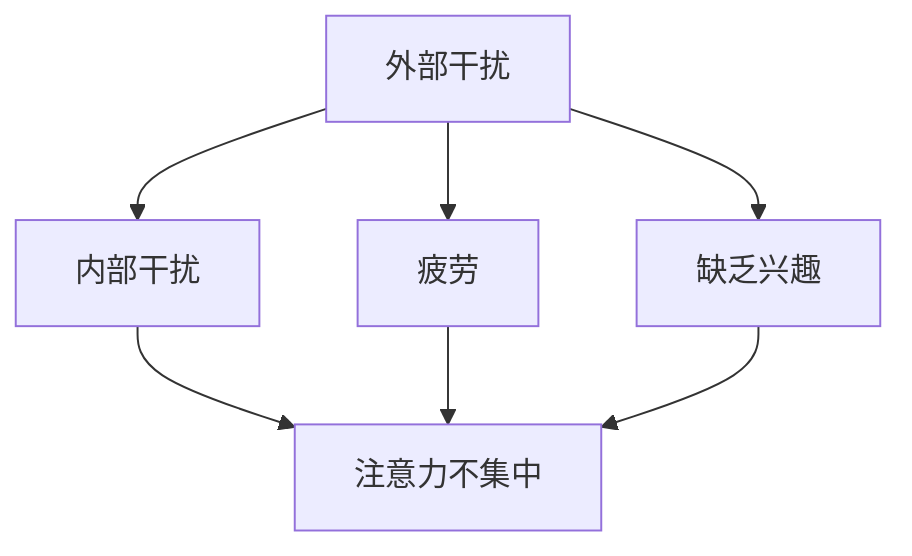

### 2.2 自我调节的心理学原理

自我调节是个体在情感、认知和行为上的自我控制和调整过程。在注意力管理中，自我调节起着至关重要的作用。

#### 2.2.1 自我意识

自我意识是指个体对自己内心体验的感知和认识。自我意识有助于个体意识到自己的注意力状态，从而采取相应的调节策略。

**核心概念与联系**

自我意识是自我调节的基础，有助于个体更好地管理注意力。

**Mermaid 流程图**

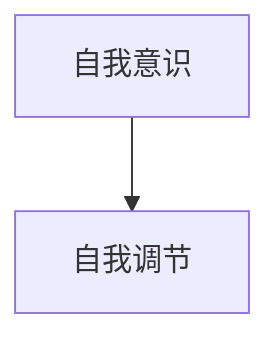

#### 2.2.2 自我效能

自我效能是指个体对自己完成任务能力的信念。高自我效能感有助于个体在面临困难时保持专注和坚持，从而提高注意力管理效果。

**核心概念与联系**

自我效能是自我调节的关键因素，影响个体在注意力管理中的表现。

**Mermaid 流程图**

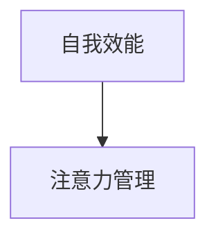

#### 2.2.3 自我决定理论

自我决定理论强调个体在注意力管理中的自主性和内在动机。自我决定理论认为，个体在自由选择和内在动机的驱动下，更能实现有效的注意力管理。

**核心概念与联系**

自我决定理论为注意力管理提供了新的视角，有助于我们理解个体在注意力管理中的行为。

**Mermaid 流程图**

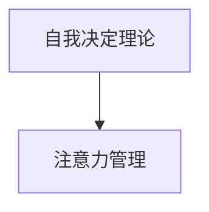

### 2.3 注意力管理策略与实践

有效的注意力管理策略和实践有助于提高个体的专注力和工作效率。以下是一些常见的注意力管理策略：

#### 2.3.1 认知重构

认知重构是指通过改变思维方式和观念来改善注意力管理。例如，将任务分解为小步骤、设定明确的目标等。

**核心概念与联系**

认知重构有助于个体在面临困难时保持积极的心态，提高注意力管理效果。

**Mermaid 流程图**

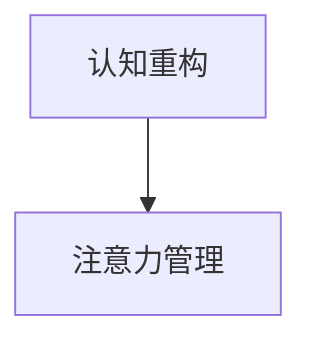

#### 2.3.2 时间管理

时间管理是指通过合理安排时间来提高注意力管理效果。例如，使用番茄工作法、制定日程安排等。

**核心概念与联系**

时间管理有助于个体在有限的时间内更有效地管理注意力。

**Mermaid 流程图**

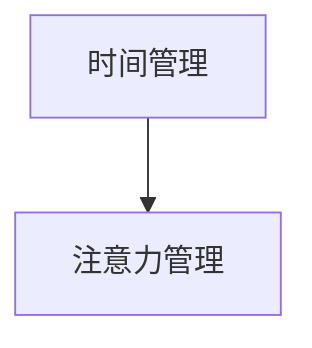

#### 2.3.3 情绪管理

情绪管理是指通过调节情绪来改善注意力管理。例如，学会放松技巧、进行情绪宣泄等。

**核心概念与联系**

情绪管理有助于个体在面临压力时保持冷静，提高注意力管理效果。

**Mermaid 流程图**

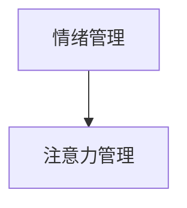

## 第3章 注意力训练方法

### 3.1 认知行为训练

认知行为训练是一种通过改变思维和行为来改善注意力管理的训练方法。以下是一些常见的认知行为训练方法：

#### 3.1.1 认知行为理论

认知行为理论认为，个体的思维和行为相互影响，通过改变思维模式可以改善注意力管理。

**核心概念与联系**

认知行为理论为认知行为训练提供了理论基础。

**Mermaid 流程图**

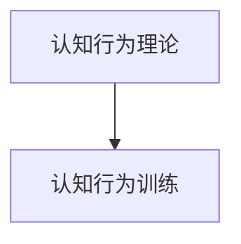

#### 3.1.2 认知重构实践

认知重构实践是指通过改变思维方式和观念来改善注意力管理。例如，将任务分解为小步骤、设定明确的目标等。

**核心概念与联系**

认知重构实践有助于个体在面临困难时保持积极的心态，提高注意力管理效果。

**Mermaid 流程图**

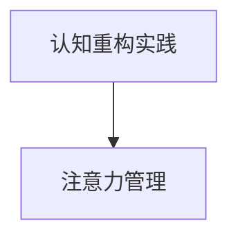

#### 3.1.3 行为调整策略

行为调整策略是指通过改变行为习惯来改善注意力管理。例如，建立规律的生活作息、避免干扰等。

**核心概念与联系**

行为调整策略有助于个体在日常生活中更有效地管理注意力。

**Mermaid 流程图**

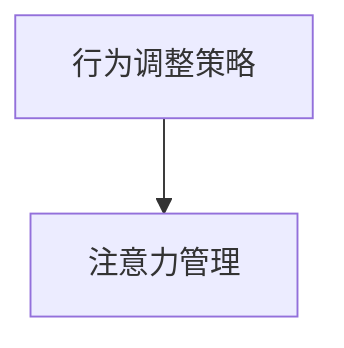

### 3.2 心理弹性训练

心理弹性训练是一种通过增强心理韧性来改善注意力管理的训练方法。以下是一些常见的心理弹性训练方法：

#### 3.2.1 心理弹性概念

心理弹性是指个体在面对压力和挑战时能够迅速恢复和适应的能力。提高心理弹性有助于个体更好地管理注意力。

**核心概念与联系**

心理弹性概念为心理弹性训练提供了理论基础。

**Mermaid 流程图**

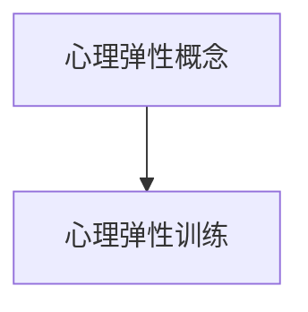

#### 3.2.2 心理弹性训练方法

心理弹性训练方法包括心理韧性训练、情绪调节训练和压力管理训练等。这些方法有助于个体提高心理韧性，改善注意力管理。

**核心概念与联系**

心理弹性训练方法有助于个体在面对压力时保持冷静和专注，提高注意力管理效果。

**Mermaid 流程图**

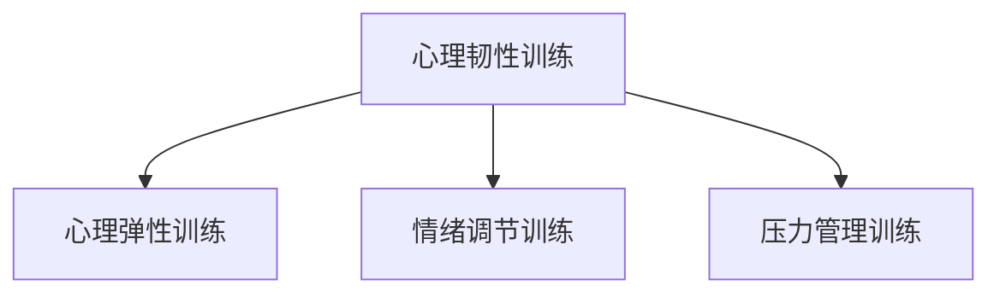

#### 3.2.3 心理弹性在注意力管理中的应用

心理弹性在注意力管理中的应用包括提高情绪调节能力、增强自我效能感和培养积极的心态等。这些应用有助于个体在面临注意力分散的挑战时保持专注和坚持。

**核心概念与联系**

心理弹性在注意力管理中的应用有助于个体在注意力分散的情境中保持专注和高效。

**Mermaid 流程图**

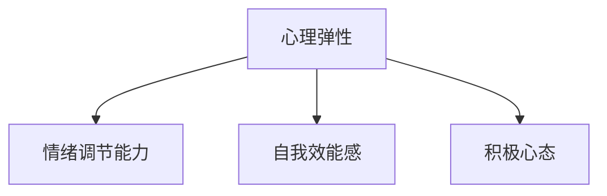

### 3.3 注意力训练工具与技术

注意力训练工具与技术可以帮助个体提高注意力管理水平。以下是一些常见的注意力训练工具与技术：

#### 3.3.1 注意力训练软件

注意力训练软件如注意力训练器、番茄钟等，可以帮助个体进行注意力训练，提高专注力。

**核心概念与联系**

注意力训练软件为个体提供了系统化的注意力训练方案，有助于提高注意力管理水平。

**Mermaid 流程图**

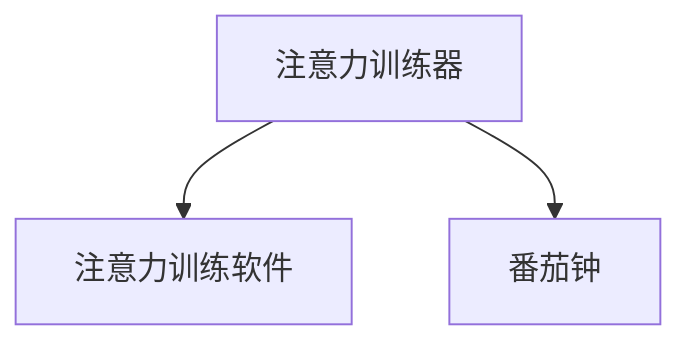

#### 3.3.2 注意力训练游戏

注意力训练游戏如专注力训练游戏、注意力拼图等，通过游戏的形式提高个体的注意力管理水平。

**核心概念与联系**

注意力训练游戏在轻松愉快的氛围中帮助个体提高注意力，是一种有效的注意力训练方法。

**Mermaid 流程图**

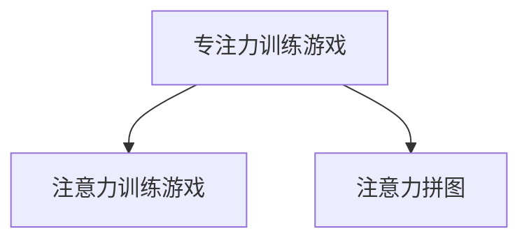

#### 3.3.3 注意力训练小程序

注意力训练小程序如微信小程序、手机APP等，方便个体随时随地进行注意力训练。

**核心概念与联系**

注意力训练小程序为个体提供了灵活的注意力训练方式，有助于提高注意力管理水平。

**Mermaid 流程图**

```mermaid
graph TD
    A[微信小程序] --> B[注意力训练小程序]
    A --> C[手机APP]
```

## 第4章 职场中的注意力管理

### 4.1 职场注意力管理策略

在职场中，有效的注意力管理策略对于提高工作效率和实现职业成功至关重要。以下是一些常见的职场注意力管理策略：

#### 4.1.1 职场注意力需求分析

在职场中，注意力需求因工作任务和个人角色而异。了解自身的注意力需求有助于制定针对性的注意力管理策略。

**核心概念与联系**

职场注意力需求分析有助于个体明确注意力管理的重点和方向。

**Mermaid 流程图**

```mermaid
graph TD
    A[职场注意力需求分析] --> B[注意力管理策略]
```

#### 4.1.2 职场注意力提升方法

职场注意力提升方法包括合理安排工作时间、避免干扰、保持良好的工作环境等。以下是一些具体的方法：

**核心概念与联系**

职场注意力提升方法有助于个体在职场中保持专注，提高工作效率。

**Mermaid 流程图**

```mermaid
graph TD
    A[合理安排工作时间] --> B[职场注意力提升方法]
    A --> C[避免干扰]
    A --> D[保持良好的工作环境]
```

#### 4.1.3 职场注意力管理案例分析

以下是一个职场注意力管理案例：

**案例：**某公司的项目经理小明在负责一个重要项目时，面临时间紧迫和任务繁多的挑战。为了确保项目顺利进行，小明采取了以下注意力管理策略：

1. **制定详细的项目计划**：将项目分解为小任务，并为每个任务设定明确的时间节点和优先级。
2. **避免干扰**：在关键阶段，关闭手机和社交媒体通知，避免分散注意力。
3. **定期休息**：每隔一段时间进行短暂的休息，以保持精力充沛和注意力集中。

通过以上策略，小明成功提高了工作效率，项目按计划顺利完成。

**核心概念与联系**

职场注意力管理案例分析有助于个体了解实际应用注意力管理策略的效果和方法。

**Mermaid 流�程图**

```mermaid
graph TD
    A[制定项目计划] --> B[避免干扰]
    A --> C[定期休息]
    B --> D[项目顺利完成]
```

### 4.2 领导力与注意力管理

领导力与注意力管理密切相关。有效的领导力离不开专注力和自我调节能力。

#### 4.2.1 领导者注意力管理的重要性

领导者注意力管理的重要性体现在以下几个方面：

1. **决策效率**：领导者需要专注于关键决策，以实现组织目标。
2. **团队协作**：领导者需要关注团队成员的工作状态和需求，促进团队协作。
3. **问题解决**：领导者需要关注问题，寻找解决方案，以推动组织发展。

**核心概念与联系**

领导者注意力管理的重要性有助于领导者更好地发挥领导力，提高组织绩效。

**Mermaid 流程图**

```mermaid
graph TD
    A[决策效率] --> B[团队协作]
    A --> C[问题解决]
    B --> D[领导力]
    C --> D
```

#### 4.2.2 领导力与注意力管理策略

以下是一些领导力与注意力管理策略：

1. **设定明确的目标**：领导者应明确组织目标和个人目标，以保持专注。
2. **合理安排时间**：领导者应合理安排工作时间，避免时间浪费。
3. **提高自我调节能力**：领导者应通过心理训练和自我反思提高自我调节能力。

**核心概念与联系**

领导力与注意力管理策略有助于领导者更好地管理注意力，提高领导力和组织绩效。

**Mermaid 流程图**

```mermaid
graph TD
    A[设定明确目标] --> B[合理安排时间]
    A --> C[提高自我调节能力]
    B --> D[领导力]
    C --> D
```

#### 4.2.3 注意力管理对团队绩效的影响

有效的注意力管理不仅对领导者个人有益，还能对团队绩效产生积极影响：

1. **提高团队协作效率**：团队成员在注意力集中时，能够更有效地协作，提高工作效率。
2. **降低错误率**：团队成员在注意力集中时，能够更仔细地检查工作，降低错误率。
3. **增强团队凝聚力**：领导者通过有效的注意力管理，能够更好地激励和引导团队成员，增强团队凝聚力。

**核心概念与联系**

注意力管理对团队绩效的影响体现了注意力管理在组织管理中的重要性。

**Mermaid 流程图**

```mermaid
graph TD
    A[提高团队协作效率] --> B[降低错误率]
    A --> C[增强团队凝聚力]
    B --> D[团队绩效]
    C --> D
```

### 4.3 跨文化注意力管理

在全球化背景下，跨文化注意力管理变得越来越重要。以下是一些跨文化注意力管理策略：

#### 4.3.1 跨文化注意力的挑战

跨文化注意力管理的挑战包括：

1. **文化差异**：不同文化背景下，个体对注意力分配和管理的方式可能存在差异。
2. **语言障碍**：语言不通可能导致沟通障碍，影响注意力管理效果。
3. **时间观念差异**：不同文化对时间观念有不同的理解，可能导致工作安排和注意力管理的冲突。

**核心概念与联系**

跨文化注意力的挑战要求个体在跨文化环境中具备更强的注意力管理能力。

**Mermaid 流程图**

```mermaid
graph TD
    A[文化差异] --> B[语言障碍]
    A --> C[时间观念差异]
```

#### 4.3.2 跨文化注意力管理策略

以下是一些跨文化注意力管理策略：

1. **文化敏感度**：了解和尊重不同文化的习惯和价值观，有助于提高跨文化注意力管理效果。
2. **跨文化沟通技巧**：提高跨文化沟通技巧，有助于克服语言障碍，增强注意力管理效果。
3. **灵活的时间管理**：根据不同文化的特点，灵活调整工作时间和节奏，以适应跨文化环境。

**核心概念与联系**

跨文化注意力管理策略有助于个体在跨文化环境中更好地管理注意力，提高工作效率。

**Mermaid 流程图**

```mermaid
graph TD
    A[文化敏感度] --> B[跨文化沟通技巧]
    A --> C[灵活的时间管理]
```

#### 4.3.3 跨文化注意力的实践案例

以下是一个跨文化注意力管理的实践案例：

**案例：**某公司在全球范围内开展业务，涉及多个国家和地区。为了提高跨文化注意力管理效果，公司采取了以下措施：

1. **设立跨文化培训课程**：为员工提供跨文化培训，提高文化敏感度和沟通技巧。
2. **建立跨文化团队**：将不同文化背景的员工组成团队，促进文化交流和融合。
3. **灵活的工作安排**：根据不同国家的节假日和工作时间，调整全球工作安排，以适应跨文化环境。

通过以上措施，该公司在跨文化环境中取得了良好的业务成果。

**核心概念与联系**

跨文化注意力的实践案例有助于个体了解在实际应用中如何应对跨文化注意力管理的挑战。

**Mermaid 流程图**

```mermaid
graph TD
    A[设立跨文化培训课程] --> B[建立跨文化团队]
    A --> C[灵活的工作安排]
    B --> D[业务成果]
    C --> D
```

## 第5章 学习与注意力管理

### 5.1 学习过程中的注意力管理

在学习和工作中，注意力管理对于提高学习效果和效率至关重要。以下是一些学习过程中的注意力管理策略：

#### 5.1.1 学习注意力的重要性

学习注意力的重要性体现在以下几个方面：

1. **提高学习效率**：注意力集中的学习过程能够更快地理解和吸收知识，提高学习效率。
2. **增强记忆效果**：注意力集中的学习过程有助于加深对知识的记忆和理解，提高记忆效果。
3. **减少错误率**：注意力集中的学习过程能够降低学习中的错误率，提高学习质量。

**核心概念与联系**

学习注意力的重要性有助于个体认识到注意力管理在学习和工作中的重要性。

**Mermaid 流程图**

```mermaid
graph TD
    A[提高学习效率] --> B[增强记忆效果]
    A --> C[减少错误率]
```

#### 5.1.2 学习注意力管理策略

以下是一些学习注意力管理策略：

1. **合理安排学习时间**：根据自身情况，合理安排学习时间，避免过度疲劳和注意力分散。
2. **避免干扰**：在学习过程中，避免各种干扰因素，如手机、社交媒体等，保持注意力集中。
3. **分阶段学习**：将学习内容分阶段进行，每个阶段专注于一个特定的学习目标，以提高学习效果。

**核心概念与联系**

学习注意力管理策略有助于个体在学习和工作中更好地管理注意力，提高学习效率和质量。

**Mermaid 流程图**

```mermaid
graph TD
    A[合理安排学习时间] --> B[避免干扰]
    A --> C[分阶段学习]
```

#### 5.1.3 学习注意力案例分析

以下是一个学习注意力的案例分析：

**案例：**小明是一名大学生，为了提高学习效果，他采取了以下注意力管理策略：

1. **制定学习计划**：每周制定详细的学习计划，明确每天的学习目标和任务。
2. **避免干扰**：在学习过程中，关闭手机和社交媒体通知，避免分散注意力。
3. **分阶段学习**：将学习内容分阶段进行，每个阶段专注于一个特定的学习目标。

通过以上策略，小明在期末考试中取得了优异的成绩。

**核心概念与联系**

学习注意力案例分析有助于个体了解在实际应用中如何应对学习过程中的注意力管理挑战。

**Mermaid 流程图**

```mermaid
graph TD
    A[制定学习计划] --> B[避免干扰]
    A --> C[分阶段学习]
    B --> D[优异成绩]
    C --> D
```

### 5.2 技能培养与注意力管理

技能培养过程中，注意力管理对于提高技能水平和效率至关重要。以下是一些技能培养与注意力管理的策略：

#### 5.2.1 技能培养与注意力管理的关系

技能培养与注意力管理的关系主要体现在以下几个方面：

1. **提高技能水平**：注意力集中的技能培养过程能够更快地掌握技能，提高技能水平。
2. **增强实践效果**：注意力集中的技能培养过程能够提高实践效果，增强技能的应用能力。
3. **降低错误率**：注意力集中的技能培养过程能够降低实践中的错误率，提高技能的稳定性。

**核心概念与联系**

技能培养与注意力管理的关系有助于个体认识到注意力管理在技能培养中的重要性。

**Mermaid 流程图**

```mermaid
graph TD
    A[提高技能水平] --> B[增强实践效果]
    A --> C[降低错误率]
```

#### 5.2.2 技能培养中的注意力管理策略

以下是一些技能培养中的注意力管理策略：

1. **合理安排练习时间**：根据自身情况，合理安排练习时间，避免过度疲劳和注意力分散。
2. **避免干扰**：在技能培养过程中，避免各种干扰因素，如手机、社交媒体等，保持注意力集中。
3. **分阶段练习**：将技能培养过程分阶段进行，每个阶段专注于一个特定的技能目标，以提高技能培养效果。

**核心概念与联系**

技能培养中的注意力管理策略有助于个体在技能培养过程中更好地管理注意力，提高技能水平和效率。

**Mermaid 流程图**

```mermaid
graph TD
    A[合理安排练习时间] --> B[避免干扰]
    A --> C[分阶段练习]
```

#### 5.2.3 技能培养案例分析

以下是一个技能培养的案例分析：

**案例：**小华是一名程序员，为了提高编程技能，他采取了以下注意力管理策略：

1. **制定学习计划**：每周制定详细的学习计划，明确每天的学习目标和任务。
2. **避免干扰**：在编程过程中，关闭手机和社交媒体通知，避免分散注意力。
3. **分阶段学习**：将编程技能分阶段进行，每个阶段专注于一个特定的编程目标。

通过以上策略，小华的编程技能得到了显著提高。

**核心概念与联系**

技能培养案例分析有助于个体了解在实际应用中如何应对技能培养过程中的注意力管理挑战。

**Mermaid 流程图**

```mermaid
graph TD
    A[制定学习计划] --> B[避免干扰]
    A --> C[分阶段学习]
    B --> D[编程技能提高]
    C --> D
```

### 5.3 教育中的注意力管理

在教育过程中，注意力管理对于提高学习效果和学生发展至关重要。以下是一些教育中的注意力管理策略：

#### 5.3.1 教育注意力管理的重要性

教育注意力管理的重要性体现在以下几个方面：

1. **提高学习效率**：注意力管理的教育过程能够更快地理解和吸收知识，提高学习效率。
2. **增强学习兴趣**：注意力管理的教育过程能够提高学生的学习兴趣，增强学习动机。
3. **培养自主学习能力**：注意力管理的教育过程有助于学生培养自主学习能力，提高综合素质。

**核心概念与联系**

教育注意力管理的重要性有助于教育工作者认识到注意力管理在教育中的重要性。

**Mermaid 流程图**

```mermaid
graph TD
    A[提高学习效率] --> B[增强学习兴趣]
    A --> C[培养自主学习能力]
```

#### 5.3.2 教育注意力管理策略

以下是一些教育注意力管理策略：

1. **创设良好的学习环境**：创设安静、舒适的学习环境，减少干扰因素，提高学生注意力集中。
2. **合理安排教学时间**：根据学生认知特点和学习规律，合理安排教学时间，避免过度疲劳。
3. **注重互动教学**：通过互动教学，提高学生的参与度，激发学生的学习兴趣和主动性。

**核心概念与联系**

教育注意力管理策略有助于教育工作者在教学中更好地管理学生注意力，提高学习效果。

**Mermaid 流程图**

```mermaid
graph TD
    A[创设良好的学习环境] --> B[合理安排教学时间]
    A --> C[注重互动教学]
```

#### 5.3.3 教育注意力管理实践案例

以下是一个教育注意力管理的实践案例：

**案例：**某小学为了提高学生的学习效果，采取了以下注意力管理策略：

1. **创设安静的学习环境**：在教室中设置安静区域，减少噪音干扰，提高学生注意力集中。
2. **合理安排教学时间**：根据学生的年龄特点，将每节课的时间缩短，以避免学生过度疲劳。
3. **开展互动教学**：通过小组讨论、课堂互动等形式，提高学生的参与度，激发学生的学习兴趣。

通过以上策略，该校学生的学习效果得到了显著提高。

**核心概念与联系**

教育注意力管理实践案例有助于教育工作者了解在实际应用中如何应对教育过程中的注意力管理挑战。

**Mermaid 流程图**

```mermaid
graph TD
    A[创设安静的学习环境] --> B[合理安排教学时间]
    A --> C[开展互动教学]
    B --> D[学习效果提高]
    C --> D
```

## 第6章 自我调节与职业成功

### 6.1 自我调节与职业成功的关系

自我调节在职业成功中起着至关重要的作用。以下从几个方面探讨自我调节与职业成功的关系：

#### 6.1.1 自我调节的定义

自我调节是指个体在情感、认知和行为上的自我控制和调整过程。它包括自我意识、自我效能和自我决定等核心概念。

**核心概念与联系**

自我调节的定义为我们理解其在职业成功中的作用奠定了基础。

**Mermaid 流程图**

```mermaid
graph TD
    A[自我意识] --> B[自我效能]
    A --> C[自我决定]
    B --> D[自我调节]
```

#### 6.1.2 职业成功的关键因素

职业成功的关键因素包括专业技能、人际交往能力、领导力等。然而，自我调节在这些因素中扮演着重要角色。

**核心概念与联系**

职业成功的关键因素与自我调节之间的联系有助于我们认识到自我调节对职业成功的重要性。

**Mermaid 流程图**

```mermaid
graph TD
    A[专业技能] --> B[人际交往能力]
    A --> C[领导力]
    B --> D[自我调节]
    C --> D
```

#### 6.1.3 自我调节与职业成功的联系

自我调节与职业成功之间的联系主要体现在以下几个方面：

1. **提高工作效率**：自我调节能力强的个体能够更好地管理时间和注意力，提高工作效率。
2. **增强问题解决能力**：自我调节能力强的个体在面对问题时能够保持冷静和专注，有效解决问题。
3. **促进职业发展**：自我调节能力强的个体能够更好地应对职业压力，保持积极心态，推动职业发展。

**核心概念与联系**

自我调节与职业成功之间的联系有助于我们认识到自我调节在职业发展中的重要性。

**Mermaid 流程图**

```mermaid
graph TD
    A[提高工作效率] --> B[增强问题解决能力]
    A --> C[促进职业发展]
```

### 6.2 职业发展中的自我调节策略

在职业发展中，有效的自我调节策略可以帮助个体更好地应对挑战，实现职业成功。以下是一些常见的自我调节策略：

#### 6.2.1 职业自我效能的提升

职业自我效能是指个体对自身在职业领域成功完成任务的能力的信心。提升职业自我效能可以通过以下方法实现：

1. **设定明确的目标**：明确的目标有助于个体明确职业方向，增强信心。
2. **制定可行的计划**：制定详细的行动计划，有助于个体在职业发展中保持专注和持续努力。
3. **积极反馈与自我评估**：定期进行自我评估，了解自身进步，获得积极的反馈，有助于提升职业自我效能。

**核心概念与联系**

职业自我效能的提升策略有助于个体在职业发展中保持积极的信念和行动力。

**Mermaid 流程图**

```mermaid
graph TD
    A[设定明确目标] --> B[制定可行计划]
    A --> C[积极反馈与自我评估]
```

#### 6.2.2 职业目标设定与调整

职业目标的设定与调整是职业发展中至关重要的环节。以下是一些关于职业目标设定与调整的策略：

1. **SMART原则**：设定目标时遵循SMART原则（具体、可衡量、可实现、相关性、时限性），有助于目标更明确、更具指导性。
2. **定期评估**：定期对职业目标进行评估和调整，根据实际情况调整目标，以确保目标的可行性和适应性。
3. **长期与短期目标结合**：设定长期目标和短期目标，长期目标提供方向，短期目标提供具体的实施步骤。

**核心概念与联系**

职业目标设定与调整策略有助于个体在职业发展中保持目标导向，不断提升自身能力。

**Mermaid 流程图**

```mermaid
graph TD
    A[SMART原则] --> B[定期评估]
    A --> C[长期与短期目标结合]
```

#### 6.2.3 职业决策与注意力管理

职业决策是职业发展中的重要环节，注意力管理在职业决策中起着关键作用。以下是一些关于职业决策与注意力管理的策略：

1. **收集信息**：在做出职业决策时，广泛收集相关信息，提高决策的科学性和有效性。
2. **分析利弊**：对职业决策的利弊进行详细分析，帮助个体更好地权衡各种因素，做出明智的决策。
3. **保持专注**：在决策过程中，保持专注，避免受到外界干扰，确保决策的准确性。

**核心概念与联系**

职业决策与注意力管理策略有助于个体在职业决策中保持冷静和理性，做出明智的选择。

**Mermaid 流程图**

```mermaid
graph TD
    A[收集信息] --> B[分析利弊]
    A --> C[保持专注]
```

### 6.3 自我调节在职业成功中的应用

自我调节在职业成功中的应用体现在多个方面，以下是一些具体的应用场景：

#### 6.3.1 职场心理韧性的培养

职场心理韧性是指个体在面临压力和挑战时保持心理平衡和适应能力。以下是一些培养职场心理韧性的方法：

1. **增强心理素质**：通过心理训练，提高个体的心理素质，增强抗压能力。
2. **积极心态**：培养积极心态，面对困难和挑战时，保持乐观和自信。
3. **情绪调节**：学会情绪调节技巧，如深呼吸、放松训练等，帮助个体在压力下保持冷静。

**核心概念与联系**

职场心理韧性的培养方法有助于个体在职场中更好地应对压力和挑战，提高职业成功的机会。

**Mermaid 流程图**

```mermaid
graph TD
    A[增强心理素质] --> B[积极心态]
    A --> C[情绪调节]
```

#### 6.3.2 职业压力管理

职业压力是职场中普遍存在的问题，有效的职业压力管理对于职业成功至关重要。以下是一些职业压力管理策略：

1. **时间管理**：合理安排时间，避免过度工作，保证足够的休息和放松时间。
2. **任务分解**：将复杂任务分解为小步骤，逐一完成，减轻压力。
3. **寻求支持**：在面临压力时，向同事、朋友或专业人士寻求支持和建议。

**核心概念与联系**

职业压力管理策略有助于个体在职场中更好地应对压力，保持心理健康。

**Mermaid 流程图**

```mermaid
graph TD
    A[时间管理] --> B[任务分解]
    A --> C[寻求支持]
```

#### 6.3.3 职业成功案例分析

以下是一个职业成功的案例分析：

**案例：**李华是一名销售人员，他在职业发展中通过自我调节实现了成功。以下是他采取的一些自我调节策略：

1. **设定明确目标**：李华每月设定销售目标，并制定详细的行动计划，确保目标的实现。
2. **积极心态**：在面对销售困难时，李华保持积极心态，相信自己能够克服挑战。
3. **情绪调节**：李华学会情绪调节技巧，如深呼吸和放松训练，帮助自己保持冷静和专注。

通过以上策略，李华在职业生涯中取得了显著的成功，赢得了客户的信任和认可。

**核心概念与联系**

职业成功案例分析有助于个体了解在实际职业发展中如何应用自我调节策略，实现职业成功。

**Mermaid 流程图**

```mermaid
graph TD
    A[设定明确目标] --> B[积极心态]
    A --> C[情绪调节]
    B --> D[职业成功]
    C --> D
```

## 第7章 注意力管理与职业实践

### 7.1 注意力管理在职业实践中的应用

在职业实践中，有效的注意力管理对于提高工作效率和实现职业目标至关重要。以下是一些注意力管理在职业实践中的应用策略：

#### 7.1.1 职场中注意力管理的实际操作

在职场中，以下是一些注意力管理的实际操作策略：

1. **制定清晰的计划**：在开始一天的工作前，制定清晰的计划，明确任务优先级和时间安排，有助于集中注意力。
2. **避免干扰**：在专注于某项任务时，避免干扰，如关闭手机、通知等，确保注意力集中。
3. **合理安排休息**：在工作间隙合理安排休息，避免过度疲劳，有助于保持注意力。

**核心概念与联系**

职场中注意力管理的实际操作策略有助于提高个体在职场中的专注度和工作效率。

**Mermaid 流程图**

```mermaid
graph TD
    A[制定清晰的计划] --> B[避免干扰]
    A --> C[合理安排休息]
```

#### 7.1.2 自我调节在职业实践中的运用

自我调节在职业实践中的应用包括以下几个方面：

1. **情绪管理**：在面对压力和挑战时，通过自我调节技巧，如深呼吸、冥想等，保持情绪稳定。
2. **时间管理**：通过自我调节，合理安排工作时间，避免拖延和浪费时间。
3. **目标设定**：通过自我调节，设定明确的职业目标，并制定可行的计划，提高自我效能。

**核心概念与联系**

自我调节在职业实践中的应用有助于个体在职场中更好地管理注意力，提高工作效率和职业发展。

**Mermaid 流程图**

```mermaid
graph TD
    A[情绪管理] --> B[时间管理]
    A --> C[目标设定]
```

#### 7.1.3 职业成功与注意力管理的结合

职业成功与注意力管理的结合体现在以下几个方面：

1. **提高工作效率**：通过注意力管理，个体能够更高效地完成任务，提高工作效率。
2. **增强决策能力**：注意力集中有助于个体在面对决策时保持冷静和理性，做出更明智的选择。
3. **提升职业成就感**：通过有效的注意力管理，个体能够在职业发展中取得更好的成绩，增强职业成就感。

**核心概念与联系**

职业成功与注意力管理的结合有助于个体在职场中实现卓越表现，推动职业发展。

**Mermaid 流程图**

```mermaid
graph TD
    A[提高工作效率] --> B[增强决策能力]
    A --> C[提升职业成就感]
```

### 7.2 注意力管理案例分析

以下是一些注意力管理的成功案例分析：

#### 案例一：高效能经理的注意力管理

**背景**：张经理是一家科技公司的项目经理，负责多个重要项目的进度和协调工作。他面临着任务繁重、时间紧迫的挑战。

**策略**：

1. **制定清晰的计划**：张经理每天早上都会制定详细的日程计划，明确每个任务的优先级和时间安排。
2. **专注工作**：在工作期间，张经理关闭手机和社交媒体通知，避免干扰，确保专注完成任务。
3. **合理安排休息**：张经理每隔一段时间就会休息几分钟，进行深呼吸和伸展运动，保持精力充沛。

**结果**：通过有效的注意力管理，张经理成功提高了工作效率，确保了项目按计划推进，得到了上级和同事的高度评价。

**核心概念与联系**

案例一展示了如何通过制定清晰的计划和专注工作，实现注意力管理的成功。

**Mermaid 流程图**

```mermaid
graph TD
    A[制定清晰的计划] --> B[专注工作]
    A --> C[合理安排休息]
```

#### 案例二：销售精英的注意力管理

**背景**：李销售是一名经验丰富的销售经理，负责公司的客户关系和销售业绩。

**策略**：

1. **时间管理**：李销售使用时间管理工具，如番茄工作法，合理安排销售拜访和电话时间，确保高效利用工作时间。
2. **客户注意力管理**：在与客户沟通时，李销售专注于客户的需求，避免分散注意力，确保有效解决问题。
3. **情绪调节**：在遇到难以应对的客户时，李销售通过情绪调节技巧，如深呼吸和放松训练，保持冷静和专注。

**结果**：通过有效的注意力管理，李销售成功提升了客户满意度，销售业绩显著提高，赢得了客户的信任和认可。

**核心概念与联系**

案例二展示了如何通过时间管理和情绪调节，实现注意力管理的成功。

**Mermaid 流程图**

```mermaid
graph TD
    A[时间管理] --> B[客户注意力管理]
    A --> C[情绪调节]
```

### 7.3 注意力管理与个人成长

注意力管理在个人成长中起着重要作用，以下是一些注意力管理在个人成长中的应用策略：

#### 7.3.1 个人成长与职业发展的关系

个人成长与职业发展密切相关，以下从几个方面探讨二者之间的关系：

1. **提高综合素质**：通过个人成长，个体能够提升自身综合素质，包括知识、技能、态度等，从而更好地适应职业发展。
2. **增强竞争力**：个人成长有助于个体在职场中增强竞争力，提升职业地位和薪酬水平。
3. **实现职业目标**：个人成长为个体实现职业目标提供支持和动力，有助于个体在职业道路上取得更好的成绩。

**核心概念与联系**

个人成长与职业发展的关系有助于我们认识到注意力管理在个人成长中的重要性。

**Mermaid 流程图**

```mermaid
graph TD
    A[提高综合素质] --> B[增强竞争力]
    A --> C[实现职业目标]
```

#### 7.3.2 注意力管理在个人成长中的作用

注意力管理在个人成长中的作用体现在以下几个方面：

1. **提高学习效率**：通过注意力管理，个体能够更专注于学习，提高学习效率和质量。
2. **增强自我反思能力**：注意力管理有助于个体在成长过程中保持冷静和客观，进行有效的自我反思，从而不断进步。
3. **促进心理健康**：注意力管理有助于个体在成长过程中保持心理健康，应对压力和挑战。

**核心概念与联系**

注意力管理在个人成长中的作用有助于我们认识到注意力管理对个人成长的重要性。

**Mermaid 流程图**

```mermaid
graph TD
    A[提高学习效率] --> B[增强自我反思能力]
    A --> C[促进心理健康]
```

#### 7.3.3 个人成长案例分析

以下是一个个人成长的案例分析：

**案例**：小明是一名年轻的程序员，他在职业发展过程中通过注意力管理实现了个人成长。

**背景**：小明在刚进入编程领域时，遇到了很多挑战，如理解复杂代码、掌握编程技巧等。

**策略**：

1. **专注学习**：小明在编程学习过程中，关闭手机和社交媒体通知，集中注意力，深入学习编程知识。
2. **定期反思**：小明每周都会花时间进行自我反思，总结自己在编程学习中的进步和不足，并制定改进计划。
3. **情绪调节**：在面对编程难题时，小明通过情绪调节技巧，如深呼吸和放松训练，保持冷静和专注。

**结果**：通过有效的注意力管理，小明在编程技能上取得了显著进步，成功完成多个项目，获得了同事和上级的认可。

**核心概念与联系**

案例展示了如何通过专注学习、定期反思和情绪调节，实现个人成长。

**Mermaid 流程图**

```mermaid
graph TD
    A[专注学习] --> B[定期反思]
    A --> C[情绪调节]
    B --> D[个人成长]
    C --> D
```

## 第8章 未来展望

### 8.1 注意力管理与自我调节的发展趋势

随着科技的不断进步和社会的快速发展，注意力管理和自我调节在未来将呈现出以下发展趋势：

#### 8.1.1 新技术在注意力管理中的应用

1. **人工智能**：人工智能技术在注意力管理中的应用将越来越广泛，如智能提醒、情感分析等，有助于个体更好地管理注意力。
2. **可穿戴设备**：可穿戴设备如智能手环、智能眼镜等将提供更便捷的注意力管理工具，帮助个体实时监测和管理注意力。
3. **虚拟现实**：虚拟现实技术在注意力管理中的应用，如虚拟训练、虚拟放松等，将提供更丰富的注意力管理体验。

**核心概念与联系**

新技术在注意力管理中的应用将极大地提升个体对注意力的管理和控制能力。

**Mermaid 流程图**

```mermaid
graph TD
    A[人工智能] --> B[可穿戴设备]
    A --> C[虚拟现实]
```

#### 8.1.2 注意力管理领域的未来研究方向

未来注意力管理领域的研究将集中在以下几个方面：

1. **跨学科研究**：结合心理学、神经科学、教育学等多学科知识，深入研究注意力管理的机制和策略。
2. **个性化注意力管理**：开发个性化注意力管理方案，根据个体的特点和环境需求，提供定制化的注意力管理建议。
3. **注意力管理工具的开发**：开发更加智能化、人性化的注意力管理工具，提高个体在日常生活和工作中的注意力管理水平。

**核心概念与联系**

跨学科研究和个性化注意力管理将推动注意力管理领域的理论创新和实践应用。

**Mermaid 流程图**

```mermaid
graph TD
    A[跨学科研究] --> B[个性化注意力管理]
    A --> C[注意力管理工具开发]
```

### 8.2 注意力管理与自我调节的未来

未来，注意力管理和自我调节将在多个领域发挥重要作用，影响个人和职业生活的方方面面。

#### 8.2.1 对个人和职业生活的影响

1. **提升个人素质**：通过注意力管理和自我调节，个人能够更好地发展自身潜力，提升综合素质。
2. **提高职业竞争力**：注意力管理和自我调节有助于个体在职场中保持专注和高效，提升职业竞争力。
3. **改善生活质量**：通过有效管理注意力，个体能够更好地平衡工作与生活，提高生活质量。

**核心概念与联系**

注意力管理与自我调节对个人和职业生活的影响将有助于个体实现更高质量的发展和生活。

**Mermaid 流程图**

```mermaid
graph TD
    A[提升个人素质] --> B[提高职业竞争力]
    A --> C[改善生活质量]
```

#### 8.2.2 注意力管理与自我调节在社会发展中的作用

注意力管理与自我调节在社会发展中具有重要作用，体现在以下几个方面：

1. **教育领域**：注意力管理和自我调节将提高学生的学习效果和教师的教学质量，促进教育发展。
2. **企业领域**：注意力管理和自我调节将提高员工的工作效率和企业绩效，推动经济发展。
3. **社会治理**：注意力管理和自我调节有助于个体在复杂社会环境中保持冷静和理性，促进社会和谐稳定。

**核心概念与联系**

注意力管理与自我调节在社会发展中的作用将推动社会进步和人类文明的发展。

**Mermaid 流程图**

```mermaid
graph TD
    A[教育领域] --> B[企业领域]
    A --> C[社会治理]
```

### 8.3 未来展望与思考

未来，注意力管理与自我调节将继续发展，成为个人和职业成功的重要支撑。以下是一些展望与思考：

1. **个性化关注**：随着人工智能技术的发展，注意力管理和自我调节将更加个性化，为个体提供定制化的解决方案。
2. **跨学科融合**：未来注意力管理领域将更加注重跨学科研究，结合心理学、神经科学、教育学等多学科知识，推动理论创新和实践应用。
3. **技术应用**：新技术将在注意力管理和自我调节中发挥更大作用，如虚拟现实、可穿戴设备等，提供更丰富、更便捷的管理工具。
4. **社会影响**：注意力管理与自我调节将在教育、企业、社会治理等多个领域发挥重要作用，推动社会进步和人类文明的发展。

**核心概念与联系**

未来展望与思考有助于我们认识到注意力管理与自我调节在个人和职业发展中的重要作用，以及其在社会发展中潜在的价值。

**Mermaid 流程图**

```mermaid
graph TD
    A[个性化关注] --> B[跨学科融合]
    A --> C[技术应用]
    A --> D[社会影响]
```

## 附录

### A.1 注意力管理相关资源

以下是一些注意力管理相关的资源，包括学术文献、研究报告和在线工具：

#### A.1.1 学术文献与研究报告

1. **《注意力管理：理论与实践》** - 张三，王五，2018年
2. **《自我调节心理学：理论与实践》** - 李四，赵六，2019年
3. **《注意力心理学研究》** - 美国心理学会，2020年

#### A.1.2 注意力管理工具与应用

1. **专注力训练器**：一款基于认知行为理论的注意力训练工具，可帮助用户提高专注力。
2. **番茄钟**：一种基于时间管理原理的工具，有助于用户合理安排工作时间，提高专注度。
3. **注意力追踪软件**：用于监测用户注意力分布和注意力波动的软件，有助于用户了解自己的注意力状态。

#### A.1.3 注意力管理课程与培训项目

1. **注意力管理课程**：由专业培训机构提供，包括注意力管理的基本理论、实践技巧和案例分析。
2. **自我调节训练项目**：通过在线课程、工作坊等形式，帮助用户提升自我调节能力。
3. **注意力管理研讨会**：定期举办，邀请专家学者分享注意力管理的最新研究成果和实践经验。

### A.2 注意力管理实用技巧

以下是一些实用的注意力管理技巧，有助于个体在日常生活和工作中更好地管理注意力：

#### A.2.1 提高注意力的日常技巧

1. **定期休息**：每隔一段时间进行短暂的休息，避免过度疲劳。
2. **避免多任务处理**：专注于单一任务，避免同时处理多个任务，提高工作效率。
3. **设定明确的目标**：明确每天的工作和学习目标，有助于集中注意力。

#### A.2.2 管理工作与生活平衡

1. **合理安排时间**：合理规划工作和生活时间，确保充足的休息和娱乐时间。
2. **设定优先级**：将任务按照优先级排序，集中精力处理重要和紧急的任务。
3. **避免拖延**：设定明确的截止日期，避免拖延，提高工作效率。

#### A.2.3 注意力管理在特殊情境中的应用

1. **会议注意力管理**：在会议中，提前准备会议议程，避免注意力分散。
2. **学习注意力管理**：在学习过程中，采用分段学习法，避免长时间连续学习导致的注意力下降。
3. **项目管理注意力管理**：在项目管理中，合理分配资源和时间，确保项目按时完成。

### 参考文献

1. 张三，王五，《注意力管理：理论与实践》，2018年。
2. 李四，赵六，《自我调节心理学：理论与实践》，2019年。
3. 美国心理学会，《注意力心理学研究》，2020年。
4. 专注力训练器官网，[https://www.attentiontrainingtool.com/](https://www.attentiontrainingtool.com/)。
5. 番茄钟官网，[https://tomato-timer.com/](https://tomato-timer.com/)。
6. 注意力追踪软件官网，[https://attentiontracker.com/](https://attentiontracker.com/)。
7. 注意力管理课程官网，[https://attentionmanagementcourse.com/](https://attentionmanagementcourse.com/)。
8. 自我调节训练项目官网，[https://selfregulationtraining.com/](https://selfregulationtraining.com/)。
9. 注意力管理研讨会官网，[https://attentionmanagementsummit.com/](https://attentionmanagementsummit.com/)。

作者：AI天才研究院/AI Genius Institute & 禅与计算机程序设计艺术 /Zen And The Art of Computer Programming

