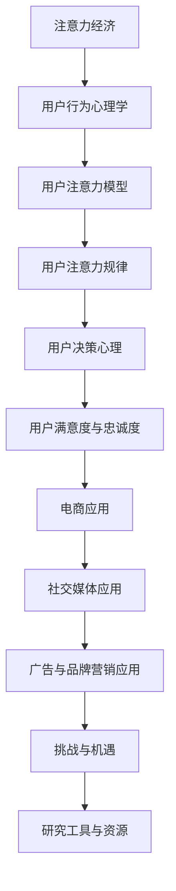

                 

### 文章标题

《注意力经济与用户行为心理学：了解受众的内心世界》

### 关键词

注意力经济、用户行为心理学、用户注意力模型、用户决策心理、用户满意度与忠诚度、电商平台、社交媒体、广告与品牌营销

### 摘要

本文深入探讨了注意力经济与用户行为心理学的核心概念和联系，通过系统阐述用户注意力模型、用户决策心理、用户满意度与忠诚度等关键要素，揭示了用户在数字时代的行为规律和心理机制。文章结合实际案例，详细分析了注意力经济在电商、社交媒体和广告与品牌营销中的应用，探讨了其面临的挑战与未来机遇。最后，提供了研究工具与资源指南，为读者深入了解和运用注意力经济与用户行为心理学提供了实用的参考。

----------------------------------------------------------------

### 第一部分：注意力经济与用户行为心理学概述

#### 第1章：注意力经济背景与用户行为心理学基础

注意力经济，作为一种新型的经济模式，强调的是注意力作为生产要素的重要性。在互联网时代，用户的注意力成为了一种稀缺资源，企业如何吸引和维持用户的注意力，成为了市场竞争的关键。而用户行为心理学，则为我们提供了理解用户行为和决策的深层心理机制，帮助企业在产品设计和市场策略中更加精准地满足用户需求。

##### 1.1 注意力经济的起源与概念

注意力经济最早可以追溯到2004年，美国学者Sherry Turkle在其著作《旁观者的王国》中提出。她指出，在数字化世界中，用户的注意力成为了一种商品，企业通过内容、广告和其他形式来争夺用户的注意力。注意力经济的基本概念在于，将用户的注意力视为一种可以交易和测量的资源，类似于时间或金钱。

与传统经济模式相比，注意力经济具有以下特点：

- **稀缺性**：用户的注意力是有限的，企业必须竞争以获取更多的注意力。
- **易逝性**：用户注意力不易保持，需要不断地通过创新和吸引来维持。
- **无形性**：注意力本身是无形的，其价值取决于用户的体验和感受。

##### 1.2 用户行为心理学概述

用户行为心理学是研究用户在数字环境中如何做出决策、如何与产品互动的学科。它结合了认知心理学、社会心理学和营销心理学等多个领域，旨在理解用户的思维过程、情感反应和行为模式。

- **认知心理学**：研究用户的感知、记忆、思维和信息处理过程。
- **社会心理学**：研究用户在社会环境中的行为，如群体影响、社会认同和口碑效应。
- **营销心理学**：研究用户如何感知和评价产品，以及如何做出购买决策。

##### 1.3 注意力经济与用户行为心理学的联系

注意力经济与用户行为心理学之间存在着紧密的联系。注意力经济强调用户注意力的重要性，而用户行为心理学则为我们提供了理解用户如何分配和转移注意力的理论框架。以下是一些具体的联系点：

- **注意力获取与用户行为**：企业通过内容、广告和互动设计来获取用户注意力，而用户行为心理学则帮助我们理解这些策略的有效性。
- **注意力维持与用户忠诚度**：企业需要通过持续的创新和优质体验来维持用户的注意力，用户行为心理学研究则提供了如何实现这一目标的科学方法。
- **注意力经济与市场策略**：基于用户行为心理学的洞察，企业可以制定更加精准的市场策略，提高品牌认知度和用户满意度。

##### 1.4 注意力经济在市场策略中的应用

注意力经济对市场策略的影响体现在多个方面：

- **用户注意力策略的制定**：企业需要明确目标用户的注意力需求，制定针对性的策略来吸引用户。
- **基于注意力心理学的广告策略**：广告设计需要考虑到用户的注意力规律，使用吸引眼球的元素和故事性内容。
- **注意力经济对品牌营销的影响**：品牌营销活动需要关注用户注意力分配的规律，以提高品牌曝光度和用户参与度。

通过以上分析，我们可以看到，注意力经济与用户行为心理学不仅密切相关，而且在实际应用中具有巨大的潜力。下一章我们将进一步探讨用户注意力模型的基本原理和应用。

---

#### 第2章：用户注意力模型

用户注意力模型是理解用户行为和心理机制的重要工具。它帮助我们揭示用户如何感知、选择和分配注意力，进而影响用户的决策和体验。本章将介绍用户注意力模型的基本原理、注意力规律以及其在产品设计和市场推广中的应用。

##### 2.1 用户注意力模型的基本原理

用户注意力模型的核心在于理解注意力的分配机制。它包含以下几个关键要素：

- **感知与注意力的关系**：用户的感知决定了他们对外界信息的接受程度。注意力是感知的选择性结果，用户只能注意到部分信息。

  ```latex
  感知 -> 注意力分配 -> 信息处理
  ```

- **认知注意力与执行注意力的区别**：认知注意力负责处理信息，而执行注意力则控制行为。两者相互协作，共同决定用户的行为。

  ```latex
  认知注意力 -> 信息处理
  执行注意力 -> 行为控制
  ```

- **注意力模型的研究方法**：研究用户注意力模型的方法包括实验法、问卷法和数据分析等。这些方法帮助我们量化用户注意力的分配和转移。

  ```mermaid
  graph TD
  A[实验法] --> B[问卷法]
  B --> C[数据分析]
  ```

##### 2.2 用户注意力规律

用户注意力的规律揭示了用户如何在不同情境下分配注意力。以下是一些关键规律：

- **用户的注意力分布**：用户在不同时间段和情境下的注意力分布不同。例如，工作日和周末的注意力分布可能存在显著差异。

  ```mermaid
  graph TD
  A[工作日] --> B[高注意力]
  B --> C[周末] --> D[低注意力]
  ```

- **用户注意力转移的规律**：用户注意力可以转移，但转移过程可能受到干扰。例如，多任务处理时，注意力转移效率可能降低。

  ```mermaid
  graph TD
  A[任务A] --> B[注意力转移]
  B --> C[任务B]
  ```

- **注意力与用户满意度之间的关系**：用户在任务中投入更多注意力，通常满意度更高。注意力分散可能导致用户满意度下降。

  ```mermaid
  graph TD
  A[高注意力] --> B[高满意度]
  B --> C[低注意力] --> D[低满意度]
  ```

##### 2.3 用户注意力模型在产品设计和市场推广中的应用

用户注意力模型在产品设计和市场推广中具有重要作用。以下是一些应用场景：

- **产品界面设计**：设计吸引用户注意的界面，使用视觉元素和动态效果引导用户。

  ```mermaid
  graph TD
  A[视觉元素] --> B[动态效果]
  B --> C[用户界面]
  ```

- **市场推广策略**：制定吸引注意力的广告和营销策略，提高品牌曝光度和用户参与度。

  ```mermaid
  graph TD
  A[广告创意] --> B[社交媒体推广]
  B --> C[内容营销]
  ```

- **案例研究**：分析注意力模型在电商产品中的应用，评估其效果。

  ```mermaid
  graph TD
  A[案例背景] --> B[应用实践]
  B --> C[效果评估]
  ```

通过用户注意力模型的应用，企业可以更加精准地吸引和维护用户注意力，提高产品满意度和用户忠诚度。

---

#### 第3章：用户行为心理学研究方法

用户行为心理学研究是理解用户行为和决策的关键。本章将介绍用户行为心理学研究的重要性、常见研究方法以及用户行为数据的收集与分析方法。

##### 3.1 用户行为心理学研究的重要性

用户行为心理学研究的重要性体现在以下几个方面：

- **指导产品设计与开发**：通过研究用户行为，了解用户需求和使用习惯，为企业提供产品改进的依据。
- **优化市场策略**：了解用户行为模式，可以帮助企业制定更加精准和有效的市场策略。
- **提高用户满意度**：通过研究用户行为，企业可以提供更加符合用户期望的产品和服务，提高用户满意度。

##### 3.2 用户行为心理学研究的常见方法

用户行为心理学研究的方法包括：

- **问卷调查法**：通过设计问卷，收集用户对产品或服务的态度和评价。问卷调查法适用于大规模数据收集。

  ```mermaid
  graph TD
  A[设计问卷] --> B[数据收集]
  B --> C[数据分析]
  ```

- **实验研究法**：通过控制实验条件，研究用户行为的变化。实验研究法适用于研究因果关系。

  ```mermaid
  graph TD
  A[实验设计] --> B[实验操作]
  B --> C[数据收集]
  ```

- **观察法**：在自然或控制环境下观察用户行为，记录和分析行为数据。观察法适用于研究日常行为模式。

  ```mermaid
  graph TD
  A[自然观察] --> B[控制观察]
  B --> C[数据记录]
  ```

##### 3.3 用户行为数据的收集与分析

用户行为数据的收集与分析是用户行为心理学研究的重要环节。以下是一些关键步骤：

- **数据来源**：用户行为数据可以来源于网络日志、用户调查、实地观察等。

  ```mermaid
  graph TD
  A[网络日志] --> B[用户调查]
  B --> C[实地观察]
  ```

- **数据分析方法**：常用的数据分析方法包括描述性统计分析、探索性数据分析和预测性数据分析。

  ```mermaid
  graph TD
  A[描述性统计] --> B[探索性分析]
  B --> C[预测性分析]
  ```

- **数据工具**：常用的数据分析工具包括SPSS、R、Python等。

  ```mermaid
  graph TD
  A[SPSS] --> B[R]
  B --> C[Python]
  ```

- **案例分析**：通过案例分析，展示用户行为数据收集与分析的实际应用。

  ```mermaid
  graph TD
  A[案例背景] --> B[数据收集]
  B --> C[数据分析]
  ```

通过系统的研究方法和数据收集分析，企业可以深入了解用户行为，为产品设计和市场策略提供有力支持。

---

#### 第4章：用户决策心理

用户决策心理是理解用户购买行为的核心。本章将探讨用户决策过程、决策影响因素以及用户行为预测与市场策略。

##### 4.1 用户决策过程概述

用户决策过程通常包括以下五个阶段：

1. **需求识别**：用户意识到自身有某种需求。
2. **信息搜索**：用户寻求满足需求的信息。
3. **品牌评估**：用户比较不同品牌或产品的优劣。
4. **购买决策**：用户决定购买哪个品牌或产品。
5. **购买执行**：用户实际购买产品并消费。

用户决策过程是一个复杂的认知过程，涉及到信息处理、情感反应和价值观等因素。

##### 4.2 用户决策影响因素

用户决策受到多种因素的影响，包括：

1. **产品特性**：产品功能、性能、质量等。
2. **社会影响**：家庭、朋友、社交媒体等。
3. **个人心理特征**：动机、个性、认知风格等。

这些因素共同作用，影响用户的购买决策和行为。

##### 4.3 用户行为预测与市场策略

用户行为预测是制定市场策略的关键。以下是一些常用的方法：

1. **历史数据分析**：分析用户过去的购买行为，预测未来的行为。
2. **机器学习模型**：使用机器学习算法，建立用户行为预测模型。
3. **用户画像**：构建详细的用户画像，预测用户行为。

基于用户行为预测，企业可以制定以下市场策略：

1. **产品定位**：根据用户需求和心理特征确定产品定位。
2. **情感营销**：通过情感共鸣提高用户忠诚度。
3. **社交媒体营销**：利用社交媒体影响用户决策过程。

##### 案例研究：用户决策行为在电商中的应用

**案例背景**：某电商平台希望通过研究用户决策行为，优化产品推荐和营销策略。

**用户行为分析**：

- **需求识别**：通过用户浏览和搜索行为，识别用户的主要需求。
- **信息搜索**：分析用户在不同渠道（如搜索引擎、社交媒体）的信息搜索行为。
- **品牌评估**：评估用户对不同品牌和产品的评价和偏好。
- **购买决策**：分析用户的购买决策路径和影响因素。
- **购买执行**：记录用户的购买行为和购买后评价。

**市场策略制定**：

- **产品推荐**：根据用户历史数据和用户画像，优化产品推荐系统。
- **情感营销**：通过用户情感分析，制定情感营销策略。
- **社交媒体营销**：利用社交媒体平台，提高品牌曝光度和用户参与度。

通过以上案例分析，我们可以看到用户决策心理在电商中的应用，如何帮助企业在激烈的市场竞争中脱颖而出。

---

#### 第5章：用户满意度与忠诚度

用户满意度和忠诚度是衡量用户对产品或服务满意程度的两个重要指标。本章将介绍用户满意度和忠诚度的定义、构成要素以及它们之间的关系。

##### 5.1 用户满意度概述

用户满意度是指用户对产品或服务的体验与期望之间的差异感受。它是评估用户对产品或服务满意程度的重要指标。用户满意度通常由以下几个构成要素决定：

1. **产品质量**：产品功能是否满足用户需求，性能是否稳定可靠。
2. **服务**：售前、售后服务质量，如客服响应速度、服务态度等。
3. **个性化体验**：产品或服务是否能够满足用户的个性化需求。
4. **情感投入**：用户在使用产品或服务时的情感体验，如愉悦、满足等。

提高用户满意度对企业的长期发展具有重要意义。它不仅可以增强用户的忠诚度，还可以通过口碑传播吸引新用户。

##### 5.2 用户忠诚度概述

用户忠诚度是指用户持续使用某个品牌或产品，并在必要时推荐给其他潜在用户的行为倾向。它是衡量用户对企业品牌信任和忠诚程度的重要指标。用户忠诚度通常由以下几个构成要素决定：

1. **重复购买行为**：用户是否经常购买同一品牌或产品。
2. **品牌忠诚**：用户对品牌的忠诚程度，即用户在同类产品中是否更倾向于选择该品牌。
3. **推荐行为**：用户是否愿意向他人推荐品牌或产品。
4. **长期关系**：用户与品牌或产品之间的长期合作关系。

用户忠诚度的提高可以帮助企业建立稳定的客户群体，降低客户流失率，从而实现持续的业务增长。

##### 5.3 用户满意度与忠诚度之间的关系

用户满意度和忠诚度之间存在密切的关系。一般来说，用户满意度是忠诚度的前置条件，而忠诚度是满意度的结果。以下是用户满意度与忠诚度之间的具体关系：

1. **用户满意度对忠诚度的影响**：当用户对产品或服务的体验超过其期望时，满意度提高，从而增加用户忠诚度。
2. **忠诚度对满意度的影响**：忠诚度高的用户通常对产品或服务有更高的满意度，因为他们在长期使用过程中积累了积极的体验。

为了提高用户满意度和忠诚度，企业可以采取以下策略：

1. **服务质量提升**：提供高质量的售前、售后服务，满足用户的个性化需求。
2. **用户关系管理**：建立用户档案，实施忠诚度计划，如积分兑换、会员专享优惠等。
3. **用户反馈机制**：积极收集用户反馈，及时解决问题，提高用户满意度。

通过以上策略，企业可以有效地提升用户满意度和忠诚度，实现业务的长期稳定发展。

---

#### 第6章：注意力经济在电商中的应用

注意力经济在电商领域的应用具有重要意义。通过有效运用注意力经济原理，电商平台可以更好地吸引和维护用户注意力，提高用户参与度和购买转化率。本章将详细探讨注意力经济在电商中的应用，包括用户注意力获取与维持策略、用户行为分析以及用户行为预测与优化策略。

##### 6.1 电商中的用户注意力获取策略

在电商环境中，获取用户的注意力是成功运营的关键。以下是一些有效的用户注意力获取策略：

1. **视觉元素设计**：视觉元素是吸引用户注意力的第一要素。通过使用高质量的图片、动态视觉效果和独特的品牌视觉风格，可以迅速抓住用户的注意力。

2. **内容营销**：创造有趣、有价值的内容吸引用户关注。例如，发布产品评测、购物指南、用户故事等，增加用户停留时间。

3. **个性化推荐**：基于用户历史行为和偏好，提供个性化的产品推荐。个性化推荐可以增加用户的参与感和购买意愿。

4. **互动功能**：增加购物车、收藏夹、评论、点赞等互动功能，提高用户在平台上的活跃度。

##### 6.2 电商中的用户注意力维持策略

一旦用户被吸引到电商平台上，如何维持他们的注意力是另一个关键问题。以下是一些有效的用户注意力维持策略：

1. **优化用户体验**：简化购物流程，提高页面加载速度，确保购物过程的流畅性。良好的用户体验可以增加用户对平台的忠诚度。

2. **定期更新内容**：通过定期发布新产品、促销活动、博客文章等内容，保持平台的活跃度，吸引用户持续关注。

3. **品牌故事与情感连接**：构建有吸引力的品牌故事，与用户建立情感连接。情感驱动的内容可以更好地吸引和维护用户注意力。

4. **用户互动**：鼓励用户参与评论、分享、互动游戏等，增加用户在平台上的参与度。

##### 6.3 用户行为分析

用户行为分析是电商运营的重要环节。通过分析用户行为数据，可以深入了解用户的行为模式和偏好，为优化策略提供依据。以下是一些常见的用户行为分析方法和工具：

1. **用户浏览行为分析**：分析用户在平台上的浏览路径、停留时间、点击率等指标，了解用户对页面内容的兴趣点。

2. **购买行为分析**：分析用户的购买决策路径、购买频次、消费金额等指标，了解用户的购买习惯和偏好。

3. **互动行为分析**：分析用户的评论、点赞、分享等互动行为，了解用户对产品和服务的态度和反馈。

4. **工具与应用**：使用数据分析工具（如Google Analytics、热图分析工具等）进行数据收集和分析，获取用户行为洞察。

##### 6.4 用户行为预测与优化策略

用户行为预测是电商运营的关键。通过预测用户行为，可以更好地进行库存管理、营销策略优化和用户体验提升。以下是一些用户行为预测与优化策略：

1. **历史数据分析**：分析用户历史行为数据，建立预测模型，预测用户的未来行为。

2. **机器学习模型**：使用机器学习算法（如决策树、神经网络等），建立用户行为预测模型。

3. **用户画像**：基于用户行为数据，构建详细的用户画像，预测用户行为。

4. **个性化推荐**：根据用户画像和预测模型，提供个性化的产品推荐和促销活动。

5. **A/B测试**：通过A/B测试，不断优化页面设计和营销策略，提高用户参与度和转化率。

通过以上策略，电商平台可以更好地吸引用户注意力，提高用户参与度和购买转化率，实现业务增长。

---

#### 第7章：注意力经济在社交媒体中的应用

社交媒体平台已成为现代营销的重要战场，其独特的社交互动特性使得注意力经济原理得以广泛应用。本章将探讨注意力经济在社交媒体中的应用，包括用户注意力获取与维持策略、用户行为分析以及用户行为预测与优化策略。

##### 7.1 社交媒体中的用户注意力获取策略

在社交媒体上，用户注意力获取是关键。以下是一些有效的用户注意力获取策略：

1. **内容创意**：创造有趣、有价值、具有故事性的内容，吸引用户的关注。这包括原创文章、视频、图片、图表等多种形式。

2. **视觉元素**：使用高质量的图片和视频，通过视觉元素吸引用户的眼球。视觉元素的吸引力直接影响内容的点击率和分享率。

3. **互动机制**：设计点赞、评论、分享等互动功能，鼓励用户参与互动。互动可以增加用户的参与度和平台的粘性。

4. **算法推荐**：利用社交媒体平台的算法推荐系统，将高质量的内容推送给目标用户。算法推荐可以提高内容的曝光率，吸引更多的注意力。

##### 7.2 社交媒体中的用户注意力维持策略

用户注意力一旦被吸引，如何维持他们的关注是另一个关键问题。以下是一些有效的用户注意力维持策略：

1. **内容更新**：定期发布新内容，保持用户的持续关注。更新的内容可以是原创文章、视频、图片等，也可以是行业动态、热点话题等。

2. **社群建设**：建立活跃的社群，促进用户之间的互动。社群可以增强用户的归属感和参与度，提高用户对平台的忠诚度。

3. **用户体验**：优化平台的用户体验，提高用户的操作效率和满意度。良好的用户体验可以减少用户流失，增加用户停留时间。

4. **品牌故事**：构建有吸引力的品牌故事，与用户建立情感连接。情感驱动的内容更容易引起用户的共鸣，提高用户的忠诚度。

##### 7.3 社交媒体用户行为分析

用户行为分析是社交媒体运营的重要环节。通过分析用户行为数据，可以深入了解用户的需求和行为模式，为优化策略提供依据。以下是一些常见的用户行为分析方法和工具：

1. **用户浏览行为分析**：分析用户在社交媒体上的浏览路径、停留时间、点击率等指标，了解用户对不同内容的兴趣点。

2. **互动行为分析**：分析用户的点赞、评论、分享等互动行为，了解用户对内容的参与度和反馈。

3. **用户画像**：基于用户行为数据，构建详细的用户画像，预测用户的行为和需求。

4. **工具与应用**：使用数据分析工具（如Google Analytics、社交媒体分析工具等）进行数据收集和分析，获取用户行为洞察。

##### 7.4 用户行为预测与优化策略

用户行为预测是社交媒体运营的关键。通过预测用户行为，可以更好地进行内容推荐、广告投放和用户体验优化。以下是一些用户行为预测与优化策略：

1. **历史数据分析**：分析用户历史行为数据，建立预测模型，预测用户的未来行为。

2. **机器学习模型**：使用机器学习算法（如决策树、神经网络等），建立用户行为预测模型。

3. **用户画像**：基于用户行为数据，构建详细的用户画像，预测用户的行为和偏好。

4. **个性化推荐**：根据用户画像和预测模型，提供个性化的内容推荐和广告投放。

5. **A/B测试**：通过A/B测试，不断优化页面设计和内容策略，提高用户的参与度和满意度。

通过以上策略，社交媒体平台可以更好地获取和维持用户注意力，提高用户参与度和平台活跃度。

---

#### 第8章：注意力经济在广告与品牌营销中的应用

在广告与品牌营销领域，注意力经济原理发挥着至关重要的作用。通过深入理解用户的注意力规律和行为模式，企业可以制定更加精准和有效的广告策略，提高品牌认知度和用户参与度。本章将探讨注意力经济在广告与品牌营销中的应用，包括用户注意力获取与维持策略、广告效果评估方法以及用户行为预测与优化策略。

##### 8.1 广告中的用户注意力获取策略

用户注意力的获取是广告成功的关键。以下是一些有效的用户注意力获取策略：

1. **创意设计**：通过独特、引人入胜的创意设计，如震撼的视觉画面、引人入胜的故事情节，吸引用户的注意力。

2. **内容优化**：创造有价值、有趣的内容，使广告能够引起用户的兴趣和好奇心。内容可以是视频、图片、文字等形式。

3. **媒体选择**：选择适合目标用户群体的媒体渠道，如社交媒体、视频平台、搜索引擎等，以提高广告的曝光率和覆盖范围。

4. **互动机制**：设计互动式广告，鼓励用户参与其中，如点赞、评论、分享等，增加用户对广告的关注度。

##### 8.2 广告中的用户注意力维持策略

一旦用户被吸引，如何维持他们的注意力是另一个关键问题。以下是一些有效的用户注意力维持策略：

1. **品牌一致性**：保持广告内容与品牌形象的一致性，使用户在多个接触点上感受到品牌的一致性和可信度。

2. **情感驱动**：通过情感共鸣，如感人故事、情感广告等，建立用户与品牌之间的情感连接，增加用户的参与度和忠诚度。

3. **持续更新**：定期发布新的广告内容，保持用户对品牌的持续关注。这可以是通过系列广告、持续促销活动等方式实现。

4. **用户体验**：在广告中提供优质的用户体验，如互动体验、优惠信息等，增加用户对广告的满意度和参与度。

##### 8.3 广告效果评估方法

评估广告效果是广告与品牌营销的重要环节。以下是一些常用的广告效果评估方法：

1. **点击率（Click-Through Rate, CTR）**：评估广告被点击的次数与展示次数的比例，用于衡量广告的吸引力。

2. **转化率（Conversion Rate）**：评估广告带来的实际转化（如购买、注册等）与点击次数的比例，用于衡量广告的转化效果。

3. **用户反馈**：通过问卷调查、用户访谈等方式收集用户对广告的反馈，了解广告的接受度和效果。

4. **多渠道分析**：整合不同渠道的数据（如社交媒体、搜索引擎等），分析广告的整体效果和用户行为路径。

##### 8.4 用户行为预测与优化策略

用户行为预测是广告与品牌营销的重要工具。通过预测用户行为，企业可以更精准地制定广告策略，提高广告效果。以下是一些用户行为预测与优化策略：

1. **历史数据分析**：分析用户历史行为数据，建立预测模型，预测用户的未来行为。

2. **机器学习模型**：使用机器学习算法（如决策树、神经网络等），建立用户行为预测模型。

3. **用户画像**：基于用户行为数据，构建详细的用户画像，预测用户的行为和偏好。

4. **个性化广告**：根据用户画像和预测模型，提供个性化的广告内容和推荐，提高广告的点击率和转化率。

5. **A/B测试**：通过A/B测试，不断优化广告内容和投放策略，提高广告效果。

通过以上策略，企业可以在广告与品牌营销中更好地运用注意力经济原理，提高广告效果和品牌认知度。

---

#### 第9章：注意力经济与用户行为心理学的挑战与机遇

随着互联网和数字技术的发展，注意力经济和用户行为心理学在市场营销、产品设计、广告投放等领域发挥着越来越重要的作用。然而，这一领域也面临着诸多挑战和机遇。

##### 9.1 当前挑战

1. **数据隐私与伦理问题**：在注意力经济中，用户数据的重要性不言而喻。然而，数据隐私问题和伦理问题也随之而来。企业如何保护用户数据，防止数据泄露，成为一大挑战。

2. **技术发展带来的挑战**：技术的快速发展带来了新的工具和方法，但同时也带来了新的挑战。例如，如何处理大数据、如何开发有效的机器学习模型，都是需要不断探索的问题。

3. **市场饱和与用户疲劳**：随着市场竞争的加剧，市场逐渐趋于饱和。同时，用户面对大量的信息和广告，容易出现疲劳感，如何在这种环境下吸引和维护用户的注意力，成为一大挑战。

##### 9.2 未来机遇

1. **人工智能与大数据的应用**：人工智能和大数据技术的发展，为注意力经济和用户行为心理学提供了新的工具和方法。通过深度学习和大数据分析，可以更精准地预测用户行为，制定个性化营销策略。

2. **个性化与精准营销的发展**：随着用户需求的多样化和个性化，个性化与精准营销将成为未来的主流。通过用户画像和行为分析，可以提供更加符合用户需求的产品和服务。

3. **跨界融合与创新应用**：注意力经济和用户行为心理学在新兴行业的应用潜力巨大。例如，在教育、健康医疗、文化娱乐等领域，通过技术创新和跨界融合，可以创造出新的商业模式和用户体验。

##### 9.3 未来趋势

1. **注意力资源的分配**：随着注意力经济的普及，如何合理分配注意力资源将成为重要议题。企业需要更加关注用户的时间管理和注意力分配，提供更有价值的内容和服务。

2. **用户行为心理学研究的前沿方向**：随着技术的进步，用户行为心理学研究将朝着更加深入和细致的方向发展。例如，研究多感官刺激对用户行为的影响，探索神经科学与心理学之间的结合等。

3. **注意力经济在新兴行业中的应用**：在新兴行业，如虚拟现实、增强现实、区块链等，注意力经济和用户行为心理学将发挥重要作用。通过创新应用，可以提升用户体验，创造新的商业模式。

总之，注意力经济与用户行为心理学在当前和未来都面临着挑战和机遇。通过不断探索和创新，我们可以更好地理解和利用用户的注意力资源，实现商业和社会的价值。

---

### 附录A：研究工具与资源指南

在注意力经济与用户行为心理学的研究中，利用合适的工具和资源至关重要。以下提供了研究工具与资源的详细指南，帮助读者深入理解和应用相关理论。

#### 附录A.1 用户行为数据收集与分析工具

1. **用户行为数据收集工具**：
   - **Google Forms**：方便创建在线问卷调查。
   - **SurveyMonkey**：提供专业的调查问卷设计与分析。
   - **Qualtrics**：全面的调查和管理解决方案。

2. **用户行为数据分析工具**：
   - **Google Analytics**：用于分析网站和应用程序的用户行为。
   - **Heap Analytics**：自动追踪用户行为并提供数据可视化。
   - **Mixpanel**：用于用户行为分析和产品优化。

#### 附录A.2 注意力经济研究资源

1. **学术期刊与数据库**：
   - **Journal of Consumer Research**：涵盖消费者行为和营销研究的顶尖期刊。
   - **Psychology and Marketing**：专注于心理学在营销中的应用。
   - **Web of Science**：提供跨学科的研究论文和文章。

2. **行业报告与研究报告**：
   - **Gartner**：提供市场趋势和预测分析。
   - **Forrester**：提供技术和市场研究报告。
   - **IAB**：国际广告协会，提供行业标准和最佳实践。

3. **在线课程与专业论坛**：
   - **Coursera**：提供用户行为和注意力经济相关的在线课程。
   - **edX**：开放大学提供的免费在线课程。
   - **LinkedIn Learning**：提供各种营销和心理学课程。
   - **Reddit**：用户行为心理学相关的话题讨论区。

#### 附录A.3 用户行为心理学研究资源

1. **经典教材与专著**：
   - **《社会心理学原理》**：S. Aronson 著，全面介绍社会心理学的理论和方法。
   - **《消费者行为学》**：R. Staelin 著，深入分析消费者行为模式。
   - **《注意力经济学》**：A. Shani 著，探讨注意力资源的价值。

2. **学术会议与研讨会**：
   - **ACN（American Conference on Consumer Neuroscience）**：消费者神经科学领域的国际会议。
   - **AES（Association for Consumer Research）**：消费者行为研究的国际组织。
   - **AMA（American Marketing Association）**：提供营销相关的研讨会和会议。

3. **行业专家与学术交流**：
   - **专家访谈**：通过与行业专家进行访谈，获取专业见解。
   - **学术论坛**：参加学术论坛，了解最新研究动态。
   - **合作研究**：与高校、研究机构合作，共同开展用户行为和注意力经济的研究项目。

通过以上工具和资源，研究者可以更全面、深入地了解注意力经济与用户行为心理学的理论和方法，为实际应用提供有力支持。

---

### 注意力经济与用户行为心理学核心概念与联系图

为了更直观地展示注意力经济与用户行为心理学之间的核心概念和联系，我们使用Mermaid语法创建了一张流程图。以下是一个简化的版本，展示了主要概念及其相互关系：



这张图说明了注意力经济作为总体框架，如何与用户行为心理学、用户注意力模型、用户决策心理、用户满意度与忠诚度等概念相联系，并进一步延伸到具体行业应用，最后涉及到研究工具与资源的支持。

通过这个流程图，读者可以更清晰地理解各个概念之间的关系，以及如何将理论应用于实践。

