                 

### 第1章：引言

#### 1.1 大脑健康的重要性

大脑健康是整体健康的核心。它不仅影响我们的认知功能，还直接影响我们的生活质量和幸福感。随着社会节奏的加快，工作压力的增加，大脑健康的维护逐渐成为人们关注的焦点。大脑健康的重要性体现在多个方面：

- **认知功能**：良好的大脑健康能帮助我们保持高效的思考能力，处理复杂问题，提高创新能力。  
- **心理健康**：大脑健康与情绪稳定密切相关。心理健康问题如抑郁症、焦虑症等，都会影响大脑的正常功能。  
- **生活质量**：大脑健康有助于我们更好地适应环境，提高生活质量。缺乏大脑健康可能导致记忆力减退、注意力不集中等问题。

#### 1.2 注意力与大脑健康的关系

注意力是大脑健康的重要组成部分，它直接影响我们的认知功能和日常行为。良好的注意力有助于我们有效地处理信息，提高工作效率，改善生活质量。

- **注意力的定义**：注意力是大脑对特定信息的选择性关注和处理。它包括多个方面，如专注力、分配力、控制力等。  
- **注意力与大脑健康的关系**：注意力与大脑功能密切相关。良好的注意力有助于大脑更好地处理信息，提高认知效率。而注意力缺陷则可能影响大脑的正常功能，导致认知障碍。

#### 1.3 本书的目的和结构

本书旨在系统地介绍注意力训练与大脑健康改善的关系，提供实用的注意力训练方法，并探讨注意力训练在实际生活中的应用。

- **目的**：通过本书，读者可以：
  - 理解注意力与大脑健康的关系。  
  - 掌握注意力训练的基本原则和方法。  
  - 学习如何在教育、工作和日常生活中应用注意力训练。

- **结构**：本书分为六个部分：

1. **理解注意力与大脑健康**：介绍大脑健康和注意力的重要性，阐述两者之间的关系。
2. **注意力的基础知识**：详细讲解注意力的定义、类型和注意力系统的工作原理。
3. **注意力训练的方法**：介绍注意力训练的基本原则和常见方法，包括专注力训练、执行功能训练、视觉注意力和听觉注意力训练。
4. **大脑健康与幸福感**：探讨大脑健康与幸福感的联系，提供提升幸福感的注意力技巧。
5. **注意力训练的实际应用**：介绍注意力训练在教育和工作场所中的应用。
6. **结论与未来展望**：总结本书的主要贡献，展望注意力训练与大脑健康的未来趋势。

通过本书，我们希望帮助读者更好地理解注意力训练的重要性，掌握有效的注意力训练方法，提升大脑健康水平，从而提高生活质量。

#### Mermaid 流程图：大脑健康与注意力关系

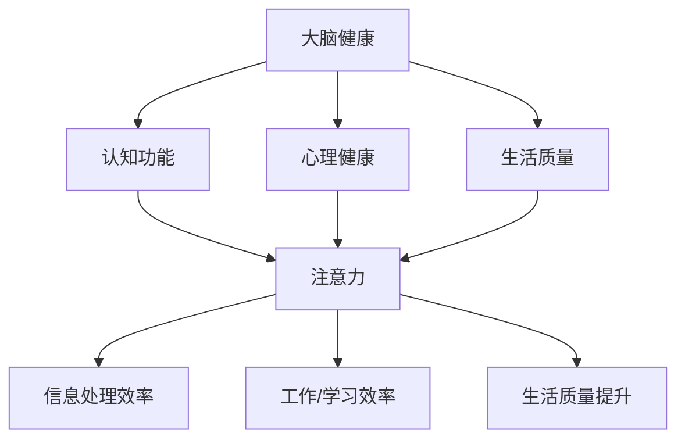

此图展示了大脑健康、注意力及其对认知功能、心理健康、生活质量的影响。

### 第2章：注意力的基础知识

#### 2.1 注意力的定义和类型

注意力是大脑对特定信息的选择性关注和处理。它是一种认知功能，涉及到信息的接收、处理和记忆。注意力的定义可以从多个角度来理解：

- **选择性关注**：注意力使我们能够在众多信息中筛选出重要的信息，忽略无关的信息。  
- **处理能力**：注意力使我们对选定的信息进行加工，包括理解、分析和记忆。

根据注意力的作用对象和方式，可以将注意力分为以下几种类型：

- **集中注意力**：也称为单一注意力，是指将注意力集中在单一任务或对象上。例如，当我们专注于阅读一本书时，会将所有注意力都集中在书的内容上，而忽略周围的其他事物。  
- **分配注意力**：是指同时关注和处理多个任务或对象。例如，当我们同时开车并听音乐时，就需要将注意力分配到驾驶和听音乐上。  
- **选择性注意力**：是指根据任务的需要，选择性地关注某些信息，忽略其他信息。例如，在嘈杂的环境中，我们可以选择性地关注我们需要听的信息，而忽略其他噪音。

#### 2.2 注意力系统的工作原理

注意力系统是大脑的一个复杂网络，涉及多个脑区之间的相互作用。以下是注意力系统的主要工作原理：

- **感觉输入**：大脑通过感觉器官接收外界的各种刺激，如视觉、听觉、触觉等。这些刺激会被传递到大脑的不同区域进行处理。  
- **感知选择**：大脑的注意力系统会对接收到的刺激进行选择，筛选出重要的信息。这一过程涉及到前额叶皮层、顶叶皮层和颞叶皮层的协同作用。  
- **注意力分配**：一旦重要信息被选择出来，大脑的注意力系统会分配资源，对这些信息进行进一步的加工和处理。这涉及到大脑中多个区域之间的资源调配，如前额叶皮层、前运动皮层和顶叶皮层等。  
- **注意力的转换**：大脑的注意力系统具有灵活性，可以根据任务的需求，快速转换注意力的焦点。例如，当我们在阅读时，可能会将注意力从文字内容转移到图表或插图上。

#### 2.3 注意力缺损与障碍

注意力缺损和障碍是一种常见的神经发育问题，通常表现为注意力难以集中、容易分心、任务执行效率低等。注意力缺损和障碍可以分为以下几种类型：

- **注意力缺陷多动障碍（ADHD）**：这是一种常见的注意力缺损障碍，通常在儿童期开始出现，并持续到成年期。ADHD患者通常表现出注意力不集中、冲动行为和活动过度等问题。  
- **阅读障碍**：阅读障碍是一种注意力缺损障碍，患者在阅读过程中难以理解文字，导致阅读速度慢、理解困难。  
- **工作记忆障碍**：工作记忆是一种暂时性的记忆存储系统，用于处理和存储当前需要的信息。工作记忆障碍患者在工作记忆的容量、维持和转换方面存在问题，导致任务执行困难。

注意力缺损和障碍不仅影响个体的认知功能，还可能影响他们的日常生活和社会交往。因此，及早发现和干预注意力缺损和障碍具有重要意义。

#### Mermaid 流�程图：注意力系统的工作原理

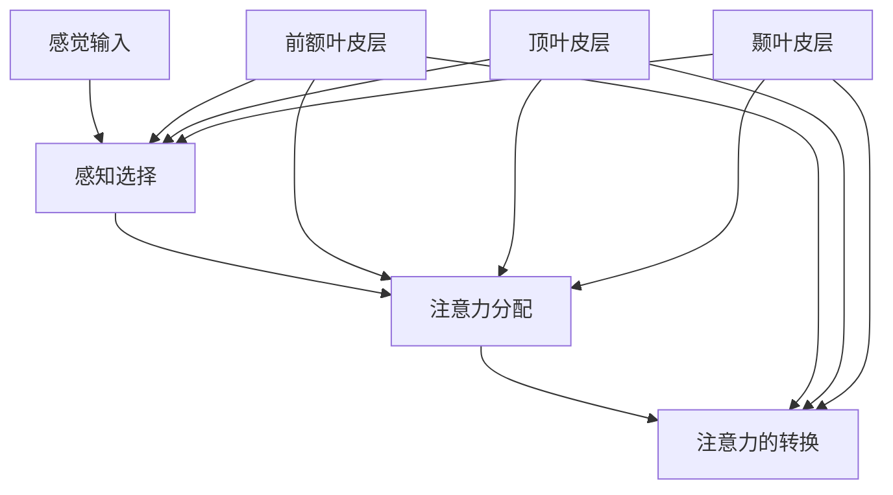

此图展示了注意力系统的主要工作原理，包括感觉输入、感知选择、注意力分配和注意力的转换。

### 第3章：注意力训练的基本原则

#### 3.1 注意力训练的目标

注意力训练的目标是提高个体对特定信息的专注力、分配力和控制力。通过系统化的训练，个体可以：

- **提高专注力**：使个体能够更长时间地保持对某一任务的集中注意力，减少分心现象。  
- **提升分配力**：使个体能够同时处理多个任务或对象，提高多任务处理能力。  
- **增强控制力**：使个体能够更好地管理自己的注意力，根据任务的需求灵活调整注意力的焦点。

#### 3.2 注意力训练的常见方法

注意力训练的方法多种多样，以下是一些常见的方法：

- **定时休息法**：通过设定固定的时间段进行工作，并在每个时间段后进行短暂的休息，有助于提高注意力集中度。  
- **番茄工作法**：将工作时间分为25分钟的工作周期（称为番茄钟），每个周期后休息5分钟，有助于提高工作效率。  
- **多任务练习**：通过同时进行多个简单的任务，如边听音乐边做家务，有助于提升分配力。  
- **专注力游戏**：通过专门设计的注意力游戏，如记忆游戏、注意力训练软件等，有助于提高专注力和控制力。

#### 3.3 注意力训练的实践步骤

以下是一套简单的注意力训练实践步骤：

1. **设定目标**：明确自己想要提高的注意力方面，如专注力、分配力或控制力。  
2. **选择方法**：根据设定的目标，选择适合的注意力训练方法。  
3. **制定计划**：将注意力训练纳入日常生活中的固定环节，如每天早上或晚上进行训练。  
4. **逐步提升**：从简单的训练开始，逐步增加训练的难度和时间。  
5. **保持一致**：坚持每天进行注意力训练，以获得长期的改善效果。

通过以上步骤，个体可以逐步提升注意力水平，从而提高生活和工作质量。

#### Mermaid 流程图：注意力训练的实践步骤

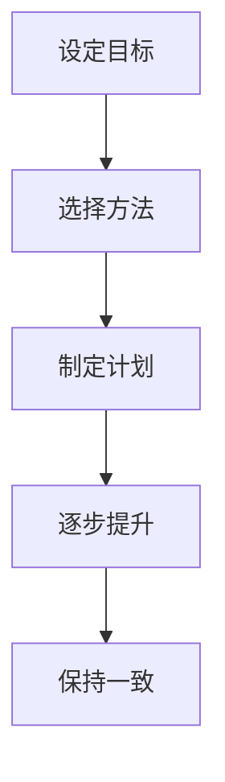

此图展示了注意力训练的实践步骤，包括设定目标、选择方法、制定计划、逐步提升和保持一致。

### 第4章：专门化的注意力训练技术

#### 4.1 专注力训练

专注力训练是提高注意力集中度的关键方法。以下是一些专注力训练的技术和技巧：

- **深度呼吸练习**：通过深呼吸，可以帮助放松身体，减少干扰，提高专注力。具体方法为：深吸气，缓慢呼气，重复几次，感受身体的变化。  
- **冥想练习**：冥想是一种有效的专注力训练方法，可以帮助个体集中注意力。常见的冥想方法包括呼吸冥想、专注物体冥想等。  
- **专注任务练习**：选择一个简单但需要集中注意力的任务，如编织、绘画等，坚持每天进行，以提升专注力。  
- **注意力游戏**：通过专门设计的注意力游戏，如记忆游戏、拼图游戏等，有助于提高专注力。

#### 4.2 执行功能训练

执行功能是指个体在执行任务时的计划、组织、监控和调整能力。以下是一些执行功能训练的技术和技巧：

- **定时任务练习**：设定一个固定的时间段，完成一系列任务，如整理文件、打扫房间等，有助于提升执行功能。  
- **决策练习**：通过模拟复杂决策场景，如选择投资项目、规划假期等，有助于提升决策能力和执行功能。  
- **问题解决练习**：通过解决实际问题，如解决数学问题、解决编程问题等，有助于提升问题解决能力和执行功能。  
- **时间管理训练**：通过时间管理工具，如日历、提醒等，有助于提升时间管理和执行功能。

#### 4.3 视觉注意力和听觉注意力训练

视觉注意力和听觉注意力是注意力的重要组成部分。以下是一些视觉注意力和听觉注意力训练的技术和技巧：

- **视觉专注训练**：通过观察远处的物体、快速识别不同颜色或形状的物体等，有助于提升视觉注意力。  
- **听觉专注训练**：通过听音乐、听故事等，有助于提升听觉注意力。  
- **视觉记忆训练**：通过观察图像、记忆图片等，有助于提升视觉记忆能力。  
- **听觉记忆训练**：通过听歌曲、记忆歌词等，有助于提升听觉记忆能力。

通过以上专门化的注意力训练技术，个体可以逐步提升注意力水平，从而提高生活和工作质量。

#### Mermaid 流程图：专注力训练

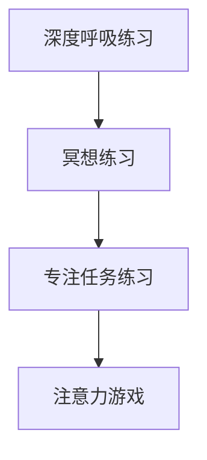

此图展示了专注力训练的几种技术和技巧。

#### Mermaid 流程图：执行功能训练

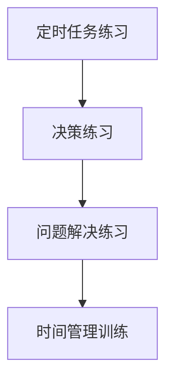

此图展示了执行功能训练的几种技术和技巧。

#### Mermaid 流程图：视觉注意力和听觉注意力训练

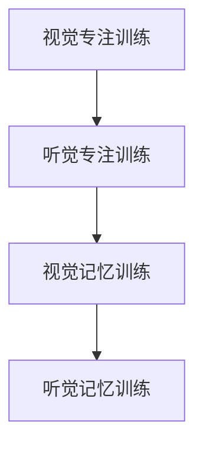

此图展示了视觉注意力和听觉注意力训练的几种技术和技巧。

### 第5章：大脑健康的维护策略

#### 5.1 饮食与大脑健康

饮食是大脑健康的基石。合理的饮食习惯不仅能提供大脑所需的营养，还能预防各种大脑疾病。

- **脑营养素**：大脑需要多种营养素，如蛋白质、脂肪、维生素和矿物质。特别是Omega-3脂肪酸、抗氧化剂和胆碱等，对大脑健康至关重要。
  - **Omega-3脂肪酸**：存在于鱼类、坚果和亚麻籽中，有助于提高记忆力、降低抑郁风险。
  - **抗氧化剂**：如维生素C、E和硒，能够保护大脑免受自由基损伤。
  - **胆碱**：存在于蛋黄、肉类和豆类中，对认知功能有显著影响。

- **避免有害物质**：高糖、高脂肪和高盐食品以及酒精、咖啡因等物质都可能损害大脑健康。高糖食品会导致血糖波动，影响认知功能；高脂肪食品和酒精会增加患认知障碍的风险；咖啡因过多可能导致焦虑和失眠。

#### 5.2 锻炼与大脑健康

体育锻炼不仅有助于保持身体健康，还能促进大脑健康。以下是体育锻炼对大脑健康的好处：

- **提高认知功能**：适量的体育锻炼可以增强记忆力、注意力和执行功能。
- **促进脑部血液循环**：运动可以增加脑部血流量，为大脑提供更多的氧气和营养物质。
- **降低认知障碍风险**：长期的体育锻炼可以降低患阿尔茨海默病和帕金森病的风险。
- **提高情绪状态**：体育锻炼可以释放内啡肽，改善情绪，减少抑郁和焦虑。

#### 5.3 睡眠与大脑健康

睡眠对大脑健康至关重要。良好的睡眠有助于：

- **巩固记忆**：睡眠期间，大脑会整理和巩固白天学到的信息，提高记忆力和学习能力。
- **促进脑部修复**：睡眠期间，脑部会清除代谢废物，修复损伤的神经元，维持脑部健康。
- **降低认知障碍风险**：睡眠不足会增加患认知障碍的风险，长期睡眠不足可能导致记忆力减退、注意力不集中。

为了保持良好的睡眠，以下是一些建议：

- **保持规律的睡眠时间**：每天尽量在相同的时间上床睡觉和起床，有助于调整生物钟，提高睡眠质量。
- **创建舒适的睡眠环境**：保持卧室安静、凉爽、黑暗，使用舒适的床垫和枕头，有助于提高睡眠质量。
- **减少晚间刺激**：避免在睡前使用电子设备，减少晚间咖啡因和酒精摄入，有助于更容易入睡。

通过合理的饮食、适量的锻炼和良好的睡眠，我们可以有效地维护大脑健康，提高生活质量。

#### Mermaid 流程图：大脑健康的维护策略

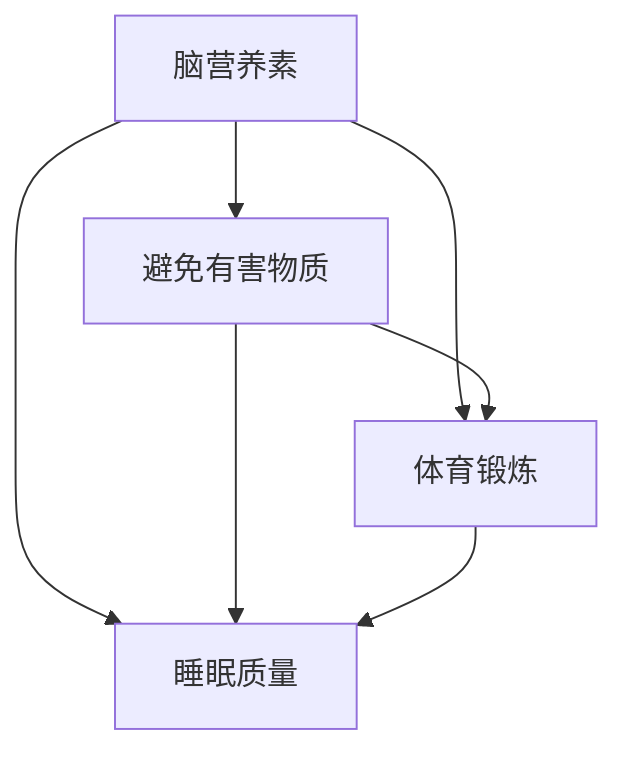

此图展示了饮食、锻炼和睡眠对大脑健康的影响。

### 第6章：注意力与幸福感的关系

#### 6.1 注意力对幸福感的影响

注意力是影响个体幸福感的核心因素之一。良好的注意力有助于提高生活质量和幸福感，而注意力缺陷则可能对幸福感产生负面影响。

- **注意力提升幸福感**：
  - **目标导向**：注意力有助于个体集中精力实现目标，从而获得成就感和满足感，提高幸福感。
  - **减少焦虑**：良好的注意力可以减少对无关信息的干扰，使个体能够更好地应对压力和焦虑，提升幸福感。
  - **提高社交互动**：通过提高注意力，个体可以更好地理解和参与社交互动，增强人际关系，提高幸福感。

- **注意力缺陷降低幸福感**：
  - **分散注意力**：注意力缺陷可能导致个体难以集中精力完成任务，增加生活压力，降低幸福感。
  - **情绪不稳定**：注意力缺陷可能伴随着情绪管理困难，导致情绪波动，影响幸福感。
  - **社交障碍**：注意力缺陷可能影响个体的社交能力，导致社交互动减少，降低幸福感。

#### 6.2 提升幸福感的注意力技巧

以下是一些提升幸福感的注意力技巧：

- **正念冥想**：正念冥想是一种通过专注于当下的呼吸和感受来提高注意力的练习。通过定期进行正念冥想，个体可以减少对过去和未来的担忧，增强对当前生活的关注，提升幸福感。
- **定时休息**：通过使用番茄工作法等时间管理技巧，个体可以在工作或学习过程中进行短暂的休息，有助于恢复注意力，减少疲劳，提升幸福感。
- **专注力训练游戏**：通过玩注意力训练游戏，如记忆游戏、拼图等，个体可以逐步提升注意力水平，增强专注力，从而提高幸福感。

#### 6.3 心理健康与注意力训练

心理健康与注意力训练密切相关。通过注意力训练，个体可以改善心理健康，提高生活质量。

- **心理健康问题与注意力训练**：
  - **焦虑和抑郁**：注意力训练有助于减少焦虑和抑郁症状，提高情绪稳定性。
  - **压力管理**：通过注意力训练，个体可以更好地管理压力，提高应对压力的能力。
  - **心理灵活性**：注意力训练有助于个体增强心理灵活性，更好地适应生活中的变化和挑战。

- **心理健康与注意力训练的相互影响**：
  - **注意力训练改善心理健康**：通过注意力训练，个体可以改善注意力缺陷，提高专注力，从而减轻心理健康问题。
  - **心理健康促进注意力训练**：良好的心理健康状态有助于个体更好地进行注意力训练，提高训练效果。

通过注意力训练和心理健康管理的结合，个体可以全面提升生活质量，实现幸福感和心理健康的双赢。

#### Mermaid 流程图：注意力与幸福感的关系

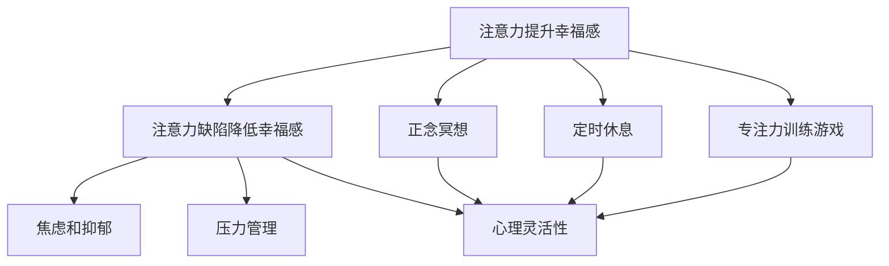

此图展示了注意力与幸福感的关系，以及提升幸福感的注意力技巧。

### 第7章：注意力训练在教育中的应用

#### 7.1 教育中注意力问题的现状

在教育领域，注意力问题是一个普遍存在的问题。学生在课堂上难以集中注意力，容易分心，导致学习效果不佳。以下是一些主要原因：

- **多媒体干扰**：现代教育环境中，各种电子设备和多媒体资源无处不在，对学生的注意力形成干扰。
- **学习压力**：学生在学业压力下，容易出现焦虑和疲劳，导致注意力下降。
- **教学方法**：传统教学方法可能无法满足学生的个性化需求，导致学生失去学习兴趣，降低注意力。
- **家庭环境**：家庭环境中的电子设备使用、家长的教育方式等都可能影响学生的注意力。

#### 7.2 注意力训练在学校教育中的应用

在学校教育中，注意力训练可以通过多种方式实施，以提高学生的学习效果和注意力集中度：

- **课堂教学设计**：教师可以通过设计互动性强的课堂活动，如小组讨论、游戏教学等，吸引学生的注意力。  
- **专注力训练课程**：学校可以开设专门的专注力训练课程，教授学生专注力的技巧和方法，如正念冥想、番茄工作法等。  
- **个性化学习计划**：根据学生的个性化需求和注意力水平，制定个性化的学习计划，帮助学生逐步提高注意力。

#### 7.3 注意力训练在家庭教育中的应用

在家庭教育中，家长可以通过以下方法帮助儿童提升注意力：

- **设定学习时间**：为儿童设定固定的学习时间，并确保环境安静，减少干扰。  
- **分解任务**：将复杂的任务分解成小步骤，帮助孩子一步一步完成，减少压力和分心。  
- **正面激励**：通过表扬和奖励，激励孩子保持注意力，培养良好的学习习惯。  
- **专注力游戏**：使用注意力训练游戏，如拼图、记忆游戏等，帮助孩子提升注意力。

通过家庭教育中的注意力训练，家长可以帮助孩子建立良好的学习习惯，提高学习效果。

#### Mermaid 流程图：教育中注意力问题的现状

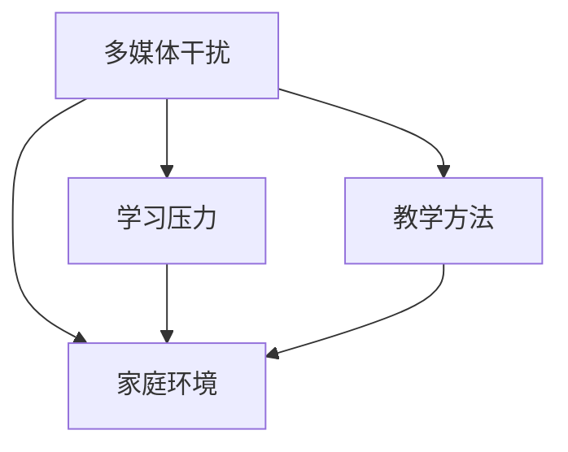

此图展示了教育中注意力问题的几个主要原因。

#### Mermaid 流程图：注意力训练在学校教育中的应用

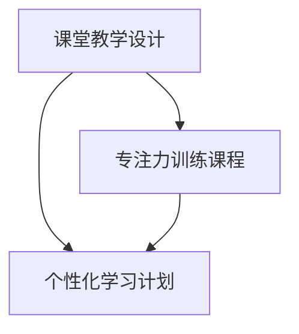

此图展示了注意力训练在学校教育中的应用方法。

#### Mermaid 流程图：注意力训练在家庭教育中的应用

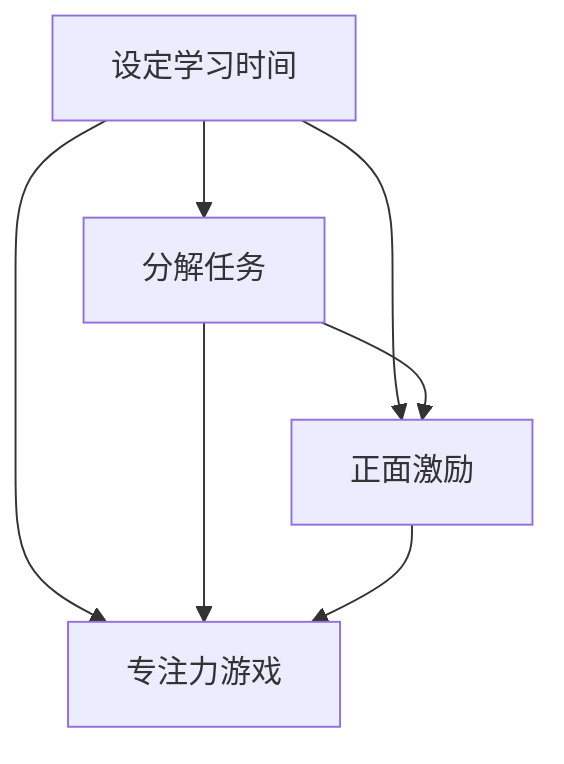

此图展示了注意力训练在家庭教育中的应用方法。

### 第8章：注意力训练在工作场所中的应用

#### 8.1 工作场所中注意力问题的挑战

在工作场所中，注意力问题对工作效率和职业发展产生显著影响。以下是一些常见的注意力问题及其挑战：

- **多任务处理干扰**：现代工作环境中，员工往往需要同时处理多项任务，导致注意力分散，降低工作效率。
- **工作压力**：高工作压力导致员工注意力不集中，影响工作质量和创造力。
- **技术干扰**：电子邮件、社交媒体和其他技术工具的不断提醒和通知，分散员工的注意力。
- **时间管理问题**：未能有效管理时间，导致任务积压，增加员工的压力和焦虑。

#### 8.2 提高工作效率的注意力技巧

以下是一些有助于提高工作效率的注意力技巧：

- **番茄工作法**：通过将工作时间分成25分钟的“番茄钟”，每个“番茄钟”后休息5分钟，有助于提高专注力和工作效率。    
- **设定优先级**：通过设定任务优先级，员工可以集中精力处理最重要的任务，减少无关干扰。
- **专注力训练**：定期进行专注力训练，如正念冥想、专注任务练习等，有助于提升专注力和注意力控制力。
- **减少干扰**：在工作环境中创造一个专注的环境，如关闭不必要的通知、保持工作区域整洁等，有助于减少干扰。

#### 8.3 注意力训练在职场健康推广中的实践

在职场健康推广中，注意力训练可以通过以下方法实施：

- **职场健康讲座**：组织职场健康讲座，向员工介绍注意力训练的重要性和方法，提高员工对注意力训练的认识。
- **内部培训**：提供内部培训课程，教授员工专注力训练技巧，如正念冥想、时间管理等。
- **团队合作**：鼓励员工在团队项目中应用注意力训练技巧，提高团队协作效率和创造力。
- **工作环境优化**：改善工作环境，减少干扰因素，如提供安静的工作区域、限制不必要的会议等。

通过在职场中推广注意力训练，企业可以提高员工的工作效率和工作满意度，从而促进整体业务发展。

#### Mermaid 流程图：工作场所中注意力问题的挑战

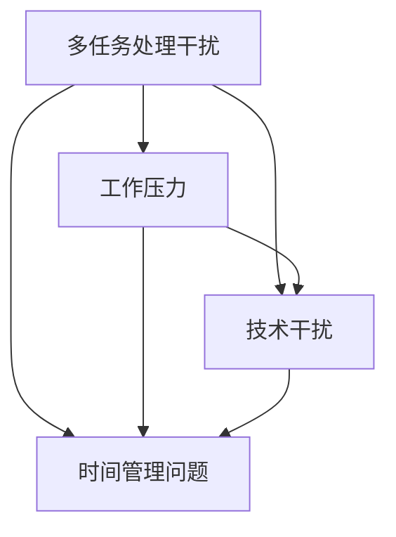

此图展示了工作场所中注意力问题的几个挑战。

#### Mermaid 流程图：提高工作效率的注意力技巧

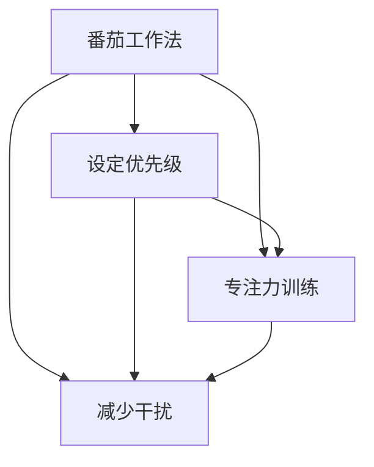

此图展示了提高工作效率的几种注意力技巧。

#### Mermaid 流程图：注意力训练在职场健康推广中的实践

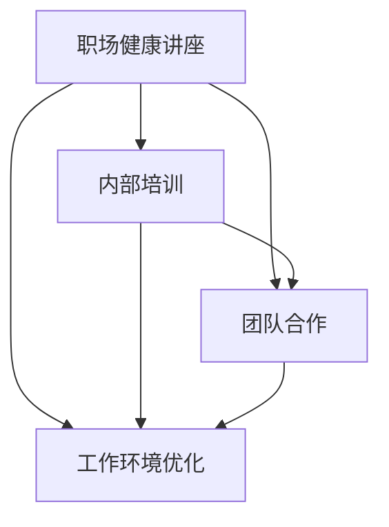

此图展示了注意力训练在职场健康推广中的几种实践方法。

### 第9章：注意力训练与大脑健康的未来趋势

#### 9.1 注意力训练技术的发展趋势

随着科技的进步，注意力训练技术也在不断演变和优化。以下是一些注意力训练技术的发展趋势：

- **人工智能辅助训练**：利用人工智能技术，可以个性化定制注意力训练计划，根据个体的注意力水平和反馈进行实时调整，提高训练效果。
- **虚拟现实（VR）训练**：通过虚拟现实技术，为用户提供沉浸式的注意力训练环境，提高用户的参与度和训练效果。
- **脑电图（EEG）监测**：通过脑电图监测技术，实时监测个体的脑电活动，评估注意力的变化，为注意力训练提供科学依据。
- **可穿戴设备**：可穿戴设备如智能手表和耳机等，可以随时监测个体的注意力状态，提供实时的反馈和指导。

#### 9.2 大脑健康研究的最新进展

大脑健康研究在近年来取得了显著进展，以下是一些重要成果：

- **神经可塑性研究**：神经可塑性是指大脑神经元和神经通路在经验和学习过程中发生变化的能力。研究表明，通过适当的训练和刺激，大脑的神经可塑性可以显著提高，从而改善大脑健康。
- **认知训练的应用**：认知训练，如记忆训练、注意力训练和决策训练等，已被证明可以改善大脑功能，提高认知能力。
- **脑-机接口（BMI）技术**：脑-机接口技术通过直接连接大脑和外部设备，可以实现对大脑活动的实时监测和控制，为大脑健康研究和治疗提供了新的途径。

#### 9.3 注意力训练在社会中的应用前景

随着对注意力训练与大脑健康关系认识的加深，注意力训练在社会中的应用前景广阔：

- **教育领域**：通过注意力训练，可以提升学生的学习效果和注意力集中度，提高教育质量。
- **职场健康**：在职场中推广注意力训练，可以提高员工的工作效率和工作满意度，促进企业的发展。
- **心理健康**：注意力训练有助于改善心理健康问题，如焦虑、抑郁和压力管理，提升生活质量。
- **老年健康**：通过注意力训练，可以延缓大脑衰老，改善老年认知功能，提高老年人的生活质量。

未来，随着技术的不断进步和对大脑健康研究的深入，注意力训练将在社会各个领域发挥更大的作用。

#### Mermaid 流程图：注意力训练技术的发展趋势

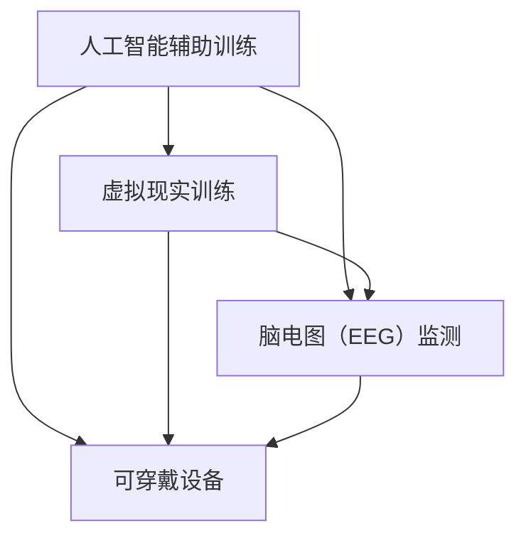

此图展示了注意力训练技术的发展趋势。

#### Mermaid 流程图：大脑健康研究的最新进展

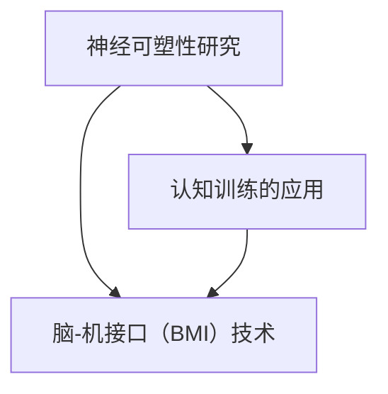

此图展示了大脑健康研究的最新进展。

#### Mermaid 流程图：注意力训练在社会中的应用前景

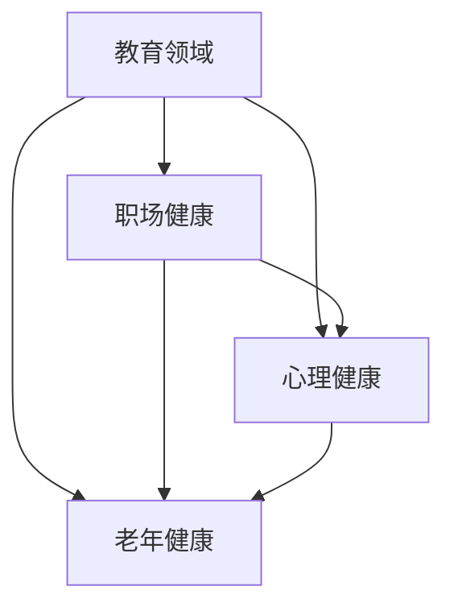

此图展示了注意力训练在社会中的应用前景。

### 第10章：总结与展望

#### 10.1 本书的主要贡献

本书系统地介绍了注意力训练与大脑健康改善的关系，提供了实用的注意力训练方法，并探讨了注意力训练在实际生活中的应用。本书的主要贡献包括：

- **全面解析**：详细讲解了注意力与大脑健康的关系，阐述了注意力训练的基本原则和常见方法。
- **理论与实践结合**：不仅提供了理论上的分析，还结合实际应用，如教育、工作和职场健康等领域，提供了具体的实施策略。
- **最新研究进展**：介绍了大脑健康研究的最新成果，展示了注意力训练技术的未来发展趋势。

#### 10.2 研究中的不足与展望

尽管本书在一定程度上解决了注意力训练与大脑健康改善的关系问题，但仍存在一些不足之处：

- **数据不足**：由于注意力训练涉及个体的差异，需要更多的实验数据和案例研究来验证本书提出的训练方法的有效性。
- **跨学科研究**：本书主要从计算机科学和心理学角度出发，未来可以引入生物学、医学等领域的知识，进行更加全面和深入的研究。
- **长期效果**：虽然本书提供了一些注意力训练的方法，但关于长期效果的评估和验证仍需进一步研究。

#### 10.3 对未来的建议

为了进一步推动注意力训练与大脑健康改善的研究，提出以下建议：

- **跨学科合作**：鼓励不同学科的研究者合作，从多个角度探索注意力训练与大脑健康的关系。
- **大数据分析**：利用大数据技术，收集和分析注意力训练的效果数据，为科学研究提供支持。
- **公众参与**：通过公众参与，提高对注意力训练和大脑健康的认识，推广科学的训练方法。
- **政策支持**：建议政府和相关机构加大对注意力训练与大脑健康研究的支持，推动相关政策的制定和实施。

通过以上努力，未来有望在注意力训练与大脑健康改善领域取得更多突破，为个体和社会带来更大的福祉。

### 附录

#### 附录A：注意力训练工具和资源推荐

**A.1 注意力训练应用程序**

1. **Headspace**：一款知名的冥想和专注力训练应用程序，提供各种冥想课程和指导，有助于提高注意力。
2. **Treehouse**：提供专注力训练的游戏，通过互动方式帮助用户提升专注力。
3. ** mindful**：专注于心理健康和注意力训练的应用程序，提供多种冥想和呼吸练习。

**A.2 大脑健康和研究资源网站**

1. **National Institute of Mental Health (NIMH)**：美国国家精神健康研究所的官方网站，提供大量关于大脑健康的研究资料和资源。
2. **PubMed**：全球知名的医学研究数据库，包含大量的生物医学和心理学研究成果。
3. **BrainHQ**：由神经科学公司Lumosity开发的在线大脑训练平台，提供各种认知训练和大脑健康资源。

**A.3 注意力训练书籍推荐**

1. **"The Brain That Changes Itself: Stories of Personal Triumph from the Frontiers of Brain Science"**：作者：Norman Doidge，介绍大脑可塑性的研究成果和应用。
2. **"Focus: The Hidden Driver of Excellence"**：作者：Daniel Goleman，探讨注意力对个人成功的影响。
3. **"Make Your Brain Stronger: Learn to Focus, Stay Calm, and Be More Productive"**：作者：John Paul McQueen，提供实用的注意力训练方法和技巧。

**A.4 注意力训练相关的在线课程和研讨会**

1. **"The Science of Mindfulness: A Practical Introduction"**：由Coursera提供，介绍正念冥想和注意力训练的科学原理和实践。
2. **"Focus Training: Boost Your Productivity and Attention Span"**：由Udemy提供，教授专注力训练技巧和时间管理方法。
3. **"Brain Health and Cognitive Function: The Latest Research"**：由EdX提供，介绍大脑健康和认知功能的研究进展和最新发现。

通过使用这些工具和资源，用户可以更全面地了解和参与注意力训练，提升大脑健康水平。

