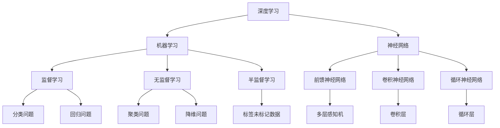
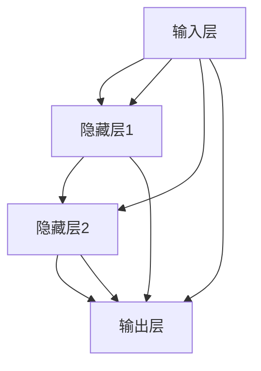
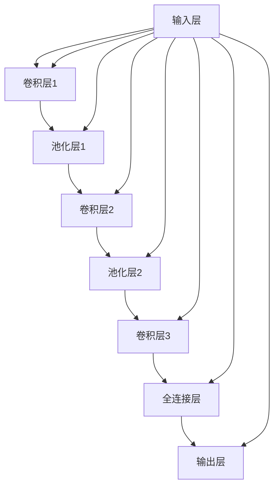
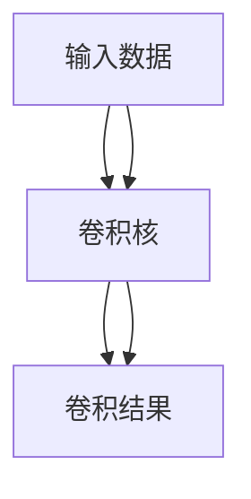
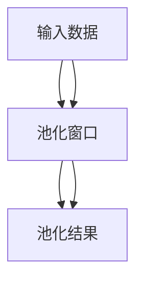
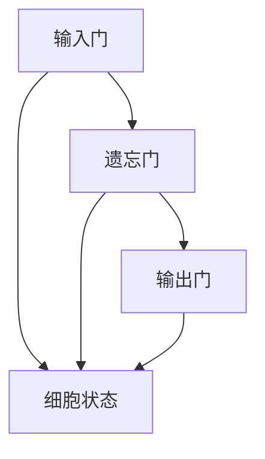
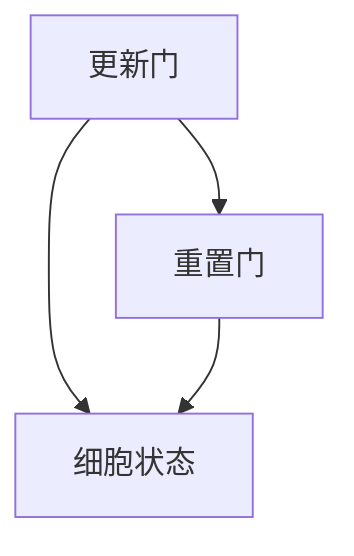

                 

### 深度学习在视频内容理解与分析中的应用

> **关键词：** 深度学习、视频内容理解、视频行为识别、注意力机制、生成对抗网络、实时处理

**摘要：** 
本文将深入探讨深度学习在视频内容理解与分析中的应用，涵盖从基本概念到高级技术的全方位内容。首先，我们将回顾深度学习的历史、核心概念和基本结构。接着，本文将详细解释深度学习算法的数学模型，并通过实际代码示例进行阐述。随后，本文将探讨特征工程和数据处理在深度学习中的重要性，介绍卷积神经网络（CNN）、循环神经网络（RNN）以及注意力机制的基本原理和实现。此外，生成对抗网络（GAN）的原理和训练过程也将被详细讲解。最后，本文将聚焦于深度学习在视频内容理解、视频行为识别和视频情感分析等实际应用领域的挑战与解决方案，提供实践案例和代码示例，展示深度学习技术的强大潜力。

## 第一部分：深度学习基础

深度学习是机器学习领域的一种重要分支，它通过构建深度神经网络，使得机器能够从大量数据中自动学习和提取特征，实现复杂任务的自动化。在这一部分，我们将深入探讨深度学习的基本概念、历史背景、神经网络结构以及相关算法。

### 第1章：深度学习概述

#### 1.1 深度学习的概念与历史

深度学习（Deep Learning）是一种人工智能（AI）的分支，它模仿了人脑的神经网络结构和工作原理，通过大规模神经网络的训练，实现从数据中自动提取特征和模式的能力。深度学习的历史可以追溯到20世纪40年代，当时心理学家和计算机科学家提出了人工神经网络（ANN）的概念。然而，由于计算能力的限制和算法的局限性，深度学习在很长一段时间内并未取得显著进展。

直到20世纪80年代，随着计算机硬件性能的提升和大规模并行计算的发展，深度学习开始重新受到关注。特别是1986年，Rumelhart、Hinton和Williams提出了反向传播算法（Backpropagation），使得多层神经网络的训练成为可能。

**核心概念与联系**

- **深度学习**：一种机器学习的方法，通过多层神经网络对数据进行特征提取和学习。
- **机器学习**：一种通过数据训练算法，使机器具备自主学习能力的技术。
- **神经网络**：由大量相互连接的神经元组成的计算模型。
- **监督学习、无监督学习、半监督学习**：根据训练数据是否带有标签，分为不同类型的学习方法。
- **前馈神经网络、卷积神经网络、循环神经网络**：根据网络结构的不同，分为不同的神经网络类型。

**图解：**



#### 1.2 神经网络的基本结构

神经网络由多个层组成，每一层包含多个神经元。最基本的神经网络结构是多层感知机（MLP），它包括输入层、隐藏层和输出层。以下是一个简化的神经网络结构图：

**图解：**



**核心算法原理讲解：**

神经网络通过前向传播和反向传播进行学习。在前向传播过程中，输入数据从输入层经过隐藏层，最终到达输出层。每个神经元对输入数据进行加权求和，并应用激活函数，以产生输出。在反向传播过程中，网络计算损失函数相对于每个神经元权重的梯度，并使用梯度下降算法更新权重。

**数学模型和数学公式 & 详细讲解 & 举例说明：**

前向传播的数学过程可以表示为：

$$
\begin{aligned}
    z^{(l)} &= \sum_{j=1}^{n} w^{(l)}_{j} x^{(l-1)}_j + b^{(l)} \\
    a^{(l)} &= \sigma(z^{(l)})
\end{aligned}
$$`

其中，$z^{(l)}$ 是第 $l$ 层的净输入，$w^{(l)}$ 是权重，$b^{(l)}$ 是偏置，$a^{(l)}$ 是激活输出，$\sigma$ 是激活函数。

反向传播的数学过程可以表示为：

$$
\begin{aligned}
    \delta^{(l)} &= \frac{\partial L}{\partial z^{(l+1)}} \cdot \frac{\partial \sigma^{(l+1)}}{\partial a^{(l+1)}} \\
    \delta^{(l-1)} &= \delta^{(l)} \cdot w^{(l)}_j
\end{aligned}
$$`

其中，$\delta^{(l)}$ 是误差项，$L$ 是损失函数。

**举例说明：**

考虑一个简单的线性回归模型，输入为特征向量 $x$，输出为预测值 $y$，损失函数为均方误差：

```python
import numpy as np

# 初始化权重和偏置
weights = np.random.rand(1)
bias = np.random.rand(1)

# 前向传播计算输出
x = np.array([1])
y = np.array([2])

z = np.dot(x, weights) + bias
a = sigmoid(z)

# 计算损失
loss = (y - a)**2

# 反向传播计算梯度
delta = (y - a) * sigmoid_prime(a)

# 更新权重和偏置
weights -= learning_rate * delta * x
bias -= learning_rate * delta

print("Updated weights:", weights)
print("Updated bias:", bias)
```

#### 1.3 深度学习算法综述

深度学习算法的核心在于如何训练多层神经网络，以使其能够自动提取数据中的复杂特征。以下是一些主要的深度学习算法：

- **反向传播算法（Backpropagation）**：用于计算网络损失函数的梯度。
- **梯度下降算法（Gradient Descent）**：用于更新网络的权重和偏置。
- **正则化（Regularization）**：用于防止模型过拟合，包括L1正则化、L2正则化等。
- **激活函数**：用于引入非线性，常见的激活函数包括ReLU、Sigmoid、Tanh等。

**数学模型和数学公式 & 详细讲解 & 举例说明：**

训练一个简单的线性回归模型，输入为特征向量 $x$，输出为预测值 $y$，损失函数为均方误差：

$$
\begin{aligned}
    J(\theta) &= \frac{1}{m} \sum_{i=1}^{m} \left( h_{\theta}(x^{(i)}) - y^{(i)} \right)^2 \\
    \theta_j &= \theta_j - \alpha \frac{\partial J(\theta)}{\partial \theta_j}
\end{aligned}
$$`

其中，$J(\theta)$ 是损失函数，$\theta$ 是参数，$m$ 是训练数据数量，$h_{\theta}(x)$ 是模型预测输出，$\alpha$ 是学习率。

**举例说明：**

训练一个简单的线性回归模型，输入为特征向量 $x$，输出为预测值 $y$，损失函数为均方误差：

```python
import numpy as np

def hypothesis(theta, x):
    return theta[0] * x

def loss_function(y, y_pred):
    return ((y - y_pred) ** 2).mean()

def gradient_descent(theta, x, y, alpha, num_iterations):
    for i in range(num_iterations):
        y_pred = hypothesis(theta, x)
        loss = loss_function(y, y_pred)
        theta -= alpha * (2 / m) * (y - y_pred) * x
        
    return theta

# 初始化权重和偏置
theta = np.array([0])

# 训练模型
x_train = np.array([[1], [2], [3]])
y_train = np.array([[2], [4], [6]])

alpha = 0.01
num_iterations = 1000
m = x_train.shape[0]

theta = gradient_descent(theta, x_train, y_train, alpha, num_iterations)

# 输出训练后的权重
print("Updated weights:", theta)
```

### 总结

在本章中，我们介绍了深度学习的基础知识，包括其历史背景、核心概念和基本结构。我们还详细讲解了神经网络的基本原理，并通过数学模型和实际代码示例展示了深度学习算法的训练过程。这些基础概念和算法为后续讨论深度学习在视频内容理解与分析中的应用奠定了坚实的基础。

## 第二部分：特征工程与数据处理

在深度学习模型训练过程中，特征工程和数据预处理是至关重要的一步。这些步骤不仅影响着模型的性能，还直接关系到训练效率和结果的可解释性。在这一部分，我们将探讨特征工程和数据处理的基本概念、算法原理以及实际应用。

### 第2章：特征提取与选择

#### 2.1 特征提取与选择

特征提取和选择是特征工程的核心任务，旨在从原始数据中提取出对模型训练有帮助的信息，同时去除冗余和无用信息。正确的特征选择能够显著提高模型的泛化能力和预测准确性。

**核心算法原理讲解：**

特征选择可以通过以下几种方法实现：

- **基于统计的方法**：计算每个特征的重要性和贡献度，选择重要性较高的特征。
- **基于过滤的方法**：在特征提取之前，通过筛选和过滤原始数据来减少特征数量。
- **基于包装的方法**：通过尝试不同的特征组合来选择最佳特征子集。
- **基于嵌入的方法**：在模型训练过程中，自动学习特征的重要性，并在模型中嵌入特征选择过程。

**数学模型和数学公式 & 详细讲解 & 举例说明：**

- **Gini Importance**：

  $$
  \begin{aligned}
      \text{Gini Importance} &= \sum_{i} \left(1 - \frac{1}{n_i} \sum_{j \neq i} p_j\right) \\
      \text{其中} \; p_j &= \frac{1}{n_i} \sum_{k=1}^{n_i} \text{if} \; y_k = j
  \end{aligned}
  $$

- **Mean Decrease in Impurity**：

  $$
  \begin{aligned}
      \text{Mean Decrease in Impurity} &= \frac{\sum_{i} \left(n_i \cdot \ln \frac{n_i}{n}\right)}{N} \\
      \text{其中} \; n &= \text{总样本数} \\
      \text{N} &= \text{特征数量}
  \end{aligned}
  $$

**举例说明：**

使用 Gini Importance 来评估特征的重要性：

```python
from sklearn.datasets import load_iris
from sklearn.ensemble import RandomForestClassifier
from sklearn.feature_selection import mutual_info_classif

iris = load_iris()
X = iris.data
y = iris.target

clf = RandomForestClassifier()
clf.fit(X, y)

importances = clf.feature_importances_
gini_importances = 1 - (1 / len(y)) * sum((1 - p) for p in y)
print("Gini Importance:", gini_importances)
```

#### 2.2 数据预处理

数据预处理是深度学习模型训练前必不可少的一步，它包括填充缺失值、数据归一化和数据编码等操作。这些操作有助于提高模型的训练效率和性能。

**核心算法原理讲解：**

- **填充缺失值**：使用统计方法或机器学习模型来预测缺失值并填补。
- **数据归一化**：将特征缩放到相同的尺度，常见的归一化方法包括最小-最大缩放和标准化。
- **数据编码**：将分类数据转换为数值表示，常见的编码方法包括独热编码和标签编码。

**数学模型和数学公式 & 详细讲解 & 举例说明：**

数据归一化的公式为：

$$
z = \frac{x - \mu}{\sigma}
$$`

其中，$x$ 是原始数据，$\mu$ 是均值，$\sigma$ 是标准差。

**举例说明：**

对特征数据进行归一化：

```python
from sklearn.preprocessing import StandardScaler

X = np.array([[1, 2], [3, 4], [5, 6]])
scaler = StandardScaler()
X_normalized = scaler.fit_transform(X)
print("Normalized data:", X_normalized)
```

### 总结

在本章中，我们介绍了特征工程和数据处理的基本概念和算法原理。特征提取和选择是提升模型性能的关键步骤，而数据预处理则保证了模型训练的顺利进行。通过详细的数学模型和实际代码示例，我们展示了如何有效地进行特征选择和数据预处理，为深度学习模型的应用奠定了坚实的基础。

### 第三部分：卷积神经网络（CNN）

卷积神经网络（Convolutional Neural Network，CNN）是深度学习领域的一种重要模型，特别适用于图像和视频数据的处理。由于CNN具有并行处理能力和参数共享的特性，它能够高效地从数据中提取特征，从而在图像识别、目标检测和视频分析等任务中取得了显著的性能。在这一部分，我们将深入探讨CNN的基本结构、核心算法原理以及其在实际应用中的实现。

#### 第3章：CNN的基本结构

#### 3.1 CNN的基本结构

CNN由多个卷积层、池化层和全连接层组成。其基本结构如下：

**图解：**



**核心概念与联系：**

- **卷积层**：通过卷积操作从输入数据中提取特征。
- **池化层**：对卷积层的结果进行下采样，减少参数数量。
- **全连接层**：将卷积层和池化层提取的特征映射到输出层。
- **激活函数**：引入非线性，常见的激活函数包括ReLU、Sigmoid和Tanh。

#### 3.2 卷积操作

卷积操作是CNN的核心组成部分，它通过滑动滤波器（卷积核）在输入数据上滑动，提取局部特征。以下是一个简化的卷积操作过程：

**图解：**



**核心算法原理讲解：**

卷积操作可以表示为：

$$
\begin{aligned}
    \text{卷积操作} &= \sum_{i=1}^{k} \sum_{j=1}^{h} \sum_{l=1}^{w} \text{filter}_{i,j,l} \cdot \text{input}_{i+h, j+w, k} \\
    \text{卷积结果} &= \text{input}_{i+h, j+w, k} * \text{filter}_{i,j,l}
\end{aligned}
$$`

**举例说明：**

计算卷积操作的输出：

```python
import numpy as np

input_data = np.array([[1, 2], [3, 4]])
filter = np.array([[1, 0], [0, 1]])
output = np.zeros_like(input_data)

for i in range(input_data.shape[0]):
    for j in range(input_data.shape[1]):
        for k in range(filter.shape[0]):
            for l in range(filter.shape[1]):
                output[i][j] += input_data[i][j] * filter[k][l]

print("Convolutional output:", output)
```

#### 3.3 池化操作

池化操作是对卷积层结果的下采样，通过局部聚合操作减少数据维度，从而降低模型的复杂性。常见的池化操作包括最大池化和平均池化。

**图解：**



**核心算法原理讲解：**

最大池化操作可以表示为：

$$
\text{max\_pooling}_{i,j} = \max\left\{ \text{input}_{i+\ell, j+\ell} : \ell \in \{0, 1, ..., \text{pool\_size}-1\} \right\}
$$`

**举例说明：**

计算最大池化操作的输出：

```python
import numpy as np

input_data = np.array([[1, 2, 3], [4, 5, 6]])
pool_size = 2
output = np.zeros_like(input_data)

for i in range(input_data.shape[0] // pool_size):
    for j in range(input_data.shape[1] // pool_size):
        for k in range(input_data.shape[2]):
            output[i][j][k] = np.max(input_data[i*pool_size:i*pool_size+pool_size, j*pool_size:j*pool_size+pool_size, k])

print("Max pooling output:", output)
```

#### 3.4 全连接层

全连接层（Fully Connected Layer）是将卷积层和池化层提取的特征映射到输出层的最后一个步骤。它通过将每个特征映射到输出层的每个神经元，实现分类或回归任务。

**核心算法原理讲解：**

全连接层的输出可以通过以下公式计算：

$$
\text{output} = \text{activation}(\text{weights} \cdot \text{input} + \text{biases})
$$`

其中，$\text{weights}$ 和 $\text{biases}$ 是层的权重和偏置，$\text{activation}$ 是激活函数。

**举例说明：**

使用全连接层实现一个简单的二分类任务：

```python
import numpy as np

# 初始化权重和偏置
weights = np.random.rand(10, 1)
biases = np.random.rand(1)

# 输入数据
input_data = np.array([[0.5], [0.7]])

# 前向传播计算输出
output = np.dot(input_data, weights) + biases
print("Output:", output)

# 激活函数
activation_function = np.tanh

# 应用激活函数
output = activation_function(output)
print("Activated output:", output)
```

#### 3.5 CNN的组成和结构

CNN由多个卷积层、池化层和全连接层组成，通过逐步提取和聚合特征，实现对图像的精细描述。以下是一个简单的CNN结构图：

**图解：**


**核心概念与联系：**

- **卷积层**：通过卷积操作提取图像的局部特征。
- **池化层**：对卷积层的结果进行下采样，减少数据维度。
- **全连接层**：将卷积层和池化层提取的特征映射到输出层。

#### 3.6 CNN的工作原理

CNN通过卷积、池化和全连接等操作，逐步提取图像的局部特征和全局特征，实现对图像的识别和分类。其工作原理可以概括为以下几个步骤：

1. **卷积操作**：通过卷积核在图像上滑动，提取图像的局部特征。
2. **池化操作**：对卷积层的结果进行下采样，减少数据维度。
3. **特征聚合**：通过多次卷积和池化操作，逐步提取图像的局部和全局特征。
4. **全连接层**：将卷积层和池化层提取的特征映射到输出层，进行分类或回归任务。

**核心算法原理讲解：**

CNN的工作原理可以表示为：

$$
\begin{aligned}
    \text{特征提取} &= \text{卷积层} \times \text{池化层} \times \ldots \\
    \text{特征聚合} &= \text{全连接层} \\
    \text{分类或回归} &= \text{输出层}
\end{aligned}
$$`

**举例说明：**

使用CNN对图像进行分类：

```python
import tensorflow as tf
from tensorflow.keras import layers, models

# 构建CNN模型
input_shape = (28, 28, 1)
model = models.Sequential()
model.add(layers.Conv2D(32, (3, 3), activation='relu', input_shape=input_shape))
model.add(layers.MaxPooling2D((2, 2)))
model.add(layers.Conv2D(64, (3, 3), activation='relu'))
model.add(layers.MaxPooling2D((2, 2)))
model.add(layers.Conv2D(64, (3, 3), activation='relu'))
model.add(layers.Flatten())
model.add(layers.Dense(64, activation='relu'))
model.add(layers.Dense(10, activation='softmax'))

# 编译模型
model.compile(optimizer='adam',
              loss='categorical_crossentropy',
              metrics=['accuracy'])

# 加载数据
(x_train, y_train), (x_test, y_test) = tf.keras.datasets.mnist.load_data()
x_train = x_train.reshape((-1, 28, 28, 1)).astype('float32') / 255
x_test = x_test.reshape((-1, 28, 28, 1)).astype('float32') / 255
y_train = tf.keras.utils.to_categorical(y_train, 10)
y_test = tf.keras.utils.to_categorical(y_test, 10)

# 训练模型
model.fit(x_train, y_train, epochs=5, batch_size=64)

# 评估模型
test_loss, test_acc = model.evaluate(x_test, y_test, verbose=2)
print('Test accuracy:', test_acc)
```

#### 3.7 卷积神经网络的优缺点

卷积神经网络具有以下优点：

- **并行处理能力强**：通过卷积操作，CNN能够高效地从图像中提取特征。
- **参数共享**：CNN通过卷积核在图像上滑动，实现特征提取，避免了大量重复计算。
- **适用于图像和视频数据**：CNN能够处理高维数据，适用于图像和视频分析任务。

卷积神经网络也存在一些缺点：

- **计算量大**：CNN通过多层卷积和池化操作，计算复杂度高，训练时间较长。
- **需要大量数据**：CNN的性能依赖于训练数据的质量和数量，需要大量标注数据。

#### 3.8 卷积神经网络的应用领域

卷积神经网络广泛应用于图像和视频处理领域，包括以下应用：

- **图像分类**：用于识别和分类图像内容。
- **目标检测**：用于检测图像中的目标对象。
- **图像分割**：用于将图像分割成不同的区域。
- **视频分析**：用于分析视频中的行为和事件。

### 总结

在本章中，我们详细介绍了卷积神经网络的基本结构、核心算法原理以及在实际应用中的实现。通过示例代码，我们展示了如何构建和训练一个简单的CNN模型，实现了对图像的分类任务。在接下来的章节中，我们将继续探讨深度学习在视频内容理解与分析中的应用，包括循环神经网络（RNN）和注意力机制等高级技术。

### 第四部分：循环神经网络（RNN）

循环神经网络（Recurrent Neural Network，RNN）是一种能够处理序列数据的神经网络。与传统的前馈神经网络不同，RNN具有记忆功能，能够记住之前的输入信息，并利用这些信息来预测未来的输出。这使得RNN在处理时间序列数据、自然语言处理和视频分析等领域具有显著的优势。在这一部分，我们将深入探讨RNN的基本原理、实现方法以及其在实际应用中的表现。

#### 第4章：RNN的基本原理

#### 4.1 RNN的基本概念

RNN通过在神经网络中引入循环结构，使得网络能够记住之前的输入信息。这种记忆功能使得RNN能够处理序列数据，如时间序列、文本和视频。RNN的基本结构包括输入层、隐藏层和输出层。

**核心概念与联系：**

- **输入层**：接收输入序列的每个元素。
- **隐藏层**：存储当前时刻的输入信息，并传递给下一时刻。
- **输出层**：根据当前时刻的输入和隐藏状态产生输出。

**图解：**


#### 4.2 RNN的工作原理

RNN的工作原理可以概括为以下几个步骤：

1. **输入传递**：输入序列的每个元素传递到隐藏层。
2. **状态更新**：隐藏层状态根据当前输入和前一时刻的隐藏状态进行更新。
3. **输出生成**：根据当前时刻的隐藏状态生成输出。

**核心算法原理讲解：**

RNN的状态更新可以表示为：

$$
\begin{aligned}
    h_t &= \text{sigmoid}(W_h \cdot [h_{t-1}, x_t] + b_h) \\
    y_t &= W_o \cdot h_t + b_o
\end{aligned}
$$`

其中，$h_t$ 是当前时刻的隐藏状态，$x_t$ 是当前时刻的输入，$W_h$ 和 $b_h$ 是隐藏层权重和偏置，$W_o$ 和 $b_o$ 是输出层权重和偏置。

**举例说明：**

训练一个简单的RNN模型，输入序列为 [1, 2, 3]，隐藏状态初始值为 [0, 0]，权重和偏置为随机初始化：

```python
import numpy as np

def sigmoid(x):
    return 1 / (1 + np.exp(-x))

# 初始化权重和偏置
input_dim = 1
hidden_dim = 2
output_dim = 1

weights = {
    'W_h': np.random.rand(hidden_dim, input_dim + hidden_dim),
    'W_o': np.random.rand(output_dim, hidden_dim),
    'b_h': np.random.rand(hidden_dim),
    'b_o': np.random.rand(output_dim)
}

# 训练模型
for epoch in range(100):
    hidden = np.zeros((hidden_dim, 1))
    for i, x in enumerate([1, 2, 3]):
        hidden = RNN_step(x, hidden, weights)
        y_pred = RNN_output(hidden, weights)
        loss = (y - y_pred)**2
    
    # 更新权重
    for layer in ['W_h', 'W_o', 'b_h', 'b_o']:
        delta = 2 * (y - y_pred) * hidden
        weights[layer] -= learning_rate * delta
        
    print(f"Epoch {epoch}, Loss: {loss}")

# 定义RNN步骤
def RNN_step(x, hidden, weights):
    input_hidden = np.hstack((x, hidden))
    h = sigmoid(np.dot(weights['W_h'], input_hidden) + weights['b_h'])
    return h

# 定义RNN输出
def RNN_output(hidden, weights):
    y_pred = sigmoid(np.dot(weights['W_o'], hidden) + weights['b_o'])
    return y_pred
```

#### 4.3 LSTM单元

LSTM（Long Short-Term Memory）是RNN的一种改进形式，旨在解决传统RNN在长序列数据中存在的梯度消失和梯度爆炸问题。LSTM通过引入门控机制，使得网络能够有效地控制信息的流动，从而在长序列数据中保持状态。

**核心概念与联系：**

- **遗忘门**：控制之前的信息是否需要被遗忘。
- **输入门**：控制新的信息是否需要被保留。
- **输出门**：控制当前的信息是否需要被输出。

**图解：**



**核心算法原理讲解：**

LSTM单元的状态更新可以表示为：

$$
\begin{aligned}
    i_t &= \sigma(W_{xi}x_t + W_{hi}h_{t-1} + b_i) \\
    f_t &= \sigma(W_{xf}x_t + W_{hf}h_{t-1} + b_f) \\
    g_t &= \tanh(W_{xg}x_t + W_{hg}h_{t-1} + b_g) \\
    o_t &= \sigma(W_{xo}x_t + W_{ho}h_{t-1} + b_o) \\
    c_t &= f_t \odot c_{t-1} + i_t \odot g_t \\
    h_t &= o_t \odot \tanh(c_t)
\end{aligned}
$$`

**举例说明：**

训练一个简单的LSTM模型，输入序列为 [1, 2, 3]，隐藏状态初始值为 [0, 0]，细胞状态初始值为 [0, 0]，权重和偏置为随机初始化：

```python
import numpy as np

def sigmoid(x):
    return 1 / (1 + np.exp(-x))

def tanh(x):
    return (np.exp(x) - np.exp(-x)) / (np.exp(x) + np.exp(-x))

# 初始化权重和偏置
input_dim = 1
hidden_dim = 2
output_dim = 1

weights = {
    'W_xi': np.random.rand(hidden_dim, input_dim),
    'W_h_i': np.random.rand(hidden_dim, hidden_dim),
    'b_i': np.random.rand(hidden_dim),
    
    'W_xf': np.random.rand(hidden_dim, input_dim),
    'W_h_f': np.random.rand(hidden_dim, hidden_dim),
    'b_f': np.random.rand(hidden_dim),
    
    'W_xg': np.random.rand(hidden_dim, input_dim),
    'W_h_g': np.random.rand(hidden_dim, hidden_dim),
    'b_g': np.random.rand(hidden_dim),
    
    'W_xo': np.random.rand(hidden_dim, input_dim),
    'W_h_o': np.random.rand(hidden_dim, hidden_dim),
    'b_o': np.random.rand(hidden_dim)
}

hidden = np.array([0, 0])
cell = np.array([0, 0])

for i in range(len([1, 2, 3])):
    hidden, cell = LSTM_step([1, 2, 3][i], hidden, cell, weights)
    print("Hidden state:", hidden, "Cell state:", cell)

# 定义LSTM步骤
def LSTM_step(x, hidden, cell, weights):
    i = sigmoid(np.dot(weights['W_xi'], x) + np.dot(weights['W_h_i'], hidden) + weights['b_i'])
    f = sigmoid(np.dot(weights['W_xf'], x) + np.dot(weights['W_h_f'], hidden) + weights['b_f'])
    g = tanh(np.dot(weights['W_xg'], x) + np.dot(weights['W_h_g'], hidden) + weights['b_g'])
    o = sigmoid(np.dot(weights['W_xo'], x) + np.dot(weights['W_h_o'], hidden) + weights['b_o'])
    
    c = f * cell + i * g
    h = o * tanh(c)
    
    return h, c
```

#### 4.4 GRU单元

GRU（Gated Recurrent Unit）是LSTM的一种简化形式，旨在减少参数数量和计算复杂度。GRU通过合并输入门和遗忘门，简化了LSTM的结构。

**核心概念与联系：**

- **重置门**：决定如何重置当前隐藏状态。
- **更新门**：决定如何更新当前隐藏状态。

**图解：**



**核心算法原理讲解：**

GRU单元的状态更新可以表示为：

$$
\begin{aligned}
    z_t &= \sigma(W_{xz}x_t + W_{hz}h_{t-1} + b_z) \\
    r_t &= \sigma(W_{xr}x_t + W_{hr}h_{t-1} + b_r) \\
    \tilde{h}_t &= \tanh(W_{x\tilde{h}}x_t + W_{h\tilde{h}}(r_t \cdot h_{t-1}) + b_{\tilde{h}}) \\
    h_t &= (1 - z_t) \cdot h_{t-1} + z_t \cdot \tilde{h}_t
\end{aligned}
$$`

**举例说明：**

训练一个简单的GRU模型，输入序列为 [1, 2, 3]，隐藏状态初始值为 [0, 0]，权重和偏置为随机初始化：

```python
import numpy as np

def sigmoid(x):
    return 1 / (1 + np.exp(-x))

def tanh(x):
    return (np.exp(x) - np.exp(-x)) / (np.exp(x) + np.exp(-x))

# 初始化权重和偏置
input_dim = 1
hidden_dim = 2
output_dim = 1

weights = {
    'W_xz': np.random.rand(hidden_dim, input_dim),
    'W_hz': np.random.rand(hidden_dim, hidden_dim),
    'b_z': np.random.rand(hidden_dim),
    
    'W_xr': np.random.rand(hidden_dim, input_dim),
    'W_hr': np.random.rand(hidden_dim, hidden_dim),
    'b_r': np.random.rand(hidden_dim),
    
    'W_x\tilde{h}': np.random.rand(hidden_dim, input_dim),
    'W_h\tilde{h}': np.random.rand(hidden_dim, hidden_dim),
    'b_{\tilde{h}}': np.random.rand(hidden_dim)
}

hidden = np.array([0, 0

