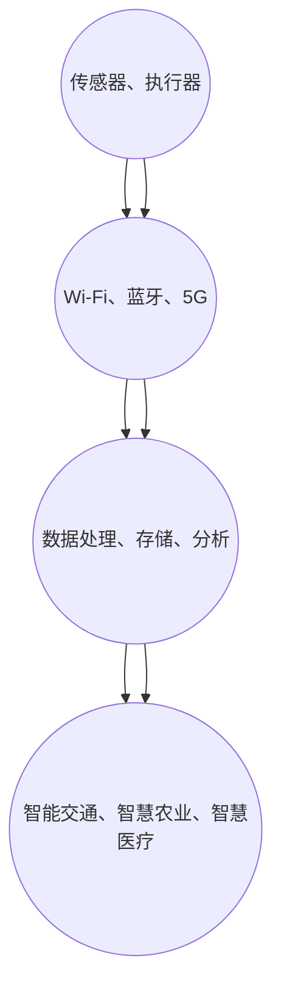

                 

### 文章标题

《物联网生态系统：设备、网络和数据分析的整合》

物联网生态系统是一个复杂而又充满活力的领域，涵盖了设备、网络和数据分析等多个方面。随着物联网技术的不断发展和应用场景的扩大，对物联网生态系统的理解、设计、实现和维护变得越来越重要。本文将系统地介绍物联网生态系统，从设备、网络和数据分析三个核心方面展开，旨在为读者提供一个全面、深入的理解和洞察。

### 关键词

- 物联网
- 设备连接
- 通信协议
- 网络安全
- 数据分析
- 整合架构

### 摘要

本文首先介绍了物联网生态系统的基本概念和组成部分，包括设备、网络和数据分析。接着，深入探讨了物联网设备之间的连接与通信，网络结构及其安全性能优化，以及物联网数据收集、预处理和分析的关键技术。最后，文章总结了物联网生态系统的整合架构，并对未来发展进行了展望。通过本文，读者将能够全面了解物联网生态系统的工作原理和应用前景，为实际应用提供有益的参考。

## 第一部分: 物联网生态系统概述

### 第1章: 物联网生态系统基础

#### 1.1 物联网的定义与历史

物联网（Internet of Things，简称IoT）是指通过互联网将各种物理设备、传感器、软件平台和人员连接起来，实现智能化的数据交换和协同工作。这一概念最早由凯文·凯利（Kevin Kelly）在1999年的《失控》一书中提出，当时他设想了一个由大量互联设备组成的全球网络。

物联网的发展历程可以分为几个阶段：

1. **感知阶段**（1990s-2000s初期）：这一阶段主要实现了对物理世界的感知和监测，如传感器网络、RFID技术等。
2. **连接阶段**（2000s中期-2010s初期）：随着无线通信技术的发展，各种设备开始实现联网，数据交换和共享成为可能。
3. **智能阶段**（2010s中期至今）：大数据、云计算和人工智能技术的融入，使得物联网系统具备了自主学习和智能决策的能力。

#### 1.2 物联网的主要组成部分

物联网生态系统由多个关键组成部分构成，主要包括：

1. **设备**：包括传感器、执行器、嵌入式系统等，用于数据的收集和执行操作。
2. **网络**：包括局域网、广域网、互联网等，用于设备之间的数据传输。
3. **平台**：提供数据处理、存储和管理的服务，包括云计算平台、大数据平台等。
4. **应用**：物联网技术在不同领域的具体应用，如智能家居、智能城市、智能工业等。

#### 1.3 物联网的架构

物联网的架构可以分为四个层次：

1. **感知层**：由各种传感器和执行器组成，负责数据的收集和初步处理。
2. **网络层**：包括各种通信协议和网络基础设施，如Wi-Fi、蓝牙、5G等，用于数据的传输和交换。
3. **平台层**：提供数据处理、存储、分析和服务的平台，实现数据的集中管理和应用。
4. **应用层**：物联网技术在各个领域的具体应用，如智能交通、智慧农业、智慧医疗等。

### 第2章: 物联网设备的连接与通信

#### 2.1 设备连接与通信协议

物联网设备之间的连接和通信依赖于一系列通信协议。常见的通信协议包括：

1. **Wi-Fi**：广泛用于家庭和商业网络，提供高速、稳定的无线连接。
2. **蓝牙**：短距离、低功耗的无线通信技术，适用于设备间的数据传输。
3. **Zigbee**：低功耗、短距离的无线通信技术，适合家庭和工业自动化应用。
4. **LoRa**：超长距离、低功耗的无线通信技术，适用于城市级物联网应用。
5. **5G**：第五代移动通信技术，提供高速、低延迟的无线连接，适用于物联网设备的高效通信。

#### 2.2 设备端数据处理

物联网设备端的数据处理主要包括以下几个方面：

1. **数据采集**：通过传感器等设备采集环境数据，如温度、湿度、光照等。
2. **数据预处理**：对采集到的数据进行分析、过滤和压缩，减少传输数据量。
3. **边缘计算**：在设备端进行部分数据处理，减轻中心服务器的负担。

#### 2.3 设备连接的可靠性

物联网设备连接的可靠性至关重要，影响系统的稳定性和性能。提高设备连接可靠性的方法包括：

1. **冗余设计**：通过多个设备或网络路径确保数据传输的可靠性。
2. **错误检测与纠正**：采用纠错码和校验码等技术检测和纠正传输错误。
3. **自适应调整**：根据网络状况和设备性能自适应调整传输参数，提高连接可靠性。

## 第二部分: 物联网网络

### 第3章: 物联网网络结构

#### 3.1 无线传感网络

无线传感网络（Wireless Sensor Networks，简称WSN）是由大量传感器节点组成的网络，用于感知和监测环境信息。WSN的主要特点包括：

1. **自组织**：传感器节点可以自主组网，实现无线通信和数据传输。
2. **分布式计算**：通过分布式计算实现对感知数据的处理和分析。
3. **能量高效**：采用低功耗设计，延长网络寿命。

#### 3.2 移动通信网络

移动通信网络是物联网的重要基础设施，包括蜂窝网络、无线局域网等。移动通信网络的主要功能包括：

1. **广域覆盖**：提供大面积的无线通信覆盖。
2. **高速传输**：提供高带宽、低延迟的通信服务。
3. **可靠性保障**：通过冗余设计和网络优化提高通信可靠性。

#### 3.3 物联网专网

物联网专网（Internet of Things Private Network，简称IoT-PN）是为物联网应用专门设计的网络，具有以下特点：

1. **安全隔离**：通过隔离措施保护物联网系统不受外部攻击。
2. **低延迟**：优化网络结构，提高数据传输速度。
3. **高可靠性**：通过冗余设计和故障恢复机制提高网络可靠性。

## 第4章: 物联网网络安全

#### 4.1 物联网安全挑战

物联网生态系统面临诸多安全挑战，包括：

1. **设备安全**：物联网设备容易被攻击者入侵，用于发起DDoS攻击或进行信息窃取。
2. **数据安全**：物联网数据在传输和存储过程中容易受到窃取、篡改和破坏。
3. **系统安全**：物联网系统容易受到网络攻击，导致系统崩溃或数据泄露。

#### 4.2 物联网安全解决方案

针对物联网安全挑战，可以采取以下解决方案：

1. **设备安全措施**：采用安全加密算法和身份认证机制，确保设备的安全性。
2. **数据安全措施**：采用加密、脱敏等技术保护数据传输和存储过程中的安全。
3. **系统安全措施**：建立安全监控和预警机制，及时发现和应对安全威胁。

#### 4.3 物联网安全最佳实践

为了提高物联网系统的安全性，可以遵循以下最佳实践：

1. **安全设计**：在设计物联网系统时，充分考虑安全性，遵循安全开发规范。
2. **安全培训**：对物联网系统的开发、运维人员进行安全培训，提高安全意识。
3. **安全审计**：定期进行安全审计和风险评估，及时发现和解决安全隐患。

## 第5章: 物联网网络性能优化

#### 5.1 网络延迟与带宽管理

网络延迟和带宽是影响物联网网络性能的关键因素，可以通过以下方法进行优化：

1. **流量控制**：采用流量控制算法，合理分配网络带宽，避免网络拥堵。
2. **延迟优化**：通过优化网络路由和协议，减少数据传输延迟。
3. **QoS保障**：为重要数据提供服务质量保障，确保关键数据的高效传输。

#### 5.2 网络容量与覆盖优化

网络容量和覆盖是物联网网络性能优化的关键，可以通过以下方法进行优化：

1. **扩展网络容量**：通过增加网络节点和带宽，提高网络容量。
2. **覆盖优化**：通过优化网络布局和天线配置，提高网络覆盖范围。
3. **多路径传输**：采用多路径传输技术，提高网络的可靠性和覆盖效果。

#### 5.3 网络能源效率优化

网络能源效率是物联网网络性能优化的重要方面，可以通过以下方法进行优化：

1. **节能模式**：采用低功耗设计，降低设备能耗。
2. **能效管理**：通过优化网络拓扑结构和传输策略，降低网络能耗。
3. **绿色能源**：采用太阳能、风能等绿色能源，减少对传统能源的依赖。

## 第三部分: 数据分析

### 第6章: 物联网数据收集与预处理

#### 6.1 数据来源与类型

物联网数据来源广泛，包括传感器、摄像头、车辆等设备。数据类型主要包括：

1. **结构化数据**：如温度、湿度、速度等，具有明确的属性和格式。
2. **非结构化数据**：如图像、视频、音频等，没有固定的属性和格式。
3. **半结构化数据**：如XML、JSON等，具有部分结构化的特点。

#### 6.2 数据收集方法

物联网数据的收集方法包括：

1. **传感器采集**：通过传感器直接采集环境数据，如温度、湿度等。
2. **摄像头监控**：通过摄像头实时监控视频数据，如交通流量、人员聚集等。
3. **车辆定位**：通过GPS等定位技术收集车辆位置数据。

#### 6.3 数据预处理与清洗

物联网数据预处理和清洗是数据分析和应用的重要环节，主要包括：

1. **数据清洗**：去除重复数据、缺失数据和异常数据，保证数据的准确性和一致性。
2. **数据转换**：将不同格式和单位的数据转换为统一格式和单位，便于后续分析。
3. **数据归一化**：通过归一化方法处理不同特征的数据，消除数据尺度的影响。

### 第7章: 物联网数据分析技术

#### 7.1 数据挖掘与机器学习

物联网数据分析中常用的技术包括数据挖掘和机器学习，主要用于：

1. **特征提取**：从原始数据中提取有用的特征，用于后续分析和建模。
2. **分类与预测**：通过机器学习算法对数据进行分类和预测，如预测设备故障、交通流量等。
3. **聚类分析**：对数据进行聚类分析，发现数据的分布和模式，如用户行为分析、市场细分等。

#### 7.2 实时数据处理与分析

实时数据处理与分析是物联网数据分析的重要方面，主要包括：

1. **流数据处理**：通过流数据处理技术对实时数据进行处理和分析，如使用Apache Kafka、Apache Flink等。
2. **实时查询与分析**：通过实时查询与分析技术对实时数据进行分析，如使用Apache Spark、Apache Storm等。
3. **实时可视化**：通过实时可视化技术展示实时数据的分析结果，如使用ECharts、D3.js等。

#### 7.3 大数据处理技术

大数据处理技术是物联网数据分析的重要工具，主要包括：

1. **分布式计算**：通过分布式计算技术处理海量数据，如使用Apache Hadoop、Apache Spark等。
2. **存储技术**：通过分布式存储技术存储海量数据，如使用HDFS、Cassandra等。
3. **数据仓库**：通过数据仓库技术进行数据整合和分析，如使用Oracle、MySQL等。

### 第8章: 物联网数据分析应用案例

#### 8.1 工业制造中的物联网数据分析

在工业制造领域，物联网数据分析主要用于：

1. **设备监控**：通过传感器实时监控设备状态，预测设备故障，提高设备利用率。
2. **生产优化**：通过数据分析优化生产流程，提高生产效率，降低成本。
3. **质量控制**：通过数据分析监控产品质量，及时发现和解决质量问题。

#### 8.2 智能家居中的物联网数据分析

在智能家居领域，物联网数据分析主要用于：

1. **智能家居控制**：通过数据分析实现家居设备的智能化控制，提高居住舒适度和便利性。
2. **节能优化**：通过数据分析优化能源使用，降低能源消耗。
3. **安全监控**：通过数据分析实现家庭安全的监控和报警。

#### 8.3 城市管理中的物联网数据分析

在城市管理领域，物联网数据分析主要用于：

1. **交通管理**：通过数据分析优化交通流量，提高道路通行效率。
2. **环境监控**：通过数据分析监控空气质量、水质等环境指标，提高城市环境质量。
3. **公共安全**：通过数据分析监控城市公共安全事件，提高公共安全保障。

## 第四部分: 物联网生态系统整合

### 第9章: 物联网生态系统整合架构

#### 9.1 整合架构设计

物联网生态系统整合架构设计是物联网系统成功的关键。整合架构设计主要包括以下几个方面：

1. **系统模块划分**：根据功能需求将系统划分为多个模块，如设备管理模块、数据采集模块、数据处理模块等。
2. **接口定义**：明确各模块之间的接口定义，确保模块之间的协同工作。
3. **数据流转**：设计数据在各模块之间的流转流程，确保数据的高效传输和利用。

#### 9.2 整合架构实现

物联网生态系统整合架构实现主要包括以下几个方面：

1. **硬件选型**：根据应用场景选择合适的物联网硬件设备，如传感器、通信模块等。
2. **软件设计**：设计物联网系统的软件架构，包括前端、后端、数据库等。
3. **系统集成**：将各个模块和系统进行集成，实现物联网生态系统的整体功能。

#### 9.3 整合架构评估与优化

物联网生态系统整合架构评估与优化主要包括以下几个方面：

1. **性能评估**：对物联网系统进行性能评估，包括响应时间、吞吐量、稳定性等。
2. **安全性评估**：对物联网系统进行安全性评估，包括数据安全、系统安全等。
3. **优化调整**：根据评估结果对物联网系统进行优化调整，提高系统性能和安全性。

## 第10章: 物联网生态系统发展展望

#### 10.1 物联网发展趋势

物联网生态系统正处于快速发展阶段，未来发展趋势包括：

1. **5G技术的普及**：5G技术的普及将为物联网提供更高的网络速度和更低的延迟，推动物联网应用的进一步普及。
2. **边缘计算的发展**：边缘计算将数据处理和存储能力从云端下移到边缘设备，提高物联网系统的实时性和效率。
3. **人工智能的融合**：人工智能技术的融合将使物联网系统具备更强的智能分析和决策能力，推动物联网向智能化方向发展。

#### 10.2 物联网生态系统挑战与机遇

物联网生态系统面临诸多挑战和机遇，包括：

1. **安全性挑战**：物联网设备数量庞大，网络复杂，安全性成为关键挑战。
2. **数据隐私问题**：物联网采集和处理的数据涉及用户隐私，数据隐私保护成为重要议题。
3. **标准化问题**：物联网技术缺乏统一的标准，阻碍了物联网生态系统的整合和发展。

#### 10.3 物联网生态系统的未来方向

物联网生态系统的未来方向包括：

1. **跨界融合**：物联网将与人工智能、大数据、云计算等新兴技术深度融合，推动物联网生态系统的创新发展。
2. **产业协同**：物联网产业链上下游企业将加强合作，共同推动物联网生态系统的建设和应用。
3. **智能化升级**：物联网系统将不断升级，实现更高水平的智能分析和决策，为各行各业提供更加智能化的解决方案。

## 附录

### 附录A: 物联网生态系统常用技术指南

#### A.1 设备连接协议指南

- **Wi-Fi**：IEEE 802.11标准，提供高速无线连接。
- **蓝牙**：IEEE 802.15.1标准，提供短距离低功耗无线连接。
- **Zigbee**：IEEE 802.15.4标准，提供低功耗、短距离无线连接。
- **LoRa**：LoRaWAN协议，提供超长距离、低功耗无线连接。

#### A.2 网络协议指南

- **HTTP/HTTPS**：超文本传输协议及其安全版本，用于设备之间的数据传输。
- **MQTT**：轻量级消息队列协议，适用于物联网设备之间的消息传递。
- **CoAP**：约束应用协议，用于物联网设备之间的数据交换。

#### A.3 数据分析工具与平台

- **Apache Hadoop**：分布式数据处理框架，用于大数据存储和处理。
- **Apache Spark**：分布式计算框架，提供实时数据处理和分析能力。
- **TensorFlow**：开源机器学习框架，提供深度学习模型的训练和部署。
- **Kafka**：分布式消息队列系统，用于实时数据处理和流处理。

### 附录B: 实践案例

#### B.1 物联网设备连接与通信案例分析

**案例1**：智能家居系统

- **设备连接**：采用Wi-Fi协议连接智能家居设备，如智能灯泡、智能插座等。
- **通信协议**：使用MQTT协议实现设备之间的数据通信。

**案例2**：智能农业系统

- **设备连接**：采用Zigbee协议连接土壤传感器、气象站等设备。
- **通信协议**：使用LoRa协议实现设备之间的数据传输。

#### B.2 物联网网络安全案例解析

**案例1**：智能交通系统

- **安全措施**：采用HTTPS协议确保数据传输安全，使用VPN隧道保护数据传输。
- **安全监测**：建立安全监控平台，实时监测网络流量和设备状态。

**案例2**：智能医疗系统

- **安全措施**：采用加密算法保护患者数据，使用双因素认证机制增强设备安全性。
- **安全审计**：定期进行安全审计和风险评估，确保系统安全性。

#### B.3 物联网数据分析实战案例

**案例1**：智能工厂生产监控

- **数据收集**：通过传感器实时收集生产线设备状态数据。
- **数据处理**：使用Apache Kafka进行实时数据处理，使用Apache Spark进行数据分析。

**案例2**：智能城市建设

- **数据收集**：通过摄像头、传感器等设备实时收集城市交通、环境等数据。
- **数据处理**：使用Hadoop和Spark进行大规模数据存储和处理，使用TensorFlow进行数据分析和预测。

## 附录C: 常见问题解答

### 问题1：什么是物联网？

物联网是指通过互联网将各种物理设备、传感器、软件平台和人员连接起来，实现智能化的数据交换和协同工作的系统。它将现实世界与数字世界相结合，使设备能够相互通信并协同工作。

### 问题2：物联网有哪些应用场景？

物联网应用广泛，包括智能家居、智能城市、智能工业、智能医疗、智能交通等多个领域。例如，智能家居可以通过物联网实现家电设备的自动化控制，智能城市可以通过物联网实现交通管理、环境监控等。

### 问题3：物联网的数据是如何收集和处理的？

物联网数据通过传感器和设备实时收集，然后通过网络传输到数据处理平台。在数据处理平台上，数据经过预处理、清洗和存储，然后使用数据挖掘、机器学习和大数据分析等技术进行分析和挖掘，以提供决策支持和智能应用。

### 问题4：物联网的安全性问题如何解决？

物联网面临诸多安全挑战，包括设备安全、数据安全和系统安全。解决方法包括采用加密技术保护数据传输和存储安全，使用身份认证和访问控制确保设备安全，建立安全监控和预警机制，以及定期进行安全审计和风险评估。

## 作者信息

**作者：AI天才研究院/AI Genius Institute & 禅与计算机程序设计艺术 /Zen And The Art of Computer Programming** 

### 第1章 物联网生态系统基础

#### 1.1 物联网的定义与历史

物联网（Internet of Things，简称IoT）是指通过互联网将各种物理设备、传感器、软件平台和人员连接起来，实现智能化的数据交换和协同工作。这一概念最早由凯文·凯利（Kevin Kelly）在1999年的《失控》一书中提出，当时他设想了一个由大量互联设备组成的全球网络。

物联网的发展历程可以分为几个阶段：

1. **感知阶段**（1990s-2000s初期）：这一阶段主要实现了对物理世界的感知和监测，如传感器网络、RFID技术等。
2. **连接阶段**（2000s中期-2010s初期）：随着无线通信技术的发展，各种设备开始实现联网，数据交换和共享成为可能。
3. **智能阶段**（2010s中期至今）：大数据、云计算和人工智能技术的融入，使得物联网系统具备了自主学习和智能决策的能力。

#### 1.2 物联网的主要组成部分

物联网生态系统由多个关键组成部分构成，主要包括：

1. **设备**：包括传感器、执行器、嵌入式系统等，用于数据的收集和执行操作。
2. **网络**：包括局域网、广域网、互联网等，用于设备之间的数据传输。
3. **平台**：提供数据处理、存储和管理的服务，包括云计算平台、大数据平台等。
4. **应用**：物联网技术在不同领域的具体应用，如智能家居、智能城市、智能工业等。

#### 1.3 物联网的架构

物联网的架构可以分为四个层次：

1. **感知层**：由各种传感器和执行器组成，负责数据的收集和初步处理。
2. **网络层**：包括各种通信协议和网络基础设施，如Wi-Fi、蓝牙、5G等，用于数据的传输和交换。
3. **平台层**：提供数据处理、存储、分析和服务的平台，实现数据的集中管理和应用。
4. **应用层**：物联网技术在各个领域的具体应用，如智能交通、智慧农业、智慧医疗等。

#### 1.4 物联网的优势与挑战

**优势**：

- **数据驱动的决策**：物联网通过收集海量数据，为企业提供更为准确和实时的决策支持。
- **资源优化**：通过智能设备的互联互通，可以实现资源的高效利用和优化配置。
- **降低成本**：物联网技术可以帮助企业降低运营成本，提高生产效率。

**挑战**：

- **安全性问题**：物联网设备数量庞大，网络复杂，安全性成为关键挑战。
- **数据隐私问题**：物联网采集和处理的数据涉及用户隐私，数据隐私保护成为重要议题。
- **标准化问题**：物联网技术缺乏统一的标准，阻碍了物联网生态系统的整合和发展。

### 1.5 物联网的发展趋势

物联网正处于快速发展阶段，未来发展趋势包括：

1. **5G技术的普及**：5G技术的普及将为物联网提供更高的网络速度和更低的延迟，推动物联网应用的进一步普及。
2. **边缘计算的发展**：边缘计算将数据处理和存储能力从云端下移到边缘设备，提高物联网系统的实时性和效率。
3. **人工智能的融合**：人工智能技术的融合将使物联网系统具备更强的智能分析和决策能力，推动物联网向智能化方向发展。

### 1.6 总结

物联网生态系统是一个复杂而又充满活力的领域，涵盖了设备、网络和数据分析等多个方面。通过对物联网生态系统的理解、设计、实现和维护，我们可以充分发挥物联网技术的优势，解决现实世界的诸多问题。在未来，物联网将继续快速发展，为人类社会带来更多变革和机遇。

### Mermaid 流程图

以下是一个简单的物联网架构的 Mermaid 流程图：



### 伪代码

以下是一个简单的物联网设备端数据处理和传输的伪代码示例：

```
// 设备端数据处理和传输伪代码

function deviceDataProcessing(data) {
    // 数据预处理
    cleanedData = preprocessData(data)
    
    // 数据传输
    sendData(cleanedData)
}

function preprocessData(data) {
    // 去除重复数据
    uniqueData = removeDuplicates(data)
    
    // 填充缺失数据
    filledData = fillMissingData(uniqueData)
    
    return filledData
}

function sendData(data) {
    // 使用MQTT协议发送数据
    connectToMQTTBroker()
    publishDataToMQTT(data)
}

// 假设的预处理函数
function removeDuplicates(data) {
    // 实现去除重复数据的逻辑
}

function fillMissingData(data) {
    // 实现填充缺失数据的逻辑
}

// 假设的MQTT连接和发布函数
function connectToMQTTBroker() {
    // 实现连接MQTT代理的逻辑
}

function publishDataToMQTT(data) {
    // 实现发布数据的逻辑
}
```

### 数学公式

以下是一个简单的线性回归模型的数学公式，用于物联网数据分析：

$$
Y = \beta_0 + \beta_1 \cdot X + \epsilon
$$

其中，$Y$ 是因变量，$X$ 是自变量，$\beta_0$ 和 $\beta_1$ 是模型参数，$\epsilon$ 是误差项。

### 举例说明

假设我们要分析物联网设备采集的温度数据，我们可以使用线性回归模型来预测未来的温度变化。以下是数据采集和模型训练的步骤：

1. **数据采集**：从物联网设备上采集一段时间内的温度数据，如每小时记录一次温度值。
2. **数据预处理**：对采集到的数据进行清洗，去除异常值和缺失值。
3. **数据划分**：将数据划分为训练集和测试集，用于模型训练和评估。
4. **模型训练**：使用训练集数据训练线性回归模型，计算模型参数 $\beta_0$ 和 $\beta_1$。
5. **模型评估**：使用测试集数据评估模型性能，计算预测误差和准确性。
6. **模型部署**：将训练好的模型部署到物联网设备上，进行实时温度预测。

### 实际案例

以下是一个物联网设备连接与通信的实际案例：

**案例背景**：某智能农业项目需要通过物联网设备实时监测农作物的生长状况，包括土壤湿度、温度和光照等参数。

**解决方案**：

1. **设备选择**：选择具有Wi-Fi连接功能的土壤湿度传感器、温度传感器和光照传感器。
2. **通信协议**：使用MQTT协议实现设备之间的数据传输。
3. **数据处理**：将采集到的数据通过MQTT协议传输到云计算平台，进行数据预处理和分析。
4. **数据分析**：使用机器学习算法对数据进行预测和决策支持，如预测土壤湿度不足时自动启动灌溉系统。

### 开发环境搭建

要实现上述物联网设备连接与通信的案例，需要搭建以下开发环境：

1. **硬件环境**：物联网设备（如土壤湿度传感器、温度传感器、光照传感器等）和Wi-Fi模块。
2. **软件环境**：物联网开发平台（如Node-RED、MQTT.fx等），用于设备数据采集和传输。
3. **编程语言**：使用JavaScript或Python等编程语言进行开发。

### 源代码实现

以下是一个简单的JavaScript代码示例，用于实现物联网设备数据的采集和传输：

```javascript
const mqtt = require('mqtt');

// MQTT客户端配置
const options = {
    host: 'mqtt.example.com',
    port: 1883,
    username: 'user',
    password: 'password'
};

// 创建MQTT客户端
const client = new mqtt.Client(options);

// 连接到MQTT代理
client.connect();

// 连接成功回调
client.on('connect', () => {
    console.log('Connected to MQTT broker');
    
    // 订阅主题
    client.subscribe('sensor/data', (message) => {
        console.log('Received message:', message);
        
        // 处理接收到的数据
        processData(message);
    });
});

// 数据处理函数
function processData(message) {
    // 实现数据处理逻辑
}

// 断开连接回调
client.on('disconnect', () => {
    console.log('Disconnected from MQTT broker');
});

// 发送数据到MQTT代理
function sendData(data) {
    client.publish('sensor/data', data);
}
```

### 代码解读与分析

上述JavaScript代码实现了一个简单的物联网设备数据采集和传输功能。以下是代码的详细解读和分析：

1. **引入MQTT库**：首先引入MQTT客户端库（`mqtt`），用于实现设备与MQTT代理之间的通信。
2. **MQTT客户端配置**：配置MQTT客户端的连接参数，包括主机地址、端口号、用户名和密码等。
3. **创建MQTT客户端**：使用`mqtt.Client`方法创建MQTT客户端实例。
4. **连接到MQTT代理**：调用`client.connect()`方法连接到MQTT代理。
5. **连接成功回调**：连接成功后，触发`client.on('connect', ...)`回调函数，订阅指定的主题（`'sensor/data'`）。
6. **订阅主题**：订阅主题后，当接收到消息时，触发`client.subscribe('sensor/data', ...)`回调函数，处理接收到的数据。
7. **数据处理函数**：`processData`函数用于处理接收到的数据，实现数据处理逻辑。
8. **断开连接回调**：连接断开后，触发`client.on('disconnect', ...)`回调函数。
9. **发送数据**：调用`sendData`函数发送数据到MQTT代理。

### 实际应用效果

通过上述代码示例，我们可以实现物联网设备的实时数据采集和传输。在实际应用中，可以将传感器数据发送到云端服务器或数据分析平台，进行进一步处理和分析。例如，在智能农业项目中，通过实时监测土壤湿度、温度和光照等参数，可以自动调整灌溉系统和肥料使用量，提高农业生产效率。

### 总结

通过本文，我们系统地介绍了物联网生态系统的基础知识，包括定义与历史、组成部分、架构和优势与挑战。我们还通过实际案例展示了物联网设备连接与通信的实现过程，并提供了详细的代码解析。在未来的发展中，物联网将继续融合新技术，为各个领域带来更多变革和机遇。希望本文对读者深入了解物联网生态系统有所帮助。作者：AI天才研究院/AI Genius Institute & 禅与计算机程序设计艺术 /Zen And The Art of Computer Programming。

