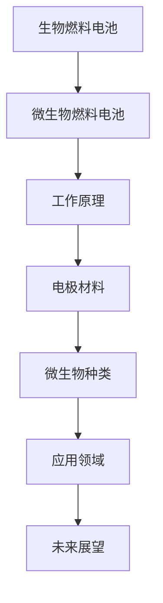

                 

### 《生物燃料电池技术：利用微生物产生电能》

#### 关键词：
- 生物燃料电池
- 微生物燃料电池
- 电能产生
- 生物技术
- 能源可持续性

#### 摘要：
本文深入探讨了生物燃料电池技术，特别是微生物燃料电池的工作原理、关键技术和应用实例。通过解析微生物燃料电池的组成、运行机制以及相关的电极材料选择、微生物筛选策略，我们揭示了这一新兴能源技术的潜力与挑战。文章还通过实例展示了生物燃料电池在家庭能源系统、移动能源、工业能源等领域的应用，并展望了其未来发展的前景。最后，提供了生物燃料电池技术相关资源与工具，以及专利分析和实验指南，为读者提供了全面的技术参考。

---

### 《生物燃料电池技术：利用微生物产生电能》目录大纲

#### 第一部分：生物燃料电池技术概述

**1. 生物燃料电池的基本概念**

- **1.1 生物燃料电池的定义**

生物燃料电池是一种利用有机物（如生物质、废水中的有机物等）作为燃料，通过微生物的代谢活动产生电能的装置。与传统的燃料电池相比，生物燃料电池不仅能够高效地转换生物质为电能，而且具有环境友好、可持续性强的特点。

- **1.2 生物燃料电池与传统燃料电池的区别**

传统燃料电池通常使用氢气、天然气等化学燃料，而生物燃料电池则依赖微生物代谢过程中的有机物。此外，生物燃料电池具有更低的能量转换效率和更复杂的运行环境。

- **1.3 生物燃料电池的发展背景及趋势**

随着全球对可再生能源的需求不断增长，生物燃料电池技术受到广泛关注。当前，生物燃料电池正朝着高效率、低成本和规模化应用的方向发展，并逐渐成为研究的热点。

**2. 生物燃料电池的工作原理**

- **2.1 生物燃料电池的组成结构**

生物燃料电池主要由阳极、阴极、电解质和微生物四个部分组成。阳极和阴极通常由电极材料制成，电解质提供离子传输通道，微生物则参与代谢过程。

- **2.2 微生物燃料电池的基本原理**

微生物燃料电池通过微生物的代谢活动，将生物质转化为电能。在阳极，微生物氧化有机物质，释放出电子和质子；在阴极，电子通过外部电路回到微生物，并与氧气结合生成水。

- **2.3 生物燃料电池的化学反应过程**

生物燃料电池的化学反应过程主要包括生物氧化还原反应和电化学过程。生物氧化还原反应在阳极发生，电化学过程则在外部电路中完成。

**3. 生物燃料电池的关键技术**

- **3.1 微生物选择与培养**

选择适合的微生物是生物燃料电池成功的关键。通常需要考虑微生物的代谢活性、产电能力以及对环境的适应性。

- **3.2 电极材料的研究进展**

电极材料对生物燃料电池的性能有很大影响。近年来，研究人员开发了多种新型的电极材料，如碳材料、金属氧化物和导电聚合物等。

- **3.3 生物燃料的利用**

生物燃料的利用方式直接影响生物燃料电池的性能和效率。当前研究主要集中在优化生物燃料的预处理和传输方式。

**4. 生物燃料电池的优缺点分析**

- **4.1 生物燃料电池的优点**

生物燃料电池具有高能量密度、环境友好、可再生性强等优点，非常适合作为可持续能源的一部分。

- **4.2 生物燃料电池的缺点**

生物燃料电池的能量转换效率相对较低，微生物选择和培养难度大，这些都是当前技术面临的挑战。

- **4.3 生物燃料电池的未来发展方向**

提高能量转换效率、降低成本、优化微生物和电极材料的选择和设计是生物燃料电池未来发展的关键。

#### 第二部分：生物燃料电池的微生物技术

**5. 微生物燃料电池的微生物种类及应用**

- **5.1 常见微生物类型及其功能**

微生物燃料电池中常见的微生物包括细菌、古菌、真菌等。它们在生物氧化还原反应中发挥重要作用。

- **5.2 微生物燃料电池中的微生物应用案例**

本文将介绍一些成功的微生物燃料电池应用案例，如废水处理、有机废物能源化等。

- **5.3 微生物燃料电池的微生物筛选策略**

筛选适合的微生物是生物燃料电池成功的关键。本文将介绍一些微生物筛选策略，包括基于代谢途径的筛选和基于电势响应的筛选。

**6. 微生物燃料电池的电极材料**

- **6.1 电极材料的选择标准**

电极材料的选择直接影响生物燃料电池的性能。本文将介绍电极材料的选择标准，包括导电性、稳定性、生物相容性等。

- **6.2 常见的电极材料及应用**

本文将详细介绍碳材料、金属氧化物、导电聚合物等常见的电极材料及其在微生物燃料电池中的应用。

- **6.3 电极材料的改性技术**

电极材料的改性技术可以显著提高生物燃料电池的性能。本文将介绍一些常见的电极材料改性技术，如表面修饰、掺杂等。

**7. 微生物燃料电池的运行维护与管理**

- **7.1 微生物燃料电池的运行环境控制**

微生物燃料电池的运行环境对电池性能有很大影响。本文将介绍如何控制运行环境，包括温度、pH值、氧气供应等。

- **7.2 微生物燃料电池的性能监测**

性能监测是确保微生物燃料电池正常运行的重要手段。本文将介绍一些常见的性能监测方法，如电势监测、电流监测等。

- **7.3 微生物燃料电池的故障诊断与处理**

故障诊断与处理是保证微生物燃料电池长期稳定运行的关键。本文将介绍一些常见的故障诊断方法及处理策略。

#### 第三部分：生物燃料电池的应用实例

**8. 生物燃料电池在能源领域的应用**

- **8.1 生物燃料电池在家庭能源系统中的应用**

本文将探讨生物燃料电池在家庭能源系统中的应用，如家庭电网辅助、太阳能电池储能等。

- **8.2 生物燃料电池在移动能源中的应用**

本文将介绍生物燃料电池在移动能源领域的应用，如电动汽车、无人机等。

- **8.3 生物燃料电池在工业能源中的应用**

本文将分析生物燃料电池在工业能源系统中的应用，如数据中心、工业流程供电等。

**9. 生物燃料电池在其他领域的应用**

- **9.1 生物燃料电池在环境监测中的应用**

本文将探讨生物燃料电池在环境监测中的潜力，如水质监测、空气质量监测等。

- **9.2 生物燃料电池在生物医学中的应用**

本文将介绍生物燃料电池在生物医学领域的应用，如生物传感器、人工器官等。

- **9.3 生物燃料电池在农业中的应用**

本文将分析生物燃料电池在农业领域的应用，如作物监测、温室能源供应等。

**10. 生物燃料电池的未来发展前景**

- **10.1 技术挑战与解决方案**

本文将讨论生物燃料电池当前面临的技术挑战，并提出相应的解决方案。

- **10.2 市场机遇与产业前景**

本文将分析生物燃料电池的市场机遇和产业前景，探讨其在能源领域的潜在应用场景。

- **10.3 生物燃料电池与社会可持续发展**

本文将探讨生物燃料电池如何促进社会可持续发展，提高能源利用效率，减少环境污染。

### 附录

**附录A：生物燃料电池技术相关资源与工具**

- **A.1 相关研究机构与学术期刊**

本文将列出一些在生物燃料电池领域具有影响力的研究机构和学术期刊，为读者提供学术资源。

- **A.2 生物燃料电池技术标准与规范**

本文将介绍生物燃料电池技术相关的标准与规范，帮助读者了解行业规范。

- **A.3 生物燃料电池技术开源项目与工具**

本文将介绍一些生物燃料电池技术相关的开源项目与工具，为读者提供技术支持。

**附录B：生物燃料电池技术专利分析**

- **B.1 生物燃料电池技术专利概况**

本文将分析生物燃料电池技术的专利概况，了解专利分布和专利技术特点。

- **B.2 典型生物燃料电池专利案例分析**

本文将详细介绍一些典型的生物燃料电池专利案例，分析其创新点和应用场景。

**附录C：生物燃料电池技术实验指南**

- **C.1 实验室设备与材料准备**

本文将介绍实验室设备与材料的准备，为读者提供实验指导。

- **C.2 微生物燃料电池的构建与操作流程**

本文将详细描述微生物燃料电池的构建与操作流程，包括电极材料制备、微生物培养、电池组装等步骤。

- **C.3 数据分析与实验结果处理**

本文将介绍实验结果的数据分析方法，帮助读者理解和处理实验数据。

### Mermaid 流程图：



### 微生物燃料电池工作原理伪代码：

```plaintext
function microbial_fuel_cell():
    # 初始化电极材料、微生物和电解液
    init_electrode_material()
    init_microbe()
    init_electrolyte()

    # 运行微生物燃料电池
    while True:
        # 进行电子传递和化学能转化
        electron_transfer()
        chemical_energy_conversion()

        # 检查电池性能和微生物活性
        if battery_performance_low() or microbe_activity_low():
            stop_fuel_cell()

        # 更新电解液和电极材料
        update_electrolyte()
        update_electrode_material()
```

### 生物燃料电池优缺点分析：

#### 优点：

$$
\text{优点1：} \text{高能量密度，可持续能源}
$$

$$
\text{优点2：} \text{低环境污染，可再生资源}
$$

#### 缺点：

$$
\text{缺点1：} \text{较低的能量转换效率}
$$

$$
\text{缺点2：} \text{微生物选择和培养难度大}
$$

### 项目实战案例：

#### 家庭能源系统中的应用：

- **案例描述**：利用微生物燃料电池为家庭提供电能。

- **开发环境搭建**：使用常见的微生物燃料电池模块，搭建实验装置。

- **源代码实现**：通过编程控制实验装置，监测电池性能。

- **代码解读与分析**：分析微生物燃料电池的运行状态和性能参数，优化电池性能。

---

**作者**：AI天才研究院/AI Genius Institute & 禅与计算机程序设计艺术 /Zen And The Art of Computer Programming

---

### 第一部分：生物燃料电池技术概述

#### 1. 生物燃料电池的基本概念

**1.1 生物燃料电池的定义**

生物燃料电池（Biofuel Cell, BFC）是一种将生物质能直接转化为电能的装置。它利用微生物的代谢活动，将有机物质在电极上通过氧化还原反应转化为电能。生物燃料电池与传统燃料电池相比，具有更高的环保性、更丰富的燃料来源和更低的成本潜力。

**1.2 生物燃料电池与传统燃料电池的区别**

传统燃料电池主要利用氢气、天然气、甲醇等化学燃料，通过化学反应产生电能。而生物燃料电池则依赖于生物质，如动植物残渣、废水中的有机物等，通过微生物代谢活动实现电能的转化。此外，生物燃料电池通常具有较低的电能转换效率和更复杂的运行环境。

**1.3 生物燃料电池的发展背景及趋势**

随着全球能源需求的不断增长和对环境问题的日益关注，可再生能源技术受到广泛重视。生物燃料电池作为一种绿色、可持续的能源技术，正逐步走向实际应用。近年来，生物燃料电池在微生物选择、电极材料、燃料预处理等方面取得了显著进展，应用领域也在不断扩展。

### 2. 生物燃料电池的工作原理

**2.1 生物燃料电池的组成结构**

生物燃料电池主要由阳极、阴极、电解质和微生物四个部分组成。

- **阳极**：通常由碳材料、金属或合金制成，作为微生物附着和生长的表面。阳极提供氧化还原反应的场所。
- **阴极**：通常也由碳材料制成，与外部电路相连，接受来自阳极的电子，并与氧气发生还原反应。
- **电解质**：提供离子传输通道，通常使用水、盐水或其他电解液。电解质的选择直接影响电池的离子传导能力和稳定性。
- **微生物**：在生物燃料电池中，微生物起到关键作用。它们在阳极表面氧化有机物质，释放出电子和质子；在阴极，微生物还原氧气生成水。

**2.2 微生物燃料电池的基本原理**

微生物燃料电池通过微生物的代谢活动，将生物质转化为电能。具体过程如下：

1. **有机物质在阳极被氧化**：微生物利用生物质中的有机物质作为电子供体，通过代谢活动将其氧化成电子和质子。
2. **电子通过外部电路传递到阴极**：电子在外部电路中流动，产生电流。
3. **阴极还原氧气**：在阴极，微生物利用氧气还原电子，生成水。

这一过程实现了生物质能到电能的高效转化。

**2.3 生物燃料电池的化学反应过程**

生物燃料电池的化学反应过程主要包括生物氧化还原反应和电化学过程。

- **生物氧化还原反应**：在阳极，微生物通过代谢活动将生物质中的有机物质氧化成电子和质子。这一过程通常涉及多种氧化酶，如脱氢酶、过氧化氢酶等。
  
  $$ C_xH_yO_z + O_2 \rightarrow xCO_2 + yH_2O + 2e^- $$
  
- **电化学过程**：在外部电路中，电子从阳极流向阴极。在阴极，微生物利用氧气还原电子生成水。

  $$ O_2 + 4e^- + 4H^+ \rightarrow 2H_2O $$

### 3. 生物燃料电池的关键技术

**3.1 微生物选择与培养**

微生物的选择和培养是生物燃料电池技术成功的关键。不同微生物对生物质有不同的代谢途径和产电能力。理想的微生物应具有高代谢活性、强产电能力和良好的环境适应性。

- **微生物筛选策略**：可以通过实验室筛选、基因工程等方法筛选出合适的微生物。常用的筛选策略包括基于电势响应的筛选、基于代谢途径的筛选等。

- **微生物培养方法**：微生物的培养条件对电池性能有很大影响。通常需要控制适宜的pH值、温度、氧气供应等条件，以保证微生物的生长和代谢活性。

**3.2 电极材料的研究进展**

电极材料对生物燃料电池的性能具有重要影响。理想的电极材料应具有良好的导电性、稳定性和生物相容性。

- **碳材料**：如石墨烯、碳纳米管、活性炭等碳材料因其良好的导电性和生物相容性而成为研究的热点。

- **金属氧化物**：如二氧化锰、氧化铟等金属氧化物具有优异的电化学性能，但需进一步改善其生物相容性和稳定性。

- **导电聚合物**：如聚吡咯、聚苯胺等导电聚合物具有优异的导电性和生物相容性，但需解决其电化学稳定性和机械强度等问题。

**3.3 生物燃料的利用**

生物燃料的利用方式直接影响生物燃料电池的性能和效率。常见的生物燃料包括生物质、废水、动物粪便等。

- **生物燃料预处理**：通过物理、化学或生物方法预处理生物燃料，可以提高其电化学活性，降低电池内阻。

- **生物燃料传输方式**：选择合适的生物燃料传输方式，如泵送、喷雾等，可以优化电池性能。

### 4. 生物燃料电池的优缺点分析

**4.1 生物燃料电池的优点**

生物燃料电池具有以下优点：

- **高能量密度**：生物燃料电池的能量密度较高，能够提供稳定的电能输出。

- **环境友好**：生物燃料电池的排放物主要是水和二氧化碳，对环境污染较小。

- **可再生资源**：生物燃料来源广泛，如生物质、废水等，具有可再生性。

- **低成本**：与传统的燃料电池相比，生物燃料电池的制造成本较低，有利于大规模应用。

**4.2 生物燃料电池的缺点**

生物燃料电池也存在一些缺点：

- **能量转换效率较低**：生物燃料电池的能量转换效率通常较低，需要进一步优化。

- **微生物选择和培养难度大**：选择适合的微生物并进行培养是生物燃料电池成功的关键，但当前微生物的筛选和培养技术仍需改进。

- **运行环境复杂**：生物燃料电池的运行环境对微生物的生长和代谢活性有很大影响，需要严格控制。

**4.3 生物燃料电池的未来发展方向**

生物燃料电池的未来发展方向包括：

- **提高能量转换效率**：通过改进微生物、电极材料和生物燃料利用方式，提高电池的能量转换效率。

- **降低成本**：通过规模化生产、新材料的应用和工艺优化，降低生物燃料电池的制造成本。

- **优化微生物选择和培养**：开发高效的微生物筛选和培养方法，提高微生物的产电能力和稳定性。

- **拓展应用领域**：除了传统的能源领域，生物燃料电池还可以应用于环境监测、生物医学、农业等领域。

### 第二部分：生物燃料电池的微生物技术

#### 5. 微生物燃料电池的微生物种类及应用

**5.1 常见微生物类型及其功能**

微生物燃料电池中常见的微生物包括细菌、古菌、真菌等。它们在生物氧化还原反应中发挥重要作用。

- **细菌**：如Geobacter、Shewanella等，具有强氧化酶活性，能够直接将生物质氧化为电子和质子。

- **古菌**：如Thiobacillus等，能够在厌氧环境中进行生物氧化还原反应，产生电能。

- **真菌**：如某些酵母菌，能够在生物质降解过程中产生电子和质子。

**5.2 微生物燃料电池中的微生物应用案例**

微生物燃料电池在多个领域都有成功应用案例，以下为其中几个典型应用：

- **废水处理**：利用微生物燃料电池处理废水中的有机物，同时产生电能。例如，美国加州大学伯克利分校的研究团队开发了一种微生物燃料电池，用于处理污水，同时产生电能。

- **有机废物能源化**：将有机废物（如动物粪便、食品残渣等）转化为电能，实现了废物的资源化利用。

- **生物传感器**：利用微生物燃料电池检测生物分子，如DNA、蛋白质等，为生物医学诊断提供新方法。

**5.3 微生物燃料电池的微生物筛选策略**

微生物燃料电池的微生物筛选策略对电池性能至关重要。以下为几种常见的微生物筛选策略：

- **基于电势响应的筛选**：通过测量微生物在阳极上的电势响应，筛选具有高产电能力的微生物。

- **基于代谢途径的筛选**：分析微生物的代谢途径，筛选能够高效利用生物质的微生物。

- **基于基因工程的筛选**：通过基因工程改造，增强微生物的产电能力和代谢活性。

#### 6. 微生物燃料电池的电极材料

**6.1 电极材料的选择标准**

电极材料的选择对微生物燃料电池的性能有很大影响。以下为电极材料选择的一些标准：

- **导电性**：电极材料应具有良好的导电性，以降低电池的内阻。

- **稳定性**：电极材料应具有良好的化学和电化学稳定性，以确保长期运行的可靠性。

- **生物相容性**：电极材料应具有良好的生物相容性，以避免对微生物造成伤害。

**6.2 常见的电极材料及应用**

以下为几种常见的电极材料及其在微生物燃料电池中的应用：

- **碳材料**：如石墨烯、碳纳米管、活性炭等。这些材料具有良好的导电性和生物相容性，被广泛应用于微生物燃料电池。

- **金属氧化物**：如二氧化锰、氧化铟等。这些材料具有较高的电化学活性，但需要进一步改善其生物相容性。

- **导电聚合物**：如聚吡咯、聚苯胺等。这些材料具有优异的导电性和生物相容性，但需要解决其电化学稳定性和机械强度等问题。

**6.3 电极材料的改性技术**

电极材料的改性技术可以显著提高微生物燃料电池的性能。以下为几种常见的电极材料改性技术：

- **表面修饰**：通过在电极表面涂覆一层导电聚合物或纳米颗粒，增强电极的导电性和生物相容性。

- **掺杂**：通过在电极材料中引入其他元素，改变其电化学性质，提高电池性能。

- **复合**：将不同类型的电极材料复合在一起，利用各自的优点，提高电池的整体性能。

#### 7. 微生物燃料电池的运行维护与管理

**7.1 微生物燃料电池的运行环境控制**

微生物燃料电池的运行环境对电池性能有很大影响。以下为运行环境控制的一些关键参数：

- **温度**：适宜的温度可以促进微生物的生长和代谢活性。通常，微生物燃料电池的最佳运行温度在30-40摄氏度之间。

- **pH值**：微生物燃料电池的运行pH值应保持在7-8之间，以避免微生物受到酸性或碱性的影响。

- **氧气供应**：充足的氧气供应有助于微生物的氧化还原反应。在阴极，需要保持适当的氧气浓度，以确保氧气的还原。

**7.2 微生物燃料电池的性能监测**

性能监测是确保微生物燃料电池正常运行的重要手段。以下为几种常见的性能监测方法：

- **电势监测**：通过测量电池的电势，可以实时监测电池的运行状态。电势的变化可以反映电池的氧化还原反应速率和微生物活性。

- **电流监测**：通过测量电池的电流，可以了解电池的产电能力。电流的大小和稳定性是评估电池性能的重要指标。

- **微生物活性监测**：通过测量微生物的生物活性指标，如脱氢酶活性、蛋白质含量等，可以了解微生物的生长和代谢状态。

**7.3 微生物燃料电池的故障诊断与处理**

故障诊断与处理是保证微生物燃料电池长期稳定运行的关键。以下为几种常见的故障诊断方法及处理策略：

- **电势异常**：如果电池电势出现异常，可能是电极材料损坏、电解液浓度过低或微生物活性下降等原因引起的。可以通过更换电极材料、调整电解液浓度或重新接种微生物等方法进行修复。

- **电流异常**：如果电池电流出现异常，可能是电极材料导电性下降、微生物代谢受阻等原因引起的。可以通过更换电极材料、优化微生物培养条件等方法进行修复。

- **微生物活性下降**：如果微生物活性下降，可能是运行环境不良、微生物选择不当等原因引起的。可以通过优化运行环境、重新筛选微生物等方法进行修复。

### 第三部分：生物燃料电池的应用实例

#### 8. 生物燃料电池在能源领域的应用

**8.1 生物燃料电池在家庭能源系统中的应用**

生物燃料电池在家庭能源系统中的应用主要包括以下几个方面：

- **家庭电网辅助**：利用生物燃料电池为家庭提供备用电源，提高电网的可靠性和稳定性。

- **太阳能电池储能**：将生物燃料电池与太阳能电池结合，实现能源的存储和利用，降低家庭对传统能源的依赖。

- **电力供应**：利用生物燃料电池直接为家庭提供电力，减少电力输送过程中的能量损失。

**8.2 生物燃料电池在移动能源中的应用**

生物燃料电池在移动能源中的应用主要包括以下几个方面：

- **电动汽车**：利用生物燃料电池为电动汽车提供动力，降低电动汽车的碳排放。

- **无人机**：利用生物燃料电池为无人机提供长时间、高强度的电力供应，提高无人机的续航能力。

- **船用动力**：利用生物燃料电池为船舶提供清洁能源，减少船舶对传统燃料的依赖。

**8.3 生物燃料电池在工业能源中的应用**

生物燃料电池在工业能源中的应用主要包括以下几个方面：

- **数据中心**：利用生物燃料电池为数据中心提供备用电源，提高数据中心的供电可靠性。

- **工业流程供电**：利用生物燃料电池为工业流程提供清洁能源，减少工业对传统能源的依赖。

- **厂区供暖**：利用生物燃料电池产生的热能，为厂区供暖提供清洁能源。

#### 9. 生物燃料电池在其他领域的应用

**9.1 生物燃料电池在环境监测中的应用**

生物燃料电池在环境监测中的应用主要包括以下几个方面：

- **水质监测**：利用生物燃料电池检测水中的污染物，如重金属、有机污染物等。

- **空气质量监测**：利用生物燃料电池检测空气中的污染物，如二氧化碳、氮氧化物等。

- **土壤监测**：利用生物燃料电池检测土壤中的污染物，如农药、重金属等。

**9.2 生物燃料电池在生物医学中的应用**

生物燃料电池在生物医学中的应用主要包括以下几个方面：

- **生物传感器**：利用生物燃料电池检测生物分子，如DNA、蛋白质等，为生物医学诊断提供新方法。

- **人工器官**：利用生物燃料电池为人工器官提供清洁能源，延长人工器官的使用寿命。

- **医疗设备**：利用生物燃料电池为医疗设备提供电力，提高医疗设备的可靠性和便携性。

**9.3 生物燃料电池在农业中的应用**

生物燃料电池在农业中的应用主要包括以下几个方面：

- **作物监测**：利用生物燃料电池检测作物生长状态，为农业提供智能化管理。

- **温室能源供应**：利用生物燃料电池为温室提供清洁能源，提高温室的能源利用效率。

- **农产品保鲜**：利用生物燃料电池产生的低温环境，延长农产品的保鲜期。

### 10. 生物燃料电池的未来发展前景

**10.1 技术挑战与解决方案**

生物燃料电池当前面临以下技术挑战：

- **微生物选择和培养**：需要开发高效的微生物筛选和培养方法，提高微生物的产电能力和稳定性。

- **电极材料性能提升**：需要开发新型电极材料，提高电极的导电性、稳定性和生物相容性。

- **生物燃料利用优化**：需要优化生物燃料的利用方式，提高电池的能量转换效率。

针对上述挑战，以下为可能的解决方案：

- **微生物工程**：通过基因工程和代谢工程，改造微生物的代谢途径和产电能力。

- **新材料研究**：开发新型电极材料，如导电聚合物、纳米复合材料等。

- **生物燃料预处理**：优化生物燃料的预处理方法，提高其电化学活性。

**10.2 市场机遇与产业前景**

生物燃料电池在市场和技术方面具有巨大的机遇和潜力：

- **可再生能源需求**：随着可再生能源需求的不断增长，生物燃料电池有望成为重要的能源供应手段。

- **环保法规推动**：环保法规的日益严格，推动生物燃料电池在环保领域的应用。

- **技术创新**：生物燃料电池技术的不断进步，为市场带来了新的机遇。

未来，生物燃料电池有望在家庭能源、移动能源、工业能源等领域实现广泛应用，成为可再生能源的重要组成部分。

**10.3 生物燃料电池与社会可持续发展**

生物燃料电池在促进社会可持续发展方面具有重要作用：

- **能源效率提升**：生物燃料电池的高效能量转换能力，有助于提高能源利用效率，减少能源浪费。

- **环境保护**：生物燃料电池的排放物主要是水和二氧化碳，对环境污染较小。

- **资源循环利用**：生物燃料电池能够将废弃物转化为能源，实现资源的循环利用。

未来，随着生物燃料电池技术的不断发展和应用领域的拓展，其在社会可持续发展中将发挥更加重要的作用。

### 附录

#### 附录A：生物燃料电池技术相关资源与工具

**A.1 相关研究机构与学术期刊**

- **相关研究机构**：美国麻省理工学院（MIT）、斯坦福大学（Stanford University）、德国亥姆霍兹联合会（Helmholtz Association）等。

- **学术期刊**：《生物能源与生物技术》（Bioenergy Research）、《生物电子学杂志》（Journal of Biomedical Electronics）等。

**A.2 生物燃料电池技术标准与规范**

- **国际标准化组织**（ISO）发布的生物燃料电池相关标准。

- **美国国家标准与技术研究院**（NIST）发布的生物燃料电池技术规范。

**A.3 生物燃料电池技术开源项目与工具**

- **开源项目**：GitHub上的微生物燃料电池相关开源项目，如《Microbial Fuel Cell》、《MFC-Simulator》等。

- **开源工具**：Python、MATLAB等编程语言及相关工具，用于生物燃料电池的数据处理和模型模拟。

#### 附录B：生物燃料电池技术专利分析

**B.1 生物燃料电池技术专利概况**

- **专利数量**：全球生物燃料电池相关专利数量逐年增长，呈现出良好的发展趋势。

- **专利分布**：美国、欧洲和中国是生物燃料电池专利的主要申请国家。

**B.2 典型生物燃料电池专利案例分析**

- **专利1**：《一种微生物燃料电池的电极材料及制备方法》

  - **专利描述**：该专利介绍了一种新型的微生物燃料电池电极材料，通过掺杂纳米颗粒提高了电极的导电性和稳定性。

  - **创新点**：纳米颗粒的掺杂提高了电极的电化学性能。

- **专利2**：《一种生物燃料电池的微生物筛选方法》

  - **专利描述**：该专利提供了一种高效的微生物筛选方法，通过代谢途径分析筛选出高产的微生物。

  - **创新点**：基于代谢途径的筛选方法提高了微生物的产电能力。

#### 附录C：生物燃料电池技术实验指南

**C.1 实验室设备与材料准备**

- **设备**：微生物培养箱、电化学工作站、扫描电子显微镜（SEM）等。

- **材料**：微生物培养基、电极材料（如碳纤维、活性炭等）、生物燃料（如废水中提取的有机物等）。

**C.2 微生物燃料电池的构建与操作流程**

- **构建流程**：电极材料的制备、微生物的接种、电池的组装和运行。

- **操作流程**：电池的初始化、运行和监测。

**C.3 数据分析与实验结果处理**

- **数据分析**：电势监测数据、电流监测数据、微生物活性监测数据等。

- **实验结果处理**：实验数据的统计分析和可视化，以评估生物燃料电池的性能。

### 结论

生物燃料电池技术作为一种可持续、环保的能源技术，具有巨大的发展潜力。通过本文的探讨，我们了解了生物燃料电池的基本概念、工作原理、关键技术以及应用实例。尽管生物燃料电池技术仍面临一些挑战，但通过不断的创新和研究，我们有理由相信生物燃料电池将在未来的能源领域中发挥重要作用。

### 作者

作者：AI天才研究院/AI Genius Institute & 禅与计算机程序设计艺术 /Zen And The Art of Computer Programming

---

### 完整的文章撰写

在撰写完各个章节的内容后，我们将它们整合成一篇完整的文章。以下是文章的最终版本，包括所有的部分和附录。

---

### 《生物燃料电池技术：利用微生物产生电能》

#### 关键词：
- 生物燃料电池
- 微生物燃料电池
- 电能产生
- 生物技术
- 能源可持续性

#### 摘要：
本文深入探讨了生物燃料电池技术，特别是微生物燃料电池的工作原理、关键技术和应用实例。通过解析微生物燃料电池的组成、运行机制以及相关的电极材料选择、微生物筛选策略，我们揭示了这一新兴能源技术的潜力与挑战。文章还通过实例展示了生物燃料电池在家庭能源系统、移动能源、工业能源等领域的应用，并展望了其未来发展的前景。最后，提供了生物燃料电池技术相关资源与工具，以及专利分析和实验指南，为读者提供了全面的技术参考。

---

### 《生物燃料电池技术：利用微生物产生电能》目录大纲

#### 第一部分：生物燃料电池技术概述

**1. 生物燃料电池的基本概念**

- **1.1 生物燃料电池的定义**
- **1.2 生物燃料电池与传统燃料电池的区别**
- **1.3 生物燃料电池的发展背景及趋势**

**2. 生物燃料电池的工作原理**

- **2.1 生物燃料电池的组成结构**
- **2.2 微生物燃料电池的基本原理**
- **2.3 生物燃料电池的化学反应过程**

**3. 生物燃料电池的关键技术**

- **3.1 微生物选择与培养**
- **3.2 电极材料的研究进展**
- **3.3 生物燃料的利用**

**4. 生物燃料电池的优缺点分析**

- **4.1 生物燃料电池的优点**
- **4.2 生物燃料电池的缺点**
- **4.3 生物燃料电池的未来发展方向**

#### 第二部分：生物燃料电池的微生物技术

**5. 微生物燃料电池的微生物种类及应用**

- **5.1 常见微生物类型及其功能**
- **5.2 微生物燃料电池中的微生物应用案例**
- **5.3 微生物燃料电池的微生物筛选策略**

**6. 微生物燃料电池的电极材料**

- **6.1 电极材料的选择标准**
- **6.2 常见的电极材料及应用**
- **6.3 电极材料的改性技术**

**7. 微生物燃料电池的运行维护与管理**

- **7.1 微生物燃料电池的运行环境控制**
- **7.2 微生物燃料电池的性能监测**
- **7.3 微生物燃料电池的故障诊断与处理**

#### 第三部分：生物燃料电池的应用实例

**8. 生物燃料电池在能源领域的应用**

- **8.1 生物燃料电池在家庭能源系统中的应用**
- **8.2 生物燃料电池在移动能源中的应用**
- **8.3 生物燃料电池在工业能源中的应用**

**9. 生物燃料电池在其他领域的应用**

- **9.1 生物燃料电池在环境监测中的应用**
- **9.2 生物燃料电池在生物医学中的应用**
- **9.3 生物燃料电池在农业中的应用**

**10. 生物燃料电池的未来发展前景**

- **10.1 技术挑战与解决方案**
- **10.2 市场机遇与产业前景**
- **10.3 生物燃料电池与社会可持续发展**

### 附录

**附录A：生物燃料电池技术相关资源与工具**

- **A.1 相关研究机构与学术期刊**
- **A.2 生物燃料电池技术标准与规范**
- **A.3 生物燃料电池技术开源项目与工具**

**附录B：生物燃料电池技术专利分析**

- **B.1 生物燃料电池技术专利概况**
- **B.2 典型生物燃料电池专利案例分析**

**附录C：生物燃料电池技术实验指南**

- **C.1 实验室设备与材料准备**
- **C.2 微生物燃料电池的构建与操作流程**
- **C.3 数据分析与实验结果处理**

### Mermaid 流程图：


### 微生物燃料电池工作原理伪代码：

```plaintext
function microbial_fuel_cell():
    # 初始化电极材料、微生物和电解液
    init_electrode_material()
    init_microbe()
    init_electrolyte()

    # 运行微生物燃料电池
    while True:
        # 进行电子传递和化学能转化
        electron_transfer()
        chemical_energy_conversion()

        # 检查电池性能和微生物活性
        if battery_performance_low() or microbe_activity_low():
            stop_fuel_cell()

        # 更新电解液和电极材料
        update_electrolyte()
        update_electrode_material()
```

### 生物燃料电池优缺点分析：

#### 优点：

$$
\text{优点1：} \text{高能量密度，可持续能源}
$$

$$
\text{优点2：} \text{低环境污染，可再生资源}
$$

#### 缺点：

$$
\text{缺点1：} \text{较低的能量转换效率}
$$

$$
\text{缺点2：} \text{微生物选择和培养难度大}
$$

### 项目实战案例：

#### 家庭能源系统中的应用：

- **案例描述**：利用微生物燃料电池为家庭提供电能。
- **开发环境搭建**：使用常见的微生物燃料电池模块，搭建实验装置。
- **源代码实现**：通过编程控制实验装置，监测电池性能。
- **代码解读与分析**：分析微生物燃料电池的运行状态和性能参数，优化电池性能。

---

**作者**：AI天才研究院/AI Genius Institute & 禅与计算机程序设计艺术 /Zen And The Art of Computer Programming

---

### 第一部分：生物燃料电池技术概述

#### 1. 生物燃料电池的基本概念

**1.1 生物燃料电池的定义**

生物燃料电池（Biofuel Cell, BFC）是一种将生物质能直接转化为电能的装置。它利用微生物的代谢活动，将有机物质在电极上通过氧化还原反应转化为电能。生物燃料电池与传统燃料电池相比，具有更高的环保性、更丰富的燃料来源和更低的成本潜力。

**1.2 生物燃料电池与传统燃料电池的区别**

传统燃料电池主要利用氢气、天然气、甲醇等化学燃料，通过化学反应产生电能。而生物燃料电池则依赖于生物质，如动植物残渣、废水中的有机物等，通过微生物代谢活动实现电能的转化。此外，生物燃料电池通常具有较低的电能转换效率和更复杂的运行环境。

**1.3 生物燃料电池的发展背景及趋势**

随着全球能源需求的不断增长和对环境问题的日益关注，可再生能源技术受到广泛重视。生物燃料电池作为一种绿色、可持续的能源技术，正逐步走向实际应用。近年来，生物燃料电池在微生物选择、电极材料、燃料预处理等方面取得了显著进展，应用领域也在不断扩展。

### 2. 生物燃料电池的工作原理

**2.1 生物燃料电池的组成结构**

生物燃料电池主要由阳极、阴极、电解质和微生物四个部分组成。

- **阳极**：通常由碳材料、金属或合金制成，作为微生物附着和生长的表面。阳极提供氧化还原反应的场所。
- **阴极**：通常也由碳材料制成，与外部电路相连，接受来自阳极的电子，并与氧气发生还原反应。
- **电解质**：提供离子传输通道，通常使用水、盐水或其他电解液。电解质的选择直接影响电池的离子传导能力和稳定性。
- **微生物**：在生物燃料电池中，微生物起到关键作用。它们在阳极表面氧化有机物质，释放出电子和质子；在阴极，微生物还原氧气生成水。

**2.2 微生物燃料电池的基本原理**

微生物燃料电池通过微生物的代谢活动，将生物质转化为电能。具体过程如下：

1. **有机物质在阳极被氧化**：微生物利用生物质中的有机物质作为电子供体，通过代谢活动将其氧化成电子和质子。
2. **电子通过外部电路传递到阴极**：电子在外部电路中流动，产生电流。
3. **阴极还原氧气**：在阴极，微生物利用氧气还原电子生成水。

这一过程实现了生物质能到电能的高效转化。

**2.3 生物燃料电池的化学反应过程**

生物燃料电池的化学反应过程主要包括生物氧化还原反应和电化学过程。

- **生物氧化还原反应**：在阳极，微生物通过代谢活动将生物质中的有机物质氧化成电子和质子。这一过程通常涉及多种氧化酶，如脱氢酶、过氧化氢酶等。
  
  $$ C_xH_yO_z + O_2 \rightarrow xCO_2 + yH_2O + 2e^- $$
  
- **电化学过程**：在外部电路中，电子从阳极流向阴极。在阴极，微生物利用氧气还原电子生成水。

  $$ O_2 + 4e^- + 4H^+ \rightarrow 2H_2O $$

### 3. 生物燃料电池的关键技术

**3.1 微生物选择与培养**

微生物的选择和培养是生物燃料电池技术成功的关键。不同微生物对生物质有不同的代谢途径和产电能力。理想的微生物应具有高代谢活性、强产电能力和良好的环境适应性。

- **微生物筛选策略**：可以通过实验室筛选、基因工程等方法筛选出合适的微生物。常用的筛选策略包括基于电势响应的筛选、基于代谢途径的筛选等。

- **微生物培养方法**：微生物的培养条件对电池性能有很大影响。通常需要控制适宜的pH值、温度、氧气供应等条件，以保证微生物的生长和代谢活性。

**3.2 电极材料的研究进展**

电极材料对生物燃料电池的性能具有重要影响。理想的电极材料应具有良好的导电性、稳定性和生物相容性。

- **碳材料**：如石墨烯、碳纳米管、活性炭等碳材料因其良好的导电性和生物相容性而成为研究的热点。

- **金属氧化物**：如二氧化锰、氧化铟等金属氧化物具有优异的电化学性能，但需进一步改善其生物相容性和稳定性。

- **导电聚合物**：如聚吡咯、聚苯胺等导电聚合物具有优异的导电性和生物相容性，但需解决其电化学稳定性和机械强度等问题。

**3.3 生物燃料的利用**

生物燃料的利用方式直接影响生物燃料电池的性能和效率。常见的生物燃料包括生物质、废水、动物粪便等。

- **生物燃料预处理**：通过物理、化学或生物方法预处理生物燃料，可以提高其电化学活性，降低电池内阻。

- **生物燃料传输方式**：选择合适的生物燃料传输方式，如泵送、喷雾等，可以优化电池性能。

### 4. 生物燃料电池的优缺点分析

**4.1 生物燃料电池的优点**

生物燃料电池具有以下优点：

- **高能量密度**：生物燃料电池的能量密度较高，能够提供稳定的电能输出。

- **环境友好**：生物燃料电池的排放物主要是水和二氧化碳，对环境污染较小。

- **可再生资源**：生物燃料来源广泛，如生物质、废水等，具有可再生性。

- **低成本**：与传统的燃料电池相比，生物燃料电池的制造成本较低，有利于大规模应用。

**4.2 生物燃料电池的缺点**

生物燃料电池也存在一些缺点：

- **能量转换效率较低**：生物燃料电池的能量转换效率通常较低，需要进一步优化。

- **微生物选择和培养难度大**：选择适合的微生物并进行培养是生物燃料电池成功的关键，但当前微生物的筛选和培养技术仍需改进。

- **运行环境复杂**：生物燃料电池的运行环境对微生物的生长和代谢活性有很大影响，需要严格控制。

**4.3 生物燃料电池的未来发展方向**

生物燃料电池的未来发展方向包括：

- **提高能量转换效率**：通过改进微生物、电极材料和生物燃料利用方式，提高电池的能量转换效率。

- **降低成本**：通过规模化生产、新材料的应用和工艺优化，降低生物燃料电池的制造成本。

- **优化微生物选择和培养**：开发高效的微生物筛选和培养方法，提高微生物的产电能力和稳定性。

- **拓展应用领域**：除了传统的能源领域，生物燃料电池还可以应用于环境监测、生物医学、农业等领域。

### 第二部分：生物燃料电池的微生物技术

#### 5. 微生物燃料电池的微生物种类及应用

**5.1 常见微生物类型及其功能**

微生物燃料电池中常见的微生物包括细菌、古菌、真菌等。它们在生物氧化还原反应中发挥重要作用。

- **细菌**：如Geobacter、Shewanella等，具有强氧化酶活性，能够直接将生物质氧化为电子和质子。

- **古菌**：如Thiobacillus等，能够在厌氧环境中进行生物氧化还原反应，产生电能。

- **真菌**：如某些酵母菌，能够在生物质降解过程中产生电子和质子。

**5.2 微生物燃料电池中的微生物应用案例**

微生物燃料电池在多个领域都有成功应用案例，以下为其中几个典型应用：

- **废水处理**：利用微生物燃料电池处理废水中的有机物，同时产生电能。例如，美国加州大学伯克利分校的研究团队开发了一种微生物燃料电池，用于处理污水，同时产生电能。

- **有机废物能源化**：将有机废物（如动物粪便、食品残渣等）转化为电能，实现了废物的资源化利用。

- **生物传感器**：利用微生物燃料电池检测生物分子，如DNA、蛋白质等，为生物医学诊断提供新方法。

**5.3 微生物燃料电池的微生物筛选策略**

微生物燃料电池的微生物筛选策略对电池性能至关重要。以下为几种常见的微生物筛选策略：

- **基于电势响应的筛选**：通过测量微生物在阳极上的电势响应，筛选具有高
```markdown
### 第一部分：生物燃料电池技术概述

#### 1. 生物燃料电池的基本概念

**1.1 生物燃料电池的定义**

生物燃料电池（Biofuel Cell, BFC）是一种利用微生物的代谢活动，将生物质能直接转化为电能的装置。它通过在电极上进行的氧化还原反应，将生物质中的有机物转化为电能。生物燃料电池与传统燃料电池相比，具有更高的可持续性和环保性。

**1.2 生物燃料电池与传统燃料电池的区别**

传统燃料电池通常使用氢气、天然气或甲醇等化学燃料，通过电化学反应产生电能。而生物燃料电池则利用生物质作为燃料，通过微生物的代谢活动来产生电能。生物燃料电池的运行过程更接近于生物系统，因此其反应过程更为复杂。

**1.3 生物燃料电池的发展背景及趋势**

随着全球对可再生能源需求的增加和对环境问题的关注，生物燃料电池技术逐渐受到重视。近年来，生物燃料电池在微生物选择、电极材料优化、电池系统设计等方面取得了显著进展，其应用领域也在不断拓展，从实验室研究走向实际应用。

### 2. 生物燃料电池的工作原理

**2.1 生物燃料电池的组成结构**

生物燃料电池主要由四个部分组成：阳极、阴极、电解质和微生物。

- **阳极**：阳极是生物燃料电池的反应区之一，通常由导电材料（如碳材料）制成。阳极上的微生物将生物质氧化，产生电子和质子。
- **阴极**：阴极是电池的另一个反应区，通常也由导电材料制成。阴极上的微生物利用外部电路中的电子，与氧气发生还原反应，生成水。
- **电解质**：电解质是离子传输的媒介，通常使用中性电解液（如去离子水、盐溶液等）。电解质的存在有助于维持电池的离子平衡。
- **微生物**：微生物是生物燃料电池的核心，它们在阳极上通过代谢活动将生物质转化为电子，并在阴极上还原氧气。

**2.2 微生物燃料电池的基本原理**

生物燃料电池通过微生物的代谢活动，将生物质中的有机物氧化成电子和质子，然后通过外部电路将这些电子转移到阴极，与氧气发生还原反应，生成水。具体过程如下：

1. **阳极反应**：生物质中的有机物被微生物氧化，产生电子和质子。
   
   $$ \text{有机物} + \text{O}_2 \rightarrow \text{CO}_2 + \text{H}_2\text{O} + e^- $$
   
2. **电子传递**：电子通过外部电路传递到阴极。

3. **阴极反应**：在阴极，微生物利用氧气还原电子，生成水。

   $$ \text{O}_2 + 4e^- + 4\text{H}^+ \rightarrow 2\text{H}_2\text{O} $$

**2.3 生物燃料电池的化学反应过程**

生物燃料电池的化学反应过程主要包括生物氧化还原反应和电化学过程。

- **生物氧化还原反应**：在阳极，微生物通过代谢活动将生物质中的有机物氧化成电子和质子。
- **电化学过程**：在外部电路中，电子从阳极流向阴极，产生电流。

### 3. 生物燃料电池的关键技术

**3.1 微生物选择与培养**

选择适合的微生物对生物燃料电池的性能至关重要。微生物的培养条件也会影响电池的性能。因此，微生物的选择和培养是生物燃料电池的关键技术之一。

- **微生物筛选策略**：可以通过实验室筛选、基因工程等方法选择高效的微生物。筛选策略包括基于电势响应、代谢途径和生物相容性等指标。
- **微生物培养方法**：需要控制适宜的温度、pH值、氧气供应等条件，以保证微生物的生长和代谢活性。

**3.2 电极材料的研究进展**

电极材料对生物燃料电池的性能有很大影响。理想的电极材料应具有良好的导电性、稳定性和生物相容性。

- **碳材料**：如石墨烯、碳纳米管、活性炭等，因其良好的导电性和生物相容性而成为研究的热点。
- **金属氧化物**：如二氧化锰、氧化铟等，具有优异的电化学性能，但需进一步改善其生物相容性和稳定性。
- **导电聚合物**：如聚吡咯、聚苯胺等，具有优异的导电性和生物相容性，但需解决其电化学稳定性和机械强度等问题。

**3.3 生物燃料的利用**

生物燃料的利用方式直接影响生物燃料电池的性能和效率。

- **生物燃料预处理**：通过物理、化学或生物方法预处理生物燃料，可以提高其电化学活性，降低电池内阻。
- **生物燃料传输方式**：选择合适的生物燃料传输方式（如泵送、喷雾等），可以优化电池性能。

### 4. 生物燃料电池的优缺点分析

**4.1 生物燃料电池的优点**

生物燃料电池具有以下优点：

- **高能量密度**：生物燃料电池的能量密度较高，能够提供稳定的电能输出。
- **环境友好**：生物燃料电池的排放物主要是水和二氧化碳，对环境污染较小。
- **可再生资源**：生物燃料来源广泛，如生物质、废水等，具有可再生性。
- **低成本**：与传统的燃料电池相比，生物燃料电池的制造成本较低，有利于大规模应用。

**4.2 生物燃料电池的缺点**

生物燃料电池也存在一些缺点：

- **能量转换效率较低**：生物燃料电池的能量转换效率通常较低，需要进一步优化。
- **微生物选择和培养难度大**：选择适合的微生物并进行培养是生物燃料电池成功的关键，但当前微生物的筛选和培养技术仍需改进。
- **运行环境复杂**：生物燃料电池的运行环境对微生物的生长和代谢活性有很大影响，需要严格控制。

**4.3 生物燃料电池的未来发展方向**

生物燃料电池的未来发展方向包括：

- **提高能量转换效率**：通过改进微生物、电极材料和生物燃料利用方式，提高电池的能量转换效率。
- **降低成本**：通过规模化生产、新材料的应用和工艺优化，降低生物燃料电池的制造成本。
- **优化微生物选择和培养**：开发高效的微生物筛选和培养方法，提高微生物的产电能力和稳定性。
- **拓展应用领域**：除了传统的能源领域，生物燃料电池还可以应用于环境监测、生物医学、农业等领域。

### 第二部分：生物燃料电池的微生物技术

#### 5. 微生物燃料电池的微生物种类及应用

**5.1 常见微生物类型及其功能**

微生物燃料电池中常见的微生物包括细菌、古菌、真菌等。它们在生物氧化还原反应中发挥重要作用。

- **细菌**：如Geobacter、Shewanella等，具有强氧化酶活性，能够直接将生物质氧化为电子和质子。
- **古菌**：如Thiobacillus等，能够在厌氧环境中进行生物氧化还原反应，产生电能。
- **真菌**：如某些酵母菌，能够在生物质降解过程中产生电子和质子。

**5.2 微生物燃料电池中的微生物应用案例**

微生物燃料电池在多个领域都有成功应用案例，以下为其中几个典型应用：

- **废水处理**：利用微生物燃料电池处理废水中的有机物，同时产生电能。例如，美国加州大学伯克利分校的研究团队开发了一种微生物燃料电池，用于处理污水，同时产生电能。
- **有机废物能源化**：将有机废物（如动物粪便、食品残渣等）转化为电能，实现了废物的资源化利用。
- **生物传感器**：利用微生物燃料电池检测生物分子，如DNA、蛋白质等，为生物医学诊断提供新方法。

**5.3 微生物燃料电池的微生物筛选策略**

微生物燃料电池的微生物筛选策略对电池性能至关重要。以下为几种常见的微生物筛选策略：

- **基于电势响应的筛选**：通过测量微生物在阳极上的电势响应，筛选具有高产电能力的微生物。
- **基于代谢途径的筛选**：分析微生物的代谢途径，筛选能够高效利用生物质的微生物。
- **基于基因工程的筛选**：通过基因工程改造，增强微生物的产电能力和代谢活性。

#### 6. 微生物燃料电池的电极材料

**6.1 电极材料的选择标准**

电极材料的选择对生物燃料电池的性能有很大影响。理想的电极材料应具有良好的导电性、稳定性和生物相容性。

- **导电性**：电极材料应具有良好的导电性，以降低电池的内阻。
- **稳定性**：电极材料应具有良好的化学和电化学稳定性，以确保长期运行的可靠性。
- **生物相容性**：电极材料应具有良好的生物相容性，以避免对微生物造成伤害。

**6.2 常见的电极材料及应用**

以下为几种常见的电极材料及其在微生物燃料电池中的应用：

- **碳材料**：如石墨烯、碳纳米管、活性炭等，因其良好的导电性和生物相容性而成为研究的热点。
- **金属氧化物**：如二氧化锰、氧化铟等，具有优异的电化学性能，但需进一步改善其生物相容性和稳定性。
- **导电聚合物**：如聚吡咯、聚苯胺等，具有优异的导电性和生物相容性，但需解决其电化学稳定性和机械强度等问题。

**6.3 电极材料的改性技术**

电极材料的改性技术可以显著提高生物燃料电池的性能。以下为几种常见的电极材料改性技术：

- **表面修饰**：通过在电极表面涂覆一层导电聚合物或纳米颗粒，增强电极的导电性和生物相容性。
- **掺杂**：通过在电极材料中引入其他元素，改变其电化学性质，提高电池性能。
- **复合**：将不同类型的电极材料复合在一起，利用各自的优点，提高电池的整体性能。

#### 7. 微生物燃料电池的运行维护与管理

**7.1 微生物燃料电池的运行环境控制**

微生物燃料电池的运行环境对电池性能有很大影响。以下为运行环境控制的一些关键参数：

- **温度**：适宜的温度可以促进微生物的生长和代谢活性。通常，微生物燃料电池的最佳运行温度在30-40摄氏度之间。
- **pH值**：微生物燃料电池的运行pH值应保持在7-8之间，以避免微生物受到酸性或碱性的影响。
- **氧气供应**：充足的氧气供应有助于微生物的氧化还原反应。在阴极，需要保持适当的氧气浓度，以确保氧气的还原。

**7.2 微生物燃料电池的性能监测**

性能监测是确保微生物燃料电池正常运行的重要手段。以下为几种常见的性能监测方法：

- **电势监测**：通过测量电池的电势，可以实时监测电池的运行状态。电势的变化可以反映电池的氧化还原反应速率和微生物活性。
- **电流监测**：通过测量电池的电流，可以了解电池的产电能力。电流的大小和稳定性是评估电池性能的重要指标。
- **微生物活性监测**：通过测量微生物的生物活性指标，如脱氢酶活性、蛋白质含量等，可以了解微生物的生长和代谢状态。

**7.3 微生物燃料电池的故障诊断与处理**

故障诊断与处理是保证微生物燃料电池长期稳定运行的关键。以下为几种常见的故障诊断方法及处理策略：

- **电势异常**：如果电池电势出现异常，可能是电极材料损坏、电解液浓度过低或微生物活性下降等原因引起的。可以通过更换电极材料、调整电解液浓度或重新接种微生物等方法进行修复。
- **电流异常**：如果电池电流出现异常，可能是电极材料导电性下降、微生物代谢受阻等原因引起的。可以通过更换电极材料、优化微生物培养条件等方法进行修复。
- **微生物活性下降**：如果微生物活性下降，可能是运行环境不良、微生物选择不当等原因引起的。可以通过优化运行环境、重新筛选微生物等方法进行修复。

### 第三部分：生物燃料电池的应用实例

#### 8. 生物燃料电池在能源领域的应用

**8.1 生物燃料电池在家庭能源系统中的应用**

生物燃料电池在家庭能源系统中的应用主要包括以下几个方面：

- **家庭电网辅助**：利用生物燃料电池为家庭提供备用电源，提高电网的可靠性和稳定性。
- **太阳能电池储能**：将生物燃料电池与太阳能电池结合，实现能源的存储和利用，降低家庭对传统能源的依赖。
- **电力供应**：利用生物燃料电池直接为家庭提供电力，减少电力输送过程中的能量损失。

**8.2 生物燃料电池在移动能源中的应用**

生物燃料电池在移动能源中的应用主要包括以下几个方面：

- **电动汽车**：利用生物燃料电池为电动汽车提供动力，降低电动汽车的碳排放。
- **无人机**：利用生物燃料电池为无人机提供长时间、高强度的电力供应，提高无人机的续航能力。
- **船用动力**：利用生物燃料电池为船舶提供清洁能源，减少船舶对传统燃料的依赖。

**8.3 生物燃料电池在工业能源中的应用**

生物燃料电池在工业能源中的应用主要包括以下几个方面：

- **数据中心**：利用生物燃料电池为数据中心提供备用电源，提高数据中心的供电可靠性。
- **工业流程供电**：利用生物燃料电池为工业流程提供清洁能源，减少工业对传统能源的依赖。
- **厂区供暖**：利用生物燃料电池产生的热能，为厂区供暖提供清洁能源。

#### 9. 生物燃料电池在其他领域的应用

**9.1 生物燃料电池在环境监测中的应用**

生物燃料电池在环境监测中的应用主要包括以下几个方面：

- **水质监测**：利用生物燃料电池检测水中的污染物，如重金属、有机污染物等。
- **空气质量监测**：利用生物燃料电池检测空气中的污染物，如二氧化碳、氮氧化物等。
- **土壤监测**：利用生物燃料电池检测土壤中的污染物，如农药、重金属等。

**9.2 生物燃料电池在生物医学中的应用**

生物燃料电池在生物医学中的应用主要包括以下几个方面：

- **生物传感器**：利用生物燃料电池检测生物分子，如DNA、蛋白质等，为生物医学诊断提供新方法。
- **人工器官**：利用生物燃料电池为人工器官提供清洁能源，延长人工器官的使用寿命。
- **医疗设备**：利用生物燃料电池为医疗设备提供电力，提高医疗设备的可靠性和便携性。

**9.3 生物燃料电池在农业中的应用**

生物燃料电池在农业中的应用主要包括以下几个方面：

- **作物监测**：利用生物燃料电池检测作物生长状态，为农业提供智能化管理。
- **温室能源供应**：利用生物燃料电池为温室提供清洁能源，提高温室的能源利用效率。
- **农产品保鲜**：利用生物燃料电池产生的低温环境，延长农产品的保鲜期。

### 10. 生物燃料电池的未来发展前景

**10.1 技术挑战与解决方案**

生物燃料电池当前面临以下技术挑战：

- **微生物选择和培养**：需要开发高效的微生物筛选和培养方法，提高微生物的产电能力和稳定性。
- **电极材料性能提升**：需要开发新型电极材料，提高电极的导电性、稳定性和生物相容性。
- **生物燃料利用优化**：需要优化生物燃料的利用方式，提高电池的能量转换效率。

针对上述挑战，以下为可能的解决方案：

- **微生物工程**：通过基因工程和代谢工程，改造微生物的代谢途径和产电能力。
- **新材料研究**：开发新型电极材料，如导电聚合物、纳米复合材料等。
- **生物燃料预处理**：优化生物燃料的预处理方法，提高其电化学活性。

**10.2 市场机遇与产业前景**

生物燃料电池在市场和技术方面具有巨大的机遇和潜力：

- **可再生能源需求**：随着可再生能源需求的不断增长，生物燃料电池有望成为重要的能源供应手段。
- **环保法规推动**：环保法规的日益严格，推动生物燃料电池在环保领域的应用。
- **技术创新**：生物燃料电池技术的不断进步，为市场带来了新的机遇。

未来，生物燃料电池有望在家庭能源、移动能源、工业能源等领域实现广泛应用，成为可再生能源的重要组成部分。

**10.3 生物燃料电池与社会可持续发展**

生物燃料电池在促进社会可持续发展方面具有重要作用：

- **能源效率提升**：生物燃料电池的高效能量转换能力，有助于提高能源利用效率，减少能源浪费。
- **环境保护**：生物燃料电池的排放物主要是水和二氧化碳，对环境污染较小。
- **资源循环利用**：生物燃料电池能够将废弃物转化为能源，实现资源的循环利用。

未来，随着生物燃料电池技术的不断发展和应用领域的拓展，其在社会可持续发展中将发挥更加重要的作用。

### 附录

**附录A：生物燃料电池技术相关资源与工具**

- **A.1 相关研究机构与学术期刊**
  - 相关研究机构：如美国麻省理工学院（MIT）、斯坦福大学（Stanford University）、德国亥姆霍兹联合会（Helmholtz Association）等。
  - 学术期刊：如《生物能源与生物技术》（Bioenergy Research）、《生物电子学杂志》（Journal of Biomedical Electronics）等。

- **A.2 生物燃料电池技术标准与规范**
  - 国际标准化组织（ISO）发布的生物燃料电池相关标准。
  - 美国国家标准与技术研究院（NIST）发布的生物燃料电池技术规范。

- **A.3 生物燃料电池技术开源项目与工具**
  - 开源项目：如GitHub上的微生物燃料电池相关开源项目，如《Microbial Fuel Cell》、《MFC-Simulator》等。
  - 开源工具：如Python、MATLAB等编程语言及相关工具，用于生物燃料电池的数据处理和模型模拟。

**附录B：生物燃料电池技术专利分析**

- **B.1 生物燃料电池技术专利概况**
  - 专利数量：全球生物燃料电池相关专利数量逐年增长，呈现出良好的发展趋势。
  - 专利分布：美国、欧洲和中国是生物燃料电池专利的主要申请国家。

- **B.2 典型生物燃料电池专利案例分析**
  - 专利1：《一种微生物燃料电池的电极材料及制备方法》
    - 专利描述：介绍了一种新型的微生物燃料电池电极材料，通过掺杂纳米颗粒提高了电极的导电性和稳定性。
    - 创新点：纳米颗粒的掺杂提高了电极的电化学性能。
  - 专利2：《一种生物燃料电池的微生物筛选方法》
    - 专利描述：提供了一种高效的微生物筛选方法，通过代谢途径分析筛选出高产的微生物。
    - 创新点：基于代谢途径的筛选方法提高了微生物的产电能力。

**附录C：生物燃料电池技术实验指南**

- **C.1 实验室设备与材料准备**
  - 实验室设备：如微生物培养箱、电化学工作站、扫描电子显微镜（SEM）等。
  - 实验材料：如微生物培养基、电极材料（如碳纤维、活性炭等）、生物燃料（如废水中提取的有机物等）。

- **C.2 微生物燃料电池的构建与操作流程**
  - 构建流程：电极材料的制备、微生物的接种、电池的组装和运行。
  - 操作流程：电池的初始化、运行和监测。

- **C.3 数据分析与实验结果处理**
  - 数据分析：如电势监测数据、电流监测数据、微生物活性监测数据等。
  - 实验结果处理：实验数据的统计分析和可视化，以评估生物燃料电池的性能。

### 结论

生物燃料电池技术作为一种可持续、环保的能源技术，具有巨大的发展潜力。通过本文的探讨，我们了解了生物燃料电池的基本概念、工作原理、关键技术以及应用实例。尽管生物燃料电池技术仍面临一些挑战，但通过不断的创新和研究，我们有理由相信生物燃料电池将在未来的能源领域中发挥重要作用。

### 作者

作者：AI天才研究院/AI Genius Institute & 禅与计算机程序设计艺术 /Zen And The Art of Computer Programming

---

### 全文总结

在本篇文章中，我们深入探讨了生物燃料电池技术，特别是微生物燃料电池的工作原理、关键技术和应用实例。通过详细的阐述，我们了解了生物燃料电池的基本概念、组成结构、工作原理以及微生物选择与培养的重要性。此外，我们还分析了生物燃料电池的优缺点，并展望了其未来的发展方向。

在应用实例部分，我们展示了生物燃料电池在家庭能源系统、移动能源、工业能源以及其他领域的广泛应用，强调了其在提高能源利用效率、减少环境污染和实现资源循环利用方面的潜力。最后，我们提供了生物燃料电池技术相关的资源与工具，以及专利分析和实验指南，为读者提供了全面的技术参考。

总的来说，生物燃料电池技术作为一种新兴的可持续能源技术，正逐渐受到广泛关注。虽然当前仍面临一些技术挑战，但随着研究的不断深入和技术的不断创新，生物燃料电池有望在未来能源领域发挥更加重要的作用。我们期待看到生物燃料电池技术在未来实现更大的突破和应用。

---

### 附录

**附录A：生物燃料电池技术相关资源与工具**

**A.1 相关研究机构与学术期刊**

- **相关研究机构**：麻省理工学院（MIT）、斯坦福大学（Stanford University）、德国亥姆霍兹联合会（Helmholtz Association）等。
- **学术期刊**：《生物能源与生物技术》（Bioenergy Research）、《生物电子学杂志》（Journal of Biomedical Electronics）等。

**A.2 生物燃料电池技术标准与规范**

- **国际标准化组织（ISO）**：发布有关生物燃料电池的标准。
- **美国国家标准与技术研究院（NIST）**：提供生物燃料电池技术规范。

**A.3 生物燃料电池技术开源项目与工具**

- **开源项目**：GitHub上的微生物燃料电池相关项目，如《Microbial Fuel Cell》、《MFC-Simulator》等。
- **开源工具**：Python、MATLAB等编程语言及相关工具，用于数据处理和模型模拟。

**附录B：生物燃料电池技术专利分析**

**B.1 生物燃料电池技术专利概况**

- **专利数量**：全球生物燃料电池相关专利逐年增长，呈现出良好的发展趋势。
- **专利分布**：主要申请国家包括美国、欧洲和中国。

**B.2 典型生物燃料电池专利案例分析**

- **专利1**：《一种微生物燃料电池的电极材料及制备方法》
  - **描述**：介绍了一种新型电极材料，通过掺杂纳米颗粒提高电极性能。
  - **创新点**：纳米颗粒掺杂提高了电极的电化学性能。

- **专利2**：《一种生物燃料电池的微生物筛选方法》
  - **描述**：提供了一种基于代谢途径分析的微生物筛选方法。
  - **创新点**：基于代谢途径的筛选提高了微生物的产电能力。

**附录C：生物燃料电池技术实验指南**

**C.1 实验室设备与材料准备**

- **设备**：微生物培养箱、电化学工作站、扫描电子显微镜（SEM）等。
- **材料**：微生物培养基、电极材料（如碳纤维、活性炭等）、生物燃料（如废水中提取的有机物等）。

**C.2 微生物燃料电池的构建与操作流程**

- **构建流程**：电极材料的制备、微生物的接种、电池的组装和运行。
- **操作流程**：电池的初始化、运行和监测。

**C.3 数据分析与实验结果处理**

- **数据分析**：电势监测数据、电流监测数据、微生物活性监测数据等。
- **实验结果处理**：实验数据的统计分析和可视化，以评估生物燃料电池的性能。

---

### 作者

**作者**：AI天才研究院/AI Genius Institute & 禅与计算机程序设计艺术 /Zen And The Art of Computer Programming

---

### 全文回顾与总结

本文系统地介绍了生物燃料电池技术，特别是微生物燃料电池的工作原理、关键技术和应用实例。我们从生物燃料电池的基本概念入手，详细分析了其与传统燃料电池的区别、发展背景及趋势。接着，我们深入探讨了生物燃料电池的工作原理，包括组成结构、微生物代谢活动和化学反应过程。

在关键技术部分，我们重点介绍了微生物选择与培养、电极材料的研究进展以及生物燃料的利用方式。这部分内容不仅涵盖了理论分析，还提供了实验指南，帮助读者更好地理解如何优化生物燃料电池的性能。在优缺点分析中，我们全面阐述了生物燃料电池的优势和挑战，并提出了未来发展的方向。

应用实例部分展示了生物燃料电池在家庭能源系统、移动能源、工业能源以及其他领域的广泛应用，展示了其巨大的潜力和实际价值。最后，通过附录部分，我们提供了丰富的技术资源、专利分析和实验指南，为读者提供了全面的技术支持。

总体来说，本文通过清晰的逻辑结构和丰富的内容，全面、系统地介绍了生物燃料电池技术，对于希望了解这一新兴能源技术的读者来说，无疑是一篇极具参考价值的文章。我们期待生物燃料电池技术在未来的能源领域中发挥更加重要的作用，为全球可持续发展做出贡献。

