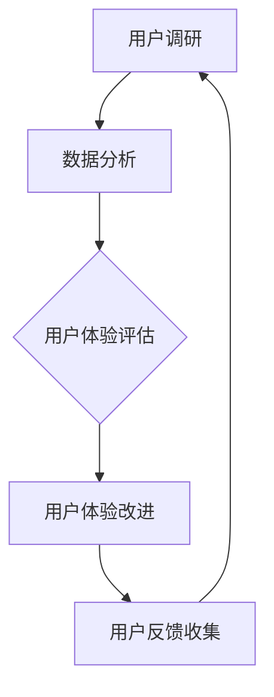
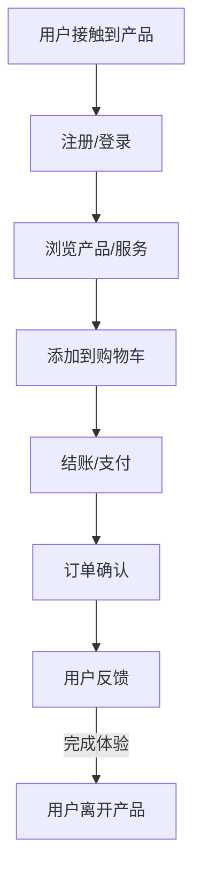

                 

### 《用户体验管理：以客户为中心的服务设计》

## 引言

在当今竞争激烈的市场环境中，用户体验（User Experience, UX）已成为企业成功的关键因素。用户体验管理（User Experience Management, UXM）作为一门综合性的学科，旨在通过系统化的方法提升用户在使用产品或服务过程中的满意度、忠诚度和参与度。本文旨在深入探讨用户体验管理的基本概念、核心原则、实践策略以及未来发展，以帮助读者全面了解和掌握用户体验管理的理论和实践。

## 核心概念与联系

### Mermaid 流程图

用户体验管理涉及多个关键环节，这些环节相互关联，形成一个完整的流程。以下是一个简化的Mermaid流程图，展示用户体验管理的主要流程和步骤：



### 用户体验管理定义

用户体验管理可以定义为一种系统化的方法，用于规划和实施一系列活动，以提升用户在使用产品或服务过程中的整体体验。它不仅关注用户界面的设计，还包括用户需求分析、用户测试、反馈收集和持续改进等环节。

### 核心原则

用户体验管理的核心原则包括：

- **以用户为中心**：所有设计决策都应该基于用户需求和期望。
- **数据驱动**：使用用户调研和数据分析来指导设计决策。
- **持续迭代**：不断优化用户体验，以适应用户需求和业务目标的变化。
- **跨渠道一致性**：确保用户在不同渠道上获得一致的体验。

## 核心算法原理讲解

### K-means 算法

K-means算法是一种常用的聚类算法，用于将用户分组。以下是K-means算法的伪代码：

```python
# 初始化中心点
centroids = initialize_centroids(data, k)

# 初始化用户分组
groups = initialize_groups(data, centroids)

# 迭代更新
while not converged(groups, centroids):
    # 更新用户分组
    groups = assign_users_to_groups(data, centroids)
    
    # 更新中心点
    centroids = update_centroids(groups, k)

# 输出最终结果
output_results(groups, centroids)
```

### 决策树算法

决策树算法是一种用于分类和回归分析的算法。以下是决策树的构建过程的伪代码：

```python
# 选择最佳分割
best_split = find_best_split(data)

# 创建节点
node = create_node(best_split)

# 切分数据
left_data, right_data = split_data(data, best_split)

# 递归构建左子树和右子树
node.left = build_tree(left_data)
node.right = build_tree(right_data)

# 返回决策树
return node
```

## 数学模型和公式

用户体验评估通常涉及到多个指标，以下是一些常用的数学模型和公式：

### 用户满意度 (Satisfaction)

$$ S = \frac{1}{n} \sum_{i=1}^{n} S_i $$

其中，$S_i$ 是第 $i$ 个用户的满意度。

### 任务完成率 (Task Success Rate)

$$ TSR = \frac{1}{n} \sum_{i=1}^{n} [T_i = "Completed"] $$

其中，$T_i$ 是第 $i$ 个任务的成功状态（成功为1，失败为0）。

### 期望质量 (Expected Quality)

$$ EQ = \frac{1}{n} \sum_{i=1}^{n} E_i $$

其中，$E_i$ 是第 $i$ 个用户的期望质量。

## 项目实战代码示例

以下是一个简单的 Flask 应用程序，用于接收用户调研数据并返回分析结果：

```python
# 安装必要的库
!pip install flask

# Flask 应用程序入口
from flask import Flask, request, jsonify
from flask_cors import CORS

app = Flask(__name__)
CORS(app)

# 模拟用户调研数据
user_survey_data = [
    {"user_id": 1, "satisfaction": 4, "task_success": 1, "expected_quality": 3},
    {"user_id": 2, "satisfaction": 5, "task_success": 1, "expected_quality": 4},
    # ...更多数据
]

# 用户调研数据分析API
@app.route('/api/analyze', methods=['POST'])
def analyze_survey_data():
    new_survey_data = request.get_json()
    user_survey_data.append(new_survey_data)

    # 计算满意度平均值
    satisfaction_score = sum(d['satisfaction'] for d in user_survey_data) / len(user_survey_data)

    # 计算任务完成率
    task_success_rate = sum(d['task_success'] for d in user_survey_data) / len(user_survey_data)

    # 计算期望质量平均值
    expected_quality_score = sum(d['expected_quality'] for d in user_survey_data) / len(user_survey_data)

    result = {
        "satisfaction_score": satisfaction_score,
        "task_success_rate": task_success_rate,
        "expected_quality_score": expected_quality_score
    }

    return jsonify(result)

if __name__ == '__main__':
    app.run(debug=True)
```

### 开发环境搭建

1. 安装 Python 3.7 或更高版本。
2. 使用 `pip install flask flask-cors` 命令安装 Flask 和 Flask-CORS 库。
3. 运行应用程序：在终端中运行 `python app.py`。

### 源代码详细实现和代码解读

- **源代码详细实现**：上述代码展示了如何使用 Flask 创建一个简单的 Web 应用程序，用于接收用户调研数据并返回分析结果。

- **代码解读**：

  - **安装 Flask 和 Flask-CORS 库**：这是为了创建一个 Web 应用程序，用于接收用户调研数据并返回分析结果。

  - **模拟用户调研数据**：这里使用一个简单的列表来模拟用户调研数据，每个用户的数据包括满意度、任务完成状态和期望质量。

  - **用户调研数据分析API**：定义一个 Flask 路径 `/api/analyze`，该路径接收 POST 请求，其中包含新的用户调研数据。将新的数据添加到用户调研数据列表中，并计算满意度、任务完成率和期望质量的平均值。

  - **返回分析结果**：将计算出的平均分数作为 JSON 对象返回。

### 代码解读与分析

- **代码示例**：提供了一个简单的 Flask 应用程序，用于接收用户调研数据并计算分析结果。
- **功能说明**：应用程序接收 POST 请求，处理用户调研数据，并返回用户满意度的平均值、任务完成率以及期望质量的平均值。
- **开发环境**：需要安装 Python 和 Flask 库，并在终端中运行应用程序。
- **应用场景**：该应用程序可以用于模拟用户体验管理的实践，如收集用户反馈并进行分析，从而优化用户体验。

通过本文的讨论，读者可以了解到用户体验管理的基本概念、核心原则、实践策略以及未来发展趋势。用户体验管理不仅仅是设计漂亮的界面，更是一种系统化的方法，旨在提升用户满意度、忠诚度和参与度。随着技术的不断进步，用户体验管理将继续演变，为企业和用户带来更多价值。

### 结论

用户体验管理作为现代企业成功的关键要素，正日益受到重视。本文从用户体验管理的核心概念、核心原则、实践策略到未来趋势进行了全面的探讨。通过详细的分析和案例研究，读者可以深入了解用户体验管理的本质和实践方法。希望本文能够为读者提供有价值的参考，帮助其在实践中更好地实施用户体验管理。

### 作者信息

作者：AI天才研究院/AI Genius Institute & 禅与计算机程序设计艺术 /Zen And The Art of Computer Programming

AI天才研究院致力于推动人工智能和计算机科学的发展，通过创新的研究和项目实践，为行业提供前沿的技术解决方案。禅与计算机程序设计艺术则强调在计算机编程中融入哲学思维，追求简洁与高效的设计哲学。

---

## 第一部分：用户体验管理基础

### 第1章：用户体验管理概述

#### 1.1 用户体验管理的定义和重要性

用户体验管理（User Experience Management，简称UXM）是一门跨学科的综合学科，涉及心理学、人机交互、设计学、市场营销等多个领域。其核心目标是提升用户在使用产品或服务过程中的满意度、忠诚度和参与度。用户体验管理不仅关注产品的外观和功能，更注重用户的情感体验和整体感受。

用户体验管理的定义可以从以下几个方面来理解：

1. **系统化的方法**：用户体验管理是一种系统化的方法，它通过一系列计划和行动，确保用户在产品或服务中享受到良好的体验。
2. **跨学科的综合学科**：用户体验管理涵盖了心理学、人机交互、设计学、市场营销等多个领域，需要多学科知识的融合和协同工作。
3. **以用户为中心**：用户体验管理的核心原则是以用户为中心，所有设计决策都应该基于用户的需求和期望。

用户体验管理的重要性体现在以下几个方面：

1. **提升用户满意度**：良好的用户体验能够提升用户的满意度，增加用户对产品的忠诚度和依赖度。
2. **增加用户忠诚度**：通过持续优化用户体验，企业能够增加用户的忠诚度，减少用户流失率。
3. **提高用户参与度**：优质的用户体验能够激发用户的参与度，促进用户与产品的互动和互动深度。
4. **提升品牌价值**：良好的用户体验能够提升品牌形象，增加企业的市场竞争力。

#### 1.2 用户体验管理的历史与发展

用户体验管理的历史可以追溯到20世纪80年代，当时人机交互（Human-Computer Interaction，简称HCI）的研究逐渐兴起。人机交互研究的核心目标是如何让计算机系统更加人性化，使得用户能够更加高效、愉悦地使用计算机。

1. **早期研究**：在20世纪80年代，学术界开始关注用户体验的研究，主要关注用户与计算机系统的交互体验。这一时期的研究主要集中在大规模用户调研、界面设计和用户测试等方面。
2. **互联网时代的兴起**：随着互联网的普及，用户体验管理逐渐从计算机领域扩展到更广泛的产品和服务领域。Web应用、移动应用和在线服务的兴起，使得用户体验管理成为了企业竞争的关键因素。
3. **现代用户体验管理**：进入21世纪，用户体验管理逐渐发展成为一门独立的学科，涵盖了用户研究、数据分析、设计迭代、测试评估等多个环节。现代用户体验管理更加强调以用户为中心、数据驱动的理念，以及跨渠道、跨设备的一致性体验。

#### 1.3 客户为中心的服务设计理念

客户为中心的服务设计（Customer-Centric Service Design）是一种以用户需求为核心的设计理念，旨在确保用户在产品或服务中的每一个交互环节都能获得良好的体验。客户为中心的服务设计理念包括以下几个关键原则：

1. **用户研究**：深入了解用户的需求、行为和偏好，以确保设计决策基于真实的用户数据。
2. **同理心**：设计师需要站在用户的角度思考问题，理解用户的感受和需求，从而创造更加符合用户期望的产品和服务。
3. **迭代设计**：通过不断的迭代和测试，持续优化用户体验，确保最终产品能够满足用户的需求。
4. **数据驱动**：依赖数据分析来指导设计决策，通过用户行为数据来评估和改进用户体验。

客户为中心的服务设计理念对用户体验管理具有重要影响：

1. **提高用户满意度**：通过深入了解用户需求，设计出更加符合用户期望的产品和服务，从而提升用户满意度。
2. **增加用户忠诚度**：优质的用户体验能够增加用户的忠诚度，减少用户流失率。
3. **提升品牌价值**：客户为中心的设计理念能够提升品牌形象，增加企业在市场中的竞争力。
4. **优化资源分配**：通过用户研究来识别用户痛点和需求，从而更加高效地分配设计资源，提高设计效率。

总之，用户体验管理作为一门综合性的学科，旨在通过系统化的方法提升用户满意度、忠诚度和参与度。客户为中心的服务设计理念则为用户体验管理提供了重要的指导原则，确保设计决策始终围绕用户需求展开。在未来的发展中，用户体验管理将继续融合多学科知识，不断创新和优化，以适应不断变化的市场环境和用户需求。

### 第2章：用户体验管理原则

用户体验管理原则是确保用户在使用产品或服务过程中获得良好体验的基石。这些原则涵盖了设计思维、用户体验设计、用户调研和数据驱动决策等方面。以下将详细探讨用户体验管理的五大核心原则。

#### 2.1 以用户为中心的设计思维

以用户为中心的设计思维（User-Centered Design，简称UCD）是一种设计方法，它强调在整个设计过程中始终关注用户的需求和体验。以用户为中心的设计思维包括以下几个关键步骤：

1. **用户研究**：深入了解用户的需求、行为和偏好，通过用户调研、访谈和观察等方法收集用户数据。
2. **同理心**：设计师需要站在用户的角度思考问题，理解用户的感受和需求，从而创造出更加符合用户期望的产品和服务。
3. **迭代设计**：通过不断的迭代和测试，持续优化用户体验，确保最终产品能够满足用户的需求。
4. **用户测试**：在设计的每个阶段进行用户测试，以验证设计决策是否符合用户期望，及时调整和优化设计。

以用户为中心的设计思维对用户体验管理具有重要影响：

1. **提高用户满意度**：通过深入了解用户需求，设计出更加符合用户期望的产品和服务，从而提升用户满意度。
2. **增加用户忠诚度**：优质的用户体验能够增加用户的忠诚度，减少用户流失率。
3. **提升品牌价值**：以用户为中心的设计理念能够提升品牌形象，增加企业在市场中的竞争力。
4. **优化资源分配**：通过用户研究来识别用户痛点和需求，从而更加高效地分配设计资源，提高设计效率。

#### 2.2 用户体验设计的五大原则

用户体验设计（User Experience Design，简称UXD）是用户体验管理的重要组成部分，它旨在提升用户在使用产品或服务过程中的整体体验。以下为用户体验设计的五大原则：

1. **一致性**：确保产品在不同平台和设备上的一致性，包括视觉设计、交互设计和功能设计。一致性有助于用户快速学习和操作产品，降低学习成本。
2. **可用性**：设计易于使用和操作的产品，确保用户能够顺利完成任务，减少用户的困惑和挫折感。可用性是用户体验的核心要素。
3. **可访问性**：确保产品能够满足不同用户的需求，包括视障用户、听障用户和其他特殊需求用户。可访问性有助于提升产品的包容性。
4. **交互性**：设计具有良好交互性的产品，使用户能够与产品进行有效的互动，提高用户的参与度和满意度。
5. **可扩展性**：设计可扩展的产品，以便在未来能够轻松添加新功能或改进现有功能，满足不断变化的市场需求。

用户体验设计的五大原则对用户体验管理具有重要影响：

1. **提升用户体验**：通过遵循用户体验设计原则，设计出更加符合用户期望和需求的产品和服务，从而提升用户体验。
2. **优化用户流程**：设计简洁、直观的用户流程，使用户能够轻松完成任务，提高用户的满意度和参与度。
3. **增强品牌形象**：优质的用户体验设计有助于提升品牌形象，增加企业在市场中的竞争力。
4. **提高市场接受度**：符合用户体验设计原则的产品更容易被市场和用户接受，从而提高产品的市场接受度和销量。

#### 2.3 用户体验管理的五个核心要素

用户体验管理涉及多个环节，以下为用户体验管理的五个核心要素：

1. **用户调研**：通过用户调研了解用户的需求、行为和偏好，为设计决策提供数据支持。用户调研包括用户访谈、问卷调查、用户测试等方法。
2. **数据分析**：对用户调研数据进行分析，发现用户痛点和需求，指导设计优化和产品改进。数据分析包括数据可视化、统计分析等方法。
3. **设计迭代**：根据用户调研和数据分析结果，进行设计迭代和优化，确保产品能够满足用户需求。设计迭代是用户体验管理的关键环节。
4. **测试评估**：通过用户测试和评估，验证设计优化效果，确保最终产品能够满足用户期望。测试评估包括可用性测试、用户体验评估等方法。
5. **持续改进**：持续跟踪用户反馈和市场动态，不断优化产品和服务，提升用户体验。持续改进是用户体验管理的重要保障。

用户体验管理的五个核心要素相互关联，共同作用，确保用户体验管理的有效实施：

1. **提高设计质量**：用户调研和数据分析为设计决策提供支持，设计迭代和测试评估确保设计质量，持续改进则不断提升用户体验。
2. **优化用户体验**：通过不断优化设计、测试和改进，确保用户在使用产品或服务过程中获得良好的体验。
3. **提升用户满意度**：优质的用户体验能够提升用户满意度，增加用户忠诚度和品牌忠诚度。
4. **增强市场竞争力**：良好的用户体验能够提升品牌形象，增加企业在市场中的竞争力。

总之，用户体验管理原则是确保用户在使用产品或服务过程中获得良好体验的重要保障。以用户为中心的设计思维、用户体验设计的五大原则以及用户体验管理的五个核心要素相互融合，共同推动用户体验管理的不断优化和发展。在未来的市场竞争中，用户体验管理将发挥越来越重要的作用，成为企业取得成功的关键因素。

### 第3章：用户体验地图

用户体验地图（User Experience Map，简称UX Map）是一种可视化工具，用于描述用户在使用产品或服务过程中的整体体验。它可以帮助企业从用户的角度理解产品或服务的使用流程，识别用户体验中的痛点和改进机会。用户体验地图不仅有助于设计团队进行设计决策，还能够帮助其他部门如市场营销、产品管理和客户支持更好地理解用户需求，协同工作，提升整体用户体验。

#### 3.1 用户体验地图的作用和构成

用户体验地图的作用主要体现在以下几个方面：

1. **理解用户行为**：通过绘制用户体验地图，可以清晰地看到用户在使用产品或服务过程中的行为路径，从而更好地理解用户的需求和痛点。
2. **识别改进机会**：用户体验地图可以帮助企业识别用户体验中的瓶颈和问题，提供改进的方向和策略。
3. **沟通协作**：用户体验地图作为一种可视化工具，有助于设计团队、产品团队和其他相关部门之间的沟通和协作，确保各团队对用户体验目标有一致的理解。
4. **评估改进效果**：通过对比改进前后的用户体验地图，可以评估用户体验改进的效果，验证改进措施的有效性。

用户体验地图通常由以下几个部分构成：

1. **用户角色**：定义目标用户群体的特征和需求，为用户体验地图提供背景信息。
2. **用户旅程**：描述用户在使用产品或服务过程中的主要行为路径，包括用户接触到产品的时刻、使用过程中的关键环节以及用户离开产品的时刻。
3. **用户情感**：在用户旅程中标注用户的情感变化，如兴奋、困惑、满意、沮丧等，帮助理解用户在不同情境下的心理状态。
4. **用户体验痛点**：识别用户旅程中的痛点和问题，如界面复杂、操作不便、信息不清晰等，为改进提供具体方向。
5. **改进措施**：提出针对用户体验痛点的改进措施，如界面优化、功能增强、流程简化等，以提升用户体验。

#### 3.2 创建用户体验地图的方法

创建用户体验地图是一个系统化的过程，以下是一些常用的方法和步骤：

1. **用户调研**：通过访谈、问卷调查、用户测试等方式收集用户数据，了解用户的需求、行为和反馈。
2. **用户旅程分析**：根据收集到的用户数据，绘制用户旅程图，描述用户在使用产品或服务过程中的主要行为路径。
3. **情感标注**：在用户旅程图中标注用户的情感变化，帮助理解用户在不同情境下的心理状态。
4. **识别痛点**：通过分析用户旅程图，识别用户体验中的痛点和问题，为改进提供具体方向。
5. **制定改进措施**：根据识别出的痛点，制定相应的改进措施，如界面优化、功能增强、流程简化等。
6. **评审和反馈**：将用户体验地图展示给相关团队和用户，收集反馈和意见，进行迭代优化。

以下是一个简化的用户体验地图创建过程：



#### 3.3 用户体验地图的应用案例分析

以下是一个电子商务平台的用户体验地图应用案例：

**用户角色**：20-35岁的年轻女性，喜欢购物，关注时尚和优惠信息。

**用户旅程**：

1. **接触到产品**：用户通过社交媒体、搜索引擎或广告链接访问电商平台。
2. **注册/登录**：用户注册或登录账号，以便保存购物车和订单信息。
3. **浏览产品/服务**：用户浏览商品页面，根据喜好和需求筛选和排序商品。
4. **添加到购物车**：用户将商品添加到购物车，准备购买。
5. **结账/支付**：用户选择支付方式，进行结账和支付。
6. **订单确认**：用户收到订单确认邮件，确认购买信息。
7. **用户反馈**：用户在订单完成后，有机会留下对产品和服务的评价。
8. **用户离开产品**：用户完成购物体验，离开电商平台。

**用户体验痛点**：

1. **注册/登录流程复杂**：用户反馈注册和登录流程过于繁琐，导致用户流失。
2. **购物车功能不完善**：用户希望能够更好地管理购物车中的商品，如添加注释、对比商品等。
3. **支付流程不顺畅**：部分用户反馈支付流程中存在错误提示，导致支付失败。
4. **订单确认邮件信息不全**：用户希望订单确认邮件中包含更多详细信息，如商品图片、价格等。

**改进措施**：

1. **简化注册/登录流程**：减少注册和登录步骤，使用第三方登录（如社交媒体账号）提高用户体验。
2. **优化购物车功能**：增加购物车注释功能，方便用户管理商品。
3. **改进支付流程**：增加支付流程的提示和帮助信息，减少支付失败的概率。
4. **完善订单确认邮件**：在订单确认邮件中添加商品图片、价格和详细信息，提高用户的购物满意度。

通过用户体验地图的应用，企业可以更好地理解用户需求，识别用户体验中的问题，制定有针对性的改进措施，从而提升整体用户体验。

总之，用户体验地图作为一种重要的可视化工具，可以帮助企业从用户的角度全面理解产品或服务的使用流程，识别用户体验中的痛点和改进机会。通过创建和优化用户体验地图，企业可以不断提升用户体验，增加用户满意度，提高市场竞争力。

### 第4章：用户调研与数据分析

用户体验管理的关键在于深入了解用户的需求和反馈，而用户调研与数据分析是实现这一目标的重要工具。通过系统化的用户调研和数据收集，企业可以获取关于用户行为、偏好和满意度的宝贵信息，进而优化产品和服务，提升用户体验。本章将详细探讨用户调研的方法、数据分析工具及其在用户体验优化中的应用。

#### 4.1 用户调研的方法

用户调研是用户体验管理的基础，通过多种方法收集用户的数据，企业可以全面了解用户的需求和反馈。以下是一些常见的用户调研方法：

1. **访谈**：通过与用户进行一对一的深入访谈，可以获取用户的详细需求和意见。访谈方法适用于了解用户的具体体验和深层次需求。
2. **问卷调查**：问卷调查是一种高效的用户调研方法，可以通过在线或离线方式收集大量用户的数据。问卷设计应注重问题的清晰性和针对性，确保获取有效的数据。
3. **用户测试**：用户测试（User Testing）是在实际使用环境中观察用户如何与产品或服务互动。通过用户测试，可以发现用户在使用过程中的困难和误解，从而进行改进。
4. **焦点小组**：焦点小组是一种小组讨论的形式，将多个用户聚集在一起，讨论对产品或服务的看法。这种方法可以收集多个用户的观点，有助于发现共性的问题和需求。
5. **观察研究**：观察研究是在自然环境中观察用户行为，记录用户与产品或服务的互动过程。这种方法适用于了解用户的实际使用习惯和痛点。

#### 4.2 数据分析工具

数据分析是用户体验管理中的重要环节，通过分析用户调研收集到的数据，企业可以洞察用户行为，发现潜在问题和改进机会。以下是一些常用的数据分析工具：

1. **Excel**：Excel是一款功能强大的电子表格软件，适用于基础的数据整理和分析。它提供了丰富的函数和图表工具，可以帮助用户快速生成数据报告。
2. **Google Analytics**：Google Analytics是一款免费的分析工具，可以跟踪用户在网站或应用程序上的行为，包括访问量、页面流量、用户留存率等。通过Google Analytics，企业可以深入了解用户的互动模式和需求。
3. **Tableau**：Tableau是一款数据可视化工具，可以将复杂的数据集转换为直观的图表和仪表盘。Tableau的交互功能强大，用户可以自定义视图，深入分析数据。
4. **SPSS**：SPSS（Statistical Package for the Social Sciences）是一款专业的统计软件，适用于复杂的数据分析和预测模型。它提供了丰富的统计分析方法，适用于各种规模的数据集。
5. **R**：R是一种编程语言和统计软件，广泛应用于数据分析和机器学习。R拥有大量的包和库，可以处理各种类型的数据，并进行高级的数据分析和可视化。

#### 4.3 基于数据的用户体验优化

基于数据的用户体验优化是现代用户体验管理的关键策略。通过数据驱动的方法，企业可以持续改进产品和服务，提升用户体验。以下是一些基于数据的用户体验优化方法：

1. **用户行为分析**：通过分析用户行为数据，如访问路径、点击率、页面停留时间等，可以了解用户的使用习惯和偏好。基于这些数据，企业可以优化页面布局、导航结构等，提高用户的操作便捷性。
2. **用户反馈分析**：用户反馈是用户体验优化的宝贵资源。通过分析用户反馈，企业可以发现用户关注的痛点和需求，从而进行针对性的改进。例如，如果多个用户反馈某个功能复杂难用，企业可以重新设计该功能，使其更加直观易用。
3. **A/B测试**：A/B测试是一种比较不同设计方案效果的方法。通过将用户随机分配到不同的测试组，比较两组用户的反应和行为，企业可以确定哪种设计方案更符合用户需求。A/B测试可以用于优化页面布局、按钮位置、文本表述等。
4. **用户留存率分析**：用户留存率是衡量用户体验的重要指标。通过分析用户留存率数据，企业可以了解产品或服务的吸引力，识别用户流失的原因。基于这些数据，企业可以优化产品功能、改进用户互动体验，提高用户留存率。

以下是一个基于数据的用户体验优化案例：

**案例背景**：某电商平台希望通过数据优化提升用户购物体验。

**步骤一：用户行为分析**
- **数据收集**：通过Google Analytics收集用户访问数据，包括页面流量、访问路径、点击率等。
- **数据分析**：发现用户在浏览商品时，点击“添加到购物车”按钮的比例较低，页面停留时间短。

**步骤二：用户反馈分析**
- **用户反馈收集**：通过问卷调查和用户访谈收集用户对购物体验的反馈。
- **数据分析**：发现用户反馈中提到购物车页面过于复杂，难以快速添加商品。

**步骤三：A/B测试**
- **测试设计**：设计一个新的购物车页面，简化操作流程，增加“一键添加到购物车”功能。
- **测试执行**：将用户随机分配到测试组和对照组，比较两组用户的购物行为。

**步骤四：用户留存率分析**
- **数据收集**：通过Google Analytics和内部系统跟踪用户留存数据。
- **数据分析**：测试后，发现测试组的用户留存率显著提高。

**优化措施**
- **页面优化**：根据测试结果，将新购物车页面推广至全平台。
- **持续监控**：定期收集用户反馈和数据，持续优化购物体验。

通过以上案例，我们可以看到，基于数据的用户体验优化是一个系统化的过程，从数据收集、分析到测试和监控，每一步都至关重要。通过科学的数据驱动方法，企业可以持续提升用户体验，增强用户满意度和忠诚度。

总之，用户调研与数据分析是用户体验管理的核心环节。通过多样化的调研方法和高效的数据分析工具，企业可以深入了解用户需求和行为，为产品和服务优化提供有力支持。在数据驱动的时代，用户体验优化已经成为企业竞争的关键因素，企业需要不断迭代和改进，以保持市场竞争力。

### 第5章：服务设计流程

服务设计（Service Design）是一种系统性方法，用于创建和管理以用户为中心的服务。它结合了用户研究、用户体验设计、流程优化和跨渠道协作等多种技术，旨在提供一致、无缝且令人满意的服务体验。本章将详细介绍服务设计流程，包括其概述、工具和方法，并结合实际案例进行解析。

#### 5.1 服务设计流程概述

服务设计流程通常包括以下几个关键步骤：

1. **需求分析**：在服务设计初期，了解用户需求、业务目标和竞争环境是至关重要的。通过用户调研、市场分析和业务访谈，收集相关信息，为服务设计提供基础。
2. **概念验证**：基于需求分析结果，构建服务概念，并对其进行验证。这一步骤包括设计原型、用户测试和反馈收集，确保服务概念符合用户需求和业务目标。
3. **服务蓝图设计**：服务蓝图是服务设计的核心文档，它详细描述了服务的流程、角色和交互。通过服务蓝图，设计团队能够全面了解服务的设计细节，确保服务的一致性和有效性。
4. **用户旅程地图**：用户旅程地图是一种可视化工具，用于描述用户在使用服务过程中的整体体验。通过用户旅程地图，设计团队能够识别用户体验中的痛点和改进机会。
5. **设计迭代**：在用户旅程地图的基础上，进行设计迭代和优化。这一步骤包括设计原型、用户测试和反馈收集，确保最终服务设计满足用户需求。
6. **实施与部署**：将设计完成的服务部署到实际环境中，进行测试和优化。在这一过程中，需要确保服务流程的顺畅执行，以及与用户的及时互动。
7. **监控与反馈**：在服务部署后，通过监控工具和用户反馈机制，持续收集服务使用数据，评估服务效果，并根据反馈进行持续改进。

#### 5.2 服务设计工具和方法

服务设计涉及多种工具和方法，以下是一些常用的工具和方法：

1. **用户访谈**：通过与用户进行面对面的访谈，了解他们的需求、偏好和行为模式。这种方法有助于深入了解用户的真实体验，为服务设计提供有价值的信息。
2. **问卷调查**：通过设计结构化的问卷，收集大量用户的数据。问卷调查适用于大规模的用户调研，可以帮助设计团队快速获取用户反馈。
3. **用户测试**：在实际使用环境中观察用户如何与服务互动，收集用户行为数据。用户测试是验证服务设计有效性的重要手段，通过用户反馈可以发现和解决问题。
4. **服务蓝图**：服务蓝图是一种视觉化工具，用于描述服务的流程、角色和交互。服务蓝图可以帮助设计团队清晰地了解服务的整体架构，优化服务流程。
5. **用户体验地图**：用户体验地图用于描述用户在使用服务过程中的整体体验。通过用户体验地图，设计团队能够识别用户体验中的痛点和改进机会。
6. **A/B测试**：A/B测试是验证不同设计方案的对比试验。通过将用户随机分配到不同的测试组，比较两组用户的反应和行为，设计团队能够确定哪种设计方案更符合用户需求。
7. **设计系统**：设计系统是一种系统化的设计方法，用于创建和共享设计组件和模式。通过设计系统，设计团队能够确保服务设计的一致性和高效性。

#### 5.3 服务设计案例解析

以下是一个实际案例，展示如何通过服务设计提升用户满意度。

**案例背景**：某电信公司希望优化其客户服务流程，提高用户满意度。

**步骤一：需求分析**
- **用户调研**：通过用户访谈和问卷调查，了解用户对客户服务的需求和痛点。发现用户普遍反映客服响应时间较长，问题解决效率低。
- **市场分析**：分析竞争对手的服务流程和用户反馈，识别差距和改进机会。

**步骤二：概念验证**
- **服务概念**：设计一种基于AI和自动化技术的客户服务系统，通过智能客服和自动化流程提高响应速度和问题解决效率。
- **用户测试**：创建智能客服原型，邀请用户进行测试，收集反馈和改进建议。

**步骤三：服务蓝图设计**
- **服务蓝图**：绘制客户服务流程图，包括用户与智能客服的互动流程、人工客服介入点和用户反馈机制。
- **角色定义**：明确智能客服、人工客服和用户在服务流程中的角色和职责。

**步骤四：用户旅程地图**
- **用户旅程地图**：绘制用户在使用客户服务过程中的整体体验，标注用户的情感变化和痛点。
- **改进建议**：基于用户旅程地图，提出改进建议，如缩短响应时间、简化问题解决流程等。

**步骤五：设计迭代**
- **设计原型**：基于服务蓝图和用户旅程地图，创建智能客服原型，并进行用户测试。
- **反馈收集**：收集用户测试反馈，评估设计原型是否符合用户需求，并根据反馈进行优化。

**步骤六：实施与部署**
- **部署智能客服系统**：将优化后的智能客服系统部署到实际环境中，进行测试和优化。
- **用户培训**：为客服团队提供培训，确保他们能够熟练使用智能客服系统。

**步骤七：监控与反馈**
- **用户反馈机制**：建立用户反馈机制，通过在线评价、电话回访等方式收集用户反馈。
- **数据监控**：通过数据分析工具监控客服系统的使用情况，如响应时间、问题解决率等。
- **持续改进**：根据用户反馈和数据监控结果，不断优化客服系统，提高用户满意度。

通过以上案例，我们可以看到，服务设计是一个系统化的过程，从需求分析、概念验证到设计迭代、实施部署，每一步都至关重要。通过科学的服务设计流程，企业可以提供一致、无缝且令人满意的服务体验，提高用户满意度和忠诚度。

总之，服务设计是企业提升用户体验和竞争力的关键手段。通过了解用户需求、优化服务流程和持续改进，企业能够提供卓越的服务体验，赢得用户的信任和忠诚。在未来的发展中，服务设计将继续发挥重要作用，成为企业成功的关键因素。

### 第6章：交互设计

交互设计（Interaction Design，简称IxD）是用户体验设计（User Experience Design，简称UXD）的重要组成部分，它专注于用户与产品或服务之间的交互过程。良好的交互设计能够提升用户的操作便利性和满意度，进而增强产品的市场竞争力。本章将详细介绍交互设计的原则、工具和应用，并结合具体案例进行解析。

#### 6.1 交互设计的原则

交互设计的原则是确保用户在使用产品或服务过程中获得良好体验的基础。以下是交互设计的五大核心原则：

1. **简洁性**：简洁性是交互设计的重要原则之一，意味着界面和交互流程应尽量简化，避免冗余和复杂。简洁的交互设计能够降低用户的学习成本，提高用户的操作效率。
2. **一致性**：一致性指的是在产品的各个部分中保持界面元素、操作流程和语言风格的一致性。一致性能够帮助用户快速学习和理解产品，减少用户的困惑和错误。
3. **直观性**：直观性要求设计应符合用户的直觉，使操作和界面设计直观易懂。直观的交互设计能够降低用户的认知负荷，提高用户的满意度。
4. **可控性**：可控性是指用户在操作过程中应能感觉到自己对产品有控制权，能够自主决定操作步骤。可控的交互设计能够提升用户的信心和满意度。
5. **反馈**：反馈是指系统对用户的操作给出及时和明确的响应。良好的反馈机制能够帮助用户确认操作成功，减少用户的焦虑和困惑。

#### 6.2 交互设计工具

交互设计过程中，使用适当的工具能够提高设计效率和效果。以下是几种常用的交互设计工具：

1. **线框图**：线框图是一种简单的视觉表示工具，用于描述产品的界面布局和功能。它通常只包含基本的界面元素，如按钮、输入框和导航栏，用于展示界面结构和交互逻辑。
2. **原型设计工具**：原型设计工具（如Axure、Sketch、Figma等）能够创建更加详细的交互原型，包括视觉设计元素和交互效果。通过这些工具，设计师可以模拟产品的实际交互过程，进行用户测试和反馈。
3. **交互设计模板**：交互设计模板是一组预先设计好的界面布局和交互组件，可以帮助设计师快速构建原型，提高设计效率。
4. **用户测试工具**：用户测试工具（如Optimizely、UserTesting等）用于在真实环境中测试用户的交互体验，收集用户反馈和数据。
5. **数据分析工具**：数据分析工具（如Google Analytics、Mixpanel等）用于跟踪和分析用户的交互行为，为交互设计提供数据支持。

#### 6.3 交互设计应用

以下是一个电子商务平台的交互设计案例，展示如何通过交互设计提升用户体验。

**案例背景**：某电商平台希望通过优化购物流程和界面设计，提升用户购物体验。

**步骤一：需求分析**
- **用户调研**：通过用户访谈和问卷调查，了解用户在购物过程中的需求和痛点。例如，用户反馈购物车页面复杂、结账流程繁琐。
- **市场分析**：分析竞争对手的购物界面和用户评价，识别差距和改进机会。

**步骤二：交互设计原型**
- **线框图**：绘制购物流程的线框图，明确页面布局和功能模块。
- **原型设计**：使用原型设计工具创建详细的交互原型，包括购物车、商品详情页、结账流程等。

**步骤三：用户测试**
- **用户测试**：邀请目标用户进行购物流程测试，收集用户反馈和操作数据。
- **数据分析**：分析用户测试数据，识别用户操作中的困难和误解。

**步骤四：交互设计迭代**
- **优化建议**：基于用户测试结果，提出优化建议，如简化购物车页面、改进结账流程等。
- **设计迭代**：根据优化建议，进行设计迭代，创建新的交互原型。

**步骤五：实施与部署**
- **实施**：将优化后的交互设计部署到实际环境中，进行测试和优化。
- **用户培训**：为客服和运营团队提供培训，确保他们能够熟练使用新的交互设计。

**步骤六：监控与反馈**
- **用户反馈机制**：建立用户反馈机制，通过在线评价、电话回访等方式收集用户反馈。
- **数据监控**：通过数据分析工具监控购物流程的使用情况，如用户操作时间、错误率等。
- **持续改进**：根据用户反馈和数据监控结果，不断优化购物流程和界面设计。

通过以上案例，我们可以看到，交互设计在提升用户体验中的作用至关重要。通过科学的交互设计方法和工具，企业能够创建符合用户需求和直觉的界面和交互流程，提高用户的操作效率和满意度，从而增强产品的市场竞争力。

总之，交互设计是用户体验设计的重要组成部分，通过遵循交互设计的原则和使用适当的工具，企业可以创造出优质的交互体验，提升用户满意度和忠诚度。在未来的市场竞争中，交互设计将继续发挥重要作用，成为企业取得成功的关键因素。

### 第7章：用户体验评估与改进

用户体验评估（User Experience Evaluation）是确保产品或服务满足用户需求的关键步骤。通过系统化的评估方法，企业可以识别用户体验中的痛点和问题，从而采取相应的改进措施。本章将详细探讨用户体验评估的方法、关键指标以及用户体验改进的策略和步骤。

#### 7.1 用户体验评估的方法

用户体验评估是用户体验管理的重要环节，以下是一些常用的用户体验评估方法：

1. **可用性测试**：可用性测试（Usability Testing）是一种通过实际用户对产品或服务进行操作来评估其可用性的方法。通过观察用户在实际使用环境中的行为，识别操作中的问题和难点，评估产品的易用性和用户体验。
2. **问卷调查**：问卷调查是一种收集用户反馈和意见的方法。通过设计结构化的问卷，企业可以收集大量用户的反馈数据，分析用户对产品或服务的满意度、功能需求等。
3. **A/B测试**：A/B测试（A/B Testing）是一种比较不同设计方案效果的方法。通过将用户随机分配到不同的测试组，比较两组用户的反应和行为，确定哪种设计方案更符合用户需求。
4. **用户访谈**：用户访谈是一种深入了解用户需求和意见的方法。通过与用户进行面对面的访谈，设计师可以获取关于用户体验的详细信息，识别用户痛点。
5. **用户满意度调查**：用户满意度调查（Customer Satisfaction Survey）是一种评估用户对产品或服务满意度的方法。通过设计满意度调查问卷，企业可以了解用户对产品的整体满意度，识别改进机会。
6. **热图分析**：热图分析（Heatmap Analysis）是一种通过颜色变化显示用户在界面上的点击和浏览行为的工具。通过热图分析，企业可以了解用户在界面上的关注点和操作习惯，优化界面设计。

#### 7.2 用户体验评估的关键指标

用户体验评估需要依赖于一系列关键指标，以下是一些常用的用户体验评估指标：

1. **任务成功率**：任务成功率（Task Success Rate）是指用户在完成特定任务时的成功率。通过计算任务成功次数与总任务次数的比率，企业可以评估产品的易用性和任务完成情况。
2. **任务完成时间**：任务完成时间（Task Completion Time）是指用户完成特定任务所需的时间。通过计算平均任务完成时间，企业可以评估产品的操作效率和用户体验。
3. **用户满意度**：用户满意度（User Satisfaction）是指用户对产品或服务的满意程度。通过用户满意度调查，企业可以了解用户对产品整体和具体功能的满意度。
4. **错误率**：错误率（Error Rate）是指用户在操作过程中产生的错误次数与总操作次数的比率。通过计算错误率，企业可以识别产品中的操作困难和用户体验问题。
5. **用户忠诚度**：用户忠诚度（User Loyalty）是指用户对产品的长期依赖和重复购买意愿。通过跟踪用户行为和反馈，企业可以评估用户的忠诚度，预测未来的业务增长。
6. **用户留存率**：用户留存率（User Retention Rate）是指在一定时间内，持续使用产品或服务的用户比例。通过分析用户留存数据，企业可以了解产品的吸引力和用户满意度。

#### 7.3 用户体验改进的策略和步骤

基于用户体验评估的结果，企业可以制定相应的改进策略和步骤，以提升用户体验。以下是一些常见的用户体验改进策略和步骤：

1. **优化界面设计**：根据用户测试和问卷调查结果，对界面设计进行优化。简化界面布局，提高信息传递效率，确保界面元素的可访问性和一致性。
2. **改进交互流程**：通过用户测试和反馈，识别交互流程中的瓶颈和问题。简化操作步骤，减少用户操作负担，提高任务完成速度。
3. **增强功能**：根据用户需求，增加或改进产品功能，提升用户体验。例如，增加个性化推荐、智能搜索、快捷操作等功能。
4. **提升响应速度**：通过技术优化，提高产品的响应速度和稳定性。减少页面加载时间，确保用户操作的流畅性。
5. **增强用户支持**：提供及时的客户支持和帮助文档，解答用户疑问，帮助用户更好地使用产品。
6. **迭代改进**：根据用户反馈和评估结果，进行迭代改进。通过持续优化，不断提升用户体验。

以下是一个电子商务平台用户体验改进的案例：

**案例背景**：某电商平台希望通过用户体验评估和改进，提升用户购物体验。

**步骤一：用户调研**
- **可用性测试**：邀请目标用户进行购物流程测试，观察用户在购物过程中的行为和反馈。
- **用户访谈**：与用户进行深入访谈，了解他们在购物过程中的需求和痛点。

**步骤二：数据分析**
- **问卷调查**：设计满意度调查问卷，收集用户对平台购物体验的反馈。
- **热图分析**：通过热图分析，了解用户在界面上的点击和浏览行为。

**步骤三：评估结果**
- **任务成功率**：分析用户在购物流程中的任务成功率，识别操作中的难点和问题。
- **用户满意度**：评估用户对平台整体和具体功能的满意度。

**步骤四：改进措施**
- **优化界面设计**：简化界面布局，提高信息传递效率，确保界面元素的一致性。
- **改进交互流程**：简化购物流程，减少用户操作步骤，提高任务完成速度。
- **增强功能**：增加个性化推荐、智能搜索和快捷操作等功能。
- **提升响应速度**：优化技术架构，减少页面加载时间，提高用户操作的流畅性。

**步骤五：迭代改进**
- **持续评估**：定期进行用户体验评估，收集用户反馈和数据。
- **持续改进**：根据用户反馈和评估结果，进行迭代改进，不断提升用户体验。

通过以上案例，我们可以看到，用户体验评估和改进是一个系统化的过程，从用户调研、数据分析到评估结果和改进措施，每一步都至关重要。通过科学的方法和策略，企业可以不断提升用户体验，提高用户满意度和忠诚度。

总之，用户体验评估和改进是确保产品或服务满足用户需求的关键步骤。通过使用多种评估方法和关键指标，企业可以识别用户体验中的问题和改进机会，制定有效的改进策略和步骤，不断提升用户体验，增强市场竞争力。

### 第8章：跨渠道用户体验管理

在当今数字化时代，用户通过多种渠道与产品和服务互动，如网站、移动应用、社交媒体、线下门店等。跨渠道用户体验管理（Cross-Channel User Experience Management）旨在确保用户在不同渠道上获得一致且无缝的体验。本章将探讨跨渠道用户体验管理的挑战、机遇以及设计方法。

#### 8.1 跨渠道用户体验的挑战与机遇

**跨渠道用户体验的挑战**：

1. **渠道差异性**：不同的渠道具有不同的特性，如界面设计、交互方式、内容呈现等。如何确保这些差异性的渠道能够提供一致的用户体验是一个重大挑战。
2. **数据整合**：跨渠道用户体验管理需要整合来自不同渠道的用户数据，如点击行为、购买记录、反馈等。数据整合的难度和复杂性增加了用户体验管理的难度。
3. **资源分配**：跨渠道用户体验管理需要平衡各个渠道的资源投入，确保每个渠道都能提供优质的用户体验。资源分配的不均衡可能导致某些渠道用户体验不佳。
4. **技术实现**：跨渠道用户体验管理涉及多种技术，如前端开发、后端服务、数据存储和同步等。技术实现的复杂性增加了项目的风险和成本。

**跨渠道用户体验的机遇**：

1. **增强用户参与度**：跨渠道用户体验管理可以提供个性化的服务和互动，提高用户的参与度和忠诚度。
2. **提升品牌价值**：一致的跨渠道用户体验有助于提升品牌形象，增加用户对品牌的信任和忠诚。
3. **优化营销策略**：跨渠道用户体验管理可以为营销团队提供更全面的数据支持，优化营销策略和渠道分配。
4. **提高销售额**：跨渠道用户体验管理可以促进用户的转化和复购，提高整体销售额。

#### 8.2 跨渠道用户体验设计的方法

为了实现跨渠道一致的用户体验，企业可以采取以下几种设计方法：

1. **用户旅程映射**：用户旅程映射（User Journey Mapping）是一种可视化工具，用于描述用户在不同渠道上的互动过程。通过用户旅程映射，企业可以识别用户在不同渠道的交互方式和期望，确保各个渠道之间的体验一致性。
2. **统一设计语言**：统一设计语言（Unified Design Language）是一种在多个渠道上使用一致的设计元素和风格的方法。通过统一设计语言，企业可以确保用户在不同渠道上获得一致的品牌体验。
3. **个性化体验**：个性化体验（Personalized Experience）是通过数据分析和技术实现，为每个用户提供定制化的服务和内容。个性化体验可以提升用户的满意度和参与度。
4. **无缝转换**：无缝转换（Seamless Transition）是指用户在不同渠道之间无缝切换，而不受任何干扰。通过无缝转换，企业可以确保用户在不同渠道上的体验连贯一致。
5. **数据整合与同步**：数据整合与同步（Data Integration and Synchronization）是将不同渠道的用户数据进行整合和同步，确保用户数据的实时性和准确性。通过数据整合与同步，企业可以提供个性化的服务和互动。

以下是一个实际案例，展示如何通过跨渠道用户体验设计提升用户满意度：

**案例背景**：某在线零售商希望通过跨渠道用户体验设计，提高用户的购物体验。

**步骤一：用户调研**
- **用户访谈**：与用户进行深入访谈，了解他们在购物过程中的需求和期望。
- **用户旅程映射**：绘制用户在不同渠道上的购物旅程，识别用户的痛点和改进机会。

**步骤二：设计统一设计语言**
- **品牌元素**：设计统一的品牌元素，如颜色、字体、图标等，确保在不同渠道上的一致性。
- **交互设计**：设计统一的交互元素和操作逻辑，确保用户在不同渠道上的操作一致。

**步骤三：实现个性化体验**
- **数据分析**：通过数据分析，了解用户的购买历史、偏好和行为模式。
- **个性化推荐**：根据用户的购买历史和偏好，提供个性化的商品推荐和促销活动。

**步骤四：实现无缝转换**
- **渠道集成**：将网站、移动应用、社交媒体等渠道集成到一个统一的平台上，确保用户在不同渠道之间的无缝切换。
- **用户引导**：设计用户引导流程，帮助新用户快速熟悉不同渠道的操作。

**步骤五：数据整合与同步**
- **用户数据管理**：建立统一的数据管理平台，整合来自不同渠道的用户数据。
- **实时同步**：实现用户数据的实时同步，确保各个渠道上的数据准确和一致。

通过以上案例，我们可以看到，跨渠道用户体验设计是一个系统化的过程，从用户调研、设计统一设计语言到实现个性化体验和无缝转换，每一步都至关重要。通过科学的方法和策略，企业可以提供一致且无缝的用户体验，提升用户满意度和忠诚度。

总之，跨渠道用户体验管理是现代企业提升用户体验和竞争力的重要手段。通过了解用户的跨渠道行为和需求，设计一致且无缝的用户体验，企业可以增强品牌价值，提高用户参与度和忠诚度，从而在激烈的市场竞争中脱颖而出。

### 第9章：用户体验管理项目策划与执行

用户体验管理项目（User Experience Management Project）的成功实施是企业提升用户体验和竞争力的重要途径。本章将详细探讨用户体验管理项目的策划与执行流程，包括关键成功因素和实际案例，帮助读者理解如何在实践中有效实施用户体验管理项目。

#### 9.1 用户体验管理项目的策划与执行流程

用户体验管理项目的策划与执行是一个系统化的过程，包括以下几个关键步骤：

1. **项目启动**：在项目启动阶段，明确项目的目标、范围和里程碑，组建项目团队，制定项目计划和预算。这一步骤是项目成功的基础，确保所有相关方对项目目标有一致的理解。
2. **需求分析**：在需求分析阶段，通过用户调研、访谈和问卷调查等方式，收集用户需求和反馈，了解用户在使用产品或服务过程中的痛点和需求。这一步骤为后续的设计和优化提供了数据支持。
3. **设计迭代**：在设计迭代阶段，根据用户需求和反馈，进行设计原型创建和用户测试。通过不断的迭代和优化，确保最终设计方案满足用户需求，提升用户体验。
4. **实施与部署**：在实施与部署阶段，将优化后的设计方案部署到实际环境中，进行测试和上线。这一步骤需要确保项目的顺利执行，包括技术实现、用户培训和上线后的监控。
5. **评估与反馈**：在项目评估与反馈阶段，通过用户反馈、数据分析和性能指标评估，评估项目的效果和用户满意度。根据评估结果，进行项目总结和优化，为未来的项目提供经验和教训。

#### 9.2 用户体验管理项目的关键成功因素

用户体验管理项目的成功实施依赖于以下几个关键成功因素：

1. **明确的项目目标**：明确的项目目标是项目成功的基础。项目目标应具体、可衡量、可实现，并与企业的战略目标相一致。
2. **跨部门协作**：用户体验管理项目通常涉及多个部门，如产品管理、设计、研发、市场营销等。有效的跨部门协作是项目成功的关键，确保各个部门能够协同工作，共同推动项目的实施。
3. **用户参与**：用户参与是用户体验管理项目的核心。通过用户调研、用户测试和反馈收集，确保项目始终围绕用户需求进行，提升用户体验。
4. **数据驱动**：数据驱动是用户体验管理项目的关键。通过数据分析，识别用户行为和需求，指导设计决策和优化，提升项目的效果。
5. **持续迭代**：持续迭代是用户体验管理项目的核心策略。通过不断的迭代和优化，确保项目能够及时响应用户需求和变化，提升用户体验。

#### 9.3 用户体验管理项目案例分析

以下是一个实际案例，展示如何成功实施用户体验管理项目。

**案例背景**：某电子商务平台希望通过用户体验管理项目，提升用户的购物体验和满意度。

**步骤一：项目启动**
- **明确项目目标**：提升用户购物体验和满意度，优化购物流程和界面设计。
- **组建项目团队**：包括产品经理、设计师、开发工程师、市场营销经理等。
- **制定项目计划**：明确项目范围、里程碑、预算和时间表。

**步骤二：需求分析**
- **用户调研**：通过问卷调查和用户访谈，收集用户对购物体验的反馈和需求。
- **数据分析**：分析用户行为数据，如访问量、页面停留时间、购物车转化率等。

**步骤三：设计迭代**
- **设计原型**：基于用户需求和数据分析，设计购物流程和界面原型。
- **用户测试**：邀请目标用户进行购物流程测试，收集用户反馈。
- **设计优化**：根据用户反馈和测试结果，不断优化设计方案。

**步骤四：实施与部署**
- **技术实现**：开发团队根据优化后的设计方案进行技术实现。
- **用户培训**：为市场营销团队提供培训，确保他们能够熟练使用新的购物体验。
- **上线测试**：进行上线前的全面测试，确保系统的稳定性和性能。

**步骤五：评估与反馈**
- **用户反馈**：通过在线评价和用户调查，收集用户对购物体验的反馈。
- **数据分析**：分析用户行为数据和用户反馈，评估项目效果和用户满意度。
- **项目总结**：总结项目经验，为未来的项目提供经验和教训。

通过以上案例，我们可以看到，用户体验管理项目策划与执行是一个系统化的过程，从项目启动、需求分析到设计迭代、实施部署和评估反馈，每一步都至关重要。通过明确的项目目标、跨部门协作、用户参与、数据驱动和持续迭代，企业可以成功实施用户体验管理项目，提升用户体验和竞争力。

总之，用户体验管理项目策划与执行是企业提升用户体验和竞争力的重要手段。通过科学的方法和策略，企业可以提供优质的用户体验，增强用户满意度和忠诚度，从而在激烈的市场竞争中脱颖而出。

### 第10章：用户体验管理团队建设与组织

在用户体验管理（User Experience Management, UXM）日益成为企业竞争力关键要素的今天，如何有效建设用户体验管理团队和组织架构，成为企业亟需解决的问题。本章将探讨用户体验管理团队的构成与角色、团队建设策略以及实际组织案例，帮助读者理解用户体验管理团队的运作模式和管理方法。

#### 10.1 用户体验管理团队的构成与角色

用户体验管理团队是一个跨学科的团队，成员来自不同的专业背景，共同协作以提升用户体验。以下是用户体验管理团队的主要构成和角色：

1. **用户体验研究员**：用户体验研究员是团队的核心成员，负责进行用户调研、访谈和数据分析。他们通过深入了解用户需求和行为，为设计决策提供数据支持。

2. **交互设计师**：交互设计师专注于用户界面的设计和用户体验的优化。他们负责创建线框图、原型和用户测试，确保界面设计符合用户需求和操作逻辑。

3. **用户研究员**：用户研究员与用户体验研究员类似，但更侧重于对用户行为和反馈的深入研究。他们通常参与用户测试、问卷调查和数据分析，帮助团队理解用户的真实需求和体验。

4. **视觉设计师**：视觉设计师负责产品的视觉风格和设计，包括色彩、布局、图标和字体等。他们与交互设计师紧密合作，确保视觉设计符合用户体验和品牌风格。

5. **产品经理**：产品经理是用户体验管理团队的重要角色，负责产品的整体规划和协调。他们与团队成员和利益相关者沟通，确保产品设计符合业务目标和用户需求。

6. **开发工程师**：开发工程师负责将用户体验设计转化为实际的产品功能。他们与交互设计师和视觉设计师紧密合作，确保产品设计能够在技术层面实现。

7. **项目经理**：项目经理负责项目的规划和执行，确保项目按时按质完成。他们协调团队成员的工作，管理项目进度和资源，确保项目目标的实现。

8. **数据分析师**：数据分析师负责收集、处理和分析用户数据，提供有关用户体验的定量见解。他们的工作包括数据可视化、统计分析和报告撰写，为用户体验优化提供数据支持。

#### 10.2 用户体验管理团队建设策略

要建立一个高效的用户体验管理团队，企业需要采取一系列团队建设策略，包括以下几个方面：

1. **明确团队目标**：为团队设定清晰的目标和期望，确保团队成员对团队的使命和愿景有共同的理解。团队目标应与企业的整体战略目标相一致。

2. **建立跨学科协作机制**：用户体验管理团队通常涉及多个学科，如设计、开发、市场和数据分析等。建立跨学科协作机制，鼓励团队成员之间的沟通和合作，提高团队整体效率。

3. **提供培训和发展机会**：为团队成员提供培训和发展机会，提升他们的专业知识和技能。通过定期的培训和内部分享会，促进团队成员之间的学习和交流。

4. **建立反馈和评估机制**：建立有效的反馈和评估机制，鼓励团队成员对彼此的工作进行反馈和评价。通过定期的绩效评估，识别团队成员的强项和改进领域。

5. **激励和奖励机制**：建立激励和奖励机制，鼓励团队成员为实现团队目标做出贡献。通过奖励和认可，提高团队成员的积极性和满意度。

6. **营造积极的工作氛围**：营造积极、开放和包容的工作氛围，鼓励团队成员勇于尝试和创新。通过团队建设活动和团队文化建设，增强团队凝聚力和归属感。

#### 10.3 用户体验管理团队组织案例分析

以下是一个实际案例，展示如何建设一个高效的用户体验管理团队。

**案例背景**：某大型互联网公司希望通过用户体验管理团队提升其在线服务的用户体验。

**团队建设过程**：

1. **明确团队目标**：公司将用户体验管理团队的目标设定为提升用户满意度、降低用户流失率和提高用户参与度。

2. **建立跨学科协作机制**：公司成立了由用户体验研究员、交互设计师、视觉设计师、产品经理、开发工程师和项目经理组成的跨学科团队。通过定期团队会议和跨部门协作，确保团队成员之间的沟通和合作。

3. **提供培训和发展机会**：公司为团队成员提供定期的培训，包括用户体验设计、数据分析、项目管理等。此外，公司还鼓励团队成员参加行业会议和研讨会，提升他们的专业知识和技能。

4. **建立反馈和评估机制**：公司建立了定期的团队反馈会议，团队成员可以就各自的工作进行反馈和评价。通过定期的绩效评估，识别团队成员的强项和改进领域。

5. **激励和奖励机制**：公司通过设立用户体验改进奖，激励团队成员提出改进建议。通过奖励和认可，提高团队成员的积极性和满意度。

6. **营造积极的工作氛围**：公司注重团队文化建设，定期组织团队建设活动和团队文化建设活动，增强团队凝聚力和归属感。

**团队建设成果**：

通过有效的团队建设策略，用户体验管理团队在一年内成功优化了多个在线服务的用户体验，用户满意度显著提高，用户流失率下降，用户参与度增加。团队也在内部获得了广泛的认可和赞誉。

总之，用户体验管理团队建设是企业提升用户体验和竞争力的重要环节。通过明确团队目标、建立跨学科协作机制、提供培训和发展机会、建立反馈和评估机制、激励和奖励机制以及营造积极的工作氛围，企业可以建立一个高效、协作和富有创新精神的用户体验管理团队，从而在激烈的市场竞争中脱颖而出。

### 第11章：用户体验管理未来发展趋势

用户体验管理（User Experience Management, UXM）在数字化时代正经历着快速的发展，未来的发展趋势将受到技术进步和用户需求变化的驱动。本章将探讨人工智能、物联网和全渠道用户体验管理等前沿技术对用户体验管理的影响，以及用户体验管理的未来发展。

#### 11.1 人工智能与用户体验管理

人工智能（Artificial Intelligence, AI）的迅速发展为用户体验管理带来了新的机遇和挑战。以下是人工智能对用户体验管理的几个关键影响：

1. **个性化体验**：人工智能通过数据分析和机器学习，能够深入了解用户的偏好和行为模式，提供个性化的产品和服务。例如，智能推荐系统可以根据用户的浏览历史和购买行为，推荐相关商品，提升用户的购物体验。

2. **智能客服**：人工智能驱动的智能客服系统能够自动解答用户的问题，提供24/7的客户支持。这些系统通过自然语言处理和语音识别技术，能够理解用户的语言和情感，提供更加人性化的服务。

3. **自动化流程**：人工智能可以帮助自动化用户体验管理中的许多流程，如用户调研、数据分析、测试评估等。通过自动化，用户体验管理团队能够更加高效地收集和处理数据，快速响应用户需求。

4. **预测性分析**：人工智能能够通过大数据和预测模型，预测用户的行为和需求，提前采取行动。例如，预测用户流失和需求变化，为企业提供决策支持，优化用户体验。

#### 11.2 物联网与用户体验管理

物联网（Internet of Things, IoT）的兴起使得物理世界和数字世界紧密相连，对用户体验管理产生了深远的影响。以下是物联网对用户体验管理的几个关键影响：

1. **智能化体验**：物联网设备能够实时收集用户数据，为用户提供智能化的服务和互动。例如，智能家居系统可以根据用户的行为模式，自动调整温度、灯光和音响等，提供个性化的居住体验。

2. **无缝连接**：物联网技术使得不同设备之间能够无缝连接和协作，为用户提供一致且连续的体验。例如，用户可以在家中通过智能音箱控制家中的智能设备，外出时通过手机应用程序进行远程监控和控制。

3. **实时反馈**：物联网设备能够实时收集用户的使用数据和反馈，为用户体验管理提供实时数据支持。通过这些数据，企业可以快速识别和解决用户问题，提升用户体验。

4. **数据驱动决策**：物联网技术的应用使得大量数据可以被实时收集和分析，为用户体验管理提供更丰富的数据支持。基于这些数据，企业可以做出更加精准和有效的决策，优化用户体验。

#### 11.3 用户体验管理的未来发展

随着技术的不断进步和用户需求的变化，用户体验管理将继续向以下方向发展：

1. **全渠道用户体验管理**：未来的用户体验管理将更加注重全渠道的一致性体验。企业需要确保用户在不同渠道（如网站、移动应用、线下门店、社交媒体等）上获得一致且无缝的体验，提升用户满意度和忠诚度。

2. **情感化体验**：随着用户对个性化体验的要求越来越高，情感化体验将成为未来用户体验管理的重要方向。企业需要关注用户的情感需求，通过情感化的设计和服务，与用户建立更深层次的连接。

3. **用户体验科学与技术融合**：用户体验管理将更加依赖于科学的研究和技术手段。通过跨学科的合作，用户体验管理将结合心理学、社会学、人机交互学、计算机科学等领域的知识，提供更加科学和有效的用户体验优化方案。

4. **数据驱动与创新**：数据将成为用户体验管理的重要驱动力。企业需要建立完善的数据收集、分析和决策机制，通过数据驱动创新，不断提升用户体验。

5. **全球化与本地化**：随着全球化进程的加快，用户体验管理需要兼顾全球化与本地化的需求。企业需要在全球化战略下，考虑不同地区和文化的用户需求，提供本地化的用户体验。

总之，用户体验管理未来的发展将受到人工智能、物联网等前沿技术的驱动，以及用户需求变化的推动。通过关注个性化体验、情感化体验、数据驱动和创新，企业可以不断提升用户体验，增强用户满意度和忠诚度，从而在竞争激烈的市场中脱颖而出。

### 附录

#### 附录 A：用户体验管理资源与工具

为了帮助读者更好地理解和实践用户体验管理，以下是一些用户体验管理相关的资源和工具：

1. **用户体验管理工具**：
   - **用户体验地图工具**：UXPin, Figma, Sketch, Miro
   - **用户调研工具**：Qualtrics, SurveyMonkey, Google Analytics
   - **数据分析工具**：Tableau, Power BI, Google Data Studio
   - **交互设计工具**：Axure, Figma, Adobe XD

2. **用户体验管理相关书籍**：
   - 《用户体验要素》（The Elements of User Experience, by Jesse James Garrett）
   - 《用户体验设计思维》（User Experience Design, by Peter Boersma）
   - 《用户体验管理》（User Experience Management, by Dr. Marko Skrbec）

3. **用户体验管理在线资源和社区**：
   - **ux.stackexchange.com**：用户体验设计问题交流平台
   - **uxdesign.cc**：用户体验设计博客和社区
   - **uxbooth.com**：用户体验设计案例研究和文章

#### 附录 B：用户体验管理案例研究

以下是三个不同行业中的用户体验管理案例研究，通过这些案例，读者可以了解用户体验管理在实践中的应用和成效。

##### 案例一：某电商平台的用户体验优化

**背景**：某大型电商平台希望通过用户体验管理项目提升用户的购物体验和满意度。

**过程**：
1. **需求分析**：通过用户调研和数据分析，了解用户在购物过程中的痛点，如购物车操作复杂、支付流程繁琐等。
2. **设计迭代**：根据用户需求，设计购物车和支付流程的原型，并进行用户测试和反馈收集。
3. **优化实施**：根据用户测试结果，对购物车和支付流程进行优化，简化操作步骤，提升用户体验。
4. **评估反馈**：通过在线评价和用户调查，评估优化后的购物体验和用户满意度，持续优化。

**成效**：优化后的购物体验显著提升，购物车转化率和用户满意度提高，用户流失率下降。

##### 案例二：某金融机构的数字化转型与用户体验提升

**背景**：某金融机构希望通过数字化转型和用户体验提升，增强用户对服务的信任和满意度。

**过程**：
1. **用户调研**：通过问卷调查和用户访谈，了解用户对现有服务的需求和反馈。
2. **服务设计**：基于用户需求，设计新的数字化服务流程，如在线开户、转账支付等。
3. **实施与测试**：将新服务上线，进行用户测试和反馈收集，根据反馈进行优化。
4. **监控与改进**：通过数据分析工具监控用户行为，评估新服务的效果，持续优化和改进。

**成效**：数字化转型的成功实施提高了用户对服务的满意度，降低了用户操作复杂度，用户参与度和忠诚度显著提升。

##### 案例三：某健康医疗领域的用户体验管理实践

**背景**：某健康医疗领域企业希望通过用户体验管理，提升用户对健康服务的满意度和使用率。

**过程**：
1. **用户调研**：通过用户调研和数据分析，了解用户对健康服务的需求和痛点，如预约流程复杂、健康数据管理不便等。
2. **服务设计**：设计优化预约流程、健康数据管理和用户互动体验。
3. **用户测试**：邀请目标用户进行测试，收集反馈和改进建议。
4. **实施与部署**：将优化后的服务上线，进行用户培训和推广。

**成效**：优化后的健康服务显著提升了用户的满意度和使用率，用户留存率提高，企业市场竞争力增强。

通过这些案例研究，读者可以看到用户体验管理在不同行业中的应用和实践，以及通过科学的方法和策略如何提升用户体验和业务绩效。希望这些案例能够为读者的实际工作提供有益的借鉴和启示。

