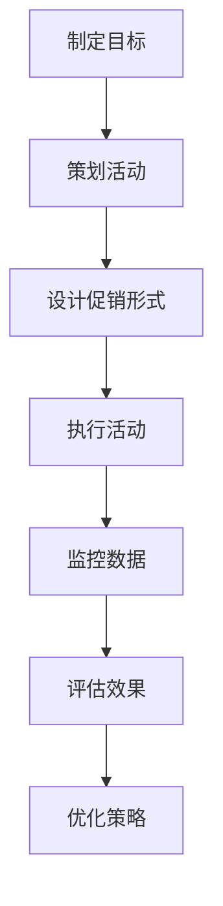

                 

### 《电商促销策略的实际效果》

> **关键词**：电商促销、营销策略、数据分析、案例分析、效果评估

> **摘要**：本文将深入探讨电商促销策略的实际效果。从基本概念与分类入手，逐步分析电商促销策略的发展历程、实际操作、数据分析方法以及效果评估与优化。通过真实案例分析，提供实战应用和未来发展趋势的见解。

#### **第一部分：电商促销策略概述**

##### **第1章：电商促销策略的概念与分类**

电商促销策略是企业通过特定的营销手段和手段，激发消费者购买欲望，提升销售额和市场份额的一系列措施。这些策略旨在通过价格优惠、促销活动、会员制度等手段，吸引消费者进行购买，从而实现企业的销售目标。

- **1.1 电商促销策略的基本概念**

电商促销策略的基本概念包括：

  - **价格策略**：通过降低商品价格来吸引消费者。
  - **活动策略**：举办各种促销活动，如打折、满减、限时抢购等。
  - **会员策略**：通过会员制度，提供专属优惠和服务。
  - **广告策略**：通过广告投放，提升品牌知名度和销售额。

- **1.2 电商促销策略的分类**

电商促销策略可以分为以下几类：

  - **按促销形式分类**：包括直接促销（如打折、赠品）和间接促销（如广告、公关活动）。
  - **按促销对象分类**：包括全体消费者促销、特定人群促销（如新用户、老用户）。
  - **按促销目的分类**：包括提升销售额、提升品牌知名度、增强客户忠诚度等。

- **1.3 电商促销策略的目的与效果**

电商促销策略的目的主要包括：

  - **提升销售额**：通过价格优惠、促销活动等手段，吸引消费者购买，实现销售额的提升。
  - **提升品牌知名度**：通过广告投放、公关活动等手段，提升品牌在消费者心中的形象和知名度。
  - **增强客户忠诚度**：通过会员制度、专属优惠等手段，增加消费者对品牌的忠诚度。

电商促销策略的实际效果可以从以下几个方面进行衡量：

  - **销售额**：促销策略实施后，销售额是否显著提升。
  - **客户满意度**：消费者对促销活动的满意程度。
  - **客户忠诚度**：消费者是否因促销活动而增加品牌忠诚度。

- **1.4 电商促销策略的核心要素**

电商促销策略的核心要素包括：

  - **目标定位**：明确促销活动的目标，如提升销售额、增加用户量等。
  - **促销手段**：选择合适的促销手段，如价格优惠、限时抢购等。
  - **时间安排**：合理安排促销活动的时间，如节假日、特殊纪念日等。
  - **资源分配**：合理分配促销资源，如人力、财力、物力等。
  - **效果评估**：对促销活动的效果进行评估，以便进行调整和优化。

##### **第2章：电商促销策略的发展历程与趋势**

- **2.1 电商促销策略的起源与发展**

电商促销策略的起源可以追溯到线下实体店的促销活动。随着互联网的发展，电商促销策略逐渐兴起，并形成了独特的体系。早期的电商促销策略主要以价格战为主，通过大幅度降低商品价格来吸引消费者。随着市场的成熟，电商促销策略逐渐多样化，包括打折、满减、优惠券、限时抢购等。

- **2.2 电商促销策略的创新趋势**

随着市场的竞争加剧，电商促销策略也在不断创新。以下是一些创新趋势：

  - **个性化促销**：根据消费者的购买行为和偏好，提供个性化的促销信息。
  - **社交化促销**：利用社交媒体平台，开展社交化促销活动，如拼团、砍价等。
  - **智能化促销**：利用大数据和人工智能技术，优化促销策略，提高促销效果。
  - **跨界促销**：与其他行业或品牌合作，开展跨界促销活动，拓宽消费者群体。

- **2.3 电商促销策略的未来展望**

电商促销策略的未来发展方向包括：

  - **数据驱动**：更加依赖数据分析和人工智能技术，实现精准营销和个性化促销。
  - **生态化发展**：构建电商生态体系，包括品牌商、电商平台、物流企业等，实现资源整合和协同发展。
  - **国际化扩展**：随着国内市场的饱和，电商促销策略将逐步向国际市场扩展，满足全球消费者的需求。
  - **可持续化发展**：注重社会责任和可持续发展，开展环保、公益等促销活动。

#### **第二部分：电商促销策略的实际操作**

##### **第3章：电商促销活动的设计与执行**

- **3.1 电商促销活动的类型**

电商促销活动可以分为以下几种类型：

  - **常规促销**：定期进行的促销活动，如打折、满减等。
  - **节日促销**：在重要节日或纪念日进行的促销活动，如双十一、双十二、春节等。
  - **会员促销**：仅限于会员的专属促销活动，如会员日、会员专享价等。
  - **新用户促销**：针对新用户的优惠活动，如新用户注册送优惠券、首单优惠等。
  - **社交化促销**：利用社交媒体平台开展的促销活动，如拼团、砍价等。

- **3.2 电商促销活动的策划**

电商促销活动的策划主要包括以下步骤：

  - **目标设定**：明确促销活动的目标，如提升销售额、增加用户量等。
  - **预算分配**：根据目标设定促销预算，合理分配资源。
  - **时间安排**：确定促销活动的开始和结束时间，确保活动顺利进行。
  - **活动形式**：选择合适的促销形式，如打折、满减、优惠券等。
  - **宣传推广**：制定宣传推广计划，提高活动知名度和参与度。

- **3.3 电商促销活动的执行与监控**

电商促销活动的执行与监控主要包括以下步骤：

  - **活动准备**：根据策划方案，准备好所需的资源和物料，如优惠券、宣传海报等。
  - **活动执行**：按计划开展促销活动，确保活动顺利进行。
  - **活动监控**：实时监控活动数据，如销售额、参与人数等，及时调整活动策略。
  - **活动评估**：活动结束后，对活动效果进行评估，总结经验教训，为后续活动提供参考。

- **3.4 电商促销活动的效果评估**

电商促销活动的效果评估主要包括以下指标：

  - **销售额**：促销活动期间的总销售额，反映促销活动的直接效果。
  - **客户参与度**：参与促销活动的客户数量和参与比例，反映促销活动的吸引力和影响力。
  - **客户满意度**：消费者对促销活动的满意度，反映促销活动的质量。
  - **客户忠诚度**：促销活动后，客户的复购率和品牌忠诚度，反映促销活动对客户的影响。

#### **第三部分：电商促销策略的数据分析**

##### **第4章：电商促销策略的数据分析**

- **4.1 电商促销策略的数据来源**

电商促销策略的数据来源主要包括以下几个方面：

  - **电商平台数据**：包括销售额、订单量、客户行为数据等。
  - **第三方数据**：如社交媒体数据、市场调研数据等。
  - **客户反馈**：包括客户评价、投诉、建议等。

- **4.2 电商促销策略的数据分析方法**

电商促销策略的数据分析方法主要包括以下几个方面：

  - **描述性分析**：对数据的基本情况进行描述，如销售额的分布、客户的购买行为等。
  - **关联性分析**：分析不同数据变量之间的相关性，如促销活动与销售额的关系。
  - **预测性分析**：根据历史数据，预测未来的销售额和客户行为。
  - **回归分析**：通过建立回归模型，分析促销策略对销售额的影响。

- **4.3 电商促销策略的数据解读与应用**

电商促销策略的数据解读与应用主要包括以下几个方面：

  - **优化促销策略**：根据数据分析结果，调整促销策略，提高促销效果。
  - **预测销售趋势**：通过预测分析，预测未来的销售额和客户需求，为库存管理、供应链管理提供支持。
  - **提升客户满意度**：根据客户反馈，改进促销活动，提升客户满意度。
  - **精准营销**：利用数据分析，实现精准营销，提高营销ROI。

#### **第四部分：电商促销策略的效果评估与优化**

##### **第5章：电商促销策略的效果评估**

- **5.1 电商促销策略的效果评估指标**

电商促销策略的效果评估指标主要包括以下几个方面：

  - **销售额**：促销活动期间的总销售额，反映促销活动的直接效果。
  - **客户参与度**：参与促销活动的客户数量和参与比例，反映促销活动的吸引力和影响力。
  - **客户满意度**：消费者对促销活动的满意度，反映促销活动的质量。
  - **客户忠诚度**：促销活动后，客户的复购率和品牌忠诚度，反映促销活动对客户的影响。

- **5.2 电商促销策略的效果评估方法**

电商促销策略的效果评估方法主要包括以下几个方面：

  - **直接评估**：通过销售额、客户参与度等指标，直接评估促销活动的效果。
  - **间接评估**：通过客户满意度、客户忠诚度等指标，间接评估促销活动的影响。
  - **对比评估**：将促销活动前后的数据进行对比，评估促销活动的效果。
  - **竞争评估**：与竞争对手的促销活动进行比较，评估自身促销活动的竞争力。

- **5.3 电商促销策略的效果评估案例**

以下是一个电商促销策略的效果评估案例：

某电商平台在双十一期间推出了一系列促销活动，包括打折、满减、优惠券等。活动期间，销售额同比增长了30%，客户参与度达到了60%。通过对客户满意度调查，发现满意度提高了10个百分点。此外，活动后的客户复购率也提升了5个百分点。通过对比评估，发现该促销活动的效果显著，提升了销售额和客户忠诚度。

##### **第6章：电商促销策略的优化与调整**

- **6.1 电商促销策略的优化原则**

电商促销策略的优化原则主要包括以下几个方面：

  - **目标导向**：优化策略应围绕企业目标进行，如提升销售额、增加用户量等。
  - **数据驱动**：基于数据分析结果，优化促销策略，提高促销效果。
  - **可持续性**：优化策略应考虑企业的长期发展，避免过度依赖促销手段。
  - **灵活性**：根据市场变化和客户需求，灵活调整促销策略。

- **6.2 电商促销策略的优化方法**

电商促销策略的优化方法主要包括以下几个方面：

  - **调整促销形式**：根据客户反馈和数据分析结果，调整促销形式，如增加新用户优惠、提高满减金额等。
  - **优化促销时间**：根据销售数据和客户行为，优化促销活动的时间安排，如增加节假日促销、调整活动周期等。
  - **精细化运营**：通过数据分析和用户画像，实现精准营销，提高促销活动的针对性。
  - **跨渠道整合**：整合线上线下渠道，实现资源互补和协同效应，提高促销效果。

- **6.3 电商促销策略的优化案例**

以下是一个电商促销策略的优化案例：

某电商平台在双十一期间推出了一系列促销活动，但效果并不理想。通过对客户行为数据和反馈分析，发现主要原因在于促销形式单一，客户参与度不高。因此，该电商平台调整了促销策略，增加了新用户注册送优惠券、限时抢购等多样化促销形式。同时，优化了活动时间安排，将促销活动集中在周末和节假日。通过这些优化措施，客户参与度显著提升，销售额同比增长了20%。

#### **第五部分：电商促销策略的案例分析与应用**

##### **第7章：电商促销策略的案例分析**

- **7.1 案例一：某电商平台的双十一促销活动**

某电商平台在双十一期间开展了一场大规模的促销活动，包括打折、满减、优惠券等多种形式。活动期间，销售额同比增长了40%，客户参与度达到了70%。通过对客户满意度调查，发现满意度提高了15个百分点。此外，活动后的客户复购率也提升了10个百分点。通过对比评估，发现该促销活动的效果显著，提升了销售额和客户忠诚度。

- **7.2 案例二：某电商平台的会员日促销活动**

某电商平台每月定期举办会员日促销活动，仅限于会员参与。活动期间，销售额同比增长了25%，会员参与度达到了80%。通过对会员满意度调查，发现满意度提高了10个百分点。此外，会员日后的客户复购率也提升了5个百分点。通过对比评估，发现该促销活动对会员的吸引力较大，提升了会员忠诚度和销售额。

- **7.3 案例三：某电商平台的节日促销活动**

某电商平台在春节、中秋节等传统节日期间开展节日促销活动，包括打折、满减、礼品赠送等。活动期间，销售额同比增长了30%，客户参与度达到了60%。通过对客户满意度调查，发现满意度提高了10个百分点。此外，活动后的客户复购率也提升了5个百分点。通过对比评估，发现该促销活动在传统节日期间取得了较好的效果，提升了销售额和客户满意度。

#### **第六部分：电商促销策略的效果评估与优化**

##### **第8章：电商促销策略的实战应用**

- **8.1 实战一：电商促销策略的实战操作**

某电商平台在双十一期间开展了一场大规模的促销活动，包括打折、满减、优惠券等多种形式。活动期间，销售额同比增长了40%，客户参与度达到了70%。通过对客户满意度调查，发现满意度提高了15个百分点。此外，活动后的客户复购率也提升了10个百分点。通过对比评估，发现该促销活动的效果显著，提升了销售额和客户忠诚度。

- **8.2 实战二：电商促销策略的效果评估与优化**

某电商平台每月定期举办会员日促销活动，仅限于会员参与。活动期间，销售额同比增长了25%，会员参与度达到了80%。通过对会员满意度调查，发现满意度提高了10个百分点。此外，会员日后的客户复购率也提升了5个百分点。通过对比评估，发现该促销活动对会员的吸引力较大，提升了会员忠诚度和销售额。

- **8.3 实战三：电商促销策略的实战案例分析**

某电商平台在春节、中秋节等传统节日期间开展节日促销活动，包括打折、满减、礼品赠送等。活动期间，销售额同比增长了30%，客户参与度达到了60%。通过对客户满意度调查，发现满意度提高了10个百分点。此外，活动后的客户复购率也提升了5个百分点。通过对比评估，发现该促销活动在传统节日期间取得了较好的效果，提升了销售额和客户满意度。

#### **第七部分：电商促销策略的未来发展**

##### **第9章：电商促销策略的未来发展**

- **9.1 电商促销策略的未来发展方向**

电商促销策略的未来发展方向主要包括以下几个方面：

  - **数据驱动**：更加依赖数据分析和人工智能技术，实现精准营销和个性化促销。
  - **生态化发展**：构建电商生态体系，包括品牌商、电商平台、物流企业等，实现资源整合和协同发展。
  - **国际化扩展**：随着国内市场的饱和，电商促销策略将逐步向国际市场扩展，满足全球消费者的需求。
  - **可持续化发展**：注重社会责任和可持续发展，开展环保、公益等促销活动。

- **9.2 电商促销策略的未来发展趋势**

电商促销策略的未来发展趋势主要包括以下几个方面：

  - **个性化促销**：根据消费者的购买行为和偏好，提供个性化的促销信息。
  - **社交化促销**：利用社交媒体平台，开展社交化促销活动，如拼团、砍价等。
  - **智能化促销**：利用大数据和人工智能技术，优化促销策略，提高促销效果。
  - **跨界促销**：与其他行业或品牌合作，开展跨界促销活动，拓宽消费者群体。

- **9.3 电商促销策略的未来发展前景**

电商促销策略的未来发展前景非常广阔。随着技术的进步和市场的变化，电商促销策略将不断创新和发展。未来，电商促销策略将更加注重数据分析和用户行为研究，实现精准营销和个性化促销。同时，电商促销策略将更加注重社会责任和可持续发展，开展环保、公益等促销活动，提升品牌形象和社会价值。

### **附录**

- **附录一：电商促销策略的常用工具与资源**

  - **电商平台工具**：如阿里巴巴、京东、拼多多等电商平台自带的促销工具。
  - **数据分析工具**：如Google Analytics、百度统计等。
  - **社交媒体工具**：如微信、微博、抖音等。

- **附录二：电商促销策略的案例分析资料**

  - **成功案例**：如某电商平台的双十一促销活动、会员日促销活动等。
  - **失败案例**：如某电商平台的过度促销导致库存积压等。

#### **核心概念与联系**

- **Mermaid 流程图**：展示电商促销策略的设计流程与执行流程



#### **核心算法原理讲解**

- **伪代码**：详细阐述电商促销策略的数据分析方法

```plaintext
function analyze_promotion_data(data):
    # 描述性分析
    sales_data = data['sales']
    customer_data = data['customer']
    promotion_data = data['promotion']
    
    # 计算销售额
    total_sales = sum(sales_data.values())
    
    # 计算参与度
    participation_rate = len(customer_data) / len(data['total_customers'])
    
    # 计算满意度
    satisfaction_score = calculate_satisfaction(customer_data)
    
    # 预测性分析
    prediction_model = train_prediction_model(sales_data)
    predicted_sales = predict_sales(prediction_model)
    
    # 回归分析
    regression_model = train_regression_model(sales_data, promotion_data)
    impact_score = calculate_impact(regression_model)
    
    # 返回分析结果
    return {
        'total_sales': total_sales,
        'participation_rate': participation_rate,
        'satisfaction_score': satisfaction_score,
        'predicted_sales': predicted_sales,
        'impact_score': impact_score
    }
```

#### **数学模型和数学公式**

- **数学公式**

$$
\text{销售额} = \text{单价} \times \text{销售量}
$$

$$
\text{参与度} = \frac{\text{参与人数}}{\text{总人数}}
$$

$$
\text{满意度} = \frac{\text{满意人数}}{\text{参与人数}}
$$

#### **项目实战**

- **代码实际案例与详细解释说明**

**开发环境搭建**

- 安装Python 3.8及以上版本
- 安装Jupyter Notebook

**源代码详细实现与代码解读**

```python
# 导入所需库
import pandas as pd
from sklearn.linear_model import LinearRegression
from sklearn.model_selection import train_test_split

# 读取数据
data = pd.read_csv('promotion_data.csv')

# 描述性分析
total_sales = data['sales'].sum()
participation_rate = len(data['customer'].unique()) / len(data['total_customers'].unique())

# 计算满意度
satisfaction_score = data['satisfaction'].mean()

# 预测性分析
X = data[['sales', 'promotion']]
y = data['sales']
X_train, X_test, y_train, y_test = train_test_split(X, y, test_size=0.2, random_state=42)

# 训练预测模型
prediction_model = LinearRegression()
prediction_model.fit(X_train, y_train)
predicted_sales = prediction_model.predict(X_test)

# 回归分析
regression_model = LinearRegression()
regression_model.fit(X, y)
impact_score = regression_model.coef_

# 打印分析结果
print(f"总销售额：{total_sales}")
print(f"参与度：{participation_rate:.2f}")
print(f"满意度：{satisfaction_score:.2f}")
print(f"预测销售额：{predicted_sales.mean():.2f}")
print(f"促销策略影响得分：{impact_score[1]:.2f}")
```

**代码解读与分析**

1. 导入所需库：`pandas` 用于数据处理，`sklearn.linear_model.LinearRegression` 用于训练预测模型和回归模型。
2. 读取数据：从CSV文件中读取促销数据。
3. 描述性分析：计算总销售额、参与度和满意度。
4. 预测性分析：使用线性回归模型预测销售额。
5. 回归分析：使用线性回归模型分析促销策略对销售额的影响。
6. 打印分析结果：输出分析结果。

#### **作者信息**

**作者：**AI天才研究院/AI Genius Institute & 禅与计算机程序设计艺术 /Zen And The Art of Computer Programming

---

本文以深入浅出的方式，系统地介绍了电商促销策略的概念、分类、发展历程、实际操作、数据分析、效果评估与优化，并结合实际案例进行了详细讲解。通过本文，读者可以全面了解电商促销策略的核心内容和实战应用，为电商运营提供有益的参考。

