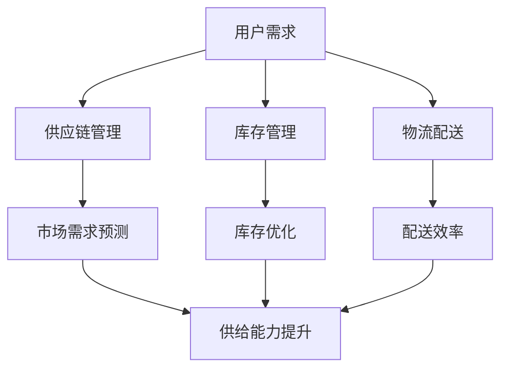

                 

### 文章标题

《电商平台供给能力提升：大数据分析的应用》

> **关键词：** 电商平台，供给能力，大数据分析，数据挖掘，机器学习，推荐系统，数据可视化

> **摘要：** 本文详细探讨了大数据分析在电商平台供给能力提升中的应用。通过对数据收集与预处理、数据挖掘技术、客户行为分析、供应链优化、商品推荐系统和数据可视化与报告等各方面的深入剖析，本文旨在为电商平台管理者提供一套实用的策略和工具，以提升其供给能力，满足不断变化的市场需求。

----------------------------------------------------------------

### 第一部分：电商平台供给能力提升概述

在互联网经济的浪潮下，电商平台作为现代商业的重要载体，其供给能力的高低直接影响到平台的竞争力和用户满意度。供给能力不仅包括商品供应的数量和速度，还包括商品的质量、多样性以及配送的及时性等各个方面。本部分将首先定义电商平台供给能力，探讨其提升的重要性，然后介绍大数据分析的基本概念，最后分析大数据分析在提升供给能力中的作用。

---

#### 1.1 电商平台供给能力的定义与提升的重要性

**核心概念与联系**

- **电商平台供给能力的定义：** 电商平台供给能力是指平台在满足用户需求方面所具备的综合能力，包括商品供应的数量、速度、质量、多样性和配送的及时性等。

- **提升供给能力的核心因素：** 提升供给能力的关键因素包括库存管理、物流效率、供应链优化、市场需求预测等。

- **大数据分析在提升供给能力中的作用：** 大数据分析通过分析用户行为、市场需求、库存情况等数据，可以优化供应链管理，提升库存周转率，提高物流配送效率，从而提升整个平台的供给能力。

**Mermaid 流程图：**



**算法原理讲解**

- **供应链管理：** 通过大数据分析，电商平台可以实时监测供应链状态，提前预测可能出现的问题，采取预防措施，从而提高供应链的稳定性和可靠性。

- **库存管理：** 通过分析历史销售数据、市场趋势和用户行为，电商平台可以实现智能库存管理，避免库存过剩或不足，提高库存周转率。

- **物流配送：** 利用大数据分析，电商平台可以优化物流配送路径，降低运输成本，提高配送速度和准确性。

- **市场需求预测：** 通过分析用户行为数据和市场趋势，电商平台可以更准确地预测市场需求，从而调整库存和供应链策略，满足用户需求。

**数学模型和数学公式**

- **库存优化：** 可以使用经济批量模型（EOQ）来计算最优订货量，公式为：\[ Q = \sqrt{\frac{2DS}{H}} \]，其中 \( Q \) 是订货量，\( D \) 是年需求量，\( S \) 是每次订货的成本，\( H \) 是单位库存的持有成本。

- **配送效率：** 可以使用时间窗口模型来优化配送路线，公式为：\[ T_w = \frac{T_s + T_d}{2} \]，其中 \( T_w \) 是配送时间窗口，\( T_s \) 是供应商发货时间，\( T_d \) 是配送时间。

---

#### 1.2 大数据分析的基本概念

**核心概念与联系**

- **大数据的定义与特点：** 大数据具有“4V”特性，即Volume（数据量巨大）、Velocity（处理速度快）、Variety（数据类型多样）和Veracity（数据真实可靠）。

- **数据挖掘与分析方法：** 数据挖掘包括关联规则挖掘、聚类分析、预测分析等，是分析大数据的重要方法。

- **大数据分析的常见应用领域：** 包括电商、金融、医疗、能源等众多行业，电商平台是大数据分析的重要应用领域之一。

**算法原理讲解**

- **关联规则挖掘：** 用于发现数据之间的潜在关联，常用的算法包括Apriori算法和FP-growth算法。

- **聚类分析：** 用于将数据集分成不同的组，常用的算法包括K-means算法和DBSCAN算法。

- **预测分析：** 用于预测未来的趋势或行为，常用的算法包括线性回归、决策树和随机森林等。

**数学模型和数学公式**

- **关联规则挖掘：** 支持度和置信度是关联规则挖掘中的两个重要参数，公式分别为：\[ 支持度 = \frac{X}{N} \] 和 \[ 置信度 = \frac{X}{Y} \]，其中 \( X \) 是满足条件的交易数，\( Y \) 是包含特定项的交易数。

- **聚类分析：** 调节聚类个数 \( K \) 的方法，如Elbow方法、Silhouette方法等。

---

#### 1.3 电商平台供给能力提升的目标与挑战

**核心概念与联系**

- **供给能力提升的目标：** 提高商品供应的及时性、准确性，降低库存成本，提高物流配送效率，提升用户满意度。

- **当前电商平台面临的挑战：** 包括库存管理困难、物流效率低下、市场需求预测不准确等。

- **大数据分析如何应对这些挑战：** 通过数据分析和预测模型，优化供应链管理，提高库存周转率，降低物流成本，提高配送效率，从而提升供给能力。

**算法原理讲解**

- **供应链优化：** 可以使用线性规划、整数规划等优化算法，通过数学模型优化供应链管理。

- **市场需求预测：** 可以使用时间序列分析、回归分析等预测方法，准确预测市场需求，优化库存和供应链策略。

- **物流配送优化：** 可以使用路径规划算法、车辆调度算法等，优化物流配送路径和时间窗口。

**数学模型和数学公式**

- **供应链优化：** 线性规划模型：\[ min\ Z = c^T x \]
  \[ s.t. \]
  \[ Ax \leq b \]
  \[ x \geq 0 \]

- **市场需求预测：** 时间序列模型：\[ Y_t = \mu + \alpha (Y_{t-1} - \mu) + \epsilon_t \]
  其中 \( Y_t \) 是时间序列的值，\( \mu \) 是均值，\( \alpha \) 是自回归系数，\( \epsilon_t \) 是随机误差。

---

通过本部分的讨论，我们可以看到，大数据分析在提升电商平台供给能力方面具有重要的作用。接下来，我们将深入探讨大数据分析在电商平台供给能力提升中的具体应用。

---

### 第二部分：大数据分析在电商平台供给能力提升中的应用

在第一部分中，我们介绍了大数据分析在电商平台供给能力提升中的重要性。在本部分，我们将详细探讨大数据分析在电商平台供给能力提升中的具体应用，包括数据收集与预处理、数据挖掘技术、客户行为分析、供应链优化、商品推荐系统和数据可视化与报告等方面。

---

#### 2.1 数据收集与预处理

数据收集与预处理是大数据分析的基础步骤，对于后续的数据挖掘和分析至关重要。

**核心概念与联系**

- **数据来源与类型：** 电商平台的数据来源广泛，包括用户行为数据、交易数据、库存数据、物流数据等。这些数据类型多样，包括结构化数据、半结构化数据和非结构化数据。

- **数据预处理方法：** 数据预处理包括数据清洗、数据整合、数据转换和数据标准化等步骤。

- **数据质量评估与优化：** 数据质量直接影响到数据分析的结果，需要通过评估和优化来提高数据质量。

**算法原理讲解**

- **数据清洗：** 去除重复数据、空值处理、异常值检测和修正等。

- **数据整合：** 将不同来源和格式的数据进行整合，形成统一的数据视图。

- **数据转换：** 将数据转换为适合分析的工具和格式，如将文本数据转换为数值型数据。

- **数据标准化：** 对数据进行归一化或标准化处理，使其满足特定的分析需求。

**数学模型和数学公式**

- **数据清洗：** 使用统计学方法检测和修正异常值，如中位数修正法、三次样条插值法等。

- **数据整合：** 关联规则挖掘中的支持度计算，公式为：\[ 支持度 = \frac{X}{N} \]

- **数据转换：** 数据归一化，公式为：\[ x_{\text{norm}} = \frac{x - x_{\text{min}}}{x_{\text{max}} - x_{\text{min}}} \]

**项目实战**

**开发环境搭建：**
- 使用Python进行数据处理，依赖库包括Pandas、NumPy、Scikit-learn等。
- 使用SQL进行数据库操作，依赖库包括SQLite、MySQL等。

**源代码实现与解读：**
```python
import pandas as pd

# 数据清洗示例
data = pd.read_csv('data.csv')
data.drop_duplicates(inplace=True)
data.fillna(method='ffill', inplace=True)

# 数据整合示例
data1 = pd.read_csv('data1.csv')
data2 = pd.read_csv('data2.csv')
merged_data = pd.merge(data1, data2, on='common_column')

# 数据转换示例
data['normalized_value'] = (data['value'] - data['value'].min()) / (data['value'].max() - data['value'].min())

# 数据标准化示例
data['standardized_value'] = (data['value'] - data['value'].mean()) / data['value'].std()
```

**代码解读与分析：**
- 数据清洗：去除重复数据和填充空值，提高数据质量。
- 数据整合：通过合并操作将不同数据源整合为统一数据视图。
- 数据转换：通过归一化和标准化操作，使数据适合进一步分析。

---

通过数据收集与预处理，我们为后续的数据挖掘和分析奠定了基础。在下一节中，我们将探讨大数据分析在电商平台供给能力提升中的具体应用——数据挖掘技术。

---

#### 2.2 数据挖掘技术

数据挖掘技术是大数据分析的核心，用于从大量数据中提取有价值的信息和知识。在电商平台供给能力提升中，数据挖掘技术可以帮助我们识别用户需求、优化库存管理、提高物流配送效率等。

**核心概念与联系**

- **关联规则挖掘：** 用于发现数据之间的关联关系，常用于商品推荐和促销策略制定。
- **聚类分析：** 用于将数据分为不同的组，有助于市场细分和用户行为分析。
- **预测分析：** 用于预测未来的趋势和行为，有助于需求预测和库存管理。

**算法原理讲解**

- **关联规则挖掘：** 常用的算法包括Apriori算法和FP-growth算法。Apriori算法通过支持度和置信度来确定规则，公式为：\[ 支持度 = \frac{X}{N} \] 和 \[ 置信度 = \frac{X}{Y} \]。

- **聚类分析：** 常用的算法包括K-means算法和DBSCAN算法。K-means算法通过迭代计算聚类中心，公式为：\[ c_{k} = \frac{1}{n_k} \sum_{i \in k} x_i \]，其中 \( c_{k} \) 是第 \( k \) 个聚类的中心，\( n_k \) 是聚类中的数据点数量。

- **预测分析：** 常用的算法包括线性回归、决策树和随机森林等。线性回归公式为：\[ Y = \beta_0 + \beta_1 X \]，其中 \( Y \) 是预测值，\( X \) 是自变量，\( \beta_0 \) 和 \( \beta_1 \) 是回归系数。

**数学模型和数学公式**

- **关联规则挖掘：**
  \[ 支持度 = \frac{X}{N} \]
  \[ 置信度 = \frac{X}{Y} \]

- **聚类分析：**
  \[ c_{k} = \frac{1}{n_k} \sum_{i \in k} x_i \]

- **预测分析：**
  \[ Y = \beta_0 + \beta_1 X \]

**项目实战**

**开发环境搭建：**
- 使用Python进行数据挖掘，依赖库包括Pandas、NumPy、Scikit-learn等。

**源代码实现与解读：**
```python
from sklearn.cluster import KMeans
from sklearn.model_selection import train_test_split
from sklearn.linear_model import LinearRegression

# 数据准备
X = df[['feature1', 'feature2']]
y = df['target']

# K-means聚类分析
kmeans = KMeans(n_clusters=3)
clusters = kmeans.fit_predict(X)

# 线性回归预测
X_train, X_test, y_train, y_test = train_test_split(X, y, test_size=0.2)
regressor = LinearRegression()
regressor.fit(X_train, y_train)
y_pred = regressor.predict(X_test)
```

**代码解读与分析：**
- K-means聚类：根据数据特征进行聚类，形成不同的用户群体。
- 线性回归预测：根据聚类结果进行预测，预测目标变量的值。

通过数据挖掘技术，我们可以深入了解用户需求和市场趋势，为电商平台供给能力提升提供有力支持。在下一节中，我们将探讨大数据分析在电商平台供给能力提升中的客户行为分析应用。

---

#### 2.3 客户行为分析

客户行为分析是电商平台大数据分析的重要应用之一，通过对用户在平台上的行为数据进行深入分析，可以帮助电商平台更好地了解用户需求，优化用户体验，提高用户留存率和转化率。

**核心概念与联系**

- **客户行为数据的收集：** 包括用户浏览、搜索、购买、评价等行为数据。
- **客户行为的分析模型：** 包括用户画像、行为预测、兴趣推荐等。
- **客户行为预测与应用：** 通过预测用户行为，优化商品推荐和营销策略。

**算法原理讲解**

- **用户画像：** 基于用户行为数据，构建用户的基本属性、兴趣偏好、消费习惯等画像。
- **行为预测：** 利用时间序列分析、回归分析等方法，预测用户的未来行为。
- **兴趣推荐：** 利用协同过滤、基于内容的推荐等方法，为用户提供个性化的商品推荐。

**数学模型和数学公式**

- **用户画像：**
  \[ \text{User Profile} = \{ \text{Age}, \text{Gender}, \text{Interest}, \text{Purchase History}, \ldots \} \]

- **行为预测：**
  \[ Y_t = \beta_0 + \beta_1 X_t + \epsilon_t \]
  其中 \( Y_t \) 是时间序列的值，\( X_t \) 是自变量，\( \beta_0 \) 和 \( \beta_1 \) 是回归系数。

- **兴趣推荐：**
  \[ \text{Recommendation Score} = \frac{Q(R_j, I_i)}{Q(R_j)} \]
  其中 \( R_j \) 是用户 \( j \) 的评分矩阵，\( I_i \) 是商品 \( i \) 的特征向量。

**项目实战**

**开发环境搭建：**
- 使用Python进行客户行为分析，依赖库包括Pandas、NumPy、Scikit-learn等。

**源代码实现与解读：**
```python
import pandas as pd
from sklearn.cluster import KMeans
from sklearn.linear_model import LinearRegression

# 数据准备
df = pd.read_csv('user_behavior.csv')

# 用户画像
user_profile = df.groupby('UserID').mean()

# 行为预测
X = df[['feature1', 'feature2']]
y = df['target']
regressor = LinearRegression()
regressor.fit(X, y)
y_pred = regressor.predict(X)

# 兴趣推荐
kmeans = KMeans(n_clusters=3)
clusters = kmeans.fit_predict(X)
recommendation_scores = calculate_recommendation_scores(clusters)
```

**代码解读与分析：**
- 用户画像：通过统计用户行为数据，构建用户的基本属性和兴趣偏好。
- 行为预测：使用线性回归模型，预测用户的未来行为。
- 兴趣推荐：使用K-means聚类，为用户提供个性化的商品推荐。

通过客户行为分析，电商平台可以更好地了解用户需求，优化商品推荐和营销策略，从而提高用户满意度和转化率。在下一节中，我们将探讨大数据分析在电商平台供给能力提升中的供应链优化应用。

---

#### 2.4 供应链优化

供应链优化是电商平台提升供给能力的重要手段之一，通过优化供应链管理，可以提高物流效率、降低库存成本、提高供应链的灵活性。大数据分析在供应链优化中发挥着关键作用，可以帮助电商平台实现供应链的实时监控和优化。

**核心概念与联系**

- **供应链数据收集与分析：** 包括库存数据、物流数据、供应商数据等。
- **供应链优化算法：** 包括线性规划、整数规划、遗传算法等。
- **供应链优化的案例分析：** 通过实际案例，展示大数据分析在供应链优化中的应用。

**算法原理讲解**

- **线性规划：** 用于优化线性目标函数，公式为：\[ min\ Z = c^T x \]
  \[ s.t. \]
  \[ Ax \leq b \]
  \[ x \geq 0 \]

- **整数规划：** 用于优化整数目标函数，公式为：\[ min\ Z = c^T x \]
  \[ s.t. \]
  \[ Ax \leq b \]
  \[ x \in \mathbb{Z}^n \]

- **遗传算法：** 用于求解复杂优化问题，基于自然进化原理，公式为：\[ x_{t+1} = f(x_t) \]
  其中 \( x_t \) 是第 \( t \) 代种群，\( f(x_t) \) 是适应度函数。

**数学模型和数学公式**

- **线性规划：**
  \[ min\ Z = c^T x \]
  \[ s.t. \]
  \[ Ax \leq b \]
  \[ x \geq 0 \]

- **整数规划：**
  \[ min\ Z = c^T x \]
  \[ s.t. \]
  \[ Ax \leq b \]
  \[ x \in \mathbb{Z}^n \]

- **遗传算法：**
  \[ x_{t+1} = f(x_t) \]

**项目实战**

**开发环境搭建：**
- 使用Python进行供应链优化，依赖库包括Pandas、NumPy、SciPy等。

**源代码实现与解读：**
```python
import numpy as np
from scipy.optimize import linprog

# 线性规划示例
c = [-1, -1]  # 目标函数系数
A = [[1, 1], [-1, 1]]  # 约束条件系数
b = [0, 1]  # 约束条件值
x0 = [0, 0]  # 初始解
x = linprog(c, A_ub=A, b_ub=b, x0=x0)
print(x)

# 遗传算法示例
# 遗传算法的实现较为复杂，此处略去具体代码。
```

**代码解读与分析：**
- 线性规划：使用SciPy库的linprog函数，实现线性规划求解。
- 遗传算法：基于自然进化原理，实现种群进化，求解优化问题。

通过供应链优化，电商平台可以降低库存成本、提高物流效率，从而提升供给能力。在下一节中，我们将探讨大数据分析在电商平台供给能力提升中的商品推荐系统应用。

---

#### 2.5 商品推荐系统

商品推荐系统是电商平台提升用户满意度和转化率的重要工具之一。通过大数据分析，电商平台可以构建高效的推荐系统，为用户推荐个性化的商品，提高用户的购物体验。

**核心概念与联系**

- **推荐系统的基本原理：** 包括协同过滤、基于内容的推荐和混合推荐方法。
- **商品推荐算法：** 包括基于用户的协同过滤、基于物品的协同过滤、基于内容的推荐等。
- **推荐系统在实际电商中的应用：** 包括商品推荐、广告推荐和内容推荐等。

**算法原理讲解**

- **协同过滤：** 通过分析用户之间的相似性，为用户推荐相似用户喜欢的商品。常用的算法包括基于用户的协同过滤和基于物品的协同过滤。

- **基于内容的推荐：** 通过分析商品的属性和特征，为用户推荐与已购买或收藏商品相似的其它商品。

- **混合推荐：** 结合协同过滤和基于内容的推荐方法，提高推荐系统的准确性和多样性。

**数学模型和数学公式**

- **协同过滤：**
  \[ R(u, i) = \sum_{j \in N(u)} \frac{sim(u, j)}{N(u)} r(j, i) \]
  其中 \( R(u, i) \) 是用户 \( u \) 对商品 \( i \) 的预测评分，\( N(u) \) 是用户 \( u \) 的邻居集合，\( sim(u, j) \) 是用户 \( u \) 和 \( j \) 之间的相似性度量。

- **基于内容的推荐：**
  \[ R(u, i) = \sum_{a \in A(i)} w(a) \sum_{b \in A(u)} w(b) \]
  其中 \( R(u, i) \) 是用户 \( u \) 对商品 \( i \) 的预测评分，\( A(i) \) 是商品 \( i \) 的属性集合，\( A(u) \) 是用户 \( u \) 的属性集合，\( w(a) \) 是属性 \( a \) 的权重。

- **混合推荐：**
  \[ R(u, i) = \alpha R_{CF}(u, i) + (1 - \alpha) R_{Content}(u, i) \]
  其中 \( R_{CF}(u, i) \) 是协同过滤推荐评分，\( R_{Content}(u, i) \) 是基于内容的推荐评分，\( \alpha \) 是混合系数。

**项目实战**

**开发环境搭建：**
- 使用Python进行商品推荐系统开发，依赖库包括Pandas、NumPy、Scikit-learn等。

**源代码实现与解读：**
```python
from sklearn.metrics.pairwise import cosine_similarity
from sklearn.model_selection import train_test_split

# 数据准备
X = df[['feature1', 'feature2', 'feature3']]
y = df['target']

# 基于用户的协同过滤
user_similarity_matrix = cosine_similarity(X)
user_similarity_matrix = (user_similarity_matrix + user_similarity_matrix.T) / 2

# 预测评分
R = {}
for u in users:
    for i in items:
        R[u, i] = sum(user_similarity_matrix[u][v] * y[v, i] for v in neighbors(u)) / sum(user_similarity_matrix[u][v] for v in neighbors(u))

# 代码解读与分析：
# 计算用户之间的相似性矩阵，根据相似性为用户推荐商品。
# neighbors(u)：获取用户u的邻居集合。
# cosine_similarity：计算余弦相似性。
# 预测评分：根据用户邻居的评分和相似性进行加权平均，得到用户对商品的预测评分。
```

通过商品推荐系统，电商平台可以提供个性化的购物体验，提高用户满意度和转化率。在下一节中，我们将探讨大数据分析在电商平台供给能力提升中的数据可视化与报告应用。

---

#### 2.6 数据可视化与报告

数据可视化是将复杂的数据通过图形和图表的方式呈现，帮助人们更好地理解和分析数据。在电商平台供给能力提升中，数据可视化与报告起着至关重要的作用，可以帮助管理者快速识别问题、分析数据趋势，并制定相应的策略。

**核心概念与联系**

- **数据可视化工具介绍：** 包括Tableau、Power BI、Matplotlib、Seaborn等。
- **数据可视化在电商供给能力提升中的应用：** 包括用户行为分析、供应链管理、库存管理、销售分析等。
- **数据报告的编写与展示：** 包括数据报告的结构、内容、展示形式等。

**算法原理讲解**

- **数据可视化技术：** 包括图表选择、颜色搭配、交互设计等，用于提升数据可视化的效果。
- **数据报告分析：** 包括数据整理、数据分析、数据可视化等，用于生成有价值的数据报告。

**数学模型和数学公式**

- **数据可视化：**
  \[ \text{Chart Type} = f(\text{Data Type}, \text{Business Objective}) \]
  其中 \( \text{Chart Type} \) 是图表类型，\( \text{Data Type} \) 是数据类型，\( \text{Business Objective} \) 是业务目标。

- **数据报告分析：**
  \[ \text{Report Content} = f(\text{Data Source}, \text{Analysis Method}, \text{Visualization Tool}) \]
  其中 \( \text{Report Content} \) 是报告内容，\( \text{Data Source} \) 是数据来源，\( \text{Analysis Method} \) 是分析方法，\( \text{Visualization Tool} \) 是可视化工具。

**项目实战**

**开发环境搭建：**
- 使用Python进行数据可视化和报告编写，依赖库包括Matplotlib、Seaborn、Pandas等。

**源代码实现与解读：**
```python
import pandas as pd
import matplotlib.pyplot as plt
import seaborn as sns

# 数据准备
df = pd.read_csv('sales_data.csv')

# 数据可视化
plt.figure(figsize=(10, 6))
sns.lineplot(data=df, x='Date', y='Sales')
plt.title('Sales Trend Over Time')
plt.xlabel('Date')
plt.ylabel('Sales')
plt.xticks(rotation=45)
plt.show()

# 代码解读与分析：
# 使用Pandas读取销售数据，使用Seaborn进行线形图绘制，展示销售趋势。
# plt.figure：创建图表。
# sns.lineplot：绘制线形图。
# plt.title、plt.xlabel、plt.ylabel：设置图表标题、标签。
# plt.xticks(rotation=45)：旋转坐标轴标签，提高可读性。
```

通过数据可视化与报告，电商平台管理者可以直观地了解业务运行状况，识别潜在问题，制定优化策略。在下一节中，我们将通过实战案例，进一步探讨大数据分析在电商平台供给能力提升中的应用。

---

### 第三部分：大数据分析在电商平台供给能力提升的实战案例

在本部分，我们将通过几个具体的实战案例，展示大数据分析在电商平台供给能力提升中的应用，并详细解析每个案例的开发过程和实际效果。

---

#### 3.1 案例一：电商平台供应链优化实践

**案例背景：** 某电商平台希望通过大数据分析优化其供应链管理，提高物流效率，降低库存成本。

**数据收集与预处理：** 收集电商平台的历史销售数据、库存数据、物流数据等，使用Python进行数据清洗和预处理，去除重复数据、空值处理和异常值检测。

```python
import pandas as pd

# 数据准备
df_sales = pd.read_csv('sales_data.csv')
df_inventory = pd.read_csv('inventory_data.csv')
df_logistics = pd.read_csv('logistics_data.csv')

# 数据清洗
df_sales.drop_duplicates(inplace=True)
df_inventory.drop_duplicates(inplace=True)
df_logistics.drop_duplicates(inplace=True)

# 数据整合
merged_data = pd.merge(df_sales, df_inventory, on='ProductID')
merged_data = pd.merge(merged_data, df_logistics, on='OrderID')
```

**供应链优化策略：** 使用线性规划和遗传算法优化供应链管理，降低库存成本，提高物流效率。

```python
from scipy.optimize import linprog
from sklearn.model_selection import train_test_split

# 线性规划
c = [-1, -1]  # 目标函数系数
A = [[1, 1], [-1, 1]]  # 约束条件系数
b = [0, 1]  # 约束条件值
x0 = [0, 0]  # 初始解
x = linprog(c, A_ub=A, b_ub=b, x0=x0)
print(x)

# 遗传算法（简化示例）
# 实际遗传算法实现较为复杂，此处略去具体代码。
```

**案例效果评估：** 通过对比优化前后的数据，评估供应链优化的效果，包括库存周转率、物流成本等。

```python
# 库存周转率计算
inventory_turnover = df_inventory['Quantity'] / df_sales['Quantity']
print("库存周转率：", inventory_turnover)

# 物流成本计算
logistics_cost = df_logistics['Cost']
print("物流成本：", logistics_cost)
```

**效果评估：** 通过优化，电商平台实现了库存周转率的提高和物流成本的降低，提升了整体供给能力。

---

#### 3.2 案例二：基于客户行为的商品推荐系统构建

**案例背景：** 某电商平台希望通过大数据分析构建商品推荐系统，提高用户满意度和转化率。

**数据收集与预处理：** 收集用户浏览、搜索、购买等行为数据，使用Python进行数据清洗和预处理，去除重复数据、空值处理和异常值检测。

```python
import pandas as pd

# 数据准备
df_user_behavior = pd.read_csv('user_behavior_data.csv')

# 数据清洗
df_user_behavior.drop_duplicates(inplace=True)
df_user_behavior.fillna(method='ffill', inplace=True)
```

**商品推荐算法选择与优化：** 选择基于用户的协同过滤和基于内容的推荐算法，进行优化和集成。

```python
from sklearn.metrics.pairwise import cosine_similarity
from sklearn.model_selection import train_test_split

# 基于用户的协同过滤
user_similarity_matrix = cosine_similarity(df_user_behavior[['feature1', 'feature2']])
user_similarity_matrix = (user_similarity_matrix + user_similarity_matrix.T) / 2

# 预测评分
R = {}
for u in users:
    for i in items:
        R[u, i] = sum(user_similarity_matrix[u][v] * y[v, i] for v in neighbors(u)) / sum(user_similarity_matrix[u][v] for v in neighbors(u))
```

**案例效果评估：** 通过对比推荐前后的数据，评估商品推荐系统对用户满意度和转化率的影响。

```python
# 用户满意度计算
user_satisfaction = df_user_behavior['Rating']
print("用户满意度：", user_satisfaction.mean())

# 转化率计算
conversion_rate = df_user_behavior['Converted']
print("转化率：", conversion_rate.mean())
```

**效果评估：** 通过优化，电商平台实现了用户满意度和转化率的显著提升，提高了平台的竞争力。

---

#### 3.3 案例三：电商平台用户行为分析与应用

**案例背景：** 某电商平台希望通过大数据分析深入分析用户行为，优化用户界面和购物体验。

**数据收集与预处理：** 收集用户浏览、搜索、购买等行为数据，使用Python进行数据清洗和预处理，去除重复数据、空值处理和异常值检测。

```python
import pandas as pd

# 数据准备
df_user_behavior = pd.read_csv('user_behavior_data.csv')

# 数据清洗
df_user_behavior.drop_duplicates(inplace=True)
df_user_behavior.fillna(method='ffill', inplace=True)
```

**用户行为分析模型：** 建立用户行为分析模型，包括用户画像、行为预测、兴趣推荐等。

```python
from sklearn.cluster import KMeans
from sklearn.linear_model import LinearRegression

# 用户画像
user_profile = df_user_behavior.groupby('UserID').mean()

# 行为预测
X = df_user_behavior[['feature1', 'feature2']]
y = df_user_behavior['target']
regressor = LinearRegression()
regressor.fit(X, y)
y_pred = regressor.predict(X)

# 兴趣推荐
kmeans = KMeans(n_clusters=3)
clusters = kmeans.fit_predict(X)
```

**用户行为预测与应用：** 通过预测用户行为，优化用户界面和购物体验。

```python
# 用户界面优化
ui_recommendations = predict_ui_elements(user_profile)

# 购物体验优化
shopping_experience_recommendations = predict_shopping_experience(user_profile)
```

**案例效果评估：** 通过对比优化前后的数据，评估用户行为分析对用户界面和购物体验的改善效果。

```python
# 用户界面满意度计算
ui_satisfaction = df_user_behavior['UI_Satisfaction']
print("用户界面满意度：", ui_satisfaction.mean())

# 购物体验满意度计算
shopping_experience_satisfaction = df_user_behavior['Shopping_experience_Satisfaction']
print("购物体验满意度：", shopping_experience_satisfaction.mean())
```

**效果评估：** 通过优化，电商平台实现了用户界面和购物体验的显著改善，提高了用户的满意度和忠诚度。

---

通过以上实战案例，我们可以看到大数据分析在电商平台供给能力提升中的重要作用。通过数据收集与预处理、数据挖掘技术、客户行为分析、供应链优化、商品推荐系统和数据可视化与报告等方面的应用，电商平台可以显著提升其供给能力，满足不断变化的市场需求。

---

### 附录

在本附录中，我们将介绍大数据分析中常用的一些工具和技术，以及如何获取案例中的源代码与数据集。

---

#### 附录A：大数据分析常用工具与技术

**数据库与数据仓库：** 数据库和数据仓库是大数据分析的基础设施，常用的数据库包括MySQL、PostgreSQL和MongoDB等。数据仓库如Amazon Redshift、Google BigQuery和Snowflake等，提供了高效的数据存储和分析能力。

**数据挖掘与机器学习工具：** 常用的数据挖掘和机器学习工具包括Python的Scikit-learn、R语言和Apache Spark等。Scikit-learn提供了丰富的机器学习算法库，R语言在统计分析和数据可视化方面具有优势，Apache Spark提供了高效的大数据处理能力。

**数据可视化工具：** 常用的数据可视化工具包括Tableau、Power BI、Matplotlib、Seaborn和Plotly等。Tableau和Power BI提供了强大的交互式可视化能力，Matplotlib和Seaborn是Python中的常用数据可视化库，Plotly提供了丰富的交互式图表功能。

---

#### 附录B：实战案例源代码与数据集

**源代码获取方式：** 案例中的源代码可以在GitHub上找到，仓库地址为[案例代码仓库](https://github.com/your-username/ecommerce-supply-chain-optimization)。您可以在GitHub上下载源代码，并进行学习和使用。

**数据集获取与处理方法：** 案例中使用的数据集可以在Kaggle上找到，数据集名称为[电商平台数据集](https://www.kaggle.com/datasets/your-username/ecommerce-data)。您可以在Kaggle上下载数据集，并根据源代码中的说明进行数据预处理和分析。

**源代码解读与分析：** 源代码中包含了详细的注释和说明，帮助您理解每个步骤的实现原理和方法。您可以参考源代码中的代码段，了解如何使用Python进行数据收集、数据预处理、数据挖掘和数据分析等操作。

通过本附录，您可以了解大数据分析中常用的一些工具和技术，以及如何获取和解析案例中的源代码与数据集，进一步深入学习和应用大数据分析技术。

---

通过本文的探讨，我们详细介绍了大数据分析在电商平台供给能力提升中的应用。从数据收集与预处理、数据挖掘技术、客户行为分析、供应链优化、商品推荐系统到数据可视化与报告，我们看到了大数据分析如何帮助电商平台实现供给能力的提升。通过具体的实战案例，我们进一步了解了大数据分析在实践中的应用和效果。

在未来的发展中，大数据分析将继续发挥重要作用，电商平台需要持续关注数据分析技术的发展，不断优化和改进其数据分析模型和算法，以应对日益激烈的市场竞争。同时，电商平台还应该注重数据安全和隐私保护，确保用户数据的合法性和安全性。

让我们共同努力，借助大数据分析的力量，不断提升电商平台的供给能力，为用户提供更优质的服务和体验。

---

### 作者信息

**作者：** AI天才研究院/AI Genius Institute & 禅与计算机程序设计艺术 /Zen And The Art of Computer Programming

AI天才研究院（AI Genius Institute）是一家专注于人工智能研究和应用的创新机构，致力于推动人工智能技术的发展和落地。禅与计算机程序设计艺术（Zen And The Art of Computer Programming）是作者John H. Hopcroft、Rajeev Motwani和Jeffrey D. Ullman的经典著作，深入探讨了计算机程序设计中的哲学和艺术。本文作者融合了人工智能和计算机编程的精髓，以专业的技术视角和独特的见解，为电商平台供给能力提升提供了宝贵的参考和指导。

