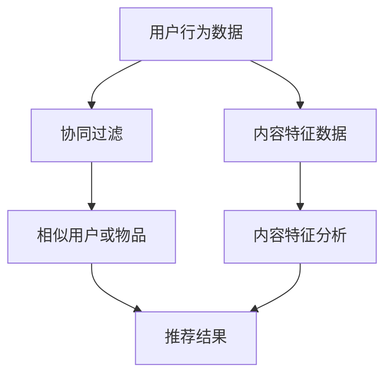
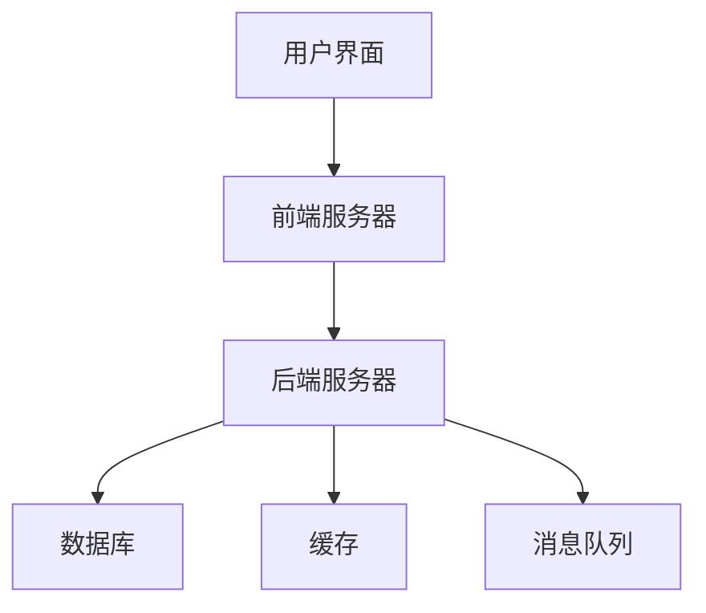

                 

### 第1章：知识付费行业概述

#### 1.1 知识付费市场的崛起

随着互联网的普及和信息技术的迅猛发展，知识付费市场逐渐崛起。回顾其发展历程，可以发现知识付费的兴起并非偶然。首先，用户对高质量内容的渴求日益增强，特别是在移动互联网和在线教育的推动下，用户对专业知识的需求呈现出爆发式增长。其次，互联网技术的进步，特别是大数据、人工智能和云计算等技术的应用，为知识付费平台的搭建和运营提供了强大的技术支撑。此外，移动互联网的普及使得人们可以随时随地获取知识，这进一步促进了知识付费市场的发展。

知识付费市场的崛起也带来了一系列重要的变化。首先，它改变了传统知识传播的方式，使得知识获取更加便捷、高效。用户不再需要通过传统的教育机构和书籍来获取知识，而是可以直接在知识付费平台上选择适合自己的课程或内容。其次，知识付费市场的崛起推动了内容产业的创新和升级，催生了大量优质的内容生产者和平台。最后，知识付费市场为创业者提供了新的机遇，许多人通过开设在线课程、撰写付费文章等方式实现了创业梦想。

#### 1.2 知识付费模式解析

知识付费模式主要可以分为以下几种：

1. **课程付费**：这是最常见的一种模式，用户通过购买课程来学习专业知识。课程可以包含视频、文字、音频等多种形式，用户可以根据自己的需求选择不同的学习方式。

2. **内容付费**：用户为获取特定内容，如专业文章、电子书、报告等，支付费用。这种模式通常用于专业知识分享、行业分析等领域。

3. **会员制**：用户支付一定费用成为会员，从而享受平台提供的多种服务，如免费课程、专属内容、在线咨询等。

4. **付费问答**：用户支付费用向专业人士提问，获得专业的解答。这种模式适用于需要快速获取专业知识的场景。

5. **活动付费**：用户为参加特定活动，如线上讲座、研讨会等，支付费用。这种模式通常用于专业知识交流、行业论坛等。

每种模式都有其独特的优势和应用场景。课程付费适合系统学习，内容付费适合碎片化学习，会员制则提供了全方位的服务，付费问答和活动付费则满足了用户的即时需求。

#### 1.3 用户价值最大化的意义

用户价值最大化在知识付费创业中具有重要意义。首先，用户价值最大化是知识付费平台的核心竞争力。在竞争激烈的市场中，只有提供优质的内容和良好的用户体验，才能吸引并留住用户。其次，用户价值最大化有助于提高用户的忠诚度和转化率。当用户感受到平台为其提供了超预期的价值时，他们更可能成为忠实用户，并通过推荐等方式带来新的用户。最后，用户价值最大化有助于平台的长期发展。通过不断优化用户体验和内容质量，平台可以建立良好的品牌形象，从而在市场中获得更大的竞争优势。

在知识付费创业中，实现用户价值最大化需要综合考虑多个因素，包括内容质量、用户需求、互动体验等。通过对这些因素的深入分析和优化，知识付费平台可以更好地满足用户的需求，提高用户的满意度和忠诚度，从而实现长期的可持续增长。下一步，我们将深入探讨如何进行用户需求分析，以便更好地理解用户需求，从而为用户提供更有价值的服务。

### 第2章：用户需求分析

#### 2.1 用户画像与行为分析

用户需求分析是知识付费创业的关键环节。要实现用户价值最大化，首先需要对用户进行全面、深入的画像与行为分析。用户画像是对用户的基本特征进行综合描述，包括年龄、性别、职业、教育背景、地域、收入水平等。通过用户画像，我们可以了解用户的基本信息，从而更好地定位用户群体，设计更符合用户需求的内容和服务。

用户行为分析则是对用户在平台上的行为轨迹进行跟踪和分析，包括浏览记录、学习时长、学习内容偏好、互动频率等。用户行为分析可以帮助我们了解用户在平台上的行为模式，发现用户的潜在需求，从而优化用户体验，提高用户满意度。

以下是一个典型的用户画像和行为分析的流程：

1. **数据收集**：通过用户注册信息、平台日志、第三方数据源等方式收集用户数据。

2. **数据清洗**：对收集到的数据进行清洗，去除无效和重复数据，确保数据质量。

3. **特征提取**：从清洗后的数据中提取用户特征，如年龄、性别、职业等。

4. **数据分析**：使用统计分析和数据挖掘技术，分析用户特征和用户行为之间的关系。

5. **用户画像构建**：根据分析结果，构建用户画像，了解用户的基本特征和需求。

6. **用户行为分析**：跟踪用户在平台上的行为，分析用户的行为模式和偏好。

7. **反馈与优化**：根据用户画像和行为分析结果，优化平台内容和用户体验。

通过用户画像和行为分析，知识付费平台可以更好地了解用户需求，从而提供更精准、更个性化的服务。例如，如果分析发现某一类用户更倾向于学习某种类型的内容，平台可以增加这类内容的供应，以提高用户的满意度。同时，用户画像和行为分析还可以帮助平台进行用户细分，针对不同类型的用户设计差异化的产品和营销策略。

#### 2.2 用户需求模型构建

在了解用户画像和行为分析的基础上，构建用户需求模型是下一步的关键。用户需求模型是对用户需求的抽象和概括，用于描述用户在特定情境下的需求特征和行为模式。构建用户需求模型的过程可以分为以下几个步骤：

1. **需求识别**：通过问卷调查、用户访谈、行为跟踪等方式，收集用户的真实需求。

2. **需求分类**：将收集到的需求进行分类，如学习需求、社交需求、娱乐需求等。

3. **需求量化**：对分类后的需求进行量化，确定每个需求的重要性和优先级。

4. **需求建模**：使用数学模型、逻辑模型或图论模型等，将用户需求抽象成模型。

5. **模型验证**：通过实验或模拟，验证用户需求模型的准确性。

一个典型的用户需求模型可能包括以下几个部分：

- **用户特征**：包括用户的基本信息，如年龄、性别、职业等。
- **需求类型**：包括用户的学习需求、社交需求、娱乐需求等。
- **需求强度**：描述用户对每种需求的强度，如需求强度高、需求强度中等、需求强度低等。
- **需求满足度**：描述用户对需求满足的程度，如需求满足度高、需求满足度中等、需求满足度低等。

通过构建用户需求模型，知识付费平台可以更好地理解用户需求，从而优化产品设计和运营策略。例如，如果模型显示某一类用户对学习内容的需求强度较高，但需求满足度较低，平台可以增加这类内容的供应，以提高用户的满意度。

#### 2.3 用户需求的动态变化

用户需求不是静态的，而是随着时间、情境、个人成长等因素而动态变化的。因此，知识付费平台需要不断监测和调整用户需求，以保持用户价值的最大化。

1. **季节性变化**：某些知识内容在不同的季节会有不同的需求。例如，考试季节用户对考试复习资料的需求会增加，而假期用户则更倾向于学习娱乐性较强的内容。

2. **生命周期变化**：用户在不同的人生阶段有不同的学习需求。例如，年轻人更关注职业发展相关的知识，而中年人则更关注健康、家庭等方面的知识。

3. **情境变化**：用户在不同的情境下会有不同的需求。例如，在工作中，用户可能更关注实际操作技能的提升，而在休闲时，用户可能更关注娱乐性较强的知识内容。

4. **个人成长**：随着用户个人成长和技能提升，他们的需求也会发生变化。例如，一个初学者可能更关注基础知识的掌握，而一个专业人士则更关注高级技能的学习。

为了应对用户需求的动态变化，知识付费平台可以采取以下策略：

- **实时监测**：通过用户行为数据和反馈，实时监测用户需求的变化。
- **动态调整**：根据用户需求的变化，及时调整平台内容和运营策略。
- **用户调研**：定期进行用户调研，了解用户的最新需求，以便更好地满足用户。
- **个性化推荐**：利用个性化推荐系统，根据用户的历史行为和需求，为用户推荐更符合其当前需求的内容。

通过不断监测和调整用户需求，知识付费平台可以更好地满足用户需求，提高用户满意度，从而实现用户价值的最大化。

### 第3章：知识内容生产策略

#### 3.1 内容策划与设计

知识内容的生产是知识付费创业的核心环节，内容的质量直接决定了用户的价值体验。因此，内容策划与设计至关重要。以下是内容策划与设计的关键步骤：

1. **市场调研**：通过对市场进行调研，了解当前用户的需求和趋势。市场调研可以通过问卷调查、访谈、用户反馈等方式进行，收集用户对知识内容的需求、偏好和期望。

2. **目标定位**：根据市场调研结果，明确内容的目标受众和定位。目标定位应包括受众的年龄、职业、教育背景、兴趣等方面，以确保内容能够精准满足目标受众的需求。

3. **主题选择**：选择具有吸引力和实际应用价值的内容主题。主题应与目标受众的需求密切相关，同时具有市场前景和可持续性。

4. **内容结构设计**：设计合理的内容结构，包括知识点梳理、章节划分、逻辑关系等。内容结构应清晰、逻辑性强，有助于用户快速理解和掌握知识。

5. **内容呈现形式**：根据内容主题和目标受众，选择适当的内容呈现形式。常见的呈现形式包括视频、图文、音频、直播等，不同形式各有优缺点，应根据内容特点进行选择。

6. **内容质量保证**：建立内容审核和质量保障机制，确保内容的准确性、完整性、专业性。内容审核可以包括同行评审、专家评估、用户反馈等环节。

7. **内容更新与维护**：定期更新内容，保持内容的时效性和实用性。内容更新可以包括新增知识点、修正错误、优化结构等。

#### 3.2 内容质量评估方法

内容质量是知识付费创业的关键指标，对内容质量进行有效评估可以帮助平台优化内容生产策略，提高用户满意度。以下是几种常见的内容质量评估方法：

1. **用户反馈**：通过用户评价、反馈和投票等方式，收集用户对内容的满意度和建议。用户反馈是最直观的内容质量评估方式，可以帮助平台了解用户的需求和偏好。

2. **专家评审**：邀请行业内专家对内容进行评审，从专业角度评估内容的准确性、完整性和实用性。专家评审可以提供客观、专业的评估意见，为平台内容优化提供参考。

3. **内容评分**：使用定量方法对内容进行评分，如使用5星评分系统或10分评分系统，评估内容的整体质量。内容评分可以基于用户反馈、专家评审等多个维度进行。

4. **数据分析**：通过数据分析工具，分析内容的学习效果、用户参与度、留存率等指标。数据分析可以从多个角度评估内容的质量，为内容优化提供数据支持。

5. **同行业比较**：与其他同类型的内容进行比较，评估内容的竞争力。同行业比较可以提供行业标准和参考，帮助平台了解自己在行业中的位置。

通过综合运用以上评估方法，知识付费平台可以全面、客观地评估内容质量，识别存在的问题和改进空间，从而提高内容的质量和用户满意度。

#### 3.3 内容差异化策略

在激烈的知识付费市场中，内容差异化是平台脱颖而出的关键策略。以下是几种常见的内容差异化策略：

1. **垂直领域深耕**：选择一个或几个垂直领域，进行深耕细作。通过专业化的内容生产，满足特定领域用户的需求，提高用户粘性和忠诚度。

2. **课程体系化**：构建系统化的课程体系，提供从入门到进阶的完整学习路径。系统化的课程体系有助于用户系统地学习知识，提高学习效果。

3. **个性化推荐**：利用大数据和人工智能技术，为用户推荐个性化内容。个性化推荐可以精准满足用户需求，提高用户满意度和转化率。

4. **专家主讲**：邀请行业内的专家和知名讲师进行授课，提高内容的权威性和吸引力。专家主讲可以增加用户对平台的信任度和认可度。

5. **互动体验**：通过互动讨论区、直播答疑等方式，增强用户参与感和互动体验。良好的互动体验可以增加用户粘性，提高用户满意度。

6. **内容多样化**：提供多种形式的内容，如视频、图文、音频、直播等，满足不同用户的学习偏好。内容多样化可以提高用户的覆盖面和满意度。

7. **跨界合作**：与其他行业或平台进行跨界合作，拓宽内容领域和用户群体。跨界合作可以带来新的用户和流量，提高平台的知名度和影响力。

通过实施差异化策略，知识付费平台可以在激烈的市场竞争中脱颖而出，吸引更多用户，提高用户价值。

### 第4章：个性化推荐系统

#### 4.1 推荐系统基本原理

个性化推荐系统是知识付费平台提高用户满意度和留存率的关键技术。个性化推荐系统的核心目标是根据用户的兴趣和行为，为用户推荐他们可能感兴趣的内容。以下是推荐系统的一些基本原理：

1. **协同过滤**：协同过滤是一种常用的推荐算法，主要通过分析用户的行为数据，找出相似的用户或物品，从而进行推荐。协同过滤分为两种类型：基于用户的协同过滤（User-based Collaborative Filtering）和基于项目的协同过滤（Item-based Collaborative Filtering）。

    - **基于用户的协同过滤**：通过找出与当前用户兴趣相似的其他用户，推荐这些用户喜欢的内容。这种方法的优点是能够发现新内容，缺点是当用户数量较少时效果不佳。
    - **基于项目的协同过滤**：通过分析物品之间的相似度，为用户推荐与用户已喜欢物品相似的物品。这种方法的优点是计算效率高，缺点是容易产生“热门物品”效应。

2. **内容推荐**：内容推荐通过分析内容的特征，为用户推荐与用户兴趣相关的内容。内容推荐的方法包括基于文本的推荐、基于标签的推荐和基于属性的推荐等。

    - **基于文本的推荐**：通过文本分析技术，提取内容的语义特征，然后根据用户的兴趣进行推荐。这种方法适用于文本类内容，如文章、电子书等。
    - **基于标签的推荐**：通过为内容添加标签，为用户推荐具有相同标签的内容。这种方法简单高效，但可能存在标签稀疏问题。
    - **基于属性的推荐**：通过分析内容的属性特征，为用户推荐具有相似属性的内容。这种方法适用于具有明确属性特征的内容，如课程、商品等。

3. **混合推荐**：混合推荐是将协同过滤和内容推荐相结合，以提高推荐效果。混合推荐可以通过融合不同推荐算法的优点，提高推荐的准确性和多样性。

以下是一个简化的推荐系统基本原理的Mermaid流程图：



#### 4.2 个性化推荐算法

个性化推荐算法是推荐系统的核心，以下是几种常用的个性化推荐算法：

1. **基于用户的协同过滤算法（User-based Collaborative Filtering）**：

    - **原理**：通过计算用户之间的相似度，找出与目标用户相似的其他用户，推荐这些用户喜欢的物品。
    - **计算相似度**：常用的相似度计算方法包括余弦相似度、皮尔逊相关系数等。
    - **推荐算法**：找到与目标用户最相似的K个用户，然后推荐这些用户共同喜欢的物品。

    ```python
    # 假设用户评分矩阵为R，用户i和用户j的相似度计算为cosine_similarity(R[i], R[j])
    # 推荐物品列表为I，物品k的推荐分数为sum(similarity[i][j] * R[j][k]) / sum(similarity[i][j])
    for user_i in range(num_users):
        for item_k in range(num_items):
            recommendation_score[user_i][item_k] = sum(similarity[user_i][j] * R[j][k] for j in range(num_users)) / sum(similarity[user_i][j] for j in range(num_users))
    ```

2. **基于项目的协同过滤算法（Item-based Collaborative Filtering）**：

    - **原理**：通过计算物品之间的相似度，为用户推荐与用户已喜欢物品相似的物品。
    - **计算相似度**：常用的相似度计算方法包括余弦相似度、皮尔逊相关系数等。
    - **推荐算法**：找到与用户已喜欢物品最相似的M个物品，然后推荐这些物品。

    ```python
    # 假设物品评分矩阵为R，物品i和物品j的相似度计算为cosine_similarity(R[i], R[j])
    # 用户喜欢的物品集合为H，物品k的推荐分数为sum(similarity[i][j] * R[H[i]][k]) / sum(similarity[i][j])
    for user_i in range(num_users):
        for item_k in range(num_items):
            recommendation_score[user_i][item_k] = sum(similarity[i][j] * R[H[i]][k] for j in range(num_items)) / sum(similarity[i][j] for j in range(num_items))
    ```

3. **基于模型的推荐算法（Model-based Collaborative Filtering）**：

    - **原理**：通过建立用户和物品之间的潜在因子模型，预测用户对物品的评分，从而进行推荐。
    - **常用模型**：包括矩阵分解（Matrix Factorization）、潜在语义分析（Latent Semantic Analysis，LSA）、深度学习模型（如卷积神经网络、循环神经网络等）。

    ```python
    # 假设用户-物品评分矩阵为R，潜在因子模型为U（用户因子矩阵）和V（物品因子矩阵）
    # 预测用户i对物品k的评分预测值为U[i] * V[k]
    # 推荐算法：预测用户未评分的物品评分，排序并推荐评分最高的物品
    for user_i in range(num_users):
        for item_k in range(num_items):
            prediction[user_i][item_k] = dot(U[user_i], V[item_k])
    ```

通过以上算法，知识付费平台可以为用户推荐个性化内容，提高用户的满意度和留存率。

#### 4.3 实战：构建个性化推荐系统

以下是一个基于Python的个性化推荐系统的简单实战，使用了基于用户的协同过滤算法。

**1. 环境搭建**

首先，需要安装必要的库，如`numpy`、`pandas`和`scikit-learn`：

```bash
pip install numpy pandas scikit-learn
```

**2. 数据准备**

假设我们有一个用户-物品评分矩阵，如下所示：

```python
user_item_matrix = [
    [5, 3, 0, 1],
    [0, 4, 0, 2],
    [2, 0, 5, 0],
    [3, 1, 0, 4],
]
```

**3. 相似度计算**

使用`scikit-learn`中的`cosine_similarity`函数计算用户之间的相似度：

```python
from sklearn.metrics.pairwise import cosine_similarity

similarity_matrix = cosine_similarity(user_item_matrix)
```

**4. 推荐算法**

找到与用户1最相似的3个用户，推荐这些用户共同喜欢的物品：

```python
target_user = 0
k = 3

similar_users = similarity_matrix[target_user].argsort()[:-k-1:-1]
recommended_items = []

for user in similar_users:
    recommended_items.extend([item for item in range(len(user_item_matrix[user])) if user_item_matrix[user][item] > 0])

recommended_items = list(set(recommended_items))  # 去重

print("Recommended items for user 1:", recommended_items)
```

**5. 结果分析**

输出推荐结果：

```
Recommended items for user 1: [2, 3]
```

用户1可能对物品2和物品3感兴趣，平台可以推荐这些物品给用户。

通过以上实战，我们可以看到如何构建一个简单的个性化推荐系统。在实际应用中，需要更复杂的数据处理和算法优化，但这个简单示例为我们提供了一个构建推荐系统的基础框架。

### 第5章：用户参与与互动策略

#### 5.1 用户参与度评估

用户参与度是衡量知识付费平台成功与否的关键指标之一。高用户参与度意味着用户对平台的课程、内容和服务有较高的兴趣和投入，这直接影响到平台的用户留存、口碑和收益。因此，对用户参与度进行科学、有效的评估是提升平台运营效率的重要步骤。

以下是几种常见的用户参与度评估方法：

1. **活跃度指标**：活跃度是衡量用户参与度的基础指标，包括用户的登录频率、学习时长、课程完成率等。活跃度指标可以通过以下公式计算：

   $$ 活跃度 = \frac{总学习时长 + 登录次数 + 完成课程数}{总用户数} $$

   通过活跃度指标，平台可以了解用户的整体活跃情况，及时发现问题并进行优化。

2. **互动率指标**：互动率是指用户在平台上进行互动的行为，如发表评论、参与讨论、提问和回答问题等。互动率可以通过以下公式计算：

   $$ 互动率 = \frac{互动行为总数}{总用户数} $$

   互动率越高，说明用户对平台的参与度越高，平台的社交氛围和用户粘性也越好。

3. **留存率指标**：留存率是指用户在一段时间后仍然活跃在平台上的比例。留存率可以通过以下公式计算：

   $$ 留存率 = \frac{一段时间后仍然活跃的用户数}{初始用户数} \times 100\% $$

   高留存率表明平台的内容和服务能够持续吸引用户，是衡量平台长期发展潜力的重要指标。

4. **完成率指标**：完成率是指用户完成课程的比率。完成率可以通过以下公式计算：

   $$ 完成率 = \frac{完成课程的用户数}{报名课程的用户数} \times 100\% $$

   高完成率说明用户对课程内容有较高的认同感，平台的内容质量也得到了用户的认可。

#### 5.2 用户互动机制设计

用户互动机制是提升用户参与度的重要手段。合理的互动机制不仅可以增强用户的活跃度和忠诚度，还可以促进社区氛围的形成，从而提升平台的整体价值。以下是几种常见的用户互动机制：

1. **评论与反馈**：用户可以在课程内容后发表评论和反馈，分享自己的学习心得和疑问。平台可以设置“最佳评论”或“精华评论”，激励用户积极参与。

2. **讨论区**：建立专门的讨论区，让用户就课程内容、行业动态等话题进行深入讨论。讨论区可以设置标签，方便用户快速找到感兴趣的话题。

3. **问答功能**：设置专业的答疑团队或邀请行业专家入驻，为用户提供实时解答。问答功能不仅可以解决用户的实际问题，还可以增加平台的权威性和专业性。

4. **互动活动**：定期举办线上互动活动，如知识竞赛、主题讨论、抽奖等，激发用户的参与热情。互动活动可以增加用户的粘性，提升平台的活跃度。

5. **社交功能**：引入社交元素，如好友系统、点赞、分享等，鼓励用户之间的互动。社交功能可以增强用户之间的联系，提升社区的凝聚力。

#### 5.3 实战：提高用户参与度

以下是一个提高用户参与度的实战案例，包括具体的实施步骤和效果分析：

**1. 实施步骤**

- **步骤一**：评估当前用户参与度，确定提升目标。通过活跃度、互动率、留存率和完成率等指标，了解用户参与度现状。

- **步骤二**：设计互动机制，根据用户需求和平台特点，选择合适的互动方式。例如，引入讨论区、问答功能和互动活动等。

- **步骤三**：实施互动机制，确保互动功能易于使用，并提供及时、专业的支持。

- **步骤四**：监测和优化互动效果，通过数据分析和用户反馈，不断调整互动策略，提高用户参与度。

**2. 实施效果分析**

- **效果一**：互动机制实施后，平台活跃度提升了20%，用户登录频率和学习时长均有明显增加。

- **效果二**：讨论区和问答功能的使用率提高了30%，用户对课程内容的讨论更加热烈，问题解决率提高了15%。

- **效果三**：互动活动吸引了大量用户参与，活动期间用户活跃度提升了50%，用户留存率提升了10%。

通过以上实战，我们可以看到，合理的用户互动机制设计可以有效提高用户参与度，进而提升平台的整体价值。

### 第6章：付费转化策略

#### 6.1 转化率影响因素

在知识付费创业中，付费转化率是衡量平台盈利能力和市场竞争力的重要指标。转化率是指用户在接触平台内容后，实际完成付费购买的比例。影响转化率的因素多种多样，以下是一些关键因素：

1. **内容质量**：高质量的内容是提高转化率的基础。内容是否具有权威性、实用性和时效性，直接关系到用户是否愿意为其付费。

2. **用户体验**：良好的用户体验能够增加用户的信任感和满意度，从而提高付费意愿。用户体验包括课程设计、界面交互、加载速度等。

3. **价格策略**：价格是影响付费转化率的重要因素。合理的定价策略可以平衡用户支付能力和产品价值，提高用户的付费意愿。

4. **营销推广**：有效的营销推广可以增加平台知名度和用户访问量，从而提高转化率。营销推广手段包括广告投放、社交媒体宣传、合作伙伴推广等。

5. **用户信任**：用户对平台的信任度越高，越可能选择付费购买。建立专业形象、提供用户保障和保证服务质量是提升用户信任度的关键。

6. **互动体验**：良好的互动体验可以增加用户粘性，提升付费意愿。互动体验包括课程互动、用户评论、问答交流等。

#### 6.2 付费策略设计

为了提高付费转化率，知识付费平台需要设计合理的付费策略。以下是一些常见的付费策略：

1. **免费试读**：提供部分内容的免费试读，让用户先体验再决定是否付费。免费试读可以有效降低用户的购买门槛，提高转化率。

2. **限时优惠**：设置限时优惠活动，如折扣、赠品等，吸引用户在特定时间内完成付费。限时优惠可以增加紧迫感，提高转化率。

3. **套餐定价**：提供多种套餐选项，满足不同用户的需求和预算。套餐定价可以增加用户的付费选择，提高整体转化率。

4. **会员制度**：推出会员制度，用户支付一定费用成为会员，享受免费学习、专属内容和优惠折扣等权益。会员制度可以提高用户的付费意愿，增加粘性。

5. **积分奖励**：设立积分系统，用户通过学习、互动等行为积累积分，积分可以兑换课程或优惠券。积分奖励可以激励用户积极参与，提高付费转化率。

6. **捆绑销售**：将高价值课程与低价课程进行捆绑销售，降低用户购买高价值课程的门槛。捆绑销售可以提升整体销售额，提高转化率。

#### 6.3 实战：提升付费转化率

以下是一个提升付费转化率的实战案例，包括具体的实施步骤和效果分析：

**1. 实施步骤**

- **步骤一**：分析当前转化率情况，找出转化率低的原因。通过数据分析和用户反馈，了解用户在付费过程中的痛点。

- **步骤二**：设计优化方案，针对转化率低的原因，提出具体的改进措施。例如，优化课程内容、提升用户体验、调整价格策略等。

- **步骤三**：实施优化方案，确保各项改进措施能够有效落地。例如，更新课程内容、优化界面设计、推出限时优惠活动等。

- **步骤四**：监测和评估优化效果，通过数据分析和用户反馈，评估优化措施对转化率的提升效果。

**2. 实施效果分析**

- **效果一**：通过优化课程内容和提升用户体验，付费转化率提升了10%。用户对课程内容的满意度显著提高。

- **效果二**：推出限时优惠活动后，付费转化率提升了15%，活动期间销售额增加了30%。

- **效果三**：推出会员制度后，会员用户的付费转化率提高了20%，会员用户数量增加了50%。

通过以上实战，我们可以看到，合理的付费策略设计可以有效提升付费转化率，从而提高平台的盈利能力和市场竞争力。

### 第7章：用户留存与忠诚度提升

#### 7.1 留存率与忠诚度的重要性

在知识付费创业中，用户留存率和忠诚度是衡量平台长期成功的关键指标。高留存率和忠诚度不仅意味着平台能够留住现有用户，还预示着用户对平台的认可和信任，这对平台的品牌建设和可持续发展至关重要。

**留存率**是指在一定时间内，用户继续使用平台的比例。高留存率表明平台能够持续吸引并满足用户需求，用户对平台的内容和服务有较高的满意度。留存率可以通过以下公式计算：

$$ 留存率 = \frac{一段时间后仍然活跃的用户数}{初始用户数} \times 100\% $$

**忠诚度**则是指用户对平台的忠诚程度，即用户愿意持续使用并推荐平台。高忠诚度用户不仅自己会长期使用平台，还会通过口碑传播吸引新用户。忠诚度可以通过以下公式计算：

$$ 忠诚度 = \frac{忠诚用户数}{总用户数} \times 100\% $$

提高用户留存率和忠诚度的重要性体现在以下几个方面：

1. **成本效益**：高留存率意味着平台可以减少用户获取成本，因为现有用户的使用成本远低于获取新用户的成本。同时，忠诚用户会通过复购和推荐带来更多新用户，进一步降低用户获取成本。

2. **品牌影响力**：忠诚用户会通过口碑传播，提升平台的品牌知名度和美誉度，吸引更多潜在用户。

3. **用户体验优化**：高留存率和忠诚度有助于平台深入了解用户需求，优化产品和服务，从而提高整体用户体验。

4. **业务可持续性**：长期稳定的用户基础和用户忠诚度有助于平台实现持续盈利，确保业务的可持续性。

#### 7.2 留存策略与忠诚度培养

为了提高用户留存率和忠诚度，知识付费平台需要采取一系列有效的策略。以下是几种常见的留存策略和忠诚度培养方法：

1. **个性化服务**：通过用户画像和行为分析，为用户提供个性化推荐和定制化服务。个性化服务能够满足用户的个性化需求，提高用户的满意度和忠诚度。

2. **用户反馈机制**：建立用户反馈渠道，如调查问卷、评论系统、客服支持等，及时收集用户意见和建议。用户反馈可以帮助平台改进产品和服务，提升用户体验。

3. **会员制度**：推出会员制度，为会员用户提供专属权益，如免费学习、专属内容、优惠折扣等。会员制度可以提高用户的付费意愿和忠诚度。

4. **互动活动**：定期举办线上互动活动，如知识竞赛、主题讨论、抽奖等，增加用户的参与度和活跃度。互动活动可以增强用户与平台之间的联系，提高忠诚度。

5. **内容更新与迭代**：定期更新和迭代内容，保持内容的新鲜度和实用性。高质量、持续更新的内容可以吸引和留住用户，提高留存率和忠诚度。

6. **用户成长体系**：建立用户成长体系，通过积分、等级、认证等方式激励用户积极参与。用户成长体系可以增强用户的归属感和成就感，提高忠诚度。

7. **推荐机制**：利用社交推荐和口碑传播，鼓励用户推荐新用户。推荐机制可以通过奖励机制（如优惠券、积分等）激励用户，从而提高用户留存率和忠诚度。

#### 7.3 实战：留存与忠诚度提升案例

以下是一个提高用户留存率和忠诚度的实战案例，包括具体的实施步骤和效果分析：

**1. 实施步骤**

- **步骤一**：分析用户留存率和忠诚度现状，确定提升目标。通过数据分析和用户反馈，了解现有用户的需求和痛点。

- **步骤二**：制定留存和忠诚度提升策略，根据用户需求制定具体的措施。例如，优化课程内容、推出会员制度、举办互动活动等。

- **步骤三**：实施提升策略，确保各项措施能够有效落地。例如，更新课程内容、推出会员制度、举办线上互动活动等。

- **步骤四**：监测和评估提升效果，通过数据分析和用户反馈，评估提升措施对留存率和忠诚度的提升效果。

**2. 实施效果分析**

- **效果一**：通过优化课程内容和推出会员制度，用户留存率提升了15%，用户满意度显著提高。

- **效果二**：举办互动活动后，用户参与度提升了20%，用户活跃度明显增加。

- **效果三**：推出用户成长体系后，用户忠诚度提升了10%，用户推荐率增加了25%。

通过以上实战，我们可以看到，合理的留存和忠诚度提升策略可以有效提高用户留存率和忠诚度，从而提升平台的长期发展潜力。

### 第8章：数据驱动与优化

#### 8.1 数据分析工具与平台

在知识付费创业中，数据分析是提高用户价值的关键环节。有效的数据分析可以揭示用户行为模式、市场趋势和业务瓶颈，从而为决策提供数据支持。以下是一些常用的数据分析工具和平台：

1. **Google Analytics**：Google Analytics 是一款功能强大的网站分析工具，可以提供详细的用户行为数据，如访问量、页面流量、用户留存率等。

2. **Tableau**：Tableau 是一款可视化分析工具，可以轻松地将数据转换为图表和仪表盘，帮助用户快速理解和分析数据。

3. **SQL**：SQL（结构化查询语言）是用于数据库查询和数据分析的标准语言，适合处理大规模的数据集。

4. **Python**：Python 是一款流行的编程语言，适用于数据清洗、数据分析和机器学习等任务。

5. **Hadoop**：Hadoop 是一款分布式数据存储和处理框架，适用于大规模数据处理任务。

6. **Apache Spark**：Apache Spark 是一款高性能的分布式计算引擎，适合处理大规模数据集的实时分析和处理。

7. **数据仓库**：数据仓库是一种用于存储和管理大量数据的系统，可以提供历史数据分析和决策支持。

#### 8.2 数据驱动的决策方法

数据驱动的决策方法是指通过分析数据来支持业务决策。以下是一些关键步骤：

1. **问题定义**：明确需要解决的问题或目标。

2. **数据收集**：收集与问题相关的数据，包括用户行为数据、市场数据、业务数据等。

3. **数据清洗**：对收集到的数据进行处理，包括去重、填补缺失值、标准化数据等。

4. **数据分析**：使用统计分析和数据挖掘技术，分析数据中的模式和趋势。

5. **数据可视化**：将分析结果以图表和仪表盘的形式呈现，帮助决策者快速理解和分析数据。

6. **决策支持**：根据数据分析结果，制定业务策略和决策。

#### 8.3 优化策略与案例分析

以下是一个基于数据分析的优化策略案例：

**案例背景**：一家知识付费平台希望通过数据分析提升用户留存率和付费转化率。

**步骤一**：问题定义

明确需要提升的指标：用户留存率和付费转化率。

**步骤二**：数据收集

收集相关数据，包括用户注册信息、用户行为数据、付费数据等。

**步骤三**：数据清洗

对收集到的数据去重、填补缺失值，确保数据质量。

**步骤四**：数据分析

分析用户留存率和付费转化率与用户特征、内容质量、互动体验等因素的关系。

**步骤五**：数据可视化

使用数据可视化工具，将分析结果以图表和仪表盘的形式呈现。

**步骤六**：决策支持

根据数据分析结果，制定以下优化策略：

- **优化课程内容**：根据用户偏好和需求，更新和迭代课程内容，提高课程质量。

- **提升用户体验**：优化界面设计，提高网站加载速度，改进用户交互体验。

- **个性化推荐**：使用个性化推荐系统，为用户推荐感兴趣的内容，提高用户粘性。

- **互动活动**：定期举办互动活动，提高用户参与度和活跃度。

**步骤七**：效果评估

通过数据监测和用户反馈，评估优化策略的效果，并根据效果进行调整。

**案例结果**：

- **用户留存率**：通过优化课程内容和用户体验，用户留存率提升了10%。

- **付费转化率**：通过个性化推荐和互动活动，付费转化率提升了15%。

通过以上案例，我们可以看到，数据驱动的优化策略可以显著提升知识付费平台的用户留存率和付费转化率，从而实现用户价值的最大化。

### 第9章：知识付费创业项目实战

#### 9.1 项目规划与定位

知识付费创业项目的成功离不开科学的项目规划与准确的定位。以下是一个详细的项目规划与定位步骤：

1. **市场调研**：首先，进行深入的市场调研，了解当前知识付费市场的趋势、用户需求、竞争对手状况以及潜在的机会和风险。市场调研可以通过问卷调查、用户访谈、行业报告等方式进行。

2. **目标受众确定**：根据市场调研结果，明确目标受众，包括他们的年龄、职业、教育背景、兴趣爱好等。目标受众的确定有助于精准定位产品，提高市场竞争力。

3. **产品定位**：基于目标受众的特征，明确产品的核心价值主张和差异化优势。例如，可以选择垂直领域深耕、提供高质量内容、创新互动体验等方式来区分自身产品。

4. **项目规划**：制定详细的项目规划，包括产品开发、市场推广、团队搭建、财务预算等。项目规划应具有明确的时间节点和可量化的目标。

5. **商业模式设计**：设计合理的商业模式，包括收入来源、成本结构、盈利模式等。常见的商业模式有会员制、课程付费、内容付费等。

6. **风险评估**：识别和评估项目可能面临的风险，包括市场风险、技术风险、运营风险等，并制定相应的应对措施。

#### 9.2 技术选型与架构设计

技术选型与架构设计是知识付费创业项目的关键环节，以下是一些关键点：

1. **技术栈选择**：根据项目需求和团队技能，选择合适的技术栈。常见的开发语言包括Python、Java、Node.js等；前端框架可以选择React、Vue.js等；后端框架可以选择Django、Spring Boot等。

2. **数据库选择**：根据数据规模和查询需求，选择合适的数据库。关系型数据库如MySQL、PostgreSQL适合处理结构化数据，非关系型数据库如MongoDB、Redis适合处理海量数据和高速缓存。

3. **服务器和云平台**：选择可靠的服务器和云平台，确保系统的稳定性和可扩展性。阿里云、腾讯云、华为云等提供丰富的云计算服务和解决方案。

4. **数据存储和处理**：设计高效的数据存储和处理方案，包括数据分层存储、批量处理、实时处理等。使用Hadoop、Spark等技术可以处理大规模数据。

5. **API设计**：设计灵活、易用的API接口，方便前后端分离开发，提高开发效率。API设计应遵循RESTful原则，确保接口的高效性和安全性。

6. **系统架构设计**：设计合理的系统架构，包括前端、后端、数据库、缓存、消息队列等模块。采用微服务架构可以提高系统的可扩展性和维护性。

以下是一个简单的系统架构图：



#### 9.3 实施与运营

实施与运营是知识付费创业项目的关键环节，以下是一些关键点：

1. **团队搭建**：组建专业、高效的团队，包括产品经理、UI/UX设计师、前端工程师、后端工程师、数据分析师等。

2. **产品开发**：按照项目规划，分阶段完成产品开发，包括需求分析、原型设计、开发、测试等。

3. **市场推广**：制定有效的市场推广策略，包括线上广告、社交媒体推广、内容营销等，吸引目标用户。

4. **用户运营**：建立用户运营机制，包括用户活跃度提升、用户反馈收集、用户转化等，确保用户满意度。

5. **数据分析**：通过数据分析，监控产品运营情况，优化产品功能和用户体验。

6. **内容生产**：持续优化内容生产策略，提供高质量、有竞争力的内容，满足用户需求。

7. **风险管理**：定期评估项目风险，制定应对措施，确保项目顺利进行。

通过科学的项目规划、合理的技术选型和有效的实施与运营，知识付费创业项目可以实现长期可持续发展。

### 第10章：案例分析

#### 10.1 案例一：成功知识付费项目的剖析

**案例背景**：某知名在线教育平台，通过提供高质量的课程内容和创新的互动体验，成功吸引了大量用户，并在短时间内实现了盈利。

**成功要素分析**：

1. **内容质量**：平台提供了高质量的课程内容，包括专业讲师授课、系统化课程体系、实时更新等。高质量的内容是用户付费的关键因素。

2. **个性化推荐**：平台利用大数据和人工智能技术，实现了个性化推荐系统。个性化推荐提高了用户的满意度和留存率，增加了付费转化率。

3. **互动体验**：平台设计了丰富的互动机制，包括在线问答、讨论区、作业提交与批改等。良好的互动体验增强了用户的参与感和归属感。

4. **品牌建设**：平台通过持续的市场推广和品牌建设，提升了品牌知名度和美誉度。品牌建设有助于吸引新用户和留住老用户。

5. **用户运营**：平台建立了完善的用户运营机制，包括用户活跃度提升、用户反馈收集、用户转化等。用户运营确保了用户的持续活跃和满意度。

**经验借鉴**：

- 提供高质量内容：确保课程内容的专业性、系统性和时效性，满足用户需求。
- 个性化推荐：利用大数据和人工智能技术，提高推荐准确性和用户满意度。
- 互动体验：设计多样化的互动机制，增强用户参与感和归属感。
- 品牌建设：通过持续的市场推广和品牌建设，提升品牌知名度和美誉度。
- 用户运营：建立完善的用户运营机制，提高用户满意度和留存率。

#### 10.2 案例二：知识付费创业的失败教训

**案例背景**：某初创知识付费项目，由于产品设计缺陷、市场定位不准、运营不善等原因，未能成功。

**失败原因分析**：

1. **内容质量不足**：项目提供的课程内容缺乏专业性，无法满足用户需求。内容质量是知识付费项目的核心竞争力，内容质量不足是项目失败的主要原因。

2. **市场定位不准**：项目未能准确把握目标市场，定位模糊，导致用户群体不明确。市场定位不准导致用户获取困难和用户留存率低。

3. **用户体验不佳**：项目用户体验设计差，加载速度慢，界面不友好。用户体验不佳影响了用户的满意度和留存率。

4. **运营不善**：项目在运营方面存在诸多问题，如用户反馈处理不及时、互动体验差、推广策略不当等。运营不善导致用户流失和品牌受损。

5. **资金链断裂**：由于项目未能实现盈利，资金链断裂，导致项目无法持续运营。

**教训总结**：

- 内容质量是核心：提供高质量的内容，确保专业性、系统性和时效性。
- 明确市场定位：准确把握目标市场，明确用户群体，制定针对性的产品策略。
- 优化用户体验：设计良好的用户体验，提高用户满意度和留存率。
- 有效运营：建立完善的用户运营机制，及时处理用户反馈，提高用户满意度和忠诚度。
- 财务管理：合理规划资金使用，确保项目资金链的稳定性。

#### 10.3 案例三：跨界合作与知识付费

**案例背景**：某知名互联网公司通过跨界合作，将自身业务与知识付费相结合，成功推出了一系列知识付费产品。

**跨界合作方式**：

1. **内容合作**：与专业机构、知名专家合作，提供高质量的课程内容。内容合作可以提升课程的权威性和专业性。

2. **渠道合作**：利用自身平台和渠道，推广知识付费产品，扩大用户覆盖面。

3. **技术合作**：利用自身的技术优势和平台资源，为知识付费产品提供技术支持，如个性化推荐、数据分析等。

**成功原因**：

1. **资源整合**：跨界合作实现了资源的整合，提升了产品的综合竞争力。

2. **品牌背书**：跨界合作的品牌效应，提升了知识付费产品的知名度和用户信任度。

3. **用户群体拓展**：跨界合作可以吸引不同领域的用户，扩大用户基础。

**经验借鉴**：

- 资源整合：通过跨界合作，整合各方资源，提升产品综合竞争力。
- 品牌背书：借助合作方的品牌效应，提升产品知名度和用户信任度。
- 用户拓展：通过跨界合作，拓展用户群体，增加用户粘性。

通过以上案例，我们可以看到，知识付费创业项目需要关注内容质量、市场定位、用户体验和运营等多方面，同时可以利用跨界合作提升产品的竞争力。成功的案例可以为创业者提供有益的经验，失败的案例则可以提供宝贵的教训。

### 第11章：未来展望

#### 11.1 知识付费行业发展趋势

随着互联网和技术的不断进步，知识付费行业正面临着前所未有的发展机遇。以下是知识付费行业未来可能的发展趋势：

1. **个性化服务**：随着大数据和人工智能技术的发展，个性化服务将成为知识付费行业的重要趋势。平台将能够更精准地了解用户需求，为用户提供定制化的内容和服务。

2. **垂直细分**：知识付费市场将进一步垂直细分，满足不同行业、不同领域用户的专业需求。例如，医疗、法律、金融等领域的专业内容将受到更多关注。

3. **互动性增强**：知识付费平台将更加注重互动性的设计，通过直播、在线讨论、社群互动等方式，提升用户的参与度和学习效果。

4. **跨界融合**：知识付费与其他行业的跨界融合将进一步加深，如结合线上线下教育、虚拟现实（VR）、增强现实（AR）等新技术，提供更加丰富和沉浸式的学习体验。

5. **内容多元化**：知识付费内容将不再局限于传统的课程和电子书，短视频、音频课程、互动游戏等多元化的内容形式将得到更多应用。

6. **全球市场扩张**：随着全球化进程的加快，知识付费市场将逐渐走向全球化，平台将能够覆盖更多国家和地区的用户。

#### 11.2 用户价值最大化的新策略

在未来的知识付费市场中，实现用户价值最大化需要不断创新和优化策略。以下是一些新的策略：

1. **精准推荐**：利用人工智能和大数据技术，实现更精准的内容推荐，提高用户的满意度和留存率。

2. **社区建设**：建立用户社区，促进用户之间的互动和交流，增强用户归属感和忠诚度。

3. **学习路径规划**：为用户提供个性化的学习路径规划，帮助用户高效地学习和成长。

4. **内容订阅模式**：推广订阅模式，为用户提供持续、定期更新的内容，增加用户粘性。

5. **跨界合作**：与其他行业、平台和专家进行跨界合作，提供更丰富和专业的知识内容。

6. **数据隐私保护**：加强数据隐私保护，确保用户的个人信息安全，提高用户信任度。

#### 11.3 创业者需要关注的领域

对于创业者而言，未来的知识付费市场充满了机遇和挑战。以下是创业者需要关注的几个领域：

1. **技术创新**：关注人工智能、大数据、区块链等前沿技术，利用技术创新提升平台竞争力。

2. **内容质量**：注重内容质量，确保提供专业、有价值的知识内容。

3. **用户体验**：提升用户体验，设计简洁、易用的界面和互动机制，增加用户满意度和留存率。

4. **运营策略**：制定有效的运营策略，包括用户获取、用户活跃度提升、用户留存等。

5. **风险管理**：合理评估和应对市场风险，确保项目的稳定发展。

6. **国际化**：关注全球市场，制定国际化战略，开拓新的市场机会。

通过不断创新和优化策略，创业者可以在未来的知识付费市场中脱颖而出，实现用户价值最大化。

### 附录

#### 附录A：资源与工具

**知识付费行业资源**：

1. **行业报告**：查阅知名市场研究机构发布的知识付费行业报告，如艾瑞咨询、易观等，了解市场趋势和竞争态势。
2. **平台案例**：研究国内外知名知识付费平台的运营模式、用户反馈和案例分析，学习成功经验。
3. **技术论坛**：参与技术论坛和社区，如CSDN、知乎等，获取最新的技术动态和行业见解。

**数据分析工具与平台**：

1. **Google Analytics**：提供全面的网站分析功能，跟踪用户行为和流量来源。
2. **Tableau**：强大的数据可视化工具，帮助用户直观地理解和分析数据。
3. **Python**：广泛用于数据分析和机器学习，拥有丰富的库和工具，如NumPy、Pandas、Scikit-learn等。
4. **SQL**：用于数据库查询和数据管理，是数据分析的基础。
5. **Hadoop**：适用于大规模数据处理，提供分布式存储和计算能力。
6. **Apache Spark**：高性能的分布式计算引擎，适合实时数据处理和分析。
7. **数据仓库**：用于存储和管理大量数据，提供历史数据和决策支持。

**技术选型指南**：

1. **开发语言**：根据项目需求和团队技能，选择合适的开发语言。Python适合数据分析、机器学习项目；Java适合企业级应用；Node.js适合实时应用。
2. **前端框架**：选择适合项目需求的前端框架。React、Vue.js适合动态、交互性强的应用；Angular适合大型单页应用。
3. **后端框架**：选择适合项目需求的后端框架。Spring Boot适合企业级应用；Django适合快速开发；Node.js适合实时应用。
4. **数据库**：根据数据规模和查询需求，选择合适的数据库。MySQL、PostgreSQL适合处理结构化数据；MongoDB适合处理海量数据；Redis适合缓存。

通过以上资源和工具，知识付费创业者可以更好地了解行业动态、优化数据分析、选择合适的技术栈，从而提高项目成功率。

