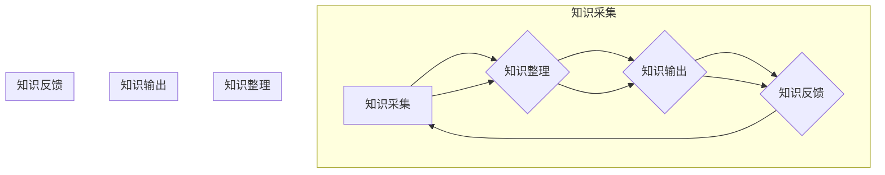

                 

### 文章标题：知识输出促进管理经验传承

在当今快速发展的信息技术时代，知识管理已经成为企业持续创新和发展的关键因素。管理经验作为企业知识体系中的重要组成部分，其传承和共享显得尤为重要。本文旨在探讨如何通过知识输出促进管理经验的传承，以提高企业的整体竞争力和可持续发展能力。

**关键词：知识管理、管理经验、知识输出、传承、企业竞争力**

**摘要：**
本文首先分析了管理经验传承的重要性，接着介绍了知识输出的基本概念和意义，随后探讨了管理知识输出的策略与规划，以及个人实践和团队协作的具体方法。文章还通过实践案例展示了知识输出在企业中的应用，并提出了管理知识输出技巧的提升方法。最后，本文对管理知识输出的挑战与展望进行了深入探讨，为企业的知识管理实践提供了有益的参考。

# 目录大纲

## 第一部分：管理经验传承概述

### 第1章：管理经验传承的重要性

#### 1.1 管理经验的内涵与价值

#### 1.2 知识输出的意义

#### 1.3 管理经验传承的现状与挑战

#### 1.4 本书的主要内容和结构

### 第2章：管理知识输出的方法与工具

#### 2.1 知识输出的基本概念

#### 2.2 知识输出的主要形式

#### 2.3 知识输出的工具与应用

#### 2.4 知识输出流程与技巧

### 第3章：管理知识输出的策略与规划

#### 3.1 管理知识输出的目标设定

#### 3.2 管理知识输出的内容选择

#### 3.3 管理知识输出的渠道选择

#### 3.4 管理知识输出的绩效评估

### 第4章：管理知识输出的个人实践

#### 4.1 管理知识输出的个人定位

#### 4.2 管理知识输出的个人计划

#### 4.3 管理知识输出的个人行动

#### 4.4 管理知识输出的个人反思与调整

### 第5章：管理知识输出的团队协作

#### 5.1 管理知识输出团队的构建

#### 5.2 管理知识输出团队的角色分工

#### 5.3 管理知识输出团队的工作流程

#### 5.4 管理知识输出团队的合作技巧

### 第6章：管理知识输出在企业中的应用

#### 6.1 企业管理知识输出的意义

#### 6.2 企业管理知识输出的实践案例

#### 6.3 企业管理知识输出的实施策略

#### 6.4 企业管理知识输出的未来发展趋势

### 第7章：管理知识输出的挑战与展望

#### 7.1 管理知识输出面临的挑战

#### 7.2 应对管理知识输出挑战的策略

#### 7.3 管理知识输出的发展趋势

#### 7.4 管理知识输出的未来愿景

## 第二部分：管理知识输出实践案例解析

### 第8章：实践案例一：企业内部知识库建设

### 第9章：实践案例二：企业公开课程开发

### 第10章：实践案例三：企业知识输出平台搭建

### 第11章：管理知识输出技巧提升方法

### 第12章：管理知识输出技巧应用案例

### 第13章：管理知识输出技巧实战演练

## 附录

### 附录 A：管理知识输出常用工具与资源

### 附录 B：管理知识输出流程图

接下来，我们将按照目录大纲的结构，逐步深入探讨管理经验传承的重要性、知识输出的方法与工具、策略与规划、个人实践、团队协作、企业应用、挑战与展望以及实践案例等内容。

## 第1章：管理经验传承的重要性

### 1.1 管理经验的内涵与价值

管理经验是指管理者在实际工作中积累的知识、技能、方法和经验，包括战略规划、组织管理、领导能力、团队建设、风险管理等多个方面。管理经验的内涵丰富，它不仅仅是一个理论体系，更是一个实践的过程。管理经验的价值在于：

1. **指导实践**：管理经验能够为管理者提供具体的工作指导和决策依据，使他们在面对复杂问题时能够迅速找到解决方案。
2. **提升效率**：通过管理经验的传承，可以使新的管理者更快地适应工作环境，减少培训成本和时间，从而提高工作效率。
3. **促进创新**：管理经验中的创造性思维和问题解决方法可以激发员工的创新意识，推动企业的持续发展。
4. **增强竞争力**：拥有丰富管理经验的企业在面对市场变化时更具竞争力，能够迅速调整策略，抢占市场先机。

### 1.2 知识输出的意义

知识输出是指将个人或团队的知识、经验和技能转化为可共享的资源，以便在组织内部或外部传播和应用。知识输出的意义主要体现在以下几个方面：

1. **知识共享**：知识输出是实现知识共享的重要手段，它能够打破信息孤岛，促进组织内部的知识流动和协作。
2. **知识传承**：通过知识输出，管理者可以将宝贵的管理经验传递给下一代，确保管理知识在企业中得以传承。
3. **能力提升**：知识输出不仅可以帮助他人，同时也是自身学习和成长的过程，有助于提升个人的管理能力和专业水平。
4. **创新驱动**：知识输出可以激发创新思维，通过分享和交流，可以发现新的问题、挑战和解决方案，推动企业的创新发展。

### 1.3 管理经验传承的现状与挑战

当前，管理经验传承在企业中面临着诸多挑战：

1. **知识孤岛**：由于信息的不对称和知识的分散，很多管理经验难以被有效传承和共享。
2. **人才流失**：高技能、高经验的管理人才流失，导致管理经验流失和断层。
3. **组织变革**：快速变化的商业环境要求企业不断调整管理策略，管理经验传承面临新的挑战。
4. **知识管理意识不足**：部分企业对管理经验传承的重要性认识不足，缺乏系统的知识管理机制。

### 1.4 本书的主要内容和结构

本书将从以下几个方面展开：

1. **管理经验传承的重要性**：深入探讨管理经验的内涵和价值，分析知识输出的意义。
2. **管理知识输出的方法与工具**：介绍知识输出的基本概念和主要形式，探讨知识输出的工具和应用。
3. **管理知识输出的策略与规划**：提出管理知识输出的目标设定、内容选择、渠道选择和绩效评估的方法。
4. **管理知识输出的个人实践**：从个人定位、计划、行动和反思四个方面，详细阐述管理知识输出的个人实践。
5. **管理知识输出的团队协作**：探讨管理知识输出团队的构建、角色分工、工作流程和合作技巧。
6. **管理知识输出在企业中的应用**：分析企业管理知识输出的意义、实践案例和实施策略。
7. **管理知识输出的挑战与展望**：探讨管理知识输出面临的挑战、发展趋势和未来愿景。
8. **实践案例解析**：通过具体案例，展示管理知识输出的实践应用。
9. **管理知识输出技巧提升方法**：介绍提升管理知识输出技巧的方法和应用。
10. **附录**：提供管理知识输出常用工具与资源，以及管理知识输出流程图。

通过以上内容，本书旨在为企业管理者提供一套系统的、实用的知识管理方法论，以促进管理经验的有效传承和共享。

---

在接下来的章节中，我们将继续深入探讨管理知识输出的方法与工具，详细分析其在个人实践和团队协作中的应用，并探讨管理知识输出在企业中的应用策略与挑战。通过理论与实践的结合，帮助企业更好地实现管理经验传承，提升企业竞争力和创新能力。

### 第2章：管理知识输出的方法与工具

管理知识输出的方法与工具是确保管理经验得以有效传承和共享的关键。本章将首先介绍知识输出的基本概念，接着讨论知识输出的主要形式，并列举一些常用的知识输出工具，最后探讨知识输出的流程与技巧。

#### 2.1 知识输出的基本概念

知识输出是指将个人或团队的知识、经验和技能转化为可共享的资源，以便在组织内部或外部传播和应用。知识输出的核心在于将隐性知识（Tacit Knowledge）转化为显性知识（Explicit Knowledge），以便于传播、学习和应用。

知识输出的基本概念包括：

1. **知识来源**：知识输出始于个人或团队，来源于实际工作中的经验和技能。
2. **知识转化**：将隐性知识转化为显性知识，使其可以被文档化、存储和传播。
3. **知识传播**：通过适当的方式将知识输出传递给目标受众，实现知识的共享和应用。
4. **知识应用**：知识输出不仅仅是传播，更重要的是要在实际工作中得到应用，以提升工作效率和创新能力。

#### 2.2 知识输出的主要形式

知识输出的形式多样，以下是一些常见的知识输出形式：

1. **文档编写**：包括报告、手册、指南等，用于记录和分享管理经验和工作流程。
   - **优点**：形式规范，便于查阅和传播。
   - **缺点**：内容可能较为抽象，缺乏互动性。

2. **演讲与培训**：通过演讲、研讨会、培训课程等形式，面对面地分享知识和经验。
   - **优点**：互动性强，有助于理解和消化知识。
   - **缺点**：受时间和地点限制，难以大规模传播。

3. **视频与音频**：通过视频、音频讲座或访谈等形式，直观地传递知识和经验。
   - **优点**：生动形象，易于理解和传播。
   - **缺点**：制作成本较高，更新维护较困难。

4. **社交网络与博客**：利用社交媒体和博客平台，实时分享管理经验和心得。
   - **优点**：传播速度快，互动性强。
   - **缺点**：内容质量参差不齐，需要良好的内容管理。

5. **项目与实践**：通过实际项目或实践活动，将管理经验转化为具体成果。
   - **优点**：实践性强，有助于验证和管理经验的实用性。
   - **缺点**：过程复杂，耗时较长。

#### 2.3 知识输出的工具与应用

在知识输出的过程中，选择合适的工具至关重要。以下是一些常用的知识输出工具及其应用：

1. **知识库**：用于存储和共享知识的集中化平台，如康威矩阵（Conway's Matrix）等。
   - **应用**：帮助团队成员快速查找和管理知识资源。

2. **文档管理系统**：如Git、Confluence等，用于编写、管理和共享文档。
   - **应用**：规范文档写作和版本控制，提高文档质量。

3. **演示工具**：如PowerPoint、Keynote等，用于制作和展示演示文稿。
   - **应用**：直观地传达知识和经验。

4. **协作平台**：如Slack、Trello等，用于团队协作和知识共享。
   - **应用**：促进团队成员之间的沟通和协作。

5. **视频录制工具**：如Camtasia、OBS等，用于录制和编辑视频。
   - **应用**：制作高质量的培训视频和讲座。

6. **博客平台**：如WordPress、Medium等，用于发布和分享文章。
   - **应用**：快速传播管理经验和心得。

#### 2.4 知识输出流程与技巧

知识输出的流程包括知识采集、知识整理、知识输出和知识反馈等环节。以下是知识输出的一些关键技巧：

1. **明确目标**：在开始知识输出前，明确输出目标，确保知识输出的方向和范围。

2. **持续学习**：不断更新自己的知识库，确保输出的知识具有时效性和实用性。

3. **规范格式**：使用统一的格式和模板，提高知识输出的规范性和可读性。

4. **互动反馈**：鼓励受众提出问题和反馈，根据反馈调整和优化知识输出内容。

5. **持续迭代**：知识输出是一个持续迭代的过程，要根据实际情况和反馈不断更新和完善。

通过本章的探讨，我们了解了管理知识输出的基本概念、主要形式和常用工具，以及知识输出流程与技巧。这些知识和工具的应用将有助于企业更好地实现管理经验的传承和共享，提升整体竞争力。

---

在下一章中，我们将进一步探讨管理知识输出的策略与规划，包括目标设定、内容选择、渠道选择和绩效评估的方法。通过系统化的策略和规划，企业可以更有效地实施知识输出，实现管理经验的传承和共享。

### 第3章：管理知识输出的策略与规划

有效的管理知识输出策略与规划是实现知识传承和共享的关键。本章将详细讨论管理知识输出的目标设定、内容选择、渠道选择和绩效评估的方法，帮助企业和个人更好地实施知识输出。

#### 3.1 管理知识输出的目标设定

设定明确的知识输出目标有助于确保知识输出的方向和效果。以下为目标设定的原则和步骤：

1. **原则**：
   - **明确性**：目标应具体、可量化，以便于评估和实现。
   - **可行性**：目标应考虑资源和时间的限制，确保可实现。
   - **相关性**：目标应与企业的战略目标和管理需求紧密相关。
   - **持续性**：目标应具有长期性，鼓励持续的知识输出和积累。

2. **步骤**：
   - **确定知识输出目标**：与企业管理者沟通，明确知识输出的目标和预期效果。
   - **制定具体计划**：根据目标制定详细的知识输出计划，包括内容、渠道、时间表等。
   - **分解目标**：将大目标分解为可操作的小目标，便于跟踪和评估。

#### 3.2 管理知识输出的内容选择

内容选择是知识输出的核心环节，以下为内容选择的原则和步骤：

1. **原则**：
   - **针对性**：选择与目标受众需求紧密相关的内容。
   - **实用性**：选择对实际工作有指导意义的内容。
   - **完整性**：确保知识内容全面，涵盖关键领域。
   - **创新性**：鼓励创新性内容和解决方案的输出。

2. **步骤**：
   - **调研需求**：通过调查问卷、访谈等方式了解受众的需求和期望。
   - **确定主题**：根据调研结果确定知识输出的主题和重点。
   - **收集素材**：搜集相关的知识、经验和案例，为知识输出提供素材。

#### 3.3 管理知识输出的渠道选择

选择合适的知识输出渠道可以最大化知识传播的效果。以下为渠道选择的原则和步骤：

1. **原则**：
   - **多样性**：结合多种渠道，满足不同受众的需求。
   - **便捷性**：选择易于访问和使用的渠道。
   - **互动性**：选择具有互动功能的渠道，促进知识交流和反馈。
   - **成本效益**：考虑渠道的成本和效益，选择性价比高的渠道。

2. **步骤**：
   - **分析受众特征**：了解受众的年龄、职业、兴趣等特征，选择适合的渠道。
   - **评估渠道效果**：对不同渠道进行效果评估，选择最适合的渠道组合。
   - **制定渠道计划**：根据评估结果制定具体的渠道计划，包括内容发布时间、频率和方式。

#### 3.4 管理知识输出的绩效评估

绩效评估是衡量知识输出效果的重要手段。以下为绩效评估的目的、指标和方法：

1. **目的**：
   - **衡量效果**：评估知识输出是否达到了预期目标。
   - **优化策略**：通过评估结果优化知识输出策略，提高效果。
   - **激励反馈**：根据评估结果给予知识输出者激励和反馈，促进持续改进。

2. **指标**：
   - **知识传播度**：评估知识的传播范围和影响力。
   - **知识应用度**：评估知识在实际工作中的应用情况和效果。
   - **受众满意度**：评估受众对知识输出的满意度和接受度。

3. **方法**：
   - **定量评估**：通过数据指标进行评估，如访问量、下载量、反馈数量等。
   - **定性评估**：通过问卷调查、访谈等方式收集受众的反馈和建议。
   - **综合评估**：结合定量和定性评估方法，全面评估知识输出效果。

通过本章的探讨，我们了解了管理知识输出策略与规划的各个方面，包括目标设定、内容选择、渠道选择和绩效评估。这些策略和规划的应用将有助于企业更有效地实施知识输出，促进管理经验的传承和共享。

---

在下一章中，我们将探讨管理知识输出的个人实践，包括个人定位、计划、行动和反思的方法。通过个人的持续努力和实践，可以更好地实现管理知识的输出和传承。

### 第4章：管理知识输出的个人实践

在知识输出的过程中，个人的实践至关重要。个人实践不仅能够帮助个人提升管理能力，还能够通过知识的共享和传承，为组织带来更大的价值。本章将详细探讨管理知识输出的个人实践，包括个人定位、计划、行动和反思。

#### 4.1 管理知识输出的个人定位

个人定位是管理知识输出的第一步，它决定了个人在知识输出过程中的角色和方向。以下为个人定位的步骤：

1. **了解自身优势**：分析自身的管理经验、技能和知识领域，找出自己的优势和特长。
   - **方法**：可以通过自我评估、他人评价和反馈等方式进行。

2. **确定知识输出目标**：根据自身优势和市场需求，确定自己的知识输出目标和方向。
   - **步骤**：可以设定长期目标和短期目标，并确保目标的具体性和可实现性。

3. **制定个人知识输出计划**：根据知识输出目标，制定详细的个人知识输出计划，包括内容、渠道、时间和频率等。
   - **内容**：确保知识输出的内容具有实用性和针对性。

4. **持续学习和提升**：在知识输出过程中，持续学习和提升自己的管理能力和知识水平，以保持知识的时效性和先进性。

#### 4.2 管理知识输出的个人计划

个人计划是实现管理知识输出的具体行动指南。以下为个人计划的内容和步骤：

1. **内容规划**：根据个人定位和知识输出目标，规划具体的知识输出内容。
   - **步骤**：可以包括撰写文章、制作视频、组织培训等。

2. **渠道选择**：根据受众特征和知识输出的目标，选择合适的知识输出渠道。
   - **方法**：可以结合线上和线下渠道，如博客、社交媒体、培训课程等。

3. **时间安排**：制定详细的时间安排表，确保知识输出的持续性和规律性。
   - **步骤**：包括每周、每月和每年的知识输出计划。

4. **资源整合**：整合个人和团队资源，确保知识输出的顺利实施。
   - **内容**：包括时间、人力、技术和资金等。

#### 4.3 管理知识输出的个人行动

个人行动是实现知识输出计划的关键步骤。以下为个人行动的步骤：

1. **撰写文档**：根据内容规划，撰写相关的管理文章、报告和手册等。
   - **步骤**：确保文档的格式规范、内容准确和语言通顺。

2. **制作多媒体内容**：根据内容规划，制作相关的视频、音频和幻灯片等。
   - **方法**：可以使用专业的视频编辑软件和工具。

3. **组织培训**：根据内容规划，组织相关的培训课程和研讨会。
   - **步骤**：包括确定培训内容、时间、地点和受众。

4. **互动交流**：在知识输出的过程中，与受众进行互动和交流，收集反馈和建议。
   - **方法**：可以通过线上论坛、社交媒体和面对面交流等方式。

#### 4.4 管理知识输出的个人反思与调整

个人反思与调整是管理知识输出过程中的重要环节，它有助于个人不断提升知识输出的效果。以下为个人反思与调整的步骤：

1. **收集反馈**：在知识输出后，收集受众的反馈和建议。
   - **方法**：可以通过问卷调查、访谈和在线反馈等方式。

2. **分析反馈**：对收集到的反馈进行分析，找出优点和不足。
   - **步骤**：可以采用定量分析和定性分析的方法。

3. **调整策略**：根据反馈结果，调整知识输出的内容和方式，以提高效果。
   - **方法**：可以调整内容结构、优化渠道选择和改进互动方式等。

4. **持续改进**：在知识输出过程中，持续反思和调整，以实现知识输出的持续改进。
   - **步骤**：定期回顾和总结知识输出的效果，制定新的改进计划。

通过本章的探讨，我们了解了管理知识输出的个人实践，包括个人定位、计划、行动和反思。这些实践方法将帮助个人更好地实现管理知识的输出和传承，提升个人和管理团队的能力。

---

在下一章中，我们将探讨管理知识输出的团队协作，包括团队构建、角色分工、工作流程和合作技巧。通过有效的团队协作，可以更好地实现管理知识的输出和传承。

### 第5章：管理知识输出的团队协作

管理知识输出不仅是个人实践的结果，更是团队协作的体现。通过有效的团队协作，可以最大化知识输出的效果，实现管理经验的传承和创新。本章将详细探讨管理知识输出团队的构建、角色分工、工作流程和合作技巧。

#### 5.1 管理知识输出团队的构建

构建一个高效的管理知识输出团队是实现知识输出的关键。以下为团队构建的步骤和原则：

1. **确定团队目标**：明确团队的知识输出目标，确保团队成员有共同的方向和动力。
   - **步骤**：可以与团队成员共同讨论和制定团队目标。

2. **选择团队成员**：根据知识输出的需求，选择具备相关管理经验、技能和知识的人才。
   - **原则**：选择具有不同专业背景和技能的成员，以实现知识的互补和共享。

3. **明确团队职责**：为团队成员分配明确的职责和角色，确保每个成员都有明确的任务和责任。
   - **步骤**：可以制定团队职责说明书，明确每个成员的职责范围。

4. **建立团队文化**：营造积极向上的团队文化，鼓励知识共享和协作。
   - **方法**：可以通过团队建设活动和培训，培养团队凝聚力和合作精神。

5. **提供支持和资源**：为团队提供必要的支持和资源，包括技术支持、培训机会和资金等。
   - **步骤**：确保团队有足够的资源和条件来实现知识输出目标。

#### 5.2 管理知识输出团队的角色分工

在管理知识输出团队中，明确的角色分工有助于提高团队效率和协作效果。以下为常见的团队角色分工：

1. **项目经理**：负责整个知识输出项目的规划、执行和监控。
   - **职责**：制定项目计划、分配任务、协调资源和确保项目按时完成。

2. **内容创作者**：负责撰写文章、报告、手册等知识输出内容。
   - **职责**：根据项目需求，编写高质量的知识输出内容，确保内容的专业性和实用性。

3. **多媒体制作人员**：负责制作视频、音频和幻灯片等多媒体内容。
   - **职责**：根据项目需求，制作生动形象的多媒体内容，提高知识输出的吸引力。

4. **培训讲师**：负责组织和管理培训课程，向团队成员和外部受众传授管理知识。
   - **职责**：准备培训材料、设计培训课程、进行授课和提供培训后的反馈。

5. **技术支持人员**：负责技术平台的搭建、维护和优化，确保知识输出的技术支持。
   - **职责**：维护知识库、管理文档系统、提供技术培训和解决技术问题。

6. **反馈收集人员**：负责收集受众的反馈和建议，为知识输出团队提供改进方向。
   - **职责**：设计反馈机制、收集和分析反馈、向团队成员提供反馈报告。

#### 5.3 管理知识输出团队的工作流程

管理知识输出团队的工作流程是实现知识输出目标的重要保障。以下为工作流程的主要环节：

1. **需求分析**：了解受众的需求和期望，确定知识输出的内容和形式。
   - **步骤**：与受众进行沟通，收集需求和反馈，制定需求分析报告。

2. **内容规划**：根据需求分析，规划知识输出的内容，包括主题、形式和资源分配。
   - **步骤**：制定内容规划方案，明确每个成员的任务和时间安排。

3. **内容创作**：根据内容规划，进行知识输出内容的创作和制作。
   - **步骤**：内容创作者撰写文档、多媒体制作人员制作多媒体内容、培训讲师准备培训材料。

4. **内容审核**：对知识输出内容进行审核，确保内容的专业性、准确性和实用性。
   - **步骤**：项目经理和内容创作者共同审核内容，进行必要的修改和完善。

5. **发布与传播**：将知识输出内容发布到指定的渠道，进行传播和推广。
   - **步骤**：通过社交媒体、电子邮件、内部论坛等渠道发布内容，鼓励受众互动和反馈。

6. **反馈收集与优化**：收集受众的反馈，对知识输出内容进行优化和改进。
   - **步骤**：反馈收集人员整理反馈，向团队提供反馈报告，制定优化方案。

7. **总结与评估**：对知识输出过程进行总结和评估，为下一个周期的工作提供参考。
   - **步骤**：项目经理和团队成员共同总结经验教训，评估知识输出的效果，制定改进计划。

#### 5.4 管理知识输出团队的合作技巧

有效的团队合作是实现知识输出的关键。以下为一些有效的团队合作技巧：

1. **沟通与协作**：建立良好的沟通机制，确保团队成员之间的信息畅通和协作顺畅。
   - **方法**：定期召开团队会议、使用协作工具、建立反馈机制等。

2. **分工合作**：明确每个人的职责和任务，确保团队成员专注于自己的领域，同时保持协作。
   - **原则**：合理分配任务，充分发挥每个人的优势，避免重复劳动。

3. **资源共享**：共享团队资源和知识，提高团队的整体效率和创新能力。
   - **步骤**：建立共享平台、定期更新知识库、鼓励知识共享和交流。

4. **共同目标**：确保团队成员有共同的目标和愿景，提高团队的凝聚力和协作动力。
   - **方法**：共同制定团队目标、明确个人贡献、定期评估团队业绩。

5. **冲突管理**：及时解决团队内部冲突，避免影响团队的合作效果。
   - **步骤**：建立冲突解决机制、保持开放心态、寻求共同解决方案。

6. **持续学习**：鼓励团队成员持续学习和提升自己的技能和知识，以适应不断变化的环境。
   - **方法**：提供培训机会、建立学习小组、鼓励自主学习。

通过本章的探讨，我们了解了管理知识输出团队协作的各个方面，包括团队构建、角色分工、工作流程和合作技巧。这些方法和技巧将帮助团队更有效地实现管理知识的输出和传承，提升企业的整体竞争力和创新能力。

---

在下一章中，我们将探讨管理知识输出在企业中的应用，包括企业管理知识输出的意义、实践案例和实施策略。通过具体的企业案例，我们将更深入地了解管理知识输出在提升企业竞争力和创新能力方面的作用。

### 第6章：管理知识输出在企业中的应用

管理知识输出不仅对个人能力的提升有重要意义，对企业整体的发展也具有深远影响。本章将探讨企业管理知识输出的意义、实践案例和实施策略，通过具体的企业实例，展示管理知识输出在提升企业竞争力和创新能力方面的实际效果。

#### 6.1 企业管理知识输出的意义

企业管理知识输出是企业知识管理的重要组成部分，其意义体现在以下几个方面：

1. **提升内部管理水平**：通过知识输出，企业管理者可以将自身的管理经验和最佳实践共享给团队成员，提升整体管理水平。

2. **促进知识传承**：企业管理知识输出有助于将资深管理者的经验传递给新一代管理者，确保企业核心竞争力的持续传承。

3. **提高工作效率**：知识输出可以帮助新入职的员工快速熟悉企业的运营流程和管理方法，提高工作效率。

4. **激发创新思维**：知识输出过程中的讨论和交流，可以激发团队成员的创新思维，推动企业的持续创新。

5. **增强团队凝聚力**：通过共同的知识输出活动，团队成员之间的互动和合作得到增强，团队凝聚力得到提升。

6. **提升企业品牌形象**：通过对外分享管理知识和经验，企业可以树立良好的专业形象，提升品牌知名度和影响力。

#### 6.2 企业管理知识输出的实践案例

以下是一些企业在管理知识输出方面的实践案例，通过这些案例，我们可以看到管理知识输出在提升企业竞争力和创新能力方面的具体效果。

**案例一：某企业的内部知识库建设**

**背景**：某企业为了提高内部知识管理的效率，决定建立内部知识库。

**实施过程**：
1. **需求分析**：企业对内部知识需求进行了全面调研，明确了知识库所需包含的内容和模块。
2. **系统设计**：根据需求分析，设计了一套适合企业内部使用的知识库系统。
3. **内容建设**：由资深管理者和专业团队共同编写和整理知识库内容，确保内容的权威性和实用性。
4. **推广应用**：通过培训和宣传，鼓励员工使用知识库，并将其作为日常工作的重要工具。

**效果分析**：
1. **知识共享与协作**：知识库的建立，大大提高了企业内部的知识共享和协作效率。
2. **工作效率提升**：员工能够快速查找和利用已有的知识和经验，减少重复劳动，提高工作效率。
3. **知识传承**：知识库中记录了资深管理者的经验和最佳实践，为新入职员工提供了宝贵的参考资料。
4. **创新激发**：知识库中的案例和经验，为员工提供了新的思路和启示，促进了企业的创新。

**案例启示**：
1. **重视需求分析**：在建立知识库前，进行全面的需求分析，确保知识库能够满足实际需求。
2. **内容建设**：确保知识库内容的专业性和实用性，鼓励资深管理者参与内容编写。
3. **推广应用**：通过培训和宣传，提高员工对知识库的接受度和使用率。

**案例二：企业公开课程开发**

**背景**：某企业为了提升员工的综合能力，决定开发一系列公开课程。

**实施过程**：
1. **课程设计**：根据员工的需求和企业的发展目标，设计了一系列针对性的公开课程。
2. **讲师选拔**：选拔内部资深管理者或外部专家作为课程的讲师，确保课程质量。
3. **课程制作**：制作课程讲义、视频和PPT等教学材料，并确保内容的专业性和生动性。
4. **课程推广**：通过企业内部宣传和外部合作，推广公开课程，吸引员工报名参加。

**效果分析**：
1. **知识传播**：公开课程的开发，使得企业内部的知识和经验得以广泛传播。
2. **能力提升**：员工通过参加公开课程，提升了专业能力和管理水平。
3. **团队协作**：公开课程为员工提供了一个交流和学习的平台，增强了团队凝聚力。
4. **品牌提升**：对外公开课程，提升了企业的专业形象和品牌知名度。

**案例启示**：
1. **明确课程目标**：根据企业发展和员工需求，设计具有针对性的公开课程。
2. **注重课程质量**：选拔优秀的讲师，确保课程内容的专业性和实用性。
3. **推广与宣传**：通过多种渠道推广公开课程，提高员工的参与度和满意度。

**案例三：企业知识输出平台搭建**

**背景**：某企业为了更好地实现知识管理和知识输出，决定搭建一个企业知识输出平台。

**实施过程**：
1. **平台需求分析**：对企业知识管理和知识输出的需求进行了详细分析，确定了平台的功能和模块。
2. **平台设计**：根据需求分析，设计了一套符合企业需求的知识输出平台。
3. **内容建设**：由企业内部团队和外部专家共同开发和整理平台内容。
4. **平台推广**：通过内部培训和外部宣传，推广企业知识输出平台，鼓励员工使用。

**效果分析**：
1. **知识共享与协作**：平台为员工提供了一个集中的知识共享和协作平台，提高了知识传播的效率。
2. **知识传承**：平台记录了企业的知识和经验，为新一代员工提供了宝贵的参考资料。
3. **创新能力提升**：平台促进了知识的交流和碰撞，激发了员工的创新思维。
4. **工作效率提升**：员工能够更快速地获取所需知识，提高了工作效率。

**案例启示**：
1. **需求分析**：在搭建知识输出平台前，进行全面的需求分析，确保平台的功能和模块符合实际需求。
2. **内容建设**：确保平台内容的专业性和实用性，鼓励资深员工和外部专家参与内容编写。
3. **推广与宣传**：通过培训和宣传，提高员工对知识输出平台的接受度和使用率。

#### 6.3 企业管理知识输出的实施策略

为了实现有效的管理知识输出，企业可以采取以下实施策略：

1. **明确知识输出目标**：根据企业的战略目标和实际需求，明确知识输出的目标和方向。

2. **建立健全的知识管理体系**：建立一套完整的知识管理体系，包括知识采集、整理、存储、输出和反馈等环节。

3. **提供资源支持**：为知识输出团队提供必要的资源和支持，包括人力资源、技术支持和资金等。

4. **建立激励机制**：通过激励措施，鼓励员工积极参与知识输出活动，提高知识输出的质量和效率。

5. **加强团队协作**：通过有效的团队协作，实现知识的共享和传承，提升整体管理水平和创新能力。

6. **持续优化知识输出流程**：根据反馈和评估结果，不断优化知识输出流程，提高知识输出的效果。

7. **加强知识输出培训**：对员工进行知识输出培训，提高其知识输出的能力和技巧。

通过本章的探讨，我们了解了企业管理知识输出的意义、实践案例和实施策略。这些实践案例和策略为企业提供了有益的参考，帮助企业在提升管理水平和创新能力方面取得更好的成果。

---

在下一章中，我们将探讨管理知识输出面临的挑战与展望，分析可能遇到的挑战以及应对策略，并对管理知识输出的未来发展趋势进行预测。

### 第7章：管理知识输出的挑战与展望

管理知识输出在促进企业发展和创新方面具有重要作用，但在实际操作中，仍然面临着诸多挑战。本章将探讨管理知识输出面临的挑战，提出应对策略，并对未来的发展趋势进行展望。

#### 7.1 管理知识输出面临的挑战

1. **知识共享与隐私保护**

   **挑战**：在知识共享过程中，如何平衡知识的公开和员工的隐私保护是一个难题。特别是在涉及敏感信息和企业机密的情况下，知识共享与隐私保护之间的冲突更加明显。

   **应对策略**：
   - **分类管理**：对知识进行分类，区分公开知识、内部知识和敏感知识，根据不同类型采取不同的共享策略。
   - **权限控制**：建立严格的权限管理系统，确保只有授权人员可以访问敏感信息。
   - **透明度与告知**：在知识共享前，向员工明确告知知识共享的范围和目的，取得员工的同意和理解。

2. **知识创新与知识管理**

   **挑战**：知识创新是企业管理知识输出的重要目标，但在知识管理过程中，如何确保知识的创新性和实用性是一个挑战。

   **应对策略**：
   - **建立创新机制**：鼓励员工提出创新想法，建立知识创新激励机制，为创新提供支持。
   - **持续学习与培训**：提高员工的知识水平和创新能力，定期进行知识更新和培训。
   - **实践与反馈**：将创新知识应用于实际工作中，通过实践和反馈不断优化和创新。

3. **知识传承与组织变革**

   **挑战**：随着企业的发展和组织变革，管理经验的传承面临新的挑战。如何确保管理经验在不同时期和不同组织结构下得以传承是一个重要问题。

   **应对策略**：
   - **构建知识传承机制**：建立知识传承的流程和制度，确保管理经验在不同时期和组织中得以传承。
   - **导师制度**：建立导师制度，让资深管理者成为新员工的指导者和传承者。
   - **文化传承**：通过企业文化建设和传承，将管理经验融入到企业的核心价值观和行为规范中。

#### 7.2 应对管理知识输出挑战的策略

1. **加强知识管理**

   **策略**：
   - **建立知识管理体系**：建立系统化的知识管理体系，包括知识采集、整理、存储、输出和反馈等环节。
   - **完善知识库**：构建完善的知识库，确保知识的完整性和准确性，为知识输出提供基础。
   - **知识共享平台**：搭建知识共享平台，提供便捷的知识获取和交流渠道，促进知识的流动和共享。

2. **提升团队协作**

   **策略**：
   - **明确分工与协作**：明确团队成员的职责和协作方式，提高团队的协作效率。
   - **沟通与反馈**：建立有效的沟通机制，确保团队成员之间的信息畅通，及时反馈问题和建议。
   - **团队培训**：定期组织团队培训，提升团队成员的知识水平和协作能力。

3. **创新激励机制**

   **策略**：
   - **奖励制度**：建立知识输出奖励制度，鼓励员工积极参与知识输出活动。
   - **职业发展**：将知识输出与员工的职业发展相结合，为知识输出者提供职业晋升的机会。
   - **培训与提升**：为知识输出者提供持续的学习和提升机会，帮助他们不断提升自己的能力和知识水平。

#### 7.3 管理知识输出的发展趋势

1. **数字化与智能化**

   **趋势**：随着信息技术的不断发展，管理知识输出逐渐向数字化和智能化方向转变。数字化工具和智能化系统在知识管理中的应用，将大大提高知识输出的效率和质量。

   **影响**：
   - **知识传播速度加快**：数字化和智能化工具使得知识传播速度大大提高，知识可以迅速传递到全球各地。
   - **知识管理更加精准**：通过大数据和人工智能技术，知识管理可以实现精准化和个性化，满足不同用户的需求。

2. **知识共享与协作**

   **趋势**：知识共享和协作在管理知识输出中的重要性日益凸显。通过知识共享和协作，企业可以充分利用内外部资源，实现知识的最大化利用。

   **影响**：
   - **提高知识利用效率**：知识共享和协作可以降低信息孤岛现象，提高知识利用效率。
   - **促进创新和合作**：知识共享和协作可以激发创新思维，促进团队和跨部门的合作。

3. **知识传承与创新**

   **趋势**：知识传承与创新是管理知识输出的核心目标。在未来，企业将更加注重知识的传承和创新，通过不断优化知识管理机制，推动企业的可持续发展。

   **影响**：
   - **提升企业竞争力**：有效的知识传承和创新可以增强企业的核心竞争力，为企业带来持续的竞争优势。
   - **推动企业变革**：知识传承和创新可以激发企业的变革和创新，推动企业适应快速变化的市场环境。

#### 7.4 管理知识输出的未来愿景

1. **构建知识驱动型组织**

   **愿景**：未来，企业将逐渐向知识驱动型组织转变，通过知识管理和创新，实现组织的可持续发展。

   **实现路径**：
   - **构建知识管理体系**：建立完善的知识管理体系，确保知识的有效管理和利用。
   - **培养知识型人才**：选拔和培养具备知识管理能力的人才，推动知识的传承和创新。
   - **实施知识管理战略**：制定和实施知识管理战略，将知识管理和创新纳入企业战略规划。

2. **实现知识共享与协作的全面覆盖**

   **愿景**：未来，企业将实现知识共享与协作的全面覆盖，通过数字化和智能化工具，实现知识的全面共享和高效协作。

   **实现路径**：
   - **搭建知识共享平台**：搭建高效的知识共享平台，提供便捷的知识获取和交流渠道。
   - **推动数字化知识管理**：通过数字化手段，实现知识的快速传递和共享。
   - **培养协作文化**：建立协作文化，鼓励员工积极参与知识共享和协作。

3. **推动知识传承与创新的可持续发展**

   **愿景**：未来，企业将实现知识传承与创新的可持续发展，通过不断优化知识管理机制，推动企业的长期发展。

   **实现路径**：
   - **建立知识传承机制**：建立完善的知识传承机制，确保管理经验在不同时期和不同组织结构下得以传承。
   - **促进知识创新**：鼓励员工提出创新想法，推动企业的持续创新。
   - **持续优化知识管理**：根据企业的发展需求，不断优化知识管理机制，提高知识管理的效率和效果。

通过本章的探讨，我们了解了管理知识输出面临的挑战和应对策略，并对未来的发展趋势进行了展望。这些挑战和策略将为企业在知识管理方面提供有益的指导，推动企业的持续发展和创新能力。

---

在下一章中，我们将通过三个具体的实践案例，详细解析企业内部知识库建设、企业公开课程开发和企业知识输出平台搭建的实施过程、效果分析及启示，以期为企业的管理知识输出实践提供参考和借鉴。

### 第8章：实践案例一：企业内部知识库建设

#### 8.1 案例背景

某大型企业在其快速扩展的过程中，逐渐意识到知识管理的重要性。为了提高内部知识共享和协作效率，企业决定建设一个内部知识库。该知识库旨在存储和共享企业的各类知识资源，包括管理经验、业务流程、技术文档和最佳实践等。

#### 8.2 案例实施过程

**需求分析**：
- **调研现有知识资源**：通过访谈和问卷调查，了解各部门的知识需求和现有知识资源分布。
- **明确知识库目标**：确定知识库的功能、目标和预期效果，如提高知识共享效率、支持决策制定、促进团队协作等。

**系统设计**：
- **确定知识库架构**：设计知识库的架构，包括数据存储、检索、权限管理等功能模块。
- **选择知识库平台**：评估市面上的知识库平台，选择一款适合企业需求的系统。

**内容建设**：
- **编写和整理知识文档**：组织内部专家和资深员工，编写和整理各类知识文档。
- **知识分类与标签**：对知识文档进行分类和标签管理，提高知识检索效率。

**推广与培训**：
- **制定推广计划**：通过内部邮件、公告和培训，宣传知识库的重要性和使用方法。
- **开展知识库使用培训**：为员工提供知识库使用培训，确保他们能够熟练掌握知识库的操作。

**维护与更新**：
- **建立知识更新机制**：制定知识更新和维护计划，定期更新知识库内容。
- **反馈与改进**：收集员工对知识库的反馈，不断优化知识库功能和用户体验。

#### 8.3 案例效果分析

**知识共享与协作提升**：
- **知识获取速度加快**：员工能够快速查找和获取所需知识，减少了因信息不畅导致的重复劳动。
- **协作效率提高**：知识库为团队协作提供了丰富的知识资源，促进了跨部门、跨团队的合作。

**工作效率提升**：
- **减少决策时间**：通过知识库中的经验分享和案例研究，管理者可以更快地做出决策。
- **培训成本降低**：知识库提供了丰富的培训资源，降低了新员工培训和在职培训的成本。

**知识传承与创新**：
- **经验传承**：知识库记录了企业内部的管理经验，为新人提供了宝贵的参考资料。
- **创新促进**：知识库中的案例和经验激发了员工的创新思维，推动了企业的持续创新。

#### 8.4 案例启示

**重视需求分析**：在建设知识库前，全面了解各部门的知识需求和现有资源，确保知识库能够满足实际需求。

**内容建设**：确保知识库内容的专业性和实用性，鼓励资深员工和外部专家参与内容编写。

**推广与培训**：通过有效的推广和培训，提高员工对知识库的接受度和使用率。

**持续维护与更新**：定期更新知识库内容，确保知识的时效性和准确性。

---

在下一章中，我们将继续分析企业公开课程开发的实践案例，探讨其实施过程、效果分析和案例启示，为企业知识输出的具体实践提供更多参考。

### 第9章：实践案例二：企业公开课程开发

#### 9.1 案例背景

某企业为了提升员工的综合素质和管理能力，决定开发一系列公开课程。这些课程旨在通过系统的学习和培训，帮助员工掌握关键技能，提升个人和团队绩效。

#### 9.2 案例实施过程

**需求分析**：
- **调研员工需求**：通过问卷调查和访谈，了解员工对公开课程的需求，包括课程主题、学习目标和学习方式等。
- **分析业务需求**：结合企业的业务发展和战略规划，确定课程内容应覆盖的关键领域。

**课程设计**：
- **确定课程目标**：明确每门课程的学习目标，确保课程内容与员工需求和企业业务发展相匹配。
- **设计课程大纲**：根据课程目标，制定详细的大纲和课程结构。
- **选择讲师**：选拔具有丰富经验和专业知识的内部讲师和外部专家，确保课程质量。

**课程制作**：
- **编写教材**：撰写课程教材和讲义，确保内容系统、完整、易于理解。
- **制作多媒体内容**：制作课程视频、PPT和音频等多媒体内容，提高课程的生动性和吸引力。

**课程推广**：
- **制定推广计划**：通过内部邮件、公告、培训通知等方式，广泛宣传公开课程，吸引员工参与。
- **课程预约与报名**：设置课程预约和报名系统，方便员工选择和报名。

**课程实施**：
- **开展培训**：按计划开展课程培训，确保培训效果。
- **互动交流**：在课程培训过程中，组织互动环节，鼓励学员提问和讨论。

**反馈与评估**：
- **收集反馈**：课程结束后，收集学员的反馈和建议，了解课程的实际效果。
- **评估课程质量**：根据学员反馈和培训效果，评估课程的质量和改进方向。

#### 9.3 案例效果分析

**员工技能提升**：
- **知识掌握**：通过公开课程，员工掌握了关键技能和知识，提高了工作能力和绩效。
- **职业发展**：公开课程为员工提供了职业发展的机会，帮助他们实现个人和职业成长。

**团队协作增强**：
- **知识共享**：公开课程促进了团队成员之间的知识共享和交流，提高了团队的协作效率。
- **共同进步**：通过共同学习和培训，团队成员在知识水平和技能方面实现了共同进步。

**企业文化建设**：
- **学习氛围**：公开课程推动了企业内部的学习氛围，鼓励员工持续学习和成长。
- **团队凝聚力**：通过共同的学习经历，增强了团队成员之间的凝聚力。

#### 9.4 案例启示

**明确课程目标**：在开发公开课程前，明确课程目标，确保课程内容与员工需求和企业业务发展相匹配。

**选择合适讲师**：选择具有丰富经验和专业知识的讲师，确保课程质量。

**注重互动交流**：在课程培训过程中，组织互动环节，鼓励学员提问和讨论。

**持续改进与优化**：根据学员反馈和培训效果，不断改进和优化课程内容和方法。

---

在下一章中，我们将继续分析企业知识输出平台搭建的实践案例，探讨其实施过程、效果分析和案例启示，以期为企业的知识管理实践提供更多借鉴。

### 第10章：实践案例三：企业知识输出平台搭建

#### 10.1 案例背景

某企业为了提升知识管理和知识共享效率，决定搭建一个企业知识输出平台。该平台旨在为企业内部员工提供一个便捷、高效的知识获取和交流渠道，促进知识的传承和创新。

#### 10.2 案例实施过程

**需求分析**：
- **调研员工需求**：通过问卷调查和访谈，了解员工在知识获取、分享和交流方面的需求和痛点。
- **分析业务需求**：结合企业的业务特点和战略目标，确定知识输出平台应具备的功能和特性。

**平台设计**：
- **功能规划**：根据需求分析，设计知识输出平台的功能模块，包括知识库、文档管理、知识分享、在线讨论等。
- **技术选型**：评估市面上的知识管理平台，选择一款符合企业需求的系统，并进行定制开发。

**内容建设**：
- **知识资源整合**：将企业内部的各类知识资源进行整合，包括文档、视频、音频等多媒体内容。
- **知识分类与标签**：对知识资源进行分类和标签管理，提高知识检索和利用效率。

**平台推广**：
- **制定推广计划**：通过内部邮件、公告、培训等方式，宣传知识输出平台的重要性和使用方法。
- **开展使用培训**：为员工提供知识输出平台的使用培训，确保他们能够熟练掌握平台操作。

**维护与更新**：
- **建立内容更新机制**：制定内容更新和维护计划，定期更新平台知识资源。
- **反馈与改进**：收集员工对知识输出平台的反馈，不断优化平台功能和用户体验。

#### 10.3 案例效果分析

**知识共享与协作提升**：
- **知识获取便捷**：员工能够通过知识输出平台快速查找和获取所需知识，提高了工作效率。
- **知识共享效率**：知识输出平台为员工提供了一个集中的知识共享和协作平台，促进了知识的流动和共享。

**工作效率提升**：
- **减少重复劳动**：知识输出平台提供了丰富的知识资源，减少了员工因信息不畅导致的重复劳动。
- **决策制定加快**：通过平台中的经验和案例研究，管理者可以更快地做出决策。

**知识传承与创新**：
- **经验传承**：知识输出平台记录了企业内部的管理经验和最佳实践，为新员工提供了宝贵的参考资料。
- **创新促进**：知识输出平台激发了员工的创新思维，推动了企业的持续创新。

#### 10.4 案例启示

**重视需求分析**：在搭建知识输出平台前，全面了解员工的需求和企业的业务特点，确保平台能够满足实际需求。

**内容建设**：确保知识资源的专业性和实用性，鼓励内部专家和外部专家共同参与内容编写。

**推广与培训**：通过有效的推广和培训，提高员工对知识输出平台的接受度和使用率。

**持续维护与更新**：定期更新知识资源，确保知识的时效性和准确性。

---

在下一章中，我们将探讨如何通过提升管理知识输出技巧，进一步提高企业的知识管理和创新能力。我们将介绍一系列具体的方法和应用案例，帮助读者在实践中更好地运用这些技巧。

### 第11章：管理知识输出技巧提升方法

管理知识输出技巧的提升是确保知识有效传承和共享的关键。本章将介绍一系列管理知识输出技巧提升方法，包括清晰表达技巧、精准定位技巧、持续学习技巧和有效传播技巧。通过这些技巧的应用，可以帮助企业进一步提高知识管理和创新能力。

#### 11.1 清晰表达技巧

清晰表达是知识输出的基础，它能够确保信息被准确理解和传达。以下是一些提升清晰表达技巧的方法：

1. **结构化表达**：使用清晰的结构来组织信息，使内容更容易理解和记忆。可以采用“问题-解决方案”或“背景-目标-方法”的结构。

2. **简化语言**：使用简洁明了的语言，避免使用过于复杂或专业的术语，确保信息能够被广泛理解。

3. **视觉辅助**：利用图表、流程图、幻灯片等视觉工具，帮助观众更好地理解和记忆信息。

4. **练习和反馈**：通过反复练习和接受反馈，不断提高表达技巧。可以尝试撰写文章、进行演讲或组织培训，并邀请同事或专业人士提供反馈。

#### 11.2 精准定位技巧

精准定位是确保知识输出能够满足目标受众需求的关键。以下是一些提升精准定位技巧的方法：

1. **了解受众**：通过调研和访谈，了解目标受众的需求、兴趣和背景，确保知识输出内容能够满足他们的需求。

2. **确定主题和范围**：在知识输出前，明确主题和范围，确保内容具有针对性和实用性。

3. **调整内容**：根据受众的反馈和需求，及时调整知识输出的内容和形式，确保信息的准确性和有效性。

4. **多渠道传播**：根据受众的特点和偏好，选择合适的传播渠道，如文档、视频、培训课程等，以最大化知识输出的效果。

#### 11.3 持续学习技巧

持续学习是知识输出技巧提升的重要保证。以下是一些提升持续学习技巧的方法：

1. **制定学习计划**：制定明确的学习计划，确保有规律的学习和知识更新。

2. **利用资源**：利用各种学习资源，如书籍、在线课程、研讨会等，不断丰富自己的知识储备。

3. **实践与反馈**：通过实际应用和实践，不断验证和更新自己的知识，并根据反馈进行调整。

4. **建立学习社区**：加入专业社群或学习小组，与其他人分享和交流知识，共同进步。

#### 11.4 有效传播技巧

有效传播是确保知识得到广泛应用的关键。以下是一些提升有效传播技巧的方法：

1. **建立品牌**：建立自己的知识输出品牌，通过持续、有质量的内容输出，树立专业形象。

2. **内容营销**：运用内容营销策略，制定有吸引力的标题和摘要，提高知识输出的点击率和阅读量。

3. **互动与参与**：通过互动和参与，提高受众的参与度和互动性，如开设讨论区、进行问卷调查等。

4. **利用技术**：利用数字化工具和平台，如博客、社交媒体、在线培训等，实现知识的快速传播和共享。

通过本章的探讨，我们了解了管理知识输出技巧提升的方法，包括清晰表达技巧、精准定位技巧、持续学习技巧和有效传播技巧。这些技巧的应用将帮助企业和个人更好地实现管理知识的输出和传承，提高知识管理和创新能力。

---

在下一章中，我们将通过具体应用案例，展示如何在实际工作中运用管理知识输出技巧，以提高知识共享和传播效果。通过这些案例，读者可以更好地理解并应用所学技巧。

### 第12章：管理知识输出技巧应用案例

在本章中，我们将通过三个具体案例，详细分析如何在实际工作中运用管理知识输出技巧，提高知识共享和传播效果。每个案例都将展示如何通过清晰表达、精准定位、持续学习和有效传播等技巧，实现知识的有效传递和传承。

#### 12.1 案例一：如何撰写一份有效的管理报告

**案例背景**：
某企业项目经理需要在公司年度会议上向高层管理人员汇报项目进展和成果。为了确保报告内容清晰、精准且具有说服力，项目经理决定运用管理知识输出技巧。

**实施过程**：
1. **清晰表达**：
   - **结构化报告**：项目经理采用“问题-解决方案-成果”的结构，确保报告内容有条理。
   - **简化语言**：使用简洁明了的语言，避免使用过于复杂的术语。
   - **视觉辅助**：使用图表和流程图，帮助观众更直观地理解项目进展和成果。

2. **精准定位**：
   - **了解受众**：项目经理通过与高层管理人员沟通，了解他们的关注点和需求。
   - **调整内容**：根据高层管理人员的反馈，项目经理调整报告内容，确保报告与他们的需求相匹配。

3. **持续学习**：
   - **实践与反馈**：项目经理在撰写报告前，参考了多个优秀的管理报告范例，并请教了经验丰富的同事。
   - **调整和优化**：根据报告撰写过程中的反馈，项目经理不断调整和优化报告内容。

4. **有效传播**：
   - **内容营销**：项目经理为报告撰写了引人入胜的标题和摘要，提高了报告的阅读量。
   - **互动参与**：在报告中加入了互动环节，如问答环节和讨论区，增加了观众的参与度。

**效果分析**：
- **报告内容清晰、精准**：通过清晰表达和精准定位，报告内容得到了高层管理人员的高度认可。
- **提升项目影响力**：报告中的视觉辅助和互动环节，增加了项目的展示效果，提升了项目在公司的知名度。
- **知识共享和传承**：报告的成功撰写和展示，为团队内部的知识共享和传承提供了宝贵的经验。

**案例启示**：
- **清晰表达**：确保报告内容结构清晰，语言简洁，使用视觉辅助工具。
- **精准定位**：了解受众需求，调整报告内容，确保报告与受众需求相匹配。
- **持续学习**：借鉴优秀范例和经验，不断调整和优化报告内容。
- **有效传播**：运用内容营销和互动参与，提高报告的阅读量和影响力。

#### 12.2 案例二：如何进行一次成功的知识分享会

**案例背景**：
某企业计划组织一次内部知识分享会，旨在促进团队成员之间的知识共享和协作。为了确保知识分享会的成功，组织者决定运用管理知识输出技巧。

**实施过程**：
1. **清晰表达**：
   - **准备讲稿**：知识分享会的主讲人提前准备讲稿，确保内容条理清晰。
   - **使用PPT**：主讲人使用PPT，通过图文并茂的方式，使分享内容更生动、易懂。

2. **精准定位**：
   - **确定主题**：根据团队成员的需求，确定知识分享会的主题，确保内容与受众需求相关。
   - **调整时间**：选择合适的时间，确保团队成员能够参加，并保持会议的紧凑性。

3. **持续学习**：
   - **提前准备**：主讲人在知识分享前，进行了充分的准备工作，包括查阅相关资料和请教专业人士。
   - **互动环节**：在知识分享过程中，设置了互动环节，如问答和讨论，鼓励团队成员积极参与。

4. **有效传播**：
   - **宣传推广**：通过内部邮件、公告和微信群等渠道，宣传知识分享会的重要性，吸引团队成员参加。
   - **记录与分享**：会后，将知识分享会的录音和PPT发布到企业内部平台，供团队成员后续学习和参考。

**效果分析**：
- **知识共享**：通过知识分享会，团队成员之间实现了有效的知识共享，提高了团队整体的知识水平。
- **团队协作**：知识分享会促进了团队成员之间的协作和沟通，增强了团队的凝聚力。
- **知识传承**：通过记录和分享，知识分享会的成果得以传承和扩散，为企业后续的知识管理奠定了基础。

**案例启示**：
- **清晰表达**：确保知识分享会的主题明确，内容条理清晰，使用图文并茂的方式。
- **精准定位**：根据团队成员的需求，选择合适的主题和时间，确保分享内容与受众需求相关。
- **持续学习**：提前准备，积极互动，确保知识分享会的质量和效果。
- **有效传播**：通过宣传推广和记录分享，提高知识分享会的影响力和传承效果。

#### 12.3 案例三：如何设计一份受欢迎的企业内部培训课程

**案例背景**：
某企业计划开展一系列内部培训课程，旨在提升员工的专业技能和管理能力。为了确保培训课程受欢迎且具有实效性，培训经理决定运用管理知识输出技巧。

**实施过程**：
1. **清晰表达**：
   - **课程大纲**：培训经理制定详细的课程大纲，确保课程内容结构清晰、逻辑严密。
   - **课程讲义**：培训讲师编写清晰的课程讲义，使用简洁明了的语言，使内容易于理解。

2. **精准定位**：
   - **调研需求**：通过问卷调查和访谈，了解员工的需求和期望，确保培训内容与员工需求相关。
   - **课程设计**：根据员工的需求，设计有针对性的培训课程，确保课程内容实用且具有针对性。

3. **持续学习**：
   - **讲师准备**：培训讲师在课程前进行充分准备，包括查阅资料、请教专家和进行实践演练。
   - **课程迭代**：根据员工的反馈和培训效果，不断优化和调整课程内容和方法。

4. **有效传播**：
   - **宣传推广**：通过内部邮件、公告和微信群等渠道，宣传培训课程的重要性和内容，吸引员工报名参加。
   - **互动参与**：在培训过程中，设置互动环节，鼓励员工提问和参与讨论。

**效果分析**：
- **课程受欢迎**：通过精准定位和有效传播，培训课程得到了员工的高度认可和积极参与。
- **技能提升**：通过系统的培训，员工的专业技能和管理能力得到了显著提升。
- **知识传承**：通过培训，企业内部的知识和经验得以传承和扩散，提高了整体管理水平。

**案例启示**：
- **清晰表达**：确保课程内容结构清晰，使用简洁明了的语言，使内容易于理解。
- **精准定位**：根据员工需求，设计有针对性的培训课程，确保课程内容实用且具有针对性。
- **持续学习**：讲师充分准备，根据反馈不断优化课程内容和方法。
- **有效传播**：通过宣传推广和互动参与，提高培训课程的影响力和效果。

通过以上三个案例，我们展示了如何在实际工作中运用管理知识输出技巧，提高知识共享和传播效果。这些技巧和方法的应用，不仅有助于提升个人和团队的知识水平，也为企业的知识管理和创新能力提供了有力支持。

---

在下一章中，我们将通过实战演练，帮助读者将所学知识输出技巧应用到实际工作中。我们将提供具体的实践步骤和评估方法，确保读者能够有效提升管理知识输出能力。

### 第13章：管理知识输出技巧实战演练

为了帮助读者将所学知识输出技巧应用到实际工作中，本章提供了一系列实战演练。通过以下三个实战演练，读者可以逐步提升管理知识输出能力，并在实践中不断优化和改进。

#### 13.1 实战演练一：撰写一篇管理心得文章

**目标**：通过撰写管理心得文章，提升清晰表达和精准定位技巧。

**步骤**：
1. **确定主题**：选择一个与自己管理经历相关的话题，确保主题具有针对性和实用性。
2. **收集素材**：查阅相关书籍、文献和案例，收集与主题相关的素材和观点。
3. **撰写草稿**：根据收集的素材，撰写文章草稿，确保内容结构清晰、逻辑严密。
4. **修改完善**：根据反馈和评估，修改和完善文章内容，确保文章的清晰表达和精准定位。

**评估方法**：
- **自我评估**：对照文章结构、内容质量和表达清晰度，进行自我评估。
- **同行评估**：邀请同事或专业人士对文章进行评估，收集他们的反馈和建议。

#### 13.2 实战演练二：组织一次内部知识分享活动

**目标**：通过组织知识分享活动，提升精准定位、持续学习和有效传播技巧。

**步骤**：
1. **确定主题**：根据团队成员的需求和兴趣，确定知识分享活动的主题。
2. **策划活动**：制定活动计划，包括时间、地点、议程和参与人员。
3. **邀请讲师**：选择合适的讲师，确保知识分享活动的内容质量和吸引力。
4. **宣传推广**：通过内部邮件、公告和微信群等渠道，宣传知识分享活动，吸引团队成员参加。
5. **互动环节**：在活动中设置互动环节，如问答和讨论，鼓励团队成员积极参与。

**评估方法**：
- **参与度评估**：统计活动参与人数和参与度，评估活动吸引力和效果。
- **反馈评估**：收集团队成员的反馈，评估活动的内容和质量。

#### 13.3 实战演练三：设计一份企业内部培训计划

**目标**：通过设计企业内部培训计划，提升清晰表达、精准定位和有效传播技巧。

**步骤**：
1. **确定目标**：明确培训计划的目标，确保培训内容与员工需求和企业发展目标相匹配。
2. **调研需求**：通过问卷调查、访谈等方式，了解员工的需求和期望。
3. **设计课程**：根据需求调研结果，设计培训课程，确保课程内容实用且具有针对性。
4. **制定计划**：制定详细的培训计划，包括时间、地点、课程内容和学习方式。
5. **宣传推广**：通过内部邮件、公告和微信群等渠道，宣传培训计划，吸引员工参与。
6. **实施培训**：按照计划开展培训，确保培训的顺利进行。

**评估方法**：
- **培训效果评估**：通过培训后的测试和考核，评估培训的效果。
- **员工反馈评估**：收集员工的反馈，评估培训的满意度和效果。

通过以上三个实战演练，读者可以结合所学知识输出技巧，在实际工作中进行实践和检验。通过不断练习和反思，读者可以不断提升管理知识输出能力，为企业的发展和创新贡献自己的力量。

### 附录A：管理知识输出常用工具与资源

在管理知识输出的过程中，选择合适的工具和资源可以大大提高知识共享和传播的效率。以下是一些常用的工具和资源，供读者参考。

#### 13.4.1 常用知识输出工具介绍

1. **Confluence**：一款强大的团队协作和文档管理工具，适用于构建知识库和项目管理。
2. **Trello**：一款直观的看板工具，适用于任务管理和团队协作。
3. **Slack**：一款即时通讯工具，适用于团队沟通和知识共享。
4. **GitHub**：一款版本控制和代码托管平台，适用于知识库建设和项目管理。
5. **Camtasia**：一款视频录制和编辑工具，适用于制作培训视频和知识分享。

#### 13.4.2 知识输出平台推荐

1. **知乎**：一个高质量的知识分享平台，适用于知识共享和问答交流。
2. **简书**：一个适合写作和分享知识的平台，适用于个人博客和企业知识管理。
3. **LinkedIn Learning**：一个专业的在线学习平台，适用于技能培训和知识输出。
4. **SharePoint**：一款企业级的文档管理和协作平台，适用于企业内部知识库建设和知识共享。
5. **Medium**：一个优质的写作平台，适用于知识传播和内容营销。

#### 13.4.3 管理知识输出相关书籍与资料推荐

1. **《管理常识》**：作者：魏炜、朱武祥，适合初入管理领域的人员，内容通俗易懂。
2. **《卓有成效的管理者》**：作者：彼得·德鲁克，经典的管理学著作，适用于提升管理能力。
3. **《五项管理》**：作者：戴明，介绍了系统化的管理方法和工具，适用于管理实践。
4. **《敏捷开发》**：作者：杰米·泽尔金、杰夫·萨瑟兰，适用于软件开发领域的知识管理和创新。
5. **《知识管理》**：作者：爱德华·塔夫特，系统阐述了知识管理的方法和实践，适用于企业管理。

通过使用这些工具和资源，读者可以更有效地进行管理知识输出，提升知识共享和传播的效果。

### 附录B：管理知识输出流程图

以下是一个简化的管理知识输出流程图，展示了知识输出的主要步骤和环节。

通过这个流程图，读者可以清晰地了解管理知识输出的各个环节，以及各环节之间的相互关系。在实际操作中，可以根据企业的需求和实际情况，对流程图进行适当的调整和优化。

