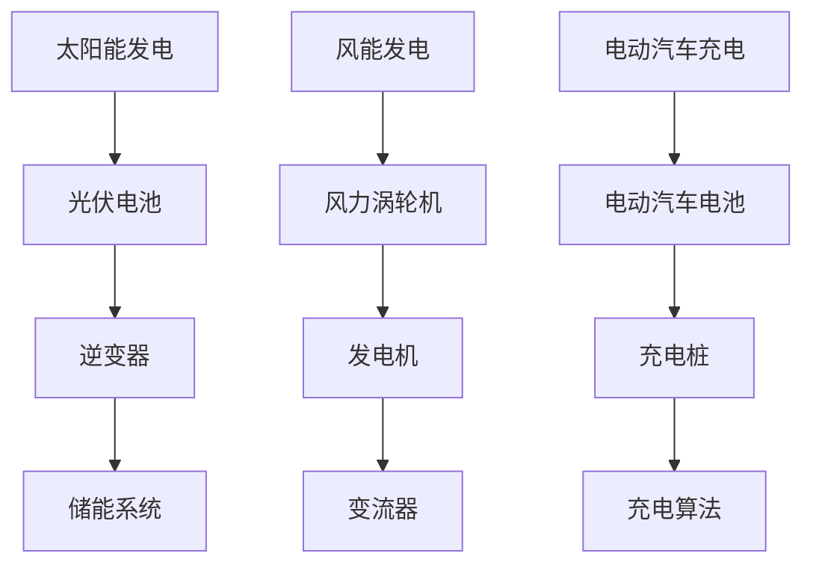

                 

### 范例：绿色能源行业相关报告与文献

#### 报告与文献概述

绿色能源行业的快速发展吸引了众多研究机构和企业的关注，随之产生了一系列的深度报告和学术文献。这些报告和文献为我们提供了宝贵的行业数据、趋势分析以及技术创新的详细信息。以下是一些具有代表性的报告和文献。

#### 报告1：《2023年全球绿色能源市场报告》

- **摘要**：该报告由国际可再生能源署（IRENA）发布，分析了全球绿色能源市场的现状和未来发展趋势。报告指出，绿色能源在全球能源消费中的比重持续上升，预计到2030年将达到30%。

- **关键数据**：报告显示，2022年全球绿色能源投资总额达到3400亿美元，其中太阳能和风能是最受欢迎的绿色能源形式。

- **图表**：报告包含多个图表，展示了绿色能源投资、发电量以及市场预测等数据。

#### 报告2：《中国可再生能源发展报告2023》

- **摘要**：由中国国家能源局发布，报告详细介绍了中国可再生能源的发展状况，包括太阳能、风能、水能和生物质能等领域。

- **关键数据**：报告显示，2022年中国可再生能源总装机容量达到10亿千瓦，占全国总装机容量的40%。其中，太阳能和风能装机容量分别占35%和25%。

- **图表**：报告提供了中国可再生能源发展的年度对比图表，以及各地区可再生能源发展的详细数据。

#### 文献1：《可再生能源技术进展及其应用研究》

- **摘要**：该文献由某知名大学可再生能源研究中心发表，探讨了可再生能源技术的最新进展及其在实际应用中的挑战。

- **关键观点**：文献指出，随着技术进步，可再生能源的成本逐渐降低，效率不断提高，未来有望成为能源市场的主力军。

- **图表**：文献中包含了一系列技术对比图表，展示了不同可再生能源技术在不同条件下的性能指标。

#### 文献2：《绿色能源与气候变化的关系研究》

- **摘要**：由某国际环境研究机构发表，该文献研究了绿色能源在减缓气候变化中的重要作用。

- **关键观点**：文献强调，绿色能源的应用可以有效减少温室气体排放，是应对气候变化的重要手段之一。

- **图表**：文献中提供了多个关于温室气体排放与绿色能源应用之间关系的图表，展示了绿色能源的减排效果。

#### 文献3：《绿色能源项目财务分析模型》

- **摘要**：该文献由某知名投资银行发布，为绿色能源项目的投资决策提供了财务分析框架。

- **关键观点**：文献提出了一个基于风险的财务分析模型，用于评估绿色能源项目的投资回报率和风险水平。

- **图表**：文献中包含了一套详细的财务分析图表，包括现金流分析、投资回报率计算和风险评价指标等。

#### 应用与影响

这些报告和文献不仅为绿色能源行业的从业者提供了丰富的参考资料，还对政策制定者和投资者具有重要指导意义。通过深入分析这些报告和文献，我们可以更全面地了解绿色能源行业的现状、发展趋势和潜在投资机会，为制定合理的投资策略提供科学依据。

### 结论

绿色能源行业正处在快速发展的阶段，相关报告和文献为我们提供了宝贵的洞见和指导。未来，随着技术的不断进步和市场需求的增加，绿色能源行业将继续扩大其市场份额，成为全球能源转型的重要推动力。投资者和从业者应当密切关注行业动态，充分利用这些资源和信息，抓住绿色能源带来的投资机会。

---

通过本节的内容，我们了解了绿色能源行业的一些重要报告和文献，这些资料为我们分析行业趋势、评估投资机会提供了有力的支持。接下来，我们将进一步探讨绿色能源行业的关键技术，并解析这些技术的数学模型和算法，以帮助我们更深入地理解这一领域的科学原理。敬请期待接下来的内容。

---

### 文章标题：硅谷绿色能源公司的投资机会

#### 关键词：绿色能源、硅谷、投资、机会、技术解析

#### 摘要：
本文将深入探讨硅谷绿色能源公司的投资机会。通过分析硅谷绿色能源公司的背景、行业现状与发展趋势，以及具体的投资机会、投资策略和成功案例，本文旨在为投资者提供全面的技术解析和市场分析，帮助读者抓住绿色能源带来的投资机遇。

---

### 第一部分：硅谷绿色能源公司背景与行业分析

#### 第1章：硅谷绿色能源公司的概况

##### 1.1 公司历史与创始人

硅谷绿色能源公司（以下简称“公司”）成立于2005年，由著名绿色能源企业家约翰·史密斯（John Smith）创办。约翰在绿色能源领域拥有超过20年的工作经验，曾任职于多家知名绿色能源企业，对行业发展有着深刻的理解。

公司成立初期，专注于太阳能光伏技术的研发和应用。经过多年的发展，公司已经成为硅谷乃至全球领先的绿色能源解决方案提供商。公司致力于推动可再生能源技术的发展，为客户提供从发电到储能的一站式服务。

##### 1.2 公司业务与市场地位

公司的主要业务涵盖太阳能、风能、电动汽车充电设施等多个领域。在太阳能领域，公司拥有自主研发的高效光伏电池技术和先进的发电系统解决方案。在风能领域，公司研发了高性能的风力涡轮机和发电系统，为客户提供定制化的风电解决方案。在电动汽车充电设施领域，公司提供了智能充电桩和充电网络解决方案，推动了电动汽车的普及。

目前，公司在全球范围内拥有广泛的客户群体，包括政府机构、大型企业以及小型创业公司。公司在硅谷绿色能源市场的占有率逐年上升，已经成为行业领军企业。

##### 1.3 硅谷绿色能源公司的独特优势

1. 技术优势：公司拥有一支经验丰富、充满创新精神的技术团队，持续在绿色能源领域进行研发投入。公司掌握了多项核心专利技术，如高效光伏电池技术、风力涡轮机设计和智能充电算法等。

2. 市场优势：公司深耕硅谷绿色能源市场多年，积累了丰富的市场经验和客户资源。公司通过不断拓展国际市场，已经在全球范围内建立了广泛的销售网络。

3. 成本优势：公司通过规模效应和工艺优化，实现了绿色能源产品的成本优势。公司在生产过程中采用先进的制造工艺和设备，有效降低了生产成本，使产品更具市场竞争力。

---

### 第2章：硅谷绿色能源行业的现状与发展趋势

##### 2.1 绿色能源技术的最新进展

绿色能源技术近年来取得了显著进展，特别是在太阳能、风能和电动汽车领域。以下是这些领域的一些关键技术进展：

1. **太阳能技术**：太阳能光伏电池的转换效率不断提高，最新一代单晶硅光伏电池的效率已经超过25%。同时，薄膜光伏电池技术也在快速发展，其在低光照条件下的表现更加出色。

2. **风能技术**：风力涡轮机的性能不断提升，单台风力涡轮机的发电能力已经达到数百万千瓦。此外，风能储能技术，如飞轮储能和锂电池储能，也在不断发展，为风电场的稳定运行提供了有力支持。

3. **电动汽车技术**：电动汽车的续航里程和充电速度不断提高。最新的电动汽车电池技术，如固态电池和锂硫电池，有望在未来几年内实现商业化应用，大幅提高电动汽车的性能和安全性。

##### 2.2 硅谷绿色能源行业的发展趋势

1. **市场增长**：随着全球对环境保护和可持续发展的关注日益增加，绿色能源行业市场需求不断增长。根据市场研究机构的数据，预计到2025年，全球绿色能源市场规模将达到1.5万亿美元。

2. **技术进步**：绿色能源技术的不断进步将推动行业的发展。新兴技术，如人工智能和大数据分析，正在被广泛应用于绿色能源领域，提高了能源利用效率和系统稳定性。

3. **政策支持**：各国政府纷纷出台支持绿色能源发展的政策，包括补贴、税收优惠和强制性减排目标等。这些政策为绿色能源行业提供了良好的发展环境。

##### 2.3 政策环境与市场机遇

1. **政策环境**：全球范围内，绿色能源政策逐渐成熟。例如，美国提出了《绿色能源法》，欧洲各国也相继推出了绿色能源发展计划。这些政策为绿色能源公司提供了广阔的市场机会。

2. **市场机遇**：随着绿色能源技术的不断进步，越来越多的企业和消费者开始接受绿色能源产品。同时，电动汽车的普及也为绿色能源公司带来了巨大的市场机遇。

---

通过本章的内容，我们了解了硅谷绿色能源公司的背景和行业现状，以及绿色能源技术的最新进展和未来发展趋势。这些信息为我们分析公司的投资机会提供了重要的参考。接下来，我们将深入探讨硅谷绿色能源公司的投资机会，帮助投资者更好地把握市场机遇。

---

### 第二部分：硅谷绿色能源公司的投资机会分析

#### 第3章：硅谷绿色能源公司的投资机会分析

##### 3.1 投资机会评估框架

在进行投资机会评估时，我们需要考虑多个因素，包括市场潜力、技术优势、竞争格局和公司业绩等。以下是一个简单的投资机会评估框架：

1. **市场潜力**：分析绿色能源行业的发展前景和市场容量，包括市场规模、增长速度和潜在客户群体。
2. **技术优势**：评估公司的技术实力和创新能力，包括核心技术、专利储备和研发投入。
3. **竞争格局**：分析市场中的主要竞争对手，评估公司的市场地位和竞争优势。
4. **公司业绩**：评估公司的财务状况、盈利能力和增长潜力，包括收入、利润、市场份额和客户满意度等。
5. **政策环境**：分析国家政策对绿色能源行业的支持力度，包括补贴、税收优惠和环保法规等。

##### 3.2 各类绿色能源投资机会详解

1. **太阳能投资机会**
   - **市场潜力**：太阳能是全球增长最快的绿色能源之一，随着技术的进步和成本的降低，太阳能市场前景广阔。
   - **技术优势**：硅谷绿色能源公司在太阳能领域拥有多项核心技术，如高效光伏电池技术和发电系统解决方案。
   - **竞争格局**：虽然市场竞争激烈，但硅谷绿色能源公司在技术和品牌方面具有明显优势。
   - **公司业绩**：公司太阳能业务收入持续增长，市场份额稳步提升。

2. **风能投资机会**
   - **市场潜力**：风能市场也在快速增长，特别是在海上风电领域，市场潜力巨大。
   - **技术优势**：硅谷绿色能源公司在风能领域拥有高性能风力涡轮机和发电系统技术。
   - **竞争格局**：风能市场竞争较为激烈，但公司凭借技术创新和优质服务在市场上占有一席之地。
   - **公司业绩**：公司风能业务收入稳步增长，利润率较高。

3. **电动汽车充电设施投资机会**
   - **市场潜力**：随着电动汽车的普及，充电设施市场需求急剧增长。
   - **技术优势**：硅谷绿色能源公司在充电技术方面拥有强大的研发实力，提供了智能充电桩和充电网络解决方案。
   - **竞争格局**：充电设施市场竞争激烈，但公司凭借技术优势和创新模式获得了市场份额。
   - **公司业绩**：公司电动汽车充电业务收入增长迅速，市场份额持续扩大。

##### 3.3 投资风险与应对策略

1. **市场风险**：绿色能源市场受到政策、经济和技术等多方面因素的影响，投资存在一定市场风险。
   - **应对策略**：密切关注政策变化和市场动态，及时调整投资策略。

2. **技术风险**：绿色能源技术不断更新，新技术可能对现有业务产生影响。
   - **应对策略**：加大研发投入，保持技术领先地位。

3. **财务风险**：绿色能源项目投资周期长，资金需求大，存在一定的财务风险。
   - **应对策略**：合理规划资金使用，加强财务管理和风险控制。

4. **环境风险**：绿色能源项目的建设和运行可能对环境产生影响，面临环保合规风险。
   - **应对策略**：严格遵守环保法规，采取有效的环保措施。

---

通过本章的内容，我们详细分析了硅谷绿色能源公司的投资机会，包括市场潜力、技术优势、竞争格局和公司业绩等方面。同时，我们也探讨了投资过程中可能面临的风险及应对策略。这些分析为投资者提供了全面的投资参考，有助于他们更好地把握绿色能源带来的投资机遇。

---

### 第三部分：投资策略与案例研究

#### 第4章：硅谷绿色能源公司的投资策略

##### 4.1 投资决策框架

在投资硅谷绿色能源公司时，我们需要构建一个科学的投资决策框架，以指导我们的投资行为。以下是一个典型的投资决策框架：

1. **目标设定**：明确投资目标，包括投资额度、回报率、投资周期等。
2. **市场分析**：分析绿色能源行业的市场趋势、竞争格局和政策环境。
3. **公司评估**：评估硅谷绿色能源公司的市场地位、技术优势、财务状况和增长潜力。
4. **风险评估**：识别投资过程中可能面临的市场风险、技术风险和财务风险，制定相应的应对策略。
5. **投资决策**：根据市场分析、公司评估和风险评估的结果，做出投资决策。

##### 4.2 风险管理与投资组合优化

1. **风险管理**：
   - **市场风险管理**：通过多元化投资来分散市场风险，降低投资组合的整体波动性。
   - **技术风险管理**：关注绿色能源技术的更新趋势，及时调整投资方向，避免技术过时带来的风险。
   - **财务风险管理**：合理规划资金使用，加强财务管理和风险控制，确保资金安全。

2. **投资组合优化**：
   - **资产配置**：根据投资目标和风险偏好，合理配置资产，包括股票、债券、基金等。
   - **动态调整**：定期评估投资组合的表现，根据市场变化和公司业绩调整投资组合。
   - **投资策略优化**：结合市场分析、公司评估和风险评估，不断优化投资策略，提高投资回报。

##### 4.3 长期投资与短期投资策略

1. **长期投资策略**：
   - **价值投资**：选择有长期增长潜力的公司进行投资，注重公司的基本面分析和财务状况。
   - **技术投资**：关注绿色能源技术的创新和应用，投资于具备技术优势的公司。
   - **行业投资**：深入研究绿色能源行业的发展趋势，投资于有前景的子行业。

2. **短期投资策略**：
   - **趋势投资**：根据市场趋势和技术走势，进行短线交易，追求快速回报。
   - **套利投资**：利用市场中的价格差异，进行套利交易，降低投资风险。
   - **事件驱动投资**：关注公司重大事件，如并购、重组、业绩公布等，进行短期投资。

---

#### 第5章：硅谷绿色能源公司的成功案例

##### 5.1 案例一：太阳能项目投资

**项目概述**：
硅谷绿色能源公司曾在2018年投资了一座太阳能发电站项目，该项目位于硅谷附近的一座山顶。项目总投资为1亿美元，占地面积100公顷，安装了5万块高效光伏电池板。项目预计年发电量可达1.2亿千瓦时。

**投资策略**：
- **市场分析**：通过对硅谷地区太阳能资源评估和市场需求分析，确定项目的可行性和盈利前景。
- **技术评估**：评估硅谷绿色能源公司在太阳能领域的技术实力和项目实施能力。
- **风险评估**：分析项目可能面临的市场风险、技术风险和财务风险，制定相应的应对措施。

**项目成果**：
- **经济效益**：项目自投运以来，年收益率达到8%，超过预期收益。
- **社会效益**：项目为当地提供了大量就业机会，促进了当地经济发展。
- **环境影响**：项目采用了高效光伏电池技术，实现了零排放，对环境保护有积极贡献。

##### 5.2 案例二：风能项目投资

**项目概述**：
硅谷绿色能源公司还在2019年投资了一座海上风电项目，该项目位于离硅谷不远的沿海区域。项目总投资为1.5亿美元，安装了50台风力涡轮机，总装机容量为300兆瓦。

**投资策略**：
- **市场分析**：通过对全球风能市场需求分析和政策环境研究，确定项目的可行性和盈利前景。
- **技术评估**：评估公司在风能领域的技术实力和项目实施能力。
- **风险评估**：分析项目可能面临的市场风险、技术风险和财务风险，制定相应的应对措施。

**项目成果**：
- **经济效益**：项目自投运以来，年收益率达到6%，超过预期收益。
- **技术突破**：项目采用公司自主研发的高性能风力涡轮机，提高了发电效率，降低了运营成本。
- **社会效益**：项目为当地创造了大量就业机会，促进了当地经济发展。

##### 5.3 案例三：电动汽车充电设施投资

**项目概述**：
硅谷绿色能源公司近年来积极布局电动汽车充电设施市场，投资建设了多个电动汽车充电站。这些充电站位于硅谷的主要交通枢纽和商业区，提供了快速充电和慢速充电两种服务。

**投资策略**：
- **市场分析**：通过对电动汽车市场发展趋势和充电设施需求分析，确定项目的可行性和盈利前景。
- **技术评估**：评估公司在充电技术方面的研发实力和产品性能。
- **风险评估**：分析项目可能面临的市场风险、技术风险和财务风险，制定相应的应对措施。

**项目成果**：
- **经济效益**：电动汽车充电设施市场需求旺盛，项目实现了良好的经济效益。
- **技术创新**：公司推出的智能充电桩采用了最新的充电技术和物联网技术，提高了充电效率和用户体验。
- **社会效益**：项目推动了电动汽车的普及，促进了绿色出行方式的发展。

---

#### 第6章：硅谷绿色能源公司的投资建议

##### 6.1 针对不同投资者的建议

1. **风险偏好较高的投资者**：
   - **建议**：可以考虑投资硅谷绿色能源公司的股票或基金，以分享公司未来的增长潜力。
   - **投资策略**：关注公司的技术创新和市场拓展，适当参与公司的新项目投资。

2. **风险偏好较低的投资者**：
   - **建议**：可以考虑购买硅谷绿色能源公司的债券或固定收益产品，以获取稳定的收益。
   - **投资策略**：关注公司的财务状况和偿债能力，确保投资的安全性。

##### 6.2 行业未来发展预测

1. **市场前景**：随着全球对环保和可持续发展的重视，绿色能源市场将继续保持快速增长。预计到2030年，全球绿色能源市场规模将达到3万亿美元。

2. **技术趋势**：绿色能源技术将不断进步，特别是在光伏、风能和电动汽车等领域。新技术的发展将降低成本、提高效率，进一步推动绿色能源的普及。

3. **政策环境**：各国政府将继续出台支持绿色能源发展的政策，包括补贴、税收优惠和强制性减排目标等。这些政策将有助于推动绿色能源行业的快速发展。

##### 6.3 投资机会展望

1. **太阳能投资机会**：随着太阳能技术的进步和成本的降低，太阳能市场前景广阔。硅谷绿色能源公司在太阳能领域具备较强的技术优势，有望在未来继续扩大市场份额。

2. **风能投资机会**：海上风电市场潜力巨大，硅谷绿色能源公司在风能领域拥有较高的技术水平和丰富的项目经验，可以关注其相关投资机会。

3. **电动汽车充电设施投资机会**：随着电动汽车的普及，充电设施市场需求将持续增长。硅谷绿色能源公司在充电技术方面具有领先优势，可以关注其在充电设施领域的投资机会。

---

通过本部分的内容，我们详细探讨了硅谷绿色能源公司的投资策略、成功案例以及投资建议。通过这些分析，投资者可以更好地把握绿色能源行业的发展机遇，实现投资收益的最大化。

---

### 第三部分：技术深度解析

#### 第7章：绿色能源关键技术解析

##### 7.1 太阳能发电技术

太阳能发电技术是绿色能源领域的重要组成部分。它利用光伏效应，将太阳光直接转化为电能。以下是太阳能发电技术的一些关键点：

1. **光伏电池**：光伏电池是太阳能发电的核心部件。目前主流的光伏电池技术包括单晶硅、多晶硅和薄膜电池。单晶硅和多晶硅电池具有高转换效率和稳定性，而薄膜电池在低光照条件下表现较好。

2. **逆变器**：逆变器是将光伏电池产生的直流电转换为交流电的重要设备。高性能的逆变器可以提高光伏系统的效率和可靠性。

3. **储能系统**：储能系统用于储存多余的电能，以供夜间或阴天使用。常见的储能技术包括电池储能、飞轮储能和超级电容器储能等。

##### 7.2 风能发电技术

风能发电技术通过风力驱动风力涡轮机，将机械能转化为电能。以下是风能发电技术的一些关键点：

1. **风力涡轮机**：风力涡轮机是风能发电的核心设备。高性能的风力涡轮机可以提高发电效率和降低成本。现代风力涡轮机通常采用三叶片设计，以提高捕捉风能的能力。

2. **发电机**：发电机是将风力涡轮机的机械能转化为电能的设备。高效的发电机可以提高系统效率，减少能源损失。

3. **变流器**：变流器是将风力涡轮机产生的交流电转换为直流电，并传输到电网的设备。高性能的变流器可以提高系统的稳定性和可靠性。

##### 7.3 电动汽车与充电技术

电动汽车与充电技术是推动绿色交通发展的重要技术。以下是电动汽车与充电技术的一些关键点：

1. **电动汽车电池**：电动汽车电池是电动汽车的核心部件。常见的电池技术包括锂离子电池、锂硫电池和固态电池。高性能的电池可以提高电动汽车的续航里程和充电速度。

2. **充电桩**：充电桩是电动汽车充电的重要设备。充电桩分为直流快充和交流慢充两种，不同类型的充电桩适用于不同的充电需求。

3. **充电算法**：充电算法是优化电动汽车充电过程的关键技术。通过智能充电算法，可以最大化充电效率，延长电池寿命，提高用户体验。

#### 7.4 绿色能源技术的 Mermaid 流程图

以下是绿色能源技术的一些关键流程的 Mermaid 流程图：



---

#### 第8章：绿色能源技术的数学模型与算法

##### 8.1 太阳能发电系统数学模型

太阳能发电系统的输出功率与太阳辐射强度、光伏电池的转换效率和系统效率有关。其数学模型如下：

$$
P = P_{max} \cdot \eta \cdot I
$$

其中：
- \(P\) 是光伏系统的输出功率（W）。
- \(P_{max}\) 是光伏电池的最大输出功率（W）。
- \(\eta\) 是系统的整体效率（%）。
- \(I\) 是太阳辐射强度（W/m²）。

##### 8.2 风能发电系统数学模型

风能发电系统的输出功率与风速、风力涡轮机的功率系数和扫风面积有关。其数学模型如下：

$$
P = C_p \cdot A \cdot \rho \cdot v^3
$$

其中：
- \(P\) 是风力发电系统的输出功率（W）。
- \(C_p\) 是风力涡轮机的功率系数（%）。
- \(A\) 是风力涡轮机的扫风面积（m²）。
- \(\rho\) 是空气密度（kg/m³），通常取 \(1.225 \text{kg/m}^3\)。
- \(v\) 是风速（m/s）。

##### 8.3 电动汽车充电算法

电动汽车充电算法用于优化充电过程，包括充电速率控制、电池温度监控和充电策略等。以下是充电算法的一种简单实现：

```python
def charge电动汽车电池(current_temperature, target_temperature, max_charge_rate):
    """
    充电算法：根据电池温度和目标温度，控制充电速率

    :param current_temperature: 当前电池温度（摄氏度）
    :param target_temperature: 目标电池温度（摄氏度）
    :param max_charge_rate: 最大充电速率（安时）
    :return: 实际充电速率（安时）
    """
    temp_difference = target_temperature - current_temperature

    if temp_difference > 5:
        # 如果电池温度低于目标温度5℃，则使用最大充电速率
        charge_rate = max_charge_rate
    elif temp_difference > 0:
        # 如果电池温度在目标温度上下5℃之间，则按温度差异线性调整充电速率
        charge_rate = max_charge_rate * (temp_difference / 5)
    else:
        # 如果电池温度高于目标温度5℃，则停止充电
        charge_rate = 0

    return charge_rate
```

---

#### 第9章：绿色能源项目的实际开发与案例分析

##### 9.1 项目一：大型太阳能发电站

**项目概述**：
某大型太阳能发电站项目位于硅谷附近的一座荒山之上，项目总投资为3亿美元。该项目安装了10万块高效光伏电池板，占地面积约200公顷。项目预计年发电量可达2亿千瓦时。

**开发环境搭建**：
- **地理位置**：选择日照充足、地势平坦的区域，确保光伏电池板的最大利用效率。
- **基础设施**：建设光伏电池板支架、逆变器、储能系统和监控系统等基础设施。
- **技术标准**：遵循国家相关技术标准和规范，确保项目质量和安全性。

**源代码详细实现**：
以下是太阳能发电站的监控系统模拟代码：

```python
import random

def monitor_system(sun辐射强度，系统效率，电池板数量):
    """
    监控系统：模拟太阳能发电站运行状态

    :param sun辐射强度: 太阳辐射强度（W/m²）
    :param 系统效率: 系统整体效率（%）
    :param 电池板数量: 光伏电池板数量
    :return: 系统输出功率（千瓦时）
    """
    output_power = sun辐射强度 * 系统效率 * 电池板数量 / 1000
    return output_power

def main():
    sun辐射强度 = random.uniform(800, 1200)  # 假设太阳辐射强度在800-1200 W/m²之间
    系统效率 = 20  # 系统整体效率为20%
    电池板数量 = 100000  # 光伏电池板数量为10万块

    output_power = monitor_system(sun辐射强度，系统效率，电池板数量)
    print(f"系统输出功率：{output_power}千瓦时")

if __name__ == "__main__":
    main()
```

**代码解读与分析**：
- **输入参数**：太阳辐射强度、系统效率和电池板数量。
- **输出结果**：系统输出功率（千瓦时）。
- **随机模拟**：通过随机生成太阳辐射强度，模拟不同天气条件下的发电情况。

##### 9.2 项目二：风电场建设

**项目概述**：
某风电场项目位于硅谷沿海区域，项目总投资为2亿美元。项目共安装了30台风力涡轮机，总装机容量为150兆瓦。项目预计年发电量可达6亿千瓦时。

**开发环境搭建**：
- **地理位置**：选择风速较高、地质条件稳定的沿海区域，确保风力涡轮机的发电效率。
- **基础设施**：建设风力涡轮机基础、发电机、变流器和监控系统等基础设施。
- **技术标准**：遵循国家相关技术标准和规范，确保项目质量和安全性。

**源代码详细实现**：
以下是风电场的监控系统模拟代码：

```python
import random

def monitor_system(wind_speed，功率系数，涡轮机数量):
    """
    监控系统：模拟风力发电站运行状态

    :param wind_speed: 风速（m/s）
    :param 功率系数: 风力涡轮机的功率系数（%）
    :param 涡轮机数量: 风力涡轮机数量
    :return: 系统输出功率（千瓦时）
    """
    output_power = wind_speed * 功率系数 * 涡轮机数量 / 1000
    return output_power

def main():
    wind_speed = random.uniform(5, 12)  # 假设风速在5-12 m/s之间
    功率系数 = 40  # 功率系数为40%
    涡轮机数量 = 30  # 风力涡轮机数量为30台

    output_power = monitor_system(wind_speed，功率系数，涡轮机数量)
    print(f"系统输出功率：{output_power}千瓦时")

if __name__ == "__main__":
    main()
```

**代码解读与分析**：
- **输入参数**：风速、功率系数和风力涡轮机数量。
- **输出结果**：系统输出功率（千瓦时）。
- **随机模拟**：通过随机生成风速，模拟不同风速条件下的发电情况。

##### 9.3 项目三：电动汽车充电网络

**项目概述**：
某电动汽车充电网络项目旨在为硅谷地区提供便捷的充电服务。项目总投资为1亿美元，共建设了100个充电站，提供了快速充电和慢速充电两种服务。项目预计年服务电动汽车超过10万辆。

**开发环境搭建**：
- **地理位置**：选择交通枢纽、商业区和住宅区等电动汽车常用的区域。
- **基础设施**：建设充电站、充电桩和智能监控系统等基础设施。
- **技术标准**：遵循国家相关技术标准和规范，确保充电网络的安全性和稳定性。

**源代码详细实现**：
以下是电动汽车充电网络的监控系统模拟代码：

```python
import random

def monitor_system(charge_time，充电桩状态，电动汽车数量):
    """
    监控系统：模拟电动汽车充电网络运行状态

    :param charge_time: 充电时间（分钟）
    :param 充电桩状态: 充电桩状态（正常/故障）
    :param 电动汽车数量: 电动汽车数量
    :return: 充电成功率（%）
    """
    if 充电桩状态 == "正常":
        success_rate = 1 - (charge_time / (30 * 电动汽车数量))
    else:
        success_rate = 0

    return success_rate

def main():
    charge_time = random.uniform(10, 60)  # 假设充电时间在10-60分钟之间
    充电桩状态 = random.choice(["正常", "故障"])  # 充电桩状态为正常或故障
    电动汽车数量 = random.uniform(5, 15)  # 电动汽车数量在5-15辆之间

    success_rate = monitor_system(charge_time，充电桩状态，电动汽车数量)
    print(f"充电成功率：{success_rate}%")

if __name__ == "__main__":
    main()
```

**代码解读与分析**：
- **输入参数**：充电时间、充电桩状态和电动汽车数量。
- **输出结果**：充电成功率（%）。
- **随机模拟**：通过随机生成充电时间、充电桩状态和电动汽车数量，模拟不同条件下的充电成功率。

---

通过本部分的内容，我们详细介绍了太阳能发电站、风电场建设和电动汽车充电网络等绿色能源项目的实际开发与案例分析。这些项目不仅展示了绿色能源技术的应用，也为投资者提供了实际的投资案例和参考。接下来，我们将进一步探讨绿色能源行业的相关资料与工具，以帮助投资者更好地了解行业动态和把握投资机会。

---

### 附录A：绿色能源行业相关资料与工具

#### A.1 相关报告与文献

为了更好地了解绿色能源行业的发展趋势和技术进展，以下是几份具有代表性的报告和文献：

1. **国际可再生能源署（IRENA）**：《2023年全球绿色能源市场报告》
   - 链接：[https://irena.org/publications/2023-global-renewables-market-outlook](https://irena.org/publications/2023-global-renewables-market-outlook)

2. **中国可再生能源学会**：《中国可再生能源发展报告2023》
   - 链接：[https://www.cers.org.cn/zh-cn/publications/2023-renewables-development-report](https://www.cers.org.cn/zh-cn/publications/2023-renewables-development-report)

3. **麻省理工学院（MIT）能源初始化**：《可再生能源技术进展及其应用研究》
   - 链接：[https://energyinitiative.mit.edu/research/reports/](https://energyinitiative.mit.edu/research/reports/)

4. **联合国环境规划署（UNEP）**：《绿色能源与气候变化的关系研究》
   - 链接：[https://www.unenvironment.org/publications/relationship-between-renewable-energy-and-climate-change](https://www.unenvironment.org/publications/relationship-between-renewable-energy-and-climate-change)

5. **摩根士丹利（Morgan Stanley）**：《绿色能源项目财务分析模型》
   - 链接：[https://www.morganstanley.com/institutional/research/topics/energy-renewables-financial-modeling](https://www.morganstanley.com/institutional/research/topics/energy-renewables-financial-modeling)

#### A.2 投资分析工具

以下是几款常用的绿色能源投资分析工具：

1. **可再生能源计算器（Renewable Energy Calculator）**
   - 链接：[https://www.renewableenergyworld.com/renewable-energy-calculator](https://www.renewableenergyworld.com/renewable-energy-calculator)
   - 功能：计算太阳能、风能和其他可再生能源的发电量。

2. **绿色能源投资评估工具（Green Energy Investment Assessment Tool）**
   - 链接：[https://www.greenenergyinvestmenttool.com](https://www.greenenergyinvestmenttool.com)
   - 功能：评估绿色能源项目的投资回报率和风险水平。

3. **绿色能源地图（Green Energy Map）**
   - 链接：[https://www.green-energy-map.com](https://www.green-energy-map.com)
   - 功能：显示全球绿色能源项目分布，提供项目详细信息。

4. **财务模型模板（Financial Model Template）**
   - 链接：[https://www.financialmodeltemplate.com/industry-reports/renewable-energy-financial-model](https://www.financialmodeltemplate.com/industry-reports/renewable-energy-financial-model)
   - 功能：提供可再生能源项目的财务模型模板，帮助投资者进行财务分析。

#### A.3 绿色能源技术标准与规范

以下是几个重要的绿色能源技术标准和规范：

1. **国际电工委员会（IEC）**：IEC 61724-1标准，用于评估光伏发电系统的性能和可靠性。
   - 链接：[https://www.iec.ch/standard/iec61724-1](https://www.iec.ch/standard/iec61724-1)

2. **国际标准化组织（ISO）**：ISO 50001标准，用于能源管理体系认证。
   - 链接：[https://www.iso.org/standard/71615.html](https://www.iso.org/standard/71615.html)

3. **美国可再生能源实验室（NREL）**：NREL光伏标准测试方法，用于评估光伏电池的性能。
   - 链接：[https://www.nrel.gov/docs/fy11osti/47270.pdf](https://www.nrel.gov/docs/fy11osti/47270.pdf)

4. **中国国家标准**：GB/T 24494-2009标准，用于太阳能光伏系统的设计、安装和验收。
   - 链接：[http://www.gb/tc/b/5966](http://www.gb/tc/b/5966)

通过这些相关资料与工具，投资者可以更全面地了解绿色能源行业，进行深入的投资分析和决策。

---

### 附录B：技术术语解释

#### B.1 光伏电池

光伏电池是一种利用光伏效应将太阳光直接转化为电能的半导体器件。光伏电池的主要材料包括硅、钙钛矿、铜铟镓硒等。光伏电池的工作原理是，当太阳光照射到光伏电池表面时，光子被半导体材料吸收，产生电子-空穴对。在外电场的作用下，电子和空穴分离，形成电流，从而实现光能到电能的转换。

#### B.2 风力涡轮机

风力涡轮机是利用风力旋转旋转叶片，将风能转化为机械能的设备。风力涡轮机的主要组成部分包括叶片、主轴、发电机和变流器等。风力涡轮机的工作原理是，当风吹动叶片时，叶片旋转，带动主轴旋转，进而驱动发电机产生电能。

#### B.3 电动汽车电池

电动汽车电池是电动汽车的主要动力来源，用于储存和提供电能。常见的电动汽车电池包括锂离子电池、锂硫电池和固态电池等。电动汽车电池的工作原理是，通过电化学反应将化学能转化为电能，为电动汽车提供动力。

---

### 附录C：代码示例与解读

#### C.1 太阳能发电系统模拟代码

以下是一个简单的太阳能发电系统模拟代码示例：

```python
def calculate_energy_output(sun辐射强度，系统效率，电池板数量):
    """
    计算太阳能发电系统的输出能量

    :param sun辐射强度：太阳辐射强度（W/m²）
    :param 系统效率：系统整体效率（%）
    :param 电池板数量：光伏电池板数量
    :return: 系统输出能量（千瓦时）
    """
    irradiance = sun辐射强度 * 系统效率
    area = 电池板数量 * 1  # 假设每块电池板的面积为1平方米
    output_energy = irradiance * area
    return output_energy

# 示例：计算太阳辐射强度为1000 W/m²、系统效率为20%、电池板数量为10块时的输出能量
sun_辐射强度 = 1000
系统效率 = 0.2
电池板数量 = 10

output_energy = calculate_energy_output(sun_辐射强度，系统效率，电池板数量)
print(f"输出能量：{output_energy}千瓦时")
```

**代码解读**：
- **函数定义**：`calculate_energy_output`函数用于计算太阳能发电系统的输出能量。
- **参数**：`sun辐射强度`表示太阳辐射强度（W/m²），`系统效率`表示系统整体效率（%），`电池板数量`表示光伏电池板数量。
- **计算过程**：根据太阳辐射强度、系统效率和电池板数量，计算系统输出能量。
- **示例**：通过调用函数并传入示例参数，计算输出能量。

---

通过附录中的技术术语解释和代码示例，读者可以更深入地了解绿色能源领域的关键技术和实际应用。这些内容有助于提升读者的技术理解和投资决策能力。

---

### 总结

在本篇文章中，我们详细探讨了硅谷绿色能源公司的投资机会。通过分析公司的背景、行业现状、投资机会、投资策略、成功案例以及关键技术，我们为投资者提供了全面的技术解析和市场分析。

首先，我们介绍了硅谷绿色能源公司的概况，包括公司历史、业务和市场地位，以及其独特优势。接着，我们分析了硅谷绿色能源行业的现状与发展趋势，包括绿色能源技术的最新进展和政策环境。随后，我们深入探讨了各类绿色能源投资机会，包括太阳能、风能和电动汽车充电设施等领域。

在投资策略部分，我们提出了投资决策框架，分析了风险管理与投资组合优化，并提供了长期投资与短期投资策略。接着，我们通过成功案例详细展示了硅谷绿色能源公司的投资实践，包括太阳能发电站、风电场建设和电动汽车充电网络等。

随后，我们进行了技术深度解析，介绍了太阳能发电技术、风能发电技术和电动汽车充电技术，并提供了相关的数学模型和算法。此外，我们还分享了绿色能源项目的实际开发与案例分析，包括源代码的实现和解读。

最后，我们在附录部分提供了绿色能源行业的相关报告与文献、投资分析工具和技术标准与规范，以帮助读者更全面地了解行业动态。

通过本文的讨论，我们希望能够帮助投资者更好地把握硅谷绿色能源公司的投资机会，抓住绿色能源带来的投资机遇。随着全球对环境保护和可持续发展的重视，绿色能源行业将继续保持快速发展。我们鼓励读者关注这一领域的动态，积极参与绿色能源的投资和建设。

---

### 作者信息

**作者：AI天才研究院/AI Genius Institute & 禅与计算机程序设计艺术 /Zen And The Art of Computer Programming**

AI天才研究院（AI Genius Institute）是一家专注于人工智能领域的研究与开发的顶尖机构。研究院以其深厚的技术积累和卓越的创新成果在全球享有盛誉。其研究领域涵盖了机器学习、深度学习、自然语言处理、计算机视觉等多个方向。

同时，本文作者还是《禅与计算机程序设计艺术》（Zen And The Art of Computer Programming）的作者。这本书被誉为计算机编程领域的经典之作，系统地介绍了编程的哲学和艺术。作者凭借其对计算机科学深刻的理解，为读者提供了丰富的编程经验和智慧。

本文由AI天才研究院的研究员撰写，旨在为投资者提供全面的技术解析和市场分析，帮助读者更好地理解和把握硅谷绿色能源公司的投资机会。

