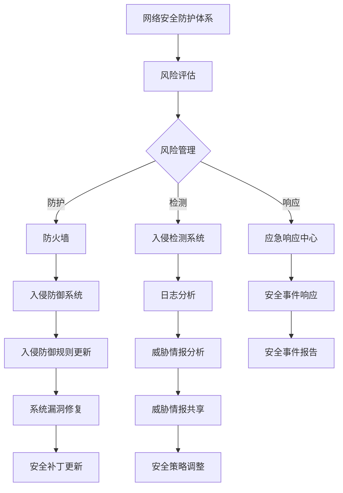

                 

### 第1章 引言

#### 1.1 书籍目的与读者对象

本章节的主要目的是介绍网络安全的重要性以及硅谷在网络安全领域的新技术研发和应用。通过本章节的学习，读者可以：

1. 理解网络安全的基本概念和核心价值。
2. 掌握硅谷网络安全技术的发展趋势和创新点。
3. 分析网络安全技术在实际应用中的挑战和解决方案。

本章节适合以下读者群体：

1. 对网络安全感兴趣的计算机专业学生和研究人员。
2. 网络安全从业者和IT安全工程师。
3. 对网络安全技术发展动态感兴趣的业界人士。
4. 企业管理者，需要了解网络安全对公司运营和风险控制的重要性。

在接下来的内容中，我们将首先回顾硅谷网络安全的发展背景，分析当前网络安全的核心趋势，并引入本书将要探讨的关键技术话题。

#### 1.2 硅谷网络安全的发展背景

硅谷，作为全球科技创新的中心，一直引领着网络安全技术的发展。自20世纪80年代以来，随着互联网的普及和业务应用的不断拓展，网络安全逐渐成为信息技术领域的重要关注点。硅谷网络安全的发展经历了以下几个重要阶段：

1. **早期阶段（1980s-1990s）**：早期网络安全主要集中在防御简单的网络攻击，如拒绝服务攻击（DDoS）和病毒。防火墙和入侵检测系统（IDS）开始被广泛应用。

2. **互联网阶段（1990s-2000s）**：随着互联网的快速发展，网络攻击变得更加复杂，网络安全需求也随之增加。加密技术、安全协议（如SSL/TLS）和安全审计系统得到广泛应用。

3. **云计算与物联网阶段（2000s-2010s）**：云计算和物联网的兴起，带来了新的安全挑战。硅谷企业开始关注分布式安全架构、安全容器、容器镜像扫描等技术，以确保云服务和物联网设备的安全。

4. **人工智能与区块链阶段（2010s-至今）**：人工智能（AI）和区块链技术的应用为网络安全带来了新的机遇。硅谷公司正在探索利用AI进行威胁检测、利用区块链提高数据安全性和透明度等创新应用。

#### 1.3 网络安全新技术的核心趋势

当前，硅谷网络安全新技术的核心趋势包括：

1. **人工智能与机器学习**：利用AI和机器学习算法进行威胁检测、异常行为分析和恶意软件防护，提高网络安全检测和响应能力。

2. **区块链技术**：通过区块链的分布式账本技术提高数据安全性、透明度和不可篡改性，特别是在跨境支付和智能合约领域。

3. **零信任架构**：采用“永不信任，始终验证”的原则，确保只有经过严格验证的用户和设备才能访问网络资源。

4. **云计算与边缘计算安全**：针对云服务和边缘计算环境的安全需求，开发新的安全工具和服务，如云防火墙、云访问安全代理（CASB）和边缘安全网关。

5. **物联网安全**：针对物联网设备数量庞大、硬件资源有限的特性，开发轻量级安全协议和设备安全解决方案。

6. **网络安全法规与政策**：随着网络安全威胁的日益严峻，各国政府纷纷出台网络安全法规和政策，以规范网络安全行为和加强安全监管。

在接下来的章节中，我们将深入探讨这些核心趋势下的具体技术实现和应用案例，帮助读者全面了解硅谷网络安全新技术的最新动态和发展方向。

### 第2章 网络安全基础概念

网络安全，作为保护网络系统、数据和资源不受未经授权访问、破坏和篡改的领域，是现代信息技术不可或缺的一部分。本章将首先介绍网络安全的基本概念，然后讨论当前网络安全面临的主要挑战与威胁，最后总结网络安全的基本策略。

#### 2.1 网络安全的基本概念

网络安全（Cybersecurity）是指通过一系列技术、策略和实践，保护计算机网络、系统、程序和数据免受各种威胁、攻击和未授权访问。其主要目标是确保信息的完整性、保密性和可用性。

1. **信息的完整性**：确保数据在传输和存储过程中不被篡改或破坏。
2. **信息的保密性**：保护数据不被未授权的个人或实体访问。
3. **信息的可用性**：确保数据和资源在需要时可以被授权用户访问和使用。

网络安全的基本要素包括：

- **防护**：通过防火墙、入侵检测系统（IDS）和入侵防御系统（IPS）等手段，防止恶意攻击和数据泄露。
- **检测**：通过日志分析、网络流量监控和异常检测等技术，发现潜在的安全威胁。
- **响应**：在安全事件发生时，迅速采取措施进行应对，包括隔离受感染系统、追踪攻击源和修复漏洞等。

#### 2.2 网络安全的挑战与威胁

随着互联网的普及和技术的不断进步，网络安全面临着越来越多的挑战和威胁。以下是一些主要的网络安全威胁：

1. **恶意软件（Malware）**：包括病毒、蠕虫、木马和勒索软件等，通过感染计算机系统和网络设备，窃取数据、破坏系统或拒绝服务。
2. **网络钓鱼（Phishing）**：通过伪装成合法机构发送钓鱼邮件，诱骗用户点击恶意链接或泄露敏感信息。
3. **拒绝服务攻击（DDoS）**：通过大量伪造请求使网络服务瘫痪，导致合法用户无法正常访问。
4. **高级持续性威胁（APT）**：通过长时间潜伏、持续监控和多次攻击，窃取敏感数据或进行其他恶意活动。
5. **社交工程（Social Engineering）**：通过欺骗手段，如冒充上级领导或客服人员，获取用户的信任和敏感信息。
6. **物联网安全威胁**：由于物联网设备的硬件和软件设计可能存在缺陷，容易成为攻击者的目标。
7. **云计算安全威胁**：云服务提供商的漏洞或配置错误可能导致数据泄露和未授权访问。

#### 2.3 网络安全的基本策略

为了应对上述挑战和威胁，网络安全需要采取一系列综合性的策略和措施：

1. **风险管理**：识别和评估网络系统的潜在风险，制定相应的风险缓解措施。
2. **访问控制**：通过身份验证、权限分配和审计等手段，确保只有授权用户才能访问系统和资源。
3. **数据加密**：使用加密技术保护数据的保密性和完整性，如传输加密和存储加密。
4. **安全审计**：定期进行安全审计和漏洞扫描，及时发现并修复安全漏洞。
5. **安全培训和意识提升**：加强员工的安全意识和培训，提高对网络钓鱼、社交工程等攻击手段的识别能力。
6. **应急响应计划**：制定和演练网络安全事件应急响应计划，确保在事件发生时能够迅速有效地应对。
7. **合规性**：遵守相关的法律法规和行业规范，确保网络安全的合法性和规范性。

在接下来的章节中，我们将深入探讨硅谷在网络安全技术创新方面的具体实践和前沿技术。

### 第3章 硅谷网络安全技术创新

硅谷作为全球科技创新的领军地区，网络安全技术的发展同样处于前沿。本章将重点介绍硅谷在网络安全领域的新技术创新，包括人工智能、区块链等前沿技术及其具体应用。

#### 3.1 人工智能在网络安全中的应用

人工智能（AI）和机器学习（ML）技术的迅猛发展，为网络安全领域带来了新的机遇。以下是一些人工智能在网络安全中的应用：

##### 3.1.1 概述

人工智能在网络安全中的应用主要包括威胁检测、异常行为分析、恶意软件防御等。通过训练机器学习模型，网络安全系统能够自动识别和响应各种网络攻击。

##### 3.1.2 防火墙的AI化

传统的防火墙主要依赖预先定义的规则和特征匹配来阻止恶意流量。而基于人工智能的防火墙则利用机器学习算法来自动识别和分类网络流量，提高检测准确率和响应速度。例如，使用深度学习模型对网络流量进行分类，可以实时检测并阻止未知的恶意流量。

**伪代码示例：**

```python
# 输入：网络流量数据
# 输出：流量分类结果

def classify_traffic(data):
    # 使用神经网络模型进行训练
    model = train_neural_network(data)
    # 预测流量类别
    category = model.predict(data)
    return category
```

##### 3.1.3 恶意软件检测

恶意软件检测是网络安全中的重要一环。传统的特征匹配方法在面对新型和变种的恶意软件时往往力不从心。而基于人工智能的恶意软件检测方法通过分析软件行为、网络通信模式和文件结构等特征，能够更准确地识别和阻止恶意软件。

**伪代码示例：**

```python
# 输入：软件行为日志
# 输出：恶意软件检测结果

def detect_malware(logs):
    # 使用行为分析模型进行训练
    model = train_behavior_analysis_model(logs)
    # 预测软件是否为恶意软件
    is_malicious = model.predict(logs)
    return is_malicious
```

#### 3.2 区块链技术在网络安全中的应用

区块链技术以其分布式账本、不可篡改和透明性等特点，在网络安全领域有着广泛的应用前景。

##### 3.2.1 概述

区块链技术通过去中心化的方式，在多个参与者之间共享和同步数据，确保数据的完整性和安全性。在网络安全中，区块链可用于提高数据安全、增强身份验证和实现智能合约等。

##### 3.2.2 区块链在数据加密中的运用

区块链技术可以用于数据加密和传输。通过使用区块链上的加密算法，数据在传输过程中可以被加密，确保只有拥有正确密钥的用户才能解密和访问数据。

**伪代码示例：**

```python
# 输入：明文数据、私钥
# 输出：密文数据

def encrypt_data(data, private_key):
    # 使用区块链加密算法进行加密
    cipher_text = blockchain_encrypt(data, private_key)
    return cipher_text

# 输入：密文数据、公钥
# 输出：明文数据

def decrypt_data(cipher_text, public_key):
    # 使用区块链加密算法进行解密
    plain_text = blockchain_decrypt(cipher_text, public_key)
    return plain_text
```

##### 3.2.3 区块链在分布式存储安全中的应用

区块链技术可以用于分布式存储系统的安全性增强。通过将数据分散存储在多个节点上，并使用区块链技术进行加密和签名，可以有效防止数据泄露和篡改。

**伪代码示例：**

```python
# 输入：数据块、节点列表
# 输出：加密后的数据块和区块链记录

def secure_store(data_block, node_list):
    # 使用加密算法对数据块进行加密
    encrypted_block = encrypt_data_block(data_block)
    # 在区块链上创建一个新的记录
    blockchain_record = create_blockchain_record(encrypted_block, node_list)
    return blockchain_record
```

通过上述示例，我们可以看到人工智能和区块链技术在网络安全中的应用及其潜力。在接下来的章节中，我们将继续探讨5G和云计算等新兴技术对网络安全带来的新挑战和解决方案。

#### 3.3 5G与网络安全

随着5G网络的快速部署，移动通信技术进入了一个新的时代。5G网络具有高速率、低延迟和高连接密度的特点，这为各种新兴应用场景提供了无限可能。然而，5G网络的发展也带来了新的网络安全挑战，需要我们深入探讨并采取相应的安全措施。

##### 3.3.1 5G网络的特点与安全挑战

5G网络具有以下主要特点：

1. **高速率**：5G网络的峰值速率可以达到数十Gbps，远高于4G网络。这使得大数据传输成为可能，但也带来了更大的安全隐患，因为攻击者可以利用高速网络传输大量恶意数据。
2. **低延迟**：5G网络的延迟极低，仅为1ms左右，这将提高实时应用的响应速度，但同时也可能使攻击者更容易进行实时攻击，如拒绝服务攻击（DDoS）。
3. **高连接密度**：5G网络可以支持每平方米数千个设备同时连接，这意味着网络规模将大大增加，潜在的安全漏洞和攻击面也随之扩大。

5G网络面临的主要安全挑战包括：

1. **无线安全问题**：5G网络采用高频段进行通信，这导致信号覆盖范围有限，容易受到干扰和窃听。此外，无线通信方式可能更容易受到中间人攻击（Man-in-the-Middle Attack）和重放攻击（Replay Attack）。
2. **网络切片安全问题**：5G网络引入了网络切片技术，可以根据不同应用需求灵活划分网络资源。然而，网络切片的灵活性也带来了安全挑战，如切片之间的隔离问题和切片资源的非法占用。
3. **边缘计算安全问题**：5G网络结合了边缘计算技术，将部分计算任务从云端转移到网络边缘，这可以提高响应速度和降低延迟。但边缘计算节点数量众多，且计算能力有限，容易成为攻击者的目标。

##### 3.3.2 5G网络安全技术

为了应对5G网络的安全挑战，研究人员和业界已经提出了多种安全技术：

1. **无线安全**：为了提高5G网络的无线安全性，可以采用以下措施：
   - **频谱管理**：通过合理分配和管理频谱资源，减少干扰和窃听。
   - **加密技术**：使用强加密算法保护无线通信，防止数据被窃取或篡改。
   - **认证和授权**：采用强身份认证和访问控制机制，确保只有合法用户和设备可以访问网络资源。

2. **网络切片安全**：为了确保网络切片的安全性，可以采取以下措施：
   - **切片隔离**：通过虚拟化技术和隔离机制，确保不同切片之间的数据隔离和安全。
   - **切片权限管理**：对网络切片进行权限管理，确保只有经过授权的设备和用户可以访问特定切片资源。
   - **切片监控和审计**：实时监控网络切片的运行状态，及时发现和应对异常行为和潜在威胁。

3. **边缘计算安全**：为了提高边缘计算的安全性，可以采取以下措施：
   - **边缘安全网关**：部署边缘安全网关，对进入和离开边缘节点的流量进行安全检查和过滤。
   - **边缘加密**：对边缘节点的数据传输进行加密，确保数据在传输过程中的安全性。
   - **边缘威胁检测**：在边缘节点部署威胁检测和防御系统，及时发现并阻止恶意攻击。

通过上述安全技术，我们可以有效应对5G网络面临的多种安全挑战，确保网络的高安全性和可靠性。在接下来的章节中，我们将继续探讨云计算与网络安全的关系，并分析云计算环境下的安全需求和技术创新。

#### 3.4 云计算与网络安全

云计算已经成为现代信息技术的重要基础设施，企业通过云计算实现了灵活的资源调配和高效的业务运营。然而，云计算环境的开放性和分布式特性也带来了新的安全挑战。本章将分析云计算环境下的网络安全需求，并探讨相关的技术创新。

##### 3.4.1 云计算环境下的网络安全

云计算环境下，数据、应用程序和网络资源分布在不同的地理位置，这使得传统的安全措施难以适应。云计算环境下的网络安全需求主要包括以下几个方面：

1. **数据保护**：云计算环境中的数据可能存储在多个物理位置，确保数据的保密性、完整性和可用性成为关键需求。数据加密、访问控制和数据备份是常见的保护措施。
2. **身份验证与访问控制**：云计算服务提供商需要确保只有授权用户可以访问系统和资源。多因素身份验证、访问控制列表（ACL）和单点登录（SSO）等技术用于加强身份验证和访问控制。
3. **网络安全**：云计算环境需要保护网络资源免受网络攻击和未授权访问。虚拟防火墙、入侵检测和防御系统（IDS/IPS）以及分布式 denial-of-service（DDoS）保护是常用的网络安全技术。
4. **合规性**：云计算服务提供商需要遵守各种法律法规和行业标准，如通用数据保护条例（GDPR）和联邦信息安全管理法（FISMA）。合规性管理工具和审计流程有助于确保合规性。

##### 3.4.2 云安全服务的创新

随着云计算的不断发展，云安全服务也不断创新，以满足日益复杂的网络安全需求。以下是一些重要的云安全服务创新：

1. **云防火墙**：云防火墙提供虚拟防火墙功能，可以保护云资源免受网络攻击。与传统防火墙相比，云防火墙可以动态适应云资源的变更，并自动更新安全策略。

**伪代码示例：**

```python
# 输入：网络流量、防火墙策略
# 输出：允许或拒绝流量

def cloud_firewall(traffic, firewall_policy):
    # 检查流量是否符合防火墙策略
    if matches_policy(traffic, firewall_policy):
        return "允许"
    else:
        return "拒绝"
```

2. **云入侵检测系统（Cloud IDS/IPS）**：云IDS/IPS用于实时监控云资源中的异常行为和潜在威胁。通过分析网络流量和系统日志，云IDS/IPS可以自动检测并响应恶意攻击。

**伪代码示例：**

```python
# 输入：系统日志、网络流量
# 输出：威胁警报

def cloud_invasion_detection(logs, traffic):
    # 使用机器学习模型分析日志和流量
    model = train_invasion_detection_model(logs, traffic)
    # 检测潜在威胁
    threats = model.detect_threats()
    return threats
```

3. **云端加密技术**：云端加密技术用于保护云存储中的数据。通过使用对称加密和非对称加密算法，云端加密技术确保数据在存储和传输过程中保持加密状态。

**伪代码示例：**

```python
# 输入：明文数据、密钥
# 输出：密文数据

def encrypt_data(data, key):
    # 使用对称加密算法加密数据
    cipher_text = aes_encrypt(data, key)
    return cipher_text

# 输入：密文数据、密钥
# 输出：明文数据

def decrypt_data(cipher_text, key):
    # 使用对称加密算法解密数据
    plain_text = aes_decrypt(cipher_text, key)
    return plain_text
```

通过上述云安全服务的创新，云计算环境的安全性得到了显著提升。在云计算日益普及的今天，不断创新和优化安全服务是确保云资源安全的必要手段。在接下来的章节中，我们将探讨物联网安全的重要性和面临的挑战。

#### 3.5 物联网安全

随着物联网（IoT）技术的飞速发展，连接到互联网的设备数量呈现出爆炸式增长。物联网设备的应用领域广泛，包括智能家居、智能城市、工业自动化等。然而，物联网设备的普及也带来了新的安全挑战。本章将探讨物联网安全的重要性、面临的挑战以及相应的对策。

##### 3.5.1 物联网安全的重要性

物联网安全的重要性体现在以下几个方面：

1. **数据安全**：物联网设备收集和处理大量用户数据，包括个人隐私信息、财务数据和重要业务数据。数据泄露或篡改可能导致严重后果，如身份盗窃、财务损失和业务中断。
2. **设备安全**：物联网设备通常具有有限的计算资源和安全机制，容易成为攻击者的目标。攻击者可以通过控制物联网设备，发起分布式拒绝服务（DDoS）攻击、传播恶意软件或进行物理攻击。
3. **网络安全**：物联网设备通常连接到互联网，形成一个庞大的网络。如果这些设备存在安全漏洞，攻击者可以通过入侵一个设备，逐步控制整个网络，从而获取敏感信息和操纵设备。
4. **隐私保护**：物联网设备往往与用户的日常生活紧密相关，收集了大量个人行为和位置数据。如果这些数据泄露，用户的隐私将受到严重威胁。

##### 3.5.2 物联网安全挑战与对策

物联网安全面临以下主要挑战：

1. **设备安全**：由于物联网设备的硬件资源有限，传统的安全防护措施难以实现。针对设备安全的对策包括：
   - **安全固件**：确保物联网设备使用经过安全审查的固件，防止恶意代码植入。
   - **安全芯片**：使用安全芯片来存储和验证设备密钥，确保设备通信的安全性。
   - **设备认证**：采用设备认证机制，确保只有经过授权的设备可以接入网络。

2. **网络安全**：物联网设备通常通过无线网络连接，网络安全性成为关键挑战。对策包括：
   - **加密通信**：使用加密协议（如TLS）保护设备之间的通信，防止中间人攻击。
   - **网络隔离**：将物联网设备与核心网络隔离，减少潜在的安全威胁。
   - **入侵检测**：部署入侵检测系统（IDS），实时监控网络流量，检测异常行为和潜在攻击。

3. **数据安全**：物联网设备收集和处理大量数据，确保数据安全是重要挑战。对策包括：
   - **数据加密**：对传输和存储的数据进行加密，防止数据泄露。
   - **访问控制**：通过访问控制机制，确保只有授权用户可以访问敏感数据。
   - **数据备份和恢复**：定期备份数据，并建立数据恢复机制，确保数据在意外情况下的可用性。

4. **隐私保护**：保护用户的隐私是物联网安全的重要方面。对策包括：
   - **隐私政策**：制定清晰的隐私政策，告知用户数据收集和使用的方式。
   - **匿名化处理**：对收集到的数据进行匿名化处理，消除个人身份信息。
   - **用户权限管理**：给予用户对数据访问和使用的控制权限，确保用户能够自主管理自己的隐私。

通过采取上述对策，我们可以有效应对物联网安全挑战，确保物联网设备的可靠性和安全性。在接下来的章节中，我们将探讨网络安全法规与政策的重要性，并分析全球和中国的网络安全法规。

#### 3.6 网络安全法规与政策

随着网络安全威胁的日益严峻，各国政府纷纷出台网络安全法规和政策，以规范网络安全行为和加强安全监管。本章将概述全球网络安全法规，重点分析美国的网络安全政策，并简要介绍中国的网络安全法规。

##### 3.6.1 全球网络安全法规概览

全球范围内，多个国家和地区已经制定了网络安全相关法规，以应对不断演变的网络安全威胁。以下是一些主要的全球网络安全法规：

1. **通用数据保护条例（GDPR）**：欧盟于2018年实施的GDPR是迄今为止最严格的隐私保护法规。该条例要求企业在处理欧盟居民的个人信息时，必须采取严格的保护措施，确保个人数据的保密性、完整性和可访问性。

2. **加利福尼亚州消费者隐私法案（CCPA）**：CCPA是美国的隐私保护法规，旨在赋予加州居民对其个人信息的控制权。该法案要求企业在处理加州居民的个人信息时，必须透明其数据收集和处理方式，并给予用户拒绝数据出售的权利。

3. **国际电信联盟（ITU）**：ITU发布了多项网络安全标准和建议，包括网络安全管理框架、网络防护指南等，为全球各国提供了网络安全法规制定的参考。

4. **ISO/IEC 27001**：ISO/IEC 27001是国际标准化组织（ISO）发布的网络安全管理体系标准，帮助企业建立和维护一个有效的信息安全管理系统。

##### 3.6.2 美国网络安全政策分析

美国是全球网络安全政策制定和实施的重要国家之一。以下是一些关键的美国网络安全政策：

1. **《国家网络安全战略》**：该战略于2018年由美国总统签署，明确了美国的网络安全目标、原则和行动计划。战略强调加强网络基础设施保护、提高网络安全意识、促进网络安全技术发展等。

2. **《网络防御法案》**：该法案旨在加强美国网络防御能力，通过立法手段推动网络安全技术研发、网络威胁情报共享和网络安全事件应对。

3. **《联邦信息安全管理法》（FISMA）**：FISMA要求美国政府机构建立和维护一个有效的信息安全管理体系，以确保联邦信息系统的安全性和完整性。该法案还规定了信息安全评估、审计和报告要求。

4. **《网络安全信息共享法》（CISPA）**：CISPA旨在促进私营部门与政府之间的网络安全信息共享，以加强网络安全防御能力。该法案规定企业可以与政府分享网络安全威胁信息，而不会受到民事诉讼的威胁。

##### 3.6.3 中国网络安全法规解读

中国作为全球最大的互联网市场，也在网络安全法规建设方面取得了显著进展。以下是一些重要的中国网络安全法规：

1. **《网络安全法》**：2017年生效的《网络安全法》是中国网络安全领域的里程碑性法规。该法规定了网络运营者的安全义务、网络数据的本地存储要求以及网络安全事件的报告和处置要求。

2. **《数据安全法》**：该法于2021年生效，旨在保护数据安全，防止数据泄露、篡改和滥用。数据安全法明确了数据处理者的安全责任和数据分类管理要求。

3. **《个人信息保护法》（PIPL）**：PIPL于2021年生效，旨在加强对个人信息的保护，规定了个人信息处理的原则、个人信息主体的权利以及个人信息处理者的义务。

4. **《关键信息基础设施安全保护条例》**：该条例于2017年发布，明确了关键信息基础设施的识别和管理要求，以及关键信息基础设施运营者的安全保护责任。

通过全球和各国网络安全法规的制定与实施，网络安全逐渐成为各国政府的重要议题。在法规的引导下，企业和社会各界共同参与到网络安全建设中，形成全社会共同维护网络安全的良好氛围。在接下来的章节中，我们将通过具体案例，展示硅谷企业在网络安全方面的实践。

#### 3.7 网络安全实战案例

硅谷作为全球科技创新的中心，网络安全领域的实际案例丰富且具有代表性。以下将列举几个硅谷企业的网络安全实践，并通过案例分析网络安全防御策略的制定与实施。

##### 3.7.1 硅谷企业的网络安全实践

1. **Facebook的网络安全实践**：Facebook作为全球最大的社交网络平台，其网络安全挑战巨大。Facebook采用了多种先进技术来保护用户数据和系统安全。具体实践包括：

   - **数据加密**：Facebook使用端到端加密技术保护用户聊天记录和私信，确保用户隐私。
   - **威胁检测与响应**：Facebook的网络安全团队利用人工智能和机器学习技术，实时监控和检测网络攻击，迅速采取应对措施。
   - **访问控制与身份验证**：Facebook采用了严格的身份验证和访问控制机制，确保只有授权用户和设备可以访问核心系统和数据。

2. **谷歌的网络安全实践**：谷歌作为全球领先的科技公司，在网络安全方面投入巨大。其网络安全实践包括：

   - **安全培训与意识提升**：谷歌定期对员工进行网络安全培训，提高员工对网络钓鱼、恶意软件等威胁的识别能力。
   - **自动化安全工具**：谷歌部署了自动化安全工具，如漏洞扫描器和入侵检测系统，自动发现和修复安全漏洞。
   - **分布式防御体系**：谷歌采用了分布式防御体系，确保在全球范围内的数据中心和服务器上都能有效抵御网络攻击。

##### 3.7.2 网络安全事件的案例分析

1. **2013年Adobe黑客攻击事件**：2013年，Adobe公司遭受了严重的黑客攻击，导致数百万用户的账户信息泄露。此次攻击涉及社会工程攻击、恶意软件传播和持久化攻击。分析此次事件，可以总结以下经验教训：

   - **社会工程攻击防范**：Adobe在事后发现，攻击者通过伪装成公司内部人员，诱骗员工泄露敏感信息。加强员工的安全意识和防范措施，对防范社会工程攻击至关重要。
   - **及时检测与响应**：Adobe事后承认，攻击者已在系统中潜伏了数月。及时部署威胁检测和响应系统，能够及时发现和阻止恶意行为。
   - **数据加密与访问控制**：虽然Adobe在事件后采取了数据加密和访问控制措施，但在攻击发生前，部分敏感数据未加密，导致数据泄露。加强数据加密和访问控制，是保护数据安全的重要手段。

2. **2016年DDoS攻击事件**：2016年，一个名为“深层网络”的极端组织发起了针对域名系统（DNS）的分布式拒绝服务（DDoS）攻击，导致多家硅谷企业网站瘫痪。此次事件展现了DDoS攻击的强大破坏力。分析此次事件，可以得出以下启示：

   - **多层次的防御措施**：应对DDoS攻击，需要采取多层次防御措施，包括流量清洗、带宽扩充和异常流量识别等。
   - **第三方服务支持**：为了应对大规模DDoS攻击，硅谷企业通常借助第三方专业的DDoS防护服务，快速有效地应对攻击。
   - **应急预案的制定与演练**：在DDoS攻击发生时，快速启动应急预案，进行流量转移和系统保护，是确保业务连续性的关键。

##### 3.7.3 网络安全防御策略的制定与实施

基于以上实践和案例分析，硅谷企业在制定和实施网络安全防御策略时，通常遵循以下原则：

1. **全面的安全体系建设**：建立包括物理安全、网络安全、应用安全、数据安全等在内的全面安全体系，确保全方位保护企业资产。

2. **技术创新与应用**：积极引入先进的安全技术和工具，如人工智能、区块链、大数据分析等，提高安全检测和响应能力。

3. **员工安全意识提升**：通过定期的安全培训和演练，提高员工的安全意识和技能，防范内部威胁。

4. **合规性管理**：遵守国家和行业的网络安全法规和标准，确保网络安全行为的合法性和规范性。

5. **持续的安全评估与改进**：定期进行安全评估，发现和修复安全漏洞，持续改进安全策略和措施。

通过有效的网络安全防御策略，硅谷企业能够应对日益复杂的网络安全威胁，确保业务的连续性和数据的完整性。在接下来的章节中，我们将展望未来网络安全的发展趋势和新技术的应用前景。

### 第9章 未来网络安全展望

随着信息技术的飞速发展，网络安全面临着前所未有的挑战和机遇。本章将分析未来网络安全的发展趋势，探讨新兴网络安全技术的应用前景，并展望网络安全行业的未来发展。

#### 9.1 网络安全发展趋势分析

未来网络安全的发展趋势可以从以下几个方面进行概述：

1. **人工智能与机器学习的深度应用**：人工智能和机器学习技术将在网络安全中发挥更加重要的作用。通过大数据分析和自动化响应，网络安全系统能够更快速、准确地检测和应对威胁。深度学习模型将用于识别复杂攻击模式和异常行为。

2. **零信任安全模型**：零信任安全模型强调“永不信任，始终验证”。该模型要求对所有访问进行严格验证，即使在内部网络中也不信任任何设备或用户。零信任安全模型有助于防止内部威胁，提高网络安全防护水平。

3. **区块链技术的广泛应用**：区块链技术的不可篡改性和透明性使其在数据安全和隐私保护中具有巨大潜力。未来，区块链技术将被广泛应用于数据加密、身份验证和供应链管理等领域。

4. **物联网安全的规范化**：随着物联网设备的激增，物联网安全将成为网络安全领域的重点。未来，物联网安全标准和法规将不断完善，确保物联网设备的硬件和软件设计符合安全要求。

5. **云计算与边缘计算的融合**：云计算和边缘计算的结合将推动网络安全技术的发展。边缘计算将计算任务分散到网络边缘，提高响应速度和安全性。同时，云计算服务提供商将加强云安全措施，确保云资源的安全性。

6. **量子计算的影响**：量子计算的发展将对传统加密算法构成威胁。未来，网络安全领域将研究量子安全通信和量子加密算法，以应对量子计算的挑战。

#### 9.2 新兴网络安全技术展望

以下是一些新兴网络安全技术及其应用前景：

1. **量子安全通信**：量子安全通信利用量子物理原理，实现加密通信的绝对安全性。未来，量子安全通信有望成为网络安全的重要支柱，保护关键信息免受量子计算攻击。

2. **隐私计算**：隐私计算旨在在不泄露用户数据的情况下，进行数据处理和分析。通过隐私计算技术，企业可以在保护用户隐私的同时，实现数据的价值最大化。

3. **威胁情报共享**：威胁情报共享平台将促进企业和组织之间的安全信息交流。通过共享威胁情报，网络安全系统能够更快地识别和应对新兴威胁。

4. **自动化安全运营中心（SOC）**：自动化SOC将提高安全运营的效率和响应速度。通过人工智能和机器学习技术，SOC能够自动分析和响应安全事件，减少人工干预。

5. **区块链安全**：区块链技术将用于构建安全的数据存储和处理平台，确保数据的安全性和透明性。未来，区块链安全将在金融、医疗和供应链管理等领域得到广泛应用。

#### 9.3 网络安全行业未来发展

未来，网络安全行业将呈现出以下发展趋势：

1. **市场规模扩大**：随着网络安全威胁的加剧，网络安全市场将继续保持高速增长。预计全球网络安全市场将在未来几年内达到数千亿美元规模。

2. **技术创新加速**：网络安全领域的创新将不断涌现，推动网络安全技术的发展。新兴技术如人工智能、区块链、量子计算等将在网络安全领域发挥关键作用。

3. **跨领域合作加强**：网络安全不仅仅是技术问题，还涉及法律、政策和国际合作。未来，跨领域合作将加强，推动网络安全政策和技术标准的统一。

4. **人才培养和引进**：网络安全人才的短缺是行业面临的重要挑战。未来，各国将加大对网络安全人才的培养和引进力度，满足行业发展的需求。

5. **安全意识提升**：随着网络安全威胁的普及，公众对网络安全的关注度和意识将不断提高。未来，网络安全教育将更加普及，推动形成全社会共同维护网络安全的氛围。

总之，未来网络安全行业将在技术创新、政策支持和人才培养的推动下，实现持续健康发展。面对日益复杂的网络安全挑战，网络安全行业需要不断创新和优化安全策略，确保信息和数据的安全与完整。

### 第10章 总结与展望

#### 10.1 书籍主要内容回顾

本书系统地介绍了硅谷网络安全的新技术研发与应用。我们从网络安全的基本概念和挑战出发，探讨了人工智能、区块链、5G、云计算和物联网等前沿技术在网络安全中的应用。通过深入分析硅谷企业的网络安全实践，我们展示了如何制定和实施有效的网络安全防御策略。同时，我们回顾了全球和各国的网络安全法规，展望了未来网络安全的发展趋势。

#### 10.2 网络安全的重要性

网络安全不仅是企业运营和个人隐私保护的关键，也是国家安全的基石。随着信息技术的飞速发展，网络攻击手段日益复杂，网络安全威胁无处不在。因此，加强网络安全意识、提升安全防护能力、完善法规政策，成为社会各界共同面临的挑战。

#### 10.3 对未来网络安全工作的思考

未来网络安全工作需要从以下几个方面进行深化：

1. **技术创新**：持续推动网络安全技术的研究与创新，尤其是人工智能、量子计算等前沿技术，以应对不断演变的网络威胁。
2. **跨领域合作**：加强政府、企业、学术界和研究机构的合作，共同推动网络安全技术的发展与应用。
3. **人才培养**：加大对网络安全人才的培养力度，提高全社会的网络安全素养。
4. **法规政策完善**：不断完善网络安全法规政策，确保网络安全行为的合法性和规范性。
5. **安全意识提升**：加强网络安全教育，提高公众对网络安全的认知和防范能力。

通过以上措施，我们可以共同构建一个更加安全、可靠的网络空间，为经济社会的发展提供坚实保障。

### 附录

#### 附录 A：网络安全常用工具和资源

**A.1 网络安全工具介绍**

1. **Nmap**：网络探测和安全管理工具，用于扫描和枚举目标网络的开放端口和服务。
2. **Wireshark**：网络协议分析工具，用于捕捉、分析和解码网络流量。
3. **Kali Linux**：专业的渗透测试和安全评估操作系统，内置多种网络安全工具。
4. **Metasploit**：网络攻击工具，用于模拟和执行各种网络攻击，测试系统安全性。

**A.2 网络安全资源推荐**

1. **OWASP**：开放式网络应用安全项目，提供丰富的网络安全资源和指南。
2. **SANS Institute**：网络安全教育和培训机构，提供在线课程和培训资料。
3. **Cybersecurity Exchange**：全球网络安全信息共享平台，提供最新的网络安全动态和技术资源。
4. **CVE**：公共漏洞和暴露（Common Vulnerabilities and Exposures）数据库，收录了全球范围内的漏洞信息。

**A.3 网络安全学习资源链接**

1. **《黑客攻防技术宝典：系统实战篇》**：李 inheritance 等著，电子工业出版社，详细介绍了系统级网络安全技术。
2. **《区块链技术指南》**：戴博 等著，机械工业出版社，深入讲解了区块链的原理和应用。
3. **《深度学习与人工智能》**：周志华 等著，清华大学出版社，系统介绍了深度学习和人工智能的基础知识。
4. **《网络安全法》**：国家法律法规汇编，提供了网络安全法的全文和相关法律法规。

#### 附录 B：网络安全流程图

**B.1 网络安全防护体系流程图**



以上流程图展示了网络安全防护体系的各个关键环节，包括风险评估、风险管理、防护、检测、响应等。通过这样的体系，企业能够全面、系统地提升网络安全防护能力。

