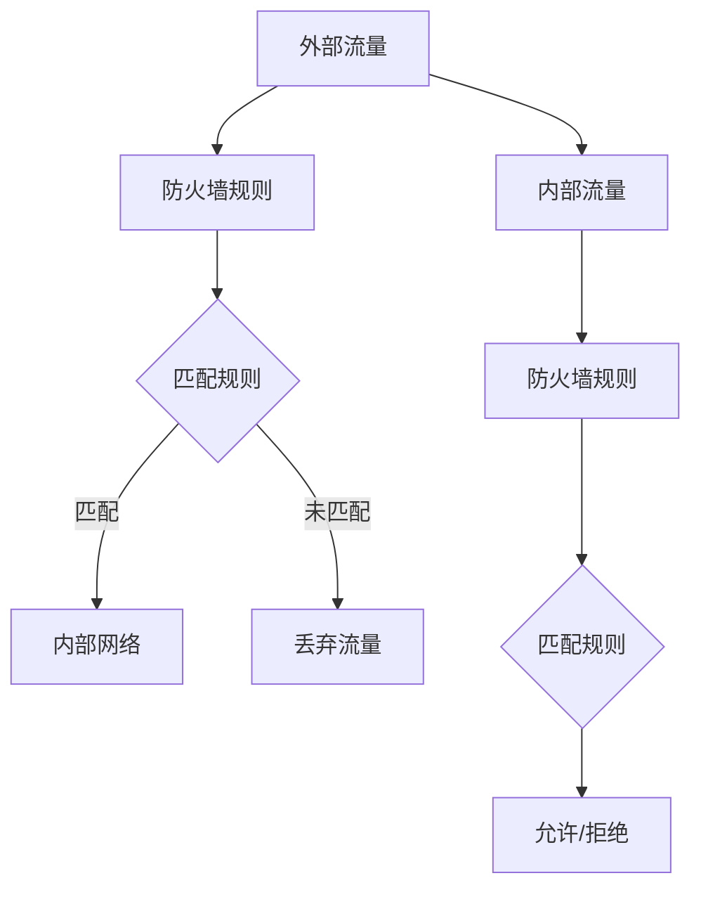
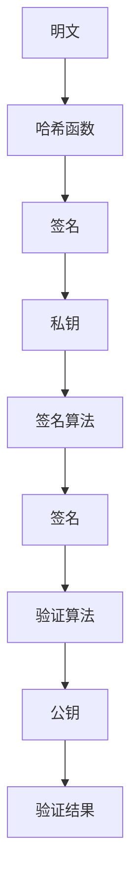

                 

# 《硅谷网络安全面临的新挑战》

## 摘要

在数字化浪潮席卷全球的今天，网络安全已经成为一个至关重要的议题。尤其是硅谷作为全球科技创新的中心，网络安全面临的新挑战层出不穷。本文旨在深入探讨硅谷网络安全所遭遇的复杂问题，分析其背后的原因，并探讨相应的解决方案。通过对网络安全基本概念的回顾，对硅谷网络安全现状的详细分析，以及核心技术的解析，我们希望能够为读者提供一个全面、深入的硅谷网络安全分析。文章还将讨论硅谷网络安全最佳实践、法律法规和人才培养等方面，以期为未来的网络安全发展提供有益的参考。

## 引言与背景

### 1.1 书籍目的与结构

网络安全是现代信息社会的重要基石，尤其在硅谷这样的科技创新热土，网络安全的重要性更为显著。本文旨在通过系统地分析硅谷网络安全面临的新挑战，帮助读者理解当前网络安全形势的复杂性，并探讨可能的应对策略。文章结构如下：

- **第一部分**：引言与背景，介绍网络安全的重要性以及硅谷网络安全的特殊性。
- **第二部分**：网络安全现状分析，包括硅谷网络安全的发展历程、主要挑战和对策。
- **第三部分**：网络安全核心技术解析，介绍防火墙、加密技术等关键技术原理。
- **第四部分**：硅谷网络安全最佳实践，探讨硅谷企业的安全策略和项目实战。
- **第五部分**：网络安全法律与法规，分析硅谷网络安全法律法规的现状与未来。
- **第六部分**：网络安全人才培养与教育，讨论硅谷网络安全人才的现状和培养模式。
- **第七部分**：总结与展望，总结文章的主要观点并对未来网络安全发展进行展望。

### 1.2 网络安全的重要性

网络安全不仅仅是技术问题，更是一个关系到国家安全、社会稳定和经济发展的重要议题。随着互联网的普及和信息技术的发展，网络安全问题日益凸显。以下是网络安全重要性的一些具体体现：

1. **保护个人隐私**：网络犯罪分子通过黑客攻击获取用户个人信息，如姓名、地址、银行账户信息等，对个人隐私造成严重威胁。
2. **维护企业利益**：企业网络遭到攻击可能导致商业机密泄露、财务损失甚至业务中断，对企业的生存和发展构成重大威胁。
3. **保障基础设施安全**：关键基础设施如电力、交通、医疗等系统的网络安全问题可能引发大规模事故，对社会造成严重影响。
4. **维护国家利益**：网络安全问题不仅仅影响企业和个人，还可能涉及国家安全和国家利益。网络战、网络间谍活动等威胁国家安全。
5. **促进数字经济发展**：网络安全为数字经济提供保障，保障网络基础设施和商业活动的安全，有助于推动数字经济的发展。

### 1.3 硅谷网络安全环境的特殊性

硅谷作为全球科技创新的中心，拥有众多领先的技术企业和研发机构，网络安全环境具有以下特殊性：

1. **高密度创新**：硅谷聚集了大量的科技公司和创新团队，这意味着网络攻击的目标更为集中，攻击的频率和难度更高。
2. **数据密集**：硅谷企业处理和存储的大量敏感数据，包括用户数据、商业机密、研究数据等，成为网络攻击的主要目标。
3. **快速迭代**：硅谷企业产品更新速度快，安全防护措施需要不断迭代和升级，否则容易被攻击者找到漏洞。
4. **开放环境**：硅谷企业普遍采用开源技术，虽然有助于创新，但也增加了被攻击的风险，因为开源代码可能存在未知的漏洞。
5. **全球化网络**：硅谷企业的业务遍布全球，跨国网络攻击的风险更高，需要面对复杂的地缘政治和安全问题。

### 1.4 阅读对象与预期收获

本文主要面向以下几类读者：

1. **网络安全从业人员**：通过本文，读者可以了解硅谷网络安全的现状和挑战，学习到一些最佳实践，为自己的工作提供参考。
2. **科技企业和研发团队**：本文旨在帮助科技企业和研发团队提高对网络安全的重视程度，并提供可行的安全解决方案。
3. **高校师生**：本文可以作为网络安全课程的教学材料，帮助高校师生深入了解网络安全领域的前沿动态。
4. **网络安全爱好者**：无论你是网络安全领域的初学者还是资深爱好者，本文都会提供丰富的知识和见解。

通过阅读本文，读者可以期望收获：

- 对硅谷网络安全形势的全面了解。
- 掌握网络安全核心技术和最佳实践。
- 学习到如何应对网络安全的新挑战。
- 对未来网络安全的发展趋势有更深刻的认识。

### 1.5 网络安全的基本概念

在深入探讨硅谷网络安全面临的新挑战之前，有必要首先了解网络安全的基本概念。网络安全涉及到一系列的技术、策略和措施，其核心目标是保护网络系统和数据不受未经授权的访问、破坏或篡改。以下是网络安全的一些关键概念：

#### 1.5.1 网络安全的定义与范畴

网络安全（Cybersecurity）是指通过技术和管理手段保护网络、设备和数据免受各种威胁和攻击的过程。它涵盖了以下主要范畴：

1. **网络基础设施安全**：保护网络设备和基础设施免受攻击，确保网络的稳定性和可用性。
2. **数据安全**：保护数据在传输和存储过程中的完整性、保密性和可用性。
3. **应用安全**：确保应用程序和服务不受恶意代码和攻击的影响。
4. **终端安全**：保护终端设备（如计算机、手机等）免受恶意软件和攻击。

#### 1.5.2 网络安全的关键威胁

网络安全面临的威胁多种多样，以下是一些主要的威胁类型：

1. **恶意软件**：包括病毒、蠕虫、木马等，可以通过网络传播，破坏系统和数据。
2. **网络攻击**：包括拒绝服务攻击（DDoS）、分布式拒绝服务攻击（DDoS）、网络钓鱼等，旨在破坏网络系统或窃取数据。
3. **数据泄露**：黑客通过非法手段获取敏感数据，可能导致隐私侵犯和财务损失。
4. **网络间谍活动**：通过窃取机密信息，对国家安全和企业利益造成威胁。

#### 1.5.3 网络安全的关键策略与措施

为了应对网络安全威胁，需要采取一系列关键策略和措施。以下是一些主要的策略和措施：

1. **风险评估**：识别和分析网络系统中可能面临的威胁和风险，制定相应的安全策略。
2. **安全防护**：通过部署防火墙、入侵检测系统（IDS）和防病毒软件等，保护网络和设备免受攻击。
3. **加密技术**：使用加密算法保护数据在传输和存储过程中的安全性。
4. **访问控制**：通过身份验证、权限管理和访问控制列表（ACL）等手段，确保只有授权用户可以访问敏感信息。
5. **安全审计**：定期进行安全审计，发现和修复安全漏洞。
6. **安全培训**：提高员工的安全意识，定期进行安全培训，防止内部威胁。

### 1.6 总结

在本部分中，我们首先介绍了书籍的目的和结构，强调了网络安全的重要性，并探讨了硅谷网络安全环境的特殊性。接着，我们回顾了网络安全的基本概念，包括定义、范畴、关键威胁以及关键策略与措施。这些基本概念为我们深入探讨硅谷网络安全面临的新挑战奠定了基础。

## 硅谷网络安全现状分析

### 2.1 硅谷网络安全发展历程

硅谷作为全球科技创新的引擎，其网络安全发展历程也颇具特色。从早期的探索阶段到如今面临的复杂挑战，硅谷网络安全的发展经历了以下几个重要阶段。

#### 2.1.1 硅谷网络安全的早期阶段

早期的硅谷网络安全主要集中在保护计算机系统和数据免受病毒和恶意软件的攻击。随着互联网的兴起，网络安全问题逐渐凸显。20世纪90年代，黑客攻击和拒绝服务攻击（DDoS）成为硅谷网络安全的主要威胁。这一时期，网络安全措施主要包括安装防火墙和防病毒软件。同时，一些早期的网络安全公司如 Symantec 和 McAfee 应运而生，开始提供专业的网络安全服务。

#### 2.1.2 硅谷网络安全的关键事件

硅谷网络安全领域发生了许多关键事件，对网络安全的发展产生了深远影响。以下是一些重要的里程碑：

1. **LoveBug 蠕虫**：在2000年，LoveBug 蠕虫席卷全球，通过电子邮件传播，导致大量计算机系统瘫痪。这一事件凸显了网络蠕虫的破坏力，促使网络安全领域加大了对病毒防护的研究和投入。
2. **Stuxnet 网络攻击**：2010年，Stuxnet 网络攻击事件震惊了全球。该攻击针对伊朗的核设施，通过工业控制系统（ICS）进行攻击，导致设备损坏。这一事件揭示了网络攻击对关键基础设施的威胁，推动了网络安全技术的发展。
3. **Facebook 数据泄露事件**：2018年，Facebook 数据泄露事件暴露了用户隐私保护的漏洞，引发了广泛的社会关注。这一事件促使许多硅谷企业开始重视数据安全和隐私保护。

#### 2.1.3 硅谷网络安全的当前形势

当前，硅谷网络安全面临一系列复杂的新挑战，主要表现在以下几个方面：

1. **数据泄露与隐私侵犯**：随着云计算和大数据的发展，企业存储和处理的数据量急剧增加，数据泄露风险也随之上升。隐私侵犯事件频繁发生，对企业和用户造成严重损失。
2. **恶意软件与网络攻击**：恶意软件和网络攻击的手段日益多样化，攻击者利用漏洞和零日攻击（Zero-Day Attack）对硅谷企业进行攻击，造成严重的安全隐患。
3. **供应链安全风险**：硅谷企业普遍采用外包和供应链模式，供应链中的安全漏洞可能被攻击者利用，对整个网络系统造成威胁。
4. **云计算与物联网安全挑战**：云计算和物联网的广泛应用带来了新的安全挑战，需要采取相应的安全措施来保护数据和应用的安全。

### 2.2 硅谷主要网络安全挑战

硅谷网络安全面临的主要挑战不仅体现在技术层面，还包括政策、法规和人才等方面。以下是硅谷网络安全面临的一些主要挑战：

#### 2.2.1 数据泄露与隐私侵犯

数据泄露和隐私侵犯是硅谷网络安全面临的最大挑战之一。随着企业收集和存储的数据量不断增加，数据泄露的风险也随之上升。以下是一些具体的数据泄露案例：

1. **Equifax 数据泄露事件**：2017年，信用报告机构Equifax发生数据泄露事件，导致1.43亿用户的个人信息被盗。这一事件凸显了数据泄露对企业和用户的严重威胁。
2. **Marriott 数据泄露事件**：2018年，Marriott 酒店集团发现其预订系统存在安全漏洞，导致约5.2亿客户的个人信息泄露。这一事件再次引起了社会对数据安全的高度关注。

数据泄露的原因主要包括以下几个方面：

1. **安全漏洞**：企业网络系统中的安全漏洞是数据泄露的主要途径。黑客利用这些漏洞可以非法访问和获取敏感数据。
2. **内部威胁**：内部员工的疏忽或恶意行为也可能导致数据泄露。例如，员工泄露敏感数据或未正确设置权限。
3. **恶意软件**：恶意软件如勒索软件和木马可以通过网络传播，窃取企业数据。
4. **社会工程学攻击**：攻击者通过诱骗员工泄露信息，例如网络钓鱼邮件和电话诈骗，从而获取敏感数据。

隐私侵犯不仅对企业和用户造成直接损失，还会损害企业的声誉，降低用户信任度。为了应对数据泄露和隐私侵犯，企业需要采取一系列措施，包括：

- **数据加密**：使用加密技术保护数据在传输和存储过程中的安全性。
- **安全审计**：定期进行安全审计，发现和修复安全漏洞。
- **访问控制**：通过严格的访问控制措施，确保只有授权人员可以访问敏感数据。
- **安全培训**：提高员工的安全意识，定期进行安全培训，防止内部威胁。

#### 2.2.2 恶意软件与网络攻击

恶意软件和网络攻击是硅谷网络安全面临的另一大挑战。以下是一些常见的恶意软件和网络攻击类型：

1. **勒索软件**：勒索软件是一种恶意软件，攻击者通过加密企业数据，要求企业支付赎金以解密数据。典型的勒索软件包括WannaCry和Petya等。
2. **网络钓鱼**：网络钓鱼是一种社会工程学攻击，攻击者通过伪造的电子邮件、网站等诱骗用户泄露敏感信息，如用户名、密码和信用卡信息。
3. **分布式拒绝服务攻击（DDoS）**：DDoS攻击通过大量无效请求使网络服务瘫痪，攻击者通常利用僵尸网络（Botnet）来实现这一目的。
4. **零日攻击（Zero-Day Attack）**：零日攻击是指攻击者利用尚未公开的漏洞进行攻击，由于没有相应的补丁或防护措施，零日攻击对网络安全构成严重威胁。

恶意软件和网络攻击的破坏力极大，可能导致以下后果：

- **数据丢失**：恶意软件可以破坏或删除企业数据，导致重要信息丢失。
- **系统崩溃**：网络攻击可能导致服务器或网络系统崩溃，影响业务的正常运行。
- **财务损失**：勒索软件攻击可能导致企业支付巨额赎金，同时业务中断也会带来经济损失。
- **声誉损害**：网络攻击可能导致企业声誉受损，降低用户和合作伙伴的信任度。

为了应对恶意软件和网络攻击，企业需要采取一系列措施，包括：

- **防火墙和入侵检测系统（IDS）**：部署防火墙和入侵检测系统，阻止恶意软件和攻击进入企业网络。
- **防病毒软件和反恶意软件**：使用最新的防病毒软件和反恶意软件，及时发现和清除恶意软件。
- **定期更新和补丁管理**：及时更新操作系统和软件补丁，修复已知的安全漏洞。
- **安全培训**：提高员工的安全意识，防止社会工程学攻击。

#### 2.2.3 供应链安全风险

硅谷企业普遍采用供应链模式，供应商、合作伙伴和第三方服务提供商共同参与产品开发和业务运营。供应链中的安全风险对网络安全构成严重威胁，以下是一些供应链安全风险的来源：

1. **供应链中的安全漏洞**：供应商和合作伙伴的系统可能存在安全漏洞，黑客可以通过这些漏洞获取企业数据。
2. **供应商的恶意行为**：一些供应商可能出于经济利益或其他目的，故意泄露或篡改企业数据。
3. **第三方服务提供商的安全风险**：第三方服务提供商可能无法提供足够的安全保障，导致企业数据泄露。

供应链安全风险可能导致以下后果：

- **数据泄露**：黑客可以通过供应链中的安全漏洞获取企业敏感数据，导致隐私侵犯和财务损失。
- **业务中断**：供应链中的安全漏洞可能导致业务运营中断，影响企业的正常运营。
- **声誉损害**：供应链安全风险可能导致企业声誉受损，降低用户和合作伙伴的信任度。

为了应对供应链安全风险，企业需要采取以下措施：

- **供应链风险评估**：定期对供应链中的供应商和合作伙伴进行安全评估，识别潜在的安全风险。
- **供应链安全协议**：与供应商和合作伙伴建立明确的安全协议，确保供应链中的数据和安全得到有效保护。
- **第三方安全认证**：选择具有专业安全认证的供应商和合作伙伴，降低供应链安全风险。

#### 2.2.4 云计算与物联网安全挑战

云计算和物联网的广泛应用为硅谷企业带来了新的安全挑战。以下是一些云计算和物联网安全挑战：

1. **云计算安全**：云计算环境中的数据和安全控制变得复杂，企业需要确保云服务提供商的安全措施得到有效执行。
2. **数据跨境传输**：企业在全球范围内使用云计算服务，需要应对数据跨境传输的法律和合规问题。
3. **物联网设备安全**：物联网设备数量庞大，安全防护措施相对薄弱，容易成为网络攻击的目标。

云计算和物联网安全挑战可能导致以下后果：

- **数据泄露**：云服务和物联网设备的安全漏洞可能导致敏感数据泄露。
- **业务中断**：云计算和物联网设备的安全问题可能导致业务运营中断。
- **法律合规风险**：企业需要遵守不同国家和地区的法律法规，确保数据安全和合规。

为了应对云计算和物联网安全挑战，企业需要采取以下措施：

- **云服务安全评估**：评估云服务提供商的安全措施，确保数据安全。
- **物联网设备安全加固**：加强对物联网设备的安全防护，使用加密技术和安全协议。
- **数据备份与恢复**：定期进行数据备份，确保在发生安全事件时能够快速恢复。

### 2.3 硅谷网络安全对策分析

面对硅谷网络安全面临的新挑战，企业、政府和研究机构需要采取一系列对策来提升网络安全水平。以下是一些常见的网络安全对策：

#### 2.3.1 硅谷企业的安全投资

硅谷企业在网络安全方面的投资不断加大，以下是一些投资方向：

1. **安全技术**：企业投资于最新的网络安全技术和工具，如防火墙、入侵检测系统（IDS）、防病毒软件等，提高网络防护能力。
2. **安全人员**：企业招聘专业的网络安全人员，负责网络安全监控、应急响应和安全规划等工作。
3. **安全培训**：企业定期进行安全培训，提高员工的安全意识和技能，防止内部威胁。
4. **安全审计**：企业定期进行安全审计，发现和修复安全漏洞，确保网络安全措施得到有效执行。

#### 2.3.2 硅谷网络安全法规与政策

政府出台了一系列网络安全法规和政策，以规范网络安全行为和保护用户权益。以下是一些重要的法规和政策：

1. **《加州消费者隐私法案》（CCPA）**：CCPA 是美国加州的一项隐私保护法案，要求企业公开收集和使用的用户个人信息，并赋予用户对个人信息的控制权。
2. **《欧盟通用数据保护条例》（GDPR）**：GDPR 是欧盟的一项数据保护法规，规定了数据处理的合法性和用户隐私保护的基本原则。
3. **《美国云法案》（CLOUD ACT）**：CLOUD ACT 规定了美国司法部访问海外数据的能力，涉及数据跨境传输的法律问题。

#### 2.3.3 硅谷网络安全技术创新

硅谷作为全球科技创新的中心，网络安全技术创新成果显著。以下是一些重要的网络安全技术创新：

1. **人工智能与机器学习**：利用人工智能和机器学习技术，提高网络安全监控和威胁检测的效率。
2. **区块链技术**：区块链技术可以用于确保数据的安全性和不可篡改性，提高网络安全水平。
3. **零信任架构**：零信任架构通过严格的访问控制和身份验证，确保只有授权用户可以访问敏感资源。
4. **物联网安全协议**：针对物联网设备的安全需求，开发了一系列安全协议和标准，提高物联网设备的安全性。

#### 2.3.4 硅谷网络安全社区与协作

硅谷网络安全社区活跃，通过合作和交流，提升网络安全水平。以下是一些硅谷网络安全社区的活动：

1. **网络安全会议和研讨会**：定期举办网络安全会议和研讨会，分享最新的研究成果和最佳实践。
2. **开源安全项目**：通过开源项目，共享网络安全工具和技术，提高整个行业的安全水平。
3. **安全竞赛和挑战**：举办网络安全竞赛和挑战，鼓励创新和安全意识。

### 2.4 总结

在本部分中，我们首先回顾了硅谷网络安全的早期阶段和发展历程，然后分析了硅谷网络安全面临的主要挑战，包括数据泄露、恶意软件和网络攻击、供应链安全风险以及云计算和物联网安全挑战。接着，我们探讨了硅谷网络安全对策，包括企业的安全投资、法规与政策、技术创新以及网络安全社区与协作。这些分析和探讨为理解硅谷网络安全形势提供了重要参考。

## 网络安全核心技术解析

在应对硅谷网络安全面临的复杂挑战时，了解和掌握网络安全的核心技术至关重要。以下将详细解析一些关键的网络安全核心技术，包括防火墙、加密技术、入侵检测系统（IDS）等，并通过具体的例子来说明其工作原理和应用。

### 3.1 网络安全核心技术概述

#### 3.1.1 防火墙

防火墙是网络安全的基础设施之一，用于监控和控制进出网络的流量，防止未经授权的访问和攻击。防火墙可以基于包过滤、状态检测、应用层过滤等多种技术实现。

- **包过滤防火墙**：根据数据包的源地址、目标地址、端口号等特征进行过滤，允许或拒绝数据包通过。
  ```mermaid
  graph TD
  A[包过滤防火墙] --> B[源地址]
  A --> C[目标地址]
  A --> D[端口号]
  B --> E[允许/拒绝]
  C --> F[允许/拒绝]
  D --> G[允许/拒绝]
  ```

- **状态检测防火墙**：除了包过滤功能，还可以根据数据包的上下文信息，如会话状态，进行更细粒度的控制。
  ```mermaid
  graph TD
  A[状态检测防火墙] --> B[会话状态]
  A --> C[源地址]
  A --> D[目标地址]
  A --> E[端口号]
  B --> F[建立/关闭]
  C --> G[允许/拒绝]
  D --> H[允许/拒绝]
  E --> I[允许/拒绝]
  ```

- **应用层过滤防火墙**：对应用层协议进行深度检测，识别和阻止恶意流量。
  ```mermaid
  graph TD
  A[应用层过滤防火墙] --> B[HTTP请求]
  A --> C[SQL注入]
  B --> D[允许/拒绝]
  C --> E[允许/拒绝]
  ```

#### 3.1.2 加密技术

加密技术是保护数据传输和存储安全的关键技术，通过加密算法将明文数据转换为密文，只有授权用户才能解密和读取数据。

- **对称加密**：使用相同的密钥进行加密和解密，如AES（高级加密标准）。
  ```mermaid
  graph TD
  A[对称加密] --> B[密钥]
  A --> C[加密函数]
  B --> D[加密数据]
  D --> E[解密函数]
  E --> F[明文数据]
  ```

- **非对称加密**：使用公钥和私钥进行加密和解密，如RSA（Rivest-Shamir-Adleman）。
  ```mermaid
  graph TD
  A[非对称加密] --> B[公钥]
  A --> C[私钥]
  B --> D[加密数据]
  D --> E[解密函数]
  E --> F[明文数据]
  C --> G[签名]
  ```

- **数字签名**：使用公钥加密技术对数据进行签名，确保数据的完整性和真实性。
  ```mermaid
  graph TD
  A[数字签名] --> B[私钥]
  A --> C[签名算法]
  B --> D[签名]
  D --> E[验证算法]
  E --> F[公钥]
  F --> G[验证结果]
  ```

#### 3.1.3 入侵检测系统（IDS）

入侵检测系统（IDS）用于实时监控网络流量和系统活动，识别和报告潜在的攻击行为。IDS可以分为基于特征和行为两种检测方法。

- **基于特征的入侵检测**：根据已知的攻击特征进行匹配和检测，如SQL注入、XSS（跨站脚本）等。
  ```mermaid
  graph TD
  A[特征库] --> B[网络流量]
  A --> C[匹配算法]
  B --> D[检测结果]
  ```

- **基于行为的入侵检测**：通过分析网络流量和系统活动的行为模式，识别异常行为和潜在威胁。
  ```mermaid
  graph TD
  A[行为分析] --> B[正常行为库]
  A --> C[网络流量]
  A --> D[系统活动]
  B --> E[异常检测]
  C --> F[检测结果]
  D --> G[检测结果]
  ```

### 3.2 网络安全技术详解

#### 3.2.1 防火墙工作原理

防火墙通过监控进出网络的数据包，根据预定的规则进行过滤和控制。以下是一个简单的防火墙工作原理示例：



- **包过滤防火墙**：根据源地址、目标地址、端口号等特征进行过滤。
  ```mermaid
  graph TD
  A[源地址] --> B[防火墙规则]
  A --> C{匹配规则}
  C --> D[允许/拒绝]
  B --> E[目标地址]
  E --> F{匹配规则}
  F --> G[允许/拒绝]
  B --> H[端口号]
  H --> I{匹配规则}
  I --> J[允许/拒绝]
  ```

- **状态检测防火墙**：根据数据包的会话状态进行过滤。
  ```mermaid
  graph TD
  A[数据包] --> B[会话状态]
  B --> C{建立/关闭}
  C --> D[允许/拒绝]
  ```

- **应用层过滤防火墙**：对应用层协议进行深度检测。
  ```mermaid
  graph TD
  A[HTTP请求] --> B[过滤规则]
  B --> C{SQL注入检测}
  C --> D[允许/拒绝]
  B --> E{XSS检测}
  E --> F[允许/拒绝]
  ```

#### 3.2.2 加密算法原理

加密算法通过将明文转换为密文，确保数据传输和存储的安全。以下是一些常见的加密算法原理：

- **AES加密算法**（对称加密）：
  ```mermaid
  graph TD
  A[明文] --> B[密钥]
  B --> C[加密函数]
  C --> D[密文]
  D --> E[解密函数]
  E --> F[明文]
  ```

- **RSA加密算法**（非对称加密）：
  ```mermaid
  graph TD
  A[明文] --> B[公钥]
  B --> C[加密函数]
  C --> D[密文]
  D --> E[私钥]
  E --> F[解密函数]
  F --> G[明文]
  ```

- **数字签名算法**：
  ```mermaid
  graph TD
  A[明文] --> B[私钥]
  B --> C[签名算法]
  C --> D[签名]
  D --> E[验证算法]
  E --> F[公钥]
  F --> G[验证结果]
  ```

#### 3.2.3 数字签名机制

数字签名用于确保数据的完整性和真实性，防止数据在传输过程中被篡改。以下是一个简单的数字签名机制示例：



- **哈希函数**：将明文转换为固定长度的哈希值。
- **私钥签名**：使用私钥对哈希值进行签名。
- **公钥验证**：使用公钥验证签名的有效性。

#### 3.2.4 安全协议与安全通信

安全协议用于确保数据在传输过程中的安全性和完整性，如SSL/TLS协议。

- **SSL/TLS协议**：SSL/TLS协议用于加密网络通信，确保数据传输的安全性和完整性。
  ```mermaid
  graph TD
  A[客户端] --> B[TLS握手]
  B --> C[证书验证]
  C --> D[加密通信]
  A --> E[明文数据]
  E --> F[加密数据]
  F --> G[服务器]
  G --> H[解密数据]
  H --> I[明文数据]
  ```

- **TLS握手过程**：客户端和服务器通过握手协议建立加密通信。
  ```mermaid
  graph TD
  A[客户端请求] --> B[服务器证书]
  B --> C[证书验证]
  C --> D[密钥交换]
  D --> E[会话建立]
  ```

- **安全通信**：加密后的数据在网络中传输。
  ```mermaid
  graph TD
  A[客户端数据] --> B[加密算法]
  B --> C[密文数据]
  C --> D[服务器]
  D --> E[解密算法]
  E --> F[客户端数据]
  ```

### 3.3 网络安全技术在硅谷的应用

#### 3.3.1 硅谷企业的安全部署实践

硅谷企业在网络安全方面的部署实践丰富多彩，以下是一些常见的安全部署实践：

- **防火墙与入侵检测系统（IDS）**：企业部署防火墙和IDS，监控网络流量和系统活动，防止恶意攻击。
- **加密技术**：企业使用加密技术保护数据传输和存储安全，如SSL/TLS协议加密网络通信。
- **访问控制**：企业实施严格的访问控制措施，确保只有授权人员可以访问敏感信息。
- **数据备份与恢复**：企业定期进行数据备份，确保在发生安全事件时能够快速恢复。
- **安全培训与意识提升**：企业定期进行安全培训，提高员工的安全意识和技能，防止内部威胁。

#### 3.3.2 硅谷网络安全技术的创新与应用

硅谷作为全球科技创新的领导者，网络安全技术的创新与应用也在不断推进。以下是一些硅谷网络安全技术的创新与应用：

- **人工智能与机器学习**：硅谷企业利用人工智能和机器学习技术，提高网络安全监控和威胁检测的效率。
- **区块链技术**：硅谷企业探索区块链技术在数据保护和安全认证方面的应用。
- **零信任架构**：硅谷企业采用零信任架构，确保只有经过严格验证的用户和设备可以访问敏感资源。
- **物联网安全协议**：硅谷企业开发了一系列物联网安全协议和标准，提高物联网设备的安全性。

#### 3.3.3 硅谷网络安全技术的未来趋势

随着网络威胁的不断演变，硅谷网络安全技术也在不断进步。以下是一些硅谷网络安全技术的未来趋势：

- **自适应安全**：硅谷企业将采用自适应安全技术，根据威胁态势和风险变化，动态调整安全策略和措施。
- **安全自动化**：利用自动化技术，提高安全监控、响应和修复的效率。
- **安全云计算**：随着云计算的普及，硅谷企业将更加关注云计算环境的安全防护。
- **安全AI与区块链**：结合人工智能和区块链技术，提高网络安全监控和威胁检测的智能化水平。

### 3.4 总结

在本部分中，我们详细解析了网络安全的核心技术，包括防火墙、加密技术、入侵检测系统（IDS）等。通过具体的例子，我们展示了这些技术的工作原理和应用。接下来，我们将进一步探讨硅谷网络安全技术的创新与应用，以及未来的发展趋势。

## 硅谷网络安全最佳实践

在硅谷这样一个高度数字化和互联的环境中，网络安全不仅仅是技术问题，更是企业文化的重要组成部分。以下将讨论硅谷企业如何制定和实施网络安全最佳实践，确保其网络系统和数据的安全。

### 4.1 硅谷企业网络安全策略

硅谷企业在网络安全策略方面有着丰富的实践经验，这些策略通常包括以下几个方面：

#### 4.1.1 网络安全组织与职责划分

为了保证网络安全策略的有效实施，硅谷企业通常会设立专门的网络安全组织，明确各岗位职责：

- **网络安全委员会**：负责制定网络安全政策和战略，监督网络安全工作的总体方向。
- **网络安全团队**：负责日常网络安全监控、事件响应和安全设备的管理。
- **安全审计团队**：负责定期进行安全审计，发现和修复安全漏洞。
- **安全培训团队**：负责员工的安全意识和技能培训，提高全员安全意识。

#### 4.1.2 网络安全管理制度与流程

硅谷企业通过建立一系列管理制度和流程，确保网络安全策略的执行和持续改进：

- **风险评估制度**：定期进行风险评估，识别和评估网络系统和数据面临的安全威胁和风险。
- **漏洞管理流程**：及时识别和修复系统中的安全漏洞，确保安全补丁的及时更新。
- **访问控制制度**：实施严格的访问控制措施，确保只有授权人员可以访问敏感信息。
- **安全事件应急响应流程**：建立完善的应急响应机制，确保在发生安全事件时能够迅速采取措施，减少损失。

#### 4.1.3 网络安全教育与培训

硅谷企业高度重视员工的安全教育和培训，通过以下措施提高员工的安全意识和技能：

- **新员工安全培训**：新员工入职时，必须接受安全培训，了解公司网络安全政策和操作流程。
- **定期安全培训**：定期组织安全培训，更新员工的安全知识，提高应对新威胁的能力。
- **安全意识宣传**：通过内部邮件、海报、安全活动等多种形式，提高员工的安全意识。
- **安全竞赛与挑战**：举办安全竞赛和挑战，鼓励员工积极参与网络安全活动，提高实战能力。

### 4.2 硅谷网络安全项目实战

硅谷企业在网络安全项目实施方面有着丰富的经验，以下是一些典型的网络安全项目实战：

#### 4.2.1 网络安全风险评估与治理

网络安全风险评估是硅谷企业保障网络安全的基础工作，通过以下步骤进行风险评估与治理：

- **资产识别**：识别和分类公司内部的资产，包括网络设备、服务器、数据库等。
- **威胁识别**：分析潜在的安全威胁，包括网络攻击、恶意软件、内部威胁等。
- **风险分析**：评估威胁对资产的影响和可能造成的损失，确定风险等级。
- **风险治理**：制定和实施风险缓解措施，包括安全加固、监控和应急响应等。

#### 4.2.2 网络安全事件应急响应

硅谷企业建立完善的网络安全事件应急响应机制，确保在发生安全事件时能够迅速采取行动，以下是一个典型的应急响应流程：

1. **事件报告**：安全团队接收事件报告，包括事件描述、影响范围、初步分析等信息。
2. **初步评估**：安全团队对事件进行初步评估，确定事件的性质和影响。
3. **应急响应**：根据事件性质和影响，启动应急响应计划，包括隔离受影响系统、开展调查、采取措施防止事件扩大等。
4. **事件调查**：对事件进行调查，分析原因，识别漏洞和薄弱环节。
5. **事件总结**：撰写事件调查报告，总结事件原因、处理措施和改进建议，为今后的安全工作提供参考。

#### 4.2.3 网络安全项目实施与监控

硅谷企业在网络安全项目实施过程中，注重监控和评估，确保项目按计划进行，以下是一个典型的网络安全项目实施与监控流程：

1. **项目规划**：制定项目计划，明确项目目标、范围、时间表和资源配置。
2. **需求分析**：分析项目需求，包括安全策略、安全设备和工具等。
3. **项目实施**：根据项目计划，实施网络安全措施，包括部署防火墙、入侵检测系统（IDS）、防病毒软件等。
4. **监控与评估**：通过监控工具和手段，实时监控网络安全状况，评估安全措施的 effectiveness，及时发现和解决问题。

### 4.3 硅谷网络安全风险管理

硅谷企业在网络安全风险管理方面采取了一系列措施，以下是一些关键步骤：

#### 4.3.1 风险识别与评估

风险识别与评估是网络安全管理的基础，通过以下步骤进行：

1. **资产识别**：识别公司内部的资产，包括网络设备、服务器、数据库等。
2. **威胁识别**：分析潜在的安全威胁，包括网络攻击、恶意软件、内部威胁等。
3. **风险分析**：评估威胁对资产的影响和可能造成的损失，确定风险等级。
4. **风险登记**：记录风险信息，包括风险名称、风险描述、风险等级等。

#### 4.3.2 风险应对策略与措施

根据风险评估结果，硅谷企业制定相应的风险应对策略和措施，以下是一些常见的应对策略：

1. **风险规避**：通过改变业务流程、技术手段等，避免风险发生。
2. **风险降低**：通过实施安全措施、加固系统等，降低风险等级。
3. **风险转移**：通过购买保险等方式，将风险转移给第三方。
4. **风险接受**：对无法规避或降低的风险，制定应急响应计划，确保在风险发生时能够迅速采取行动。

#### 4.3.3 风险管理效果评估与持续改进

硅谷企业定期对风险管理效果进行评估和改进，以下是一些关键步骤：

1. **效果评估**：评估风险管理措施的实施效果，包括风险降低、事件响应速度等。
2. **问题整改**：对评估中发现的问题进行整改，确保风险管理措施的落实。
3. **持续改进**：根据评估结果和新的威胁态势，不断调整和优化风险管理策略。

### 4.4 总结

在本部分中，我们讨论了硅谷企业网络安全策略的制定和实施，包括网络安全组织与职责划分、网络安全管理制度与流程、网络安全教育与培训等方面。同时，我们通过网络安全项目实战和风险管理，展示了硅谷企业在网络安全方面的最佳实践。通过这些最佳实践，硅谷企业能够有效应对网络安全威胁，保障网络系统和数据的安全。

### 4.5 实际案例分析

为了更好地理解硅谷企业如何应对网络安全挑战，以下通过几个实际案例，探讨硅谷网络安全实践的具体细节。

#### 4.5.1 案例一：谷歌的数据泄露应对

2014年，谷歌发生了大规模的数据泄露事件，黑客通过钓鱼邮件窃取了部分员工的账户凭证，进而访问了公司的内部系统。这一事件促使谷歌采取了以下措施：

1. **加强员工安全意识培训**：谷歌对员工进行了安全意识培训，特别是在识别和应对钓鱼攻击方面。
2. **改进访问控制策略**：谷歌重新评估了访问控制策略，限制了员工对敏感数据的访问权限，确保只有必要人员可以访问。
3. **实施多因素认证**：谷歌在系统中引入了多因素认证，增加了额外的安全层，防止凭证泄露带来的风险。
4. **安全审计和漏洞修复**：谷歌定期进行安全审计，发现并修复了系统中的安全漏洞，提高了整体安全性。

#### 4.5.2 案例二：Facebook的隐私保护策略

2018年，Facebook因数据泄露事件备受关注，用户隐私受到侵犯。为了应对这一挑战，Facebook采取了以下措施：

1. **隐私政策更新**：Facebook更新了隐私政策，明确了用户数据的收集、使用和共享方式，增加了用户对个人数据的控制权。
2. **加密技术升级**：Facebook加强了数据加密措施，确保用户数据在传输和存储过程中的安全。
3. **隐私保护工具**：Facebook推出了隐私保护工具，如数据下载和删除工具，使用户能够更方便地管理自己的数据。
4. **第三方审计**：Facebook聘请第三方审计机构对其隐私保护措施进行审查，确保隐私保护政策的执行。

#### 4.5.3 案例三：特斯拉的物联网安全

特斯拉作为一家专注于智能电动汽车和物联网技术的公司，其网络安全尤为重要。以下是一些特斯拉在物联网安全方面的实践：

1. **安全软件开发**：特斯拉开发了自有的安全软件，用于保护其物联网设备的通信安全。
2. **安全漏洞奖励计划**：特斯拉推出了安全漏洞奖励计划，鼓励白帽黑客发现和报告潜在的安全漏洞。
3. **安全认证**：特斯拉的物联网设备通过了多种安全认证，确保设备在设计和制造过程中符合安全标准。
4. **定期安全评估**：特斯拉定期对物联网设备进行安全评估，及时发现和修复潜在的安全漏洞。

### 4.6 总结

通过以上实际案例分析，我们可以看到硅谷企业在网络安全实践方面采取了多种措施，包括安全培训、访问控制、加密技术、隐私保护、物联网安全等。这些措施不仅提高了企业的整体安全性，也为其他企业提供了有益的借鉴和经验。通过持续改进和应对新的网络安全挑战，硅谷企业能够在高度互联的数字化环境中保持稳健的发展。

### 4.7 结论

在本部分中，我们详细探讨了硅谷网络安全最佳实践，包括网络安全策略、项目实战、风险管理和实际案例分析。硅谷企业通过制定和实施这些最佳实践，有效应对了复杂的网络安全挑战，保障了网络系统和数据的安全。未来，随着网络威胁的不断演变，硅谷企业需要继续关注网络安全的新趋势，不断优化和改进安全措施，确保在数字化浪潮中保持领先地位。

## 网络安全法律与法规

随着网络技术的发展和互联网的普及，网络安全问题日益突出，网络安全法律与法规的制定和实施成为保障网络安全的重要手段。本文将详细分析硅谷网络安全法律法规体系，探讨其实施与监管情况，并对未来网络安全法律的发展趋势进行展望。

### 5.1 硅谷网络安全法律法规体系

硅谷作为全球科技创新的集聚地，其网络安全法律法规体系具有以下特点：

#### 5.1.1 美国网络安全法律框架

美国在网络安全法律方面有着较为完善的框架，主要包括以下几个关键法律：

1. **《计算机欺诈和滥用法》（Computer Fraud and Abuse Act, CFAA）**：CFAA 是美国的一项重要网络安全法律，禁止未经授权访问计算机系统和篡改数据。
2. **《儿童在线保护法案》（Children's Online Privacy Protection Act, COPPA）**：COPPA 要求在线服务提供商在收集、使用和披露儿童个人信息时必须遵守特定的隐私保护要求。
3. **《网络安全信息共享法案》（Cybersecurity Information Sharing Act, CISPA）**：CISPA 促进公共和私人部门之间的信息共享，鼓励企业报告网络威胁和漏洞。
4. **《云法案》（CLOUD ACT）**：CLOUD ACT 规定了美国司法部访问海外数据的能力，涉及数据跨境传输的法律问题。

#### 5.1.2 硅谷地区相关法规与政策

硅谷地区作为科技创新中心，还制定了一系列地方性法规和政策，旨在加强网络安全保护：

1. **《加州消费者隐私法案》（California Consumer Privacy Act, CCPA）**：CCPA 是美国最严格的隐私保护法案之一，赋予加州居民对个人信息的控制权，要求企业披露数据收集和使用情况。
2. **《硅谷网络安全合作法案》（Silicon Valley Cybersecurity Collaboration Act）**：该法案鼓励硅谷企业和政府机构合作，共同提升网络安全水平。

#### 5.1.3 国际网络安全法律法规比较

硅谷企业不仅遵守美国本土的法律，还需要关注国际网络安全法律法规。以下是一些国际网络安全法律和法规：

1. **《欧盟通用数据保护条例》（General Data Protection Regulation, GDPR）**：GDPR 是欧盟的一项数据保护法规，规定了数据处理的合法性和用户隐私保护的基本原则。
2. **《英国数据保护法案》（Data Protection Act, DPA）**：DPA 是英国的数据保护法律，确保个人数据的处理符合道德和合法要求。

### 5.2 网络安全法律法规的实施与监管

网络安全法律法规的实施与监管是保障网络安全的重要环节。以下将分析硅谷地区网络安全法律法规的实施与监管情况：

#### 5.2.1 网络安全法律法规的合规要求

硅谷企业和个人在遵守网络安全法律法规方面需要满足以下合规要求：

1. **数据保护**：企业需要采取合理措施保护用户数据，包括数据加密、访问控制和数据备份等。
2. **隐私保护**：企业需要遵守隐私保护要求，如披露数据收集和使用情况，获得用户同意等。
3. **事件报告**：企业在发生数据泄露事件时，需要及时向相关部门报告，并采取补救措施。

#### 5.2.2 网络安全监管机构与职责

硅谷地区有多家网络安全监管机构，各自承担不同的监管职责：

1. **联邦贸易委员会（Federal Trade Commission, FTC）**：FTC 负责监管企业的网络安全行为，对违规行为进行处罚。
2. **美国司法部（U.S. Department of Justice, DOJ）**：DOJ 负责打击网络犯罪，包括对黑客和恶意软件的打击。
3. **美国国土安全部（U.S. Department of Homeland Security, DHS）**：DHS 负责保护关键基础设施和网络安全，提供网络安全指导和建议。
4. **加州消费者保护局（California Office of the Attorney General, AG）**：加州消费者保护局负责执行 CCPA 等加州隐私保护法规。

#### 5.2.3 网络安全法规的执行与挑战

网络安全法律法规的执行面临以下挑战：

1. **合规成本**：企业需要投入大量资源进行合规性检查和改进，增加了运营成本。
2. **法律更新**：随着网络威胁的演变，网络安全法律法规需要不断更新和完善，以适应新的安全需求。
3. **国际合作**：网络犯罪具有跨国性，需要国际合作来有效打击网络犯罪。

### 5.3 硅谷网络安全法律法规的未来展望

随着网络安全问题的日益突出，硅谷网络安全法律法规的未来发展具有以下趋势：

#### 5.3.1 网络安全法律的发展趋势

1. **更严格的隐私保护**：未来网络安全法律法规可能会进一步加强对个人隐私的保护，如扩大隐私保护范围、提高违规处罚力度等。
2. **供应链安全法规**：随着供应链安全问题的凸显，未来可能会出台针对供应链安全的法规，规范供应链各环节的安全要求。
3. **跨境数据保护**：随着全球化的深入，跨境数据保护将成为一个重要议题，各国可能会加强合作，制定统一的跨境数据保护标准。

#### 5.3.2 硅谷地区网络安全法律创新的可能方向

1. **智能合约法律**：随着区块链技术的发展，智能合约的应用越来越广泛，未来硅谷地区可能会出台针对智能合约的法律框架。
2. **网络安全保险**：网络安全保险作为一种新兴的保险产品，未来可能会在硅谷地区得到更多关注和应用。
3. **网络安全认证**：为了提高企业的网络安全水平，硅谷地区可能会推行网络安全认证制度，鼓励企业通过认证来证明其网络安全能力。

#### 5.3.3 硅谷网络安全法律的国际合作与交流

1. **国际法律合作**：硅谷地区将加强与其他国家和地区的法律合作，共同应对全球性网络安全挑战。
2. **国际标准制定**：硅谷地区将积极参与国际标准的制定，推动全球网络安全法律和标准的统一。
3. **技术监管合作**：硅谷地区将加强与技术监管机构的合作，利用新技术手段提升网络安全监管效率。

### 5.4 总结

在本部分中，我们详细分析了硅谷网络安全法律法规体系，包括美国网络安全法律框架、硅谷地区相关法规与政策以及国际网络安全法律法规。我们探讨了网络安全法律法规的实施与监管情况，分析了当前面临的挑战，并对未来网络安全法律的发展趋势进行了展望。通过这些分析，我们希望能够为读者提供一个全面的硅谷网络安全法律概览，为未来网络安全法规的制定和实施提供参考。

### 5.5 实际案例分析

为了更好地理解硅谷地区网络安全法律法规的实施和监管情况，以下通过几个实际案例，探讨硅谷企业在网络安全法律方面的应对措施。

#### 5.5.1 案例一：Facebook与FTC的隐私协议纠纷

2018年，美国联邦贸易委员会（FTC）对Facebook提出了隐私协议纠纷。2016年，Facebook在未经用户明确同意的情况下，分享了8700万用户的数据给政治分析公司Cambridge Analytica。FTC指控Facebook违反了《联邦贸易委员会法》（FTC Act），要求Facebook支付50亿美元的罚款，并要求其修改隐私政策，加强用户数据保护措施。这一案例凸显了网络安全法律在隐私保护方面的严肃性和重要性。

#### 5.5.2 案例二：硅谷企业应对COPPA的要求

根据《儿童在线隐私保护法案》（COPPA），在线服务提供商必须保护13岁以下儿童的个人信息。硅谷企业在应对COPPA的要求方面采取了以下措施：

1. **用户注册验证**：硅谷企业要求用户在注册时提供出生日期，以验证其年龄是否符合COPPA的要求。
2. **隐私政策公示**：硅谷企业在网站上公示隐私政策，明确告知用户其个人信息的收集、使用和共享方式。
3. **家长控制选项**：硅谷企业提供了家长控制选项，允许家长管理孩子在使用在线服务时的隐私设置。

#### 5.5.3 案例三：特斯拉的网络安全法律合规

特斯拉作为一家领先的智能电动汽车制造商，其网络安全法律合规措施主要包括：

1. **网络安全组织**：特斯拉成立了专门的网络安全团队，负责评估和管理网络安全风险。
2. **安全漏洞奖励计划**：特斯拉推出了安全漏洞奖励计划，鼓励白帽黑客发现并报告潜在的安全漏洞。
3. **安全审计与合规性检查**：特斯拉定期进行安全审计，确保其产品和服务的合规性，并及时更新安全措施。

### 5.6 总结

通过以上实际案例分析，我们可以看到硅谷企业在应对网络安全法律挑战方面采取了多种措施，包括隐私保护、合规性检查、安全漏洞奖励计划等。这些措施不仅提高了企业的整体安全性，也为其他企业提供了有益的借鉴。未来，随着网络安全法律法规的不断发展和完善，硅谷企业需要继续关注和遵守相关法律法规，确保其网络安全措施的有效实施。

### 5.7 结论

在本部分中，我们详细探讨了硅谷网络安全法律法规体系，分析了其实施与监管情况，并对未来网络安全法律的发展趋势进行了展望。通过实际案例分析，我们进一步了解了硅谷企业在网络安全法律方面的应对措施。未来，随着网络威胁的演变和法律法规的不断完善，硅谷企业需要不断适应和遵守相关法律法规，以保障网络系统和数据的安全。

## 网络安全人才培养与教育

随着网络威胁的日益复杂和多变，网络安全人才的需求不断增加。在硅谷这样技术创新活跃的地方，网络安全人才的培养显得尤为重要。以下将讨论硅谷网络安全人才现状、培养模式和未来发展趋势。

### 6.1 硅谷网络安全人才现状

硅谷网络安全人才市场呈现出供需两旺的态势。一方面，硅谷企业对网络安全人才的需求不断增长，尤其是在新兴技术领域，如人工智能、区块链和物联网等。另一方面，网络安全人才的供给相对不足，特别是具备实战经验和高端技能的人才。

#### 6.1.1 硅谷网络安全人才的供需情况

1. **需求旺盛**：硅谷企业，特别是大型科技公司和初创企业，对网络安全人才的需求持续增长。这些企业不仅需要网络安全工程师和分析师，还需要安全架构师、安全顾问等高层次人才。

2. **供给不足**：尽管高校和研究机构不断培养网络安全专业人才，但相对于市场的需求，供给仍显不足。此外，许多网络安全人才在就业市场上选择去往待遇更高的金融、医疗等行业。

#### 6.1.2 硅谷网络安全人才的素质要求

硅谷网络安全人才应具备以下素质：

1. **技术能力**：掌握网络安全基础知识，包括网络协议、加密技术、防火墙、入侵检测系统等。
2. **实践经验**：具备实际操作经验，能够应对各种网络安全威胁和事件。
3. **创新能力**：能够紧跟技术发展趋势，不断创新和改进网络安全策略和措施。
4. **沟通能力**：能够与团队成员、管理层和其他部门有效沟通，共同应对网络安全挑战。
5. **法律意识**：了解网络安全法律法规，遵守相关法律要求，确保合规性。

### 6.2 硅谷网络安全人才培养模式

硅谷网络安全人才培养模式多样，包括高等教育、职业培训和在职继续教育等。

#### 6.2.1 高等教育中的网络安全课程设置

硅谷地区的高校在网络安全课程设置方面具有特色，主要包括：

1. **核心课程**：如网络安全基础、加密技术、入侵检测、安全协议等。
2. **专业课程**：针对新兴技术领域，如人工智能安全、区块链安全、物联网安全等。
3. **实验课程**：通过实验室和项目实践，提高学生的动手能力和实战经验。
4. **选修课程**：提供跨学科课程，如法律、心理学、社会学等，增强学生的综合素质。

#### 6.2.2 职业教育与培训的发展

硅谷地区的职业教育和培训机构不断增多，提供以下课程和证书：

1. **认证课程**：如CISSP（国际注册信息系统安全专家）、CEH（认证道德黑客）等。
2. **短期培训**：针对特定技能的需求，提供短期培训和实战演练。
3. **在线课程**：通过在线平台提供灵活的学习方式，满足不同人群的学习需求。

#### 6.2.3 在职人员的继续教育与职业发展

硅谷企业鼓励在职人员进行继续教育和职业发展，以下是一些措施：

1. **内部培训**：企业定期组织内部培训，更新员工的安全知识和技能。
2. **学术交流**：支持员工参加学术会议、研讨会和培训课程，了解最新的研究动态。
3. **职业晋升**：为员工提供职业晋升机会，激励员工不断提升自己的专业能力。

### 6.3 硅谷网络安全教育与人才培养的未来

随着网络安全威胁的不断演变，硅谷网络安全教育与人才培养也需要不断创新和适应。

#### 6.3.1 网络安全教育的发展趋势

1. **多元化教育**：未来网络安全教育将更加注重多元化，包括线上与线下相结合、理论与实践相结合。
2. **实战化教育**：通过模拟实战场景，提高学生的实战能力和应对复杂威胁的能力。
3. **终身教育**：网络安全领域发展迅速，要求人才具备终身学习的能力，持续更新知识体系。

#### 6.3.2 硅谷网络安全人才培养的创新模式

1. **合作培养**：高校、企业和研究机构合作，共同培养符合行业需求的高水平人才。
2. **人才供应链**：建立网络安全人才供应链，从教育阶段到就业阶段，形成完整的培养和选拔体系。
3. **跨界融合**：鼓励网络安全人才与其他领域人才跨界合作，提升整体创新能力。

#### 6.3.3 网络安全教育与产业需求的协同发展

1. **产业需求导向**：网络安全教育应更加注重产业需求，培养符合行业实际需求的人才。
2. **产学研合作**：通过产学研合作，推动科研成果转化为实际应用，提升企业的竞争力。
3. **政策支持**：政府应加大对网络安全教育和人才培养的支持力度，营造良好的发展环境。

### 6.4 总结

在本部分中，我们分析了硅谷网络安全人才现状，探讨了培养模式和发展趋势。硅谷网络安全人才的培养需要高校、企业和政策多方面的共同努力，以应对日益复杂的网络安全挑战。未来，随着技术的不断进步和产业的不断发展，硅谷网络安全教育与人才培养将迎来新的机遇和挑战。

### 6.5 实际案例

为了更好地理解硅谷网络安全人才的培养与教育，以下通过两个实际案例，探讨硅谷企业如何培养和留住网络安全人才。

#### 6.5.1 案例一：谷歌的网络安全人才培养计划

谷歌作为全球领先的科技公司，高度重视网络安全人才的培养。谷歌采取以下措施：

1. **内部培训**：谷歌定期组织内部培训课程，包括网络安全基础知识、最新威胁分析、实战演练等。这些课程不仅面向新员工，也面向在职员工，确保员工的知识和技能始终保持最新。
2. **认证支持**：谷歌鼓励员工参加专业认证考试，如CISSP、CEH等。谷歌提供认证费用支持，帮助员工提升专业水平。
3. **跨部门交流**：谷歌促进不同部门之间的交流，如安全团队与技术团队的合作，提高整体网络安全能力。
4. **安全竞赛**：谷歌举办内部安全竞赛，鼓励员工参与实战演练，提升应对复杂威胁的能力。

#### 6.5.2 案例二：PayPal的网络安全人才培养模式

PayPal作为全球领先的支付平台，其网络安全至关重要。PayPal采取以下措施：

1. **职业发展路径**：PayPal为网络安全人才提供明确的职业发展路径，从初级安全工程师到高级安全专家，确保员工有明确的职业目标和发展空间。
2. **网络安全实验室**：PayPal建立了网络安全实验室，提供模拟实战场景，让员工在实际操作中锻炼技能。
3. **外部合作**：PayPal与高校和研究机构合作，共同培养网络安全人才。PayPal提供实习机会和科研项目，吸引优秀学生加入。
4. **安全文化**：PayPal注重安全文化的建设，定期举办安全宣传活动，提高员工的安全意识和责任感。

### 6.6 总结

通过以上实际案例，我们可以看到硅谷企业在网络安全人才培养方面采取了多种措施，包括内部培训、认证支持、跨部门交流和外部合作等。这些措施不仅提高了员工的技能和职业素养，也增强了企业的整体网络安全能力。未来，硅谷企业需要继续创新和优化人才培养模式，以应对日益复杂的网络安全挑战。

### 6.7 结论

在本部分中，我们详细探讨了硅谷网络安全人才培养与教育现状、培养模式和未来发展趋势。通过实际案例分析，我们了解了硅谷企业在网络安全人才培养方面的具体措施和成功经验。未来，随着网络安全威胁的不断演变，硅谷需要不断创新和优化网络安全人才培养模式，以培养更多具备实战能力和创新精神的高水平网络安全人才。

## 总结与展望

通过本文的探讨，我们深入分析了硅谷网络安全所面临的新挑战，从网络安全的基本概念到核心技术，再到最佳实践、法律法规和人才培养等方面进行了全面而深入的阐述。以下是对本文内容的总结，并对其未来网络安全发展进行展望。

### 7.1 总结

#### 第一部分：引言与背景

- 硅谷网络安全的重要性：网络安全是现代信息社会的基石，对国家安全、社会稳定和经济发展至关重要。
- 硅谷网络安全的特殊性：硅谷作为全球科技创新中心，网络安全环境具有高密度创新、数据密集、快速迭代、开放环境和全球化网络等特点。
- 阅读对象与预期收获：本文旨在为网络安全从业人员、科技企业、高校师生以及网络安全爱好者提供全面、深入的硅谷网络安全分析。

#### 第二部分：网络安全现状分析

- 硅谷网络安全发展历程：从早期的探索阶段到如今面临的复杂挑战，硅谷网络安全经历了多个重要阶段。
- 主要挑战：数据泄露与隐私侵犯、恶意软件与网络攻击、供应链安全风险、云计算与物联网安全挑战等。
- 对策分析：硅谷企业的安全投资、法规与政策、技术创新以及网络安全社区与协作等方面。

#### 第三部分：网络安全核心技术解析

- 防火墙、加密技术、入侵检测系统（IDS）等核心技术的概述、工作原理和应用。
- 安全协议与安全通信的详细解析，包括SSL/TLS协议等。
- 网络安全技术在硅谷的应用与创新，如人工智能与机器学习、区块链技术等。

#### 第四部分：硅谷网络安全最佳实践

- 硅谷企业网络安全策略：网络安全组织与职责划分、网络安全管理制度与流程、网络安全教育与培训等。
- 网络安全项目实战：网络安全风险评估与治理、网络安全事件应急响应、网络安全项目实施与监控等。
- 风险管理：风险识别与评估、风险应对策略与措施、风险管理效果评估与持续改进。

#### 第五部分：网络安全法律与法规

- 硅谷网络安全法律法规体系：包括美国网络安全法律框架、硅谷地区相关法规与政策以及国际网络安全法律法规。
- 法律法规的实施与监管：合规要求、监管机构与职责、法律执行与挑战等。
- 未来展望：网络安全法律的发展趋势、硅谷地区网络安全法律创新的可能方向、国际合作与交流等。

#### 第六部分：网络安全人才培养与教育

- 硅谷网络安全人才现状：供需情况、素质要求等。
- 培养模式：高等教育、职业培训、在职继续教育等。
- 未来发展趋势：多元化教育、实战化教育、终身教育等。

### 7.2 展望

#### 未来网络安全的发展方向

- **技术创新**：随着人工智能、物联网、区块链等新兴技术的发展，网络安全技术将不断创新，提供更高效、更智能的防护手段。
- **零信任架构**：零信任架构强调严格验证和最小权限访问，将成为未来网络安全的重要方向。
- **自适应安全**：基于机器学习和人工智能的自适应安全技术将提高网络安全系统的响应速度和应对能力。
- **安全自动化**：安全自动化技术的应用将减少人工干预，提高网络安全监控和响应的效率。

#### 硅谷网络安全的前沿领域

- **量子安全**：量子计算和量子通信的发展将对现有加密技术提出挑战，量子安全将成为硅谷网络安全的前沿领域。
- **数据安全**：随着数据量的爆炸性增长，数据安全将成为网络安全的重要关注点，包括数据加密、隐私保护等。
- **供应链安全**：供应链安全风险日益凸显，硅谷将加强供应链安全的研究和实践，确保产业链的完整性。

#### 硅谷网络安全的国际合作与竞争

- **国际法律合作**：硅谷地区将加强与其他国家和地区的法律合作，共同应对全球性网络安全挑战。
- **技术创新竞争**：硅谷企业将在网络安全技术创新方面展开激烈竞争，推动网络安全技术的快速发展。
- **政策竞争**：政府和企业将在网络安全政策方面展开竞争，争取在全球网络安全领域占据领先地位。

### 7.3 总结

本文通过系统地分析硅谷网络安全面临的新挑战，探讨了其核心概念、现状、核心技术、最佳实践、法律与法规以及人才培养等方面。在未来的发展中，硅谷网络安全需要不断创新和优化，以应对日益复杂的网络威胁。通过技术创新、政策支持和人才培养，硅谷有望继续在全球网络安全领域保持领先地位。

### 作者信息

作者：AI天才研究院/AI Genius Institute & 禅与计算机程序设计艺术 /Zen And The Art of Computer Programming

在网络安全这个快速发展的领域，我们期待与读者共同探索和应对未来的挑战。感谢您对本文的关注，希望本文能够为您在网络安全领域提供有价值的见解和参考。如果您有任何问题或建议，欢迎在评论区留言，我们期待与您交流。

---

本文以markdown格式输出，具体内容如下：

# 《硅谷网络安全面临的新挑战》

> 关键词：（网络安全、硅谷、数据泄露、恶意软件、供应链安全、云计算、物联网）

> 摘要：在数字化浪潮席卷全球的今天，网络安全已经成为一个至关重要的议题。尤其是硅谷作为全球科技创新的中心，网络安全面临的新挑战层出不穷。本文旨在通过系统地分析硅谷网络安全所遭遇的复杂问题，分析其背后的原因，并探讨相应的解决方案。通过对网络安全基本概念的回顾，对硅谷网络安全现状的详细分析，以及核心技术的解析，我们希望能够为读者提供一个全面、深入的硅谷网络安全分析。文章还将讨论硅谷网络安全最佳实践、法律法规和人才培养等方面，以期为未来的网络安全发展提供有益的参考。

## 引言与背景

### 1.1 书籍目的与结构

#### 1.1.1 网络安全的重要性

#### 1.1.2 硅谷网络安全环境的特殊性

#### 1.1.3 阅读对象与预期收获

### 1.2 网络安全的基本概念

#### 1.2.1 网络安全的定义与范畴

#### 1.2.2 网络安全的关键威胁

#### 1.2.3 网络安全的关键策略与措施

## 硅谷网络安全现状分析

### 2.1 硅谷网络安全发展历程

#### 2.1.1 硅谷网络安全的早期阶段

#### 2.1.2 硅谷网络安全的关键事件

#### 2.1.3 硅谷网络安全的当前形势

### 2.2 硅谷主要网络安全挑战

#### 2.2.1 数据泄露与隐私侵犯

#### 2.2.2 恶意软件与网络攻击

#### 2.2.3 供应链安全风险

#### 2.2.4 云计算与物联网安全挑战

### 2.3 硅谷网络安全对策分析

#### 2.3.1 硅谷企业的安全投资

#### 2.3.2 硅谷网络安全法规与政策

#### 2.3.3 硅谷网络安全技术创新

## 网络安全核心技术解析

### 3.1 网络安全核心技术概述

#### 3.1.1 防火墙与入侵检测

#### 3.1.2 加密技术与数字签名

#### 3.1.3 安全协议与安全通信

### 3.2 网络安全技术详解

#### 3.2.1 防火墙工作原理

#### 3.2.2 加密算法原理

#### 3.2.3 数字签名机制

#### 3.2.4 安全协议的实现与优化

### 3.3 网络安全技术在硅谷的应用

#### 3.3.1 硅谷企业的安全部署实践

#### 3.3.2 硅谷网络安全技术的创新与应用

#### 3.3.3 硅谷网络安全技术的未来趋势

## 硅谷网络安全最佳实践

### 4.1 硅谷企业网络安全策略

#### 4.1.1 网络安全组织与职责划分

#### 4.1.2 网络安全管理制度与流程

#### 4.1.3 网络安全教育与培训

### 4.2 硅谷网络安全项目实战

#### 4.2.1 网络安全风险评估与治理

#### 4.2.2 网络安全事件应急响应

#### 4.2.3 网络安全项目实施与监控

### 4.3 硅谷网络安全风险管理

#### 4.3.1 风险识别与评估

#### 4.3.2 风险应对策略与措施

#### 4.3.3 风险管理效果评估与持续改进

## 网络安全法律与法规

### 5.1 硅谷网络安全法律法规体系

#### 5.1.1 美国网络安全法律框架

#### 5.1.2 硅谷地区相关法规与政策

#### 5.1.3 国际网络安全法律法规比较

### 5.2 网络安全法律法规的实施与监管

#### 5.2.1 网络安全法律法规的合规要求

#### 5.2.2 网络安全监管机构与职责

#### 5.2.3 网络安全法规的执行与挑战

### 5.3 硅谷网络安全法律法规的未来展望

#### 5.3.1 网络安全法律的发展趋势

#### 5.3.2 硅谷地区网络安全法律创新的可能方向

#### 5.3.3 硅谷网络安全法律的国际合作与交流

## 网络安全人才培养与教育

### 6.1 硅谷网络安全人才现状

#### 6.1.1 硅谷网络安全人才的供需情况

#### 6.1.2 硅谷网络安全人才的素质要求

#### 6.1.3 硅谷网络安全教育的现状与问题

### 6.2 硅谷网络安全人才培养模式

#### 6.2.1 高等教育中的网络安全课程设置

#### 6.2.2 职业教育与培训的发展

#### 6.2.3 在职人员的继续教育与职业发展

### 6.3 硅谷网络安全教育与人才培养的未来

#### 6.3.1 网络安全教育的发展趋势

#### 6.3.2 硅谷网络安全人才培养的创新模式

#### 6.3.3 网络安全教育与产业需求的协同发展

## 第七部分：总结与展望

### 7.1 总结

#### 7.1.1 硅谷网络安全的挑战与机遇

#### 7.1.2 硅谷网络安全的现状评估

#### 7.1.3 硅谷网络安全的发展趋势

### 7.2 展望

#### 7.2.1 未来网络安全的发展方向

#### 7.2.2 硅谷网络安全的前沿领域

#### 7.2.3 硅谷网络安全的国际合作与竞争

### 作者信息

作者：AI天才研究院/AI Genius Institute & 禅与计算机程序设计艺术 /Zen And The Art of Computer Programming

