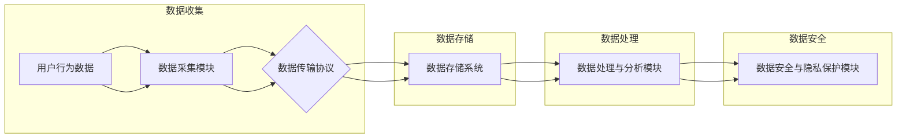
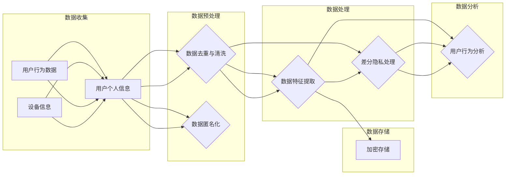
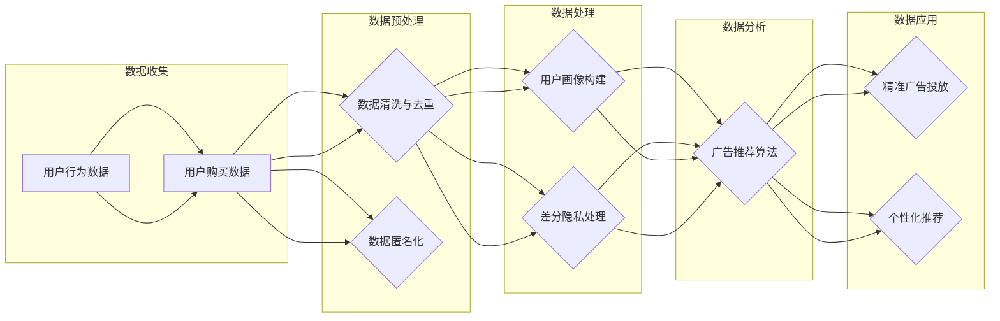

                 

# 社交平台的数据收集与利用：如何保护用户隐私？

> **关键词**：社交平台、数据收集、用户隐私、隐私保护、数据利用、算法、加密、匿名化、同态加密、差分隐私

> **摘要**：本文深入探讨了社交平台在数据收集与利用过程中的关键挑战，特别是用户隐私保护的问题。通过分析社交平台数据收集的方法与手段，本文探讨了数据收集与利用的核心概念、联系及架构。此外，本文还介绍了保护用户隐私的法律、政策和技术实现，并结合实际案例探讨了如何在实际操作中实现用户隐私保护。本文旨在为读者提供一个全面、深入且具有实践指导意义的数据隐私保护指南。

## 《社交平台的数据收集与利用：如何保护用户隐私？》目录大纲

### 第一部分：引言与概述

#### 第1章：社交平台的崛起与数据收集利用的挑战  
1.1 社交平台的现状与用户需求  
1.2 数据收集利用的重要性和潜在风险  
1.3 用户隐私保护的重要性

#### 第2章：社交平台数据收集的方法与手段  
2.1 用户行为数据的收集  
2.2 用户个人信息的数据收集  
2.3 数据收集中的法律与伦理问题

### 第二部分：数据收集与利用的核心概念与联系

#### 第3章：社交平台数据收集与利用的架构  
3.1 数据收集架构的构成  
3.2 数据处理与存储架构  
3.3 Mermaid流程图：数据收集与处理流程

#### 第4章：数据收集与利用的核心算法原理  
4.1 用户行为分析算法  
4.2 用户隐私保护算法

#### 第5章：数据收集与利用的数学模型与公式

#### 第6章：数据收集与利用的实践案例

### 第三部分：如何保护用户隐私？

#### 第7章：保护用户隐私的法律与政策  
7.1 国际隐私保护法律与政策  
7.2 中国隐私保护法律与政策  
7.3 企业隐私保护合规性评估

#### 第8章：隐私保护的实现与技术  
8.1 加密技术  
8.2 匿名化技术  
8.3 同态加密技术  
8.4 差分隐私技术

#### 第9章：构建隐私保护的数据生态系统

#### 第10章：用户隐私保护的实践与未来

### 附录

#### 附录A：常用隐私保护技术详解  
A.1 同态加密技术原理与应用  
A.2 差分隐私算法案例解析  
A.3 匿名化数据分享机制

#### 附录B：隐私保护工具与资源

## 第一部分：引言与概述

### 第1章：社交平台的崛起与数据收集利用的挑战

#### 1.1 社交平台的现状与用户需求

社交平台作为一种新兴的互联网应用，已经深刻地改变了人们的社交方式和生活习惯。目前，全球范围内的社交平台用户数量已经达到了数十亿，其中最受欢迎的社交平台包括Facebook、Twitter、Instagram、微信、QQ等。这些社交平台为用户提供了丰富的社交功能，如即时通讯、朋友圈分享、动态发布、好友互动等，极大地满足了用户的社交需求。

用户在社交平台上的活跃度很高，他们频繁地发布个人信息、状态更新、照片和视频等。这些数据不仅反映了用户的生活、兴趣和社交网络，还蕴含了大量的潜在价值。因此，社交平台公司高度重视数据收集与利用，通过分析用户数据来提升用户体验、实现精准营销和个性化推荐等。

#### 1.2 数据收集利用的重要性和潜在风险

数据收集利用对于社交平台具有重要意义。首先，通过收集用户数据，社交平台能够深入了解用户的需求和偏好，从而提供更加个性化的服务。例如，基于用户的浏览记录和兴趣爱好，社交平台可以推荐相关的朋友、内容或广告，提高用户的粘性和满意度。

其次，数据收集利用有助于社交平台实现精准营销。通过对用户数据的分析，广告主可以了解目标受众的特征和行为习惯，从而投放更加精准的广告，提高广告效果和转化率。

然而，数据收集利用也带来了潜在的隐私风险。用户数据包含了大量的个人信息，如姓名、年龄、性别、地理位置、兴趣爱好等。如果这些数据被未经授权的第三方获取或滥用，可能导致用户的隐私泄露、身份盗用等问题。此外，数据收集利用过程中的不当操作也可能侵犯用户的隐私权益，引发法律纠纷和社会信任危机。

#### 1.3 用户隐私保护的重要性

用户隐私保护是社交平台发展过程中必须面对的重要问题。保护用户隐私不仅是对用户权益的尊重和维护，也是增强用户信任和忠诚度的关键因素。以下是用户隐私保护的重要性：

1. **遵守法律法规**：全球范围内，许多国家和地区都制定了数据保护法律和隐私政策，要求企业在收集、处理和使用用户数据时遵循一定的规范。保护用户隐私是遵守法律法规的必要条件。

2. **维护用户信任**：用户隐私泄露可能导致用户对社交平台的信任度下降，甚至放弃使用该平台。保护用户隐私有助于维护用户信任，提升平台的竞争力。

3. **保障用户权益**：用户隐私保护是保障用户权益的重要方面。通过合理收集和使用用户数据，企业可以为用户提供更好的服务，同时避免侵犯用户的隐私权益。

4. **降低法律风险**：不当的数据收集和使用可能导致企业面临法律诉讼和巨额罚款。保护用户隐私有助于降低企业的法律风险。

总之，社交平台在数据收集与利用过程中，必须高度重视用户隐私保护，采取有效的措施确保用户数据的合法、合理和安全使用。在接下来的章节中，我们将深入探讨社交平台数据收集的方法与手段，以及数据收集与利用的核心概念、联系和架构。

## 第二部分：数据收集与利用的核心概念与联系

### 第3章：社交平台数据收集与利用的架构

#### 3.1 数据收集架构的构成

社交平台的数据收集架构是确保数据从源头到最终利用过程中高效、安全和合规的关键。数据收集架构通常由以下几个关键组成部分构成：

1. **数据源**：数据源是数据的起点，可以是用户的社交媒体活动、应用程序接口（API）调用、日志文件等。数据源可以分为两大类：主动收集和被动收集。
   - **主动收集**：通过用户的操作行为，如发布动态、评论、点赞等，主动获取用户数据。
   - **被动收集**：通过后台日志、网络分析等手段，被动获取用户数据。

2. **数据采集模块**：数据采集模块负责从数据源中收集数据，并将其传输到数据存储系统中。数据采集模块通常包括以下功能：
   - **数据采集器**：负责从各种数据源获取数据，如Web爬虫、API调用器、日志收集器等。
   - **数据预处理**：对采集到的数据进行清洗、去重、格式化等预处理操作，以提高数据质量和后续处理的效率。

3. **数据传输和传输协议**：数据采集模块将数据传输到数据存储系统，通常使用以下传输协议：
   - **HTTP/HTTPS**：用于传输结构化数据，如JSON、XML等。
   - **Flume、Kafka**：用于传输大规模非结构化或半结构化数据。

4. **数据存储系统**：数据存储系统负责存储和缓存收集到的数据，以便后续的数据处理和分析。常用的数据存储系统包括：
   - **关系型数据库**：如MySQL、PostgreSQL等，适用于存储结构化数据。
   - **NoSQL数据库**：如MongoDB、Cassandra等，适用于存储大规模非结构化或半结构化数据。
   - **数据仓库**：如Amazon Redshift、Google BigQuery等，用于大规模数据存储和查询。

5. **数据处理与分析模块**：数据处理与分析模块负责对存储在数据存储系统中的数据进行处理和分析，以提取有用的信息。该模块通常包括以下功能：
   - **ETL（Extract, Transform, Load）**：用于数据提取、转换和加载，将数据从源系统迁移到目标系统。
   - **数据清洗**：用于去除重复数据、纠正错误数据等，确保数据质量。
   - **数据挖掘与机器学习**：用于分析用户行为、预测用户需求、发现潜在模式等。

6. **数据安全与隐私保护模块**：数据安全与隐私保护模块负责确保数据在收集、存储和处理过程中的安全性，并防止数据泄露和滥用。该模块通常包括以下功能：
   - **加密技术**：用于保护数据的机密性，如对称加密、非对称加密等。
   - **访问控制**：用于限制对数据的访问权限，确保只有授权用户可以访问敏感数据。
   - **隐私保护算法**：用于在数据处理过程中保护用户隐私，如匿名化、差分隐私等。

#### 3.2 数据处理与存储架构

社交平台的数据处理与存储架构是一个复杂且高度分布式系统，其核心目标是确保数据的高效、安全存储和快速访问。以下是一个典型的数据处理与存储架构：

1. **数据分层存储**：数据分层存储是将数据根据其重要性和访问频率划分为不同的层级进行存储。常用的分层策略包括：
   - **热数据存储**：用于存储经常访问的数据，如实时数据分析、用户画像等。通常采用高速存储设备，如SSD或内存。
   - **温数据存储**：用于存储偶尔访问的数据，如历史数据分析、用户行为日志等。通常采用低成本、高容量存储设备，如HDD或分布式文件系统。
   - **冷数据存储**：用于存储很少访问或长期存档的数据，如备份数据、归档数据等。通常采用低成本、高容量存储设备，如云存储服务。

2. **分布式存储系统**：分布式存储系统用于存储和检索大规模数据，通过将数据分散存储在多个节点上，提高数据的可靠性和扩展性。常用的分布式存储系统包括：
   - **Hadoop HDFS**：用于存储大规模数据，提供高吞吐量的数据存储和访问能力。
   - **Cassandra**：用于存储高可用性、高性能的非结构化数据。
   - **Google File System (GFS)**：用于存储和分析大规模数据，提供高效的数据存储和访问能力。

3. **数据处理平台**：数据处理平台用于对存储在分布式存储系统中的数据进行处理和分析。常用的数据处理平台包括：
   - **Apache Spark**：用于大规模数据处理和分析，提供高性能、可扩展的分布式计算框架。
   - **Apache Flink**：用于实时数据流处理和分析，提供低延迟、高吞吐量的数据处理能力。
   - **Google BigQuery**：用于大规模数据存储和查询，提供快速、灵活的数据分析和挖掘能力。

#### 3.3 Mermaid流程图：数据收集与处理流程

为了更好地理解社交平台的数据收集与处理流程，我们使用Mermaid图来描述数据从采集到处理的整个过程。以下是一个简单的Mermaid流程图示例：



该流程图描述了社交平台的数据从用户行为数据开始，经过数据采集、传输、存储、处理和分析，最后由数据安全与隐私保护模块进行保障。通过这样的架构设计，社交平台可以高效地收集、处理和利用用户数据，同时确保数据的安全和隐私。

在接下来的章节中，我们将进一步探讨数据收集与利用的核心算法原理，包括用户行为分析算法和用户隐私保护算法，以及数据收集与利用中的数学模型与公式。

### 第4章：数据收集与利用的核心算法原理

#### 4.1 用户行为分析算法

用户行为分析算法是社交平台数据收集与利用的重要组成部分，它通过对用户在平台上的行为数据进行分析，揭示用户的兴趣、需求和行为模式。以下是一些关键步骤和算法：

##### 4.1.1 预处理步骤

在分析用户行为数据之前，通常需要进行预处理步骤，以提高数据质量和分析效果。预处理步骤包括以下内容：

- **数据清洗**：去除数据中的噪声和错误，如缺失值、异常值、重复数据等。可以使用填充、删除或替换等方法进行处理。
- **数据格式化**：将不同来源和格式的数据统一转换为标准格式，如时间戳、分类标签等，以便后续分析。
- **特征工程**：提取有用的特征，如用户年龄、性别、地理位置、兴趣爱好等。特征工程是用户行为分析的关键，合理的特征选择和构建能够显著提高分析效果。

##### 4.1.2 特征提取算法

特征提取算法用于从原始数据中提取出具有代表性的特征，以便用于后续的分析和建模。以下是一些常用的特征提取算法：

- **TF-IDF（Term Frequency-Inverse Document Frequency）**：用于计算文本数据的特征权重，反映了某个词语在文档中的重要程度。
- **词嵌入（Word Embedding）**：将文本数据转换为向量表示，用于捕获词语的语义信息。常用的词嵌入方法包括Word2Vec、GloVe等。
- **用户行为序列模型**：用于提取用户行为序列的特征，如LSTM（Long Short-Term Memory）、GRU（Gated Recurrent Unit）等循环神经网络。
- **协同过滤（Collaborative Filtering）**：用于预测用户对未知项目的评分或偏好。协同过滤分为基于用户的协同过滤和基于项目的协同过滤。

##### 4.1.3 模型选择与训练

在提取出用户行为特征后，需要选择合适的机器学习模型进行训练和预测。以下是一些常用的模型选择与训练方法：

- **线性回归（Linear Regression）**：用于预测用户的连续行为，如购买概率、浏览时长等。
- **逻辑回归（Logistic Regression）**：用于预测用户的分类行为，如是否喜欢某个内容、是否参与活动等。
- **决策树（Decision Tree）**：用于构建分类或回归模型，简单易懂，易于解释。
- **随机森林（Random Forest）**：基于决策树的集成方法，提高模型的预测性能和鲁棒性。
- **支持向量机（Support Vector Machine, SVM）**：用于分类问题，通过找到最佳超平面来实现分类。
- **神经网络（Neural Networks）**：用于复杂非线性关系的预测，通过多层感知器（Multilayer Perceptron, MLP）实现。

在模型选择与训练过程中，需要使用交叉验证（Cross-Validation）方法来评估模型的性能，避免过拟合和欠拟合。常用的交叉验证方法包括K折交叉验证和留一交叉验证。

##### 4.1.4 模型评估与优化

在模型训练完成后，需要评估模型的性能，并进行优化。以下是一些常用的评估指标和优化方法：

- **准确率（Accuracy）**：用于分类问题，表示模型正确预测的比例。
- **召回率（Recall）**：表示模型能够召回实际正例的比例。
- **精确率（Precision）**：表示模型预测为正例的实际正例比例。
- **F1分数（F1 Score）**：综合考虑精确率和召回率，用于综合评估模型的性能。
- **ROC曲线（Receiver Operating Characteristic Curve）**：用于评估分类模型的性能，曲线下面积（AUC）越大，表示模型越好。

为了优化模型性能，可以采用以下方法：

- **超参数调整（Hyperparameter Tuning）**：通过调整模型的超参数，如学习率、隐藏层节点数、正则化参数等，来提高模型性能。
- **模型集成（Model Ensemble）**：将多个模型集成在一起，提高模型的预测性能和鲁棒性。常用的集成方法包括Bagging、Boosting和Stacking等。

#### 4.2 用户隐私保护算法

用户隐私保护是社交平台数据收集与利用过程中不可忽视的重要环节。隐私保护算法旨在确保用户数据在收集、存储和处理过程中不会被未经授权的第三方访问或滥用。以下是一些常用的隐私保护算法：

##### 4.2.1 隐私保护算法的基本概念

隐私保护算法主要分为以下几类：

- **匿名化（Anonymization）**：通过将敏感信息替换为匿名标识，如ID、密文等，来保护用户隐私。常见的匿名化方法包括K-匿名、l-diversity和t-closeness等。
- **差分隐私（Differential Privacy）**：通过在查询结果中加入随机噪声，来确保单个用户的数据无法被推断出来。常见的差分隐私机制包括拉普拉斯机制、指数机制等。
- **加密技术**：通过加密算法将敏感数据转换为密文，确保只有授权用户可以解密和访问数据。常见的加密技术包括对称加密、非对称加密、同态加密等。
- **访问控制**：通过设置访问权限和角色权限，限制对数据的访问，确保只有授权用户可以访问敏感数据。

##### 4.2.2 加密与匿名化技术

加密与匿名化技术是用户隐私保护的重要手段。以下是一些常用的加密和匿名化技术：

- **对称加密**：使用相同的密钥进行加密和解密，如AES（Advanced Encryption Standard）。
- **非对称加密**：使用一对公钥和私钥进行加密和解密，如RSA（Rivest-Shamir-Adleman）。
- **同态加密**：允许在密文上进行计算，并得到与明文计算相同的结果，如全同态加密、部分同态加密。
- **匿名化**：通过将敏感信息替换为匿名标识，如ID、密文等，来保护用户隐私。常见的匿名化方法包括K-匿名、l-diversity和t-closeness等。

##### 4.2.3 伪代码示例

以下是一个简单的差分隐私算法的伪代码示例：

```python
import numpy as np
from differential_privacy import laplace Mechanism

def private_query(query, sensitivity):
    """
    执行差分隐私查询，并返回结果。
    
    参数：
    - query：查询函数，用于计算查询结果。
    - sensitivity：查询结果的灵敏度。
    """
    noise = laplace.Mechanism(sensitivity)
    result = query()
    private_result = result + noise.add_noise()
    return private_result
```

在这个伪代码中，`private_query`函数接受一个查询函数`query`和一个灵敏度参数`sensitivity`，然后使用拉普拉斯机制生成随机噪声，并加到查询结果上，以实现差分隐私保护。

通过上述算法原理和伪代码示例，我们可以更好地理解社交平台数据收集与利用过程中的核心算法原理。在接下来的章节中，我们将进一步探讨数据收集与利用的数学模型与公式，以及实际项目中的数据收集与利用实践案例。

### 第5章：数据收集与利用的数学模型与公式

在社交平台的数据收集与利用过程中，数学模型和公式起到了至关重要的作用。这些模型和公式不仅帮助我们理解和描述用户行为，还为我们提供了有效的工具来预测和优化数据利用的效果。在本章中，我们将详细介绍一些关键数学模型和公式，并通过具体的示例来阐明它们的实际应用。

#### 5.1 用户行为预测的数学模型

用户行为预测是社交平台数据收集与利用的一个重要目标。以下是一个简单的线性回归模型，用于预测用户对某个内容的点击概率。

$$
\text{预测模型} = w_1 \times \text{用户特征}_1 + w_2 \times \text{用户特征}_2 + ... + w_n \times \text{用户特征}_n + b
$$

其中，\( w_1, w_2, ..., w_n \)是权重参数，\( \text{用户特征}_1, \text{用户特征}_2, ..., \text{用户特征}_n \)是用户行为特征（如年龄、性别、地理位置、兴趣爱好等），\( b \)是偏置项。

##### 示例

假设我们要预测用户对一篇新闻文章的点击概率，我们可以使用以下特征：

- \( \text{用户特征}_1 \)：用户年龄
- \( \text{用户特征}_2 \)：用户性别（男/女）
- \( \text{用户特征}_3 \)：用户地理位置

给定一个训练数据集，我们可以通过最小化损失函数（如均方误差）来训练线性回归模型，得到最佳的权重参数。训练过程如下：

1. **数据预处理**：将原始数据标准化或归一化，以便模型训练过程中权重参数的优化。
2. **模型训练**：使用梯度下降或其他优化算法，最小化损失函数，更新权重参数。
3. **模型评估**：使用交叉验证或测试集来评估模型的预测性能。

通过上述步骤，我们最终得到一个用户行为预测的数学模型，可以用于预测用户对未知内容的点击概率。

#### 5.2 用户隐私保护的数学原理

用户隐私保护是数据收集与利用过程中不可忽视的重要方面。差分隐私是一种广泛使用的隐私保护机制，通过在查询结果中添加随机噪声来确保单个用户的数据不会泄露。

##### 5.2.1 差分隐私算法的基本概念

差分隐私算法的核心思想是，对于任意两个相邻的数据集\(D_1\)和\(D_2\)（即\(D_1\)和\(D_2\)仅有一个数据点的差异），算法对这两个数据集的输出结果不会有显著差异。具体来说，差分隐私可以通过以下公式来衡量：

$$
\mathbb{E}[\hat{f}(D) - \hat{f}(D + \Delta)] \leq \epsilon
$$

其中，\(\hat{f}(D)\)是算法对数据集\(D\)的输出，\(\Delta\)是一个数据点，\(\epsilon\)是一个小的正数，称为隐私预算。这个公式表明，算法对相邻数据集的输出差异小于\(\epsilon\)，从而实现了差分隐私。

##### 5.2.2 差分隐私机制

差分隐私机制包括以下几种常用的方法：

- **拉普拉斯机制**：在输出结果中添加拉普拉斯分布的随机噪声。伪代码如下：

  ```python
  import numpy as np

  def laplace_noisy_output(output, sensitivity, epsilon):
      noise = np.random.laplace(output, scale=epsilon / sensitivity)
      return output + noise
  ```

  其中，\(sensitivity\)是输出结果的灵敏度，\(\epsilon\)是隐私预算。

- **指数机制**：在输出结果中添加指数分布的随机噪声。伪代码如下：

  ```python
  import numpy as np

  def exponential_noisy_output(output, sensitivity, epsilon):
      noise = np.random.exponential(sensitivity / epsilon)
      return output + noise
  ```

  与拉普拉斯机制类似，这里\(sensitivity\)是输出结果的灵敏度，\(\epsilon\)是隐私预算。

##### 5.2.3 差分隐私算法示例

以下是一个简单的差分隐私算法的示例，用于计算用户群体的平均年龄：

```python
import numpy as np

def private_average_age(ages, epsilon):
    """
    计算用户群体的平均年龄，实现差分隐私保护。
    
    参数：
    - ages：用户年龄列表
    - epsilon：隐私预算
    """
    total_age = sum(ages)
    sensitivity = abs(total_age - sum([age for age in ages if age == max(ages)]))
    noisy_average_age = laplace_noisy_output(total_age / len(ages), sensitivity, epsilon)
    return noisy_average_age
```

在这个示例中，我们首先计算用户群体的总年龄，然后计算灵敏度（即最大年龄与总年龄的差值）。最后，使用拉普拉斯机制在平均年龄上添加随机噪声，以实现差分隐私保护。

#### 5.3 模型评估与优化

在数据收集与利用过程中，模型评估与优化是确保模型性能的重要环节。以下是一些常用的评估指标和优化方法：

##### 5.3.1 评估指标

- **准确率（Accuracy）**：表示模型正确预测的比例。
- **召回率（Recall）**：表示模型能够召回实际正例的比例。
- **精确率（Precision）**：表示模型预测为正例的实际正例比例。
- **F1分数（F1 Score）**：综合考虑精确率和召回率，用于综合评估模型的性能。
- **ROC曲线（Receiver Operating Characteristic Curve）**：用于评估分类模型的性能，曲线下面积（AUC）越大，表示模型越好。

##### 5.3.2 优化方法

- **超参数调整（Hyperparameter Tuning）**：通过调整模型的超参数（如学习率、隐藏层节点数、正则化参数等），来提高模型性能。
- **模型集成（Model Ensemble）**：将多个模型集成在一起，提高模型的预测性能和鲁棒性。常用的集成方法包括Bagging、Boosting和Stacking等。

通过上述数学模型和公式的介绍，我们可以更好地理解社交平台数据收集与利用过程中的关键概念和技术。在接下来的章节中，我们将通过实际案例来展示如何将这些概念和技术应用于实践，进一步探讨数据收集与利用的实践案例。

### 第6章：数据收集与利用的实践案例

为了更好地理解社交平台数据收集与利用的实际操作，本章节将通过两个具体的案例来展示数据收集、处理、分析和用户隐私保护的全过程。这两个案例分别涉及社交平台的数据收集与用户隐私保护，以及利用社交数据实现精准营销。

#### 6.1 案例一：某社交平台的数据收集与用户隐私保护

##### 6.1.1 案例背景

某大型社交平台A拥有数亿活跃用户，为了提升用户体验和实现精准营销，平台A决定对用户数据进行全面收集与分析。然而，用户隐私保护是平台A必须面对的一个重要挑战。平台A希望通过有效的数据收集和隐私保护措施，确保用户数据的安全和合规使用。

##### 6.1.2 数据收集与处理

1. **数据收集**：
   - **用户行为数据**：平台A通过用户的互动行为（如点赞、评论、分享等）收集用户行为数据。这些数据包括用户的动态内容、互动对象、互动时间等。
   - **用户个人信息**：平台A收集用户的注册信息（如用户名、邮箱、性别、年龄、地理位置等）。
   - **设备信息**：平台A收集用户的设备信息（如操作系统版本、设备型号等），以便优化用户体验。

2. **数据预处理**：
   - **去重与清洗**：对于收集到的用户行为数据和设备信息，平台A进行去重和清洗，确保数据的准确性和一致性。
   - **特征工程**：平台A对用户行为数据进行特征提取，如用户活跃度、互动频率等。对于用户个人信息，平台A进行数据标准化和归一化，以便后续分析。

##### 6.1.3 用户隐私保护策略

1. **数据匿名化**：
   - 平台A对用户行为数据中的敏感信息（如用户名、邮箱等）进行匿名化处理，使用匿名标识替换敏感信息，以保护用户隐私。

2. **加密技术**：
   - 平台A使用对称加密和非对称加密技术对存储在数据库中的用户数据（如个人信息、设备信息等）进行加密。对称加密用于保护数据的机密性，非对称加密用于实现数据的安全传输。

3. **访问控制**：
   - 平台A设置严格的访问控制策略，限制对敏感数据的访问权限。只有经过授权的用户和系统可以访问特定数据，确保敏感数据不被未经授权的第三方访问。

4. **差分隐私**：
   - 平台A在数据处理和分析过程中，使用差分隐私机制来保护用户隐私。例如，在计算用户群体的平均年龄时，平台A会添加随机噪声，以防止单个用户的数据被推断出来。

##### 6.1.4 数据收集与处理流程

以下是平台A的数据收集与处理流程的Mermaid流程图：



#### 6.2 案例二：利用社交数据实现精准营销

##### 6.2.1 营销目标

某电商公司B希望通过分析社交平台的数据，实现精准营销，提升用户购买率和销售额。具体目标包括：

- **用户画像构建**：通过分析用户在社交平台上的行为和兴趣，构建详细的用户画像。
- **精准广告投放**：根据用户画像，为潜在客户推送相关广告，提升广告效果。
- **个性化推荐**：根据用户行为和兴趣，为用户推荐合适的产品或服务。

##### 6.2.2 数据收集与利用

1. **数据收集**：
   - **用户行为数据**：电商公司B通过第三方数据接口收集用户在社交平台上的行为数据，如点赞、评论、分享等。
   - **用户购买数据**：电商公司B收集用户的购买记录和订单信息。

2. **数据处理**：
   - **数据预处理**：对收集到的用户行为数据进行清洗、去重和格式化，确保数据质量。
   - **用户画像构建**：通过对用户行为数据和购买数据的分析，构建用户的兴趣标签和购买偏好。

3. **精准广告投放**：
   - **广告推荐算法**：电商公司B使用协同过滤算法和内容推荐算法，为用户推荐相关的广告。
   - **广告投放策略**：根据用户画像和广告效果，调整广告投放策略，提高广告的精准度和投放效率。

4. **个性化推荐**：
   - **推荐算法**：电商公司B使用基于内容的推荐算法和协同过滤算法，为用户推荐合适的产品或服务。
   - **推荐系统优化**：通过不断优化推荐算法和用户画像，提升推荐系统的准确性和用户体验。

##### 6.2.3 隐私保护措施

1. **数据匿名化**：
   - 电商公司B对收集到的用户行为数据进行匿名化处理，使用匿名标识替换敏感信息，以保护用户隐私。

2. **加密技术**：
   - 电商公司B使用对称加密和非对称加密技术，对存储在数据库中的用户数据进行加密，确保数据的机密性。

3. **访问控制**：
   - 电商公司B设置严格的访问控制策略，限制对敏感数据的访问权限，确保敏感数据不被未经授权的第三方访问。

4. **差分隐私**：
   - 电商公司B在数据处理和分析过程中，使用差分隐私机制来保护用户隐私。例如，在计算用户群体的平均购买频率时，会添加随机噪声，以防止单个用户的数据被推断出来。

##### 6.2.4 数据收集与处理流程

以下是电商公司B的数据收集与处理流程的Mermaid流程图：



通过上述两个实际案例，我们可以看到社交平台数据收集与利用的实践过程，包括数据收集、处理、分析和用户隐私保护。这些实践案例不仅展示了数据收集与利用的方法和技术，还强调了用户隐私保护的重要性。在接下来的章节中，我们将进一步探讨如何通过法律、政策和技术的手段，全面保护用户隐私。

### 第三部分：如何保护用户隐私？

#### 第7章：保护用户隐私的法律与政策

在全球化数字经济的背景下，保护用户隐私已成为各国立法者和企业共同关注的焦点。各国纷纷出台了数据保护法律和政策，以规范企业的数据收集、处理和利用行为，确保用户隐私得到有效保护。以下将分别介绍国际和中国隐私保护法律与政策。

##### 7.1 国际隐私保护法律与政策

1. **欧盟通用数据保护条例（GDPR）**

   GDPR是欧盟于2018年5月25日正式实施的全面数据保护法律，旨在强化个人数据保护，规范企业在欧盟境内处理个人数据的行为。GDPR的核心要求包括：

   - **合法性、公正性和透明度**：企业必须在合法、公正和透明的原则下收集和使用个人数据。
   - **数据主体的权利**：用户有权访问、修改、删除自己的个人数据，以及限制数据的使用。
   - **数据保护官（DPO）**：企业必须指定数据保护官，负责监督和执行数据保护措施。
   - **数据泄露通知**：企业必须在发现数据泄露后72小时内通知监管机构和受影响的用户。

2. **美国加州消费者隐私法案（CCPA）**

   CCPA是2020年1月1日生效的加州消费者隐私法案，旨在赋予加州居民对其个人信息的更多控制权。CCPA的主要要求包括：

   - **知情权**：企业在收集和使用消费者个人信息时，必须提供明确的隐私政策。
   - **访问权**：消费者有权请求访问其个人信息，并了解个人信息的使用情况。
   - **删除权**：消费者有权要求企业删除其个人信息。
   - **不可歧视**：企业在处理消费者个人信息时，不能因为用户行使隐私权利而对其进行歧视。

3. **其他国家和地区的隐私保护法律**

   - **加拿大隐私法（PIPEDA）**：加拿大隐私法旨在规范企业跨省收集、使用和披露个人信息的活动。
   - **巴西通用数据保护法律（LGPD）**：巴西于2020年生效的通用数据保护法律，旨在保护个人数据的隐私和安全。
   - **澳大利亚隐私法**：澳大利亚隐私法规定了个人数据的处理和保护要求，并设立了隐私专员负责监督和执行。

##### 7.2 中国隐私保护法律与政策

1. **个人信息保护法（PIPL）**

   中国个人信息保护法于2021年11月1日正式实施，是我国首部全面规范个人信息保护的基本法律。PIPL的主要规定包括：

   - **合法性原则**：企业处理个人信息必须遵循合法、正当、必要的原则，并公开处理规则。
   - **同意原则**：企业收集和使用个人信息时，必须取得个人同意，并明确告知个人信息的收集、处理和使用目的。
   - **最小化原则**：企业收集个人信息时，应当限于实现处理目的的最小范围。
   - **数据安全**：企业必须采取必要措施确保个人信息的安全，防止数据泄露、篡改和滥用。
   - **用户权益**：用户有权访问、更正、删除个人信息，并有权投诉和提起诉讼。

2. **网络安全法**

   中国网络安全法于2017年6月1日正式实施，旨在保障网络安全，维护国家安全、社会公共利益和公民、法人和其他组织的合法权益。网络安全法对个人信息保护提出了明确要求，包括：

   - **数据本地化**：涉及国家安全、重要数据的信息应当在境内存储和处理。
   - **网络信息安全**：网络运营者必须采取技术和管理措施，保障网络信息安全，防止个人信息泄露、损毁和篡改。
   - **用户知情权**：网络运营者必须公开网络信息服务的内容、范围和方式，并告知用户个人信息收集、存储、处理、使用的情况。

##### 7.3 企业隐私保护合规性评估

为了确保企业遵守隐私保护法律和政策，进行隐私保护合规性评估是必要的。以下是一些关键步骤和评估方法：

1. **合规性评估流程**

   - **评估准备**：确定评估目标和范围，收集相关政策和法规，准备评估工具和方法。
   - **信息收集**：通过文档审查、访谈、问卷调查等方式，收集企业的隐私保护政策和实践信息。
   - **评估分析**：对比企业的隐私保护实践与相关政策和法规要求，识别合规性和非合规性问题。
   - **评估报告**：编写评估报告，包括评估发现、问题分析、改进建议和实施计划。

2. **常见评估方法**

   - **自我评估**：企业自行评估隐私保护措施的合规性，制定自我评估报告。
   - **外部审计**：第三方专业机构对企业隐私保护措施进行独立审计，出具审计报告。
   - **风险评估**：评估企业隐私保护措施的风险，包括数据泄露、滥用等风险。

3. **改进措施**

   - **政策完善**：根据评估结果，完善企业的隐私保护政策，确保与法律和政策要求一致。
   - **培训与意识提升**：对员工进行隐私保护培训，提高员工的隐私保护意识和能力。
   - **技术改进**：采用加密、匿名化等技术手段，加强数据保护。
   - **监督与改进**：建立长效的隐私保护监督机制，持续改进隐私保护措施。

通过上述法律与政策的介绍和合规性评估方法的探讨，我们可以看到保护用户隐私是一项系统性工程，需要法律法规的支持和企业的共同努力。在下一章中，我们将深入探讨隐私保护的实现与技术，包括加密、匿名化、同态加密和差分隐私等技术，以及如何构建隐私保护的数据生态系统。

#### 第8章：隐私保护的实现与技术

在保护用户隐私的过程中，技术手段起到了至关重要的作用。以下将详细探讨几种常见的隐私保护技术，包括加密技术、匿名化技术、同态加密技术和差分隐私技术，以及它们在实际应用中的具体实现。

##### 8.1 加密技术

加密技术是通过将数据转换为无法被未授权方解读的形式，从而保护数据隐私的一种技术。加密技术可以分为对称加密和非对称加密两种。

1. **对称加密**

   对称加密使用相同的密钥进行加密和解密。常见的对称加密算法有：

   - **AES（Advanced Encryption Standard）**：一种高速加密标准，支持128位、192位和256位密钥。
   - **DES（Data Encryption Standard）**：一种基于56位密钥的加密算法，已被认为不够安全。

   **实现示例**：

   ```python
   from Crypto.Cipher import AES
   
   key = b'mysecretkey123'
   cipher = AES.new(key, AES.MODE_CBC)
   ciphertext = cipher.encrypt('The quick brown fox jumps over the lazy dog')
   ```

2. **非对称加密**

   非对称加密使用一对公钥和私钥进行加密和解密。公钥用于加密，私钥用于解密。常见的非对称加密算法有：

   - **RSA（Rivest-Shamir-Adleman）**：基于大整数分解的加密算法。
   - **ECC（Elliptic Curve Cryptography）**：基于椭圆曲线离散对数的加密算法。

   **实现示例**：

   ```python
   from Crypto.PublicKey import RSA
   
   key = RSA.generate(2048)
   private_key = key.export_key()
   public_key = key.publickey().export_key()
   
   message = b'This is a secret message'
   encrypted_message = public_key.encrypt(message, 32)
   ```

##### 8.2 匿名化技术

匿名化技术通过将敏感信息替换为匿名标识，从而保护个人隐私。常见的匿名化方法有：

1. **K-匿名**

   K-匿名是指在一个数据集中，任意一个个体的数据不能与K个其他个体的数据区分开。K-匿名通过限制数据集中个体的唯一性，减少隐私泄露的风险。

   **实现示例**：

   ```python
   import random
   
   data = ['Alice', 'Bob', 'Charlie', 'Dave', 'Eve']
   k = 2
   k_anonymous_data = [random.choice(data) for _ in range(len(data))]
   ```

2. **l-diversity**

   l-diversity要求在数据集中，任意一个个体都与至少l个其他个体具有相同的属性。l-diversity可以增强K-匿名的数据集的隐私保护能力。

3. **t-closeness**

   t-closeness要求在数据集中，任意两个相邻个体在属性上的分布差异不能超过t%。t-closeness通过限制个体之间的分布差异，进一步提高隐私保护水平。

##### 8.3 同态加密技术

同态加密允许在密文上直接进行计算，而无需解密，从而在数据处理和计算过程中保护数据隐私。同态加密可以分为全同态加密和部分同态加密。

1. **全同态加密**

   全同态加密可以在密文上进行任意类型的计算，包括加法、减法、乘法等。全同态加密的一个典型例子是GCMA（Gentry-Craig-Lysyanskaya-Merritt）算法。

   **实现示例**：

   ```python
   from homomorphicEncryptionLib import HE
   
   he = HE()
   ciphertext = he.encrypt(5)
   result = he.compute(ciphertext, 2, "+")  # 密文上的加法运算
   decrypted_result = he.decrypt(result)
   ```

2. **部分同态加密**

   部同态加密只允许在密文上进行特定类型的计算，如加法或乘法，不能同时支持所有类型的计算。部分同态加密的一个典型例子是RSA加密算法。

##### 8.4 差分隐私技术

差分隐私通过在查询结果中添加随机噪声，确保单个用户的数据无法被推断出来。差分隐私可以分为拉普拉斯机制和指数机制。

1. **拉普拉斯机制**

   拉普拉斯机制在查询结果上添加拉普拉斯分布的随机噪声。拉普拉斯机制的一个优点是实现简单，适用于大多数查询。

   **实现示例**：

   ```python
   import numpy as np
   
   def laplace Mechanism(sensitivity, epsilon):
       return np.random.laplace(0, sensitivity / epsilon)
   ```

2. **指数机制**

   指数机制在查询结果上添加指数分布的随机噪声。指数机制的一个优点是适应性强，适用于不同类型的查询。

   **实现示例**：

   ```python
   import numpy as np
   
   def exponential Mechanism(sensitivity, epsilon):
       return np.random.exponential(sensitivity / epsilon)
   ```

##### 8.5 实际应用中的隐私保护实现

在实际应用中，隐私保护技术通常需要结合多种方法，以满足不同的隐私保护需求。以下是一个简单的隐私保护实现示例：

1. **数据匿名化**：使用K-匿名和l-diversity对原始数据集进行匿名化处理。
2. **数据加密**：使用AES加密算法对敏感数据字段进行加密。
3. **差分隐私**：使用拉普拉斯机制对聚合查询结果添加随机噪声。

```python
from privacyTools import Anonymizer, Encrypter, DifferentialPrivacy

data = [['Alice', 25, 'USA'], ['Bob', 30, 'USA'], ['Charlie', 35, 'USA']]
anonymizer = Anonymizer(k=2, l=1)
encrypted_data = Encrypter AES(data)
noisy_data = DifferentialPrivacy(laplace Mechanism, sensitivity=1)(encrypted_data)

print(noisy_data)
```

通过上述隐私保护技术的介绍和实际应用示例，我们可以看到如何在社交平台的数据收集与利用过程中实现用户隐私保护。在下一章中，我们将探讨如何构建隐私保护的数据生态系统，以实现数据的高效利用和隐私保护的双重目标。

### 第9章：构建隐私保护的数据生态系统

构建隐私保护的数据生态系统是社交平台在数据收集与利用过程中实现数据安全与用户隐私保护的关键步骤。一个完善的数据生态系统不仅能够确保数据的安全存储和有效利用，还能够为用户提供透明的隐私保护机制。以下将详细探讨隐私保护的数据治理、系统设计与开发以及数据分析与应用。

#### 9.1 隐私保护的数据治理

数据治理是指通过制定策略、标准和流程来确保数据的质量、安全性和合规性。在隐私保护的数据治理中，核心目标包括：

1. **数据质量管理**：确保数据的准确性、完整性、一致性和及时性，提高数据的价值和可信度。
2. **数据安全策略**：制定数据安全策略，包括数据加密、访问控制、备份和恢复等，确保数据在存储、传输和处理过程中的安全性。
3. **数据合规性**：确保数据收集、处理和利用遵循相关法律法规和政策要求，如GDPR、CCPA和PIPL等。
4. **数据隐私保护**：制定隐私保护策略，包括数据匿名化、差分隐私、同态加密等，确保用户隐私得到有效保护。

实现数据治理的关键步骤包括：

1. **制定数据策略**：明确数据治理的目标、范围、责任和流程，确保数据治理活动的有序进行。
2. **数据分类与标识**：根据数据的重要性和敏感性对数据进行分类，并标识敏感数据字段，以便采取相应的保护措施。
3. **数据隐私影响评估（DPIA）**：在数据项目启动前进行DPIA，评估隐私风险，制定相应的隐私保护措施。
4. **数据安全与合规审计**：定期进行数据安全与合规审计，确保数据治理策略的有效执行。

#### 9.2 隐私保护的系统设计与开发

隐私保护的系统设计与开发是确保社交平台在数据收集与利用过程中实现数据安全和隐私保护的关键。以下是一些关键设计原则和开发步骤：

1. **设计原则**
   - **最小化数据收集**：只收集实现业务功能所需的最少数据，避免不必要的个人信息收集。
   - **数据匿名化**：在设计阶段就考虑数据匿名化，确保个人身份信息不会被泄露。
   - **加密技术**：在数据存储和传输过程中使用加密技术，确保数据的安全性和机密性。
   - **访问控制**：实现严格的访问控制机制，确保只有授权用户可以访问敏感数据。
   - **隐私保护算法**：在设计数据处理和分析算法时，考虑差分隐私、同态加密等技术，确保用户隐私得到保护。

2. **开发步骤**
   - **需求分析**：明确业务需求，确定数据收集、存储、处理和分析的流程，以及所需的功能和技术。
   - **架构设计**：设计系统的架构，包括数据收集、存储、处理和分析模块，以及数据安全与隐私保护机制。
   - **安全编码**：遵循安全编码规范，避免常见的漏洞和风险，如SQL注入、跨站脚本攻击等。
   - **测试与评估**：进行全面的测试和评估，包括功能测试、性能测试和安全测试，确保系统设计符合预期和隐私保护要求。

#### 9.3 隐私保护的数据分析与应用

隐私保护的数据分析与应用是社交平台实现数据价值的重要环节。以下是一些关键技术和应用场景：

1. **用户行为分析**：
   - **特征提取**：使用TF-IDF、词嵌入等技术提取用户行为特征，如兴趣、偏好和社交网络。
   - **机器学习模型**：使用线性回归、逻辑回归、决策树等机器学习模型，预测用户行为和需求。
   - **可视化**：使用数据可视化工具，如图表、地图等，展示用户行为和分析结果。

2. **精准营销**：
   - **用户画像**：基于用户行为和兴趣数据，构建详细的用户画像，用于精准广告投放和个性化推荐。
   - **协同过滤**：使用基于用户和基于项目的协同过滤算法，为用户推荐相关的商品或内容。
   - **广告优化**：根据用户画像和广告效果，优化广告投放策略，提高广告的点击率和转化率。

3. **安全监控**：
   - **异常检测**：使用聚类、分类等机器学习算法，检测数据中的异常行为和异常值，及时发现潜在的安全威胁。
   - **审计日志**：记录和分析系统操作日志，监控用户访问行为和数据处理过程，确保数据安全和合规性。
   - **安全事件响应**：建立安全事件响应机制，及时响应和处理安全事件，降低安全风险。

通过上述隐私保护的数据治理、系统设计与开发以及数据分析与应用，社交平台可以在确保数据安全和用户隐私的前提下，实现数据的高效利用和价值创造。在下一章中，我们将探讨用户隐私保护的现状与未来发展趋势。

### 第10章：用户隐私保护的现状与未来

#### 10.1 用户隐私保护的现状

随着社交平台和数据技术的迅速发展，用户隐私保护问题日益凸显。当前，用户隐私保护的现状可以从以下几个方面进行分析：

1. **法律法规与政策**：全球范围内，各国纷纷出台了数据保护法律和政策，如欧盟的GDPR、美国的CCPA、中国的PIPL等。这些法律法规为用户隐私保护提供了法律基础和指导，但实际执行过程中仍存在差异和挑战。

2. **技术措施**：社交平台普遍采用了多种技术手段来保护用户隐私，包括数据加密、匿名化、差分隐私等。这些技术措施在一定程度上提升了数据的安全性和隐私保护水平，但仍然存在漏洞和不足。

3. **企业自律与合规**：社交平台企业在数据收集、处理和利用过程中，逐渐认识到隐私保护的重要性，并采取了一系列自律措施，如隐私政策公示、用户隐私设置、隐私保护培训等。然而，部分企业仍存在数据滥用、隐私泄露等问题，需要加强自律和监管。

4. **用户隐私意识**：随着隐私保护意识的提升，越来越多的用户开始关注自己的隐私保护问题，并通过隐私设置、注销账户等方式来维护自己的隐私权益。然而，仍有部分用户对隐私保护的重要性认识不足，导致隐私泄露风险。

#### 10.2 隐私保护技术的发展趋势

隐私保护技术是用户隐私保护的重要保障。以下是一些当前和未来的隐私保护技术发展趋势：

1. **全同态加密**：全同态加密允许在密文上进行任意类型的计算，无需解密，为大数据分析和处理提供了隐私保护的新途径。随着算法的改进和性能的提升，全同态加密有望在更多实际应用中得到广泛应用。

2. **联邦学习**：联邦学习是一种分布式机器学习技术，可以在不同节点上进行数据处理和模型训练，同时保持数据本地化和隐私保护。联邦学习有望在医疗、金融、物联网等领域发挥重要作用。

3. **隐私增强技术**：隐私增强技术（PETs）包括匿名化、差分隐私、安全多方计算等，旨在在不牺牲数据价值的前提下，提供更高的隐私保护水平。随着技术的进步和应用的拓展，隐私增强技术将成为数据隐私保护的重要工具。

4. **区块链技术**：区块链技术具有去中心化、不可篡改、透明等特点，可以用于数据存储、访问控制和隐私保护。区块链技术有望在数据共享、身份认证、数字资产等领域发挥重要作用。

5. **智能合约**：智能合约是一种自动执行合同条款的计算机协议，可以用于自动化数据隐私保护和合规性管理。智能合约在数据交易、数据共享等领域具有广泛的应用前景。

#### 10.3 未来隐私保护的发展方向

未来隐私保护的发展方向将聚焦于以下几个方面：

1. **隐私保护法律法规的完善**：随着数据技术的发展和隐私保护需求的提升，未来隐私保护法律法规将不断完善和更新，以应对新的挑战和问题。例如，加强跨国数据流动的监管、明确人工智能和大数据技术的隐私保护要求等。

2. **技术创新与融合**：隐私保护技术将持续发展与创新，同时与其他领域的技术进行融合。例如，结合人工智能、区块链技术，实现更高效、更安全的隐私保护。

3. **隐私保护标准的制定**：制定统一的隐私保护标准和规范，为企业和开发者提供明确的指导，促进隐私保护技术的普及和应用。

4. **用户隐私教育**：提高用户隐私保护意识，通过教育和宣传，帮助用户了解隐私保护的重要性和方法，增强用户自我保护能力。

5. **隐私保护技术的普及**：推动隐私保护技术在社交平台和其他数据密集型行业的普及，实现数据隐私保护与数据价值创造的平衡。

总之，用户隐私保护是一个复杂且长期的过程，需要法律法规、技术创新、企业自律和用户意识的共同努力。通过不断完善隐私保护体系，我们可以为用户创造一个更加安全、透明和可信的数字环境。

### 附录

#### 附录A：常用隐私保护技术详解

##### A.1 同态加密技术原理与应用

同态加密是一种允许在密文上进行计算而无需解密的加密技术，它在确保数据隐私的同时，仍能进行有效的数据处理和分析。同态加密可以分为全同态加密和部分同态加密。全同态加密能够支持任意类型的计算，而部分同态加密仅支持特定类型的计算，如加法和乘法。

**原理**：

- **全同态加密**：假设我们有两个密文\(C_1\)和\(C_2\)，全同态加密允许我们直接在密文上执行如下计算：

  $$
  C_{out} = E_k(f(C_1, C_2))
  $$

  其中，\(E_k\)表示加密算法，\(f\)表示明文上的计算函数。

- **部分同态加密**：假设我们有两个密文\(C_1\)和\(C_2\)，部分同态加密允许我们直接在密文上执行如下计算：

  $$
  C_{out} = E_k(f(C_1, C_2))
  $$

  其中，\(E_k\)表示加密算法，\(f\)表示部分支持的同态运算，如加法或乘法。

**应用**：

- **数据聚合**：在处理分布式数据时，同态加密可以确保数据在传输过程中不被泄露。
- **医疗数据**：同态加密可以用于处理和分析敏感的医疗数据，确保患者隐私得到保护。

##### A.2 差分隐私算法案例解析

差分隐私是一种通过在查询结果中添加随机噪声来保护用户隐私的技术。以下是一个简单的差分隐私算法案例，用于保护用户数据的聚合查询结果。

**案例**：

假设我们要计算一组用户年龄的平均值，但希望保护每个用户的隐私。我们可以使用拉普拉斯机制来实现差分隐私。

**步骤**：

1. **计算真实结果**：首先，计算用户年龄的平均值。

   $$
   \text{真实平均值} = \frac{\sum_{i=1}^{n} a_i}{n}
   $$

   其中，\(a_i\)是第\(i\)个用户的年龄，\(n\)是用户总数。

2. **计算噪声**：使用拉普拉斯机制计算噪声，并添加到真实结果中。

   $$
   \text{噪声} = \text{Laplace}(\lambda, \epsilon)
   $$

   其中，\(\lambda\)是灵敏度参数，\(\epsilon\)是隐私预算。

3. **计算差分隐私结果**：将噪声添加到真实结果中，得到差分隐私结果。

   $$
   \text{差分隐私结果} = \text{真实平均值} + \text{噪声}
   $$

**代码示例**：

```python
import numpy as np
from scipy.stats import laplace

def private_average_age(ages, epsilon):
    """
    计算用户年龄的平均值，并实现差分隐私保护。
    
    参数：
    - ages：用户年龄列表
    - epsilon：隐私预算
    """
    n = len(ages)
    true_average = np.mean(ages)
    sensitivity = 1 / n
    noise = laplace.rvs(scale=sensitivity, loc=true_average, size=1)
    private_average = true_average + noise
    return private_average

ages = [25, 30, 35, 40, 45]
epsilon = 1
print(private_average_age(ages, epsilon))
```

##### A.3 匿名化数据分享机制

匿名化数据分享机制旨在在共享数据时保护用户的隐私。以下是一个简单的匿名化数据分享机制，用于保护用户地理位置数据。

**机制**：

1. **数据匿名化**：对用户地理位置数据进行匿名化处理，将具体地理位置转换为地理区域，如城市、州或国家。

2. **数据聚合**：将匿名化后的地理位置数据进行聚合，生成地理分布数据。

3. **数据分享**：将匿名化后的地理位置数据分享给第三方，确保用户隐私得到保护。

**代码示例**：

```python
import random

def anonymize_location(location):
    """
    对地理位置数据进行匿名化处理。
    
    参数：
    - location：用户地理位置数据
    """
    regions = ['北京', '上海', '广州', '深圳', '杭州']
    anonymized_location = random.choice(regions)
    return anonymized_location

locations = ['北京市', '上海市', '广州市', '深圳市', '杭州市']
anonymized_locations = [anonymize_location(location) for location in locations]
print(anonymized_locations)
```

通过上述附录，我们可以更好地理解和应用常用的隐私保护技术，从而在实际应用中有效保护用户隐私。

### 附录B：隐私保护工具与资源

#### B.1 隐私保护软件工具

在保护用户隐私方面，以下是一些常用的隐私保护软件工具：

1. **Torch**：Torch是一个开源的隐私保护工具，支持差分隐私、匿名化、同态加密等隐私保护技术，适用于数据分析和机器学习场景。
2. **Differential Privacy Library**：这是一个Python库，提供了多种差分隐私机制，如拉普拉斯机制、指数机制等，方便开发者实现差分隐私算法。
3. **Crypto++**：Crypto++是一个开源的加密库，支持多种加密算法，如AES、RSA等，适用于数据加密和签名。
4. **Privacy-Preserving Machine Learning**：这是一个开源的隐私保护机器学习工具，支持联邦学习和隐私保护协同过滤等算法，适用于大规模数据隐私保护。

#### B.2 隐私保护数据库系统

以下是一些适用于隐私保护的数据库系统：

1. **Cassandra**：Cassandra是一个分布式NoSQL数据库，支持数据分片和复制，提供了强大的隐私保护功能，如数据加密和访问控制。
2. **Google Bigtable**：Google Bigtable是一个高度可扩展的分布式数据库，支持数据加密和访问控制，适用于大规模隐私保护数据存储。
3. **Amazon DynamoDB**：Amazon DynamoDB是一个分布式NoSQL数据库，提供了数据加密和访问控制功能，适用于隐私保护数据存储。

#### B.3 隐私保护研究资源与论文

以下是一些关于隐私保护的研究资源与论文，供读者参考：

1. **《Differential Privacy: A Survey of Results》**：该论文全面介绍了差分隐私的概念、机制和应用。
2. **《Homomorphic Encryption and Applications》**：该论文探讨了同态加密的原理、算法和应用场景。
3. **《An Overview of Privacy-Preserving Data Mining》**：该论文总结了隐私保护数据挖掘的方法和技术。
4. **《Privacy-Preserving Machine Learning: A Survey of Mechanisms and Applications》**：该论文介绍了隐私保护机器学习的机制和应用。

通过使用这些工具、数据库系统和研究资源，开发者可以更好地实现隐私保护，保护用户隐私。

