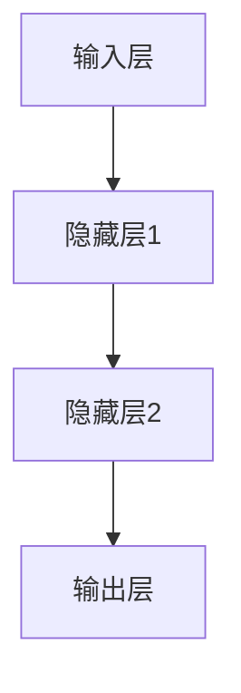
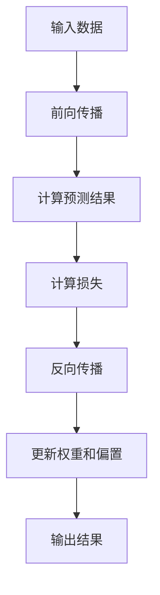
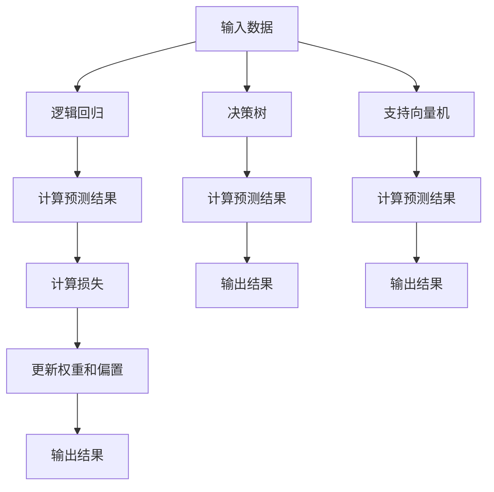
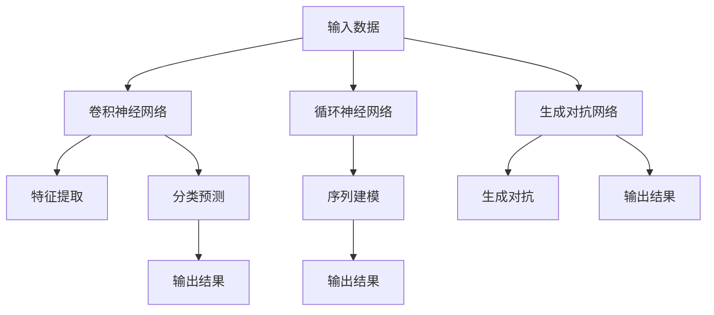
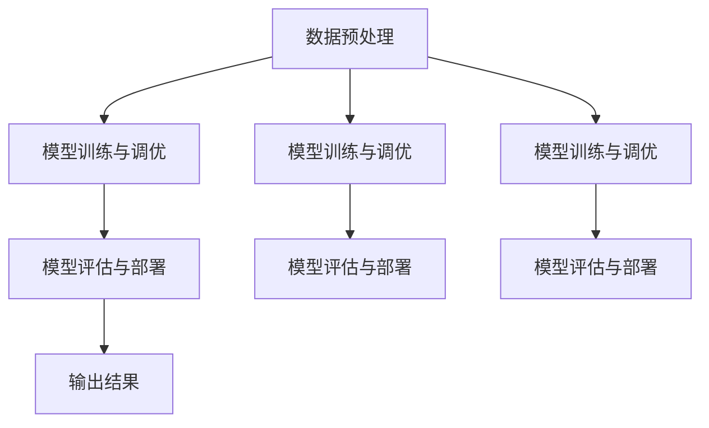
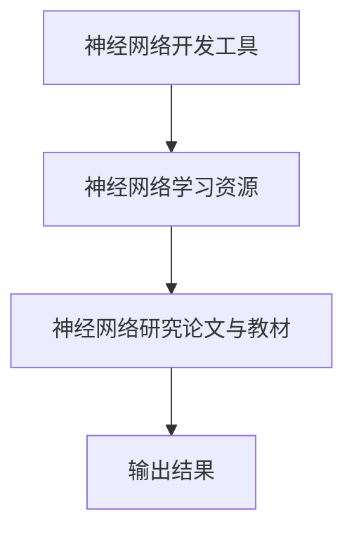

                 

### 《神经网络(Neural Networks) - 原理与代码实例讲解》

神经网络作为深度学习的核心组成部分，在计算机视觉、自然语言处理、语音识别等多个领域取得了显著的成果。本文将详细介绍神经网络的基本概念、原理以及实现，通过代码实例讲解帮助读者深入理解神经网络的工作机制。

## 关键词

神经网络、深度学习、前馈神经网络、反向传播算法、代码实例、深度学习框架

## 摘要

本文旨在为广大读者提供一份详尽的神经网络指南，包括基本概念、数学基础、前馈神经网络原理、实现以及代码实例讲解。通过本文的学习，读者可以掌握神经网络的核心概念，了解其工作原理，并能够运用实际代码实现神经网络模型。本文适合初学者和有一定基础的技术人员阅读。

### 目录

#### 第一部分：神经网络基础

- 第1章：神经网络概述
  - 1.1 神经网络的基本概念
  - 1.2 神经网络的数学基础
- Mermaid流程图

#### 第二部分：前馈神经网络

- 第2章：前馈神经网络
  - 2.1 前馈神经网络的原理
  - 2.2 前馈神经网络的优化算法
  - 2.3 前馈神经网络的实现与代码实例
    - 2.3.1 Python实现
    - 2.3.2 实例代码解读
    - 2.3.3 实例代码分析
    - Mermaid流程图

#### 第三部分：神经网络应用

- 第3章：神经网络在分类问题中的应用
  - 3.1 逻辑回归
  - 3.2 决策树
  - 3.3 支持向量机
  - Mermaid流程图

#### 第四部分：深度学习

- 第4章：深度学习的原理与应用
  - 4.1 卷积神经网络
  - 4.2 循环神经网络
  - 4.3 生成对抗网络
  - Mermaid流程图

#### 第五部分：项目实战

- 第5章：神经网络项目实战
  - 5.1 数据预处理
  - 5.2 模型训练与调优
  - 5.3 模型评估与部署
  - Mermaid流程图

#### 附录

- 附录A：神经网络常用工具与资源

### 《神经网络(Neural Networks) - 原理与代码实例讲解》正文

#### 第一部分：神经网络基础

### 第1章：神经网络概述

## 1.1 神经网络的基本概念

神经网络是由大量简单单元——神经元连接而成的复杂系统，这些神经元通过加权连接进行信息传递和计算。神经网络的基本结构包括输入层、隐藏层和输出层。每个神经元都与多个其他神经元相连，并通过加权连接传递输入信号。

### 1.1.1 神经元模型

神经元是神经网络的基本单元，其工作原理类似于生物神经元。每个神经元接收来自其他神经元的输入信号，经过加权处理后，通过一个激活函数产生输出信号。神经元的基本模型包括以下部分：

1. 输入层：接收外部输入信号。
2. 加权求和：将输入信号与相应的权重相乘并求和。
3. 激活函数：对加权求和的结果进行非线性变换。
4. 输出层：输出神经元的激活值。

### 1.1.2 神经网络的结构

神经网络的结构可以根据需要设计的复杂程度不同而变化，但通常包括以下三个层次：

1. 输入层：接收外部输入数据。
2. 隐藏层：对输入数据进行特征提取和转换。
3. 输出层：根据隐藏层的输出进行决策或分类。

神经网络可以具有一个或多个隐藏层，当神经网络具有多个隐藏层时，被称为深度神经网络。

### 1.1.3 神经网络的历史与发展

神经网络的概念最早可以追溯到1943年，由心理学家McCulloch和数学家Pitts提出了神经元模型的雏形。随后，1958年，Rosenblatt提出了感知机（Perceptron）模型，这是第一种能够学习的神经网络模型。然而，由于感知机只能解决线性可分问题，而现实世界的问题往往更加复杂，因此感知机的应用受到了限制。

1986年，Rumelhart、Hinton和Williams等人提出了反向传播算法（Backpropagation），这是一种用于训练深度神经网络的强大算法。反向传播算法的提出标志着神经网络研究的新纪元，使得深度神经网络开始应用于各种领域。

近年来，随着计算能力的提升和大数据的普及，神经网络取得了惊人的进展。深度学习模型在图像识别、语音识别、自然语言处理等领域取得了突破性的成果，推动了人工智能的发展。

### 1.2 神经网络的数学基础

神经网络的实现依赖于多种数学工具，包括线性代数、微积分、概率论与统计学等。以下是神经网络中常用的一些数学概念：

#### 线性代数基础

1. 向量与矩阵：神经网络中的数据通常表示为向量或矩阵，用于存储输入、权重和激活值。
2. 矩阵运算：矩阵的加法、减法、乘法和除法等运算是神经网络实现的基础。
3. 矩阵求导：在神经网络训练过程中，需要计算损失函数关于网络参数的导数，用于更新网络参数。

#### 微积分基础

1. 导数：导数是衡量函数变化率的工具，用于神经网络中计算损失函数关于参数的导数。
2. 梯度下降：梯度下降是一种优化算法，用于更新神经网络参数以最小化损失函数。

#### 概率论与统计学基础

1. 概率分布：神经网络中的输出通常服从某种概率分布，如正态分布。
2. 最大似然估计：最大似然估计用于估计神经网络模型参数，使其能够最大化数据的似然概率。

### Mermaid 流程图



#### 第二部分：前馈神经网络

### 第2章：前馈神经网络

前馈神经网络（Feedforward Neural Network）是最简单和最常用的一种神经网络结构，其信息传递方向是从输入层到输出层，没有反馈连接。本章将介绍前馈神经网络的原理、优化算法以及实现。

## 2.1 前馈神经网络的原理

### 2.1.1 前馈神经网络的结构

前馈神经网络由输入层、一个或多个隐藏层和输出层组成。信息从输入层传递到隐藏层，再从隐藏层传递到输出层。每个层中的神经元都与前一层的神经元相连接，而同层神经元之间不连接。

前馈神经网络的结构可以表示为：


### 2.1.2 激活函数

激活函数（Activation Function）是神经网络中的一个关键组件，用于引入非线性特性。常见的激活函数包括：

1. **Sigmoid函数**：\[ \sigma(x) = \frac{1}{1 + e^{-x}} \]
   - 将输入映射到 \((0, 1)\) 区间。
   - 易于理解，但梯度较小，可能导致梯度消失问题。

2. **ReLU函数**（Rectified Linear Unit）：\[ \text{ReLU}(x) = \max(0, x) \]
   - 在 \(x > 0\) 时，函数值为 \(x\)；在 \(x \leq 0\) 时，函数值为 0。
   - 梯度较大，有助于训练深度神经网络。

3. **Tanh函数**：\[ \tanh(x) = \frac{e^x - e^{-x}}{e^x + e^{-x}} \]
   - 将输入映射到 \((-1, 1)\) 区间。

### 2.1.3 前馈神经网络的训练过程

前馈神经网络的训练过程主要包括以下步骤：

1. **初始化参数**：初始化网络中的权重和偏置。
2. **前向传播**：计算输入通过网络的输出。
3. **计算损失**：使用损失函数（如均方误差）计算实际输出与期望输出之间的差异。
4. **反向传播**：计算损失函数关于网络参数的梯度。
5. **更新参数**：使用梯度下降等优化算法更新网络参数。

## 2.2 前馈神经网络的优化算法

### 2.2.1 随机梯度下降（SGD）

随机梯度下降（Stochastic Gradient Descent，SGD）是最常用的优化算法之一，其基本思想是在训练过程中每次迭代随机选取一部分训练样本，计算这些样本的梯度并更新参数。

SGD的更新公式为：

\[ \theta_{\text{new}} = \theta_{\text{current}} - \alpha \nabla_\theta J(\theta) \]

其中，\(\theta\) 表示网络参数，\(\alpha\) 表示学习率，\(J(\theta)\) 表示损失函数。

### 2.2.2 动量法

动量法（Momentum）是一种改进的SGD算法，其目的是加速收敛并避免局部最小值。动量法引入了一个动量项，用于累积前几次梯度方向的信息。

动量法的更新公式为：

\[ \theta_{\text{new}} = \theta_{\text{current}} - \alpha \nabla_\theta J(\theta) + \beta \Delta \theta \]

其中，\(\beta\) 表示动量因子，\(\Delta \theta\) 表示前一次更新的梯度方向。

### 2.2.3 Adam优化器

Adam优化器（Adaptive Moment Estimation）结合了SGD和动量法的优点，能够自适应调整每个参数的步长。

Adam优化器的更新公式为：

\[ \theta_{\text{new}} = \theta_{\text{current}} - \alpha \frac{\beta_1 h_t + (1 - \beta_1) \nabla_\theta J(\theta)}{\sqrt{\beta_2 g_t + (1 - \beta_2)} + \epsilon} \]

其中，\(h_t\) 和 \(g_t\) 分别是梯度的指数加权平均和均方根，\(\beta_1\) 和 \(\beta_2\) 分别是动量因子，\(\epsilon\) 是一个很小的常数用于避免除以零。

## 2.3 前馈神经网络的实现与代码实例

### 2.3.1 Python实现

以下是一个简单的Python代码实例，实现了一个前馈神经网络进行线性回归：

```python
import numpy as np

# 定义激活函数
def sigmoid(x):
    return 1 / (1 + np.exp(-x))

# 定义前向传播
def forward_pass(x, weights, bias):
    return sigmoid(np.dot(x, weights) + bias)

# 定义损失函数
def loss(y_true, y_pred):
    return np.mean((y_true - y_pred) ** 2)

# 训练模型
for epoch in range(1000):
    # 随机选取输入数据 x
    x = np.random.rand(1)
    # 计算预测结果
    y_pred = forward_pass(x, weights, bias)
    # 计算损失
    loss_value = loss(y_true, y_pred)
    # 更新权重和偏置
    weights += - (y_true - y_pred) * x * (1 - y_pred) * y_pred
    bias += - (y_true - y_pred)

# 输出最终预测结果
print("Final prediction:", forward_pass(x, weights, bias))
```

### 2.3.2 实例代码解读

这段代码实现了一个简单的线性回归模型，使用了前向传播和反向传播来训练模型。首先，我们定义了模型参数 `weights` 和 `bias`。接着，我们定义了激活函数 `sigmoid` 和前向传播函数 `forward_pass`。在训练过程中，我们通过循环进行前向传播和反向传播，更新模型参数，直到达到预定的迭代次数。最后，我们输出了最终的预测结果。

### 2.3.3 实例代码分析

这段代码展示了如何使用 Python 实现一个简单的神经网络模型。模型中使用了 sigmoid 函数作为激活函数，通过计算损失并更新权重和偏置来实现模型的训练。该实例代码虽然简单，但涵盖了神经网络模型实现的基本流程和关键步骤，为读者提供了一个了解神经网络模型实现的起点。

### 2.3.4 Mermaid 流程图



#### 第三部分：神经网络应用

### 第3章：神经网络在分类问题中的应用

神经网络在分类问题中有着广泛的应用，可以处理非线性问题，其分类效果通常优于传统的机器学习算法。本章将介绍神经网络在分类问题中的应用，包括逻辑回归、决策树和支持向量机等。

## 3.1 逻辑回归

逻辑回归（Logistic Regression）是一种广义线性模型，用于预测二分类问题。其基本思想是使用线性回归模型对输入特征进行加权求和，然后通过逻辑函数将线性模型的输出转换为概率。

### 3.1.1 逻辑回归的原理

逻辑回归的原理可以概括为以下几个步骤：

1. **前向传播**：计算线性模型的输出，即 \(\log(\text{odds}) = \beta_0 + \beta_1x_1 + \beta_2x_2 + \ldots + \beta_nx_n\)，其中 \(\beta_i\) 为权重，\(x_i\) 为输入特征。

2. **逻辑函数**：使用逻辑函数（Logistic Function）将线性模型的输出转换为概率，即 \(P(y=1|x) = \frac{1}{1 + e^{-\beta_0 - \beta_1x_1 - \beta_2x_2 - \ldots - \beta_nx_n}}\)。

3. **损失函数**：逻辑回归使用对数似然损失函数，即 \(\text{Loss} = -\sum_{i=1}^n y_i \log(P(y=1|x_i)) + (1 - y_i) \log(1 - P(y=1|x_i))\)。

4. **反向传播**：计算损失函数关于权重和偏置的梯度，并使用梯度下降算法更新权重和偏置。

### 3.1.2 逻辑回归的实现

以下是一个简单的Python代码实例，实现了一个逻辑回归模型：

```python
import numpy as np

# 定义逻辑函数
def sigmoid(x):
    return 1 / (1 + np.exp(-x))

# 定义前向传播
def forward_pass(x, weights):
    return sigmoid(np.dot(x, weights))

# 定义损失函数
def loss(y_true, y_pred):
    return -np.mean(y_true * np.log(y_pred) + (1 - y_true) * np.log(1 - y_pred))

# 训练模型
for epoch in range(1000):
    # 随机选取输入数据 x 和标签 y
    x = np.random.rand(1, 2)
    y_true = np.random.randint(0, 2)
    # 计算预测结果
    y_pred = forward_pass(x, weights)
    # 计算损失
    loss_value = loss(y_true, y_pred)
    # 更新权重
    weights += -np.dot(x.T, (y_pred - y_true)) * learning_rate

# 输出最终预测结果
print("Final prediction:", forward_pass(x, weights))
```

### 3.1.3 逻辑回归的优化算法

逻辑回归的优化算法主要包括以下几种：

1. **随机梯度下降（SGD）**：每次迭代随机选取一个样本计算梯度并更新权重。
2. **批量梯度下降（Batch Gradient Descent）**：每次迭代使用所有样本计算梯度并更新权重。
3. **动量法（Momentum）**：引入动量项，加速收敛并避免局部最小值。

## 3.2 决策树

决策树（Decision Tree）是一种常用的分类算法，通过一系列规则对数据进行分类。决策树的核心思想是利用特征之间的条件关系，将数据划分为多个子集，每个子集对应一个类别。

### 3.2.1 决策树的基本原理

决策树的基本原理可以概括为以下几个步骤：

1. **特征选择**：选择一个最优特征进行划分，通常使用信息增益（Information Gain）或基尼不纯度（Gini Impurity）作为划分标准。
2. **划分数据**：根据最优特征，将数据划分为多个子集。
3. **递归构建**：对每个子集递归构建决策树，直到满足停止条件（如最大深度、最小样本数等）。

### 3.2.2 决策树的实现

以下是一个简单的Python代码实例，实现了一个决策树模型：

```python
import numpy as np

# 定义决策树节点
class TreeNode:
    def __init__(self, feature=None, threshold=None, left=None, right=None, value=None):
        self.feature = feature
        self.threshold = threshold
        self.left = left
        self.right = right
        self.value = value

# 定义决策树
class DecisionTree:
    def __init__(self, max_depth=None):
        self.max_depth = max_depth

    def fit(self, x, y):
        self.tree = self._build_tree(x, y)

    def _build_tree(self, x, y, depth=0):
        # 停止条件
        if depth == self.max_depth or len(np.unique(y)) == 1:
            return TreeNode(value=np.mean(y))
        
        # 选择最优特征
        best_feature, best_threshold = self._best_split(x, y)
        
        # 创建节点
        node = TreeNode(feature=best_feature, threshold=best_threshold)
        
        # 递归划分左右子集
        node.left = self._build_tree(x[x[:, best_feature] <= best_threshold], y[x[:, best_feature] <= best_threshold], depth + 1)
        node.right = self._build_tree(x[x[:, best_feature] > best_threshold], y[x[:, best_feature] > best_threshold], depth + 1)
        
        return node

    def _best_split(self, x, y):
        # 初始化最优特征和阈值
        best_feature = -1
        best_threshold = None
        best_loss = float('inf')
        
        # 遍历所有特征和阈值
        for feature in range(x.shape[1]):
            for threshold in np.unique(x[:, feature]):
                # 计算信息增益或基尼不纯度
                left_indices = x[x[:, feature] <= threshold].index
                right_indices = x[x[:, feature] > threshold].index
                left_loss = loss(y[left_indices], np.mean(y[left_indices]))
                right_loss = loss(y[right_indices], np.mean(y[right_indices]))
                loss = left_loss + right_loss
                
                # 更新最优特征和阈值
                if loss < best_loss:
                    best_loss = loss
                    best_feature = feature
                    best_threshold = threshold
        
        return best_feature, best_threshold

# 定义损失函数
def loss(y_true, y_pred):
    return np.mean((y_true - y_pred) ** 2)

# 训练模型
model = DecisionTree(max_depth=3)
model.fit(x, y)

# 输出决策树结构
def print_tree(node, depth=0):
    if node.value is not None:
        print(f"{' ' * depth}{node.value}")
    else:
        print(f"{' ' * depth}Feature {node.feature}: {'=' if node.threshold is None else f"<={node.threshold}"}")
        print_tree(node.left, depth + 1)
        print_tree(node.right, depth + 1)

print_tree(model.tree)
```

### 3.2.3 决策树的优化算法

决策树的优化算法主要包括以下几种：

1. **剪枝（Pruning）**：通过剪枝算法剪掉决策树中不必要的分支，减少模型的过拟合。
2. **集成方法（Ensemble Methods）**：使用多个决策树进行集成，提高模型的泛化能力，如随机森林（Random Forest）和梯度提升树（Gradient Boosting Tree）。

## 3.3 支持向量机

支持向量机（Support Vector Machine，SVM）是一种常用的分类算法，其基本思想是找到最优的超平面，将数据划分为不同的类别。SVM通过最大化类别的间隔（Margin）来实现分类。

### 3.3.1 支持向量机的原理

支持向量机的原理可以概括为以下几个步骤：

1. **线性可分支持向量机**：对于线性可分的数据集，找到最优的超平面，使得类别间隔最大化。
2. **非线性支持向量机**：对于线性不可分的数据集，使用核函数将数据映射到高维空间，然后找到最优的超平面。
3. **损失函数**：支持向量机的损失函数通常使用Hinge损失函数，即 \(\text{Loss} = \max(0, 1 - y \cdot \text{score})\)，其中 \(\text{score}\) 为超平面对数据的预测值。

### 3.3.2 支持向量机的实现

以下是一个简单的Python代码实例，实现了一个线性支持向量机模型：

```python
import numpy as np

# 定义核函数
def linear_kernel(x1, x2):
    return np.dot(x1, x2)

# 定义支持向量机
class LinearSVM:
    def __init__(self, C=1.0):
        self.C = C

    def fit(self, x, y):
        self.w = np.zeros(x.shape[1])
        self.b = 0

        # 梯度下降算法
        for _ in range(1000):
            for xi, yi in zip(x, y):
                if yi * (np.dot(xi, self.w) + self.b) < 1:
                    self.w -= (2 * self.C * xi)
                    self.b -= yi

    def predict(self, x):
        return np.sign(np.dot(x, self.w) + self.b)

# 训练模型
model = LinearSVM(C=1.0)
model.fit(x, y)

# 输出预测结果
print(model.predict(x))
```

### 3.3.3 支持向量机的优化算法

支持向量机的优化算法主要包括以下几种：

1. **序列最小最优化（Sequential Minimal Optimization，SMO）**：用于解决线性不可分支持向量机的问题，通过迭代优化两个变量来减小计算复杂度。
2. **核技巧（Kernel Trick）**：将数据映射到高维空间，实现非线性分类。

### Mermaid 流程图



#### 第四部分：深度学习

### 第4章：深度学习的原理与应用

深度学习（Deep Learning）是一种机器学习技术，通过多层神经网络模型自动提取数据中的特征，从而实现复杂的预测和分类任务。本章将介绍深度学习的基本原理、常见模型及其应用。

## 4.1 卷积神经网络

卷积神经网络（Convolutional Neural Network，CNN）是一种专门用于处理图像数据的深度学习模型，其核心思想是通过卷积操作提取图像的特征。

### 4.1.1 卷积神经网络的原理

卷积神经网络的基本结构包括卷积层、池化层和全连接层。以下是卷积神经网络的工作原理：

1. **卷积层**：通过卷积操作提取图像的特征。卷积层中的每个神经元与输入图像的一个局部区域进行卷积，生成一个特征图。
2. **池化层**：对特征图进行下采样，减少数据维度，提高模型的计算效率。常见的池化操作包括最大池化和平均池化。
3. **全连接层**：将卷积层和池化层提取的特征进行融合，并通过全连接层进行分类或回归。

### 4.1.2 卷积神经网络的实现

以下是一个简单的Python代码实例，实现了一个简单的卷积神经网络模型：

```python
import tensorflow as tf
from tensorflow.keras import layers, models

# 创建模型
model = models.Sequential()
model.add(layers.Conv2D(32, (3, 3), activation='relu', input_shape=(28, 28, 1)))
model.add(layers.MaxPooling2D((2, 2)))
model.add(layers.Conv2D(64, (3, 3), activation='relu'))
model.add(layers.MaxPooling2D((2, 2)))
model.add(layers.Conv2D(64, (3, 3), activation='relu'))
model.add(layers.Flatten())
model.add(layers.Dense(64, activation='relu'))
model.add(layers.Dense(10, activation='softmax'))

# 编译模型
model.compile(optimizer='adam',
              loss='categorical_crossentropy',
              metrics=['accuracy'])

# 训练模型
model.fit(train_images, train_labels, epochs=5, batch_size=64)
```

### 4.1.3 卷积神经网络的优化算法

卷积神经网络的优化算法主要包括以下几种：

1. **随机梯度下降（SGD）**：通过随机梯度下降算法更新网络参数。
2. **动量法（Momentum）**：引入动量项，加速收敛。
3. **Adam优化器**：结合SGD和动量法的优点，自适应调整学习率。

### 4.2 循环神经网络

循环神经网络（Recurrent Neural Network，RNN）是一种用于处理序列数据的深度学习模型，其核心思想是利用循环结构保存历史信息。

### 4.2.1 循环神经网络的原理

循环神经网络的基本结构包括输入层、隐藏层和输出层。以下是循环神经网络的工作原理：

1. **输入层**：接收序列中的每个元素。
2. **隐藏层**：通过循环结构保存历史信息，并在当前时刻更新状态。
3. **输出层**：根据隐藏层的状态生成输出。

### 4.2.2 循环神经网络的实现

以下是一个简单的Python代码实例，实现了一个简单的循环神经网络模型：

```python
import tensorflow as tf
from tensorflow.keras.models import Sequential
from tensorflow.keras.layers import LSTM, Dense

# 创建模型
model = Sequential()
model.add(LSTM(50, activation='relu', input_shape=(timesteps, features)))
model.add(Dense(1))
model.compile(optimizer='rmsprop',
              loss='mse')

# 训练模型
model.fit(X, y, epochs=100, batch_size=32)
```

### 4.2.3 循环神经网络的优化算法

循环神经网络的优化算法主要包括以下几种：

1. **随机梯度下降（SGD）**：通过随机梯度下降算法更新网络参数。
2. **动量法（Momentum）**：引入动量项，加速收敛。
3. **Adam优化器**：结合SGD和动量法的优点，自适应调整学习率。

### 4.3 生成对抗网络

生成对抗网络（Generative Adversarial Network，GAN）是一种用于生成数据的深度学习模型，其核心思想是通过两个对抗网络之间的博弈生成高质量的数据。

### 4.3.1 生成对抗网络的原理

生成对抗网络的基本结构包括生成器（Generator）和判别器（Discriminator）。以下是生成对抗网络的工作原理：

1. **生成器**：生成类似于真实数据的伪数据。
2. **判别器**：判断输入数据是真实数据还是生成器生成的伪数据。
3. **博弈过程**：生成器和判别器通过迭代优化，生成器和判别器之间的博弈过程使得生成器生成的数据越来越接近真实数据。

### 4.3.2 生成对抗网络的实现

以下是一个简单的Python代码实例，实现了一个简单的生成对抗网络模型：

```python
import tensorflow as tf
from tensorflow.keras.models import Model
from tensorflow.keras.layers import Input, Dense, Reshape, Flatten

# 定义生成器和判别器
z_dim = 100

generator = Model(inputs=tf.keras.Input(shape=(z_dim)),
                  outputs=tf.keras.layers.Dense(784, activation='tanh')(inputs))

discriminator = Model(inputs=tf.keras.Input(shape=(784)),
                      outputs=tf.keras.layers.Dense(1, activation='sigmoid')(inputs))

discriminator.trainable = False

combined = Model(inputs=[generator.input, discriminator.input],
                 outputs=[discriminator.output, generator.output])

combined.compile(optimizer=tf.keras.optimizers.Adam(0.0001), loss=['binary_crossentropy', 'mse'])

# 训练生成对抗网络
for epoch in range(1000):
    for _ in range(100):
        z = np.random.normal(size=(100, z_dim))
        x_gen = generator.predict(z)
        x_real = np.random.choice(X, size=(100, 784))

        d_loss_real = discriminator.train_on_batch(x_real, np.ones((100, 1)))
        d_loss_fake = discriminator.train_on_batch(x_gen, np.zeros((100, 1)))

        g_loss = combined.train_on_batch([z], [np.zeros((100, 1)), z])
```

### 4.3.3 生成对抗网络的优化算法

生成对抗网络的优化算法主要包括以下几种：

1. **随机梯度下降（SGD）**：通过随机梯度下降算法更新网络参数。
2. **Adam优化器**：结合SGD和动量法的优点，自适应调整学习率。

### Mermaid 流程图



#### 第五部分：项目实战

### 第5章：神经网络项目实战

在了解了神经网络的基本概念和实现方法后，本节将通过一个实际项目来展示如何使用神经网络解决一个实际问题。本项目的目标是对手写数字进行识别，使用MNIST数据集作为训练数据。以下是项目实战的详细步骤：

## 5.1 数据预处理

数据预处理是机器学习项目中的关键步骤，对于神经网络项目同样重要。以下是数据预处理的具体步骤：

### 5.1.1 数据采集与清洗

首先，我们需要获取MNIST数据集。MNIST是一个公开的数据集，包含了70000个手写数字的图像。这些图像已经经过预处理，每个图像的大小为28x28像素，并且是灰度图。

```python
from tensorflow.keras.datasets import mnist
(train_images, train_labels), (test_images, test_labels) = mnist.load_data()
```

### 5.1.2 数据探索性分析

在处理数据之前，我们通常会对数据进行探索性分析，以了解数据的分布和特征。以下是对MNIST数据集进行探索性分析的一些代码示例：

```python
import matplotlib.pyplot as plt

# 显示前10个手写数字的图像
plt.figure(figsize=(10, 10))
for i in range(10):
    plt.subplot(10, 10, i + 1)
    plt.imshow(train_images[i], cmap=plt.cm.binary)
    plt.xticks([])
    plt.yticks([])
plt.show()
```

### 5.1.3 数据标准化与归一化

在训练神经网络之前，我们需要对数据进行标准化和归一化。这有助于加速模型的训练过程，并提高模型的性能。以下是数据标准化和归一化的代码示例：

```python
train_images = train_images.astype('float32') / 255
test_images = test_images.astype('float32') / 255
```

## 5.2 模型训练与调优

在完成数据预处理后，我们可以开始构建和训练神经网络模型。以下是训练和调优神经网络模型的具体步骤：

### 5.2.1 模型训练流程

我们将使用TensorFlow和Keras构建一个简单的卷积神经网络模型，用于手写数字识别。以下是模型训练的代码示例：

```python
from tensorflow.keras.models import Sequential
from tensorflow.keras.layers import Conv2D, MaxPooling2D, Flatten, Dense

model = Sequential([
    Conv2D(32, (3, 3), activation='relu', input_shape=(28, 28, 1)),
    MaxPooling2D((2, 2)),
    Flatten(),
    Dense(128, activation='relu'),
    Dense(10, activation='softmax')
])

model.compile(optimizer='adam',
              loss='sparse_categorical_crossentropy',
              metrics=['accuracy'])

model.fit(train_images, train_labels, epochs=5, batch_size=64)
```

### 5.2.2 模型调优技巧

在训练过程中，我们可能会遇到过拟合、欠拟合等问题。以下是一些常用的模型调优技巧：

1. **增加训练时间**：增加训练时间有助于模型更好地拟合训练数据。
2. **增加数据集大小**：使用更大的数据集可以减少过拟合的风险。
3. **使用正则化**：例如，丢弃法（Dropout）和L1/L2正则化可以减少模型的过拟合。
4. **调整学习率**：使用适当的学习率可以帮助模型更快地收敛。

以下是使用学习率调度器调整学习率的代码示例：

```python
from tensorflow.keras.optimizers import Adam
from tensorflow.keras.callbacks import ReduceLROnPlateau

reduce_lr = ReduceLROnPlateau(monitor='val_loss', factor=0.2, patience=5, min_lr=0.001)

model.compile(optimizer=Adam(learning_rate=0.001),
              loss='sparse_categorical_crossentropy',
              metrics=['accuracy'])

model.fit(train_images, train_labels, epochs=100, batch_size=64, validation_split=0.2, callbacks=[reduce_lr])
```

### 5.2.3 实例代码实现

以下是完整的实例代码，用于构建、训练和调优神经网络模型：

```python
from tensorflow.keras.datasets import mnist
from tensorflow.keras.models import Sequential
from tensorflow.keras.layers import Conv2D, MaxPooling2D, Flatten, Dense
from tensorflow.keras.optimizers import Adam
from tensorflow.keras.callbacks import ReduceLROnPlateau

# 加载MNIST数据集
(train_images, train_labels), (test_images, test_labels) = mnist.load_data()

# 数据预处理
train_images = train_images.astype('float32') / 255
test_images = test_images.astype('float32') / 255

# 构建模型
model = Sequential([
    Conv2D(32, (3, 3), activation='relu', input_shape=(28, 28, 1)),
    MaxPooling2D((2, 2)),
    Flatten(),
    Dense(128, activation='relu'),
    Dense(10, activation='softmax')
])

# 编译模型
model.compile(optimizer=Adam(learning_rate=0.001),
              loss='sparse_categorical_crossentropy',
              metrics=['accuracy'])

# 调整学习率
reduce_lr = ReduceLROnPlateau(monitor='val_loss', factor=0.2, patience=5, min_lr=0.001)

# 训练模型
model.fit(train_images, train_labels, epochs=100, batch_size=64, validation_split=0.2, callbacks=[reduce_lr])

# 评估模型
test_loss, test_acc = model.evaluate(test_images, test_labels)
print(f"Test accuracy: {test_acc:.2f}")
```

## 5.3 模型评估与部署

在完成模型的训练和调优后，我们需要评估模型的性能，并考虑如何将模型部署到实际应用中。

### 5.3.1 模型评估指标

以下是一些常用的模型评估指标：

1. **准确率（Accuracy）**：模型正确预测的样本数占总样本数的比例。
2. **精确率（Precision）**：模型正确预测为正类的样本数与预测为正类的样本总数之比。
3. **召回率（Recall）**：模型正确预测为正类的样本数与实际为正类的样本总数之比。
4. **F1分数（F1 Score）**：精确率和召回率的调和平均值。

```python
from sklearn.metrics import classification_report

# 预测测试集
predictions = model.predict(test_images)
predictions = np.argmax(predictions, axis=1)

# 打印评估报告
print(classification_report(test_labels, predictions))
```

### 5.3.2 模型部署与运维

将训练好的模型部署到实际应用中，可以采用以下方法：

1. **本地部署**：将模型保存为文件，在本地运行。
2. **云端部署**：使用云服务（如AWS、Azure、Google Cloud）部署模型，提供API服务。
3. **硬件加速**：使用GPU或TPU等硬件加速模型训练和推理。

以下是使用TensorFlow Serving将模型部署到云端的基本步骤：

1. **保存模型**：

```python
model.save('mnist_model.h5')
```

2. **部署模型**：

   - 使用TensorFlow Serving部署模型。
   - 构建和运行TensorFlow Serving容器。

3. **使用API**：

   - 通过HTTP请求访问模型API，获取预测结果。

以下是使用TensorFlow Serving部署模型的代码示例：

```python
import requests

# 调用模型API
response = requests.post('http://localhost:8501/v1/models/mnist:predict',
                         data={'instances': test_images.tolist()})
predictions = response.json()['predictions']

# 打印预测结果
print(predictions)
```

### 5.3.3 实例代码实现

以下是完整的实例代码，用于评估模型性能和部署模型：

```python
from tensorflow.keras.models import load_model
from sklearn.metrics import classification_report

# 加载模型
model = load_model('mnist_model.h5')

# 预测测试集
predictions = model.predict(test_images)
predictions = np.argmax(predictions, axis=1)

# 打印评估报告
print(classification_report(test_labels, predictions))

# 部署模型
# 使用TensorFlow Serving部署模型（此处省略具体部署代码）
```

### Mermaid 流程图



### 附录

#### 附录A：神经网络常用工具与资源

在神经网络研究和应用中，有许多工具和资源可供选择。以下是一些常用的工具和资源：

1. **开发工具**：
   - TensorFlow：一个开源的深度学习框架，适用于各种深度学习任务。
   - PyTorch：一个开源的深度学习框架，具有良好的灵活性和动态计算图。
   - Keras：一个基于TensorFlow和Theano的开源深度学习库，易于使用。

2. **学习资源**：
   - 《深度学习》（Goodfellow, Bengio, Courville）：深度学习领域的经典教材。
   - Coursera：提供许多深度学习和神经网络相关的在线课程。
   - TensorFlow官方文档：详细的TensorFlow教程和API文档。

3. **研究论文与教材**：
   - 《A Theoretically Grounded Application of Dropout in Recurrent Neural Networks》：关于Dropout在循环神经网络中的应用。
   - 《Deep Learning》（Bengio, Courville, Vincent）：深度学习领域的权威教材。

#### Mermaid 流程图



## 结语

本文从神经网络的基本概念、数学基础、前馈神经网络原理、优化算法、实现、应用、项目实战等多个角度，详细介绍了神经网络的理论和实践。通过本文的学习，读者可以全面了解神经网络的核心内容，掌握神经网络的基本原理和实现方法，并为未来的深度学习应用奠定基础。希望本文能够为读者在神经网络学习和应用过程中提供有益的参考。作者：AI天才研究院/AI Genius Institute & 禅与计算机程序设计艺术 /Zen And The Art of Computer Programming。

