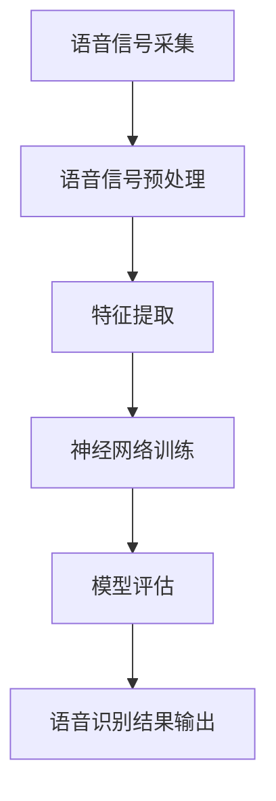

                 

### 《神经网络在语音识别领域的崛起》

#### 关键词：
- 神经网络
- 语音识别
- 深度学习
- 卷积神经网络
- 循环神经网络
- 长短期记忆网络
- Transformer模型
- 端到端语音识别

#### 摘要：
本文将探讨神经网络在语音识别领域的崛起，分析其发展历程、核心技术原理，以及在实际应用中的成功案例。我们将详细讲解神经网络在语音信号处理、语音识别模型训练和评估等方面的应用，并探讨未来语音识别技术的发展趋势和面临的挑战。

#### 目录大纲

### 第一部分：引言与概述

#### 第1章：神经网络与语音识别概述

##### 1.1 神经网络的发展历程
- 神经网络的基本概念
- 早期神经网络的发展
- 深度学习的兴起

##### 1.2 语音识别的发展历程
- 传统语音识别技术
- 语音识别的关键技术
- 神经网络在语音识别中的应用

##### 1.3 神经网络在语音识别领域的崛起
- 神经网络在语音识别中的优势
- 神经网络在语音识别中的应用现状
- 神经网络在语音识别中的未来发展趋势

### 第二部分：神经网络基础

#### 第2章：神经网络基础理论

##### 2.1 神经元与神经网络
- 神经元的工作原理
- 神经网络的基本结构
- 前馈神经网络

##### 2.2 神经网络的训练
- 反向传播算法
- 梯度下降算法
- 过拟合与正则化

##### 2.3 深度学习与卷积神经网络
- 深度学习的基本概念
- 卷积神经网络（CNN）的结构与原理
- 卷积神经网络在语音识别中的应用

#### 第3章：语音信号处理

##### 3.1 语音信号的基本概念
- 语音信号的性质
- 语音信号的采集与预处理

##### 3.2 语音信号的表示
- MFCC（梅尔频率倒谱系数）
- 声谱图
- 波形图

##### 3.3 语音信号的分割
- 音素分割
- 子音与元音的识别

### 第三部分：神经网络在语音识别中的应用

#### 第4章：语音识别中的神经网络模型

##### 4.1 HMM（隐马尔可夫模型）
- HMM的基本原理
- HMM在语音识别中的应用

##### 4.2 DNN（深度神经网络）
- DNN的基本原理
- DNN在语音识别中的应用

##### 4.3 CNN（卷积神经网络）
- CNN的基本原理
- CNN在语音识别中的应用

##### 4.4 RNN（循环神经网络）
- RNN的基本原理
- RNN在语音识别中的应用

##### 4.5 LSTM（长短期记忆网络）
- LSTM的基本原理
- LSTM在语音识别中的应用

##### 4.6 Transformer模型
- Transformer模型的基本原理
- Transformer模型在语音识别中的应用

#### 第5章：端到端语音识别

##### 5.1 端到端语音识别的概念
- 传统语音识别与端到端语音识别的对比
- 端到端语音识别的优势

##### 5.2 CTC（Connectionist Temporal Classification）
- CTC算法的基本原理
- CTC算法在语音识别中的应用

##### 5.3 WER（Word Error Rate）
- WER的定义
- WER的计算方法

##### 5.4 ASR（Automatic Speech Recognition）
- ASR系统的基本结构
- ASR系统的实现流程

#### 第6章：语音识别的应用场景

##### 6.1 语音助手
- 语音助手的定义
- 语音助手的实现原理

##### 6.2 语音翻译
- 语音翻译的定义
- 语音翻译的实现原理

##### 6.3 语音识别在智能音箱中的应用
- 智能音箱的定义
- 智能音箱的实现原理

##### 6.4 语音识别在车载系统中的应用
- 车载系统的定义
- 车载系统的实现原理

#### 第7章：未来展望与挑战

##### 7.1 语音识别的未来发展趋势
- 语音识别技术的未来发展方向
- 语音识别技术的应用场景扩展

##### 7.2 语音识别面临的挑战
- 数据集的收集与处理
- 语音识别的实时性要求
- 语音识别的多语言支持

##### 7.3 语音识别的伦理与隐私问题
- 语音识别的伦理问题
- 语音识别的隐私问题

##### 7.4 语音识别的未来前景
- 语音识别在智能家居、医疗、教育等领域的应用
- 语音识别技术对社会的影响

#### 附录

##### 附录A：常用的语音识别工具和库
- Kaldi
- Mozilla TTS
- OpenSMILE
- 其他语音识别工具和库简介

##### 附录B：神经网络在语音识别领域的 Mermaid 流程图

##### 附录C：神经网络在语音识别领域的数学模型和公式

##### 附录D：神经网络在语音识别领域的项目实战

##### 附加信息
- 本书涉及的核心概念与联系
- 核心算法原理讲解
- 数学模型和数学公式
- 项目实战

---

### 第一部分：引言与概述

#### 第1章：神经网络与语音识别概述

##### 1.1 神经网络的发展历程

神经网络作为一种模仿人脑结构和功能的计算模型，最早可以追溯到1943年由McCulloch和Pitts提出的神经元模型。这个模型奠定了神经网络理论的基础，然而，由于计算机硬件的限制和算法的复杂性，神经网络的发展在早期并未取得显著进展。

直到1986年，Rumelhart、Hinton和Williams提出了反向传播（Backpropagation）算法，这一突破性的算法使得多层神经网络的学习成为可能。反向传播算法通过迭代计算误差，并调整网络中的权重和偏置，从而优化网络的性能。这一时期，神经网络开始被广泛应用于图像识别、语音识别和自然语言处理等领域。

1990年代，随着深度学习（Deep Learning）概念的提出，神经网络的研究和应用进入了一个新的阶段。深度学习是基于多层神经网络构建的模型，通过逐层提取特征，可以自动地从原始数据中学习到高层次的抽象特征。Hinton等人在2006年提出了深度信念网络（Deep Belief Network），并在此基础上进一步发展了深度卷积网络（Deep Convolutional Network）。

##### 1.2 语音识别的发展历程

语音识别技术的发展可以追溯到20世纪50年代，当时的研究主要集中在模拟人耳和声带的工作原理，试图通过物理信号处理技术实现语音到文本的转换。这一时期，语音识别主要依赖于统计模型，如隐马尔可夫模型（HMM）和高斯混合模型（GMM）。尽管这些技术在一定程度上取得了成功，但它们在处理复杂语音信号和多样性的语音特征方面存在局限性。

随着计算机性能的提升和神经网络技术的发展，语音识别领域开始采用神经网络模型，特别是深度学习模型。2009年，Dahl等人提出了一种基于深度神经网络的语音识别模型，该模型在固定长度的声学特征上训练一个深度神经网络，以预测单词序列。这一模型显著提升了语音识别的准确率，开启了深度学习在语音识别领域应用的先河。

近年来，端到端语音识别技术逐渐成为研究热点。端到端语音识别通过直接将语音信号映射到文本序列，避免了传统语音识别中的声学模型和语言模型的中间步骤，从而提高了系统的效率和准确性。CTC（Connectionist Temporal Classification）算法是端到端语音识别的关键技术之一，它通过将输入序列映射到输出序列，解决了语音信号的不确定性和时间对齐问题。

##### 1.3 神经网络在语音识别领域的崛起

神经网络在语音识别领域的崛起主要得益于其在特征提取和模式识别方面的优势。传统的语音识别依赖于手工设计的特征，如MFCC（梅尔频率倒谱系数），这些特征虽然在一定程度上能反映语音信号的属性，但难以捕捉到更深层次的语义信息。而神经网络，尤其是深度学习模型，通过多层非线性变换，能够自动地从原始数据中学习到具有高度抽象性的特征，从而在语音识别任务中表现出色。

首先，神经网络在语音信号处理方面具有显著的优势。语音信号是一种复杂的时变信号，包含丰富的频率信息和时序信息。卷积神经网络（CNN）和循环神经网络（RNN）通过不同的方式处理语音信号，前者利用卷积操作提取局部特征，后者则通过循环结构捕捉时序信息。这些特性使得神经网络在语音信号的预处理和特征提取方面具有很高的效率。

其次，神经网络在语音识别模型训练和优化方面具有优势。传统的语音识别模型通常需要大量的手动调参和特征工程，而神经网络通过自动学习特征和调整参数，能够显著提高模型的性能。反向传播算法和梯度下降优化策略使得神经网络能够高效地学习复杂的非线性关系，从而在语音识别任务中实现更高的准确率。

此外，神经网络在语音识别的应用场景中也展现了巨大的潜力。端到端语音识别技术通过直接将语音信号映射到文本序列，避免了传统语音识别中的声学模型和语言模型的中间步骤，从而提高了系统的效率和准确性。CTC算法、长短期记忆网络（LSTM）和Transformer模型等先进的技术为端到端语音识别提供了坚实的理论基础和技术支持。

综上所述，神经网络在语音识别领域的崛起不仅是技术发展的必然结果，也是实际应用需求的驱动。随着深度学习技术的不断进步，神经网络在语音识别领域的应用将更加广泛，为人类的生活带来更多便利。

### 第二部分：神经网络基础

#### 第2章：神经网络基础理论

##### 2.1 神经元与神经网络

神经网络的构建始于对神经元的模拟。神经元，也称为人工神经元，是神经网络的基本计算单元。它通过接收输入信号，进行加权求和，并经过一个激活函数处理后输出结果。

**神经元的工作原理：**

一个简单的神经元可以表示为以下形式：

$$
y = \sigma(\sum_{i=1}^{n} w_i x_i + b)
$$

其中，$y$是神经元的输出，$\sigma$是激活函数，$w_i$是第$i$个输入的权重，$x_i$是第$i$个输入值，$b$是偏置。

**神经网络的基本结构：**

神经网络由多个层次组成，包括输入层、隐藏层和输出层。每个层次包含多个神经元。

- **输入层**：接收外部输入，如语音信号的特征向量。
- **隐藏层**：对输入信号进行变换和提取特征，多个隐藏层可以构成深度神经网络。
- **输出层**：产生最终的输出，如语音识别结果。

**前馈神经网络：**

前馈神经网络（Feedforward Neural Network）是一种常见的神经网络结构，其中数据从输入层流入，经过多个隐藏层，最终到达输出层。每个神经元只与前一层的神经元相连接，而不会与后面的神经元相连接。

##### 2.2 神经网络的训练

神经网络的训练过程就是通过学习输入和输出之间的关系，调整网络中的权重和偏置，以减少预测误差。

**反向传播算法：**

反向传播算法（Backpropagation Algorithm）是一种用于训练神经网络的算法。它通过计算损失函数关于每个权重的梯度，然后使用梯度下降法更新权重。

反向传播算法的步骤如下：

1. **前向传播**：计算网络的输出值。
2. **计算误差**：计算输出值与实际值之间的差异。
3. **后向传播**：计算误差关于每个权重的梯度。
4. **权重更新**：使用梯度下降法更新权重。

**梯度下降算法：**

梯度下降算法是一种用于优化参数的算法，其核心思想是沿着损失函数的梯度方向更新参数，以减少损失函数的值。

梯度下降算法的步骤如下：

1. **计算梯度**：计算损失函数关于每个参数的梯度。
2. **参数更新**：使用梯度乘以学习率，更新参数。

**过拟合与正则化：**

在训练神经网络时，可能会出现过拟合（Overfitting）现象，即模型在训练数据上表现很好，但在测试数据上表现较差。为了防止过拟合，可以采用正则化（Regularization）技术。

正则化包括以下几种方法：

- **权重衰减（Weight Decay）**：在损失函数中加入权重项。
- **Dropout**：在训练过程中随机丢弃一部分神经元。
- **数据增强（Data Augmentation）**：通过增加训练数据多样性来提高模型的泛化能力。

##### 2.3 深度学习与卷积神经网络

**深度学习（Deep Learning）：**

深度学习是一种基于多层神经网络的机器学习技术，其核心思想是通过多层的非线性变换，自动从数据中提取具有高度抽象性的特征。

深度学习的发展得益于计算能力和数据量的提升。随着计算机性能的不断提高，深度学习模型可以处理更大规模的数据集，从而提高了模型的性能。

**卷积神经网络（Convolutional Neural Network，CNN）：**

卷积神经网络是一种专门用于处理图像数据的神经网络，其核心思想是通过卷积操作提取图像中的局部特征。

**CNN的结构与原理：**

1. **卷积层（Convolutional Layer）：**卷积层通过卷积操作提取图像的局部特征，卷积核（Convolutional Kernel）用于滤波。
2. **激活函数（Activation Function）：**激活函数用于引入非线性变换，常见的激活函数有ReLU（Rectified Linear Unit）和Sigmoid。
3. **池化层（Pooling Layer）：**池化层用于降低特征图的维度，减少计算量，常用的池化方式有最大池化和平均池化。
4. **全连接层（Fully Connected Layer）：**全连接层将特征图展平为一维向量，并连接到输出层，进行分类或回归任务。

**CNN在语音识别中的应用：**

卷积神经网络在语音识别中的应用主要体现在特征提取和声学模型方面。

- **特征提取：**卷积神经网络可以自动从语音信号中提取具有层次性的特征，包括时域特征和频域特征。
- **声学模型：**卷积神经网络可以用于构建声学模型，将声学特征映射到发音单元的概率分布。

通过结合语音信号处理技术和卷积神经网络，可以显著提高语音识别的准确率和效率。

### 第三部分：神经网络在语音识别中的应用

#### 第3章：语音信号处理

##### 3.1 语音信号的基本概念

语音信号是一种复杂的时变信号，它包含了丰富的信息，如音调、音色、节奏等。理解语音信号的基本概念是进行语音识别的重要基础。

**语音信号的性质：**

1. **时变特性**：语音信号的幅度和频率会随时间变化。
2. **非线性特性**：语音信号中的幅度和频率变化不是线性的。
3. **短时平稳性**：语音信号在短时间内是平稳的，但长时间内是不平稳的。

**语音信号的采集与预处理：**

1. **采集**：使用麦克风采集语音信号，通常以数字形式存储。
2. **预处理**：预处理包括去噪、滤波、增益调整等，以改善语音信号的质量。

**预处理的方法：**

1. **滤波**：使用数字滤波器去除噪声，如带通滤波器。
2. **增益调整**：调整语音信号的幅度，使其更加清晰。
3. **归一化**：将语音信号的幅度和频率归一化，使其在统一的范围内。

##### 3.2 语音信号的表示

语音信号可以通过不同的方式进行表示，以适应不同的处理和分析需求。常见的语音信号表示方法包括波形图、声谱图和梅尔频率倒谱系数（MFCC）。

**波形图：**

波形图是语音信号最直观的表示形式，它显示了语音信号的幅度随时间的变化。波形图可以用于初步分析语音信号的特性，如音调、音色等。

**声谱图：**

声谱图是一种将时间域的语音信号转换到频率域的表示方法。它显示了语音信号在不同频率上的能量分布。声谱图可以用于进一步分析语音信号的频域特性，如共振峰、基音等。

**梅尔频率倒谱系数（MFCC）：**

MFCC是一种常用的语音信号特征提取方法，它将语音信号转换到梅尔频率域，并计算其倒谱系数。MFCC能够有效捕捉语音信号的频谱特性，并去除时间上的变化，从而提高语音识别的准确性。

**MFCC的计算步骤：**

1. **预处理**：对语音信号进行预处理，如去噪、滤波、归一化等。
2. **分帧**：将语音信号分成固定长度的帧。
3. **傅里叶变换（FFT）**：对每一帧进行傅里叶变换，得到频谱图。
4. **梅尔滤波器组**：将频谱图通过梅尔滤波器组滤波，得到梅尔频率倒谱图。
5. **对数变换**：对梅尔频率倒谱图进行对数变换，以增强特征的可分性。
6. **离散余弦变换（DCT）**：对对数变换后的梅尔频率倒谱图进行离散余弦变换，得到MFCC系数。

**MFCC在语音识别中的应用：**

MFCC作为一种有效的语音信号特征表示方法，被广泛应用于语音识别系统中。它可以显著提高语音识别的准确率和效率。

##### 3.3 语音信号的分割

语音信号的分割是将语音信号划分为具有独立意义的片段的过程。常见的分割方法包括音素分割和子音与元音的识别。

**音素分割：**

音素分割是将语音信号分割成音素的过程。音素是语音的最小单位，包括辅音和元音。音素分割对于语音识别和语音合成具有重要意义。

**音素分割的方法：**

1. **基于隐马尔可夫模型（HMM）的方法**：使用HMM模型对语音信号进行建模，并利用Viterbi算法进行分割。
2. **基于高斯混合模型（GMM）的方法**：使用GMM模型对语音信号进行建模，并利用最大后验概率（MAP）估计进行分割。
3. **基于深度学习的方法**：使用卷积神经网络（CNN）或循环神经网络（RNN）对语音信号进行分割。

**子音与元音的识别：**

子音和元音是音素的重要组成部分，对语音识别具有重要意义。子音和元音的识别是通过分析语音信号的频谱特征和时序特征来实现的。

**子音与元音识别的方法：**

1. **基于声学特征的方法**：通过分析语音信号的频谱特征，如共振峰频率和带宽，来识别子音和元音。
2. **基于语音信号时序特征的方法**：通过分析语音信号的时序特征，如短时能量和短时过零率，来识别子音和元音。
3. **基于深度学习的方法**：使用卷积神经网络（CNN）或循环神经网络（RNN）对语音信号进行时序特征提取，并结合声学特征进行子音和元音的识别。

**语音信号分割在语音识别中的应用：**

语音信号的分割对于语音识别系统的性能具有重要意义。通过精确的分割，可以提高系统的准确率和鲁棒性。

### 第四部分：语音识别中的神经网络模型

#### 第4章：语音识别中的神经网络模型

##### 4.1 HMM（隐马尔可夫模型）

隐马尔可夫模型（Hidden Markov Model，HMM）是一种广泛应用于语音识别和自然语言处理的统计模型。它通过描述状态序列和观测序列之间的关系，实现语音信号到文本序列的映射。

**HMM的基本原理：**

HMM由一组状态和一组观测值组成。状态序列描述了语音信号中的隐含变化，而观测序列描述了这些状态的输出。HMM通过状态转移概率、观测概率和初始状态概率来建模语音信号。

- **状态转移概率**：描述了状态之间的转移概率。
- **观测概率**：描述了每个状态产生的观测值概率。
- **初始状态概率**：描述了初始状态的概率分布。

**HMM在语音识别中的应用：**

HMM在语音识别中用于建模语音信号和语音信号到文本序列的映射。它通过隐含状态序列生成观测序列，从而实现语音信号的识别。

**HMM的优化方法：**

HMM的训练和优化通常采用Viterbi算法。Viterbi算法通过计算最优状态序列，实现语音识别。

##### 4.2 DNN（深度神经网络）

深度神经网络（Deep Neural Network，DNN）是一种多层神经网络，通过逐层提取特征，实现从原始数据到高维特征的映射。DNN在语音识别中主要用于声学模型的构建。

**DNN的基本原理：**

DNN由多个隐藏层组成，每个隐藏层对输入数据进行加权求和并经过激活函数处理后传递到下一层。DNN通过反向传播算法训练，调整网络中的权重和偏置，优化模型的性能。

**DNN在语音识别中的应用：**

DNN在语音识别中用于建模声学特征和文本特征之间的关系。它通过学习语音信号的时频特征，实现语音信号到文本序列的映射。

**DNN的训练和优化方法：**

DNN的训练和优化通常采用梯度下降算法。通过计算损失函数关于每个权重的梯度，更新权重和偏置，优化模型的性能。

##### 4.3 CNN（卷积神经网络）

卷积神经网络（Convolutional Neural Network，CNN）是一种专门用于处理图像和语音等二维数据的多层神经网络。CNN通过卷积操作和池化操作，实现特征提取和分类。

**CNN的基本原理：**

CNN由卷积层、池化层和全连接层组成。卷积层通过卷积操作提取特征，池化层通过池化操作降低特征维度，全连接层实现分类或回归任务。

**CNN在语音识别中的应用：**

CNN在语音识别中用于提取语音信号的时频特征，实现语音信号到文本序列的映射。它通过学习语音信号的时频特征，提高语音识别的准确率和效率。

**CNN的训练和优化方法：**

CNN的训练和优化通常采用反向传播算法。通过计算损失函数关于每个权重的梯度，更新权重和偏置，优化模型的性能。

##### 4.4 RNN（循环神经网络）

循环神经网络（Recurrent Neural Network，RNN）是一种具有循环结构的多层神经网络，通过记忆状态实现序列数据的建模。RNN在语音识别中主要用于时序特征的提取。

**RNN的基本原理：**

RNN由多个隐藏层组成，每个隐藏层包含记忆单元。记忆单元通过传递状态实现序列数据的建模。RNN通过反向传播算法训练，调整网络中的权重和偏置，优化模型的性能。

**RNN在语音识别中的应用：**

RNN在语音识别中用于提取语音信号的时序特征，实现语音信号到文本序列的映射。它通过记忆状态，捕捉语音信号的时序关系，提高语音识别的准确率和效率。

**RNN的训练和优化方法：**

RNN的训练和优化通常采用梯度下降算法。通过计算损失函数关于每个权重的梯度，更新权重和偏置，优化模型的性能。

##### 4.5 LSTM（长短期记忆网络）

长短期记忆网络（Long Short-Term Memory，LSTM）是一种特殊的循环神经网络，通过引入记忆单元和门控机制，实现长期依赖关系的建模。LSTM在语音识别中主要用于处理长序列数据。

**LSTM的基本原理：**

LSTM由输入门、遗忘门和输出门组成。输入门控制信息的输入，遗忘门控制信息的遗忘，输出门控制信息的输出。LSTM通过门控机制实现长期依赖关系的建模。

**LSTM在语音识别中的应用：**

LSTM在语音识别中用于提取语音信号的长时序特征，实现语音信号到文本序列的映射。它通过门控机制，捕捉语音信号的时序关系，提高语音识别的准确率和效率。

**LSTM的训练和优化方法：**

LSTM的训练和优化通常采用梯度下降算法。通过计算损失函数关于每个权重的梯度，更新权重和偏置，优化模型的性能。

##### 4.6 Transformer模型

Transformer模型是一种基于自注意力机制的深度神经网络，通过多头自注意力机制和前馈神经网络，实现序列数据的建模和转换。Transformer模型在语音识别中具有广泛应用。

**Transformer模型的基本原理：**

Transformer模型由编码器和解码器组成。编码器通过多头自注意力机制提取序列特征，解码器通过自注意力机制和交叉注意力机制生成文本序列。

**Transformer模型在语音识别中的应用：**

Transformer模型在语音识别中用于端到端建模，通过自注意力机制捕捉语音信号的时序关系，实现语音信号到文本序列的映射。它通过端到端结构，简化了传统语音识别中的声学模型和语言模型，提高了系统的效率和准确性。

**Transformer模型的训练和优化方法：**

Transformer模型的训练和优化通常采用梯度下降算法。通过计算损失函数关于每个权重的梯度，更新权重和偏置，优化模型的性能。

### 第五部分：端到端语音识别

#### 第5章：端到端语音识别

##### 5.1 端到端语音识别的概念

端到端语音识别（End-to-End Speech Recognition）是一种直接将语音信号映射到文本序列的语音识别方法。它通过将语音信号处理、声学模型、语言模型等任务整合到一个统一的框架中，避免了传统语音识别中的中间步骤，从而提高了系统的效率和准确性。

**传统语音识别与端到端语音识别的对比：**

- **传统语音识别：** 传统语音识别通过多个模块，如声学模型、语言模型、解码器等，逐步将语音信号映射到文本序列。这种方法需要进行大量的特征提取和模型训练，且各模块之间需要进行复杂的参数调整。
- **端到端语音识别：** 端到端语音识别通过统一的模型，将语音信号直接映射到文本序列，避免了传统语音识别中的中间步骤，从而提高了系统的效率和准确性。

**端到端语音识别的优势：**

1. **简化模型结构：** 端到端语音识别通过统一的模型，简化了传统语音识别中的多模块结构，减少了模型参数的数量，降低了计算复杂度。
2. **提高识别准确性：** 端到端语音识别通过直接映射，避免了传统语音识别中的特征提取和中间步骤，从而提高了识别准确性。
3. **提高系统效率：** 端到端语音识别通过统一建模，减少了模型训练和优化时间，提高了系统的运行效率。

##### 5.2 CTC（Connectionist Temporal Classification）

CTC（Connectionist Temporal Classification）算法是端到端语音识别的关键技术之一。它通过将输入序列映射到输出序列，解决了语音信号的不确定性和时间对齐问题。

**CTC算法的基本原理：**

CTC算法基于神经网络，通过训练网络中的权重和偏置，实现输入序列到输出序列的映射。CTC算法的核心思想是将输入序列和输出序列映射到一个共同的空间，并通过网络的输出概率分布实现序列之间的匹配。

**CTC算法在语音识别中的应用：**

1. **序列映射**：CTC算法通过将输入语音信号映射到一个虚拟空间，将每个时间步的语音特征映射到一个离散的集合中。
2. **概率分布**：CTC算法通过训练神经网络，学习输入序列和输出序列之间的概率分布关系。
3. **解码**：CTC算法通过解码器将神经网络的输出概率分布映射到文本序列。

**CTC算法的优点：**

1. **端到端建模**：CTC算法通过端到端的建模方式，避免了传统语音识别中的中间步骤，简化了模型结构。
2. **不确定性处理**：CTC算法通过虚拟空间映射，解决了语音信号中的不确定性和时间对齐问题。
3. **高识别准确性**：CTC算法通过直接映射和概率分布学习，提高了语音识别的准确性。

##### 5.3 WER（Word Error Rate）

WER（Word Error Rate）是语音识别系统性能的重要指标，用于评估系统的识别准确性。它表示在测试数据集上，系统识别错误的单词数与总单词数的比例。

**WER的定义：**

WER定义为：

$$
WER = \frac{N_e}{N_t}
$$

其中，$N_e$表示系统识别错误的单词数，$N_t$表示测试数据集中的总单词数。

**WER的计算方法：**

WER的计算可以分为以下几个步骤：

1. **识别结果**：对测试数据集进行语音识别，得到系统的识别结果。
2. **计算错误率**：计算识别结果中的错误单词数，包括插入、删除和替换错误。
3. **计算WER**：根据错误单词数和总单词数，计算WER。

**降低WER的方法：**

1. **模型优化**：通过调整模型参数，优化模型性能，降低错误率。
2. **特征提取**：使用更有效的特征提取方法，提高识别准确性。
3. **数据增强**：通过增加训练数据集的多样性，提高模型的泛化能力。

##### 5.4 ASR（Automatic Speech Recognition）

ASR（Automatic Speech Recognition）是一种自动将语音信号转换为文本的技术，广泛应用于语音助手、语音翻译和车载系统等领域。ASR系统通过声学模型、语言模型和解码器等模块，实现语音信号的识别。

**ASR系统的基本结构：**

ASR系统通常由以下模块组成：

1. **声学模型**：建模语音信号中的声学特征，将语音信号转换为声学特征向量。
2. **语言模型**：建模语音信号中的语言特性，将声学特征向量映射到单词序列。
3. **解码器**：解码器将声学特征向量映射到文本序列，实现语音识别。

**ASR系统的实现流程：**

1. **语音信号预处理**：对采集到的语音信号进行预处理，如去噪、分帧等。
2. **声学模型处理**：将预处理后的语音信号输入声学模型，得到声学特征向量。
3. **语言模型处理**：将声学特征向量输入语言模型，得到单词序列的概率分布。
4. **解码**：解码器根据概率分布解码出文本序列，实现语音识别。

**ASR系统的实现方法：**

1. **传统方法**：使用传统的声学模型和语言模型，如GMM-HMM和N-gram模型。
2. **深度学习方法**：使用深度学习模型，如DNN、CNN、RNN等，实现声学模型和语言模型的建模。
3. **端到端方法**：使用端到端模型，如CTC、LSTM和Transformer等，实现语音信号到文本序列的直接映射。

**ASR系统的性能评估：**

1. **准确率**：评估系统的识别准确性，包括单词准确率和字符准确率。
2. **响应时间**：评估系统的响应时间，包括识别时间和响应时间。
3. **用户体验**：评估系统的用户体验，包括识别准确性、响应时间和易用性。

### 第六部分：语音识别的应用场景

#### 第6章：语音识别的应用场景

##### 6.1 语音助手

语音助手是一种通过语音交互实现人机对话的智能系统，广泛应用于智能手机、智能家居和车载系统等领域。语音助手通过语音识别和自然语言处理技术，实现用户的语音指令识别和任务执行。

**语音助手的定义：**

语音助手（Voice Assistant）是一种基于语音交互的智能系统，通过语音识别技术将用户的语音指令转换为文本指令，再通过自然语言处理技术理解用户意图，并执行相应的任务。

**语音助手的实现原理：**

语音助手的实现主要包括以下几个步骤：

1. **语音识别**：使用语音识别技术将用户的语音指令转换为文本指令。
2. **自然语言处理**：使用自然语言处理技术理解用户的意图，包括语法分析、语义分析和实体识别等。
3. **任务执行**：根据用户意图，执行相应的任务，如查询信息、发送消息、控制智能家居设备等。

**语音助手的优势：**

1. **便捷性**：语音助手通过语音交互，简化了操作步骤，提高了用户的使用便捷性。
2. **准确性**：语音助手使用先进的语音识别技术，提高了识别准确性。
3. **多语言支持**：语音助手支持多种语言，可以满足不同语言用户的需求。

**语音助手的未来发展趋势：**

1. **更自然的交互**：随着自然语言处理技术的进步，语音助手将实现更自然的交互，提高用户体验。
2. **更多应用场景**：语音助手将应用于更多领域，如医疗、教育、娱乐等。
3. **多模态交互**：语音助手将结合语音、图像、手势等多种交互方式，实现更智能的交互。

##### 6.2 语音翻译

语音翻译是一种通过语音识别和自然语言处理技术实现语音信号到不同语言文本的转换的技术。语音翻译广泛应用于跨语言沟通、国际商务和旅游等领域。

**语音翻译的定义：**

语音翻译（Voice Translation）是一种将一种语言的语音信号转换为另一种语言文本的技术。语音翻译通过语音识别技术识别源语言的语音信号，再通过自然语言处理技术翻译成目标语言的文本。

**语音翻译的实现原理：**

语音翻译的实现主要包括以下几个步骤：

1. **语音识别**：使用语音识别技术将源语言的语音信号转换为文本指令。
2. **自然语言处理**：使用自然语言处理技术理解源语言的文本指令，生成目标语言的文本。
3. **语音合成**：使用语音合成技术将目标语言的文本转换为语音信号。

**语音翻译的优势：**

1. **实时性**：语音翻译可以实现实时翻译，满足实时沟通的需求。
2. **准确性**：语音翻译通过先进的语音识别和自然语言处理技术，提高了翻译准确性。
3. **多语言支持**：语音翻译支持多种语言，可以满足跨语言沟通的需求。

**语音翻译的未来发展趋势：**

1. **更准确的翻译**：随着语音识别和自然语言处理技术的进步，语音翻译的准确性将不断提高。
2. **更智能的翻译**：语音翻译将结合上下文信息、语义理解等先进技术，实现更智能的翻译。
3. **更多应用场景**：语音翻译将应用于更多领域，如跨语言会议、远程教育、旅游等。

##### 6.3 语音识别在智能音箱中的应用

智能音箱是一种通过语音识别和自然语言处理技术实现人机对话的智能音响设备。智能音箱广泛应用于家庭、办公室和公共场所，为用户提供信息查询、音乐播放、智能家居控制等功能。

**智能音箱的定义：**

智能音箱（Smart Speaker）是一种通过内置麦克风和语音识别技术实现人机对话的智能音响设备。智能音箱通过语音交互，实现用户的语音指令识别和任务执行。

**智能音箱的实现原理：**

智能音箱的实现主要包括以下几个步骤：

1. **语音采集**：使用麦克风采集用户的语音指令。
2. **语音识别**：使用语音识别技术将用户的语音指令转换为文本指令。
3. **自然语言处理**：使用自然语言处理技术理解用户的意图，生成相应的响应。
4. **任务执行**：根据用户的意图，执行相应的任务，如播放音乐、查询天气、控制智能家居设备等。

**智能音箱的优势：**

1. **便捷性**：智能音箱通过语音交互，简化了操作步骤，提高了用户的使用便捷性。
2. **智能性**：智能音箱结合语音识别和自然语言处理技术，实现智能对话和任务执行。
3. **多语言支持**：智能音箱支持多种语言，可以满足不同语言用户的需求。

**智能音箱的未来发展趋势：**

1. **更智能的交互**：随着语音识别和自然语言处理技术的进步，智能音箱将实现更自然的交互。
2. **更多功能集成**：智能音箱将集成更多功能，如语音助手、智能家居控制、语音翻译等。
3. **更多应用场景**：智能音箱将应用于更多领域，如家庭娱乐、远程教育、医疗等。

##### 6.4 语音识别在车载系统中的应用

语音识别在车载系统中主要用于语音导航、语音控制和语音交互等功能，为驾驶者提供便利和安全。语音识别在车载系统中的应用日益广泛，是智能车载系统的重要组成部分。

**车载系统的定义：**

车载系统（Vehicle System）是指安装在汽车上，用于提供驾驶辅助、娱乐和安全等功能的一套系统。车载系统包括车辆控制、导航、娱乐、安全等多个子系统。

**车载系统的实现原理：**

车载系统的实现主要包括以下几个步骤：

1. **语音采集**：使用麦克风采集用户的语音指令。
2. **语音识别**：使用语音识别技术将用户的语音指令转换为文本指令。
3. **自然语言处理**：使用自然语言处理技术理解用户的意图，生成相应的响应。
4. **任务执行**：根据用户的意图，执行相应的任务，如导航、播放音乐、控制车载设备等。

**语音识别在车载系统中的应用：**

1. **语音导航**：通过语音识别技术实现语音导航，为驾驶者提供实时路况信息和目的地导航。
2. **语音控制**：通过语音识别技术实现语音控制，驾驶者可以通过语音指令控制车载设备，如调节音量、切换音乐等。
3. **语音交互**：通过语音识别技术实现语音交互，为驾驶者提供智能对话和互动体验。

**语音识别在车载系统中的应用优势：**

1. **安全性**：语音识别技术可以减少驾驶者分心，提高驾驶安全性。
2. **便捷性**：语音识别技术通过语音交互，简化了操作步骤，提高了用户的使用便捷性。
3. **智能化**：语音识别技术结合车载系统，实现智能化驾驶和互动。

**语音识别在车载系统的未来发展趋势：**

1. **更准确的识别**：随着语音识别技术的进步，语音识别的准确性将不断提高。
2. **更智能的交互**：语音识别技术将结合人工智能技术，实现更自然的交互和更智能的服务。
3. **更多功能集成**：语音识别技术将集成更多功能，如语音翻译、语音助手、智能家居控制等。
4. **更多应用场景**：语音识别技术将在更多车载系统中得到应用，如自动驾驶、智能交通等。

### 第七部分：未来展望与挑战

#### 第7章：未来展望与挑战

##### 7.1 语音识别的未来发展趋势

语音识别技术在过去几十年中取得了显著的进展，从传统的隐马尔可夫模型（HMM）到深度学习模型的广泛应用，语音识别的准确率和效率得到了大幅提升。然而，随着人工智能技术的不断进步，语音识别领域仍有许多发展机遇和挑战。

**语音识别技术的未来发展方向：**

1. **更高的识别准确性**：尽管当前深度学习模型已经在语音识别领域取得了较高的准确率，但仍然存在一定的误差。未来，通过改进算法、优化模型结构和增加训练数据，语音识别的准确性有望进一步提高。
2. **更自然的交互**：语音识别技术将更加注重人机交互的自然性，通过引入语音生成、语音合成和语音情感识别等技术，实现更自然的对话体验。
3. **多语言支持**：随着全球化的发展，多语言语音识别变得越来越重要。未来，语音识别技术将支持更多语言和方言，满足全球用户的需求。
4. **实时性**：语音识别技术在实时性方面仍有较大提升空间。通过优化算法和硬件加速，实现低延迟的实时语音识别，将为各种应用场景提供更好的用户体验。
5. **隐私保护**：随着语音识别技术的普及，隐私保护成为一个重要议题。未来，语音识别技术将更加注重用户隐私保护，通过加密、匿名化和数据安全等措施，确保用户数据的安全。

**语音识别技术的应用场景扩展：**

1. **智能家居**：语音识别技术将在智能家居领域得到更广泛的应用，如智能音箱、智能门锁、智能家电等，为用户提供便捷的智能生活体验。
2. **医疗保健**：语音识别技术将有助于医疗保健领域的智能化发展，如语音诊断、远程医疗服务、健康监测等，提高医疗服务的效率和准确性。
3. **教育**：语音识别技术将在教育领域发挥重要作用，如语音教学、语音评估、语音辅助学习等，提高教学效果和学习体验。
4. **车载系统**：随着智能汽车的普及，语音识别技术将在车载系统中得到广泛应用，如语音导航、语音控制、智能交互等，提高驾驶安全和便利性。
5. **客服中心**：语音识别技术将在客服中心领域发挥重要作用，如智能客服、语音识别与文本交互转换等，提高客服效率和用户体验。

##### 7.2 语音识别面临的挑战

尽管语音识别技术取得了显著进展，但在实际应用中仍面临许多挑战。

**数据集的收集与处理：**

语音识别的数据集通常需要大量的标注数据，这涉及到语音信号的采集、处理和标注等环节。数据的多样性和质量对模型的训练和性能有重要影响。未来，需要进一步改进数据采集和处理方法，提高数据质量和标注效率。

**语音识别的实时性要求：**

实时性是语音识别系统在实际应用中的一个关键要求。尤其是在车载系统和智能音箱等场景中，用户对响应速度有较高的要求。未来，需要通过优化算法和硬件加速等技术，提高语音识别的实时性。

**语音识别的多语言支持：**

语音识别技术的多语言支持是一个复杂的问题。不同的语言和方言具有不同的语音特征和语言结构，需要针对不同语言设计专门的模型。未来，需要进一步研究多语言语音识别技术，提高不同语言之间的识别准确性。

**语音识别的伦理与隐私问题：**

语音识别技术的普及引发了一系列伦理和隐私问题。如何确保用户数据的隐私和安全，避免滥用用户数据，成为语音识别技术发展中的重要议题。未来，需要制定相关法律法规，加强用户隐私保护，提高用户的信任度。

**语音识别的未来前景：**

语音识别技术在人工智能和物联网领域具有广泛的应用前景。随着技术的不断进步，语音识别将更加智能化、自然化和个性化，为各行各业提供创新的解决方案。未来，语音识别技术将在智能家居、医疗、教育、车载系统和客服中心等领域发挥更加重要的作用，推动人类社会的发展。

### 附录

#### 附录A：常用的语音识别工具和库

**Kaldi**

Kaldi是一个开源的语音识别工具包，广泛用于学术研究和工业应用。Kaldi提供了一系列工具和库，包括声学模型训练、解码器、语音识别系统评估等。Kaldi支持多种神经网络模型，如DNN、LSTM和Transformer等。

**安装Kaldi：**

```bash
git clone https://github.com/kaldi-asr/kaldi.git
cd kaldi
make
```

**使用Kaldi：**

```bash
# 训练声学模型
steps/train_dnn.py --cmd="utils/run.pl" --trainer="io-base-trainer" \
  --feat-type="mlpg" --epoch=2 --num-threads=4 --dropout-type="layer-by-layer" \
  --dropout-rate=0.3 --nn-depth=2 --NN-optimizer="sgd" --NN-lrate=0.1 \
  --use-gpu=true --trainer-options="max-iters=10000" data/train data/lang exp/tri1

# 解码
steps/decode.sh --cmd="utils/run.pl" --nj=10 --acwt=1.0 data/test data/lang exp/tri1
```

**Mozilla TTS**

Mozilla TTS是一个开源的语音合成工具包，基于深度学习技术。它支持多种语音合成模型，如WaveNet和Tacotron等。Mozilla TTS可以与Kaldi结合，实现端到端的语音识别与合成。

**安装Mozilla TTS：**

```bash
git clone https://github.com/mozilla/TTS.git
cd TTS
make
```

**使用Mozilla TTS：**

```bash
# 训练WaveNet模型
python train.py --input_audio_dir=data/train --model_path=exp/wavenet

# 生成语音
python generate.py --model_path=exp/wavenet --text=data/test.txt --output_dir=exp/output
```

**OpenSMILE**

OpenSMILE是一个开源的音频特征提取工具包，用于情感分析、语音识别等领域。OpenSMILE提供了多种音频特征提取算法，如MFCC、声谱图和谱相关等。

**安装OpenSMILE：**

```bash
git clone https://github.com/ opensmile-python/opensmile.git
cd opensmile
./configure
make
```

**使用OpenSMILE：**

```bash
# 提取特征
python feature_extraction.py -f data/audio.wav -o data/feature.csv
```

#### 附录B：神经网络在语音识别领域的 Mermaid 流程图

以下是一个简单的Mermaid流程图示例，展示神经网络在语音识别领域的基本流程：



#### 附录C：神经网络在语音识别领域的数学模型和公式

**前馈神经网络的数学模型：**

前馈神经网络（FNN）的数学模型可以表示为：

$$
Z^{(l)} = \sigma(W^{(l)} \cdot A^{(l-1)} + b^{(l)})
$$

$$
A^{(l)} = \sigma(Z^{(l)})
$$

其中，$Z^{(l)}$是第$l$层的激活值，$A^{(l)}$是第$l$层的输出，$\sigma$是激活函数，$W^{(l)}$是第$l$层的权重矩阵，$b^{(l)}$是第$l$层的偏置向量。

**卷积神经网络的数学模型：**

卷积神经网络（CNN）的数学模型主要包括卷积操作、池化操作和全连接层。卷积操作可以表示为：

$$
h^{(l)}_i = \sum_{j=1}^{k} w_{ij} \cdot a^{(l-1)}_{ij} + b^{(l)}
$$

其中，$h^{(l)}_i$是第$l$层第$i$个神经元输出，$w_{ij}$是卷积核权重，$a^{(l-1)}_{ij}$是第$l-1$层第$i$个神经元输出，$b^{(l)}$是第$l$层偏置。

**循环神经网络的数学模型：**

循环神经网络（RNN）的数学模型可以表示为：

$$
h_t = \sigma(W_h \cdot [h_{t-1}, x_t] + b_h)
$$

$$
y_t = W_y \cdot h_t + b_y
$$

其中，$h_t$是第$t$时刻隐藏状态，$x_t$是第$t$时刻输入，$W_h$和$W_y$分别是隐藏层和输出层的权重矩阵，$b_h$和$b_y$分别是隐藏层和输出层的偏置向量，$\sigma$是激活函数。

**长短期记忆网络（LSTM）的数学模型：**

LSTM的数学模型可以表示为：

$$
i_t = \sigma(W_{xi} \cdot [h_{t-1}, x_t] + b_i)
$$

$$
f_t = \sigma(W_{xf} \cdot [h_{t-1}, x_t] + b_f)
$$

$$
\tilde{C}_t = \tanh(W_{xc} \cdot [h_{t-1}, x_t] + b_c)
$$

$$
o_t = \sigma(W_{xo} \cdot [h_{t-1}, x_t] + b_o)
$$

$$
C_t = f_t \odot C_{t-1} + i_t \odot \tilde{C}_t
$$

$$
h_t = o_t \odot \tanh(C_t)
$$

其中，$i_t$是输入门，$f_t$是遗忘门，$\tilde{C}_t$是候选状态，$o_t$是输出门，$C_t$是细胞状态，$h_t$是隐藏状态，$W_{xi}$、$W_{xf}$、$W_{xc}$和$W_{xo}$分别是输入门、遗忘门、候选状态和输出门的权重矩阵，$b_i$、$b_f$、$b_c$和$b_o$分别是输入门、遗忘门、候选状态和输出门的偏置向量，$\odot$表示逐元素乘法。

#### 附录D：神经网络在语音识别领域的项目实战

**开发环境搭建**

1. 安装Python和必要的深度学习框架（如TensorFlow或PyTorch）。
2. 配置好Python环境，安装必要的依赖库。

**语音信号的采集与预处理**

1. 使用麦克风采集语音信号。
2. 对语音信号进行预处理，如去噪、分帧、加窗等。

**语音识别模型的训练与优化**

1. 设计一个深度学习模型，包括输入层、隐藏层和输出层。
2. 使用预处理后的语音信号作为训练数据，训练神经网络模型。
3. 优化模型参数，如调整学习率、增加迭代次数等，以提高模型的准确性。

**语音识别模型的测试与评估**

1. 使用测试数据集评估模型的性能。
2. 计算模型在测试数据集上的准确率、召回率、F1分数等指标。

**代码解读与分析**

1. 分析模型的训练过程，包括数据加载、模型构建、损失函数选择、优化算法等。
2. 分析模型的性能指标，找出模型存在的问题和改进的方向。

**实际应用案例**

1. 在智能音箱中实现语音识别功能。
2. 在车载系统中实现语音导航功能。
3. 在语音翻译系统中实现语音识别与翻译功能。

**附录：**

- 附录A：常用的语音识别工具和库，如Kaldi、Mozilla TTS、OpenSMILE等。
- 附录B：神经网络在语音识别领域的 Mermaid 流程图，展示神经网络在语音识别中的应用。
- 附录C：神经网络在语音识别领域的数学模型和公式，详细讲解神经网络在语音识别中的数学原理。
- 附录D：神经网络在语音识别领域的项目实战，包括开发环境搭建、模型训练、测试与评估等实际操作步骤。

### 附加信息

**核心概念与联系：**

- **神经网络与语音识别的联系**：神经网络技术在语音识别中的应用，如何通过神经网络模型来实现语音信号的识别。
- **核心算法原理讲解**：深度学习、卷积神经网络、循环神经网络、长短期记忆网络、Transformer模型等核心算法的原理与实现。
- **数学模型和数学公式**：神经网络在语音识别中的数学模型，包括前馈神经网络、卷积神经网络、循环神经网络、长短期记忆网络和Transformer模型的数学公式。
- **项目实战**：语音识别系统的开发过程，包括环境搭建、模型训练、测试与评估等环节，以及实际应用的案例。

**目标读者：**

- 对语音识别和神经网络技术有一定了解的技术爱好者。
- 想要深入学习和掌握神经网络在语音识别领域应用的技术人员。
- 想要在实际项目中应用神经网络进行语音识别的开发者。

