                 

### 《程序员创业公司的云原生架构设计与实施》

#### > **关键词：** 云原生架构、容器技术、微服务、服务网格、创业公司、云原生转型

> **摘要：** 本文将深入探讨程序员创业公司如何设计并实施云原生架构。我们将从云原生技术的基础概念入手，逐步介绍云原生架构的设计原则与实施方法，并通过实际案例分享云原生在创业公司中的应用与实践。本文旨在为创业公司的技术团队提供全面的云原生架构设计与实施指南。

---

## 《程序员创业公司的云原生架构设计与实施》

在当今快速变化的数字化时代，创业公司面临着前所未有的挑战和机遇。云原生技术作为一种革命性的架构理念，正逐步改变着软件开发的范式。它不仅提高了系统的可扩展性、灵活性和可靠性，还为创业公司提供了更加高效和创新的发展路径。

### 第一部分：云原生技术基础

在深入了解云原生架构的设计与实施之前，我们首先需要掌握云原生技术的基础概念，包括容器技术、服务网格和微服务架构。

### 第二部分：云原生架构设计与实施

本部分将重点讨论云原生架构的设计原则、实施方法和最佳实践，并分享具体的案例和策略。

### 第三部分：云原生在创业公司中的应用

在第三部分，我们将探讨创业公司如何通过云原生技术实现转型，建设高效的云原生团队和生态，并展望云原生在未来的发展趋势。

---

### 第一部分：云原生技术基础

#### 第1章：云原生技术概述

云原生技术的发展背景可以追溯到云计算和容器技术的兴起。随着互联网的普及和大数据、人工智能等技术的快速发展，传统的软件架构已经无法满足现代应用程序的需求。云原生技术应运而生，它通过利用云计算的优势，实现应用程序的弹性扩展、自动化管理和高效交付。

#### 第2章：容器技术原理

容器技术是云原生架构的核心组成部分。它提供了一种轻量级的虚拟化方式，使应用程序能够在不同的计算环境中一致运行。本章将详细讲解容器的基本概念、运行原理以及常见的容器编排与管理工具，如Docker和Kubernetes。

#### 第3章：服务网格技术

服务网格技术是云原生架构的另一个重要组成部分，它用于管理和服务之间的通信。本章将介绍服务网格的基本原理、架构模式以及流行的服务网格工具，如Istio和Linkerd。

#### 第4章：云原生微服务架构

微服务架构是云原生应用的核心设计理念。它通过将应用程序分解为多个独立的、可重用的服务模块，提高了系统的灵活性和可扩展性。本章将探讨微服务架构的设计原则、实现方法和最佳实践。

### 第二部分：云原生架构设计与实施

#### 第5章：云原生架构设计方法论

云原生架构的设计不仅仅是一种技术实现，更是一种设计理念的转变。本章将介绍云原生架构设计的基本原则、流程和方法，并通过实际案例展示如何设计和实施云原生架构。

#### 第6章：云原生应用开发

云原生应用的开发需要一套完整的技术栈和工具链。本章将介绍云原生应用开发的相关工具，如容器化工具、服务网格和微服务开发框架，并分享开发过程中的最佳实践。

#### 第7章：云原生安全与运维

安全性和运维是云原生架构的重要方面。本章将分析云原生系统面临的安全威胁，并提出相应的防护措施。同时，还将探讨云原生运维的最佳策略和实践。

#### 第8章：云原生项目实战

理论结合实践是学习云原生技术的最佳途径。本章将通过一个具体的案例，详细解析云原生项目的背景、架构设计、开发与部署流程，以及测试与性能优化。

### 第三部分：云原生在创业公司中的应用

#### 第9章：创业公司云原生转型策略

创业公司在转型过程中面临着诸多挑战，如技术选型、团队建设、资源调配等。本章将探讨创业公司如何制定云原生转型策略，应对这些挑战，并分享成功案例。

#### 第10章：创业公司云原生团队建设

团队建设是创业公司成功实施云原生技术的关键。本章将介绍云原生团队建设的基本原则、角色与职责，以及团队协作与沟通工具的使用。

#### 第11章：创业公司云原生生态建设

创业公司的云原生生态建设不仅包括技术生态，还包括商业生态。本章将探讨如何构建一个完整的云原生生态，为创业公司的长期发展奠定基础。

#### 第12章：创业公司云原生未来展望

未来，云原生技术将继续发展，为创业公司带来更多的机遇和挑战。本章将展望云原生技术的发展趋势，分析创业公司在云原生时代的机遇与挑战，并提出发展策略。

### 附录

#### 附录A：云原生相关工具与资源

本章将列出常用的云原生工具和资源，包括容器编排工具、服务网格工具、微服务开发框架和云原生运维工具。

#### 附录B：云原生架构设计流程图

本章将提供一个云原生架构设计流程图，帮助读者更好地理解云原生架构的设计过程。

#### 附录C：云原生算法与数学模型

本章将介绍一些与云原生相关的算法和数学模型，如容器调度算法、服务网格路由算法和微服务容错与恢复算法。

#### 附录D：云原生项目实战代码解读

本章将通过实际案例，详细解读云原生项目的代码实现，包括开发环境搭建、源代码实现和代码解读与分析。

#### 附录E：创业公司云原生转型案例解析

本章将分析几个成功的创业公司云原生转型案例，分享他们的经验与教训，为其他创业公司提供借鉴。

---

### 结语

云原生技术为创业公司带来了巨大的机遇和挑战。通过本文的探讨，我们希望读者能够对云原生架构有更深入的理解，并能够将其应用到创业公司的实际项目中。

**作者：AI天才研究院/AI Genius Institute & 禅与计算机程序设计艺术 /Zen And The Art of Computer Programming**

---

接下来，我们将逐一详细探讨云原生技术的基础、设计原则与实施方法，并通过实际案例分享云原生在创业公司中的应用与实践。敬请期待！<|im_end|>### 第一部分：云原生技术基础

云原生（Cloud Native）技术是一种基于云计算环境设计的软件开发和部署方法，旨在构建和运行可弹性扩展、自动化管理和高度可靠的应用程序。这一部分将详细介绍云原生技术的基础，包括其发展背景、核心概念、与传统架构的差异以及技术优势。

#### 第1章：云原生技术概述

云原生技术的发展可以追溯到云计算和容器技术的兴起。随着互联网的普及和大数据、人工智能等技术的快速发展，传统的软件架构已经无法满足现代应用程序的需求。传统的应用程序通常被设计为单体（Monolithic）应用，即应用程序的所有功能都被紧密地耦合在一起。这种设计使得应用程序难以扩展、维护和部署。

云原生技术的出现改变了这种局面。它通过利用云计算和容器技术的优势，实现应用程序的弹性扩展、自动化管理和高效交付。云原生技术不仅提高了系统的可扩展性、灵活性和可靠性，还为开发人员提供了更加高效和创新的工作方式。

#### 1.1 云原生的发展背景

云原生技术的发展背景主要有以下几个方面：

1. **云计算的普及**：云计算的普及为应用程序提供了弹性的计算资源，使得开发人员可以无需关注底层硬件的配置和管理，专注于应用程序的开发和优化。
2. **容器技术的兴起**：容器技术（如Docker）的出现，使得应用程序可以在不同的计算环境中一致运行。容器提供了轻量级的虚拟化环境，提高了应用程序的可移植性和可扩展性。
3. **微服务架构的兴起**：微服务架构将应用程序分解为多个独立的、可重用的服务模块，提高了系统的灵活性和可维护性。微服务架构与容器技术相结合，使得开发人员可以更加灵活地部署和管理应用程序。
4. **自动化工具的普及**：自动化工具（如Kubernetes）的普及，使得应用程序的部署、扩展和管理变得更加高效和自动化。

#### 1.2 云原生技术核心概念

云原生技术的核心概念包括：

1. **容器化**：容器化是将应用程序及其运行环境打包成一个统一的运行单元（Container），使得应用程序可以在不同的计算环境中一致运行。
2. **微服务架构**：微服务架构将应用程序分解为多个独立的、可重用的服务模块，每个服务模块都有自己的业务逻辑和数据库。这使得应用程序可以更加灵活地扩展、部署和维护。
3. **服务网格**：服务网格（Service Mesh）是一种用于管理应用程序之间通信的架构模式。它将服务间的通信抽象出来，使得服务可以独立开发和部署，同时提供可靠、安全的通信。
4. **自动化**：自动化是云原生技术的核心原则之一。通过自动化工具，可以自动完成应用程序的部署、扩展、监控和故障恢复等任务。

#### 1.3 云原生与传统架构的差异

云原生架构与传统架构在多个方面存在显著差异：

1. **部署方式**：传统架构通常是将应用程序打包成一个单一的可执行文件或服务，部署在特定的服务器或虚拟机上。而云原生架构通常是将应用程序分解为多个微服务，每个微服务都可以独立部署和扩展。
2. **可扩展性**：传统架构的可扩展性通常较差，扩展通常涉及到整个应用程序，而云原生架构通过微服务架构和容器技术，可以实现细粒度的水平扩展。
3. **可靠性**：传统架构的可靠性通常依赖于底层硬件和操作系统的稳定性，而云原生架构通过自动化和容错机制，可以自动处理故障和异常，提高系统的可靠性。
4. **自动化**：传统架构的部署、扩展和管理通常需要手动操作，而云原生架构通过自动化工具，可以实现自动部署、自动扩展和自动监控。

#### 1.4 云原生技术优势

云原生技术具有以下优势：

1. **弹性扩展**：云原生架构可以通过容器技术和自动化工具，实现应用程序的弹性扩展，根据实际需求动态调整资源。
2. **高效部署**：云原生架构通过容器化和自动化工具，可以大大缩短应用程序的部署周期，提高开发效率。
3. **可靠性和容错性**：云原生架构通过自动化和容错机制，可以提高系统的可靠性和容错性，自动处理故障和异常。
4. **灵活性和可移植性**：云原生架构通过容器化和微服务架构，可以提高应用程序的灵活性和可移植性，可以轻松地在不同的计算环境中部署和运行。

### 小结

云原生技术作为一种革命性的架构理念，正在逐步改变着软件开发的范式。它不仅提高了系统的可扩展性、灵活性和可靠性，还为创业公司提供了更加高效和创新的发展路径。在下一章中，我们将详细探讨容器技术原理，这是云原生技术的重要组成部分。

---

通过本章的探讨，我们了解了云原生技术的发展背景、核心概念、与传统架构的差异以及技术优势。在下一章中，我们将深入探讨容器技术原理，这是理解云原生架构的基础。敬请期待！<|im_end|>### 第2章：容器技术原理

容器技术是云原生架构的核心组成部分，它提供了一种轻量级的虚拟化方式，使得应用程序可以在不同的计算环境中一致运行。本章将详细讲解容器的基本概念、运行原理以及常见的容器编排与管理工具，如Docker和Kubernetes。

#### 2.1 容器基本概念

容器是一种轻量级的运行时环境，它包含应用程序及其运行所需的所有依赖项。容器与传统的虚拟机（VM）不同，虚拟机是完整的操作系统实例，而容器则是在宿主机操作系统之上运行的一个沙盒环境。

**容器的主要特点包括：**

1. **轻量级**：容器不需要额外的操作系统层，因此相较于虚拟机，容器具有更小的内存占用和更快的启动速度。
2. **一致性**：容器提供了标准化的运行环境，使得应用程序可以在任何支持容器技术的环境中一致运行。
3. **隔离性**：容器通过命名空间和文件系统隔离等技术，实现了应用程序之间的隔离，保证了系统的稳定性和安全性。
4. **可移植性**：容器可以将应用程序及其运行环境打包成统一的格式，使得应用程序可以轻松地在不同的操作系统和硬件平台上部署和运行。

**容器的主要组成部分包括：**

1. **容器引擎**：容器引擎负责创建、启动和管理容器。常见的容器引擎包括Docker和rkt等。
2. **容器镜像**：容器镜像是一种静态的文件系统，包含了应用程序及其运行所需的所有依赖项。容器从容器镜像中启动，并运行在容器引擎中。
3. **容器运行时**：容器运行时是容器引擎的一部分，负责管理容器的生命周期，包括启动、停止、重启和删除等操作。

#### 2.2 容器运行原理

容器的运行原理主要包括以下几个步骤：

1. **容器镜像的创建**：开发人员将应用程序及其依赖项打包成一个容器镜像。容器镜像是通过Dockerfile定义的，Dockerfile包含了容器镜像的构建步骤和配置信息。
2. **容器镜像的存储**：容器镜像通常存储在镜像仓库中，如Docker Hub。镜像仓库提供了容器镜像的版本控制和共享功能。
3. **容器引擎的启动**：容器引擎启动时，会连接到镜像仓库，并从仓库中下载所需的容器镜像。
4. **容器的创建和启动**：容器引擎根据容器镜像创建一个新的容器，并启动容器的应用程序。容器引擎会为容器分配唯一的标识符（Container ID）和命名空间，以实现容器之间的隔离。
5. **容器的管理和监控**：容器引擎提供了命令行工具和API接口，用于管理容器的生命周期，如启动、停止、重启和删除等操作。此外，容器引擎还可以集成监控工具，如Prometheus和Grafana，以实时监控容器的性能和状态。

**容器运行原理的Mermaid流程图如下：**

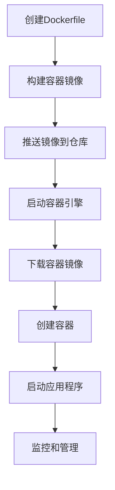

#### 2.3 容器编排与管理工具

容器编排与管理工具用于自动化和管理容器的部署、扩展和监控。常见的容器编排与管理工具包括Docker、Kubernetes和OpenShift等。

**Docker**：Docker是最流行的容器引擎，它提供了简单的容器创建、启动和管理功能。Docker的核心组件包括Docker Engine、Docker Compose和Docker Swarm。

- **Docker Engine**：负责管理容器的创建、启动和停止。
- **Docker Compose**：用于定义和运行多容器应用的文件，它可以自动化部署和管理容器。
- **Docker Swarm**：用于集群管理，可以将多个Docker Engine实例组合成一个集群，提供容器编排和管理功能。

**Kubernetes**：Kubernetes是开源的容器编排平台，它提供了强大的容器编排和管理功能，可以自动化容器的部署、扩展和监控。Kubernetes的核心组件包括：

- **Master Node**：负责集群管理和协调，包括API Server、Controller Manager和Scheduler。
- **Worker Node**：负责运行容器，并接收Master Node的调度指令。
- **Pod**：Kubernetes的基本工作单元，一个Pod可以包含一个或多个容器。
- **Service**：用于暴露Pod，使得外部可以访问Pod中的容器。
- **Deployment**：用于管理Pod的部署，确保Pod按指定的状态运行。

**OpenShift**：OpenShift是红帽公司开发的容器平台，它基于Kubernetes，提供了更多的自动化和抽象功能，如自动扩缩容、服务发现和路由等。

#### 2.4 容器编排与管理的最佳实践

为了确保容器的高效部署和管理，以下是一些容器编排与管理的最佳实践：

1. **容器镜像管理**：使用官方镜像仓库，如Docker Hub，管理容器镜像。定期更新镜像，确保应用程序的安全性和性能。
2. **容器命名规范**：为容器设置明确的命名规则，便于管理和监控。
3. **容器资源配置**：为容器分配适当的CPU和内存资源，避免资源争用和性能瓶颈。
4. **容器网络策略**：使用网络命名空间和虚拟网络，确保容器之间的安全隔离和通信。
5. **容器监控与日志**：集成监控工具和日志管理平台，实时监控容器的性能和状态，及时处理异常和故障。
6. **自动化与编排**：使用容器编排工具（如Kubernetes）实现自动化部署、扩展和监控，提高开发效率和生产效率。

### 小结

容器技术是云原生架构的核心组成部分，它提供了轻量级、一致性和隔离性的运行环境，使得应用程序可以高效、可靠地在不同的计算环境中部署和运行。在下一章中，我们将探讨服务网格技术，这是云原生架构的另一个重要组成部分。敬请期待！

---

通过本章的探讨，我们深入了解了容器技术的基本概念、运行原理以及常见的容器编排与管理工具。在下一章中，我们将探讨服务网格技术，它是云原生架构的另一个重要组成部分。敬请期待！<|im_end|>### 第3章：服务网格技术

服务网格（Service Mesh）是一种用于管理微服务之间通信的架构模式。它提供了一种抽象层，将服务间的通信与业务逻辑分离，使得服务可以独立开发和部署。本章将介绍服务网格的基本概念、原理以及流行的服务网格工具，如Istio和Linkerd。

#### 3.1 服务网格概述

在微服务架构中，服务之间的通信变得非常复杂。每个服务都需要与其他服务进行交互，同时还需要处理各种网络协议、负载均衡、服务发现和故障转移等任务。传统的服务管理方式（如使用DNS或静态配置）已经无法满足微服务架构的需求。

服务网格通过提供一种统一的通信层，解决了微服务之间的通信问题。它将服务间的通信抽象出来，使得服务可以独立关注业务逻辑，无需关注网络通信的细节。服务网格的主要功能包括：

1. **服务发现**：服务网格可以自动发现和注册服务，使得其他服务可以透明地访问它们。
2. **负载均衡**：服务网格可以基于不同的策略，如轮询、最小连接数或响应时间，将流量分配到不同的服务实例。
3. **断路器**：服务网格可以检测服务实例的健康状态，并在服务实例出现故障时自动切换到备用实例。
4. **熔断**：服务网格可以限制对某个服务的访问，防止过载或异常流量对系统造成影响。
5. **安全**：服务网格可以提供加密、身份验证和授权等安全功能，确保服务之间的通信安全可靠。

#### 3.2 服务网格原理

服务网格通过在应用程序和基础设施之间插入一个独立的代理层（Sidecar Proxy）来实现其功能。每个服务实例都会启动一个代理，代理负责处理服务实例之间的通信。服务网格的主要组件包括：

1. **数据平面（Data Plane）**：数据平面由一组代理组成，每个代理都附加到服务实例上，负责处理服务实例之间的网络通信。
2. **控制平面（Control Plane）**：控制平面负责管理数据平面的配置、策略和监控数据。控制平面通常包括一组集中式服务，如服务发现、配置管理、流量管理和监控等。

服务网格的工作原理可以分为以下几个步骤：

1. **服务注册与发现**：服务实例启动时，会向服务网格的控制平面注册。控制平面会维护一个服务实例的列表，并提供服务发现功能。
2. **代理配置**：服务实例启动代理后，代理会从控制平面获取配置信息，包括目标服务的地址、负载均衡策略和路由规则等。
3. **流量转发**：代理根据配置信息，将内部请求转发到目标服务实例。代理还可以处理请求的负载均衡、熔断和超时等策略。
4. **监控与日志**：代理会收集流量数据、错误日志和性能指标，并将这些数据发送到控制平面。控制平面可以基于这些数据进行分析和监控。

**服务网格的Mermaid流程图如下：**

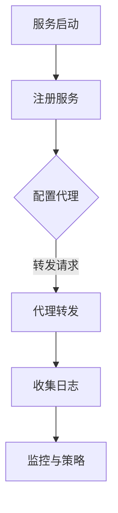

#### 3.3 Istio和Linkerd服务网格深度解析

Istio和Linkerd是当前最流行的两个服务网格工具，它们在功能、架构和实现上都有所不同。

**Istio**

Istio是由Google、IBM和Lyft共同开发的开放服务网格，它提供了丰富的功能，包括服务发现、负载均衡、熔断、超时、重试、加密和监控等。

**Istio的主要组件包括：**

1. **Istio Pilot**：Istio Pilot负责管理服务网格的配置，包括服务实例的地址、负载均衡策略和路由规则等。Pilot将配置信息下发到数据平面代理。
2. **Envoy代理**：Envoy是Istio的数据平面代理，它负责处理服务实例之间的网络通信。Envoy实现了丰富的流量管理功能，如负载均衡、熔断和超时等。
3. **Kubernetes集成**：Istio与Kubernetes深度集成，通过自定义资源（CRDs）管理服务网格配置。Istio还提供了仪表板和命令行工具，用于监控和操作服务网格。

**Istio的工作流程：**

1. **服务注册与发现**：服务实例启动时，会向Kubernetes注册。Istio Pilot会监控Kubernetes API，发现新启动的服务实例。
2. **配置下发**：Istio Pilot根据服务实例的配置，生成代理配置，并将其下发到Envoy代理。
3. **流量转发**：Envoy代理根据配置信息，将内部请求转发到目标服务实例。Envoy还实现了丰富的流量管理功能，如负载均衡、熔断和超时等。
4. **监控与日志**：Envoy代理会收集流量数据、错误日志和性能指标，并将这些数据发送到Prometheus和Grafana等监控工具。

**Linkerd**

Linkerd是由Buoyant公司开发的轻量级服务网格，它专注于服务发现、负载均衡和熔断等功能。

**Linkerd的主要组件包括：**

1. **控制平面**：Linkerd的控制平面负责管理服务网格的配置和监控数据。控制平面包括一个服务发现组件、一个配置管理组件和一个监控组件。
2. **数据平面**：Linkerd的数据平面代理（又称运行时）负责处理服务实例之间的网络通信。数据平面代理实现了丰富的流量管理功能，如负载均衡、熔断和超时等。

**Linkerd的工作流程：**

1. **服务注册与发现**：服务实例启动时，会向服务发现组件注册。服务发现组件会维护一个服务实例的列表，并提供服务发现功能。
2. **配置下发**：控制平面根据服务实例的配置，生成代理配置，并将其下发到数据平面代理。
3. **流量转发**：数据平面代理根据配置信息，将内部请求转发到目标服务实例。数据平面代理实现了丰富的流量管理功能，如负载均衡、熔断和超时等。
4. **监控与日志**：数据平面代理会收集流量数据、错误日志和性能指标，并将这些数据发送到监控组件。

#### 3.4 服务网格的优势与挑战

服务网格为微服务架构带来了诸多优势，同时也面临一些挑战。

**优势：**

1. **服务隔离**：服务网格通过代理实现了服务之间的隔离，使得服务可以独立开发和部署，降低了系统的耦合度。
2. **流量管理**：服务网格提供了丰富的流量管理功能，如负载均衡、熔断和超时等，提高了系统的可靠性和性能。
3. **安全与加密**：服务网格提供了加密、身份验证和授权等安全功能，确保服务之间的通信安全可靠。
4. **监控与日志**：服务网格可以收集和聚合服务实例的监控数据和日志，提供了更全面的系统监控和故障排查能力。

**挑战：**

1. **性能开销**：服务网格在服务实例之间引入了额外的网络跳数，可能会带来一定的性能开销。特别是在高并发的场景下，需要权衡性能与功能之间的平衡。
2. **学习曲线**：服务网格涉及多个组件和配置，对于初学者来说，学习曲线可能相对较高。需要具备一定的网络和容器知识，才能有效地配置和管理服务网格。
3. **兼容性**：服务网格需要与现有的应用程序和基础设施兼容。在某些情况下，可能需要调整应用程序的代码或配置，以适应服务网格的要求。

### 小结

服务网格技术为微服务架构提供了强大的通信管理功能，它通过抽象层分离了业务逻辑和网络通信，使得服务可以独立开发和部署。在下一章中，我们将探讨云原生微服务架构，这是云原生应用的核心设计理念。敬请期待！

---

通过本章的探讨，我们深入了解了服务网格技术的基本概念、原理以及常见的工具。在下一章中，我们将探讨云原生微服务架构，这是云原生应用的核心设计理念。敬请期待！<|im_end|>### 第4章：云原生微服务架构

云原生微服务架构是一种基于云原生技术的应用架构设计方法，它通过将应用程序分解为多个独立的、可重用的服务模块，提高了系统的可扩展性、灵活性和可靠性。本章将探讨微服务架构的基本概念、设计原则以及实施方法。

#### 4.1 微服务架构概述

微服务架构（Microservices Architecture）是一种将复杂应用程序分解为多个独立服务的方法。每个服务都有自己的业务逻辑和数据存储，并且可以通过标准的协议（如HTTP/REST或gRPC）进行通信。

**微服务架构的主要特点包括：**

1. **独立性**：每个服务都是独立的，可以独立部署、扩展和升级，降低了系统的耦合度。
2. **可扩展性**：系统可以根据不同的服务需求进行水平扩展，提高了系统的吞吐量和性能。
3. **灵活性**：服务可以根据业务需求进行独立开发、测试和部署，提高了系统的灵活性和敏捷性。
4. **分布式**：微服务架构是一个分布式系统，服务可以在不同的服务器上运行，提高了系统的可靠性和容错性。
5. **自治性**：每个服务都有自己的数据存储和业务逻辑，可以独立管理和维护。

**微服务架构与传统单体架构相比，具有以下优势：**

1. **可维护性**：微服务架构将应用程序分解为多个独立的服务模块，每个服务都可以独立开发和维护，降低了系统的复杂性。
2. **可扩展性**：微服务架构可以根据不同的服务需求进行水平扩展，提高了系统的吞吐量和性能。
3. **灵活性**：微服务架构支持不同的服务使用不同的技术栈，可以根据业务需求进行灵活选择。
4. **容错性**：微服务架构是分布式的，当某个服务出现故障时，其他服务仍然可以正常运行，提高了系统的可靠性。

#### 4.2 微服务设计原则

在设计微服务架构时，需要遵循一些基本原则，以确保系统的高可用性、可扩展性和可维护性。

1. **单一职责原则**：每个服务应该只负责一个特定的业务功能，保持服务的简单和独立。
2. **松耦合原则**：服务之间应该通过轻量级的通信协议（如HTTP/REST或gRPC）进行通信，避免过度的依赖和耦合。
3. **自治性原则**：每个服务应该拥有自己的数据存储，独立管理和维护，避免共享数据库带来的复杂性。
4. **可扩展性原则**：服务应该设计为可以水平扩展，可以根据业务需求动态调整服务实例的数量。
5. **高可用性原则**：服务应该具备自我恢复的能力，可以在出现故障时快速恢复，保证系统的持续运行。

**微服务设计原则的Mermaid流程图如下：**

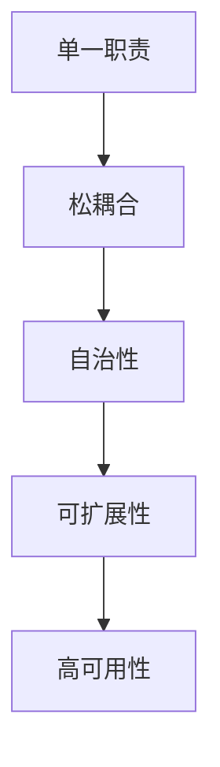

#### 4.3 微服务架构实践

在设计微服务架构时，可以采用以下步骤：

1. **业务划分**：根据业务需求，将应用程序分解为多个独立的业务模块，每个模块可以独立成为一个服务。
2. **服务定义**：为每个服务定义清晰的服务接口，包括API定义、数据模型和通信协议。
3. **服务实现**：根据服务定义，实现每个服务的业务逻辑和数据存储。
4. **服务部署**：将每个服务部署到独立的容器中，使用容器编排工具（如Docker和Kubernetes）进行自动化部署和管理。
5. **服务监控**：集成监控工具（如Prometheus和Grafana），实时监控每个服务的性能和状态，及时发现和解决问题。
6. **服务集成**：通过服务网格（如Istio和Linkerd）实现服务之间的通信，提供负载均衡、熔断和监控等功能。

**微服务架构实现的伪代码如下：**

```python
# 服务A的伪代码
def handle_request(request):
    # 处理业务逻辑
    result = business_logic(request)
    return result

# 服务B的伪代码
def handle_request(request):
    # 调用服务A
    response = call_service('service-a', request)
    # 处理响应
    result = business_logic(response)
    return result
```

#### 4.4 微服务架构的优势

微服务架构具有以下优势：

1. **可维护性**：微服务架构将应用程序分解为多个独立的服务模块，每个服务都可以独立开发和维护，降低了系统的复杂性。
2. **可扩展性**：微服务架构可以根据不同的服务需求进行水平扩展，提高了系统的吞吐量和性能。
3. **灵活性**：微服务架构支持不同的服务使用不同的技术栈，可以根据业务需求进行灵活选择。
4. **容错性**：微服务架构是分布式的，当某个服务出现故障时，其他服务仍然可以正常运行，提高了系统的可靠性。

#### 4.5 微服务架构的挑战

尽管微服务架构具有许多优势，但在实际应用中也面临一些挑战：

1. **复杂性**：微服务架构引入了额外的复杂度，需要管理多个服务实例、通信协议和部署环境。
2. **分布式事务**：微服务架构中的服务可能分布在不同的服务器上，实现分布式事务变得复杂。
3. **数据一致性问题**：微服务架构中的服务可能使用不同的数据存储，实现数据一致性问题需要额外的协调和同步。
4. **监控与日志**：微服务架构中的服务数量众多，实现监控和日志管理变得复杂，需要高效的工具和策略。

#### 4.6 微服务架构的最佳实践

为了成功实施微服务架构，可以遵循以下最佳实践：

1. **服务划分**：根据业务需求，合理划分服务，确保每个服务具有清晰的职责和边界。
2. **服务自治**：为每个服务提供独立的数据存储和业务逻辑，降低服务之间的耦合度。
3. **服务接口标准化**：使用轻量级的通信协议（如HTTP/REST或gRPC）定义服务接口，确保服务之间的通信标准化。
4. **服务监控**：集成监控工具，实时监控每个服务的性能和状态，及时发现和解决问题。
5. **服务网格**：使用服务网格实现服务之间的通信，提供负载均衡、熔断和监控等功能。

### 小结

云原生微服务架构通过将应用程序分解为多个独立的服务模块，提高了系统的可扩展性、灵活性和可靠性。在下一章中，我们将探讨云原生架构的设计方法论，介绍设计原则、流程和方法。敬请期待！

---

通过本章的探讨，我们深入了解了微服务架构的基本概念、设计原则和实施方法。在下一章中，我们将探讨云原生架构的设计方法论，介绍设计原则、流程和方法。敬请期待！<|im_end|>### 第5章：云原生架构设计方法论

云原生架构设计不仅仅是一种技术实现，更是一种设计理念的转变。本章将详细探讨云原生架构设计的方法论，包括设计原则、流程和方法，并通过实际案例展示如何设计和实施云原生架构。

#### 5.1 云原生架构设计原则

在云原生架构设计中，需要遵循以下原则，以确保系统的高可用性、可扩展性和可维护性：

1. **微服务原则**：将应用程序分解为多个独立的微服务，每个服务负责一个特定的业务功能。这有助于提高系统的灵活性、可扩展性和可维护性。
2. **容器化原则**：使用容器技术（如Docker）对应用程序进行封装，实现应用程序及其运行环境的隔离和可移植性。容器化有助于简化部署、扩展和管理过程。
3. **服务网格原则**：使用服务网格（如Istio或Linkerd）实现服务之间的通信和流量管理。服务网格提供了一种抽象层，使得服务可以独立开发和部署，无需关注网络通信的细节。
4. **自动化原则**：采用自动化工具（如Kubernetes）实现应用程序的部署、扩展、监控和故障恢复。自动化有助于提高系统的可靠性和效率。
5. **安全性原则**：在云原生架构中，安全性至关重要。需要采用加密、身份验证和授权等安全措施，确保服务之间的通信安全可靠。
6. **监控原则**：集成监控工具（如Prometheus和Grafana），实时监控系统的性能和状态，及时发现和解决问题。

**云原生架构设计原则的Mermaid流程图如下：**

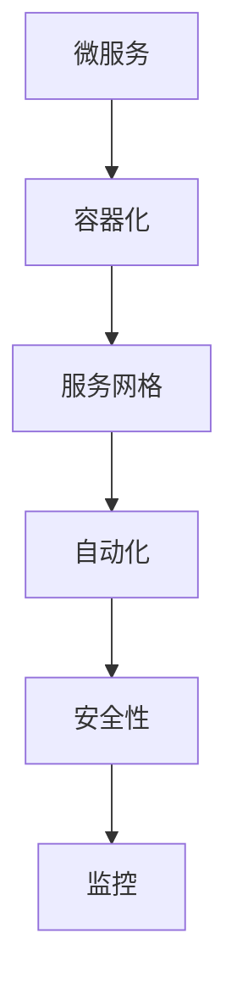

#### 5.2 云原生架构设计流程

云原生架构设计通常包括以下流程：

1. **需求分析**：了解业务需求和系统功能，确定系统的性能、可靠性和可扩展性要求。
2. **架构设计**：根据需求分析结果，设计系统的整体架构，包括服务划分、数据存储、网络通信和安全等方面。
3. **技术选型**：选择合适的技术栈和工具链，如容器编排工具（Kubernetes）、服务网格工具（Istio或Linkerd）和监控工具（Prometheus和Grafana）等。
4. **架构验证**：通过原型验证和模拟测试，验证架构设计的合理性和可行性。
5. **实施与部署**：根据架构设计和技术选型，实现和部署系统，并进行测试和调试。
6. **监控与优化**：实时监控系统的性能和状态，根据监控数据进行分析和优化。

**云原生架构设计流程的Mermaid流程图如下：**

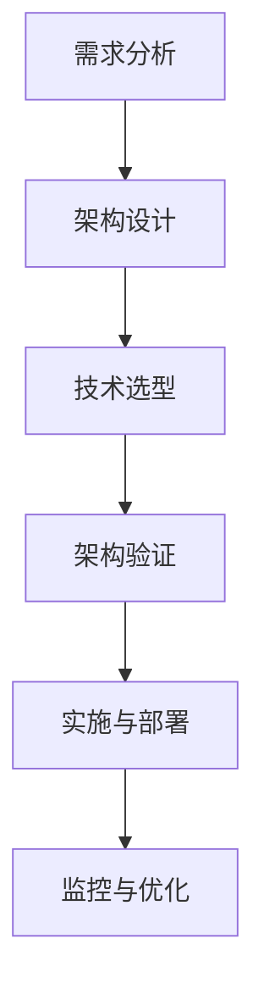

#### 5.3 云原生架构设计案例分析

为了更好地理解云原生架构设计方法，以下是一个具体的案例：一个创业公司开发了一个在线购物平台，需要实现用户管理、商品管理、订单管理和支付等功能。以下是该案例的架构设计过程：

**1. 需求分析**

创业公司的在线购物平台需要满足以下需求：

- **用户管理**：支持用户注册、登录、个人信息管理等功能。
- **商品管理**：支持商品分类、商品信息管理、库存管理等功能。
- **订单管理**：支持订单创建、订单查询、订单取消等功能。
- **支付管理**：支持支付宝和微信支付等功能。

**2. 架构设计**

根据需求分析结果，可以将系统划分为以下微服务：

- **用户服务**：负责用户管理功能。
- **商品服务**：负责商品管理功能。
- **订单服务**：负责订单管理功能。
- **支付服务**：负责支付管理功能。
- **认证服务**：负责用户认证和权限控制。

**3. 技术选型**

- **容器编排工具**：使用Kubernetes进行容器编排和管理。
- **服务网格工具**：使用Istio进行服务网格管理和流量控制。
- **数据存储**：使用MySQL和MongoDB分别存储用户信息和商品信息。
- **监控工具**：使用Prometheus和Grafana进行系统监控和性能分析。

**4. 架构验证**

通过模拟测试和性能测试，验证架构设计的合理性和可行性。测试结果表明，系统可以满足业务需求，具备良好的性能和可靠性。

**5. 实施与部署**

根据架构设计和技术选型，实现和部署系统。使用Kubernetes进行容器编排和管理，使用Istio进行服务网格管理和流量控制，使用MySQL和MongoDB进行数据存储，使用Prometheus和Grafana进行系统监控和性能分析。

**6. 监控与优化**

实时监控系统的性能和状态，根据监控数据进行分析和优化。通过调整资源配置、优化数据库查询和改进代码实现，提高系统的性能和可靠性。

### 小结

云原生架构设计方法论为创业公司提供了设计和实施云原生架构的指导原则和流程。通过合理的服务划分、技术选型和架构验证，创业公司可以构建一个高效、可靠和可扩展的云原生系统。在下一章中，我们将探讨云原生应用开发，介绍开发工具链、最佳实践和性能优化。敬请期待！

---

通过本章的探讨，我们详细了解了云原生架构设计的方法论，包括设计原则、流程和方法。在实际案例中，我们看到了如何根据需求分析和技术选型，设计和实施云原生架构。在下一章中，我们将探讨云原生应用开发，介绍开发工具链、最佳实践和性能优化。敬请期待！<|im_end|>### 第6章：云原生应用开发

云原生应用开发是一个涉及多个技术和工具的综合过程。本章将介绍云原生应用开发的相关工具链，包括开发环境搭建、云原生应用开发最佳实践以及性能优化方法。

#### 6.1 云原生应用开发工具链

云原生应用开发需要一套完整的工具链，以支持应用程序的快速构建、测试和部署。以下是一些常见的云原生应用开发工具：

1. **容器引擎**：Docker和Podman是最流行的容器引擎，用于构建和运行容器化的应用程序。Docker提供了一个简单易用的命令行工具，而Podman适用于那些希望集成到现有系统或避免Docker运行时环境的场景。
   
2. **容器编排工具**：Kubernetes是当前最流行的容器编排工具，它提供了一套强大的API和命令行工具，用于管理容器化应用程序的部署、扩展和监控。

3. **服务网格工具**：Istio和Linkerd是流行的服务网格工具，用于管理微服务之间的通信和流量控制。这些工具提供了负载均衡、服务发现、熔断和监控等功能。

4. **持续集成/持续部署（CI/CD）工具**：Jenkins、GitLab CI/CD和CircleCI等工具可以帮助自动化应用程序的构建、测试和部署过程，提高开发效率。

5. **云服务提供商**：AWS、Azure和Google Cloud等云服务提供商提供了丰富的云原生服务，如容器服务（EKS、AKS、GKE）、托管Kubernetes集群和功能性的服务（如数据库、存储和消息队列）。

6. **监控工具**：Prometheus和Grafana是用于监控云原生应用程序的流行工具，它们可以收集和可视化应用程序的性能指标。

#### 6.2 云原生应用开发最佳实践

在开发云原生应用程序时，应遵循以下最佳实践，以确保系统的可扩展性、可靠性和安全性：

1. **微服务化**：将应用程序分解为多个独立的微服务，每个服务负责一个特定的业务功能。这有助于提高系统的灵活性和可维护性。

2. **容器化**：使用容器化技术将应用程序及其依赖项打包到一个容器中，以便在多个环境中一致运行。这有助于简化部署和扩展过程。

3. **基础设施即代码**：使用基础设施即代码（IaC）工具（如Terraform和Ansible）自动化基础设施的创建和管理，以确保环境的可重复性和一致性。

4. **持续集成和持续部署**：实现自动化构建、测试和部署流程，以快速反馈代码更改的影响，并确保高质量的交付。

5. **服务发现和负载均衡**：使用服务网格工具或Kubernetes的服务发现和负载均衡功能，以动态分配流量并提高系统的可用性。

6. **故障恢复**：实现自动化的故障恢复机制，如重新启动失败的容器、迁移流量到健康的实例或自动扩缩容。

7. **安全**：确保应用程序和基础架构的安全性，包括加密通信、使用强密码策略、实施身份验证和授权机制。

8. **监控和日志**：集成监控工具和日志管理平台，实时监控应用程序的性能和状态，以便快速诊断和解决问题。

#### 6.3 云原生应用性能优化

云原生应用程序的性能优化是一个关键环节，以下是一些常用的优化策略：

1. **资源调优**：为容器分配适当的CPU和内存资源，避免资源不足或过度分配。使用资源限制和资源请求来优化容器的资源使用。

2. **网络优化**：优化容器之间的通信，包括使用合理的网络命名空间和标签，以减少网络延迟和冲突。使用服务网格工具（如Istio）进行智能流量管理和路由。

3. **数据库优化**：对于使用数据库的应用程序，优化数据库查询和索引，减少查询响应时间和数据读取延迟。考虑使用缓存技术（如Redis）来减少数据库负载。

4. **代码优化**：对应用程序的代码进行优化，包括减少不必要的API调用、优化算法和减少内存使用。

5. **部署策略**：使用Kubernetes的部署策略（如滚动更新和蓝绿部署）来减少部署过程中的停机时间和服务中断。

6. **监控与反馈**：实时监控应用程序的性能和状态，收集性能数据并进行分析。根据监控数据调整配置和代码，持续优化性能。

**云原生应用性能优化的伪代码如下：**

```python
# 性能监控和调优的伪代码
while True:
    # 获取当前性能指标
    current_metrics = get_performance_metrics()
    
    # 分析性能指标
    if metrics_are_unhealthy(current_metrics):
        # 调整配置
        adjust_configuration()
        
        # 重新部署应用程序
        redeploy_application()
        
        # 记录调优日志
        log_tuning_action()
```

### 小结

云原生应用开发涉及多个工具和技术的整合，通过最佳实践和性能优化策略，可以构建出高效、可靠和可扩展的应用程序。在下一章中，我们将探讨云原生安全与运维，介绍云原生系统面临的安全威胁、防护措施和运维策略。敬请期待！

---

通过本章的探讨，我们详细了解了云原生应用开发的工具链、最佳实践和性能优化方法。这些知识将帮助开发人员构建出高效、可靠和可扩展的云原生应用程序。在下一章中，我们将探讨云原生安全与运维，敬请期待！<|im_end|>### 第7章：云原生安全与运维

在云原生环境中，安全性和运维是确保系统稳定性和可靠性的关键。本章将介绍云原生系统面临的安全威胁、防护措施以及运维策略和实践。

#### 7.1 云原生安全威胁分析

云原生系统面临以下主要安全威胁：

1. **容器逃逸**：容器逃逸是指攻击者通过容器获得了宿主机的权限，从而可能访问其他容器或宿主机上的敏感数据。攻击者可能利用容器中的漏洞或错误配置实现逃逸。
2. **数据泄露**：容器和微服务架构中的多个服务可能共享同一数据库或数据存储，导致数据泄露的风险增加。未经授权的访问或配置错误可能导致敏感数据泄露。
3. **服务端攻击**：云原生环境中的服务可能成为攻击目标，如拒绝服务攻击（DDoS）、SQL注入和跨站脚本攻击（XSS）等。
4. **容器镜像漏洞**：容器镜像可能包含已知的漏洞或恶意代码，这些漏洞或代码可能在部署时被利用。
5. **身份验证和授权漏洞**：云原生环境中的身份验证和授权机制可能存在漏洞，如弱密码策略、不安全的证书和未经授权的访问等。
6. **配置错误**：容器和微服务的配置错误可能导致安全漏洞，如暴露的端口、不正确的网络配置和安全组设置等。

#### 7.2 云原生安全防护措施

为了应对上述安全威胁，可以采取以下防护措施：

1. **容器镜像扫描**：在部署容器镜像之前，使用工具（如Clair或Docker Bench for Security）扫描镜像中的漏洞和恶意代码，确保镜像的安全。
2. **最小权限原则**：容器和微服务应遵循最小权限原则，只授予必要的权限和资源，以减少潜在的攻击面。
3. **加密和加密存储**：使用加密技术保护容器和微服务之间的通信，如TLS/SSL，并使用加密存储保护数据。
4. **容器命名和标签**：使用明确的命名和标签规则来区分不同的容器和微服务，以防止误操作和未经授权的访问。
5. **网络隔离**：使用网络命名空间和虚拟网络（如AWS VPC或Kubernetes网络）实现容器和微服务之间的隔离，防止横向攻击。
6. **访问控制**：使用身份验证和授权机制（如OAuth 2.0或Kubernetes RBAC），确保只有授权的用户和应用程序可以访问服务和资源。
7. **定期更新**：定期更新容器镜像和微服务，修补已知的漏洞和错误。
8. **日志和监控**：集成日志管理工具（如ELK堆栈）和监控工具（如Prometheus和Grafana），实时监控系统安全事件和异常行为。

#### 7.3 云原生运维策略与实践

云原生运维涉及到系统部署、监控、扩缩容和故障恢复等方面。以下是一些云原生运维的最佳实践：

1. **自动化部署**：使用CI/CD工具自动化应用程序的构建、测试和部署，确保快速、可靠和一致的部署流程。
2. **自动化扩缩容**：使用Kubernetes的自动扩缩容功能，根据系统负载自动调整容器实例的数量，确保系统的高可用性和性能。
3. **自动化监控**：集成监控工具，实时监控系统的性能、健康状态和安全事件，及时识别和解决问题。
4. **日志管理**：使用日志聚合工具（如Fluentd或Logstash）收集和存储容器和微服务的日志，以便分析和排查问题。
5. **故障恢复**：实现自动化的故障恢复机制，如自动重启失败的容器、迁移流量到健康的实例或自动扩缩容。
6. **备份和恢复**：定期备份数据和配置文件，确保在系统故障或数据丢失时可以快速恢复。
7. **文档和知识库**：建立系统文档和知识库，记录运维过程中的关键步骤和配置，便于团队成员之间的协作和知识共享。

**云原生运维策略的Mermaid流程图如下：**

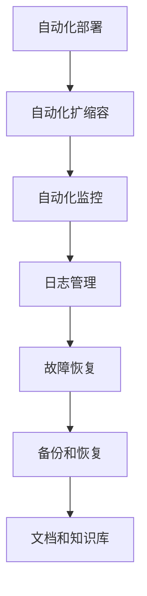

#### 7.4 实践案例

以下是一个创业公司使用云原生技术进行运维的案例：

**案例背景**：某创业公司使用Kubernetes和Docker进行应用程序的部署和管理。该公司需要实现自动化的部署、扩缩容和监控，以提高系统的可靠性和运维效率。

**解决方案**：

1. **自动化部署**：使用Jenkins实现应用程序的自动化构建和部署。每次代码提交后，Jenkins会自动构建应用程序镜像，并将其推送到镜像仓库。Kubernetes会根据部署配置，自动部署和更新应用程序实例。

2. **自动化扩缩容**：使用Kubernetes的Horizontal Pod Autoscaler（HPA），根据CPU使用率自动调整应用程序实例的数量。当系统负载增加时，HPA会自动创建新的实例以应对流量增长；当系统负载降低时，HPA会自动删除多余的实例以节省资源。

3. **自动化监控**：使用Prometheus和Grafana实时监控应用程序的性能和状态。Prometheus会收集应用程序的指标数据，并将数据存储在时间序列数据库中。Grafana提供了一个图形化的仪表板，用于可视化监控数据和告警配置。

4. **日志管理**：使用Fluentd收集应用程序的日志，并将其发送到Elasticsearch和Kibana。Elasticsearch和Kibana提供了一个集中化的日志分析平台，用于实时日志搜索、分析和告警。

5. **故障恢复**：使用Kubernetes的StatefulSet和ReplicaSet，确保应用程序实例在失败时自动重启。此外，Kubernetes的Taints和Tolerations功能用于实现自动故障转移，确保应用程序实例在不同节点之间均衡分布。

6. **备份和恢复**：使用Kubernetes的Persistent Volumes（PV）和Persistent Volume Claims（PVC），定期备份数据和配置文件。当系统故障或数据丢失时，可以使用备份快速恢复。

### 小结

云原生安全与运维是确保系统稳定性和可靠性的关键。通过识别安全威胁、实施防护措施和遵循运维最佳实践，创业公司可以构建一个高效、安全和可靠的云原生系统。在下一章中，我们将探讨云原生项目实战，通过实际案例展示云原生架构的应用和实现。敬请期待！

---

通过本章的探讨，我们深入了解了云原生系统面临的安全威胁、防护措施以及运维策略和实践。在下一章中，我们将通过实际案例展示云原生架构的应用和实现。敬请期待！<|im_end|>### 第8章：云原生项目实战

在实际应用中，云原生技术通过其弹性、自动化和可靠性的优势，为创业公司提供了强大的支持。本章节将通过一个具体的案例，详细解析云原生项目的背景、架构设计、开发与部署流程，以及测试与性能优化。

#### 8.1 项目背景与需求分析

某创业公司开发了一个在线教育平台，旨在为用户提供在线课程学习、视频观看、互动交流等功能。随着用户规模的扩大，平台需要具备高并发处理能力、弹性扩展能力和高可用性。为了满足这些需求，公司决定采用云原生技术构建其应用程序。

**项目需求：**

1. **高并发处理**：平台需要能够处理成千上万的并发请求，保证用户访问的流畅性。
2. **弹性扩展**：平台需要根据用户访问量的变化，自动调整资源，确保系统稳定运行。
3. **高可用性**：平台需要实现高可用性，确保在任何情况下都能为用户提供服务。
4. **安全性**：平台需要确保用户数据的安全和隐私。
5. **易于运维**：平台需要支持自动化部署、监控和故障恢复。

#### 8.2 项目架构设计与实现

为了满足上述需求，公司采用云原生架构设计其在线教育平台，主要架构设计如下：

1. **前端架构**：前端采用React框架，通过组件化设计，提高了开发效率和代码可维护性。前端服务通过API与后端服务进行交互，使用RESTful API和gRPC协议。

2. **后端架构**：后端服务采用微服务架构，将功能模块划分为用户管理、课程管理、视频管理和互动交流等微服务。每个微服务都部署在独立的容器中，通过Kubernetes进行管理和调度。

3. **服务网格**：使用Istio作为服务网格，实现微服务之间的通信和安全控制。Istio提供了自动化的服务发现、负载均衡、熔断和监控功能，提高了系统的可靠性和性能。

4. **数据库架构**：用户数据和课程数据存储在MySQL数据库中，使用分库分表策略提高数据存储和查询性能。视频数据存储在对象存储服务（如AWS S3），通过CORS策略供前端访问。

5. **消息队列**：使用RabbitMQ作为消息队列，处理用户之间的消息传递和系统通知，提高了系统的解耦性和可靠性。

**项目架构的Mermaid流程图如下：**

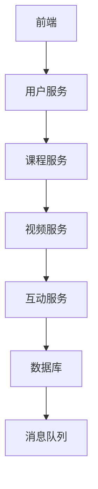

#### 8.3 项目开发与部署流程

项目的开发与部署流程主要包括以下步骤：

1. **代码管理**：使用Git进行代码管理，团队成员协作开发，确保代码的版本控制。
2. **容器化**：使用Docker将应用程序及其依赖项打包成容器镜像。开发人员编写Dockerfile，定义容器镜像的构建过程。
3. **自动化构建**：使用Jenkins实现自动化构建和测试。每次代码提交后，Jenkins会自动构建容器镜像，并进行单元测试和集成测试。
4. **镜像仓库**：将构建成功的容器镜像推送到镜像仓库（如Docker Hub），以便后续部署。
5. **自动化部署**：使用Kubernetes进行自动化部署。Kubernetes根据部署配置文件（YAML文件），自动部署和更新应用程序实例。
6. **监控与告警**：使用Prometheus和Grafana进行系统监控。Prometheus收集应用程序的指标数据，并将数据存储在时间序列数据库中。Grafana提供可视化仪表板和告警功能，实时监控系统的性能和状态。

**项目开发与部署流程的Mermaid流程图如下：**

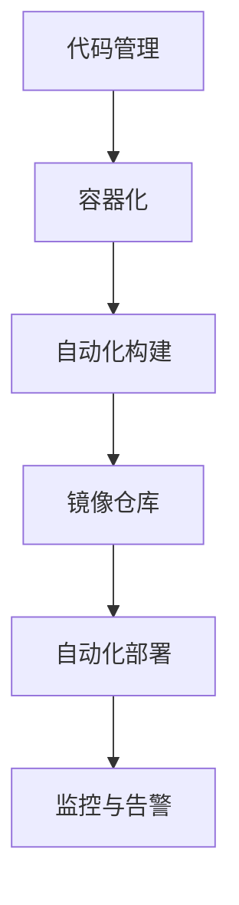

#### 8.4 项目测试与性能优化

为了确保系统的稳定性和性能，项目团队进行了以下测试和优化：

1. **负载测试**：使用Apache JMeter模拟大量并发用户，测试系统在高负载下的性能和稳定性。通过调整服务器配置、优化数据库查询和代码优化，提高系统的并发处理能力。
2. **性能监控**：使用Prometheus和Grafana实时监控系统的性能指标，如CPU使用率、内存使用率、响应时间和错误率。根据监控数据，及时发现问题并进行优化。
3. **数据库优化**：通过索引优化、查询优化和分库分表策略，提高数据库的查询性能和并发处理能力。使用数据库连接池技术，减少数据库连接的开销。
4. **代码优化**：对关键算法和业务逻辑进行优化，减少不必要的计算和IO操作。使用代码分析工具（如SonarQube），检查代码质量和性能瓶颈。
5. **缓存策略**：使用Redis缓存热门数据和频繁查询的数据，减少数据库负载和查询延迟。采用分布式缓存架构，提高缓存系统的可靠性和性能。
6. **服务网格优化**：通过调整Istio的配置，优化服务网格的性能和可靠性。使用流量控制策略，合理分配流量，避免单点瓶颈。

**项目测试与性能优化的伪代码如下：**

```python
# 性能测试伪代码
while True:
    # 模拟用户请求
    user_request = generate_user_request()
    
    # 发送请求并记录响应时间
    response_time = send_request(user_request)
    
    # 分析响应时间
    if response_time > max_response_time:
        # 记录性能问题
        log_performance_issue(response_time)
        
        # 调整配置和代码
        adjust_configuration_and_code()

# 性能优化伪代码
def optimize_performance():
    # 优化数据库查询
    optimize_database_queries()

    # 优化代码
    optimize_code()

    # 调整服务网格配置
    adjust_service_mesh_configuration()
```

### 小结

通过上述案例，我们详细解析了云原生项目从背景、架构设计到开发与部署流程，以及测试与性能优化的全过程。云原生技术为创业公司提供了强大的支持，帮助其快速构建、部署和优化应用程序。在下一章中，我们将探讨创业公司云原生转型的策略和案例分析。敬请期待！

---

通过本章的探讨，我们通过一个实际案例详细展示了云原生项目的背景、架构设计、开发与部署流程，以及测试与性能优化。这些实践为创业公司提供了宝贵的经验和参考。在下一章中，我们将探讨创业公司云原生转型的策略和案例分析。敬请期待！<|im_end|>### 第9章：创业公司云原生转型策略

对于创业公司来说，云原生技术的转型既是一个巨大的机遇，也是一个巨大的挑战。成功的云原生转型可以显著提高公司的竞争力，但转型过程中也面临着诸多挑战。本章将探讨创业公司云原生转型的策略，分析转型过程中可能遇到的挑战，并提供具体的案例分析。

#### 9.1 创业公司云原生转型的挑战

**1. 技术选型与架构设计**

创业公司在进行云原生转型时，首先需要面对技术选型问题。市场上存在多种云原生技术和工具，如容器编排工具（Kubernetes、Docker Swarm）、服务网格工具（Istio、Linkerd）和云服务提供商（AWS、Azure、Google Cloud）。选择合适的技术栈对于转型成功至关重要，但这也带来了决策的复杂性。

**2. 团队建设与技能转移**

云原生技术涉及多种新技术和工具，创业公司的团队可能缺乏相关的经验和技能。如何快速培养团队的能力，确保团队能够熟练掌握和运用这些新技术，是转型过程中的一个重要挑战。

**3. 系统整合与兼容性**

创业公司可能已经拥有一定的系统架构和业务流程。在转型过程中，如何将现有系统与云原生架构整合，保持业务的连续性，是一个需要仔细考虑的问题。

**4. 风险管理与安全控制**

云原生环境中的安全性风险较大，如何确保数据的安全和隐私，如何有效地进行风险管理和安全控制，是创业公司在转型过程中需要面对的重要挑战。

**5. 成本预算与资源调配**

云原生转型通常需要一定的预算和资源投入。如何合理规划和调配资源，确保在转型过程中不会对公司的运营造成过大影响，是一个需要考虑的问题。

#### 9.2 创业公司云原生转型的策略

**1. 明确转型目标与愿景**

在转型之前，创业公司需要明确转型的目标与愿景。这包括提高系统的可扩展性、灵活性和可靠性，以及提升开发效率和运营效率。明确的目标和愿景有助于制定具体的转型策略。

**2. 制定详细的转型计划**

创业公司需要制定详细的转型计划，包括技术选型、团队建设、系统整合、风险管理等方面的具体措施。转型计划应具有可操作性和灵活性，以应对转型过程中的不确定性。

**3. 技术选型与工具链构建**

在技术选型方面，创业公司应充分考虑自身业务需求、团队技能和成本预算。选择合适的云原生工具链，如容器编排工具、服务网格工具、持续集成/持续部署（CI/CD）工具等。构建一个完整的云原生工具链，为转型提供技术保障。

**4. 团队建设与培训**

创业公司应重视团队建设，通过内部培训和外部合作，提升团队在云原生技术方面的技能。可以邀请行业专家进行培训，也可以通过参与开源社区、技术研讨会等活动，积累经验和知识。

**5. 系统整合与兼容性测试**

在系统整合方面，创业公司应逐步将现有系统与云原生架构相结合。首先选择一部分业务模块进行云原生化，通过A/B测试验证转型的效果。同时，进行兼容性测试，确保现有业务流程与云原生架构的兼容性。

**6. 风险管理与安全控制**

创业公司应建立完善的风险管理和安全控制机制，确保转型过程中的数据安全和隐私。采用加密技术、访问控制和监控工具等手段，加强对系统的安全保护。同时，定期进行安全审计和风险评估，及时发现和解决潜在的安全问题。

**7. 成本预算与资源调配**

在成本预算方面，创业公司应进行详细的成本估算，合理安排预算。可以通过云计算服务提供商的弹性资源调配策略，根据业务需求动态调整资源，以降低成本。同时，通过自动化和优化手段，提高资源利用率，降低运营成本。

#### 9.3 创业公司云原生转型的案例分析

以下是一个创业公司成功实施云原生转型的案例分析：

**案例背景**：某创业公司开发了一款社交应用，随着用户数量的增加，系统面临着高并发处理、弹性扩展和安全性的挑战。为了应对这些挑战，公司决定进行云原生转型。

**转型策略**：

1. **技术选型**：选择Kubernetes作为容器编排工具，Istio作为服务网格工具，Docker用于容器化应用程序。同时，采用AWS作为云服务提供商。

2. **团队建设**：公司邀请了几位有经验的云原生专家加入团队，进行内部培训，提升团队在云原生技术方面的能力。

3. **系统整合**：公司首先将用户服务和消息服务模块进行云原生化，通过A/B测试验证转型的效果。同时，进行兼容性测试，确保现有业务流程与云原生架构的兼容性。

4. **风险管理与安全控制**：公司采用TLS加密、多因素认证和Kubernetes RBAC等安全措施，加强对系统的安全保护。同时，定期进行安全审计和风险评估。

5. **成本预算与资源调配**：公司通过AWS的弹性计算服务（EC2）和自动扩缩容策略，根据用户需求动态调整资源，降低运营成本。

**转型效果**：

- 系统的响应时间显著降低，用户体验得到提升。
- 系统的弹性扩展能力得到增强，能够自动应对用户增长带来的负载压力。
- 系统的安全性得到加强，数据泄露和攻击风险降低。
- 通过自动化和优化，公司的运营成本得到有效控制。

**小结**

创业公司的云原生转型是一个复杂的过程，需要明确的策略和详细的规划。通过合理的策略和有效的实施，创业公司可以成功实现云原生转型，提高系统的可扩展性、灵活性和可靠性，增强竞争力。在下一章中，我们将探讨创业公司云原生团队建设，介绍团队建设原则、角色与职责以及协作与沟通工具。敬请期待！

---

通过本章的探讨，我们分析了创业公司云原生转型的挑战和策略，并通过实际案例展示了转型的过程和效果。在下一章中，我们将探讨创业公司云原生团队建设，介绍团队建设原则、角色与职责以及协作与沟通工具。敬请期待！<|im_end|>### 第10章：创业公司云原生团队建设

在创业公司成功实施云原生转型过程中，团队建设是至关重要的一环。一个高效的云原生团队不仅能够快速掌握新技术，还能够灵活应对业务需求的变化。本章将介绍创业公司云原生团队建设的原则、角色与职责，以及团队协作与沟通工具。

#### 10.1 云原生团队建设原则

创业公司在建设云原生团队时，应遵循以下原则：

1. **技术多样性**：团队成员应具备多样化的技术背景，包括容器技术、服务网格、微服务架构、云计算和自动化工具等，以确保团队在面对不同技术挑战时具备应对能力。
2. **经验积累**：团队成员应具备一定的云原生项目经验，了解云原生架构的最佳实践，并能够结合实际业务场景提出解决方案。
3. **知识共享**：鼓励团队成员之间进行知识共享和经验交流，通过内部培训和外部学习，不断提升团队的整体技术能力。
4. **敏捷协作**：团队应采用敏捷开发方法，以快速响应业务需求变化，提高开发效率和系统质量。
5. **持续改进**：团队应不断反思和改进开发流程、工具和策略，以保持技术领先和业务竞争力。

#### 10.2 云原生团队角色与职责

在云原生团队中，常见的角色与职责包括：

1. **云原生架构师**：负责整体云原生架构的设计和优化，确保系统的高可用性、可扩展性和可靠性。架构师还需与业务团队紧密合作，理解业务需求，制定符合业务场景的架构方案。
2. **开发工程师**：负责开发云原生应用程序，包括容器化、服务部署和微服务开发等。开发工程师需要熟悉容器技术、服务网格和自动化工具，能够独立完成功能模块的开发和测试。
3. **运维工程师**：负责云原生系统的运维工作，包括系统监控、故障处理、扩缩容和自动化运维等。运维工程师需要具备较强的故障排查能力和自动化脚本编写能力，能够确保系统的稳定运行。
4. **测试工程师**：负责云原生应用程序的测试工作，包括单元测试、集成测试和性能测试等。测试工程师需要了解云原生架构的特点，能够设计合理的测试用例，确保系统的质量。
5. **安全工程师**：负责云原生系统的安全防护工作，包括安全策略制定、安全审计和安全漏洞修复等。安全工程师需要了解常见的网络安全威胁和防护措施，能够确保系统的安全性和数据隐私。
6. **产品经理**：负责与业务团队沟通，理解业务需求，与云原生团队协作，确保产品功能的实现和上线。

**云原生团队角色与职责的Mermaid流程图如下：**

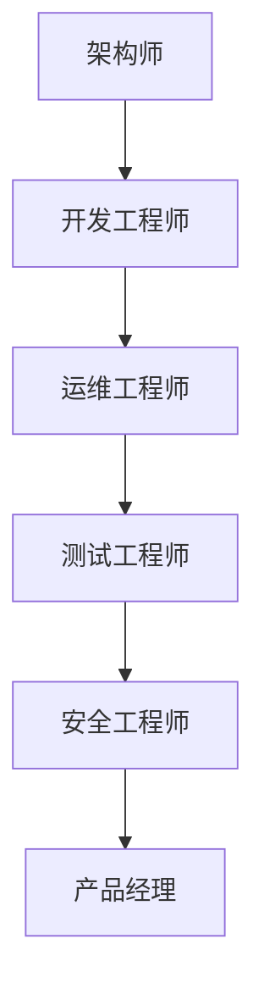

#### 10.3 云原生团队协作与沟通工具

为了确保云原生团队的协作与沟通，可以采用以下工具：

1. **代码管理工具**：Git是版本控制工具的首选，支持多人协作，确保代码的一致性和版本管理。
2. **代码审查工具**：GitHub、GitLab和Bitbucket等代码管理工具提供了代码审查功能，可以确保代码的质量和安全性。
3. **项目管理工具**：Jira、Trello和Asana等项目管理工具可以帮助团队进行任务分配、进度跟踪和协作管理。
4. **协作沟通工具**：Slack、Microsoft Teams和WhatsApp等即时通讯工具可以方便团队成员之间的沟通和协作。
5. **视频会议工具**：Zoom、Microsoft Teams和Google Meet等视频会议工具支持远程团队进行实时沟通和协作。
6. **知识库和文档管理工具**：Confluence、Notion和GitBook等知识库和文档管理工具可以存储团队的知识和文档，方便团队成员之间的学习和查阅。

**云原生团队协作与沟通工具的Mermaid流程图如下：**

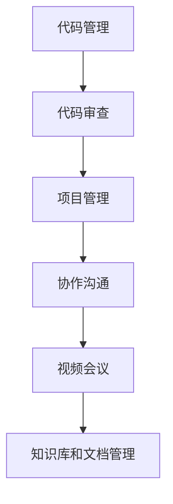

#### 10.4 团队文化建设

团队文化是团队凝聚力和工作效率的关键。创业公司应注重团队文化建设，营造积极向上的工作氛围：

1. **尊重与信任**：建立相互尊重和信任的工作环境，鼓励团队成员自由表达意见和想法。
2. **开放与包容**：鼓励团队成员分享知识和经验，尊重不同的观点和文化差异，建立开放和包容的团队氛围。
3. **持续学习**：鼓励团队成员不断学习和提升技能，通过内部培训和外部学习机会，提升团队整体的技术水平。
4. **团队合作**：强调团队合作的重要性，鼓励团队成员共同解决问题，共同承担项目责任。
5. **正面激励**：通过奖励和表彰机制，激励团队成员的积极性和创造力，营造积极向上的工作氛围。

**云原生团队文化建设的Mermaid流程图如下：**

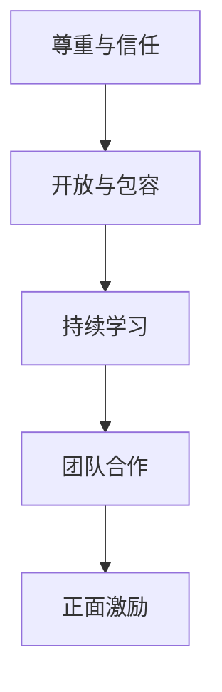

### 小结

创业公司云原生团队建设是一个系统性的过程，需要明确团队建设原则、合理分配角色与职责，并采用合适的协作与沟通工具。通过有效的团队建设，创业公司可以培养一支高效的云原生团队，为公司的持续发展提供强有力的支持。在下一章中，我们将探讨创业公司云原生生态建设，介绍生态系统的构建和实践。敬请期待！

---

通过本章的探讨，我们详细介绍了创业公司云原生团队建设的原则、角色与职责，以及团队协作与沟通工具。在下一章中，我们将探讨创业公司云原生生态建设，介绍生态系统的构建和实践。敬请期待！<|im_end|>### 第11章：创业公司云原生生态建设

在创业公司成功实施云原生转型后，构建一个健康的云原生生态系统至关重要。云原生生态系统不仅包括公司内部的技术和团队，还涉及合作伙伴、客户和开发者。本章将介绍创业公司云原生生态系统的概述、构建方法以及实际案例分析。

#### 11.1 云原生生态概述

云原生生态系统是一个多维度的生态系统，它涉及以下几个方面：

1. **技术组件**：包括容器技术、服务网格、微服务架构、持续集成/持续部署（CI/CD）流程、监控和日志管理等。
2. **开发者和用户**：云原生生态系统吸引了大量的开发者，他们使用云原生技术构建应用程序，并为生态系统贡献代码和工具。
3. **合作伙伴**：包括云服务提供商、第三方服务供应商、咨询公司和社区组织等，他们为创业公司提供技术支持、培训和解决方案。
4. **客户**：创业公司的客户是生态系统的重要组成部分，他们的反馈和使用情况影响着生态系统的演进。
5. **开源社区**：开源社区是云原生生态系统的重要驱动力，它促进了技术的创新和共享，为创业公司提供了丰富的资源和灵感。

#### 11.2 云原生生态系统构建方法

创业公司构建云原生生态系统的关键步骤如下：

1. **明确生态愿景**：创业公司需要明确自身的生态愿景，包括生态的目标、价值主张以及如何为合作伙伴、开发者和客户提供价值。
2. **技术选型和工具链**：选择合适的云原生技术和工具链，如Kubernetes、Docker、Istio、Prometheus等，构建一个稳定和可扩展的云原生基础架构。
3. **社区建设和推广**：积极参与开源社区，贡献代码和工具，举办技术沙龙、研讨会和在线交流活动，吸引更多的开发者加入生态系统。
4. **合作伙伴关系**：与云服务提供商、第三方服务供应商和咨询公司建立合作伙伴关系，共同推动生态系统的建设和发展。
5. **客户支持与服务**：提供全面的客户支持和服务，包括技术支持、培训、咨询服务和案例分享，帮助客户成功采用云原生技术。
6. **持续迭代与优化**：根据生态系统的反馈和需求，不断优化和迭代技术组件和服务，确保生态系统的健康和可持续发展。

**云原生生态系统构建的Mermaid流程图如下：**

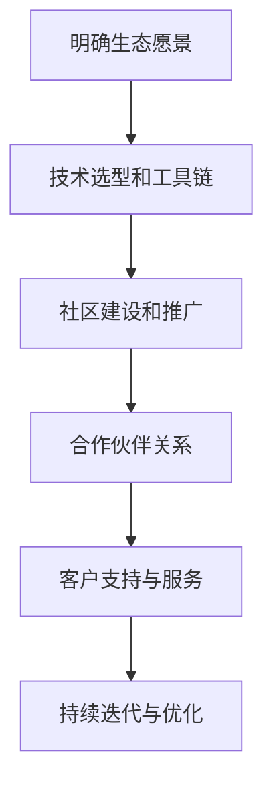

#### 11.3 创业公司云原生生态案例分析

以下是一个创业公司成功构建云原生生态系统的案例分析：

**案例背景**：某创业公司开发了一个基于云原生技术的企业级容器管理平台，为企业的容器化应用程序提供自动化部署、监控和管理功能。为了构建一个健康的云原生生态系统，公司采取了以下措施：

1. **明确生态愿景**：公司明确了生态愿景，目标是成为企业级容器管理领域的领导者，为合作伙伴、开发者和客户提供高质量的技术和服务。
2. **技术选型和工具链**：公司选择了Kubernetes作为容器编排工具，Docker用于容器化应用程序，Istio作为服务网格工具，Prometheus和Grafana进行监控和日志管理。
3. **社区建设和推广**：公司积极参与开源社区，贡献了多个开源项目，并举办了多次技术沙龙和研讨会，吸引了大量开发者关注和参与。
4. **合作伙伴关系**：公司与多家云服务提供商和第三方服务供应商建立了合作伙伴关系，共同为企业的客户提供全面的技术支持和服务。
5. **客户支持与服务**：公司提供全面的客户支持和服务，包括技术支持、培训、咨询服务和案例分享，帮助客户成功采用云原生技术。
6. **持续迭代与优化**：根据生态系统的反馈和需求，公司不断优化和迭代技术组件和服务，确保生态系统的健康和可持续发展。

**生态效果**：

- 公司的云原生容器管理平台在市场上获得了广泛的认可，客户数量和收入持续增长。
- 开发者社区逐渐形成，贡献了大量的代码和工具，提升了平台的可扩展性和灵活性。
- 合作伙伴关系的建立，为公司的客户提供了更全面的技术支持和服务，增强了客户满意度。
- 公司通过持续迭代与优化，不断提升技术组件和服务质量，保持了在市场上的竞争力。

### 小结

创业公司构建云原生生态系统是一个系统性工程，需要明确生态愿景、技术选型和合作伙伴关系，并持续迭代与优化。通过构建健康的云原生生态系统，创业公司可以吸引更多的合作伙伴、开发者和客户，提升市场竞争力，实现可持续发展。在下一章中，我们将探讨创业公司云原生未来展望，分析发展趋势和机遇与挑战。敬请期待！

---

通过本章的探讨，我们详细介绍了创业公司云原生生态系统的概述、构建方法以及实际案例分析。在下一章中，我们将探讨创业公司云原生未来展望，分析发展趋势和机遇与挑战。敬请期待！<|im_end|>### 第12章：创业公司云原生未来展望

随着云计算、容器技术和微服务架构的不断发展，云原生技术正在逐步成为企业应用的主流。对于创业公司来说，云原生技术不仅提供了高效、灵活和可靠的开发与部署方式，还带来了新的业务模式和增长机遇。本章将分析云原生技术的发展趋势，探讨创业公司在云原生时代面临的机遇与挑战，并提出相应的应对策略。

#### 12.1 云原生发展趋势

**1. 微服务架构的普及**

微服务架构作为云原生技术的重要组成部分，其普及率正在不断提高。越来越多的创业公司将应用程序拆分为多个微服务，以实现更灵活的开发、部署和扩展。未来，微服务架构将更加成熟，服务发现、负载均衡、熔断和监控等功能将更加完善。

**2. 服务网格技术的发展**

服务网格技术为微服务架构提供了通信层的管理与优化，使得微服务之间的通信更加可靠和安全。随着服务网格技术的不断成熟，其应用范围将不断扩大，包括跨云和跨服务的通信管理。

**3. 自动化与智能化的融合**

云原生技术的自动化程度正在不断提高，从容器编排到服务网格，再到持续集成/持续部署（CI/CD），自动化工具已经成为云原生架构的核心。未来，随着人工智能和机器学习技术的发展，智能化将逐步融入云原生架构，实现更加智能化的部署、监控和优化。

**4. 容器编排与管理的统一**

目前，市场上存在多种容器编排工具（如Kubernetes、Docker Swarm、Amazon EKS等），创业公司在选择时可能会感到困惑。未来，容器编排与管理的统一化趋势将增强，一些大型的云服务提供商和开源社区可能会推动统一的容器编排标准，简化创业公司的选择和实施过程。

#### 12.2 创业公司在云原生时代的机遇

**1. 提高开发效率**

云原生技术通过自动化和容器化，大大提高了开发效率。开发人员可以更加专注于业务逻辑的实现，而无需担心底层基础设施的配置和管理。这有助于创业公司快速响应市场需求，提高产品的迭代速度。

**2. 降低运营成本**

云原生技术使得创业公司可以根据业务需求动态调整资源，实现按需付费。此外，自动化运维和智能监控技术可以显著降低人力成本和运营成本。

**3. 提高系统的可靠性和可扩展性**

云原生架构通过分布式和微服务化，提高了系统的可靠性和可扩展性。当业务需求发生变化时，创业公司可以轻松地进行水平扩展，确保系统的高可用性和性能。

**4. 拓展新的业务模式**

云原生技术为创业公司提供了更灵活的部署和运营方式，可以探索新的业务模式，如SaaS、PaaS等。这有助于创业公司在竞争激烈的市场中找到独特的定位，扩大市场份额。

#### 12.3 创业公司在云原生时代的挑战

**1. 技术选型困难**

市场上存在多种云原生技术和工具，创业公司在选择时可能会感到困惑。如何选择合适的技术栈，确保技术栈的可持续性和扩展性，是一个重要的挑战。

**2. 技术团队建设**

云原生技术要求团队具备多方面的技能，包括容器技术、服务网格、微服务架构、自动化和智能化等。创业公司在组建技术团队时，可能会面临招聘和培养人才的挑战。

**3. 安全与合规**

随着系统的复杂性和规模的增长，云原生环境中的安全风险和合规要求也在增加。创业公司需要建立完善的安全控制机制，确保系统的安全性和数据的隐私。

**4. 市场竞争加剧**

随着云原生技术的普及，市场竞争将日益激烈。创业公司需要在技术创新、产品迭代和市场推广方面保持领先，以应对竞争压力。

#### 12.4 创业公司云原生发展策略

**1. 明确技术路线图**

创业公司应制定明确的技术路线图，包括短期和长期的技术目标、技术选型和实施计划。这有助于创业公司在技术发展的道路上保持方向感和节奏感。

**2. 建立技术团队**

创业公司应重视技术团队的建设，通过内部培训和外部合作，提升团队在云原生技术方面的能力。此外，可以引入外部专家和顾问，提供技术指导和咨询服务。

**3. 加强安全与合规**

创业公司应建立完善的安全控制机制，包括加密、身份验证、访问控制和监控等。同时，关注行业合规要求，确保系统的合规性和数据的合法性。

**4. 探索新的业务模式**

创业公司应积极探索新的业务模式，如SaaS、PaaS等，以适应云原生时代的市场环境。通过创新的业务模式，创业公司可以找到新的增长点和市场定位。

**5. 持续迭代与优化**

创业公司应持续关注技术发展趋势和市场动态，不断优化和迭代产品和服务。通过持续的创新和改进，创业公司可以在竞争激烈的市场中保持领先地位。

### 小结

云原生技术为创业公司提供了巨大的机遇和挑战。通过明确技术路线图、建立技术团队、加强安全与合规、探索新的业务模式和持续迭代与优化，创业公司可以在云原生时代取得成功。未来，云原生技术将继续发展，为创业公司带来更多的机遇和挑战。创业公司应紧跟技术发展趋势，积极应对市场变化，以实现可持续发展。

---

通过本章的探讨，我们分析了云原生技术的发展趋势，探讨了创业公司在云原生时代面临的机遇与挑战，并提出了相应的应对策略。在下一章中，我们将列出云原生相关工具与资源，为读者提供实用的参考。敬请期待！

---

## 附录

### 附录A：云原生相关工具与资源

#### A.1 容器编排工具

**Docker**：最流行的开源容器化平台，用于构建、运行和分发应用程序。

**Kubernetes**：开源的容器编排平台，用于自动化部署、扩展和管理容器化应用程序。

**Docker Swarm**：Docker内置的容器编排工具，用于管理多个Docker引擎实例。

**OpenShift**：基于Kubernetes的容器平台，提供了额外的抽象层和集成功能。

#### A.2 服务网格工具

**Istio**：开源的服务网格，用于管理微服务之间的通信和安全。

**Linkerd**：开源的服务网格，提供了可靠、安全的通信层，适用于微服务架构。

**Consul**：服务网格工具，提供服务发现、配置和健康检查功能。

#### A.3 微服务开发框架

**Spring Cloud**：Spring生态系统的一部分，提供了构建微服务的工具和组件。

**Spring Boot**：简化了基于Spring的应用程序开发，适用于微服务架构。

**Node.js**：适用于构建高性能、可扩展的网络应用程序的JavaScript运行时环境。

#### A.4 云原生运维工具

**Prometheus**：开源的监控解决方案，用于收集和存储系统的性能数据。

**Grafana**：开源的数据可视化和监控工具，用于监控和可视化Prometheus数据。

**Kibana**：开源的分析和可视化平台，通常与Elasticsearch结合使用，用于日志分析和可视化。

**Fluentd**：开源的数据收集器，用于收集和转发系统的日志数据。

#### A.5 云服务提供商

**AWS**：提供广泛的云计算服务，包括EC2、S3、EKS等。

**Azure**：微软的云服务提供商，提供ACS、Azure容器实例等云原生服务。

**Google Cloud Platform (GCP)**：提供Kubernetes引擎（GKE）、云函数（Cloud Functions）等服务。

### 附录B：云原生架构设计流程图

**B.1 云原生架构设计流程图**

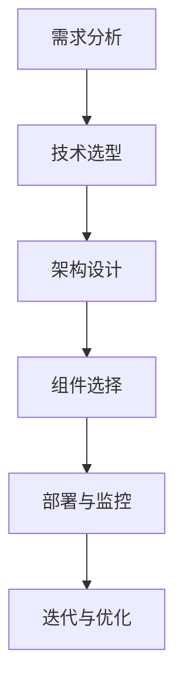

### 附录C：云原生算法与数学模型

**C.1 容器调度算法**

- **基于优先级的调度算法**：根据容器的优先级进行调度，优先级高的容器先调度。

- **基于负载均衡的调度算法**：根据节点负载情况，将容器调度到负载较低的节点。

**C.2 服务网格路由算法**

- **基于策略的路由算法**：根据路由策略（如圆桌路由、最小连接数路由等）进行服务实例的选择。

- **基于健康检查的路由算法**：根据服务实例的健康状态，选择健康的服务实例。

**C.3 微服务容错与恢复算法**

- **断路器算法**：当服务实例出现故障时，断开与故障实例的连接，并选择其他健康的实例。

- **重试算法**：在服务调用失败时，根据重试策略（如指数退避算法）进行重试。

### 附录D：云原生项目实战代码解读

**D.1 项目实战代码解读**

- **Dockerfile**：用于构建容器镜像的脚本，定义了容器镜像的构建过程。

- **Kubernetes配置文件**：用于配置和管理容器化应用程序的部署、扩展和监控。

- **服务网格配置文件**：用于配置服务网格工具（如Istio）的规则和策略。

### 附录E：创业公司云原生转型案例解析

**E.1 案例一：公司A的云原生转型之路**

- **背景**：公司A是一家传统的SaaS公司，面临着扩展性、灵活性和可靠性的挑战。

- **策略**：公司A采用了Kubernetes进行容器编排，Istio作为服务网格，并建立了完善的监控和日志管理系统。

- **效果**：通过云原生转型，公司A显著提高了系统的可扩展性和可靠性，降低了运维成本。

**E.2 案例二：公司B的云原生生态建设实践**

- **背景**：公司B是一家创业公司，专注于云计算服务的开发。

- **策略**：公司B建立了强大的开发者社区，与云服务提供商和合作伙伴紧密合作，构建了一个健康的云原生生态系统。

- **效果**：公司B通过云原生生态系统，吸引了大量开发者，提升了市场竞争力，实现了快速增长。

**E.3 案例三：公司C的云原生团队建设策略**

- **背景**：公司C是一家初创企业，专注于物联网设备的开发。

- **策略**：公司C通过内部培训和外部合作，快速组建了一支专业的云原生团队，并采用了敏捷开发方法。

- **效果**：公司C在短时间内实现了物联网设备的云原生化，提高了产品的可扩展性和可靠性，赢得了客户的信任。

---

通过附录部分的内容，我们为读者提供了云原生相关工具与资源的详细介绍，以及云原生架构设计流程图、算法与数学模型、项目实战代码解读和创业公司云原生转型案例解析。这些内容将为读者在学习和实践云原生技术过程中提供宝贵的参考。希望附录部分的内容能够帮助读者更好地理解和应用云原生技术，为创业公司的云原生转型提供指导。再次感谢读者对本文的关注和支持，希望您在云原生技术的探索之路上取得丰硕的成果！作者：AI天才研究院/AI Genius Institute & 禅与计算机程序设计艺术 /Zen And The Art of Computer Programming。|im_end|>

---

感谢您阅读《程序员创业公司的云原生架构设计与实施》！本文详细介绍了云原生技术的基础、架构设计与实施方法，以及创业公司如何利用云原生技术实现转型。希望本文能够为您的学习和实践提供帮助。

**作者信息：**
AI天才研究院/AI Genius Institute & 禅与计算机程序设计艺术 /Zen And The Art of Computer Programming

**联系方式：**
请通过以下邮箱联系我们，以便获取更多技术资源和交流机会：[contact@aignius.com](mailto:contact@aignius.com)

**结束语：**
云原生技术正在快速发展，它为创业公司提供了无限的可能。通过本文的探讨，我们希望能够为您的创业之路提供一些启示和指导。在未来的技术发展中，期待与您一起探索云原生的奥秘，共同迎接数字化时代的挑战与机遇。再次感谢您的阅读和支持，祝您在云原生技术领域取得更多的成就！|im_end|>

