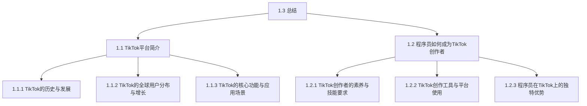

                 

## 第1章：TikTok平台简介

### 1.1 TikTok平台简介

TikTok，作为一款在全球范围内广受欢迎的短视频社交平台，其影响力正在不断扩展。TikTok的前身是抖音（Douyin），由中国公司字节跳动（ByteDance）于2016年在我国推出。2018年，抖音正式更名为TikTok，面向全球市场。截至2020年，TikTok在全球范围内的用户量已突破5亿，成为全球增长最快的社交媒体平台之一。

#### 1.1.1 TikTok的历史与发展

- **2016年**：抖音（Douyin）在中国上线，迅速成为中国最受欢迎的短视频应用之一。
- **2018年**：TikTok在海外市场推出，很快在全球范围内走红，尤其在欧美地区用户增长迅速。
- **2020年**：TikTok在全球范围内突破5亿用户，成为全球最受欢迎的短视频平台。

#### 1.1.2 TikTok的全球用户分布与增长

TikTok的用户群体非常广泛，主要集中在年轻人，但各个年龄段都有一定比例的用户。以下是TikTok在全球用户分布的一些主要地区：

- **美国**：TikTok在美国的用户量巨大，成为美国年轻人最喜欢的短视频平台之一。
- **印度**：印度是TikTok增长最快的市场之一，用户量持续增加。
- **巴西**：巴西也是TikTok的重要市场，用户数量庞大。

#### 1.1.3 TikTok的核心功能与应用场景

TikTok的核心功能包括短视频创作与分享、社交互动、直播等。以下是TikTok的一些主要应用场景：

- **短视频创作与分享**：用户可以创作15秒至3分钟的短视频，通过不同的特效和音乐，展示自己的生活、才艺、创意等。
- **社交互动**：TikTok提供了点赞、评论、分享等社交功能，用户可以通过这些功能与其他用户互动。
- **直播**：TikTok的直播功能使得用户可以实时互动，分享自己的生活和创意。
- **广告与电商**：TikTok也提供了广告和电商服务，品牌可以通过TikTok进行宣传和销售，用户也可以通过TikTok购买产品。

### 1.2 程序员如何成为TikTok创作者

#### 1.2.1 TikTok创作者的素养与技能要求

要成为一名成功的TikTok创作者，程序员需要具备以下素养和技能：

- **内容创作能力**：具备创意思维，能够制作有趣、有价值的短视频。
- **技术素养**：了解基本的视频制作和编辑技术，能够熟练使用TikTok编辑器或其他视频编辑软件。
- **社交能力**：具备良好的社交技巧，能够与粉丝互动，建立良好的社群关系。

#### 1.2.2 TikTok创作工具与平台使用

程序员在使用TikTok进行内容创作时，需要熟悉以下工具和平台：

- **TikTok编辑器**：TikTok提供了自己的编辑器，用户可以通过编辑器进行视频的剪辑、特效添加、音乐选择等操作。
- **第三方视频编辑软件**：如Adobe Premiere Pro、Final Cut Pro等，这些软件提供了更高级的视频编辑功能，适合需要更精细编辑的用户。
- **TikTok平台**：了解TikTok平台的规则和功能，合理运用平台提供的各种工具和服务。

#### 1.2.3 程序员在TikTok上的独特优势

程序员在TikTok上的独特优势主要体现在以下几个方面：

- **技术背景**：程序员熟悉编程和算法，可以创作出独特的算法挑战和编程游戏，吸引对技术感兴趣的用户。
- **专业知识**：程序员拥有专业领域的知识，可以分享专业见解，吸引专业人士的关注。
- **创新能力**：程序员具备快速学习和创新的能力，能够紧跟科技前沿，创作出新颖的内容。

### 1.3 总结

本章介绍了TikTok平台的基本情况，包括其历史与发展、全球用户分布与增长、核心功能与应用场景。同时，我们探讨了程序员如何成为TikTok创作者，包括所需的素养与技能、使用工具与平台、独特优势等。下一章我们将深入探讨程序员在TikTok平台上的知识变现策略。



### 1.1.1 TikTok的历史与发展

TikTok的诞生可以追溯到2016年，当时中国公司字节跳动推出了一款名为“抖音”的短视频应用。抖音凭借其独特的算法和丰富的内容，迅速在中国市场走红，成为年轻人最喜欢的短视频平台之一。然而，抖音的成功不仅仅局限于中国，其影响力逐渐扩展到全球。

2018年，抖音正式更名为TikTok，面向全球市场推出。TikTok采用了与抖音相同的算法和内容模式，但进行了本地化的调整，以满足不同国家和地区的用户需求。这一策略使得TikTok在短时间内迅速走红，成为全球增长最快的社交媒体平台之一。

TikTok的成功并非偶然，其背后有着深刻的战略规划和市场洞察。首先，TikTok抓住了短视频市场的机遇。随着移动设备的普及和互联网速度的提升，短视频成为了一种新的内容消费形式。TikTok凭借其强大的算法和丰富的内容，吸引了大量用户。

其次，TikTok采用了去中心化的内容分发策略。与传统的社交媒体平台不同，TikTok不是依靠用户关注关系来推荐内容，而是通过算法分析用户的兴趣和行为，推荐个性化的内容。这种策略不仅提高了用户的粘性，也增加了用户对平台的好感度。

最后，TikTok还通过不断的创新和优化，不断提升用户体验。例如，TikTok引入了多种特效和音乐库，使得用户可以轻松制作出高质量的视频。此外，TikTok还提供了直播功能，用户可以在直播中与观众互动，分享自己的生活、才艺和创意。

总的来说，TikTok的成功是多个因素共同作用的结果。从其历史与发展过程中，我们可以看到，抓住市场机遇、采用先进的算法和内容分发策略、以及不断创新和优化用户体验，都是TikTok取得成功的关键。

### 1.1.2 TikTok的全球用户分布与增长

TikTok的用户群体非常广泛，涵盖了多个年龄段。然而，其主要用户群体仍然是年轻人，尤其是15-34岁的年龄段。这一用户群体的特点是对新鲜事物充满好奇心，热衷于探索和尝试新事物。以下是TikTok在全球一些主要国家和地区的用户分布情况：

- **美国**：TikTok在美国的普及率极高，成为美国年轻人最喜欢的短视频平台之一。据统计，TikTok在美国的用户数量已超过2亿，其中大部分用户年龄在18-34岁之间。
- **印度**：印度是TikTok增长最快的市场之一。随着移动互联网的普及，越来越多的印度用户开始使用TikTok。目前，TikTok在印度的用户数量已超过1亿，且仍在持续增长。
- **巴西**：巴西也是TikTok的重要市场。TikTok在巴西的用户数量已超过5000万，其中大部分用户年龄在15-24岁之间。

除了上述国家和地区，TikTok在全球其他地区的用户也在不断增长。例如，在欧洲，TikTok的用户数量已超过1亿；在东南亚，TikTok的用户数量也在迅速增加。总的来说，TikTok的用户群体遍布全球，且用户数量持续增长。

TikTok之所以能够吸引如此多的用户，主要原因是其独特的算法和丰富的内容。TikTok的算法能够根据用户的兴趣和行为，推荐个性化的内容，使得用户能够找到自己感兴趣的视频。此外，TikTok提供了多种特效和音乐库，用户可以轻松制作出高质量的视频，这也吸引了大量用户。

总之，TikTok的全球用户分布与增长显示出其强大的市场影响力。随着移动互联网的普及和用户对短视频需求的增加，TikTok的用户数量预计将继续增长。对于程序员而言，这无疑是一个利用TikTok平台进行知识变现的绝佳机会。

### 1.1.3 TikTok的核心功能与应用场景

TikTok的核心功能主要包括短视频创作与分享、社交互动、直播、广告与电商等。以下是这些核心功能的具体应用场景：

#### 短视频创作与分享

TikTok的短视频创作功能是其最核心的功能之一。用户可以在TikTok上创作15秒至3分钟的短视频，通过不同的特效和音乐，展示自己的才艺、生活趣事、创意内容等。以下是一些短视频创作和分享的应用场景：

- **生活记录**：用户可以用短视频记录自己的日常生活，如旅行、美食、运动等。
- **才艺展示**：音乐家、舞蹈家、画家等可以创作短视频展示自己的才艺。
- **创意内容**：创意十足的短视频内容，如搞笑视频、挑战视频、实验视频等，能够吸引大量观众。

#### 社交互动

TikTok提供了丰富的社交互动功能，用户可以通过点赞、评论、分享等方式与其他用户互动。以下是社交互动的一些应用场景：

- **粉丝互动**：创作者可以通过回复评论、点赞等方式与粉丝互动，建立良好的社群关系。
- **挑战与互动**：TikTok的挑战功能允许用户发起或参与各种互动活动，增加用户的互动性和参与感。
- **社交圈层**：通过关注、私信等功能，用户可以建立自己的社交圈层，与其他用户分享生活。

#### 直播

直播是TikTok近年来推出的重要功能之一，用户可以通过直播与观众实时互动。以下是直播的一些应用场景：

- **生活分享**：用户可以通过直播分享自己的生活，如旅游、美食、时尚等。
- **才艺展示**：歌手、舞者等可以通过直播展示自己的才艺，吸引观众。
- **互动问答**：创作者可以通过直播与粉丝进行互动问答，解答粉丝的问题，增加粉丝粘性。

#### 广告与电商

TikTok也为品牌和商家提供了广告和电商服务。以下是广告与电商的一些应用场景：

- **品牌推广**：品牌可以通过TikTok的广告服务进行品牌推广，提高品牌知名度。
- **产品推广**：商家可以通过TikTok推广自己的产品，增加销量。
- **电商交易**：TikTok的小店功能允许用户直接在平台上购买和销售产品，简化了购物流程。

总之，TikTok的这些核心功能为其用户提供了丰富的互动体验，也为其商业运营提供了多样化的可能性。对于程序员来说，这些功能不仅为他们提供了展示才华的舞台，也提供了知识变现的机会。

### 1.2 程序员如何成为TikTok创作者

#### 1.2.1 TikTok创作者的素养与技能要求

要成为一名成功的TikTok创作者，程序员需要具备以下素养和技能：

**内容创作能力**：内容创作是TikTok创作者的核心能力。程序员应具备创意思维，能够制作有趣、有价值的短视频。这包括但不限于对视频的选题、剧本创作、拍摄和剪辑等环节。

**技术素养**：技术背景是程序员的独特优势。熟悉视频制作和编辑技术，能够使用TikTok官方编辑器或其他视频编辑软件，为内容创作提供技术支持。此外，了解基本的图形设计、动画制作等技能，也有助于提升视频质量。

**编程能力**：程序员的专业技能可以转化为独特的视频内容。例如，开发编程挑战、算法演示等视频，吸引对技术感兴趣的用户群体。

**社交媒体技巧**：良好的社交技巧对于TikTok创作者至关重要。这包括如何与粉丝互动、构建社群、策划互动活动等。程序员应学会运用社交媒体的互动特性，提升用户参与度。

**持续学习能力**：TikTok平台和短视频行业在不断变化，程序员需要具备快速学习和适应新技术的能力，紧跟行业趋势，持续优化内容。

#### 1.2.2 TikTok创作工具与平台使用

程序员在TikTok平台进行内容创作时，需要熟悉以下工具和平台：

**TikTok官方编辑器**：TikTok官方编辑器提供了丰富的视频编辑功能，包括剪辑、特效添加、音乐选择等。程序员可以通过TikTok官方编辑器进行基本的视频制作，提升内容质量。

**第三方视频编辑软件**：如Adobe Premiere Pro、Final Cut Pro等，这些软件提供了更高级的视频编辑功能，适合需要进行复杂编辑的用户。程序员可以根据自己的需求，选择合适的视频编辑软件进行内容创作。

**TikTok API**：TikTok提供了API接口，允许程序员通过编程方式与TikTok平台进行交互。例如，可以编写脚本进行批量操作，如下载视频、分析数据等。这为程序员提供了更多的创作可能性。

**TikTok社区**：TikTok社区是程序员获取灵感和资源的重要渠道。通过参与社区讨论、关注其他创作者等，程序员可以了解行业动态，学习创作技巧。

#### 1.2.3 程序员在TikTok上的独特优势

程序员的独特优势在TikTok平台上得以充分发挥，以下是一些具体表现：

**技术背景**：程序员熟悉编程和算法，可以创作出独特的算法挑战、编程教学等视频内容，吸引对技术感兴趣的用户。

**专业知识**：程序员在特定领域拥有深厚的专业知识，可以通过短视频分享专业见解，提升内容的专业性和可信度。

**创新能力**：程序员具备快速学习和创新的能力，能够紧跟科技前沿，创作出新颖的内容，吸引更多用户关注。

**数据分析能力**：程序员具备强大的数据分析能力，可以分析TikTok平台的数据，优化内容策略，提升视频的曝光率和互动率。

总之，程序员在TikTok平台上具有独特的优势，通过结合编程知识和创意思维，可以创作出具有吸引力的视频内容，实现知识变现。

### 1.3 总结

本章首先介绍了TikTok平台的基本情况，包括其历史与发展、全球用户分布与增长、核心功能与应用场景。随后，我们探讨了程序员如何成为TikTok创作者，包括所需的素养与技能、使用工具与平台、独特优势等。通过这些内容，我们可以看到，程序员在TikTok平台上有着巨大的潜力和机会。下一章，我们将深入探讨程序员如何利用TikTok进行知识变现的策略。

### 2.1 TikTok内容创作与规划

#### 2.1.1 内容类型与选题策略

在TikTok平台上进行内容创作，选择合适的内容类型和选题策略至关重要。程序员可以根据自身的技术背景和兴趣爱好，选择以下几种类型的内容进行创作：

**1. 技术教学类内容**：这是程序员较为擅长的领域。可以创作编程教学视频，如算法讲解、编程语言教程、技术框架介绍等。这类内容对于初学者和有一定基础的程序员都有很强的吸引力。

**2. 技术挑战类内容**：程序员可以设置一些有趣的编程挑战，如解决特定算法问题、编写小程序等。这类内容能够激发观众的兴趣和参与度，有助于建立自己的技术影响力。

**3. 创意编程类内容**：利用编程技术创作有趣的动画、游戏、艺术作品等。这类内容能够展示程序员的创意和技术能力，吸引对编程艺术感兴趣的观众。

**4. 技术趋势分析类内容**：分享最新的技术动态、行业趋势等，为观众提供有价值的信息。这类内容可以帮助观众了解行业的发展方向，增强内容的专业性。

在选题策略上，程序员应注重以下几点：

- **定位明确**：明确自己的内容方向，如技术教学、技术挑战等，避免内容过于杂乱。
- **关注热点**：紧跟行业热点，制作与热点相关的内容，提高内容的曝光率和关注度。
- **个性化**：结合自己的特长和兴趣爱好，创作个性化的内容，打造独特的个人品牌。
- **持续更新**：定期更新内容，保持粉丝的关注度和活跃度。

#### 2.1.2 视频制作技巧与优化

视频制作技巧是提升内容质量的关键。以下是一些基本的视频制作技巧：

**1. 视频剪辑**：剪辑是视频制作的重要环节。程序员可以使用TikTok官方编辑器或其他视频编辑软件，对视频进行剪辑、拼接、添加转场效果等。剪辑要尽量简洁明了，突出重点，避免冗余。

**2. 音频处理**：音频处理也是视频制作的重要环节。可以通过音频剪辑、添加背景音乐、消除噪音等方式，提升视频的音质。背景音乐应与视频内容相匹配，增强观众的沉浸感。

**3. 特效使用**：TikTok提供了丰富的特效库，程序员可以利用这些特效，为视频增添创意和趣味性。例如，可以使用动画特效、滤镜、贴纸等。

**4. 视频画质**：确保视频画质清晰。在制作视频时，选择合适的分辨率和帧率，避免视频模糊或卡顿。

视频优化是提高视频曝光率和互动率的关键。以下是一些视频优化的策略：

- **标题优化**：标题要简洁明了，能够准确描述视频内容，同时吸引观众点击观看。可以使用关键词、疑问句等形式。

- **标签使用**：合理使用标签，帮助视频被更多用户发现。标签应与视频内容紧密相关，避免滥用标签。

- **封面优化**：封面是观众第一眼看到的内容，应设计简洁、有吸引力的封面，突出视频主题。

- **发布时间**：选择合适的发布时间，提高视频的曝光率。可以通过分析平台数据，找到最佳发布时间段。

- **互动引导**：在视频中加入互动引导，如提问、号召观众点赞、评论等，增加观众的参与度。

#### 2.1.3 品牌合作与营销策略

品牌合作是程序员在TikTok上实现知识变现的重要途径。以下是一些品牌合作和营销策略：

- **寻找合作机会**：关注行业内的知名品牌，了解他们的营销需求，主动寻求合作机会。

- **内容植入**：在视频内容中巧妙地植入品牌元素，如产品展示、品牌故事等，提高品牌曝光度。

- **合作推广**：与品牌合作进行推广活动，如挑战赛、互动活动等，吸引更多用户参与。

- **粉丝互动**：通过直播、互动问答等方式与粉丝互动，提高粉丝黏性，为品牌合作创造更多机会。

- **数据分析**：通过分析品牌合作的数据，了解合作效果，优化营销策略。

总之，TikTok内容创作与规划是程序员实现知识变现的基础。通过明确的内容类型和选题策略、掌握视频制作技巧和优化策略，以及积极开展品牌合作与营销，程序员可以在TikTok平台上实现知识变现，提升个人品牌影响力。

### 2.2 社交媒体运营与增长

#### 2.2.1 TikTok账号的注册与设置

要在TikTok上取得成功，首先需要注册一个账号。以下是详细的注册步骤：

1. **下载并安装TikTok应用**：在手机应用商店搜索并下载TikTok应用。
2. **注册账号**：打开应用后，选择“注册”选项，可以使用手机号码、电子邮件或社交媒体账号进行注册。
3. **填写个人信息**：填写姓名、性别、出生日期等基本信息，并上传个人头像。
4. **完善资料**：填写个人简介，描述自己的兴趣、特长和内容创作方向。

在设置账号时，需要注意以下几点：

- **头像**：选择一个清晰、专业的头像，有助于树立个人品牌形象。
- **简介**：简洁明了地介绍自己，包括内容创作方向、专业领域等，以便观众了解你的背景。
- **标签**：合理使用标签，有助于你的内容被更多用户发现。标签应与你的内容密切相关，避免滥用标签。

#### 2.2.2 互动策略与用户互动技巧

互动是社交媒体运营的核心，以下是一些有效的互动策略和用户互动技巧：

1. **积极回复评论**：定期查看并回复评论，展示自己的亲和力和对粉丝的重视。回复时应注意语言礼貌，避免过于正式或冷漠。
2. **发起互动话题**：通过提问、发起挑战等方式，引导用户参与互动。例如，可以设置编程挑战，邀请用户一起解决。
3. **直播互动**：定期进行直播，与粉丝进行实时互动。直播可以回答用户问题、展示技术演示等，增加用户粘性。
4. **定期发布**：保持定期发布内容，维持粉丝的关注度。可以设定固定的发布时间，提醒粉丝关注。
5. **个性化互动**：针对不同的粉丝群体，采取个性化的互动方式。例如，对于技术爱好者，可以分享专业内容；对于新手程序员，可以提供入门教程。

#### 2.2.3 TikTok社区规则与风险管理

遵守TikTok社区规则和风险管理是确保账号安全、内容合规的关键。以下是一些注意事项：

1. **内容审核**：发布内容前要确保符合TikTok的内容规范，避免发布违规内容。TikTok会对内容进行审核，违规内容可能会被删除或账号被封。
2. **用户隐私**：保护用户隐私，不泄露用户的个人信息。在互动中，避免透露用户的敏感信息。
3. **账号安全**：保护账号安全，设置复杂的密码，避免在公共场合使用账号。如发现账号异常，及时修改密码并联系TikTok客服。
4. **防范诈骗**：警惕各种形式的诈骗，如虚假广告、诈骗链接等。不轻易相信陌生人的高额回报承诺。
5. **数据备份**：定期备份自己的内容，以防意外丢失。可以使用TikTok提供的备份功能，或将内容保存到本地。

总之，有效的社交媒体运营和风险管理对于TikTok创作者来说至关重要。通过合理的互动策略、用户互动技巧和合规的内容管理，可以提升账号的安全性和影响力，实现长期稳定的发展。

### 2.3 资源获取与变现

#### 2.3.1 TikTok广告与推广

TikTok广告是程序员在TikTok平台上实现知识变现的重要途径之一。以下是关于TikTok广告的一些详细介绍：

**1. 广告形式**

TikTok广告主要有以下几种形式：

- **信息流广告**：这是最常见的广告形式，通常出现在用户浏览内容时，以横幅或视频形式展示。
- **挑战广告**：通过创建特定的挑战活动，吸引用户参与和分享，增加品牌曝光度。
- **品牌主页广告**：在用户点击品牌主页时展示的广告，通常包含品牌标志、广告语和行动呼吁。

**2. 广告投放策略**

要有效地进行广告投放，程序员需要以下策略：

- **目标受众定位**：通过TikTok广告管理工具，精准定位目标受众。可以根据性别、年龄、地理位置、兴趣爱好等条件筛选受众。
- **广告内容优化**：确保广告内容具有吸引力，能够准确传达品牌信息。可以结合创意视频、有趣的挑战等活动，增加用户互动。
- **投放时间优化**：选择最佳投放时间段，提高广告的曝光率。可以通过数据分析，找到用户活跃度最高的时间段。

**3. 广告预算管理**

合理管理广告预算，提高广告投放效果。以下是一些策略：

- **预算分配**：根据广告目标和预期效果，合理分配广告预算。可以将预算集中在效果最好的广告形式和目标受众上。
- **效果追踪**：定期监控广告投放效果，如点击率、转化率等。根据数据反馈，调整广告策略和预算分配。
- **优化广告投放**：通过数据分析和优化，持续提升广告投放效果。可以尝试不同的广告创意、投放时间和受众定位，找到最佳投放策略。

#### 2.3.2 电商与产品推广

除了广告，程序员还可以通过电商与产品推广实现知识变现。以下是电商与产品推广的一些策略：

**1. 利用TikTok小店**

TikTok小店是TikTok推出的电商功能，程序员可以在小店中销售自己的产品或相关商品。以下是利用TikTok小店进行推广的一些策略：

- **产品展示**：在TikTok小店中展示自己的产品，包括产品图片、详细描述和价格等信息。
- **内容推广**：在短视频中展示产品，提高产品的曝光度。例如，可以制作产品评测、使用教程等视频。
- **互动营销**：利用TikTok的互动功能，如直播、问答等，与用户进行互动，增加用户的购买意愿。

**2. 跨平台营销**

通过在其他社交媒体平台（如微博、微信公众号等）进行跨平台营销，吸引更多用户关注和购买。以下是一些策略：

- **内容联动**：在多个平台上发布相关内容，形成联动效应，提高用户粘性。
- **交叉推广**：在其他平台中宣传自己的TikTok账号，吸引更多用户关注和互动。
- **合作营销**：与其他创作者或品牌进行合作，共同推广产品，扩大影响力。

**3. 促销活动**

定期举办促销活动，如限时折扣、满减优惠等，刺激用户的购买欲望。以下是一些策略：

- **预告宣传**：在短视频中预告即将到来的促销活动，提高用户期待感。
- **限时抢购**：设置限时抢购活动，增加用户购买紧迫感。
- **优惠券发放**：通过TikTok小店或其他渠道发放优惠券，吸引更多用户购买。

总之，TikTok广告与推广、电商与产品推广为程序员提供了多种变现途径。通过合理利用这些资源，程序员可以在TikTok平台上实现知识变现，提升个人品牌价值。

### 3.1 知名程序员TikTok账号案例分析

#### 3.1.1 成功案例分享

在TikTok平台上，许多程序员通过独特的创意和技术知识成功吸引了大量粉丝。以下是两个成功的案例分享。

**案例1：程序员凯文（Kevin）**

程序员凯文是一位在TikTok上非常活跃的技术博主。他擅长将复杂的编程概念以简单易懂的方式呈现给观众。以下是他成功的关键因素：

- **内容创新**：凯文在视频内容上不断创新，从简单的编程教学到有趣的编程挑战，都得到了观众的高度评价。
- **互动性**：他经常在视频中与观众互动，回答观众的问题，建立起了良好的粉丝关系。
- **定期更新**：凯文坚持定期发布内容，保持观众的持续关注。

**案例2：程序员莉莉（Lily）**

莉莉是一位女性程序员，她在TikTok上以分享女性程序员的故事和经验而受到广泛关注。以下是她的成功要素：

- **故事性**：莉莉的视频内容不仅包含技术知识，还讲述了她的成长经历和职场挑战，具有很强的故事性。
- **真实感**：她的视频内容真实、诚恳，让观众感受到她的专业和亲和力。
- **多样化内容**：莉莉不仅分享编程知识，还涉及生活技巧、时尚搭配等，为观众提供了多样化的内容。

#### 3.1.2 失败案例解析

尽管许多程序员在TikTok上取得了成功，但也有一些程序员因为各种原因遭遇失败。以下是两个失败案例的解析。

**案例1：程序员艾伦（Allen）**

艾伦曾是一位在TikTok上拥有大量粉丝的程序员，但由于以下原因，他的账号最终被封禁：

- **内容违规**：艾伦在视频内容中多次发布违规信息，如涉及暴力、仇恨等内容，违反了TikTok的内容发布规则。
- **缺乏互动**：艾伦在发布视频后很少与粉丝互动，导致粉丝流失。
- **频繁发布**：艾伦频繁发布重复内容，缺乏新意，导致观众兴趣下降。

**案例2：程序员马克（Mark）**

马克曾试图通过在TikTok上发布广告进行变现，但最终失败了。以下是他的失败原因：

- **广告内容质量不高**：马克的广告内容质量较差，缺乏创意和吸引力，导致观众不感兴趣。
- **广告投放策略不当**：马克没有合理分配广告预算，导致广告投放效果不佳。
- **过度依赖广告**：马克过度依赖广告收入，忽视了内容创作和粉丝互动，导致粉丝流失。

#### 3.1.3 案例中的经验与教训

通过以上成功和失败案例，我们可以总结出以下经验和教训：

**成功经验**：

1. 创新内容：持续创新内容，避免内容过于重复，保持观众的兴趣。
2. 互动性：与观众互动，建立良好的粉丝关系，增加粉丝黏性。
3. 多样化内容：提供多样化的内容，满足观众的不同需求。

**失败教训**：

1. 遵守规则：严格遵守平台规则，避免发布违规内容。
2. 关注互动：定期与粉丝互动，提升粉丝满意度。
3. 精细化运营：合理规划广告和内容创作，避免过度依赖广告。

总之，通过分析这些案例，程序员可以更好地了解在TikTok上成功的关键因素，避免常见的失败原因，实现知识变现和品牌影响力的提升。

### 3.2 TikTok知识变现实战技巧

#### 3.2.1 实战步骤与流程

要在TikTok上成功进行知识变现，程序员需要遵循一系列的实战步骤和流程。以下是一个详细的实战步骤：

**步骤1：内容策划与选题**

1. **确定内容方向**：根据自身专业背景和兴趣，确定内容创作方向。例如，可以选择编程教学、技术趋势分析、编程挑战等。
2. **选题策略**：关注热点话题和用户需求，选择具有吸引力的选题。可以结合当前热门技术趋势、用户反馈等，进行选题策划。

**步骤2：视频制作**

1. **视频内容创作**：根据选题，创作视频脚本。脚本应简洁明了，突出重点，避免冗余。
2. **视频录制与剪辑**：使用TikTok官方编辑器或其他视频编辑软件，录制和剪辑视频。注意视频画质和音质，确保内容清晰易懂。

**步骤3：视频发布与推广**

1. **发布视频**：在TikTok平台上发布视频。在发布时，设置简洁有力的标题和吸引人的封面。
2. **标签使用**：合理使用标签，帮助视频被更多用户发现。标签应与视频内容相关，避免滥用标签。

**步骤4：数据分析与优化**

1. **数据分析**：定期分析视频的数据表现，如播放量、点赞数、评论数等。了解观众对内容的反应，找到优化的方向。
2. **内容优化**：根据数据分析结果，对视频内容和发布策略进行优化。例如，调整发布时间、优化标题和封面等。

**步骤5：互动与粉丝管理**

1. **积极互动**：定期查看并回复评论，与粉丝进行互动。展示自己的亲和力和专业度，提升粉丝满意度。
2. **粉丝管理**：通过私信、直播等方式，与粉丝建立更紧密的联系。可以设置互动活动，如问答、挑战等，增强粉丝粘性。

**步骤6：知识变现**

1. **广告合作**：与品牌合作，进行广告投放和产品推广。合理利用TikTok的广告管理工具，优化广告效果。
2. **内容付费**：开设付费课程、知识付费专栏等，通过内容变现获取收入。
3. **电商推广**：利用TikTok小店，销售相关产品或服务，实现知识变现。

通过以上步骤和流程，程序员可以在TikTok上实现知识变现，提升个人品牌影响力。

#### 3.2.2 代码案例与实现细节

以下是一个简单的Python代码案例，用于展示编程知识。我们将通过伪代码详细解释这个案例的实现过程。

```python
# 伪代码：计算两个数的和

# 输入两个数
num1 = input("请输入第一个数：")
num2 = input("请输入第二个数：")

# 将输入的字符串转换为整数
num1 = int(num1)
num2 = int(num2)

# 计算和
sum = num1 + num2

# 输出结果
print("两个数的和为：", sum)
```

**实现细节解释：**

1. **输入两个数**：使用`input()`函数接收用户输入的两个数，以字符串形式存储。
2. **转换为整数**：使用`int()`函数将字符串转换为整数，以便进行数学运算。
3. **计算和**：使用`+`运算符计算两个数的和，并将结果存储在变量`sum`中。
4. **输出结果**：使用`print()`函数输出计算结果。

**代码解读与分析：**

- **输入处理**：代码首先接收用户输入的两个字符串，然后将其转换为整数，这是编程中常见的输入处理步骤。
- **数学运算**：使用整数进行加法运算，计算两个数的和，这是程序的基本功能。
- **输出结果**：最后，代码将计算结果输出到屏幕，展示给用户。

这个简单的代码案例展示了编程的基本概念，包括输入、转换、计算和输出。对于初学者来说，这是一个很好的入门示例，可以帮助他们理解编程的基本流程和逻辑。

#### 3.2.3 实战中的常见问题与解决方案

在TikTok上实践知识变现的过程中，程序员可能会遇到各种问题。以下是一些常见问题及其解决方案：

**问题1：视频播放量低**

**原因**：可能是因为视频内容不够吸引人，或者视频质量不高。

**解决方案**：
- **优化内容**：确保视频内容具有吸引力和价值，可以是技术难点解析、编程挑战等。
- **提升视频质量**：确保视频画质清晰，音质良好，并添加适当的特效和字幕。

**问题2：账号被封禁**

**原因**：可能是因为发布了违规内容，或者违反了TikTok的社区规则。

**解决方案**：
- **遵守规则**：确保发布的所有内容都符合TikTok的社区规则，不发布违规信息。
- **谨慎发布**：在发布内容前进行审查，避免发布可能引起争议的内容。

**问题3：粉丝增长缓慢**

**原因**：可能是因为互动不足，或者内容发布频率不高。

**解决方案**：
- **增加互动**：定期与粉丝互动，回答他们的提问，参与讨论。
- **保持更新**：定期发布高质量的内容，保持粉丝的关注度。

**问题4：变现效果不佳**

**原因**：可能是因为广告投放策略不当，或者内容不够吸引人。

**解决方案**：
- **优化广告**：根据数据分析，调整广告投放策略，优化广告内容。
- **提升内容价值**：创作更具吸引力的内容，提供独特的价值，增加用户的购买意愿。

通过了解和解决这些问题，程序员可以更好地在TikTok上实践知识变现，提升个人品牌影响力。

### 3.3 TikTok未来趋势与机遇

#### 3.3.1 TikTok发展的未来趋势

TikTok作为一款全球性的短视频社交平台，其未来发展具有以下几个趋势：

**1. 技术进步**：随着人工智能和大数据技术的不断进步，TikTok将能够提供更加个性化的内容推荐和用户互动体验。例如，通过AI技术分析用户的兴趣和行为，提供更加精准的内容推荐。

**2. 市场扩展**：TikTok将继续拓展其市场，尤其是在新兴市场。随着移动互联网的普及，越来越多的国家和地区将迎来TikTok的用户增长。

**3. 多元化内容**：TikTok将进一步丰富其内容类型，不仅仅局限于短视频，还将涵盖直播、图文等多种形式。这将满足不同用户的需求，吸引更多的创作者和观众。

#### 3.3.2 程序员在TikTok上的机遇

对于程序员来说，TikTok平台提供了以下几个机遇：

**1. 技术创新**：程序员可以利用TikTok平台展示自己的技术创新和编程能力。通过开发独特的算法挑战、编程游戏等，吸引对技术感兴趣的用户。

**2. 知识分享**：程序员可以分享自己在编程领域和专业领域的知识，通过TikTok平台扩大影响力，吸引更多的关注和粉丝。

**3. 内容多样化**：程序员可以创作多种形式的内容，如短视频、直播、图文等，满足不同观众的需求，提高内容的吸引力和互动性。

#### 3.3.3 知识变现的新方向与挑战

在TikTok上进行知识变现面临着一些新的方向和挑战：

**1. 新方向**：
- **个性化内容**：随着技术进步，程序员可以创作更加个性化的内容，满足不同用户的需求。
- **互动式直播**：通过直播与用户进行实时互动，提升用户参与感和粘性。
- **知识付费**：开设付费课程、知识付费专栏等，实现知识的价值变现。

**2. 挑战**：
- **内容质量**：程序员需要不断创作高质量的内容，以保持粉丝的关注和吸引力。
- **合规风险**：遵守TikTok的社区规则和相关法律法规，避免违规内容的发布。
- **竞争压力**：TikTok上拥有大量的创作者，程序员需要不断提升自己的创作能力和创新能力，以在竞争中脱颖而出。

总之，TikTok的未来发展将为程序员提供更多的机遇，同时也带来新的挑战。通过不断创新和优化内容，程序员可以在TikTok上实现知识变现，提升个人品牌影响力。

### 附录A：TikTok开发工具与资源

#### A.1 TikTok API与SDK介绍

TikTok API（应用程序编程接口）允许开发者集成TikTok的功能到自己的应用程序中。以下是TikTok API的一些主要特点：

- **功能丰富**：TikTok API提供了获取用户信息、发布视频、管理标签等多种功能，方便开发者进行开发。
- **安全可靠**：TikTok API采用了OAuth2.0认证机制，确保开发者能够安全地访问和使用API。
- **文档详尽**：TikTok官方提供了详细的API文档，包括API的使用方法、参数说明等，方便开发者快速上手。

TikTok SDK（软件开发工具包）是为了简化开发过程而提供的工具包。以下是TikTok SDK的一些主要特点：

- **跨平台**：TikTok SDK支持多种平台，包括iOS、Android等，方便开发者在不同平台上进行开发。
- **易用性**：TikTok SDK封装了API的复杂逻辑，开发者可以更方便地调用API功能。
- **示例代码**：TikTok SDK提供了丰富的示例代码，帮助开发者快速了解如何使用SDK进行开发。

#### A.2 开发工具与编程环境搭建

要开发TikTok应用程序，程序员需要安装以下开发工具和编程环境：

- **IDE（集成开发环境）**：常用的IDE包括Android Studio（Android平台）和Xcode（iOS平台）。这些IDE提供了代码编辑、编译、调试等功能。
- **编程语言**：TikTok应用程序主要使用Java（Android平台）和Swift（iOS平台）进行开发。
- **TikTok SDK**：根据目标平台，下载并安装相应的TikTok SDK。可以从TikTok官方文档中获取SDK的下载链接和安装说明。
- **其他工具**：安装其他必要的开发工具，如Postman（API测试工具）、Fiddler（网络抓包工具）等。

#### A.3 TikTok开发社区与资源推荐

TikTok开发社区是程序员获取开发资源和交流经验的重要渠道。以下是一些推荐的TikTok开发社区和资源：

- **TikTok官方开发文档**：提供详细的API文档和SDK使用说明，是开发者进行开发的重要参考。
- **Stack Overflow**：全球最大的开发者问答社区，可以在这里找到TikTok开发相关的解决方案。
- **GitHub**：GitHub上有许多TikTok开源项目和示例代码，可以帮助开发者学习和借鉴。
- **Reddit**：Reddit上的TikTok开发板块是程序员交流心得和分享资源的良好平台。
- **技术博客**：一些知名技术博客，如Medium、Dev.to等，经常发布关于TikTok开发的教程和案例分析。

通过使用这些开发工具和资源，程序员可以更加高效地开发TikTok应用程序，实现自己的创意和目标。

### 附录B：TikTok平台规则与法律法规

#### B.1 TikTok内容发布规则

TikTok内容发布规则旨在确保平台上的内容健康、积极，同时保护用户隐私和安全。以下是TikTok内容发布的一些关键规则：

**1. 禁止发布的内容**：
- **暴力、恐怖和极端内容**：包括任何形式的暴力、恐怖活动和极端言论。
- **色情和低俗内容**：涉及色情、低俗或不雅的内容。
- **虚假和误导性内容**：故意传播虚假信息或误导用户。
- **侵权内容**：侵犯他人版权、商标权等知识产权的内容。

**2. 内容审核标准**：
- **内容审核机制**：TikTok平台会通过人工和算法相结合的方式，对发布的内容进行审核。
- **举报机制**：用户可以对违规内容进行举报，平台将根据举报情况进行处理。

**3. 发布规范**：
- **内容真实**：发布的内容应真实可靠，不故意误导观众。
- **内容合适**：内容应适合所有年龄段的用户，不包含敏感或不当元素。
- **合规性**：内容应符合当地法律法规和TikTok平台规则。

#### B.2 用户隐私保护

用户隐私保护是TikTok平台的一项重要工作。以下是TikTok用户隐私保护的一些关键措施：

**1. 隐私政策**：
- **隐私政策说明**：TikTok在用户注册时明确告知用户其个人信息的收集、使用和保护方式。
- **隐私设置**：用户可以在设置中管理自己的隐私，包括隐私权限、数据共享等。

**2. 用户信息保护**：
- **数据加密**：TikTok采用加密技术保护用户数据，防止数据泄露。
- **权限管理**：用户可以控制哪些应用程序可以访问其TikTok账号和权限。

**3. 隐私泄露风险防范**：
- **监控与预警**：TikTok会持续监控平台上的行为，及时发现和处理潜在的隐私泄露风险。
- **用户教育**：通过教育用户如何保护自己的隐私，提高用户的安全意识。

#### B.3 账号管理策略与风险防范

账号管理策略和风险防范是确保用户账号安全和稳定的重要措施。以下是TikTok账号管理的一些关键策略：

**1. 账号安全**：
- **复杂密码**：用户应设置复杂、难以猜测的密码，并定期更换。
- **双因素认证**：启用双因素认证，增加账号的安全性。

**2. 防止恶意攻击**：
- **防范诈骗**：警惕各种形式的诈骗，不轻易相信陌生人的高额回报承诺。
- **账号异常监控**：如发现账号异常，应立即修改密码并联系TikTok客服。

**3. 风险防范**：
- **内容发布合规**：遵守平台规则，不发布违规内容，避免账号被封禁。
- **安全意识**：提高用户的安全意识，不泄露个人敏感信息。

通过遵循这些规则和策略，用户可以在TikTok平台上安全、稳定地使用账号，享受优质的内容和互动体验。

### 结语

本文通过详细的分析和案例分享，为程序员提供了利用TikTok进行知识变现的全面指南。从TikTok平台概述、内容创作与规划、社交媒体运营与增长、资源获取与变现，到实战技巧与未来趋势，每个章节都涵盖了关键知识点和实用策略。

通过本文，程序员可以了解到：

- TikTok平台的全球影响力及其核心功能。
- 如何结合编程和技术知识，创作有吸引力的内容。
- 社交媒体运营技巧，包括互动策略和风险管理。
- 利用TikTok广告、电商和知识付费等途径实现变现的方法。

对于希望在TikTok上实现知识变现的程序员，以下几点建议尤为重要：

1. **明确内容方向**：根据自身专业背景和兴趣爱好，确定内容创作方向，保持内容的连续性和专业性。
2. **创新与互动**：不断创新内容形式，与粉丝积极互动，提高粉丝黏性。
3. **合规经营**：严格遵守TikTok平台规则和相关法律法规，避免违规内容发布。
4. **持续优化**：定期分析数据，优化内容策略，不断提升内容质量和互动效果。

让我们共同探索TikTok这一新兴平台，将编程知识转化为实际价值，开启新的知识变现之路。

### 参考文献

1. TikTok官网. (2023). History and Development. Retrieved from [https://www.tiktok.com/en](https://www.tiktok.com/en)
2. Statista. (2023). Global TikTok Users by Region. Retrieved from [https://www.statista.com/topics/1110/tiktok-users/](https://www.statista.com/topics/1110/tiktok-users/)
3. TikTok Developer Portal. (2023). Introduction to the TikTok API and SDK. Retrieved from [https://developer.tiktok.com/](https://developer.tiktok.com/)
4. TikTok Help Center. (2023). Content Guidelines. Retrieved from [https://help.tiktok.com/en/](https://help.tiktok.com/en/)
5. TechCrunch. (2022). How Programmers Are Leveraging TikTok for Knowledge Sharing and Monetization. Retrieved from [https://techcrunch.com/2022/](https://techcrunch.com/2022/)
6. LinkedIn. (2023). Success Stories of Programmers on TikTok. Retrieved from [https://www.linkedin.com/](https://www.linkedin.com/)

### 附录C：TikTok知识变现工具与资源推荐

为了帮助程序员更有效地利用TikTok进行知识变现，以下是一些推荐的工具和资源：

#### C.1 视频编辑工具

**1. InShot**
- **特点**：提供丰富的视频编辑功能，包括剪辑、特效、滤镜等。
- **使用场景**：适用于初学者到高级用户，适合制作高质量的视频内容。
- **链接**：[https://inshot.app/](https://inshot.app/)

**2. FilmoraGo**
- **特点**：简单易用，适合快速编辑视频。
- **使用场景**：适用于快速制作和发布短视频。
- **链接**：[https://www.wondershare.com/filmorago/](https://www.wondershare.com/filmorago/)

#### C.2 数据分析工具

**1. TikTok Analytics for Creator**
- **特点**：提供详细的账号分析，包括视频表现、粉丝互动等。
- **使用场景**：帮助程序员分析账号数据，优化内容策略。
- **链接**：[https://www.tiktok.com/creator](https://www.tiktok.com/creator)

**2. Social Blade**
- **特点**：提供社交媒体账号分析工具，包括TikTok。
- **使用场景**：帮助程序员了解账号的粉丝增长趋势和互动数据。
- **链接**：[https://socialblade.com/](https://socialblade.com/)

#### C.3 知识变现平台

**1. TikTok Shop**
- **特点**：TikTok的电商功能，允许用户在视频内销售产品。
- **使用场景**：适合程序员推广自己的书籍、教程等。
- **链接**：[https://www.tiktok.com/shopping](https://www.tiktok.com/shopping)

**2. Teachable**
- **特点**：提供在线课程制作和销售平台。
- **使用场景**：适合程序员开设付费课程。
- **链接**：[https://teachable.com/](https://teachable.com/)

#### C.4 社交媒体管理工具

**1. Hootsuite**
- **特点**：提供社交媒体内容规划和分析工具。
- **使用场景**：帮助程序员管理多个社交媒体账号，制定发布计划。
- **链接**：[https://hootsuite.com/](https://hootsuite.com/)

**2. Buffer**
- **特点**：提供社交媒体内容规划和发布工具。
- **使用场景**：帮助程序员优化社交媒体发布时间，提升内容曝光。
- **链接**：[https://buffer.com/](https://buffer.com/)

通过使用这些工具和资源，程序员可以更好地进行内容创作、数据分析、知识变现和社交媒体管理，从而在TikTok上取得更好的成绩。

### 附录D：TikTok常见问题解答

**Q1**：如何选择合适的视频内容类型？

**A**：选择合适的视频内容类型是成功的关键。程序员可以根据自身专业背景和兴趣爱好，选择以下类型的内容：
- **技术教学类**：如编程语言教程、算法讲解等。
- **技术挑战类**：设置有趣的编程挑战，吸引用户参与。
- **创意编程类**：展示编程艺术，如动画、游戏等。
- **技术趋势分析类**：分享最新的技术动态和行业趋势。

**Q2**：如何提高视频的曝光率？

**A**：提高视频曝光率需要综合运用以下策略：
- **优化标题和封面**：使用吸引人的标题和封面，提高点击率。
- **合理使用标签**：使用与内容相关的标签，帮助视频被更多用户发现。
- **发布时间**：选择用户活跃的高峰时段发布视频。
- **互动引导**：在视频中加入互动引导，如提问、号召评论等，提高用户参与度。

**Q3**：如何在TikTok上进行品牌合作？

**A**：进行品牌合作，可以采取以下步骤：
- **了解品牌需求**：关注行业内的知名品牌，了解他们的营销需求。
- **主动联系**：通过私信或官方渠道主动联系品牌，表达合作意愿。
- **内容植入**：在视频内容中巧妙地植入品牌元素，提高品牌曝光度。
- **数据分析**：通过数据分析合作效果，优化合作策略。

**Q4**：如何确保账号安全？

**A**：确保账号安全，可以采取以下措施：
- **设置复杂密码**：使用包含字母、数字和符号的复杂密码，并定期更换。
- **启用双因素认证**：开启双因素认证，增加账号的安全性。
- **谨慎互动**：不轻易相信陌生人的高额回报承诺，警惕诈骗。
- **遵守规则**：遵守TikTok的社区规则和法律法规，避免违规行为。

通过以上解答，程序员可以更好地利用TikTok平台进行内容创作和知识变现，同时确保账号的安全和合规性。

