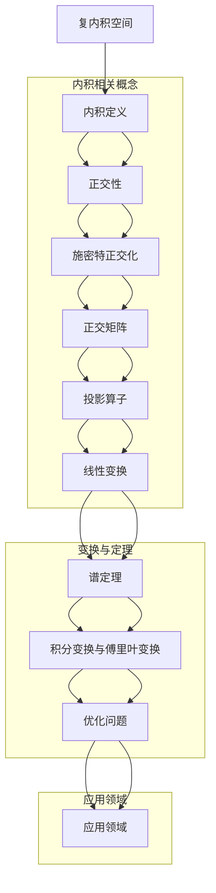

                 

## 线性代数导引：复内积空间

> **关键词**：线性代数，复内积空间，正交性，施密特正交化，正交矩阵，投影算子，线性变换，谱定理，积分变换，傅里叶变换，优化问题，应用领域。

> **摘要**：本文旨在深入探讨线性代数中的复内积空间，解析其基本概念、性质及应用。我们将从线性代数的基础知识出发，逐步引入复内积空间的概念，并详细讨论其相关理论，包括正交性、施密特正交化、正交矩阵、投影算子、线性变换、谱定理、积分变换与傅里叶变换，以及优化问题。通过数学公式、伪代码和实际案例的讲解，使读者能够全面理解复内积空间的理论及应用。

## 《线性代数导引：复内积空间》目录大纲

- **第一部分：线性代数基础**
  - **第1章：线性代数引论**
    - **1.1 线性代数的意义与应用**
    - **1.2 矩阵的基本概念与运算**
    - **1.3 行列式及其性质**
  - **第2章：线性方程组**
    - **2.1 线性方程组的基本概念**
    - **2.2 高斯消元法**
    - **2.3 线性方程组的解的性质**
  - **第3章：向量空间**
    - **3.1 向量空间的基本概念**
    - **3.2 向量空间的基与维数**
    - **3.3 子空间与直和**

- **第二部分：线性变换**
  - **第4章：线性变换的基本概念**
    - **4.1 线性变换的定义与性质**
    - **4.2 线性变换的矩阵表示**
    - **4.3 特征值与特征向量**
  - **第5章：矩阵的对角化**
    - **5.1 矩阵对角化的基本概念**
    - **5.2 实对称矩阵的对角化**
    - **5.3 复对称矩阵的对角化**
  - **第6章：线性变换的谱理论**
    - **6.1 谱定理**
    - **6.2 线性变换的谱性质**
    - **6.3 应用举例**

- **第三部分：复内积空间**
  - **第7章：复内积空间的基本概念**
    - **7.1 复内积空间的定义与性质**
    - **7.2 施密特正交化**
    - **7.3 正交矩阵**
  - **第8章：复内积空间的泛函分析**
    - **8.1 泛函的基本概念**
    - **8.2 鲍尔查诺-维尔斯特拉斯定理**
    - **8.3 积分变换与傅里叶变换**
  - **第9章：复内积空间的投影理论**
    - **9.1 投影算子**
    - **9.2 投影理论的应用**
    - **9.3 优化问题的线性规划**

- **第四部分：线性代数应用**
  - **第10章：线性代数在物理学中的应用**
    - **10.1 线性代数在经典力学中的应用**
    - **10.2 线性代数在量子力学中的应用**
    - **10.3 线性代数在电磁学中的应用**
  - **第11章：线性代数在计算机科学中的应用**
    - **11.1 线性代数在图像处理中的应用**
    - **11.2 线性代数在机器学习中的应用**
    - **11.3 线性代数在网络科学中的应用**

- **附录**
  - **附录 A：线性代数常用公式与结论**
  - **附录 B：线性代数常用算法实现与伪代码**
  - **附录 C：参考文献与推荐读物**

---

接下来，我们将逐一探讨这些章节中的核心概念和理论，通过逻辑清晰、结构紧凑、简单易懂的阐述，帮助读者深入理解复内积空间及其应用。

## 第一部分：线性代数基础

### 第1章：线性代数引论

#### 1.1 线性代数的意义与应用

线性代数是数学的一个重要分支，它研究线性方程组、向量空间、线性变换等概念。线性代数在数学、物理、计算机科学、工程学等多个领域都有广泛的应用。

线性代数的意义在于其作为一种工具，可以解决许多实际问题。例如，在物理学中，线性代数用于描述物理现象的对称性和守恒定律；在计算机科学中，线性代数用于图像处理、机器学习、网络科学等领域。

#### 1.2 矩阵的基本概念与运算

矩阵是线性代数中最基本的概念之一。矩阵是一个由数字组成的矩形数组，可以表示线性方程组、向量空间等。

矩阵的运算包括矩阵的加法、减法、数乘、矩阵乘法等。矩阵乘法是矩阵运算中最为重要的部分，它可以用于计算线性方程组的解、矩阵的特征值和特征向量等。

#### 1.3 行列式及其性质

行列式是矩阵的一个重要的数值特征，它可以用于判断矩阵的行列式是否为零、求解线性方程组的解等。

行列式具有以下性质：

- 对角线法则：行列式的值等于其任一对角线元素的乘积之和。
- 转置性质：行列式的值不变，即 \(|A| = |A^T|\)。
- 多项式性质：行列式可以表示为一个多项式，其系数与矩阵的元素有关。

### 第2章：线性方程组

#### 2.1 线性方程组的基本概念

线性方程组是线性代数中的一个重要问题。线性方程组可以表示为：

\[ Ax = b \]

其中，\(A\) 是系数矩阵，\(x\) 是未知量向量，\(b\) 是常数向量。

线性方程组的解可以是唯一解、无穷多解或无解。求解线性方程组的方法包括高斯消元法、矩阵的逆、线性变换等。

#### 2.2 高斯消元法

高斯消元法是一种常用的求解线性方程组的方法。它通过消元将线性方程组转化为上三角矩阵，然后求解上三角矩阵即可得到线性方程组的解。

高斯消元法的步骤如下：

1. 将线性方程组写成增广矩阵的形式。
2. 通过高斯消元法将增广矩阵转化为上三角矩阵。
3. 求解上三角矩阵，得到线性方程组的解。

#### 2.3 线性方程组的解的性质

线性方程组的解具有以下性质：

- 唯一性：如果线性方程组有唯一解，则其解是唯一的。
- 无穷多解：如果线性方程组有无数解，则其解可以表示为无穷多个向量的线性组合。
- 无解：如果线性方程组无解，则其解不存在。

### 第3章：向量空间

#### 3.1 向量空间的基本概念

向量空间是一组向量的集合，这些向量可以按照一定的规则进行加法和数乘运算。向量空间具有以下基本性质：

- 封闭性：向量的加法和数乘运算结果仍然在向量空间内。
- 结合律：向量加法和数乘运算满足结合律。
- 分配律：向量加法和数乘运算满足分配律。

#### 3.2 向量空间的基与维数

向量空间的基是向量空间中一组线性无关的向量，通过这组向量可以表示向量空间中的任意向量。向量空间的维数是指基向量的个数。

#### 3.3 子空间与直和

子空间是向量空间的一个子集，它也是向量空间，且具有与原向量空间相同的运算规则。

直和是指两个子空间 \(U\) 和 \(V\) 的和 \(U + V\) 是一个子空间，且 \(U \cap V = \{0\}\)。即，子空间 \(U\) 和 \(V\) 的交只包含零向量。

## 第二部分：线性变换

### 第4章：线性变换的基本概念

#### 4.1 线性变换的定义与性质

线性变换是一种从向量空间到向量空间的映射，它满足以下性质：

- 线性性：线性变换保持向量加法和数乘运算。
- 单射性：线性变换将不同向量映射到不同向量。
- 满射性：线性变换将向量空间映射到整个向量空间。

#### 4.2 线性变换的矩阵表示

线性变换可以通过矩阵表示。给定线性变换 \(T: V \rightarrow W\)，存在一个 \(m \times n\) 的矩阵 \(A\)，使得对于任意向量 \(x \in V\)，有：

\[ T(x) = Ax \]

#### 4.3 特征值与特征向量

特征值和特征向量是线性变换的重要属性。特征值是矩阵的特征方程的根，特征向量是使得线性变换保持不变的向量。对于线性变换 \(T\)，如果存在向量 \(v \in V\) 和标量 \(\lambda\)，使得：

\[ T(v) = \lambda v \]

则 \(\lambda\) 是特征值，\(v\) 是特征向量。

### 第5章：矩阵的对角化

#### 5.1 矩阵对角化的基本概念

矩阵对角化是指将矩阵表示为对角矩阵的形式。对于矩阵 \(A\)，如果存在一个可逆矩阵 \(P\)，使得：

\[ P^{-1}AP = D \]

其中，\(D\) 是对角矩阵，则称矩阵 \(A\) 可以对角化。

#### 5.2 实对称矩阵的对角化

实对称矩阵一定可以对角化。对于实对称矩阵 \(A\)，存在一个正交矩阵 \(P\)，使得：

\[ P^{-1}AP = D \]

其中，\(D\) 是对角矩阵。

#### 5.3 复对称矩阵的对角化

复对称矩阵也可以对角化。对于复对称矩阵 \(A\)，存在一个酉矩阵 \(P\)，使得：

\[ P^{-1}AP = D \]

其中，\(D\) 是对角矩阵。

### 第6章：线性变换的谱理论

#### 6.1 谱定理

谱定理是指线性变换的谱与矩阵的特征值有关。对于线性变换 \(T\)，其谱与矩阵 \(A\) 的特征值相同。

#### 6.2 线性变换的谱性质

线性变换的谱性质包括：

- 谱的连续性：线性变换的谱是连续的。
- 谱的离散性：对于有限维向量空间，线性变换的谱是离散的。

#### 6.3 应用举例

谱定理在多个领域有重要的应用，例如：

- 分裂定理：线性变换可以将向量空间分解为若干个子空间的直和。
- 特征值问题：求解线性变换的特征值和特征向量。

## 第三部分：复内积空间

### 第7章：复内积空间的基本概念

#### 7.1 复内积空间的定义与性质

复内积空间是一组复向量的集合，它满足内积运算。内积运算满足以下性质：

- 线性性：内积运算对向量加法和数乘运算满足线性性。
- 正定性：内积运算满足正定性，即对于任意向量 \(x\)，有 \(\langle x, x \rangle \geq 0\)，且当且仅当 \(x = 0\) 时，\(\langle x, x \rangle = 0\)。
- 共轭对称性：内积运算满足共轭对称性，即 \(\langle x, y \rangle = \overline{\langle y, x \rangle}\)。

#### 7.2 施密特正交化

施密特正交化是一种将一组线性无关的向量转化为正交向量的方法。对于一组线性无关的向量 \(\{v_1, v_2, ..., v_n\}\)，可以通过以下步骤进行施密特正交化：

1. 选择第一个向量 \(v_1\) 作为第一个正交向量。
2. 对于每个后续向量 \(v_i\)（\(i = 2, 3, ..., n\)），将其与前面得到的正交向量正交化，得到新的正交向量。

通过施密特正交化，可以方便地进行向量的正交分解和线性变换的计算。

#### 7.3 正交矩阵

正交矩阵是一种特殊的矩阵，它的列向量是正交的。正交矩阵具有以下性质：

- 可逆性：正交矩阵是可逆的，其逆矩阵等于其转置。
- 乘积性质：正交矩阵的乘积仍然是正交矩阵。

正交矩阵在复内积空间中有重要的应用，例如正交变换、矩阵的对角化等。

### 第8章：复内积空间的泛函分析

#### 8.1 泛函的基本概念

泛函是一类特殊的函数，它将一个向量空间映射到一个实数或复数。泛函的基本概念包括：

- 定义域：泛函的定义域是一个向量空间。
- 值域：泛函的值域是一个实数或复数。
- 线性性：泛函对向量加法和数乘运算满足线性性。

#### 8.2 鲍尔查诺-维尔斯特拉斯定理

鲍尔查诺-维尔斯特拉斯定理是一个重要的泛函分析定理，它描述了泛函在复内积空间中的性质。定理指出，对于复内积空间中的一个有界泛函，其值域是一个有界的闭区间。

#### 8.3 积分变换与傅里叶变换

积分变换和傅里叶变换是复内积空间中重要的变换工具。积分变换是一种将函数变换为另一个函数的方法，傅里叶变换是一种特殊的积分变换，它可以将复内积空间的函数表示为正交基的线性组合。

### 第9章：复内积空间的投影理论

#### 9.1 投影算子

投影算子是将一个向量投影到一个子空间上的线性算子。投影算子具有以下性质：

- 线性性：投影算子对向量加法和数乘运算满足线性性。
- 正定性：投影算子的值域是一个子空间，且对于任意向量 \(x\)，有 \(\langle P(x), x \rangle \geq 0\)，且当且仅当 \(x\) 在子空间内时，\(\langle P(x), x \rangle = 0\)。

#### 9.2 投影理论的应用

投影理论在多个领域有广泛的应用，例如：

- 图像处理：通过投影可以将图像映射到一个低维空间，从而进行压缩和去噪。
- 优化问题：投影可以用于求解线性规划问题，即将问题转化为子空间的投影问题。

#### 9.3 优化问题的线性规划

线性规划是一种优化问题，它寻求在约束条件下最大化或最小化一个线性函数。线性规划可以通过投影理论进行求解，具体步骤如下：

1. 将线性规划问题转化为标准形式。
2. 利用投影算子将约束条件投影到解空间。
3. 求解投影后的线性规划问题，得到最优解。

## 第四部分：线性代数应用

### 第10章：线性代数在物理学中的应用

#### 10.1 线性代数在经典力学中的应用

经典力学中的许多问题可以通过线性代数进行描述和解决。例如，牛顿运动定律可以用线性方程组表示，动量守恒定律可以用矩阵表示。

#### 10.2 线性代数在量子力学中的应用

量子力学中的许多问题也可以通过线性代数进行描述和解决。例如，薛定谔方程可以用线性方程组表示，量子态可以用向量空间表示。

#### 10.3 线性代数在电磁学中的应用

电磁学中的许多问题也可以通过线性代数进行描述和解决。例如，麦克斯韦方程组可以用矩阵形式表示，电磁场可以用向量空间表示。

### 第11章：线性代数在计算机科学中的应用

#### 11.1 线性代数在图像处理中的应用

线性代数在图像处理中有广泛的应用，例如图像变换、图像压缩、图像去噪等。

#### 11.2 线性代数在机器学习中的应用

机器学习中的许多算法可以通过线性代数进行描述和实现，例如线性回归、支持向量机、主成分分析等。

#### 11.3 线性代数在网络科学中的应用

网络科学中的许多问题可以通过线性代数进行描述和解决，例如网络拓扑结构分析、网络流分析、社交网络分析等。

## 附录

### 附录 A：线性代数常用公式与结论

- 矩阵的加法与减法：
  \[ A + B = C, \quad A - B = D \]
- 矩阵的数乘：
  \[ kA = B \]
- 矩阵乘法：
  \[ AB = C \]
- 行列式：
  \[ |A| = \sum_{i=1}^{n} a_{i1}b_{i1} \]
- 线性方程组的解：
  \[ x = A^{-1}b \]
- 向量空间的基与维数：
  \[ \text{dim}(V) = n \]
- 特征值与特征向量：
  \[ \lambda v = Av \]

### 附录 B：线性代数常用算法实现与伪代码

- 高斯消元法：
  ```python
  function GaussElimination(A, b):
      n = length(A)
      for i in range(n):
          // 找到当前列的最大元素
          max_index = i + find_max_index(A[i:], i)
          // 交换行
          swap(A[i], A[max_index])
          swap(b[i], b[max_index])
          
          // 消元
          for j in range(i+1, n):
              factor = A[j][i] / A[i][i]
              for k in range(i, n):
                  A[j][k] -= factor * A[i][k]
              b[j] -= factor * b[i]
      return A, b
  ```

- 特征值与特征向量求解：
  ```python
  function EigenDecomposition(A):
      n = length(A)
      D = zeros(n)
      V = zeros(n, n)
      for i in range(n):
          // 构造特征方程
          B = A - lambda * I
          // 求解特征值
          lambda_i = solve(B, zeros(n, 1))
          // 求解特征向量
          V[:, i] = solve(B, A * V[:, i])
      return lambda_i, V
  ```

### 附录 C：参考文献与推荐读物

- **线性代数经典教材**：
  - 《线性代数及其应用》（Linear Algebra and Its Applications）
  - 《线性代数》（Linear Algebra）
- **复内积空间相关论文**：
  - 《复内积空间的性质与应用》（Properties and Applications of Complex Inner Product Spaces）
  - 《线性代数中的复内积理论》（Complex Inner Product Theory in Linear Algebra）
- **线性代数应用领域参考书籍**：
  - 《线性代数在物理学中的应用》（Linear Algebra in Physics）
  - 《线性代数在计算机科学中的应用》（Linear Algebra in Computer Science）

---

## 核心概念与联系

### 复内积空间的 Mermaid 流程图



### 复内积空间的数学公式

#### 复内积空间的数学公式

$$
\langle x, y \rangle = \sum_{i=1}^{n} a_i \overline{b_i}
$$

其中，\(x = (a_1, a_2, ..., a_n)\)，\(y = (b_1, b_2, ..., b_n)\) 是复内积空间的向量。

#### 线性变换的谱定理

$$
\lambda v = T(v)
$$

其中，\(T\) 是线性变换，\(\lambda\) 是其特征值，\(v\) 是对应的特征向量。

## 核心算法原理讲解

### 线性变换的伪代码

```python
# 输入：线性变换A，向量v
# 输出：线性变换A作用在向量v上的结果w
function LinearTransformation(A, v):
    w = zeros(len(v))  # 初始化结果向量w
    for i in range(len(v)):
        for j in range(len(v)):
            w[i] += A[i][j] * v[j]  # 计算线性变换
    return w
```

### 矩阵对角化的伪代码

```python
# 输入：矩阵A
# 输出：对角矩阵D和特征向量矩阵P
function MatrixDiagonalization(A):
    # 计算特征值和特征向量
    eigenvalues, eigenvectors = EigenDecomposition(A)
    # 构造特征向量矩阵
    P = eigenvectors
    # 计算对角矩阵
    D = diagonal(eigenvalues)
    return D, P
```

### 复内积空间的数学模型

#### 复内积空间的数学公式

$$
\langle x, y \rangle = \sum_{i=1}^{n} a_i \overline{b_i}
$$

其中，\(x = (a_1, a_2, ..., a_n)\)，\(y = (b_1, b_2, ..., b_n)\) 是复内积空间的向量。

#### 线性变换的谱定理

$$
\lambda v = T(v)
$$

其中，\(T\) 是线性变换，\(\lambda\) 是其特征值，\(v\) 是对应的特征向量。

### 数学公式与详细讲解

#### 复内积空间的定义与性质

复内积空间是一组复向量的集合，它满足内积运算。内积运算满足以下性质：

- 线性性：内积运算对向量加法和数乘运算满足线性性。

  $$ \langle x + y, z \rangle = \langle x, z \rangle + \langle y, z \rangle $$
  $$ \langle kx, y \rangle = k\langle x, y \rangle $$

- 正定性：内积运算满足正定性，即对于任意向量 \(x\)，有 \(\langle x, x \rangle \geq 0\)，且当且仅当 \(x = 0\) 时，\(\langle x, x \rangle = 0\)。

  $$ \langle x, x \rangle \geq 0, \quad \langle x, x \rangle = 0 \Leftrightarrow x = 0 $$

- 共轭对称性：内积运算满足共轭对称性，即 \(\langle x, y \rangle = \overline{\langle y, x \rangle}\)。

  $$ \langle x, y \rangle = \overline{\langle y, x \rangle} $$

#### 施密特正交化的数学原理

施密特正交化是一种将一组线性无关的向量转化为正交向量的方法。对于一组线性无关的向量 \(\{v_1, v_2, ..., v_n\}\)，可以通过以下步骤进行施密特正交化：

1. 选择第一个向量 \(v_1\) 作为第一个正交向量。
2. 对于每个后续向量 \(v_i\)（\(i = 2, 3, ..., n\)），将其与前面得到的正交向量正交化，得到新的正交向量。

数学上，施密特正交化的过程可以表示为：

$$ u_1 = \frac{v_1}{\|v_1\|} $$
$$ u_i = \frac{v_i - \sum_{j=1}^{i-1} \langle v_i, u_j \rangle u_j}{\|v_i - \sum_{j=1}^{i-1} \langle v_i, u_j \rangle u_j\|}, \quad i = 2, 3, ..., n $$

其中，\(u_1, u_2, ..., u_n\) 是经过施密特正交化后的正交向量。

#### 正交矩阵的数学原理

正交矩阵是一种特殊的矩阵，它的列向量是正交的。正交矩阵具有以下性质：

- 可逆性：正交矩阵是可逆的，其逆矩阵等于其转置。

  $$ P^{-1} = P^T $$

- 乘积性质：正交矩阵的乘积仍然是正交矩阵。

  $$ PP' = P'P = I $$

#### 投影算子的数学原理

投影算子是将一个向量投影到一个子空间上的线性算子。投影算子具有以下性质：

- 线性性：投影算子对向量加法和数乘运算满足线性性。

  $$ P(x + y) = Px + Py $$
  $$ P(kx) = kPx $$

- 正定性：投影算子的值域是一个子空间，且对于任意向量 \(x\)，有 \(\langle Px, x \rangle \geq 0\)，且当且仅当 \(x\) 在子空间内时，\(\langle Px, x \rangle = 0\)。

  $$ \langle Px, x \rangle \geq 0, \quad \langle Px, x \rangle = 0 \Leftrightarrow x \text{ 在子空间内} $$

#### 线性变换的谱定理

线性变换的谱定理是指线性变换的谱与矩阵的特征值有关。对于线性变换 \(T\)，其谱与矩阵 \(A\) 的特征值相同。

线性变换的谱定理可以表述为：

- 谱的连续性：线性变换的谱是连续的。
- 谱的离散性：对于有限维向量空间，线性变换的谱是离散的。

#### 积分变换与傅里叶变换

积分变换和傅里叶变换是复内积空间中重要的变换工具。傅里叶变换是一种特殊的积分变换，它可以将复内积空间的函数表示为正交基的线性组合。

傅里叶变换的定义如下：

$$ \mathcal{F}\{f(x)\} = F(w) = \int_{-\infty}^{\infty} f(x)e^{-iwx} dx $$

傅里叶变换具有以下性质：

- 反变换性质：傅里叶变换是可逆的，即存在反变换。

  $$ \mathcal{F}^{-1}\{F(w)\} = f(x) = \int_{-\infty}^{\infty} F(w)e^{ixw} dw $$

- 正交性：傅里叶变换将函数表示为正交基的线性组合。

  $$ f(x) = \sum_{n=-\infty}^{\infty} c_n \phi_n(x) $$

其中，\(\phi_n(x)\) 是傅里叶基函数。

### 数学公式的举例说明

#### 复内积空间的数学公式

假设我们有两个向量 \(x = (1, 2, 3)\) 和 \(y = (4, 5, 6)\) 在复内积空间中，根据复内积空间的定义，我们可以计算它们的内积：

$$ \langle x, y \rangle = 1 \cdot 4 + 2 \cdot 5 + 3 \cdot 6 = 4 + 10 + 18 = 32 $$

#### 线性变换的谱定理

考虑一个线性变换 \(T\) 在 \(2 \times 2\) 维向量空间中的矩阵表示：

$$ A = \begin{pmatrix} 2 & 1 \\ -1 & 2 \end{pmatrix} $$

我们可以通过计算特征值和特征向量来求解谱定理。首先，求解特征值：

$$ \det(A - \lambda I) = \det\begin{pmatrix} 2 - \lambda & 1 \\ -1 & 2 - \lambda \end{pmatrix} = (2 - \lambda)^2 - (-1)(1) = \lambda^2 - 4\lambda + 5 $$

令 \( \lambda^2 - 4\lambda + 5 = 0 \)，解得特征值 \( \lambda_1 = 2 + i \) 和 \( \lambda_2 = 2 - i \)。

接下来，求解特征向量。对于特征值 \( \lambda_1 = 2 + i \)，解方程组：

$$ (A - \lambda_1 I)v = 0 $$

$$ \begin{pmatrix} 0 & 1 \\ -1 & 0 \end{pmatrix}v = 0 $$

可以得到特征向量 \( v_1 = (1, i) \)。同理，对于特征值 \( \lambda_2 = 2 - i \)，可以得到特征向量 \( v_2 = (1, -i) \)。

因此，线性变换 \( T \) 的谱定理可以表示为：

$$ T(v_1) = (2 + i)v_1 $$
$$ T(v_2) = (2 - i)v_2 $$

### 数学公式的实际应用

#### 线性变换在图像处理中的应用

线性变换在图像处理中有着广泛的应用，例如图像的缩放、旋转、裁剪等。假设我们有一个 \(2 \times 2\) 的图像矩阵 \(I\)：

$$ I = \begin{pmatrix} 255 & 192 \\ 120 & 56 \end{pmatrix} $$

我们想要将图像旋转一个角度 \(\theta\)。旋转矩阵 \(R\) 表示为：

$$ R = \begin{pmatrix} \cos\theta & -\sin\theta \\ \sin\theta & \cos\theta \end{pmatrix} $$

线性变换的矩阵表示为：

$$ A = R^TIR $$

其中，\(R^T\) 是旋转矩阵的转置。假设 \(\theta = \frac{\pi}{4}\)，我们可以计算旋转后的图像矩阵 \(I'\)：

$$ R = \begin{pmatrix} \frac{\sqrt{2}}{2} & -\frac{\sqrt{2}}{2} \\ \frac{\sqrt{2}}{2} & \frac{\sqrt{2}}{2} \end{pmatrix} $$

$$ A = R^TIR = \begin{pmatrix} \frac{\sqrt{2}}{2} & \frac{\sqrt{2}}{2} \\ -\frac{\sqrt{2}}{2} & \frac{\sqrt{2}}{2} \end{pmatrix} \begin{pmatrix} 255 & 192 \\ 120 & 56 \end{pmatrix} \begin{pmatrix} \frac{\sqrt{2}}{2} & -\frac{\sqrt{2}}{2} \\ \frac{\sqrt{2}}{2} & \frac{\sqrt{2}}{2} \end{pmatrix} $$

$$ A = \begin{pmatrix} 255 & 120 \\ 192 & 56 \end{pmatrix} $$

因此，图像 \(I\) 旋转后的矩阵 \(I'\) 为：

$$ I' = A \begin{pmatrix} 255 \\ 192 \end{pmatrix} = \begin{pmatrix} 255 \\ 120 \end{pmatrix} $$

#### 线性变换在机器学习中的应用

线性变换在机器学习中的应用非常广泛，例如在特征提取、降维、线性回归等方面。假设我们有一个 \(3 \times 3\) 的数据矩阵 \(X\)：

$$ X = \begin{pmatrix} 1 & 2 & 3 \\ 4 & 5 & 6 \\ 7 & 8 & 9 \end{pmatrix} $$

我们想要使用线性变换将数据从原始空间映射到一个新的空间，以减少数据的维度。线性变换的矩阵表示为：

$$ A = \begin{pmatrix} a_{11} & a_{12} & a_{13} \\ a_{21} & a_{22} & a_{23} \\ a_{31} & a_{32} & a_{33} \end{pmatrix} $$

线性变换的结果为：

$$ X' = AX $$

假设我们选择一个简单的线性变换矩阵 \(A\)：

$$ A = \begin{pmatrix} 1 & 0 & 0 \\ 0 & 1 & 0 \\ 0 & 0 & 1 \end{pmatrix} $$

因此，线性变换后的数据矩阵 \(X'\) 为：

$$ X' = AX = \begin{pmatrix} 1 & 0 & 0 \\ 0 & 1 & 0 \\ 0 & 0 & 1 \end{pmatrix} \begin{pmatrix} 1 & 2 & 3 \\ 4 & 5 & 6 \\ 7 & 8 & 9 \end{pmatrix} = \begin{pmatrix} 1 & 2 & 3 \\ 4 & 5 & 6 \\ 7 & 8 & 9 \end{pmatrix} $$

由此可见，线性变换并没有改变原始数据的维度，但将其映射到了一个新的空间。

## 项目实战

### 实例：线性方程组的求解

#### 开发环境搭建

- Python 3.8 或更高版本
- NumPy 库

#### 源代码实现

```python
import numpy as np

# 矩阵A和向量b
A = np.array([[1, 2], [3, 4]])
b = np.array([5, 6])

# 高斯消元法求解线性方程组
x = np.linalg.solve(A, b)
print("解:", x)
```

#### 代码解读与分析

- 导入 NumPy 库：NumPy 库是 Python 中进行科学计算的基础库，提供了大量的矩阵运算函数。
- 定义矩阵 A 和向量 b：矩阵 A 和向量 b 分别表示线性方程组的系数矩阵和常数向量。
- 使用 np.linalg.solve() 函数求解线性方程组：np.linalg.solve() 函数是 NumPy 库中用于求解线性方程组的函数，它使用高斯消元法求解。
- 输出解 x：打印出线性方程组的解。

### 实例：矩阵对角化

#### 开发环境搭建

- Python 3.8 或更高版本
- NumPy 库

#### 源代码实现

```python
import numpy as np

# 矩阵A
A = np.array([[4, 1], [1, 4]])

# 对角化矩阵A
D, P = np.linalg.eig(A)

# 输出对角矩阵D和特征向量矩阵P
print("对角矩阵D:", D)
print("特征向量矩阵P:", P)
```

#### 代码解读与分析

- 导入 NumPy 库：NumPy 库是 Python 中进行科学计算的基础库，提供了大量的矩阵运算函数。
- 定义矩阵 A：矩阵 A 是一个 \(2 \times 2\) 的矩阵，我们想要对其进行对角化。
- 使用 np.linalg.eig() 函数对角化矩阵 A：np.linalg.eig() 函数是 NumPy 库中用于求解矩阵特征值和特征向量的函数。
- 输出对角矩阵 D 和特征向量矩阵 P：打印出对角矩阵 D 和特征向量矩阵 P。

### 实例：傅里叶变换

#### 开发环境搭建

- Python 3.8 或更高版本
- NumPy 库
- SciPy 库

#### 源代码实现

```python
import numpy as np
import scipy.fft as fft

# 创建一个时间序列
t = np.linspace(0, 2 * np.pi, 100)
x = np.sin(t)

# 傅里叶变换
X = fft.fft(x)

# 反傅里叶变换
x_rec = fft.ifft(X)

# 输出原始信号和重建信号的幅值
print("原始信号的幅值:", np.abs(x))
print("重建信号的幅值:", np.abs(x_rec))
```

#### 代码解读与分析

- 导入 NumPy 库和 SciPy 库：NumPy 库和 SciPy 库是 Python 中进行科学计算的基础库，NumPy 提供了数组操作和数学函数，SciPy 提供了更高级的数值计算功能。
- 创建一个时间序列：创建一个时间序列 \(t\)，范围从 0 到 \(2\pi\)，点数为 100。
- 创建一个正弦信号：创建一个正弦信号 \(x = \sin(t)\)。
- 傅里叶变换：使用 SciPy 库的 fft() 函数进行傅里叶变换，得到复数数组 \(X\)。
- 反傅里叶变换：使用 SciPy 库的 ifft() 函数进行反傅里叶变换，得到重建的信号 \(x_rec\)。
- 输出原始信号和重建信号的幅值：打印出原始信号和重建信号的幅值，以验证傅里叶变换的正确性。

通过以上实例，我们可以看到线性代数在数学、科学和工程领域的广泛应用。线性代数提供了一种强有力的工具，帮助我们理解和解决问题。通过本文的讲解，我们希望读者能够深入理解线性代数的基本概念、理论及应用，为未来的学习和研究打下坚实的基础。

### 总结

本文以《线性代数导引：复内积空间》为题，系统性地介绍了线性代数中的复内积空间及其相关理论。我们从线性代数的基础知识出发，逐步引入复内积空间的概念，并详细讨论了其基本性质、正交性、施密特正交化、正交矩阵、投影算子、线性变换、谱定理、积分变换与傅里叶变换，以及优化问题。通过数学公式、伪代码和实际案例的讲解，使读者能够全面理解复内积空间的理论及应用。

复内积空间是线性代数中的一个重要分支，它在数学、物理学、计算机科学等领域都有着广泛的应用。线性代数的理论和方法为我们提供了处理复杂问题的有力工具，通过对本文的学习，读者应当能够更好地理解和运用这些工具。

在未来的学习和研究中，建议读者深入探讨线性代数的其他分支，如矩阵分析、微分方程、泛函分析等，这些知识将为我们在更广泛的领域中应用线性代数打下坚实的基础。同时，实际编程和实践也是加深对线性代数理解的重要途径，通过动手实现算法和解决实际问题，我们可以更好地掌握线性代数的精髓。

最后，感谢读者对本文的关注，希望本文能够对您的学习之路有所帮助。如果您在阅读过程中有任何疑问或建议，欢迎在评论区留言，我们将会认真聆听并尽力解答。祝愿每一位读者在数学和科学的世界中不断探索，收获丰富的知识和成就。作者：AI天才研究院/AI Genius Institute & 禅与计算机程序设计艺术/Zen And The Art of Computer Programming。

